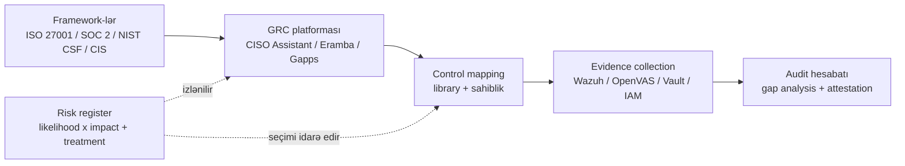

# Açıq Mənbə GRC Vasitələri

Açıq mənbə governance, risk və compliance stack-inə fokuslu səyahət — kiçik təhlükəsizlik komandasının ServiceNow GRC, OneTrust və ya Vanta səviyyəli lisenziya haqqı ödəmədən real ISO 27001, SOC 2 və ya NIS2 proqramı işlətmək üçün istifadə etdiyi platformalar.

## Bu nə üçün önəmlidir

GRC yetkin təhlükəsizlik proqramlarının miqyasda necə işlədiyidir. Risk register şuranın təhdid modelini gördüyü yerdir, control library hər framework tələbinin yaşadığı yerdir, və evidence locker auditorun fieldwork-un birinci günündə açdığı şeydir. Real GRC platforması olmadan, bu üç artefakt bir-biri ilə qarışmış spreadsheet-lər, SharePoint qovluqları və qəbilə yaddaşı düyününə çevrilir — bu beş nəfərdə işləyir, əllidə çətinləşir və beş yüzdə dağılır.

Əksər təşkilatlar üçün sual "GRC vasitəsinə ehtiyacımız varmı" deyil, "kim ödəyəcək"dir. Kommersial ServiceNow GRC, OneTrust, Vanta, Drata, AuditBoard və LogicGate hamısı pilot üçün ucuz başlayır və tez bahalaşır — 200 nəfərlik mühəndis dükanı üçün adi qiymətlər audit-firma inteqrasiyaları, framework əlavələri və ya privacy modulu yığılmadan əvvəl ildə 30k$–150k$ aralığında olur. `example.local` üçün bu xətt elementi junior təhlükəsizlik mühəndisi ilə yarışır.

Kommersial GRC-nin marketing formalı təhrif sahəsi də var. Özlərini "automated compliance" ilə satan vasitələr platformanın etdiyini şişirtməyə və operatorun hələ də etməli olduğunu kiçiltməyə meyllidir. Dürüst oxu budur ki, heç bir GRC vasitəsi — açıq mənbə və ya kommersial — siyasət yazma, access review işlətmə və risk treatment hazırlama insan işini aradan qaldırmır. Onlar spreadsheet overhead-i azaldır, lakin maddi compliance işi insanlara aiddir.

Daha çətin problem lisenziya çeki deyil — lock-in və operativ modeldir. Hər kommersial GRC vasitəsi hər şey üçün system of record olmaq istəyir, məlumatlarını başqa heç kimin oxumadığı formalarda export edir və hər renewal-da ödəməyə davam edəcəyinizi fərz edir. Açıq mənbə GRC lisenziya çekini mühəndis-saatlarına dəyişir, lakin risk register-i, control mapping-ləri və evidence katalogunu oxuya, fork edə və köç edə biləcəyiniz formatlarda saxlayır.

- **GRC vasitəsi olmadan, audit hazırlığı yanğın-məşqidir.** Hər dövr screenshot-lar toplamaq, decommission edilmiş host-lardan log faylları çıxarmaq və email zəncirlərindən access-review tarixini yenidən qurmaq üçün çılğın dörd-həftəlik sprint-dir. GRC vasitəsi ilə, auditor soruşana qədər evidence artıq mövcuddur.
- **Control library olmadan, framework-lər fikirlərə çevrilir.** ISO 27001-də 93 control var, SOC 2-də onlarla kriteriya, NIST CSF 2.0-da altı funksiya və çox subkateqoriya — heç biri bir adamın başında idarə edilməyə tab gətirmir. Control library kanonik "etməyi vəd etdiyimiz şey" qeydidir.
- **Policy lifecycle management olmadan, siyasətlər köhnəlir.** 2022-də yazılmış və heç vaxt nəzərdən keçirilməmiş siyasət siyasətsiz olmaqdan da pisdir, çünki təşkilatın necə işlədiyi haqqında auditora yalan deyir. Lifecycle (sahib, version, son nəzərdən keçirmə, növbəti nəzərdən keçirmə, attestation) siyasətləri cari və etibarlı saxlayan şeydir.
- **Risk register olmadan, risk ən hündür səsin dediyi şeydir.** Yaxşı işlədilən register şuraya kiçik, prioritetləşdirilmiş biznesə real ziyan vura bilən şeylər siyahısı verir — heç kimin oxumadığı 400-sıralı spreadsheet deyil.
- **Açıq mənbə GRC nəhayət 2026-da etibarlıdır.** CISO Assistant CE, Eramba CE, OpenControl və Gapps real icmalarla real platformalardır. Onlar Vanta-nı qutudan çıxan avtomatlaşdırılmış SaaS konnektorları ilə uyğunlaşdırmayacaqlar, lakin SME miqyaslı təşkilatlar üçün maddi GRC işini — register, control-lar, evidence, audit hesabatları — per-user qiymətləndirmə olmadan əhatə edirlər.

Bu səhifə açıq mənbə GRC landşaftını xəritələyir — tam platformalar, kod-əsaslı control sənədləşdirmə və GRC artefaktlarını bu bölmədə başqa yerlərdə təsvir edilən operativ vasitələrə qoşan inteqrasiya pattern-ləri. Eyni proqramı işlətməyin insan tərəfi üçün [Security Controls](../../grc/security-controls.md), [Risk and Privacy](../../grc/risk-and-privacy.md) və [Policies](../../grc/policies.md)-i çapraz istinad edin.

Tənzimləyicilər də bu məqamı yaxalayıblar. ISO 27001:2022 sənədləşdirilmiş risk-treatment prosesi və evidence-əsaslı management review-u açıq şəkildə tələb edir. NIS2 (2024-ün sonundan AB-də qüvvədədir) şura səviyyəli kiber risk məsuliyyətini tətbiq edir ki, bu real risk register-in şura qarşısında olmasından asılıdır. SOC 2 Type 2 fieldwork strukturca tələb əsasında 9–12 aylıq evidence istehsal etmə məşqidir. Bunların heç biri GRC vasitəsi olmadan miqyasda mümkün deyil — sual sadəcə vasitənin açıq mənbə və ya kommersial xətt elementi olmasıdır.

## GRC platforması əslində nə edir

Dashboard-ları çıxarın və GRC platforması bir-birinə bağlı kiçik database dəstidir, üstəgəl onları dürüst saxlayan workflow-lar. Platformanın əslində nə etdiyini bilmək vasitə müqayisəsini daha asanlaşdırır — fərqlərin əksəriyyəti vasitənin bu primitiv-lərdən hansını vurğuladığı haqqındadır.

- **Risk register.** Risk siyahısı (nə səhv ola bilər), hər biri likelihood və impact üzrə qiymətləndirilmiş, adlandırılmış şəxs tərəfindən sahib olunmuş, treatment planı (qəbul et, azalt, ötür, yayın) və review tarixi ilə. Register "dünya" və "control-lar" arasında körpüdür — hər control onun azaltdığı riskə geri izlənməlidir.
- **Control library.** Təşkilatın işlətməyə öhdəlik götürdüyü control-ların kataloqu, qayğı çəkdiyi framework-lərə xəritələnmiş (ISO 27001:2022 Annex A, SOC 2 Trust Services Criteria, NIST CSF 2.0, CIS Controls v8, PCI DSS 4.0, GDPR, HIPAA). Bir control tez-tez bir neçə framework-i təmin edir, bu da xəritələmənin sadalamadan daha vacib olduğunu göstərir.
- **Evidence locker.** Hər control-un işlədiyini sübut edən artefaktlar — Wazuh alert export-ları, Vault audit logları, OpenVAS scan hesabatları, IAM enrolment siyahıları, change-management bilet-ləri, training tamamlanma qeydləri. Locker auditorun fieldwork zamanı keçdiyi yerdir.
- **Audit və gap hesabatları.** "Compliance pozisiyamız indi necə görünür" snapshot-u — hansı control-ların cari evidence-i var, hansılar vaxtı keçib, hansılar xəritələnməyib, hansı risklərin treatment-i yoxdur. Bu CISO-nun şuraya, auditorun isə partner-ə apardığı hesabatdır.
- **Siyasət və prosedur lifecycle.** Faktiki sənədlər (acceptable use, access control, incident response, business continuity) plus ətrafındakı workflow — sahib, version, son review, növbəti review, attestation log. Platforma siyasətləri paylaşılan-qovluqdakı-PDF-lərdən xatırlatmalı izlənən register-ə çevirir.

Bu beş şeyi yaxşı edən GRC platforması təşkilatı "proqram yox"-dan "SOC 2 Type 1 keçən"-ə rahat aparacaq. Etmədiyi şey operativ dissiplindir — kimsə hələ də register-i yeniləməli, evidence toplamalı, access review-ları işlətməli və siyasətləri yazmalıdır. Vasitə spreadsheet ağrısını aradan qaldırır; operatoru əvəz etmir.

İstənilən GRC vasitəsini qiymətləndirərkən faydalı test "bu beş primitiv-in hər biri harada yaşayır və bir-birinə necə istinad edir" sualını verməkdir. Yaxşı platforma cavabı aşkar edir — risk has-many control-lar, control has-many evidence-item-lar, evidence has-many framework-lər. Zəif platforma onları operatorun başında çapraz-istinad saxlamalı olduğu düz əlaqəsiz tab-lar kimi saxlayır. Relational model platformanın birinci dövrdən sonra miqyaslanıb-miqyaslanmadığını müəyyən edən şeydir.

## Stack icmalı

Tam mənzərə xarici framework-lərdən GRC platformasına, sonra evidence təmin edən operativ vasitələrə və geri audit-hesabat artefaktına axınıdır. Risk register paralel işləyir — control seçimini məlumatlandırır lakin ayrı ritmdə yaşayır.

Compliance üçün soldan sağa, risk üçün aşağıdan yuxarı oxuyun. Framework-lər sizə "ağıllı təhlükəsizlik proqramının hansı control-ları işlətdiyini" deyir; GRC platforması bunu sizin control library-nizə çevirir; library hansı evidence toplanacağını müəyyən edir; evidence operativ stack tərəfindən ([SIEM and Monitoring](./siem-and-monitoring.md), [Vulnerability and AppSec](./vulnerability-and-appsec.md), [IAM and MFA](./iam-and-mfa.md)) yaradılır; audit hesabatı dövri snapshot-dur. Risk register yanında oturur, ortoqonal sualı verir "bunlar ilk növbədə işlətməli olduğumuz düzgün control-lardırmı".

İnteqrasiya sərhədi əksər komandanın az qiymətləndirdiyi hissədir. Heç kimin operativ vasitələrə qoşmadığı GRC platforması on səkkiz ayda shelfware olur — hər rüb evidence əllə toplanır, operator yanır və platforma izzətli policy library-yə qayıdır. "Evidence pipeline" pattern-i (sonra əhatə olunur) GRC proqramını birinci audit-dən sonra canlı saxlayan şeydir.

Diaqramı operativ tərəfdən oxumaq da öyrədicidir. Brute-force login üçün işləyən eyni Wazuh detection SOC 2 CC7.2 (system monitoring), ISO 27001 A.8.16 (monitoring activities) və NIST CSF DE.AE (anomalies and events) üçün evidence-dir. Bir operativ artefakt, üç framework control-u — bu da control library-nin framework-lər və evidence arasında normallaşdırılmış təbəqə kimi mövcud olmasının bütün səbəbidir.

## GRC — CISO Assistant (Community Edition)

CISO Assistant CE intuitem tərəfindən Django + SvelteKit stack üzərində qurulmuş modern açıq mənbə GRC platformasıdır. Açıq mənbə GRC məkanında ən güclü "greenfield" seçimidir — cilalanmış UI, qutudan çıxan geniş framework əhatəsi, aktiv icma və Docker-first deployment.

- **Nədir.** Risk management, AppSec, compliance and audit və privacy əhatə edən tam GRC platforması. Framework-lər əvvəlcədən yüklənmiş gəlir — ISO 27001:2022, SOC 2 TSC, NIST CSF 2.0, CIS Controls v8, PCI DSS 4.0, GDPR, HIPAA, NIS2, DORA və regional standartların uzun quyruğu (yazıldığı vaxtda 80-dən çox framework).
- **Modern UI.** SvelteKit front-end təmiz, naviqasiya edilə bilən dizayn ilə — risk register, audit, evidence və policy görünüşləri 2010 enterprise GRC-dən daha çox 2026 proqram təminatına bənzəyir. Auto-mapping xüsusiyyəti bir framework-dəki control-un başqa framework-dəki control-lara necə xəritələndiyini təklif edir, bu da çox manual cross-walking işini aradan qaldırır.
- **Güclü tərəflər.** Geniş framework əhatəsi, multilingual UI, dəqiqələrdə işləyən Docker Compose deploy, inteqrasiya üçün REST API, aktiv saxlama ritmi, GitHub və Discord-da artan icma.
- **Kompromislər.** Bəzi qabaqcıl xüsusiyyətlər (qabaqcıl reporting, müəyyən inteqrasiyalar, premium dəstək) kommersial Enterprise edition-da yaşayır. İcma Eramba-nınkından gəncdir, ona görə forum-larda və Stack Overflow-da daha az uzun-quyruq qəbilə bilik var. CE roadmap tez hərəkət edir, bu xüsusiyyətlər üçün əladır və operatorlar üçün vaxtaşırı sürpriz olur.
- **Nə vaxt seçməli.** Operatorun modern UI, geniş framework əhatəsi və 2008 LAMP tətbiqi kimi hiss olunmayan deployment istədiyi greenfield GRC proqramları. Bu 2026-da sıfırdan başlayan `example.local` formalı təşkilatlar üçün ən güclü "default" tövsiyədir.

Auto-mapping xüsusi diqqətə layiqdir — CISO Assistant-də ISO 27001 və SOC 2 import edəndə, platforma hansı Annex A control-larının hansı TSC kriteriyalarını təmin etdiyini təklif edir, bu adətən çox-həftəlik konsultasiya işidir. Təkliflər mükəmməl deyil, lakin birinci import-da əhəmiyyətli cross-walking vaxtına qənaət edir.

Deployment hekayəsi də açıq mənbə GRC vasitəsi üçün qeyri-adi dərəcədə dostcasınadır. Upstream Compose faylı Postgres-i, backend-i, front-end-i və worker-i bir əmrlə boot edir, development üçün mənalı default-larla və production üçün aydın environment dəyişənləri ilə. Bu tarixən açıq mənbə GRC-ni təsir edən "deploy etdik və iki gündən sonra imtina etdik" uğursuzluq modlarının sinifini aradan qaldırır.

## GRC — Eramba (Community Edition)

Eramba qurulmuş açıq mənbə GRC platformasıdır — uzun tarixçəli, dərin xüsusiyyət dəstli LAMP-stack (PHP + MySQL) tətbiqi və davam edən inkişafı maliyyələşdirən aktiv enterprise tier (Eramba Enterprise). CE on il ərzində de-facto açıq mənbə GRC seçimi olub.

- **Nədir.** Risk assessment, policy review, compliance mapping, audit workflow-ları, awareness proqramları və custom control-lar əhatə edən tam GRC platforması. CE maddi GRC xüsusiyyətlərini ehtiva edir; Enterprise tier qabaqcıl avtomatlaşdırma, əlavə konnektorlar və premium dəstək əlavə edir.
- **Yetkin xüsusiyyət dəsti.** Eramba uzun illər ərzində təkmilləşdirilib və xüsusiyyətlərin dərinliyi (workflow engine, custom report builder, third-party risk modulu, awareness training tracker) bunu əks etdirir. Eramba-nı yaxşı bilən komanda sidecar vasitəyə müraciət etmədən onda əhəmiyyətli compliance proqramı işləyə bilər.
- **Güclü tərəflər.** Dərin xüsusiyyət əhatəsi, qurulmuş icma, yaxşı sənədləşdirilmiş operativ pattern-lər, hər ənənəvi sysadmin-in işlədə biləcəyi proqnozlaşdırılan LAMP deployment-i, Eramba Enterprise vasitəsilə aydın paid-support escalation yolu.
- **Kompromislər.** UI modern olmaqdansa funksionaldır — görünüş və hiss möhkəm enterprise-software-dir, bu bəzi təşkilatlara uyğun gəlir və başqalarını narahat edir. CE Enterprise-da mövcud olan bəzi avtomatlaşdırma xüsusiyyətlərini qəsdən saxlamır (səhv deyil, qəsdən kommersial bölgü). LAMP stack adi lakin CISO Assistant-ın containerized footprint-indən ağırdır.
- **CE vs Enterprise.** Komanda manual workflow əməliyyatı ilə rahatdırsa və paid GRC tooling üçün büdcə sıfırdırsa CE-ni seçin. Avtomatlaşdırma, inteqrasiyalar və dəstəklənən upgrade-lər lisenziya xərcinə dəyirsə Enterprise-ı seçin — adətən GRC proqramı bootstrap fazasından yetkinləşəndə və operator vaxtı bağlayıcı məhdudiyyət olanda.

Eramba-nın əsas gücü uzun müddət bunu etməsidir — workflow-lar, terminologiya və hesabat pattern-ləri onilliklər ərzində toplanmış GRC praktikasını əks etdirir. Ənənəvi IT əməliyyatları və qurulmuş tooling üstünlüyü olan təşkilatlar üçün Eramba CE əla seçim olaraq qalır.

Bilməyə dəyər xüsusi Eramba xüsusiyyəti third-party-risk modulu-dur — hər GRC proqramı sonunda vendor riskini izləməli olur (GDPR-də sub-processor-lar, SOC 2 CC9.2-də prod giriş olan vendor-lar, NIS2-də supply-chain partnyorları) və Eramba-nın third-party modulu əksər digər açıq mənbə vasitənin göndərdiyindən daha qabiliyyətlidir. Vendor management düşüncədən sonra deyil, əsas ehtiyacdırsa, Eramba shortlist-də müvafiq olaraq yuxarı qalxır.

## GRC — OpenGRC / OpenControl

OpenControl fərqli formada vasitədir — UI ilə platforma deyil, version-controlled mətndə təhlükəsizlik control-larını sənədləşdirmək üçün YAML-əsaslı schema. OpenGRC açıq mənbə GRC səylərinin (OpenControl daxil olmaqla) tarixən qruplaşdığı geniş şəmsiyyədir.

- **Nədir.** OpenControl control-ları, onların tətbiq olunduğu sistemləri və onları sübut edən evidence-i təsvir etmək üçün strukturlaşdırılmış YAML formatı müəyyən edir. Çıxış təsvir etdiyi kodun yanında yaşayan Git-native control kataloqudur. Etiket olaraq OpenGRC illər ərzində açıq mənbə GRC təşəbbüslərinin seriyasını əhatə edib.
- **Kod-əsaslı compliance.** Pattern "controls as code"-dur — mühəndislərin tətbiq mənbəyi üçün istifadə etdiyi eyni review, branching və CI workflow control sənədləşdirməsinə tətbiq olunur. Pull request-lər control-ları dəyişir, code review sahibliyi tətbiq edir və CI merge-dən əvvəl YAML-i validate edə bilər.
- **Güclü tərəflər.** Git-native (mükəmməl version tarixi, blame, review), DevSecOps pipeline-ları ilə trivially inteqrasiya, yüngül (işlədilməli database yox), mühəndis-dostu format, təşkilatlar və vasitələr arasında təbii daşına bilən.
- **Kompromislər.** Qeyri-texniki maraqlı tərəflər üçün UI yox — auditor dashboard deyil, YAML görür. Risk register yox, workflow engine yox, fayl strukturunun verdiyindən əlavə evidence locker yox. OpenControl ekosistemi vaxt keçdikcə daraldı çünki fəaliyyət başqa vasitələrə köçdü — standartlaşdırmadan əvvəl cari upstream fəaliyyətini yoxlayın.
- **Nə vaxt seçməli.** Hər şeyi artıq kod kimi (Terraform, Ansible, Kubernetes manifest-ləri) işlədən və compliance artefaktlarının eyni modeldə yaşamasını istəyən mühəndislik-ağır təşkilatlar. Tez-tez tək həll əvəzinə UI-əsaslı vasitə yanında istifadə olunur.

Ümumi pattern mühəndislərin saxladığı texniki-control sənədləşdirməsi üçün OpenControl-stil YAML və qeyri-mühəndislərin işlətdiyi workflow, risk register və policy lifecycle üçün CISO Assistant və ya Eramba instansiyası istifadə etməkdir. İkisi rəqabət əvəzinə bir-birini tamamlayır.

OpenControl-u 2026-da qiymətləndirərkən tarixi kontekst vacibdir. Format gec-2010-ların federal-IT və devsecops icmalarında əhəmiyyətli adopsiya gördü və faydalı pattern olaraq qalır, lakin orijinal OpenControl layihəsi ətrafındakı fəaliyyət soyudu. "Compliance as code in YAML"-i davamlı konsept kimi qəbul edin və konkret tooling-i — OpenControl-un orijinal schema-sı, OSCAL və ya layihə-tərifli YAML — qiymətləndirmə zamanı upstream-in nə etdiyinə əsasən seçin.

## GRC — Gapps

Gapps dostcasına UI-li və SOC 2 ilə xüsusilə güclü başlanğıc halı kimi bir çox framework-ə qarşı compliance progress-ini izləməyə açıq fokuslu yeni Python-əsaslı GRC platformasıdır. Bu səhifədəki dörd vasitənin ən gənci və fast-track compliance işi üçün mövqeləşdirilib.

- **Nədir.** Control tracking, policy management, vendor questionnaires, framework mapping və progress reporting təmin edən Flask-əsaslı tətbiq. Dəstəklənən framework-lər SOC 2, NIST CSF, ISO 27001, HIPAA və başqalarıdır.
- **SOC 2 fast-track.** Gapps-ın control kataloqu və workflow-ları birinci SOC 2 readiness məşqi üçün diqqətəlayiq dərəcədə uyğundur — platforma "kriteriyalara qarşı haradayam" və "hansı evidence çatışmır"ı Eramba-nın daha ağır mərasimi olmadan görmə-yi asanlaşdırır.
- **Güclü tərəflər.** Dostcasına UI, Docker-əsaslı deployment, yüngül Python footprint, vendor-questionnaire xüsusiyyəti açıq mənbə GRC-də nadirdir, birinci compliance proqramını işlədən kiçik komanda üçün yaxşı uyğunluq.
- **Kompromislər.** Layihə statusu tarixən alpha / beta kimi təsvir edilib — standartlaşdırmadan əvvəl cari upstream fəaliyyətini, release ritmini və icma ölçüsünü yoxlayın. CISO Assistant və ya Eramba-dan kiçik icma daha az Stack Overflow korpusu və öyrənilməli daha az reference deployment deməkdir.
- **Nə vaxt seçməli.** Növbəti 6–9 ayda SOC 2 Type 1 üçün gedən, sıfırdan "izlənmiş control pozisiyası"-na ən sürətli mümkün yolu istəyən kiçik, əksəriyyəti mühəndis komanda. Qiymətləndirmə zamanı upstream-in sağlam olduğunu validate edin.

Gapps-ın landşaftda mövqeyi "hələ də real məhsul kimi hiss olunan ən yüngül açıq mənbə GRC platforması"-dır. Əsas GRC ehtiyacı çox-framework operativ modeldən daha çox tək SOC 2 proqramı olan təşkilatlar üçün ağlabatan seçimdir — standart caveat ilə ki, 1.0-dan alpha-ya yaxın layihə statusu öhdəlikdən əvvəl diqqətli qiymətləndirmə tələb etməlidir.

Vendor-questionnaire xüsusiyyəti xüsusi qeydə dəyər. SOC 2 CC9.2 və ISO 27001 A.5.19–A.5.23 təşkilatın vendor təhlükəsizliyini qiymətləndirməsini tələb edir, bu praktikada hər mənalı vendor-a təhlükəsizlik anketi göndərmək (və izləmək) deməkdir. Bunu spreadsheet-də etmək on vendor-dan sonra pis miqyaslanır; Gapps-ın native questionnaire workflow-u onu xatırlatma və cavab tarixi olan izlənən prosesə çevirir.

## GRC — müqayisə cədvəli

| Ölçü | CISO Assistant CE | Eramba CE | OpenControl | Gapps |
|---|---|---|---|---|
| ISO 27001 əhatəsi | Bəli (2022) | Bəli | Manual | Bəli |
| SOC 2 əhatəsi | Bəli | Bəli | Manual | Bəli (fokus sahə) |
| NIST CSF əhatəsi | Bəli (2.0) | Bəli | Manual | Bəli |
| CIS Controls əhatəsi | Bəli (v8) | Bəli | Manual | Qismən |
| PCI DSS əhatəsi | Bəli (4.0) | Bəli | Manual | Məhdud |
| Risk register | Bəli | Bəli | Yox | Bəli |
| Evidence linking | Bəli | Bəli | Fayl-əsaslı | Bəli |
| Audit-hesabat yaradılması | Bəli | Bəli | Yox | Bəli |
| Policy lifecycle | Bəli | Bəli | Fayl-əsaslı | Bəli |
| UI təcrübəsi | Modern (SvelteKit) | Funksional (LAMP) | Yox (YAML) | Dostcasına (Flask) |
| Operator mürəkkəbliyi | Orta | Orta-Yüksək | Aşağı (yalnız mətn) | Aşağı-Orta |
| İcma ölçüsü | Artan | Qurulmuş | Daralan | Kiçik |

Başlıq oxu: CISO Assistant ən güclü modern-default seçimdir, Eramba ən xüsusiyyət-tam qurulmuş seçimdir, OpenControl mühəndis-led code-as-compliance dükanları üçün düzgün cavabdır və Gapps birinci SOC 2-yə ən sürətli yoldur. Bunların heç biri səhv deyil; düzgün olan vasitədən deyil, təşkilatdan asılıdır.

Cədvəldə göstərilməyən sütun — və mübahisəli ən vacib olan — "platformanı ilk dəfə gəzən auditor üçün bu necə görünür"-dur. CISO Assistant və Gapps yaxşı interview keçirir çünki UI modern və özünü-izah edəndir; Eramba auditor onu əvvəl gördükdən sonra yaxşı interview keçirir lakin ilk təmasda köhnəlmiş hiss oluna bilər; OpenControl UI kimi heç interview keçirmir, lakin code-walkthrough formatında çox yaxşı review keçirir. Vasitəni gözlədiyiniz audit söhbəti növü ilə uyğunlaşdırın.

## Vasitə seçimi — hər birini nə vaxt seçməli

Dörd vasitəni qiymətləndirən `example.local` formalı təşkilatlar üçün qısa qərar çərçivəsi.

- **CISO Assistant CE.** Greenfield 2026 proqramı üçün default. Modern UI, geniş framework əhatəsi, aktiv icma, Docker-first deployment, multilingual dəstək. Operator stack-inin qalanına bənzəyən tooling istəyəndə və framework əhatəsi hər hansı tək workflow-un dərinliyindən daha vacib olanda bunu seçin. Komandanın mövcud GRC muscle memory-si yoxdursa və platformanın workflow-u öyrətməsini istəyirsə xüsusilə güclüdür.
- **Eramba CE.** Təşkilatın yetkin, dərin, qurulmuş platformanı qiymətləndirib daha ənənəvi UI ilə rahat olduğu hallar üçün default. Eramba-nın workflow dərinliyi qaytaranda mövcud compliance dissiplini olan təşkilatlar üçün (böyük müəssisələr, tənzimlənən sənayelər) xüsusilə güclü. Büdcə görünərsə Enterprise-a aydın paid escalation yolu.
- **OpenControl / kod-əsaslı.** Compliance artefaktlarının təsvir etdikləri kodun yanında Git-də yaşamasını istəyən mühəndislik-led təşkilatlar üçün düzgün cavab. Tək istifadə əvəzinə tez-tez UI-əsaslı vasitə ilə cütləşdirilir. "Compliance dəyişikliklərini pull request vasitəsilə review et" maraq deyil, xüsusiyyət olduqda bunu seçin.
- **Gapps.** Kiçik komanda üçün SOC 2 Type 1-ə ən sürətli yol. Dostcasına UI, Python footprint, vendor-questionnaire dəstəyi. Əsas ehtiyac çox-framework operativ modeldən daha çox tək SOC 2 proqramı olduqda bunu seçin — və qiymətləndirmə zamanı layihə statusunu validate edin.

`example.local` üçün ağlabatan hibrid "platforma üçün CISO Assistant CE, texniki-control sənədləşdirmə üçün infrastruktur repo-da OpenControl-stil YAML və policy library üçün [Policies](../../grc/policies.md) dərsinin şablonları"-dır. Üç artefakt üç yerdə yaşayır lakin bir-birinə təmiz istinad edir və hər biri işlədilməsi ən asan olan yerdə yaşayır.

Hansı vasitə qalib gəlirsə gəlsin, ən vacib qərar "kim bunu çərşənbə axşamı saat 10-da sahib olur"-dur. Org chart-da adlandırılmış operatoru olmayan GRC platforması proqram təminatı nə qədər yaxşı olursa olsun, çürüyəcək. Lisenziyadan əvvəl rolu büdcələyin — yarım-zaman GRC operatoru (tez-tez təhlükəsizlik lead-i ilə cütləşdirilir) sağ qalan proqram və shelfware olan vasitə arasındakı fərqdir.

## GRC-ni stack-in qalanı ilə inteqrasiya etmək

GRC platformasını davamlı edən pattern "evidence pipeline"-dır — operativ vasitələrdən GRC platformasının evidence locker-ına avtomatlaşdırılmış və ya yarı-avtomatlaşdırılmış axınlar, beləcə auditor tələbi artıq mövcud olan artefaktlara enir.

- **SIEM evidence.** Wazuh alert export-ları, log retention hesabatları və detection-rule əhatəsi ISO 27001 A.8.16 (monitoring), SOC 2 CC7 (system monitoring) və NIST CSF DE.CM-ə xəritələnir. Müvafiq control-lar üçün GRC evidence qovluğuna "alerts triaged" və "log retention proof" aylıq export planlaşdırın.
- **Vulnerability evidence.** OpenVAS / Greenbone scan hesabatları, patch-cycle metrikləri və remediation taymingləri ISO 27001 A.8.8 (technical vulnerability management), SOC 2 CC7.1 və PCI DSS 11.3-ə xəritələnir. Evidence hesabat plus remediation göstərən bilet tarixçəsidir.
- **IAM evidence.** Keycloak / Authentik-in "MFA aktiv olan istifadəçilər", "privileged-role üzvlüyü" və "tamamlanmış access review-lar" export-ları ISO 27001 A.5.16, A.5.17, A.5.18 və SOC 2 CC6.1, CC6.2, CC6.3-ə xəritələnir. Rüblük access-review sübutu ən çox tələb olunan audit artefaktlarından biridir.
- **Secrets / PAM evidence.** Vault audit logları, Teleport sessiya çəkilişləri və Vaultwarden access logları ISO 27001 A.5.17, A.8.5 və SOC 2 CC6.1, CC6.6-ya xəritələnir. "Mənə production dəyişikliyinin çəkilişini göstər" auditor sualı bir-link cavab olur.
- **Backup və DR evidence.** Restore-test nəticələri, RTO/RPO ölçmələri və offsite-copy yoxlaması ISO 27001 A.8.13, SOC 2 A1.2, A1.3 və CIS Control 11-ə xəritələnir. Restore-test export-larını birbaşa GRC evidence qovluğuna planlaşdırın.
- **Change-management evidence.** Pull-request təsdiq qeydləri, release-tag tarixçəsi və change-advisory-board qeydləri ISO 27001 A.8.32, SOC 2 CC8.1 və ITIL change-management praktikasına xəritələnir. Əksər komandanın artıq bu Git-də və ticketing-də var — GRC platformasına yalnız link lazımdır.
- **Training və awareness evidence.** Phishing-simulation nəticələri, security-awareness tamamlanma dərəcələri və onboarding-training logları ISO 27001 A.6.3 və SOC 2 CC1.4-ə xəritələnir. Əksər LMS platformaları bunu CSV kimi export edə bilər — export-u digərləri ilə eyni şəkildə planlaşdırın.

Pattern bütün beş inteqrasiyada eynidir — operativ vasitə artefakt (export, hesabat, log) istehsal edir, artefakt proqnozlaşdırılan adla təyin edilmiş yerə yazılır və GRC platforması onu API vasitəsilə qəbul edir və ya evidence locker-də linklə bağlayır. Export-u edən cron job "yaşayan GRC proqramı" və "birinci audit-dən sonra ölən GRC proqramı" arasındakı fərqdir.

Evidence pipeline üçün faydalı dizayn qaydası "auditora heç vaxt shell access lazım olmamalı"-dır. Hər artefakt GRC platformasından klik vasitəsilə əldə edilə bilməlidir — istər inline link kimi, istər əlavə fayl kimi. Evidence tələbinə cavab "icazə ver SSH ilə girim və loglara grep edim"-dirsə, pipeline pozulub; növbəti on-call adam o grep-i necə işlədəcəyini bilməyəcək və auditor proqramda inamı itirəcək.

## Praktiki məşq

`example.local` üçün homelab və ya sandbox-da bunu konkret etmək üçün beş məşq.

1. **CISO Assistant CE-ni Docker-də deploy edin və ISO 27001 import edin.** Upstream `compose.yaml`-a qarşı `docker compose up -d` işlədin, login edin, `example.local` təşkilatını yaradın və paketlənmiş framework kataloqundan ISO 27001:2022 control library-ni import edin. Annex A-nı keçin və hər control-un control-owner sahəsi, status və evidence-ə link olduğunu təsdiqləyin.
2. **10 risk ilə risk register qurun.** CISO Assistant və ya Eramba-da `example.local` üçün on risk yaradın (ransomware, insider abuse, vendor breach, MFA bypass, müddəti bitmiş TLS, prod data leak, DDoS, itirilmiş laptop, phishing, regulatory penalty), hər birini likelihood (1–5) və impact (1–5) üzrə qiymətləndirin, sahib təyin edin və treatment planı qurun. Register-i PDF kimi export edin və şura-hazır sənəd kimi oxunduğunu təsdiqləyin.
3. **CIS control-u Wazuh detection rule-na evidence kimi xəritələyin.** CIS Control 8 (Audit Log Management) seçin. GRC platformasında o control-a Wazuh detection-rule export-u və 30-günlük alert xülasəsi evidence kimi əlavə edin. Növbəti auditor "biz bu control-u işlədir və burada sübut" görə bilsin deyə əlaqəni sənədləşdirin.
4. **Eramba-dan SOC 2 readiness hesabatı yaradın.** SOC 2 TSC-ni Eramba CE-yə import edin, hər kriteriyanın statusunu işarələyin (in place / partial / not in place), gap hesabatını yaradın və üst 5 boşluğu müəyyən edin. Hər boşluğu sahib və hədəf tarixi ilə Jira-stil bilet-ə çevirin.
5. **example.local-un bir control-unu OpenControl YAML-də sənədləşdirin.** "MFA bütün administrative access üçün tələb olunur" control-unu təsvir edən YAML faylı yazın — control-id, framework xəritələmələri (ISO A.5.17, SOC 2 CC6.1, NIST IA-2), implementation narrative, evidence göstəricisi (Keycloak export script-inə link) və review ritmi ilə. Onu Git repo-ya commit edin və pull request açın.

Beş məşqdən sonra öyrənən import-frameworks loop, risk-register workflow, evidence-linking pattern, gap-report dövrü və controls-as-code pattern ilə rahat olmalıdır. Bu beş qabiliyyət açıq mənbə GRC operatorunun həftə-həftə etdiyinin təxminən 80%-ni əhatə edir.

Bunlar yerində oturduqdan sonra faydalı altıncı məşq: GRC platformasının OIDC client-ini mövcud Keycloak-a ([IAM and MFA](./iam-and-mfa.md) dərsindən) qoşun, beləcə GRC login-i stack-in qalanı ilə eyni SSO + MFA istifadə etsin. Plumbing iki ekran konfiqurasiyadır, lakin "GRC vasitəsində shadow-account" risk sinifini aradan qaldırır və auditora "control library-ni kim redaktə edə bilər" üçün təmiz cavab verir.

## İşlənmiş misal

`example.local` ilk SOC 2 Type I audit-i üçün hazırlaşan 200 nəfərlik mühəndis təşkilatıdır. Compliance lead-in "GRC platforması yox"-dan "auditor-hazır"-a getmək üçün altı ayı var və kommersial GRC üçün büdcə sıfırdır. Build CISO Assistant CE-ni record platforma kimi istifadə edir.

- **Platform deployment.** Mövcud reverse proxy arxasında kiçik VM-də tək CISO Assistant CE instansiyası, mövcud Keycloak vasitəsilə OIDC SSO, off-site bucket-ə günlük şifrələnmiş database backup-ları, aylıq restore-test yoxlaması. Cəm stand-up vaxtı: bir mühəndis-həftə.
- **Framework import.** SOC 2 Trust Services Criteria (minimum Security, Availability, Confidentiality) CISO Assistant framework kataloqundan import edilib. Hər kriteriya mövcud təhlükəsizlik və mühəndislik komandasından sahib alır. ISO 27001:2022 yan-yana import edilib, auto-mapping hər TSC kriteriyasını təmin edən Annex A control-larını təklif edir — birinci dövrdə əhəmiyyətli cross-walking səyinə qənaət edir.
- **Risk register.** Birinci ayda iyirmi risk tutulub, 5x5 likelihood/impact matrisində qiymətləndirilib, hər biri sahib və treatment planı ilə. Üst beş (ransomware, prod data leak, itirilmiş laptop, vendor breach, MFA bypass) rüblük review ritmi ilə açıq şura diqqəti alır.
- **Evidence collection.** Wazuh alert export-ları, Vault audit logları, OpenVAS scan hesabatları, Keycloak MFA-enrolment siyahısı, Teleport sessiya-çəkiliş nümunələri və change-management bilet export-u GRC evidence qovluğuna həftəlik yazmaq üçün planlaşdırılıb. Hər control müvafiq evidence-inə işarə edir, beləcə auditor kriteriyadan artefakta iki klikdə izləyə bilər.
- **Gap hesabatı və remediation.** İkinci aydakı ilk yaradılmış gap hesabatı 27 qismən-və-ya-itirilmiş control-u qeyd edir. Komanda boşluqlarda üç ay işləyir — əksəriyyəti sənədləşdirmə boşluqlarıdır (yazılı siyasət yox, review ritmi yox), texniki boşluqlar deyil. Beşinci ayda gap hesabatı audit pəncərəsi içində hədəf tarixləri olan üç açıq elementi göstərir.
- **Auditor walkthrough.** Auditor gələndə, CISO Assistant-də SOC 2 TSC görünüşü gündəlik olur. Hər kriteriyanın sahibi, statusu, evidence linkləri və control narrative-i var. Auditorun ənənəvi "mənə 200 evidence tələbi göndər" PDF-i "bu linkləri klik edin"-ə çevrilir — audit fieldwork dörd həftədən iki həftəyə daralır.
- **Type II hazırlığı.** Type I əldə olduqdan sonra, eyni platforma Type II observation period-i üçün əsas olur. Type I zamanı "aylıq export" olan evidence pipeline-ları Type II üçün "retention ilə həftəlik export"-a sıxılır və gap-report ritmi aylıqdan iki həftəliyə keçir. Type I-də platform investisiyası Type II ilində iki dəfə qaytarır.

Vanta və ya Drata abunəliyi plus auditor-firma konsultasiyası üçün əvvəlki gözlənilən xərc birinci il üçün təxminən 60k$ idi. Açıq mənbə yenidən qurulması təxminən 4k$ compute və build və audit-ə qaçışda təxminən iki mühəndis-ay xərclədi. Audit özü Type I təmiz fikir kimi uğur qazandı və təşkilatın indi sonrakı Type II pəncərəsi üçün real record platforması var.

Qeyri-maliyyə qələbələri mübahisəli daha böyükdür. Risk register heç kimin açmadığı sənəd əvəzinə real şura iclaslarında nəzərdən keçirilir. Control library hər yeni mühəndisə "burada nə etməyimiz tələb olunur" üçün aydın cavab verir. Evidence pipeline GRC proqramını auditor gedən an spreadsheet-lərə geri çürümək əvəzinə birinci audit-dən sonra canlı saxlayır.

İncə lakin vacib ikinci-dərəcəli effekt yenidən qurulmasının stack-in qalanı haqqında nəyi açıqladığıdır. `example.local` ilk dəfə SOC 2 evidence-i üçün "MFA aktiv olan bütün istifadəçilər siyahısı" toplamağa çalışanda, üç SaaS tətbiqini Keycloak-a heç vaxt qoşulmamış və heç kimin izah edə bilmədiyi admin-formalı service account-u açıqladı. Bu məsələlərin heç biri GRC layihəsi tərəfindən törədilməyib — onlar artıq oradaydı — lakin GRC layihəsi onları görünən etdi və düzəltmələrini məcbur etdi. O pattern (compliance işi gigiyena üçün məcburiyyət funksiyası kimi) hər audit dövründə təkrarlanır.

## Troubleshooting və tələlər

Açıq mənbə GRC layihəsini "qələbə"-dən "shelfware"-ə çevirən uğursuzluq modlarının qısa siyahısı. Bunların əksəriyyəti yeni deyil — kommersial GRC vasitələrinin də vurduğu eyni pattern-lərdir — lakin açıq mənbə stack onları daha tez ortaya çıxarmağa meyllidir, çünki sizin adınızdan kobud kənarları örtən managed-service komandası yoxdur.

- **Operator prosesi olmayan GRC vasitələri shelfware olur.** Ən ümumi uşaqsızlıq modu "Eramba-nı deploy etdik və indi heç kim onu yeniləmir"-dir. GRC vasitəsi system of record-dur, sehrli compliance maşını deyil — kimsə register-i, control-ları və evidence-i təyin edilmiş ritmdə sahib olmalıdır. O sahib olmadan, vasitə çürüyür və növbəti audit spreadsheet-lərə qayıdır.
- **"PDF screenshot kimi evidence" anti-pattern-i.** Rüblük bir dəfə çəkilmiş dashboard-ların PDF-ləri evidence-in ən aşağı-dəyər formasıdır — onlar control-un işlədiyini deyil, screenshot çəkdiyinizi sübut edir. Mümkün olduğu yerdə evidence auditor spot-check edə bilən export edilə bilən, təkrarlanan artefakt (MFA-enrolled istifadəçilərin CSV-si, access review-ların JSON dump-u) olmalıdır.
- **Framework-version drift.** ISO 27001:2022 Annex A strukturunda ISO 27001:2013-dən maddi olaraq fərqlidir. NIST CSF 2.0 CSF 1.1 üzərinə yeni Govern funksiyası əlavə etdi. SOC 2 TSC dövri olaraq nəzərdən keçirilir. Səhv framework versiyası ilə yüklənmiş GRC vasitəsi köhnəlmiş standarta qarşı inamlı görünən hesabatlar istehsal edir. Import-da framework versiyasını yoxlayın və hər illik review-da yenidən təsdiqləyin.
- **Heç kimin yeniləmədiyi risk register.** Bir dəfə import edilmiş və heç vaxt yenidən baxılmamış register heç register olmamasından da pisdir, çünki şuraya yalan deyir. Rüblük register-review-u operativ review-larla eyni prioritetlə CISO təqviminə qurun — və ölü riskləri aqressiv prune edin.
- **CISO Assistant upgrade yolları.** CISO Assistant CE tez hərəkət edir və upgrade-lər vaxtaşırı data miqrasiyaları və ya konfiqurasiya dəyişiklikləri tələb edir. Hər upgrade-dən əvvəl upstream release qeydlərini oxuyun, upgrade-ləri əvvəlcə staging instansiyada işlədin və tətbiqdən əvvəl database-i backup edin.
- **Eramba CE/Enterprise upgrade və lisenziya keçidləri.** Eramba CE və Eramba Enterprise arasında köç (hər iki istiqamətdə) idarə edilə bilən lakin trivial olmayan miqrasiyadır. Keçid pəncərəsini planlaşdırın, staging-də data export/import dövrünü validate edin və standartlaşdırmadan əvvəl lisenziya şərtlərini təsdiqləyin.
- **Auto-mapping başlanğıc nöqtəsidir, cavab deyil.** CISO Assistant "Annex A.5.17 SOC 2 CC6.1-i təmin edir" təklif edəndə, bunu draft kimi qəbul edin. Bəzi xəritələmələr həqiqətən 1:1-dir, çoxu qismən və bir neçəsi səhvdir. İnsan compliance lead auditor gəlmədən əvvəl xəritələməni nəzərdən keçirməlidir.
- **Smart quote-larla pozulmuş Mermaid diaqramları.** Bu stack-də GRC diaqramları düz ASCII bracket-lər və arrow-lar fərz edir. Söz prosessorundan smart quote-lar, em-dash-lər və ya non-breaking space-lər yapışdırmaq render-i sakitcə pozacaq. GRC diaqramlarını doc tool-da deyil, kod redaktorunda redaktə edin.
- **GRC vasitəsini policy library ilə qarışdırmaq.** GRC vasitəsi siyasətlərin lifecycle-ını izləyir (sahib, version, review tarixi) lakin nadir hallarda uzun-formalı policy mətnini layihələndirmək üçün ən yaxşı yerdir. Çox komandalar siyasətləri wiki və ya sənəd vasitəsində yazır və sonra təsdiqlənmiş PDF-i GRC platformasına əlavə edir. GRC platformasını Word-əvəzedicisi kimi istifadə etməyə çalışmaq friction reseptidir.
- **GRC platformasının özü üçün backup və DR.** GRC database risk register, control library və evidence kataloqu saxlayır — onu itirmək aylıq-yenidən-qurulma hadisəsidir. Günlük şifrələnmiş backup-lar, off-site storage, rüblük restore test-ləri. GRC platforması production database-ləri ilə eyni DR sərtliyinə layiqdir.
- **Bir auditorun üstünlüklərinə over-fitting.** Müxtəlif audit firmaları evidence-i müxtəlif formalarda istəyirlər. Evidence pipeline-ı cari auditor-un sevdiyi konkret PDF şablonu ətrafında deyil, framework və control ətrafında qurun — yoxsa növbəti il auditor dəyişikliyi tam re-tooling hadisəsidir.
- **CE-nin Enterprise-dən downgrade kimi hiss olunmasına icazə vermək.** Eramba CE və ya CISO Assistant CE qiymətləndirərkən, onları Enterprise xüsusiyyət siyahısına qarşı ölçməyin — onları əvəz etdikləri spreadsheet-ə qarşı ölçün. Dürüst baseline "CE indi sahib olduğumuzdan daha yaxşıdır"-dır ki, demək olar ki, həmişə bəlidir.

## Əsas çıxarışlar

Bu fəsildən xatırlanmalı başlıq nöqtələri, handover və ya təkrar üçün konsentrə edilib.

- **GRC vasitələri yetkin proqramların miqyasda necə işlədiyidir.** Spreadsheet-lər beş nəfərdə işləyir, əllidə çətinləşir və beş yüzdə dağılır. Real GRC platforması "biz compliance edirik"-dən "biz compliance proqramı işlədirik"-ə körpüdür.
- **CISO Assistant CE ən güclü 2026 default-udur.** Modern UI, geniş framework əhatəsi, aktiv icma, Docker-first deployment. Başqa yerə getmək üçün konkret səbəb yoxdursa greenfield proqramları üçün bunu seçin.
- **Eramba CE dərin-xüsusiyyət establishment seçimi olaraq qalır.** Yetkin, tam, aydın paid escalation yolu ilə. Ənənəvi GRC dərinliyi UI modernliyindən daha vacib olduqda bunu seçin.
- **OpenControl-stil YAML kod-led dükanlar üçün düzgün cavabdır.** Compliance-as-code Git-də yaşayır, pull request vasitəsilə review keçirir, mühəndislik workflow-unun qalanı ilə inteqrasiya edir. Tək istifadə əvəzinə tez-tez UI vasitəsi ilə cütləşdirilir.
- **Gapps tək framework-u tez bitirməli kiçik komandalar** üçün fast-track SOC 2 platformasıdır. Standartlaşdırmadan əvvəl qiymətləndirmə zamanı layihə sağlamlığını validate edin.
- **Evidence pipeline GRC-ni canlı saxlayan şeydir.** Operativ vasitələr (Wazuh, OpenVAS, Vault, Keycloak, Teleport) GRC platformasına təyin edilmiş ritmdə evidence istehsal etməlidirlər — pipeline olmadan, platforma birinci audit-dən sonra çürüyür.
- **Risk register və control library fərqli artefaktlardır.** Register "nə səhv ola bilər" sualını verir; library "etməyi vəd etdiyimiz nədir" sualını verir. Onlar bağlanırlar lakin fərqli ritmlərdə yaşayırlar və fərqli sualları cavablayırlar.
- **Auto-mapping başlanğıc nöqtəsidir.** ISO control-larını SOC 2 kriteriyalarına avtomatik xəritələyən vasitələr real vaxta qənaət edir, lakin xəritələmə auditor görmədən əvvəl insan-baxılmalıdır.
- **Framework-version drift üçün planlaşdırın.** ISO 27001:2022, NIST CSF 2.0 və SOC 2 TSC nəzərdən keçirmələrinin hamısı vacibdir. Import-da düzgün versiyanı təsdiqləyin və illik yenidən təsdiqləyin.
- **GRC-ni layihə kimi deyil, məhsul kimi qəbul edin.** Birinci rüb install-dur; hər sonrakı rüb riskləri yenilədir, evidence təzələyir, gap hesabatını işlədir və siyasətləri nəzərdən keçirir. Yalnız build sprint üçün deyil, davam edən operator vaxtı üçün büdcə qurun.
- **GRC login-i SSO stack-in qalanı ilə federate edin.** CISO Assistant, Eramba və ya Gapps-ı mövcud Keycloak / Authentik-ə qoşun ki, leaver-in identity-si beş yerdən deyil, bir yerdən silinsin. GRC vasitəsində shadow-account-lar sakit lakin real riskdir — auditorun onları görməsi daha pisdir.
- **İnteqrasiya işini erkən edin.** Operativ evidence pipeline-ları (Wazuh, OpenVAS, Vault, Keycloak, Teleport GRC evidence locker-ə) GRC platformasının özündən daha çox vaxt qurmaq tələb edir. İnteqrasiya scaffolding-i altıncı ayda deyil, ikinci həftədə başladın.
- **CE-ni Enterprise-dən dürüst ayırın.** Eramba CE və CISO Assistant CE real məhsullardır, lakin heç biri Enterprise qardaşı ilə eyni deyil. Standartlaşdırmadan əvvəl xüsusiyyət-müqayisə səhifəsini oxuyun və boşluqların növbəti 24 ay üçün — növbəti 5 il üçün deyil — vacib olub-olmadığına qərar verin.
- **Control library dönmə nöqtəsidir.** Hər digər GRC artefaktı (risk register, evidence locker, audit hesabatı, policy attestation-ları) control library-dən asılıdır. Library-ni düzgün edin — sahiblər, framework xəritələmələri, status — və platformanın qalanı yerinə düşür. Səhv edin və hər hesabat çaşdırır.
- **Auditor-lar mükəmməllik deyil, təkrarlanma haqqında qayğı çəkir.** Qeyri-müntəzəm mükəmməl evidence-i olan control-dan qeyri-mükəmməl-lakin-müntəzəm evidence-i olan control üstünlük təşkil edir. GRC vasitəsinin əsas işi evidence ritmini görünən etməkdir — nə vaxt nə toplandı, nə qaçırıldı, nə vaxtı keçib.

## İstinadlar

Bu fəsli dəstəkləyən satıcı və standart istinadları — stack-i dizayn və ya işlədərkən bunları əlinizdə saxlayın.

- [CISO Assistant — intuitem/ciso-assistant-community](https://github.com/intuitem/ciso-assistant-community)
- [Eramba — eramba.org](https://www.eramba.org)
- [OpenControl — open-control.org](https://open-control.org)
- [Gapps — github.com/bmarsh9/gapps](https://github.com/bmarsh9/gapps)
- [ISO/IEC 27001:2022 — Information security management systems](https://www.iso.org/standard/27001)
- [NIST Cybersecurity Framework 2.0](https://www.nist.gov/cyberframework)
- [AICPA SOC 2 — Trust Services Criteria](https://www.aicpa-cima.com/topic/audit-assurance/audit-and-assurance-greater-than-soc-2)
- [CIS Controls v8 — Center for Internet Security](https://www.cisecurity.org/controls/v8)
- [PCI DSS v4.0 — Payment Card Industry Data Security Standard](https://www.pcisecuritystandards.org/document_library/)
- [ENISA NIS2 Directive guidance](https://www.enisa.europa.eu/topics/nis-directive)
- [OSCAL — NIST Open Security Controls Assessment Language](https://pages.nist.gov/OSCAL/)
- [GDPR — General Data Protection Regulation full text](https://gdpr-info.eu)
- [HIPAA Security Rule overview](https://www.hhs.gov/hipaa/for-professionals/security/index.html)
- [SAMA Cyber Security Framework](https://www.sama.gov.sa)
- [DORA — Digital Operational Resilience Act](https://www.eiopa.europa.eu/digital-operational-resilience-act-dora_en)
- [OWASP SAMM — Software Assurance Maturity Model](https://owaspsamm.org)
- [ISACA COBIT — Control Objectives for Information Technology](https://www.isaca.org/resources/cobit)
- [Cloud Security Alliance — CCM (Cloud Controls Matrix)](https://cloudsecurityalliance.org/research/cloud-controls-matrix)
- Əlaqəli dərslər: [Açıq Mənbə Stack İcmalı](./overview.md) · [SIEM və Monitoring](./siem-and-monitoring.md) · [Vulnerability və AppSec](./vulnerability-and-appsec.md) · [IAM və MFA](./iam-and-mfa.md) · [Security Controls](../../grc/security-controls.md) · [Risk və Privacy](../../grc/risk-and-privacy.md) · [Policies](../../grc/policies.md)
