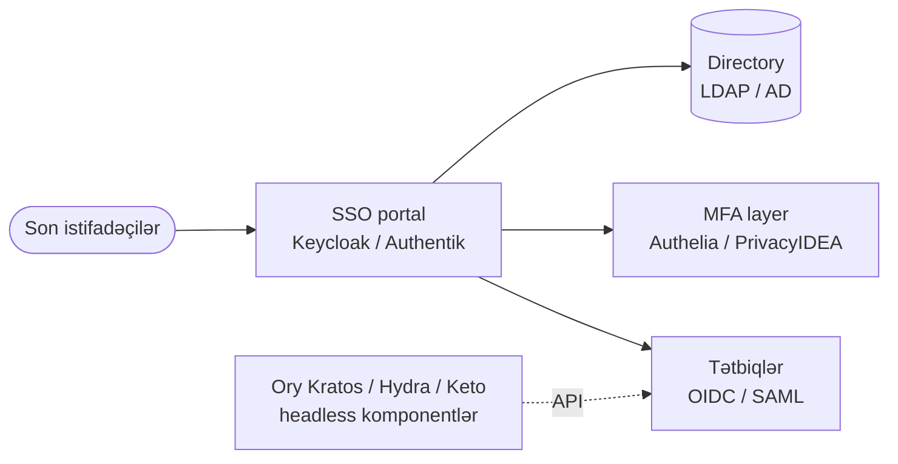

# Açıq Mənbə IAM və MFA

Açıq mənbə identity və access management stack-inə fokuslu səyahət — kiçik komandanın Okta və ya Auth0-ı altı rəqəmli çek yazmadan əvəz etməsinə imkan verən SSO portalları, identity broker-ləri və MFA front-end-ləri.

## Bu nə üçün önəmlidir

Identity hər bir digər nəzarətin əsasıdır. Firewall qaydası, S3 bucket siyasəti, Kubernetes RBAC binding-i — hamısı "bu prinsipal kimdir və nə edə bilər" sualına qayıdır. IAM-ı səhv edin və qalan təhlükəsizlik stack-ı dekorativdir; düzgün edin və tək hesabın söndürülməsi bütün sistemləri eyni anda bağlayır.

Əksər təşkilatlar üçün sual "SSO və MFA-ya ehtiyacımız varmı" deyil, "kim ödəyir"dir. Kommersial Okta, Auth0, Ping və Microsoft Entra P2 ucuz başlayır və tez bahalaşır — adi qiymətlər 500 yerlik təşkilatı MFA əlavələri, lifecycle əlavələri və ya directory premium tier-ə qədər ildə 30k$ ilə 120k$ arasında qoyur. `example.local` üçün — düz IT büdcəsi olan 200 nəfərlik mühəndis dükanı — bu real rəqəmdir və hardansa headcount-dan çıxmalıdır.

Daha çətin problem lisenziya xərci deyil — lock-in-dir. Hər kommersial IdP ixracatı ağrılı edir, hər custom claim mapper bir-istiqamətli qapıdır və hər "qabaqcıl" xüsusiyyət bir SKU upgrade-i arxasında yaşayır. Açıq mənbə IAM lisenziya çekini mühəndis-saatlarına dəyişir, lakin lock-in-i də oxuya, fork edə və köçürə biləcəyiniz stack-a dəyişir.

- **SSO olmadan password-reset masası şirkəti idarə edir.** Hər tətbiqin öz credential store-u var, hər işçi rübdə ən az bir şifrəni unudur və helpdesk heç vaxt mövcud olmamalı reset-lərə saatlar yandırır. "SSO yoxdur"un iqtisadi xərci helpdesk biletlərində və shadow-IT hesab artımında gizlənir.
- **MFA olmadan credential phishing qalib gəlir.** Tək başına username/password 2026-da authentication deyil — bu məlum-pozulmuş nəzarətdir. Hər audit framework (PCI DSS 4, ISO 27001, NIST 800-63B) indi imtiyazlı və ya uzaq giriş üçün MFA-nı məcburi edir və hadisə hesabatları MFA-nın istifadəçilərə ildə bir neçə dəqiqə dəyərinin hadisə-cavab saatlarını yüzlərlə geri qaytardığını sübut edir.
- **Açıq mənbə IAM döyüşdə sınanmışdır.** Keycloak Red Hat, NASA və Fortune 500 deployment-lərinin uzun quyruğu üçün identity işlədir. Authentik, Authelia və Ory stack minlərlə təşkilat üçün production identity-ni gücləndirir. Bunlar eksperimental layihələr deyil — sabit release-ləri, aktiv maintainer-ləri və böyük operator icmaları olan yetkin alternativlərdir.
- **Kompromis operator səyidir.** Bazanı işlədirsiniz, JVM-i patch edirsiniz, OIDC scope uyğunsuzluğunu özünüz debug edirsiniz. Komandanız bu işi görəcəksə, kommersial IdP-lərə qarşı qənaət böyük və davamlıdır. Görməyəcəksə, Okta-ya ödəmək dürüst cavabdır.

IAM layihəsi həm də çoxlu tarixi gigiyena məsələlərini üzə çıxarır — heç kimin söndürmədiyi yetim hesablar, production-da "sadəcə işləyən" paylaşılan credential-lar, tam-güclü admin-ə çevrilən MFA-istisna service hesabları və heç kimin bilmədiyi SaaS tətbiqləri. Real IdP-yə miqrasiya çox vaxt 200 nəfərlik təşkilatın kimə nəyə girişi olduğuna dair dürüst inventarlamasının ilk dəfə baş verdiyi vaxtdır ki bu yeni MFA siyasəti gəlmədən əvvəl də əhəmiyyətli təhlükəsizlik qələbəsidir.

Tənzimləyicilər də bu məqamda yetişiblər. ISO 27001:2022 nəzarəti A.5.17, NIST 800-53 IA-2 və SAMA Cyber Security Framework hamısı açıq şəkildə mərkəzləşdirilmiş identity, imtiyazlı giriş üçün MFA və auditə uyğun hesab lifecycle-ı tələb edir. Bu səhifədəki açıq mənbə stack hər birini ödəyir — sizin üçün etmədiyi prosedur tərəfdir (giriş baxışları, joiner-mover-leaver workflow, dövri yenidən sertifikasiya) ki bu hələ də təşkilatın insan tərəfi ilə dizayn edilməli və idarə edilməlidir.

Bu səhifə açıq mənbə IAM landşaftını — tam identity provider-lər, MFA front-end-lər, federation pattern-ləri — xəritələyir və `example.local`-un onları necə tək koherent stack-a yığacağını göstərir.

## IAM stack icmalı

Müasir açıq mənbə IAM deployment-i nadir hallarda tək məhsuldur. Son istifadəçilər SSO portalında authenticate olur, portal OIDC və ya SAML vasitəsilə tətbiqlərə broker edir, MFA layer ikinci faktoru tətbiq edir və backend directory mənbə-həqiqət identity-lərini saxlayır. Ory komponentləri product komandası bundle UI-siz identity primitive-lərini istədikdə headless API kimi qoşulur.

Diaqramı nəzarət müstəvisi kimi oxuyun, deployment topologiyası kimi yox. Keycloak və Authentik tam SSO portallarıdır — onlar login UI-ı və protokol endpoint-lərini sahiblənir və adətən istifadəçi bazasını da sahiblənir (və ya LDAP/AD-dən federate edir). Authelia və PrivacyIDEA digər sistemlərin qarşısında MFA addımını əlavə edir və ya əvəz edir; Authelia sorğu yolunda forward-auth gate kimi oturur, PrivacyIDEA isə IdP-nin arxasında token backend kimi oturur. Ory Kratos və Hydra birlikdə identity və OIDC-ni əhatə edir, lakin login UI-ı özünüz yazmağı gözləyin. Oxlar authentication və authorisation çağırışlarını təmsil edir — praktikada hər xətt HTTPS plus session cookie plus sağlam doza TLS chain validasiyasıdır.

Ən çox görəcəyiniz iki protokol **OpenID Connect (OIDC)** və **SAML 2.0**-dır. OIDC yeni veb və mobil tətbiqlər üçün müasir defolt-dur — JSON HTTPS üzərindədir, token decoder ilə debug etmək asandır və hər dildə təmiz library dəstəyi var. SAML enterprise SaaS-ə hakim olan köhnə standartdır — Salesforce, Workday və əksər köhnə on-prem süitlər onu doğma danışır. Hər ciddi açıq mənbə IdP hər ikisini dəstəkləyir, çünki real-dünya tətbiq kataloqunu qoşduğunuz an hər ikisinə ehtiyacınız olacaq.

Bilməyə dəyər üçüncü protokol **SCIM 2.0**-dır cross-domain istifadəçi provisioning üçün. SCIM "IdP-də istifadəçi yaradın və onların Slack, GitHub və Salesforce-da avtomatik görünməsini" custom sync skriptləri yazmadan mümkün edir. Keycloak SCIM-i extension vasitəsilə göndərir; Authentik onu doğma dəstəkləyir; kommersial IdP-lər onu premium xüsusiyyət kimi satır. Bir neçədən artıq inteqrasiya edilmiş SaaS tətbiqi olan hər təşkilat üçün SCIM provisioning-i miqyasla və offboarding-də daimi geridə qalmaq arasındakı fərqdir.

## Identity provider — Keycloak

Keycloak de-facto açıq mənbə enterprise IdP-dir. İlkin olaraq Red Hat tərəfindən qurulub və indi Cloud Native Computing landşaftının bir hissəsi kimi CNCF altında idarə olunur, o, SSO, identity brokering, user federation və MFA-nı tək web məhsuluna bundle edən Java tətbiqidir (v17-dən bəri Quarkus əsaslı). Red Hat-ın öz SaaS portfelinin identity-ni gücləndirir və operator mürəkkəbliyinin tam xüsusiyyət əhatəsinə kompromis məna kəsb etdiyi tənzimlənmiş mühitlərdə geniş şəkildə yerləşdirilir.

- **Protokollar.** OpenID Connect 1.0, OAuth 2.0, SAML 2.0, plus REST admin API. SCIM 2.0 user provisioning extension vasitəsilə mövcuddur. Token exchange (RFC 8693), CIBA və device authorisation grant son versiyalarda dəstəklənir.
- **Identity mənbələri.** Doğma istifadəçi bazası (PostgreSQL, MariaDB və s.), LDAP və Active Directory federation (oxu/yaz attribute mapping ilə) və upstream IdP-lərə identity brokering (Microsoft Entra, Google, GitHub, hər OIDC/SAML provider). Custom user storage SPI-lər istifadəçi store-unu Java üçün yaza bildiyiniz hər şeylə dəstəkləməyə imkan verir.
- **MFA daxili.** TOTP, WebAuthn (FIDO2 təhlükəsizlik açarları və platforma authenticator-ları) və recovery code-lar — hamısı per-realm conditional flow-larla konfiqurasiya edilə bilər. Flow editor MFA-nı bəzi client-lər üçün məcburi, başqaları üçün opsional etməyə və `acr_values` vasitəsilə step-up auth-u tetikləməyə imkan verir.
- **Güclü tərəflər.** Yetkin, geniş yerləşdirilmiş, böyük inteqrasiya və Helm chart ekosistemi, tam admin UI plus CLI (`kcadm.sh`), realm-səviyyəli multi-tenancy, SPI və tema vasitəsilə dərin customisation.
- **Kompromislər.** Java/Quarkus footprint ağırdır (real deployment üçün minimum 1–2 GB RAM), admin UI funksionaldır lakin gözəl deyil və əsas versiya yüksəltmələri — xüsusilə 17-də Wildfly-dan-Quarkus-a miqrasiyası — tarixən diqqətli planlaşdırma və downtime tələb edib.

Realm modeli erkən anlamaq üçün açar konsepsiyadır. Hər realm təcrid edilmiş identity tenant-dır — öz istifadəçiləri, öz client-ləri, öz authentication flow-ları, öz MFA siyasəti. Əksər tək-təşkilat deployment-ləri işçilər üçün bir realm və yalnız Keycloak administratorları üçün ayrılmış ayrıca `master` realm ilə bitir. Multi-tenant SaaS deployment-ləri tək cluster-də paylaşılan tema və per-tenant konfiqurasiya ilə yüzlərlə realm işlədə bilər.

Keycloak-ın clustering hekayəsi production-da önəmlidir. O, paylanmış cache-lər (session-lar, login cəhdləri, realm metadata) üçün Infinispan istifadə edir və davamlı state üçün xarici relational database gözləyir. Yük balansının arxasında PostgreSQL streaming replication ilə iki-node cluster ağıllı baseline-dır; sticky session-lar son versiyalardan etibarən artıq tələb olunmur, lakin cache topologiyası hələ də düşünülmüş Helm chart ölçüləndirməsini mükafatlandırır.

Theming Keycloak-ın sakit super-gücüdür. Login səhifələri, account console və email template-lər hamısı theme-lənə bilər — qalan korporativ veb mülkün üslubuna uyğun brendlənmiş login təcrübəsi göndərə bilərsiniz ki bu Keycloak-ı son istifadəçilərə daha az "açıq mənbə kompromisi" və daha çox "birinci dərəcəli identity məhsulu" kimi hiss etdirir. Tema həm də əksər peşəkar Keycloak deployment-lərinin defolt template-lərə daxil olan "powered by Keycloak" footer-ini gizlətdiyi yerdir.

Keycloak admin REST API-ı da automasiya üçün yadda saxlamağa dəyər. UI-da hər hərəkət HTTP çağırışı kimi əlçatandır ki bu realm export-ları, istifadəçi toplu əməliyyatlar və provisioning workflow-larının hamısının CI və ya Ansible-dan skript edilə bilməsi deməkdir. Bir neçə komanda indi realm export JSON-unu IAM üçün infrastruktur-kimi-kod artefaktı kimi qəbul edir və dəyişiklikləri tətbiq etməzdən əvvəl pull request vasitəsilə nəzərdən keçirir.

SSO + brokering + MFA-nı qutudan kənar bir məhsulda istəyən təşkilat üçün Keycloak defolt açıq mənbə cavabıdır.

## Identity provider — Authentik

Authentik Keycloak-ın müasir UI-first alternatividir — cilalı admin interface və flow-əsaslı authentication modeli olan Python/Django tətbiqi. Keycloak-dan gəncdir (2018-də başlanıb) lakin admin təcrübəsi və sürətli quraşdırmanın ən dərin inteqrasiya əhatəsindən üstün olduğu self-hosted icmalarda və SMB deployment-lərində əhəmiyyətli sürət qazanıb.

- **Protokollar.** OAuth 2.0, OpenID Connect, SAML 2.0, LDAP (server və client), SCIM, plus forward-auth use case-ləri üçün daxili proxy provider ki ona ikinci komponent olmadan eyni Authelia-üslublu sahəni əhatə etməyə imkan verir.
- **Flows modeli.** Authentication, enrollment, recovery və authorisation hamısı konfiqurasiya edilə bilən "flow"lar kimi ifadə olunur — vizual olaraq yenidən sıralaya biləcəyiniz mərhələ zəncirləri (identification, password, MFA, consent və s.). Bu Java olmayan komandalar üçün Keycloak-ın authentication SPI-sından dramatik şəkildə daha əlçatandır və "admin qrupu üçün WebAuthn tələb et, hər kəs üçün yalnız parol" beş dəqiqəlik dəyişiklik edir.
- **MFA daxili.** TOTP, WebAuthn, SMS, email, Duo, statik kodlar — hamısı ağıllı default template-lərlə flow stage kimi qoşulub.
- **Güclü tərəflər.** Müasir UI, ağıllı default-lar, yaxşı Docker/Helm hekayəsi, aktiv icma, OIDC olmayan tətbiqləri qorumaq üçün daxili reverse-proxy rejimi, deployment-i sadələşdirən tək-binary outpost worker-ləri.
- **Kompromislər.** Keycloak-dan kiçik ekosistem, daha az enterprise federation hook-u və flows modeli — güclü olsa da — siyasətlər qeyri-trivial olduqda öz öyrənmə əyri var.

Anlamaq üçün "outpost" konsepsiyası dəyərlidir. Outpost Authentik-in başqa xidmətin yanında yerləşdirdiyi kiçik worker prosesidir — OIDC olmayan tətbiqin qarşısında reverse-proxy outpost, Authentik directory-ni LDAP server kimi açıqlayan LDAP outpost, VPN inteqrasiyası üçün RADIUS outpost. Outpost-lar mərkəzi Authentik server-ə websocket vasitəsilə geri danışır və bir Authentik install-a ayrı komponent əlavə etmədən bir çox inteqrasiya pattern-ini əhatə etməyə imkan verir.

Authentik-in "blueprints" xüsusiyyəti konfiqurasiyanın yalnız admin UI-da deyil, version control-dakı YAML faylları kimi yaşamasına imkan verir. Bu identity konfiqurasiyalarını qalan infrastrukturları ilə yanaşı code-review etmək istəyən komandalar üçün həqiqi üstünlükdür — provider tərifləri, application binding-ləri, qrup mapping-ləri və flow-lar hamısı YAML-da bəyan edilə və başlanğıcda avtomatik tətbiq oluna bilər ki bu bazada click-ops-dan daha təmiz disaster recovery və mühit promotion edir.

Keycloak-a qarşı faydalı müqayisə nöqtəsi: Authentik admin UI-da daha cəld hiss olunur, daha yumşaq başlanğıc öyrənmə əyrisinə malikdir və daha qısa "ilk işləyən inteqrasiya" cədvəlləri istehsal edir. Keycloak uzun quyruqda qalib gəlir — qaranlıq SAML edge case-ləri, Java SPI-lər vasitəsilə daha dərin customisation və icma-saxlanılan adapter-lərin sırf eni. Əksər təşkilatlar üçün hər iki alət işi görəcək; seçim çox vaxt komandanın mövcud dil üstünlüklərinə və müasir UX-i bundle edilmiş CNCF yetkinliyindən nə qədər qiymətləndirdiyinə bağlıdır.

UI və operator təcrübəsinin protokol əhatəsi qədər önəmli olduğu greenfield deployment üçün Authentik Keycloak-a ən güclü açıq mənbə rəqibidir.

## Identity provider — Ory Stack (Kratos, Hydra, Keto)

Ory fərqli formada layihədir: tək bundle məhsul əvəzinə, custom IAM platformasına yığılan headless, tək-məqsədli Go xidmətləri ailəsini göndərir. Kompromis aydındır — öz login UI-nızı və inteqrasiya tutkalını yazırsınız, lakin stack-ə forma verə və bundle portalla mübarizə etmədən üzərində iterasiya edə biləcəyiniz microservices-dostu toolkit alırsınız.

- **Ory Kratos.** Identity management — registration, login, password reset, profile management, MFA enrollment. Saf REST API; login UI sizin probleminizdir (Ory Node-da reference UI göndərir, lakin production komandaları adətən öz əsas tətbiqinin framework-undə öz UI-ını yazır).
- **Ory Hydra.** OAuth 2.0 və OpenID Connect provider. Hydra token-ları buraxır və protokolu işlədir; özü istifadəçiləri authenticate etmir — consent və login challenge endpoint-ləri vasitəsilə qoşduğunuz Kratos və ya hər hansı digər login sisteminə delegate edir.
- **Ory Keto.** Google-un Zanzibar paper-ından ilhamlanan icazə və əlaqə-tuple xidməti. İncə-dənəli authorisation-u ("istifadəçi X-in sənəd Y-də editor rolu var") miqyasda modelləşdirir, Zanzibar-ın öncülük etdiyi eyni tuple-store + check-API pattern ilə.
- **Nə vaxt seçmək.** IAM primitive-lərini xidmətlər kimi istəyən SaaS və ya platforma qurursunuz, mühəndislik komandanız Go və REST-də rahatdır və tam customise edə bilməyəcəyiniz bundle UI ilə mübarizə etmək istəmirsiniz. Ory identity *məhsulun bir hissəsi* olduqda, daxili IT funksiyası deyil, parlayır.
- **Nə vaxt qaçmaq.** "Quraşdıra biləcəyimiz SSO portal" axtaran kiçik IT komandasısınız — Ory bitmiş məhsul istədiyinizdə hissələr kit kimi hiss olunacaq və ilk işləyən login-ə vaxt saatlarla deyil həftələrlə ölçülür.

Keto-nun Zanzibar-dan ilhamlanan dizaynı ən fərqli hissədir. Əksər authorisation sistemləri "bu istifadəçinin hansı rolu var" soruşduğu yerdə, Keto açıq əlaqə tuple-larını saxlayır ("user:alice doc:report-2026-nın editor-udur") və icazə yoxlamalarına qrafı gəzərək cavab verir. Bu model milyardlarla əlaqəyə miqyaslanır və klassik RBAC-da ifadə etmək çətin olan dolayı authorisation-u ("ana qovluq Z-də Y rolu olan X qrupundakı hər kəs") dəstəkləyir.

Manşet üçlüyündən kənarda olsalar da, iki digər Ory komponenti də qeyd etməyə dəyər. **Ory Oathkeeper** identity-bilən reverse proxy-dir ki giriş qərarlarını edge-də tətbiq edir — onu Authelia-nın forward-auth pattern-inin Ory analoqu kimi düşünün. **Ory Hive** və müxtəlif developer-fokuslu SDK-lar SaaS məhsuluna identity quran komandalar üçün səth sahəsini tamamlayır. Bunların heç biri əsas deployment üçün tələb olunmur, lakin tam Ory-əsaslı arxitektura dizayn edərkən bilməyə dəyər.

Ory layihəsinin kommersial sustainability hekayəsi də diqqətə layiqdir. Ory open-core şirkətdir — komponentlər Apache 2.0 və self-hostable-dir, lakin production üçün tövsiyə olunan yol Ory Network, hosted kommersial xidmətdir. Bu özlüyündə problem deyil, lakin yeni xüsusiyyətlərin cilasının əvvəlcə Ory Network-də enməsi və self-hosted yolun geri qalması mənasını verir. Uzun-müddətli planlaşdırma üçün, qabaqcadan Ory-ni self-host etməyə commit edib-etməyəcəyinizi və ya Ory Network-ü real hədəfiniz kimi qəbul edib-etməyəcəyinizi qərar verin.

Ory həmçinin Ory Network-ü hosted kommersial təklif olaraq təklif edir ki bu stack-i sıfırdan self-host etməkdən daha hamar başlanğıc ola bilər — bir-günlük əməliyyat yükü olmadan arxitekturanı istəyən komandalar üçün yaxşı "indi al, sonra self-host" yolu.

## Keycloak vs Authentik vs Ory — müqayisə

| Ölçü | Keycloak | Authentik | Ory Stack |
|---|---|---|---|
| Arxitektura | Monolit (Java/Quarkus) | Monolit (Python/Django) | Microservices (Go) |
| Bundle UI | Bəli (admin + login) | Bəli (admin + login) | Yox — özünüz gətirin |
| OIDC + SAML | Hər ikisi | Hər ikisi | OIDC (Hydra), SAML add-on vasitəsilə |
| Identity brokering | Güclü | Güclü | Kratos hook-ları vasitəsilə |
| MFA daxili | TOTP, WebAuthn, recovery | TOTP, WebAuthn, SMS, Duo | Kratos vasitəsilə |
| Resource footprint | Ağır (1–2 GB RAM+) | Orta (~512 MB) | Per service yüngül |
| Operator mürəkkəbliyi | Orta | Aşağı–Orta | Yüksək |
| Üçün ən yaxşı | Enterprise SSO, brokering | Greenfield + UX-həssas | Microservices platformaları |

Əksər `example.local`-formalı təşkilatlar üçün seçim Keycloak-a (ən yetkin və geniş dəstəklənən variant istəyirsinizsə) və ya Authentik-ə (daha dost admin təcrübəsi istəyirsinizsə) yığılır. Ory mövcud tətbiq kataloqu üçün SSO qaldıran IT şöbələri üçün deyil, identity-ni məhsula quran komandalar üçün bilərəkdən seçimdir.

Faydalı sanity yoxlama: əgər IdP işlədən komanda eyni komandadırsa, tətbiqlər qurursa, Ory məqbuldur. IdP işlədən komanda IT və ya platforma komandasıdırsa və tətbiqlər ayrıca alınır və ya işlədilirsə, Keycloak və ya Authentik düzgün formadır — bundle UI, bundle admin alətləri, bundle MFA, hamısı kod yazmadan ops-a görünən.

İkinci faydalı müqayisə: birinci gündə nə qədər customisation-a ehtiyacınız olduğunu düşünməyiniz əvəzinə əslində nə qədər ehtiyacınız olacaq? Əksər təşkilatlar unikal authentication flow-larına olan ehtiyaclarını dramatik şəkildə şişirdir və IdP-də custom kod saxlamağın xərcini dramatik şəkildə qiymətləndirmir. Keycloak və ya Authentik-də defolt flow-lar 90% halı həll edir; defolt-larda real divara çatana qədər fork etmə cazibəsinə müqavimət göstərin.

## MFA — Authelia

Authelia **forward-auth** pattern-i vasitəsilə nginx və ya Traefik-in qarşısında oturmaq üçün dizayn edilmiş yüngül authentication və authorisation portalıdır. O, YAML faylı ilə konfiqurasiya edilən tək Go binary-dir və OIDC və ya SAML-ı doğma dəstəkləməyən daxili Docker-əsaslı veb tətbiqləri kolleksiyasının qarşısında MFA qoymaq üçün açıq-aydın ən asan yoldur. Bütün məhsul lazım gəlsə Raspberry Pi-yə rahatlıqla sığır.

- **Pattern.** Reverse proxy hər gələn sorğunu Authelia-nın `/api/verify` endpoint-inə yönləndirir; Authelia session cookie-ni və siyasəti yoxlayır, 200 və ya 401 qaytarır və proxy sorğunu buraxır və ya login portalına yönləndirir. Bu hər HTTP-xidmət edilən tətbiqi tətbiqin özünə toxunmadan "MFA-qorunan" edir.
- **MFA dəstəyi.** TOTP, WebAuthn (FIDO2), Duo push, plus aşağı-həssaslı giriş tier-ləri üçün yalnız-parol. Per-domain giriş qaydaları MFA-tələb olunan və yalnız-parol marşrutlarını tək siyasət faylında qarışdırmağa imkan verir.
- **Identity backend-ləri.** Yerli YAML/SQL istifadəçi faylı və ya LDAP/AD — LDAP inteqrasiyası real Active Directory-ə qarşı production-da istifadə etmək üçün kifayət qədər möhkəmdir.
- **Güclü tərəflər.** Kiçik footprint, əla Docker/Compose hekayəsi, ağıllı default-lar, əksər homelab-lar və kiçik dükanlardakı mövcud reverse-proxy stack-ı ilə yaxşı oynayır, oxumaq və düşünmək asandır.
- **Kompromislər.** Tam IdP deyil — SAML yoxdur, məhdud OIDC issuer dəstəyi (son versiyalarda əlavə edilib lakin Keycloak-dan daha az yetkin), session-cookie SSO tək domain root-a scoped-dir və YAML konfiqurasiyası siyasətlər zənginləşdikdə tez böyüyür.

Forward-auth pattern-inin özü ümumiyyətlə bilməyə dəyər — həm nginx (`auth_request` direktivi) həm də Traefik (`forwardAuth` middleware) onu tətbiq edir və bir neçə digər alət (Authentik-in outpost-u, oauth2-proxy, vouch-proxy) eyni formanı istifadə edir. "Proxy hər sorğunu icazə verib-verməyəcəyini xarici xidmətdən soruşur"u anladığınızda, tətbiqləri dəyişmədən tətbiqi dəyişdirə bilərsiniz.

Real OIDC inteqrasiyası ilə müqayisədə kompromis observability-dir. Forward-auth gate URL-i və istifadəçini görür lakin tətbiqin istifadəçi anlayışını yox — tətbiq layerinde single sign-on yoxdur, ona görə tətbiq hələ də hər sorğunu anonim kimi qəbul edir. Daxili admin UI-lar üçün bu yaxşıdır; tətbiq daxilində per-user audit log lazım olan hər şey üçün, real OIDC inteqrasiyası düzgün cavabdır.

Authelia tam Keycloak cluster qaldırmadan daxili admin UI-lar (Grafana, Jellyfin, Nextcloud, Portainer və s.) filosuna MFA + SSO əlavə etmək istədiyinizdə düzgün seçimdir.

## MFA — PrivacyIDEA

PrivacyIDEA hərtərəfli token management server-dir — özünün IdP olmaqdan çox *token lifecycle*-a fokuslanan Python/Flask tətbiqi. Authentication-u ayrı narahatlıq kimi qəbul edir və adətən başqa front-end-ə (FreeRADIUS, Keycloak, SAML provider) ikinci-faktor backend kimi qoşulur. Onu RSA SecurID və ya Duo administration console-un açıq mənbə ekvivalenti kimi düşünün.

- **Token əhatəsi.** TOTP, HOTP, WebAuthn/FIDO2, YubiKey (çoxsaylı rejimlər — OTP, HMAC, FIDO2), smartcard, SMS və email OTP, kağız TAN-lar, push token-lar, U2F, plus bir neçə hardware vendor protokolları üçün inteqrasiyalar. Az məhsul bu eninə uyğundur.
- **Use case-lər.** Hardware-token-ağır mühitlər — hökumət, səhiyyə, maliyyə — burada YubiKey-lər, smartcard-lar və ya köhnə OTP cihazları əsas ikinci faktordur və audit hekayəsi daxili arxitektura baxışını deyil tənzimləyicini razı salmalıdır.
- **İnteqrasiyalar.** FreeRADIUS plugin, Keycloak provider extension, SAML, LDAP proxy, custom tətbiqlər üçün REST API. Xüsusilə FreeRADIUS yolu PrivacyIDEA-nı "VPN-də MFA" və ya "SSH bastion-da MFA" üçün standart cavaba çevirir.
- **Güclü tərəflər.** Sinifin ən yaxşı token tipi əhatəsi, yetkin audit log-ları, compliance-ağır deployment-lər üçün dizayn edilib, help-desk rolları üçün dənəli RBAC (məsələn, "bu dəstək agenti itirilmiş tokeni unbind edə bilər lakin yeni token enrol edə bilməz").
- **Kompromislər.** Authelia-dan əməliyyat üçün ağırdır, Authentik-dən az cilalı UI və tək başına olmaqdan çox ayrı IdP ilə cütləşdiriləndə daha faydalıdır.

Real auditlərdə PrivacyIDEA-nı fərqləndirən token lifecycle xüsusiyyətləridir. Hər tokenin enrolment tarixi, sahibi, hər authentication cəhdinin audit izi, revocation tarixçəsi və opsional bitmə tarixi var. Help-desk işçiləri tokeni itirilmiş kimi qeyd edə (backup-a keçirilir), uğursuz-cəhd sayğaclarını sıfırlaya və hardware token-ları audit zəncirini düşürmədən istifadəçilər arasında yenidən təyin edə bilər. Tənzimlənmiş mühitlərin ehtiyac duyduğu və Authelia-nın YAML fayllarının təmin etmədiyi bu səviyyə əməliyyat möhkəmliyidir.

PrivacyIDEA həmçinin **siyasətləri** birinci-dərəcəli konsept kimi dəstəkləyir — "bütün mühəndislər 30 gün ərzində ən az bir FIDO2 token enrol etməlidir", "heç bir tokenin lockout-dan əvvəl 5-dən çox ardıcıl uğursuz cəhdi ola bilməz" və ya "help-desk rolu maliyyə OU-su üçün token-ları unbind edə bilər lakin yeni enrol edə bilməz" kimi şeyləri deyən deklarativ qaydalar. Siyasətlər hər API çağırışında qiymətləndirilir və özləri auditə uyğundur ki bu sizə tətbiq konfiqurasiya faylları arasında dağıtmadan təhlükəsizlik komandasının niyyətini kodlaşdırmaq üçün təmiz yer verir.

İnteqrasiya hekayəsi production-da önəmlidir. PrivacyIDEA ən çox FreeRADIUS üçün ikinci-faktor backend kimi (sonra VPN-lər, SSH bastion-lar və şəbəkə cihazı login-lərini fronted edir) və qalan SaaS stack-i üçün Keycloak provider extension kimi yerləşdirilir. Bu ikili deployment tək token enrolment-in həm şəbəkə həm də tətbiq layeri əhatə etməsi mənasını verir — mühəndis VPN-ə, GitLab-a və cloud console-a authenticate olmaq üçün eyni YubiKey-ə ehtiyac duyduqda real əməliyyat sadələşdirməsi.

PrivacyIDEA "biz çoxlu tətbiqlər boyunca 200 YubiKey və bir neçə yüz smartcard enrol etməliyik" əslində tələb olduqda cavabdır.

## MFA — Keycloak-ın daxili MFA

Keycloak-ın authentication flow-ları onu öz haqqında səlahiyyətli MFA provider edir — əksər təşkilatlar üçün daxili MFA kifayətdir və arxitektura diaqramında ayrı token server ehtiyacını aradan qaldırır.

- **Token tipləri.** TOTP (Google Authenticator, Authy və s.), WebAuthn (FIDO2 təhlükəsizlik açarları və Touch ID/Windows Hello kimi platforma authenticator-ları) və enrolment zamanı çap edilən recovery code-lar.
- **Şərti MFA.** Authentication flow-ları yalnız xüsusi client-lər, IP aralıqları, istifadəçi qrupları və ya risk siqnalları üçün MFA tələb etməyə imkan verir — məsələn, "admin-lər üçün həmişə MFA, hər kəs üçün şəbəkə-dışı MFA, qrupdan asılı olmayaraq Salesforce client üçün həmişə MFA". Şərtlər yığılır və sırada icra olunur ki bu güclüdür lakin oxumaq üçün bir az təcrübə tələb edir.
- **Step-up authentication.** OIDC `acr_values` yüksək-həssaslıqlı tətbiqə mövcud session daxilində belə tələb əsasında daha güclü authentication tier istəməyə imkan verir — "wiki üçün session-uzun, production deploy-lar üçün yenidən soruşma"nı iki ayrı IdP olmadan mümkün edən pattern.
- **Niyə tez-tez kifayət.** İşçi qüvvəsi üçün TOTP + mühəndislər və admin-lər üçün WebAuthn kombinasiyası əksər təşkilatlar üçün real təhdid modelini əhatə edir. PrivacyIDEA-ya yalnız geniş token kataloquna (smartcard, push token, vendor OTP cihazları) həqiqətən ehtiyacınız olduqda müraciət edin.

WebAuthn xüsusi qeydə layiqdir. O, hardware-dəstəkli authentication üçün FIDO2 web standartdır və TOTP-dan dramatik şəkildə daha phishing-müqavimətlidir — TOTP kodu 30 saniyəlik pəncərəsi içində phishing saytına relay edilə bilər, lakin WebAuthn assertion origin-ə bağlıdır və yanlış domen-ə qarşı authenticate olmaqdan imtina edir. Hər müasir brauzer və hər son əməliyyat sistemi onu dəstəkləyir və Keycloak-ın WebAuthn flow-u YubiKey və ya Touch ID-ilə təchiz edilmiş Mac-ə malik istifadəçi üçün enrolment-i tək kliklə edir.

Recovery code-lar sevilməyən lakin əsas təhlükəsizlik şəbəkəsidir. Hər TOTP və WebAuthn enrolment-i istifadəçiyə fallback ikinci faktor kimi işləyən kiçik bir-dəfəlik recovery code dəsti verməlidir — onları çap edin, password manager-də saxlayın və həssas qəbul edin. Recovery code-lar olmadan, itirilmiş YubiKey help-desk biletinə və əl ilə identity-sübut hadisəsinə çevrilir; onlarla istifadəçi dəqiqələr içində geri girir və help-desk yalnız code dəstini yenidən buraxmalıdır.

İkinci backup faktoru recovery hekayəsinin digər yarısıdır. Düzgün pattern "istifadəçi başına iki YubiKey, hər ikisi enrol edilmiş, biri daşınan və biri evdə saxlanılan"dır — daşınan açarı itirmək narahatedicidir lakin maneə deyil, çünki saxlanılan açar hələ də işləyir və istifadəçi öz tempində dəyişdirmə enrol edə bilər. Bunda qənaətcil olun və ilk itirilmiş açar on-call IT mühəndisi üçün cümə-axşamı pager hadisəsinə çevrilir.

Əgər artıq IdP-niz kimi Keycloak seçmisinizsə, doğma MFA ilə başlayın və yalnız token tələbləri Keycloak-ın göndərdiyini aşdıqda PrivacyIDEA-nı yuxarıdan layer edin.

## Federation və brokering

Kiçik və orta-ölçülü təşkilatlarda ən yayğın açıq mənbə IAM pattern-i "Keycloak yeganə directory kimi" deyil — bu **Keycloak broker kimi** upstream identity mənbəsinin qarşısındadır. Bu pattern o qədər yayğındır ki öz bölməsinə layiqdir.

- **Niyə broker.** Mövcud işçiləriniz artıq Microsoft Entra, Google Workspace və ya on-prem AD-də yaşayır. İkinci həqiqət mənbəsi istəmirsiniz — Entra-nı doğma danışmayan və ya Entra inteqrasiyası əlavə lisenziya tier-i tələb edən bütün açıq mənbə tətbiqlərinə federate olunmuş bir identity istəyirsiniz.
- **Necə işləyir.** Keycloak (və ya Authentik) OIDC/SAML identity broker kimi konfiqurasiya olunur. Son istifadəçilər Keycloak login səhifəsində "Sign in with Entra"-ya klik edir; Keycloak onları upstream IdP-yə yönləndirir, assertion-u qəbul edir, claim-ləri normallaşdırır və sonra downstream tətbiqlərə öz OIDC/SAML token-larını buraxır. Tətbiqin perspektivindən bu bir IdP — Keycloak — ilə danışır, upstream haqqında heç vaxt bilmədən.
- **Nə qazanırsınız.** Protokol tərcümə layeri (Entra SAML və OIDC danışır; bir çox açıq mənbə tətbiq yalnız birini və ya yalnız OIDC-ni quirks ilə danışır), yeni tətbiqlər üçün tək inteqrasiya nöqtəsi, əlavə MFA və ya attribute mapping üçün layer edəcək yer və təmiz audit sərhədi. SSO kataloquna yeni SaaS əlavə etmək Entra-admin biletindənsə yalnız-Keycloak dəyişikliyinə çevrilir.
- **Nə verirsiniz.** Hər login flow-da kiçik əlavə hop və monitor etmək üçün bir şey daha — lakin hər yeni tətbiqdə inteqrasiya xərc qənaəti dəyər və broker upstream IdP-nin təmin etdiyinin üzərinə əlavə MFA tətbiq etmək üçün təbii yerə çevrilir.

Bilməyə dəyər praktik incəlik: Keycloak upstream IdP-yə broker etdikdə, upstream session cookie və Keycloak session cookie müstəqildir. Entra-dan çıxan istifadəçi avtomatik Keycloak-dan çıxmır və əksinə. Single logout-u (SLO) diqqətlə konfiqurasiya edin — həm SAML SLO həm də OIDC back-channel logout praktikada qəribədir və bir çox komanda praktik kompromis kimi daha qısa Keycloak session-larıyla bitir.

Attribute mapping komandaları gec dişləyən digər federation incəliyidir. Upstream IdP bir claim adlar dəstini istifadəçi edir (`upn`, `oid`, Entra-dan `groups`; `email_verified` və Google Workspace-dən müxtəlif Google extension-ları), və downstream tətbiqlər digərini gözləyir (OIDC normalarına görə `email`, `preferred_username`, `roles`). Keycloak-ın protocol mapper-ləri ikisi arasında tərcümə edir, lakin mapping per-broker və per-client konfiqurasiya edilməlidir — bu sehrli deyil və mapping olunmamış claim buraxılmış token-da sadəcə boş dəyərdir.

Group-claim idarəsi xüsusi qayğıya layiqdir. Əksər tətbiqlər authorisation-ı group claim-dən idarə edir, lakin upstream IdP-nin grup təmsilatı (Entra-da object ID-lər, AD-də tam DN-lər, Google-da sadə string-lər) tətbiqin istədiyi formata nadir hallarda uyğundur. Broker-də transformasiya addımı planlaşdırın — DN-ləri qısa adlara düzəldin, Entra group display adlarını axtarın və ya upstream qruplarını downstream rollarının kuratorluq edilmiş dəstinə xəritələyin — və SSO kataloqunda "kim nə görə bilər" üçün həqiqət mənbəsi kimi sənədləşdirin.

Bu pattern o qədər yayğındır ki "Keycloak Microsoft Entra üçün broker kimi" Microsoft 365-də artıq olan təşkilatlar üçün effektiv olaraq defolt açıq mənbə IAM dizaynıdır.

## Alət seçimi — müqayisə cədvəli

| Ehtiyac | Seçim | Qeydlər |
|---|---|---|
| Tam enterprise IAM SSO + brokering ilə | Keycloak | Defolt açıq mənbə IdP; ən geniş inteqrasiya dəstəyi |
| Greenfield + əla admin UX | Authentik | Müasir UI, flow-əsaslı konfiqurasiya, daha asan öyrənmə əyrisi |
| Microservices məhsul üçün identity primitive-ləri | Ory Kratos + Hydra + Keto | Headless, Go, API-first |
| Docker-əsaslı admin UI-lar qarşısında MFA | Authelia | nginx/Traefik ilə forward-auth, kiçik footprint |
| Hardware-token-ağır MFA (YubiKey, smartcard) | PrivacyIDEA | Ən geniş token kataloqu, compliance-dostu |
| Mövcud Keycloak üçün sadə TOTP/WebAuthn | Keycloak daxili MFA | Əlavə komponent lazım deyil |
| Microsoft Entra-nı açıq mənbə tətbiqlərinə broker etmək | Keycloak (və ya Authentik) | Dominant federation pattern |

Alətləri qarışdırmaqda utanc yoxdur — `example.local` IdP kimi Keycloak plus hardware token üçün PrivacyIDEA plus bir neçə legacy admin UI üçün Authelia işlədirəcək. Bu açıq mənbə IAM stack-inin normal formasıdır. Səhv tək məhsulu seçib hər işi pis görmək üçün əymədir, halbuki iki tamamlayıcı məhsul hər işi yaxşı görəcəkdi.

Rollout-u qəsdən sıralayın. Birinci faza IdP-nin özüdür kiçik daxili tətbiqlər pilot qrupu ilə; ikinci faza OIDC inteqrasiyasını SaaS kataloqu boyunca uzadır; üçüncü faza MFA tətbiqini əlavə edir, admin-lərdən başlayaraq və müəyyən pəncərə ərzində ümumi işçilərə keçərək; dördüncü faza hardware token-lar, step-up authentication və upstream IdP-lərə federation ilə möhkəmləndirir. Hər dörd fazanı birinci gündə çatdırmağa cəhd etmək açıq mənbə IAM layihələrinin dayandığı ən yayğın səbəbdir.

İnsan tərəfi üçün əlavə zaman buraxın. 200 mühəndisə YubiKey enrol etməyi söyləmək, help-desk-i yeni self-service flow-larında öyrətmək və "açarınız itərsə nə edəcəyiniz" runbook-u yazmaq texniki quraşdırmadan daha uzun çəkəcək. Texniki axın yanında ünsiyyət və təlim axını planlaşdırın və ilk all-hands MFA elanı əvvəl sənədlər və screencast tutorial-lar hazır olmağa çalışın.

## Hands-on / praktika

`example.local` üçün homelab və ya sandbox-da bunu konkretləşdirmək üçün beş məşq.

1. **Keycloak-ı Docker-də deploy edin və realm yaradın.** `docker run -p 8080:8080 -e KEYCLOAK_ADMIN=admin -e KEYCLOAK_ADMIN_PASSWORD=admin quay.io/keycloak/keycloak:latest start-dev` icra edin, admin console-a daxil olun, `example-local` realm yaradın, parolla test istifadəçi əlavə edin və `/realms/example-local/account`-dakı account console vasitəsilə həmin istifadəçi kimi daxil ola biləcəyinizi təsdiqləyin.
2. **Nümunə tətbiq üçün OIDC konfiqurasiya edin.** Eyni realm-də public OIDC client `demo-app` yaradın, redirect URI-ı `http://localhost:3000/*` təyin edin, sonra kiçik nümunə tətbiq deploy edin (oidc-client-js demo və ya OIDC enabled Grafana) və SSO yönləndirmə, login və token mübadiləsini başdan-başa təsdiqləyin. Claim-ləri görmək üçün nəticədə alınan JWT-ı jwt.io-da yoxlayın.
3. **İstifadəçilər üçün WebAuthn aktiv edin.** Brauzer flow-unuza WebAuthn authenticator əlavə edin, test istifadəçidə təhlükəsizlik açarı (YubiKey və ya Touch ID/Windows Hello kimi platforma authenticator) qeydiyyatdan keçirin və login-in indi ikinci faktor tələb etdiyini doğrulayın. Bonus: backup kimi ikinci açar qeydiyyatdan keçirin və hər ikisinin işlədiyini təsdiqləyin.
4. **Authelia-nı nginx test tətbiqi qarşısında qurun.** nginx + dummy tətbiq + Authelia ilə Docker Compose stack deploy edin, nginx-də `auth_request` forward-auth konfiqurasiya edin, test istifadəçi üçün TOTP enrol edin və qorunan URL-ə birbaşa hər sorğunun Authelia portalı vasitəsilə sıçradığını təsdiqləyin. Giriş siyasəti YAML-ı oxuyun və alt-yol üçün ikinci qayda əlavə edin.
5. **PrivacyIDEA token-larını Keycloak ilə step-up MFA kimi inteqrasiya edin.** PrivacyIDEA Keycloak provider-ı quraşdırın, test istifadəçi üçün PrivacyIDEA-da TOTP token enrol edin, ikinci faktor kimi PrivacyIDEA-nı çağıran Keycloak authentication flow konfiqurasiya edin və OIDC token mübadiləsinin indi yalnız yüksək-həssaslıqlı client-lər üçün PrivacyIDEA challenge-ı daxil etdiyini təsdiqləyin.

Beş məşqdən sonra öyrənici realm və client-lər yaratmaqda, OIDC vasitəsilə tətbiqi inteqrasiya etməkdə, WebAuthn-ı enrol və validate etməkdə, ixtiyari HTTP xidmətləri qarşısında forward-auth yerləşdirməkdə və step-up ssenariləri üçün IdP arxasında token backend zəncirləməkdə rahat olmalıdır. Bu beş bacarıq açıq mənbə IAM operatorunun istənilən həftədə etdiyinin təxminən 80%-ni əhatə edir.

Bunlar enəndən sonra faydalı altıncı məşq: lab Keycloak-ı pulsuz Entra tenant və ya Google Workspace test hesabına federate edin, `email` və `groups` üçün attribute mapping konfiqurasiya edin və upstream vasitəsilə sign-in-in düzgün claim-ləri downstream OIDC token-a yaydığını təsdiqləyin. Bu, brokering-in fork-dan deyil, dominant pattern olduğunu ən aydın göstərən tək təcrübədir.

Production-a hədəflənən komandalar üçün yeddinci məşq: lab Keycloak-ı rəsmi Helm chart ilə Kubernetes-də qaldırın, onu idarə olunan PostgreSQL-ə yönəldin və login ortasında pod-u öldürərək chaos test işlədin. Görmək istədiyiniz davranış "istifadəçi yenidən cəhd edir və daxil olur"-dur — başqa hər şey (uzun gecikmələr, ilişmiş session-lar, tam session itkisi) production-da gecə 3-də deyil lab-da tutmağı çox üstün tutacağınız clustering yanlış konfiqurasiyadır.

## İşlənmiş nümunə — `example.local` IAM yenidənqurma

`example.local` 200 nəfərlik mühəndislik təşkilatıdır ki bütün IAM strategiyası "Salesforce admin parolu 1Password-da yaşayır və üç nəfər bilir" idi. Hər SaaS-in öz istifadəçi siyahısı var idi, MFA tutarsız tətbiq olunurdu və leaver offboarding etmək IT lider-ə admin console-larda kliklə bir gün çəkirdi. Yenidənqurma o anti-pattern-i real açıq mənbə IAM stack ilə əvəz edir.

- **Mərkəzi IdP — Keycloak.** Yük balansının arxasında iki Keycloak node, PostgreSQL HA backend, tək realm `example-local`. Keycloak işçi qüvvəsi identity mənbəsi üçün mövcud Microsoft Entra tenant-a federate olur ki bu shadow istifadəçi bazası və "yeni başlayanı haraya əlavə edirəm" qeyri-müəyyənliyi olmaması mənasını verir.
- **Tətbiq inteqrasiyası — OIDC.** Salesforce, GitLab, Grafana, daxili admin UI-lar və wiki hamısı Keycloak-da OIDC client kimi konfiqurasiya olunub. Provisioning tətbiqin dəstəklədiyi yerdə SCIM vasitəsilə baş verir, başqa cür əl ilə. Entra-da leaver-i söndürmək indi onları dəqiqələr içində hər qoşulmuş tətbiqdən çıxarır.
- **MFA — mühəndislər üçün WebAuthn.** Hər mühəndis Keycloak-da WebAuthn credential kimi YubiKey 5 (və backup) enrol edir. Defolt flow mühəndislik qrupu üçün WebAuthn tələb edir; TOTP qeyri-mühəndislər və müqavilə işçiləri üçün fallback-dır.
- **Hardware token-lar — IT admin-lər üçün PrivacyIDEA + YubiKey.** IT və təhlükəsizlik komandaları YubiKey-lərini PrivacyIDEA-da (HOTP və FIDO2 rejimlərdə) enrol edir və Keycloak admin client-lərinə (Keycloak admin console, Vault root token-lar, AWS root account console, on-call paging sistemi) hər giriş üçün PrivacyIDEA-nı step-up faktor kimi çağırır.
- **Daxili admin UI-lar — Authelia.** OIDC danışmayan bir neçə legacy admin alət (köhnə switch-lərin web UI-ları, custom dashboard və s.) nginx + Authelia arxasında yaşayır, TOTP tətbiq olunmuş və siyasət qərarları üçün LDAP-dan çəkilən qrup üzvlüyü ilə.
- **Xərc.** Hardware: ~$3,000 Keycloak cütü, PrivacyIDEA qutusu və Authelia VM boyunca. YubiKey-lər: ~$8,000 tam mühəndislik və admin əhatəsi üçün. Abunəliklər: $0. Mühəndislik: ~2 ay bir mühəndisin vaxtı, davam edən ~10% bir FTE.

Eyni əhatə üçün əvvəlki Okta təklifi $48k/il idi. Açıq mənbə yenidənqurma altı aydan az müddətdə geri qaytarır və `example.local`-u tam nəzarət etdikləri stack ilə qoyur — per-seat lisenziya yüksəlişi yox, sürpriz SKU yenidən-paketləməsi yox və başdan-başa təmiz audit izi.

Qeyri-maliyyə qələbələri mübahisəsiz daha böyükdür. Offboarding indi Entra-da baş verir və hər yerə dəqiqələr içində yayılır. Yeni-başlayan provisioning beş admin console-da deyil bir dəfə baş verir. Audit komandasının "kim nə vaxt nəyə daxil oldu" üçün tək həqiqət mənbəsi var. Və IAM stack-i növbəti dəfə dəyişməli olduqda, `example.local` vendor-un roadmap-ını gözləməkdənsə yüksəltmə yolunu nəzarət edir.

Miqrasiya cədvəli haqqında dürüst olmağa dəyər. Keycloak quraşdırılması və ilk üç OIDC inteqrasiyası iki həftə çəkdi. Hər daxili tətbiqi əhatə etmək başqa bir ay çəkdi. Bütün mühəndislərə WebAuthn enrolment-ini çıxarmaq — layihənin texniki tərəfi yox, insan tərəfi — altı həftə ünsiyyət, təlim və səbr çəkdi. Dürüst ümumi green-field-dən "password reset masası artıq mövcud deyil"-ə təxminən üç ay idi ki bu bu miqyasda layihə üçün sürətlidir lakin bəzən vendor marketinqi tərəfindən nəzərdə tutulan bir-həftə hekayə deyil.

`example.local` retrospektiv olaraq fərqli edəcək şey monitoring-ə daha erkən sərmayə qoymaqdır. Buraxılışdan sonra ilk ay Keycloak cütü boyunca cache invalidasiya məsələləri olduğu ortaya çıxan davamlı "girə bilmirəm" biletləri seli üzə çıxardı və komanda yalnız istifadəçilər vokal olduqları üçün pattern-i fərq etdi. Birinci gündə Keycloak-ın metric endpoint-ini mövcud Prometheus + Grafana stack-ə qoşmaq məsələni avtomatik tutardı və bir həftə təxmin işindən qənaət edərdi.

## Problem həlli və tələlər

Açıq mənbə IAM layihəsini "qələbə"dən "təəssüf"ə çevirən uğursuzluq rejimlərinin qısa siyahısı. Bunların əksəriyyəti yeni deyil — onlar kommersial IdP-lərin də vurduğu eyni pattern-lərdir — lakin açıq mənbə stack onları daha tez üzə çıxarmağa meyllidir, çünki sizin adınızdan kobud kənarları cilalayan idarə olunan-xidmət komandası yoxdur.

- **Keycloak yüksəltmə ağrısı — Quarkus miqrasiyası.** Keycloak 17 Wildfly-i Quarkus ilə dəyişdirdi, başlanğıc opsiyaları, konfiqurasiya faylları və SPI interface-lərində breaking dəyişikliklərlə. Əsas yüksəltmələri diqqətlə planlaşdırın, staging-də test edin və bazanın snapshot-ını çəkin. Əsas versiyanı atlamaq nadir hallarda dəstəklənir və miqrasiya addımları sizin bir əsas dəfə yüksəltdiyinizi fərz edir.
- **TLS sertifikat zəncirləri SSO-nu pozur.** OIDC və SAML federation başdan-başa etibarlı TLS zəncirlərini tələb edir. IdP-də self-signed cert, broker-də əskik intermediate və ya IdP və SP arasında saat sapması hamısı protokol bug kimi görünən lakin əslində infrastruktur bug olan qeyri-müəyyən "invalid signature" xətaları kimi üzə çıxır. Protokolu debug etməzdən əvvəl `openssl s_client` ilə zənciri doğrulayın.
- **OIDC scope uyğunsuzluğu.** Tətbiqlər IdP-nin buraxılan token-a daxil etmədiyi scope-lar (`openid`, `profile`, `email`, custom claim-lər) tələb edir və tətbiq səssizcə istifadəçi attribute-larını doldurmaqda uğursuz olur. İnteqrasiya zamanı access token-ı jwt.io-da oxuyun; bug-ları gizlətmək üçün spec-ə güvənməyin. Custom claim-lər Keycloak-da protocol mapper kimi açıq şəkildə əlavə edilməlidir.
- **MFA enrollment friksiyası.** TOTP və ya WebAuthn enrolment narahatedicidirsə (pozulmuş QR kodlar, qarışıq prompt-lar, recovery hekayəsi yox), istifadəçilər bunun ətrafında işləyəcək — onlar faktorları paylaşacaq, kodları sticky note-larda yazacaq və ya help-desk-ə "yalnız mənim üçün" MFA-nı söndürməyə təzyiq göstərəcək. 5-dəqiqəlik self-service enrolment flow qurun, ekran şəkilləri ilə sənədləşdirin və aydın recovery code yolu təmin edin.
- **WebAuthn RPID qarışıqlığı.** WebAuthn credential-ləri *Relying Party ID*-yə (domen) bağlayır. `auth.example.local` altında açar qeydiyyatdan keçirib sonra IdP hostname-ini dəyişirsinizsə, hər credential etibarsız olur və hər istifadəçi yenidən enrol olmalıdır. RPID-i qabaqcadan seçin və yük-daşıyan kimi qəbul edin — onu dəyişmək forklift hadisəsidir.
- **Authelia session cookie-ləri sub-domen-lər boyunca.** Authelia-nın session cookie-si domen root-a scoped-dir (məsələn, `.example.local`). Tətbiqləriniz çoxsaylı əlaqəsiz parent domen-lər boyunca bölünübsə, SSO təcrübəsi pozulur və istifadəçilər hər hop-da soruşulur. Yerləşdirmədən sonra deyil əvvəl domen layout-u planlaşdırın.
- **Solo operatorlar üçün Ory mürəkkəbliyi.** Kratos + Hydra + Keto + custom login UI işlətməyə cəhd edən bir nəfərlik ops komandası tükənəcək. Ory dedicated identity mühəndisləri olan platforma komandası üçün əla toolkitdir; SSO-nu yan məsuliyyət kimi işlədən kiçik IT dükanı üçün, Keycloak və ya Authentik seçin və həftə-sonlarınızı saxlayın.
- **IdP-i istisna edən bazanın backup-ları.** IdP təhlükəsizlik stack-indəki tək ən önəmli bazadır — onu itirmək hər login-i itirmək deməkdir. Gecə backup-larını doğrulayın, bərpaları rüblük test edin və ən az bir offline kopya saxlayın. İstifadə edilə bilən backup olmadan pozulmuş Keycloak yüksəltməsi günlərlə ölçülən outage-dır.
- **Break-glass hesabını unutmaq.** Hər IdP federation, MFA hardware və ya bazanın sistemin qalanının gözlədiyi şəkildə sağlam olmasından asılı olmayan yerli admin hesab tələb edir. Credential-ləri sənədləşdirin, möhürlü zərfdə və ya secret-paylaşma sxemində saxlayın və ən az ildə bir dəfə test edin. Heç vaxt öz IdP-nizə girişi itirməyin.
- **MFA-nı bypass edən service hesablar.** Hər IdP CI pipeline-larından və ya backend job-larından API-ləri çağırmaq üçün mövcud olan bir neçə "automation" hesab yetişdirir. Bu hesablar tez-tez TOTP use case-ə uyğun olmadığı üçün MFA-istisna olur — və sonra səssizcə onları ən-yüksək kompromis hədəfi edən geniş icazələr yığırlar. Rotated secret-lərlə OAuth client credentials istifadə edin, hər birini sıx scope edin və rüblük audit edin.
- **Mermaid yapışdırılan unicode ilə düzgün render olmur.** Bu stack-dəki mermaid diaqramları sadə ASCII brackets və oxları fərz edir. Word processor-dan ağıllı dırnaq, em-dash və ya non-breaking space yapışdırmaq render-i səssizcə pozacaq. IAM diaqramlarını sənəd alətində deyil kod redaktorunda redaktə edin.

## Əsas götürmələr

Bu fəsildən yadda saxlamaq üçün manşet nöqtələri, ötürmə və ya təkrar baxış üçün sıxılmış.

- **IAM giriş nəzarətinin əsasıdır** — hər digər təhlükəsizlik aləti "bu prinsipal kimdir"ə qayıdır, ona görə bu stack "sonra ona çatacağıq" backlog elementi deyil, birinci-dərəcəli diqqətə layiqdir.
- **Keycloak açıq mənbə enterprise defolt-dur**, ən geniş inteqrasiya hekayəsi, yetkin MFA və güclü identity brokering ilə. Yalnız bir açıq mənbə IdP bilirsinizsə, bunu bilin.
- **Authentik ən güclü UX-aparılan alternativdir**, xüsusilə greenfield self-hosted deployment-lər üçün burada admin təcrübəsi və sürətli konfiqurasiya dəyişiklikləri ən dərin inteqrasiya əhatəsindən daha çox önəmlidir.
- **Ory stack məhsul qurucuları üçündür**, IT komandaları üçün yox — SaaS-ə daxil etmək üçün headless IAM primitive-ləri istəyirsinizsə seçin, işçilərə çıxarmaq üçün bitmiş portal yox.
- **MFA müzakirə olunmazdır.** Keycloak-ın daxili MFA-sı (TOTP + WebAuthn) əksər təşkilatlar üçün kifayətdir; PrivacyIDEA-ya yalnız hardware-token-ağır mülklər üçün və OIDC danışmayan legacy admin UI-larda forward-auth üçün Authelia-ya müraciət edin.
- **Federate edin, fork etməyin.** "Keycloak Microsoft Entra üçün broker kimi" Microsoft 365-də artıq olan təşkilatlar üçün dominant açıq mənbə pattern-dir — bir həqiqət mənbəsi saxlayın və qalanını broker edin.
- **Break-glass və backup üçün planlaşdırın.** Unudulmuş admin hesab və ya əskik baza backup-ı normal hadisəni çox-günlük outage-a çevirir. IdP-i stack-dəki ən kritik sistem kimi qəbul edin, çünki belədir.
- **Mərhələlərlə çıxın.** Əvvəl IdP, sonra SSO kataloqu, sonra MFA, sonra hardware token-lar və federation. Hər şeyi birdən göndərməyə cəhd etmək bu layihələrin enməkdə uğursuz olduğu ən yayğın səbəbdir.
- **IAM-ı layihə kimi deyil, məhsul kimi qəbul edin.** Birinci il quraşdırmadır; sonrakı hər il yeni tətbiqləri inteqrasiya etmək, köhnələri təqaüdə çıxarmaq, token-ları rotate etmək və IdP-i patch etməkdir. Yalnız build sprint deyil, davam edən operator vaxtı üçün büdcə qoyun.
- **Break-glass və DR planını sənədləşdirin.** Onlara ehtiyacınız olduğu gün wiki-ni oxuya bilməyəcəyiniz gündür, ona görə onları çap edin, offline saxlayın və təqvimdə test edin.

## İstinadlar

Bu fəsli dəstəkləyən vendor və standart istinadlar — stack-i dizayn edərkən və ya işlədərkən bunları əldə saxlayın.

- [Keycloak — keycloak.org](https://www.keycloak.org)
- [Authentik — goauthentik.io](https://goauthentik.io)
- [Ory — ory.sh](https://www.ory.sh)
- [Ory Kratos — github.com/ory/kratos](https://github.com/ory/kratos)
- [Ory Hydra — github.com/ory/hydra](https://github.com/ory/hydra)
- [Ory Keto — github.com/ory/keto](https://github.com/ory/keto)
- [Authelia — authelia.com](https://www.authelia.com)
- [PrivacyIDEA — privacyidea.org](https://www.privacyidea.org)
- [OAuth 2.0 — RFC 6749](https://datatracker.ietf.org/doc/html/rfc6749)
- [OpenID Connect Core 1.0](https://openid.net/specs/openid-connect-core-1_0.html)
- [SAML 2.0 — OASIS standartı](https://docs.oasis-open.org/security/saml/v2.0/saml-core-2.0-os.pdf)
- [WebAuthn — W3C tövsiyəsi](https://www.w3.org/TR/webauthn-2/)
- [FIDO2 — fidoalliance.org](https://fidoalliance.org/fido2/)
- [NIST SP 800-63B — Digital Identity Təlimatları](https://pages.nist.gov/800-63-3/sp800-63b.html)
- [NIST SP 800-63-3 — Digital Identity İcmalı](https://pages.nist.gov/800-63-3/)
- [OWASP Authentication Cheat Sheet](https://cheatsheetseries.owasp.org/cheatsheets/Authentication_Cheat_Sheet.html)
- [Google Zanzibar paper — paper.zanzibar](https://research.google/pubs/zanzibar-googles-consistent-global-authorization-system/)
- [SCIM 2.0 — RFC 7644](https://datatracker.ietf.org/doc/html/rfc7644)
- [CNCF — Cloud Native Identity landşaft](https://landscape.cncf.io/)
- [YubiKey developer sənədləri — developers.yubico.com](https://developers.yubico.com/)
- Əlaqəli dərslər: [Açıq Mənbə Stack İcmalı](./overview.md) · [Sirlər və PAM](./secrets-and-pam.md) · [Firewall, IDS/IPS, WAF](./firewall-ids-waf.md) · [SIEM və Monitorinq](./siem-and-monitoring.md) · [Active Directory Domain Services](../../servers/active-directory/active-directory-domain-services.md)
