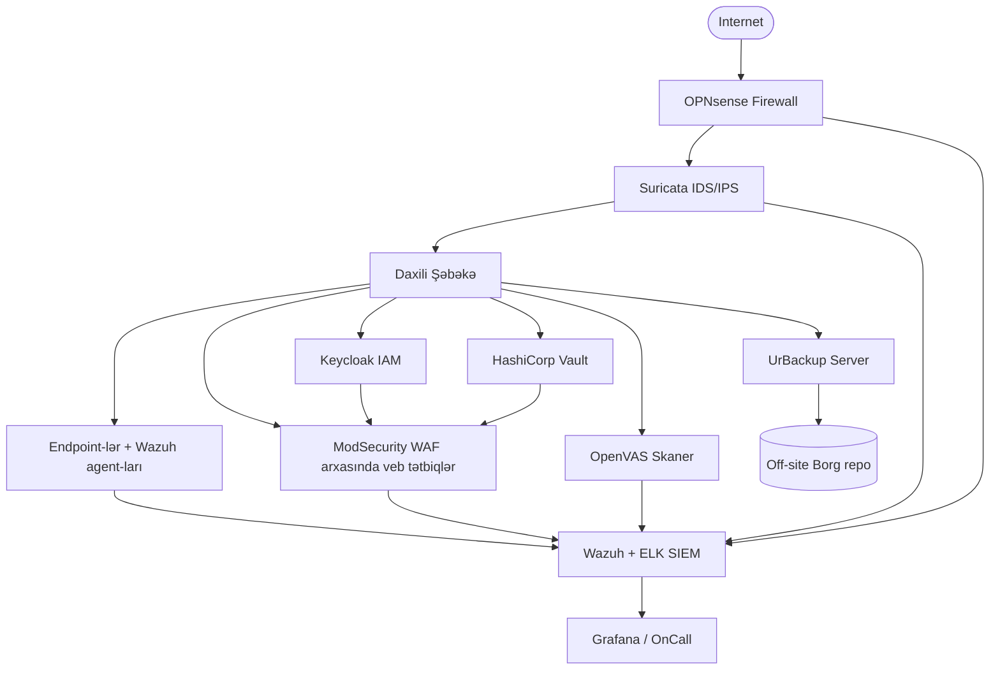

# Açıq mənbəli təhlükəsizlik stack-i — İcmal

Yetkin açıq mənbəli alətlərlə müdafiə oluna bilən, büdcəyə qənaət edən təhlükəsizlik proqramı qurmaq üçün praktik yol xəritəsi — və hər şeyin mümkün olduğu aktiv inventarlaşdırma qatı.

## Bu nə üçün vacibdir

Əksər təhlükəsizlik komandaları açıq mənbəni eyni şəkildə kəşf edir: büdcə kəsilir, lisenziya yenilənməsi yanlış vaxtda gəlir, tənzimləyici mövcud platformanın təklif etmədiyi nəzarəti tələb edir. Refleks açıq mənbəni ehtiyat variant kimi qiymətləndirməkdir. Bu çərçivələmə yanlışdır.

Kommersiya təhlükəsizlik dəstləri əladır, lakin müdafiə oluna bilən vəziyyətə yeganə yol deyil. Açıq mənbəli təhlükəsizlik ekosistemi `example.local`-dakı kiçik bir komandanın bir lisenziya dolları belə xərcləmədən firewall, SIEM, zəiflik skanı, identity, sirlər idarəetməsi, ehtiyat nüsxə və red-team alətlərini quraşdıra biləcəyi səviyyəyə çatıb.

- **İnfosec-in demokratikləşdirilməsi.** Fortune 500 SOC-ların istifadə etdiyi alətlər — Suricata, Wazuh, OpenVAS, Keycloak, HashiCorp Vault — pulsuz, yaxşı sənədləşdirilmiş və döyüşdə sınanmışdır. "Qlobal bankın işlətdiyi" ilə "beş nəfərlik startupun işlədə biləcəyi" arasındakı boşluq dramatik şəkildə daralıb.
- **Yetkin, audit edilmiş, pulsuz.** Bir çox açıq mənbəli layihə müstəqil audit edilir, CVE cavab prosesinə malikdir və kommersiya rəqiblərindən daha tez yenilənir. OWASP, CNCF və Linux Foundation inkubasiyası ən vacib layihələrə inandırıcı idarəetmə verir.
- **Büdcəsi məhdud komandalar təhlükəsizliyi tətbiq edir.** 0-büdcəli startup, işə qəbul dondurulmuş dövlət qurumu və ya qeyri-kommersiya təşkilatı Gartner Magic Quadrant liderlərinin satdığı eyni nəzarətləri tətbiq edə bilər — bir şərtlə ki, lisenziya əvəzinə operator bacarıqlarına investisiya etsin.
- **Suverenlik və auditə qabillik.** Mənbə kodu yoxlana biləndir. Vendor backdoor-u, qeyri-şəffaf telemetriya, özəl kapital şirkəti SaaS təminatçınızı aldıqda yoxa çıxma riski yoxdur. Tənzimlənən və dövlət sektoru alıcıları üçün bu xüsusi əhəmiyyətə malikdir.
- **Bacarıqlar yığılır.** Wazuh, ELK və Vault öyrənən mühəndislər bu biliyi işdən-işə və növbəti arxitekturaya aparırlar. Operator bacarıqlarına edilən investisiyalar konkret layihədən daha uzun ömürlüdür.

Açıq mənbə qısayol deyil. Xərci lisenziyadan mühəndisliyə keçirir: yenə də ödəyirsiniz — sadəcə vaxt, diqqət və əməliyyat yetkinliyi ilə. Bu icmal mənzərəni xəritələşdirir və haradan başlayacağınızı söyləyir.

Bu səhifə giriş nöqtəsidir. Burada keçidləri verilən alt-səhifələr hər kateqoriyaya daha dərin baxır — bu gün üzləşdiyiniz problemə uyğun olanı seçin və növbəti qatı planlamaq lazım gəldikdə icmala qayıdın.

## Açıq mənbəli təhlükəsizlik stack-inə bir baxış

Demək olar ki, hər kommersiya təhlükəsizlik kateqoriyasının açıq mənbəli ekvivalenti var. Bunların bəziləri pullu alternativlərlə müqayisədə də sinifin ən yaxşısıdır; bəziləri operator səyi ilə "kifayət qədər yaxşıdır"; bir neçəsi hələ də yetişməkdədir.

Aşağıdakı cədvəl hər kommersiya təhlükəsizlik kateqoriyasını onun açıq mənbəli ekvivalentinə uyğunlaşdırır və hər biri üçün fokuslanmış alt-səhifəni göstərir.

| Kateqoriya | Kommersiya nümunəsi | Açıq mənbəli ekvivalent | Alt-səhifə |
|---|---|---|---|
| Firewall / IDS / WAF | Palo Alto, Fortinet, F5 | OPNsense, Suricata, ModSecurity | [Firewall, IDS və WAF](./firewall-ids-waf.md) |
| SIEM və monitorinq | Splunk, QRadar, Sentinel | Wazuh, ELK, Grafana | [SIEM və monitorinq](./siem-and-monitoring.md) |
| Zəiflik və AppSec | Tenable, Qualys, Veracode | OpenVAS, ZAP, Semgrep, Nuclei | [Zəiflik və AppSec](./vulnerability-and-appsec.md) |
| Identity və MFA | Okta, Ping, Duo | Keycloak, Authentik, Authelia | [IAM və MFA](./iam-and-mfa.md) |
| Sirlər və PAM | CyberArk, BeyondTrust | HashiCorp Vault, Teleport, JumpServer | [Sirlər və PAM](./secrets-and-pam.md) |
| E-poçt təhlükəsizliyi | Proofpoint, Mimecast | Rspamd, Mailcow, Proxmox MG | [E-poçt təhlükəsizliyi](./email-security.md) |
| Ehtiyat nüsxə və saxlama | Veeam, Commvault | UrBackup, Borg, Restic | [Ehtiyat nüsxə və saxlama](./backup-and-storage.md) |
| Təhdid kəşfiyyatı və zərərli proqram | Recorded Future, Anomali | OpenCTI, MISP, Cuckoo | [Təhdid kəşfiyyatı və zərərli proqram](./threat-intel-and-malware.md) |
| Red team / rəqib emulyasiyası | Cobalt Strike | Caldera, Atomic Red Team, Sliver | [Red team alətləri](./red-team-tools.md) |
| GRC | Archer, ServiceNow GRC | CISO Assistant, Eramba | [GRC alətləri](./grc-tools.md) |
| Aktiv idarəetməsi | ServiceNow CMDB, Lansweeper | GLPI, Snipe-IT, NetBox | (bu səhifə) |

Hər alt-səhifə aparıcı layihələri, kompromisləri və tövsiyə olunan başlanğıc nöqtəsini əhatə edir.

Cədvəli *menyu* kimi yox, *xəritə* kimi oxuyun. Bütün kateqoriyaları eyni anda tətbiq etməyəcəksiniz və qanuni olaraq bir-iki kateqoriya üçün hostlanmış kommersiya məhsulunun düzgün cavab olduğuna qərar verə bilərsiniz — başqa yerdə açıq mənbə istifadə etmək sizi identity üçün Okta almaqdan saxlamır, məsələn. Məsələ — satınalma seçimlərin olmadığını fərz etməzdən əvvəl hansı seçimlərin mövcud olduğunu bilməkdir.

## Necə seçməli

Açıq mənbə dadbilmə menyusu deyil, büfedir. Vəsvəsə — xüsusilə məhsuldar görünməyə çalışan yeni təhlükəsizlik komandası üçün — eyni anda on şey tətbiq edib bunu stack adlandırmaqdır. Bu yarımkonfiqurasiya edilmiş alətlərin qəbiristanlığı və sıfır aşkarlamalarla nəticələnir.

Düşünərək seçin. Nəzərdən keçirdiyiniz hər alət üçün dörd suala cavab verin:

1. **Yetkinlik.** Layihənin son buraxılışı, sənədləşdirilmiş yol xəritəsi və CVE cavab prosesi varmı? GitHub buraxılış tezliyinə baxın — son altı ayda ən azı bir kiçik buraxılış sağlam həddidir. İstehsalda tərk edilmiş forklardan və "alpha" layihələrindən qaçın.
2. **İcma.** GitHub issue-ları, mailing list-i və chat-i nə qədər aktivdir? Canlı icma sizin qeyri-rəsmi dəstək müqavilənizdir. Son 50 bağlı issue-nu oxuyun — saxlayıcılar cavab verirlərmi, cavablar texnikidirmi, töhfə verənlər qayıdırlarmı? Ölü icma — gələcəkdə migrasiya layihəsi gözləyən mənzərədir.
3. **İnteqrasiya.** Sizin digər alətlərinizin artıq istifadə etdiyi protokollar və formatlarla danışırmı — syslog, OIDC, SAML, STIX, OpenAPI? Təmiz inteqrasiya olunan alətlər tamamlayıcıdır; izolyasiya olunmuş alətlər siloya çevrilir. Daha qəşəng dashboard-u olsa belə, məlumatını ixrac edən layihəni — onu kilidləyəndən üstün tutun.
4. **Dəstək modeli.** Özünüz dəstəkləyəcəksiniz, konsaltinq şirkəti tutacaqsınız, yoxsa upstream vendor-dan (Elastic, Greenbone, Red Hat) kommersiya abunəsi alacaqsınız? Tətbiqdən *əvvəl* qərar verin, ilk insidentdən sonra yox. İmzalanmış dəstək müqaviləsi istehsal yandığında layihənin necə cavab verdiyini dəyişir.

Əgər alət bunlardan ikisi və ya daha çoxunda uğursuz olursa, geri çəkilin — xüsusiyyət siyahısı təsir edici olsa belə.

İkinci, tez-tez unudulan ölçü: **əməliyyat uyğunluğu**. Postgres-əsaslı Python tətbiqi bir komanda üçün asan, digəri üçün isə tanış deyil. `example.local` üçün düzgün alət — operatorlarının saat 3:00-da işlək saxlaya biləcəyi alətdir, xüsusiyyət matrisində ən yüksək bal toplayan deyil.

## Stack ardıcıllığı

Yaşıl mühitdə bu sırada tətbiq edin. Hər qat bir əvvəlkini fərz edir — aşağı olmadan yuxarını qurmaq qatlanmış borcdur.

1. **Aktiv inventarlaşdırması** (GLPI, Snipe-IT, NetBox). Siyahıya alınmamış olanı müdafiə edə bilməzsiniz.
2. **Identity** (Keycloak və ya Authentik). Yayılmış lokal hesablar bunu qeyri-mümkün etməzdən əvvəl autentifikasiyanı mərkəzləşdirin.
3. **Perimetr və seqmentasiya** (OPNsense, Suricata). Şəbəkə kənarında varsayılan olaraq rədd edin.
4. **Endpoint və log telemetriyası** (Wazuh agent-ları, syslog forwarder-lər). Telemetriya olmadan SIEM boşdur.
5. **SIEM** (Wazuh + ELK və ya Grafana Loki). Logları mərkəzləşdirin, aşkarlamalar yazın, xəbərdar edin.
6. **Zəiflik konveyeri** (infrastruktur üçün OpenVAS, tətbiqlər üçün ZAP/Nuclei/Semgrep). Hücumçulardan əvvəl problemləri tapın.
7. **Ehtiyat nüsxə və DR** (UrBackup, Borg, Restic). Ransomware-ə davamlı, off-site, bərpa testi keçirilmiş.
8. **Sirlər və PAM** (Vault, Teleport). Paylaşılan admin şifrələrini brokerlənmiş, audit olunan girişlə əvəz edin.
9. **Təhdid kəşfiyyatı və red team** (MISP, Caldera). Yuxarıdakı hər şeyin əslində işlədiyini təsdiqləyin.
10. **GRC** (CISO Assistant, Eramba). Stack-in qalan hissəsini sənədləşdirin, sübuta yetirin və auditorlara davamlı təsdiq edin.

Bir qatı atlasanız, ondan yuxarıdakı qatlar dekorativ olur. Telemetriyasız SIEM verilənlər bazasıdır. Aktiv siyahısı olmayan zəiflik skaneri yanğınsöndürən şlanqdır. Bərpa testləri olmayan ehtiyat nüsxə sistemi gözləyən fidyə qaiməsidir.

Qəhvəyi mühitdə — yəni *artıq nə isəniz var* — sıra bir qədər dəyişir. Mövcud olanı audit edin, boşluqları siyahıya alın və hazırda istehsalda yan keçirilən qatı önə çəkin. Çox vaxt bu identity-dir (paylaşılan admin hesabları, SSO yox) və ya ehtiyat nüsxələrdir (yalnız yerli snapshot-lar, off-site nüsxə yox).

## Arxitektur diaqramı

Nümunəvi `example.local` açıq mənbəli təhlükəsizlik stack-i — perimetr, yoxlama, identity, sirlər, zəiflik skanı və ehtiyat nüsxənin necə mərkəzi SIEM-ə (və ya ondan) ötürüldüyünü göstərir:

Diaqram illüstrativdir; alt-səhifələr hər komponent üçün tətbiq detallarını əhatə edir. Hər yaxşı təhlükəsizlik arxitekturasının nümayiş etdirməli olduğu üç xüsusiyyətə diqqət yetirin:

- **Dərinlikdə müdafiə.** Suricata OPNsense-in arxasında, ModSecurity tətbiqlərin önündə, Wazuh hər endpoint-dədir. Hər hansı tək keçid kompromis demək deyil.
- **Mərkəzləşdirilmiş müşahidəlik.** Hər komponent logları SIEM-ə göndərir. Aşkarlama və forensic analiz on dashboard-da deyil, bir yerdə baş verir.
- **Off-site, dəyişdirilməyən ehtiyat nüsxələr.** Ayrı təminatçıdakı Borg repo-ları əsas ehtiyat serverini də sıradan çıxaran ransomware-ə qarşı son müdafiə xəttidir.

Mümkün olduqda, agentsiz polling əvəzinə agent-əsaslı telemetriyaya (Wazuh, OpenSearch Beats) üstünlük verin: bu, skanerin görəcəyi off-VPN endpoint-ləri və qısaömürlü iş yüklərini tutur. SIEM-i və aktiv reyestrini sinxronlaşdırın — Wazuh-un gördüyü hər endpoint Snipe-IT-də də olmalıdır və əksinə. İkisi arasındakı sürüşmə ya itkin inventar yazısının, ya da yad qurğunun ən erkən siqnalıdır.

## IT Aktiv İdarəetməsi — şərt

Aktiv idarəetməsi hər təhlükəsizlik proqramının cazibəsiz, lakin vacib təməlidir. Vendor demosunda nadir hallarda görünür. Rüblük şura slaydında nadir hallarda olur. Buna baxmayaraq, "bu bizim maşındır?" sualına 30 saniyəyə cavab verə bilən təhlükəsizlik komandası ilə 30 saata cavab verən komanda arasındakı fərqdir.

Hər çərçivə — NIST CSF, ISO 27001, CIS Controls — eyni təlimatla başlayır: aktivlərinizi inventarlaşdırın. Mövcud olduğunu bilmədiyiniz şeyi yamaqlaya bilməzsiniz. Laptop-u izlənməyən istifadəçinin girişini ləğv edə bilməzsiniz. Hansı host-un hansı tətbiqi işlətdiyini bilmədən zəiflikləri prioritetləşdirə bilməzsiniz. Şəbəkədə nəyin olub-olmamalı olduğuna dair etibarlı siyahı olmadan insidenti əhatələndirə bilməzsiniz.

Beləliklə, IT Aktiv İdarəetməsi (ITAM) hərfi mənada birinci nəzarətdir. CIS Control 1 ("Müəssisə Aktivlərinin İnventarlaşdırılması və Nəzarəti") və CIS Control 2 ("Proqram Aktivlərinin İnventarlaşdırılması və Nəzarəti") siyahının başında durur — çünki ondan aşağıdakı hər nəzarət bunlardan asılıdır.

Aşağıdakı üç açıq mənbəli platforma sahəyə hökm sürür, hər biri fərqli əhatə dairəsi və auditoriyaya malikdir. Heç biri yanlış cavab deyil; yanlış cavab — SharePoint cədvəlinin sayıldığını düşünməkdir.

## GLPI

> "Pulsuz IT və Aktiv İdarəetmə Proqramı" — layihənin öz şüarı.

[GLPI](https://glpi-project.org/) tam ITIL iş axını dəstəyi olan kompleks IT aktiv və xidmət idarəetmə platformasıdır.

- **Nədir.** Birləşmiş CMDB, biletləmə sistemi və aktiv izləyicisi — 2003-cü ildən aktiv inkişafdadır. İlkin olaraq fransız icması tərəfindən yazılıb, bu gün dünyada minlərlə quraşdırma ilə Teclib' tərəfindən saxlanılır.
- **Güclü tərəfləri.** Tam ITIL dəstəyi (incident, change, problem, request); daxili helpdesk; LDAP/AD sinxronizasiyası; zəngin plagin ekosistemi (FusionInventory, OCS, monitorinq konnektorları); çoxdilli; SLA izləmə; aktiv başına maliyyə məlumatı (alış tarixi, zəmanət, amortizasiya).
- **Kompromislər.** UI müasir SaaS rəqibləri ilə müqayisədə köhnəlmiş hiss olunur; ilkin quraşdırma PHP, MariaDB və cron işləri konfiqurasiyasını əhatə edir; plagin uyğunluğu bəzən böyük versiya yeniləmələrindən geri qalır.
- **Onu seçin** o zaman ki, aktiv izləməni *və* daxili helpdesk-i birləşdirən tək alət lazımdır və cilalanmadan üstün funksionallığa üstünlük verən UI-yə dözə bilərsiniz. GLPI ITIL uyğunluğu satınalma tələbi olan Avropa dövlət sektoru və təhsil təşkilatları üçün xüsusilə güclüdür.
- **Ondan qaçın** o zaman ki, komanda kifayət qədər kiçikdir və birləşmiş biletləmə + CMDB həddindən artıq görünür və ya artıq ayrı ITSM platforması istifadə edirsiniz (Jira Service Management, Zammad və s.).

## Snipe-IT

> "Pulsuz, açıq mənbəli IT aktiv idarəetmə proqramı."

[Snipe-IT](https://snipeitapp.com/) fokuslanmış, müasir aparat və lisenziya inventar sistemidir.

- **Nədir.** Fiziki aktivləri, lisenziyaları, aksesuarları və istehlak materiallarını izləmək üçün yüngül Laravel (PHP) tətbiqidir. Grokability tərəfindən saxlanılır — sağlam self-hoster icması və pullu hostlanmış təklifi var.
- **Güclü tərəfləri.** Təmiz, müasir UI; asan check-in / check-out iş axını; barkod və QR dəstəyi; REST API; CSV idxal; SAML və LDAP autentifikasiyası; webhook-lar; yaxşı sənədləşdirilmiş Docker image.
- **Kompromislər.** Daxili CMDB və ya əlaqə modelləşdirməsi yox; biletləmə yox; inteqrasiyalar GLPI-dən azdır. O, bilərəkdən "aktiv həyat dövrü" probleminə fokuslanır.
- **Onu seçin** o zaman ki, əsas tələbat *aparat və lisenziya izləməsidir* — laptoplar, monitorlar, proqram lisenziyaları — və tam ITSM dəstinin yükünü istəmirsiniz. Snipe-IT kiçik və ya orta ölçülü təşkilatda etibarlı inventara ən sürətli yoldur.
- **Ondan qaçın** o zaman ki, ITIL iş axınları, kompleks əlaqə modelləşdirməsi və ya təfərrüatlı şəbəkə topologiyası lazımdır — bunlar onun işi deyil.

## NetBox

> "Şəbəkə avtomatlaşdırılmasının təməl daşı."

[NetBox](https://netbox.dev/) açıq mənbəli DCIM (Data Center Infrastructure Management) və IPAM (IP Address Management) platforması üçün de-fakto seçimdir.

- **Nədir.** Şəbəkə infrastrukturu üçün həqiqət mənbəyi verilənlər bazası: stoyaklar, qurğular, kabellər, IP ünvanları, VLAN-lar, prefikslər, dövrələr və enerji. İlkin olaraq DigitalOcean-da qurulub, indi NetBox Labs tərəfindən çiçəklənən açıq mənbə icması ilə idarə olunur.
- **Güclü tərəfləri.** Güclü REST və GraphQL API-lər; güclü avtomatlaşdırma hekayəsi (Ansible, Terraform, NAPALM); dəyişiklik logları; xüsusi sahələr; çox müştərili mühitlər üçün tenancy modeli; NetBox Branching və NetBox Topology Views kimi genişləndirmələr üçün plagin çərçivəsi.
- **Kompromislər.** Son istifadəçi qurğusunun izlənməsi üçün nəzərdə tutulmayıb — laptoplar və telefonlar NetBox-a aid deyil. Tətbiq Postgres, Redis və worker prosesi tələb edir. Şəbəkə olmayan operatorlar üçün daha sıldırım öyrənmə əyrisi.
- **Onu seçin** o zaman ki, data center, ISP və ya böyük şəbəkə işlədirsiniz və fiziki və məntiqi şəbəkə topologiyasının dəqiq qeydlərinə ehtiyacınız var — istifadəçi laptopları yox. Şəbəkə avtomatlaşdırma konveyerlərinə etibarlı tək həqiqət mənbəyi lazım olduqda NetBox seçimdir.
- **Ondan qaçın** o zaman ki, şəbəkəniz bir-iki switch-li düz ofis LAN-ıdır — modelləşdirmə yükü əməliyyat faydasını üstələyir.

## Aktiv idarəetmə — müqayisə cədvəli

| Alət | Əhatə | Üçün ən yaxşı | Tətbiq mürəkkəbliyi |
|---|---|---|---|
| GLPI | Aparat, proqram, ITSM biletləri, müqavilələr | Aktiv + helpdesk-i bir alətdə istəyən IT komandaları | Orta (LAMP stack, plaginlər) |
| Snipe-IT | Aparat, lisenziyalar, aksesuarlar, istehlak materialları | Fiziki aktiv həyat dövrünə fokuslanan yüngül komandalar | Aşağı (Docker bir sətirlik) |
| NetBox | Şəbəkə infrastrukturu, IP-lər, stoyaklar, dövrələr | NOC, DevOps və data-center komandaları | Orta-Yuxarı (Postgres, Redis, worker-lər) |

Bir-dən çoxunu işlədə bilərsiniz — və `example.local`-tipli bir çox təşkilat işlədir də. Klassik cütlük **aparat üçün Snipe-IT** və **şəbəkə üçün NetBox**-dur, biletləmə platforması lazım olduqda GLPI əlavə olunur.

Faydalı bir empirik qayda: əgər qeyd *kimin sahibi olduğunu* təsvir edirsə, Snipe-IT-yə aiddir. Əgər *harada stoyaqda olduğunu və nəyə qoşulduğunu* təsvir edirsə, NetBox-a aiddir. Əgər biletə bağlıdırsa, GLPI evdir.

## Praktik / məşq

Aktiv platformasını qiymətləndirməyin ən sürətli yolu onu laptopa tətbiq edib həqiqi formalı verilənlər yükləməkdir. Aşağıdakı üç məşq bilərəkdən kiçikdir.

1. **GLPI-i Docker-də tətbiq edin.** İcma `glpi-project/glpi` image-i ilə MariaDB sidecar-ı istifadə edin. Admin hesabı yaradın, bir məkan (`example.local-HQ`) təyin edin və beş nümunə aktiv əlavə edin. Bonus: inventar plaginini aktivləşdirin və bir agent qeydiyyatdan keçirin ki, endpoint avtomatik aparatını bildirsin. Vaxt çərçivəsi: 45 dəqiqə.
2. **CSV aktiv siyahısını Snipe-IT-yə idxal edin.** Snipe-IT-i Docker Compose ilə qaldırın, `Asset Tag, Serial, Model, Status, Assigned To` ilə CSV hazırlayın və bulk importer istifadə edin. 50 nümunə sətrin düzgün kateqoriyalara endiyini təsdiq edin. Bonus: Keycloak test instance-nizə qarşı SAML SSO konfiqurasiya edin. Vaxt çərçivəsi: 30 dəqiqə.
3. **NetBox-da kiçik datacenter modelləşdirin.** NetBox qaldırın, sayt (`example.local-DC1`), bir stoyak, iki qurğu (switch və server) yaradın, `/24` prefiksdən IP ünvanları təyin edin və onları kabel qeydi ilə birləşdirin. Saytı REST API ilə ixrac edin və JSON formasını yoxlayın. Vaxt çərçivəsi: 60 dəqiqə.

Hər məşq kiçik, müstəqildir və hər hansı istehsal qərarından əvvəl alət haqqında təsəvvür verir. Onlara ödənişli spike-vaxt kimi yanaşın — iki saatda öyrəndiyiniz şey illərlə sizi narahat edəcək satınalma səhvini xilas edir.

Hər məşqi bitirdikdən sonra bir səhifəlik qeyd yazın: nəyi bəyəndiyinizi, nə narahat etdiyini, istehsalda buraxılışı nə bloklayardı. Altı həftə sonra bu qeydlər vendor demosu deyil, dürüst alət seçiminin girişidir.

## İşlənmiş nümunə

Aşağıdakı nümunə yuxarıdakı seçim çərçivəsini realistik orta ölçülü ssenariyə tətbiq edir.

`example.local` üç ofisdə 250 nəfərlik təşkilatdır. Mövcud CMDB-ləri yoxdur. Hazırkı "sistem" SharePoint-dəki cədvəllərdir. CIO yeni təhlükəsizlik rəhbərindən açıq mənbəli aktiv platforması tövsiyə etməsini xahiş edir.

**Analiz.**

- 250 nəfər təxminən 350 endpoint deməkdir (laptoplar, monitorlar, telefonlar, printerlər) — açıq-aydın aparat-mərkəzli.
- Üç ofis stoyak-və-kabel təfərrüatının təcili ehtiyac olmadığını göstərir; şəbəkə kiçikdir və əsasən bulud-host edilmişdir.
- Mövcud helpdesk aləti də yoxdur, lakin IT komandası e-poçt və Teams chat istifadə edir. Onlara nəhayətdə biletləmə lazım olacaq — amma birinci gündə yox.
- Uyğunluq təzyiqi orta səviyyədədir: təşkilatın gələn il üçün ISO 27001 ambisiyaları var ki, bu da on iki ay ərzində etibarlı aktiv reyestrini ciddi tələb edir.

**Tövsiyə.**

- **Aparat üçün Snipe-IT.** Əvvəlcə bunu qaldırın. SharePoint cədvəlini CSV ilə idxal edin, aktivləri istifadəçilərə LDAP sinxronizasiyası ilə bağlayın, barkodlar çap edin. Bu, "biz nəyə sahibik və kim sahibdir" sualını bir sprintdə həll edir və auditora baxmaq üçün konkret nəsə verir.
- **Sonra ITSM üçün GLPI.** Snipe-IT sabit olduqdan sonra GLPI-i helpdesk kimi tətbiq edin və bilet axınını e-poçtdan köçürməyə başlayın. GLPI-nin CMDB-si ya ikinci sistem ola bilər, ya da nəhayətdə komanda konsolidasiya etsə, əsas sistem.
- **NetBox təxirə salınır.** Üç kiçik ofis və düz şəbəkə ilə NetBox bu gün həddindən artıqdır. `example.local` co-lo açanda və ya daxili data center qurduqda yenidən baxın.

Nümunənin məqsədi: alətləri ambisiyaya yox, əhatə dairəsinə və həyat dövrü mərhələsinə uyğunlaşdırın. Birinci gündə ən güclü aləti almaq ən çox yayılmış — və ən bahalı — səhvdir.

İkinci `example.local`-tipli qeyd etməyə dəyər nümunə: təhlükəsizlik komandası bir nəfər olduqda, *əməliyyat sadəliyi mürəkkəbliyə hər zaman üstün gəlir*. 30 dəqiqədə işləyən və altı ay nəzarətsiz çalışan alət, daha zəngin xüsusiyyət dəstinə malik olan, lakin həftəlik tənzimləmə tələb edən alətdən daha qiymətlidir.

## Yaygın yanlış təsəvvürlər

Üç mif digərlərindən daha çox pis açıq mənbəli qərar verilməsinə səbəb olur.

- **"Açıq mənbə = dəstəksiz."** Yanlış. Aparıcı layihələrin çoxu pullu kommersiya dəstəyi təklif edir — OpenVAS üçün Greenbone, ELK stack üçün Elastic, Keycloak üçün Red Hat, NetBox üçün NetBox Labs, GLPI üçün Teclib'. İcma kanalları — GitHub Discussions, Discord, mailing list-lər — də çox vaxt kommersiya dəstək biletlərindən daha sürətlidir, xüsusilə məlum problemlər üçün.
- **"Pulsuz = TCO yox."** Bu da yanlışdır. Lisenziya pulsuzdur; operator deyil. Mühəndislik vaxtı, təlim, aparat və hər tier-1 nəzarət üçün pullu dəstək abunəsi büdcələyin. Ciddi qiymətləndirmə — sabit dövrdə hər üç istehsal səviyyəli açıq mənbəli təhlükəsizlik platforması üçün bir tam ştat mühəndis, ilkin tətbiqdə isə daha çoxdur.
- **"Bir alət seçməlisiniz."** Yenə yanlış. Snipe-IT plus NetBox plus GLPI mükəmməl normal cütlükdür — hər biri fərqli əhatə dairəsinə sahibdir. Üç fokuslanmış aləti işlətməyin xərci, çox vaxt bir aləti hər şeyi pis etməyə məcbur etməkdən aşağıdır. Eyni məntiq stack-də yuxarı tətbiq olunur: endpoint üçün Wazuh plus log-lar üçün Grafana Loki plus axtarış-yüklü istifadə halları üçün OpenSearch qanuni kombinasiyadır.
- **"Açıq mənbə varsayılan olaraq təhlükəsizdir."** Yanlış. Mənbə yoxlana biləndir, CVE-lər ictimaidir və cavab dövrü çox vaxt kommersiya vendor-larından daha sürətlidir. Risk *operatorun səhv konfiqurasiyasındadır*, kodun özündə deyil — və bu risk kommersiya alətləri üçün də mövcuddur.
- **"İnteqrasiya çox çətindir."** Əsasən yanlış, bəzən doğrudur. Müasir açıq mənbəli təhlükəsizlik layihələri varsayılan olaraq REST API, OIDC dəstəyi, syslog çıxışı və Prometheus metrikləri ilə gəlir. İnteqrasiya sürtüşməsi adətən seçdiyiniz alətlərdən *birinin* yanlış uyğunluq olduğunu göstərir, açıq mənbənin yanlış kateqoriya olduğunu yox.
- **"İcma sabah onu fork edəcək."** Nadir hallarda. Sağlam idarəetməyə malik böyük layihələr (OWASP, CNCF, Linux Foundation, yaxşı maliyyələşdirilmiş vendor-lar) sabitdir. Fork riski bir-saxlayıcı hobbi layihələri üçün realdır — onsuz da onları istehsalda işlətməməlisiniz.

## Əsas nəticələr

Bu icmalı bir səhifəlik vərəqəyə çevirin:

- Açıq mənbə kommersiya stack-inin təklif etdiyi hər təhlükəsizlik nəzarət kateqoriyasını yetkin, audit edilmiş, yaxşı dəstəklənən layihələrlə təmin edə bilər.
- **Aktiv inventarı** ilə başlayın: NIST, ISO və CIS hamısı bir səbəbdən oradan başlayır — və stack-in qalan hissəsi bunsuz qurula bilməz.
- **GLPI** hər-şey-bir-yerdə ITSM + CMDB seçimidir; **Snipe-IT** aparat və lisenziyalara sahibdir; **NetBox** şəbəkə və data center-ə sahibdir.
- Birdən çox aktiv aləti işlətmək normaldır — hətta tövsiyə olunur. Onları bir məhsulu hər şeyi etməyə məcbur etmək əvəzinə, əhatə dairəsinə görə cütləşdirin.
- Alətləri dörd meyara qarşı seçin: yetkinlik, icma, inteqrasiya, dəstək modeli. İki strike — və geri çəkilirsiniz.
- Sıra ilə tətbiq edin — aktivlər, identity, perimetr, telemetriya, SIEM, zəifliklər, ehtiyat nüsxə, sirlər, kəşfiyyat — çünki hər qat altındakına bağlıdır.
- Lisenziya pulsuzdur; operator deyil. TCO-nu dürüst planlayın: insanlar, aparat, təlim və ən azı bir tier-1 nəzarət üçün pullu dəstək müqaviləsi.
- Satınalmadan əvvəl pilotlaşdırın. İki saatlıq Docker qaldırılması istənilən vendor demosundan daha çox şey deyir və yalnız öz vaxtınıza başa gəlir.
- Qərarlarınızı sənədləşdirin. Altı ay sonra "niyə GLPI yerinə Snipe-IT seçdik?" sualını otaqda olmayan kimsə verəcək — cavabı bu gün yazın.
- Aktiv inventarını və SIEM telemetriyasını sinxronlaşdırın: SIEM-in gördüyü hər endpoint aktiv reyestrinizdə də olmalıdır və naməlum qurğular xəbərdarlıq yaratmalıdır.

## İstinadlar

Etibarlı başlanğıc nöqtələri və alət üzrə sənədlər:

- [OWASP Layihələr indeksi](https://owasp.org/projects/) — OWASP tərəfindən idarə olunan açıq mənbəli təhlükəsizlik layihələrinin kanonik siyahısı.
- [Awesome-Selfhosted: Security](https://github.com/awesome-selfhosted/awesome-selfhosted#security) — self-host edilə bilən təhlükəsizlik alətlərinin icma tərəfindən saxlanılan kataloqu.
- [Awesome Open Source Security](https://github.com/sbilly/awesome-security) — təhlükəsizliyə aid açıq mənbəli layihələrin daha geniş seçilmiş siyahısı.
- [The Open Source Security Foundation (OpenSSF)](https://openssf.org/) — açıq mənbə təchizat zəncirini qorumaq üçün Linux Foundation təşəbbüsü.
- [CNCF Landscape — Security and Compliance](https://landscape.cncf.io/) — bulud-doğma təhlükəsizlik alətlərinin interaktiv xəritəsi.
- [CIS Critical Security Controls v8](https://www.cisecurity.org/controls) — Control 1 bir səbəbdən "Müəssisə Aktivlərinin İnventarlaşdırılması və Nəzarəti"dir.
- [NIST Cybersecurity Framework 2.0](https://www.nist.gov/cyberframework) — IDENTIFY funksiyası birbaşa aktiv inventarına uyğundur.
- [ISO/IEC 27001:2022 Annex A.5.9](https://www.iso.org/standard/27001) — "İnformasiya və əlaqəli aktivlərin inventarı" məcburi nəzarətdir.
- [GLPI GitHub-da](https://github.com/glpi-project/glpi)
- [Snipe-IT GitHub-da](https://github.com/snipe/snipe-it)
- [NetBox GitHub-da](https://github.com/netbox-community/netbox)
- [GLPI sənədləri](https://glpi-project.org/documentation/)
- [Snipe-IT sənədləri](https://snipe-it.readme.io/)
- [Snipe-IT Docker image](https://hub.docker.com/r/snipe/snipe-it)
- [NetBox sənədləri](https://netboxlabs.com/docs/netbox/)
- Bu kateqoriyanın alt-səhifələri:
  - [Firewall, IDS və WAF](./firewall-ids-waf.md)
  - [SIEM və monitorinq](./siem-and-monitoring.md)
  - [Zəiflik və AppSec](./vulnerability-and-appsec.md)
  - [IAM və MFA](./iam-and-mfa.md)
  - [Sirlər və PAM](./secrets-and-pam.md)
  - [E-poçt təhlükəsizliyi](./email-security.md)
  - [Ehtiyat nüsxə və saxlama](./backup-and-storage.md)
  - [Təhdid kəşfiyyatı və zərərli proqram](./threat-intel-and-malware.md)
  - [Red team alətləri](./red-team-tools.md)
  - [GRC alətləri](./grc-tools.md)
