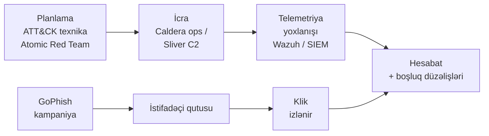

# Açıq Mənbə Red Team və Düşmən Emulyasiyası

Kiçik bənövşəyi komandanın inanılmaz hücum tapşırıqları aparmasına imkan verən açıq mənbə alətlərinə fokuslu baxış — istifadəçi əzələ yaddaşı qurmaq üçün fişinq simulyasiyaları, SOC-u yoxlamaq üçün düşmən emulyasiyası və büdcənin örtə bilməyəcəyi kommersial framework-lərin yerini tutmaq üçün müasir C2.

Bu səhifə [Açıq Mənbə SIEM və Monitorinq](./siem-and-monitoring.md) dərsindən aşkarlama stack-ının siz qiymətləndirə biləcəyiniz xəbərdarlıqlar yaratdığını və [Təhdid Kəşfiyyatı və Zərərli Proqram Analizi](./threat-intel-and-malware.md) dərsindən perimetr və TI imkanlarının emulyasiyaya layiq TTP-lər verdiyini fərz edir. Aşkarlamaq üçün mavi komandası olmayan red-team aləti atəşfəşanlıqdır; dəyər əks-əlaqə dövrəsindədir.

## Bu nə üçün önəmlidir

Bənövşəyi komanda işi — hücum tapşırıqlarını aparmaq və müdafiənin necə cavab verdiyini ölçmək — SIEM qaydalarınızın, EDR əhatənizin və istifadəçi təliminizin həqiqətən işlədiyini bilmək üçün ən etibarlı yoldur. Vendor məlumat vərəqlərini oxumaq sizə bunu söyləmir; öz mühitinizə qarşı red-team tapşırığı aparmaq söyləyir. Tarixən tutucu alət olub: **Cobalt Strike** de-fakto kommersial C2-dir, lakin istifadəçi başına yüksək dörd-rəqəmli diapazonda dəyəri var, distribütor təsdiqi tələb edir və bir neçə bazardan coğrafi olaraq kənarlaşdırılıb. 200 nəfərlik `example.local` formalı təşkilat üçün bu inanılmaz xərc maddəsi deyil.

Açıq mənbə alternativləri indi lisenziyasız yolun həqiqətən mümkün olması üçün kifayət qədər yetkindir. **GoPhish** əksər daxili red komandalar üçün kommersial fişinq platformalarını sıxışdırıb; **MITRE Caldera** və **Atomic Red Team** MITRE-nin özü ATT&CK texnikalarını yoxlamaq üçün istifadə etdiyi alətlərdir; Bishop Fox-dan **Sliver** aşkarlama mühəndisliyi bloglarının Cobalt Strike-ın açıq mənbə qarşılığı kimi qəbul etdiyi müasir C2-dir. Onları sürətli SOC məşqləri üçün **APTSimulator** və **RTA** kimi sürətli skriptli simulyatorlarla birləşdirin və kiçik bənövşəyi komanda analitik vaxtının dəyərinə inanılmaz hücum proqramı apara bilər.

`example.local` üçün düzgün model kiçik təkrarlanan dövrədir: GoPhish vasitəsilə aylıq fişinq simulyasiyası, standart iş stansiyası quruluşuna qarşı rüblük Atomic Red Team keçidləri, təmsil edici seqmentə qarşı yarıillik tam Caldera əməliyyatları və təhdid kəşfiyyatından xüsusi TTP-nin yoxlanılması lazım olduqda ad-hoc Sliver-əsaslı tapşırıqlar. Xərc lab mühiti ilə üst-üstə düşən aparat və intizamdır; nəticə SOC-un həqiqətən nə tutduğunun müdafiəolunan, dəlil-əsaslı mənzərəsidir.

- **Fişinq simulyasiyası təşkilati əzələ yaddaşı qurur.** İllik təhlükəsizlik məlumatlandırma videoları klik dərəcəsi göstəricisini hərəkətə gətirmir; dərhal öyrədici anlarla aylıq realist fişinq testləri gətirir. GoPhish bunu əməliyyat baxımından ucuz edir.
- **Düşmən emulyasiyası "qaydalarımız var" və "qaydalar işləyir" arasındakı boşluğu bağlayır.** Aşkarlamalarla dolu SIEM idarə paneli, hansı ATT&CK texnikalarının onları həqiqətən tetiklədiyini təsdiq edənə qədər mənasızdır — və bunu təsdiq etməyin yeganə yolu texnikaları işə salmaqdır.
- **Açıq mənbə C2 framework-ləri indi istehsal-səviyyəlidir.** Sliver, Mythic və Havoc qabiliyyətli düşmənlərin onları artıq istifadə etməsi üçün kifayət qədər yetkindir — və SOC-unuz öz red komandanızın onları istifadə etməsindən asılı olmayaraq onları aşkar edə bilməlidir.
- **Skriptli simulyatorlar SOC-a sürətli əks-əlaqə verir.** APTSimulator və RTA dəqiqələrlə uzun siyahı hücumçu hərəkəti apara, tam əməliyyat qurmadan aşkarlama məzmununu yoxlaya biləcəyiniz telemetriya yarada bilər.
- **Bənövşəyi komanda işi mavi və qırmızının birləşdiyi yerdir.** Məqsəd "qalib gəlmək" deyil — boşluqları tapmaq və düzəltməkdir, hər iki tərəf eyni masada nə işə düşdüyünü və nəyin işə düşmədiyini nəzərdən keçirir.

## Etika və icazə

Bu alətlər real sistemlərə qarşı real hücumçu davranışını icra edir. Onları yalnız aktiv sahibindən **yazılı icazə** ilə, aydın sənədləşdirilmiş əhatə (hansı şəbəkələr, hansı host-lar, hansı istifadəçilər, hansı vaxt pəncərələri) ilə və örtülü aşkarlama testi olmayan hər hansı tapşırıq üçün SOC-un əvvəlcədən xəbərdar edilməsi ilə işlədin. İşçiləri hədəfləyən hər hansı fişinq kampaniyasından əvvəl hüquqi, HR və IT əməliyyatları ilə koordinasiya edin. Əksər yurisdiksiyalarda — ABŞ-da CFAA, Böyük Britaniyada Computer Misuse Act, ratifikasiya olunduğu hər yerdə Avropa Şurasının Kibercinayət Konvensiyası — bu alətləri icazəsiz işlətmək cinayət hərəkətidir. Alətin açıq mənbə olması bunu dəyişmir. Şübhə olduqda işlətməyin.

Yazılı icazə əhatədəki sistemləri, icazə verilən texnikaları, vaxt pəncərəsini, kill-switch əlaqəsini və işləməyə icazə verilən adlandırılmış şəxsləri göstərməlidir. Bu sənədi insident qeydlərini saxladığınız eyni saxlanma müddətinə faylda saxlayın. Təşkilatı hüquqi cəhətdən qoruyan eyni sənədlər, düzgün ünsiyyət qurulmamış red-team fəaliyyəti tərəfindən real insident cavabı tetiklənərsə, təhlükəsizlik komandasının dayandığı şeydir.

## Stack icmalı

İşləyən bənövşəyi-komanda boru kəməri hücum axınını müdafiə əks-əlaqə dövrəsi ilə birləşdirir. Hücum tərəfi emulyasiyaya layiq ATT&CK texnikalarını seçir, fərdi TTP-lər üçün Atomic Red Team, zəncirvari əməliyyatlar üçün Caldera vasitəsilə icra edir və lazım olduqda Sliver istifadə edir. Müdafiə tərəfi nəticə telemetriyanı Wazuh və SIEM vasitəsilə oxuyur, aşkarlama əhatəsini qiymətləndirir və boşluqları qayda inkişafına geri ötürür. Fişinq kampaniyaları paralel olaraq oturur — GoPhish istifadəçi gələnlər qutusuna e-poçt göndərir, klikləri və etimad göndərmələrini izləyir və məlumatlandırma proqramı üçün ayrıca hesabat yaradır.

Diaqramı hesabatda görüşən iki axın kimi oxuyun. Yuxarıdakı texnika axını insanların "red team" eşitdikdə təsəvvür etdiyi şeydir — TTP seçin, icra edin, SOC-un nə tutduğunu görün. Aşağıdakı fişinq axını əməliyyat baxımından ayrıdır, lakin eyni qiymətləndirməni qidalandırır: istifadəçi kliklədimi, SOC daxili gələni gördümü, EDR yük olduqda onu tutdumu, e-poçtu hər kəs bildirdimi. Hər ikisinin nəticəsi eynidir: sahibləri və düzəliş son tarixləri olan təsdiqlənmiş boşluqların siyahısı.

Mənimsənilməyə dəyər məqam **hesabatın məhsul olmasıdır**, əməliyyatın özü deyil. Yazılı tapıntılar, qiymətləndirilmiş aşkarlama əhatəsi və izlənən düzəliş biletləri yaratmayan uğurlu red-team tapşırığının biznes dəyəri yoxdur. Hesabatı ilk icradan əvvəl bağlayın.

Faydalı əməliyyat intizamı tapşırıq başlamazdan əvvəl tapşırıq hesabatını şablonlaşdırmaqdır — əhatə, cəhd edilən texnikalar, texnika başına aşkarlama balı, müəyyən edilmiş boşluqlar və yaradılan düzəliş biletləri üçün boş bölmələr. Şablonu doldurmaq son tarix təzyiqi altında sıfırdan yazmaqdan daha sürətlidir və operatorları yaratmadan əvvəl hesabatın hansı dəlilə ehtiyacı olacağı haqqında düşünməyə məcbur edir.

## Fişinq simulyasiyası — GoPhish

GoPhish de-fakto açıq mənbə fişinq simulyasiyası platformasıdır. Go dilində yazılmış, tək statik binar olaraq paylanmış və təmiz veb UI plus REST API vasitəsilə konfiqurasiya edilmişdir, bu, əksər daxili red komandaların ilk növbədə əldə etdiyi şeydir. Dəyər təklifi sadədir: idarə etdiyiniz domeyndən hədəfləməyə icazəniz olan işçilər siyahısına göndərilən təhlükəsiz realist fişinq e-poçtu, məlumatlandırma komandası üçün hazır idarə panelinə düşən klik və göndərmə izləməsi ilə.

Yerləşdirmə hekayəsi qalan dizayna uyğundur: binarı yükləyin, kiçik VM-də işlədin, idarə etdiyiniz SMTP relayinə yönəldin və açıq landing-page URL-ni TLS-bitirən reverse proxy arxasında konfiqurasiya edin. İdarəetmə UI-si standart olaraq localhost-a bağlanır — onu orada saxlayın, VPN arxasında və yalnız açıq landing page-i reverse-proxy edin.

- **Tək-binarlı Go yerləşdirməsi.** Çalışma vaxtı asılılıqları yox, idarə ediləcək dil stack-ı yox. 200-MB binar üstəlik SQLite verilənlər bazası faylı test qutusunda tam quraşdırmadır; istehsal yerləşdirmələri SQLite-ı MySQL və ya Postgres ilə dəyişir.
- **Kampaniya iş axını.** Doğma abstraksiya **kampaniyadır** — göndərmə profili, e-poçt şablonu, landing page, hədəf qrupu və başlanğıc vaxtı. Hər kampaniya açılışlar, kliklər, göndərmələr və bildirilən saylarla nəticə idarə paneli yaradır.
- **REST API.** UI-dakı hər şey REST vasitəsilə də açıqlanır, bu da təkrarlanan kampaniyaların skriptləşdirilməsini sadə edir. Python `gophish` SDK ən çox istifadə olunan müştəridir.
- **Şablonlar və landing page-lər.** Şablonlar yer tutucu əvəzlənməsini (işçi adı, fərdi linklər) və daxili izləmə piksellərini dəstəkləyir. Landing page-lər istənilən giriş axınını imitasiya edə bilər; göndərilən etibarlar server tərəfində tutulur və heç vaxt platformadan çıxmır.
- **Memarlıq xəbərdarlıqları.** GoPhish-in admin UI-nin yanlışlıqla internetə açıq qoyulması tarixi var — standart konfiqurasiya bütün interfeyslərə bağlanır. Həmişə admin portunu firewall edin və ya reverse-proxy edin və ilk işdən əvvəl standart `admin/gophish` etibarını dəyişdirin.
- **Nə vaxt seçmək.** Hər hansı yeni daxili fişinq proqramı üçün standart. Yetkin, sənədləşdirilmiş və yerləşdirmə hekayəsi tək günortaya kifayət qədər qısadır.

Əvvəldən qeyd etmək lazım olan tarazlıq odur ki, GoPhish məlumatlandırma təlimi ilə gəlmir — istifadəçi kliklədikdə, GoPhish hadisəni qeyd edir və bu, məsuliyyətinin sonudur. Öyrədici-an iş axını (düzəliş səhifəsi, qısa təlim videosu, menecer bildirişi) GoPhish-dən xaricdə yaşayır, adətən ayrıca məlumatlandırma platformasına webhook vasitəsilə bağlanır və ya əl ilə analitik prosesi.

## Fişinq simulyasiyası — King Phisher

King Phisher SecureState-dən köhnə Python-əsaslı fişinq alətdir (indi arxivlənib, lakin hələ də funksionaldır). GoPhish kampaniyaya ən sadə yol üçün optimallaşdırılmışkən, King Phisher **çevikliyə** optimallaşdırılır — daha zəngin şablon dili, serveri fərdi Python modulları ilə genişləndirməyə imkan verən plugin sistemi və hər klikdə brauzer barmaq izi və coğrafi məkan məlumatlarını ehtiva edən metrik toplaması.

Memarlıq serverə (Python, kampaniya hostunda işləyir) və müştəriyə (operatorun yerli olaraq işlətdiyi və serverlə əlaqə saxladığı masaüstü GUI) bölünür. Bu müştəri/server ayırması əsas mürəkkəblik vergisidir — əksər operatorlar GoPhish-in tək binarlı veb UI-sini üstün tutur — lakin çoxlu eyni vaxtlı operatorlar və kampaniya infrastrukturundan həqiqətən ayrı olan operator iş stansiyası kimi istifadə hallarına imkan verir.

- **Python serveri + GTK müştəri.** Server Linux-da işləyir; müştəri masaüstü tətbiqdir. Quraşdırma GoPhish-dən daha çox iştirak tələb edir — Python virtual mühitləri, GTK asılılıqları, müştəri ilə server arasında SSH-əsaslı əlaqə.
- **Plugin sistemi.** Server və müştəri hər ikisi plugin API-lərini açıqlayır. Fərdi pluginlər şablonu genişləndirə, metrik toplayıcılar əlavə edə, daxili CRM-lərlə inteqrasiya edə və ya nəticələri biletləşdirmə sistemlərinə bağlaya bilər.
- **Metrik dərinliyi.** Standart metriklər coğrafi məkan, brauzer barmaq izi, OS, klik və göndərmə vaxtını əhatə edir — məlumatlandırma proqramı yalnız aqreqat klik dərəcələri yerinə demoqrafik təfərrüat istədikdə faydalıdır.
- **SPF/DKIM/DMARC məlumatı.** Başlanğıcdan əvvəl göndərmə domeninin e-poçt-autentifikasiya vəziyyətini yoxlamaq üçün daxili alətlər — kampaniyaların spam qovluqlarına düşməsinin qarşısını alan fail-closed yoxlaması.
- **Status xəbərdarlığı.** Orijinal SecureState layihəsi 2021-də arxivləndi; icma fork-ları mövcuddur, lakin texniki xidmət sporadikdir. King Phisher-i uzunmüddətli standart kimi deyil, işləyən, lakin köhnə alət kimi qəbul edin.
- **Nə vaxt seçmək.** Plugin-səviyyəli fərdiləşdirmə, çox-operatorlu iş axınları və ya GoPhish-in verdiyindən daha zəngin klik başına metriklər lazımdır. Əks halda standart olaraq GoPhish-ə.

## Fişinq simulyasiyası — Lucy Community Edition

Lucy hibrid fişinq-simulyasiyası və təhlükəsizlik-məlumatlandırma təlimi paketi idi — fişinq kampaniyaları plus videolar və quizlərlə inteqrasiya olunmuş LMS — Lucy Security tərəfindən həm pullu kommersial məhsul, həm də çıxarılmış Community Edition kimi satılırdı. Community Edition təlim və fişinqi bir platformada istəyən kiçik təşkilatlar üçün faydalı pulsuz seçim idi.

2026-cı il etibarilə dürüst status ondan ibarətdir ki, **Community Edition praktiki olaraq tərk edilmişdir**. Vendor Lucy SaaS-ə yönəlib və yerli Community Edition illərdir mənalı yenilənmələr görməyib. Yeni yerləşdirmələr Lucy CE-də başlamamalıdır — fişinq üçün GoPhish-ə və təlim üçün ayrıca LMS-ə (Moodle, BookStack və ya SaaS məlumatlandırma vendoruna) gedin.

- **Birləşmiş fişinq + LMS.** Orijinal təklif inteqrasiya idi — kliklə edənləri avtomatik olaraq düzəliş təliminə yazan kampaniyalar. İnteqrasiya realdır, lakin platforma artıq saxlanılmır.
- **Şablon kitabxanası.** Ümumi hücum nümunələrini əhatə edən qabaqcadan qurulmuş fişinq şablonları, məlumatlandırma videoları və quizlər. İlham mənbəyi kimi faydalıdır, lakin getdikcə köhnəlir.
- **Ağır quraşdırıcı.** PHP, MySQL, Apache və uzun siyahı asılılıqları çəkən monolit quraşdırıcı. Əməliyyat baxımından GoPhish və ya King Phisher-dən daha ağırdır.
- **2026-cı il etibarilə status.** Community Edition-da praktiki olaraq tərk edilmişdir. Vendor diqqəti SaaS kommersial məhsulundadır.
- **Nə vaxt seçmək.** Yeni yerləşdirmələr üçün demək olar ki, heç vaxt. Köhnə quraşdırmalar davam etdiyi üçün tamlıq üçün qeyd edilmişdir; əgər birini miras qoyursunuz, GoPhish + ayrıca məlumatlandırma platformasına miqrasiya planı qurun.

## Fişinq — müqayisə cədvəli

Üç platforma eyni iş axınını hədəfləyir, lakin yetkinlik əyrisinin müxtəlif nöqtələrində. Aşağıdakı cədvəl birini seçərkən həqiqətən vacib olan şeydir.

| Ölçü | GoPhish | King Phisher | Lucy CE |
|---|---|---|---|
| Aktiv texniki xidmət | Aktiv | Sporadik (fork-lar) | Praktiki olaraq tərk edilmiş |
| Yerləşdirmə səyi | Aşağı (tək binar) | Orta (müştəri+server) | Yüksək (monolit quraşdırıcı) |
| UI | Veb | Masaüstü müştəri | Veb |
| API | REST + Python SDK | RPC | Məhdud |
| Plugin ekosistemi | Minimal | Zəngin | Məhdud |
| Metrik dərinliyi | Standart | Zəngin (geo, barmaq izi) | Standart |
| Daxili LMS | Yox | Yox | Bəli (köhnə) |
| Memarlıq | Go + SQLite/MySQL | Python + SQLite | PHP + MySQL |
| Ən yaxşı uyğunluq | Yeni proqramlar üçün standart | Fərdiləşdirmə, çox-operator | Yalnız köhnə quraşdırmalar |
| Nə vaxt qaçmaq | Ağır fərdiləşdirmə ehtiyacları | Tək operator, sürətli quraşdırma | Yeni yerləşdirmələr |

Qısa versiya: **hər yeni şey üçün GoPhish**, King Phisher yalnız onun plugin modeli həqiqətən lazım olduqda, Lucy CE miras qalmadıqda heç vaxt.

## Düşmən emulyasiyası — Atomic Red Team

Atomic Red Team Red Canary tərəfindən saxlanılan kiçik, təkrarlana bilən hücum testlərinin açıq mənbə kitabxanasıdır. Hər test "atomik"dir — xüsusi MITRE ATT&CK texnika ID-sinə uyğunlaşdırılmış minimal, yaxşı sənədləşdirilmiş hərəkətdir — və bütün kitabxana açıq GitHub repo-sunda YAML faylları kimi strukturlaşdırılıb. `T1059.001` (PowerShell əmr icrası) üçün atomic işlədin və PowerShell loglama qaydalarınızı işə salmalı olan ən kiçik mümkün hərəkəti alırsınız; `T1547.001` (Registry Run Keys persistensiya) üçün atomic işlədin və aşkarlama qaydası əhatə edə biləcəyiniz təkrarlana bilən reyestr yazısı alırsınız.

Müəyyən edən dizayn seçimi **agentsizdir**. Atomic-lər hədəf hostda normal terminaldan işləyən shell skriptləri, PowerShell snippetləri və Python köməkçiləridir. Orkestrləşdirmə qatı (PowerShell üçün `Invoke-AtomicRedTeam`, bash üçün ekvivalent CLI alətləri) YAML-ı tapan, parametrləri əvəz edən, icra edən və təmizləyən nazik örtükdür.

- **MITRE ATT&CK indeksli.** Hər atomic texnika ID-si altında yerləşdirilir. Kitabxana Enterprise ATT&CK-nin əksəriyyətini ən azı texnika başına bir atomic, çox vaxt bir neçə variantla əhatə edir.
- **Agent yox, infrastruktur yox.** Atomic-lər operatorun mövcud shell-indən işləyir. Yeganə "yerləşdirmə" repo-nu klonlamaq və `Invoke-AtomicRedTeam` və ya CLI işlədicisini quraşdırmaqdır.
- **YAML-əsaslı və redaktə edilə bilən.** Hər test sənədləşdirilmiş girişlər, asılılıqlar, icraçı və təmizləmə addımları olan YAML faylıdır. Redaktə sadədir; PR vasitəsilə geri töhfə vermək təşviq edilir.
- **Təmizləmə əmrləri.** Əksər atomic-lər reyestr yazısını ləğv edən, atılan faylı silən və ya dəyişən hər şeyi geri açan açıq təmizləmə blokları ilə gəlir. Onları istifadə edin — təmizləmə olmadan Atomic Red Team növbəti gün analitiklərini çaşdıran artefaktlar buraxır.
- **Nə vaxt seçmək.** Fərdi ATT&CK texnika əhatəsinin yoxlanması. Atomic Red Team sual "SIEM-imiz xüsusi olaraq T1059.001-i tutur?" olduqda doğru alətdir.

Davam edən aşkarlama əhatəsi üçün faydalı nümunə Atomic Red Team-i planlaşdırılmış işə bağlamaqdır — hər rüb aşkarlama məzmununuzun həll etdiyini iddia etdiyi texnikaları əhatə edən atomic-lərin tam dəstini işlədin, SIEM cavabını tutun və xəbərdarlıq işə salmayan hər hansı texnikanı araşdırılacaq reqresiya kimi qəbul edin.

## Düşmən emulyasiyası — Caldera (MITRE tərəfindən)

Caldera MITRE-nin avtomatlaşdırılmış düşmən emulyasiya sistemidir — ATT&CK texnikalarını strukturlaşdırılmış əməliyyatlara birləşdirən və yerləşdirilmiş agentlərə qarşı işlədən server-plus-agent platformasıdır. Atomic Red Team "bir texnikanı əl ilə işlət"dirsə, Caldera "kəşf etdiyinə əsasən növbəti hərəkəti seçən planlayıcı ilə çox-addımlı əməliyyat işlət"dir. Bu, MITRE-nin ATT&CK və Engage ssenarilərini daxili olaraq yoxlamaq üçün istifadə etdiyi eyni layihədir.

Memarlıq ənənəvidir: veb UI və REST API olan mərkəzi server, test hostlarına yerləşdirilən agentlər (`sandcat`, `manx`) və əməliyyatı sıralanmış qabiliyyətlər siyahısı (hər qabiliyyət ATT&CK texnikasına uyğunlaşdırılıb) kimi müəyyənləşdirən düşmən profilləri. Planlayıcı qabiliyyətləri ardıcıl, dəstələr halında və ya fərdi planlaşdırma modulu ilə idarə edilərək işlədə bilər.

- **Düşmən profilləri.** Paketlənmiş profillər sənədləşdirilmiş təhdid aktorlarını və kampaniyaları emulyasiya edir — APT29 hands-on-keyboard zəncirləri, Sandworm üslublu əməliyyatlar, ransomware davranış nümunələri. Fərdi profillər sadə YAML-dır.
- **Agent platformaları.** `sandcat` agenti Windows, Linux və macOS-u dəstəkləyir. Əlaqə kanalları HTTP, HTTPS və DNS-i əhatə edir. Agentlər standart olaraq səs-küylüdür — onlar EDR tərəfindən işarələnəcək — bu, bənövşəyi-komanda istifadəsi üçün dizayn baxımındandır.
- **Veb UI və REST API.** UI əməliyyatları başlatmaq və real vaxtda nəticələri izləmək üçün operator konsoludur; REST API avtomatlaşdırma bağladığınız şeydir.
- **Pluginlər.** Zəngin plugin ekosistemi — Stockpile (standart qabiliyyətlər), Atomic (Atomic Red Team inteqrasiyası), Manx (interaktiv shell agenti), Response (müdafiə oyun kitabları) və bir çox icma plugini.
- **Nə vaxt seçmək.** Fərdi texnika testlərindən daha çox zəncirvari əməliyyatlar. Caldera sual "bu xüsusi aktorun TTP zəncirini sondan-sona aşkar edə bilərikmi?" olduqda doğru alətdir.

Caldera-nın planlayıcısı onu skript işlədicisindən fərqləndirən şeydir. Sadə emulyasiya texnika A-nı, sonra B-ni, sonra C-ni sabit qaydada işlədir; Caldera-nın planlayıcısı növbəti qabiliyyəti əvvəlki qabiliyyətlərin kəşf etdiyinə (agentin endiyi host, mövcud imtiyazlar, bu mövqedən çatılan hədəflər) əsaslana seçə bilər. Bu dinamik davranış əməliyyatların yoxlama siyahısından daha çox real soxulmaya bənzəməsini təmin edən şeydir.

## Düşmən emulyasiyası — Sliver C2

Sliver Bishop Fox-dan müasir açıq mənbə əmr-və-nəzarət framework-üdür — yetkin red komandaların gözlədiyi operator iş axınları üçün birinci-sinif dəstəklə Go-da qurulmuş Cobalt Strike alternatividir. Aşkarlama-mühəndisliyi icması tərəfindən "həqiqətən istehsalata hazır" kimi ən çox təsvir olunan açıq mənbə C2-dir və (həmin yetkinlik səbəbindən) real hücumçuların mənimsəməyə başladığı C2-dir.

Memarlıq server-plus-implantdır. Sliver server Linux-da işləyir, mTLS-qorunan operator API-ni açıqlayır və Windows, Linux və macOS-u hədəfləyən implantlar yaradır. Əlaqə kanalları mTLS, HTTPS, DNS və WireGuard-ı əhatə edir. Operatorlar `sliver` konsolu (CLI) və ya veb UI vasitəsilə əlaqə saxlayır; çox-operatorlu əməkdaşlıq daxilidir.

- **Müasir C2 xüsusiyyətləri.** Multiplayer (çox-operator), standart olaraq mTLS, konfiqurasiya edilə bilən beacon-lar, yaddaşda yükləyicilər, hücum tradecraft-ı üçün BOF-lar (Beacon Object Files) və fərdi operator iş axınları üçün skriptləşdirmə interfeysi.
- **Çarpaz-platforma implantlar.** Doğma Go kompilyasiyası Windows (PE), Linux (ELF) və macOS (Mach-O) üçün implantlar yaradır. Shellcode və paylaşılan-kitabxana variantları da.
- **Əlaqə kanalları.** mTLS, HTTPS, HTTPS üzərindən DNS, WireGuard və adlandırılmış borular (yan hərəkət üçün). Kanal dəyişdirmə protokola daxildir.
- **Aşkarlama izi.** Sliver standart olaraq hər əsas EDR tərəfindən aşkar edilir — implant binarının özü imzalıdır. Real operatorlar yenidən kompilyasiya edir və qaranlıqlaşdırır; bənövşəyi-komanda istifadəsi üçün dəyişdirilməmiş standart implant məhz istədiyiniz şeydir, çünki SOC-un baza aşkarlamasını test edir.
- **OpSec xəbərdarlığı.** Standart Sliver server sertifikatları barmaq izi alına biləndir. Təkrar istifadə edilən standart sertifikat təhdid kəşfiyyatına — və sizə qarşı Sliver istifadə edən növbəti hücumçuya — hədiyyədir.
- **Nə vaxt seçmək.** Bənövşəyi-komanda əməliyyatları üçün düzgün C2 emulyasiyası. Sliver sual "SOC-umuz müasir C2 beacon-u aşkar edirmi?" və ya "həqiqi soxulmanın quracağı növ girişi simulyasiya edə bilərikmi?" olduqda doğru alətdir.

Sliver üçün 2026-cı ildə dürüst çərçivələmə odur ki, o, mövcud ən yaxşı açıq mənbə C2-dir və həm də real soxulmalarda ən çox sui-istifadə edilən C2 framework-lərindən biridir. Operator təhlükəsizliyini canlı kommersial framework-ə tətbiq etdiyiniz eyni intizamla qəbul edin — operator iş stansiyasını istehsalata çatan hər şeydən ayırın, yaradılan hər implantı audit edin və tapşırıqlar arasında server infrastrukturunu istismardan çıxarın.

## Düşmən emulyasiyası — APTSimulator və RTA

APTSimulator (Nextron Systems tərəfindən) və Red Team Automation / RTA (əvvəlcə Endgame, indi Elastic) düşmən-emulyasiya spektrinin sürətli-və-çirkli ucudur. Hər ikisi skriptli simulyatorlardır — yerli hosta qarşı ardıcıl olaraq işləyən, telemetriya yaradan və çıxan uzun hücumçu hərəkətləri siyahısı. Onlar mavi-komanda təlimi üçün dizayn edilib: SOC analitiki skripti test VM-də işlədir və SIEM-də xəbərdarlıqlar, korrelyasiyalar və aşkarlama-qayda uyğunluqları seli görür.

Heç biri düzgün Caldera əməliyyatını və ya Sliver C2-ni əvəz etmir — onlar davamlı giriş qurmurlar, kəşfə əsasən texnikaları zəncirləmirlər və yalnız Windows-da işləyirlər. Lakin sürətli SOC məşqi və ya "SIEM-imiz hazırda nəyi tutur" baza testi üçün, onlar quraşdırmaq üçün böyüklük dərəcəsi daha sürətlidir.

- **APTSimulator.** APT-üslubu artefaktları simulyasiya edən Windows batch skript — reyestr persistensiya açarları, şübhəli fayl yolları, saxta zərərli xidmətlər, mock C2 beacon trafiki və s. Real istismar yox; saf artefakt yaratma. AV/EDR imza yoxlamaları və SIEM korrelyasiya-qayda yoxlanması üçün faydalıdır.
- **Red Team Automation (RTA).** Proses inyeksiyası, LOLBin sui-istifadəsi, persistensiya, etibar girişi, yan hərəkət primitivlərini əhatə edən ~50 qabaqcadan qurulmuş ssenari ilə Python-əsaslı framework. Ssenarilər ATT&CK texnikalarına uyğunlaşdırılır.
- **Status.** Hər iki layihə təvazökar texniki xidmət görür — RTA ikisindən daha aktiv saxlanılandır. Onları emulyasiya proqramının mərkəzi yerinə əlavə alətlər kimi qəbul edin.
- **Nə vaxt seçmək.** Sürətli SOC məşqləri, baza aşkarlama-əhatə yoxlamaları, yeni SOC analitikləri üçün təlim tapşırıqları. Onları SOC əvvəlcədən xəbərdar edilmiş izolyasiya edilmiş test VM-lərdə işlədin, sonra nə işə düşdüyünü və nəyin işə düşmədiyini nəzərdən keçirin.

Praktik birləşmə RTA-nı baza əhatə yoxlaması kimi rüblük işlətməkdir (SIEM hələ də keçən rüb tutduğunu tutur?) və xüsusi bir aktorun TTP-ləri xəbərlərdə olduqda APTSimulator-u tələb üzrə. Heç biri strukturlaşdırılmış emulyasiyanı əvəz etmir — onlar artıq mövcud olan qaydalarda əks-əlaqə dövrəsini sürətləndirir.

## Alət seçimi — müqayisə cədvəli

Aşağıdakı matris ən çox yayılmış red-team ehtiyaclarını tövsiyə edilən açıq mənbə alətə xəritələyir. Onu son memarlıq deyil, əhatə üçün başlanğıc nöqtəsi kimi qəbul edin.

| Ehtiyac | Seçim | Niyə |
|---|---|---|
| Fişinq simulyasiyası, standart | GoPhish | Tək binar, REST API, yetkin |
| Zəngin pluginli fişinq | King Phisher | Plugin modeli, çox-operator |
| Fərdi ATT&CK texnika testi | Atomic Red Team | Texnika başına YAML, agent yox |
| Zəncirvari ATT&CK əməliyyatı | Caldera | Planlayıcı, profillər, agentlər |
| Müasir C2 emulyasiyası | Sliver | İstehsal-səviyyəli, multiplayer |
| Sürətli SOC məşqi (Windows) | APTSimulator və ya RTA | İşlə-və-get skriptli simulyatorlar |
| MITRE ATT&CK texnika əhatəsi | Atomic Red Team + Caldera | Texnika başına Atomic, zəncirlər üçün Caldera |
| Cobalt Strike alternativi | Sliver | Ən yaxın açıq mənbə ekvivalenti |
| Fişinq + məlumatlandırma LMS | GoPhish + ayrıca LMS | Lucy CE artıq mümkün deyil |
| Bənövşəyi-komanda baza qiymətləndirməsi | RTA | Sürətli, geniş, ATT&CK-uyğunlaşdırılmış |

`example.local` formalı mühit üçün cavab **GoPhish + Atomic Red Team + Caldera + Sliver**-dir, SOC sürətli məşq tələb etdikdə APTSimulator və RTA sürətli əlavə skriptlər kimi. Lucy CE-ni tamamilə atın; King Phisher-i niş seçim kimi qəbul edin.

Üst-üstə düşmə haqqında qısa qeyd. "Tək emulyasiya alətini" seçməyə real cazibə var — müqavimət göstərin. Atomic Red Team və Caldera fərqli suallara cavab verir (texnika başına əhatə və zəncirvari əməliyyat realizmi); Sliver üçüncüsünə cavab verir (SOC müasir C2-ni tutur?). Yetkin mağazalar üçü də fərqli kadanslarda mühitin fərqli hissələrinə qarşı işlədir. Keçən tapşırıqda qalib gələn aləti deyil, bu tapşırıqda cavab verməyə çalışdığınız suala uyğun gələn aləti seçin.

## Praktik / təcrübə

`example.local` üçün ev labında və ya icazə verilmiş test mühitində bunu konkret etmək üçün beş tapşırıq. Hər biri fərqli qatı hədəfləyir; birlikdə tam bənövşəyi-komanda dövrəsini hərəkətə gətirir. Hər tapşırığı yazılı icazə və SOC bildirişi ilə izolyasiya edilmiş test infrastrukturunda işlədin.

1. **GoPhish-i Docker-də yerləşdirin və öz test gələnlər qutunuza qarşı təhlükəsiz kampaniya işlədin.** GoPhish-i rəsmi konteyner vasitəsilə açın, idarə etdiyiniz SMTP relayini konfiqurasiya edin və UI-ni açmadan əvvəl standart admin etibarını dəyişdirin. Təhlükəsiz şablon ("IT şifrə sıfırlama xatırlatması") və landing page qurun, sahib olduğunuz tək test gələnlər qutusunu hədəfləyin və başladın. İdarə panelində açılışların, kliklərin və göndərmələrin göründüyünü təsdiq edin.
2. **T1059.001 üçün Atomic Red Team testini işlədin və Wazuh-un onu tutduğunu yoxlayın.** Atomic Red Team repo-nu test Windows hostunda klonlayın və `Invoke-AtomicRedTeam`-ı quraşdırın. T1059.001 (PowerShell əmr icrası) atomic-i işlədin. PowerShell loglamanın əmri tutduğunu, Wazuh agentinin onu ötürdüyünü və Wazuh qaydasının şübhəli PowerShell üçün işə düşdüyünü təsdiq edin. Sonra təmizləmə blokunu işlədin və artefaktların silindiyini təsdiq edin.
3. **Caldera-nı yerləşdirin və test Windows VM-ə qarşı əməliyyat işlədin.** Caldera-nı paketlənmiş Docker compose vasitəsilə qurun, `sandcat` agentini izolyasiya edilmiş Windows test VM-ə yerləşdirin və paketlənmiş "Hunter" əməliyyatını başladın. UI-də qabiliyyətlərin icrasını izləyin, sonra hansı addımların SIEM-də telemetriya yaratdığını və hansılarının səssizcə sürüşdüyünü nəzərdən keçirin.
4. **Sliver-i yerləşdirin və könüllü test endpoint ilə sessiya qurun.** Sliver serverini kiçik Linux VM-də quraşdırın, könüllü Windows test hostu üçün implant yaradın və mTLS sessiyası qurun. Təhlükəsiz əmr işlədin (`whoami`, `hostname`), SOC-un beacon trafikini gördüyünü təsdiq edin və EDR-lərinin nəyi işarələdiyini nəzərdən keçirin. Daha test etmədən əvvəl standart sertifikatları dəyişdirin.
5. **APTSimulator-u izolyasiya edilmiş Windows VM-də işlədin və SOC xəbərdarlıqlarını nəzərdən keçirin.** İzolyasiya edilmiş, snapshot edilmiş Windows test VM-i açın, APTSimulator skriptini kopyalayın və tam simulyasiyanı işlədin. SIEM-i paralel olaraq izləyin — hansı xəbərdarlıqların işə düşdüyünü, hansı korrelyasiya qaydalarının tetiklendiyini və hansı simulyasiya edilmiş APT artefaktlarının aşkar edilmədiyini sayın. Bitdikdə snapshot-u geri qaytarın.

## İşlənmiş nümunə — `example.local` bənövşəyi-komanda tapşırığı

`example.local` ilk rəsmi bənövşəyi-komanda tapşırığını Q4-də, SOC-un [SIEM dərsindən](./siem-and-monitoring.md) Wazuh və Suricata qurmasından altı ay sonra apardı. Tapşırığın üç sütunu var idi — fişinq, texnika zəncirləri və hesabat — və CISO və IT əməliyyatlarından tam yazılı icazə və SOC menecerinə əvvəlcədən bildirişlə tək test seqmentinə əhatə edildi (növbədəki analitiklərə deyilməmişdi, yalnız cavabı deyil, aşkarlamanı test etmək üçün).

Sürücü praktik idi: təhlükəsizlik komandası iki rüb aşkarlama məzmunu yazmağa sərf etmişdi və heç kim nə qədərinin həqiqətən işlədiyini bilmirdi. Bənövşəyi-komanda tapşırığı SOC-un, qayda dəstinin və istifadəçi populyasiyasının tək koordinasiya edilmiş işdə ilk son-tən-son testi idi.

- **GoPhish ilə fişinq kampaniyası.** Bütün 200 işçini təhlükəsiz "illik müavinət qeydiyyatı" şablonu və daxili SSO-nu imitasiya edən landing page ilə hədəfləyən iki həftəlik fişinq simulyasiyası. Klik dərəcəsi, göndərmə dərəcəsi, hesabat dərəcəsi və median hesabat-vaxtı şöbə üzrə tutuldu. 24 saat ərzində kliklə edənlərə öyrədici-an e-poçtu və LinkedIn-Learning modul tapşırığı izlədi.
- **Caldera vasitəsilə ATT&CK texnika zənciri.** T1566.001 (spear-phishing əlavəsi, təhlükəsiz yük atılaraq simulyasiya edilmiş), T1059.001 (PowerShell), T1547.001 (Run Key persistensiya), T1003.001 (LSASS girişi, mock edilmiş) və T1041 (C2 kanalı üzərindən exfil) zəncirləyən fərdi Caldera profili. Test seqmentindəki üç könüllü test iş stansiyasına qarşı işlədildi.
- **Sonyun üçün Sliver C2 sessiyası.** Dəyişdirilmiş sertifikatlarla Sliver implantı, xarici operator VM-ə HTTPS üzərindən beacon edir. Növbəti həftəki IR masaüstü üçün "uğurlu soxulma" ssenarisini simulyasiya etmək üçün istifadə edildi.
- **Mavi komanda aşkarlama dərəcəsində qiymətləndirildi.** Caldera əməliyyatındakı hər TTP qiymətləndirildi: aşkar edildi (xəbərdarlıq 15 dəqiqə ərzində işə düşdü), qismən (telemetriya mövcuddur, lakin xəbərdarlıq yoxdur) və ya buraxıldı (telemetriya yoxdur). Son nəticə: 17 TTP-dən 12-si aşkar edildi, 3-ü qismən, 2-si buraxıldı. Buraxılan TTP-lərdən ikisi qayda-məzmun boşluqları idi; üçüncüsü bir host qrupundakı loglama boşluğu idi.
- **Boşluqlar qayda inkişafına ötürüldü.** İki buraxılan TTP iki həftəlik son tarixlərlə Wazuh aşkarlama qayda biletləri oldu; qismən aşkarlamalar Suricata imza tapşırıqları oldu; fişinq klik dərəcəsi (təşkilat-geniş 8%, bir şöbədə 14%) təsirlənmiş komanda üçün hədəflənmiş yenidən-təlim proqramını idarə etdi.

İlk rəsmi bənövşəyi-komanda tapşırığı 11 konkret bilet yaratdı — beş Wazuh qaydası, iki Suricata imzası, üç loglama-əhatə boşluğu və bir yenidən-təlim proqramı — hamısı iki ay ərzində bağlandı. Növbəti rüb ikinci tapşırıq 17 TTP-dən 16-sını aşkar edərək qiymətləndirdi, biri qismən. Üçüncüsü hər şeyi tutdu. Tapşırıq kadansı indi rüblükdür.

Tapşırıq hesabatları emulyasiya çatışmayan yamaq yolunu üzə çıxardığı zaman [zəiflik və AppSec](./vulnerability-and-appsec.md) proqramını da qidalandırır və hər raundu formalaşdıran hücum konteksti üçün [sosial mühəndislik](../../red-teaming/social-engineering.md) və [ilkin giriş](../../red-teaming/initial-access.md) dərslərinə istinad edir.

İlk il ərzində xərc təvazökar idi: rüblük tapşırıq başına təxminən bir analitik-həftə (planlama, icra, qiymətləndirmə, hesabat), GoPhish və Caldera serverləri üçün bir paylaşılan lab VM və Sliver üçün bir dedikated operator iş stansiyası. Aparat mövcud test labı ilə üst-üstə düşdü; abunələr $0 idi. Bağlanmış təsdiqlənmiş aşkarlama-qayda və loglama-əhatə boşluqlarında ölçülən nəticə, ilk iki rüb ərzində qarşısı alınan real-insident saatlarında analitik vaxtını ödədi.

## Problemlərin həlli və tələlər

Bənövşəyi-komanda proqramını "boşluqlarımızı tapan şey"dən "təhlükəsizlik liderini işdən çıxaran şey"ə çevirən səhvlərin qısa siyahısı. Əksəriyyəti alətlərin texniki uğursuzluqlarından daha çox əməliyyat və insan-proses nümunələridir.

- **SOC-a bildiriş vermədən istehsalda hücum alətlərini işlətmək kariyera-bitirəndir.** İş saatlarında istehsal hostlarında, əvvəlcədən koordinasiya olmadan işə düşən Caldera əməliyyatı real dünya insident cavabını tetikləyə bilər — pages, on-call eskalasiya, ola bilsin hüquq-mühafizə bildirişi. Həmişə SOC menecerinə əvvəlcədən bildirin (analitiklərə deyilməyən örtülü testlər üçün belə), həmişə yazılı icazəniz olsun və həmişə kill-switch əlaqə siyahısı olsun.
- **GoPhish etibarları yanlışlıqla açıq qaldı.** GoPhish admin UI standart olaraq bütün interfeyslərə bağlanır və başlanğıc etibarı kimi `admin/gophish` ilə gəlir. İl ərzində bir çox GoPhish nümunəsi standart etibar bütöv qalmaqla Shodan tərəfindən indekslənir, kampaniya datalarını və göndərilən etibarları onları tapan hər kəsə açır. Admin portunu localhost-a bağlayın, uzaqdan giriş lazımdırsa reverse-proxy edin, ilk istifadədən əvvəl standart etibarı dəyişdirin.
- **Standart sertifikatlarla təkrar istifadə edilən Sliver hücumçulara hədiyyədir.** Standart Sliver server sertifikatı JA3/JA3S verilənlər bazalarında və TLS metadata vasitəsilə barmaq izi alına biləndir. Standart sertifikatlarla red-team Sliver nümunəsi təhdid-kəşfiyyatı feed-ləri tərəfindən götürülə bilər və (daha pisi) barmaq izi alına bilən C2 infrastrukturunu skan edən real hücumçu tərəfindən məlum-yaxşı barmaq izi kimi yenidən istifadə edilə bilər. Həmişə sertifikatları yenidən yaradın və tapşırıqlar arasında dəyişdirin.
- **Caldera əməliyyatlarının növbəti gün analitiklərini çaşdıran artefaktlar buraxması.** Caldera qabiliyyətləri real reyestr açarları, real fayllar, real persistensiya yazıları yaradır. Əməliyyat təmizləmə işlətməzsə, növbəti səhər SOC analitikləri əslində qalan red-team tullantısı olan "real" hücumçu artefaktlarını araşdıraraq saatlarla sərf edəcəklər. Həmişə əməliyyata təmizləmə qabiliyyətləri daxil edin; tapşırıq hesabatında təmizləmənin nəyi sildiyi və silmədiyi sənədləşdirin.
- **Çox aqressiv olarsa etibarı pozan fişinq simulyasiyaları.** "İşdən çıxarıldınız" bəhanəsi istifadə edən, CEO-nu şəxsi tələblər edən kimi imitasiya edən və ya həqiqətən narahatedici məzmun istifadə edən fişinq simulyasiyası, təhlükəsizlik komandasının iş qüvvəsi ilə etibarını məhv etməyin ən sürətli yoludur. Şablonları HR ilə koordinasiya edin, həqiqətən həssas mövzulardan (işdən çıxarmalar, kompensasiya, ailə, sağlamlıq) qaçın və klikləri cəzalanan cinayətlər deyil, öyrədici anlar kimi qəbul edin.
- **Təmizləmə olmadan Atomic Red Team işlətmək qayda-uyğunlaşdırma baş ağrıları buraxır.** Hər atomic artefaktlar yaradır; rüblük iş ərzində kumulyativ təsir onlarla köhnəlmiş reyestr açarları, fayllar və planlaşdırılmış tapşırıqlardır. Həmişə təmizləmə bloklarını işlədin; xüsusi atomic üçün təmizləmə yoxdursa, özünüzü yazın və layihəyə geri töhfə verin.
- **Aşkarlama əhatəsi ilə qarşısının alınması əhatəsini qarışdırmaq.** SIEM-in aşkar etdiyi, lakin EDR-in bloklamadığı Caldera əməliyyatı qismən qələbədir, tam deyil. Aşkarlamanı və qarşısını alınmanı ayrıca qiymətləndirin; data şəbəkədən çıxdıqdan sonra işə düşən xəbərdarlıq hələ də qarşısının alınması qatının uğursuzluğudur.
- **Test infrastrukturu istehsala sızır.** Sonradan istehsala klonlanan test VM üçün nəzərdə tutulmuş Sliver implantı, snapshot geri qaytarılmasından sağ qalan Caldera agenti, brauzer əlfəcində bitən GoPhish landing page-i — test seqmentindən qaçan hər red-team artefaktı istehsal riskinə çevrilir. Red-team aktivlərini inventarlaşdırın, hər tapşırıqdan sonra audit edin və tapşırıq bağlanışından dərhal sonra test VM-lərini təmiz snapshot-lara qaytarın.
- **Hesabat intizamı yoxdur.** Yazılı hesabatı, qiymətləndirilmiş aşkarlama əhatəsi və izlənən düzəliş biletləri olmayan red-team tapşırığı teatrdır. Hesabat və biletləşdirmə axınını ilk icradan əvvəl bağlayın; sonda hesabat yaza bilmirsinizsə, tapşırığı başlamamalısınız.
- **Fişinq simulyasiyasının atəş dərəcəsi.** Aylıq sağlamdır; həftəlik yorucudur; gündəlik təcavüzkardır. Fon səs-küyü olmadan əzələ yaddaşı quran kadans seçin və iş qüvvəsinin yalnız "təhlükəsizlik komandasının e-poçtlarını" əzbərləməməsi üçün şablonları dəyişdirin.
- **Hədəflər sərhədləri keçəndə hüquqi məruz qalma.** Daha sərt məxfilik qanunu olan yurisdiksiyalardakı işçilərə qarşı fişinq və ya texnika testləri (Almaniya, Fransa, EU geniş) iş şurası təsdiqi və ya xüsusi işçi bildirişi tələb edə bilər. Hər hansı çarpaz-sərhəd tapşırığından əvvəl hüquqi cəlb edin.

## Əsas nəticələr

Bu dərsdən götürüləcək başlıq məqamları, "həmişə doğrudur"dan "xatırladığınızda faydalıdır"a qədər sıralanmışdır.

- **Həmişə yazılı icazə, əvvəlcədən bildirilmiş SOC və aydın əhatə ilə işlədin.** Bütün proqramın kariyera-bitirən insident olmaqdan qoruyan tək qayda.
- **GoPhish yeni fişinq proqramları üçün standartdır.** Yetkin, tək-binarlı yerləşdirmə, REST API. Lucy CE-ni atın; King Phisher-i niş kimi qəbul edin.
- **Atomic Red Team fərdi texnika yoxlanışı üçün; Caldera zəncirvari əməliyyatlar üçün.** İkisi tamamlayıcıdır — Atomic Red Team "bu qayda işə düşür?", Caldera "bu kill chain tutulur?".
- **Sliver inanılmaz Cobalt Strike alternatividir.** İstehsal-səviyyəli, çox-operator, standart olaraq mTLS. Həmişə sertifikatları dəyişdirin.
- **APTSimulator və RTA SOC məşq alətləridir, tam emulyasiya platformaları deyil.** Onları sürətli baza əhatə testləri üçün işlədin; onları Caldera və ya Sliver-in əvəzediciləri ilə qarışdırmayın.
- **Hesabat məhsuldur, əməliyyat deyil.** Qiymətləndirilmiş əhatə və izlənən düzəliş olmayan red-team tapşırığı teatrdır.
- **Təmizləmə danışılmazdır.** Hər hücum aləti artefaktlar buraxır; hər əməliyyat onları silməlidir. Əks halda növbəti gün analitikləri qalan red-team tullantısını araşdıraraq saatlarla sərf edirlər.
- **Fişinqi HR ilə koordinasiya edin və həssas bəhanələrdən qaçın.** İşdən çıxarma və ya sağlamlıq bəhanələrindən istifadə edən simulyasiya iş qüvvəsi etibarını məlumatlandırma qurmaqdan daha sürətlə məhv edir.
- **Aşkarlama və qarşısının alınmasını ayrıca qiymətləndirin.** Exfil-dən sonra xəbərdarlıq hələ də qarşısının alınması uğursuzluğudur.
- **Tam bənövşəyi-komanda əməliyyatları üçün rüblük kadans işləyir; fişinq üçün aylıq.** Daha tez-tez səs-küy olur; daha az tez-tez qayda dəstinin çürüməsinə imkan verir.
- **Sliver standart sertifikatları məlum-pis barmaq izidir.** Hər tapşırıqdan əvvəl yenidən yaradın.
- **Açıq mənbə C2 framework-ləri indi real hücumçuların istifadə etdiyi şeydir.** SOC-unuz onları özünüz işlətsəniz də, işlətməsəniz də aşkar etməlidir.

`example.local` formalı təşkilat üçün, **GoPhish + Atomic Red Team + Caldera + Sliver** plus rüblük bənövşəyi-komanda kadansı, kiçik labın sora biləcəyi aparat dəyərində tamamilə açıq mənbə proqram təminatı üzərində qurulmuş inanılmaz hücum proqramıdır — alətləri saxlamaq üçün mühəndislik tutumu mövcuddursa və tapşırıqların yaratdığı düzəliş biletlərini həqiqətən bağlamaq intizamı mövcuddursa.

Bu dərsdən yalnız bir vərdiş sağ qalsa, onu tapşırıq-sonrası düzəliş baxışı edin. Alətlər gəlir-gedir; rübdən-rübə təkmilləşən proqram biletləri bağlanan proqramdır.

## İstinadlar

- [GoPhish — getgophish.com](https://getgophish.com)
- [GoPhish sənədləşdirmə](https://docs.getgophish.com)
- [King Phisher — github.com/rsmusllp/king-phisher](https://github.com/rsmusllp/king-phisher)
- [Lucy Security](https://lucysecurity.com)
- [Atomic Red Team — atomicredteam.io](https://atomicredteam.io)
- [Atomic Red Team repo](https://github.com/redcanaryco/atomic-red-team)
- [MITRE Caldera — caldera.mitre.org](https://caldera.mitre.org)
- [Caldera repo](https://github.com/mitre/caldera)
- [Sliver — sliver.sh](https://sliver.sh)
- [Sliver repo](https://github.com/BishopFox/sliver)
- [APTSimulator — github.com/NextronSystems/APTSimulator](https://github.com/NextronSystems/APTSimulator)
- [Red Team Automation (RTA) — github.com/endgameinc/RTA](https://github.com/endgameinc/RTA)
- [MITRE ATT&CK — Enterprise texnikalar](https://attack.mitre.org/techniques/enterprise/)
- [NIST SP 800-115 — İnformasiya Təhlükəsizliyi Testinə Texniki Bələdçi](https://csrc.nist.gov/publications/detail/sp/800-115/final)
- [Computer Fraud and Abuse Act (CFAA) icmalı](https://www.justice.gov/criminal/criminal-ccips/computer-fraud-and-abuse-act)
- [UK Computer Misuse Act 1990](https://www.legislation.gov.uk/ukpga/1990/18/contents)
- Əlaqəli dərslər: [Açıq Mənbə Stack İcmalı](./overview.md) · [Təhdid Kəşfiyyatı və Zərərli Proqram Analizi](./threat-intel-and-malware.md) · [SIEM və Monitorinq](./siem-and-monitoring.md) · [Zəiflik və AppSec](./vulnerability-and-appsec.md) · [Sosial Mühəndislik](../../red-teaming/social-engineering.md) · [İlkin Giriş](../../red-teaming/initial-access.md) · [OWASP Top 10](../../red-teaming/owasp-top-10.md)
