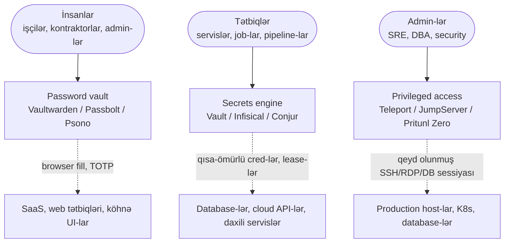

# Açıq Mənbə Secrets Management və Privileged Access

Secret-handling-in üç təbəqəsinə fokuslu səyahət — insanlar üçün password vault-lar, maşınlar üçün secrets engine-lər və admin-lər üçün privileged-access platformaları — və hər təbəqəni per-seat enterprise SKU olmadan əhatə edən açıq mənbə vasitələri.

## Bu nə üçün önəmlidir

`.env` fayllarında, Slack DM-lərində, wiki səhifələrində və paylaşılan admin spreadsheet-lərində olan secret-lər zero-day-lərdən daha çox breach-ə səbəb olur. Pattern depressiv dərəcədə davamlıdır: developer database şifrəsini Confluence səhifəsinə "indilik" yapışdırır, kontraktor API açarını help-desk biletinə screenshot edir, SRE `terraform.tfvars` faylını public repo-da unudur və üç ay sonra başqasının avtomatik scanner-i onu tapır. Bunlar ekzotik hücumlar deyil. Bunlar gigiyena uğursuzluqlarıdır və secrets-management dissiplinini məhz bunun qarşısını almaq üçün mövcuddur.

Dürüst çərçivə budur ki, secret-handling bir problem deyil — üçdür. **İnsanlar** şəxsi və komanda şifrələrinin uzun quyruğunu (Salesforce admin login, ofis Wi-Fi pre-shared key, wire-transfer portalı) saxlamaq üçün yer lazımdır. **Maşınlar** application secret-ləri (database credential-lar, API açarları, TLS private key-lər, signing key-lər) üçün yer lazımdır. **Admin-lər** production-a girəndə nəzarətli, audit edilmiş sessiyalara ehtiyac duyurlar (host-a SSH, prod database-ə qarşı `psql`, cluster-ə qarşı `kubectl`). Bu üç auditoriyanın hər birinin fərqli təhlükə modelləri, fərqli vasitələri və fərqli operativ ritmləri var — və onları qarışdıran stack mühəndislərin production database şifrələrini nənələrinin Netflix üçün istifadə etdiyi eyni vault-a yapışdırması ilə bitir.

Əksər təşkilatlar üçün sual "secrets manager və PAM-a ehtiyacımız varmı" deyil, "hansı açıq mənbə stack altı rəqəmli çek olmadan üç təbəqəni əhatə edir"dir. Kommersial CyberArk, BeyondTrust, Delinea və HashiCorp Vault Enterprise hamısı pilot üçün ucuz başlayır və tez bahalaşır — 200 nəfərlik mühəndis dükanı üçün adi qiymətlər insan hesabları, machine identity-lər və admin sessiyalar qiymətləndiriləndən sonra ildə 40k$–200k$ aralığında olur. `example.local` üçün bu xətt elementi əlavə mühəndis işə götürmək ilə yarışır.

- **Secrets vault olmadan, secret-lər source control və chat-ə yayılır.** Hər developer prod database URL-ın "öz nüsxəsini" shell history-də, `.env.local`-da, Notes app-da və ya Slack DM-də saxlayır. Təhlükəsizlik komandası ilk dəfə təşkilat üzrə secret scanner işlədəndə, bu pis gündür və həmişə pis gündür.
- **PAM olmadan, admin sessiyaları görünməzdir.** "Keçən çərşənbə axşamı saat 03:47-də prod replika üzərində kim `DROP TABLE` işlətdi" sualının bir-klik cavabı olmalıdır. Yolda PAM olmadan, cavab "düşünürük Alex idi amma SSH log rotasiya olunub"-dur.
- **İnsan password vault-u olmadan, sticky note-lar qalib gəlir.** 200 nəfərlik təşkilat SaaS vasitələri, network gear və köhnə admin UI-lar üçün yüzlərlə paylaşılan login toplayır. Sanksiya edilmiş vault yoxdursa, bu credential-lar browser autofill-də, sticky note-larda və fərdi laptop-lardakı bir-defelik şifrə bazalarında yaşayır — heç biri offboarding-dən sağ çıxmır.
- **Açıq mənbə 2026-da hər üç təbəqəni əhatə edir.** HashiCorp Vault, Infisical və Conjur machine secrets-i əhatə edir. Teleport, JumpServer və Pritunl Zero privileged access-i əhatə edir. Vaultwarden, Passbolt və Psono insan şifrələrini əhatə edir. Vasitələr yetkindir, inteqrasiyalar realdır və operator səyi öz infrastrukturunu artıq işlədən hər komanda üçün əldə edilə biləndir.

Bu işin ikinci dərəcəli effekti application təbəqəsində gigiyenadır. Application secret-ləri Vault-da yaşayanda və codebase-də yox, rotasiya mümkündür. Admin sessiyaları Teleport-dan keçəndə, hər `sudo` qeyd olunur. İnsan şifrələri Vaultwarden-də yaşayanda, "wire-transfer portalı şifrəsi" üç adamın xatırladığı şey olmaqdan dayanır və hamı audit edə biləcəyi şeyə çevrilir. Compliance faydaları (SOC 2 CC6, ISO 27001 A.5.17 və A.8.5, PCI DSS 8) əksinə deyil, operativ dissiplindən gəlir.

Bu səhifə açıq mənbə secret-handling landşaftını üç təbəqə üzrə xəritələyir və `example.local`-un onları necə tək koherent stack-a yığacağını göstərir.

## Üç təbəqə diaqramı

Secret-handling bir vasitə deyil — üç fərqli auditoriya, üç fərqli trust model və üç fərqli giriş ritmi olan üç təbəqədir. Hər təşkilatın ilk dəfə etdiyi səhv hər üçü üçün bir vasitə istifadə etməyə çalışmaqdır.

Hər sıranı fərqli sual üçün cavab kimi oxuyun. Üst sıra "insan veb saytı üçün şifrəni harada saxlayır" sualını verir — interaktiv, browser-driven, vaxtaşırı komanda ilə paylaşılan və demək olar ki, həmişə master şifrə və TOTP içərən. Orta sıra "tətbiq başlanğıcda öz database credential-larını necə alır" sualını verir — qeyri-interaktiv, machine-to-machine, ideal olaraq qısa-ömürlü və ümid edilir ki, heç vaxt diskə yazılmamış. Aşağı sıra "insan production-a təhlükəsiz şəkildə necə girir" sualını verir — interaktiv lakin qeyd olunmuş, güclü authentication-la, tam sessiya çəkilişi ilə və dəstəkləyən sistemlər üçün əmr granularity-də aydın audit izi ilə.

Trust modelləri buna uyğun fərqlənir. Password vault insanın etibarlı olduğunu lakin browser-in yox olduğunu fərz edir — encryption at rest, master şifrə, end-to-end vault server yalnız ciphertext saxlamaqla. Secrets engine tətbiqin etibarlı olduğunu lakin deployment substrate-in yox olduğunu fərz edir — qısa lease-lər, dynamic credential-lar, "tətbiqin oxuduğu" və "insanın oxuduğu" arasında möhkəm xətt. PAM admin-in etibarlı olduğunu lakin onun hərəkətlərinin attestasiyaya ehtiyac duyduğunu fərz edir — qeyd olunmuş sessiyalar, sertifikat-əsaslı authentication, dəstəkləyən sistemlər üçün əmr granularity-də RBAC.

## Machine secrets — HashiCorp Vault

HashiCorp Vault sənaye-standart secrets engine-dir — secrets store, authentication broker, transit-encryption servisi və dynamic-credential issuer-i tək HTTP API arxasında bundle edən Go tətbiqidir. Bir çox böyük mühəndis təşkilatında application secret-ləri gücləndirir və "secrets manager-ə ehtiyacımız var" arxitektura nəzərində ortaya çıxanda defolt referans dizayndır.

- **Komponentlər.** Üç primitiv hər Vault deployment-i kompose edir: **secret engine-lər** (statik data üçün KV, dynamic IAM credential-lar üçün AWS, dynamic DB credential-lar üçün database, encryption-as-a-service üçün transit, X.509 sertifikatları vermək üçün PKI, bir-defelik SSH key-lər üçün SSH), **auth metodlar** (servislər üçün AppRole, pod-lar üçün Kubernetes, CI üçün JWT/OIDC, insanlar üçün LDAP/AD, EC2/Lambda üçün AWS) və **siyasətlər** (`path "secret/data/app/*"`-i read/write/list capability-lərinə xəritələyən HCL faylları). Kombinasiya arzu kimi olmayan, tətbiq edilə bilən least-privilege model istehsal edir.
- **Dynamic secret-lər.** Killer xüsusiyyət. Uzun-ömürlü database şifrəsini secret-də saxlamaq əvəzinə, Vault tələb əsasında təzə username/password yaradır, tətbiqə verir və lease bitdikdə ləğv edir. Sızan credential otuz dəqiqə yaşayan credential-dır. Eyni pattern AWS access key-lər, SSH access və Kubernetes service-account token-lər üçün.
- **Transit encryption.** Vault key-management servisi kimi — tətbiqlər plaintext göndərir, Vault ciphertext qaytarır, data-encryption key-lər heç vaxt Vault-dan çıxmır. Bu application-layer encryption (məsələn, database-də həssas PII at rest) istəyəndə hər servisə xam key vermədən düzgün pattern-dir.
- **Güclü tərəflər.** Yetkin, geniş yerləşdirilmiş, geniş inteqrasiya və Terraform/Helm tooling ekosistemi, güclü authentication və audit hekayəsi, blast radius-u həqiqətən azaldan dynamic secret-lər.
- **Kompromislər.** Operativ mürəkkəblik başlığıdır — Vault sealed və unsealed olmalıdır, HA storage backend (Consul, Raft və ya idarə olunan database) tələb edir və konfiqurasiya səthi böyükdür. Digər canlı qayğı lisenziyadır (aşağıya bax).
- **Lisenziya nüansı.** 2023-dən bəri Vault Business Source License (BSL 1.1) altında paylanır ki bu **OSI-təsdiqlənmiş deyil**. Source mövcud qalır və əksər istifadəçilər məhdudiyyətsiz self-host edə bilərlər, lakin dəyişiklik fork-ları motivasiya edib (xüsusilə OpenBao, Linux Foundation fork-u) və bəzi təşkilatları uzun-müddətli öhdəliklərini yenidən nəzərdən keçirməyə vadar edib. Standartlaşdırmadan əvvəl lisenziya şərtlərini öz konkret istifadə halınız üçün yoxlayın.

Seal/unseal modeli izah etməyə dəyər. Vault-un storage backend-i həmişə şifrələnmiş data saxlayır; o data-nı şifrəsiz edən master key Shamir's Secret Sharing vasitəsilə bölünür (adətən beş share, üç-ü yenidən qurmaq üçün lazımdır) və ayrı operatorlar tərəfindən saxlanılır. Restart-dan sonra Vault "sealed"-dir — işləyir lakin öz storage-ını oxuya bilmir — kifayət qədər operator unseal share-lərini verənə qədər. Bu təhlükəsizlik üçün əladır və əməliyyatlar üçün bədbəxtdir, ona görə production deployment-ləri ya auto-unseal istifadə edir (cloud KMS master key saxlayır) ya da operativ ağrını qəbul edir.

Vault-un siyasət dili path-əsaslı access modeli ilə HCL-dir. Tipik siyasət `path "secret/data/example.local/payments/*" { capabilities = ["read"] }` kimi görünür və token, AppRole və ya JWT subject ilə əlaqələndirilir. Granularity `payments-api`-yə öz secret-lərini oxumağa imkan verəcək qədər incədir lakin onun yanındakı `billing-api`-nin yox — ki bu məhz bir servis kompromis olunduqda istədiyiniz xüsusiyyətdir.

## Machine secrets — Infisical

Infisical müasir açıq mənbə alternatividir — UI-first dizayn, doğma CI/CD inteqrasiyaları və MIT lisenziyası olan Node.js/TypeScript secrets management platformasıdır. Vault-dan gəncdir (2022-də başlatılıb) lakin operator təcrübəsinin qalan tooling-ləri ilə uyğun olmasını istəyən greenfield devops komandalarında əhəmiyyətli yerləşmə qazanıb.

- **Devops-uyğun UI.** Infisical-ın secret tree, environment-override-lər və audit log-lar cilalı veb UI-da görünür. Yeni secret əlavə etmək HCL siyasət diff-i deyil, klikdir və UI per secret üçün versiya tarixi və last-modified-by göstərir.
- **Secret syncing.** Doğma inteqrasiyalar secret-ləri Kubernetes, GitHub Actions, GitLab CI, Vercel, Netlify, AWS Parameter Store və uzun siyahısı olan başqalarına push edir. Pattern "secret-lər Infisical-da yaşayır, tətbiqin oxuduğu yerə avtomatik push olur"-dur — ki bu Vault-style runtime API çağırışından qaçır lakin secret-lərin iki yerdə mövcud olmasının kompromisini qəbul edir.
- **Lisenziya.** MIT-lisenziyalı, GitHub-da tam source, lisenziya narahatlığı yoxdur. Bəzi enterprise xüsusiyyətlər (qabaqcıl SSO, audit log saxlanma müddəti, on-premises dəstəyi) ödənişli tier arxasında yaşayır, lakin self-hostable açıq mənbə məhsul əksər təşkilatlar üçün xüsusiyyət-tamdır.
- **Güclü tərəflər.** Müasir UI, ağıllı defolt-lar, güclü CI inteqrasiya hekayəsi, yumşaq öyrənmə əyrisi, yaxşı Docker/Helm təcrübəsi, secret-ləri doğma K8s `Secret` obyektləri kimi materialize edən Kubernetes operator.
- **Kompromislər.** Vault-dan kiçik ekosistem, daha az dynamic-secret backend (Infisical-ın dynamic secret dəstəyi böyüyür lakin hələ cloud və database backend-lər üzrə Vault-un dərinliyinə uyğun deyil) və Node.js footprint Vault-un Go binary-sindən ağırdır.

Vault-dan arxitektur fərqi qeyd etməyə dəyər. Vault-un defolt pattern-i "tətbiq başlanğıcda və lease yenilənməsində Vault-u çağırır"-dır; Infisical-ın defolt pattern-i "secret-lər tətbiqin onsuz da oxuduğu environment-ə push edilir"-dir. Hər ikisi işləyir, hər ikisinin kompromisləri var — Vault sıx revocation və dynamic credential verir, Infisical sadə tətbiq kodu və asan debugging verir. Əksər komandalar Vault-un dynamic backend-ləri idarə etdiyi və Infisical-ın statik-secret + CI inteqrasiya hekayəsini idarə etdiyi hibridə yaxınlaşır.

## Machine secrets — CyberArk Conjur (Open Source)

Conjur ilkin olaraq Conjur Inc tərəfindən qurulmuş, 2017-də CyberArk tərəfindən satın alınmış və CyberArk-ın kommersial PAM portfelinin OSS yoldaşı kimi saxlanan açıq mənbə secrets manager-dir. Apache 2.0 lisenziyası altında paylanan, güclü RBAC modeli və dərin Kubernetes/CI inteqrasiya hekayəsi olan Ruby-on-Rails tətbiqidir.

- **Nədir.** Siyasət-driven secrets manager — secret-lər, role-lar və permission-lar YAML siyasət fayllarında elan edilir, Conjur CLI və ya API vasitəsilə tətbiq edilir və qalan infrastrukturunuz-as-code kimi versiya-nəzarətli olur.
- **Nə vaxt mənalıdır.** Ən güclü hal "biz artıq CyberArk dükanıyıq"-dır — Conjur OSS konseptləri və tooling-i CyberArk-ın kommersial məhsulları ilə paylaşır və enterprise tier-ə böyüsələr CyberArk Vault və PAM-ə təmiz şəkildə qalxan açıq mənbə secrets təbəqəsi istəyən təşkilatlar üçün təbii seçimdir.
- **Güclü tərəflər.** İncə-granular RBAC, deklarativ YAML siyasəti, güclü Kubernetes Authenticator (pod-lar service-account token-lər vasitəsilə authenticate olur), Apache 2.0 lisenziyası, yetkin audit logging.
- **Kompromislər.** Vault və ya Infisical-dan kiçik icma, dokumentasiya CyberArk-dadlı hiss edə bilər (ki bu mövcud CyberArk müştərilərinə kömək edir və başqalarını çaş-baş edir), Ruby-on-Rails footprint və dynamic-secret əhatəsi Vault-unkindən dardır.

Mövcud CyberArk əlaqəsi olmayan təşkilatlar üçün Vault və ya Infisical daha açıq başlanğıc nöqtəsidir. Conjur-un ən güclü nişi insan PAM üçün artıq CyberArk-da standartlaşmış və machine secret-lər üçün eyni konseptual modeli istəyən enterprise-dir.

## Vault vs Infisical vs Conjur — müqayisə cədvəli

| Ölçü | HashiCorp Vault | Infisical | CyberArk Conjur OSS |
|---|---|---|---|
| Lisenziya | BSL 1.1 (OSI deyil) | MIT | Apache 2.0 |
| Dil | Go | TypeScript / Node.js | Ruby on Rails |
| Arxitektura | Tək binary + storage backend | Web app + Postgres | Rails app + Postgres |
| Dynamic secret-lər | Best-in-class (DB, cloud, SSH, PKI) | Böyüyən, daha az backend | Məhdud |
| UI təcrübəsi | Funksional, admin-led | Cilalı, UI-first | Funksional, policy-led |
| CI/CD inteqrasiyaları | API vasitəsilə, yetkin | Əksər CI-yə doğma push | Güclü K8s authenticator |
| Operator mürəkkəbliyi | Yüksək (seal/unseal, HA storage) | Orta | Orta–Yüksək |
| Ən yaxşı | Tam machine-secrets ops | Greenfield devops | CyberArk dükanları |

Əksər `example.local`-formalı təşkilatlar üçün seçim Vault-a (ən yetkin, dynamic secret-lər, BSL nüansını qəbul et) və ya Infisical-a (müasir UX, MIT, daha kiçik dynamic-secret əhatəsini qəbul et) düşür. Conjur strategiyada CyberArk artıq olduqda düzgün cavabdır. Bir çox production stack dynamic backend-lər üçün Vault və statik + CI secret-lər üçün Infisical işlətməklə bitir — iki vasitə təmiz şəkildə birgə yaşayır.

## Privileged Access — Teleport

Teleport müasir açıq mənbə PAM-dır — sertifikat authority, sessiya-recording proxy, RBAC engine və SSH, Kubernetes, RDP, database-lər və veb tətbiqlər üçün protocol-spesifik access-i tək nəzarət müstəvisi arxasında bundle edən Go tətbiqidir. VPN + bastion + ad-hoc access əvəzedicisi kimi cloud-native mühəndis təşkilatlarında geniş yerləşdirilir.

- **Daxili CA.** Teleport authenticate edilmiş istifadəçilərə qısa-ömürlü (adətən 1–8 saat) X.509 və SSH sertifikatları verir və hər qorunan resurs yalnız Teleport CA-ya etibar edir. Daha `~/.ssh/authorized_keys`-də uzun-ömürlü SSH key-lər yox — sertifikat login-də verilir, istifadə olunur və bitir.
- **Protokollar.** SSH (tam sessiya recording və `tsh ssh` UX ilə), Kubernetes (`tsh kube login` qısa-ömürlü kubeconfig verir, bütün `kubectl` çağırışları Teleport-dan axır), RDP (Windows host-lar üçün browser-əsaslı sessiya recording), database-lər (PostgreSQL, MySQL, MongoDB, Redis və başqaları — Teleport wire protocol-u proxy edir və query-ləri qeyd edir) və HTTP tətbiqlər (daxili veb UI-lar üçün reverse-proxy rejimi).
- **Sessiya recording.** Hər interaktiv sessiya qeyd olunur (SSH/`kubectl exec` üçün terminal stream, RDP üçün video, database-lər üçün query log) və S3 və ya local diskdə saxlanılır. Sessiyalar hadisə nəzərə alınması və ya compliance audit-ləri üçün təkrar oxuna bilər.
- **RBAC.** Role-lar istifadəçiləri icazə verilən node-lara, icazə verilən Kubernetes namespace-lərə, icazə verilən database-lərə, icazə verilən əmrlərə xəritələyir. Model request-əsaslı access-i dəstəkləyir (istifadəçi `prod-db-01`-də sudo tələb edir, təsdiqləyici approve klikləyir, access 30 dəqiqə üçün verilir və qeyd olunur).
- **SSO inteqrasiyası.** OIDC və SAML dəstəyi Teleport-un Keycloak, Okta, Entra və Google Workspace-ə upstream identity mənbəyi kimi qoşulması deməkdir.

Sertifikat modeli Teleport-u ənənəvi bastion-dan fərqli hiss etdirən şeydir. Production host-lar üçün `~/.ssh`-də daimi SSH key yoxdur — istifadəçi `tsh login` işlədir, SSO + MFA vasitəsilə authenticate olur və Teleport sessiya pəncərəsi üçün etibarlı sertifikat verir. İstifadəçi log out olduqda (və ya sertifikat bitdikdə), bütün access yox olur. Rotasiya etmək üçün heç nə yoxdur, ləğv etmək üçün heç nə yoxdur, oğurlanmış laptop-da tapmaq üçün heç nə yoxdur.

Kompromis operator mürəkkəbliyidir. Teleport real distributed sistemdir — auth server, proxy server və per-resource agent-lər — və HA deployment planlaşdırma tələb edir (etcd və ya DynamoDB backend, sertifikat trust chain-lər, audit log storage). Open Source nəşri yuxarıda təsvir edilən tam xüsusiyyət dəstini əhatə edir; bəzi qabaqcıl xüsusiyyətlər (FedRAMP/HSM, qabaqcıl sessiya siyasətləri, miqyasda machine ID) Teleport Enterprise-də yaşayır.

## Privileged Access — JumpServer

JumpServer aparıcı açıq mənbə bastion host-dur — Çində FIT2CLOUD tərəfindən ilkin işlənmiş, indi Asiya boyu və getdikcə başqa yerlərdə geniş yerləşdirilmiş Python/Django + Go tətbiqidir. GPLv3 lisenziyası altında tam açıq mənbədir və Teleport ilə eyni SSH/RDP/K8s/DB protokollarını fərqli operator fəlsəfəsi ilə əhatə edir.

- **Asset management.** JumpServer-in data modeli **asset-lər** (host-lar, database-lər, K8s cluster-lər), **hesablar** (JumpServer-in hər asset üçün saxladığı credential-lar) və **istifadəçilər** (qoşulan insanlar) ətrafında mərkəzləşir. UI hər üçünü first-class obyekt kimi idarə edir, ki bu bastion-un "hansı host-lar mövcuddur" üçün mənbə-həqiqət olduğu ənənəvi IT-ops workflow-larına yaxşı uyğun gəlir.
- **Sessiya recording.** SSH üçün tam terminal recording, RDP üçün video recording, database-lər üçün əmr audit-i. Recording-lər axtarıla biləndir və yerli və ya S3-uyğun storage-də saxlanılır.
- **Protokollar.** SSH, RDP, VNC, Telnet (bəli, hələ də köhnə network gear üçün faydalıdır), MySQL, PostgreSQL, MongoDB, Oracle, SQL Server, Redis, Kubernetes. Dəstəklənən protokolların genişliyi həqiqətən təsirlidir — JumpServer çox vaxt köhnə network və storage avadanlığı ilə qutudan çıxan tək açıq mənbə bastion-dur.
- **Veb-əsaslı access.** Əksər sessiyalar Apache Guacamole-style veb rendering vasitəsilə browser-də başlayır — client install lazım deyil ki bu kontraktor və acil-access workflow-ları üçün böyük qələbədir.
- **LDAP/AD + RBAC.** İstifadəçi identity üçün doğma LDAP və AD inteqrasiyası, per asset və per command-acl qaydası rol-əsaslı permission-lar, login-də MFA tətbiqi.

Teleport-dan kompromis arxitektur formasıdır. Teleport sertifikat-firstdir və cloud-native tooling ilə müasir mühəndis komandasını fərz edir. JumpServer bastion-firstdir və operator-un tək məhsulda mərkəzləşdirilmiş credential storage, asset inventarı və sessiya brokering istəməsini fərz edir. Köhnə sistemlərin uzun quyruğu və ənənəvi IT-ops mədəniyyəti olan SSH-ağır mühitlər üçün JumpServer-in modeli çox vaxt Teleport-unkindan yaxşı uyğun gəlir.

Tarixi qeyd: JumpServer admin UI-nın defolt dili Çincədir, İngilis isə setting kimi mövcuddur. Bu Çince danışmayan komandalar üçün friction nöqtəsi idi; son versiyalar İngilis təcrübəsini əhəmiyyətli dərəcədə yaxşılaşdırıb, lakin İngilis dokumentasiya hələ Çince dili dokumentlərindən və icma müzakirəsindən geri qalır.

## Privileged Access — Pritunl Zero

Pritunl Zero sertifikat-əsaslı authentication və veb-əsaslı təsdiq axını ətrafında qurulmuş yüngül zero-trust SSH bastion-dur. Bu fokuslu vasitədir — SSH və HTTP reverse proxy-ni yaxşı edir və tam multi-protocol PAM olmağa çalışmır.

- **Pattern.** İstifadəçilər Pritunl Zero veb portalında SSO + MFA vasitəsilə authenticate olur, host-a access tələb edir və Pritunl Zero qısa-ömürlü SSH sertifikatı verir. İstifadəçinin standart `ssh` client-ı sertifikatı götürür və normal şəkildə qoşulur — xüsusi wrapper əmri yoxdur, sadəcə təzə sertifikatla OpenSSH.
- **HTTP reverse proxy.** Pritunl Zero həmçinin daxili veb tətbiqlərini eyni SSO + MFA + qısa-ömürlü sertifikat modeli ilə qarşıdan ala bilər ki bu kiçik admin UI parkını Authelia və ya oauth2-proxy-ni yanında qurmadan qorumaq üçün ağlabatan seçim edir.
- **Nə vaxt uyğundur.** Access pattern-i əksərən SSH olan, komanda Teleport öyrənmə əyrisi olmadan sertifikat-əsaslı auth istəyən və "sessiya recording" sərt tələb olmayan kiçik və orta mühitlər (Pritunl Zero terminal sessiyalarını doğma qeyd etmir).
- **Güclü tərəflər.** Yüngül, sadə operator modeli, MongoDB backend, təmiz veb UI, mövcud SSH workflow-ları ilə təmiz şəkildə inteqrasiya olunur.
- **Kompromislər.** Teleport və ya JumpServer-dən dar xüsusiyyət səthi — doğma Kubernetes proxy yoxdur, database sessiya recording yoxdur, RDP yoxdur. Orijinal sorğudan "tam sessiya granularity-si yoxdur" tənqidi hələ də keçərlidir.

Pritunl Zero SSH dominant access protokolu olduqda, komanda kifayət qədər kiçik olduqda ki 200-sətirlik config faylı tam PAM platformasından üstündür və audit tələbləri "tam keystroke recording-mız var" deyil "kim nə vaxt giriş etdiyini bilirik" yerində dayandıqda düzgün seçimdir.

## PAM tooling — müqayisə cədvəli

| Capability | Teleport | JumpServer | Pritunl Zero |
|---|---|---|---|
| SSH access | Tam, qeyd olunmuş | Tam, qeyd olunmuş | Tam, sertifikat-əsaslı |
| RDP access | Tam, qeyd olunmuş (browser) | Tam, qeyd olunmuş (browser) | Doğma deyil |
| Database access | Doğma proxy + qeyd | Doğma proxy + qeyd | Doğma deyil |
| Kubernetes access | Doğma (`tsh kube`) | Doğma | Doğma deyil |
| Web app proxy | Bəli (apps rejimi) | Məhdud | Bəli |
| Sessiya recording | Bütün protokollar | Bütün protokollar | Doğma recording yoxdur |
| RBAC granularity | Role + request-əsaslı | Role + command ACL | Rol-əsaslı |
| SSO + MFA | OIDC, SAML, U2F | LDAP, OIDC, MFA | OIDC, U2F |
| Arxitektura | Cert-first, distributed | Bastion-first, monolitik | Cert-first, yüngül |
| Ən yaxşı | Cloud-native full-stack | SSH/RDP-ağır enterprise | SSH-only minimal |

Multi-cloud Kubernetes və güclü devops mədəniyyəti olan təşkilat üçün Teleport adətən cavabdır. Uzun-quyruq köhnə infrastruktur və asset inventar ehtiyacı olan ənənəvi IT-ops üçün JumpServer yaxşı uyğun gəlir. SSH şəklin əksəriyyəti olan kiçik mühitlər üçün Pritunl Zero təmiz yüngül seçimdir. Seçim çox vaxt xüsusiyyət check-list-dən deyil "komandanın mövcud operativ ritmi necə görünür"dən düşür.

## Password vault-lar — Vaultwarden

Vaultwarden Bitwarden server API-nin Rust-əsaslı yenidən tətbiqidir — rəsmi Bitwarden client tətbiqləri (browser, mobil, masaüstü, CLI) ilə tam uyğundur, lakin kiçik, sürətli və asan self-host olmaq üçün dizayn edilib. Kiçik komanda üçün Raspberry Pi-də və ya daha böyük təşkilat üçün 1 GB VM-də rahat işləyir və AGPL altında lisenziyalanır.

- **Nədir.** Drop-in Bitwarden-uyğun server — hər Bitwarden client-i öz Vaultwarden URL-ınıza yönəldin və sadəcə işləyir. Vault-lar, təşkilatlar, kolleksiyalar, sharing, send link-ləri, fayl attachment-ləri, TOTP storage və şifrə generasiyası tam bitwarden.com-a qarşı olduğu kimi davranır.
- **Bitwarden client uyğunluğu.** Bu killer xüsusiyyətdir. Bitwarden-in client-ləri əladır — first-class browser extension-ları, biometric unlock-lu mobil tətbiqləri, cilalı masaüstü tətbiq, scriptable CLI — və Vaultwarden onların hamısını öz nəzarət etdiyiniz server-ə qarşı istifadə etməyə imkan verir. Bitwarden Free Family for Org xüsusiyyətləri və əksər Bitwarden Premium client xüsusiyyətləri (TOTP, attachment-lər, emergency access, security report-lar) Vaultwarden-ə qarşı işləyir, çünki client-lər bitwarden.com ilə danışmadıqlarını bilmir.
- **Resurs footprint.** Tək Rust binary plus SQLite (və ya Postgres/MySQL) database. Docker image təxminən 100 MB-dır; kiçik deployment 256 MB RAM-dan çox az istifadə edir.
- **Güclü tərəflər.** Kiçik footprint, tam Bitwarden client uyğunluğu, aktiv maintainer, ağıllı defolt-lar, asan backup (`/data` qovluğu + database).
- **Kompromislər.** İcma-saxlanılır — arxasında rəsmi Bitwarden dəstək kontraktı yoxdur və bir neçə enterprise-tier Bitwarden xüsusiyyətləri (bəzi SSO axınları, qabaqcıl siyasət, müəyyən compliance reporting) ya geri qalır ya da fərqli işləyir. Bitwarden-ə lisenziya əlaqəsi dostca lakin formal deyil.

Vaultwarden haqqında ən vacib operativ qeyd backup-dır. Sistemin bütün vəziyyəti — hər secret, hər attachment, hər istifadəçi — `/data` qovluğunda (və ya işarə etdiyi database-də) yaşayır. `/data`-nı itirin və vault-u itirdiniz. Düzgün pattern `/data` plus database-in gecə off-host backup-larıdır, eyni host-da saxlanmayan key ilə şifrələnmiş, üç-aylıq restore test-ləri ilə. Bunu keçin və ilk disk uğursuzluğu vault-un mövcud olduğu son gündür.

Əksər təşkilatlar üçün Vaultwarden plus rəsmi Bitwarden client-lər mövcud ən yüksək-leveraj açıq mənbə təhlükəsizlik seçimidir — insan-şifrə problemini tam həll edir, işlətmək üçün demək olar ki heç nəyə başa gəlmir və hər işçiyə şəxsi şifrələri üçün də istifadə edə biləcəyi vasitə verir.

## Password vault-lar — Passbolt

Passbolt GPG-əsaslı end-to-end encryption ətrafında qurulmuş komanda-yönəlmiş açıq mənbə şifrə manager-dir. Bir adama credential-a access vermək folder strukturunun yan effekti deyil first-class əməliyyat olan kollaborativ sharing üzərində güclü fokuslu PHP tətbiqidir. Passbolt AGPL altında lisenziyalanır, ödənişli Pro tier SSO, qabaqcıl audit və directory sync əlavə edir.

- **Komanda-yönəlmiş dizayn.** Passbolt-un əsas vahidi "paylaşılan şifrə"-dir — vault tərəfindən saxlanılan və xüsusi istifadəçilərə və ya qruplara açıq şəkildə (oxu və ya oxu/yaz permission-larla) verilən credential. Sharing per credential audit edilə bilən və ləğv edilə biləndir, ki bu komanda workflow-larına əksər digər vault-lardakı şəxsi-vault-paylaşılan-folder modelindən yaxşı uyğun gəlir.
- **GPG kripto.** Hər istifadəçinin enrolment-də generasiya edilən GPG keypair-i var; secret-lər paylaşıldıqda alıcının public key-inə şifrələnir. Server heç vaxt plaintext görmür və istifadəçinin access-ini ləğv etmək secret-i qalan alıcılara yenidən şifrələmək tələb edir — böyük miqyasda yavaş lakin kriptoqrafik təmiz.
- **Browser extension + UI.** First-class Chrome və Firefox extension-ları, idarəetmə üçün veb UI, oxu access üçün mobil tətbiqlər. Browser extension credential-ları auto-fill edir və encryption-ı client tərəfdə idarə edir.
- **Güclü tərəflər.** Həqiqətən komanda-first dizayn, end-to-end GPG encryption, granular per-credential sharing, AGPL lisenziyası, ödənişli tier-də yetkin LDAP/AD inteqrasiyası.
- **Kompromislər.** Setup Vaultwarden-dən ağırdır (PHP + MySQL + GPG konfiqurasiyası), mobil və offline access tarixən Bitwarden-dən geri qalıb və GPG modeli — kriptoqrafik güclü olsa da — key-lər itirildikdə və ya rotasiya olunduqda operativ overhead əlavə edir.

Passbolt komanda-paylaşılan credential-lar dominant istifadə halı olduqda və təhlükəsizlik mədəniyyəti əksər digər vault-larda daha icazə verən folder-əsaslı sharing üzərindən açıq sharing modellərini qiymətləndirdikdə düzgün seçimdir.

## Password vault-lar — Psono

Psono güclü API səthi və Docker-first deployment hekayəsi olan alternativ komanda-yönəlmiş açıq mənbə şifrə manager-dir. Apache 2.0 (community nəşri; bəzi enterprise xüsusiyyətləri GPL və ya proprietary-dir) altında lisenziyalanır və avtomatlaşdırma üçün real REST API olan password vault istəyən təşkilatları hədəf alır.

- **Nədir.** End-to-end client-side encryption, browser extension-lar, mobil tətbiqlər və proqram giriş üçün dokumentləşdirilmiş REST API olan multi-user, multi-tenant password vault.
- **Güclü tərəflər.** Avtomatlaşdırma üçün güclü API (password vault-lar arasında nadirdir), file-secret dəstəyi (şifrələr yanında binary blob-ları saxla), LDAP və SAML inteqrasiyası, granular per-secret access nəzarəti, Docker-first deployment.
- **Kompromislər.** UI Bitwarden və ya Passbolt-dan az cilalıdır, kiçik icma və bəzi enterprise xüsusiyyətləri community core-dan az-icazə verən lisenziya ilə ödənişli tier arxasında yaşayır.

Psono ən yaxşı təşkilatın avtomatlaşdırma üçün API access lazım olduqda (deployment pipeline-larına credential provisioning, skriptlərdən service hesab şifrələrinin rotasiyası) və o capability üçün UI cilanı dəyişdirməyə hazır olduqda uyğun gəlir. Saf insan istifadəsi üçün Vaultwarden və ya Passbolt adətən gündəlik təcrübədə qalib gəlir.

## Vasitə seçimi — müqayisə cədvəli

| Ehtiyac | Seç | Qeydlər |
|---|---|---|
| Dynamic credential-larla tam machine-secrets ops | HashiCorp Vault | Yetkin, geniş backend dəstəyi, BSL nüansını qəbul et |
| Greenfield devops, CI və K8s-də secret-lər | Infisical | MIT, müasir UX, doğma CI inteqrasiyaları |
| Açıq mənbə yoldaş istəyən mövcud CyberArk dükanı | CyberArk Conjur OSS | Apache 2.0, CyberArk PAM-ə qalxır |
| Bütün təşkilat üçün insan şifrələri | Vaultwarden | Ən yaxşı Bitwarden-uyğun self-hosted server |
| Komanda-first GPG-şifrələnmiş credential sharing | Passbolt | Sharing first-class əməliyyat kimi |
| Güclü REST API olan password vault | Psono | Avtomatlaşdırma UX cilasından önəmli olduqda |
| Full-stack PAM (SSH, RDP, K8s, DB) | Teleport | Cert-first, müasir, cloud-native |
| SSH/RDP-ağır estate-lər üçün asset-inventory bastion | JumpServer | Bastion-first, ən geniş protokol əhatəsi |
| Yüngül SSH-only bastion | Pritunl Zero | PAM ağırlığı olmadan sertifikat-əsaslı SSH |

Vasitələri qarışdırmaqda utanc yoxdur — `example.local` dynamic application secret-ləri üçün Vault, insan şifrələri üçün Vaultwarden və admin sessiyalar üçün Teleport işlətməklə bitir, hamısı eyni vaxtda. Bu tam secret-handling stack-ın normal formasıdır. Səhv üç komplementar vasitə hər biri öz işini yaxşı edə biləcəyi halda, bir vasitə seçib hər üç işi pis etməyə əyməkdir.

## Praktiki məşq

`example.local` üçün homelab və ya sandbox-da bunu konkret etmək üçün beş məşq.

1. **Vault-u dev rejimində yerləşdirin və secret saxlayın/alın.** `vault server -dev` işlədin, `VAULT_ADDR=http://127.0.0.1:8200` və `VAULT_TOKEN=<root-token>` təyin edin, sonra `vault kv put secret/example.local/api key=hello && vault kv get secret/example.local/api`. JSON cavabı yoxlayın, sonra HTTP API vasitəsilə token ilə secret-i oxuyan 10-sətirlik skript yazın. Məqsəd auth metodları və ya siyasətlər əlavə etmədən əvvəl read/write loop-u end-to-end başa düşməkdir.
2. **Vaultwarden + Bitwarden CLI-ı iş stansiyasında qurun.** Vaultwarden-i `docker run -d --name vaultwarden -v /opt/vaultwarden:/data -p 8000:80 vaultwarden/server:latest` vasitəsilə yerləşdirin, Bitwarden CLI-ı (`bw`) install edin, `bw config server http://localhost:8000` ilə öz Vaultwarden URL-ınıza yönləndirin, istifadəçi yaradın, log in edin (`bw login`), vault-u kilidsizləyin və `bw create item` və `bw get item` vasitəsilə credential saxlayın/alın. Eyni credential-ların Bitwarden browser extension-da görünməsini təsdiq edin.
3. **Vault dynamic DB credential-larını sample tətbiqə inteqrasiya edin.** Vault-un database secrets engine-ini test PostgreSQL üçün konfiqurasiya edin, bir cədvəldə `SELECT` ilə qısa-ömürlü (5-dəqiqəlik) credential verən role yaradın, sonra Vault-dan credential alan, DB connection açan, query işlədən və çıxan kiçik tətbiq yazın. pg-nin `pg_stat_activity`-də credential-ın bitməsini izləyin və təzə alma yenisini verdiyini təsdiq edin.
4. **Teleport-u yerləşdirin və test host-a onun vasitəsilə SSH edin.** Docker-də Teleport auth+proxy server işlədin, hədəf VM-də `teleport-node` install edin, VM-i qeydiyyatdan keçirin, `tsh login --proxy=teleport.example.local` ilə log in edin, sonra `tsh ssh user@target-vm`. Sessiyanın audit log-da qeyd olunduğunu təsdiq edin və Teleport UI-dan təkrar oxuyun. Bonus: RBAC aktiv edin və sudo access üçün təsdiq tələb edin.
5. **Passbolt-u 5-nəfərlik komanda üçün konfiqurasiya edin.** Passbolt-u Docker Compose vasitəsilə yerləşdirin, beş istifadəçi hesabı yaradın, hər biri üçün enrolment axını vasitəsilə GPG key generasiya edin, sonra paylaşılan "Office wifi password" credential yaradın və iki istifadəçiyə oxu access və birinə oxu/yaz verin. İstifadəçinin access-ini ləğv edin və credential-ın qalan alıcılara yenidən şifrələndiyini təsdiq edin.

Beş məşqdən sonra öyrənən secrets engine-də read/write loop, Bitwarden client + self-hosted server kombinasiyası, real backend-ə bağlanmış dynamic secret-lər, audit-li sertifikat-əsaslı PAM access və GPG-əsaslı komanda-paylaşma modeli ilə rahat olmalıdır. Bu beş capability açıq mənbə secret-handling operator-un həftəlik etdiyi işin təxminən 80%-ni əhatə edir.

Bunlar yerləşəndən sonra faydalı altıncı məşq: Vaultwarden, Vault və Teleport-u tək SSO upstream-ə (IAM dərsindən Keycloak) inteqrasiya edin ki hər üç vasitə bir login identity paylaşsın. Hər biri üçün plumbing OIDC-dir, lakin eyni istifadəçinin bir klikdə hər üçünə login etməsini görmək secret-handling stack üzrə federate edilmiş identity üçün "aha" anıdır.

## İşlənmiş misal — `example.local` "1Password-da paylaşılan root şifrə"-dən köç edir

`example.local` 200-nəfərlik mühəndis təşkilatıdır ki onun bütün secret-handling strategiyası: "paylaşılan root şifrə 1Password-da yaşayır, üç adam bilir, application secret-lər private repo-ya commit olunmuş `.env` fayllarında yaşayır və admin SSH Slack DM-lər vasitəsilə paylanan şəxsi key-lərlə baş verir"-di. SOC 2 Type 2 readiness baxışı zamanı audit nəticələri yenidən qurmanı qeyri-opsional etdi.

- **İnsan şifrələri — Vaultwarden.** Kiçik VM-də tək Vaultwarden instansiyası, gündəlik şifrələnmiş `/data` plus database backup-ları off-site bucket-ə. Hər işçi enrol olur, rəsmi Bitwarden browser extension MDM vasitəsilə push edilir və köhnə 1Password 60-günlük pəncərə üzərində aydın miqrasiya playbook-u ilə dekomissiya edilir. Office Wi-Fi, SaaS admin login-ləri və wire-transfer portalı credential-ı hamısı açıq RBAC-lı paylaşılan Vaultwarden təşkilatlarında yaşayır.
- **Application secret-lər — Vault.** Raft storage-lı iki-node Vault cluster, cloud KMS vasitəsilə auto-unseal, insanlar üçün OIDC auth metodu və servislər üçün AppRole kimi mövcud Keycloak ilə inteqrasiya edilmiş. Hər tətbiq adına uyğun Vault path (`secret/data/example.local/payments`, `secret/data/example.local/billing`) və yalnız oxu access verən siyasət alır. Database credential-ları dynamic-dir — payments servisi başlanğıcda təzə PostgreSQL credential tələb edir, 1-saatlıq lease üçün saxlayır və yenilənmədə rotasiya edir.
- **Admin sessiyalar — Teleport.** Mövcud load balancer arxasında Teleport auth+proxy cluster, Keycloak vasitəsilə OIDC SSO, login-də tətbiq edilən WebAuthn MFA. Hər production host Teleport agent işlədir; SSH, `kubectl` və PostgreSQL access hamısı tam sessiya recording ilə Teleport-dan axır. Production üçün şəxsi SSH key-lər silinir; içəriyə yeganə yol qısa-ömürlü Teleport-tərəfindən-verilən sertifikatlar vasitəsilədir.
- **Audit + SOC 2.** Vaultwarden access log-ları, Vault audit log-u və Teleport sessiya recording-ləri hamısı mərkəzi SIEM-ə göndərilir. Üç-aylıq access baxışları "kim nəyi oxuya bilər" və "kim hara SSH edə bilər" üçün mənbə-həqiqət kimi Vault siyasəti və Teleport role export-larını istifadə edir. Auditor-un "mənə production dəyişikliyinin recording-ini göstərin" sualı indi bir-link cavabı var.
- **Xərc.** Avadanlıq: Vault cütü, Vaultwarden VM və Teleport cluster üzrə ~$2,500. Abunəliklər: $0. Mühəndislik: build üçün bir mühəndisin vaxtının ~6 həftəsi, davamlı operasiyalar və onboarding üçün bir FTE-nin ~15%-i.

Əvvəlki birləşdirilmiş HashiCorp Vault Enterprise + Teleport Enterprise + 1Password Business + CyberArk pilot kotirovkası ildə $95k idi. Açıq mənbə yenidən qurma doqquz aydan az müddətdə geri ödəyir və `example.local`-u tam nəzarət etdikləri stack-la qoyur — per-seat eskalasiya yoxdur, sürpriz SKU yenidən-paketləşdirmə yoxdur və end-to-end aydın audit izi.

Maliyyə olmayan qələbələr çox güman ki daha böyükdür. "Paylaşılan root şifrə" anti-pattern-i yox olub — hər privileged hərəkət qeyd olunmuş sessiya vasitəsilə adlandırılmış adama atribut edilir. Application secret-ləri artıq source control-a sızmır çünki sızmaq üçün rahat yer yoxdur. Offboarding indi Keycloak SSO + Teleport role link vasitəsilə leaver-in bütün sistemlərə access-ini dəqiqələr içində silir. Növbəti dəfə təhlükəsizlik komandasından "Y-də X-i kim işlətdi" soruşulduqda, cavab bir-klik report-dur.

## Troubleshooting və tələlər

Açıq mənbə secret-handling layihəsini "qələbə"dən "peşmançılıq"a çevirən uğursuzluq rejimlərinin qısa siyahısı. Bunların əksəriyyəti yeni deyil — onlar kommersial vault-ların da çatdığı eyni pattern-lərdir — lakin açıq mənbə stack onları daha tez üzə çıxarır çünki sizin adınızdan kobud kənarları örtən idarə olunan-servis komandası yoxdur.

- **Vault sealing/unsealing operativ ağrı.** Vault restart cluster-i sealed qoyur və kifayət qədər operator unseal share-lərini verənə qədər öz storage-ını oxuya bilmir. Production deployment-ləri auto-unseal istifadə etməlidir (cloud KMS və ya HSM) — saat 3-də manual seal/unseal outage-lər və yanmış operatorlar üçün reseptdir. Recovery key sahiblərini dokumentləşdirin, recovery axınını üç-aylıq test edin.
- **Vault BSL lisenziya şoku.** Komandalar bəzən Vault-u hələ də MPL 2.0 olduğunu fərz edərək yerləşdirir, sonra procurement və ya compliance baxışı zamanı BSL-i kəşf edirlər. Standartlaşdırmadan əvvəl lisenziya sualını cavablandırın — bir çox istifadə halı üçün BSL 1.1 yaxşıdır, lakin "rəqib təklif təmin etmək üçün production istifadəsi"nin başa düşməyə dəyər məhdudiyyətləri var. OpenBao BSL sərt blok olduqda viable Apache-2.0 fork-dur.
- **Vaultwarden backup sadəcə `/data` (və database)-dir.** Vaultwarden-in bütün vəziyyəti — hər secret, hər attachment, hər istifadəçi — `/data`-da və konfiqurasiya edilmiş database-də yaşayır. Hər ikisini itirin və vault-u itirdiniz. Gecə off-host şifrələnmiş backup-lar, üç-aylıq restore test-ləri və dokumentləşdirilmiş disaster-recovery runbook-u qeyri-opsionaldır.
- **Teleport CA rotation.** Teleport-un sertifikat authority-si dövri olaraq rotasiya olunmalıdır (illik ağıllı defolt-dur) və rotasiya hər Teleport-qorunan resursa toxunan multi-step əməliyyatdır. Rotasiyalar production-da agent yeni CA-ı buraxdıqda uğursuz olub — staging-də rotasiyanı təcrübə edin, agent versiyalarını monitor edin və CA rotation-ın sizi sürpriz etməsinə icazə verməyin.
- **Heç kimin əslində işlətmədiyi secret-rotation workflow-ları.** Komandalar siyasət sənədində "biz database şifrələrini üç ayda bir rotasiya edirik" elan edir və sonra heç vaxt etmir çünki rotasiya manualdır, qorxuludur və sahibi yoxdur. Düzəliş dynamic secret-lərdir (rotasiya avtomatikdir) və ya adlandırılmış sahiblər və təqvim-driven xatırlatmalarla real runbook-dur. Arzu siyasəti dürüst rotasiya-yox-dan pisdir çünki auditora yalan deyir.
- **CI log-larında secret-lər.** Vault və ya Infisical-da düzgün saxlanılan secret hələ də debug skriptində `echo $DB_PASSWORD` vasitəsilə CI log-a printed olmaqla sıza bilər. CI provider-in secret-masking xüsusiyyətlərini istifadə edin, `set -x` style debugging üçün pipeline-ları audit edin və hər pipeline log-unu sübuta yetirilənə qədər potensial public kimi yanaşın.
- **Bitwarden client uyğunluq nüansları.** Vaultwarden Bitwarden API-ı yaxından izləyir, lakin vaxtaşırı geri qalır — Bitwarden yeni xüsusiyyət göndərəndə (yeni SSO axını, yenilənmiş security report, yeni emergency-access axını) Vaultwarden dəstəyi günlər və ya həftələrlə izləyir. Premium xüsusiyyətin işlədiyini fərz etməzdən əvvəl Vaultwarden release qeydlərini Bitwarden client versiyasına qarşı yoxlayın.
- **MFA-nı yan keçən service hesablar.** Hər secrets manager və PAM CI və ya backend job-lardan API-ləri çağırmaq üçün mövcud olan bir neçə "avtomatlaşdırma" hesabı böyüdür. Bu hesablar TOTP istifadə halına uyğun gəlmədiyi üçün çox vaxt MFA-istisna olur — və sonra onları top-tier kompromis hədəflərinə çevirən geniş permission-ları sakitcə yığır. Rotasiya olunmuş secret-li OAuth client credential-ları istifadə edin, hər birini sıx əhatə edin və üç-aylıq audit edin.
- **Yeganə yol kimi PAM SPOF olur.** Teleport və ya JumpServer production-a çatmaq üçün yeganə yol olduqda, PAM-in outage-i hər operativ leverin outage-idir. Dokumentləşdirilmiş break-glass yol saxlayın (acil credential-larla möhürlənmiş zərf, ayrı out-of-band SSH bastion, "Teleport sıradan çıxıb" üçün aydın runbook) və ildə ən az bir dəfə test edin.
- **Smart quote-lar tərəfindən pozulmuş Mermaid diaqramları.** Bu stack-dakı diaqramlar düz ASCII bracket və oxları fərz edir. Word processor-dan smart quote-ları, em-dash-ləri və ya non-breaking space-ləri yapışdırmaq render-i sakitcə pozacaq. Secrets/PAM diaqramlarını doc tool-da deyil, code editor-də edit edin.

## Əsas çıxarışlar

Bu fəsildən xatırlamaq üçün başlıq nöqtələri, handover və ya yenilənmə üçün sıxılmış.

- **Secret-handling üç problemdir, bir deyil** — insanlara password vault, maşınlara secrets engine, admin-lərə privileged-access platforma lazımdır. Tək vasitə hər üçünü yaxşı edə bilməz; iki və ya üç komplementar məhsul qarışdırmaq normal formadır.
- **HashiCorp Vault machine-secrets defolt-dur**, ən geniş dynamic-secret əhatəsi və ən dərin ekosistemi ilə. BSL lisenziya dəyişikliyi realdır lakin əksər istifadə hallarını blok etmir — şərtləri yoxlayın, sonra commit edin.
- **Infisical müasir devops alternatividir**, xüsusilə MIT lisenziyası və cilalı UI-nın ən dərin dynamic-secret backend əhatəsindən önəmli olduğu greenfield CI + Kubernetes workload-ları üçün.
- **Vaultwarden insan şifrələri üçün ən yüksək-leveraj açıq mənbə təhlükəsizlik seçimidir.** Kiçik footprint, tam Bitwarden client uyğunluğu, drop-in self-host. `/data`-nı işiniz ondan asılı kimi backup edin, çünki həqiqətən asılıdır.
- **Teleport cloud-native PAM defolt-dur**, sertifikat-first model ilə həqiqətən uzun-ömürlü SSH key-ləri şəkildən silir. JumpServer SSH/RDP-ağır ənənəvi estate-lərə yaxşı uyğun gəlir; Pritunl Zero SSH-only minimal ehtiyaclara uyğun gəlir.
- **Dynamic secret-lər operativ açardır.** Heç kimin işlətmədiyi rotasiya dürüst rotasiya-yox-dan pisdir. Rotasiya-nı arzu deyil, avtomatik edən vasitə seçin.
- **Backup, break-glass və CA rotation üçün plan qurun.** İtirilmiş Vaultwarden `/data`, ilişib qalmış Vault seal və ya pis həyata keçirilmiş Teleport CA rotation-u hər biri hazırlıq olmadan multi-day outage-lərə çevrilir. Secret-handling stack-i ən kritik sistem kimi qəbul edin, çünki həqiqətən belədir.
- **Mərhələlər üzrə yayın.** İnsan şifrələri əvvəl (acil qələbə, az risk), sonra application secret-ləri (orta səy, böyük geri qaytarma), sonra admin PAM (ən yüksək səy, ən böyük audit qələbəsi). Hər üçünü eyni anda landing etməyə çalışmaq bu layihələrin ən çox dayanma səbəbidir.
- **Identity federate edin.** Hər üç təbəqəni (Vaultwarden, Vault, Teleport) bir SSO upstream-ə qoşun ki tək login disable hər şeyi silsin. Bu qalan stack-ı işlətməyə dəyər edən təhlükəsizlik xüsusiyyətidir.
- **Secret-handling-i layihə deyil, məhsul kimi qəbul edin.** İlk rüb install-dır; hər rüb sonra yeni tətbiqlərin inteqrasiyası, köhnələrin təqaüdə çıxarılması, token-lərin rotasiyası və stack-in patch-idir. Build sprint-i deyil, davamlı operator vaxtı üçün büdcə qurun.

## İstinadlar

Bu fəsli dəstəkləyən vendor və standart istinadları — stack-i dizayn edərkən və ya işlədərkən bunları əldə altında saxlayın.

- [HashiCorp Vault — vaultproject.io](https://www.vaultproject.io)
- [Infisical — infisical.com](https://infisical.com)
- [CyberArk Conjur OSS — conjur.org](https://www.conjur.org)
- [OpenBao — openbao.org](https://openbao.org)
- [Teleport — goteleport.com](https://goteleport.com)
- [JumpServer — jumpserver.org](https://www.jumpserver.org)
- [Pritunl Zero — pritunl.com/zero](https://pritunl.com/zero)
- [Vaultwarden — github.com/dani-garcia/vaultwarden](https://github.com/dani-garcia/vaultwarden)
- [Bitwarden — bitwarden.com](https://bitwarden.com)
- [Passbolt — passbolt.com](https://www.passbolt.com)
- [Psono — psono.com](https://psono.com)
- [NIST SP 800-57 — Recommendation for Key Management](https://csrc.nist.gov/publications/detail/sp/800-57-part-1/rev-5/final)
- [NIST SP 800-63B — Digital Identity Guidelines](https://pages.nist.gov/800-63-3/sp800-63b.html)
- [CIS Controls v8 — Control 5 (Account Management)](https://www.cisecurity.org/controls/account-management)
- [CIS Controls v8 — Control 6 (Access Control Management)](https://www.cisecurity.org/controls/access-control-management)
- [OWASP Secrets Management Cheat Sheet](https://cheatsheetseries.owasp.org/cheatsheets/Secrets_Management_Cheat_Sheet.html)
- [PCI DSS v4.0 — Requirement 8 (Identify and Authenticate)](https://www.pcisecuritystandards.org/document_library/)
- [SOC 2 Trust Services Criteria — CC6 (Logical Access)](https://www.aicpa-cima.com/topic/audit-assurance/audit-and-assurance-greater-than-soc-2)
- Əlaqəli dərslər: [Açıq Mənbə Stack İcmalı](./overview.md) · [IAM və MFA](./iam-and-mfa.md) · [Firewall, IDS/IPS, WAF](./firewall-ids-waf.md) · [SIEM və Monitoring](./siem-and-monitoring.md) · [Jump Server](../../servers/services/jump-server.md)
