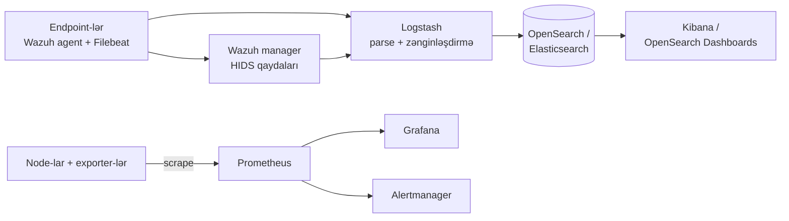
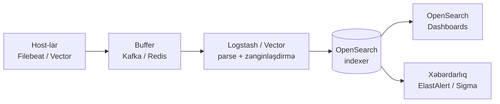

# Açıq Mənbə SIEM, Loglama və Monitorinq

Müdafiəolunan mühitin aşkarlama və müşahidə qabiliyyəti qatlarını təşkil edən açıq mənbə alətlərinə fokuslu baxış — kiçik komandaların Splunk-ölçülü hesab olmadan idarə edə biləcəyi host-əsaslı intrusion detection agentləri, log aqreqasiya boru kəmərləri və infrastruktur monitorinq mühərrikləri.

Bu səhifə [Firewall, IDS/IPS, WAF və NAC](./firewall-ids-waf.md) dərsində əhatə olunan perimetr nəzarətlərini artıq yerləşdirdiyinizi nəzərdə tutur. Buradakı aşkarlama stack-ı agentlərdən gələn host telemetriyası ilə birlikdə həmin nəzarətlərin istehsal etdiyi telemetriyanı istehlak edən şeydir.

## Bu nə üçün önəmlidir

Görmədiyinizi müdafiə edə bilməzsiniz. İndiyə qədər yazılmış hər insident cavab post-mortem-i eyni birinci tapıntıya malikdir: siqnal log-larda idi, lakin heç kim baxmırdı. Kommersial SIEM işlədən komanda üçün "baxmaq" təxminən günlük gigabayt həcmində cavan mühəndisin qiymətinə başa gəlir — və əksər təşkilatlar ya kvotanın altında qalmaq üçün log-ları atırlar, ya da heç vaxt baxmadıqları görünüş üçün ödəyirlər.

Aşkarlama-və-monitorinq qatı həm də təhlükəsizlik və platforma mühəndisliyinin təbii şəkildə görüşdüyü yerdir. Wazuh xəbərdarlıqlarını saxlayan eyni OpenSearch klasteri tətbiq log-larını saxlaya bilər; CPU-ya baxan eyni Prometheus dəqiqədə autentifikasiya uğursuzluqlarına baxa bilər. Buna görə də açıq mənbə müşahidə qabiliyyəti stack-ına investisiya hər iki komandaya dividend ödəyir — və *investisiya etməmənin* xərci növbəti insident zamanı saat 3-də ayaq üstə olan şəxsin üzərinə qeyri-mütənasib şəkildə düşür.

`example.local` üçün — real aşkarlama əhatəsinə ehtiyacı olan, lakin illik 200,000$-lıq Splunk Enterprise qiymətini qaldıra bilməyən 200 nəfərlik mühəndislik təşkilatı — açıq mənbə aşkarlama və monitorinq stack-ı ciddi alternativdir. **Wazuh + OpenSearch + Prometheus + Grafana** endpoint HIDS, log aqreqasiyası, dashboard-lar, xəbərdarlıq və infrastruktur metrikləri əhatə edir, hardware hesabı tək rack-a sığır və mühəndislik hesabı kadr sayında deyil, FTE-fraksiyalarında ölçülür.

- **Görünürlük aşkarlamanın təməlidir.** Firewall-lar bloklayır, EDR tutur, lakin heç biri sizə son 30 gündə mühitdə baş vermişlərin hekayəsini danışmır. O hekayə aqreqasiya olunmuş log-larda, host telemetriyasında və metriklərdə yaşayır — və yalnız onu insidentdən əvvəl topladıqda və indeksləşdirdikdə əldə edirsiniz.
- **Kommersial SIEM xərcləri risk ilə yox, log həcmi ilə miqyaslanır.** Splunk, Sentinel və QRadar — hamısı qəbul edilmiş gigabayta görə hesab göndərir. OpenSearch + Wazuh üzərində eyni həcm təxminən GB başına xərcin 10%-i ilə commodity storage-da işləyir.
- **HIDS şəbəkə IDS-in qaçırdığını tutur.** Suricata məftil üzərində paketləri görür; Wazuh host-da `auditd`, file integrity, registry dəyişiklikləri və proses ağaclarını görür. Onlar tamamlayıcıdır, artıq deyil.
- **Monitorinq aşkarlamanın əkizidir.** Prometheus-dan "xidmət sıradan çıxıb" xəbərdarlığı bəzən hücumun ilk əlamətidir — ransomware xidmətləri çökdürür, webshell CPU-nu tükəndirir və ya hücumçu loglama daemon-larını dayandırır. Monitorinq stack-ına SIEM-in həmtayı kimi yanaşın, ayrı bir əməliyyat narahatlığı kimi yox.
- **Uyğunluq log saxlama yerində yaşayır.** PCI-DSS, ISO 27001, SOC 2 və əksər tənzimləyici rejimlər mərkəzləşdirilmiş log saxlama, bütövlük qoruması və giriş icmalı tələb edir. Açıq mənbə stack-ı üçü də adam başına lisenziya olmadan idarə edir — siz diskləri və siyasəti təmin edirsiniz.
- **Müşahidə qabiliyyəti və təhlükəsizlik birləşir.** Əvvəllər iki paralel stack olan şey (bir tərəfdə DevOps metrikləri, digər tərəfdə təhlükəsizlik log-ları) getdikcə bir paylaşılan telemetriya müstəvisinə çevrilir. Onu açıq mənbə ilə əvvəldən qurmaq beş il sonra "log-ları təhlükəsizlik alətlərinə miqrasiya etməliyik" ağrılı layihəsindən qaçırır.

Bu səhifə üç müşahidə qabiliyyəti ailəsini — **HIDS/SIEM, log aqreqasiyası, infrastruktur monitorinqi** — aparıcı açıq mənbə alətlərinə xəritələyir, hər birinin haraya uyğun gəldiyini izah edir və kopyalaya biləcəyiniz konkret deployment eskizi verir.

## Stack icmalı

Üç ailə iki paralel data axını ilə tək telemetriya yoluna birləşir — SIEM/log yolu ilə hadisələr, monitorinq yolu ilə metriklər. Hər ikisi dashboard və xəbərdarlıq router-lərində bitir, lakin saxlama mühərrikləri və sorğu dilləri qəsdən fərqlidir.

Diaqramı data axını kimi oxuyun, deployment kimi yox. Praktikada Wazuh manager, Logstash və OpenSearch üç qutuda və ya kiçik sayt üçün bir güclü node-da yaşaya bilər; Prometheus və Grafana adətən ayrı monitorinq host-unu paylaşırlar. Məsələ boru kəmərinin *formasıdır* — kənarda agentlər və shipper-lər, ortada parsing, axtarış üçün indeks, insanlar üçün dashboard-lar və log saxlama yerindən keçməyən paralel metrik yolu.

Diaqramdan mənimsənilməli iki nümunə. Birincisi, **log-lar və metriklər yaxşı səbəbdən fərqli yollarla səyahət edir**: log datası yüksək həcmlidir, sxema-elastikdir və istintaq zamanı insanlar tərəfindən sorğulanır; metrik datası aşağı həcmlidir, sabit-sxemalıdır və hər bir neçə saniyədə xəbərdarlıq qaydaları tərəfindən sorğulanır. Hər ikisini bir saxlamada sıxışdırmaq oyuncaq miqyasında işləyir və istehsalat miqyasında pozulur. İkincisi, **Wazuh manager agentin OpenSearch-ə birbaşa göndərməsindənsə agentlər və log saxlama arasında oturur** — o aralıq sıçrayış qaydaların işə düşdüyü, ATT&CK etiketlərinin əlavə olunduğu və active-response hərəkətlərinin göndərildiyi yerdir.

## SIEM/HIDS — Wazuh

Wazuh açıq mənbə XDR və SIEM platformasıdır ki 2015-ci ildə OSSEC fork-undan böyüyüb. Host-əsaslı intrusion detection agenti, xəbərdarlıqları emal edən mərkəzləşdirilmiş manager, OpenSearch-əsaslı indexer və veb dashboard bundle edir — hamısı aktiv kommersial dəstəyi olan tək layihə altında.

Açıq mənbə aşkarlama məkanında Wazuh default-a ən yaxın olan şeydir. "Kiçik SOC, lisenziya büdcəsi yox" arxitektura nümunələrinin əksəriyyəti onun üzərində dayanır və sənədlər, icma və qayda əhatəsi cəsarətli seçim deyil, darıxdırıcı, aşağı-riskli seçim olduğu nöqtəyə qədər yetişib.

- **Komponentlər.** Wazuh deployment-inin dörd hərəkət edən hissəsi var. **Agent-lər** hər monitor edilən host-da işləyir (Windows, Linux, macOS, AIX, Solaris) və log-ları, file-integrity hadisələrini və inventar datasını göndərir. **Manager** agent trafikini qəbul edən, qaydaları qiymətləndirən və xəbərdarlıqlar yayan mərkəzi serverdir. **Indexer** (paketlənmiş OpenSearch) hadisələri axtarış üçün saxlayır. **Dashboard** (paketlənmiş OpenSearch Dashboards) analitiklər üçün UI-dır.
- **Daxili qayda dəstləri.** Wazuh qutudan minlərlə decoder və qayda göndərir: SSH brute force, Windows event log signature-ları, sudo sui-istifadəsi, file integrity dəyişiklikləri, web-server giriş nümunələri, container runtime hadisələri, cloud audit log-ları və PCI-DSS, HIPAA, NIST 800-53, GDPR və TSC üçün uyğunluq yoxlama qaydaları. Tək qayda yazmadan birinci gündən faydalı aşkarlama işlədə bilərsiniz.
- **File integrity monitoring (FIM).** Agent yaradılma, dəyişdirmə, silmə və atribut dəyişiklikləri üçün konfiqurasiya edilə bilən qovluqları izləyir. Hesabatlar dəyişdirilmiş fayl yolunu, ona toxunan istifadəçini və (opsional olaraq) əvvəl/sonra məzmun hash-larını ehtiva edir. FIM Wazuh-u istehsalat host-larında PCI-DSS req. 11.5 və tamper aşkarlaması üçün faydalı edən tək xüsusiyyətdir.
- **MITRE ATT&CK xəritələmə.** Wazuh daxili qaydaları ATT&CK technique ID-ləri ilə etiketləyir, beləliklə `T1110 — Brute Force` üçün xəbərdarlıq avtomatik olaraq framework istinadını daşıyır. Dashboard-da hansı texnikalar üçün əhatəyə sahib olduğunuzu vurğulayan xüsusi ATT&CK navigator görünüşü var.
- **Zəiflik aşkarlaması.** Manager CVE feed-lərini (NVD, vendor advisory-ləri) çəkir və agentin bildirdiyi proqram inventarına çarpaz istinad verir. Ayrı skaner qaldırmadan hər host üçün məlum-zəif paketlərin siyahısını alırsınız.
- **Active response.** Agent-lər xəbərdarlıqlar tərəfindən tətiklənən script-lər işlədə bilər — yerli firewall-da IP bloklamaq, prosesi öldürmək, istifadəçi hesabını söndürmək. Güclüdür və ayaq-silahıdır: yanlış konfiqurasiya edilmiş active response təşkilatları öz infrastrukturlarından kənar qoyub.
- **İnteqrasiyalar.** AWS, Azure, GCP, Office 365, GitHub audit, Docker, Kubernetes, VirusTotal axtarışları və Slack/PagerDuty bildirişləri üçün native modullar. İnteqrasiya izi Wazuh-u sadə OSSEC üzərində seçməyin ən güclü səbəbidir.
- **Nə vaxt seçmək.** UI, prebuilt qaydalar və aktiv maintainer ilə turnkey HIDS + SIEM istəyirsiniz. Wazuh hər greenfield açıq mənbə SOC üçün default başlanğıc nöqtəsidir.

## SIEM/HIDS — OSSEC və OSSEC+

OSSEC orijinal açıq mənbə HIDS-dir, 2004-cü ildə buraxılıb. Wazuh-un fork olduğu nəsildir və layihə hələ də saxlanılır — həm community OSSEC kimi, həm də Atomicorp tərəfindən kommersial-dəstəkli OSSEC+ kimi.

Wazuh-un dominantlığını nəzərə alaraq OSSEC ilə "hələ də uğraşmağa dəyərmi" haqqında bəzən qarışıqlıq olur. Düz cavab: əksər komandalar etməməlidir — lakin OSSEC dar hallarda doğru seçim olaraq qalır, harada Wazuh dashboard, indexer və dörd-komponent izi həddindən artıqdır və harada təşkilatın artıq öz log boru kəməri var və yalnız agent istəyir.

### OSSEC (community)

Klassik OSSEC agent və manager-i. File integrity monitoring, log analizi, rootkit aşkarlaması, active response — hamısı 50 MB-dan az, hamısı C-də, hamısı son dərəcə sabit.

- **Güclü tərəflər.** Kiçik iz (cihazlar və embedded sistemlərdə xoşbəxt işləyir), sıfır xarici asılılıqlar, son dərəcə yetkin codebase, onilliklərlə istehsalat istifadəsi.
- **Zəif tərəflər.** Native UI yox — onu öz dashboard-unuza bağlayırsınız və ya üçüncü tərəf front-end istifadə edirsiniz. Qayda dəsti yeniləmələri Wazuh-dan daha yavaşdır. Daha kiçik inteqrasiya ekosistemi.
- **Qayda formatı.** XML-əsaslı decoder-lər və qaydalar. Decoder-lər xam log sətirlərini adlandırılmış sahələrə normallaşdırır; qaydalar həmin sahələrə uyğun gəlir və ciddilik səviyyəsi (1–15) təyin edir. Wazuh-un miras aldığı və genişləndirdiyi eyni XML formatıdır, buna görə də ikisi arasında miqrasiyalar əsasən mexaniki olur.
- **Nə vaxt seçmək.** Resurs-məhdud host-larda minimal HIDS agenti istəyirsiniz, vizualizasiyanı artıq idarə edən mövcud log boru kəməriniz var və ya xüsusilə fork olunmamış upstream codebase istəyirsiniz.

### OSSEC+ (Atomicorp)

OSSEC+ Atomicorp tərəfindən saxlanılan pulsuz-lakin-qeydiyyatla-bağlı edition-dur. Machine-learning anomaliya aşkarlaması, PKI agent şifrələmə, prebuilt ELK inteqrasiyası və Atomicorp-un community təhdid-paylaşma feed-inə giriş əlavə edir.

- **Güclü tərəflər.** ML-əsaslı anomaliya mühərriki, real-time community təhdid intelligence, şifrələnmiş agent transport, müasirləşdirilmiş paketləmə.
- **Zəif tərəflər.** Yükləmək üçün pulsuz hesab qeydiyyatı tələb edir, Wazuh-dan kiçik icma, bəzi xüsusiyyətlər sizi Atomicorp-un ödənişli tək­liflərinə yönəldir.
- **Nə vaxt seçmək.** OSSEC mirasını sevirsiniz, özünüz yazmadan ML zənginləşdirmə istəyirsiniz və vendor-bağlı yükləmələrlə rahatsınız.

Tarixi kontekst önəmlidir: OSSEC 2000-ci və 2010-cu illərin əksəriyyətində açıq mənbə HIDS *idi* və demək olar ki, hər müasir HIDS nəsli — Wazuh, OSSEC+, böyük təşkilatlarda bir neçə daxili fork — həmin codebase-ə qayıdır. Community OSSEC layihəsi hələ də canlıdır, lakin əksər aktiv xüsusiyyət inkişafı Wazuh fork-una və ya Atomicorp-un enterprise yoluna keçib.

## Wazuh və OSSEC — müqayisə

Aşağıdakı üç-yollu müqayisə hər seçimi HIDS seçərkən həqiqətən önəmli olan xüsusi ölçülərə yerləşdirməyə kömək etməlidir — release tempi, UI, inteqrasiyalar və deployment mürəkkəbliyi praktikada qərara dominantlıq edir.

| Ölçü | Wazuh | OSSEC | OSSEC+ |
|---|---|---|---|
| Release tempi | Tez-tez (ildə bir neçə) | Yavaş (ara-sıra) | Orta |
| Daxili UI | Bəli (dashboard) | Yox | Yox (ELK ilə cütləşir) |
| Qayda formatı | XML (OSSEC-əsaslı, genişləndirilmiş) | XML | XML |
| İnteqrasiyalar | AWS/Azure/GCP/O365/K8s/VT | Minimal | ELK + təhdid feed |
| ATT&CK xəritələmə | Bəli, native | Yox | Qismən |
| Zəiflik aşkarlaması | Daxili CVE feed | Yox | Qismən |
| ML/anomaliya mühərriki | Yox (yalnız qaydalar) | Yox | Bəli |
| Deployment mürəkkəbliyi | Daha yüksək (4 komponent) | Daha aşağı (2 komponent) | Orta |
| Lisenziya | GPLv2 | GPLv2 | Qeydiyyatla pulsuz |
| Ən yaxşı uyğunluq | Greenfield SIEM/SOC | Yalnız yüngül HIDS | ML istəyən OSSEC azarkeşləri |

Qısa versiya: **Demək olar ki, hamı üçün Wazuh**, xüsusilə minimal iz və ya fork olunmamış upstream istəyirsinizsə OSSEC, OSSEC mirasını müasir zənginləşdirmə ilə istəyir və Atomicorp-un hesab qapısını qəbul edirsinizsə OSSEC+.

Miqrasiya haqqında qeyd. Mövcud OSSEC deployment-i miras alırsınızsa, mövcud OSSEC agentlərini minimal config dəyişikliyi ilə Wazuh manager-ə yönəldə bilərsiniz — wire protokol geriyə uyğundur. Əksinə, custom OSSEC qaydaları (XML decoder-lər və qaydalar) kiçik və ya heç bir redaktə ilə Wazuh-a portlanır. Miqrasiya xərci əsasən aşkarlamaları yenidən yazmaqda deyil, Wazuh dashboard və əlavə inteqrasiyaları qəbul etməkdədir.

## Loglama — ELK / OpenSearch stack

"ELK stack" — Elasticsearch, Logstash, Kibana — on ildən artıq müddətdir de-fakto açıq mənbə log aqreqasiya platformasıdır. Elastic-in 2021-ci ildəki lisenziya dəyişikliyindən bəri ekosistem kommersial Elastic stack və AWS-aparıcı OpenSearch fork-una bölünüb. Əksər komandalar üçün OpenSearch yolu daha təhlükəsiz açıq mənbə seçimidir.

Orijinal "ELK" adı indi yüngül anlaşılmazlıqdır. Real istehsalat deployment-ləri artıq nadir hallarda çılpaq üç-hərfli akronimi istifadə edir — Logstash-i Filebeat və ya Vector ilə dəyişirlər, Kibana-nı OpenSearch Dashboards ilə dəyişirlər və shipper-lər ilə indexer arasında buffer əlavə edirlər. Terminologiya saxlanılır çünki arxitektura nümunəsi saxlanılır, hətta komponentlər fırlansa da.

- **Elasticsearch (lisenziya-məhdud).** Versiya 7.11-dən bəri Elasticsearch və Kibana Elastic License v2 (ELv2) və SSPL altında göndərilir — mənbə-əlçatandır, lakin OSI açıq mənbə deyil. Onları daxili olaraq pulsuz işlədə bilərsiniz, lakin lisenziya olmadan onları idarə olunan xidmət kimi təklif edə bilməz və ya kommersial məhsula yerləşdirə bilməzsiniz.
- **OpenSearch (AWS fork).** AWS Elasticsearch 7.10-u (son Apache-2.0 release) fork etdi və Apache 2.0 altında OpenSearch kimi saxlayır. Log idarəetmə istifadə hallarının böyük əksəriyyəti üçün funksional olaraq ekvivalentdir, öz böyüyən plugin ekosistemi ilə. Wazuh, Graylog və bir çox digər alət öz default backend-lərini OpenSearch-ə miqrasiya edib.
- **Logstash, Vector və Filebeat.** **Logstash** orijinal ağır ETL boru kəməridir — JVM-əsaslı, plugin-zəngin, başlamaq yavaş, RAM-da bahalı. **Filebeat** (və qalan Beats ailəsi) faylları oxuyan və Logstash-ə və ya birbaşa indeksə göndərən yüngül Go shipper-idir. **Vector** müasir Rust-əsaslı alternativdir — Logstash-dan sürətli, transformasiyalar üçün Filebeat-dən yüngül və getdikcə yeni deployment-lər üçün default-dur.
- **Kibana və OpenSearch Dashboards.** Kibana Elasticsearch (ELv2) ilə göndərilir. OpenSearch Dashboards Apache-2.0 fork-udur, demək olar ki, eyni UX. OpenSearch-də indeksləşdirirsinizsə, OpenSearch Dashboards-də vizualizasiya edirsiniz.
- **İndeks lifecycle.** Həm Elasticsearch, həm də OpenSearch hot/warm/cold tier-lərini, ölçüyə və ya yaşa görə avtomatik rollover-i və S3-uyğun obyekt saxlamasına snapshot-and-restore-u dəstəkləyir. Tipik təhlükəsizlik tenant-ı SSD-də 7 gün hot, fırlanan diskdə 30 gün warm və obyekt saxlamasında 365 gün cold saxlayır — hamısı-hot izinin bir hissəsi qiymətinə.
- **Sigma ilə detection-as-code.** Sigma vendor-neytral qayda formatıdır ki Elasticsearch query DSL, OpenSearch, Splunk SPL və başqalarına kompilyasiya olunur. Sigma-da aşkarlamalar yazmaq sizi onilliyin-indexer-i arasında portativ saxlayır və lisenziya hər dəfə dəyişəndə qaydaları yenidən yazmaqdan qaçırır.
- **Nə vaxt seçmək.** ELK/OpenSearch struktur olunmuş hadisə datasında — təhlükəsizlik log-ları, tətbiq log-ları, audit izləri, web access log-ları — axtarış etməli olduğunuz zaman doğru cavabdır. Saf metriklər üçün həddindən artıqdır (Prometheus istifadə edin) və struktur olunmamış məhkəmə-tibbi packet datası üçün zəifdir (Zeek istifadə edin).

## Loglama arxitekturası

İstehsalat log boru kəməri nadir hallarda shipper-ləri birbaşa indeksə bağlayır — ortadakı buffer ingestion sıçradığında və ya indexer hıçqırdığında sistemi davamlı saxlayan şeydir. Aşağıdakı forma hansı xüsusi shipper, parser və ya indexer istifadədə olmasından asılı olmayaraq yetkin deployment-lər tərəfindən qəbul edilən kanonik nümunədir.

Buffer (yüksək-həcmli mühitlər üçün Kafka, daha kiçiklər üçün Redis) shipper-ləri parser-lərdən ayırır. Logstash sıradan çıxsa, host-lar buffer-ə istehsal etməyə davam edirlər; indexer yenidən qurulursa, buffer hadisələri atmaqdansa saatlarla saxlayır. Buffer-i atmaq kiçik miqyasda işləyir və real outage olduqda ilk dəfə pis pozulur. `example.local`-ölçülü mühitlər üçün (~200 host, ~50 GB/gün), tək-broker Kafka və ya Redis stream kifayətdir.

Kiçik komandaları dişləyən iki əməliyyat detalı. **Vaxt sinxronizasiyası** danışıqsızdır: hər shipper və hər indexer node NTP üzərində olmalıdır, əks halda host-lar arasında log korrelyasiyası təxmin oyununa çevrilir. **İndeks adlandırma və lifecycle** birinci gündən önəmlidir: gündəlik indeks nümunəsi seçin (`logs-syslog-YYYY.MM.DD`), ölçüyə görə rollover edən və yaşa görə silən Index State Management (ISM) siyasəti bağlayın və "klaster diskdən düşdü" klassik altı-aydan-sonra panikadan qaçırsınız.

## Monitorinq — Zabbix

Zabbix veteran açıq mənbə monitorinq platformasıdır — ilk dəfə 2001-ci ildə buraxılıb, GPLv2, telco-lardan kiçik biznesə qədər on minlərlə təşkilat tərəfindən istifadə olunur. Tam stack monitorinq məhsuludur: server, agent-lər, veb frontend və database backend (PostgreSQL, MySQL və ya TimescaleDB).

Zabbix cloud-native eradan əvvəldir və yerlərdə bunu göstərir — UI sıxdır, konfiqurasiya modeli label-və-discovery-mərkəzli yox, host-və-template-mərkəzlidir — lakin inventarın əsasən sabit adlandırılmış host-lar (server-lər, switch-lər, UPS-lər) olduğu, ephemeral pod-lar olmayan mühit növü üçün güclü uyğunluq olaraq qalır.

- **Agent-əsaslı və agentless.** Zabbix agentləri Linux, Windows, macOS, BSD, AIX və Solaris üçün göndərilir və custom protokol üzərindən metrikləri bildirir. Agent işlədə bilməyən cihazlar üçün (switch-lər, printer-lər, UPS bölmələri), Zabbix SNMP, IPMI, JMX, ODBC, SSH və Telnet yoxlamalarını dəstəkləyir.
- **Template-lər.** Zabbix ümumi hədəflər üçün yüzlərlə template göndərir — Linux, Windows, VMware, AWS, Cisco, Juniper, MySQL, PostgreSQL — və icma minlərlə daha çox dərc edir. Template-i host-a tətbiq edin və qutudan curated item-lər, trigger-lər, qrafiklər və dashboard-lar dəsti alın.
- **İnfrastruktur fokusu.** Zabbix "server işləyirmi, disk dolurmu, RAID degrade olubmu, link saturate olubmu" suallarına qurulub. Host metrikləri, şəbəkə metrikləri, hardware sağlamlığı, tətbiq yoxlamaları (HTTP, database sorğuları, custom script-lər) edir və yaxşı edir.
- **Xəbərdarlıq və eskalasiya.** Native eskalasiya zəncirləri, on-call rotation-ları, asılılıq supresiyası (sıradan çıxmış switch-in 100 downstream xidmətinə paging etməyin) və Slack, Teams, Telegram, OpsGenie, PagerDuty inteqrasiyaları.
- **Nə vaxt seçmək.** Tək məhsul ilə ənənəvi infrastruktur monitorinqinə, Windows və Linux flotlarına agent-əsaslı görünürlüyə və şəbəkə avadanlığının SNMP əhatəsinə ehtiyacınız var. Zabbix "metriklər və label-lər"də deyil, "host-lar və xidmətlər"də düşünən təşkilatlar üçün Prometheus-dan daha yaxşı uyğunluqdur.

Zabbix həm də qeyri-adi şəkildə öz-içində-tamdır — server, agent-lər, frontend, database — ki bu hər əlavə hərəkət edən hissənin əlavə təsdiq dövrü olduğu mühitlərdə önəmlidir. Tək VM-də tək Zabbix server bir neçə yüz host-u rahat idarə edir; klasterləşmə və proxy-lər yalnız minlərdə mənzərəyə girir.

## Monitorinq — Prometheus + Grafana

Prometheus cloud-native metriklər standartıdır — SoundCloud-da doğulub, 2016-cı ildə CNCF-ə bağışlanıb, indi Kubernetes və əksər müasir infrastruktur alətlərinin metrik dayağıdır. Vizualizasiya üçün Grafana ilə cütlənir.

Zabbix "hansı host və xidmətlərim var və necə performans göstərirlər" soruşduğu yerdə, Prometheus "hansı metrikləri toplayıram və label-lər vasitəsilə bir-birinə necə bağlıdırlar" soruşur. Label-aparıcı model Prometheus-u autoscaling, ephemeral iş yükləri və hədəf siyahısı dəqiqədə dəyişən çox-tenant mühitlərlə rahat edən şeydir.

- **Pull-əsaslı scraping.** Prometheus konfiqurasiya edilmiş intervalda hədəflərdən HTTP `/metrics` endpoint-lərini scrape edir. Hədəflər metrikləri Prometheus-un mətn formatında — ya nativ olaraq, ya da başqa protokoldan tərcümə edən "exporter" vasitəsilə — açıqlayır.
- **Service discovery.** Hədəflər config faylında statik olaraq müəyyən edilə bilər və ya Kubernetes, Consul, AWS EC2, Azure, GCP, fayl-əsaslı discovery və daha çoxdan dinamik olaraq aşkarlanır. Dinamik-discovery modeli Prometheus-u autoscaling flotları üçün təbii uyğunluq edən şeydir.
- **PromQL.** Time-series üçün güclü sorğu dili — rate hesablamaları, persentil aqreqasiyaları, label-əsaslı filtrləmə və metriklər arasında join-lər. PromQL-i mənimsədikdən sonra dashboard-lar və xəbərdarlıqlar təbii olaraq qurulur.
- **Exporter-lər.** Nəhəng exporter ekosistemi: Linux host metrikləri üçün `node_exporter`, Windows üçün `windows_exporter`, HTTP/TCP/ICMP probe-ları üçün `blackbox_exporter`, üstəgəl istehsalat istifadəsində demək olar ki, hər database, message queue və tətbiq serveri üçün exporter-lər.
- **Grafana dashboard-ları.** Grafana ayrı layihədir, lakin cütləşmə ənənəvidir. Prometheus, InfluxDB, OpenSearch, MySQL, PostgreSQL və onlarla başqa mənbəni dəstəkləyir. İcma dashboard kitabxanası (grafana.com/dashboards) sizə `node_exporter`, Kubernetes, Nginx, PostgreSQL və əksər ümumi hədəflər üçün turnkey vizualizasiyalar verir.
- **Uzun-müddətli saxlama.** Vanilla Prometheus yerli diskdə təxminən iki həftə rahat saxlayır. İl-plus saxlama üçün **Thanos**, **Cortex** və ya **Mimir**-ə federate edin — hamısı Prometheus-u obyekt saxlaması və shard-lar arasında yayılan sorğu qatı ilə dəstəkləyir.
- **Alertmanager.** Xəbərdarlıq deduplication, qruplaşdırma, susdurma və Slack/PagerDuty/email-ə yönləndirməni idarə edən ayrı komponent. Prometheus xəbərdarlıqlar yaradır; Alertmanager kimə paging edəcəyini qərarlaşdırır.
- **Nə vaxt seçmək.** Konteynerləşdirilmiş və ya cloud iş yükləri işlədirsiniz, yüksək kardinallıqlı metriklər və dinamik hədəflər (autoscaling, ephemeral pod-lar) istəyirsiniz və PromQL öyrənməyə investisiya etməyə hazırsınız.

Cütləşmə o qədər standart hala gəlib ki, "Prometheus + Grafana" əksər mühəndislik zehnlərində effektiv olaraq bir məhsuldur. Bu stack-ı əməliyyat zehni modeliniz "kod kimi təsvir edilmiş metriklər, dashboard-lar və xəbərdarlıqlar" olduqda seçin — kombinasiya bu gün cloud-native müşahidə qabiliyyəti üçün açıq mənbə default-dur.

## Monitorinq — Uptime Kuma

Uptime Kuma StatusCake və ya UptimeRobot kimi status-page xidmətlərinə yüngül self-hosted cavabdır. 2021-ci ildən bəri Louis Lam tərəfindən yazılan və saxlanılan təmiz veb UI ilə tək Node.js tətbiqidir.

Bütün layihə kifayət qədər kiçikdir — tək binary, default olaraq embedded SQLite — ki "qaldır və unut" kateqoriyasında oturur. O sadəlik məsələdir: bir şey edir, yaxşı edir və heç vaxt bir neçə yüz MB RAM-dan çox tələb etmir.

- **Nə edir.** HTTP(S), TCP port, DNS, ping (ICMP), database əlaqəsi, Docker container sağlamlığı, push-əsaslı heartbeat yoxlamaları. Konfiqurasiya edilə bilən interval, gözlənilən cavab kodları, açar söz uyğunluğu.
- **Bildirişlər.** Telegram, Slack, Discord, Email, Webhook, Microsoft Teams, Gotify, ntfy, Matrix və onlarla başqa. Hər-monitor bildiriş yönləndirməsi.
- **Status page-lər.** Custom branding ilə daxili public status page-lər — daxili "hər şey yaşıldır" page-i və ya müştəri-üzlü xidmət status saytı üçün faydalıdır.
- **Sertifikat müddət bitmə xəbərdarlıqları.** Hər HTTPS monitor avtomatik olaraq leaf sertifikat müddət bitmə tarixini izləyir və konfiqurasiya edilə bilən xəbərdarlıq (default 14/7/3 gün) işə sala bilər. Kiçik komandalar üçün bu tək xüsusiyyət bütün deploy-u ödəyir.
- **Nə etmir.** Uptime Kuma sistem metriklərini toplamır — CPU, RAM, disk və ya şəbəkə counter-i yoxdur. "Xidmət cavab verir" sualına cavab verir, "xidmət sağlamdır"a yox.
- **Nə vaxt seçmək.** Public-üzlü endpoint-lər sıradan çıxdığında sizə deyən beş-dəqiqəlik deploy istəyirsiniz, public status page-ə ehtiyacınız var və ya infrastruktur metrikləriniz ilə eyni monitorinq stack-ından asılı olmayan tamamlayıcı yoxlama istəyirsiniz (beləliklə Prometheus outage-ı sizi outage-lara görə kor etmir).

Uptime Kuma qəsdən dardır: bina idarəetmə sistemi yox, tüstü detektorunun ekvivalentidir. Tam mənzərə üçün onu Prometheus + Grafana ilə cütləşdirin — Prometheus "xidmət necə performans göstərir"ə cavab verir, Uptime Kuma "ümumiyyətlə cavab verirmi"ə cavab verir — və Uptime Kuma-nı fərqli VM-də, fərqli şəbəkə seqmentində, ideal olaraq monitorinq müstəvisinin qalanından fərqli cloud regionunda və ya data mərkəzində işlədin.

## Alət seçimi

Aşağıdakı matrisa bu məkanda ən ümumi ehtiyacları tövsiyə edilən açıq mənbə alətinə xəritələyir, bir sətirlik "niyə" ilə — yeni bir build təyin edərkən başlanğıc nöqtəsi kimi istifadə edin, son arxitektura kimi yox.

| Ehtiyac | Seçim | Niyə |
|---|---|---|
| HIDS + SIEM, greenfield | Wazuh | Turnkey UI, prebuilt qaydalar, ATT&CK xəritələmə |
| Minimal HIDS agent | OSSEC | Kiçik iz, UI overhead-i yox |
| Vendor ML zənginləşdirməli HIDS | OSSEC+ | OSSEC mirası üstəgəl Atomicorp təhdid feed |
| Açıq mənbə log axtarış | OpenSearch | Apache 2.0, Wazuh-uyğun, AWS-dəstəkli |
| Elastic-lisenziyalı log axtarış | Elasticsearch | Yeni xüsusiyyətlər, rəsmi Elastic plugin-ləri |
| Log shipping (yüngül) | Filebeat / Vector | Aşağı RAM, göndər-və-unut |
| Log parsing boru kəməri | Logstash / Vector | Ağır parsing, zənginləşdirmə, yönləndirmə |
| Boru kəməri buffer | Kafka / Redis | Shipper-ləri indexer-dən ayırmaq |
| Ənənəvi infra monitorinq | Zabbix | Host-lar/xidmətlər modeli, SNMP əhatə |
| Cloud-native metriklər | Prometheus + Grafana | Pull modeli, PromQL, K8s-native |
| Uzun-müddətli metriklər saxlama | Thanos / Cortex / Mimir | Prometheus üçün obyekt-saxlama backend |
| Uptime + status page | Uptime Kuma | Beş-dəqiqəlik deploy, public status page-lər |
| Detection-as-code qaydalar | Sigma | Vendor-neytral, əksər backend-lərə kompilyasiya |

Əksər `example.local`-formalı mühitlər üçün cavab **Wazuh + OpenSearch + Prometheus + Grafana + Uptime Kuma**-dır, Zabbix yalnız Prometheus exporter-lərinin yaxşı əhatə etmədiyi əhəmiyyətli SNMP-idarə olunan avadanlıq olduqda.

Üst-üstə düşmə haqqında qısa qeyd. Konsolidasiya etmək üçün real cazibə var — "OpenSearch metrikləri saxlaya bilərmi?" (bəli, pis), "Prometheus log-lara xəbərdarlıq edə bilərmi?" (yox), "Həm Zabbix, həm Prometheus lazımdırmı?" (yalnız hər iki dünyanı monitor etməli olduqda). Öz-özünə birləşmə cazibəsinə müqavimət göstərin; hər alət bir işdə yaxşıdır. Doğru konsolidasiya strategiyası *interfeysləri* standartlaşdırmaqdır (xəbərdarlıqlar üçün bir Slack kanalı, data mənbələri arasında dashboard-lar üçün bir Grafana), hər şeyi orta səviyyədə edən tək backend seçmək yox.

Komanda sərhədləri haqqında ikinci qısa qeyd. HIDS/SIEM stack adətən təhlükəsizlik tərəfindən sahiblənir; metriklər stack adətən platforma mühəndisliyi tərəfindən sahiblənir; uptime stack çox vaxt bu rüb on-call olan kim olarsa onun tərəfindən sahiblənir. Deployment-dən əvvəl aydın sahiblənmə seçin, yazın və hər alətin sənədləşdirilmiş eskalasiya yolu olduğundan əmin olun — yetim monitorinq alətləri bir il ərzində səs-küy generatorlarına çevrilir.

## Praktiki / məşq

`example.local` üçün ev laboratoriyasında və ya sandbox mühitində bunu konkretləşdirmək üçün beş məşq. Hər biri stack-ın fərqli qatına yönəlir və birlikdə agent-dən xəbərdarlığa, dashboard-a, status page-ə qədər tam boru kəmərini məşq edirlər.

1. **Wazuh-u Docker-də yerləşdirin.** Wazuh Docker repo-nu klonlayın, bundle olunmuş script ilə sertifikatlar yaradın, tək-node `docker-compose.yml`-i qaldırın və `https://localhost`-da dashboard-a daxil olun. İkinci VM-də Wazuh agentini quraşdırın, qeydiyyat edin və `auditd` hadisələrinin beş dəqiqə ərzində dashboard-da göründüyünü təsdiqləyin. Agent host-undan `sudo cat /etc/shadow` tətikləyin və nəticədə xəbərdarlığı dashboard-da tapın.
2. **Filebeat ilə Linux audit log-larını ELK-yə göndərin.** Tək-node OpenSearch + Dashboards stack qaldırın. Linux host-da Filebeat quraşdırın, `auditd` və `system` modullarını aktivləşdirin və OpenSearch endpoint-inə yönəldin. `auditd` indeksinin göründüyünü və son saatdan `sudo` hadisələrini axtara bildiyinizi təsdiqləyin. Son 24 saat ərzində istifadəçiyə görə unikal sudo çağırışlarını sayan Lens vizualizasiya qurun.
3. **SSH brute force üçün Wazuh custom qaydası yazın.** `/var/ossec/etc/rules/local_rules.xml`-də 60 saniyədə eyni mənbə IP-dən 10 uğursuz SSH cəhdi gəldikdə işə düşən və xəbərdarlığı `T1110.001` ATT&CK technique ilə etiketləyən custom qayda yazın. Başqa VM-dən `hydra` işi ilə tətikləyin və xəbərdarlığın doğru etiketlə düşdüyünü yoxlayın. Sonra mənbə IP-nin ofis NAT diapazonuna aid olduqda xəbərdarlığı supress edən ikinci qayda əlavə edin.
4. **`node_exporter`-dən Grafana dashboard qurun.** Linux host-da `node_exporter` quraşdırın, Prometheus-dan onu scrape edin, sonra Prometheus data mənbənizə yönəldilmiş Grafana-ya icma dashboard `1860`-i ("Node Exporter Full") import edin. PromQL `node_load5` istifadə edərək "5-dəqiqəlik load average" üçün panel əlavə edin və dashboard-u saxlayın. Hər host-un load5-i on dəqiqə ərzində 4-ü keçdikdə işə düşən Alertmanager qaydası əlavə edin və onu Slack webhook-a yönəldin.
5. **Uptime Kuma status page qurun.** Uptime Kuma-nı Docker-də yerləşdirin, üç monitor əlavə edin (homepage-ə qarşı bir HTTPS yoxlama, nameserver-ə qarşı bir DNS yoxlama, gateway-ə qarşı bir ping), hər üçünü siyahıya alan public status page yaradın və hər monitorun sıradan çıxması üçün Telegram bildirişi konfiqurasiya edin. Monitor-u məlum qısa-müddətli staging sertifikatına yönəldərək sertifikat-müddət bitmə xəbərdarlıqlarının işə düşdüyünü təsdiqləyin.

## İşlənmiş nümunə — `example.local` SOC-u konsolidasiya edir

`example.local` beş ayrı nöqtə həlli ilə başladı: SaaS log axtarış aləti, self-hosted Nagios quraşdırması, üçüncü tərəf uptime checker-i, hər serverdə SaaS HIDS agenti və pulsuz-tier APM. Hər sahib komanda öz aləti ilə xoşbəxt idi; təhlükəsizlik komandasının insident araşdırmaq üçün tək yeri yox idi. Yeni dizayn hamısını açıq mənbə aşkarlama və müşahidə qabiliyyəti platformasına konsolidasiya edir.

Sürücü xərc deyildi — xərc hekayəsinin önəmli olduğu ortaya çıxsa da — əməliyyat fraqmentasiyası idi. Hər insidenti araşdırmaq beş fərqli alətə daxil olmaq, əl ilə vaxt damğalarını korrelasiya etmək və rəhbərliyə nə üçün mean-time-to-detect-in saatlarla ölçüldüyünü izah etmək demək idi.

- **HIDS + SIEM — Wazuh klaster.** Daxili load balancer arxasında üç Wazuh manager node, konfiqurasiya idarəetməsi vasitəsilə bütün 350 Linux və Windows host-a yerləşdirilmiş agentlər. Daxili qaydalar qutudan aktivləşdirildi, ilk ay ərzində mühit-spesifik səs-küy üçün tune edilmiş iyirmi daxili custom qayda ilə. Dashboard-da ATT&CK navigator görünüşü aktivləşdirilib, SOC stolu yanında çap olunmuş əhatə xəritəsi ilə beləliklə analitiklər hansı texnikaların aşkarlandığını və hansılarının kor nöqtə olduğunu bir baxışda görə bilərlər.
- **Log aqreqasiyası — OpenSearch + Filebeat + Kafka.** Üç-node OpenSearch klasteri (replica 1, xərc üçün hot/warm tier-ləşmə), Filebeat syslog və tətbiq log-larını tək-broker Kafka-ya göndərir və Logstash Kafka-dan istehlak edib OpenSearch-ə yazır. Wazuh eyni indexer-ə yazır. Index State Management siyasətləri indeksləri 50 GB və ya 1 gündə rollover edir, 7 gündə warm-a köçürür, 30 gündə S3-ə snapshot edir və 365 gündə silir — hamısı Git-idarə olunan JSON siyasəti tərəfindən aparılır.
- **İnfrastruktur metriklər — Prometheus + Grafana.** Uzun-müddətli saxlama üçün paylaşılan Thanos saxlaması olan bir cüt Prometheus server, hər host-da `node_exporter`, Windows flotunda `windows_exporter` və şəbəkə avadanlığı üçün SNMP exporter-i scrape edir. İcma kitabxanasından import edilmiş və yüngülcə fərdiləşdirilmiş iyirmi daxili dashboard ilə Grafana. Alertmanager yüksək-ciddilikli xəbərdarlıqları PagerDuty-yə və informativ xəbərdarlıqları xüsusi Slack kanalına yönəldir.
- **Uptime + status page — Uptime Kuma.** Hər public-üzlü xidmət üçün monitor-larla Uptime Kuma işlədən kiçik VM. Müştəri-üzlü xidmətlər üçün `status.example.local`-da public status page; daxili infrastruktur üçün daxili page. Əsas monitorinq stack-ından fərqli cloud regionunda hostlanır, beləliklə regional outage komandanı saytın açıq olub-olmadığına görə də kor etmir.
- **Detection-as-code workflow.** Bütün custom Wazuh qaydaları, Sigma qaydaları, Prometheus xəbərdarlıq qaydaları və Grafana dashboard-ları Git repo-da yaşayır, pull request vasitəsilə nəzərdən keçirilir və CI tərəfindən yerləşdirilir. SOC dashboard UI-ə kimsə toxunmadan hər aşkarlama dəyişikliyinin audit izini saxlayır.
- **Xərc.** Hardware və cloud: OpenSearch klasteri, Wazuh manager-lər, Prometheus+Thanos və köməkçi VM-lər arasında ~$2,500/ay. Abunələr: $0. Mühəndislik: rollout üçün bir mühəndisin vaxtının ~6 ayı, tuning, yeniləmələr və on-call rotation dəstəyi üçün davam edən ~25% bir FTE.

Əvvəlki SaaS hesabı — yalnız log axtarışı — bütün yeni stack-dan yüksək idi. Komanda insident araşdırması üçün tək şüşə paneli, 30-gün rolling window-lar əvəzinə tam saxlama və əvvəllər mövcud olmayan HIDS qatını qazandı. Kompromis, yenidən, mühəndis-saatlarıdır: stack özü işləmir, lakin hər vendor-dan dollar başına çox daha çox görünürlük qaytarır.

Rollout-dan sonrakı ilk insident əvvəlki orta altı saat əvəzinə 90 dəqiqədə bağlandı, əsas olaraq cavabverən tək OpenSearch sorğusunda Wazuh xəbərdarlığından əlaqəli syslog, web access log və host metrikinə pivot edə bildiyi üçün. Həmin tək daha sürətli MTTD-to-containment dövrü rollout vaxtını ödədi; ondan sonrakı hər şey əlavə qazancdır.

## Problemlərin həlli və tələlər

Açıq mənbə SIEM/monitorinq stack-ını "asılı olduğumuz şey"dən "söküməyə hazırlandığımız şey"ə çevirən səhvlərin qısa siyahısı. Onların əksəriyyəti texniki yox, əməliyyatdır — alətlər yetkindir, uğursuzluq rejimləri insan-və-proses nümunələridir.

- **Elasticsearch lisenziya tələsi.** Elasticsearch-də 7.11-dən əvvəl başlayan və lisenziya dəyişikliyini görməyən komandalar özlərini yeniləməkdən, yerləşdirməkdən və ya məhsullaşdırmaqdan bloklanmış tapa bilərlər. Qanuni nəzərdən keçirilməsindən təəccüblənməzdən əvvəl OpenSearch-ə (və ya Elastic abunəsi üçün ödəmək) miqrasiyaları planlayın.
- **Wazuh manager miqyaslandırması.** Tək Wazuh manager rahat şəkildə bir neçə yüz agent idarə edir. Bundan sonra klaster işlədin — və indexer-i ayrılmış hardware-də yerləşdirin. Ən ümumi Wazuh outage "manager davamlı agent yükü altında OOM-killed"-dır; pikləri üçün ölçün, ortalamaları üçün yox.
- **Log həcmi proqnozlaşdırması.** Yeni SIEM operatorları log həcmini müntəzəm olaraq 5–10x az qiymətləndirirlər. Tək səs-küylü tətbiq serveri özü 50 GB/gün istehsal edə bilər; məşğul Windows DC günlük gigabaytlarla event log fırladır. Saxlama ölçüsündən əvvəl bir-həftəlik nümunə toplama işlədin və headroom üçün vurun.
- **Xəbərdarlıq yorğunluğu real outage-dır.** Default qaydalar və tuning olmayan Wazuh deployment gündə yüzlərlə xəbərdarlıq istehsal edir. Analitiklər bir həftə ərzində dashboard-u görməməzlikdən gəlməyi öyrənirlər. Aqressiv tune edin, məlum səs-küyü supress edin və "hər şey yüksək ciddilikdir"-i konfiqurasiya bag-i kimi qəbul edin.
- **Prometheus saxlama və kardinallıq.** Prometheus-un disk-üzərində saxlaması sürətlidir, lakin sonsuz deyil. İki həftəlik saxlama mühafizəkar default-dur; aylar lazımdırsa, uzun-müddətli saxlama üçün Thanos və ya Cortex istifadə edin. Label kardinallığına diqqət edin — hər-sorğu label-ları yayan tək yanlış davranan exporter Prometheus serverini saatlar ərzində çökdürə bilər.
- **Monitor edilən stack ilə birlikdə yerləşdirilən monitorinq stack.** Wazuh, OpenSearch, Prometheus və Grafana hamısı monitor etdikləri eyni Kubernetes klasteri içində işləyirsə, həmin klasterin outage-ı sizi tam görünürlüyə ən çox ehtiyacınız olduğunda kor edir. Monitorinq müstəvisini ayrı infrastrukturda (ayrı VM-lər, ayrı klaster, ayrı region) işlədin, beləliklə bina yanarkən yanğını görə bilərsiniz.
- **SIEM yox demək insident cavab vaxt cədvəli yox demək.** Mərkəzləşdirilmiş loglama olmadan, insidentin ilk saatı səpələnmiş host log-larından hadisə sırasını yenidən qurmağa sərf olunur. Lazım olmazdan əvvəl, hər host-un sinxronlaşdırılmış vaxt (NTP) və ardıcıl vaxt damğası formatı ilə audit, auth və tətbiq log-larını indexer-ə göndərdiyinə əmin olun.
- **Indexer üçün də backup-lar.** Ransomware-şifrələnmiş OpenSearch klaster ransomware-şifrələnmiş fayl serveri qədər yararsızdır. Indexer-i cədvəl üzrə klaster-xarici saxlamaya snapshot edin və restore-u ildə ən azı bir dəfə test edin.
- **Default credential-lar və açıq dashboard-lar.** Default credential-larla internet-açıq Kibana/OpenSearch Dashboards və Grafana instance-ları public breach-lərin təkrarlanan mənbəyidir. Dashboard-ları daxili şəbəkələrə bağlayın, SSO tələb edin və hər komponentin şəbəkə açıqlığını cədvəl üzrə audit edin.
- **Baseline-sız agent rollout.** Birinci gündə fleet-bütün HIDS agent yerləşdirmək və dərhal hər qaydanı açmaq öz insidentinizi necə tətiklədiyinizdir — hər qanuni dəyişiklik birdən anomal görünür. Dalğalarda rollout edin, host qrupuna görə baseline-ları snapshot edin və aqressiv xəbərdarlığı açmazdan əvvəl tune edin.
- **Sənədləşdirmə kimi Mermaid diaqramları, implementasiya kimi yox.** Stack-icmal diaqramları sürətlə qocalır. Hər arxitektura dəyişikliyindən sonra təzələyin və ya çəkməyi dayandırın — köhnəlmiş diaqram heç birindən pisdir.

## Əsas məqamlar

Bu dərsdən götürmək üçün başlıq məqamlar, "həmişə doğru"dan "xatırladığınız zaman faydalı"ya doğru sıra ilə.

- **Wazuh default greenfield açıq mənbə HIDS+SIEM-dir**, daxili qaydalar, ATT&CK xəritələmə və inteqrasiya olunmuş dashboard ilə — bunu etməmək üçün xüsusi səbəbiniz yoxdursa burada başlayın.
- **Yeni deployment-lər üçün Elasticsearch əvəzinə OpenSearch**: eyni mühərrik, eyni API səthi, real Apache-2.0 lisenziya, rug-pull riski yox.
- **Log boru kəmərinizi buffer edin.** Shipper-lər və Logstash arasında Kafka və ya Redis yük altında zərif degradasiya və itirilmiş hadisələr arasındakı fərqdir.
- **Metriklər üçün Prometheus + Grafana, ənənəvi infrastruktur üçün Zabbix** — onlar eyni məhsul deyil və əksər yetkin mühitlər hər ikisini işlətməyə başlayırlar.
- **Uptime Kuma ucuz sığorta polisidir.** SIEM outage sizi xidmət outage-larına görə də kor etməsin deyə onu müstəqil infrastrukturda qaldırın.
- **Acımasız tune edin.** Default qaydalar və tuning olmayan açıq mənbə SIEM xəbərdarlıq səs-küyüdür, aşkarlama yox. Ingestion üçün vaxt büdcələdiyiniz kimi tuning üçün də vaxt büdcələyin.
- **Aşkarlamalara kod kimi yanaşın.** Wazuh qaydalarınızı, Sigma sorğularınızı, Prometheus xəbərdarlıqlarınızı və dashboard-larınızı versiya-nəzarətə alın. "Bu qaydanı niyə əlavə etdik, nə vaxt, kim tərəfindən, hansı test datası ilə"ə cavab verə bilən SOC regress etməyən SOC-dur.
- **Birinci gündən saxlama tier-ləri üçün planlayın.** Son həftə üçün hot SSD, son ay üçün warm fırlanan disk, son il üçün cold obyekt saxlaması — ingestion artarkən SIEM saxlama xərclərinin idarə edilə bilən qalmasının yeganə yoludur.
- **Monitorinq müstəvisi monitor etdiyi şeylərdən uzun ömürlü olmalıdır.** Prometheus, Wazuh və OpenSearch-i müşahidə etdikləri iş yüklərindən ayrı infrastrukturda işlədin, beləliklə iş yükü outage-ı cavabverənləri də kor etmir.
- **Aşkarlama əhatəsi iterativdir, bir-atışlı yox.** Cari qaydaları ATT&CK matrisinə qarşı xəritələdiyiniz, ən böyük boşluqları müəyyən etdiyiniz və əhatə əlavə etdiyiniz rüblük nəzərdən keçirmə üçün planlayın. Məqsəd 100%-ə çatmaq deyil — boşluqların harada olduğunu bilmək və onları bağlamaqda qəsdli olmaqdır.
- **Xərc hekayəsi bütün hekayə deyil.** Bəli, pul saxlayırsınız. Daha böyük qələbə *nəzarətdir* — saxlama üzərində, qaydalar üzərində, saxladığınız data üzərində və SOC-un necə işləməsi haqqında qərarlar üzərində. Açıq mənbə SIEM strateji qabiliyyətdir, sadəcə büdcə xətti deyil.

Açıq desək: Wazuh + OpenSearch + Prometheus + Grafana + Uptime Kuma qəbul edən `example.local`-formalı təşkilat kommersial-SIEM əhatəsini bəlkə xərcin 10%-i ilə uyğunlaşdıra bilər — stack-ı tune etmək, baxmaq və saxlamaq üçün mühəndislik tutumu mövcud olduqda.

## İstinadlar

- [Wazuh — wazuh.com](https://wazuh.com)
- [Wazuh sənədləşməsi — documentation.wazuh.com](https://documentation.wazuh.com)
- [OSSEC — ossec.net](https://www.ossec.net)
- [OSSEC+ — atomicorp.com](https://www.atomicorp.com/products/ossec/)
- [Elastic Stack — elastic.co](https://www.elastic.co/elastic-stack)
- [OpenSearch — opensearch.org](https://opensearch.org)
- [OpenSearch və Elasticsearch lisenziya müqayisəsi](https://opensearch.org/faq/)
- [Logstash — elastic.co/logstash](https://www.elastic.co/logstash)
- [Filebeat — elastic.co/beats/filebeat](https://www.elastic.co/beats/filebeat)
- [Vector — vector.dev](https://vector.dev)
- [Zabbix — zabbix.com](https://www.zabbix.com)
- [Prometheus — prometheus.io](https://prometheus.io)
- [Prometheus exporter-lər siyahısı](https://prometheus.io/docs/instrumenting/exporters/)
- [Grafana — grafana.com](https://grafana.com)
- [Grafana icma dashboard-ları](https://grafana.com/grafana/dashboards/)
- [Thanos — thanos.io](https://thanos.io)
- [Uptime Kuma — github.com/louislam/uptime-kuma](https://github.com/louislam/uptime-kuma)
- [MITRE ATT&CK — Enterprise texnikaları](https://attack.mitre.org/techniques/enterprise/)
- [Sigma qaydaları — github.com/SigmaHQ/sigma](https://github.com/SigmaHQ/sigma)
- [Apache Kafka — kafka.apache.org](https://kafka.apache.org)
- [Alertmanager — prometheus.io/docs/alerting](https://prometheus.io/docs/alerting/latest/alertmanager/)
- [ElastAlert 2 — github.com/jertel/elastalert2](https://github.com/jertel/elastalert2)
- [Wazuh ATT&CK module sənədləşməsi](https://documentation.wazuh.com/current/user-manual/ruleset/mitre.html)
- Əlaqəli dərslər: [Açıq Mənbə Stack İcmalı](./overview.md) · [Firewall, IDS/IPS, WAF və NAC](./firewall-ids-waf.md) · [Zəiflik və AppSec](./vulnerability-and-appsec.md) · [Təhdid Intel və Malware Analizi](./threat-intel-and-malware.md) · [Log Analizi](../../blue-teaming/log-analysis.md)
