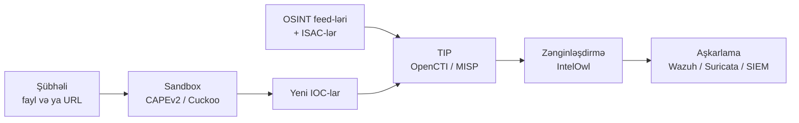

# Açıq Mənbə Təhdid Kəşfiyyatı və Zərərli Proqram Analizi

Kiçik komandanın inanılmaz təhdid kəşfiyyatı və zərərli proqram analiz qabiliyyəti idarə etməsinə imkan verən açıq mənbə alətlərinə fokuslu baxış — göstəriciləri qəbul edən, normallaşdıran, paylaşan və zənginləşdirən platformalar və naməlum binar faylı hərəkət əsaslı hesabata çevirən sandbox-lar.

Bu səhifə [Açıq Mənbə SIEM, Loglama və Monitorinq](./siem-and-monitoring.md) dərsindən işləyən aşkarlama stack-ı və [Firewall, IDS/IPS, WAF və NAC](./firewall-ids-waf.md) dərsindən perimetr müdafiə qatı olduğunu nəzərdə tutur. Təhdid kəşfiyyatı onları birləşdirən toxumadır — aşkarlamalarınıza təzə göstəricilər ötürür və xəbərdarlıqlarınızdan kontekst çıxarır.

## Bu nə üçün önəmlidir

Konteksti olmayan kompromis göstəriciləri səs-küydür. Hansısa feed tərəfindən "zərərli" etiketlənmiş 50,000 IP-nin siyahısı tək başına demək olar ki, faydasızdır — yarısı köhnəlmişdir, dörddə biri CDN ön-uclarıdır və qalan 25%-i hər hansı analitik onlar üzərində hərəkət edə bilməzdən əvvəl atribusiya, etibar qiymətləndirməsi və kill-chain mərhələsi tələb edir. Kommersial təhdid kəşfiyyatı platformaları — Recorded Future, ThreatConnect, Anomali, Mandiant Advantage — bu zənginləşdirməni cilalanmış məhsula yığır və müvafiq olaraq hesablayır: ildə altı rəqəm giriş nöqtəsidir və SOC miqyaslandıqca seat-license modeli rahatsız olur.

Açıq mənbə TIP-lər (Threat Intelligence Platforms) lisenziya haqqı olmadan həmin iş axınının təxminən 70%-ni əhatə edir. **OpenCTI** və **MISP** milli CERT-lər, ISAC-lər və Fortune 500 SOC-lar tərəfindən istifadə olunan yetkin, istehsalat-səviyyəli platformalardır; **YETI** analitik-əsaslı komandalar üçün daha yüngül Python-əsaslı seçimdir. Onlardan hər hansı birini avtomatlaşdırılmış sandbox ilə birləşdirin — **CAPEv2** köhnə **Cuckoo Sandbox**-ın aktiv fork-udur — və **IntelOwl** kimi zənginləşdirmə orkestratoru ilə, və tamamilə pulsuz proqram təminatı üzərində qurulmuş müdafiəolunan TI qabiliyyətiniz var.

`example.local` üçün — kiçik SOC, fişinq problemi olan və rüb sürətlə "təhdid kəşfiyyatı" haqqında soruşan şuraya malik 200 nəfərlik təşkilat — açıq mənbə yolu doğru cavabdır. Sektor həmkarları ilə paylaşmaq üçün **MISP**, fişinq yüklərinin sandbox triajı üçün **CAPEv2**, zənginləşdirmə mərkəzi kimi **IntelOwl** və yoxlanılmış IOC-ların Wazuh və Suricata-ya avtomatlaşdırılmış göndərilməsi. Vendor lock-in yox, data paylaşımı üzərində tam nəzarət və komanda nə vaxtsa açıq mənbə stack-ından böyüsə, aydın yüksəltmə yolu.

- **Konteksti olmayan IOC-lar səs-küydür.** Hash, IP, domain — first-seen tarixi, kill-chain mərhələsi, mənbə etibarı və TTP konteksti olmadan, bunlar sadəcə sətirlərdir. TIP onları hərəkətə uyğun edən metadata əlavə edən şeydir.
- **Sandbox analizi insident cavabı üçün danışılmazdır.** Fişinq e-poçtu gəldikdə və istifadəçi bildirmədən əvvəl klikləyəndə, "bu binar nə edir" cavabverənin saatlarla deyil, dəqiqələrlə cavab verməli olduğu sualdır. Self-hosted sandbox sizə həssas nümunələri üçüncü tərəf SaaS-a göndərmədən qəti cavab verir.
- **Paylaşma icmaları dəyəri çoxaldır.** Təhdid kəşfiyyatı əməkdaşlığın həqiqətən miqyaslandığı az sahələrdən biridir — sektor ISAC-də bir təşkilat tərəfindən görülən IOC hər kəs üçün erkən xəbərdarlıqdır. MISP həmin paylaşmanın lingua franca-dır.
- **Vaxt zənginləşdirməyə gedir.** Xəbərdarlıq üzərində analitik vaxtının əksəriyyəti VirusTotal, AbuseIPDB, Shodan, MISP və onlarla digər mənbədən keçməyə sərf olunur. IntelOwl kimi orkestrator bunu tək API çağırışına və tək hesabata yığır.
- **Açıq mənbə TI datanı evdə saxlayır.** Nümunələri və IOC-ları SaaS vendoruna göndərmək, bir çox tənzimlənən təşkilat üçün, özlüyündə uyğunluq hadisəsidir. Self-hosted TI analiz dövrünü tamamilə perimetrinizin içində saxlayır.

## Stack icmalı

İşləyən təhdid-kəşfiyyatı və zərərli-proqram-analizi boru kəmərinin ortada görüşən iki əsas axını var. Kəşfiyyat axını OSINT və ISAC feed-lərini qəbul edir, onları TIP vasitəsilə normallaşdırır, orkestratorlar vasitəsilə zənginləşdirir və yoxlanılmış göstəriciləri aşkarlamaya göndərir. Analiz axını şübhəli faylları və trafiki götürür, onları sandbox vasitəsilə işlədir, yeni IOC-ları çıxarır və onları TIP-ə geri ötürür.

Diaqramı tək boru kəməri kimi yox, iki tamamlayıcı dövr kimi oxuyun. Kəşfiyyat dövrü əsasən davamlı və avtomatlaşdırılmışdır — connector-lar feed-lərdən cədvəl üzrə çəkir, hər yeni IOC-da zənginləşdirmə işləyir və SIEM hər bir neçə dəqiqədə TIP-dən izləmə siyahılarını götürür. Analiz dövrü hadisə-əsaslıdır — fişinq hesabatından, SOC bilet-dən və ya şəbəkə tutumundan nümunə gəlir və sandbox təzə göstəriciləri TIP-ə geri ötürərək dövrü bağlayan hesabat istehsal edir.

Mənimsənilməyə dəyər nöqtə odur ki, **TIP mühitinizdə** təhdid kəşfiyyatı üçün **qeyd sistemidir**. Aşkarlama alətləri ondan istehlak edir; sandbox-lar ona ötürür; analitiklər ondan keçir. Əgər TIP mərkəzi node-dırsa, bütün boru kəməri birləşir; əgər o sonradan bağlanmışdırsa, beş əlaqəsiz alətlə və browser tab-ları arasında alt-tab edən analitiklə bitirsiniz.

## TIP — OpenCTI

OpenCTI Filigran-dan (əvvəllər Luatix) modern açıq mənbə təhdid kəşfiyyatı platformasıdır, ilk dəfə 2019-cu ildə buraxılıb və indi onlarla milli CERT və böyük müəssisədə istehsalatdadır. Bu, GraphQL API vasitəsilə təqdim olunan, birinci-dərəcəli MITRE ATT&CK və D3FEND xəbərdarlığı olan STIX 2.1-native bilik qrafıdır.

OpenCTI-də müəyyənedici dizayn seçimi **qraf modelidir**: hər varlıq (göstərici, təhdid aktoru, kampaniya, zərərli proqram, texnika, zəiflik, observable) node-dur və hər əlaqə (uses, targets, attributed-to, mitigates, indicates) edge-dir. Həmin model analitiklərin təhdidlər haqqında həqiqətən necə düşündüyünə təmiz xəritələnir — "bu kampaniya bu zərərli proqramdan istifadə edir ki, bu CVE-ni istismar edir, bu sektorə hücum edən bu aktora atribusiya olunur" — və UI sizə həmin qrafı vizual olaraq naviqasiya etməyə həm də GraphQL vasitəsilə sorğulamağa imkan verir.

- **STIX 2.1 native.** OpenCTI-nin daxili data modeli STIX 2.1-dir — hər obyektin STIX ID-si var, hər əlaqə STIX Relationship Object-dir və TAXII import/export tərcüməsiz işləyir. OpenCTI-dən nə vaxtsa miqrasiya etsəniz, datanız standart formatda çıxır.
- **MITRE ATT&CK və D3FEND.** Platforma tam MITRE bilik bazaları əvvəlcədən yüklənmiş gəlir — ATT&CK (hücum texnikaları), D3FEND (müdafiə əks-tədbirləri) və CAPEC (hücum nümunələri). Yeni göstəricilər bir kliklə texnikalara bağlana bilər və navigator görünüşü matriks boyunca əhatəni göstərir.
- **Connector-lar.** 100-dən çox icma connector-u ictimai feed-lərdən (AlienVault OTX, Abuse.ch, MISP, CIRCL, MITRE), kommersial API-lərdən (lisenziyalı olduqda) və daxili mənbələrdən çəkir. Connector-lar ayrı container-lər kimi işləyir və OpenCTI-yə GraphQL API vasitəsilə yazır.
- **GraphQL API.** UI-da olan hər şey həm də GraphQL vasitəsilə təqdim olunur ki, bu da scripting-i, inteqrasiyanı və avtomatlaşdırmanı sadələşdirir. Python SDK (`pycti`) ən çox istifadə edilən müştəridir və ümumi əməliyyatları əhatə edir.
- **Arxitektura.** Ağırdır: OpenCTI platformanın özü ilə yanaşı Elasticsearch (və ya OpenSearch), Redis, RabbitMQ və MinIO tələb edir. Tək-node deployment-də ən azı 16 GB RAM və 4 vCPU planlaşdırın; istehsalat deployment-ləri hər backing xidmətini xüsusi hardware-də işlədir.
- **Nə vaxt seçmək.** Qraf-əsaslı təhdid modelləşdirməsi, dərin MITRE inteqrasiyası və böyüyə biləcəyiniz strukturlaşdırılmış platforma istəyirsiniz. OpenCTI təhdid kəşfiyyatına intizam kimi investisiya etmək niyyətində olan komandalar üçün doğru çağırışdır.

## TIP — MISP

MISP (Malware Information Sharing Platform) orijinal icma-əsaslı təhdid-paylaşma platformasıdır — ilk dəfə 2011-ci ildə Belçika hərbi CERT-i daxilində inkişaf etdirilib, indi CIRCL (Computer Incident Response Center Luxembourg) tərəfindən saxlanılır və dünya üzrə yüzlərlə CERT, ISAC və SOC tərəfindən istifadə olunur. Praktikada təhdid paylaşmasının lingua franca-dır.

OpenCTI qrafı və analitik təcrübəsini vurğularkən, MISP **paylaşmanı** vurğulayır — təşkilatlar arasında kəşfiyyatın federasiyası üçün protokol, həmin təşkilatların göstəricinin nə demək olduğu barədə razılaşmasına imkan verən taksonomiyalar və kimin nəyi gördüyünü idarə edən paylaşma qrupları. ISAC və ya sektor CERT-ə qoşulsanız, MISP demək olar ki, dəqiqliklə onların sizinlə necə paylaşacağıdır.

- **Paylaşma qrupları.** MISP-in icazə modeli paylaşma qrupları ətrafında qurulub — hadisələr mübadiləsi edən təşkilatlar dəstləri. Hadisə bir qrupla, çoxlu qrupla paylaşıla bilər və ya yalnız-icma kimi qeyd oluna bilər. Sync protokolu (MISP-to-MISP) instance-lər arasında federasiyanı idarə edir.
- **Taksonomiyalar və qalaktikalar.** Taksonomiyalar tag lüğətləridir (TLP, PAP, kill-chain mərhələləri, etibar səviyyələri) ki istehsalçı və istehlakçılara göstəricinin nə demək olduğu barədə razılaşmağa imkan verir. Qalaktikalar icma tərəfindən saxlanılan daha zəngin cluster tərifləridir (təhdid aktorları, zərərli proqram ailələri, kampaniyalar).
- **Atributlar və obyektlər.** Atomik vahid atributdur (tip, dəyər, kateqoriya və tag-lar olan IOC); əlaqəli atributlar obyektlərə qruplaşır (`file` obyekti MD5 + SHA1 + SHA256 + ölçü + faylın adını yığır). Obyektlər ixrac zamanı STIX SDO-larına təmiz xəritələnir.
- **ISAC inteqrasiyası.** Əksər sektor ISAC-ləri (FS-ISAC, H-ISAC, EE-ISAC) MISP instance-ləri işlədir və üzv təşkilatlardan MISP-to-MISP sync qəbul edir. Paylaşma-qrup modeli onu təşkilati sərhədlər boyunca işlək edən şeydir.
- **Arxitektura.** PHP-əsaslı (CakePHP) MySQL/MariaDB backend və növbələr üçün Redis ilə. Tək-node deployment-ləri minlərlə hadisəni rahat idarə edir; böyük milli instance-lər düzgün tüning ilə milyonlarla atributa miqyaslanır.
- **Nə vaxt seçmək.** Təhdid-paylaşma icmasında iştirak edirsiniz (və ya etmək istəyirsiniz), qutudan ISAC inteqrasiyasına ehtiyacınız var və ya istehsalçı və istehlakçıların ən dərin icmasına malik platforma istəyirsiniz. MISP paylaşma-birinci deployment-lər üçün default-dur.

## TIP — YETI

YETI (Your Everyday Threat Intelligence) analitik iş axınları üçün yüngül Python-əsaslı seçimdir. İlk dəfə 2017-ci ildə buraxılıb və indi kiçik amma aktiv icma tərəfindən saxlanılır, YETI OpenCTI və MISP-dən fərqli niche-də oturur — federasiya şəbəkəsi ətrafında deyil, gündəlik analitik ətrafında qurulub.

YETI üçün təklif sadəlikdir: MongoDB backend ilə tək Python tətbiqi, təmiz veb UI və "bu aktoru izləyirəm, observable-lər budur, əlaqəli göstəricilər budur" analitik dövrünə fokus. O federasiyalı paylaşma platforması və ya qraf verilənlər bazası olmağa çalışmır — analitikin əslində istifadə etdiyi notebook olmağa çalışır.

- **Yüngül arxitektura.** Python + MongoDB + Redis. 4 GB RAM-lı tək VM kiçik komanda instance-ni rahat işlədir. Elasticsearch yox, RabbitMQ yox, MinIO yox.
- **Observable-lər və göstəricilər.** YETI observable-lər (xam data — hash, IP) və göstəricilər (kontekstli observable-lər — etibar, mənbə, kill-chain mərhələsi) arasında fərq qoyur. Model STIX-dən sadədir və analitikləri işə salmaq daha asandır.
- **Zənginləşdirmə plugin-ləri.** VirusTotal, MISP, PassiveTotal, Shodan və başqaları üçün daxili zənginləşdirmə. Plugin-lər Python-dur və daxili data mənbələri üçün yazmaq asandır.
- **Aşkarlamaya ixrac.** YETI Suricata, Bro/Zeek, MISP, OpenIOC və YARA tərəfindən istehlak edilə bilən formatlarda feed-lər ixrac edə bilər. İnteqrasiya hekayəsi iki-yollu (federasiya) deyil, bir-yolludur (ixrac).
- **Nə vaxt seçmək.** Kiçik analitik komandası, federasiya tələbi yox, Python-birinci stack üstünlüyü və ya OpenCTI və ya MISP-in əməliyyat ağırlığına bağlanmadan əvvəl TI qabiliyyətini prototip etmək istəyirsiniz. YETI həm də daha böyük MISP instance-nin *qarşısında* analitik-tərəfli iş masası kimi ağlabatan seçimdir.

YETI-yə şəxsi-və ya kiçik-komanda aləti kimi yanaşın ki, komanda və data hər ikisi böyüdükcə nəhayət MISP və ya OpenCTI-yə yüksələ bilər. Miqrasiya yolları yaxşı tapdalanmışdır — observable ixracı MISP atributlarına mahiyyətcə bir-sətirlikdir.

## OpenCTI vs MISP vs YETI — müqayisə

Üç platforma rəqib olduğu qədər həqiqətən tamamlayıcıdır — bir çox yetkin TI komandası birdən çoxunu işlədir. Aşağıdakı cədvəl praktikada seçimi həqiqətən idarə edən ölçüləri xəritələyir.

| Ölçü | OpenCTI | MISP | YETI |
|---|---|---|---|
| Data modeli | STIX 2.1 qraf | MISP atributları + obyektləri | Observable-lər + göstəricilər |
| Əsas fokus | Bilik qrafı, analiz | Federasiya və paylaşma | Analitik iş axını |
| Paylaşma protokolu | TAXII 2.1, connector-lar | MISP sync, TAXII | Yalnız ixrac |
| MITRE ATT&CK | Birinci-dərəcəli, D3FEND də | Galaxy vasitəsilə | Tag-lar vasitəsilə |
| API | GraphQL | REST (PyMISP) | REST (Python) |
| Backing xidmətləri | ES + Redis + RabbitMQ + MinIO | MySQL + Redis | MongoDB + Redis |
| Resurs izi | Yüksək (16 GB+) | Orta (4–8 GB) | Aşağı (2–4 GB) |
| İcma | Filigran-əsaslı, sürətlə böyüyür | CIRCL, çox böyük | Kiçik, aktiv |
| Ən yaxşı uyğunluq | Qraf-əsaslı analiz | Sektor ISAC paylaşması | Analitik notebook |
| Nə vaxt qaçınmaq | Kiçik komandalar, sadə ehtiyaclar | Paylaşma tərəfdaşları yox | Federasiya lazımdır |

Qısa versiya: paylaşma önəmli olduqda **MISP**, qraf-əsaslı analiz önəmli olduqda **OpenCTI**, heç biri önəmli olmadıqda və sadəlik qalib gəldikdə **YETI**. Bir çox komanda ISAC inteqrasiyası üçün MISP ilə başlayır, qraf modeli öz çəkisinə dəyəndə daha sonra OpenCTI əlavə edir və yan tərəfdə YETI-ni analitik iş masası kimi işlədir.

## Zərərli proqram analizi — Cuckoo Sandbox

Cuckoo Sandbox orijinal açıq mənbə avtomatlaşdırılmış zərərli proqram analiz sistemidir — ilk dəfə 2010-cu ildə buraxılıb və on ildən çox müddətdə "self-hosted sandbox"-a default cavab. O instrumentləşdirilmiş VM-lər (Windows, Linux, Android, macOS) içində şübhəli faylları işlədir, API çağırışlarını, şəbəkə trafikini, atılmış faylları və ekran görüntülərini qeyd edir və downstream alətlərinin qəbul edə biləcəyi strukturlaşdırılmış JSON hesabat istehsal edir.

2026 etibarilə düz status: **orijinal Cuckoo layihəsi praktiki olaraq saxlanılmır**. Son mənalı buraxılış illər əvvəl idi, codebase yerlərdə Python 2 mirası daşıyır və aktiv inkişaf **CAPEv2** fork-una keçib. Çoxlu təşkilat hələ də Cuckoo-nu uğurla işlədir — arxitektura möhkəmdir və mövcud deployment-lər işləməyi dayandırmır — lakin 2026-da heç bir yeni deployment upstream Cuckoo-dan başlamamalıdır.

- **Arxitektura.** Mərkəzi host (manager) analiz VM-lərini orkestrasiya edir. Hər guest VM içində agent sistem çağırışlarını qarmaqlayır, tap vasitəsilə trafiki tutur və nəticələri manager-ə geri göndərir. Manager hesabatı render edir (veb UI) və göndərmə və geri alma üçün REST API təqdim edir.
- **Nə təhlil edir.** PE faylları, Office sənədləri, PDF-lər, URL-lər, arxivlər, script-lər. Analiz modulları (Cuckoo dilində "modullar") guest içində işləyir və davranışın müxtəlif aspektlərini tutur.
- **Hesabatlar.** Ətraflı JSON: proses ağacı, yüklənmiş DLL-lər, registry dəyişiklikləri, fayl sistemi dəyişiklikləri, şəbəkə bağlantıları, DNS sorğuları, atılmış artefaktlar, uyğun gələn signature-lər. Yığılmış signature-lər klassik zərərli proqram ailələrini və TTP-ləri aşkarlayır.
- **2026 etibarilə status.** Upstream `cuckoosandbox/cuckoo` layihəsində praktiki olaraq saxlanılmır. İcma aktiv funksiya inkişafı və təhlükəsizlik düzəlişləri üçün CAPEv2-yə miqrasiya etdi.
- **Nə vaxt seçmək.** Artıq işləyən mövcud Cuckoo deployment-ni miras qoyursunuz; əks halda Cuckoo üzərində təzə başlamayın — CAPEv2-yə gedin.

Tarixi qeyd önəmlidir, çünki Cuckoo-nun arxitektur seçimləri — VM-per-analysis, guest-də agent, JSON hesabat formatı, signature plugin-ləri — o zamandan bəri hər açıq mənbə sandbox-ın izlədiyi şablonu qoydu. Cuckoo dizaynını anlamaq hələ də CAPEv2-ni anlamaq üçün doğru başlanğıc nöqtəsidir.

## Zərərli proqram analizi — CAPEv2

CAPEv2 (Config And Payload Extraction, version 2) Kevin O'Reilly və zərərli proqram tədqiqatçılarının daha geniş icması tərəfindən aktiv saxlanılan Cuckoo fork-udur. Bu, modern açıq mənbə sandbox deployment-lərinin əksəriyyətinin əslində işlətdiyi şeydir. CAPEv2 Cuckoo arxitekturasını saxlayır, lakin codebase-i Python 3-ə modernləşdirir, 200-dən çox ailə üçün zərərli-proqram-konfiq çıxarımını əlavə edir və boru kəməri boyunca YARA skanını inteqrasiya edir.

"Konfiq çıxarımı" hissəsi CAPEv2-ni ümumi sandbox-dan fərqləndirən şeydir. Vanilla sandbox sizə "bu binar şəbəkə bağlantıları etdi" deyir — CAPEv2 sizə "bu Emotet-dir, C2 siyahısı budur, kampaniya ID-si budur, şifrələmə açarları budur" deyir. Bu CAPEv2-nin hesabatlarını sadəcə davranış izləri kimi yox, IOC kimi birbaşa hərəkətə uyğun edir.

- **Aktiv inkişaf.** Müntəzəm buraxılışlar, cavabverən maintainer-lər, çıxarıcılara töhfə verən aktiv zərərli proqram analitikləri icması. Bu, yeni ailə dəstəyi və platforma yeniləmələri alan layihədir.
- **Zərərli proqram konfiq çıxarımı.** 200+ ailə üçün daxili çıxarıcılar — Emotet, IcedID, Qakbot, BumbleBee, RedLine, Ursnif, Cobalt Strike beacon-ları və s. Çıxarılmış konfiqlər birinci-dərəcəli IOC-lara çevrilir.
- **YARA inteqrasiyası.** YARA qaydaları çoxlu mərhələdə işləyir — göndərilmiş fayllarda, yaddaş dump-larında, atılmış artefaktlarda — və uyğunluqlar həm signature-ləri, həm də konfiq çıxarımını idarə edir.
- **Proses injection analizi.** Modern zərərli proqramda ümumi olan process hollowing, process doppelgänging və digər injection texnikalarının birinci-dərəcəli aşkarlaması.
- **Hesabat inteqrasiyası.** Hesabatlar MISP, OpenCTI, IntelOwl və ya JSON və ya STIX danışan hər istehlakçıya göndərilə bilər.
- **Arxitektura xəbərdarlıqları.** Cuckoo ilə eyni mürəkkəblik — manager host, analiz VM-ləri (anti-sandbox-müqavimətli nümunələr üçün üstünlük olaraq bare-metal və ya nested-virt) və diqqətli şəbəkə izolyasiyasına ehtiyacınız var. İstehsalata daxil yolları olmayan xüsusi subnet planlaşdırın.
- **Nə vaxt seçmək.** 2026-da hər yeni sandbox deployment. CAPEv2 default açıq mənbə zərərli proqram analiz platformasıdır.

## Zərərli proqram analizi — IntelOwl

IntelOwl Honeynet Project-dən Python-əsaslı təhdid kəşfiyyatı orkestratorudur ki tək API arxasında 60+ analizator yığır. O özü sandbox deyil — sandbox-larınızın, OSINT xidmətlərinizin və reputasiya feed-lərinizin qarşısında oturan və analitikə (və ya avtomatlaşdırılmış playbook-a) "bu hash/IP/domain/URL/fayl haqqında bildiyiniz hər şeyi mənə deyin" üçün çağırılacaq tək endpoint verən qatdır.

Təklif iş axınının konsolidasiyasıdır. IntelOwl olmadan, xəbərdarlığı idarə edən analitik VirusTotal, AbuseIPDB, GreyNoise, URLScan, MISP, daxili CAPEv2 və daha üç browser tab açır. IntelOwl ilə göstəricini bir dəfə göndərirlər, orkestrator paralel olaraq hər müvafiq analizator-a açılır və konsolidasiya edilmiş hesabat saniyələrdə geri gəlir.

- **Analizator ekosistemi.** Reputasiya (VT, AbuseIPDB, ThreatFox), passive DNS, zərərli proqram sandbox-ları (CAPE, Cuckoo, Hybrid Analysis), YARA, fayl metadata, OSINT zənginləşdirməsi və daha çox əhatə edən 60+ daxili analizator. Yeni analizator-ları Python plugin kimi əlavə etmək asandır.
- **Connector-lar və pivot-lar.** Nəticələri MISP, OpenCTI, YETI-yə göndərin; xarici SIEM-lərdən çəkin. Pivot-lar avtomatikdir — domain analizi həll olunmuş ünvanda IP analizini tetikleyə bilər.
- **Playbook-lar.** Göstərici tipinə bağlanmış əvvəlcədən təyin edilmiş analizator zəncirləri. Hash göndərmək VT axtarışı, YARA skanı, sandbox göndərməsi və MISP axtarışı olan playbook-u müəyyən sırada işlədir.
- **Arxitektura.** Django + PostgreSQL + Redis + Celery, hamısı Docker-də. Paralellik üçün analizator ailəsi başına worker container əlavə edin. Tək-node deployment-ləri kiçik SOC-a xidmət edir; horizontal miqyaslanma daha çox worker əlavə edir.
- **Nə vaxt seçmək.** "Xəbərdarlıq başına on browser tab aç" iş axınını tək API çağırışına yığmaq istəyirsiniz. IntelOwl TI/SOC qabiliyyətini sadəcə hərtərəfli deyil, səmərəli edən zənginləşdirmə mərkəzidir.

## Şəbəkə aşkarlaması — Maltrail

Maltrail ictimai feed-lərin (şübhəli domain-lər, IP-lər, user-agent-lər, URL nümunələri) seçilmiş siyahısından IOC-lar üçün mirror-lanmış trafiki izləyən passiv şəbəkə aşkarlama sistemidir. Qəsdən sadədir: Sensor proses paketləri yoxlayır, Server proses hadisələri yığır və kiçik veb UI nəyin işə düşdüyünü göstərir.

O Suricata və ya Zeek-in əvəzedicisi deyil — onlar daha dərin protokol-xəbərdar sistemlərdir — lakin Maltrail axmaq şeyləri tutan yüngül "pulsuz, sürətli, faydalı" əlavədir: məlum C2 domain-ə beacon edən host, məlum kommodity zərərli proqram ailəsindən user-agent sətri, məlum zərərli-proqram-saxlama URL-dən yükləmə.

- **Nə izləyir.** DNS sorğuları, HTTP istəkləri, span/mirror portda xam paketlər. ~40 ictimai təhdid feed-i artı istifadəçi təmin etdiyi siyahılarla uyğunluq.
- **Yüngül.** Sensor və Server, hər ikisi Python. Commodity hardware-də işləyir, müvafiq hardware ilə gigabit link-lərə miqyaslanır.
- **Çıxış.** Timeline, mənbə/təyinat parçalanmaları və trail-tip filtrlər ilə veb UI. SIEM-ə asanlıqla göndərilən parsable formatda log-lar.
- **Nə vaxt seçmək.** Suricata və ya Zeek deployment-nin əməliyyat ağırlığını tələb etməyən IOC-əsaslı şəbəkə aşkarlamasının ucuz, əlavə qatını istəyirsiniz. Əvəzedici kimi yox, tamamlayıcı kimi əla.

Ümumi deployment nümunəsi: aşağı-end VM-də Maltrail perimetr switch-dən SPAN portu ilə, SOC kanalına xəbərdarlıq edir; daha güclü appliance-də Suricata protokol-xəbərdar yoxlama üçün. İkisi fərqli şeylər tutur — Maltrail uzun-quyruq OSINT IOC uyğunluqlarını tutur, Suricata əslində istismar trafikini tutur.

## Browser alətləri — ThreatPinch Lookup

ThreatPinch Lookup hər veb səhifəni hover-zamanı təhdid-kəşfiyyat axtarışları ilə artıran browser genişləndirməsidir (Chrome və Firefox). SIEM dashboard-da, e-poçtda və ya veb hesabatda IP, hash, domain və ya CVE üzərinə hover edin və popup VirusTotal, AbuseIPDB, Shodan, Censys, MISP və digər mənbələri sorğulayır, konsolidasiya edilmiş reputasiyanı yerində ortaya çıxarır.

Bütün məqsəd analitik işi zamanı sürtünmənin azaldılmasıdır. "Həmin xəbərdarlığı heç vaxt araşdırmağı bitirmədim"-in tək ən böyük mənbəsi kontekst dəyişdirməsidir — üç browser tab dərinliyində analitik başqa şeyə çəkilir və orijinal xəbərdarlıq köhnəlir. ThreatPinch analitikin artıq olduğu yerdə yaşayır.

- **Axtarışlar.** VirusTotal, AbuseIPDB, Shodan, Censys, GreyNoise, URLScan, MISP, Hybrid Analysis, ThreatCrowd, plus istifadəçi-konfiqurasiya edilə bilən URL nümunələri.
- **Göstərici tipləri.** IPv4, IPv6, hash-lar (MD5/SHA1/SHA256), domain-lər, URL-lər, CVE-lər, MITRE technique ID-ləri.
- **Konfiqurasiya.** Per-axtarış aktivləşdir/söndür, ehtiyacı olan xidmətlər üçün API açarları, xüsusi axtarış URL-ləri.
- **Nə vaxt seçmək.** Həmişə — server-tərəfli izi olmadan, browser-də IOC triajı edən hər analitik üçün pulsuz məhsuldarlıq çoxaldıcıdır.

ThreatPinch qəsdən browser-tərəfli alətdir. Server-tərəfli zənginləşdirməyə ehtiyacınız varsa (çünki analitik browser olmayan kontekstdə işləyir və ya hər axtarışın mərkəzi auditi istəyirsiniz), əvəzində IntelOwl istifadə edin — ikisi tamamlayıcıdır, artıq deyil.

## Alət seçimi — müqayisə cədvəli

Aşağıdakı matriks bu məkanda ən ümumi ehtiyacları tövsiyə edilən açıq mənbə alətinə xəritələyir. Onu son arxitektura kimi yox, layihələndirmə üçün başlanğıc nöqtəsi kimi qəbul edin.

| Ehtiyac | Seç | Nə üçün |
|---|---|---|
| Paylaşma-birinci TIP | MISP | Federasiya protokolu, taksonomiyalar, ISAC inteqrasiyası |
| Qraf-əsaslı analiz TIP | OpenCTI | STIX 2.1 qraf, ATT&CK + D3FEND, GraphQL API |
| Yüngül analitik notebook | YETI | Sadə Python stack, aşağı resurs izi |
| Aktiv sandbox deployment | CAPEv2 | Saxlanılan Cuckoo fork-u, konfiq çıxarımı, YARA |
| Köhnə sandbox (mövcud) | Cuckoo | İşləyəni saxlayın, lakin CAPEv2-yə miqrasiya edin |
| Zənginləşdirmə orkestrasiyası | IntelOwl | 60+ analizator, tək API, playbook-lar |
| Passiv şəbəkə IOC aşkarlaması | Maltrail | Ucuz əlavə qat, yüngül |
| Browser-tərəfli analitik axtarışı | ThreatPinch | Sıfır-xərc məhsuldarlıq çoxaldıcı |
| Sektor ISAC iştirakı | MISP | Lingua franca, bütün əsas ISAC-lər tərəfindən qəbul olunur |
| MITRE ATT&CK naviqasiyası | OpenCTI | Birinci-dərəcəli texnika node-ları və əhatə görünüşü |
| Sandbox konfiq çıxarımı | CAPEv2 | 200+ ailə-spesifik çıxarıcı |
| Suricata üçün aşkarlama feed-i | MISP və ya YETI | Hər ikisi Suricata-format qayda faylları ixrac edir |

Əksər `example.local`-formalı mühitlər üçün cavab **MISP + IntelOwl + CAPEv2**-dir, komanda qraf-əsaslı analizə böyüsə daha sonra OpenCTI əlavə olunur və ThreatPinch birinci gündən hər analitik browser-ə yerləşdirilir.

Üst-üstə düşmə haqqında qısa qeyd. "Bir TIP" seçmək üçün həqiqi sınaq var — ona müqavimət göstərin. Əksər yetkin TI mağazaları MISP *və* OpenCTI işlədir: MISP federasiya endpoint-dir, OpenCTI analitik-üzlü bilik qrafıdır və connector-lar onları sync-də saxlayır. İkisinə eyni slot üçün rəqib kimi yox, tamamlayıcı laylar (federasiya layı + analiz layı) kimi yanaşın.

## Praktiki / məşq

`example.local` üçün ev laboratoriyasında və ya sandbox mühitində bunu konkret etmək üçün beş məşq. Hər biri fərqli qatı hədəf alır və birlikdə tam kəşfiyyat-və-analiz boru kəmərini məşq edirlər.

1. **MISP-i Docker-də yerləşdirin və ictimai feed-i import edin.** Rəsmi docker-compose vasitəsilə MISP-i qaldırın, default admin etimadnamələri ilə login olun və onları rotasiya edin. CIRCL OSINT feed-ni aktivləşdirin, çəkin və hadisələrin dashboard-da görünməsini təsdiq edin. Bir hadisəni `tlp:green` və `kill-chain:reconnaissance` ilə etiketləyin və tag-ların təşkilçi atributlara yayıldığını təsdiq edin. Hadisəni STIX 2.1 kimi ixrac edin və JSON-u yoxlayın.
2. **OpenCTI-ni yerləşdirin və connector qoşun.** OpenCTI-ni yığılmış docker-compose ilə qaldırın. MITRE ATT&CK connector-unu konfiqurasiya edin və platformanın tam enterprise matrisini çəkdiyini təsdiq edin. Pulsuz API açarı ilə AlienVault OTX connector-unu əlavə edin və pulse-ların gəlməyə başladığını təsdiq edin. Məlum təhdid aktoru üçün (məsələn, APT29) bilik qrafını açın və əlaqəli texnikaların, zərərli proqramların və kampaniyaların doldurulduğunu yoxlayın.
3. **CAPEv2-yə yaxşı niyyətli nümunə göndərin və hesabatı oxuyun.** CAPEv2-ni qaldırın (xüsusi VM-də Windows 10 analiz guest ilə yığılmış quraşdırıcıdan istifadə edin). EICAR test faylını və ya məlum-yaxşı niyyətli imzalanmış binar (məlum-yaxşı Windows quraşdırmasından `notepad.exe`) göndərin. Analizin tamamlandığını təsdiq edin, sonra hesabatı oxuyun — proses ağacı, şəbəkə fəaliyyəti, uyğun gələn signature-lər, atılmış fayllar. Real nümunənin harada fərqlənəcəyini qeyd edin.
4. **IntelOwl-un analizator-ları vasitəsilə IP sorğulayın.** IntelOwl-u docker-compose vasitəsilə yerləşdirin, VirusTotal və AbuseIPDB üçün API açarlarını konfiqurasiya edin (pulsuz pillə yaxşıdır) və hər hansı ictimai feed-dən məlum-zərərli IP göndərin. Konsolidasiya edilmiş hesabatı yoxlayın. Sonra yalnız pulsuz analizator-ları işlədən xüsusi playbook yaradın və playbook vasitəsilə ikinci IP göndərin.
5. **ThreatPinch quraşdırın və Wazuh xəbərdarlığından IOC axtarın.** Browser-də ThreatPinch quraşdırın, VirusTotal və AbuseIPDB API açarlarını konfiqurasiya edin. Mənbə IP ehtiva edən Wazuh xəbərdarlığını ([SIEM dərsi](./siem-and-monitoring.md)-ndən) açın. IP üzərinə hover edin və ThreatPinch-in dashboard-dan ayrılmadan reputasiya popup-u ortaya çıxardığını təsdiq edin.

## İşlənmiş nümunə — `example.local` TI qabiliyyəti qurur

`example.local` formal təhdid kəşfiyyatı olmadan başladı — xəbərdarlıqlar gəlirdi, analitiklər onları browser tab-ları ilə triaj edirdilər və yeganə "kəşfiyyat" 18 ay əvvəl son dəfə yenilənmiş "məlum bad IP-lər" daxili wiki səhifəsi idi. Yeni dizayn üç açıq mənbə dirəyi ətrafında kiçik amma inanılmaz TI qabiliyyəti qurur və onu mövcud aşkarlama stack-na bağlayır.

Sürücü Q3-də şirkətə dəyən fişinq kampaniyası idi, harada ki eyni yük iki həftə əvvəl sektor həmkarı tərəfindən bildirilmişdi — və `example.local`-un həmin xəbərdarlığı qəbul etmək kanalı yox idi. Sektor ISAC-ə qoşulmaq MISP instance tələb etdi. Bu qərar verildikdən sonra qalan stack ətrafında birləşdi.

- **Paylaşma üçün MISP.** Təhlükəsizlik DMZ-də host edilən tək MISP instance, sektor ISAC və iki etibarlı həmkar təşkilatla sync edir. "ISAC-only", "trusted peers" və "internal-only" üçün təyin edilmiş paylaşma qrupları. Taksonomiya vasitəsilə tətbiq edilmiş TLP intizamı: heç nə TLP tag-ı olmadan təşkilatdan çıxmır və sync feed-ləri TLP sərhədlərinə hörmət edir. CIRCL OSINT feed-nin və MISP-default Abuse.ch feed-lərinin gündəlik importu.
- **Gündəlik zənginləşdirmə üçün IntelOwl.** SOC dashboard arxasında VirusTotal, AbuseIPDB, GreyNoise, Shodan və daxili MISP üçün API açarları ilə konfiqurasiya edilmiş tək IntelOwl instance. "Tier-1 triaj" playbook hər xəbərdarlıq IOC-da işləyir və konsolidasiya edilmiş hesabatı bilet-ə geri yazır. Per-IOC orta triaj vaxtı 8 dəqiqədən (browser tab-ları) 30 saniyədən aşağı (tək API çağırışı) düşdü.
- **Sandbox analizi üçün CAPEv2.** Üç analiz VM ilə xüsusi bare-metal sandbox host (Windows 10 + Office, Windows 11 təmiz, Ubuntu desktop). E-poçt gateway-dən və bildirilən əlavələrdən fişinq yükləri API vasitəsilə avto-göndərilir. Hesabatlar SOC bilet-ə axır və IOC-lar kiçik connector script vasitəsilə MISP-ə göndərilir. Konfiq-çıxarım xüsusiyyəti əməliyyatın ilk rübü ərzində dörd fərqli Emotet kampaniyasını müəyyən etdi.
- **MISP IOC-larının Wazuh + Suricata-ya avtomatlaşdırılmış göndərilməsi.** Cədvəlli iş `to_ids:true` etiketli MISP atributlarını ixrac edir və onları Wazuh CDB siyahıları və Suricata qayda faylları kimi göndərir. Göstəricilər MISP-də nəşr olunduqdan sonra 15 dəqiqə içərisində aşkarlamaya çatır. Eyni iş `valid_until` timestamp-ları ilə göstəriciləri yaşlandırır ki köhnə IOC-lar qayda fayllarını şişirtməsin.
- **Xərc.** Hardware: MISP + IntelOwl üçün bir orta-end server, CAPEv2 üçün bir bare-metal sandbox host, plus mövcud SIEM infrastrukturu. Abunəliklər: $0 (yalnız ictimai API-lərin pulsuz pillələri). Mühəndislik: rollout üçün ~3 ay, davamlı tüning və saxlama üçün bir analitik FTE-nin ~15%-i.

Yeni stack dəyərini ilk dəfə MISP onlayn olduqdan altı həftə sonra etimadnamə-fişinq dalğasında sübut etdi: həmkar təşkilat kampaniya IOC-larını ISAC-də 09:14-də nəşr etdi, sync 09:17-də işlədi və Wazuh `example.local`-da ilk istifadəçi klikindən çox əvvəl 09:32-də uyğun gələn domain-lərdə xəbərdarlıq etməyə başladı. Bütün boru kəməri ilk SOC bilet işə düşənə qədər insan dövrdə olmadan uçdan-uca işlədi.

TI stack indi həm də [zəiflik və AppSec](./vulnerability-and-appsec.md) üçün aşkarlama qayda dəstini qidalandırır və SOC-a qarşı məlum TTP-ləri emulasiya edərkən [red team alətləri](./red-team-tools.md) dərsi tərəfindən istinad edilir.

## Problemləri aradan qaldırma və tələlər

Açıq mənbə TI/zərərli-proqram-analizi stack-ını "asılı olduğumuz şey"dən "qoparmaq üzrə olduğumuz şey"ə çevirən səhvlərin qısa siyahısı. Əksəri texniki deyil, əməliyyatdır — alətlər yetkindir, uğursuzluq rejimləri insan-və-proses nümunələridir.

- **IOC yaşı və çürüməsi.** Əksər nəşr olunmuş IOC-lar günlər içində köhnəlir. Bir aşkarlama tərəfindən yandırılan C2 IP saatlar içində rotasiya edilir; birinci gündə bildirilmiş fişinq domain-i üçüncü gündə sinkhole olunur. IOC-ları aşkarlamaya göndərməzdən əvvəl həmişə `valid_until`, `first_seen` və `last_seen` üzrə filtrləyin — il-əvvəlki göstəriciləri göndərmək sadəcə qanuni təkrar istifadə edilən IP-lərdə false positive-lər yaradır.
- **MISP taksonomiya istehlakçılarla uyğunsuzluğu.** İstehsalçılar və istehlakçılar TLP, kill-chain mərhələsi və etibar taksonomiyaları üzrə razılaşmalıdır. Hər şeyi `tlp:white` etiketləyən istehsalçı bütün paylaşma protokolunu zəiflədir. Taksonomiya istifadənizi yazılı sənədləşdirin, rüb sürətlə audit edin və sync feed-lərindən mənbəsiz tag-ları rədd edin.
- **Zərərli proqram tərəfindən sandbox aşkarlaması.** Modern zərərli proqram VM artefaktlarını, sandbox göstəricilərini (xüsusi istifadəçi adları, fayl yolları, mouse-jiggle yoxluğu) və zaman anomaliyalarını yoxlayır. Sadəlövh Cuckoo və ya CAPEv2 deployment aşkarlanacaq və nümunə partlamağı rədd edəcək. Guest VM-lərinizi anti-anti-VM yamaqları, real istifadəçi profilləri və (ən qaçaq nümunələr üçün) bare-metal analiz host-ları ilə sərtləşdirin.
- **Pulsuz API-lərdə IntelOwl kvota məhdudiyyətləri.** VirusTotal, AbuseIPDB və oxşarlar — hamısı pulsuz pilləni rate-limit edir — adətən dəqiqədə 4 sorğu. Hər IOC-da hər analizator işə salan yanlış konfiqurasiya edilmiş IntelOwl playbook saatlar içində kvotaları tükəndirəcək. Default-da hansı analizator-ların işlədiyini məhdudlaşdırmaq üçün playbook-lardan istifadə edin və ağır zənginləşdirməni açıq analitik göndərmələri üçün saxlayın.
- **Cuckoo-nun saxlanılmayan statusu — təzə yerləşdirməyin.** 2026-da yeni Cuckoo deployment-ləri Python 2 mirası, yamanmamış asılılıqlar və icma dəstəyi olmadan miras qoyur. Yeni sandbox qaldırırsınızsa, əvvəldən CAPEv2-yə gedin. Mövcud Cuckoo deployment-lərini illərlə deyil, aylarla ölçülən yol xəritəsində miqrasiya edin.
- **Sandbox şəbəkə izolyasiyası.** Sandbox VM-ləri canlı zərərli proqramı partladırlar, bu o deməkdir ki onlar outbound bağlantılar edirlər — C2-yə, yükləri yükləmək üçün, exfil etmək üçün. Sandbox subneti istehsalata heç bir yola sahib olmamalıdır və outbound trafik xüsusi egress (cellular modem, xüsusi ISP link, INETSIM-feyk şəbəkə) vasitəsilə getməlidir ki real qurban infrastrukturu sandbox trafikinizi həqiqi hücumla səhv salınmış görməsin.
- **Yalnız-yazma sistemi kimi TIP.** Ümumi uğursuzluq rejimi: komanda dindarcasına feed-ləri import edir, TIP milyonlarla atributa böyüyür və heç nə ondan istehlak etmir. TIP yalnız aşkarlama aləti onu cədvəl üzrə çəkdikdə faydalıdır — əvvəlcə həmin inteqrasiyanı bağlayın, sonra feed həcmi haqqında narahat olun.
- **Etibar qiymətləndirməsi önəmlidir.** Pullu kommersial feed-dən "zərərli" IOC və təsadüfi Pastebin paste-dən "zərərli" IOC eyni deyil. Hər IOC-u mənbə etibarı (yüksək/orta/aşağı) ilə etiketləyin və aşkarlama qaydalarına etibar üzrə filtrlə icazə verin — yüksək-etibar block siyahılarına, aşağı-etibar izləmə siyahılarına.
- **Seqreqasiyasız MISP-to-MISP sync.** MISP-inizi paylaşma-qrup intizamı olmadan tərəfdaşın MISP-i ilə sync etmək daxili hadisələri həmin tərəfdaşa sıza bilər. Sync-i aktivləşdirməzdən *əvvəl* paylaşma qruplarını konfiqurasiya edin və yalnız nəzərdə tutulmuş hadisələrin çıxdığını təsdiq etmək üçün sync trafikinin ilk həftəsini audit edin.
- **Sandbox saxlama böyüməsi.** Hər analiz ekran görüntüsü dəstəsi, şəbəkə tutumu və atılmış artefaktlar istehsal edir — göndərmə başına asanlıqla 100 MB. Məşğul SOC həftədə yüzlərlə göndərmə istehsal edir. Sandbox host dolmazdan əvvəl saxlamanı planlaşdırın (tez-tez 30–90 gün isti, obyekt saxlamada arxivlənmiş).
- **Browser genişləndirməsi tədarük zənciri.** ThreatPinch və oxşar genişləndirmələr analitikin browser kontekstində icra olunur. Spesifik nəzərdən keçirilmiş versiyaya pin edin, yeniləmələri audit edin və analitiklərin IOC analizi üçün istifadə etdikləri eyni browser profilində əlaqəsiz genişləndirmələr quraşdırmasını təşviq etməyin.

## Əsas nəticələr

Bu dərsdən aparılacaq başlıq nöqtələri, "həmişə doğru"dan "yadınıza düşəndə faydalı"ya doğru sırada.

- **Paylaşma üçün MISP, qraf-əsaslı analiz üçün OpenCTI, analitik iş masası üçün YETI.** Üçü tamamlayıcıdır, rəqib deyil — bir çox komanda birdən çoxunu işlədir.
- **CAPEv2 2026-da default sandbox-dur.** Cuckoo praktiki olaraq saxlanılmır; Cuckoo üzərində təzə başlamayın. Mövcud deployment-ləri yol xəritəsində miqrasiya edin.
- **IntelOwl zənginləşdirmə mərkəzidir.** O "xəbərdarlıq başına on browser tab" iş axınını tək API çağırışına yığır və rollout-dan sonra həftələr içində əməliyyat izini ödəyir.
- **TIP qeyd sistemidir.** Aşkarlama alətləri ondan istehlak edir; sandbox-lar ona ötürür; analitiklər ondan keçir. Əgər o sonradan bağlanmışdırsa, boru kəməri birləşmir.
- **Aşkarlamaya göndərməzdən əvvəl IOC yaşı üzrə filtrləyin.** Köhnə göstəricilər qanuni təkrar istifadə edilən infrastrukturda false positive-lər yaradır. `valid_until`, `last_seen` və etibar qiymətlərini dindarcasına istifadə edin.
- **Sandbox izolyasiyası danışılmazdır.** Canlı zərərli proqram istehsalata toxunmayan və real şəbəkənizə oxşamayan egress yoluna ehtiyac duyur — sızdırılmış sandbox bağlantısı təşkilatınız haqqında real-dünya təhdid kəşfiyyatını zəhərləyə bilər.
- **Paylaşma icmaları dəyəri çoxaldır.** Kiçik SOC üçün edə biləcəyiniz tək ən yaxşı qərar sektor ISAC-ə qoşulmaq və MISP işlətməkdir. Xərc məhduddur, erkən-xəbərdarlıq dəyəri nəhəngdir.
- **Etibar qiymətləndirməsi önəmlidir.** "Zərərli"yə binar deyil, spektr kimi yanaşın. Hər IOC-u mənbə etibarı ilə etiketləyin və aşkarlama qaydalarına onun üzrə filtrləməyə icazə verin.
- **Birinci gündən sandbox saxlamasını planlaşdırın.** Həftədə yüzlərlə göndərmə, hər biri 100 MB — saxlama siyasəti olmadan, sandbox host aylar içində dolur.
- **Hər analitik browser-də ThreatPinch.** Pulsuz, demək olar ki sıfır iz və o araşdırma tərkindənliyinin real mənbəsini aradan qaldırır.
- **Anti-sandbox zərərli proqram norma deyil, norma deyil istisna.** Guest VM-lərinizi sərtləşdirin və ən qaçaq nümunələrin bare-metal analiz host-larına ehtiyac duyduğunu qəbul edin.
- **Açıq mənbə TI datanızı evdə saxlayır.** Tənzimlənən mühitlər üçün bu tək başına SaaS vendoru üzərində self-hosted MISP və CAPEv2-ni seçmək üçün kifayət qədər səbəbdir.

`example.local`-formalı təşkilat üçün **MISP + IntelOwl + CAPEv2 + ThreatPinch** kiçik SOC-un udabiləcəyi hardware xərcində tamamilə açıq mənbə proqram təminatı üzərində qurulmuş inanılmaz TI/zərərli-proqram-analizi qabiliyyətidir — stack-i saxlamaq üçün mühəndislik qabiliyyəti və onu əslində istifadə etmək üçün SOC intizamı mövcud olduqda.

## İstinadlar

- [OpenCTI — opencti.io](https://www.opencti.io)
- [OpenCTI sənədləri](https://docs.opencti.io)
- [MISP layihəsi — misp-project.org](https://www.misp-project.org)
- [MISP sənədləri](https://www.misp-project.org/documentation/)
- [YETI — github.com/yeti-platform/yeti](https://github.com/yeti-platform/yeti)
- [Cuckoo Sandbox — cuckoosandbox.org](https://cuckoosandbox.org)
- [CAPEv2 — github.com/kevoreilly/CAPEv2](https://github.com/kevoreilly/CAPEv2)
- [IntelOwl — github.com/intelowlproject/IntelOwl](https://github.com/intelowlproject/IntelOwl)
- [Maltrail — github.com/stamparm/maltrail](https://github.com/stamparm/maltrail)
- [ThreatPinch Lookup — github.com/cloudtracer/ThreatPinchLookup](https://github.com/cloudtracer/ThreatPinchLookup)
- [STIX 2.1 spesifikasiyası — OASIS](https://docs.oasis-open.org/cti/stix/v2.1/stix-v2.1.html)
- [TAXII 2.1 spesifikasiyası — OASIS](https://docs.oasis-open.org/cti/taxii/v2.1/taxii-v2.1.html)
- [MITRE ATT&CK — Enterprise texnikaları](https://attack.mitre.org/techniques/enterprise/)
- [MITRE D3FEND — əks-tədbirlər](https://d3fend.mitre.org)
- [NIST SP 800-150 — Kiber Təhdid Məlumat Paylaşımı](https://csrc.nist.gov/publications/detail/sp/800-150/final)
- [Abuse.ch təhdid feed-ləri](https://abuse.ch)
- [CIRCL OSINT feed-i](https://www.circl.lu/doc/misp/feed-osint/)
- Əlaqəli dərslər: [Açıq Mənbə Stack İcmalı](./overview.md) · [SIEM və Monitorinq](./siem-and-monitoring.md) · [Firewall, IDS/IPS, WAF və NAC](./firewall-ids-waf.md) · [Zəiflik və AppSec](./vulnerability-and-appsec.md) · [Red Team Alətləri](./red-team-tools.md) · [Sosial Mühəndislik](../../red-teaming/social-engineering.md)
