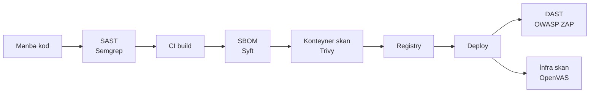

# Açıq Mənbə Zəiflik Skanlaması və Tətbiq Təhlükəsizliyi

İnfrastrukturda çatışmayan yamaqları tapan şəbəkə skanerləri, veb tətbiqləri sınayan dinamik skanerlər, mənbə kodunu oxuyan statik analizatorlar və komandalara nəhayət "bu build-də əslində nə var?" sualını cavablandırmağa imkan verən SBOM generatorlarını — etibarlı zəiflik-idarəetmə və tətbiq-təhlükəsizliyi proqramını gücləndirən açıq mənbə alətlər toplusuna fokuslu baxış.

Bu səhifə [açıq mənbə alətlər icmalı](./overview.md) üzərində qurulur, [firewall, IDS/IPS, WAF və NAC](./firewall-ids-waf.md) bölməsindəki perimetr nəzarətləri, [SIEM və monitorinq](./siem-and-monitoring.md) aşkarlama qatı və [təhdid kəşfiyyatı və zərərli proqram analizi](./threat-intel-and-malware.md) tərəfi ilə təbii şəkildə cütləşir. Proqram tərəfi üçün — risk skorlaması, SLA-lar, ticket axını — [zəiflik idarəetməsi](../assessment/vulnerability-management.md), daha geniş [təhlükəsizlik alətləri](../assessment/security-tools.md) kataloqu və yüksək səviyyəli [təhlükəsizlik qiymətləndirməsi](../assessment/security-assessment.md) həyat dövrünə baxın.

## Bu nə üçün önəmlidir

Zəiflik skanlaması və tətbiq təhlükəsizliyi danışıqsız nəzarətlərdir. Hər hörmətli framework — PCI-DSS, ISO 27001, SOC 2, NIST CSF, EU CRA — açıq şəkildə müntəzəm zəiflik qiymətləndirməsi və hansısa formada tətbiq-təhlükəsizliyi testi tələb edir. Bu alətlər üçün kommersial bazar (Tenable, Qualys, Rapid7, Veracode, Checkmarx) yaxşı maliyyələşdirilir və yetkindir, bir neçə yüz host və ya bir neçə tətbiq skanlayan təşkilatlar üçün beş və altı rəqəmli illik abunəlik təklif edir.

Açıq mənbə ekvivalentləri eyni dərəcədə yetkindir. Eyni zəiflik siniflərini əhatə edirlər, eyni CVE feed-lərini qəbul edirlər, eyni CI/CD boru kəmərləri ilə inteqrasiya olunurlar və eyni SBOM formatlarını istehsal edirlər — və bunu VM, CI runner və CVE təsvirlərini oxuya bilən analitikin qiymətinə edirlər. `example.local` üçün — təxminən 800 daxili host və 30 internetə baxan veb əmlakı olan 200 nəfərlik mühəndislik təşkilatı — tam açıq mənbə zəiflik və AppSec stack-ı kommersial qiymətin kiçik bir hissəsinə etibarlı əhatə təqdim edir.

- **Açıq mənbə bu sahədə yetkindir.** Beş il əvvəl kommersial və açıq mənbə skanerləri arasındakı fərq real və ölçülə bilən idi. Bu gün, əksər əhatə və dəqiqlik ölçülərində açıq mənbə liderləri orta səviyyəli kommersial təkliflər ilə rəqabət aparır. Qalan fərq dəstək, hesabat cilası və inteqrasiyalardadır — bug tapmaqda deyil.
- **Əhatə boşluqları alətlərdən daha çox baha başa gəlir.** Unudulmuş subnet-də qaçırılmış skan klassik insident hesabatı kök-səbəbidir. Açıq mənbə əhatəni atmaq üçün IP başına lisenziya bəhanəsini aradan qaldırır.
- **AppSec rüblük skanda deyil, SDLC-də yaşayır.** SAST hər PR-da işləyir, DAST hər relizdə staging-də işləyir, SBOM və asılılıq yoxlamaları hər build-i gateway edir. Boru kəmərinə inteqrasiya oluna bilməyən alətlər istifadə olunmayacaq alətlərdir.
- **Təchizat zənciri şəffaflığı indi minimum tələbdir.** ABŞ-da Executive Order 14028, EU CRA və əksər müəssisə satınalma prosesləri indi SBOM tələb edir. Onları istehsal etmək ucuzdur; istehsal etməmək getdikcə satış bloku olur.
- **Autentifikasiya edilmiş skanlar on dəfə daha çox tapır.** Autentifikasiya edilməmiş skanlar banner-ləri görür; autentifikasiya edilmiş skanlar quraşdırılmış paket versiyalarını, kernel versiyalarını və konfiqurasiya sürüşməsini görür. Birinci gündən credential saxlama planı qurun.
- **Beş qat bir-birini tamamlayır.** İnfra skanerləri çatışmayan yamaqları tutur; DAST runtime veb qüsurlarını tutur; SAST təhlükəsiz olmayan kod nümunələrini tutur; IAST runtime-da işə düşəni tutur; SBOM-lar nəyin nədən asılı olduğunu tutur. Heç bir tək alət digərlərini əvəz etmir.
- **CVE əhatəsinin sürəti vacibdir.** Böyük zəiflik düşəndə (Log4Shell, Spring4Shell, növbəti böyük), hər CISO-ya saatlar içində verilən sual "biz məruz qalmışıq?". Nuclei icması adətən eyni gündə yoxlama dərc edir; OpenVAS NVT-ləri bir həftə içində düşür; Grype CVE NVD-yə düşən kimi uyğun gəlir.
- **İş axını olmayan tapıntılar səs-küydür.** 4,000 zəiflik yayan və triajı olmayan skaner heç skanerdən pisdir — yorğunluq yaradır və etibarı yandırır. Faraday və ya DefectDojo xam skan çıxışını komandanın əslində işləyə biləcəyi bir şeyə çevirir.
- **Tənzimləyicilər yetişir.** PCI-DSS 4.0 açıq şəkildə SAST və ya ekvivalent kod baxışı tələb edir; EU CRA EU-ya satılan hər məhsul üçün SBOM-ı məcburi edir; kibertəhlükəsizlik sığortaçıları indi AppSec proqramının dəlilini soruşur. "Biz yalnız rüblük şəbəkə skanları edirik" artıq müdafiə oluna bilən cavab deyil.

## Zəiflik + appsec stack-ına ümumi baxış

Açıq mənbə zəiflik və AppSec stack-ı qatlı boru kəməridir. Müxtəlif alətlər hücum səthinin müxtəlif hissələrini görür və tam əhatəni əldə etməyin yeganə yolu onları proqram inkişaf həyat dövrü və işləyən infrastruktur boyunca birləşdirməkdir.

Diaqramı sol-dan sağa boru kəməri kimi oxuyun. SAST ən sol mövqedə oturur — kod hətta birləşmədən əvvəl developer-in klaviaturasında işləyir. CI build SBOM generasiyası və konteyner skanlamasının atəş açdığı boğaz nöqtəsidir. Registry imzalanmış və skanlanmış artefakti saxlayır. Deployment-dən sonra DAST işləyən veb tətbiqi sınaqdan keçirir, infrastruktur skanerləri isə onu işlədən host-ları süpürür.

Mənimsənilməli iki nümunə. Birincisi, **kəşf skanlamanı qidalandırır** — Amass-üslublu enumerasiya addımı olmadan şəbəkə və veb skanerləri yalnız kiminsə əmlak siyahısına qoymağı xatırladığını görə bilər. İkincisi, **tapıntı düzəlişi xərci sağa hər addımda bir tərtib böyüyür** — PR-da tutulan Semgrep tapıntısı dəqiqələrə başa gəlir; istehsala göndərilmiş və ZAP tərəfindən tutulmuş eyni zəiflik saatlara başa gəlir; hücumçu tərəfindən istismar edilmiş eyni zəiflik həftələrə başa gəlir.

Adlandırılmağa dəyər üçüncü nümunə: **hər zolaq bir aqreqatora yazır**. Aqreqator əksər komandaların atladığı hissədir — və proqram ilə alətlər topası arasındakı fərqi yaradan hissədir. Faraday və ya DefectDojo tapıntıları deduplikasiya edir, risk skorlaması tətbiq edir və survivor-ları runtime telemetriyası ilə korrelyasiya üçün SIEM-ə ötürür. Skanerlər tapıntılar istehsal edir; aqreqator nə edəcəyinə qərar verir.

## İnfrastruktur zəiflik skanlaması — OpenVAS / Greenbone CE

OpenVAS, indi **Greenbone Community Edition** kimi paketlənmiş, ən tam açıq mənbə şəbəkə zəiflik skanerdir. Tenable Nessus-u 2005-də qapalı mənbə etdiyi zaman orijinal Nessus 2.x kod bazasından böyüyüb və Greenbone o vaxtdan onu kommersial məhsul kimi saxlayır, eyni zamanda pulsuz icma feed-i və mühərriki saxlayır.

Nəsil vacibdir, çünki dərinliyi izah edir: OpenVAS iki onillik şəbəkə-skaner mühəndisliyini miras alır və Greenbone Community Feed vasitəsilə yeni məzmun qəbul etməyə davam edir. Tenable müqaviləsiz etibarlı şəbəkə vuln skaneri lazım olan əksər komandalar üçün bu standart başlanğıc nöqtəsidir.

- **Əhatə dairəsi.** Linux, Windows, şəbəkə cihazları, hipervizorlar, verilənlər bazası və embedded sistemlər üçün şəbəkə-səviyyəli zəiflik skanlaması. Veb-tətbiq skaneri deyil — onun üçün ZAP və Nuclei var.
- **Komponentlər.** Üç hərəkət edən hissə. **Skaner** (`openvas-scanner` / `ospd-openvas`) Network Vulnerability Test-ləri (NVT) icra edir. **Manager** (`gvmd`) nəticələri saxlayır və skanları orkestrasiya edir. **Veb UI** (Greenbone Security Assistant, GSA) analitik front-end-dir. İcma paketləməsi indi əsasən Docker Compose stack-ı kimi paylanır.
- **Greenbone Community Feed.** NVT-lər Nessus plugin-lərinin qayda ekvivalentidir. Feed CVE-lər, default credential-lər, çatışmayan yamaqlar və konfiqurasiya zəiflikləri əhatə edən 150,000+ test göndərir. Kommersial Enterprise Feed yeni məzmunu bir az daha tez alır.
- **Autentifikasiya edilmiş skanlar.** Linux üçün SSH açarları və Windows üçün SMB credential-ləri verin və OpenVAS yerli təhlükəsizlik yoxlamaları işlədəcək — quraşdırılmış paketləri sadalayır, yamaq səviyyələrini yoxlayır, konfiqurasiya fayllarını oxuyur. Əhatə autentifikasiya edilməmiş skanlara nisbətən təxminən üç dəfə artır.
- **Skan siyasətləri.** Əvvəlcədən təyin edilmiş siyasətlərə "Full and fast" (ümumi istifadə üçün default), "Discovery" (yalnız port və xidmət aşkarlanması) və bir neçə PCI-DSS və CIS uyğunluq siyasəti daxildir. Xüsusi siyasətlər NVT-ləri ailə və ya etiket üzrə whitelist və ya blacklist etməyə imkan verir — kövrək hədəflərə qarşı səs-küylü və ya dağıdıcı testləri istisna etmək üçün faydalıdır.
- **Hesabat.** GSA PDF, HTML, CSV və XML hesabatları ixrac edir. XML çıxışı Faraday və DefectDojo-nun qəbul etdiyidir — komandaya PDF göndərmək yerinə bunu bağlayın.
- **Diqqət edin.** İlkin feed sinxronizasiyası yavaşdır (ilk quraşdırmada bir neçə saat). Postgres verilənlər bazası tez böyüyür — disk və saxlama siyasəti büdcə edin. Veb-app yoxlamaları mövcuddur, lakin zəifdir; OWASP Top 10 əhatəsi üçün OpenVAS-a güvənməyin.
- **Nə vaxt seçmək.** Böyük daxili əmlak üzərində təkrarlanan infrastruktur skanlamasına ehtiyacınız var, 16-dan çox IP skanlamağa ehtiyacınız var (Nessus Essentials həddi) və skanerə güclü VM verə bilərsiniz (ciddi əhatə üçün minimum 8 vCPU, 16 GB RAM). /24 üçün tam skana bir neçə saat planlaşdırın.

## İnfrastruktur skanlaması — Nessus Essentials və Faraday

İki bitişik seçim infrastruktur səviyyəsini tamamlayır. **Nessus Essentials** kommersial Nessus skanerinin Tenable-ın pulsuz səviyyəsidir — qapalı mənbə, lakin pulsuz, geniş istifadə olunur və bilinməyə dəyər, çünki çox kiçik mühitlər üçün tez-tez ən az müqavimət yoludur. **Faraday Community Edition** birdən çox skanerdən səs-küyü tək triaj görüşünə birləşdirən açıq mənbə aqreqatorudur.

Birlikdə iki fərqli problemə cavab verirlər: Nessus Essentials "On maşınım var və bu gün cilalanmış skaner istəyirəm" sualına cavab verir, Faraday isə "Beş fərqli skanerim var və onların çıxışını triaj etmək üçün bir yerə ehtiyacım var" sualına.

- **Nessus Essentials — 16-IP həddi.** Essentials 16 unikal IP ünvanı skanlamaqda sərt həddə malikdir. Bu tavan home-lab və ya tək-rack mərhələsindən sonra hər təşkilatı istisna edir, lakin şəxsi lab, kiçik ofis və ya təlim mühiti üçün kifayət qədər səxavətlidir. Cilalanmış UI, sürətli plugin yeniləmələri, çox aşağı false-positive nisbəti.
- **Nessus Essentials — qeydiyyat tələb olunur.** Tenable hesabı və pulsuz aktivasiya kodu tələb olunur. Tam mənası ilə açıq mənbə deyil — təşkilatınız OSI-yalnız siyasətə malikdirsə, Essentials uyğun gəlmir; OpenVAS açıq mənbə seçimidir.
- **Faraday CE — zəiflik-idarəetmə aqreqatoru.** Skaner çıxışını (OpenVAS, Nessus, Nmap, Nuclei, Nikto, ZAP, Burp, Qualys, onlarla daha çox) tək workspace-ə import edir, mənbələr arasında tapıntıları deduplikasiya edir və analitiklərə veb UI vasitəsilə zəiflikləri triaj etməyə, şərh verməyə, etiketləməyə və təyin etməyə imkan verir.
- **Faraday — workspace modeli.** Hər engagement, mühit və ya biznes vahidi öz workspace-i ola bilər. "Prod mühiti üçün tapıntıları corp mühitindən ayrı görmək istəyirik"ə təmiz uyğun gəlir — proqram çoxkomandalı miqyasa çatdıqdan sonra ümumi istəkdir.
- **Faraday — API-first.** Tam REST API. CI işləri skan çıxışını skandan dərhal sonra API vasitəsilə yükləyir və UI insan triajı üçün saxlanır. Aqreqator olmadan skaner çıxışları heç bir kiçik komandanın saxlaya bilməyəcəyi beş ayrı iş axınına çevrilir.
- **Faraday — çox-alət dedupe.** Köhnəlmiş nginx olan veb server OpenVAS, Nuclei və Nikto-da üç fərqli ad və CVSS skoru ilə görünəcək. Faraday onları birləşdirir ki, analitik üç dəlil mənbəyi olan bir tapıntı görsün.
- **Faraday — əməliyyat qeydi.** Aqreqatorlar verilənlər bazasıdır — yedəkləyin. Faraday-ın Postgres-i təşkilatın bütün zəiflik tarixini saxlayır; onu itirmək audit izinizi itirmək deməkdir. Gündəlik snapshot-lar və host-xarici yedəkləmə danışıqsızdır.
- **Alternativ — DefectDojo.** OWASP DefectDojo oxşar xüsusiyyət dəsti, bir az fərqli UX və AppSec iş axınları üçün daha güclü CI/CD inteqrasiya hekayəsi olan güclü alternativ aqreqatordur.

## DAST — OWASP ZAP

**OWASP Zed Attack Proxy (ZAP)** flaqman açıq mənbə dinamik tətbiq-təhlükəsizliyi skanerdir. Aktiv və passiv skanlama bağlanmış man-in-the-middle proxy-dir və hər veb pentester-in birinci öyrəndiyi alətdir. ZAP-ın stack-da rolu dərinlikdir — real tətbiqlər vasitəsilə autentifikasiya edilmiş gəzintilər, çox-addımlı biznes-məntiq axınları və template-əsaslı skanerlərin uyğun gələ bilmədiyi nüanslı test növü.

ZAP açıq mənbə alətlər qutusunda ağır DAST seçimidir; tam xarici-test boru kəməri üçün onu Nuclei (genişlik) və Amass (kəşf) ilə cütləşdirin.

- **Proxy rejimi.** ZAP brauzer və test altındakı tətbiq arasında oturur. Tətbiq vasitəsilə tıkladıqca, hər sorğunu qeyd edir, hər cavabı parse edir və passiv yoxlamalar (cookie flag-ları, təhlükəsizlik header-ləri, info sızmaları) işlədir. Aktiv skan tətiklədiyinizdə, ZAP hər sorğunu hücum payload-ları ilə təkrar oynayır — XSS sətirləri, SQLi probe-ları, path traversal, command injection, header smuggling.
- **Avtomatlaşdırılmış skan.** "Automated Scan" rejimi spider ilə hədəf URL-i crawl edir, sonra default aktiv skan işlədir. Sürətli baseline üçün faydalıdır. Paketlənmiş `zap-baseline.py` (yalnız passiv, istehsal üçün təhlükəsiz) və `zap-full-scan.py` (aktiv, yalnız staging) script-ləri CI işində işləmək üçün dizayn edilib.
- **ZAP API və headless rejim.** ZAP daemon olaraq işləyə bilər (`zap.sh -daemon`) və tamamilə REST API tərəfindən idarə oluna bilər ki, əksər CI inteqrasiyaları əslində bunu istifadə edir. GUI insanların kontekst tənzimləməsi və qeyri-adi tapıntıları triaj etməsi üçündür.
- **CI inteqrasiyası.** Baseline və full-scan script-ləri Faraday və DefectDojo-nun nativ qəbul etdiyi HTML, XML və JSON hesabatları istehsal edir. Onları GitHub Action və ya GitLab boru kəmərinə qoyun və kritik tapıntılarda relizləri gateway edin.
- **Autentifikasiya.** ZAP bir az montaj ilə form login, header-əsaslı auth, JSON login və OAuth2 dəstəkləyir. Autentifikasiyanı bir kontekst faylında bir dəfə konfiqurasiya edin və skaner logout aşkarladığında yenidən autentifikasiya olunur. Autentifikasiya edilmiş skanlar olmadan yalnız ictimai marketinq səhifələrini sınayırsınız.
- **Manual vs avtomatlaşdırılmış.** Manual rejim — brauzer vasitəsilə proxy, tətbiq boyunca istifadəçi kimi gəzin, sonra tarixçədə tutulan sorğulara hücum edin — avtomatlaşdırılmış rejimdən çox daha çox tapır, çünki spider single-page-app marşrutlarını, autentifikasiya edilmiş sahələri və form iş axınlarını qaçırır. Avtomatlaşdırılmış skanlar CI baseline-ları üçün; manual skanlar real dərinlik üçün.
- **Diqqət edin.** Kövrək tətbiqlərə qarşı aktiv skanlar verilənləri korlaya bilər — ZAP-ı bərpa oluna bilən verilənlər bazası olan staging mühitinə yönəldin, heç vaxt istehsala yox. False-positive nisbətləri kontekst tənzimləməsindən çox asılıdır; mürəkkəb SPA-dan faydalı nəticə əldə etmək üçün bir günortadan sonra sərf etməyi planlaşdırın.
- **Add-on-lar və ekosistem.** ZAP marketplace GraphQL, OpenAPI/Swagger import, qabaqcıl fuzzing və AJAX spidering üçün uzantılar göndərir. OpenAPI add-on mikroservis əmlak üçün xüsusilə dəyərlidir — onu Swagger spesifikasiyasına yönəldin və ZAP doğru metod və parametr forması ilə hər endpoint-i sadalayır.
- **Miras və idarəetmə.** ZAP geniş icma töhfəsi və proqnozlaşdırıla bilən reliz tezliyi olan OWASP Flagship layihəsidir. Layihə 2023-də Software Security Project (SSP) Foundation-a keçdi; idarəetmə sağlam və aktivdir.

## DAST — Nuclei

**Nuclei** ProjectDiscovery tərəfindən modern, sürətli, template-yönümlü veb skanerdir ki son bir neçə ildə bug-bounty dünyasının böyük bir hissəsini yedi. Onun dizayn fəlsəfəsi ZAP-ın əksidir — ağır proxy əvəzinə, URL siyahısına YAML template-lər siyahısı atəş edən və uyğunluqları çap edən tək Go binarıdır.

ZAP və Nuclei tamamlayıcılardır, əvəzediciləri yox. ZAP az sayda tətbiqdə dərin gedir; Nuclei böyük URL siyahısı boyunca geniş gedir. Əksər yetkin proqramlar hər ikisini fərqli scope-lara qarşı fərqli tezliklərdə işlədir.

- **Template-əsaslı.** Hər Nuclei template-i bir yoxlamanı təsvir edir: HTTP sorğu (və ya DNS, TCP, fayl və ya workflow yoxlaması), uyğunlaşdırıcılar dəsti (status kodu, body regex, header dəyəri) və metadata (CVE ID, ciddilik, istinadlar). `projectdiscovery/nuclei-templates`-dəki icma template-lər repo-su məlum CVE-lər, yanlış konfiqurasiyalar, açıq panellər və default credential-lər üçün minlərlə əvvəlcədən yazılmış yoxlama göndərir.
- **Sürətli.** Nuclei yüzlərlə hədəfə qarşı yüzlərlə template-i paralel olaraq işlədir və saniyələrdə bitir, halbuki ZAP saatlar çəkər. Tək binary, ciddilik həddləri üçün exit kodları, JSON çıxışı, bir neçə yüz MB RAM-də işləyir. Onu GitHub Action-a qoyun və relizləri ona görə gateway edin.
- **İcma template-ləri.** İcma tərəfindən saxlanılan kitabxana minlərlə töhfəçi ilə binarı göndərən eyni komanda tərəfindən kuratorlanır. Yeni CVE-lərin əhatəsi adətən ictimai açıqlamadan saatlar içində düşür — sürətli-cavab skanlaması üçün qızıl standart.
- **Xüsusi template-lər.** YAML formatı dayazdır və yaxşı sənədlənib. "Daxili admin panelimiz təsadüfən internetə açıqdır?" üçün xüsusi template 20 sətirlik fayldır. Bu, Nuclei-nin sərf olunan vaxtı qaytardığı yerdir.
- **ZAP üzərində nə vaxt seçmək.** Nuclei böyük URL siyahısını sürətlə skanlamağa ehtiyacınız olduqda, kritik CVE-lərdə CI-dostu fail-the-build davranışı istədikdə və ya yeni açıqlanan CVE-ni açıqlamadan saatlar içində aşkar etməyə ehtiyacınız olduqda doğru seçimdir. ZAP autentifikasiya edilmiş iş axınları olan tək mürəkkəb tətbiqdə dərinlik lazım olduqda doğru seçim olaraq qalır.
- **Ciddilik etiketləməsi.** Hər template ciddilik daşıyır (`info`, `low`, `medium`, `high`, `critical`). CLI ciddiliyə görə filtrləməyə imkan verir, bu da "kritikdə build-i pozun, high-da xəbərdarlıq edin"-i CI-yə bağlamağı asanlaşdırır.
- **Workflow template-ləri.** Nuclei template-ləri şərti olaraq zəncirləyən çoxaddımlı workflow-ları dəstəkləyir — CMS aşkar edin, sonra CMS-spesifik yoxlamalar işlədin; texnoloji stack-ı təyin edin, sonra framework-spesifik testlər işlədin. Əlaqəsiz template-ləri atlamaqla skan vaxtını azaltmaq üçün faydalıdır.
- **Məhdudiyyətlər.** Nuclei crawl etmir, stateful auth-u zərif idarə etmir və dərin zəiflik kəşfi etmir — yalnız axtarmasına deyilən şeyləri tapır. `main`-i izləmək yerinə reliz tag-ə pin edin və hər yeniləmədən əvvəl diff-ə baxın.

## DAST — Nikto və Amass

Xarici-test mənzərəsini tamamlayan iki niş alət. **Nikto** orijinal "məlum veb yoxlamalar batareyasını serverə atın və nəyin yapışdığını görün" skanerdir — ZAP-dan köhnə, Nuclei-dən az cilalı, lakin köhnə veb-server ilk-keçid yoxlamaları üçün hələ də faydalıdır. **OWASP Amass** açıq mənbə hücum-səthi kəşf alətinin de-facto-dur — təşkilatın xarici izini xəritələmək üçün subdomen-lər, IP diapazonları, ASN-lər, sertifikatlar və DNS qeydlərini sadalayır.

Tam mənası ilə Amass DAST yox, recon-dur, lakin hər DAST skanının təbii müşayiətçisidir, çünki kəşf etmədiyinizi skanlaya bilməzsiniz.

- **Nikto — köhnə veb-server yoxlamaları.** Köhnəlmiş server proqramı, təhlükəli CGI script-lər, default fayllar (`/phpinfo.php`, `/server-status`), təhlükəsiz olmayan HTTP metodları, çatışmayan təhlükəsizlik header-ləri və zəif SSL/TLS konfiqurasiyası axtaran tək veb serverə qarşı minlərlə probe göndərir.
- **Nikto — nə vaxt hələ də faydalıdır.** Onda nə olduğunu bilmədiyiniz yeni aşkar edilmiş veb serverə qarşı ilk-keçid kəşfiyyatı. Nikto-nun signature verilənlər bazası yeni skanerlərin prioritetdən çıxardığı çoxlu köhnə Apache, IIS, Tomcat və PHP-dövrü səthini əhatə edir. İlkin kəşfdə hər əmlakda bir dəfə işlədin, Faraday-a qəbul edin, sonra davamlı əhatə üçün ZAP və Nuclei-yə güvənin.
- **Amass — hücum-səthi xəritələmə.** Passiv mənbələrə sertifikat-şəffaflıq logları, axtarış mühərrikləri, DNS aqreqatorları, təhdid-kəşfiyyatı feed-ləri və Whois verilənləri daxildir. Aktiv texnikalara DNS brute-force, zone transfer və əks DNS sweep-ləri daxildir.
- **Amass — subdomain enumerasiyası.** Əksər "shadow IT" tapıntıları — unudulmuş staging server, üçüncü-tərəf host-da marketinq landing səhifəsi, kiminsə altı il əvvəl qaldırdığı demo mühit — IT komandasının tam olduğunu düşündüyü əmlak inventarı tərəfindən deyil, Amass-üslublu enumerasiya tərəfindən aşkar edilir.
- **Amass — əməliyyat modeli.** Cədvəl üzrə işlədin (xaricə baxan təşkilatlar üçün gündəlik, əksər üçün həftəlik yaxşıdır), bugünkü çıxışı dünənki ilə diff edin və yeni əmlakları triaj üçün on-call mühəndisə yönəldin.
- **Boru kəməri cütləşməsi.** Kanonik iş axını `amass enum -d example.local -o subs.txt`, sonra `nuclei -l subs.txt`-dir. Texnoloji barmaq izləməsi üçün ProjectDiscovery suite-dən `httpx` əlavə edin və hörmətli açıq mənbə xarici-recon boru kəməriniz olar.
- **Nikto qənaəti.** Qatlı skanda bir neçə alətdən biri kimi faydalıdır; heç vaxt yeganə alət kimi faydalı deyil. Signature verilənlər bazası Nuclei ilə müqayisədə yavaş yenilənir, false-positive nisbəti yüksəkdir və SPA dəstəyi yoxdur. Auditor hesabatda açıq şəkildə Nikto soruşduqda ən müdafiə oluna biləndir.

## SAST — Semgrep, SonarQube CE, Bandit, gosec

Statik Application Security Testing mənbə kodunu oxuyur və kod hətta işləməzdən əvvəl təhlükəsiz olmayan nümunələri qeyd edir. Dörd açıq mənbə SAST aləti dil genişliyi, skan dərinliyi və CI inteqrasiya hekayəsi arasında çox fərqli ödənişlər ilə real spektri əhatə edir.

- **Semgrep.** Modern default. Sürətli, dil-fərqində (40+ dil), YAML-da qaydalar, səxavətli açıq mənbə qayda registry, daha dərin analiz üçün ödənişli Pro tier-i olan pulsuz icma nəşri. Əla CI inteqrasiyası — əksər komandalar yüksək ciddilik Semgrep tapıntılarında PR birləşmələrini gateway edir. Xüsusi qaydalar yazmaq asandır və komanda Semgrep-i bir neçə ay işlətdikdən sonra demək olar ki, həmişə köhnəlmiş daxili API-lar və tələb olunan təhlükəsizlik header-ləri üçün daxili qaydalar yazmağa başlayırlar. GitHub Action və ya GitLab boru kəmərinə `semgrep ci` kimi düşür.
- **SonarQube Community Edition.** Cilalanmış veb dashboard, çoxdilli dəstək və güclü "kod keyfiyyəti + təhlükəsizlik" birləşmiş hekayəsi olan keyfiyyət-və-təhlükəsizlik platforması. İcma nəşri həqiqətən faydalıdır, lakin ən güclü təhlükəsizlik qaydaları (taint analizi, daha dərin SAST) Developer Edition və yuxarısı üçün ayrılmışdır. Qeyd edin ki, SonarQube CE pull-request branch-larını analiz etmir — yalnız main branch-ı. Trunk-əsaslı inkişaf komandaları üçün bu mənalı məhdudiyyətdir; PR-səviyyəli gating üçün adətən Semgrep daha yaxşı uyğunluqdur.
- **Bandit (Python).** Python-spesifik SAST. Kiçik, sürətli, ümumi Python tələlərinə fokuslanmış (`eval` istifadəsi, hardcoded credential-lər, zəif crypto, təhlükəsiz olmayan yaml load, SQL string birləşmə). Beş dəqiqədə hər Python layihəsinin CI-yə qoyun — `pip install bandit && bandit -r .`. PyCQA tərəfindən saxlanılır; daha dərin Python-yalnız qayda dəsti istədikdə Semgrep-in təbii Python tamamlayıcısıdır.
- **gosec (Go).** Go-spesifik SAST. Go mənbəyini ümumi təhlükəsizlik problemləri üçün yoxlayır — hardcoded credential-lər, təhlükəsiz olmayan SQL formatlaşdırma, zəif crypto, fayl yolu traversal-ı, təhlükəsiz olmayan TLS konfiqurasiyası. Tək Go binary, `gosec ./...` kimi işləyir, hər Go CI boru kəmərinə cüzi inteqrasiya edir. Bandit-in Python əhatəsinə Go-dili tamamlayıcısı.
- **CI inteqrasiya nümunələri.** Semgrep və gosec hər ikisi nativ GitHub Actions və GitLab CI template-ləri göndərir. Bandit ən-sol shift feedback üçün `pre-commit` hook-ları ilə təmiz cütləşir. SonarQube CE ayrı server tələb edir, lakin uyğunluq baxışlarında rəhbərlərin görmək istədiyi cilalanmış veb dashboard təqdim edir.
- **Praktikada dil əhatəsi.** Semgrep çoxdilli vəziyyəti əhatə edir (Python, JS/TS, Java, Go, Ruby, C/C++, Kotlin, Scala, Swift, daha çox). Bandit Python dərinliyinə sahibdir. gosec Go dərinliyinə sahibdir. SonarQube CE keyfiyyət qaydaları və daha kiçik təhlükəsizlik qayda dəsti ilə 15+ dili dəstəkləyir. Ruby on Rails üçün `brakeman`; JavaScript üçün `eslint-plugin-security`.
- **Secrets skanlaması ucuz qələbədir.** SAST-ı secrets skaneri ilə cütləşdirin — `gitleaks`, `trufflehog` və ya `detect-secrets`. Hardcoded API açarları, verilənlər bazası şifrələri və AWS giriş açarları credential-əlaqəli pozuntuların ən ümumi səbəbidir.
- **CodeQL — bilinməyə dəyər.** GitHub Security Lab-ın semantik-analiz mühərriki, GitHub Code Scanning vasitəsilə açıq mənbə repo-lar üçün pulsuz, GitHub Advanced Security xaricində özəl repo-lar üçün kommersial lisenziya tələb olunur. Güclü sorğu dili, dərin taint analizi, lakin xüsusi sorğular yazmaq üçün dik öyrənmə əyrisi.

## SBOM və konteyner skanlaması — Syft, Trivy, Grype

Software Bill of Materials alətləri build-də hər komponenti, kitabxananı və asılılığı sadalayır. Çıxış sadəcə inventardır — onun dəyəri inventarı zəiflik uyğunlaşdırıcısına qidalandırmaqdan gəlir. SBOM iş axınının iki yarısı var: build vaxtında SBOM-u **istehsal edin** və binary və ya konteyner şəkilinin yanında artefakt kimi saxlayın və SBOM-u davamlı cədvəldə CVE verilənlər bazasına qarşı **uyğunlaşdırın**.

Üç alət açıq mənbə mənzərəsinə hakimdir. Syft SBOM istehsal edir; Grype onları CVE-lərə qarşı uyğunlaşdırır; Trivy ikisini bir binary-də plus konteyner yanlış konfiqurasiyası və IaC skanlaması edir.

- **Syft.** Anchore-un SBOM generatoru. Tək Go binary, konteynerləri, OCI şəkilləri, fayl sistemləri və mənbə qovluqlarını skan edir. SPDX, CycloneDX və nativ JSON formatı çıxarır. Bu gün əksər boru kəmərləri üçün default SBOM aləti — sürətli, dəqiq, yaxşı saxlanılan. Tipik çağırış: `syft image:nginx:1.24 -o cyclonedx-json > sbom.json`.
- **Grype.** Syft ilə cütləşən Anchore-un zəiflik skaneri. SBOM (və ya birbaşa konteyner şəkili) götürür və hər komponenti NVD, GitHub Security Advisories və OSV verilənlər bazalarına qarşı uyğunlaşdırır. Syft + Grype kombinasiyası kanonik açıq mənbə təchizat zənciri skanıdır: `grype sbom:./sbom.json`.
- **Trivy.** Aqua Security-nin hamısı-bir-yerdə konteyner, IaC və SBOM skaneri. Bir binary konteyner zəifliklərini, Dockerfile və Kubernetes yanlış konfiqurasiyasını, IaC-i (Terraform, CloudFormation), secrets-ləri və CycloneDX və ya SPDX formatında SBOM generasiyasını əhatə edir. Əksər komandalar Trivy-ni xüsusilə dörd skanı bir-birinə birləşdirdiyi üçün seçirlər, dostca default-lar və yaxşı CI exit-kod semantikası ilə.
- **Trivy çağırış nümunələri.** Konteyner CVE-ləri üçün `trivy image nginx:1.24`, fayl sistemi və IaC üçün `trivy fs .`, Dockerfile və Kubernetes manifest yoxlamaları üçün `trivy config .`, mövcud SBOM-u uyğunlaşdırmaq üçün `trivy sbom sbom.json`. Eyni binary əksər boru kəməri ehtiyaclarını əhatə edir.
- **CycloneDX format.** Təhlükəsizlik istifadə hallar üçün ən güclü alət ekosistemi olan OWASP-idarə olunan SBOM standartı. Zəiflik sahələri, istismar oluna bilmə metadatası və imzalanmış-attestation dəstəyi daxildir. Yalnız təhlükəsizlik vaqif olduqda CycloneDX seçin.
- **SPDX format.** Linux Foundation-un daha geniş SBOM formatı, ilkin olaraq lisenziya uyğunluğu üçün dizayn edilib və indi təhlükəsizlik üçün genişləndirilib. Lisenziya uyğunluğu da scope-da olduqda və ya aşağı axın istehlakçılarınız (satınalma, hüquqi) onu tələb etdikdə SPDX seçin. Hər iki format geniş dəstəklənir; əksər boru kəmərləri hər ikisini yayır.
- **Davamlı yenidən qiymətləndirmə.** OWASP Dependency-Track CycloneDX SBOM-larını qəbul edir və onları yeni CVE-lərə qarşı davamlı yenidən qiymətləndirir, əvvəllər təmiz reliz zəif olduğunda xəbərdarlıq edir. Əsasən daha gözəl UI ilə idarə olunan Grype.
- **İmzalanmış SBOM-lar.** SBOM generasiyasını `cosign` ilə cütləşdirin ki, SBOM-u imzalanmış attestation kimi konteyner şəklinə bağlayasınız. Kombinasiya — kriptoqrafik olaraq imzalanmış SBOM şəkilə bağlanmış — aşağı axın istehlakçılarına nə işlətdiklərini yoxlamağa imkan verən şeydir. Bu SLSA framework-unun sənayeni itələdiyi istiqamətdir.
- **OSV-Scanner alternativi.** Google-un OSV-Scanner-i Open Source Vulnerabilities verilənlər bazasına qarşı çapraz istinad verir və Go və JavaScript ekosistemləri üçün əladır. Əksər komandalar paralel olaraq iki SBOM skaneri işlədir, çünki heç bir tək CVE verilənlər bazasının tam əhatəsi yoxdur.
- **VEX — Vulnerability Exploitability eXchange.** SBOM-ların təbii tamamlayıcısı. VEX sənədi deyir "bu zəif komponenti göndərdik, lakin X səbəbinə görə kontekstimizdə istismar oluna bilməz". CycloneDX və OpenVEX formatları hər ikisi tutuş qazanır; OWASP Dependency-Track birinci-sinif VEX qəbulunun var.

## IAST qısaca

Interactive Application Security Testing işləyən tətbiqi runtime-da verilənlər axınını müşahidə etmək üçün alətləndirir. Real call stack-i görür və çox aşağı false-positive ilə istismar oluna bilməni təsdiqləyir — kitabxana-dərin qüsurlar, məsələn dörd frame dərin basdırılmış zəif deserialiser ki SAST onu bəlkə kimi qeyd edir və DAST düzgün URL-də düzgün payload olmadan ona çata bilməz.

Açıq mənbə IAST AppSec stack-ının ən nazik hissəsidir. IAST dərin dil-runtime alətləndirməsi tələb edir (Java agentləri, .NET profiler-lər, Node hook-lar) və o alətləndirmə həqiqətən qurmaq çətindir və dil versiyaları boyunca saxlamaq daha çətindir. Saxlama yükü tarixən ciddi IAST işini arxasında vendor mühəndislik komandaları olan kommersial məhsullara itələyib.

Nəticə açıq mənbə AppSec hekayəsində nəzərə çarpan boşluqdur. SAST yaxşı xidmət olunur, DAST yaxşı xidmət olunur, SBOM yaxşı xidmət olunur — IAST yox. IAST əhatəsinə ehtiyacı olan əksər komandalar ya kommersial məhsul üçün ödəyir, ya da boşluğu qəbul edir və ətraf SAST/DAST qatlarına daha çox söykənir.

- **Contrast Community Edition bitdi.** İllər boyu pulsuz IAST təcrübəsinə ən yaxın şey Contrast-ın Community Edition-ı idi (Java və .NET, tətbiq sayında həddli). Contrast 2023-də Community Edition üçün end-of-life elan etdi və açıq mənbə IAST-i etibarlı flaqman olmadan qoydu.
- **Alternativlər məhduddur.** Bir neçə dil-spesifik layihə mövcuddur (məsələn `python-iast` araşdırma alətləri, təhlükəsizlik siqnalları üçün OpenTelemetry-əsaslı alətləndirmə), lakin heç birinin kommersial IAST məhsullarının genişliyi və ya cilası yoxdur.
- **Performans yükü.** IAST agentləri ölçülə bilən gecikmə əlavə edir. Əksər komandalar onları yalnız qeyri-istehsalat mühitlərində — staging və ya QA — işlədir ki, hot-path reqressiyalarından qaçsınlar. İstehsalda IAST işlətsəniz, hər sorğunu alətləndirmək yerinə nümunələyin.
- **Praqmatik mövqe.** Əksər kiçik komandalar IAST-i tamamilə atlayır. Əhatə dardır, deployment invazivdir və artıq SAST və DAST-iniz olduqdan sonra dəyər realdır, lakin marjinaldir. Scope-da Java və ya .NET monolitləriniz və kommersial büdcəniz varsa pilot etməyə dəyər; əks halda ertələmək təhlükəsizdir.
- **RASP — yaxın əmi oğlu.** Runtime Application Self-Protection (RASP) bir addım da gedir və runtime-da hücumları aktiv olaraq bloklayır. Açıq mənbə RASP variantları açıq mənbə IAST-dən də nazikdir.

## Alət seçimi — müqayisə

Aşağıdakı matrisa bu sahədə ən ümumi ehtiyacları tövsiyə olunan açıq mənbə alətə bir-sətir "niyə" ilə xəritələyir — yeni quruluşu scope etdikdə son arxitektura kimi deyil, başlanğıc nöqtəsi kimi istifadə edin.

| Ehtiyac | Seçim | Niyə |
|---|---|---|
| İnfrastruktur vuln skanlaması | OpenVAS / Greenbone CE | 150,000+ NVT, IP həddi yox, pulsuz |
| Çox kiçik əmlak (16 IP altında) | Nessus Essentials | Cilalanmış UI, sürətli plugin yeniləmələri |
| Vuln-idarəetmə aqreqatoru | Faraday CE / DefectDojo | Skanerlər boyunca dedupe, REST API |
| İnteraktiv veb test | OWASP ZAP | Proxy rejimi, dərin autentifikasiya skanları |
| Sürətli template-yönümlü skanlar | Nuclei | Saniyə-sürətli, CI-nativ, geniş URL siyahıları |
| Köhnə veb-server ilk keçid | Nikto | Yetkin signature verilənlər bazası |
| Hücum-səthi kəşfi | OWASP Amass | Subdomen enumerasiyası, passiv mənbələr |
| CI-də SAST | Semgrep | Çoxdilli, sürətli, xüsusi qaydalar |
| Python SAST dərinliyi | Bandit | PyCQA-saxlanılan, beş dəqiqəlik quraşdırma |
| Go SAST dərinliyi | gosec | Tək binary, idiomatik Go inteqrasiyası |
| Keyfiyyət + təhlükəsizlik platforması | SonarQube CE | Veb dashboard, çoxdilli |
| Konteynerlər və SBOM | Trivy | Konteynerlər, IaC, SBOM bir binary-də |
| SBOM generasiyası | Syft | Sürətli, dəqiq, CycloneDX + SPDX |
| SBOM CVE uyğunlaşdırma | Grype | Syft ilə cütləşir, NVD + GHSA + OSV |

Əksər `example.local` formalı mühitlər üçün real cavab **infra üçün OpenVAS, veb üçün ZAP plus Nuclei, kod üçün Semgrep + Bandit/gosec, konteynerlər və SBOM üçün Trivy + Syft, aqreqasiya üçün Faraday**-dır.

Faydalı büdcə evristikası: bu stack-i işlətmək xərci təxminən **iki VM (skaner + aqreqator), bir saxlama həcmi (SBOM və hesabat arxivi) və 0.5 FTE mühəndislik diqqəti**-dir, təxminən 1,000 host və 50 veb tətbiqi olan əmlak üçün. Aqreqatoru atlasanız FTE qiymətləndirməsini üçə vurun — vaxt cədvəl wrangling-ə gedir.

Üst-üstə düşmə haqqında qısa qeyd. Birləşdirmə üçün real cazibə var — "ZAP Nuclei-ni əvəz edə bilər?" (yox, fərqli işlər), "Trivy Syft-i əvəz edə bilər?" (SBOM generasiyası üçün bəli, lakin generator və skaner arasında daha təmiz ayrılmanı itirirsiniz), "Bandit və Semgrep hər ikisinə ehtiyacım var?" (mütləq deyil, lakin Bandit-in Python dərinliyi uyğunlaşdırmaq çətindir). Alətləri öz xeyrinə birləşdirmək cazibəsinə müqavimət göstərin; hər açıq mənbə skaneri bir işdə yaxşıdır və iki işlətmənin kiçik yükü bir işlətməklə qalan boşluqdan ucuzdur.

## Praktiki / məşq

Bu stack-i `example.local` üçün home lab və ya sandbox mühitində konkret etmək üçün beş məşq. Hər biri fərqli qatı hədəfləyir və birlikdə infra skanından SBOM auditinə qədər tam boru kəmərini məşq edirlər.

1. **OpenVAS-ı Docker-də yerləşdirin və lab subnet skanlayın.** Rəsmi Greenbone Community Container Compose stack-ı çəkin, NVT feed sinxronizasiya edin (ilk işdə bir neçə saat icazə verin) və lab host-larının /28-nə qarşı "Full and fast" skan başladın. PDF hesabat yaradın; ciddiliyə görə üst üç tapıntı təyin edin və istismar oluna bilən olub-olmadıqlarını təsdiq edin.
2. **OWASP Juice Shop-a qarşı ZAP avtomatlaşdırılmış skan işlədin.** Qəsdən zəif OWASP Juice Shop-u qaldırın (`docker run -p 3000:3000 bkimminich/juice-shop`), `zap-baseline.py`-ı `http://localhost:3000`-ə yönəldin, sonra müqayisə üçün `zap-full-scan.py` işlədin. Tapıntı saylarını və ciddilik paylanmasını müqayisə edin; baseline-ın niyə bu qədər qısa olduğunu izah edin.
3. **Xüsusi Nuclei template yazın.** ZAP skanınızdan bir tapıntı seçin (çatışmayan `Strict-Transport-Security` header ən asandır) və onu aşkar edən Nuclei template yazın. Template-i üç URL siyahısına qarşı işlədin; yalnız zəif hədəfə uyğun gəldiyini yoxlayın. Kifayət qədər ümumi olarsa, template-i upstream-ə təqdim edin.
4. **Semgrep-i GitHub Actions boru kəmərinə inteqrasiya edin.** Kiçik açıq mənbə Python və ya Go repo-sunu fork edin. Hər PR-da `semgrep ci` işlədən və SARIF nəticələri GitHub Code Scanning-ə yükləyən `.github/workflows/semgrep.yml` əlavə edin. Qəsdən `eval()` çağırışı təqdim edən PR açın; Semgrep-in birləşməni izahatlı tapıntı ilə bloklayacağını təsdiq edin.
5. **Syft ilə SBOM yaradın və Grype ilə skanlayın.** Hər hansı konteyner şəklini götürün (zəmanətli maraqlı nəticə üçün `nginx:1.24` cəhd edin). `syft nginx:1.24 -o cyclonedx-json > sbom.json` işlədin, sonra `grype sbom:./sbom.json`. Ən yüksək ciddilikli CVE təyin edin və bir abzaslıq remediasiya tövsiyəsi yazın — düzəldilmiş versiya, yenilənmə yolu və hər hansı məlum uyğunluq riskləri.
6. **Faraday-a iki skaner bağlayın.** Faraday Community Edition-ı Docker-də qaldırın, sonra eyni hədəf host üçün OpenVAS XML və ZAP JSON çıxışı import edin. Deduplikasiyanın işlədiyini yoxlayın — tək host-un fərqli adlarla iki dəfə deyil, çox dəlil mənbəyi ilə bir dəfə göründüyünü təsdiq edin.
7. **İcazəli domenə qarşı Amass işlədin.** Sahib olduğunuz və ya sınamaq üçün yazılı icazəniz olan domenə qarşı kəşf (yalnız passiv rejim). Nəticə siyahısını CMDB və ya DNS qeydlərinizlə müqayisə edin. Bilmədiyiniz hər hansı subdomenləri qeyd edin; niyə mövcud olduqlarını və hələ də istifadədə olduqlarını araşdırın.
8. **Kubernetes manifestinə qarşı Trivy işlədin.** Hər hansı Helm chart və ya xam Kubernetes YAML götürün. `trivy config ./deploy/` işlədin. Yanlış konfiqurasiya tapıntılarını qeyd edin (çatışmayan resurs limitləri, root konteynerləri, imtiyaz eskalasiyası). Üst üçü seçin və PR-da düzəldin; Trivy-ni yenidən işlədin və skorun yaxşılaşdığını təsdiq edin.
9. **cosign ilə SBOM imzalayın.** Kiçik konteyner qurun, Syft ilə CycloneDX SBOM yaradın, sonra SBOM-u `cosign attest --predicate sbom.json --type cyclonedx` ilə imzalayın və bağlayın. Attestation-u aşağı axında `cosign verify-attestation` ilə yoxlayın. Bu müəssisə satınalmasını qane etmək üçün getdikcə daha çox lazım olacaq SLSA-üslublu təchizat zənciri iş axınıdır.
10. **Python layihəsinə qarşı Bandit işlədin.** Hər hansı önəmli Python repo-su seçin (qəsdən zəif `nodegoat`-Python və ya öz işləyən-əsərinizi). `bandit -r .` işlədin və üst on tapıntını triaj edin — hər biri üçün, doğru pozitiv, false pozitiv və ya "daha çox kontekst lazımdır" qərar verin. False pozitivləri gələcək Bandit `# nosec` annotasiyaları və ya `.bandit`-də skip-qaydaları kimi sənədləşdirin.

## İşlənmiş nümunə — `example.local` zəiflik + AppSec boru kəməri qurur

`example.local` təxminən 800 daxili host, 30 internetə baxan veb əmlak və Kubernetes-də 50 mikroservis işlədir. Təhlükəsizlik komandası üç nəfərdir. Davamlı skanlamanı əllə edə bilməzlər və altı rəqəmli kommersial skaner stack-ina qüvvələri çatmır. On iki ay təkrarlamadan sonra qaldıqları açıq mənbə proqramı infrastruktur, veb, kod və təchizat zəncirini əhatə edir — son qat kimi ildə bir insan-aparılan pentest ilə.

Arxitektura bu dərsdə əvvəlki stack diaqramını əks etdirir. Hər skaner Faraday-a itələyir; Faraday xəbərdarlıqları Slack və SIEM-ə yayır; ticket-lər API inteqrasiyası vasitəsilə Jira-ya axır.

- **Daxili host-ların həftəlik OpenVAS süpürməsi.** Həftədə iki cədvəlli "Full and fast" skan — biri ictimai IP diapazonlarına qarşı xarici, biri hər daxili /24-ə qarşı daxili — vault-çəkilmiş SSH açarı vasitəsilə credential-li girişi olan Greenbone CE VM-dən işləyir. Nəticələr Faraday-a göndərir; yüksək ciddilikli tapıntılar 30-günlük SLA ilə Jira ticket-lərini avtomatik yaradır.
- **Hər PR-da CI-inteqrasiyalı Semgrep.** GitHub Action hər pull request-də `semgrep ci` işlədir. Yüksək ciddilikli tapıntılar birləşməni bloklayır; orta və aşağı tapıntılar məsləhətdir və həftəlik tech-debt baxışında izlənir. İcma qayda dəsti baseline-dır; komanda daxili anti-nümunələr və tələb olunan təhlükəsizlik header-ləri üçün təxminən 20 xüsusi qayda əlavə edib.
- **Hər konteyner build-də CI-inteqrasiyalı Trivy + Syft.** CI boru kəməri son konteyner şəklinə qarşı `syft` işlədir, CycloneDX SBOM-u reliz artefakti kimi əlavə edir və zəiflik və yanlış konfiqurasiya skanlaması üçün `trivy image` işlədir. Kritik CVE-lər build-i pozur. SBOM-lar həmçinin OWASP Dependency-Track-ə itələnir ki, dünənki təmiz reliz növbəti həftə yeni CVE düşdükdə yenidən qiymətləndirilə bilsin.
- **Staging-in aylıq ZAP skanı.** Ayda bir dəfə CI boru kəməri 30 veb əmlakının hər birinin yeni staging surətini qaldırır, staging URL-ə qarşı `zap-full-scan.py` işlədir və nəticələri Faraday-a göndərir. Aktiv skanlar heç vaxt istehsala qarşı işləmir.
- **Xarici əmlakın gündəlik Nuclei süpürməsi.** Ayrı cron-lanmış Nuclei işi bütün `cve` və `exposures` template ailələrini ictimai əmlak siyahısına qarşı işlədir (Amass-dan mənbələnmiş, deduplikasiya edilmiş, düz fayl kimi saxlanılan). Yeni kritik tapıntılar `#secops-alerts`-də Slack xəbərdarlıqları açır və hər səhər baxılır.
- **Həftəlik Amass kəşf diff.** Amass hər bazar gecəsi qeydiyyatlı domen siyahısına qarşı işləyir, çıxış əvvəlki həftə ilə diff edilir və hər hansı yeni subdomen on-call mühəndis üçün bazar ertəsi səhər triaj üçün Slack bildirişi yaradır.
- **İllik xarici pentest.** İldə bir dəfə komanda xarici əmlakın fırlanan alt çoxluğunun üçüncü-tərəf pentest-i sifariş edir. Daxili proqramın qaçırdığı məsləhətçilərin tapdığı tapıntılar yeni Semgrep qaydalarına, Nuclei template-lərinə və ya OpenVAS skan-siyasəti tənzimləmələrinə çevrilir — proqram hər testdən öyrənir.
- **Bütün nəticələr Faraday-a.** Hər skaner — OpenVAS, Trivy, ZAP, Nuclei, Semgrep — REST API vasitəsilə tapıntıları bir Faraday workspace-ə itələyir. Dedupe üst-üstə düşən tapıntıları çökdürür; analitiklər Faraday UI-da triaj edir; sağ qalanlar sahib, ciddilik və SLA ilə Jira ticket-lərinə axır.
- **SOC-a xəbərdarlıqlar.** Kritik tapıntılar Faraday-dan Slack və SIEM-ə yayılır. SOC eyni dashboard-da Wazuh və ZAP xəbərdarlıqları yanında "istehsal konteynerində yüksək ciddilikli SBOM CVE `payments-api:v2.3.1`" görür, beləliklə runtime anomaliyası və zəif asılılıq iki yox bir araşdırma olur.
- **Detection-as-code.** Hər Nuclei template, Semgrep qaydası, OpenVAS skan siyasəti və Trivy ignore-list Git repository-də yaşayır, pull request vasitəsilə baxılır və CI tərəfindən deploy edilir. "Bu qaydanı niyə əlavə etdik, nə vaxt, kim tərəfindən" cavablaya bilən komanda regress etməyən komandadır.
- **Əhatənin rüblük baxışı.** Komanda hər üç ayda mövcud skan əhatəsini OWASP Top 10 və MITRE ATT&CK matrisinə qarşı xəritələyir, ən böyük boşluqları təyin edir və əhatə əlavə edir. Məqsəd 100%-ə çatmaq deyil — boşluqların harada olduğunu bilmək və onları bağlamağa qəsdən yanaşmaqdır.

Ümumi alət xərci VM və CI dəqiqələrinin xərcidir. Ümumi əməliyyat xərci təxminən bir mühəndisin yarısıdır. Əhatə kifayət qədər yaxşıdır ki, son üç xarici pentest hər biri beşdən az yeni tapıntı istehsal edib — daxili proqram məsləhətçilər gəlməzdən əvvəl qalanını tutur.

Bu proqramı praktikada işlədən şey haqqında bir neçə əlavə qeyd. **Birincisi, komanda skan tezliyini miqyaslamamaqdan əvvəl Faraday triajına gateway etdi** — həftəlik bir növbəti iki gündə təmizləyə biləcəyə qədər həftəlik skanlamağa davam etdilər, sonra tezliyi artırdılar. **İkincisi, Jira inteqrasiyasına erkən investisiya etdilər** — hər eskalasiya edilmiş tapıntı avtomatik olaraq ticket yaratdı ki, mühəndislər artıq istifadə etdikləri iş axını ilə düzəltsinlər. **Üçüncüsü, false pozitivlərə tənzimləmə problemi kimi yanaşdılar** — hər təkrarlanan FP gələcək oxşar tapıntıları avtomatik bağlayan Faraday qaydası aldı.

## Problemlərin həlli və tələlər

Açıq mənbə vuln + AppSec stack-ını "etibar etdiyimiz şey"-dən "atmaq üzrə olduğumuz şey"-ə çevirən səhvlərin qısa siyahısı. Bunların əksəriyyəti texniki yox, əməliyyat səhvidir.

- **OpenVAS feed köhnəlməsi.** Community Feed sinxronizasiyası böyükdür və yavaş bağlantılar üzərində bəzən dəyişkəndir. Simptomlar: skanlar işləyir, lakin şübhəli az CVE tapır və ya `gvmd` log feed-sync xətaları göstərir. Düzəliş: təkrar cəhdli cədvəlli feed sinxronizasiyasını aktivləşdirin, son uğurlu sinxronizasiya 48 saatdan çox olduqda xəbərdarlıq edin və air-gapped və ya bant genişliyi məhdudlu saytlar üçün feed-in HTTP proxy mirror-ını saxlayın.
- **JS-ağır SPA-larda ZAP.** Mürəkkəb tək-səhifə tətbiqinə qarşı ilk ZAP skanı zəif əhatə istehsal edir, çünki default spider JavaScript icra etmir — marşrut cədvəlinin əksəriyyəti görünməzdir. AJAX Spider add-on-a keçin, autentifikasiya üçün konteksti konfiqurasiya edin və tənzimləmək üçün bir günortadan sonra büdcə edin. İqnor edilən tənzimlənməmiş ZAP skanı heç ZAP skanından pisdir.
- **Kontekstsiz Nuclei false pozitivləri.** Nuclei template-ləri ümumi hədəflərə qarşı yazılıb; bir çoxu sizin kontekstinizdə qəsdən olan framework default-larında işə düşür (məsələn, qəsdən-daxili xidmətdə versiyanı açıqlayan `Server` header). Scope üzrə template tag seçimini tənzimləyin, Faraday-da məlum-OK tapıntıları söndürün və test keçidi olmadan istehsala qarşı heç vaxt eksperimental template-lər işlətməyin.
- **SBOM format müharibələri.** CycloneDX və SPDX hər ikisi mövcuddur, hər ikisi OWASP/Linux Foundation dəstəyinə malikdir və aşağı axın istehlakçılar birini və ya digərini tələb edə bilər. Əksər boru kəmərləri eyni SBOM generasiya addımından hər iki formatı yayır (`syft -o cyclonedx-json -o spdx-json`); xərc cüzidir və gələcək-qoruma realdır.
- **Real tapıntıları boğan SAST false pozitivləri.** Böyük köhnə kod bazasında default qaydalarla Semgrep birinci gündə yüzlərlə aşağı-ciddilikli tapıntı istehsal edə bilər. Analitiklər bir həftə içində dashboard-u iqnor etməyi öyrənir. Birinci ayda aqressiv tənzimləyin — vendor-laşdırılmış qovluqları istisna edin, məlum-OK nümunələri söndürün və PR yoxlamalarına yalnız yüksək-ciddilikli tapıntıları yüksəldin. "Hər şey yüksək ciddilikdir"-i konfiqurasiya bug-u kimi qəbul edin.
- **CVSS-i prioritet kimi qəbul etmək.** CVSS ciddilikdir, prioritet deyil. İnternetə əlçatan olmayan xidmətdə CVSS 9.8 auth gateway-də CVSS 6.5-dən az təcilidir. Faraday-ın etiket və əmlak-kritiklik sahələri ona görə var ki, biznes kontekstini xam skaner çıxışı üzərinə qatlaya biləsiniz.
- **Throttling olmadan istehsal skanlaması.** OpenVAS, ZAP aktiv skanları və Nuclei hamısı kiçik xidmətləri sıxışdıra bilər. Həmişə skan throttle-ları, iş-saatdan-kənar pəncərələri və istisna siyahıları təyin edin; ilk skandan əvvəl əməliyyatlarla koordinasiya edin; ləğv etməyə hazır olun.
- **Çox dar scope.** "Scope-da olmayan əmlakda pozulduq" tapıntısının ən ümumi səbəbi əmlak siyahısının kiminsə şəbəkə xatirəsindən əllə yaradılmasıdır. Scope-u wiki səhifəsindən deyil, CMDB plus Amass kəşfi plus xarici IP diapazonlarından idarə edin.
- **Skaner versiya sürüşməsi.** Köhnəlmiş skanerlər skaner olmamağı qədər təhlükəlidir — son CVE-ləri qaçırırlar və səssizcə təmiz hesabat verirlər. NVT feed, Nuclei template-ləri, Semgrep registry və Grype/Trivy zəiflik DB-ni gündəlik cron-da avtomatik yeniləyin və yeniləmə işi ardıcıl iki dəfə uğursuz olarsa xəbərdarlıq edin.
- **İstisna prosesi yox.** Hər proqram SLA pəncərəsində düzəldilə bilməyən və ya düzəldilməyəcək tapıntıları toplayır — vendor yamağı yoxdur, biznes-kritik köhnə sistem, qəbul edilmiş biznes riski. Sənədləşdirilmiş istisna iş axını olmadan, o tapıntılar ya dashboard-u sonsuza qədər kabusladır, ya da məcburi-bağlanır və itirilir. İstisna prosesini ehtiyacınız olmadan əvvəl qurun.
- **Skanı testdən hesab etmək.** Skanerlər skanerin tapdığını tapır. OWASP Top 10 heç bir avtomatlaşdırılmış skanerin etibarlı tutmadığı çoxlu zəiflik sinifləri (broken access control, biznes məntiq qüsurları, həssas verilənlər ifşası) ehtiva edir. Açıq mənbə stack-ını dövri manual pentest-lər və bug-bounty kanalı ilə cütləşdirin.
- **SBOM kor nöqtələri.** Syft və Grype paket manifestlərində bəyan edilənləri görür. Mənbə ağaclarına copy-paste edilmiş vendor-laşdırılmış asılılıqları, statik-bağlanmış binary-ləri, paket meneceri xaricində quraşdırılmış sistem paketlərini və `wget | sh` tərəfindən əlavə edilmiş konteyner qatlarındakı kodu qaçırırlar. Hərtərəfli əhatə üçün işləyən konteyneri həm Syft (manifest-yönümlü), həm də Trivy (fayl-yönümlü) ilə skanlayın və heç bir tək alətin hər şeyi tutmadığını qəbul edin.
- **Default credential-lər və açıq dashboard-lar.** Default credential-lərlə internetə açıq Faraday, OpenVAS GSA, SonarQube və Dependency-Track instance-ları ictimai pozuntuların təkrarlanan mənbəyidir. Dashboard-ları daxili şəbəkələrə bağlayın, SSO tələb edin və hər komponentin şəbəkə ifşasını cədvəl üzrə audit edin.

## Əsas nəticələr

Bu dərsdən götürüləcək əsas nöqtələr, "həmişə doğru"-dan "xatırladığınızda faydalı"-ya doğru sıralanır.

- **Açıq mənbə zəiflik və AppSec stack-ı həqiqətən mümkündür** kiçik və orta təşkilatlar üçün — analitik vaxtını lisenziya xərci ilə dəyişirsiniz.
- **Beş qat, bir alət yox.** İnfrastruktur, veb, kod, runtime və asılılıqlar hamısı fərqli alətlərə ehtiyac duyur; aqreqasiya işi idarə oluna bilən saxlamağın yeganə yoludur.
- **CI/CD inteqrasiyası məcburidir.** Hər PR-da SAST, hər build-də SBOM, hər staging deploy-da DAST. Boru kəmərinə uyğun gəlməyən alətlər iki dəfə istifadə olunur və unudulur.
- **Skanlamadan əvvəl kəşf.** Amass-üslublu enumerasiya əmlak inventarının qaçırdığı əmlakları tapır.
- **Hər yerdə autentifikasiya.** Autentifikasiya edilməmiş skanlar teatrdır; autentifikasiya edilmiş skanlar realdır. Roll-out-un bir hissəsi kimi credential idarəetməsini planlaşdırın.
- **Aqreqator açar daşıdır.** Faraday və ya DefectDojo skaner çıxışı topasını iş axınına çevirir. Onu atlasanız proqramı atlayacaqsınız.
- **Tezlik əhatəni döyür.** Həqiqətən triaj etdiyiniz həftəlik skan heç kimin baxmadığı gündəlik skanı döyür. Skan tezliyini remediasiya throughput-unuza uyğunlaşdırın.
- **Proqramı ölçün.** Ciddiliyə görə açıq tapıntılar, orta remediasiya vaxtı, scope-dakı əmlak faizi. Bu rəqəmlər olmadan rəhbərliyə tərəqqini sübut edə bilməzsiniz və tənzimləmənin işlədiyini deyə bilməzsiniz.
- **Stack-inizi çapraz-bağlayın.** Zəiflik skanlaması tapıntılar istehsal edir; SIEM aşkarlamaları, EDR xəbərdarlıqları və əmlak inventarı hamısı onlar haqqında bilməlidir. Aqreqator həm də inteqrasiya hub-ıdır — ciddiliyi SIEM-ə, əmlak metadatasını CMDB-yə, ticket statusunu dashboard-a itələyin.
- **Yeniləmə hekayəsini planlaşdırın.** Açıq mənbə alətləri dəyişir. Alət versiyalarını CI-da pin edin, yüksəltməzdən əvvəl dev boru kəmərində yeniləmələri test edin və skaner çıxış formatları və qayda kitabxanalarında pozucu dəyişiklikləri udmaq üçün hər rüb vaxt büdcə edin.
- **Detection-ları kod kimi qəbul edin.** Hər Nuclei template, Semgrep qaydası və OpenVAS skan siyasəti Git repository-də yaşayır, pull request vasitəsilə baxılır və CI tərəfindən deploy edilir.
- **Məqsəd alətlər deyil, proqramdır.** Alətlər kommodityadır. Əmlak inventarı, skan tezliyi, triaj iş axını və remediasiya izləmə intizamı təhlükəsizlik mövqeyini həqiqətən hərəkətə gətirən şeydir.

Açıq deyirik: OpenVAS + ZAP + Nuclei + Semgrep + Trivy + Syft + Faraday qəbul edən `example.local` formalı təşkilat orta səviyyəli kommersial AppSec və zəiflik-idarəetmə suite-inin əhatəsinə qiymətin bəlkə 10%-i ilə uyğun gələ bilər — stack-i tənzimləmək, izləmək və saxlamaq üçün mühəndislik gücü mövcud olduğu təqdirdə. Daha böyük qələbə *nəzarət*-dir — qaydalar üzərində, saxlama üzərində, saxladığınız verilənlər üzərində və AppSec proqramının necə işlədiyi haqqında qərarlar üzərində.

## İstinadlar

- OpenVAS / Greenbone Community Edition — [greenbone.github.io/docs](https://greenbone.github.io/docs/latest/)
- Tenable Nessus Essentials — [tenable.com/products/nessus/nessus-essentials](https://www.tenable.com/products/nessus/nessus-essentials)
- Faraday Community Edition — [github.com/infobyte/faraday](https://github.com/infobyte/faraday)
- OWASP DefectDojo — [defectdojo.org](https://www.defectdojo.org/)
- OWASP ZAP — [zaproxy.org](https://www.zaproxy.org/)
- ProjectDiscovery Nuclei — [github.com/projectdiscovery/nuclei](https://github.com/projectdiscovery/nuclei)
- Nuclei template-ləri — [github.com/projectdiscovery/nuclei-templates](https://github.com/projectdiscovery/nuclei-templates)
- Nikto — [github.com/sullo/nikto](https://github.com/sullo/nikto)
- OWASP Amass — [owasp.org/www-project-amass](https://owasp.org/www-project-amass/)
- Semgrep — [semgrep.dev](https://semgrep.dev/)
- SonarQube Community — [sonarqube.org](https://www.sonarqube.org/)
- Bandit — [github.com/PyCQA/bandit](https://github.com/PyCQA/bandit)
- gosec — [github.com/securego/gosec](https://github.com/securego/gosec)
- Aqua Trivy — [github.com/aquasecurity/trivy](https://github.com/aquasecurity/trivy)
- Anchore Syft — [github.com/anchore/syft](https://github.com/anchore/syft)
- Anchore Grype — [github.com/anchore/grype](https://github.com/anchore/grype)
- CycloneDX spesifikasiyası — [cyclonedx.org](https://cyclonedx.org/)
- SPDX spesifikasiyası — [spdx.dev](https://spdx.dev/)
- OWASP Dependency-Track — [dependencytrack.org](https://dependencytrack.org/)
- NVD (NIST National Vulnerability Database) — [nvd.nist.gov](https://nvd.nist.gov/)
- CWE (Common Weakness Enumeration) — [cwe.mitre.org](https://cwe.mitre.org/)
- CVE (Common Vulnerabilities and Exposures) — [cve.mitre.org](https://www.cve.org/)
- OWASP Top 10 — [owasp.org/Top10](https://owasp.org/Top10/)
- NIST SP 800-115 (İnformasiya Təhlükəsizliyi Testləməsinə Texniki Bələdçi) — [csrc.nist.gov/pubs/sp/800/115/final](https://csrc.nist.gov/pubs/sp/800/115/final)
- NIST SP 800-218 (Təhlükəsiz Proqram İnkişaf Framework-u) — [csrc.nist.gov/pubs/sp/800/218/final](https://csrc.nist.gov/pubs/sp/800/218/final)
- Əlaqəli dərslər: [açıq mənbə icmalı](./overview.md) · [firewall, IDS/IPS, WAF və NAC](./firewall-ids-waf.md) · [SIEM və monitorinq](./siem-and-monitoring.md) · [təhdid kəşfiyyatı və zərərli proqram analizi](./threat-intel-and-malware.md) · [zəiflik idarəetməsi](../assessment/vulnerability-management.md) · [təhlükəsizlik alətləri](../assessment/security-tools.md) · [təhlükəsizlik qiymətləndirməsi](../assessment/security-assessment.md)
