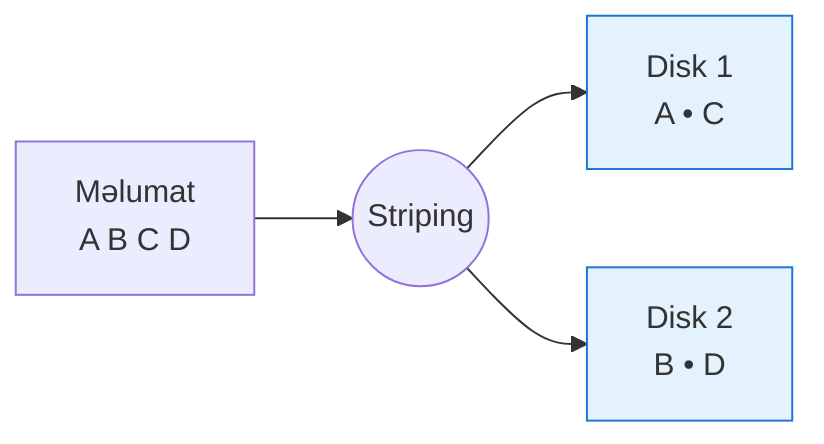
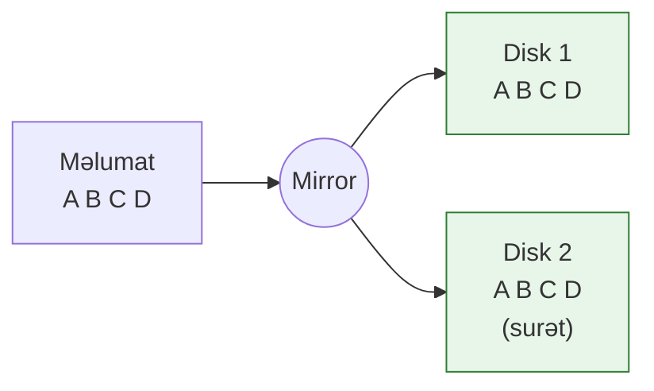
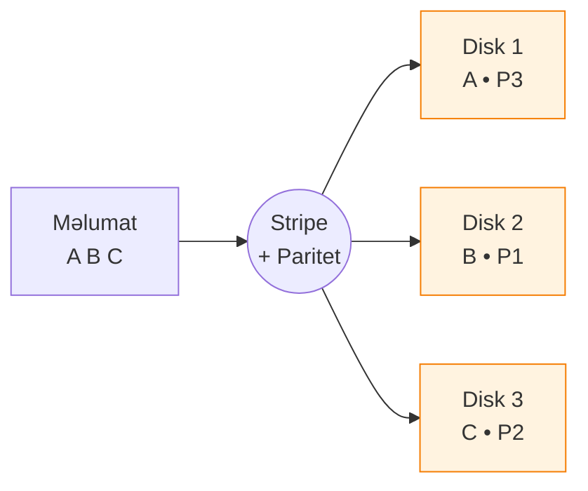
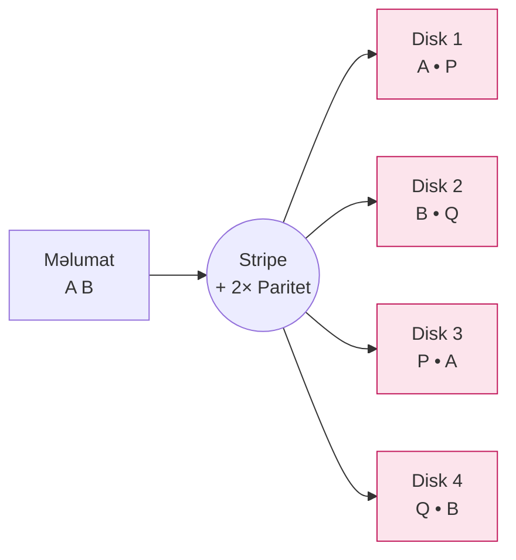
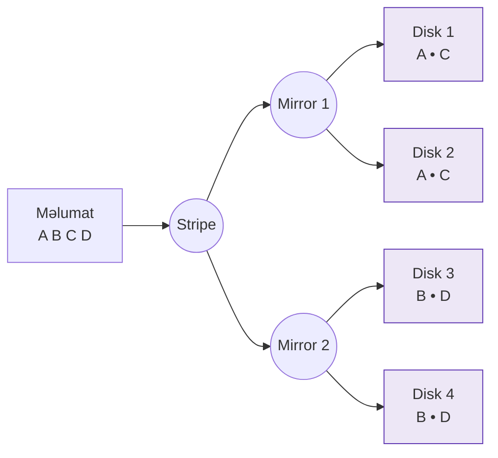

# 📦 RAID nədir?

**RAID** (Redundant Array of Independent Disks — Müstəqil Disklərin Ehtiyatlı Massivi) — bir neçə fiziki diskdən ibarət olan sistemdir. Məqsəd ya **sürəti artırmaq**, ya da **məlumat təhlükəsizliyini təmin etməkdir**.

RAID müxtəlif üsullarla məlumatı bölüşdürərək və ya kopyalayaraq:
- Disk nasazlığına qarşı dözümlülük yaradır
- Performansı artırır
- Əlçatanlığı (availability) yüksəldir

> **Sadə dillə:** RAID — bir neçə disk birləşdirilir ki, ya sürətli işləsinlər, ya da biri sıradan çıxsa belə məlumat itməsin. Həmçinin, hər ikisini də eyni anda edə bilər.

> **Qeyd:** RAID 2, RAID 3 və RAID 4 texnologiyaları artıq köhnəlmiş hesab olunur və müasir sistemlərdə istifadə edilmir. Bu növlər tarixdə qalmış, praktik tətbiqi olmayan və dəstək almayan RAID variantlarıdır. Əsasən RAID 0, 1, 5, 6 və 10 istifadə olunur.

---

## 🛡️ RAID niyə istifadə olunur?
- **Təhlükəsizlik:** Birdən çox disk istifadə olunarsa, birinin sıradan çıxması məlumat itkisinə səbəb olmur.
- **Sürət:** Məlumatlar paralel yazılır/oxunur.
- **Paritet:** Əlavə paritet diski vasitəsilə nasazlıq zamanı məlumat bərpa olunur.

---

# 🛠️ RAID Növləri və İstifadə Ssenariləri

RAID müxtəlif metodlarla yaddaşın bölünməsi və məlumatın qorunmasını təmin edir. Əsas texnikalar:
- **Striping (Zolaqlama):** Məlumatı bölərək paralel şəkildə birdən çox diskə yazmaq (RAID 0).
- **Mirroring (Güzgüləmə):** Məlumatı tam şəkildə bir və ya bir neçə diskə eyni anda yazmaq (RAID 1).
- **Parity (Paritet):** Disklərdə səhvlərin aşkarlanması və məlumatın bərpası üçün əlavə nəzarət məlumatı yazmaq (RAID 5, RAID 6).

---

## 🚀 RAID 0 – Striping

- **Necə işləyir:** Məlumat bloklara bölünür və birdən çox diskə paralel şəkildə yazılır.
- **Üstünlüklər:** Yüksək oxuma və yazma sürəti.
- **Çatışmazlıqlar:** Heç bir məlumat qoruması yoxdur. Bir disk sıradan çıxsa, bütün məlumat itir.
- **Uyğun ssenarilər:** Yalnız performans tələb olunan və məlumat itkisinin önəmli olmadığı sistemlər (məsələn, müvəqqəti fayllar, test mühiti).

---

## 🛡️ RAID 1 – Mirroring

- **Necə işləyir:** Məlumat hər iki diskə eyni anda yazılır. Əgər bir disk sıradan çıxsa, digəri işləyir.
- **Üstünlüklər:** Yüksək təhlükəsizlik. Məlumatın tam surəti var.
- **Çatışmazlıqlar:** Disk həcmi ikiqat azalır (tutumun yarısı istifadədə olur).
- **Uyğun ssenarilər:** Kritik məlumatlar saxlayan sistemlər (maliyyə, tibbi məlumatlar).

---

## ⚖️ RAID 5 – Striping + Single Parity

*Paritet (P) blokları bütün disklər arasında paylanır. Bir disk sıradan çıxarsa, itən məlumat paritet + qalan məlumat əsasında bərpa olunur.*

- **Necə işləyir:** Məlumat və paritet (nəzarət məlumatı) birdən çox disk arasında paylaşılır.
- **Üstünlüklər:** Balanslaşdırılmış təhlükəsizlik və performans.
- **Çatışmazlıqlar:** Paritet hesablamaları yazma sürətini azalda bilər. Rebuild zamanı məlumat itkisi riski artır.
- **Uyğun ssenarilər:** Orta səviyyəli serverlər, şirkət daxili məlumat bazaları.

---

## 🧩 RAID 6 – Striping + Double Parity

*İki paritet bloku (P və Q) saxlanır — iki disk sıradan çıxsa belə məlumat qorunur.*

- **Necə işləyir:** RAID 5 kimidir, lakin iki fərqli paritet saxlanılır.
- **Üstünlüklər:** İki disk sıradan çıxdıqda belə məlumat bərpa oluna bilir.
- **Çatışmazlıqlar:** RAID 5-dən daha yavaşdır (çünki əlavə paritet hesablanır). Rebuild daha uzun çəkir. Minimum 4 disk tələb edir.
- **Uyğun ssenarilər:** Yüksək dəyərli və davamlılıq tələb edən mühitlər.

---

## 🚀 RAID 10 – (RAID 1 + RAID 0 Kombinasiyası)

*Əvvəlcə cütlər arası mirror (RAID 1), sonra o cütlər arasında stripe (RAID 0) — hər iki üstünlüyü birləşdirir.*

- **Necə işləyir:** Əvvəlcə disklər cüt-cüt mirrordan ibarət olur, sonra bu cütlər stripe edilir.
- **Üstünlüklər:** Yüksək performans + Yüksək təhlükəsizlik.
- **Çatışmazlıqlar:** Minimum 4 disk lazımdır, disk tutumunun yarısı istifadə olunur.
- **Uyğun ssenarilər:** Həm sürət, həm də təhlükəsizlik tələb olunan sistemlər (məsələn, yüksək performanslı verilənlər bazaları).

---

# 📋 RAID Seçim Qaydası

| Tələbat | Uyğun RAID |
|:--------|:------------|
| Yüksək sürət, təhlükəsizlik önəmli deyil | RAID 0 |
| Maksimum məlumat qorunması, performans o qədər vacib deyil | RAID 1 |
| Yaxşı balans (performans və qoruma) | RAID 5 |
| Çox yüksək qoruma (hətta 2 disk sıradan çıxsa belə) | RAID 6 |
| Həm yüksək performans, həm də yüksək təhlükəsizlik | RAID 10 |

---

# 📦 RAID-də Yaddaşın İstifadəsi (Misallarla)

RAID konfiqurasiyalarında disk tutumu fərqli cür hesablanır.  
Bu, həm performansa, həm də məlumat təhlükəsizliyinə təsir edir.

---

## 📈 RAID 0 – Yalnız sürət (Heç bir məlumat qorunması yoxdur)

- **Nə baş verir:** Bütün disklər birləşdirilir. Disk həcmləri cəmlənir.
- **Formul:** `Toplam Yaddaş = Disk sayı × Disk tutumu`
- **Misal:**  
  - 2 disk × 1 TB = **2 TB** istifadə edilə bilən yaddaş
  - Əgər bir disk sıradan çıxarsa, **bütün məlumat** itir.

---

## 🛡️ RAID 1 – Güzgüləmə (Maksimum qoruma)

- **Nə baş verir:** Hər bir məlumat eyni anda iki diskə yazılır.
- **Formul:** `Toplam Yaddaş = (Disk sayı / 2) × Disk tutumu`
- **Misal:**  
  - 2 disk × 1 TB = **1 TB** istifadə edilə bilən yaddaş
  - Bir disk sıradan çıxarsa, məlumat **itmir**.

---

## ⚖️ RAID 5 – Striping + Single Parity (Balanslı həll)

- **Nə baş verir:** Disklər arasında məlumat + paritet paylanır.
- **Formul:** `Toplam Yaddaş = (Disk sayı - 1) × Disk tutumu`
- **Misal:**  
  - 3 disk × 2 TB = **4 TB** istifadə edilə bilən yaddaş
  - Bir disk sıradan çıxsa belə, məlumat **bərpa oluna bilər**.

---

## 🧩 RAID 6 – Striping + Double Parity (Daha güclü qoruma)

- **Nə baş verir:** İki paritet saxlanılır.
- **Formul:** `Toplam Yaddaş = (Disk sayı - 2) × Disk tutumu`
- **Misal:**  
  - 4 disk × 2 TB = **4 TB** istifadə edilə bilən yaddaş
  - İki disk sıradan çıxsa belə, məlumat **qorunur**.

---

## 🚀 RAID 10 – Kombinə olunmuş təhlükəsizlik və sürət

- **Nə baş verir:** Əvvəlcə RAID 1 (mirroring), sonra RAID 0 (striping).
- **Formul:** `Toplam Yaddaş = (Disk sayı / 2) × Disk tutumu`
- **Misal:**  
  - 4 disk × 1 TB = **2 TB** istifadə edilə bilən yaddaş
  - Həm sürət artır, həm də disk sıradan çıxmasına dözümlüdür.

---

# 📋 Qısa Cədvəl

| RAID Növü | Minimum Disk sayı | Disklər necə istifadə olunur | İstifadə edilə bilən yaddaş |
|:---------|:------------------|:------------------------------|:----------------------------|
| RAID 0   | 2                 | Yalnız bölünmə (striping)     | Bütün disklərin cəmi        |
| RAID 1   | 2                 | Güzgüləmə (mirroring)         | Disk tutumunun yarısı       |
| RAID 5   | 3                 | Paritetlə bölünmə             | (Disk sayı - 1) × Disk tutumu |
| RAID 6   | 4                 | İkiqat paritetlə bölünmə      | (Disk sayı - 2) × Disk tutumu |
| RAID 10  | 4                 | Güzgüləmə + bölünmə           | Disk tutumunun yarısı       |

---

## 💸 Qiymət Nüansları

| RAID Növü | Üstünlüklər | Dezavantajlar | Qiymət |
|:---------|:------------|:--------------|:------|
| RAID 0   | Sürət yüksəkdir | Qoruma yoxdur | Ən ucuz (yalnız disk sayı artır) |
| RAID 1   | Tam qoruma | Yaddaşın yarısı itir | 2x diskə ehtiyac var |
| RAID 5   | Balanslı həll | Rebuild vaxtı risklidir | 3+ disk lazımdır |
| RAID 6   | Güclü qoruma | Performans bir az aşağıdır | 4+ disk lazımdır |
| RAID 10  | Sürət + qoruma | Disk xərci yüksəkdir | Minimum 4 disk və yüksək xərc |

---

## 🚨 Tez-tez edilən Səhvlər və Tövsiyələr

- **Sırf ucuz başa gəlsin deyə RAID 0 seçmək:** Məlumatın itməsi halında problem yaşana bilər.
- **Disk sayı az olduğu halda RAID 5 seçmək:** 3 disklə RAID 5 qurulanda performans və qoruma zəif olur, rebuild zamanı risk artır.
- **Fərqli ölçülü disklər istifadə etmək:** RAID sistemində bütün disklərin ölçüsü **ən kiçik diskə** bərabər olur. Pul israfına səbəb ola bilər.
- **Qurğular üçün uyğunsuz RAID seçimi:** Məsələn, video redaktə üçün RAID 0 daha uyğundur, ancaq serverlər üçün RAID 10 və ya RAID 6 daha məntiqlidir.
- **Backup etməmək:** RAID sistemləri fiziki nasazlıqlara qarşı qoruma təmin edir, ancaq insan səhvlərinə, viruslara və ya yanğın/zəlzələ kimi hadisələrə qarşı **etməz**.  
  Həmişə ayrıca **backup** vacibdir!
- **Soft RAID vs. Hardware RAID:**  
  - *Soft RAID* — proqram təminatı ilə, ucuz, amma performans və etibarlılıq aşağı ola bilər.
  - *Hardware RAID* — xüsusi RAID kontrollerlərlə qurulur, daha sürətli və etibarlıdır, amma bahalıdır.
- **SSD və RAID:**  
  - SSD istifadə edirsinizsə, RAID konfiqurasiyasını seçərkən SSD-lərin yazma dövrü limiti və performans fərqlərini nəzərə alın.

---

# 🧠 Yekun Tövsiyə

- Kritik məlumat üçün RAID 1, 5, 6 və ya performansda qatmaq istəsəniz 10 seçin.
- Yalnız performans üçün RAID 0, amma backup şərti ilə!
- RAID qurduqdan sonra da backup etməyi unutmayın.
- RAID heç vaxt backup əvəzi deyil!

---

# 📚 Yekun

Müəssisələr və şəxsi istifadəçilər ehtiyaclarına və büdcələrinə əsaslanaraq RAID növünü və disk sayını seçməlidirlər.  
Sistem dizaynı zamanı həm disk sayı, həm də ehtimal olunan risklər düzgün dəyərləndirilməlidir.

