# Təhlükəsiz Tətbiq İnkişafı

## Niyə bu vacibdir

Təşkilatların istehsalda həqiqətən qarşılaşdığı pozulmaların əksəriyyəti şəbəkə qatı hadisələri deyil. Onlar tətbiq qatı hadisələridir — parametrləşdirilməli olan injection, yalnız JavaScript-də tətbiq olunan icazə yoxlaması, hücumçunun nəzarət etdiyi baytlara güvənən deserializasiya rutini, dörd səviyyə dərinlikdə backdoor olduğu ortaya çıxan tranzitiv asılılıq. Firewall öz işini gördü; tətbiq isə hücumçunu ön qapıdan dəvət etdi.

Təhlükəsiz tətbiq inkişafı təhlükəsizliyi prosesin sonunda əlavə etmək yerinə proqram təminatı dövrünə daxil etmək intizamıdır. Bu sahədə ən bahalı səhv təhlükəsizliyi sondakı qapı kimi qəbul etməkdir — buraxılışdan bir həftə əvvəl penetrasiya testi, dəyişiklik artıq istehsalda olduqdan sonra uyğunluq yoxlaması. Gec aşkarlanan tapıntılar yenə də göndərilən tapıntılardır, çünki kimsə buraxılışı təxirə salmaq istəmir. Ucuz səhvlər kod hələ yazılarkən tutulan səhvlərdir: redaktorda statik analiz xəbərdarlığı, pull request-i sındıran asılılıq skaneri, public storage bucket açan infrastruktur dəyişikliyini birləşdirməkdən imtina edən siyasət mühərriki. Eyni qüsur sağ qaldığı hər mərhələdə bir tərtib böyük qiymətə düşür.

Bu dərs təhlükəsizliyə şüurlu proqram komandasının mənimsəməli olduğu praktiki konsepsiyaları gəzir: mühitlər necə ayrılır, kod onların arasında necə göndərilir, hansı təhlükəsiz kodlama vərdişləri proqnozlaşdırıla bilən qüsur siniflərinin qarşısını alır, niyə client tərəfli validasiya teatrdır, müasir CI/CD pipeline təhlükəsizlik proqramına nə borcludur və versiya nəzarəti və davamlı monitorinq dövrəni necə bağlayır. Nümunələrdə uydurma `example.local` təşkilatı və `EXAMPLE\` domeni istifadə olunur. Alət adları (Semgrep, Trivy, Snyk, Dependabot, GitHub Actions) neytral şəkildə çəkilir — prinsiplər vendor-dan asılı olmayaraq eynidir.

Hər proqram istehsal edən təşkilatın öz-özü üçün cavablandırmalı olduğu risk kateqoriyaları:

- **Mühit bütövlüyü** — istehsalda işləyən kod nəzərdən keçirilmiş, test edilmiş və imzalanmış kodmu?
- **Input etibarı** — düşmən onlardan birini idarə etdikdə tətbiq verilənləri və təlimatları ayırd edə bilirmi?
- **Təchizat zənciri** — asılılıq ağacında nə olduğunu bilirsinizmi və o dəyişsə bunu görəcəksinizmi?
- **Hər addımda identitet** — build pipeline-i həqiqətən ehtiyac duyduğu minimum etimadnamələrlə işləyirmi, yoxsa administrator ilə?
- **Müşahidə qabiliyyəti** — istismar oluna bilən qüsur istehsala çatdıqda telemetriya istismardan əvvəl onu tutacaqmı?
- **Geri qaytarılma** — pis buraxılışı verilənləri itirmədən dəqiqələr içində geri qaytara bilərsinizmi?

Bu altı sual hər təhlükəsiz SDLC proqramının onurğasını təşkil edir. Dərsin qalan hissəsi onlara cavab verən nəzarətlər haqqındadır.

## Əsas anlayışlar

Təhlükəsiz tətbiq inkişafı axın problemidir. Kod tərtibatçının laptopunda başlayır, getdikcə daha çox istehsala bənzər mühitlər seriyasından keçir və müştərilərə xidmət göstərməklə bitir. Hər keçiddə nəzarətlər təhlükəli heç nəyin keçmədiyini və iştirak edən şəxslərin artefaktı irəli aparmaq səlahiyyətinə sahib olduğunu yoxlayır. Bu yoxlamalardan hər hansını atlasanız, istehsalı qoruyan yeganə şey şansdır.

### Mühit dövrü — Dev, Test, Staging, Production, QA

Əksər təşkilatlar hesablama mühitlərini təyinatına görə ayırır ki, birində görülən iş digərini pozmasın. Aparat ayrılır və giriş nəzarəti siyahıları istifadəçilərin eyni vaxtda birdən çox mühitə girməsinin qarşısını alır. Klassik bölgü dörd — bəzən beş — fərqli mühitdir, hər birinin öz işi var.

**Development** kod yazmaq üçün ölçülür və konfiqurasiya olunur. İstehsal aparatı qədər miqyaslana bilən və ya performanslı olmaq məcburiyyətində deyil, lakin əməliyyat sistemi növü və versiyası üzrə istehsala uyğun olmalıdır. Windows-da inkişaf etdirib Linux-a yerləşdirmək, başlanğıcdan bir gün sonra "mənim maşınımda işləyir" biletləri yaradan, qarşısı alına bilən tələdir. Kod əsas tərtibatçı testindən keçdikdən sonra test mühitinə keçir.

**Test** istehsala yaxından bənzəyir — eyni proqram versiyaları, eyni patch səviyyələri, eyni icazələr, eyni fayl strukturu. İz miqyas olmasa belə uyğundur. Məqsəd development-də qüsursuz olan hər şeyin istehsalda qarşılaşacağı eyni konfiqurasiya ilə işlədiyi zaman düzgün davrandığını yoxlamaqdır. Sistem-spesifik parametrlər burada işlənilir, sürprizlərin ucuz düzəldildiyi yerdə.

**Staging** opsionaldır, lakin təşkilatın çoxlu istehsal mülklərinin olduğu yerdə ümumidir. Test-dən sonra sistem staging-ə keçir və oradan müxtəlif istehsal saytlarına yayılır. Staging test və istehsal arasında sandbox-dur: test mühiti növbəti buraxılışı işlədə bilər, hazırkı buraxılış staging-də oturur və geri qaytarmalar istehsala toxunmadan mümkün qalır. Staging həm də test-in tuta bilmədiyi inteqrasiyaları tutur — real üçüncü tərəf nöqtələri, real şəbəkə yolları, real həcmlər.

**Production** tətbiqin real istifadəçilər və real verilənlərlə qarşılaşdığı yerdir. Dizayn etibarı ilə burada çox az dəyişiklik baş verir və olanlar dəyişiklik idarəçiliyindən keçir — təsdiq edilmiş, test edilmiş, planlaşdırılmış və geri qaytarıla bilən.

**Quality assurance (QA)** yer deyil, proses intizamıdır. Müasir təcrübə keyfiyyəti və təhlükəsizliyi sondakı yoxlayıcı qatı yerinə build prosesinin özü vasitəsilə idarə edir. Bug registrinə sahib olan, tapıntıları triaj edən və düzgün məlumatı düzgün komandaya yönləndirən insanlar üçün hələ də rol var — lakin iş build ilə inteqrasiyadır, buraxılışı qoruyan keçid deyil.

**Mühit xülasəsi:**

| Mühit | Məqsəd | Verilənlər | Tezlik | Kim girə bilər |
|---|---|---|---|---|
| Development | Kod yazma, unit testi | Sintetik / tam saxta | Davamlı (commit başına) | Bütün mühəndislər |
| Test | Funksional və təhlükəsizlik testi | Sintetik və ya anonimləşdirilmiş | Birləşdirmə başına və ya planlı | Mühəndislər, QA |
| Staging | İstehsala bənzər qəbul | Anonimləşdirilmiş istehsal çıxarışı və ya sintetik | Buraxılış namizədi başına | QA, ops, məhdud mühəndislər |
| Production | Real müştərilər, real verilənlər | Real | Yalnız təsdiqlənmiş buraxılışlar | Yalnız ops, on-call |
| QA (proses) | Bug reqistri, triaj | Yox | Davamlı | QA liderləri, mühəndislik liderləri |

Bütün beş mühitdə əsas qayda **verilənlərin ayrılması**dır. İstehsal verilənləri — real müştəri PII-si, real ödəniş kartları, real tibbi qeydlər — development, test və ya staging-ə aid deyil. Tərtibatçının bug-u təkrar etməsi üçün "sadəcə snapshot köçürmək" cazibəsi tənzimlənən verilənlərin sızdığı dəqiq yoldur: development iş stansiyasının nadir hallarda istehsal verilənlər bazasının nəzarətləri olur. Test üçün real verilənlər tələb olunduqda anonimləşdirmə, tokenləşdirmə və ya sintetik istehsaldan istifadə edin. Qayda tənzimlənən yüklər üçün danışılmazdır və qalanları üçün güclü standartdır.

İkinci qayda: istehsalda işləyən etimadnamələr, imzalama açarları və service-account tokenləri istehsaldan kənarda mövcud olmamalıdır. Laptopundan istehsal verilənlər bazasını oxuya bilən tərtibatçı pozulmadan bir laptop pozuntusu uzaqdadır. Mühitə xas identitet, qısa müddətli etimadnamələr və çağırıldıqda doğru insanları çağıran break-glass prosedurlarından istifadə edin. Arxitektura diaqramı hansı etimadnamələrin hansı mühit sərhədini keçdiyini açıq şəkildə göstərməlidir — və oxların əksəriyyəti boş olmalıdır.

### Provisioning və deprovisioning

**Provisioning** obyektlərə icazə və ya səlahiyyət vermə aktıdır. İstifadəçilər qruplara provision olunur; kompüter thread-ləri yüksək icra icazələrinə provision oluna bilər; mühitlər infrastrukturla provision olunur. **Deprovisioning** artıq lazım olmadıqda həmin icazələrin geri götürülməsidir.

Təhlükəsiz kodlamada işləyən prinsip yalnız qısa müddət ucalmaqdır. Bir əməliyyat üçün root tələb edən thread həmin səviyyəyə provision olunur, əməliyyatı yerinə yetirir və geri deprovision olunur. Yüksək imtiyaz pəncərəsi nə qədər dar olsa, proqram ucaldılarkən ələ keçirilərsə partlayış radiusu o qədər kiçik olur.

Eyni prinsip bütün mühitlərə tətbiq olunur. Müasir komandalar infrastrukturu kod kimi idarə edir — Terraform, CloudFormation, Bicep, Pulumi — beləliklə mühit deterministik şəkildə sökülə və yenidən qurula bilər. **Efemer mühit** modeli bunu daha da irəli aparır: hər pull request öz qısa müddətli preview mühiti alır, verilənlər bazası, növbələr və inteqrasiyalarla tam, baxış müddəti boyunca yaşayır və PR birləşdirildikdə və ya bağlandıqda avtomatik məhv olur. Efemerlik etimadnamələr və köhnə verilənlər toplayan unudulmuş laboratoriya mühitlərinin uzun quyruğunu aradan qaldırır.

Provisioning iş axınlarının özlərinə autentifikasiya və avtorizasiya lazımdır. İnfrastrukturu yerləşdirən pipeline-ın tərifə görə infrastrukturu yerləşdirmək imtiyazı var — bu da pipeline-ı cəlbedici hədəfə çevirir. Pipeline platforması ilə bulud provayderi arasında OIDC federasiyasından istifadə edin ki, pipeline uzun müddətli giriş açarı tutmaq əvəzinə qısa müddətli rol götürsün, rolu pipeline-ın həqiqətən toxunduğu resurslara məhdudlaşdırın və istehsalda hər imtiyazlı hərəkət üçün insan təsdiqi addımı tələb edin. Ən az imtiyaz prinsipi insanlardan daha çox robotlara aiddir.

### Bütövlük ölçüsü

Proqram inkişafında bütövlük verilənlərin — mənbə kodu, build artefaktları, konteyner şəkilləri və buraxılış paketləri daxil olmaqla — icazə olmadan dəyişdirilmədiyinə əminlikdir. Hətta kiçik icazəsiz dəyişikliklərin böyük nəticələri ola bilər və nəzarətlər olmadan görmək asandır.

Bütövlüyün saxlanması üçün iki şey baş verməlidir. Birincisi, kod bazası üzərində nəzarət: tərtibatçılar legitim nüsxədə işləməli, bir həftə əvvəl ayrılmış fork-da deyil. İkincisi, dəyişdirilə bilməyən versiyaları müəyyənləşdirmək yolu. Versiya nəzarəti metaverilənləri faydalıdır, lakin dəyişkəndir; kriptoqrafik hash-lər deyil. Hash alqoritmi rəqəmsal obyektin unikal barmaq izini istehsal edir və versiyalara uyğunlaşdırılmış hash dəyərləri kataloqu bütövlük qeydi olur. Kodun nüsxəsi əldə olunduqda onu hash edirsiniz və cədvəldə versiyanı axtarırsınız; hash uyğun gəlirsə, bitlər təsdiqlənənlə eynidir.

Kod yerləşdirmə üçün buraxıldıqda rəqəmsal imzalanır və hash və imza birlikdə artefaktın nəqlində və ya istirahətdə dəyişdirilmədiyini istehlakçılara təmin edir. Müasir təchizat zənciri təcrübəsi bunu **software bills of materials (SBOM-lar)**, **in-toto attestasiyaları** və **Sigstore-üslublu şəffaf imzalamaya** qədər genişləndirir ki, commit-dən yerləşdirilmiş şəklə qədər bütün zəncir hər istehlakçı tərəfindən yoxlanıla bilsin. NIST SP 800-218 (Təhlükəsiz Proqram İnkişafı Çərçivəsi) və SLSA (Proqram Artefaktları üçün Təchizat Zənciri Səviyyələri) bu gözləntiləri rəsmiləşdirir.

2020-ci il SolarWinds pozulması mücərrədi konkretə çevirdi: etibarlı satıcının build pipeline-ını pozan hücumçu satıcının öz imzası ilə minlərlə müştəriyə zərərli proqram göndərə bilər. Müdafiə təkrar istehsal oluna bilən build-lər (eyni mənbə eyni bitləri, bayt-bayt istehsal edir), hermetik build-lər (elan edilmiş girişlərdən başqa host mühitindən asılılıq yoxdur) və yoxlanıla bilən mənşədir (SBOM və attestasiya hansı commit-in hansı artefaktı istehsal etdiyini deyir və üçüncü tərəf hər ikisini yoxlaya bilər).

Bütövlük nəzarətləri yalnız build vaxtında deyil, runtime-da da vacibdir. Konteyner orkestrləri etibarlı imzası olmayan şəkilləri rədd etmək üçün konfiqurasiya oluna bilər; paket menecerləri yüklənmiş paketlərin checksum və imzalarını yoxlaya bilər; əməliyyat sistemləri imzalanmamış kernel modullarını rədd etmək üçün Secure Boot istifadə edə bilər. Bütövlüyü yoxlamayan zəncirin hər halqası yuxarı axındakı kompromiyanın işləyən yükün kompromiyasına çevrildiyi yerdir.

### Təhlükəsiz kodlama texnikaları — validasiya, kodlaşdırma, normalizasiya, stored prosedurlar, obfuskasiya, dead code, kod təkrar istifadəsi

Bütün kodun zəiflikləri var. Effektiv müdafiələr həmin zəiflikləri istismar etməyi çətinləşdirir. Secure Development Lifecycle (SDL) ardıcıl tətbiq olunduqda əksər proqnozlaşdırıla bilən qüsur siniflərini dayandıran vərdişlər toplusunu birləşdirir.

**Input validasiyası** ilk müdafiədir. Etibar sərhədini keçən hər dəyər — HTTP sorğusu, fayl yükləməsi, mesaj-növbə yükü, xarici sistemdən verilənlər bazası sırası — istifadə olunmazdan əvvəl qəbul edilə bilən formaların allow-list-inə qarşı təsdiqlənməlidir. Allow-list (icazə verilənləri göstərin) deny-list-dən (qadağan edilənləri göstərin) güclüdür, çünki hücumçular həmişə deny-list-in heç vaxt təsəvvür etmədiyi inputları düşünəcəklər.

**Output kodlaşdırması** tamamlayıcıdır: müəyyən kontekstə göndərilən verilənlər həmin kontekst üçün kodlaşdırılmalıdır. HTML output HTML-kodlaşdırılır; SQL parametrləri bağlanır, birləşdirilmir; shell əmrləri tək sətirlər deyil, argv massivlərini alır. Verilənləri və təlimatları qarışdırmaq injection zəifliklərinin kök səbəbidir — XSS, SQL injection, command injection, LDAP injection — və düzgün kodlaşdırma əlacdır. Müasir web çərçivələri şablonlarda təhlükəsiz kodlaşdırmanı default edir; bug-lar adətən tərtibatçının çərçivənin təhlükəsizliyini aşaraq etibarlı hesab etdiyi verilənlər üçün "raw" output istehsal etdiyi yerdə görünür.

**Normalizasiya** çox vaxt validasiyadan əvvəl gələn addımdır. Sətirlər çoxlu yollarla kodlaşdırıla bilər — Unicode normalizasiya formaları, faiz-kodlaşdırma, HTML elementləri — beləliklə istifadəçi inputunun gözlənilən dəyərlərə bayt-bayt müqayisəsi etibarsızdır. `rose` sətri həm də `r%6fse`, `r&#111;se` və ya müxtəlif Unicode confusable kimi görünə bilər. Əvvəlcə kanonik formaya normallaşdırmaq deməkdir ki, ekvivalent sətirlərin bir ikilik təqdimatı var, bundan sonra validasiya ardıcıl tətbiq oluna bilər.

**Stored prosedurlar və parametrləşdirilmiş sorğular** relyasiya verilənlər bazası ilə danışmağın doğru yoludur. Stored prosedur əvvəlcədən kompilyasiya olunmuş, skriptləşdirilmiş verilənlər bazası rutindir; parametrləşdirilmiş sorğu SQL ifadəsini onun parametrlərindən ayırır ki, istifadəçi inputu ifadənin strukturunu dəyişə bilməsin. Hər iki yanaşma proqramçının etibarsız sətirləri SQL-ə birləşdirməsinin qarşısını alır — tarixin hər SQL injection-unun arxasındakı bug. Stored prosedurlar əlavə olaraq daha sürətli icra olunur, lakin təhlükəsizlik faydası parametr bağlamasıdır.

Eyni prinsip SQL-dən kənara genişlənir. NoSQL verilənlər bazaları (MongoDB, Cassandra) parametrləşdirilmiş sorğulara ehtiyac duyur. ORM-lər `.raw()` qaçış lyukları ilə deyil, parametrləşdirilmiş API-lər vasitəsilə istifadə olunmalıdır. GraphQL xidmət rəddinin qarşısını almaq üçün dərinlik və mürəkkəblik limitlərinə ehtiyac duyur. LDAP sorğularına escape lazımdır. Shell əmrlərinə argv massivləri lazımdır. Tətbiq istifadəçi verilənlərindən təlimat sətri qurduqda "parse, birləşdirmə" prinsipi tətbiq olunur — və standart kitabxana və ya yoxlanılmış helper demək olar ki, həmişə doğru primitiv təmin edir.

**Obfuskasiya** hücumçunun kəşfiyyatını yavaşlatmaq üçün açıq mənanı gizlətmə təcrübəsidir. Mail serverlərini `email1, email2, email3` adlandırmaq namespace elan edir; onları ardıcıl olmayan identifikatorlarla yenidən adlandırmaq sayımı çətinləşdirir. Obfuskasiya dərin müdafiə qatıdır, təhlükəsizliyə əvəz deyil. Obfuskasiya olunmuş nəzarəti təkbaşına adekvat hesab etmək "qaranlıqla təhlükəsizlik"dir və hücumçu mənbəni oxuyan anda qırılır.

**Dead code** işləyən, lakin nəticələri heç vaxt istifadə olunmayan koddur. Compiler optimizasiyaları dead code-u silə bilər — ümumiyyətlə faydalıdır, lakin spesifik hallarda təhlükəlidir. Klassik nümunə: yaddaşdan təmizləmək üçün istifadədən sonra gizli açarı sıfırlarla üst-üstə yazan rutin. Wipe-dan sonra heç nə açarı oxumadığı üçün aqressiv optimizator wipe-ı silir və açar qalır. Dead code-u silmək yaxşı gigiyenadır; "ölü" kodun təhlükəsizlik işi gördüyü halları başa düşmək vacibdir. Volatile yazılardan, açıq yaddaş təmizləmə primitivlərindən (`memset_s`, `SecureZeroMemory`) və bunları çağıran SDL təlimatlarından istifadə edin.

**Kod təkrar istifadəsi** müasir proqram təminatının təməlidir. Komponentləri təkrar istifadə etmək inkişaf xərclərini azaldır və ekspertizanı cəmləşdirir — xüsusilə kriptoqrafiya həmişə yoxlanılmış kitabxanadan gəlməlidir, heç vaxt fərdi tətbiqdən deyil. Kompromis monokulturadır: çoxlu sistemlər eyni komponentdən asılı olduqda, həmin komponentdə zəifliyin geniş partlayış radiusu olur. Mənşəsi təmiz və saxlayıcısı etibarlı olduğu yerdə aqressiv təkrar istifadə edin; mənşəsi qeyri-müəyyən və funksiya özünüz yazmaq üçün kifayət qədər kiçik olduğu yerdə təkrar istifadəyə müqavimət göstərin.

**Təhlükəsiz kodlama vərdişləri müqayisəsi:**

| Vərdiş | Nəyin qarşısını alır | Atlandıqda necə uğursuz olur |
|---|---|---|
| Allow-list input validasiyası | Injection, deserializasiya, parser çaşqınlığı | Hücumçu gözlənilməz forma göndərir; aşağı axın parser pis davranır |
| Konteksə görə output kodlaşdırma | XSS, SQL injection, command injection | Verilənlər təlimat kimi şərh olunur; ixtiyari kod işləyir |
| Validasiyadan əvvəl normalizasiya | Kodlaşdırma keçidləri, Unicode confusable | Validator sistemin qalanının rədd etdiyi ekvivalent sətri qəbul edir |
| Parametrləşdirilmiş sorğular / stored prosedurlar | SQL injection | Hücumçu WHERE şərtini idarə edir; verilənlər çıxarılır |
| Yaddaş-təhlükəsiz dil və ya sanitizer-lər | Buffer overflow-lar, UAF, double free | Hücumçu prosesdə ixtiyari kod icra edir |
| Secret manager (kodda secret yox) | Repository vasitəsilə etimadnamə sızıntısı | Açar commit-də sızdırılır; dəqiqələrdə yığılır |
| SBOM + asılılıq skanı | Zəif tranzitiv asılılıq | Növbəti Log4j-üslublu CVE: təsiri kəşf etmək üçün həftələr |

### Server tərəfli vs client tərəfli validasiya

Hər client/server tətbiqində verilənlər göndərilməzdən əvvəl client-də və ya alındıqdan sonra server-də yoxlanıla bilər. Hər ikisinin rolu var; yalnız biri təhlükəsizlikdir.

Client tərəfli validasiya istifadəçi təcrübəsini yaxşılaşdırır: yazı səhvlərini tutur, dərhal əks əlaqə verir və tarix yanlış formatda olduqda dövrə-vurmadan qaçır. Onun yeganə işi budur.

Client etibarlı mühit deyil. İstifadəçi — və ya istifadəçinin maşınında hücumçu, və ya şəbəkədə man-in-the-middle, və ya brauzeri tamamilə keçən skript — client yoxlamasından sonra hər şeyi dəyişə bilər. Buna görə təhlükəsizlik və ya biznes qərarı üçün istifadə olunan hər dəyər tətbiqin icranı idarə etdiyi server-də yenidən təsdiqlənməlidir. Qısacası: **client tərəfli validasiya UX-dir, server tərəfli validasiya təhlükəsizlikdir.** "Forma artıq yoxlayır" deyə server yoxlamasını atlayan hər kim JavaScript-dən avtorizasiya sistemi qurub və nəticələri qazanıb.

Eyni prinsip mobil və masaüstü client-lərə də aiddir. Jailbreak edilmiş telefon, modifikasiya olunmuş oyun client-i və ya fərdi HTTP aləti server-in qəbul etdiyi hər sorğunu verə bilər. Server tərəfli avtorizasiya istifadəçi A-nın istifadəçi B-nin qeydlərini oxuya bilməməsini, client-dən təqdim olunan qiymət sahələrinin ödənişin həqiqət mənbəyi kimi etibar edilməməsini və iş axını vəziyyət keçidlərinin client-in iddia etdiyinə qarşı deyil, verilənlər bazasındakı faktiki əvvəlki vəziyyətə qarşı təsdiqlənməsini təmin etməlidir.

### Yaddaş idarəçiliyi

Yaddaş idarəçiliyi proqramın dəyişənlər üçün yaddaşı necə ayırdığını və dəyişənlərə artıq ehtiyac olmadıqda onu necə geri qaytardığını əhatə edir. Bu sahədəki bug-lar ən pis təhlükəsizlik qüsurlarının bəzilərini istehsal edir: **buffer overflow-lar** (ayırmanın sonundan, çox vaxt qonşu stack frame-ləri və ya funksiya pointer-ləri üzərinə yazma), **use-after-free** (yaddaşa buraxıldıqdan sonra giriş, bəzən hücumçunun nəzarət etdiyi məzmunlarla), **double free**, **yaddaş sızıntıları** (heç vaxt buraxılmayan ayırmalar, nəticədə resursları tükəndirir).

Avtomatik yaddaş idarəçiliyi olmayan dillər — klassik olaraq C və C++ — proqramçıdan yaddaşı açıq şəkildə ayırmağı və azad etməyi tələb edir. Onlar ən sürətli ikilikləri və ən uzun CVE tarixini istehsal edirlər. Avtomatik garbage collection ilə dillər — Java, C#, Python, Ruby, JavaScript — bəzi səmərəlilik qarşılığında dramatik şəkildə az yaddaş təhlükəsizliyi bug-ı verir. Müasir yaddaş-təhlükəsiz sistem dilləri — Rust, Go, Swift — yaddaş korlanmasının əksər siniflərinə qarşı kompilyasiya zamanı və ya runtime zəmanətlərlə C-yə yaxın performans təklif edir.

2026-cı ildə greenfield iş üçün təhlükəsizlik məsləhəti birmənalıdır: defolt olaraq yaddaş-təhlükəsiz dil seçin. CISA, NSA və əsas bulud provayderləri bu istiqamətdə təlimat dərc etmişdir və köhnə C/C++-ın isti yollarını Rust-da yenidən yazmaq əsas model olmuşdur. Mövcud C/C++ kodu atılmalı deyil, lakin əlavə müdafiələrə ehtiyac duyur: CI-də AddressSanitizer, fuzzing, başlanğıc edilməmiş oxumalar üçün MemorySanitizer və müasir compiler hardening bayraqları.

Yaddaş təhlükəsizliyindən kənarda, daha geniş **təhlükəsiz-dil xüsusiyyətləri** də vacibdir: sətirlər və SQL arasında, istifadəçi ID-ləri və hesab ID-ləri arasında, etibarlı və etibarsız verilənlər arasında çaşqınlığın qarşısını alan tip sistemləri; ən ümumi runtime crash sinfinin qarşısını alan null təhlükəsizliyi; yarış şərtlərini istehsal hadisəsi əvəzinə kompilyasiya səhvinə çevirən sahiblik modelləri. Dil dəyişdirmə xərci realdır; dəyişdirməmənin xərci, kod bazasının ömrü boyunca CVE-lər və təcili yamalarla ödənilən, adətən daha yüksəkdir.

### Üçüncü tərəf kitabxanaları və SDK-lar

Bu gün proqramlaşdırma əsasən üçüncü tərəf kitabxanalarının və proqram inkişafı dəstlərinin (SDK-ların) inteqrasiyasıdır. Sazlanmış, yaxşı test edilmiş kitabxananı yenidən yazmaq nadir hallarda vaxtın ən yaxşı istifadəsidir və mürəkkəb, həssas rutinlər üçün — kanonik nümunə kriptoqrafiya — yoxlanılmış kitabxanalar nəhəng riski aradan qaldırır. Digər tərəfi təchizat zənciri riskidir: hər asılılıq tətbiqə giriş nöqtəsidir.

Buna müraciət edən intizam **software composition analysis (SCA)**-dır — asılılıqları (birbaşa və tranzitiv) sayan, onları məlum zəifliklərə uyğunlaşdıran və təhlükəli bir şey daxil edən build-ləri qeyd edən və ya bloklayan avtomatlaşdırılmış alətlər. Alətlərə Snyk, Dependabot, Renovate, Trivy, OWASP Dependency-Check və Grype daxildir. SPDX və ya CycloneDX formatında SBOM-lar build-də nə olduğunu təsvir edir ki, aşağı axın istehlakçıları yeni xəbərdarlıqlar göründükcə yoxlaya və yenidən skan edə bilsin. Asılılıqları spesifik versiyalara və ya məzmun hash-lərinə **pin etmək** ("latest"-ə üzən əvəzinə) build-ləri təkrar istehsal oluna bilən edir və yuxarı axın saxlayıcının hesabını pozan hücumçunun avtomatik istehsala çatmasının qarşısını alır. Alətlər üçün çapraz istinadlar: açıq mənbə alət dəsti üçün [./open-source-tools/vulnerability-and-appsec.md](./open-source-tools/vulnerability-and-appsec.md) və əlaqəli secret idarəçiliyi üçün [./open-source-tools/secrets-and-pam.md](./open-source-tools/secrets-and-pam.md) baxın.

CVE-ləri sadəcə skan etməkdən kənarda, yetkin proqramlar yeni asılılıqları daxil edilməzdən əvvəl yoxlayır. `npm install`-dan əvvəl soruşmağa dəyər suallar: bu paketi kim saxlayır, son buraxılış nə vaxt idi, neçə açıq təhlükəsizlik məsələsi var, lisenziya nədir, tranzitiv olaraq nə gətirir, daha kiçik alternativ var? **Asılılıq çaşqınlığı hücumları** — public registry-dəki zərərli paket private daxili paket adını gizlətdiyi yerdə — paket menecerini default olaraq private registry istifadə etməyə və daxili paket adlarını scope etməyə konfiqurasiya etməklə dayandırılır. **Typosquatting** — populyar paketdən bir simvol uzaqda adlandırılmış paketlər — hər yeni asılılıq əlavəsinin kod baxışı ilə dayandırılır.

### Verilənlərin ifşası

Verilənlərin ifşası emal zamanı verilənlər üzərində nəzarətin itirilməsidir. Verilənlər istirahətdə, nəqlində və — getdikcə daha çox — istifadədə qorunmalıdır. Tətbiq komandasının işi həssas verilənlərin sistemdən axınını çəkmək və hər addımda qorumanın tətbiq olunduğunu yoxlamaqdır. Konfidensiallıq səhvləri (icazəsiz oxuma) və bütövlük səhvləri (icazəsiz yazma) eyni dərəcədə ciddidir. Verilənlərin təsnifatı buna birbaşa təsir edir — daha geniş nəzarət kataloqu üçün [../grc/security-controls.md](../grc/security-controls.md) baxın.

Verilənlərin ifşasına qarşı praktiki müdafiələrə daxildir: nəqldə şifrələmə (güclü şifrlərlə TLS 1.3, xidmətlərarası mTLS), istirahətdə şifrələmə (host-lar üçün full-disk, verilənlər bazaları üçün şəffaf şifrələmə, həssas mağazalar üçün müştəri-idarə olunan açarlar), dəstəkləndiyi yerdə istifadədə şifrələmə (Intel SGX, AMD SEV, AWS Nitro Enclaves, yüksək həssas yüklər üçün Azure Confidential Computing), ödəniş kartları kimi sahələr üçün tokenləşdirmə və minimallaşdırma — yalnız tətbiqin həqiqətən ehtiyac duyduğu verilənləri toplamaq və artıq lazım olmadığı kimi onları atmaq. Ən güclü verilənlərin ifşası müdafiəsi tətbiqin saxlamadığı verilənlərdir.

### OWASP və OWASP Top 10

Open Web Application Security Project (OWASP) web tətbiq təhlükəsizliyinə yönəlmiş qeyri-kommersiya fondudur. Onun **Top 10** siyahısı — pozulmuş giriş nəzarəti, kriptoqrafik səhvlər, injection, etibarsız dizayn, təhlükəsizlik səhv konfiqurasiyası, zəif və köhnə komponentlər, identifikasiya və autentifikasiya səhvləri, proqram və verilənlər bütövlüyü səhvləri, təhlükəsizlik logging və monitorinq səhvləri, server-side request forgery — tətbiq riski üçün lingua franca-dır. OWASP həm də doğrulama tələbləri üçün **Application Security Verification Standard (ASVS)**, proqram yetkinliyi üçün **Software Assurance Maturity Model (SAMM)**, tətbiq təlimatı üçün **Cheat Sheet Series**-i və əməli test üçün ZAP-ı saxlayır. Web tərtibatçılar OWASP resurslarından aktiv istifadə etməlidir. Top 10-u dərindən əhatə edən ayrılmış dərs var: [../red-teaming/owasp-top-10.md](../red-teaming/owasp-top-10.md) baxın.

Top 10 hərtərəfli deyil — risklərin yeganə deyil, ən ümumi siyahısıdır. Bilməyə dəyər qonşu OWASP layihələri API-lər üçün (API Security Top 10), mobile üçün (Mobile Top 10), serverless, machine learning və LLM tətbiqləri üçün (prompt injection, training-data poisoning və model denial of service-i əhatə edən OWASP LLM Top 10) mövcuddur. Siyahıları başlanğıc dəsti kimi qəbul edin; spesifik səth üçün hər tətbiqi threat-model edin və tətbiq olunan kateqoriyaları inteqrasiya edin.

### Proqram müxtəlifliyi — compiler-lər, ikiliklər, hardening

Proqram kompüter üçün təlimatlar seriyasıdır. Dizayn, kodlama və mühit qərarlarına əsasən onun hər parçasının zəiflikləri var. **Proqram müxtəlifliyi** monokulturadan qaçmaq təcrübəsidir ki, tək zəiflik bir anda hər sistemə təsir etməsin.

**Compiler-lər** yüksək səviyyəli kodu spesifik aparatda işləyən machine code-a çevirir. Müasir compiler-lər həm də yaddaş yerləşməsini, kod səmərəliliyini və təhlükəsizlik hardening-ini idarə edir. **Hardening compiler-lər** qorumaları avtomatik tətbiq edir: stack canary-lər, position-independent executable-lar (PIE), full RELRO, control-flow integrity (CFI), shadow stack-lər və Spectre/Meltdown azaltmaları. `-fstack-protector-strong`, `-D_FORTIFY_SOURCE=2`, `-fPIE -pie`, `-Wl,-z,relro,-z,now` kimi build bayraqları C/C++ baseline-dır; ekvivalentlər hər əsas toolchain üçün mövcuddur.

**İkiliklər** son nəticədə bir və sıfır ardıcıllıqlarıdır və eyni aparatda eyni ikiliklər eyni şəkildə davranır — müdafiəçi üçün rahatdır, eksploit quran hücumçu üçün də rahatdır. **Address Space Layout Randomization (ASLR)** boot başına yaddaş yerləşməsini təsadüfiləşdirir ki, hücumçu sabit ünvanlara güvənə bilməsin. **Binary diversification** daha da irəli gedir: eyni ikiliyin müxtəlif build-ləri, funksiyada eyni, lakin təlimat yerləşməsi, funksiya sırası və yaddaş yerləşdirməsində fərqli, beləliklə bir ikiliyə qarşı işləyən eksploit növbəti ikiliyə qarşı işləmir. Bu texnikalar yaddaş korlanması hücumlarının xərcini əsaslı şəkildə artırır.

Müxtəliflik compiler-lərdə dayanmır. Müxtəlif əməliyyat sistemləri, müxtəlif dillər, müxtəlif runtime versiyaları, müxtəlif kriptoqrafik kitabxanalar — mülk üzrə qəsdən istifadə olunduqda — bir komponentdə tək CVE-nin hər şeyi söndürməməsi deməkdir. Müxtəlifliyin xərci əməliyyatdır: yamaq üçün daha çox konfiqurasiya, saxlamaq üçün daha çox bilik, test etmək üçün daha çox permutasiya. Praktikada təşkilatlar darıxdırıcı qatları (əməliyyat sistemi, dil runtime) standartlaşdırarkən hücum olunması ehtimalı ən çox olan qatlarda (TLS tətbiqi, deserializasiya kitabxanası, web çərçivəsi) müxtəlifliyi saxlamaqla ikisini balanslaşdırır.

### Avtomatlaşdırma və skript yazma, avtomatlaşdırılmış hərəkət kursları

Skriptləşdirmə və proqramlaşdırıla bilən infrastruktur vasitəsilə avtomatlaşdırma **DevOps**-un təməlidir — inkişaf və əməliyyatların bir davamlı axına qarışdırılması. DevOps davamlı inteqrasiyanı, davamlı çatdırılmanı və davamlı monitorinqi mümkün etmək üçün məhsul, inkişaf və əməliyyatlar arasında ünsiyyəti vurğulayır. Şəlalə modelləri faza-faza irəlilədiyi yerdə, DevOps dəyişiklik-dəyişiklik irəliləyir, daha kiçik artımlar və daha qısa düzəltmə vaxtı ilə.

Eyni avtomatlaşdırma təhlükəsizlik üçün **avtomatlaşdırılmış hərəkət kurslarını** mümkün edir: insan əmrləri yazmasını gözləmədən aşkar edilmiş hadisələrə cavab verən playbook-lar. Host-əsaslı aşkarlama işə düşdükdə endpoint-i karantinə salın; sızdırılmış secret skaneri qeyd etdikdə etimadnaməni rotasiya edin; sessiya anomal göründükdə OAuth tokenini ləğv edin. Təkrarlanan işi avtomatlaşdırmaq bacarıqlı kibertəhlükəsizlik kadrlarını maşınların edə bilmədiyi analiz üçün azad edir.

Avtomatlaşdırmanın diqqətsiz tətbiq olunduqda mənfi tərəfi də var: miqyasda yanlış qərar verən avtomatlaşdırılmış cavab miqyasda yanlış qərarlar verir. Ən təhlükəsiz model dərəcəli avtomatlaşdırmadır — yüksək-etibar aşkarlamalar avtomatlaşdırılmış hərəkətləri tətik edir, daha aşağı-etibar aşkarlamalar insan üçün yüksək-prioritet biletlər yaradır və avtomatlaşdırma həmişə nə etdiyini loglayır və insanın sonra nəzərdən keçirdiyi xəbərdarlıq buraxır. Məqsəd təkrarlanan işi aradan qaldırmaqdır, audit izini deyil.

### Davamlı monitorinq və davamlı validasiya

**Davamlı monitorinq** uyğunluq məsələlərinin və təhlükəsizlik risklərinin sürətli aşkarlanmasını mümkün edən texnologiya və proseslər toplusudur. Avtomatlaşdırma şərtlər və proseslər üçün 24/7/365 əhatə təmin edir, nəzərdən keçirmə və tədbir üçün SOC-a xəbərdarlıqlar verir. Monitorinq sürətli-göndərməni təhlükəsiz-sürətli-göndərməyə çevirən gözlərdir.

Xüsusilə tətbiqlər üçün davamlı monitorinq işləyən prosesin daxilinə çatır. **Application Performance Monitoring (APM)** endpoint başına gecikmə, səhv dərəcəsi və ötürmə qabiliyyətini tutur; **Runtime Application Self-Protection (RASP)** real vaxtda istismarı bloklamaq üçün tətbiqi instrumentləşdirir; strukturlaşdırılmış tətbiq logları biznes hadisələrinin təhlükəsizliyə aid alt çoxluğu (loginlər, imtiyaz yüksəlmələri, həssas verilənlərə giriş, admin hərəkətləri) ilə SIEM-i qidalandırır. İnvestisiya yerləşdirilmiş, lakin hələ kəşf edilməmiş zəifliyin istismar olunduğu və komandanın həftələr əvəzinə dəqiqələrdə aşkar etdiyi ilk dəfədə qaytarır.

**Davamlı validasiya** test etməni DevOps-un davamlı axınına genişləndirir. Kod dəyişdikcə yeni kod funksionallıq və sabitliyi təmin etmək üçün mövcud kod bazasına qarşı test edilir. Davamlı validasiya olmadan DevOps-un sürəti reqressiyanın sürətidir — arzuolunan ticarət deyil.

İkisi birlikdə əks əlaqə dövrəsi yaradır: build vaxtında validasiya göndərilməzdən əvvəl reqressiyaları tutur; runtime-da monitorinq validasiyanın buraxdığını tutur. Hər ikisi mühəndisin həqiqətən baxacağı siqnallar istehsal etməlidir — xəbərdarlıq yorğunluğu sofistik aləti bahalı səs-küyə çevirən uğursuzluq modusudur. Eşikləri tənzimləyin, məlum-yaxşı cavabları basdırın və hər saxta pozitivi on-call rotasiyasının ödədiyi vergi əvəzinə xəbərdarlıq konfiqurasiyasında düzəldiləcək bug kimi qəbul edin.

### CI, CD-Delivery, CD-Deployment

Qarışdırılan və ayrıd edilməli olan üç termin:

**Continuous Integration (CI)** kiçik dəyişiklikləri əsas dəstəyə davamlı olaraq birləşdirmə və hər dəyişiklikdə avtomatlaşdırılmış build və test işlətmə DevOps təcrübəsidir. Təhlükəsizlik şəbəkələri — avtomatlaşdırılmış geri qaytarma, sürətli testlər, izolyasiya edilmiş dəyişikliklər — tərtibatçılara nəhəng birləşmələri toplu etmək yerinə tez-tez inteqrasiya etməyə imkan verir. Nəticə: dəyişikliklər arasında daha az qarşılıqlı təsir, daha asan sazlama və inteqrasiya bug-larını izləməkdə daha az vaxt. CI-yə aid təhlükəsizlik qapıları: SAST (statik analiz — Semgrep, SonarQube, CodeQL), SCA (asılılıq skanı — Snyk, Trivy, Dependabot), secret skanı (gitleaks, trufflehog), IaC skanı (Checkov, tfsec), unit testlər, lint. CI qapısının müəyyənedici xüsusiyyəti sürətdir: dəqiqələr içində verdikt qaytarmırsa, tərtibatçılar onu gözləməyi dayandırır və qapı effektiv olaraq əhəmiyyətli olmağı dayandırır.

**Continuous Delivery (CD-Delivery)** CI-ni elə genişləndirir ki, qapılardan keçən hər dəyişiklik avtomatik paketlənir və istənilən vaxt istehsala buraxılış üçün hazır edilir. Buraxılışlar manual mərasim əvəzinə avtomatlaşdırılmış pipeline-dır — lakin son istehsala itələmə hələ də insan qərarıdır. Buraya aid təhlükəsizlik qapıları: konteyner şəkli skanı, SBOM yaratma və imzalama, artefakt imzalama və efemer staging yerləşdirməsinə qarşı DAST (dinamik analiz — OWASP ZAP, Burp Suite Enterprise, Nuclei).

**Continuous Deployment (CD-Deployment)** avtopilotda çatdırılmadır. Pipeline-ın bütün mərhələlərindən keçən hər dəyişiklik insan müdaxiləsi olmadan avtomatik istehsala buraxılır. Bu güclü feature flagging, sürətli geri qaytarma, hərtərəfli test əhatəsi və yüksək keyfiyyətli monitorinq tələb edir — bir şey pozulduqda, deploy biletindən deyil, telemetriyadan öyrənirsiniz. Buraya aid təhlükəsizlik qapıları: mütərəqqi yayılma (canary, blue/green), runtime aşkarlama, error budget yandırılmasında avtomatlaşdırılmış geri qaytarma və yeni versiyanın imzasına qarşı post-deploy monitorinq.

**Pipeline qapıları müqayisəsi:**

| Mərhələ | Təhlükəsizlik qapısı | Nəyi tutur | Nəyi buraxır |
|---|---|---|---|
| Pre-commit (laptop) | Lint, secret skan, format | Açıq səhvlər, sızdırılmış secret-lər | Tam repo və ya build tələb edən hər şey |
| CI (PR başına) | SAST, SCA, IaC skan, unit testlər | Məlum-pis modellər, zəif asılılıqlar | Runtime davranış, inteqrasiya bug-ları |
| Build | Təkrar istehsal oluna bilən build, SBOM, imza | Pozulmuş toolchain, imzasız artefaktlar | Mənbədə artıq olan qüsurlar |
| Staging (birləşdirmə başına) | DAST, inteqrasiya testləri, perf | Runtime qüsurları, pozulmuş auth axınları | Yalnız istehsal verilənləri formaları |
| Pre-deploy təsdiqi | Buraxılış qeydlərinin insan baxışı | Pis dəyişiklik idarəçilik qərarları | Dərin texniki qüsurlar |
| Mütərəqqi deploy | Canary, blue/green, error-budget | Yalnız istehsal reqressiyaları | Günlər çəkən yavaş-yanan məsələlər |
| Post-deploy | RASP, APM, SIEM, bug bounty | Real-dünya sui-istifadəsi, yeni hücumlar | Hələ kimsənin axtarmadığı qüsurlar |

### Elastiklik və miqyaslanabilirlik

**Elastiklik** sınmadan tutum dəyişdirmə xüsusiyyətidir. Buludda resurslar demək olar ki, avtomatik əlavə oluna və çıxarıla bilər; proqramda elastiklik o deməkdir ki, tətbiq dəyişən yük və konfiqurasiya altında düzgün işləyə bilir. Tək thread-li proqram dizayn etibarilə elastik deyil — əlavə nüvələrdən istifadə edə bilməz. Çox thread-li proqram daha elastikdir, lakin daha mürəkkəbdir (yarış şərtləri, deadlock-lar, sıralama məsələləri).

**Miqyaslanabilirlik** eyni resurslarda (scale up) və ya daha çox resurs əlavə etməklə (scale out) daha yüksək yükləri idarə etmə xüsusiyyətidir. Miqyaslanabilirlik web sistemləri, verilənlər bazaları, tətbiq mühərrikləri və bulud yükləri üçün vacibdir — lakin həm də təhlükəsizlik nəticələri var. Eyni yükləri yaradan auto-scaling istənilən embedded etimadnamənin partlayış radiusunu çoxaldır; paylaşılan secret-ləri rotasiya etmədən node əlavə edən scale-out etimadnamə oğurluğu üçün hədəfləri çoxaldır. İş yükü identiteti, qısa müddətli etimadnamələr və instance başına secret-lərlə miqyaslanabilirlik qurun ki, node əlavə etmək risk əlavə etməsin.

Stress və yük testi sadəcə performans deyil, birinci sinif təhlükəsizlik fəaliyyətləridir. Yalnız zirvə yükdə görünən denial-of-service şərti hələ də real əlçatanlıq zəifliyidir; yalnız konkurensiya altında görünən yarış şərti hələ də real düzgünlük bug-ıdır və bir çox yarış şərtləri təhlükəsizlik qüsurlarına çevrilir (TOCTOU, double-spend, imtiyaz çaşqınlığı). Gözlənilən istehsal yükü üçün test qurun, sonra marja əlavə edin, sonra işlədin.

### Versiya nəzarəti

Versiya nəzarəti mənbə kodu və infrastruktura hər dəyişikliyi izləyir: kim, nəyi, nə vaxt və niyə dəyişdi. Git de-fakto standartdır. Versiyalaşdırma konvensiyaları — major, minor, patch (semantik versiyalaşdırma) — hər buraxılışın təsirini ifadə edir. Əsaslardan kənarda təhlükəsizlik komandalarının diqqət etdiyi:

- **Branch qoruması** — main və release branch-lər pull request-lər, ən azı bir başqa mühəndisdən kod baxışı (təhlükəsizliyə kritik yollar üçün çox vaxt daha çox), keçən CI yoxlamaları və imzalanmış commit-lər tələb edir.
- **İmzalanmış commit-lər** — GPG və ya SSH imzalama ilə `git commit -S` commit-ləri yoxlanılmış identitetə bağlayır, commit tarixində imitasiyanı dayandırır.
- **CODEOWNERS-dən tələb olunan baxışlar** — təhlükəsizliyə aid fayllar (auth, crypto, IaC, deployment konfiqları) onların sahibi olan komandaya avtomatik baxış sorğusu alır.
- **Push-da secret skanı** — platforma tanınmış secret modelləri olan push-ları rədd edir, təsadüfi açar commit-lərinin qarşısını alır.
- **Audit logging** — hər clone, push, branch yaratma və icazə dəyişikliyi loglanır və SIEM-ə yönləndirilir.

DevOps təcrübəsi nadir böyük buraxılışlar əvəzinə çoxlu kiçik, tək məqsədli buraxılışlar istehsal edir, bu da versiya nəzarətini təsadüfi əvəzinə mərkəzi edir. Repository sadəcə saxlama deyil — həqiqət mənbəyidir və onun giriş nəzarətləri tətbiq təhlükəsizliyi nəzarətləridir.

Versiya nəzarəti həm də dəyişikliyin *niyə* baş verdiyini qeyd etmək üçün kanonik yerdir. Commit mesajları, PR təsvirləri və kod dəyişikliyi ilə onu tətik edən məsələ və ya hadisə arasında əlaqə altı ay sonra kimsə "niyə bu istisnanı əlavə etdik?" və ya "hansı buraxılış bu reqressiyanı təqdim etdi?" soruşduqda komandanın güvənəcəyi sübutdur. İntizamlı commit gigiyenası — kiçik fokuslu commit-lər, təsviri mesajlar, məsələ və biletlərə istinadlar — hər audit və hər hadisə zamanı geri ödəyir.

## Təhlükəsiz SDLC diaqramı

Aşağıdakı axın soldan sağa oxunur: tərtibatçılar tərəfindən yazılmış kod, təhlükəsizlik-qapılı pipeline vasitəsilə inteqrasiya, müşahidə altında yerləşdirmə, telemetriya növbəti iterasiyaya geri qaytarılır. Hər qapı göndərilməzdən əvvəl qüsur sinfini tutmaq üçün mövcuddur.

```mermaid
flowchart LR
    code["Git-də mənbə kodu<br/>(imzalı commit-lər, branch qoruması)"]
    sast["CI-də SAST<br/>(Semgrep / CodeQL / SonarQube)"]
    build["Build<br/>(təkrar istehsal oluna bilən, hermetik)"]
    sca["SBOM &amp; SCA<br/>(Trivy / Snyk / Dependabot)"]
    cscan["Konteyner skanı<br/>(Trivy / Grype)"]
    registry["İmzalı artefakt registry<br/>(cosign / Sigstore)"]
    dast["Staging-də DAST<br/>(OWASP ZAP / Nuclei)"]
    deploy["Mütərəqqi deploy<br/>(canary / blue-green)"]
    monitor["Davamlı monitorinq<br/>(SIEM / RASP / APM)"]
    telemetry["Telemetriya əks əlaqəsi<br/>(bug bounty / red team)"]

    code --> sast --> build --> sca --> cscan --> registry --> dast --> deploy --> monitor --> telemetry
    telemetry -.->|yeni tapıntılar, yeni testlər| code

    classDef build fill:#dbe8ff,stroke:#3d6fd8,color:#0a1a3a;
    classDef sec fill:#ffe3c9,stroke:#c46b1a,color:#3a1a0a;
    classDef ops fill:#d4f4dd,stroke:#1f8a3a,color:#0a3a1a;
    class code,build,registry build;
    class sast,sca,cscan,dast sec;
    class deploy,monitor,telemetry ops;
```

Diaqramı inkişaf, təhlükəsizlik və əməliyyatlar arasında müqavilə kimi oxuyun. Tərtibatçılar imzalı branch-lərə commit edir; CI təhlükəsizlik qapılarını işlədir və qüsurlu build-lərin irəliləməsindən imtina edir; registry yalnız mənşəyi spesifik commit-ə qədər izlənə bilən imzalı artefaktları saxlayır; staging hər istehsal trafikinin görməsindən əvvəl build-i DAST altında işləyir; deployment mütərəqqidir, beləliklə partlayış radiusu məhduddur; monitorinq dövrəni yeni tapıntıları növbəti sprint-ə geri qaytararaq bağlayır.

## Əməli / praktika

Pulsuz GitHub hesabı və bir neçə açıq mənbə alətlə öyrənənin edə biləcəyi beş çalışma. Hər biri real portfelin bir hissəsi ola biləcək artefakt (workflow faylı, validasiya funksiyası, parametrlər səhifəsi, imzalı commit, zəiflik hesabatı) istehsal edir.

### 1. Semgrep, Trivy və Dependabot ilə CI təhlükəsizlik qapıları qurun

Kiçik bir layihə seçin (Python və ya Node.js yan layihəsi yaxşı işləyir). Üç iş ilə `.github/workflows/security.yml` yaradın: OWASP Top 10 qaydası dəstinə qarşı SAST üçün Semgrep, konteyner və asılılıq skanı üçün Trivy və zəif asılılıqlar üçün həftəlik pull request-lər açmaq üçün `.github/dependabot.yml`-də konfiqurasiya olunmuş Dependabot. Qəsdən məlum-pis model təqdim etdiyiniz zaman (məsələn, istifadəçi inputunda `eval()` və ya köhnə `lodash` kimi məlum CVE ilə asılılıq) hər birinin build-i sındırdığını yoxlayın. Şiddət eşiklərini elə tənzimləyin ki, kritik və yüksək tapıntılar birləşdirməni bloklasın, orta və aşağı isə xəbərdarlıq məsələsi yaratsın.

### 2. Beş hücum vektoru üçün input validasiyası yazın

Sevimli dilinizdə beş fərqli hücum sinfindən qoruyan `validate_user_input(value, kind)` funksiyası yazın: SQL injection (parametrləşdirin), XSS (output üçün HTML-kodlaşdırın), command injection (heç vaxt shell sətirləri deyil, argv massivləri istifadə edin), path traversal (icazə verilən kökdən kənardakı hər şeyi həll edin və rədd edin) və Server-Side Request Forgery (sxem və host-ların allow-list-i). OWASP Top 10 cheat-sheet yüklərini daxil edən unit testlər yazın və hər hücumun rədd edildiyini təsdiq edin. Hər müdafiənin niyə işlədiyini sənədləşdirin.

### 3. Repository-də branch qoruması konfiqurasiya edin

Sandbox GitHub və ya GitLab repo-da konfiqurasiya edin: `main` üçün pull request-lər tələb olunur, CODEOWNERS-dən ən azı bir baxış, status yoxlamaları keçməlidir (CI, SAST, SCA), söhbət həllinin tələb olunması, imzalı commit-lərin tələb olunması, force-push və silmənin bloklanması və administrator bypass-ın söndürülməsi. `main`-ə birbaşa commit push etməyə cəhd edin və uğursuz olduğunu təsdiq edin. Uğursuz yoxlama ilə PR birləşdirməyə cəhd edin və uğursuz olduğunu təsdiq edin.

### 4. İmzalı Git commit-i istehsal edin

GPG və ya SSH imzalama açarı yaradın, public açarı GitHub və ya GitLab profilinizdə qeydiyyatdan keçirin, `git config --global commit.gpgsign true` (və ya SSH ekvivalenti) konfiqurasiya edin və public repository-də imzalı commit edin. Platformanın commit-ə qarşı "Verified" nişanı göstərdiyini təsdiq edin. İmzalı commit-lər tələb olunan branch-ə imzasız commit push etməyə cəhd edin və push-un rədd edildiyini təsdiq edin.

### 5. Qəsdən sındırılmış tətbiq yerləşdirin və DAST-ın məsələləri tutmasını izləyin

Qəsdən zəif tətbiq — OWASP Juice Shop, DVWA və ya Damn Vulnerable Web Service — sandbox konteynerində qaldırın. CI workflow-un bir hissəsi olaraq ona qarşı baseline rejimində OWASP ZAP işlədin, hesabatı build artefaktı kimi saxlayın və tapıntıları nəzərdən keçirin. ZAP-ın hansı OWASP Top 10 kateqoriyalarını aşkar etdiyini və hansını buraxdığını müəyyənləşdirin. Kiçik şablon dəsti ilə Nuclei skanı əlavə edin və əhatəni müqayisə edin. Bitirdiyiniz zaman laboratoriyanı sökün — heç vaxt qəsdən zəif tətbiqi public internetdə açıqlamayın.

Bu çalışmaların hər birinin praktika etməyə dəyər həm müdafiə, həm də hücumçu ölçüsü var. Sındırılmış tətbiqə qarşı ZAP işlətdikdən sonra `curl` və ya Burp Suite Community ilə tapıntılardan birini manual təkrar etməyə çalışın ki, skanerin həqiqətən nə gördüyünü başa düşəsiniz. Daha yaxşı müdafiələr yazmağın ən qısa yolu oxşar kodu özünüz sındırmağa cəhd etməkdir.

## İşlənmiş nümunə — `example.local` 12-mühəndislik komanda üçün təhlükəsiz SDLC-ni tətbiq edir

`example.local`-un daxili müştəri portalı quran 12-mühəndislik məhsul komandası var. Kod private GitHub Enterprise təşkilatındadır, CI GitHub Actions-dur, infrastruktur Terraform vasitəsilə AWS-dədir və tətbiq idarə olunan PostgreSQL instansı ilə danışan React frontend olan TypeScript backend-dir. CISO komandaya yaxınlaşan SOC 2 auditini ödəmək və illik penetrasiya testinin üzə çıxardığı tapıntıların davamlı axınını azaltmaq üçün təhlükəsiz-SDLC təcrübələrini rəsmiləşdirməyi xahiş etdi.

**Branch və commit siyasəti.** `main` branch qorunur: PR tələb olunur, `auth/`, `crypto/`, `iam-policies/` və ya `terraform/`-a toxunan hər dəyişiklik üçün CODEOWNERS-dən iki baxış, imzalı commit-lər tələb olunur, force-push bloklanır, söhbət həlli tələb olunur. Bütün mühəndislər GitHub-da SSH imzalama açarlarını qeydiyyatdan keçirir. `gitleaks` işlədən pre-commit hook etimadnaməyə bənzəyən hər şeyi laptopdan ayrılmamışdan əvvəl rədd edir.

**CI təhlükəsizlik qapıları.** Hər PR `p/owasp-top-ten` və `p/typescript` qaydalar dəstləri ilə Semgrep, ESLint security plugin, SCA üçün `npm audit` plus Snyk Open Source, repository üçün `trivy fs`, Terraform üçün `checkov` və `tfsec` və hər commit edilmiş secret üçün `gitleaks` işlədən (mümkün olduğu yerdə paralel) workflow-u tətik edir. Kritik və yüksək tapıntılar birləşdirməni bloklayır; orta tapıntılar PR şərhi kimi yerləşdirilir. Komanda orta tapıntıları düzəltmək üçün 30 günlük SLA razılaşır, vaxtı keçərsə komanda liderinə eskalasiya edir.

**Build və artefakt bütövlüyü.** Build-lər istehsal etimadnamələri olmayan efemer GitHub-hosted runner-larda işləyir. Konteyner şəkilləri pin edilmiş base-dən (`node:22.11-bookworm-slim@sha256:...`) `docker build` ilə qurulur, commit SHA ilə taglanır və private ECR registry-ə push edilir. Hər şəkil AWS KMS tərəfindən idarə olunan açarla `cosign` ilə imzalanır və `syft` tərəfindən CycloneDX formatında SBOM yaradılır və şəklə əlavə olunur. Registry siyasəti etibarlı imzası olmayan şəkilləri yerləşdirməkdən imtina edir.

**Efemer preview mühitləri.** Hər PR build-in deployment-ı, təzə PostgreSQL verilənlər bazası (yalnız sintetik verilənlərlə əkilir — istehsal çıxarışı yoxdur) və wildcard domeində unikal URL (`pr-1234.preview.example.local`) ilə Kubernetes namespace-i qaldırır. OWASP ZAP preview URL-ə qarşı baseline skanı işlədir və tapıntıları PR-a yerləşdirir. Namespace PR birləşdirildikdə və ya bağlandıqda və ya 7 gün boş qaldıqdan sonra avtomatik məhv olur.

**Staging qapısı.** `main`-ə birləşdirmə staging mühitinə deploy-u tətik edir, bu mühit istehsal konfiqurasiyasını (şifrələmə, şəbəkə izolyasiyası, IAM scope-ları) əks etdirir, lakin daha kiçik ölçüdədir. Staging-ə qarşı daha hərtərəfli Nuclei skanı və autentifikasiya olunmuş DAST işi buraxılış hesabatı istehsal edir. Ortadan yuxarı tapıntılar buraxılış pipeline-ını bloklayır.

**İstehsal deploy-u.** Buraxılış teqi (`v2.45.1`) deployment işində CODEOWNER-dən açıq təsdiq tələb edən istehsal pipeline-ını tətik edir. Deploy mütərəqqidir: səhv-dərəcə yandırılmasında avtomatik geri qaytarma ilə 30 dəqiqə üçün 5% canary, sonra 25%, 50%, 100%. Post-deploy yoxlama işi smoke testləri və işləyən deployment-ın yenidən skanını işlədir.

**Monitorinq və əks əlaqə.** CloudWatch metrikləri, strukturlaşdırılmış tətbiq logları və AWS GuardDuty tapıntıları mərkəzi SIEM-ə axır. Komanda istehsal hesabında hər IAM siyasət dəyişikliyi, hər imzasız şəkil deploy cəhdi və hər anomal verilənlər bazası sorğu modeli üçün xəbərdarlıqlara abunə olur. SIEM, bug bounty proqramı və illik pentest-dən tapıntılar müvafiq CWE kateqoriyası ilə Jira biletləri kimi qeyd olunur və növbəti sprint planlamasına axır.

**Bir rüb sonra nəticə.** Pentest əvvəlki on iki əvəzinə üç orta məsələ tapır, hamısı yeni CI qapıları tərəfindən də qeyd olunur (toolchain-i təsdiq edir). Asılılıqda CVE açıqlanmasından birləşdirilmiş yamaqa orta vaxt 21 gündən 4 günə düşür. SOC 2 auditi sübut soruşur; komanda GitHub branch qoruma parametrlərini, workflow tərifələrini, cosign imzalama loglarını və deployment təsdiq audit izini ixrac edir və auditor nəzarəti izləmə olmadan bağlayır. Bunun heç biri ayrılmış AppSec mühəndisi işə götürmək tələb etmədi — mövcud 12 mühəndisin vaxtını ən qiymətli resurs kimi qəbul etmək və onlara bug yaradıldığı yerə yaxın səslə uğursuz olan alətlər vermək tələb etdi.

**Xərc və sürtünmə.** Komanda yeni proqramın xərcini iki yolla ölçür: alət xərci (Snyk və GitHub Advanced Security lisenziyaları, mühəndis başına ayda təxminən $40) və tapıntılara sərf olunan vaxt (komanda üzrə həftədə orta hesabla iki mühəndis-saat). Hər ikisi əvvəlki gec mərhələ pentest düzəlişinin xərcindən kiçikdir (adətən dövr başına iki-üç mühəndis-həftə planlaşdırılmamış iş). Qalan sürtünmə — ara-sıra PR-ı bloklayan saxta pozitiv, Cümə günlərində daha yavaş deploy ritmi — sənədləşdirilir və rüblük nəzərdən keçirilir, qayda tənzimləməsi və qapı dəyişiklikləri təhlükəsizlik xərci əvəzinə mühəndislik işi kimi qəbul olunur.

## Sazlama və tələlər

- **İstehsal verilənləri olan dev branch-lər.** Tərtibatçı istehsal bug-unu təkrar etməli olur, verilənlər bazası snapshot-unu daha zəif nəzarətləri olan dev mühitə köçürür və tənzimləyici altı ay sonra bunu görür. Anonimləşdirmə, tokenləşdirmə və ya sintetik verilənlər istehsalından istifadə edin. İstehsal çıxarışlarını rutin əvəzinə loglanmış, təsdiqlənmiş istisna edin.
- **"Təhlükəsizlik tapıntılarını sonra düzəldəcəyik."** Buraxılış vaxtında təxirə salınmış tapıntılar göndərilən və heç vaxt düzəldilməyən tapıntılara çevrilir. Şiddət başına SLA müəyyən edin, onu buraxılış prosesinə əlavə edin və vaxtı keçmiş tapıntıları həmin komponentə növbəti dəyişiklik üçün buraxılışı bloklayan hadisə kimi qəbul edin.
- **Həddən artıq pin etməkdən asılılıq cəhənnəmi.** Hər tranzitiv asılılığı dəqiq versiyaya pin etmək build-ləri təkrar istehsal oluna bilən edir, lakin yenilikləri ağrılı və yavaş edir. Lockfile (`package-lock.json`, `Pipfile.lock`, `Gemfile.lock`) ilə diapazon istifadə edin və Renovate və ya Dependabot-un kiçik, tez-tez yeniləmə PR-ları açmasına icazə verin.
- **Az pin etməkdən asılılıq sürüşməsi.** `latest`-ə üzmək sabahkı build-in bugünkü build olmaması deməkdir, bu da təkrar istehsal qabiliyyətini məhv edir və sizi asılılıq çaşqınlığı hücumlarına məruz qoyur. Həmişə spesifik versiyalara və ya məzmun hash-lərinə kilidləyin, hər build-də skan edin və gözlənilməz dəyişikliklərə xəbərdarlıq verin.
- **Deploy-ları qoruyan flaky DAST skanları.** 30% saxta pozitiv istehsal edən və ya aralıq vaxt aşımı olan DAST aləti mühəndislərə yaşıla qədər yenidən işlətməyi öyrədir, bu da onları real tapıntıları görməməyə öyrədir. Qaydaları tənzimləyin, məlum-yaxşı cavabları qeyd edin və skaner etibarlılığını birinci sinif mühəndislik problemi kimi qəbul edin.
- **Obfuskasiyanın təhlükəsizlik kimi qəbul edilməsi.** Minified JavaScript, yenidən adlandırılmış ikiliklər və silinmiş debug simvolları hücumçunu dəqiqələrlə yavaşlatır. Onlar hard-code edilmiş API açarını qorumur. Obfuskasiyanı dərin müdafiə kimi qəbul edin, heç vaxt təhlükəsizlik nəzarəti kimi yox.
- **2026-da yaddaş-təhlükəsiz olmayan kod.** Yeni xidmətlər üçün greenfield C və ya C++ yaddaş-təhlükəsiz alternativlər mövcud olduqda çətin satışdır. Mövcud C/C++ üçün CI-də AddressSanitizer, fuzzing və müasir compiler hardening-ə investisiya edin — və ən təhlükəsizliyə kritik yolları Rust-da yenidən yazmağı düşünün.
- **"Təcili" üçün branch qorumasını keçmək.** Kiminsə hotfix push etmək üçün branch qoruməsini söndürdüyü ilk dəfə branch qoruması effektiv olaraq bitdiyi gündür. Təcili proseduru əvvəlcədən müəyyən edin: sənədləşdirilmiş iki-şəxs break-glass, post-incident baxış və saatlar içində yenidən aktivləşdirmə.
- **Commit-lərdə secret-lər.** Public repository-də sızdırılmış AWS açarı dəqiqələr içində yığılır. Pre-commit secret skanı, server-side push qoruması istifadə edin və hər hansı bir tarixdə mövcud olan istənilən secret-in daimi olaraq yandığını fərz edin — tapdığınız anda rotasiya edin, hətta force-push-dan sonra.
- **İmzasız istehsal buraxılışları.** Registry-də artefaktın imzası yoxdursa, registry-ni pozan hücumçunun zərərli şəkillə əvəz etməsinin qarşısını heç nə almır. Hər şəkli cosign və ya ekvivalentlə imzalayın və orkestri imzasız şəkilləri rədd etmək üçün konfiqurasiya edin.
- **Geniş bulud imtiyazları olan CI runner-ları.** İstehsal hesabına `AdministratorAccess` olan GitHub Actions runner tam pozulmadan tək secret sızıntısı uzaqdadır. Minimuma scope edilmiş qısa müddətli etimadnamələr ilə OIDC federasiyası, mühitə xas runner-lar istifadə edin və istehsal deploy-ları üçün manual təsdiq tələb edin.
- **Client-tərəfli validasiyaya etibar etmək.** Yalnız JavaScript-də doğrulayan forma validasiyası olmayan public API-dir. Etibar sərhədini keçən hər dəyər server-də yenidən doğrulanır.
- **SBOM yoxdur, növbəti Log4j vurduqda cavab yoxdur.** Sənaye "X kitabxanasının Y versiyasında CVE-2099-12345-dən təsirlənirsiniz?" soruşduqda həftələr əvəzinə dəqiqələr içində cavab verə bilməlisiniz. Build vaxtında SBOM-lar yaradın, onları artefaktla saxlayın və sorğulana bilən edin.
- **Yeganə AppSec fəaliyyəti kimi tək atışlı pentest-lər.** İllik pentest nümunədir, proqram deyil. Davamlı testlər — SAST, DAST, SCA, secret skanı, IaC skanı, dövri threat modelləşdirmə — davamlı damcını tutur; pentest davamlı damcının işlədiyini təsdiq edir.
- **"Tətbiqimizi tanıyırıq" deyə atılan threat modelləşdirmə.** Yeni xüsusiyyətlər təhlükə səthini dəyişir. Autentifikasiya, avtorizasiya, həssas verilənlər və ya xarici inteqrasiyaya toxunan hər dəyişiklik üçün dizayn fazasına yüngül threat-modelləşdirmə addımı (STRIDE, hücum ağacları və ya hətta 30 dəqiqəlik "nə səhv ola bilər" seminarı) əlavə edin.
- **SIEM-ə çatmayan logging.** Hər saat təkrar istifadə olunan konteynerdə fayldakı tətbiq logları ümumiyyətlə log deyil. Strukturlaşdırılmış logları mərkəzi mağazaya yönləndirin, threat modelinin tələb etdiyi müddət üçün saxlayın və təhlükəsizliyə aid alt çoxluğa xəbərdarlıq verin.
- **Unudulmuş preview mühitləri.** Birləşdirilmədən və ya bağlanmadan tərk edilmiş PR artıq efemer olmayan efemer mühit qoyur. TTL-də (7 gün boş) avtomatik sökmə və TTL-dən köhnə hər mühiti komanda sahibinə xəbər verin.
- **Uyğunluq teatrı.** Qapının mövcud olduğuna dair sübut yaratmaq qapının işlədiyini təmin etməklə eyni deyil. Nəzarətləri dövri olaraq test edin — CI vasitəsilə məlum-pis modeli push edin və qapının işlədiyini təsdiq edin; təsdiq olmadan deploy etməyə cəhd edin və bloklandığını təsdiq edin. Test keçərsə, nəzarət işləyir; keçməsə, auditordan əvvəl tapıntı kəşf etmisiniz.

## Əsas çıxarışlar

- Pozulmaların əksəriyyəti tətbiq qatındadır; təhlükəsizlik sonda əlavə deyil, SDLC-yə daxil edilməlidir.
- Mühitlər — dev, test, staging, production, QA — ayrılma üçün mövcuddur. İstehsal verilənləri istehsaldan kənara aid deyil.
- Provisioning və deprovisioning yüksək imtiyaz pəncərəsini daraldır və borc qoymayan efemer mühitləri mümkün edir.
- Bütövlük ölçüsü — hash-lər, imzalı buraxılışlar, SBOM-lar, şəffaf loglar — istehsalda işləyənin nəzərdən keçirilmiş və qurulan olduğunu sübut edir.
- Təhlükəsiz kodlama vərdişləri — input validasiyası, output kodlaşdırma, normalizasiya, parametrləşdirilmiş sorğular — proqnozlaşdırıla bilən bug siniflərinin qarşısını alır. Obfuskasiya dərin müdafiədir, heç vaxt nəzarət deyil.
- Server tərəfli validasiya təhlükəsizlikdir; client tərəfli UX-dir. Server yoxlamasını atlamaq JavaScript-dən avtorizasiya sistemi qurur.
- Yaddaş idarəçiliyi təhlükəsizlik mövzusudur. 2026-da yeni kod üçün defolt yaddaş-təhlükəsiz dildir; mövcud C/C++-a sanitizer-lər, fuzzing və hardening bayraqları lazımdır.
- Üçüncü tərəf kitabxanaları təchizat zənciri riskidir. SCA alətləri, SBOM-lar və pin edilmiş versiyalar opsional deyil.
- OWASP — Top 10, ASVS, SAMM, Cheat Sheet-lər — web tətbiq təhlükəsizliyinin lingua franca-dır. İstifadə edin.
- Proqram müxtəlifliyi — hardening compiler-lər, ASLR, binary diversification — yaddaş korlanması hücumlarının xərcini artırır.
- Avtomatlaşdırma, davamlı monitorinq və davamlı validasiya təhlükəsizlik proqramına DevOps ilə eyni sürəti verir.
- CI / CD-Delivery / CD-Deployment üç fərqli şeydir. Hər biri fərqli təhlükəsizlik qapıları alır.
- Versiya nəzarəti tətbiq-təhlükəsizlik nəzarətidir. Branch qoruması, imzalı commit-lər və CODEOWNERS repository-ni nəzarət olunan artefakta çevirir.
- Davamlı təkmilləşdirmə dövrəni bağlayır. İstehsaldan telemetriya, bug bounty-lər və red-team çalışmaları növbəti iterasiyanın testlərini qidalandırır.

Bu dərsin əvvəlində altı suala — mühit bütövlüyü, input etibarı, təchizat zənciri, hər addımda identitet, müşahidə qabiliyyəti, geri qaytarılma — yazılı şəkildə, mümkün olduğu yerdə avtomatlaşdırılmış, illik nəzərdən keçirilən, icraçı sponsor tərəfindən imzalanmış cavab verən təhlükəsiz-SDLC proqramı təşkilatla miqyaslanır. Onlara qəbilə bilikləri və dövr-sonu pentest-ləri ilə cavab verən proqram ikinci hadisəsindən sağ çıxmayacaq.

Mədəni dəyişiklik alət qədər vacibdir. Təhlükəsizlik komandanın işləyəcəyi şöbə deyil, komandanın necə işlədiyinin xüsusiyyəti olmalıdır. Ən uğurlu proqramlar AppSec mühəndislərini məhsul komandalarının daxilinə yerləşdirir, təhlükəsizlik tapıntılarını hər hansı digər qüsurla eyni şəkildə qəbul edir və yalnız artıq qırılanı düzəldənlər deyil, proaktiv təkmilləşdirmələr təklif edən mühəndisləri mükafatlandırır. Yeni endpoint-də çatışmayan rate-limit-i görən tərtibatçı bilet faylına yazıb gözləmədən onu əlavə edən şəxs olduqda — proqram yetkindir.

Çapraz istinadlar: hər pipeline-ın əsaslandığı identitet təməlləri üçün [./aaa-non-repudiation.md](./aaa-non-repudiation.md); daha geniş zəiflik dövrü üçün [zəiflik idarəetməsi](./assessment/vulnerability-management.md); bu təcrübələrin nümunə etdiyi nəzarətlər kataloqu üçün [../grc/security-controls.md](../grc/security-controls.md).

## İstinad şəkilləri

Bu illüstrasiyalar orijinal təlim slaydından götürülüb və yuxarıdakı dərs məzmununu tamamlayır.

  <figure><figcaption>Slayd 1</figcaption></figure>
  <figure><figcaption>Slayd 2</figcaption></figure>
  <figure><figcaption>Slayd 3</figcaption></figure>
  <figure><figcaption>Slayd 4</figcaption></figure>
  <figure><figcaption>Slayd 5</figcaption></figure>
  <figure><figcaption>Slayd 6</figcaption></figure>
  <figure><figcaption>Slayd 7</figcaption></figure>
  <figure><figcaption>Slayd 8</figcaption></figure>
  <figure><figcaption>Slayd 10</figcaption></figure>
  <figure><figcaption>Slayd 11</figcaption></figure>
  <figure><figcaption>Slayd 12</figcaption></figure>
  <figure><figcaption>Slayd 13</figcaption></figure>
  <figure><figcaption>Slayd 14</figcaption></figure>
  <figure><figcaption>Slayd 15</figcaption></figure>
  <figure><figcaption>Slayd 16</figcaption></figure>
  <figure><figcaption>Slayd 17</figcaption></figure>
  <figure><figcaption>Slayd 18</figcaption></figure>
  <figure><figcaption>Slayd 19</figcaption></figure>
  <figure><figcaption>Slayd 20</figcaption></figure>
  <figure><figcaption>Slayd 22</figcaption></figure>
  <figure><figcaption>Slayd 24</figcaption></figure>
  <figure><figcaption>Slayd 25</figcaption></figure>
  <figure><figcaption>Slayd 26</figcaption></figure>
  <figure><figcaption>Slayd 28</figcaption></figure>
  <figure><figcaption>Slayd 29</figcaption></figure>
  <figure><figcaption>Slayd 30</figcaption></figure>
  <figure><figcaption>Slayd 34</figcaption></figure>
  <figure><figcaption>Slayd 35</figcaption></figure>
  <figure><figcaption>Slayd 40</figcaption></figure>
  <figure><figcaption>Slayd 43</figcaption></figure>
  <figure><figcaption>Slayd 44</figcaption></figure>
  <figure><figcaption>Slayd 45</figcaption></figure>
  <figure><figcaption>Slayd 46</figcaption></figure>
  <figure><figcaption>Slayd 47</figcaption></figure>
  <figure><figcaption>Slayd 48</figcaption></figure>
  <figure><figcaption>Slayd 49</figcaption></figure>
  <figure><figcaption>Slayd 50</figcaption></figure>
  <figure><figcaption>Slayd 52</figcaption></figure>
  <figure><figcaption>Slayd 53</figcaption></figure>
  <figure><figcaption>Slayd 54</figcaption></figure>
  <figure><figcaption>Slayd 56</figcaption></figure>

## İstinadlar

- NIST SP 800-218 — *Secure Software Development Framework (SSDF)* — [https://csrc.nist.gov/publications/detail/sp/800-218/final](https://csrc.nist.gov/publications/detail/sp/800-218/final)
- NIST SP 800-204 — *Security Strategies for Microservices-based Application Systems* — [https://csrc.nist.gov/publications/detail/sp/800-204/final](https://csrc.nist.gov/publications/detail/sp/800-204/final)
- OWASP Top 10 — [https://owasp.org/www-project-top-ten/](https://owasp.org/www-project-top-ten/)
- OWASP Application Security Verification Standard (ASVS) — [https://owasp.org/www-project-application-security-verification-standard/](https://owasp.org/www-project-application-security-verification-standard/)
- OWASP Software Assurance Maturity Model (SAMM) — [https://owaspsamm.org/](https://owaspsamm.org/)
- OWASP Cheat Sheet Series — [https://cheatsheetseries.owasp.org/](https://cheatsheetseries.owasp.org/)
- CIS Software Supply Chain Security Benchmark — [https://www.cisecurity.org/benchmark/software-supply-chain-security](https://www.cisecurity.org/benchmark/software-supply-chain-security)
- SLSA — *Supply-chain Levels for Software Artifacts* — [https://slsa.dev/](https://slsa.dev/)
- Sigstore — [https://www.sigstore.dev/](https://www.sigstore.dev/)
- CycloneDX SBOM standartı — [https://cyclonedx.org/](https://cyclonedx.org/)
- SPDX SBOM standartı — [https://spdx.dev/](https://spdx.dev/)
- CISA — *The Case for Memory Safe Roadmaps* — [https://www.cisa.gov/resources-tools/resources/case-memory-safe-roadmaps](https://www.cisa.gov/resources-tools/resources/case-memory-safe-roadmaps)
- MITRE CWE Top 25 Most Dangerous Software Weaknesses — [https://cwe.mitre.org/top25/](https://cwe.mitre.org/top25/)
