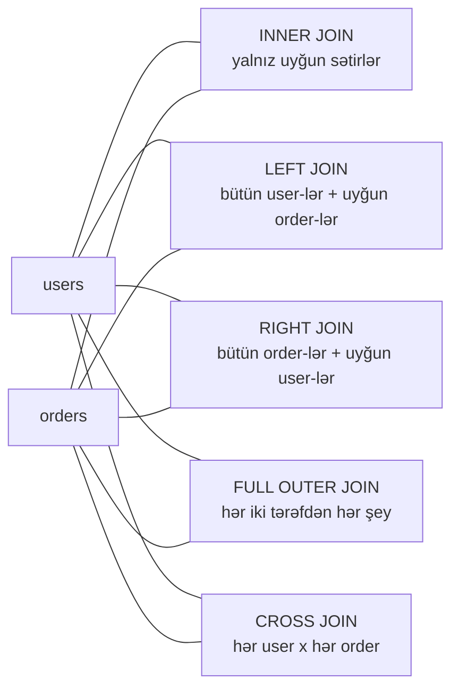

# Təhlükəsizlik mühəndisləri üçün SQL əsasları

Təhlükəsizlik mühəndisi DBA olmaq məcburiyyətində deyil, amma SQL-i oxuya bilmədiyin gün üç çox adi vəziyyətdə faydasız olursan: insidentdən sonra audit cədvəlindən dəlil çıxarmaq, SIEM-də hunt sorğusu yazmaq (çoxu SQL və ya KQL/SPL kimi SQL dialektində danışır) və WAF log-unda SQL injection payload-unu oxuyub *niyə* işləyəcəyini başa düşmək. SQLi — planetdəki ən məşhur veb zəifliyidir, amma `' OR 1=1--` payload-u sadəcə real sorğunun bir parçasıdır; əgər sorğunu heç vaxt görməmisənsə, payload-un mənası yoxdur.

Bu dərs təhlükəsizlik mühəndisinə lazım olan işlək SQL savadıdır. O, relational modeli, gündəlik SQL-in 90%-ni təşkil edən beş ifadəni, JOIN-ları, aqreqatları, indeksləri, tranzaksiyaları, istifadəçi və imtiyazları, parametrləşdirilmiş sorğuları və praktik laboratoriyanı əhatə edir. Injection-un özünə dərin baxış OWASP Top 10 dərsindədir — [/red-teaming/owasp-top-10](/red-teaming/owasp-top-10); buradakı məqsəd o dərsin qəbul etdiyi bünövrəni qoymaqdır.

Nümunələrdə **PostgreSQL** sintaksisini işlədirik, çünki bu ən sərt dialektdir — PostgreSQL-də işləyən demək olar hər şey, kiçik düzəlişlərlə, MySQL, MS SQL Server, Oracle və SQLite-da da işləyir. Şirkət adı kimi `example.local`, servis hesabı kimi isə `EXAMPLE\svc-app` işlədirik.

## Relational model bir səhifədə

**Relasion verilənlər bazası** (relational database) datanı **cədvəllərdə** saxlayır. Cədvəl bir şəbəkədir:

- **Sütun** (column) — tipli sahədir: `email`, `created_at`, `amount`. Hər sütunun sabit tipi var (`INTEGER`, `TEXT`, `TIMESTAMP`, `BOOLEAN`, `NUMERIC`).
- **Sətir** (row) — bir qeyddir: bir istifadəçi, bir sifariş, bir log hadisəsi.
- **Sxem** (schema) — cədvəl təriflərinin toplusudur: hansı cədvəllər var, hansı sütunları var, hansı məhdudiyyətlər tətbiq olunur.
- **İlkin açar** (primary key, `PK`) — sətri unikal təyin edən sütun(lar)dır. Hər cədvəldə olmalıdır. Konvensiya — tam ədəd `id` sütunu.
- **Xarici açar** (foreign key, `FK`) — başqa cədvəlin ilkin açarına işarə edən sütundur. Əlaqəni məcburi edir: sifariş tam bir istifadəçiyə aiddir, `user_id`-si mövcud olmayan sifarişi baza qəbul etmir.

Bütün dərs boyu işlədəcəyimiz iki nümunə cədvəl:

`users`

| id (PK) | email | role |
|---|---|---|
| 1 | a.aliyev@example.local | admin |
| 2 | k.huseynov@example.local | analyst |
| 3 | m.mammadova@example.local | viewer |

`orders`

| id (PK) | user_id (FK → users.id) | amount | ts |
|---|---|---|---|
| 100 | 1 | 49.00 | 2026-04-01 09:12 |
| 101 | 2 | 199.00 | 2026-04-02 10:33 |
| 102 | 1 | 12.50 | 2026-04-03 15:00 |
| 103 | 2 | 75.00 | 2026-04-10 08:45 |

`users.id` ilkin açardır. `orders.user_id` — `users.id`-yə istinad edən xarici açardır. Bu iki cədvəl birlikdə "keçən ay ən çox kim xərcləyib?" kimi sualları cavablandırmağa imkan verir və istifadəçinin email-ini hər `orders` sətrinə təkrarlamağa ehtiyac qalmır — məhz bu, relational dizaynın mənasıdır.

## Gündəlik SQL-in 90%-ni təşkil edən beş ifadə

SIEM-də, audit cədvəlində və ya tətbiq kodunda oxuyacağın demək olar hər şey bu beş ifadədən biridir. Dördü **DML** (Data Manipulation Language): `SELECT`, `INSERT`, `UPDATE`, `DELETE`. Biri **DDL** (Data Definition Language): `CREATE TABLE`. Qalan DDL felləri (`ALTER`, `DROP`, `TRUNCATE`) və DCL felləri (`GRANT`, `REVOKE`) sonra gələcək.

### CREATE TABLE — cədvəl təyin et

```sql
CREATE TABLE users (
    id     SERIAL       PRIMARY KEY,
    email  TEXT         NOT NULL UNIQUE,
    role   TEXT         NOT NULL DEFAULT 'viewer',
    created_at TIMESTAMP NOT NULL DEFAULT NOW()
);
```

`SERIAL` — PostgreSQL-in auto-increment tam ədəd üçün qısa yolu. `NOT NULL` və `UNIQUE` — məhdudiyyətlərdir: baza onları pozan hər sətri rədd edir. Məhdudiyyətlər — pulsuz defence in depth-dir: `NOT NULL email` sütunu o deməkdir ki, buglu tətbiq heç vaxt yarımçıq user yaza bilməz.

### INSERT — sətir əlavə et

```sql
INSERT INTO users (email, role)
VALUES ('a.aliyev@example.local', 'admin');
```

Sütunları həmişə aşkar şəkildə göstərin. Sütun siyahısı olmadan `INSERT INTO users VALUES (...)` kimisə yeni sütun əlavə edən kimi sınır.

### SELECT — sətirləri oxu

```sql
SELECT id, email, role
FROM users
WHERE role = 'admin';
```

`SELECT *` bütün sütunları qaytarır. Ad-hoc araşdırma üçün normaldır, production kodunda isə — code smell-dir: sonradan sütun əlavə olunsa, təsadüfi downstream istifadəçilərinin onu alması istənilməz.

### UPDATE — sətirləri dəyiş

```sql
UPDATE users
SET role = 'analyst'
WHERE email = 'k.huseynov@example.local';
```

SQL-də unudulan ən təhlükəli vərdiş — `UPDATE`-də `WHERE` bəndinin olmamasıdır. `WHERE` olmadan `UPDATE users SET role = 'admin'` — hər kəsi admin edir. Əvvəlcə `SELECT` kimi test edin, yalnız sonra `UPDATE`-ə çevirin.

### DELETE — sətirləri sil

```sql
DELETE FROM users
WHERE id = 3;
```

Eyni xəbərdarlıq. `WHERE` olmadan `DELETE FROM users` — cədvəli boşaldır. Production-da **soft delete** daha yaxşıdır — sətri silmək əvəzinə `deleted_at TIMESTAMP` sütununu doldurmaq — belə ki, audit izi qalır.

## WHERE, ORDER BY, LIMIT

"Bu cədvəldə hər şey"-i "əslində istədiyim hissə"-yə çevirən üç modifikator.

- `WHERE` — sətirləri boolean şərtə görə süzgəcdən keçirir.
- `ORDER BY` — nəticəni çeşidləyir.
- `LIMIT` — ən çox N sətir qaytarır. (MS SQL Server əvəzinə `TOP N` işlədir, Oracle — `FETCH FIRST N ROWS ONLY`.)

Birləşmiş nümunə — `2` nömrəli istifadəçinin 50 manatdan çox olan ən son 5 sifarişi:

```sql
SELECT id, amount, ts
FROM orders
WHERE user_id = 2
  AND amount > 50
ORDER BY ts DESC
LIMIT 5;
```

`WHERE` daxilində faydalı operatorlar:

| Operator | Mənası | Nümunə |
|---|---|---|
| `=` `<>` `<` `<=` `>` `>=` | Müqayisə | `amount > 100` |
| `AND` `OR` `NOT` | Boolean birləşdirmə | `role = 'admin' AND active = TRUE` |
| `IN (...)` | Siyahıda olan istənilən dəyərə uyğun | `role IN ('admin', 'analyst')` |
| `BETWEEN a AND b` | Daxil olan aralıq | `ts BETWEEN '2026-04-01' AND '2026-04-30'` |
| `LIKE` | `%` və `_` ilə şablon | `email LIKE '%@example.local'` |
| `IS NULL` / `IS NOT NULL` | NULL yoxlaması | `deleted_at IS NULL` |

NULL — sıfır deyil, boş sətir deyil, "naməlum"dur. `WHERE x = NULL` **həmişə false-dur**. `IS NULL` istifadə edin.

## JOIN — hamını çaşdıran konsepsiya

JOIN iki (və ya daha çox) cədvəlin sətirlərini ortaq açara görə birləşdirir. Bu — "A cədvəlində hansı sətir B cədvəlinin hansı sətrinə uyğundur?" sualıdır. Beş növ var və onların arasındakı fərq — *uyğunluq tapmayan sətirlərin taleyidir*.



Eyni mənzərə cədvəl kimi:

| Join növü | Sifarişi olmayan `users` sətirləri | Uyğun istifadəçisi olmayan `orders` sətirləri |
|---|---|---|
| `INNER JOIN` | atılır | atılır |
| `LEFT JOIN` | saxlanır (order sütunları NULL) | atılır |
| `RIGHT JOIN` | atılır | saxlanır (user sütunları NULL) |
| `FULL OUTER JOIN` | saxlanır | saxlanır |
| `CROSS JOIN` | hər user hər order-lə cütlənir, açar lazım deyil | — |

Konkret nümunə — hər istifadəçini və onun ümumi xərcini, heç sifariş verməyən istifadəçilər də daxil, göstərin:

```sql
SELECT u.id,
       u.email,
       COALESCE(SUM(o.amount), 0) AS total_spent
FROM   users u
LEFT JOIN orders o
       ON o.user_id = u.id
GROUP BY u.id, u.email
ORDER BY total_spent DESC;
```

Diqqət etməli üç məqam:

1. `u` və `o` alias-ları yazını qısaldır və birləşmə şərtini oxunaqlı edir.
2. `LEFT JOIN` sifarişi olmayan istifadəçiləri saxlayır; `INNER JOIN` onları sakitcə ataraq nəticədən çıxarardı.
3. `COALESCE(SUM(o.amount), 0)` — NULL cəmi (heç sifariş verməyən istifadəçi) 0-a çevirir. Heç nəyin `SUM`-u NULL-dur və bu yeni başlayanları təəccübləndirir.

Real SQL-də ən adi bug — `LEFT JOIN` nəzərdə tutulanda `INNER JOIN` işlətməkdir. Sorğu "düzgün görünür" — rəqəm qaytarır — amma uyğunluğu olmayan hər sol sətri sakitcə atır. Həmişə soruş: *uyğunluğu olmayan sətirlərin itməsini istəyirəm, yoxsa NULL ilə görünməsini?*

## Aqreqatlar və GROUP BY

Aqreqat funksiyaları çoxlu sətri bir rəqəmə sıxır. Lazım olan beşi:

| Funksiya | Nə edir |
|---|---|
| `COUNT(*)` | Sətirlərin sayı |
| `COUNT(col)` | `col IS NOT NULL` olan sətirlərin sayı |
| `SUM(col)` | Rəqəmli sütunun cəmi |
| `AVG(col)` | Rəqəmli sütunun ortası |
| `MIN(col)` / `MAX(col)` | Ən kiçik / ən böyük dəyər |

`GROUP BY` olmadan aqreqat bütün cədvəli əhatə edən bir sətir qaytarır. `GROUP BY` deyir: "bu sütunların hər fərqli dəyəri üçün bir sətir ver". `HAVING` `GROUP BY` nəticəsini süzgəcdən keçirir (bunun üçün `WHERE`-dan istifadə etmək olmur — `WHERE` qruplaşmadan *əvvəl* işləyir).

Nümunə — 10-dan çox sifarişi olan hər istifadəçini tap:

```sql
SELECT u.id,
       u.email,
       COUNT(o.id) AS order_count,
       SUM(o.amount) AS total_amount
FROM   users u
JOIN   orders o ON o.user_id = u.id
GROUP BY u.id, u.email
HAVING COUNT(o.id) > 10
ORDER BY order_count DESC;
```

Fikirləşmək üçün model: `WHERE` sətirləri qruplaşmadan *əvvəl* süzür; `HAVING` mövcud olan *qrupları* süzür.

## İndekslər 2 dəqiqədə

**İndeks** — bazaya sütun dəyərinə görə sətri bütün cədvəli tarama olmadan tapmağa imkan verən yan data strukturudur. `email` sütununda indeksi olmayan 100 milyon sətirli cədvəl `WHERE email = 'x@y'`-ə cavab vermək üçün saniyələr (və ya dəqiqələr) çəkir; indekslə — mikrosaniyələr.

```sql
CREATE INDEX ix_users_email ON users(email);
```

Ödədiyin qiymət:

- Hər indeks disk yeri tutur.
- Hər `INSERT`, `UPDATE` və ya `DELETE` indeksi də yeniləməlidir — çox yazma olan cədvəllər artıq indekslə əziyyət çəkir.
- Query planner indeksləri avtomatik seçir; artıq indekslər sadəcə yer itkisidir.

Qayda: tez-tez `WHERE`, `JOIN ON` və ya `ORDER BY`-da işlətdiyin sütunları indeksləyin. Tez-tez dəyişən və ya az fərqli dəyəri olan sütunları (iki dəyəri olan `gender` sütunu indeksdən heç nə qazanmır) indeksləmə.

Qarşılaşacağın üç indeks növü:

- **B-tree** — default. Bərabərlik (`=`), aralıqlar (`<`, `>`, `BETWEEN`) və prefiks `LIKE 'foo%'` üçün yaxşıdır.
- **Hash** — yalnız bərabərlik. `=` üçün daha sürətli, amma aralıqlar üçün yararsız. Nişə.
- **Full-text** (PostgreSQL `tsvector`, MySQL `FULLTEXT`) — uzun mətn sütunları içində təbii dildə axtarış üçün.

Əvvəl 200 ms çəkən hesabat birdən 30 saniyə çəkəndə cavab demək olar həmişə "cədvəl böyüyüb və yeni sorğu üçün faydalı indeksi yoxdur"dur.

## Tranzaksiyalar və ACID

**Tranzaksiya** — birlikdə uğur qazanan və ya birlikdə uğursuz olan bir neçə ifadədən ibarət qrupdur. Klassik nümunə — pul köçürmək: bir hesabdan çıxarmaq, başqasına əlavə etmək. Yalnız çıxarma yerinə yetirilərsə — pul yox olur.

```sql
BEGIN;

UPDATE accounts SET balance = balance - 100 WHERE id = 1;
UPDATE accounts SET balance = balance + 100 WHERE id = 2;

COMMIT;        -- hər iki yazma görünən olur
-- ROLLBACK;   -- heç biri yerinə yetirilmir
```

Real RDBMS-in verdiyi dörd **ACID** zəmanəti:

- **Atomicity (Atomarlıq)** — tranzaksiyadakı bütün ifadələr commit olur və ya heç biri olmur.
- **Consistency (Tutarlılıq)** — commit olunmuş tranzaksiya məhdudiyyətləri (`NOT NULL`, `FK`, `UNIQUE`, `CHECK`) heç vaxt pozmur.
- **Isolation (İzolyasiya)** — paralel tranzaksiyalar bir-birinin yarımçıq işini görmür.
- **Durability (Davamlılıq)** — `COMMIT` qaytardıqdan sonra dəyişiklik elektrik kəsilməsindən də salamat çıxır.

Təhlükəsizlik mühəndisinin niyə maraqlandığı: tranzaksiyadan *kənarda* yazılan audit log-u təsvir etdiyi data ilə ziddiyyətdə ola bilər. "İstifadəçi X qeyd Y-i silib" yazırsan və sonra silmə rollback olunsa, audit izin yalan danışır. Düzgün pattern — audit sətrini təsvir etdiyi dəyişikliklə eyni tranzaksiyada yazmaqdır, beləcə onlar birlikdə commit və ya rollback olunur.

## İstifadəçilər, rollar, imtiyazlar

Bazanın öz istifadəçiləri var, əməliyyat sistemininkindən ayrıdır. SQL-in nə edə bilməyini idarə etmək üçün iki feli var — `GRANT` və `REVOKE`.

```sql
-- Veb tətbiq üçün aşağı imtiyazlı istifadəçi yarat
CREATE USER svc_app WITH PASSWORD 'uzun-təsadüfi-sirr';

-- Yalnız əslində lazım olanı ver
GRANT CONNECT ON DATABASE shop TO svc_app;
GRANT USAGE   ON SCHEMA   public TO svc_app;
GRANT SELECT, INSERT, UPDATE ON users, orders TO svc_app;

-- Yalnız oxuma üçün hesabat hesabı
CREATE USER readonly WITH PASSWORD 'başqa-uzun-sirr';
GRANT CONNECT ON DATABASE shop TO readonly;
GRANT USAGE   ON SCHEMA   public TO readonly;
GRANT SELECT  ON ALL TABLES IN SCHEMA public TO readonly;

-- İmtiyazı geri götür
REVOKE INSERT ON users FROM svc_app;
```

Ən çox pozulan qayda: **veb tətbiqlər heç vaxt DBA hesabı ilə qoşulmamalıdır.** Əgər tətbiq SQL injection-la kompromasiya olunsa, hücumçu DB istifadəçisinin edə bildiyi hər şeyi miras alır. DBA hesabı `DROP DATABASE` edə bilər; yalnız üç cədvəldə `SELECT, INSERT, UPDATE`-i olan düzgün scope-lu `svc_app` isə fəlakətli kompromasiyanı idarə olunan vəziyyətə çevirir.

PostgreSQL-də **rol** (role) istifadəçi ilə eyni obyektdir; konvensiya — imtiyazları rola verib sonra `GRANT role TO user` etməkdir ki, imtiyaz dəstlərini təkrar istifadə edə biləsən.

```sql
CREATE ROLE r_reader;
GRANT SELECT ON ALL TABLES IN SCHEMA public TO r_reader;
GRANT r_reader TO readonly;
```

## Stored procedure və parametrləşdirilmiş sorğular

**Stored procedure** (saxlanılan prosedur) — bazanın içində adı ilə saxlanılan və arqumentlərlə çağırılan SQL blokudur. O, server tərəfdə işləyir, kompleks məntiqi qablaşdıra bilir və parametrləşdirilmiş giriş məcbur etməyin bir yoludur (tək yol deyil).

```sql
CREATE OR REPLACE FUNCTION get_user_by_email(p_email TEXT)
RETURNS TABLE (id INT, email TEXT, role TEXT)
LANGUAGE SQL AS $$
    SELECT id, email, role
    FROM   users
    WHERE  email = p_email;
$$;

-- çağır
SELECT * FROM get_user_by_email('a.aliyev@example.local');
```

Yadda saxlanmalı məqam: **parametrləşdirilmiş sorğu** (prepared statement də deyilir) SQL mətnini və parametr dəyərlərini bazaya **ayrı-ayrı şeylər** kimi göndərir. Baza əvvəlcə sorğunu kompilyasiya edir, sonra dəyərləri qoyur. Dəyərlər heç vaxt SQL kimi parse olunmur — məhz buna görə parametrləşdirmə SQL injection-a qarşı ən effektiv müdafiədir: o, inputu "escape" etmir, injection-u struktur olaraq mümkünsüz edir.

Python-da `psycopg2` ilə:

```python
cur.execute(
    "SELECT id, role FROM users WHERE email = %s",
    (user_supplied_email,)
)
```

`%s` — parametr markeridir, Python string formatlaması deyil. Digər dialektlər `?` (SQLite, JDBC) və ya `:name` (Oracle, `psycopg2`-də adlı parametrlər) istifadə edir.

OWASP Top 10 dərsi ([/red-teaming/owasp-top-10](/red-teaming/owasp-top-10)) SQLi istismarını dərindən əhatə edir (A03 — Injection). Niyə sətir konkatenasiyasının öldürücü olduğunu görmək üçün növbəti bölməni oxuyun.

## SQLi preview — zəif və təhlükəsiz 10 sətirdə

```python
import psycopg2
conn = psycopg2.connect("dbname=shop user=svc_app")
cur  = conn.cursor()

# ZƏİF — heç vaxt belə etmə
email = request.form['email']         # hücumçunun idarə etdiyi
sql   = "SELECT id FROM users WHERE email = '" + email + "'"
cur.execute(sql)

# TƏHLÜKƏSİZ — parametrləşdirilmiş
cur.execute(
    "SELECT id FROM users WHERE email = %s",
    (request.form['email'],)
)
```

Zəif versiyaya qarşı hücumçu `email = ' OR '1'='1` göndərir. Sətir konkatenasiyası belə nəticə verir:

```sql
SELECT id FROM users WHERE email = '' OR '1'='1'
```

`'1'='1'` həmişə true-dur, ona görə hər sətir uyğun gəlir və login autentifikasiyanı bypass edir. Təhlükəsiz versiyada eyni input literal sətir dəyəri `' OR '1'='1` kimi göndərilir, sorğu dəqiq bu email-li istifadəçini axtarır, heç nə tapmır və login olmalı olduğu kimi uğursuz olur.

Tam dərin baxış — UNION-əsaslı injection, blind injection, time-based, ORM xüsusiyyətləri, OWASP cheat sheet — [/red-teaming/owasp-top-10](/red-teaming/owasp-top-10)-dadır.

## Praktika

**Ya** SQLite (macOS-da quraşdırma lazım deyil, əksər distrolarla gəlir, Windows-da bir binary) **ya da** PostgreSQL seçin. Tapşırıqlar hər ikisində kiçik sintaksis fərqləri ilə işləyir.

### 1. SQLite quraşdır, `users` cədvəli yarat, SELECT et

```bash
# macOS / əksər Linux: artıq quraşdırılıb
sqlite3 lab.db

# Windows: sqlite-tools-u https://sqlite.org/download.html saytından yüklə
# sonra PowerShell və ya cmd-dən:
sqlite3.exe lab.db
```

`sqlite3` prompt-unda:

```sql
CREATE TABLE users (
    id    INTEGER PRIMARY KEY AUTOINCREMENT,
    email TEXT    NOT NULL UNIQUE,
    role  TEXT    NOT NULL DEFAULT 'viewer'
);

INSERT INTO users (email, role) VALUES ('a.aliyev@example.local',   'admin');
INSERT INTO users (email, role) VALUES ('k.huseynov@example.local', 'analyst');
INSERT INTO users (email, role) VALUES ('m.mammadova@example.local','viewer');

SELECT * FROM users;
```

1, 2, 3 nömrəli üç sətir görməlisiniz.

### 2. `users` və `orders` arasında JOIN

```sql
CREATE TABLE orders (
    id      INTEGER PRIMARY KEY AUTOINCREMENT,
    user_id INTEGER NOT NULL REFERENCES users(id),
    amount  REAL    NOT NULL,
    ts      TEXT    NOT NULL DEFAULT CURRENT_TIMESTAMP
);

INSERT INTO orders (user_id, amount) VALUES (1, 49.00), (2, 199.00), (1, 12.50), (2, 75.00);

SELECT u.email, COUNT(o.id) AS n_orders, COALESCE(SUM(o.amount), 0) AS spent
FROM   users u
LEFT JOIN orders o ON o.user_id = u.id
GROUP BY u.email
ORDER BY spent DESC;
```

`m.mammadova` 0 sifariş və 0 xərcləmə ilə görünməlidir. Sorğunu `INNER JOIN` ilə yenidən işlədin və onun yoxa çıxdığını təsdiqləyin — bu, yuxarıdakı LEFT və INNER bug-ının öz bazanızda təkrarıdır.

### 3. `GRANT SELECT` olan `readonly` istifadəçi yarat

SQLite-ın istifadəçiləri yoxdur; bunu PostgreSQL-də edin. Superuser kimi `psql` prompt-undan:

```sql
CREATE USER readonly WITH PASSWORD 'yalnız-lab-sirri';
GRANT CONNECT ON DATABASE postgres TO readonly;
GRANT USAGE   ON SCHEMA   public   TO readonly;
GRANT SELECT  ON ALL TABLES IN SCHEMA public TO readonly;
```

Sonra `readonly` kimi qoşulun və `INSERT` ilə `DELETE`-in rədd olunduğunu təsdiqləyin:

```bash
psql -U readonly -d postgres
```

```sql
SELECT * FROM users;                 -- işləyir
INSERT INTO users (email) VALUES ('x@y');  -- ERROR: permission denied
```

### 4. Zəif login sorğusuna qarşı `' OR 1=1--` sına, sonra düzəlt

Zəiflik içərisinə qoyulmuş kiçik Python script-i. `vuln_login.py` adı ilə saxla:

```python
import sqlite3, sys

conn = sqlite3.connect("lab.db")
cur  = conn.cursor()

email    = sys.argv[1]
password = sys.argv[2]   # demo üçün görməməzliyə vururuq

# ZƏİF
sql = f"SELECT id, role FROM users WHERE email = '{email}'"
print("running:", sql)
print(cur.execute(sql).fetchall())
```

Onu normal və klassik payload ilə işlədin:

```bash
python vuln_login.py 'a.aliyev@example.local' 'whatever'
python vuln_login.py "' OR 1=1--" 'whatever'
```

İkinci çağırış *hər* istifadəçini qaytarır. İndi düzəldin:

```python
sql = "SELECT id, role FROM users WHERE email = ?"
print(cur.execute(sql, (email,)).fetchall())
```

Eyni payload-u yenidən işlədin. Sorğu tam olaraq `' OR 1=1--` email-ini axtarır, heç nə tapmır, boş siyahı qaytarır. Bütün SQL injection mitigation beş simvollıq diff-dədir.

## İşlənmiş nümunə — example.local audit cədvəli

Hər təhlükəsizlik baxımından əhəmiyyətli əməliyyat üçün tətbiqin bir sətir yazdığı `audit_events` cədvəli miras qalıb. Sxem:

```sql
CREATE TABLE audit_events (
    id      BIGSERIAL    PRIMARY KEY,
    ts      TIMESTAMP    NOT NULL DEFAULT NOW(),
    user_id INT          NOT NULL REFERENCES users(id),
    action  TEXT         NOT NULL,    -- 'login', 'login_failed', 'delete', 'export', ...
    target  TEXT,                     -- toxunulan obyekt, login-lər üçün NULL ola bilər
    result  TEXT         NOT NULL     -- 'success' | 'failure'
);

CREATE INDEX ix_audit_ts      ON audit_events(ts);
CREATE INDEX ix_audit_user_ts ON audit_events(user_id, ts);
CREATE INDEX ix_audit_action  ON audit_events(action);
```

Nə isə şübhəli görünəndə ilk yazacağın üç sorğu.

### Son 24 saatda uğursuz login-lər

```sql
SELECT u.email,
       COUNT(*) AS failures,
       MAX(a.ts) AS last_attempt
FROM   audit_events a
JOIN   users u ON u.id = a.user_id
WHERE  a.action = 'login'
  AND  a.result = 'failure'
  AND  a.ts >= NOW() - INTERVAL '24 hours'
GROUP BY u.email
ORDER BY failures DESC
LIMIT 50;
```

Brute force və ya password-spray aşkarlamaq üçün faydalıdır. Bir mənbədən ard-arda 200 uğursuz login-i olan istifadəçi — aşkar haldır; eyni `/24`-dən hər biri 3 uğursuzluğu olan yüz istifadəçi — incə haldır.

### Bu həftə ən fəal 10 istifadəçi

```sql
SELECT u.email,
       COUNT(*) AS events
FROM   audit_events a
JOIN   users u ON u.id = a.user_id
WHERE  a.ts >= DATE_TRUNC('week', NOW())
GROUP BY u.email
ORDER BY events DESC
LIMIT 10;
```

Faydalı sanity check — gündə normalda 50 event yaradan servis hesabı birdən 50,000-ə çatıbsa, kimsə etməməli olduğu bir şeyi avtomatlaşdırır.

### `delete` əməliyyatı yerinə yetirmiş unikal istifadəçilər

```sql
SELECT DISTINCT u.email
FROM   audit_events a
JOIN   users u ON u.id = a.user_id
WHERE  a.action = 'delete'
  AND  a.result = 'success'
ORDER BY u.email;
```

`DISTINCT` təkrarları silir, beləcə hər istifadəçi nə qədər silmə edib-etməməsindən asılı olmayaraq bir dəfə görünür.

## Ümumi səhvlər

- **Tətbiq kodunda sətir konkatenasiyası ilə SQL.** `' + email + '` antipattern-i. Həmişə parametrləşdirilmiş sorğular istifadə et (`?` / `%s` / `:name`). Bu, OWASP Top 10-dakı A03-un kökü.
- **Həddindən artıq geniş `GRANT`-lər.** Veb tətbiqin istifadəçisinə `GRANT ALL ON DATABASE`. Hər kompromasiyanın partlayış radiusu işi görən DB hesabının imtiyazları ilə eyni tempdə böyüyür.
- **Hesabatlar timeout olana qədər indeksləri görməməzliyə vurmaq.** 100k sətirdə rahat işləyən cədvəl 10M-də süründürməyə başlayır. Yavaş sorğuları `EXPLAIN ANALYZE` ilə profil et və çatışmayan indeksi *outage olmadan əvvəl* əlavə et.
- **`LEFT JOIN` ilə `INNER JOIN`-ı qarışdırmaq.** Sağ tərəfi çatışmayan sətirləri sakitcə atmaq — SQL-də "rəqəmlər düzgün görünür, amma düzgün deyil" bug-unun ən adi formasıdır.
- **Client-side escape-ə etibar etmək.** Brauzerdəki JavaScript-in dırnaqları silməsi — bəzəkdir, təhlükəsizlik deyil. Hücumçu xam HTTP göndərir; yalnız server tərəfi parametrləşdirmə hesaba alınır.
- **Parolları açıq mətn kimi saxlamaq.** Hətta dev-də də. Hər istifadəçi üçün ayrı salt ilə `bcrypt`, `argon2id` və ya `scrypt` istifadə et. Sızmış açıq mətn parol cədvəli — ən pis kompromasiyadır, çünki istifadəçilər saytlar arasında parolları təkrar istifadə edir.
- **`UPDATE` / `DELETE`-də `WHERE` unutmaq.** Əvvəlcə predikatı `SELECT` kimi test et, sonra çevir. Tam əmin olmayana qədər riskli dəyişiklikləri `BEGIN; ... ROLLBACK;` daxilində sar.
- **Təsvir etdiyi tranzaksiyadan kənarda audit sətirləri yazmaq.** Dəyişiklik rollback olunsa və log olunmasa — audit yalan danışır.

## Əsas nəticələr

- Relational model — cədvəllər, sətirlər, sütunlar, ilkin açarlar və xarici açarlardır; bu beş termin demək olar hər şeyi izah edir.
- `SELECT`, `INSERT`, `UPDATE`, `DELETE` və `CREATE TABLE` oxuyub-yazacağın SQL-in böyük əksəriyyətini əhatə edir.
- `LEFT JOIN` uyğunluğu olmayan sətirləri saxlayır; `INNER JOIN` onları atır. Səhv seçim — sakit data bug-udur.
- Aqreqatlar sətirləri sıxır; `GROUP BY` necə sıxıldığını idarə edir; `HAVING` qrupları süzür.
- İndekslər xətti taramaları sabit vaxtlı axtarışlara çevirir; nə çox indeksləyin, nə də az.
- Tranzaksiyalar + ACID — məhz bu səbəbə görə audit dataya etibar etmək olur; əlaqəli dəyişiklikləri, audit yazısı ilə birlikdə, bir yerdə sar.
- Veb tətbiqlər ən az imtiyazlı istifadəçi kimi qoşulmalıdır. Sətir escape-i yox, parametrləşdirilmiş sorğular — əsl işləyən SQL injection mitigation-dır.

## İstinadlar

- PostgreSQL sənədləri — https://www.postgresql.org/docs/current/
- SQLite sənədləri — https://sqlite.org/docs.html
- OWASP SQL Injection Prevention Cheat Sheet — https://cheatsheetseries.owasp.org/cheatsheets/SQL_Injection_Prevention_Cheat_Sheet.html
- OWASP Top 10 — A03:2021 Injection — https://owasp.org/Top10/A03_2021-Injection/
- PortSwigger Web Security Academy — SQL injection — https://portswigger.net/web-security/sql-injection
- PostgreSQL `EXPLAIN` sənədləri — https://www.postgresql.org/docs/current/sql-explain.html
