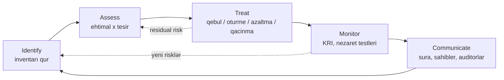

# Risk idarəetməsi və məxfilik

CISO ilə hər ciddi söhbət gec-tez risk söhbətinə çevrilir. Büdcə məhduddur, təhdidlər sonsuzdur və nəyi maliyyələşdirmək, nəyi təxirə salmaq, nə ilə yaşamaq barədə dürüst qərar vermək yalnız hər problemi ehtimal və təsir dilinə tərcümə etməklə mümkündür. Firewall, yamaq dövrləri, istifadəçi təhsili və insident-reaksiya müqavilələri öz-özlüyündə məqsəd deyil — onların mövcud olmasının yeganə səbəbi konkret riskləri biznesin qəbul etməyə hazır olduğu səviyyəyə endirməkdir. Risk registri olmayan təhlükəsizlik proqramı təhlükəsizlik proqramı deyil; bu, alış-veriş siyahısıdır.

Məxfilik (privacy) təhlükəsizliyin əkizidir, alt bölməsi deyil. Təhlükəsizlik sualı belədir: "Bu məlumata kim toxuna bilər və qalanlarını necə dayandırmalıyıq?" Məxfilik isə daha geniş sual verir: "Bu məlumatı ümumiyyətlə toplamalıyıqmı, hansı məqsədlə, nə qədər müddətə və təsvir etdiyi şəxsin hansı hüquqları var?" Zəif məxfilik — amma güclü təhlükəsizlik — mümkündür: mükəmməl şifrələnmiş, amma heç vaxt toplamağa icazəniz olmamış bir verilənlər bazası. Təhlükəsizlik olmadan məxfilik vədləri isə boşdur. Yetkin təşkilat bu iki sahəyə paralel intizam kimi yanaşır: eyni terminologiya, üst-üstə düşən nəzarətlər, fərqli məsuliyyətlər. Bu dərs hər ikisinin praktiki mexanikasını əhatə edir.

## Əsas terminlər

Risk dövrəsinin mənalı olması üçün sözlərin dəqiq olması vacibdir. Gündəlik danışıqda "təhdid", "risk" və "zəiflik" bir-birini əvəz edir; risk registrində isə belə ola bilməz. Aşağıdakı tərif dəsti ISO 27005 / NIST SP 800-30 mənbələrindən götürülüb və sənədin qalan hissəsində istifadə olunur.

| Termin | Tərif | Konkret nümunə |
|---|---|---|
| **Aktiv (Asset)** | Təşkilat üçün dəyərli olan hər şey — məlumat, sistem, şəxs, reputasiya | `sql01.example.local` üzərindəki müştəri bazası |
| **Təhdid (Threat)** | İstənməyən hadisənin potensial mənbəyi | Ransomware qrupu, narazı admin, daşqın |
| **Zəiflik (Vulnerability)** | Təhdidin istismar edə biləcəyi zəif nöqtə | Yamaqlanmamış CVE, zəif parol siyasəti, UPS olmaması |
| **Risk** | Qeyri-müəyyənliyin məqsədlərə təsiri; ehtimal × təsir | "Ransomware `sql01`-i şifrələyir → 48 saat dayanma → 120k $" |
| **Təsir (Impact)** | Risk reallaşsa biznes üçün nəticə | Maliyyə itkisi, tənzimləyici cəriməsi, reputasiya zərəri |
| **Ehtimal (Likelihood)** | Hadisənin müəyyən müddətdə baş vermə ehtimalı | İldə 1/5, "mümkündür", ARO 0.2 |
| **Inherent risk** | Heç bir nəzarət tətbiq **edilməmişdən** əvvəlki risk | Əgər heç nə etməsək necə görünərdi |
| **Residual risk** | Mövcud nəzarətlər tətbiq **edildikdən sonra** qalan risk | MFA, EDR və ehtiyat nüsxələrdən sonra qalan |

Sadə qayda: **risk = təhdid × zəiflik × təsir**. Hər hansı bir amili çıxarsanız, risk çökür. İstismar edə biləcəyi heç nə olmayan təhdid sadəcə səs-küydür; heç kimin maraqlanmadığı zəiflik sadəcə maraq mövzusudur; təsiri olmayan hadisə isə ümumiyyətlə hadisə deyil. Nəzarətlər bu üç amildən birinə və ya bir neçəsinə hücum edir.

## Risk idarəetməsi dövrəsi

Risk idarəetməsi illik hadisə deyil; davamlı dövrədir. Aşağıdakı addımlar **NIST RMF** (SP 800-37), **ISO 31000** və **ISO 27005** ilə uzlaşır — adlar çərçivədən-çərçivəyə bir qədər fərqlənir, hərəkət isə eynidir.



- **Identify** — hansı aktivə nə baş verə bilər.
- **Assess** — nə qədər pis və nə qədər tez-tez, keyfiyyət və ya kəmiyyət analiz ilə.
- **Treat** — dörd reaksiyadan birini seç (aşağıda ətraflı).
- **Monitor** — reaksiyanın hələ də işlədiyini izlə: nəzarətlərin effektivliyi, KRI-lər, insident məlumatı.
- **Communicate** — yuxarıya hesabat verilməyən risklər sakitcə qəbul edilmiş sayılır. Rüblük — risk komitəsinə, illik — idarə heyətinə, auditor tələb etdikdə isə hər zaman.

Dövrə heç vaxt bağlanmır. Yeni məhsul buraxılışı, yeni tənzimləyici tələb, birləşmə-satınalma, satıcı dəyişikliyi — bunların hər biri təzə girişləri yenidən **Identify** mərhələsinə göndərir.

## Risk identifikasiyası

Yazılmayan riski müalicə etmək olmaz. Risk identifikasiyası — riskləri bütün inandırıcı mənbələrdən şüurlu şəkildə toplayıb tək yerə (risk registrinə) yerləşdirmə prosesidir. Ən məhsuldar beş mənbə:

1. **Strukturlaşdırılmış emalatxanalar.** Biznes sahibi, sistem sahibi və təhlükəsizlik fasilitatoru ilə iki saatlıq iclas. Prosesi başdan-sona gəzin və hər addımda "burada nə səhv gedə bilər?" deyə soruşun. Risklərin əksəriyyəti belə üzə çıxır; sistemi işlədən insanlar onun zəif tərəflərini bilir.
2. **Aktiv inventarı.** CMDB, IAM sistemi, bulud-hesab inventarı və məlumat-təsnifat alətləri — bunların hamısı dəyərli şeylərin siyahısını hazırlayır. Hər maddə potensial aktivdir; hər aktiv öz təhdid dəstini cəlb edir.
3. **Keçmiş insidentlər və az qala baş verənlər.** Ötən ilin biletləri qızıl mədənidir. Post-mortem yazılmağa dəyən hər insident, demək olar ki, registrə də daxil olmağa dəyir — ki, eyni şey ikinci dəfə "sürpriz" olmasın.
4. **Təhdid kəşfiyyatı (threat intel).** Sektor hesabatları (FS-ISAC, H-ISAC), satıcı xəbərdarlıqları, CISA bildirişləri və MITRE ATT&CK istilik xəritəsi sektorunuzda hazırda hansı texnikaların istifadə olunduğunu göstərir.
5. **Audit tapıntıları.** Daxili audit, xarici audit, ISO sertifikasiya auditi, penetrasiya testləri, red-team təlimləri — "finding" və ya "observation" kimi qeyd olunan hər şey hazır risk identifikasiyasıdır.

Orta ölçülü şirkət üçün yaxşı birinci keçid registri adətən 80 ilə 200 giriş arasında olur. Daha az olarsa, nələrisə qaçırırsınız; daha çox olarsa, yəqin ki, riskləri deyil, nəzarətləri və ya müşahidələri sadalayırsınız.

### Qəbul zamanı riskləri kateqoriyalaşdırmaq

Registri rahat naviqasiya etmək üçün hər giriş bir əsas kateqoriya alır. Kateqoriyalar şərtidir — vacib olan onların az sayda olması və ardıcıl istifadəsidir. İşlək başlanğıc dəsti:

- **Texnologiya** — sistemlər, infrastruktur, proqram təminatı, şəbəkə, bulud konfiqurasiyası.
- **İnsan** — daxili təhdid, açar şəxsdən asılılıq, bilik boşluğu, sosial mühəndislik.
- **Proses** — dəyişiklik idarəetməsi, vəzifələrin ayrılması, manual səhv, proseduranın olmaması.
- **Üçüncü tərəf** — vendor riski, təchizat zənciri, sub-prosessor, müqavilə üzrə təsir.
- **Hüquqi / Tənzimləyici** — qanun və ya müqaviləyə uyğunsuzluq, dəyişən tənzimləmə.
- **Strategik** — uğursuz məhsul buraxılışı, bazar dəyişikliyi, səhv yönləndirilmiş investisiya.
- **Reputasiya** — ictimaiyyət önündə insident, sosial-media hadisəsi, müştəri etibarı hadisəsi.

İki kateqoriyaya toxunan risk əsas olanın altına düşür və çarpaz istinad edilir — eyni risk üçün iki sətir registri korlayır.

## Risk qiymətləndirmə: keyfiyyət və kəmiyyət analizi

Risk kağız üzərində olduqdan sonra onun ölçüsünü müəyyənləşdirmək lazımdır. İki ailə texnika mövcuddur; yetkin proqramlar hər ikisini istifadə edir.

### Keyfiyyət analiz — 5×5 istilik xəritəsi

Keyfiyyət qiymətləndirməsi ehtimal və təsir üçün ordinal şkala (Çox Aşağı → Çox Yüksək) istifadə edir və hər risk matrisdə qeyd olunur. Sürətlidir, pul rəqəmi tələb etmir və qeyri-texniki auditoriya üçün aydındır. Aşağıdakı matris klassik 5×5 istilik xəritəsidir.

| Ehtimal \ Təsir | 1 Əhəmiyyətsiz | 2 Kiçik | 3 Orta | 4 Böyük | 5 Ağır |
|---|---|---|---|---|---|
| **5 Demək olar ki, qaçılmaz** | Orta | Yüksək | Yüksək | Kritik | Kritik |
| **4 Ehtimallı** | Orta | Orta | Yüksək | Yüksək | Kritik |
| **3 Mümkün** | Aşağı | Orta | Orta | Yüksək | Yüksək |
| **2 Az ehtimallı** | Aşağı | Aşağı | Orta | Orta | Yüksək |
| **1 Nadir** | Aşağı | Aşağı | Aşağı | Orta | Orta |

Risk səviyyələri reaksiya vaxtlarına uyğundur: **Kritik** icraçı səviyyədə diqqət və 30 gün ərzində fəaliyyət tələb edir; **Yüksək** 90 gün; **Orta** adi planlaşdırma dövrü ərzində izlənilir və müalicə olunur; **Aşağı** qəbul edilir və ildə bir dəfə nəzərdən keçirilir.

Keyfiyyət yanaşması o zaman doğru vasitədir: proqram yenidir, tarixi məlumat azdır, auditoriya maliyyə yönümlü deyil, və ya risklərin həcmi (yüzlərlə) ədədi qiymətləndirməni praktiki etmir.

### Kəmiyyət analiz — riski rəqəmlə ifadə etmək

Kəmiyyət qiymətləndirməsi riski pulla ifadə edir. Üç düstur işin demək olar ki, hamısını görür:

- **SLE (Single Loss Expectancy)** = Aktiv Dəyəri × Məruz Qalma Faktoru (Exposure Factor)
    - Hadisənin bir dəfə baş verməsinin dəyəri.
    - *Exposure Factor* aktivin bir hadisədə itirilən hissəsidir (0.0 – 1.0).
- **ARO (Annualised Rate of Occurrence)** = ildə gözlənilən baş vermə sayı
    - 0.1 = 10 ildə bir; 4 = ildə dörd dəfə.
- **ALE (Annualised Loss Expectancy)** = SLE × ARO
    - Büdcəyə salına bilən, illik risk dəyəri.

**Nümunə — veb server.** `www.example.local` ünvanındakı gəlir gətirən veb server 50 000 $ dəyərindədir (dəyişdirmə + dayandırma zamanı itirilən gəlir). Tipik insident — ransomware, uzun müddətli DDoS, ehtiyat nüsxədən kənar qalmış disk nasazlığı — bu dəyərin təxminən 40 %-ni bərpaya qədər silir, deməli Exposure Factor 0.4-dür. Son üç ilin məlumatına baxan təhlükəsizlik komandası ildə iki belə insident gözləyir (ARO = 2).

```
SLE = AV × EF = 50 000 $ × 0.4 = 20 000 $
ALE = SLE × ARO = 20 000 $ × 2 = 40 000 $
```

İldə 40 000 $ — bu riskə qarşı **heç nə etməməyin** illik dəyəridir. Eyni zamanda onu tam aradan qaldıracaq nəzarətə nə qədər xərcləməyin rasional üst həddidir — ildə 60k $-lıq WAF + DDoS xidməti bu riski bağlasa, pula dəymir; 15k $-lıq isə dəyir.

Kəmiyyət yanaşması o zaman doğru vasitədir: ARO-nu dürüst qiymətləndirmək üçün kifayət qədər tarixi məlumat var, auditoriya maliyyə yönümlüdür (CFO, idarə heyətinin maliyyə komitəsi), və ya qərar aydın bir xərc-fayda seçimidir ("bu X $-lıq nəzarəti alaqmı?").

### Hansını nə vaxt istifadə etmək

Genişlik üçün **keyfiyyət** analizini istifadə et — bütün registri sürətlə əhatə et ki, heç nə qaçırılmasın. Dərinlik üçün **kəmiyyət** analizini istifadə et — büdcə qərarlarına təsir edən üst-20 risk üçün, sığorta yeniləmə söhbətləri üçün və CFO-nun imzalayacağı hər şey üçün. Aşağıdakı registr hər ikisini daşıyır: hər kəsin oxuya bildiyi keyfiyyət balı və rəqəmlərin müdafiə oluna bildiyi risklər üçün doldurulmuş ALE sütunu.

## Risk müalicəsi — dörd seçim

Qiymətləndirilmiş hər risk üçün yalnız bir müalicə qərarı verilir. Yalnız dörd seçim var; qalan hər şey bu seçimlərin variasiyasıdır.

1. **Qəbul (Accept).** Riski tanı, qərarı sənədləşdir, artıq heç nə etmə. Hər hansı müalicənin dəyəri gözlənilən itkidən böyük olduqda uyğundur. Adı qeyd olunmuş qəbuledici (adətən müvafiq səviyyədə biznes sahibi) və son tarix tələb olunur — qəbul edilmiş risklər yenidən nəzərdən keçirilir, əbədi qəbul edilmir.
    - *Nümunə:* example.local müştərilərin bəzən zəif parolları təkrar istifadə etməsi riskini qəbul edir. 10 000 müştəriyə tam FIDO2 tətbiqi dəyəri hazırkı fırıldaqçılıq dərəcəsindən böyükdür.
2. **Ötürmə (Transfer).** Maliyyə nəticələrini üçüncü tərəfə keçir. İki geniş yayılmış mexanizm **sığorta** (kiber sığorta polisi əhatə olunan insidentdə ödəyir) və **müqavilə**dir (məsul satıcını sizin üçün emal etdiyi məlumatın pozuntusunda məsul edən bənd). Ötürmə əməliyyat dayanmasını və ya reputasiya zərərini aradan qaldırmır — bunlar sizdə qalır.
    - *Nümunə:* example.local 100k $ franşizali, 5M $ ödəmə limitli kiber sığorta polisi alır; ransomware reaksiyası, hüquqi xərclər və tənzimləyici cərimələri əhatə edir.
3. **Azaltma (Mitigate).** Ehtimal, təsir və ya hər ikisini azaldan nəzarət tətbiq et. Təhlükəsizlik büdcəsinin əksəriyyəti buraya gedir — MFA, EDR, ehtiyat nüsxələr, şəbəkə seqmentasiyası, işçi təlimi. Azaltma residual riski nadir hallarda sıfıra endirir; onu qəbul edilə bilən səviyyəyə endirir.
    - *Nümunə:* example.local 200 noutbukda EDR yayır və VPN ilə e-poçtda MFA-nı icbari edir; ransomware ALE-si 180k $-dan 35k $-a düşür.
4. **Qaçınma (Avoid).** Riski yaradan fəaliyyəti tamam dayandır. Bu nüvə seçimidir: risk sıfıra düşür, çünki proses sıfıra düşür. Heç bir nəzarət riski dözümlü səviyyəyə endirmək üçün kifayət qədər ucuz olmadıqda istifadə olunur.
    - *Nümunə:* example.local daxili ödəniş platforması qurmamaq qərarı verir. Ödənişlər PCI-sertifikatlı üçüncü tərəfə yönləndirilir. Kart-məlumatı pozuntusu riski tam yox olur — bunun əvəzinə funksiya itirilir.

Müalicə qərarı registrdə residual-risk balının yanında qeyd olunur. Nəzarət əlavə olunarsa, residual xana düşür; heç nə əlavə olunmazsa, residual = inherent olur və qərar sütunu "Qəbul" yazılmalıdır.

## Risk registri

Risk registri yuxarıdakı hər şeyin əməli çıxışıdır. Bu canlı sənəddir — cədvəl, GRC alətindəki cədvəl və ya ServiceNow modulu — və hər identifikasiya olunan riski onun üzərində işləmək üçün kifayət qədər məlumatla siyahıya alır. İşlək registrdə aşağıdakı sütunlar olur:

| Sütun | Məqsəd |
|---|---|
| **ID** | Stabil açar (məs. `R-2026-014`) |
| **Təsvir** | Bir cümlə — "X baş verərsə, Y nəticələnir" |
| **Kateqoriya** | İnsan / Proses / Texnologiya / Üçüncü tərəf / Hüquqi |
| **Sahib** | Adı qeyd olunmuş məsul şəxs, komanda yox |
| **Inh L** | Nəzarətdən əvvəl ehtimal (1–5) |
| **Inh I** | Nəzarətdən əvvəl təsir (1–5) |
| **Inh bal** | L × I |
| **Mövcud nəzarətlər** | Hazırda bu riski azaldan nə var |
| **Res L** | Nəzarətdən sonra ehtimal |
| **Res I** | Nəzarətdən sonra təsir |
| **Res bal** | L × I — faktiki daşıdığımız |
| **Müalicə** | Qəbul / Ötürmə / Azaltma / Qaçınma |
| **Hədəf tarix** | Müalicənin tamamlanma tarixi |
| **Baxış tarixi** | Bu girişə yenidən nə vaxt baxacağıq |

### Kiçik nümunə — example.local registrindən üç sətir

| ID | Təsvir | Kateqoriya | Sahib | Inh L | Inh I | Inh | Nəzarətlər | Res L | Res I | Res | Müalicə | Baxış |
|---|---|---|---|---|---|---|---|---|---|---|---|---|
| R-2026-001 | Ransomware istehsalat fayl paylaşımlarını şifrələyir | Texnologiya | IT rəhbəri | 4 | 5 | 20 | EDR, dəyişilməz ehtiyat nüsxə, admin MFA | 2 | 4 | 8 | Azaltma | 2026-10-01 |
| R-2026-002 | Maaş portalını host edən satıcının itkisi | Üçüncü tərəf | CFO | 2 | 5 | 10 | Müqavilədə RTO 4s, çıxış bəndi, alternativ vendor yoxlanılıb | 2 | 3 | 6 | Ötürmə | 2026-07-15 |
| R-2026-003 | Daxili admin müştəri PII-ni sızdırır | İnsan | CISO | 3 | 5 | 15 | Ən az imtiyaz, rüblük giriş baxışı, DLP, UEBA | 2 | 4 | 8 | Azaltma | 2026-09-01 |

Rəqəmlər intizam qədər vacib deyil. Dürüst rəqəmlərlə və müntəzəm baxışlarla olan registr, 18 aydır heç kimin açmadığı zərif riyaziyyatlı registrdən üstündür.

### Registr üçün alətlər

- **Cədvəl** (Excel, Google Sheets) — ~150 risk altındakı təşkilatlar üçün tamamilə kifayətdir. Sətir-sətir ballar müqayisə oluna bilsin deyə L, I, Müalicə üçün məlumat-validasiyası siyahıları istifadə et.
- **GRC platformaları** (ServiceNow IRM, Archer, OneTrust, LogicGate) — miqyas üçün lazımdır: gecikmiş baxış-tarixində iş axını, sübut əlavələri, nəzarət-risk xəritələnməsi, idarə heyəti hesabatı generasiyası.
- **Bilet izləyici** (Jira, Linear) — populyar hibrid: hər risk fərdi sahə dəsti olan issue-dur, registr saxlanmış filtrdir, müalicə işləri təbii şəkildə alt-issue kimi əlaqələnir.
- **Wiki** — son çarə. Wikilər strukturu itirir; wikidə 200 risklik registr residual bala görə sıralanmır.

Vasitə nə olursa olsun, registr **tək-mənbəli** olmalıdır. İki registr — "IT-nin saxladığı cədvəl" və "auditin tənzimləyiciyə göstərdiyi sənəd" — fərqlənməni və utancı təmin edir.

## Məxfilik əsasları

Yuxarıdakı təhlükəsizlik intizamları sizin saxladığınız **hər hansı** məlumatı qoruyur. Məxfilik diqqəti **insanlar haqqında** olan məlumata yönəldir. Şəxsi məlumat sistemlərinizə daxil olduğu andan ayrı öhdəlik kütləsi başlayır — tənzimləyici, etik və müqaviləli.

### Məlumat növləri

- **PII (şəxsi məlumatlar, Personally Identifiable Information)** — tək və ya birlikdə şəxsi müəyyən edə bilən istənilən məlumat. Ad, e-poçt, fin kod / milli ID, IP ünvanı, cihaz identifikatoru, dəqiq coğrafi mövqe.
- **Həssas PII (GDPR-də xüsusi kateqoriyalar)** — daha yüksək riskli alt dəst: irq və ya etnik mənşə, siyasi rəylər, dini inanclar, həmkarlar ittifaqı üzvlüyü, genetik/biometrik məlumatlar, səhiyyə məlumatları, cinsi həyat, cinsi oriyentasiya. Açıq razılıq və ya başqa dar qanuni əsas tələb edir.
- **PHI (Protected Health Information)** — ABŞ-a məxsus termin, HIPAA-dan; 18 identifikatordan biri ilə birləşmiş səhiyyə məlumatı. Xəstəxanaların, sığortaçıların və onların tərəfdaşlarının nə edə biləcəyini tənzimləyir.
- **PCI data (Payment Card Industry)** — əsas hesab nömrəsi (PAN), kart sahibinin adı, xidmət kodu, son istifadə tarixi və həssas autentifikasiya məlumatı (CVV, PIN, tam maqnit zolaq). PCI-DSS tərəfindən tənzimlənir — qanun deyil, amma kart məlumatına toxunan hər kəs üçün məcburi müqavilədir.

### GDPR-nin əsas prinsipləri (Maddə 5)

GDPR EU/EEA-da yerləşən şəxslərin şəxsi məlumatlarının **istənilən** emalını idarə edən yeddi prinsip sadalayır — emal edənin yerləşdiyi yerdən asılı olmayaraq.

1. **Qanunilik, ədalətlilik və şəffaflıq** — hər emalın sənədləşdirilmiş qanuni əsası var (razılıq, müqavilə, qanuni öhdəlik, vital maraq, ictimai vəzifə və ya qanuni maraq) və şəxs emal haqqında xəbərdardır.
2. **Məqsəd məhdudluğu** — bir məqsəd üçün toplanmış məlumat əlaqəsiz məqsəd üçün yenidən istifadə edilmir.
3. **Məlumat minimuma endirmə** — deklarasiya olunan məqsəd üçün yalnız zəruri olanı topla. "Sonra lazım ola bilər" sahələri qadağandır.
4. **Dəqiqlik** — məlumat düzgündür və cari saxlanılır; yanlış məlumat düzəldilir və ya silinir.
5. **Saxlama məhdudluğu** — lazım olduğundan artıq saxlanılmır. Hər məlumat dəsti üçün saxlama müddətini sənədləşdirin.
6. **Bütövlük və məxfilik** — uyğun texniki və təşkilati təhlükəsizlik; məhz burada GDPR və infosec açıq şəkildə kəsişir.
7. **Hesabatlılıq** — nəzarətçi yuxarıdakı hər şeyə riayəti sübut edə bilir. "Biz bunu edirik" kifayət deyil; "biz bunu edirik və sübutu budur" kifayətdir.

### Məlumat subyektinin hüquqları

GDPR fərdə (**məlumat subyekti**nə) nəzarətçiyə qarşı icra edilə bilən hüquqlar verir. Bir aydan gec olmayaraq yerinə yetirilməli olanlar:

- **Giriş (Access)** — saxlanılan şəxsi məlumatın surəti və onun necə istifadə edildiyi barədə məlumat.
- **Düzəliş (Rectification)** — yanlış məlumatın düzəldilməsi.
- **Silmə (Erasure / "unutulma hüququ")** — məlumat artıq lazım olmadıqda, razılıq geri alındıqda və ya emal qanunsuz olduqda silmə. Mütləq deyil — ictimai maraq və qanuni öhdəlik istisnaları mövcuddur.
- **Emal məhdudluğu** — məlumat qalır, amma mübahisə həll olunana qədər "dondurulur".
- **Portativlik (Portability)** — subyektin başqa nəzarətçiyə köçürməsi üçün maşınla oxuna bilən ixrac.
- **Etiraz (Objection)** — qanuni maraq, birbaşa marketinq və ya profilinq əsasında emalı dayandırma hüququ.
- **Avtomatik qərarvermə ilə bağlı hüquqlar** — razılıq, müqavilə və ya qanuni əsas olmadan hüquqi/əhəmiyyətli nəticəsi olan tam avtomatik qərar yoxdur; üstəgəl insan-baxışı qorunması.

Bu hüquqların əməli nəticəsi — **Data Subject Request (DSR) qəbul prosesi** — adı qeyd olunmuş kanal, bilet növbəsi, hüquqi-baxış addımı və SLA taymeri. Bu olmadan hüquqlar nəzəri, cərimələr isə real olur.

### Məlumat ətrafındakı rollar

GDPR qarışdırmaq asan, amma hüquqi cəhətdən fərqli olan iki əsas rolu ayırır:

- **Data Controller (Nəzarətçi)** — şəxsi məlumatın **niyə** və **necə** emal olunduğuna qərar verən qurum. Tənzimləyici qarşısında birinci məsul tərəfdir.
- **Data Processor (Prosessor)** — məlumatı nəzarətçi **adından**, sənədləşdirilmiş təlimatlar altında emal edən qurum. Sizin müştəri bazanızla işləyən SaaS vendoru prosessordur; siz nəzarətçi qalırsınız.
- **Data Protection Officer (DPO)** — GDPR-də dövlət orqanları üçün və əsas fəaliyyəti geniş miqyaslı xüsusi kateqoriya emalı və ya geniş miqyaslı sistematik monitorinq olan təşkilatlar üçün tələb olunur. DPO müstəqildir, GDPR uyğunluğu üzrə məsləhət verir və nəzarət orqanı ilə əlaqə nöqtəsidir.
- **Data Owner (Məlumat sahibi)** — daxili məsuliyyət rolu; məlumatın nə üçün olduğuna və kimin ona girə biləcəyinə qərar verən biznes şəxsi.
- **Data Custodian / Steward (Qəyyum)** — əməliyyat rolu; sahibin siyasətlərinə görə gündəlik istifadə, keyfiyyət və giriş təmin etmə.

Hər nəzarətçi-prosessor əlaqəsi 28-ci Maddəyə əsasən **Data Processing Agreement (DPA)** tələb edir — təlimatlar, sub-prosessorlar, təhlükəsizlik tədbirləri, pozuntu bildirişi, audit hüquqları və müqavilənin sonunda məlumatın qaytarılması/silinməsi ilə bağlı bəndlər.

## Məxfilik təsiri qiymətləndirməsi (DPIA / PIA)

**DPIA** (Data Protection Impact Assessment, GDPR termini) və ya **PIA** (Privacy Impact Assessment, daha geniş / ABŞ termini) — yeni emal fəaliyyəti başlamazdan **əvvəl** məxfilik risklərini üzə çıxarmaq və onları qəbul edilə bilən səviyyəyə endirmək üçün strukturlaşdırılmış məşqdir. GDPR-nin 35-ci Maddəsinə əsasən DPIA hüquq və azadlıqlara yüksək risk ehtimalı olan hallarda **məcburidir**, o cümlədən:

- Hüquqi və ya əhəmiyyətli təsiri olan sistematik və geniş profilinq.
- Xüsusi kateqoriyalı məlumatın (səhiyyə, biometrik, cinayət qeydləri) geniş miqyaslı emalı.
- İctimai ərazinin sistematik monitorinqi (CCTV, ANPR).
- Məxfilik təsirləri hələ öyrənilməmiş yeni texnologiyalar.

### Mini DPIA — example.local-da yeni HR portalı

example.local `hr.example.local` ünvanında daxili HR self-service portalı buraxır. Portal işçi profil məlumatını, əmək haqqı məlumatını, performans icmallarını, sağlamlıqla bağlı qeyb qeydlərini və müavinət qeydiyyatı üçün himayədəki ailə üzvlərinin adlarını saxlayacaq. DPIA tətiklənir (geniş miqyaslı xüsusi kateqoriyalı məlumat — sağlamlıq qeyb qeydləri — identifikasiya olunan şəxslər haqqında).

DPIA-nın cavablandırmalı olduğu suallar:

| Sahə | Tapıntı |
|---|---|
| **Məqsəd** | İşçi self-service HR-ı; əmək haqqı idarəçiliyi; qeyb idarəçiliyi. Emal fəaliyyəti üzrə sənədləşdirilmişdir. |
| **Qanuni əsas** | Əksər sahələr üçün müqavilə (əmək); vergi qeydləri üçün qanuni öhdəlik; könüllü sağlamlıq bəyanları üçün açıq razılıq. |
| **Minimuma endirilib?** | Himayədəki ailə üzvlərinin milli ID-si silindi — müavinət üçün doğum tarixi kifayətdir. |
| **Saxlama** | Aktiv işçilər: iş müddəti + 7 il (vergi qanunu). Namizədlər: 12 ay. |
| **Giriş nəzarətləri** | Rol əsaslı: işçi yalnız özünə; menecer bir pillə yuxarı; HR komandası — tam; IT admin break-glass — auditli. |
| **Köçürmələr** | Məlumat EU daxilindədir. Əmək haqqı satıcısı EU əsaslıdır, DPA imzalanıb. |
| **Məlumat subyektinin hüquqları** | Portalda DSR növbəsinə bağlanmış "Məlumatımı yüklə" və "Düzəliş istə" düymələri var. |
| **Residual risk** | Orta → nəzarətdən sonra qəbul edilə bilən; 12 ay sonra yenidən qiymətləndirmə. |

İmzalar: **DPO** (məcburi), biznes sahibi kimi **HR rəhbəri**, təhlükəsizlik sahibi kimi **CISO**, uyğunluq üçün **Hüquq**, son məlumat məsulu kimi **CFO**. DPIA arxivlənir və portalın işə salınması imzalardan asılıdır.

## Məxfilik-dizaynı (Privacy-by-Design)

Ann Cavoukian-ın yeddi Privacy by Design prinsipi GDPR-dən əvvəl formalaşıb, amma GDPR tərəfindən açıq şəkildə istinad edilir (Maddə 25: "data protection by design and by default"). Hər biri bir cümlə ilə:

1. **Proaktiv, reaktiv yox; qabaqlayıcı, düzəldici yox** — məxfilik risklərini pozuntudan sonra təmizləmək əvəzinə reallaşmazdan əvvəl əvvəlcədən gör.
2. **Məxfilik default parametrdir** — qutudan çıxan konfiqurasiya məxfiliyi qorumalıdır; istifadəçi paylaşmaqdan imtina etməməlidir.
3. **Məxfilik dizayna daxildir** — məxfilik sonda əlavə edilən xüsusiyyət deyil, əsas memarlıq tələbidir.
4. **Tam funksionallıq — pozitif-cəmli, sıfır-cəmli deyil** — yalan mübadiləni rədd et; yaxşı dizayn edilmiş sistemlər həm məxfilik, həm biznes funksiyası təqdim edir.
5. **Uçdan-uca təhlükəsizlik — tam həyat dövrünü qoruma** — məlumat toplandığı andan geri qaytarılmaz şəkildə məhv edildiyi ana qədər qorunur.
6. **Görünürlük və şəffaflıq** — bütün maraqlı tərəflər iddiaların təcrübə ilə uyğunluğunu yoxlaya bilir; müstəqil audit imkanı qurulub.
7. **İstifadəçi məxfiliyinə hörmət — istifadəçi mərkəzli qal** — güclü defaultlar, aydın bildirişlər və effektiv istifadəçi idarəediciləri şəxsi əsas hədəfə çevirir.

## Pozuntu bildiriş müddətləri

Pozuntu baş verdikdə müxtəlif rejimlər müxtəlif saatlar tətbiq edir. Bunları pozuntu **baş verməzdən əvvəl** bilmək lazımdır — insident-reaksiya planında məsul şəxs, tənzimləyici əlaqələr və rejim başına son tarix qeyd olunmalıdır.

| Rejim | Kim bildirilməlidir | Son tarix | Tətik |
|---|---|---|---|
| **GDPR (EU/EEA)** | Nəzarət orqanı | **72 saat** xəbərdar olduqdan sonra | Hüquq və azadlıqlara risk yaradan şəxsi məlumat pozuntusu |
| **GDPR (EU/EEA)** | Məlumat subyektləri | "Lazımsız gecikmə olmadan" | Hüquq və azadlıqlara **yüksək** risk yaradan pozuntu |
| **HIPAA (ABŞ səhiyyə)** | Fərdlər | **60 gün** aşkarlandıqdan sonra | Qorunmamış PHI pozuntusu |
| **HIPAA (ABŞ səhiyyə)** | HHS | 60 gün (≥500 təsir) və ya illik (&lt;500) | Yuxarıdakı kimi |
| **ABŞ ştat qanunları (məs. California CCPA/CPRA)** | Fərdlər + AG (≥500 CA sakini) | "Ən tez mümkün, əsassız gecikmə olmadan" | Şifrələnməmiş şəxsi məlumat pozuntusu; tərif ştata görə dəyişir |
| **PCI-DSS (kart məlumatı)** | Kart brendləri, qəbuledici bank | Dərhal | Şübhəli və ya təsdiqlənmiş kart-məlumatı pozuntusu |
| **NIS2 (EU, kritik sektorlar)** | Milli CSIRT / səlahiyyətli orqan | **24 s** erkən xəbərdarlıq, **72 s** bildiriş, **1 ay** tam hesabat | Xidmətə təsir edən əhəmiyyətli insident |
| **SEC (ABŞ ictimai şirkətlər)** | SEC (Form 8-K) | **4 iş günü** | Material kibertəhlükəsizlik insidenti |

Bir neçə rejim tətbiq olunarsa, ən ciddi saatı izlə. Gecikmiş bildiriş əksər rejimlərdə özü pozuntudur və adətən ən böyük cəriməni o çəkir — pozuntu bağışlana bilər, ört-basdır isə heç vaxt.

### Bildiriş nə söyləməlidir

GDPR-nin 33-34-cü Maddələri bildirişin minimum məzmununu təyin edir — və digər rejimlərin çoxu güclü şəkildə üst-üstə düşür:

- **Pozuntunun xarakteri** — iştirak edən məlumat subyektlərinin və qeydlərin kateqoriyaları və təxmini sayı.
- **DPO əlaqə məlumatı** — və ya izləyici üçün başqa əlaqə nöqtəsi.
- **Ehtimal olunan nəticələr** — təsir olunan fərdlərə nə baş verə bilər.
- **Görülən və ya təklif olunan tədbirlər** — lokallaşdırma, yox etmə, mənfi təsirlərin yumşaldılması.

Fərdləri xəbərdar edərkən ("yüksək risk" səviyyəsi), dil sadə və konkret olmalıdır. "Bəzi istifadəçi məlumatına təsir edən insident yaşadıq" kimi qeyri-müəyyən ifadə uyğun deyil; istifadəçi məhz *öz* hansı məlumatının iştirak etdiyini və nə etməli olduğunu başa düşməlidir.

## Praktiki məşğələlər

### Məşğələ 1 — 5 sətirli risk registri doldur

Sən `shop.example.local` — 15 işçisi olan e-ticarət startapında ilk təhlükəsizlik işçisisən. Aşağıdakı riskləri əhatə edən 5 sətirli risk registri qur. L və I üçün 1–5 şkalasını istifadə et, nəzarətləri seç, residual balı hesabla və müalicə seç.

Əhatə olunmalı risklər:

1. Ödəniş axınından kredit kartı məlumatının oğurlanması.
2. Bütün AWS root etimadnaməsini saxlayan tək tərtibatçı (backup yoxdur).
3. Müştəri dəstəyi noutbukunun kafedən oğurlanması — yadda saxlanmış sessiya kukiləri ilə.
4. İşə salma günündə mağazanı çökdürən DDoS hücumu.
5. GDPR DSR tələb yığımı — qəbul prosesi mövcud deyil.

Hər sətir üçün yaz: ID, təsvir (bir cümlə), sahib rolu, inherent L/I, mövcud və ya təklif olunan nəzarətlər, residual L/I, müalicə, hədəf tarix. 20 dəqiqədən az ərzində beş sətir hədəflə.

### Məşğələ 2 — Üç ssenari üçün ALE hesabla

Hər ssenari üçün SLE, ARO və ALE hesabla. Həllini göstər.

1. 200 000 $ dəyərində müştəri bazası. Real bir pozuntu onun dəyərinin 30 %-ni açır. Keçmişdə yaxın şirkətlərdə hər 8 ildə bir belə pozuntu olur.
2. 1 TB-lıq fayl serveri — 15 000 $. Ransomware canlı məlumatın 100 %-ni məhv edir, amma ehtiyat nüsxə 95 %-ni bərpa edir. Düzəldilmiş EF = 0.05. Sektor ARO-su 0.25.
3. 80 000 $ dəyərində marketinq-avtomatlaşdırma platforması. Səhv konfiqurasiyalı bucket əlaqə qeydlərinin 10 %-ni sızdırır (EF = 0.1). Komanda ildə üç belə yanlış konfiqurasiya edir (ARO = 3).

Sonra üç ssenarini ALE-yə görə sıralayarq, hansının azaltmasını birinci maliyyələşdirmək istədiyini əsaslandır.

### Məşğələ 3 — Nümunə məlumat dəstini həssaslığa görə təsnif et

Hər məlumat dəsti üçün **İctimai / Özəl / Məxfi / Məhdud** işarələ, PII / həssas PII / PHI / PCI təyin et və minimum saxlanma nəzarətlərini qeyd et.

| Məlumat dəsti | Təsnifat? | Tənzimləmə etiketi? | Minimum nəzarətlər? |
|---|---|---|---|
| **HR qeydi** — tam ad, fin kod, əmək haqqı, bank IBAN, xəstəlik qeybləri | ? | ? | ? |
| **Marketinq e-poçt siyahısı** — ad, e-poçt, razılıq vaxt-damğası, açılış-dərəcəsi statistikası | ? | ? | ? |
| **CCTV görüntüsü** — 30 günlük nəzarətsiz bina girişi videosu; nömrə lövhələri və üzlər daxildir | ? | ? | ? |

### Məşğələ 4 — Pozuntu bildiriş e-poçtunu yaz

Səhv konfiqurasiyalı anbar bucketi `shop.example.local` sistemindən 10 000 müştəri qeydini açdı: ad, e-poçt, heşlənmiş parol (bcrypt) və sifariş tarixçəsi. Ödəniş-kart məlumatı açılmadı. Bucket bağlanmazdan əvvəl 11 gün açıq qaldı.

Təsir olunan müştərilərə bildiriş e-poçtu yaz. Məhdudiyyətlər: sadə dil, 200 sözdən az, nə baş verdiyini, hansı məlumatın təsirləndiyini, nə etdiyinizi, onların nə etməli olduğunu və dəstəyi haradan ala biləcəklərini əhatə et. "Mürəkkəb kiberhücum" dili istifadə etmə — bu, səhv konfiqurasiya idi; onu belə adlandır.

## İşlənmiş nümunə — example.local illik risk baxışı

example.local — 200 nəfərlik proqram təminatı şirkəti. NIST CSF nəzarət çərçivəsi ilə ISO 27001 uyğunlaşdırılmış proqram işlədir. Risk dövrü rüblük yoxlamalarla illik saatla hərəkət edir:

- **1-ci rüb — Registr yeniləməsi.** GRC komandası dörd emalatxana keçirir (Mühəndislik, Satış/CS, Maliyyə/HR, İcraçı). Hər biri registrə dəyişiklik verir: məhsul buraxılışlarından yeni risklər, dekomissiya olunmuş sistemlərdən təqaüdə çıxarılan risklər və dəyişmiş nəzarət effektivliyindən yenidən qiymətləndirilən risklər. Tipik nəticə: 180 sətirlik registrə ~30 yeni giriş, ~15 təqaüd, ~50 yenidən-bal.
- **2-ci rüb — Nəzarət testi.** Daxili audit üst-40 riskdən nümunələr götürür. Hər biri üçün qeyd olunan nəzarət yoxlanılır: sübutlar baxılır, konfiqurasiya təsdiqlənir, addım-addım icmal aparılır. Nəzarət uğursuzluqları residual riskin yenidən qiymətləndirilməsinə qayıdır.
- **3-cü rüb — Kəmiyyət dərin-analizi.** Residual bala görə üst-20 risk yenidən kəmiyyət analizi ilə baxılır. ALE hesablanır və ya yenilənir. Nəticə maliyyələşdirmə təklifidir: növbəti ilin büdcəsi üçün hansı azaltmalar xərc-əsaslandırıldı.
- **4-cü rüb — İdarə heyəti hesabatı.** Altı səhifəlik hesabat əhatə edir: risk istilik xəritəsi (cari vs ötən il), müalicə statusu ilə üst-10 risk, 3-cü rübdəki kəmiyyət təklifləri, tənzimləyici üfüqü (gələn yeni qanunlar) və KRI paneli (insident sayı, MTTR, yamaqlama SLA, fişinq klik dərəcəsi).

Dövrə **ISO 27001 Annex A** ilə açıq şəkildə bağlıdır (hər Annex A nəzarəti bir və ya bir neçə registr sətrinə xəritələndirilir, beləcə nəzarət uğursuzluqları risk-balının hərəkəti kimi üzə çıxır) və ABŞ-əsaslı müştərilər və tərəfdaşlarla ünsiyyət üçün **NIST CSF** kateqoriyaları (Identify / Protect / Detect / Respond / Recover) ilə əlaqələndirilib. Məxfilik də bununla hərəkət edir: DPO registrin məxfilik-risk alt dəstinə sahibdir və DPIA çıxışları "Privacy" kateqoriyasında registr sətirləri kimi düşür.

Əməliyyat ritmi — rüblük emalatxanalar, illik yeniləmə, idarə-heyət səviyyəli hesabat — konkret çərçivədən daha vacibdir. Dövrəni orta çərçivədə ardıcıl icra edən təşkilatlar, daha yaxşı çərçivə seçib sonra bir dəfə icra edən təşkilatlardan həmişə üstündür.

## Ümumi səhvlər

- **Riski zəifliklə qarışdırmaq.** "`sql01`-də yamaqlanmamış CVE-2025-1234" zəiflikdir, risk deyil. Risk — bu zəifliyin istismarının hansı pis nəticəyə gətirməsidir. Riskləri maskalamış zəifliklərlə dolu registrlər əslində sadəcə yamaq siyahıları olan müalicə planları istehsal edir.
- **"Qur və unut" registr.** Registri qurmaq asan hissədir. 12 ay hərəkət etməyən registr bədii əsərdir. Tarixlər, sahiblər və residual ballar təyin edilmiş ritmdə yenidən nəzərdən keçirilməlidir — Kritik üçün aylıq, Yüksək üçün rüblük, qalan üçün illik.
- **Məxfiliyə yalnız hüquq departamentinin problemi kimi baxmaq.** Məxfilik öhdəlikləri yalnız hüquqi bənd kitabxanasına deyil, texnologiya və əməliyyatlara düşür. Məxfilik bildirişi yaxşıdır; əsl test uçdan-uca həqiqətən işləyən DSR qəbul prosesidir.
- **DSR qəbul prosesinin olmaması.** GDPR-ə tabe olan şirkət bu gün giriş tələbinin necə qəbul ediləcəyini, yönləndiriləcəyini, 30 gün ərzində tamamlanacağını və qeyd ediləcəyini göstərə bilmirsə, o təhlükədədir. Şikayətdən sonra tənzimləyicinin ilk sualı "prosesinizi göstərin"dir.
- **"Kiçik" dəyişikliklər üçün DPIA-nı atmaq.** Dəyişiklik mühəndislik üçün kiçik, məxfilik üçün böyük ola bilər — yeni məlumat elementi və ya məqsəd təqdim edirsə. DPIA sualı — "bu yüksək riskə səbəb ola bilərmi?" — dizayn vaxtı verilməlidir, buraxılışdan sonra deyil.
- **Adı qeyd olunmuş qəbuledici və ya son tarix olmadan risk qəbul etmək.** "Qəbul olunub" qərardır, çiyin çəkmək deyil. Kimsə adlandırılmayıbsa və baxış tarixi təyin edilməyibsə, risk qəbul olunmayıb — unudulub.

## Əsas nəticələr

- Risk idarəetməsi dövrədir — Identify, Assess, Treat, Monitor, Communicate — heç vaxt bitmir; çərçivələr (NIST RMF, ISO 31000/27005) addımları adlandırır, amma dövrənin özü əsasdır.
- Hər riskin yalnız dörd müalicəsi var: **Qəbul, Ötürmə, Azaltma, Qaçınma**. Azaltma avtomatik deyil; sahib və baxış tarixi ilə sənədləşdirilsə, Qəbul qanuni bir qərardır.
- Genişlik üçün **keyfiyyət** balını (5×5 istilik xəritəsi), üst risklər və xərc-əsaslandırılmış azaltma qərarları üçün **kəmiyyət** balını (SLE / ARO / ALE) istifadə et.
- Risk registri tək həqiqət mənbəyidir. Onun dəyəri cari olmasından, sahibi olmasından və nəzərdən keçirilməsindən gəlir — zərif olmasından deyil.
- Məxfilik təhlükəsizliyin əkizidir, alt dəsti deyil. Yalnız lazım olanı topla, səbəbi sənədləşdir, qoru, yalnız lazım olduğu qədər saxla və məlumat-subyekti hüquqlarını tənzimləmə saatı daxilində yerinə yetir.
- Fərdlərə yüksək risk ehtimalı olan hər hansı yeni emaldan əvvəl **DPIA** icra et. Arxivlə, imzala və onu işə salma üçün mühüm qərar kimi davrandır.
- Pozuntu saatları danışıq mövzusu deyil: **GDPR 72 saat**, **HIPAA 60 gün**, **NIS2 24 s erkən / 72 s bildiriş**, **SEC 4 iş günü**. Saatlarınızı lazım olmadan əvvəl öyrənin.
- Təsadüfi çərşənbə axşamı işləyən DSR qəbul prosesi, ofis arxasına heç kimin bağlamadığı zərif məxfilik bildirişindən daha dəyərlidir.

## İstinadlar

- **NIST SP 800-30 Rev. 1**, *Guide for Conducting Risk Assessments* — https://csrc.nist.gov/publications/detail/sp/800-30/rev-1/final
- **NIST SP 800-37 Rev. 2**, *Risk Management Framework for Information Systems and Organizations* — https://csrc.nist.gov/publications/detail/sp/800-37/rev-2/final
- **NIST SP 800-39**, *Managing Information Security Risk* — https://csrc.nist.gov/publications/detail/sp/800-39/final
- **ISO 31000:2018**, *Risk management — Guidelines* — https://www.iso.org/standard/65694.html
- **ISO/IEC 27005:2022**, *Information security risk management* — https://www.iso.org/standard/80585.html
- **GDPR — tam mətn** — https://gdpr-info.eu/
- **NIST Privacy Framework 1.0** — https://www.nist.gov/privacy-framework
- **ENISA — Handbook on Security of Personal Data Processing** — https://www.enisa.europa.eu/publications/handbook-on-security-of-personal-data-processing
- **Ann Cavoukian — Privacy by Design: The 7 Foundational Principles** — https://privacy.ucsc.edu/resources/privacy-by-design---foundational-principles.pdf
- **FAIR (Factor Analysis of Information Risk)** — https://www.fairinstitute.org/
