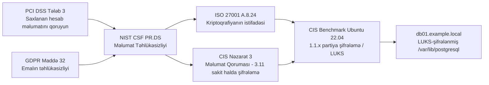

# Təhlükəsizlik Nəzarətləri və Çərçivələr

## Bu niyə vacibdir

Təhlükəsizlik proqramı — hücumçu ilə biznes nəticəsi arasına hansı **nəzarətlərin** qoyulacağına dair qərarlar toplusudur. Qərarları risk idarə edir, lakin onları eyni dərəcədə vacib bir şey məhdudlaşdırır — təşkilatın bağlı olduğu tənzimləmələr, müqavilələr və çərçivələr. PCI DSS-i nəzərə almayan bank kart emalı hüququnu itirir. SOC 2 hesabatı təqdim edə bilməyən SaaS provayderi ABŞ korporativ bazarına sata bilmir. AB şəxsi məlumatlarını yanlış idarə edən nəzarətçi nəzarət orqanı qarşısında oturur. Nəzarətlər — bu vədlərin gündəlik yerinə yetirilmə üsuludur.

Nəzarətlərlə bağlı söz ehtiyatı qəsdən dəqiqdir. **Kateqoriyalar** nəzarəti kimin və ya nəyin tətbiq etdiyini təsvir edir (idarəetmə, əməliyyat, texniki). **Tiplər** nəzarətin nə vaxt və necə işlədiyini təsvir edir (qabaqlayıcı, aşkarlayıcı, korreksiya edici, çəkindirici, kompensasiya edici, fiziki). **Tənzimləmələr** hökumətlərin verdiyi məcburi qaydalardır. **Standartlar** konsensus əsasında hazırlanmış spesifikasiyalardır. **Çərçivələr** — təşkilatların hər ikisinə cavab vermək üçün qəbul etdiyi nəzarət və proseslərin strukturlu kataloqlarıdır. Bu terminlərin hər hansı birini qarışdırmaq nəzarət söhbətini terminologiya mübahisəsinə çevirir və hər şeyi yavaşladır.

Bu dərs xəritədir. O, kateqoriyaları və tipləri, əksər korporativ təhlükəsizlik proqramlarını idarə edən tənzimləmələri (GDPR və PCI DSS), reaksiyanı təşkil edən çərçivələri (NIST CSF/RMF, ISO 27000-seriyası, CIS Controls, SOC 2, CSA CCM) və çərçivə dilini platforma spesifik konfiqurasiyaya çevirən benchmarkları əhatə edir. Məqsəd səlislikdir: dərsin sonunda hər hansı reyestrdəki istənilən nəzarəti bu xəritədə dəqiq yerləşdirə bilməlisiniz.

## Əsas anlayışlar

### Nəzarət kateqoriyaları — idarəetmə, əməliyyat, texniki

Kateqoriyalar **hansı növ mexanizmin** nəzarəti tətbiq etdiyini təsvir edir. Kateqoriyalar üst-üstə düşür; tək bir nəzarət çox vaxt iki kateqoriyanın hər ikisində yerləşir. Məqsəd — proqramın yalnız bir növdən ibarət olmamasını təmin etməkdir; arxasında siyasət olmayan texniki nəzarət yığını kövrəkdir, texniki tətbiq olmayan siyasət yığını isə teatrdır.

| Kateqoriya | Nəyin tətbiq etdiyi | Konkret nümunələr |
|---|---|---|
| **İdarəetmə** | Risk idarəetmə qərarları, idarəetmə strukturları, nəzarət | Risk reyestri, təhlükəsizlik siyasəti, illik risk qiymətləndirməsi, tədarükçü riski proqramı, ISMS əhatə bəyanatı |
| **Əməliyyat** | İnsanlar — sənədləşdirilmiş prosesin bir hissəsi olaraq insanların etdikləri | Dəyişiklik təsdiqi yığıncaqları, işə qəbul/dəyişiklik/işdən çıxma proseduru, təhlükəsizlik məlumatlandırma təlimi, hadisə cavab runbook-u, əl ilə log baxışı |
| **Texniki** | Aparat, proqram təminatı, firmware — avtomatlaşdırılmış tətbiq | Firewall qaydası, MFA tətbiqi, EDR agenti, tam disk şifrələmə, IDS/IPS imzası, biometrik oxuyucu |

İşləyən proqram hər üçündən istifadə edir. Çox faktorlu autentifikasiya texnikidir — lakin *hansı* sistemlərin onu tələb etdiyini təyin edən siyasət idarəetmədir, və tokeni verən işə qəbul prosesi əməliyyatdır. Kateqoriyalar taksonomiya deyil; onlar — stulun bir ayağının çatışmadığını fərq etməyə kömək edən yoxlama siyahısıdır.

### Nəzarət tipləri — qabaqlayıcı, aşkarlayıcı, korreksiya edici, çəkindirici, kompensasiya edici, fiziki

Tiplər **nəzarətin hadisə xəttində nə vaxt** işlədiyini təsvir edir. Kateqoriyalar kimi onlar da üst-üstə düşür — qapı kilidi həm fiziki, həm də qabaqlayıcı nəzarətdir. Tip söz ehtiyatının dəyəri ondadır ki, sizi "bunun *qarşısını alan* bir şeyim, *aşkarlayan* bir şeyim, ondan *bərpa edən* bir şeyim varmı?" sualını verməyə məcbur edir. Hər hansı birinə cavab "yox" olarsa, boşluq var.

- **Qabaqlayıcı** — hadisənin **qarşısını almaq üçün ondan əvvəl** işləyir. Firewall qaydaları bağlantını bloklayır. Mantrap quyruqdan keçməyə imkan vermir. Birləşmədən əvvəl kod baxışı zəifliyi olan dəyişikliyi dayandırır. MFA oğurlanmış parolun tək başına işləməsinin qarşısını alır.
- **Aşkarlayıcı** — hadisə **zamanı** nəyinsə baş verdiyi barədə xəbərdarlıq etmək üçün işləyir. IDS istismar cəhdinə işə düşür. SIEM korrelyasiya edir və növbətçini xəbərdar edir. Hərəkət sensoru həyəcan siqnalı verir. Fayl bütövlüyü monitoru ikili faylın dəyişdiyini görür.
- **Korreksiya edici** — zərəri məhdudlaşdırmaq və xidməti bərpa etmək üçün hadisədən **sonra** işləyir. Backup-lar şifrələnmiş məlumatı bərpa edir. Yük balanslayıcılar zəifləmiş node-dan trafiki azaldır. Hadisə cavab playbook-u məhdudlaşdırır, kökündən silir və bərpa edir. Patch istismar olunmuş zəifliyi bağlayır.
- **Çəkindirici** — hücumçunun xərcini artırmaqla və ya gözlənilən qazancını azaltmaqla onu çəkindirir. Görünən CCTV işarələri. İcazəsiz girişin hüquqi nəticələri haqqında bannerlər. Əvvəlcədən hazırlanmış rainbow cədvəllərini məğlub edən parol hashlərinə salt-lar. Əvvəlki hücumçuların ictimai məhkəmə təqibi.
- **Kompensasiya edici** — əsas nəzarət praktiki olmadıqda və alternativ oxşar nəticəyə nail olduqda istifadə olunur. PCI DSS bir tələb yazıldığı kimi yerinə yetirilə bilmədikdə kompensasiya edən nəzarətlərə icazə verir, bir şərtlə ki, alternativ eyni riski bərabər ciddiyyətlə həll etsin. Yanğın söndürmə sistemi yanğının qarşısını almır, lakin baş verdikdə zərəri məhdudlaşdırır.
- **Fiziki** — sistemlə fiziki qarşılıqlı əlaqənin qarşısını alır. Qapı kilidləri, qəfəslər, bollardlar, biometrik oxuyucular, Kensington kilidləri, kritik düymələrin üzərindəki plastik örtüklər, böyük qırmızı təcili dayandırma düyməsi.

**Tiplər harada üst-üstə düşür — işlənmiş ssenari.** "Hücumçu `db01.example.local`-dan müştəri məlumatını oğurlayır" riskini nəzərdən keçirək. Müdafiə oluna bilən duruş tipləri yığır:

- *Qabaqlayıcı* — şəbəkə seqmentasiyası `db01.example.local`-u yalnız tətbiq serverlərindən əlçatan səviyyəyə qoyur; istənilən admin bağlantısı üçün MFA tələb olunur; ən az imtiyaz rolları kompromisə uğramış hesabın oxuya biləcəyini məhdudlaşdırır.
- *Aşkarlayıcı* — verilənlər bazası auditi `customers` cədvəlinə qarşı hər `SELECT`-i qeyd edir; SIEM iş saatlarından kənar kütləvi oxumalar barədə xəbərdarlıq edir; UEBA birdən 1 GB endirən admin hesabını qeyd edir.
- *Korreksiya edici* — şifrələnmiş, dəyişdirilməz, kənardakı backup-lar yenidən qurulmağa imkan verir; məşq edilmiş hadisə cavab runbook-u host-u bir saat ərzində məhdudlaşdırır; rotasiya edilmiş verilənlər bazası kredensialları hücumçunun sessiyasını ləğv edir.
- *Çəkindirici* — giriş banneri bütün sessiyaların qeyd olunduğu barədə xəbərdarlıq edir; təşkilat əvvəlki ildə içəridən bir adamı ictimai surətdə məhkəməyə vermişdi.
- *Kompensasiya edici* — verilənlər bazası tədarükçüsü tələb olunan loglama sahəsini dəstəkləmir, ona görə də sidecar log shipper ekvivalent sübut istehsal edir və kompensasiya edən nəzarət kimi sənədləşdirilir.
- *Fiziki* — verilənlər mərkəzi nişan və biometrik giriş, kilidli kabinetlər və rack-larda CCTV istifadə edir.

Heç bir tip tək başına kifayət etmir. Aşkarlama nəzarətlərini buraxmaq o deməkdir ki, sındırıldığınızı müştəridən öyrənirsiniz. Korreksiya nəzarətlərini buraxmaq o deməkdir ki, içəri keçən hücumçu daimidir.

### Tənzimləmələr vs standartlar vs çərçivələr

Terminlər sərbəst istifadə olunur, lakin onlar fərqli şeylərdir və sizi fərqli şəkildə bağlayır.

- **Qanunlar** qanunvericilər tərəfindən qəbul edilir. Onlar davranışı və cəzaları müəyyən edir. Uyğunsuzluq hüquqi riskdir. *Nümunələr:* GDPR (AB), HIPAA (ABŞ), CCPA/CPRA (Kaliforniya).
- **Tənzimləmələr** qanunları tətbiq etmək üçün hökumət agentlikləri tərəfindən verilir. *Nümunələr:* HHS HIPAA Təhlükəsizlik Qaydası, AB milli məlumat qoruma orqanı təlimatı, ABŞ SEC kibertəhlükəsizlik açıqlama qaydaları.
- **Standartlar** standart orqanı və ya sənaye qrupu tərəfindən hazırlanmış konsensus spesifikasiyalarıdır. Qəbul bəzən könüllüdür, bəzən müqavilə tələbidir. *Nümunələr:* ISO/IEC 27001, NIST SP 800-53, PCI DSS (özəl sektor müqavilə standartı).
- **Çərçivələr** — təşkilatın proqramını planlaşdırması və ölçməsi üçün nəzarətləri, prosesləri və nəticələri təşkil edən strukturlu kataloqlardır. *Nümunələr:* NIST CSF, NIST RMF, CIS Controls, CSA Cloud Controls Matrix.
- **Benchmarklar və hardening təlimatları** — çərçivə və ya standart dilini platforma üçün spesifik konfiqurasiya parametrlərinə çevirir. *Nümunələr:* Ubuntu 22.04 üçün CIS Benchmark, Windows Server 2022 üçün DISA STIG, Cisco IOS üçün tədarükçü hardening təlimatı.

Tənzimləyici qanuna işarə edir. Qanun "müvafiq texniki və təşkilati tədbirlərə" işarə edir. Çərçivə "müvafiqin" praktikada nə demək olduğunu izah edir. Benchmark hansı qutunu işarələməli olduğunuzu deyir. Hər təbəqə yuxarıdakını əməliyyat edə bilən edir.

### GDPR (Ümumi Məlumatların Qorunması Tənzimləməsi)

GDPR — AB-nin omnibus məlumat qoruma tənzimləməsidir. O, harada yerləşməsindən asılı olmayaraq AB/AİİZ-də olan insanların şəxsi məlumatlarını mal/xidmət təklifi və ya davranış monitorinqi yolu ilə emal edən hər hansı təşkilata tətbiq olunur.

**Əhatə dairəsi və qanuni əsaslar.** Hər emal fəaliyyətinin altı qanuni əsasdan birinə malik olması lazımdır: razılıq, müqavilə, qanuni öhdəlik, həyati maraq, ictimai vəzifə və ya qanuni maraq. Məlumatların xüsusi kateqoriyaları (sağlamlıq, biometrik, irqi/etnik, siyasi, dini, həmkarlar ittifaqı, cinsi həyat, cinsi yönüm, genetik) əlavə açıq əsas tələb edir.

**Əsas öhdəliklər.**

- **Məlumat Qoruma Vəzifəlisi (DPO)** — ictimai orqanlar üçün və əsas fəaliyyəti geniş miqyaslı xüsusi kateqoriyalı emal və ya geniş miqyaslı sistematik monitorinq olan təşkilatlar üçün tələb olunur. DPO müstəqildir, ən yüksək rəhbərlik səviyyəsinə hesabat verir və nəzarət orqanı üçün əlaqə nöqtəsidir.
- **Emal Fəaliyyətlərinin Qeydləri (RoPA)** Maddə 30 üzrə — hər emal fəaliyyətinin yazılı inventarı.
- **Məlumat Qoruma Təsir Qiymətləndirməsi (DPIA)** Maddə 35 üzrə yüksək riskli emal üçün.
- **Məlumat Subyekti Hüquqları** — giriş, düzəltmə, silmə, məhdudlaşdırma, daşınma, etiraz, avtomatlaşdırılmış qərar qəbulu ilə bağlı hüquqlar — bir ay ərzində yerinə yetirilir.
- **Dizayn üzrə və standart üzrə məxfilik** Maddə 25 üzrə — məxfilik baza arxitektur tələbi kimi.
- **Sızma bildirişi** Maddə 33 və 34 üzrə — nəzarət orqanı 72 saat ərzində, məlumat subyektləri yüksək risk olduqda lazımsız gecikdirmədən.
- **Beynəlxalq köçürmələr** — adekvat yurisdiksiyalara məhdudlaşdırılır və ya təminatlarla əhatə olunur: Standart Müqavilə Bəndləri (SCC, həmçinin Model Müqavilə Bəndləri adlanır), Bağlayıcı Korporativ Qaydalar (BCR) və ya digər Maddə 46 mexanizmləri.

**Cərimə strukturu.** İki səviyyə, hər halda hansı daha yüksəkdirsə:

- **Aşağı səviyyə** — **&euro;10 milyona** qədər və ya qlobal illik dövriyyənin **2 %**-nə qədər. RoPA saxlamamaq, DPIA olmaması, DPO olmaması, zəif texniki/təşkilati tədbirlər kimi inzibati pozuntulara tətbiq olunur.
- **Yuxarı səviyyə** — **&euro;20 milyona** qədər və ya qlobal illik dövriyyənin **4 %**-nə qədər. Əsas prinsiplərin, qanuni əsasın, məlumat subyekti hüquqlarının və qeyri-qanuni beynəlxalq köçürmələrin pozulmasına tətbiq olunur.

Cərimələr yeganə nəticə deyil — emalı dayandırmaq əmrləri də öz növbəsində kommersiya baxımından ölümcül ola bilər.

### PCI DSS (Ödəniş Kartları Sənayesi Məlumat Təhlükəsizliyi Standartı)

PCI DSS — əsas kart brendləri adından PCI Təhlükəsizlik Standartları Şurası tərəfindən verilən müqavilə standartıdır. O, kart sahibi məlumatını saxlayan, emal edən və ya ötürən hər kəsi və bu fəaliyyətlərin təhlükəsizliyinə təsir edə bilən hər hansı sistem komponentini bağlayır. **Bu qanun deyil** — lakin o, mərhumat müqavilələri vasitəsilə acquirer banklar tərəfindən tətbiq olunur, hadisə başına 500 000 dollara qədər cərimələr, uyğunsuz mərhumatçılar üçün artırılmış əməliyyat haqları və ekstrem hallarda kart emalı hüququnun ləğvi ilə.

**İki məlumat sinfi.**

- **Kart sahibi məlumatı (CHD)** — əsas hesab nömrəsi (PAN), kart sahibinin adı, etibarlılıq müddəti, xidmət kodu. PAN qorunan elementdir; digərləri PAN ilə birlikdə saxlandıqda qorunur.
- **Həssas Autentifikasiya Məlumatı (SAD)** — tam maqnit lent / çip məlumatı, CAV2/CVC2/CVV2/CID, PIN-lər və PIN blokları. Avtorizasiyadan sonra heç vaxt saxlanılmamalıdır, hətta şifrələnmiş halda da.

**12 tələb qısaca** (PCI DSS v4.0):

1. Şəbəkə təhlükəsizliyi nəzarətlərini quraşdırın və saxlayın.
2. Bütün sistem komponentlərinə təhlükəsiz konfiqurasiyalar tətbiq edin.
3. Saxlanan hesab məlumatlarını qoruyun (şifrələmə, kəsmə, tokenləşdirmə).
4. Açıq şəbəkələrdə ötürmə zamanı kart sahibi məlumatlarını güclü kriptoqrafiya ilə qoruyun.
5. Bütün sistemləri və şəbəkələri zərərli proqramdan qoruyun.
6. Təhlükəsiz sistemləri və proqram təminatını inkişaf etdirin və saxlayın.
7. Sistem komponentlərinə və kart sahibi məlumatına girişi biznes ehtiyacı ilə məhdudlaşdırın.
8. İstifadəçiləri identifikasiya edin və girişi autentifikasiya edin (qeyri-konsol admin və bütün uzaq giriş üçün MFA).
9. Kart sahibi məlumatına fiziki girişi məhdudlaşdırın.
10. Sistem komponentlərinə və kart sahibi məlumatına bütün girişləri qeyd edin və izləyin.
11. Sistemlərin və şəbəkələrin təhlükəsizliyini müntəzəm sınaqdan keçirin (zəiflik skanları, penetrasiya testləri).
12. Məlumat təhlükəsizliyini təşkilati siyasətlər və proqramlarla dəstəkləyin.

**SAQ vs ROC.**

- **Özünü Qiymətləndirmə Anketi (SAQ)** — kiçik mərhumatçılar üçün. Çoxsaylı SAQ tipləri (A, A-EP, B, B-IP, C, C-VT, D-Mərhumatçı, D-Xidmət Provayderi, P2PE) mərhumatçının kartları necə qəbul etdiyinə uyğun gəlir. Mərhumatçı təsdiq edir; saytda qiymətləndirici tələb olunmur.
- **Uyğunluq Hesabatı (ROC)** — Səviyyə 1 mərhumatçılar (ildə 6 milyondan çox kart əməliyyatı) və Səviyyə 1 xidmət provayderləri üçün tələb olunur. İllik olaraq Kvalifikasiyalı Təhlükəsizlik Qiymətləndiricisi (QSA) tərəfindən aparılır və Uyğunluq Atestasiyası (AOC) ilə müşayiət olunur.

### Milli, ərazi və ştat qanunları

GDPR ən təsirlidir, lakin o tək deyil. Çoxlu yurisdiksiya proqramı minimum izləyir:

- **CCPA / CPRA (Kaliforniya)** — Kaliforniya sakinləri üçün geniş istehlakçı hüquqları: toplama zamanı bildiriş, bilmək, silmək, düzəltmək hüququ, satış/paylaşmadan imtina və həssas şəxsi məlumatların istifadəsini məhdudlaşdırmaq. Kaliforniya Məxfilik Qoruma Agentliyi tərəfindən tətbiq olunur.
- **HIPAA (ABŞ)** — Sağlamlıq Sığortasının Daşınma və Hesabatlılıq Qanunu, əhatə olunan qurumları (sağlamlıq planları, provayderlər, klirinq mərkəzləri) və PHI-ni idarə edən onların biznes əlaqədarlarını idarə edən Məxfilik Qaydası və Təhlükəsizlik Qaydası ilə.
- **GLBA (ABŞ)** — Gramm-Leach-Bliley Qanunu, maliyyə xidmətləri məxfiliyi və qoruyucu tədbirlər.
- **SOX (ABŞ)** — Sarbanes-Oxley maliyyə hesabatlılıq nəzarətləri, ictimai şirkətlərdə IT ümumi nəzarətlərinə (ITGC) təsiri ilə.
- **NIS2 (AB)** — kritik sektorlardakı vacib və əhəmiyyətli qurumlar üçün təhlükəsizlik öhdəlikləri və hadisə hesabatı.
- **DORA (AB)** — Maliyyə sektoru üçün Rəqəmsal Əməliyyat Dayanıqlığı Qanunu.
- **PIPEDA (Kanada)**, **LGPD (Braziliya)**, **PIPL (Çin)**, **POPIA (Cənubi Afrika)**, **APPI (Yaponiya)** — digər yurisdiksiyalarda GDPR tipli omnibus rejimləri.
- **ABŞ ştat səviyyəli məxfilik qanunları** — Virciniya (VCDPA), Kolorado (CPA), Konnektikut (CTDPA), Yuta (UCPA), Texas (TDPSA) və artan siyahı. Sektor spesifik qanunlar təhsil (FERPA), uşaq məxfiliyi (COPPA) və daha çoxunu əhatə edir.

Sərhədaşırı cinayət və kompüter pozuntu qanunları — məsələn, ABŞ Kompüter Saxtakarlığı və Sui-istifadəsi Qanunu (CFAA) və Birləşmiş Krallıq Kompüter Sui-istifadə Qanunu — milli sərhədləri keçən hadisələri araşdırarkən və ya onlara cavab verərkən də tətbiq olunur.

### NIST Kibertəhlükəsizlik Çərçivəsi (CSF) və Risk İdarəetmə Çərçivəsi (RMF)

ABŞ Milli Standartlar və Texnologiya İnstitutu birlikdə müəssisənin ehtiyac duyduğu çoxunu əhatə edən iki tamamlayıcı çərçivəni nəşr edir.

**NIST CSF** nəticə yönümlü və qəsdən əlçatandır. O, kibertəhlükəsizlik fəaliyyətini hər biri kateqoriyalara və alt kateqoriyalara bölünmüş **beş funksiya** içində təşkil edir:

- **İdentifikasiya** — aktivlərin idarə edilməsi, biznes mühiti, idarəetmə, risk qiymətləndirməsi, risk idarəetmə strategiyası, təchizat zənciri riski.
- **Qoruma** — giriş nəzarəti, məlumatlandırma və təlim, məlumatların təhlükəsizliyi, məlumat qoruma prosesləri, texniki xidmət, qoruyucu texnologiya.
- **Aşkarlama** — anomaliyalar və hadisələr, davamlı monitorinq, aşkarlama prosesləri.
- **Cavab** — cavab planlaşdırması, kommunikasiya, təhlil, azaltma, təkmilləşdirmələr.
- **Bərpa** — bərpa planlaşdırması, təkmilləşdirmələr, kommunikasiya.

CSF 2.0 (2024) altıncı funksiya əlavə etdi: **İdarəetmə** — təşkilati kontekst, risk idarəetmə strategiyası, rollar və məsuliyyətlər, siyasət, nəzarət, təchizat zənciri. İdarəetmə digər beşini bürüyür.

**NIST RMF** (SP 800-37) federal sistem nəzarəti seçimi və avtorizasiya prosesidir. Onun **yeddi addımı**:

1. **Hazırlıq** — kontekst və prioritetlər müəyyən edin.
2. **Kateqoriyalandırma** sistemi FIPS 199 üzrə təsirə görə (aşağı, orta, yüksək).
3. **Seçim** SP 800-53 baseline-larından nəzarətlər, sistemə uyğunlaşdırılmış.
4. **Tətbiq** nəzarətlərin.
5. **Qiymətləndirmə** nəzarətlərin nəzərdə tutulduğu kimi işləyib-işləmədiyi.
6. **Avtorizasiya** — yüksək rütbəli vəzifəli şəxs qalıq riski qəbul edir və Əməliyyat Avtorizasiyası (ATO) verir.
7. **Monitorinq** davamlı; əhəmiyyətli dəyişiklikdə yenidən avtorizasiya.

CSF strateji səviyyədə *nəyi* etməyi söyləyir. RMF SP 800-53 kataloqundan istifadə edərək konkret nəzarətləri *necə* seçməyi, sənədləşdirməyi və avtorizasiya etməyi söyləyir.

### ISO 27001 / 27002 / 27701 / 31000

ISO/IEC 27000-seriyası və ISO 31000 ABŞ-dan kənarda ən çox istinad edilən beynəlxalq konsensus standartlarıdır.

- **ISO/IEC 27001** — Məlumat Təhlükəsizliyi İdarəetmə Sistemi (ISMS) üçün sertifikatlaşdırıla bilən standart. Kontekst, liderlik, planlaşdırma, dəstək, əməliyyat, fəaliyyətin qiymətləndirilməsi və təkmilləşdirmə üçün tələbləri müəyyən edir. Əlavə A nəzarətləri sadalayır; 2022 baxışı Əlavə A-nı dörd mövzu (Təşkilati, İnsanlar, Fiziki, Texnoloji) üzrə 93 nəzarətə yenidən təşkil edir.
- **ISO/IEC 27002** — Əlavə A nəzarətləri üçün tətbiq təlimatı. Tək başına sertifikatlaşdırıla bilməz; o, hər nəzarəti dərinləməsinə izah edən yoldaşdır.
- **ISO/IEC 27701** — 27001/27002 üçün məxfilik genişləndirməsi. Məxfilik Məlumat İdarəetmə Sistemi (PIMS) tələblərini əlavə edir və GDPR-ə uyğun gəlir. Mövcud 27001 sertifikatına genişləndirmə kimi sertifikatlaşdırıla bilər.
- **ISO 31000** — yalnız kibertəhlükəsizlik riskinə deyil, hər hansı risk növünə tətbiq olunan ümumi risk idarəetmə təlimatları. ISO/IEC 27005 (məlumat təhlükəsizliyi risk idarəetməsi) və bir çox müəssisə risk proqramı tərəfindən istifadə edilən prinsipləri, çərçivəni və prosesi təmin edir.

Tipik müəssisə yığını: ümumi risk fəlsəfəsi üçün ISO 31000, ISMS strukturu və sertifikatlaşdırılması üçün ISO 27001, nəzarət təfərrüatı üçün ISO 27002, eyni proqram məxfilik yetkinliyini nümayiş etdirməli olduqda ISO 27701.

### CIS Controls v8

İnternet Təhlükəsizlik Mərkəzi **CIS Controls**-u nəşr edir — kibertəhlükəsizlik müdafiə tədbirlərinin prioritetləşdirilmiş, perskriptiv siyahısı. Versiya 8 (2021) tarixi "Top 20"-ni 153 müdafiə tədbiri ilə **18 nəzarətə** yenidən təşkil etdi və qəbul edən təşkilatın yetkinliyinə və resurslarına uyğunlaşdırılmış **Tətbiq Qruplarına** qruplaşdırdı.

18 nəzarət:

1. Müəssisə Aktivlərinin İnventarlaşdırılması və Nəzarəti.
2. Proqram Aktivlərinin İnventarlaşdırılması və Nəzarəti.
3. Məlumat Qoruması.
4. Müəssisə Aktivlərinin və Proqram Təminatının Təhlükəsiz Konfiqurasiyası.
5. Hesab İdarəetməsi.
6. Giriş Nəzarəti İdarəetməsi.
7. Davamlı Zəiflik İdarəetməsi.
8. Audit Logu İdarəetməsi.
9. E-poçt və Veb Brauzer Qorumaları.
10. Zərərli Proqram Müdafiələri.
11. Məlumat Bərpası.
12. Şəbəkə İnfrastrukturu İdarəetməsi.
13. Şəbəkə Monitorinqi və Müdafiəsi.
14. Təhlükəsizlik Məlumatlandırma və Bacarıq Təlimi.
15. Xidmət Provayderi İdarəetməsi.
16. Tətbiq Proqramı Təhlükəsizliyi.
17. Hadisə Cavab İdarəetməsi.
18. Penetrasiya Testləri.

**Tətbiq Qrupları (IG):**

- **IG1 (vacib kiber gigiyena)** — 56 müdafiə tədbiri. Məhdud təcrübəyə malik kiçik təşkilatlar üçün baseline; əmtəə aparat və SaaS qəbul edir.
- **IG2** — 130 müdafiə tədbiri. Həssas məlumatları saxlayan və çoxşöbəli IT idarə edən təşkilatlar üçün dərinlik əlavə edir.
- **IG3** — bütün 153 müdafiə tədbiri. Yetkin təhlükəsizlik komandaları və yüksək təsirli məlumatları olan təşkilatlara yönəldilmişdir; qabaqcıl üsulları və düşmən emulyasiyasını əhatə edir.

CIS nəzarətləri **CIS Benchmarks** (konfiqurasiya təlimatları) və **CIS-CAT** (sistemin benchmark-a uyğunluq balını bildirən skaner) ilə birləşdirir.

### SSAE SOC 2 — Type I vs Type II

Amerika Sertifikatlı İctimai Mühasiblər İnstitutu (AICPA) **Atestasiya Tapşırıqları üzrə Standartlar Bəyanatı (SSAE)**-ni nəşr edir, onun çərçivəsində Xidmət Təşkilatı Nəzarəti (SOC) hesabatları istehsal edilir. **SOC 2** təhlükəsizlik komandaları üçün ən aktualdır; o, **Etibar Xidmətləri Meyarlarına (TSC)** qarşı xidmət təşkilatındakı nəzarətlər haqqında hesabat verir.

**Beş Etibar Xidmətləri Meyarı:**

- **Təhlükəsizlik** (yeganə məcburi olan — "ümumi meyarlar").
- **Əlçatanlıq**.
- **Emal Bütövlüyü**.
- **Məxfilik**.
- **Şəxsi Həyat**.

Müştərilər ümumiyyətlə minimum Təhlükəsizlik tələb edir; sağlamlıq və ya maliyyə müştərilərinə xidmət edən SaaS provayderləri Məxfilik və Əlçatanlıq əlavə edir; istehlakçıya yönəlmiş xidmətlər Şəxsi Həyat əlavə edə bilər.

**Type I vs Type II.**

- **SOC 2 Type I** — **vaxtın bir nöqtəsində** nəzarətlərin **dizaynı** haqqında hesabat verir. "X tarixində nəzarətlər mövcud idimi?" Doğru nəzarətlər qurduqlarını göstərən erkən mərhələdəki provayderlər üçün faydalıdır; müəssisə tədarükündə nadir hallarda kifayət edir.
- **SOC 2 Type II** — **müddət ərzində** (adətən 6-12 ay) nəzarətlərin **əməliyyat səmərəliliyi** haqqında hesabat verir. Auditor müddət ərzində sübutları nümunə kimi götürür. Müəssisə müştəriləri bunu istəyir və tənzimlənən sənaye satışlarını açır.

İki əlaqəli hesabat: **SOC 1** müştərinin auditi ilə əlaqəli maliyyə hesabatlılıq nəzarətlərinə yönəlir; **SOC 3** SOC 2-dən əldə edilən ictimai, marketinqə uyğun xülasədir.

### Bulud Təhlükəsizliyi Alyansı (CSA), CCM və STAR

**Bulud Təhlükəsizliyi Alyansı** bulud təhlükəsizliyi təlimatları üçün əsas sənaye orqanıdır. Üç CSA çıxışı hər hansı bulud təhlükəsizlik proqramının mərkəzində durur.

- **Bulud Nəzarətləri Matrisi (CCM)** — IAM-dan təchizat zəncirinin şəffaflığına qədər hər şeyi əhatə edən v4-də **17 sahə** üzrə təşkil edilmiş (köhnə v3-də 16 sahə və 133 nəzarət məqsədi var idi) bulud spesifik təhlükəsizlik nəzarətlərinin meta-çərçivəsidir. Hər nəzarət aparıcı standartlara — ISO/IEC 27001/27002/27017/27018, NIST SP 800-53, PCI DSS, ISACA COBIT, HIPAA, AICPA TSC — uyğunlaşdırılmışdır, ona görə də tək bir CCM nəzarəti çoxsaylı rejimlərə cavab verə bilər.
- **Konsensus Qiymətləndirmə Təşəbbüsü Anketi (CAIQ)** — müştərilərin provayderlərə göndərdiyi və provayderlərin lazımi yoxlamanı sadələşdirmək üçün dərc etdiyi CCM-dən törədilmiş bəli/xeyr anketi.
- **STAR (Təhlükəsizlik, Etibar, Təminat və Risk) reyestri** — CAIQ dərc edən provayderlərin ictimai reyestri (Səviyyə 1 öz qiymətləndirməsi) və ya üçüncü tərəf atestasiyası/sertifikatlaşdırılmasından keçmiş (Səviyyə 2). Alıcılar artıq qiymətləndirmələri qısaltmaq üçün STAR-a müraciət edirlər.

CSA həmçinin Müəssisə Arxitekturası İşçi Qrupu vasitəsilə **Müəssisə Arxitekturası Referans Arxitekturasını** nəşr edir — təhlükəsizlik və müəssisə arxitektorlarının daxili IT-nin və bulud provayderlərinin harada dayandığını qiymətləndirməsi və bulud təhlükəsizliyi yol xəritəsi planlaması üçün metodologiya və alət dəsti. CSA sertifikatları CCSK və ISC2 ilə birgə verilən CCSP-ni əhatə edir.

### Benchmarklar və təhlükəsiz konfiqurasiya təlimatları

Çərçivə "əməliyyat sistemini hardenleyin" deyir. **Benchmark** "`/etc/ssh/sshd_config`-də `PermitRootLogin`-i `no`-ya təyin edin" deyir. Üç əsas mənbə ərazinin çoxunu əhatə edir.

- **Tədarükçülər / istehsalçılar.** Orijinal mənbə. Microsoft Təhlükəsizlik Uyğunluq Alət dəsti baseline-ları və məhsul spesifik təlimatlar (IIS, SharePoint, SQL Server) nəşr edir. Cisco, Apache Software Foundation və Oracle öz məhsulları üçün hardening sənədləri nəşr edir. Tədarükçü təlimatı məhsul üçün avtoritetlidir, lakin nadir hallarda audit istehlakı üçün formatlaşdırılır.
- **Hökumət.** ABŞ Müdafiə Departamenti yüzlərlə məhsul üçün **DISA STIG**-ləri (Təhlükəsizlik Texniki Tətbiq Təlimatları) avtomatlaşdırılmış skanlama üçün müşayiət SCAP məzmunu ilə nəşr edir. STIG-lər ciddi və pulsuzdur; onlar hərbi yoxlama siyahıları kimi oxunur, ki bu da məhz onların olduqlarıdır.
- **Müstəqil təşkilatlar.** **CIS Benchmarks** de fakto mülki standartdır — əməliyyat sistemləri, bulud provayderləri, verilənlər bazaları, şəbəkə cihazları və tətbiqlər üçün konsensus əsasında hazırlanmış konfiqurasiya təlimatları. Onlar iki profil səviyyəsində gəlir: **Səviyyə 1** (şeyləri qırmamalı olan ağlabatan defaultlar) və **Səviyyə 2** (dərinlik müdafiəsi, funksionallığı qurban verə bilər). **Bulud Təhlükəsizliyi Alyansı** bulud spesifik konfiqurasiyalar üçün təlimat nəşr edir.

**Sahə üzrə əhatə.**

- *Veb serverlər* — IIS, Apache, Nginx hamısının CIS Benchmarks-ı var; tədarükçülər öz təlimatlarını nəşr edir; STIG-lər IIS və Apache-i əhatə edir.
- *Əməliyyat sistemləri* — Windows Server, Windows 10/11, RHEL, Ubuntu, Amazon Linux, macOS — CIS, tədarükçü və STIG.
- *Tətbiq serverləri* — e-poçt (Exchange), verilənlər bazası (SQL Server, Oracle, PostgreSQL, MySQL), middleware (Tomcat, JBoss). CIS və STIG standart olanları əhatə edir; daxili xüsusi serverlər daxili komanda tərəfindən hardenlənməlidir.
- *Şəbəkə infrastrukturu* — Cisco IOS/IOS-XE/NX-OS, Juniper Junos, Palo Alto PAN-OS, F5, firewall-lar və switch-lər. CIS və STIG əksəriyyətini əhatə edir; ən yüksək qalıq risk heç bir tədarükçü təlimatının əmr edə bilməyəcəyi müştəri-spesifik qaydalar dəstindədir.

**Əməliyyat intizamı.** Benchmarklar yalnız sistem təkrarlanan cədvəldə onlara qarşı skanlandığı və sürüşmə düzəldildiyi halda əhəmiyyət kəsb edir. CIS-CAT, OpenSCAP, tədarükçü uyğunluq dashboard-ları və bulud Config qaydası xidmətlərinin hamısı benchmark-a qarşı rəqəmsal bal istehsal edir; bu bal aktiv sahibinin gördüyü dashboard-da olmalıdır.

## Nəzarət xəritələmə diaqramı

Nəzarət məqsədi nadir hallarda bir təbəqədə yaşayır. Ən faydalı zehni model — tənzimləmədən tək bir hostda konkret konfiqurasiya parametrinə qədər zəncirdir. Aşağıdakı diaqram bir nümunəni başdan sona izləyir: Linux verilənlər bazası serverində kart sahibi məlumatının qorunması.

Zəncir yuxarıdan aşağıya oxunur: tənzimləmə öhdəlik bildirir; bir və ya bir neçə çərçivə öhdəliyi nəzarət məqsədinə çevirir; benchmarklar məqsədi platformaya spesifik edir; və tək bir host yuxarıdakıların hamısına cavab verən tətbiq edilmiş parametri daşıyır. Sübut PCI QSA-sı, ISO 27001 auditoru və ya SOC 2 yoxlayıcısı tərəfindən tələb olunduqda, eyni sübutdur — `cryptsetup status` ekran görüntüsü, LUKS-un aktivləşdirildiyini göstərən aktiv qeydi, onun yayımlanmasından dəyişiklik bileti. **Bir nəzarət, bir sübut, çoxsaylı tənzimləmələrə cavab verilir.** Harmonizasiya edilmiş nəzarət dəstlərinin tam səbəbi budur.

## Praktiki məşğələlər

### Məşğələ 1 — 20 real nəzarəti kateqoriyalandırın

Aşağıdakı siyahıyı götürün və hər nəzarəti (a) bir və ya bir neçə **kateqoriyaya** (İdarəetmə / Əməliyyat / Texniki) və (b) bir və ya bir neçə **tipə** (Qabaqlayıcı / Aşkarlayıcı / Korreksiya edici / Çəkindirici / Kompensasiya edici / Fiziki) təyin edin. İki qutudan çoxda yerləşən hər nəzarəti əsaslandırın.

1. CISO tərəfindən illik təhlükəsizlik siyasəti baxışı.
2. İstehsalat VPN üçün rüblük istifadəçi giriş baxışı.
3. BitLocker/FileVault vasitəsilə bütün noutbuklarda tam disk şifrələməsi.
4. Verilənlər mərkəzi girişində CCTV kameraları.
5. Mümkünsüz səyahət üçün SIEM korrelyasiya qaydası.
6. S3 Object Lock-a dəyişdirilməz gecə backup-ları.
7. Monitorinq və məhkəmə təqibi haqqında xəbərdaredən giriş banneri.
8. Hər altı ayda firewall qaydalarının əl ilə baxışı.
9. SCIF girişində nişan + biometrik mantrap.
10. Təsdiq edilmiş zərərli proqramda avtomatik təcridi olan EDR agenti.
11. Köhnə tətbiq syslog yaya bilmədiyi üçün sidecar log shipper.
12. Məcburi düzəliş təlimi ilə illik fişinq simulyasiyası.
13. İstehsalat yayımlarından əvvəl Dəyişiklik Məsləhət Şurası təsdiqi.
14. Route 53 sağlamlıq yoxlamaları vasitəsilə avtomatik failover-li qaynar sayt DR.
15. OWASP Top 10 modellərini bloklayan WAF.
16. Tədarük zamanı tədarükçü risk anketi və SOC 2 baxışı.
17. Lobby şüşəsi qarşısında bollardlar.
18. Server şkaflarında uyğunsuzluğu göstərən möhürlər.
19. Ödəniş şlüzündə PAN-ın tokenləşdirilməsi.
20. 16 rəqəmli nömrələri ehtiva edən gedən e-poçtu bloklayan DLP qaydası.

30 dəqiqədə tamamlamağı hədəfləyin. Həmkar ilə müqayisə edin — fikir ayrılıqları əsas məsələdir.

### Məşğələ 2 — PCI-NIST CSF xəritələmə cədvəli qurun

`PCI DSS Tələbi`, `Alt-tələb`, `NIST CSF Funksiyası`, `NIST CSF Kateqoriyası`, `NIST CSF Alt kateqoriyası`, `Sahib`, `Sübut mənbəyi` sütunları olan cədvəl yaradın. Onu ən azı PCI DSS Tələb **1, 3, 8, 10 və 11** üçün doldurun. Hər sətirdə ən spesifik CSF alt kateqoriyasını (məsələn, identifikasiya idarəetməsi üçün PR.AC-1, şəbəkə monitorinqi üçün DE.CM-1) müəyyən edin və tək bir sahib adlandırın. Çıxış harmonizasiya edilmiş nəzarət dəstinin toxumudur; tam versiya orta həcmli SaaS üçün tipik olaraq 200-400 sətir təşkil edir.

### Məşğələ 3 — CIS-CAT skanı edin və tapıntıları triaj edin

Sandbox host seçin (boş Ubuntu 22.04 VM idealdır). CIS-CAT Lite (pulsuz) və ya lisenziyalanırsa CIS-CAT Pro yükləyin. **CIS Ubuntu Linux 22.04 LTS Benchmark Səviyyə 1** skanını icra edin. Yaranan HTML hesabatını açın. Tapıntıları üç qovluğa triaj edin:

- **İndi düzəldin** — yüksək təsirli, az səy, funksionallıq riski yox.
- **Planlaşdırın və düzəldin** — dəyişiklik pəncərəsi və ya test tələb edir.
- **Əsaslandırma ilə risk qəbul** — sənədləşdirilmiş biznes ehtiyacını qıracaq.

Hər Risk-qəbul girişi üçün bir sətir əsaslandırma yazın. Triaj bacarığı skan balından daha vacibdir — auditorlar tapıntıları görməyi gözləyir; onlara intizamlı cavabları görməyi gözləyirlər.

### Məşğələ 4 — SOC 2 Etibar Xidmətləri əhatə bəyanatı tərtib edin

İlk SOC 2 Type II-yə hazırlaşan fintech-də təhlükəsizlik liderisiniz. 250 sözdən az olan əhatə bəyanatı tərtib edin və göstərin: hansı Etibar Xidmətləri Meyarları əhatə dairəsindədir (və niyə), hansı məhsullar və mühitlər əhatə olunur, hansı alt xidmət təşkilatları çıxarılır, audit dövrü (məsələn, 1 aprel - 30 sentyabr) və sistem sərhədi. Subyekt kimi `example.local` və onun məhsullarından istifadə edin. Bəyanat həm auditor, həm də tədarük baxıcısına aydın oxunmalıdır.

### Məşğələ 5 — Bir biznes vahidi üçün GDPR Maddə 30 RoPA inventarı edin

Biznes vahidi seçin (HR klassik işlənmiş nümunədir). Onun yerinə yetirdiyi hər emal fəaliyyətini müəyyən edin. Hər fəaliyyət üçün Maddə 30 RoPA sütunlarını doldurun: nəzarətçi və DPO-nun adı və əlaqəsi, emal məqsədləri, məlumat subyektlərinin kateqoriyaları, şəxsi məlumatların kateqoriyaları, alıcıların kateqoriyaları, üçüncü ölkə köçürmələri və təminatlar, saxlama müddəti, texniki və təşkilati təhlükəsizlik tədbirləri. HR üçün 8-12 fəaliyyət hədəfləyin (işə qəbul, onboarding, əmək haqqı, müavinətlər, fəaliyyət, öyrənmə, qeyri-iştirak, ayrılanlar, işçi monitorinqi, peşəkar sağlamlıq, xərc kompensasiyası, istinadlar). Məşğələ cəlbedici deyil və qaçılmazdır.

## İşlənmiş nümunə — example.local harmonizasiya edilmiş nəzarət dəsti qurur

`example.local` — 250 nəfərlik fintechdir, AB və ABŞ-da kart ödənişlərini emal edir, tənzimlənən sənayelərdəki müəssisə SaaS müştərilərinə xidmət göstərir və Avropa sakinlərinin şəxsi məlumatlarını saxlayır. Üç öhdəlik eyni vaxtda üzərinə düşür:

- **PCI DSS** — kartları emal etdiyi üçün.
- **SOC 2 Type II** — müəssisə müştəriləri tədarük üçün bunu tələb etdiyi üçün.
- **GDPR** — AB sakinlərinin şəxsi məlumatlarını emal etdiyi üçün.

Sadə proqram üç nəzarət dəsti quracaq, üç audit dövrü işlədəcək və üç sübut dəsti istehsal edəcək. Komanda əvəzinə **harmonizasiya edilmiş nəzarət dəsti** yolunu seçir.

**Addım 1 — Onurğa çərçivəni seçin.** Onlar **NIST CSF 2.0**-ı strateji onurğa kimi qəbul edir (bu ABŞ müəssisə müştəriləri tərəfindən yaxşı başa düşülür) və **ISO 27001:2022 Əlavə A**-nı sertifikatlaşdırıla bilən nəzarət kataloqu kimi (artıq bəzi AB müştəriləri tərəfindən tələb olunur). İkisi daxili olaraq bir-birinə xəritələnir, ona görə də tək bir nəzarət sətri hər iki etiketi daşıyır.

**Addım 2 — Vahid nəzarət kataloqu qurun.** GRC komandası təxminən 180 nəzarətdən ibarət kataloq istehsal edir, hər sətir daşıyır: nəzarət ID-si, təsvir, sahib, NIST CSF alt kateqoriyası, ISO 27001 Əlavə A istinadı, **cavab verilən PCI DSS tələb(lər)i**, **cavab verilən SOC 2 Etibar Xidmətləri Meyar(ları) istinadları**, **müraciət edilən GDPR maddə(lər)i**, sübut mənbəyi, test tezliyi. Xəritələmə işi iki ay çəkir və iki analitik istifadə edir; cədvəl proqramdakı ən qiymətli artefaktdır.

**Addım 3 — Sübutu standartlaşdırın.** Hər nəzarət tək bir sübut mənbəyi adlandırır — Splunk dashboard-u, CrowdStrike hesabatı, Jira lövhəsi, Confluence səhifəsi, AWS Config qaydası. PCI-nin QSA-sı, SOC 2-nin CPA-sı və ISO 27001 baş auditoru "istehsalat üçün giriş baxışlarını mənə göstərin" deyə soruşduqda, cavab eyni Okta ixracından yaradılan eyni Confluence səhifəsidir. **Bir sübut, üç audit.**

**Addım 4 — Vahid ritmlə əməliyyat edin.** Daxili audit rüb başına nəzarətlərin 25%-ni test edir, ona görə də hər nəzarət ildə bir dəfə test edilir. Tapıntılar risk əsaslı maddələrlə eyni risk reyestrinə axır. Şura üçə deyil, vahid rüblük uyğunluq və risk hesabatı alır.

**Addım 5 — Bulud baseline-ı istifadə edin.** Bütün iş yükləri AWS-də işləyir, ona görə də komanda **CSA Bulud Nəzarətləri Matrisi**-ni bulud spesifik boşluqlar üçün ağıl yoxlaması kimi qəbul edir və hər hesab üçün baseline kimi **CIS Benchmarks** plus **CIS AWS Əsasları Benchmark**-ı icra edir. Host başına CIS-CAT balları və hesab başına AWS Config uyğunluğu gündəlik əməliyyat siqnalıdır.

**Nəticə.** PCI DSS ROC, SOC 2 Type II hesabatı və ISO 27001 sertifikatı üst-üstə düşən audit pəncərələrində eyni sübut bazasından verilir. Ümumi illik xarici audit xərci üç ayrılmış proqramın olacağı qiymətin təxminən yarısıdır və mühəndislərin auditor suallarına cavab verməyə sərf etdiyi vaxt təxminən 60% azalır. Qiymət əvvəlcədən xəritələmə işində ödənilir; faydalanma hər il bundan sonra davam edir.

## Problemlərin həlli və tələlər

- **Kateqoriya və tipləri taksonomiya kimi qəbul etmək.** Onlar qəsdən üst-üstə düşür. Qapı kilidinin "həqiqətən" qabaqlayıcı və ya "həqiqətən" fiziki olduğunu mübahisə etmək proqramın olmadığı vaxtı israf edir.
- **Öhdəlikləri başa düşmədən çərçivə seçmək.** Eyni zamanda PCI tənzimlənən və GDPR ilə bağlı olan şirkət üçün SOC 2 təşəbbüsü üç ayrı layihə olmamalıdır. Əvvəlcə öhdəlikləri xəritələyin; ən çox əraziyi əhatə edən çərçivəni seçin; harmonizasiya edin.
- **Standartları tənzimləmələrlə qarışdırmaq.** PCI DSS müqaviləlidir, qanuni deyil; ISO 27001 könüllüdür; GDPR qanundur. Cəza mexanizmləri və təcili dərəcə fərqlidir.
- **GDPR-in ekstraterritorial olaraq tətbiq edildiyini unutmaq.** Yalnız ABŞ-da yerləşən və AB sakinlərinə marketinq edən və ya onların davranışını izləyən şirkət əhatə dairəsindədir. "Biz AB-də deyilik" müdafiə deyil.
- **Avtorizasiyadan sonra Həssas Autentifikasiya Məlumatını saxlamaq.** Heç vaxt CVV, tam track məlumatı və ya PIN bloklarını saxlamayın. Nöqtə. Bu PCI qiymətləndirməsindən uğursuzluğa ən sürətli yoldur.
- **Benchmark almaq və ona qarşı skan etməmək.** SharePoint qovluğundakı çap edilmiş CIS Benchmark nəzarət deyil. Davamlı skanlama, sürüşmə aşkarlanması və düzəliş — bunlardır.
- **Səviyyə 2 benchmarkları test etmədən qəbul etmək.** CIS Səviyyə 2 — "dərinlik müdafiəsi, şeyləri qıra bilər"-dir. Əvvəlcə laboratoriyada yayımlayın; test edilmədən istehsalat yayımları benchmark olmadan olduğundan daha çox geri qaytarılan və proqramı geriyə atmış nasazlıqlara səbəb olub.
- **Bir dəfəlik SOC 2 Type I və heç vaxt Type II-yə keçməmək.** Type I başlanğıc nöqtəsidir. Müəssisə tədarükü bir il ərzində Type II tələb edir; Type I-də qalmaq yetkinsizliyə işarədir.
- **SOC 1 və SOC 2-ni qarışdırmaq.** SOC 1 maliyyə hesabatlılıq nəzarətləri üçündür. SOC 2 təhlükəsizlik, əlçatanlıq, emal bütövlüyü, məxfilik, şəxsi həyat üçündür. "SOC hesabatı" istəyən müştərilər demək olar ki, həmişə SOC 2-ni nəzərdə tutur.
- **Müəyyənləşdirilməmiş SOC 2 əhatəsi.** Bütün şirkəti əhatə edən SOC 2 nadir hallarda müştərinin önəm verdiyi məhsulun istehsalat mühitini əhatə edəndən daha ucuz və ya yaxşıdır. Çıxarmalar legitimdir; qeyri-müəyyən əhatələr bahalıdır.
- **Sənədləşdirilməmiş kompensasiya nəzarətləri.** PCI-nin kompensasiya nəzarəti prosesi QSA-nın əvvəlcədən qəbul etdiyi yazılı kompensasiya nəzarəti iş səhifəsi tələb edir. Sənəd olmadan "biz ekvivalent bir şey edirik" tapıntıdır.
- **Məcburi olduğu yerdə DPIA olmaması.** GDPR Maddə 35 DPIA-nın nə vaxt tələb olunduğunu söyləyir; layihə cədvəli sıx olduğu üçün buraxmaq sənədləşdirilmiş pozuntudur, hesablanmış risk deyil.
- **NIST CSF 2.0-da İdarəetmə funksiyasını nəzərə almamaq.** CSF 2.0 İdarəetməni səbəbsiz əlavə etmədi: Qoruma/Aşkarlama/Cavabda mükəmməl olan, lakin idarəetməsi zəif olan proqramlar ziddiyyətli qərarlar və qeyri-bərabər risk qəbulu istehsal edir.
- **CIS Tətbiq Qrupu inflyasiyası.** Kiçik təşkilatlar marketinq materiallarında IG3 iddia edir və reallıqda IG1 işlədir. Auditorlar və müştərilər bunu görə bilər. Həqiqətən işlətdiyiniz IG-ni seçin; qəsdən irəliləyin.
- **Risklər üçün bir reyestr, nəzarətlər üçün başqası, sübut üçün başqası.** Üç həqiqət mənbəyi heç deməkdir. Reyestr, nəzarət kataloqu və sübut indeksi — ideal olaraq eyni GRC alətində — uzlaşmalıdır.
- **Benchmark ballarını təhlükəsizlik duruşu kimi qəbul etmək.** 92% CIS-CAT balı vacib olan nəzarətləri əhatə etmirsə, mənasızdır. Yalnız sayı deyil, nəzarət başına kritikliyi balla qiymətləndirin.

## Əsas çıxarışlar

- **Kateqoriyalar** (idarəetmə / əməliyyat / texniki) nəzarəti nəyin tətbiq etdiyini təsvir edir; **tiplər** (qabaqlayıcı / aşkarlayıcı / korreksiya edici / çəkindirici / kompensasiya edici / fiziki) onun nə vaxt və necə işlədiyini təsvir edir. Hər ikisi vacibdir; heç biri ciddi taksonomiya deyil.
- Müdafiə oluna bilən duruş **tipləri yığır**: qarşısını almaq xərci artırır, aşkarlama keçən şeyi tapır, korreksiya biznesi bərpa edir, çəkindirmə hücumçu davranışını formalaşdırır və fiziki nəzarətlər substratı qoruyur.
- **Tənzimləmələr** qanunla bağlayır (GDPR, HIPAA, CCPA), **standartlar** müqavilə və ya sertifikatlaşdırma ilə bağlayır (PCI DSS, ISO 27001) və **çərçivələr** (NIST CSF/RMF, CIS, CSA CCM) cavabı təşkil edir. Benchmarklar (CIS, STIG, tədarükçü təlimatları) onu konkret edir.
- **GDPR**: qanuni əsas, məlumat subyekti hüquqları, yüksək risk olduqda DPIA, həmişə RoPA, 72 saat ərzində sızma bildirişi, qlobal dövriyyənin &euro;20 M-yə qədər və ya 4%-ə qədər cərimələr.
- **PCI DSS**: 12 tələb, iki məlumat sinfi (CHD vs SAD — heç vaxt SAD saxlamayın), kiçik mərhumatçılar üçün SAQ, Səviyyə 1 üçün ROC, yalnız sənədləşdirilmiş iş səhifəsi ilə kompensasiya nəzarətləri.
- **NIST CSF** strategiyanı İdentifikasiya / Qoruma / Aşkarlama / Cavab / Bərpa (və 2.0-da İdarəetmə) üzrə təşkil edir. **NIST RMF** nəzarət seçimi və avtorizasiya üçün yeddi addımlı Hazırlıq / Kateqoriyalandırma / Seçim / Tətbiq / Qiymətləndirmə / Avtorizasiya / Monitorinq dövrü işlədir.
- **ISO 27001** ISMS-i sertifikatlaşdırır; **27002** nəzarətləri izah edir; **27701** məxfilik əlavə edir; **31000** risk idarəetmə onurğasını təmin edir.
- **CIS Controls v8** 18 nəzarət və 153 müdafiə tədbiridir, IG1/IG2/IG3 Tətbiq Qrupları vasitəsilə təşkilata uyğunlaşdırılır, platforma spesifik hardening üçün **CIS Benchmarks** ilə birləşdirilir.
- **SOC 2** beş Etibar Xidmətləri Meyarına qarşı hesabat verir. **Type I** vaxtın bir nöqtəsində dizayndır; **Type II** müddət ərzində əməliyyat səmərəliliyidir — və müəssisə müştərilərinin həqiqətən soruşduğudur.
- **CSA-nın CCM**-i bulud nəzarətlərini hər əsas standarta xəritələyir. **STAR reyestri** alıcılara lazımi yoxlamanı qısaltmağa imkan verir.
- Hər hansı proqramdakı ən böyük rıçaq — bütün əhatə dairəsinə daxil olan tənzimləmələrə xəritələnmiş **harmonizasiya edilmiş nəzarət dəstidir**: bir nəzarət, bir sübut, çoxsaylı auditlərə cavab verilir.

## İstinad şəkilləri

Bu illüstrasiyalar orijinal təlim slaydından götürülüb və yuxarıdakı dərs məzmununu tamamlayır.

  <figure><figcaption>Slayd 1</figcaption></figure>
  <figure><figcaption>Slayd 17</figcaption></figure>

## İstinadlar

- **NIST Kibertəhlükəsizlik Çərçivəsi (CSF) 2.0** — https://www.nist.gov/cyberframework
- **NIST SP 800-37 Rev. 2** — Risk İdarəetmə Çərçivəsi — https://csrc.nist.gov/publications/detail/sp/800-37/rev-2/final
- **NIST SP 800-53 Rev. 5** — Təhlükəsizlik və Məxfilik Nəzarətləri — https://csrc.nist.gov/publications/detail/sp/800-53/rev-5/final
- **ISO/IEC 27001:2022** — Məlumat təhlükəsizliyi idarəetmə sistemləri — https://www.iso.org/standard/27001
- **ISO/IEC 27002:2022** — Məlumat təhlükəsizliyi nəzarətləri — https://www.iso.org/standard/75652.html
- **ISO/IEC 27701:2019** — Məxfilik məlumat idarəetməsi — https://www.iso.org/standard/71670.html
- **ISO 31000:2018** — Risk idarəetmə təlimatları — https://www.iso.org/standard/65694.html
- **GDPR tam mətn** — https://gdpr-info.eu/
- **PCI Təhlükəsizlik Standartları Şurası** — https://www.pcisecuritystandards.org/
- **CIS Controls v8** — https://www.cisecurity.org/controls/v8
- **CIS Benchmarks** — https://www.cisecurity.org/cis-benchmarks/
- **DISA STIGs** — https://public.cyber.mil/stigs/
- **AICPA SOC 2 Etibar Xidmətləri Meyarları** — https://www.aicpa-cima.com/topic/audit-assurance/audit-and-assurance-greater-than-soc-2
- **Bulud Təhlükəsizliyi Alyansı — Bulud Nəzarətləri Matrisi** — https://cloudsecurityalliance.org/research/cloud-controls-matrix
- **CSA STAR Reyestri** — https://cloudsecurityalliance.org/star/
- **CSA Müəssisə Arxitekturası** — https://cloudsecurityalliance.org/research/working-groups/enterprise-architecture
