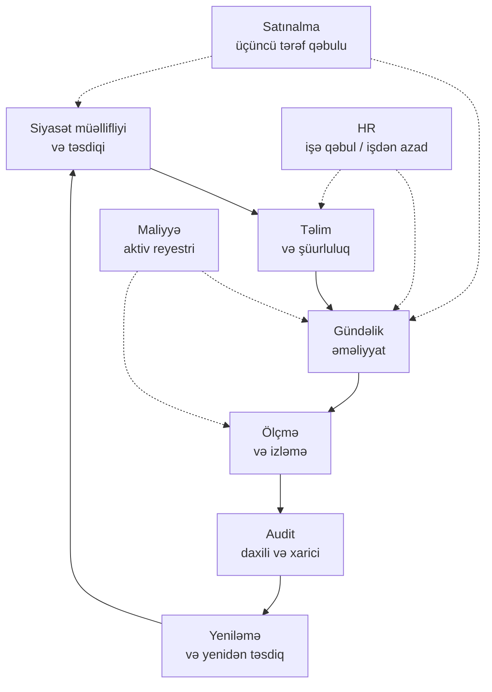

# Təhlükəsizlik İdarəetməsi, Siyasətlər və İnsanlar

## Bu nə üçün vacibdir

Əvvəlki dərs olan [Təhlükəsizlik Nəzarətləri və Çərçivələri](./security-controls.md) təşkilatın seçim etdiyi texniki və prosedur mexanizmləri kataloqlaşdırırdı. Bu dərs isə həmin nəzarətlərin praktikada işləməsi üçün doğru olmalı olan hər şey haqqındadır. Firewall qaydası özünü icra etmir: kimsə qərar verib ki, qayda siyasətə daxil olmalıdır, digəri növbətçi mühəndisə xəbərdarlığı tanımağı öyrədib, üçüncü şəxs dəyişiklik istifadəyə verilməzdən əvvəl yoxlayıb, dördüncüsü isə firewall təchizatçısı ilə müqavilə imzalayıb. Bu dörd insandan birini götürsəniz, qayda yalnız sahibi olmayan bir konfiqurasiya sətri olaraq qalacaq.

İdarəetmə "bizim siyasətimiz var" ifadəsini "siyasət hər kəsin riayət etdiyi cədvəl üzrə icra olunur, ölçülür, auditdən keçir və yenilənir" halına gətirən intizamdır. O, siyasətlərin özlərini (məqbul istifadə, NDA, vəzifələrin ayrılması, ən az imtiyaz), onlara riayət etməli olan insanları (yeni gələnlər, yer dəyişənlər, ayrılanlar, podratçılar, üçüncü tərəflər), onları aktual saxlayan təlimi, satıcıları və tərəfdaşları bağlayan hüquqi sənədləri, məlumatı həyat dövrü boyu idarə edən qaydaları, həm insanlar, həm də maşınlar üçün tətbiq olunan kredensial siyasətlərini və mühiti tanınan saxlayan dəyişiklik və aktiv idarəetmə proseslərini əhatə edir. Bu, cazibədar olmayan, sənəd-ağır bir işdir və təhlükəsizlik proqramının ilk auditdən sağ çıxıb-çıxmamasının ən böyük müəyyənediciləridir.

Bu dərs Təhlükəsizlik Nəzarətləri kolodasının ikinci yarısıdır. Birinci yarı "bu hansı növ nəzarətdir və hansı çərçivəyə xəritələnir?" sualını verirdisə, bu yarı "kim onun sahibidir, necə öyrədilir, müqaviləni kim imzalayır və kimsə ayrıldıqda məlumat hara gedir?" sualını verir. Birlikdə onlar tam mənzərəni təşkil edir: bir tərəfdə texniki müdafiələr, digər tərəfdə isə onları dəstəkləyən insan və proses karkası.

## Əsas anlayışlar

### Təşkilati siyasətlər — əsas sənəd, siyasət iyerarxiyası

Təhlükəsizlik idarəetməsi sənədlərdən başlayır və bu sənədlər ciddi iyerarxiya təşkil edir. Lüğət vacibdir, çünki hər təbəqə insanları fərqli şəkildə bağlayır və fərqli ritmlə dəyişdirilir.

| Təbəqə | Bu nədir | Onu kim yazır | Necə tez-tez dəyişir |
|---|---|---|---|
| **Siyasət** | Rəhbərliyin niyyətinin yüksək səviyyəli ifadəsi. Qısa, prinsipə əsaslanan, məcburi. | İcraedici rəhbərlik, idarə heyəti tərəfindən təsdiqlənir. | İllik və ya əsas biznes dəyişikliyi zamanı. |
| **Standart** | Siyasətin necə tətbiq olunduğunun məcburi spesifikasiyası (məs. parol uzunluğu, şifrələmə alqoritmləri). | Təhlükəsizlik komandası və arxitektura şurası. | Hər 1-2 ildə bir və ya texnologiya dəyişikliyi zamanı. |
| **Prosedur** | Siyasət və standarta uyğun olaraq tapşırığı yerinə yetirmək üçün addım-addım təlimatlar. | Sistemi işlədən komanda. | Sistem və ya alət hər dəyişdiyində. |
| **Tövsiyə** | Tövsiyə olunan (məcburi olmayan) təcrübə. Çevikliyin lazım olduğu yerlərdə faydalıdır. | Sahə üzrə mütəxəssislər. | Tələb olduqca. |

Tipik orta ölçülü təşkilat 10-25 siyasəti dəstəkləyir — İnformasiya Təhlükəsizliyi Siyasəti, Məqbul İstifadə, Giriş Nəzarəti, Kriptoqrafiya, İnsident Reaksiyası, Biznes Davamlılığı, Yedəkləmə, Məlumat Təsnifatı, Üçüncü Tərəf Riski, Dəyişiklik İdarəetməsi, Aktiv İdarəetməsi, Məxfilik və bir neçə rol- və ya sektor-spesifik əlavə. Hər siyasət standartlara və prosedurlara işarə edir və iyerarxiyanın hər hissəsinin sahibi, baxış tarixi və versiya nömrəsi vardır.

Burada ən çox rast gəlinən uğursuzluq **rəfdə qalan siyasətdir** — illər əvvəl təsdiqlənmiş, heç vaxt oxunmayan, heç vaxt öyrədilməyən, heç vaxt icra olunmayan sənəd. Auditorlar bunu dəqiqələr içində aşkar edir; hücumçuların onu aşkar etməsinə ehtiyac yoxdur, çünki icra yoxluğu artıq qapını açıq qoyub. İkinci ən çox rast gəlinən uğursuzluq isə əksinədir: heç kimin riayət edə bilməyəcəyi otuz səhifəlik siyasət, çünki o daxili ziddiyyətlərlə, artıq mövcud olmayan sistemlərə istinadlarla və onları işlətməli olmamış konsultant tərəfindən yazılmış arzu ifadələri ilə doludur. Qısa, aktual, sahibli və öyrədilmiş — bunlar hər siyasətin malik olmalı olduğu dörd keyfiyyətdir.

İnformasiya Təhlükəsizliyi Siyasəti piramidanın zirvəsində dayanır. O, CEO və ya idarə heyəti tərəfindən imzalanan, təşkilatın təhlükəsizliyə öhdəliyini bəyan edən, məsuliyyət daşıyan icraçını (adətən CISO) adlandıran, təhlükəsizlik komitəsini quran və bütün tabe siyasətlərə işarə edən şemsiye sənəddir. O, nadir hallarda dəyişir (ildə bir dəfə normaldır, iki ildə bir dəfə qəbul edilir). Tabe siyasətlər ona istinad edir; standartlar tabe siyasətlərə istinad edir; prosedurlar standartlara istinad edir. Bu istinad zənciri auditora ayrı-ayrı serverdəki tək konfiqurasiya parametrini idarə heyəti səviyyəsindəki öhdəliyə qədər izləməyə imkan verir və proqramı müdafiə edilə bilən edir.

### Personal təhlükəsizlik siyasətləri

İnsanlar hər təhlükəsizlik proqramının ən böyük, ən bahalı və ən dəyişkən hissəsidir. Personal-siyasət yığını təşkilatın bu dəyişkənliyi qəbul edilə bilən hədlərdə saxlamaq üçün istifadə etdiyi şeydir.

**Məqbul İstifadə Siyasəti (AUP).** AUP işçilərin şirkət resursları — noutbuklar, e-poçt, korporativ şəbəkə, sosial postlarda şirkət adı, AI alətləri, çıxarıla bilən medialar — ilə nə edə biləcəyini və edə bilməyəcəyini bildirir. Yaxşı AUP qısadır (bir-üç səhifə), texniki olmayan işçi tərəfindən oxuna biləndir və nəticələr haqqında açıqdır ("pozuntu işdən çıxarılmaya səbəb ola bilər"). O, işə qəbul zamanı imzalanır və illik olaraq yenidən təsdiqlənir. Minimum mövzu siyahısı:

- Şirkət aktivlərinin icazə verilən şəxsi istifadəsi və şəxsi biznes ilə sərhəd.
- Qadağan olunmuş məzmun (qanunsuz materiallar, təcavüz, şirkəti hörmətdən salan məzmun).
- Proqram quraşdırma qaydaları — adətən korporativ tətbiq kataloqu vasitəsilə icazə verilir, istisnalar təsdiq tələb edir.
- Uzaqdan giriş gözləntiləri (korporativ cihaz tələb olunur, MFA, düşmən şəbəkələrində split tunnel yoxdur).
- Məlumat təsnifat sxeminə bağlı məlumat istifadəsi.
- BYOD qaydaları — nəyə icazə verilir, hansı qeydiyyat tələb olunur, şirkət nəyi silə bilər.
- Çıxarıla bilən medialar (USB çubuqları, xarici disklər) — adətən pislənilir, istifadə edildikdə şifrələnir.
- Sosial media istifadəsi — şirkət haqqında nə deyilə bilər, kim onun adından danışır.
- AI və LLM alətləri — ictimai LLM-lərə nə göndərilə bilər (adətən: Daxili-dən yuxarı təsnif edilmiş heç nə), hansı korporativ alətlər icazəlidir.
- Monitorinq — şirkətin e-poçtu, şəbəkə trafikini və endpoint fəaliyyətini izləmək hüququnun açıq qorunması, korporativ sistemlərdə məxfilik gözləntisi olmadığı barədə aydın bildiriş ilə.

**İş rotasiyası.** İnsanları rollar arasında — xüsusilə imtiyazlı və ya maliyyəyə yaxın funksiyalarda — vaxtaşırı yerdəyişdirmək üç fayda yaradır. Çarpaz təlim verir, beləliklə heç bir şəxs tək nöqtə uğursuzluğu deyil. Fırıldaqçılığı üzə çıxarır, çünki halef sələfin nə etdiyini görür. Təhlükəsizlik komandasının daha geniş biznes haqqında anlayışını genişləndirir. Xərc realdır (təhvil-təslim zamanı məhsuldarlıq düşür) və kiçik təşkilatlar üçün işlətmək çətindir, lakin əhəmiyyətli etibara malik hər funksiyada o, mövcud olan ən güclü nəzarətlərdən biridir.

**Məcburi məzuniyyət.** Həssas rollardakı işçilərin ardıcıl günlər istirahət etməsini tələb etmək, fırıldaqçılığı üzə çıxaran müvəqqəti təhvil-təslimə məcbur edir. Klassik nümunə: heç vaxt məzuniyyətə getməyən bank məmurudur, çünki onun yoxlamaları bir həftəlik həmkar auditindən sağ çıxa bilməz. Maliyyə, xəzinə, IT əməliyyatları və təhlükəsizlik rolları üçün iki həftəlik ardıcıl məzuniyyət siyasəti, fırıldaq aşkarlama dəyəri qeyri-mütənasib olan aşağı xərcli nəzarətdir.

**Vəzifələrin Ayrılması (SoD).** Heç bir şəxs tək başına həssas əməliyyatı başlatmağa və bitirməyə qadir olmamalıdır. Klassik nümunə: ödənişi tələb edən şəxs onu təsdiq edə bilməz; kodu yazan tərtibatçı onu istehsala yerləşdirə bilməz; imtiyazlı hesab yaradan administrator onun giriş icazələrini təsdiq edə bilməz. SoD audit və mühasibatda ən köhnə nəzarətlərdən biridir və kiçik komandalarda işlətmək üçün ən çətinlərdən biri olaraq qalır — problemləri həll bölməsinə baxın.

**Ən az imtiyaz.** İstifadəçi, proses və ya xidmət öz işini yerinə yetirmək üçün lazım olan icazələrə malik olmalıdır, daha çox deyil. Ən az imtiyaz insanlara (onların AD qrup üzvlüklərinə), maşınlara (EC2 instansına bağlanmış IAM rolu) və tətbiqlərə (mikroservisin istifadə etdiyi verilənlər bazası hesabı) tətbiq olunur. O, təhlükəsizlikdə ən çox sitat gətirilən prinsipdir və ən çox pozulanıdır. Vaxtaşırı giriş baxışları və zamanında yüksəltmə (məs. PAM platformaları, AWS IAM Identity Center sessiya müddəti hədləri) onu real saxlayan əməliyyat lövbərləridir.

**Təmiz masa siyasəti.** Həssas materiallar — kağız, yapışqan qeydlər, çaplar, USB çubuqları, nişanlar — iş yerində nəzarətsiz qoyulmamalıdır. Siyasət kiçikdir, lakin verdiyi mədəni siqnal böyükdür: təşkilat fiziki məxfiliyi ciddi qarşılayır. Müasir variantlar qaydanı noutbuk ekranlarına (uzaqlaşarkən kilidləyin), çap növbələrinə (yalnız çəkmə-çapı) və iclas otaqlarındakı lövhələrə qədər genişləndirir.

**Keçmiş yoxlamaları.** Rola uyğun işə qəbuldan əvvəl yoxlama. Kiçik dəstək mühəndisi şəxsiyyət yoxlaması və işləmə hüququ yoxlamalarına layiqdir; domain administrator və ya maliyyə rəhbəri cinayət uçotu, kredit və istinad yoxlamalarına layiqdir; bəzi tənzimlənən sənayelər təhlükəsizlik icazələrini üstələyir. Yoxlamanın dərinliyi rolun kritikliyi ilə müəyyən edilir, vəzifə pilləsi ilə yox. Tənzimlənən mühitlərdə həssas rollar üçün hər üç-beş ildən bir yoxlamaların təkrarlanması yaygındır.

**Məxfilik Sazişi (NDA).** Hansı məlumatın açıqlanmamalı olduğunu və kimə açıqlanmamalı olduğunu müəyyən edən müqavilə. NDA-lar işə qəbulun bir hissəsi olaraq işçilər tərəfindən, iş şərhinin icrasının bir hissəsi olaraq podratçılar tərəfindən və qeyri-ictimai məlumatları əhatə edən ticarət danışıqlarından əvvəl xarici tərəflər tərəfindən imzalanır. Qarşılıqlı NDA-lar hər iki istiqaməti əhatə edir; birtərəfli NDA-lar yalnız açıqlayan tərəfin məlumatını əhatə edir. Ən vacib bəndlər: məxfi məlumatın tərifi, icazə verilən alıcılar, xitamda qaytarma və ya məhv etmə öhdəlikləri və öhdəliyin müddəti (adətən xitamdan sonra 3-5 il, ticarət sirləri üçün daha uzun).

**Sosial media analizi.** Bu termin arxasında iki fərqli məna yaşayır və hər ikisi vacibdir. Birincisi, AUP tərəfli sual: işçilər şəxsi hesablardan şirkət haqqında nə paylaşa bilər? İkincisi, üçüncü tərəf risk tərəfi: təşkilatın sosial media platformaları ilə əlaqəsi necə görünür, həmin platformaların xidmət şərtləri orada paylaşılan şirkət məlumatı üçün nə deməkdir və korporativ brend təqlid, fişinq və məlumat sızması göstəriciləri qarşı necə izlənilir? Hər ikisi AUP-da bir paraqraf və kiminsə vəzifəsində təkrarlanan tapşırığa layiqdir.

Personal təhlükəsizliyinin getdikcə daha çox bir hissəsi olan üçüncü ölçü: **işçilərin OSINT məruz qalması**. Düşmənlər spear-fişinq üçün hədəf profilləri qurmaq üçün LinkedIn-i, konfrans iştirakçı siyahılarını və ictimai commit tarixini cızırlar. Təşkilat işçilərə LinkedIn-də nə qoyacaqlarını deyə bilməz, lakin onlara öyrədə bilər ki, daxili layihələr və alətlər haqqında ətraflı postlar növbəti fişinq dalğasının hədəfləmə dəqiqliyini artırır. Ən yüksək riskli rollar (rəhbərlər, maliyyə, IT əməliyyatları liderləri) üçün bəzi təşkilatlar məlumat brokeri siyahılarını təmizləyən və sosial media məxfilik parametrlərini sıxlaşdıran könüllü OSINT-azaltma xidmətləri təklif edir.

### İşə qəbul və işdən azad etmə — işçi şəxsiyyətinin həyat dövrü

Hər işçi yaradılan, istifadə edilən, dəyişdirilən və nəhayət silinən bir şəxsiyyətdir. Bu həyat dövründəki uğursuzluqlar real dünyadakı insidentlərin böyük bir hissəsinin mənbəyidir: heç vaxt deaktiv edilməyən passiv hesablar, iş təminatı bitdikdən üç ay sonra hələ də admin hüquqları olan podratçılar, müştəri verilənlər bazasının olduğu USB çubuğunu götürərək çıxan ayrılan işçilər.

**İşə qəbul** "təklif qəbul edildi" və "tam məhsuldar" arasında baş verənlərdir. Təhlükəsizlik baxımından o aşağıdakıları daxil etməlidir:

- Kataloqda şəxsiyyət yaradılması (`EXAMPLE\jdoe`, `jdoe@example.local`).
- Bənzər vəzifəli həmkardan kopyalanmamış, sənədləşdirilmiş rol-icazə kataloqundan rola uyğun qrup üzvlükləri.
- MFA qeydiyyatı (rolun layiq olduğu yerdə fişinqə davamlı).
- Tam disk şifrələmə, EDR, MDM qeydiyyatı və korporativ brauzer profili ilə cihaz verilməsi.
- AUP və NDA imzalanması, imzalanmış nüsxənin HR-də qeydə alınması ilə.
- İstehsal məlumatına hər hansı girişdən əvvəl əsas təhlükəsizlik şüurluluğu təlimi.
- 30 gün ərzində tamamlanması üçün planlaşdırılan rolspesifik dərinləşdirmə təlimi.
- Həssas rollar üçün təhlükəsizlik komandası ilə qəbul söhbəti (mühəndislik liderləri, maliyyə, HR, IT əməliyyatları).

Standart model **30/60/90-günlük plandır**: 30 günlük əsas-giriş yoxlama siyahısı, 60 günlük rol-spesifik təlim və giriş tənzimləməsi, 90 günlük faktiki yerinə yetirilən işə qarşı giriş baxışı.

**İşdən azad etmə** əksidir, daha kəskin kənarlarla. Ayrılışdan 24 saat ərzində (və könülsüz xitamlar üçün dəqiqələr içində), gələn-yerdəyişən-ayrılan iş axını aşağıdakıları etməlidir:

- Kataloqda istifadəçi hesabını deaktivləşdirmək və Microsoft 365, Okta, AWS, GitHub, Slack, VPN və hər hansı digər federativ SaaS-də aktiv sessiyaları və tokenləri zorla ləğv etmək.
- MFA tokenlərini xitam etmək (TOTP sirləri, qaytarılmış aparat açarları).
- Şirkət cihazlarını (noutbuk, telefon, aparat tokenləri) qaytarmaq və qəbulu təsdiqləmək.
- Faylların, poçt qutularının və paylaşılan resursların mülkiyyətini təyin edilmiş halefə vermək.
- Fiziki girişi ləğv etmək (nişan deaktivləşdirilir, bina girişi silinir).
- HR ilə və həssas rollar üçün təhlükəsizlik komandası ilə çıxış müsahibəsi keçirmək.
- İşdən azad etməni JML sistemində tamamlanma vaxt damgası ilə sənədləşdirmək.

Kiminsə doğru Jira biletini tapması üçün həftələr çəkən xitam, dərslik halındakı insider təhdid ssenarisidir.

**Yerdəyişənlər** — təşkilat daxilində rolları dəyişən işçilər — sakit üçüncü ayaqdır. Köhnə icazələri yenilərinin üzərində toplanır, çünki heç kim onları silmir. Böyüyən şirkətdə iki illik təcrübəli işçi adətən real ehtiyac duyduğundan üç-dörd qat çox giriş toplayır. Rüblük giriş baxışları yeganə real çarədir.

Gələn-yerdəyişən-ayrılan (JML) sisteminin texniki tətbiqi adətən HR sistemindən (Workday, BambooHR, SAP SuccessFactors) gələn siqnallara reaksiya verən şəxsiyyət təminatçısı (Entra ID, Okta, Google Workspace) vasitəsilə marşrutlanır. Model: HR işçilik statusu üçün həqiqət mənbəyidir; şəxsiyyət təminatçısı hesabları cədvəl üzrə təmin və ləğv edir; aşağıdakı tətbiqlər (Microsoft 365, AWS, GitHub, Slack, Salesforce, VPN) IdP-dən şəxsiyyət hadisələrini istehlak edir. HR dəyişikliyindən aşağıya yayılmaya beş dəqiqəlik SLA-lara malik təmiz JML sistemi orta ölçülü təşkilatın təhlükəsizlik mövqeyinə edə biləcəyi ən güclü tək sərmayələrdən biridir; o, onlarla manual addımı və addımın atlanması üçün onlarla imkanı aradan qaldırır.

### İstifadəçi təlimi

Təlim nəzarətdir, nəzakət deyil. O, həm də heç kimin oxumadığı slayd kolodasına çevrilməsi ən ehtimal olunan nəzarətdir. Güclü proqramlar bir neçə xüsusiyyəti paylaşır: onlar rola əsaslanır, çoxlu üsullardan istifadə edir, nəticələri ölçür və fişinqi cəza əvəzinə canlı atış təlimi kimi qarşılayır.

**Kompüter Əsaslı Təlim (CBT).** Əsasları əhatə edən özünü tənzimləyən modullar — təhlükəsizlik siyasətləri, fişinq şüurluluğu, məlumat təsnifatı, insident hesabatları. CBT ucuz miqyaslanır, audit edilə bilən tamamlanma qeydləri yaradır və işə qəbul induksiyası və illik təzələmə üçün uyğundur. Onun zəifliyi səthi cəlbedicilikdir: tamamlanma səlahiyyəti bərabər deyil. Müntəzəm ritmlə düşən 5-10 dəqiqəlik modullar (bir "aylıq təhlükəsizlik dəqiqəsi" modeli) tək 90 dəqiqəlik illik marafondan həm yaddaşda saxlama, həm də tamamlanma nisbətlərinə görə üstündür.

**Rola əsaslanan təlim.** Hər kəs üçün ümumi şüurluluq, üstəgəl təhlükəsizliyə təsir edən qərarlar verən şəxslər üçün rola spesifik dərinləşdirmə. Xəritələmə təşkilatdan asılı olaraq dəyişir, lakin model ardıcıldır:

| Rol | Rola spesifik təlim mövzuları |
|---|---|
| Proqram tərtibatçıları | Təhlükəsiz kodlama (OWASP Top 10, dilə spesifik tələlər), təhdid modelləşdirməsi, asılılıq gigiyenası. |
| Sysadmin / SRE | Sistem sərtləşdirilməsi, yamaq idarəetməsi, insident reaksiyası kitabçaları, log analizi. |
| Maliyyə / mühasibat | Vəzifələrin ayrılması, fırıldaq şüurluluğu, biznes e-poçt kompromisi, ödəniş prosesi manipulyasiyası. |
| HR | Məxfilik, GDPR altında qanuni əsas, JML təhlükəsizliyi, həssas məlumat istifadəsi. |
| Rəhbərlər | Whaling və təqlid, idarə heyəti səviyyəsində risk hesabatı, tənzimləyici qarşılıqlı əlaqəsi. |
| Resepşn / ön masa | Tailgating, sosial mühəndislik, nişan nəzarəti, ziyarətçi idarəetməsi. |
| Təmizlik / vasitə işçiləri | Fiziki təhlükəsizlik, bir şey yanlış görünəndə nə etmək, eskalasiya yolları. |

Səhv "SOC" -nu rola əsaslanan təlimə ehtiyacı olan yeganə rol kimi qəbul etməkdir.

**Fişinq simulyasiyaları.** İşçilərə göndərilən real fişinq e-poçtları, e-poçtun niyə şübhəli olduğunu izah edən təhlükəsiz çatdırılma səhifələri ilə. Məqsəd *öyrətmə anlarıdır*, cəza qeydi deyil. Yetkin proqram:

- Əsas ölçmə ilə başlayır (tək şablon, bütün işçilər, xəbərdarlıq yoxdur).
- Daha sonra fırlanan mövzularla aylıq kampaniyalar aparır — çatdırılma bildirişi, HR sənədi, MFA sıfırlaması, bulud paylaşımı, rəhbər təqlidi, satıcı fakturası.
- Klikləmə nisbətini və hesabat verilmə nisbətini zaman ərzində izləyir, hesabat nisbətini (Outlook-da "bu fişinqdir" düyməsini basan insanlar) əsas göstərici kimi.
- Təkrar klikləyənlərdən HR aksiyası üçün deyil, əlavə təkbətək təlim üçün tetikleme istifadə edir.
- SOC ilə koordinasiya edir ki, simulyasiya hesabatları təlimi pozmadan real-insident hesabatlarından fərqləndirilsin.

Metriki *hesabat nisbəti*-nə yönəltmək tək başına *klikləmə nisbəti*-nə yönəltməkdən daha yaxşı mədəni nəticələr verir.

**Hücumçu mənasında fişinq kampaniyaları** — eyni təşkilatı hədəf alan əlaqəli yemləmələr zənciri — simulyasiyaların məşq etdiyi təhdiddir. Canlı fişinq dalğaları haqqında daxili kommunikasiyalar ("HR mövzulu yemləmələr əmək haqqı qəbzi əlavələri ilə dalğa görürük") növbəti 24-48 saat üçün diqqəti maddi şəkildə artırır. Hücum perspektivi üçün [Sosial Mühəndislik](../red-teaming/social-engineering.md) bölməsinə baxın.

**Oyunlaşdırma.** Xal, nişan, lider lövhələri və CBT və ya simulyasiya nəticələrinin üzərinə yerləşdirilmiş dostluq rəqabəti. Yaxşı aparıldıqda, uyğunluq təlimini yorucu işdən aşağı dərəcəli oyuna çevirir; pis aparıldıqda, metriki oyuna çevirmə davranışı yaradır. Onu ən yaxşı işlədən komandalar fərdi xal əvəzinə komanda səviyyəli xallar dərc edir, mükafatları müntəzəm dəyişdirir və onu mükafatlar üçün kiçik, lakin real büdcəyə bağlayır.

**Bayraq Tutma (CTF).** İştirakçıların "bayraqları" əldə etmək üçün təhlükəsizlik problemlərini həll etdiyi əməli məşqlər. Daxili CTF-lər təhlükəsizlik komandasının bacarıqlarını itiləyir və mühəndislikdə gizli istedadı üzə çıxarır. Xarici CTF-lər (DEF CON CTF, picoCTF) işə qəbul və komanda inkişafı üçün əla seçimdir. CTF-lər şüurluluq təlimi deyil; daha kiçik auditoriya üçün bacarıq təlimidir.

**Təlim üsullarının müxtəlifliyi.** İnsanlar fərqli şəkildə öyrənirlər. Yalnız CBT istifadə edən proqram söhbətə ehtiyacı olan insanları itirəcək; yalnız üzbəüz seminarlar istifadə edən proqram miqyaslanmayacaq. Güclü proqramlar əsas əhatə üçün CBT-ni, yeni siyasətlər və yüksək təsirli rollar üçün təlimatçı-aparılan sessiyaları, canlı atış təcrübəsi üçün simulyasiyaları, cəlbedicilik üçün oyunlaşdırmanı və texniki populyasiya üçün CTF-ləri birləşdirir. Nəticələr ölçülür (test nəticələri, simulyasiya nəticələri, insident hesabat nisbəti, real insidentlərdə hesabata qədər vaxt).

Hər ilin sonunda verilməli olan yetkinlik sualı "tamamlanma 100% -ə çatdıqmı" deyil, "fişinq simulyasiyalarında hesabat nisbəti yüksəldimi, real insidentdən ilk daxili hesabata qədər vaxt qısaldımı və təhlükəsiz kodlama təlimi kod baxışında təhlükəsizlik tapıntılarının həcmini azaltdımı". Bunlar nəticə metrikləridir; tamamlanma giriş metrikidir. Giriş metriklərindən nəticə metriklərinə keçən proqramlar adətən köhnə təliminin çox az dəyişiklik yaratdığını kəşf edir və müvafiq olaraq yenidən dizayn etməli olur — bu, məhz nəticələri ölçməyin əsas məqsədidir.

### Üçüncü tərəf riski — satıcılar, tədarük zənciri, biznes tərəfdaşları

Müasir təşkilatlar üçüncü tərəflər üzərində işləyir. Bulud təminatçısı, əmək haqqı SaaS, e-poçt təhlükəsizlik şlüzü, CI/CD boru kəmərinin keçən həftə çəkdiyi açıq mənbə paketi, EDR-i işlədən müqavilə bağlanmış MSP, müştəri müqavilələrinin nüsxəsinə malik hüquq firması — hamısı üçüncü tərəflərdir, hamısı risk daşıyır və hamısı tək proqram daxilində idarə edilməlidir.

**Satıcılar** mal və xidmət təchiz edən firmalardır. Daşıdıqları risklər: proqramlarındakı zəifliklər, təşkilatın adından saxladıqları məlumatın yanlış istifadəsi, təşkilatı çıxılmaz vəziyyətdə qoyan maliyyə çöküşü və tədarük zənciri kompromisi (kanonik nümunə SolarWinds işidir).

**Tədarük zənciri** təşkilatın istehlak etdiyi mal və xidmətləri istehsal edən təchizatçılar, alt-təchizatçılar və logistika tərəfdaşlarının daha geniş zənciridir. Üçüncü tərəfin üçüncü tərəfləri vacibdir: əmək haqqı SaaS-ı məlumat hostingini dördüncü tərəfə subkontrakt edirsə, ilk baxışdan müqavilə bağlayan təşkilatın görmədiyi risk əlavə edir. Müasir üçüncü tərəf risk proqramları subprosessorlar haqqında açıq şəkildə soruşur.

**Biznes tərəfdaşları** şirkətin strateji münasibəti olan təşkilatlardır — birgə müəssisələr, kanal tərəfdaşları, texnologiya inteqrasiyaları. Onların risk profili satıcıdan fərqlidir, çünki münasibət iki tərəflidir və tez-tez onlara daha dərin sistemlərə giriş verir.

**Hüquqi alətlər.** Aşağıdakıların hər biri üçüncü tərəf əlaqəsini rəsmiləşdirmək üçün istifadə olunan müqavilə növüdür; doğru olanı əlaqənin dərinliyindən və tələb olunan dəqiqlikdən asılıdır.

| Alət | Bu nə edir | Nə vaxt istifadə olunur |
|---|---|---|
| **Xidmət Səviyyəsi Sazişi (SLA)** | Ölçülə bilən performans səviyyələrini (uptime, reaksiya vaxtları, ötürmə qabiliyyəti) və onları əldə edə bilməmənin müalicəsini müəyyən edir. | Xidmət üçün müqavilə daxilində və ya yanında. |
| **Anlayış Memorandumu (MOU)** | Niyyətin iki tərəfli ifadəsi. Müqavilədən daha az rəsmidir; adətən tək başına hüquqi cəhətdən bağlayıcı deyil. | Biznes vahidləri arasında və ya münasibətin çərçivəyə alındığı tərəfdaşlarla. |
| **Master Xidmət Sazişi (MSA)** | Bütün sonrakı iş şərhlərini idarə edən şərtləri təyin edən master müqavilə. | Çoxlu məşğuliyyətli uzunmüddətli xidmət əlaqəsi. |
| **Biznes Tərəfdaşlığı Sazişi (BPA)** | Tərəfdaşlığın hüquqi strukturunu müəyyən edir: mənfəət və zərər paylaşması, məsuliyyətlər, çıxış şərtləri. | Rəsmi biznes tərəfdaşlığına daxil olmaq. |

Qeyd edək ki, **MSA** bəzən fərqli bir mənada da istifadə olunur — *Ölçmə Sistemləri Analizi*, ölçmə sistemi dəqiqliyini qiymətləndirmək üçün keyfiyyət fənni — təhlükəsizlik proqramlarının altında olan metrikləri müzakirə edərkən. Kontekst hansı mənanın nəzərdə tutulduğunu aydınlaşdırır.

**Həyat Sonu (EOL)** satıcının məhsulu satmağı dayandırdığı tarixdir. **Xidmət Həyatının Sonu (EOSL)** satıcının onu dəstəkləməyi dayandırdığı tarixdir — daha çox yamaq yoxdur, daha çox təhlükəsizlik yeniləməsi yoxdur, daha çox kömək masası yoxdur. EOSL təhlükəsizlik üçün sərt son tarixdir: internet üzlü hostda EOSL əməliyyat sistemi məlum, tarixli, hücumçunun əlçatan zəiflikdir. Aktiv inventarları EOL/EOSL tarixlərini qeyd etməlidir və büdcə dövrləri EOSL hit etməzdən əvvəl əvəzlənməni planlaşdırmalıdır.

Üçüncü tərəf qəbul prosesi — yeni satıcının müqavilə imzalanmadan əvvəl keçdiyi addımlar ardıcıllığı — üçüncü tərəf risk proqramının yaşadığı və ya öldüyü yerdir. Tipik qəbul: tələb edən komanda tərəfindən bildirilmiş biznes ehtiyacı, təhlükəsizlik anketinin verilməsi (riskə görə təbəqələnmiş), sübutların toplanması (SOC 2 hesabatı, ISO 27001 sertifikatı, son penetrasiya test xülasəsi, security.txt baxışı, sızma açıqlama tarixi), müqavilə bəndlərinin hüquqi baxışı (məlumat emal əlavəsi, təhlükəsizlik eksponatı, audit hüquqları, xitam), satınalma və maliyyə tərəfindən kapatılan son təsdiq. Satınalma və maliyyə qapını icra etmədən, qəbul könüllü olur və satıcı risk proqramı teatra çevrilir.

### Məlumat həyat dövrü — təsnifat, idarəetmə, saxlama

Məlumatın həyat dövrü vardır: o yaradılır və ya toplanır, təsnif edilir, istifadə olunur, paylaşılır, saxlanılır və nəhayət məhv edilir. İdarəetmə hər mərhələni qəsdən saxlayan siyasət təbəqəsidir.

**Təsnifat.** Bütün məlumatlar bərabər həssas deyil və onları belə qəbul etmək güclü qorumaları ucuz (hər kəs onları nəzərə almır) və zəif qorumaları bahalı (hər kəs onlara qəzəblənir) edir. İşləyə bilən sxem yadda saxlamaq üçün kifayət qədər kiçikdir — adətən dörd təbəqə — və texniki olmayan işçinin doğru olanını seçə biləcəyi qədər aydın etiketlənmişdir. Yaygın sxem:

| Təbəqə | Nümunələr | İstifadə əsası |
|---|---|---|
| **İctimai** | Marketinq səhifələri, dərc edilmiş hesabatlar. | Məhdudiyyət yoxdur; yalnız bütövlük nəzarətləri. |
| **Daxili** | Təşkilat sxemləri, daxili wikilər, layihə planları. | Korporativ sərhəd daxilində; təsdiq olmadan xarici paylaşım yoxdur. |
| **Məxfi** | Müqavilələr, mənbə kodu, müştəri siyahıları. | İstirahət və tranzitdə şifrələnmiş; bilməyə-ehtiyac əsasında giriş; DLP izlənilir. |
| **Məhdud** | Kart sahibi məlumatı, AB rezidentlərinin şəxsi məlumatı, sirlər, tibbi qeydlər. | Güclü giriş nəzarətləri, MFA, tam audit qeydiyyatı, ayrı saxlama, tənzimləyici dərəcəli nəzarətlər. |

Sxem nə olursa olsun, üç qayda tətbiq olunur: təsnifatlar təşkilat boyu ardıcıl olmalıdır, hər məlumat aktivinin təsnifatı olmalıdır və təbəqə üzrə istifadə qaydaları icra edilə bilən olmalıdır.

**İdarəetmə.** Məlumat idarəetməsi məlumatı etibarlı və yaxşı idarə olunan saxlayan şemsiye proqramdır. O, məlumat sahiblərini (məlumat domeni başına məsuliyyət daşıyan icraçı), məlumat nəzarətçilərini (əməliyyat qoruyucuları) və məlumatın həyat dövrü boyu tətbiq olunan siyasətləri müəyyən edir. Məlumat idarəetmə komitəsi adətən sahiblər arasındakı mübahisələri həll edir. Texniki artefaktlar — məlumat kataloqu, nəsil, keyfiyyət metrikləri — məlumat mühəndisliyi tərəfindən işlədilir, lakin bu komitə tərəfindən siyasət səviyyəsində idarə olunur.

**Saxlama.** Məlumatı əbədi saxlamaq özü riskdir: təşkilatın saxladığı hər məlumat hücumçunun oğurlaya biləcəyi, tənzimləyicinin tələb edə biləcəyi və ya iddiaçının kəşf zamanı tələb edə biləcəyi məlumatdır. Saxlama siyasəti hər məlumat sinifinin nə qədər saxlanılacağını və sonunda necə məhv ediləcəyini müəyyən edir. Siyasətə girişlər tənzimləyici tələbləri (vergi qeydləri: bir çox yurisdiksiyada 7 il; tibbi qeydlər: uzun; ödəniş kartı məlumatı: mümkün qədər qısa), biznes ehtiyacı və məhkəmə saxlamalarını (məhkəmə nəzarəti altındakı xüsusi qeydlərin məhvini dayandıran) əhatə edir. Tətbiq çətin hissədir: "7 ildən sonra sil" deyən siyasət və hər şeyi əbədi saxlayan yedəkləmə sistemi ardıcıl deyil və ardıcılsızlıq tənzimləyicilərin soruşduğu məsələdir.

Məhv etmə üsulları öz paraqrafına layiqdir. Kağız üçün, NAID AAA standartı və ya ekvivalentinə cross-cut shredding. Maqnit medialar üçün, fiziki məhv edilməsi ilə müşayiət olunan deqaussinq. SSD-lər üçün, kriptoqrafik silmə (şifrələmə açarını məhv et) yeganə etibarlı proqram metodudur; fiziki məhv etmə (toza çevirmə, yandırma) konservativ ehtiyatdır. Bulud saxlama üçün, təminatçının təhlükəsiz silmə primitiv plus yedəklərin müddəti bitənə qədər sənədləşdirilmiş saxlama dövrü. SaaS məlumatı üçün, satıcıya təsdiqləmə ilə müqaviləli silmə öhdəlikləri. Məhv etmə üsulu məlumat sinfinə uyğun olmalıdır və auditorial olmalıdır.

### Kredensial siyasətləri — personal, üçüncü tərəflər, cihazlar, xidmət hesabları, admin/root üçün

Kredensiallar krallığın açarlarıdır və hər mühitdə ən çox hücum olunan səthdir. Kredensial siyasəti kredensial sinfi üzrə kimin sahib olduğunu, necə verildiyini, nə qədər güclü olmalı olduğunu, necə fırladıldığını, necə izləndiyini və necə ləğv edildiyini bildirən tək sənəddir. Siniflər fərqli davrandığı üçün fərqli istifadəyə layiqdirlər.

**Personal kredensialları.** Kataloq (Active Directory, Entra ID, Okta) tərəfindən dəstəklənən insan şəxsiyyətləri. Siyasət aşağıdakıları müəyyən edir:

- Parol uzunluğu və mürəkkəbliyi (NIST SP 800-63B uyğunlaşdırılmış: minimum 12-15 simvol, məcburi vaxtaşırı fırladılma yoxdur, sızma siyahısı yoxlaması).
- MFA tələbi, həssas rollar və qırma-şüşə admin yolları üçün məcburi fişinqə davamlı MFA (FIDO2/WebAuthn) ilə.
- Sessiya müddətləri (normal üçün 8-12 saat, yüksəldilmiş üçün daha qısa).
- Giriş baxış tezliyi (istehsal üçün rüblük, ümumi üçün yarı-illik).
- Sosial mühəndislik edilə bilməyən kilidlənmə hədləri və hesab bərpa prosedurları.

Ən müasir siyasətlər **mürəkkəblikdən üstün parol cümlələrinə** üstünlük verir (uzunluq qırılma müqavimətində simvol-sinfi tələblərini üstələyir). [Şəxsiyyət və MFA alətləri](../general-security/open-source-tools/iam-and-mfa.md) bölməsinə baxın.

**Üçüncü tərəf kredensialları.** Xarici istifadəçilər — podratçılar, auditorlar, sistem girişi olan satıcılar — izlənilən proses vasitəsilə verilən, xüsusi sistemlərə əhatəli, vaxt-məhdudlaşdırılmış və məşğuliyyət sonunda ləğv edilən kredensiallar tələb edirlər. Doğru model federasiyadır (üçüncü tərəf öz şəxsiyyət təminatçısına qarşı autentifikasiya edir), yerli hesablar deyil; yerli hesablar qaçınılmazdırsa, onlar etiketlənməli və aylıq giriş baxışlarında üzə çıxarılmalıdır.

**Cihaz kredensialları.** Active Directory-də kompüter hesabları, VPN autentifikasiyası üçün noutbuklara verilən sertifikatlar, bulud IAM-da maşın şəxsiyyətləri. Cihazlar öz parollarını fırlada bilməzlər, beləliklə maşın kredensialları kredensial saxlama yerində (TPM, Secure Enclave, AWS Systems Manager Parameter Store, Azure Key Vault) saxlanılan uzun, təsadüfi yaradılmış dəyərlər istifadə edir. Siyasət saxlama tələblərini, tətbiq olunan yerdə fırlama tezliyini və cihazlar təqaüdə çıxarıldıqda söndürmə addımlarını müəyyən edir.

**Xidmət hesabları.** Tətbiqlər tərəfindən digər sistemlərə daxil olmaq üçün istifadə edilən qeyri-insan şəxsiyyətləri — mikroservisin istifadə etdiyi verilənlər bazası bağlantı sətri, yedəkləmə alətinin altında işlədiyi AD xidmət hesabı. Onlar təhlükəlidir, çünki geniş paylaşılırlar, nadir hallarda fırladılır (fırladılma tez-tez tətbiqi pozur) və tez-tez həddindən artıq imtiyazlıdır (çünki giriş səhvlərini həll etmək həddindən artıq vermədən daha çətindir). Siyasət tələb etməlidir: hər xidmət hesabının adlandırılmış insan sahibi var, kredensiallar sirlər menecerində (HashiCorp Vault, AWS Secrets Manager, Azure Key Vault, CyberArk) saxlanılır, fırlama ritmi müəyyən edilir və icra olunur, imtiyazlar minimuma endirilir, interaktiv giriş söndürülür və istifadə izlənilir.

**Administrator və root hesabları.** Hər mühitdəki ən yüksək imtiyazlı hesablar — domain adminləri, Linux-da root, AWS root istifadəçisi, Azure global administratorları. Siyasət tələb etməlidir: istifadəçinin gündəlik hesabından ayrı admin hesabı, hər yüksəldilmiş sessiyada MFA (yalnız fişinqə davamlı MFA), qırma-şüşə ssenarilər üçün sessiya yazılması, API açarları olmayan və aparat MFA tokeni olan kilidlənmiş AWS root istifadəçisi, admin populyasiyasının müntəzəm baxışı və mümkün olan yerdə daimi giriş əvəzinə zamanında yüksəltmə.

### Dəyişiklik və aktiv idarəetməsi

İki başqa proses bütün proqramı dəstəkləyir. Onlarsız nəzarətlər sürüşür, inventarlar çürüyür və "nəyə sahib olduğumuzu və nəyin dəyişdiyini bilmirik" həm xidmət dayanmalarının, həm də sızmaların ümumi səbəbinə çevrilir.

**Dəyişiklik idarəetməsi** istehsal mühitinə hər dəyişikliyi idarə edən siyasət və prosesdir. Dəyişiklik kod yerləşdirməsi, firewall qaydası dəyişikliyi, verilənlər bazası sxem yeniləməsi, OS yamağı, satıcı SaaS yenidən konfiqurasiyası — istehsal vəziyyətini dəyişən hər şeydir. Standart proses:

1. **Tələb** — əsas, əhatə, risk qiymətləndirməsi, geri qayıtma planı və validasiya addımları olan bilet.
2. **Baxış** — riskə mütənasib həmkar və ya CAB baxışı.
3. **Təsdiq** — adlandırılmış təsdiqedici imzalayır; qeyri-standart dəyişikliklər üçün öz-özünə təsdiq yoxdur.
4. **Cədvəl** — tətbiq müəyyən edilmiş dəyişiklik pəncərəsinə yerləşdirilir.
5. **Tətbiq** — kitabça üzrə, yüksək riskli dəyişikliklər üçün tətbiq edən təsdiqedicidən fərqli olur.
6. **Yoxla** — sənədləşdirilmiş uğur meyarlarına qarşı açıq yoxlama addımı.
7. **Sənədləş** — faktiki nəticə, hər hansı sapma və öyrənilmiş dərslər ilə bağlanma.

Yetkin proqramlar dəyişiklikləri kateqoriyalara bölür:

- **Standart** — əvvəlcədən təsdiqlənmiş, aşağı riskli, tez-tez avtomatlaşdırılmış (məs. qeyri-kritik serverlərin müntəzəm OS yamaqlanması, ACME vasitəsilə sertifikat yenilənməsi).
- **Normal** — tam baxış-təsdiq-tətbiq dövrü.
- **Təcili** — sıxılmış baxış, 48 saat ərzində tətbiqdən sonrakı əsaslandırma, aylıq audit edilmişdir.

**Dəyişiklik nəzarəti** xüsusi dəyişikliyin təfərrüatlarını izləyən daha dar fəndir — nə dəyişdi, kim dəyişdi, nə vaxt, hansı təsdiqedici ilə — dəyişiklik idarəetməsinin daha geniş prosesinə qarşı. Terminlər tez-tez bir-birinin əvəzinə istifadə olunur; praktiki artefakt Jira, ServiceNow və ya ekvivalent sistemdəki biletdir.

**Aktiv idarəetməsi** təşkilatın nəyə sahib olduğunu bilmək üçün siyasət və prosesdir. Əhatə insanların tez-tez güman etdiyindən daha genişdir:

- **Aparat** — noutbuklar, masaüstü kompüterlər, serverlər, şəbəkə avadanlıqları, mobil cihazlar, aparat tokenləri, IoT cihazları, OT və ICS avadanlıqları, printerlər, aktiv istifadədə olan çıxarıla bilən medialar.
- **Proqram** — hər hostdakı hər paket, hər SaaS abunəliyi, istehlak edilən hər API, kod bazasının idxal etdiyi hər açıq mənbə kitabxanası.
- **Məlumat** — yuxarıdakı məlumat-həyat-dövrü bölməsində əhatə olunmuşdur; məlumat aktivlərinin də sahiblərə və həyat dövrü izlənməsinə ehtiyacı olduğu üçün buraya daxil edilmişdir.
- **Bulud resursları** — hər hesab, abunəlik, layihə, VPC, vedrə, funksiya, konteyner — təminatçı API-lər vasitəsilə kəşf edilmiş və biznes sahibinə uyğunlaşdırılmışdır.

Aktiv idarəetməsi olmadan zəiflik idarəetməsi üçün əhatə yoxdur, insident reaksiyası üçün əhatə yoxdur, tutum planlaması üçün əsas yoxdur və müdafiə edilə bilən sığorta iddiası yoxdur. Praktiki proqram aşağıdakıları işlədir: tək həqiqət mənbəyi (tez-tez CMDB), onu bəsləyən avtomatlaşdırılmış kəşf (şəbəkə skanları, agent hesabatları, SaaS API sorğuları, bulud təminatçı API-ləri), hər aktiv üçün mülkiyyət, EOL/EOSL izlənməsi və maliyyənin sabit aktiv reyestri ilə rüblük uyğunlaşdırma.

Hər prioritetləşdirilmiş nəzarət siyahısının zirvəsində dayanan iki CIS Nəzarəti — **Müəssisə Aktivlərinin İnventarlaşdırılması və Nəzarəti** (CIS Nəzarət 1) və **Proqram Aktivlərinin İnventarlaşdırılması və Nəzarəti** (CIS Nəzarət 2) — zirvədədirlər, çünki aşağıda olan hər şey onlardan asılıdır. Zəiflik skaneri mövcud olduğunu bilmədiyi hostu skanlaya bilməz. Yamaq proqramı tapa bilmədiyi proqramı yamaqlaya bilməz. İnsident reaksiya cavabdehi sahibi naməlum sistemi triaj edə bilməz. Aktiv idarəetməsinə investisiya etmək cazibədar olmayan və yüksək təsirlidir; onu atlamaq hər digər nəzarəti göründüyündən daha zəif edir.

## İdarəetmə həyat dövrü diaqramı

İdarəetmə dövrdür, layihə deyil. Siyasətlər yazılır, insanlar öyrədilir, siyasət işləyir, kimsə əməliyyatı ölçür, audit yoxlayır, siyasət yenilənir və dövr yenidən başlayır. HR, satınalma və maliyyə ilə kəsişən təmas nöqtələri dövrü qalan biznes ilə inteqrasiya edilmiş saxlayır.

Nöqtəli xətlər bərk olanlar qədər vacibdir. HR gələn-yerdəyişən-ayrılan iş axışı və işə qəbul təlimini çatdırmaq üçün yuxarı sistemdir. Satınalma hər üçüncü tərəf məşğuliyyəti üçün yuxarı sistemdir və satıcı-risk qəbulunu icra etmək üçün yeganə real yerdir. Maliyyə təhlükəsizlik aktiv inventarının uyğunlaşdırılmalı olduğu aktiv reyestrinin sahibidir. Tamamilə təhlükəsizlik komandası daxilində fəaliyyət göstərən idarəetmə proqramı bu üç funksiya ilə inteqrasiya edən daha kiçik proqrama uduzacaq.

## Praktiki

### Məşğələ 1 — example.local üçün bir səhifədə Məqbul İstifadə Siyasəti yazın

`example.local` (250 nəfərlik fintech) üçün bir səhifəlik AUP layihəsi hazırlayın. Məhdudiyyətlər:

- Texniki olmayan işçi tərəfindən on dəqiqədə oxuna biləndir.
- Şəxsi istifadə, qadağan edilmiş məzmun, proqram quraşdırma, çıxarıla bilən medialar, BYOD, AI/LLM alətləri, sosial media və monitorinqi əhatə edir.
- İmza bloku və nəticələr haqqında bənd ilə bitir.
- Şemsiye İnformasiya Təhlükəsizliyi Siyasətinə istinad edir.

Layihənizi iki real dərc edilmiş AUP (universitetlər yaxşı mənbədir) ilə müqayisə edin və öz layihənizi 30% qısaldın. Sonra IT-dən olmayan həmkardan oxumasını xahiş edin və nə qədər vaxt götürdüklərini və sonda nə qədər sualları olduğunu vaxt edin.

### Məşğələ 2 — 30/60/90-günlük işə qəbul təhlükəsizlik yoxlama siyahısı dizayn edin

`example.local`-də yeni gələn üçün 0-dan 90-cı günə qədər əhatə edən yoxlama siyahısı qurun.

- **Gün 0** — cihaz verilməsi, MFA qeydiyyatı, AUP və NDA imzalanması, sənədləşdirilmiş rol-icazələr xəritəsinə təmin edilmiş əsas giriş.
- **Günlər 1-30** — əsas CBT modullarının tamamlanması, ilk rol-spesifik təlim, həssas rollar üçün təhlükəsizlik komandası ilə qəbul söhbəti, fişinq simulyasiyası kohortuna ilk daxil olma.
- **Günlər 31-60** — faktiki yerinə yetirilən işə qarşı girişin tənzimlənməsi, daha dərin rol-spesifik təlim, ilk rüblük giriş baxışında iştirak.
- **Günlər 61-90** — yerinə yetirilən işə qarşı rəsmi giriş baxışı, istifadə edilməyən hər hansı girişin silinməsi, işə qəbulun tamamlandığını menecer və təhlükəsizlik komandası tərəfindən təsdiq.

Hər element sahibi (HR, IT, təhlükəsizlik, menecer) və yoxlama addımı adlandırır. Çatdırılma bir səhifəlik yoxlama siyahısı plus hər elementin əsasını izah edən bir səhifəlik təhkiyədir.

### Məşğələ 3 — Fişinq simulyasiyası tətbiq planı qurun

`example.local` üçün fişinq simulyasiyalarının ilk altı ayını planlayın. Daxil edin:

- 1-ci ayda əsas ölçmə kampaniyası (tək şablon, bütün işçilər).
- Daha sonra fırlanan mövzularla aylıq kampaniyalar — çatdırılma bildirişi, HR sənədi, MFA sıfırlaması, bulud paylaşımı, rəhbər təqlidi, satıcı fakturası.
- Canlı fişinq dalğalarını idarə etmək üçün daxili kommunikasiya planı və simulyasiya ritmi ilə necə qarşılıqlı təsir göstərdiyi.
- Təkrar klikləyənlər üçün eskalasiya yolu — HR aksiyası deyil, təkbətək təlim.
- Metriklər tablosu (klikləmə nisbəti, hesabat nisbəti, hesabata qədər vaxt) və altı ay üzrə hədəf trayektoriya.
- Proqramı rüblük ritmə keçməyə kifayət qədər yetkin elan etmək üçün meyarlar.

### Məşğələ 4 — Sorğuçu tərəfdən üçüncü tərəf təhlükəsizlik anketini tamamlayın

Real anket götürün (CSA CAIQ Lite yaxşı seçimdir — təxminən 60 sual) və `example.local`-də namizəd satıcını qiymətləndirən təhlükəsizlik komandası kimi onu cavablandırın. Cavabları sövdələşmə qıran sualları, "yox" cavabının kompensasiya nəzarətinə ehtiyac yaradacağı sualları və yalnız qutu işarəsi olan sualları müəyyən edin. Satınalma menecerinin hərəkət edə biləcəyi bir səhifəlik xülasə yazın.

### Məşğələ 5 — KOBİ üçün dörd-təbəqəli məlumat təsnifat sxemi dizayn edin

`example.local`-ə uyğunlaşdırılmış İctimai / Daxili / Məxfi / Məhdud sxem dizayn edin. Hər təbəqə üçün təyin edin:

- Biznesə uyğun nümunələr (marketinq mətni, daxili wikilər, müştəri müqavilələri, kart sahibi məlumatı).
- Kim giriş verə bilər və təsdiq prosesinin necə göründüyü.
- İstirahət və tranzitdə şifrələmə tələbləri.
- Paylaşma qaydaları (yalnız daxili, NDA altında tərəfdaşlar, ictimai).
- Məhkəmə saxlamasının dəyişdirə biləcəyi standart saxlama.
- Təbəqəyə və saxlama mediasına uyğun məhv etmə üsulu.

Sxem bir səhifəyə sığmalı və test edilə bilən olmalıdır: test korpusundan təsadüfi seçilmiş on sənəd götürün və hər birini sənəd üzrə iki dəqiqədən az müddətdə təsnif edin. Test bundan daha çətindirsə, sxem çox mürəkkəbdir.

## İşləmiş nümunə — example.local idarəetmə yenilənməsi həyata keçirir

`example.local` iki ildə 60 nəfərdən 250 nəfərə böyüyüb. Orijinal təhlükəsizlik siyasətləri şirkət 30 nəfər olanda yazılmışdı; hamı onları ilk gün oxudu və sonra heç kim onlara baxmayıb. Yeni CISO doqquz siyasət olduğunu, heç birinin baxış tarixi olmadığını, üçünün şirkətin artıq istifadə etmədiyi sistemlərə istinad etdiyini və birinin on səkkiz ay əvvəl ləğv edilmiş tənzimləməyə istinad etdiyini kəşf edir. İdarəetmə yeniləməsi başlatılır.

**Addım 1 — Yarımştat GRC konsultantı tutun.** CISO eyni anda on iki siyasət yazmaq, təlim aparmaq və üçüncü tərəf qəbul prosesini yenidən qurmaq üçün vaxta malik deyil. Altı ay üçün həftədə iki gün GRC konsultantı cəlb edilir, "yenilənmiş siyasət dəstini, təlim proqramını və başdan-başa fəaliyyət göstərən üçüncü tərəf qəbul prosesini çatdır" üçün əhatələnir. Büdcə: altı ay ərzində təxminən 60.000 EUR, IT əvəzinə əməliyyat büdcəsindən COO tərəfindən təsdiqlənir.

**Addım 2 — Boşluq analizi.** Şöbə rəhbərləri ilə iki həftəlik müsahibələr, mövcud siyasətlərin baxışı, şirkətin NIST CSF profilinə və ISO/IEC 27001 Annex A-ya qarşı xəritələmə. Çıxış: şirkətin siyasət əhatəsinə malik olduğu, kağız üzərində siyasətə malik olduğu, lakin əməliyyat olmadığı və siyasətsiz olduğu yerləri göstərən bir səhifəlik istilik xəritəsi. Ən böyük qırmızı bayraqlar: vəzifələrin ayrılması siyasəti yoxdur, sənədləşdirilmiş işdən azad etmə iş axışı yoxdur, üçüncü tərəf qəbul prosesi yoxdur, məlumat təsnifatı yoxdur, xidmət hesabı kredensial standartı yoxdur.

**Addım 3 — On iki siyasəti yazın və təsdiqləyin.** Konsultant hazırlayır və təhlükəsizlik komandası yenilənmiş dəsti yenidən nəzərdən keçirir: İnformasiya Təhlükəsizliyi Siyasəti (şemsiye), Məqbul İstifadə, Giriş Nəzarəti, Kriptoqrafiya, Məlumat Təsnifatı və İstifadəsi, Məlumat Saxlanılması, İnsident Reaksiyası, Biznes Davamlılığı, Yedəkləmə, Üçüncü Tərəf Risk İdarəetməsi, Dəyişiklik İdarəetməsi, Aktiv İdarəetməsi. Hər siyasət bir-üç səhifədir, onu əməliyyat halına gətirən standartlara və prosedurlara istinad edir, adlandırılmış sahibi, bir illik baxış tarixi və versiya nömrəsi var. Təsdiq təhlükəsizlik komitəsindən, sonra icra komandasından keçir; idarə heyəti şemsiye İnformasiya Təhlükəsizliyi Siyasətini təsdiqləyir. Ümumi keçən vaxt: on həftə.

**Addım 4 — Təlim aparın.** Yenilənmiş siyasətləri əhatə edən yeni CBT kursu tətbiq edilir, bütün işçilər üçün otuz gün ərzində tamamlanma tələb olunur. Mühəndislik (təhlükəsiz kodlama), IT əməliyyatları (sərtləşdirmə, dəyişiklik idarəetməsi), maliyyə (vəzifələrin ayrılması, fırıldaq şüurluluğu) və HR (məxfilik, işə qəbul/işdən azad təhlükəsizliyi) üçün rol-spesifik dərinləşdirmə aparılır. İlk fişinq simulyasiyası 14-cü həftədə işləyir və 18% klikləmə nisbəti və 22% hesabat nisbəti əsasını verir.

**Addım 5 — Satıcı işə qəbulunu satınalmaya inteqrasiya edin.** Yenilənmənin ən çətin hissəsi. Satınalma hazırda təhlükəsizlik baxışı olmadan satıcı müqavilələrini imzalayır. Yeni qəbul prosesi dizayn edilir: 10.000 EUR həddini keçən və ya hər hansı şəxsi və ya məxfi məlumatı idarə edən hər yeni satıcı təhlükəsizlik baxışını işə salır. Baxış təbəqəli anket istifadə edir (aşağı riskli SaaS üçün CSA CAIQ Lite, bulud infrastrukturu üçün tam CAIQ, istehsal məlumatına girişi olan satıcılar üçün xüsusi dərin dalğıc). Satınalma ilə iki həftəlik SLA razılaşdırılır, aşağı riskli yenilənmələr üçün sürətli yol ilə. Maliyyə təhlükəsizlik təsdiqi olmadan PO qaldırmaqdan imtina edərək qapını icra edir. Proses 18-ci həftədə canlı olur və məşğuliyyətin sonuna qədər ilk on bir satıcısını emal edir.

**Addım 6 — Rüblük baxış vasitəsilə davam etdirin.** CISO tərəfindən sədrlik olunan və HR, satınalma, maliyyə, IT, mühəndislik və hüquq tərəfindən iştirak olunan rüblük idarəetmə forumu qurulur. Gündəlik: gələcək baxış tarixləri üçün siyasət iyerarxiyasının baxışı, üçüncü tərəf qəbul ötürmə qabiliyyətinin baxışı, təlim metriklərinin baxışı, giriş baxışı geriliyinin baxışı və hər hansı şöbədən siyasət dəstinə təsiri olan hər hansı elementin üzə çıxarılması. İlk forum konsultant ayrıldıqdan iki həftə sonra işləyir; proqram indi sabit-vəziyyət sahibliyi altında işləyir. Başlanğıcdan sabit vəziyyətə qədər ümumi keçən vaxt iyirmi altı həftədir; xərc konsultant haqlarında təxminən 75.000 EUR və daxili vaxtda təxminən 90.000 EUR-dur. Proqram on iki ay sonra ilk ISO/IEC 27001 nəzarət auditindən üç kiçik uyğunsuzluqla sağ çıxır, hamısı razılaşdırılmış müddət ərzində həll edilir.

## Problemləri həll və tələlər

- **Rəfdə qalan siyasətlər.** İllər əvvəl təsdiqlənmiş, heç vaxt oxunmayan, heç vaxt öyrədilməyən, heç vaxt icra olunmayan siyasətlər. Auditorlar onları dəqiqələr içində aşkar edir; onlar funksional olaraq siyasət yoxluğudur. Hər siyasətin sahibi, baxış tarixi, təlim əhatəsi və əməliyyat sübutu olmalıdır.
- **Təlim yorğunluğu.** Hər kəsin on beş dəqiqədə kliklədiyi illik məcburi CBT heç bir davranış dəyişikliyi yaratmır. Üsulları qarışdırın, mövzuları dəyişin, fərdi modulları qısa saxlayın, tamamlanma nisbətindən başqa nəticələri ölçün.
- **Kiçik komandalarda vəzifələrin ayrılması pozulur.** Üç nəfərdən ibarət komanda tələb, təsdiq və tətbiqi mükəmməl ayıra bilməz. Kompensasiya nəzarətləri — tətbiq edənin işinin ikinci mühəndis tərəfindən həmkar baxışı, sonradan menecer tərəfindən təsdiq, kimin hansı papağı tutduğunun fırlanması — sənədləşdirilməli və işlədilməli, sadəcə iddia edilməməlidir.
- **Heç kimin əslində oxumadığı üçüncü tərəf anketləri.** Heç kimin açmadığı 200 suallı CAIQ teatrdır. 30 suallıq qəbul plus əhəmiyyət daşıyan cavablara dair daha dərin dalğıc nəzarətdir. Anketləri riskə görə təbəqələyin; asan cavabları əvvəlcədən doldurun; analitik vaxtı çətin olanlara sərf edin.
- **İstifadə üçün çox mürəkkəb məlumat təsnifat sxemi.** Alt-təsnifatları və region başına ləğvləri olan yeddi-təbəqəli sxem ardıcıl tətbiq olunmayacaq. Dörd təbəqə, aydın nümunələr, bir səhifəlik istifadə matrisi.
- **Xidmət hesablarını nəzərə almayan kredensial siyasətləri.** Personal kredensialları bütün diqqəti alır; xidmət hesabları istehsal sistemlərini işlədir. Onları inventarlaşdırın, sahibi adlandırın, sirri vault-da saxlayın, fırladın və izləyin.
- **"Təcili" dəyişikliklər üçün dəyişiklik idarəetməsindən yan keçilir.** Təcililiklər realdır, lakin sərhədsiz təcili-dəyişiklik səlahiyyətləri baxılmamış dəyişikliklərin axdığı boşluğa çevrilir. Nə uyğun gəldiyini müəyyən edin, 48 saat ərzində tətbiqdən sonrakı baxışı tələb edin və təcili-dəyişiklik nisbətini auditləyin.
- **İşə qəbul tez, işdən azad etmə yavaş.** Gələnlər bir gündə hesablar alır; ayrılanların hesabları həftələrlə qalır, çünki heç bir sistem tətiyi çəkmir. HR-nin xitam hadisəsi müəyyən edilmiş SLA ilə avtomatlaşdırılmış iş axışını idarə etməlidir — könülsüz xitamlar üçün dəqiqələr, könüllü üçün 24 saat.
- **Yerdəyişənlər nəzərə alınmır.** Daxili rol dəyişiklikləri girişi toplayır. Böyüyən şirkətdə iki illik təcrübəli işçi adətən real ehtiyac duyduğundan üç-dörd qat çox giriş daşıyır. HR-nin yerdəyişən hadisələri tərəfindən idarə olunan rüblük giriş baxışları yeganə real çarədir.
- **Bir dəfə imzalanan və heç vaxt yenidən təsdiqlənməyən AUP.** İllik yenidən imzalama böyük hüquqi faydası olan kiçik mərasimdir. Onu illik təlim dövrünə daxil edin.
- **Podratçı dövriyyəsindən sağ çıxmayan NDA-lar.** Konsultasiya firması NDA imzalayır, lakin saytdakı faktiki konsultant hər altı ayda dəyişir. NDA firmaya məlumata toxunan hər şəxsi bağlamağı tələb edən aşağı-axın dilinə ehtiyac duyur.
- **Vəzifə pilləsi əvəzinə rol kritikliyi ilə əhatələnmiş keçmiş yoxlamaları.** Domain admin hüquqları olan kiçik sysadmin istehsal girişi olmayan baş marketinq menecerindən daha dərin yoxlamaya layiqdir. Vəzifə adına deyil, rola kalibrleyin.
- **Heç kimin icra etmədiyi məcburi məzuniyyət siyasəti.** Menecer-mülahizəsi ləğvi ilə "on ardıcıl gün almalıdır" deyən siyasət siyasətsizliklə eynidir. Ardıcıl məzuniyyəti standart edin və ləğv etmək üçün sənədləşdirilmiş əsaslandırma tələb edin.
- **Cəza üçün istifadə olunan fişinq simulyasiyası.** Simulyasiya uğursuzluqlarını performans baxışlarına bağlamaq hesabat-nisbəti metrikini məhv edir (işçilər cəzadan qorxduqları üçün hesabat verməyi dayandırırlar). Uğursuzluqları öyrətmə anları kimi qarşılayın və pozuntu sayını deyil, təkmilləşdirməni ölçün.
- **Maliyyə ilə uyğunlaşmayan aktiv inventarı.** Maliyyənin sabit aktiv reyestri və təhlükəsizliyin aktiv inventarının bir-birindən uzaqlaşması onlardan birinin yanlış olduğunu bildirir. Rüblük uyğunlaşma yüksək audit dəyəri olan kiçik tapşırıqdır.
- **EOL/EOSL tarixləri izlənilmir.** İnternet üzlü hostda EOSL əməliyyat sistemi tarixli, məlum, hücumçunun əlçatan zəiflikdir. Aktiv qeydləri EOL/EOSL sahələri daşımalı və ən azı 18 ay əvvəlcədən tutum-planlama təqvimlərinə daxil olmalıdır.
- **Yedəkləmələrdə tətbiq olunmamış məlumat saxlama siyasəti.** "7 ildən sonra sil" deyən siyasət və hər şeyi əbədi saxlayan yedəkləmə sistemi ardıcıl deyil. Ardıcılsızlıq məhz tənzimləyicilərin soruşduğu məsələdir.
- **Anketdə dayanan satıcı baxışları.** İmzalanmış CAIQ lazımi diliqensiyanın sonu deyil, başlanğıcıdır. Cavabları ictimai mövcud sübuta qarşı yoxlayın (SOC 2 hesabatları, sızma açıqlamaları, security.txt, satıcının məhsul xəttindəki son CVE-lər).
- **Subprosessor görünmə qabiliyyəti yoxdur.** Dördüncü tərəf məlumat hosterinden istifadə edən satıcı orijinal satıcının anketində görünməyən risk əlavə edir. Müasir proqramlar subprosessor açıqlamasını və dəyişikliklər üçün bildiriş pəncərəsini tələb edir.
- **Heç kimin axtara bilmədiyi PDF-lərdə siyasətlər.** Siyasət dəstini SharePoint qovluğundakı PDF kimi saxlamaq onları görünməz edir. Versiya tarixi və tam-mətn axtarışı olan ana səhifələr (Confluence, Notion, Markdown wiki) əlçatandır; PDF-lər deyil.
- **Q4 hesabatı ilə eyni həftədə gələn illik təlim.** Cədvəl vacibdir. Maliyyə ili sonu həftəsində başladılan kampaniya nəzərə alınmır. Sakit rüb seçin və təqvim slotunu qoruyun.

## Əsas çıxarışlar

- İdarəetmə "bizim siyasətimiz var" ifadəsini "siyasət icra olunur" halına gətirir. Hər siyasətin sahibi, baxış tarixi, təlim əhatəsi və əməliyyat sübutu olmalıdır.
- Siyasət iyerarxiyası **siyasət → standart → prosedur → tövsiyədir**. Hər təbəqə fərqli ritmdə dəyişdirilir və insanları fərqli şəkildə bağlayır.
- Personal təhlükəsizlik siyasətləri — AUP, iş rotasiyası, məcburi məzuniyyət, vəzifələrin ayrılması, ən az imtiyaz, təmiz masa, keçmiş yoxlamaları, NDA, sosial media — hər proqramda ən yüksək təsirlilərin arasında qalan köhnə nəzarətlərdir.
- İşə qəbul, işdən azad etmə və (tez-tez nəzərə alınmayan) **yerdəyişən** iş axışı işçi şəxsiyyətinin həyat dövrüdür. Buradakı uğursuzluqlar real dünya insidentlərinin böyük bir hissəsinin mənbəyidir.
- Təlim **nəzarətdir, nəzakət deyil**. Güclü proqramlar CBT, rol-əsaslı dərinləşdirmə, fişinq simulyasiyaları, oyunlaşdırma və CTF-ləri birləşdirir və tamamlanma nisbətindən kənar nəticələri ölçür.
- Üçüncü tərəf riski satınalma ilə inteqrasiya edilmiş **tək qəbul prosesinə** ehtiyac duyur. Hüquqi alətlər — SLA, MOU, MSA, BPA — əlaqəni rəsmiləşdirir; EOL və EOSL tarixləri əlaqənin nə vaxt bitməli olduğunu idarə edir.
- Məlumat təsnifatı, idarəetməsi və saxlanması birlikdə məlumat həyat dövrünü təşkil edir. Dörd təbəqə və bir səhifə yeddi təbəqə və qovluğu üstələyir.
- Kredensial siyasətləri personal, üçüncü tərəf, cihaz, xidmət hesabı və admin/root-u ayırd etməlidir — hər biri fərqli davranır və fərqli istifadəyə ehtiyac duyur.
- Dəyişiklik idarəetməsi və aktiv idarəetməsi cazibədar olmayan onurğalardır. Onlarsız nəzarətlər sürüşür və inventarlar çürüyür; onlarla hər digər nəzarət audit-müdafiə edilə bilən olur.
- İdarəetmə proqramı müəlliflik, təlim, əməliyyat, ölçmə, audit və yenilənmə dövrü daxilində yaşayır — və HR, satınalma və maliyyə ilə inteqrasiya olunur. Onu təhlükəsizlik silosunda işlətmək uğursuzluq üsuludur.
- Əksər orta ölçülü təşkilatların kifayət qədər investisiya etmədiyi ən yüksək təsirli iki investisiya təmiz **JML boru kəməri** (HR sistemi → IdP → beş dəqiqəlik SLA-larla aşağı tətbiqlər) və satınalma və maliyyə tərəfindən icra edilən **üçüncü tərəf qəbul qapısıdır**. Hər ikisi də proqramdakı hər digər nəzarətdə özünü ödəyir.

## İstinadlar

- **NIST SP 800-53 Rev. 5** — Təhlükəsizlik və Məxfilik Nəzarətləri (PE/AT/PS/MA ailələri) — https://csrc.nist.gov/publications/detail/sp/800-53/rev-5/final
- **NIST SP 800-50** — İnformasiya Texnologiyaları Təhlükəsizliyi Şüurluluğu və Təlim Proqramının Qurulması — https://csrc.nist.gov/publications/detail/sp/800-50/final
- **NIST SP 800-181** — NICE Kibertəhlükəsizlik İşçi Qüvvəsi Çərçivəsi — https://csrc.nist.gov/publications/detail/sp/800-181/rev-1/final
- **ISO/IEC 27002:2022** — İnformasiya təhlükəsizliyi nəzarətləri (insan nəzarətləri bölməsi) — https://www.iso.org/standard/75652.html
- **ISO/IEC 27701:2019** — Məxfilik məlumat idarəetməsi — https://www.iso.org/standard/71670.html
- **CIS Nəzarətləri v8** — Nəzarət 14 Təhlükəsizlik Şüurluluğu və Bacarıq Təlimi; Nəzarət 15 Xidmət Təminatçısı İdarəetməsi — https://www.cisecurity.org/controls/v8
- **CSA Konsensus Qiymətləndirmə Təşəbbüsü Anketi (CAIQ)** — https://cloudsecurityalliance.org/research/cloud-controls-matrix
- **Verizon Məlumat Sızması Tədqiqat Hesabatı (DBIR)** — illik insan amili statistikası — https://www.verizon.com/business/resources/reports/dbir/
- **SANS Təhlükəsizlik Şüurluluğu Yetkinlik Modeli** — https://www.sans.org/security-awareness-training/resources/security-awareness-maturity-model/
- **Əlaqəli dərslər:** [Təhlükəsizlik Nəzarətləri və Çərçivələri](./security-controls.md), [Risk İdarəetməsi və Məxfilik](./risk-and-privacy.md), [Siyasətlər, Standartlar, Prosedurlar](./policies.md), [GRC Alətləri](../general-security/open-source-tools/grc-tools.md), [Şəxsiyyət və MFA](../general-security/open-source-tools/iam-and-mfa.md), [Sosial Mühəndislik](../red-teaming/social-engineering.md)
