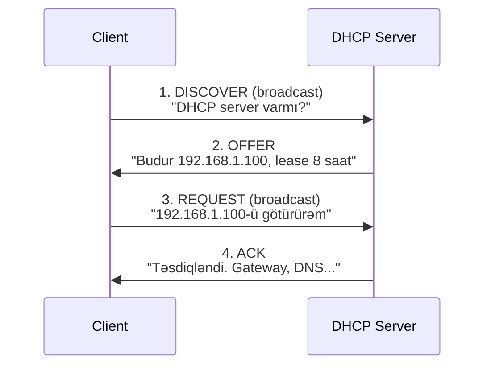

# DHCP (Dynamic Host Configuration Protocol)

DHCP şəbəkəyə qoşulan cihazlara IP konfiqurasiyasını avtomatik verir. DHCP olmasa hər cihazda IP, subnet mask, gateway və DNS ayarları əl ilə yazılmalıdır.

DHCP adətən bunları təmin edir:

- IP ünvanı
- subnet mask
- default gateway
- DNS server-lər
- DNS domain suffix

## DHCP necə işləyir: DORA

Klassik DHCPv4 axını çox vaxt **DORA** kimi izah olunur:



1. **Discover**: client DHCP server axtarmaq üçün broadcast göndərir
2. **Offer**: server IP və lease təklif edir
3. **Request**: client həmin təklifi seçdiyini bildirir
4. **Acknowledge**: server lease-i təsdiqləyir

Bu səbəbdən DHCP problemi çox vaxt daha yuxarı səviyyəli troubleshooting-dən əvvəl “ümumiyyətlə şəbəkəyə qoşula bilmirəm” kimi görünür.

## DHCPv4 və DHCPv6

| Mövzu | DHCPv4 | DHCPv6 |
| --- | --- | --- |
| Ünvan ailəsi | IPv4 | IPv6 |
| Standart transport | UDP 67/68 | UDP 546/547 |
| Reservation identifikatoru | MAC ünvanı | DUID |
| Windows failover dəstəyi | Var | Yoxdur |

IPv6 mühitində DHCPv6 yeganə mexanizm deyil; router advertisement və SLAAC da rol oynaya bilər.

## Scope nə edir?

**Scope** DHCP server-in müəyyən client qrupuna paylaya biləcəyi ünvan aralığını və seçimlərini təsvir edir.

Tipik IPv4 scope bunlardan ibarət olur:

- başlanğıc və son IP aralığı
- subnet mask
- statik cihazlar üçün exclusion-lar
- konkret client-lər üçün reservation-lar
- lease müddəti
- router və DNS kimi option-lar

## Ən çox istifadə olunan scope option-ları

| Option | Kod | Mənası |
| --- | --- | --- |
| Router | `003` | Default gateway |
| DNS Servers | `006` | Ad həlli üçün DNS server-lər |
| DNS Domain Name | `015` | DNS suffix / domain adı |

## Exclusion və reservation fərqi

Bu ikisi tez-tez qarışdırılır.

- **Exclusion**: müəyyən IP-ləri dinamik hovuzdan çıxarır
- **Reservation**: tanınmış bir client-ə həmişə eyni IP verilməsini təmin edir

Əl ilə konfiqurasiya etdiyiniz infrastruktur üçün exclusion, DHCP-nin yenə də idarə etməsini istədiyiniz sabit client-lər üçün reservation istifadə edin.

## Lease müddəti

Lease IP ünvanının müvəqqəti sahiblik müddətidir.

Qısa lease-lər qonaq və ya tez dəyişən lab şəbəkələrində faydalıdır. Uzun lease-lər isə sabit mühitlərdə DHCP yükünü azaldır.

## DHCP failover

Windows DHCP failover yalnız **DHCPv4** scope-ları üçün dayanıqlıq verir.

Ən çox istifadə olunan rejimlər:

| Rejim | Mənası |
| --- | --- |
| Hot Standby | Bir server əsasdır, partner əsasən gözləmə rejimindədir |
| Load Balance | İki server lease xidməti yükünü bölüşür |

Failover DHCP server offline olanda ünvan paylanmasını davam etdirməyə kömək edir, amma relay, DNS və VLAN planlamasını əvəz etmir.

## Əsas PowerShell nümunələri

Rolu quraşdır:

```powershell
Install-WindowsFeature DHCP -IncludeManagementTools
```

DHCP server-i Active Directory-də authorize et:

```powershell
Add-DhcpServerInDC -DnsName "dhcp.corp.az" -IPAddress 192.168.1.10
```

Yeni IPv4 scope yarat:

```powershell
Add-DhcpServerv4Scope `
  -Name "Ofis Şəbəkəsi" `
  -StartRange 192.168.1.100 `
  -EndRange 192.168.1.200 `
  -SubnetMask 255.255.255.0
```

Ən çox istifadə olunan option-ları təyin et:

```powershell
Set-DhcpServerv4OptionValue `
  -ScopeId 192.168.1.0 `
  -Router 192.168.1.1 `
  -DnsServer 192.168.1.5 `
  -DnsDomain "corp.az"
```

## Praktik nəticələr

- DHCP server-lərə statik IP verin
- production-dan əvvəl scope-ları sənədləşdirin
- exclusion və reservation məntiqini qarışdırmayın
- DHCP problemi çox vaxt “DNS işləmir” və ya “internet yoxdur” kimi görünə bilər
- relay, VLAN və scope sərhədlərini birlikdə düşünün

## Faydalı linklər

- DHCP quickstart: [https://learn.microsoft.com/en-us/windows-server/networking/technologies/dhcp/quickstart-install-configure-dhcp-server](https://learn.microsoft.com/en-us/windows-server/networking/technologies/dhcp/quickstart-install-configure-dhcp-server)
- DHCP scopes: [https://learn.microsoft.com/en-us/windows-server/networking/technologies/dhcp/dhcp-scopes](https://learn.microsoft.com/en-us/windows-server/networking/technologies/dhcp/dhcp-scopes)
- DHCP failover: [https://learn.microsoft.com/en-us/windows-server/networking/technologies/dhcp/dhcp-failover](https://learn.microsoft.com/en-us/windows-server/networking/technologies/dhcp/dhcp-failover)
