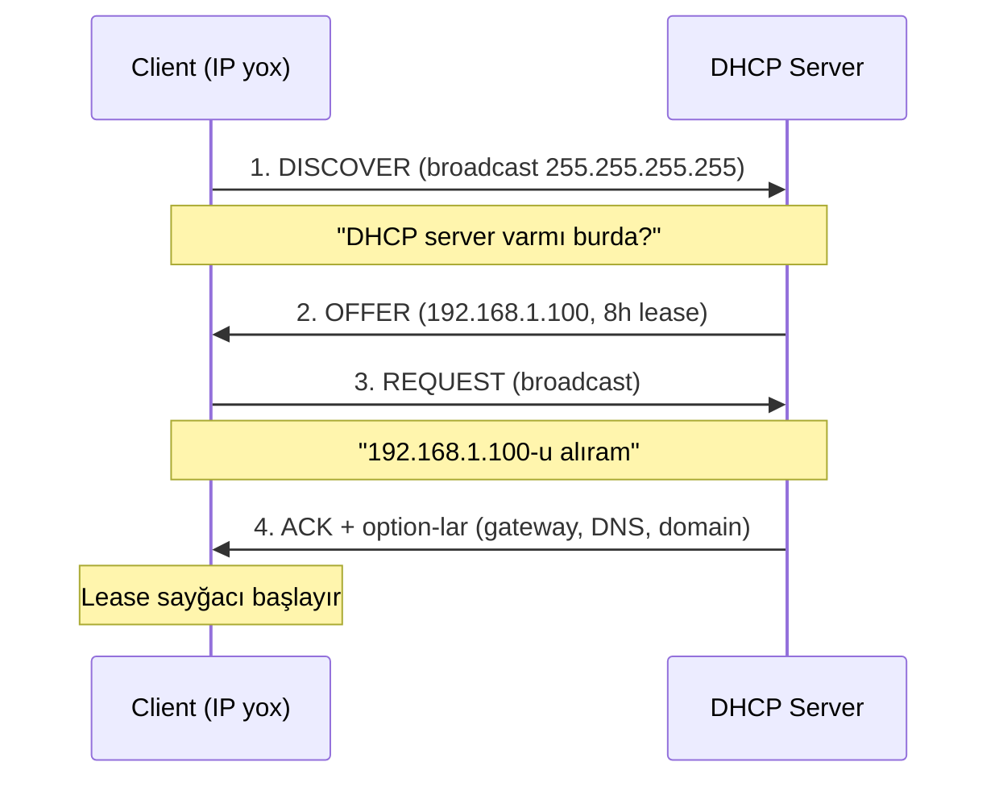

# DHCP (Dynamic Host Configuration Protocol)

**DHCP** şəbəkə cihazlarına IP ünvanını və ümumiyyətlə client-in ehtiyacı olan şəbəkə konfiqurasiyasını avtomatik paylayır. DHCP olmasa hər yeni kompüteri "IP, mask, gateway, DNS" kombinasiyası ilə əl ilə konfiqurasiya etmək lazımdır — böyük miqyasda həm çox vaxt alır, həm də IP conflict-lərin əsas səbəbi olur (iki host eyni IP-də, ikisi də işləmir).

DHCP **yalnız IP** vermir, həm də:

- **Subnet mask** — yerli şəbəkəni müəyyən edir
- **Default gateway** — xaricə çıxış üçün router
- **DNS server-lər** — adları həll edən server
- **DNS domain suffix** — məs. `example.local`
- **Lease müddəti** — IP-nin sənindir nə qədər
- **Əlavələr** — NTP, WINS (legacy), PXE boot, vendor-specific option-lar



## DORA — dörd addımlı handshake

Əsas prosesdir. Hər DHCP ilə alınan IP bu dörd paketdən keçir.

### D — Discover

Client-in hələ IP-si yoxdur, ona görə **broadcast** göndərir:

- Source IP: `0.0.0.0`
- Destination IP: `255.255.255.255`
- Portlar: UDP 67 (server) / UDP 68 (client)

### O — Offer

Server pool-undan boş bir IP seçib geri təklif edir. Offer içində mask, gateway, DNS və lease müddəti artıq var. Bir neçə DHCP server varsa, hər biri ayrı Offer göndərir — client adətən ilk gələni qəbul edir.

### R — Request

Client yenə broadcast göndərir ("192.168.1.100-u alıram"). Niyə unicast yox, broadcast? Ona görə ki, offer göndərmiş *digər* server-lər də görsün ki, client başqa server-i seçib və öz tentative reservation-ını buraxsın.

### A — Acknowledge

Server lease-i rəsmiləşdirir. Client IP-ni istifadə etməyə başlayır və lease sayğacı işə düşür.

## Lease — IP icarəyə verilir, sahiblənmir

Lease-in sayğacı və iki yenilənmə nöqtəsi var:

```
0%                50%               87.5%            100%
|--- Lease başla --|--- T1 renew ----|--- T2 rebind --|-- Lease bitdi --|
```

- **T1 (50%)** — client **eyni** server ilə lease-i yeniləməyə çalışır (unicast).
- **T2 (87.5%)** — əvvəlki server cavab vermədisə, client broadcast göndərir ki, **hər hansı** DHCP server devralsın.
- **100%** — heç kim cavab vermədi, IP buraxılır və client DORA-nı sıfırdan başlayır. Yeni lease alınana qədər şəbəkə əlaqəsi düşür.

Lease nə qədər olmalıdır?

| Mühit | Lease | Niyə |
|---|---|---|
| Ofis desktopu | 8 gün | Sabit endpoint, az dəyişmə |
| WiFi / guest | 4–8 saat | Cihazlar gəlir-gedir |
| Otel / kafe | 1–2 saat | Çox qısa istifadə |
| Lab / sinif | 8 saat | Hər gün yeni adam |
| Server / data-centre | 12–24 saat (və ya reservation) | Sabitdir, reservation üstünlüklüdür |

Qısa lease → pool tez yenilənir, çox DHCP trafik. Uzun lease → itmiş client-lərin IP-si uzun müddət "tutulur".

## Əsas anlayışlar

### Scope

**Scope** — DHCP server-in bir subnet üzrə paylaya bildiyi IP aralığıdır:

```
Scope: Example-Network
    Start:  192.168.1.100
    End:    192.168.1.200
    Mask:   255.255.255.0
    = 101 istifadəyə yararlı ünvan
```

Bir DHCP server-də bir neçə scope ola bilər — hər subnet üçün ayrı.

### Exclusion range

Scope *daxilində* DHCP-nin **paylamaması lazım olan** ünvanlar — adətən əl ilə konfiqurasiya etdiyiniz cihazlara (server, switch, printer) saxlanılır.

```
Scope:      192.168.1.100 — 192.168.1.200
Exclusion:  192.168.1.150 — 192.168.1.160
Nəticə:     DHCP .100–.149 və .161–.200 paylayır; .150–.160 əl istifadəsi üçün boş qalır.
```

### Reservation

Reservation DHCP-yə deyir ki, "bu MAC həmişə bu IP-ni alır". Cihaz hələ də DHCP client-dir — sadəcə həmişə eyni lease-i alır.

```
Reservation: Printer-Floor1
    IP:  192.168.1.101
    MAC: AA-BB-CC-DD-EE-FF
```

Reservation vs static IP: reservation DHCP-də mərkəzi idarə olunur, bir console-dan hamısını görüb dəyişə bilərsiniz. Static IP cihazın öz üstündədir, başqa heç kim bilmir. **Reservation demək olar həmişə üstündür.**

### DHCP option-ları

Option-lar IP-dən *əlavə* hər şeyi daşıyır. Reallıqda təyin edəcəyiniz olanlar:

| Kod | Ad | Nümunə |
|---|---|---|
| 003 | Router (gateway) | 192.168.1.1 |
| 006 | DNS server | 10.0.0.4 |
| 015 | DNS domain | example.local |
| 044 | WINS / NBNS | (legacy) |
| 046 | NetBIOS node type | 0x8 (H-node) |
| 051 | Lease müddəti | 28800 s (8 s) |
| 066 | Boot server host | PXE |
| 067 | Bootfile name | PXE |

Option-lar üç səviyyədə təyin oluna bilər, daha spesifik olanı qalib gəlir:

**Reservation > Scope > Server**

### Superscope

Eyni fiziki seqmentdə bir neçə scope-u bir yerə yığan konteynerdir (bir LAN-da bir neçə subnet). Nadirdir, amma tanımaq lazımdır.

### DHCP relay / IP helper

DHCP Discover broadcast-dır, broadcast isə router-dən keçmir. Server başqa subnet-dədirsə, router-də **DHCP relay agent** (Cisco-da `ip helper-address`) lazımdır ki, broadcast-ı DHCP server-ə unicast kimi ötürsün:

```
Subnet A 192.168.1.0/24          Router              Subnet B 192.168.2.0/24
   Client  ── broadcast ──▶   Relay agent   ── unicast ──▶  DHCP server
                               ip helper-address 192.168.2.10
```

Düz lab-da hamı eyni subnet-dədir, bu görünmür — amma real mühitdə vacibdir.

## DHCP rolunun quraşdırılması

### Azure məhdudiyyəti

Azure VM-i digər VM-lər üçün DHCP server ola bilmir — Azure fabric DHCP-ni özü idarə edir və trafiki bloklayır. Rolu quraşdırıb scope-ları konfiqurasiya edə bilərsiniz, amma lease-lər real client-lərə getməyəcək. Tam axın üçün Hyper-V, VirtualBox və ya VMware istifadə edin.

### GUI ilə

1. **Server Manager** → **Manage** → **Add Roles and Features**.
2. **Role-based or feature-based installation** → server-i seç.
3. **Server Roles** → **DHCP Server** işarələ → lazımi feature popup-ını **Add Features** et.
4. Wizard-ı bitir və quraşdırmanı gözlə.
5. Post-install xəbərdarlığında **Complete DHCP configuration** kliklə.
6. Açılan wizard-da server-i admin credentials ilə AD-də authorize et → **Commit**.

**AD authorization niyə vacibdir?** Authorization olmasa, hər kəs şəbəkəyə öz DHCP server-ini ("rogue DHCP") qoşub client-lərə yanlış gateway və DNS verə bilər və trafiki öz üstündən keçirə bilər (klassik MITM). Domain-joined Windows DHCP server AD-dəki authorized siyahısında olmasa lease paylamır.

### PowerShell ilə

```powershell
# Quraşdırma
Install-WindowsFeature DHCP -IncludeManagementTools

# Post-install: DHCP-nin istifadə etdiyi security group-ları yarat
netsh dhcp add securitygroups

# AD-də authorize et
Add-DhcpServerInDC `
    -DnsName   "dc01.example.local" `
    -IPAddress 10.0.0.4

# Qrup üzvlüyü təsirli olması üçün xidməti restart et
Restart-Service dhcpserver

# Server Manager-dəki "pending configuration" bayrağını təmizlə
Set-ItemProperty `
    -Path "HKLM:\SOFTWARE\Microsoft\ServerManager\Roles\12" `
    -Name "ConfigurationState" -Value 2
```

## DHCP konsolu

**Server Manager** → **Tools** → **DHCP** (və ya `dhcpmgmt.msc`) aç. Ağac:

```
DHCP
└── dc01.example.local
    ├── IPv4
    │   ├── Server Options         Bütün scope-lara tətbiq olunan option-lar
    │   ├── Scope [192.168.1.0]    Müəyyən scope
    │   │   ├── Address Pool       Aralık + exclusion-lar
    │   │   ├── Address Leases     Hazırda kim hansı IP-dədir
    │   │   ├── Reservations       MAC-bağlı sabit IP-lər
    │   │   ├── Scope Options      Yalnız bu scope-a aid option-lar
    │   │   └── Policies           Scope səviyyəsi policy-lər
    │   ├── Policies               Server səviyyəsi policy-lər
    │   └── Filters
    │       ├── Allow              MAC allow-list
    │       └── Deny               MAC deny-list
    └── IPv6                       DHCPv6 (SMB-də nadir)
```

## Scope yaratmaq

### GUI ilə

**DHCP** → **IPv4**-ə sağ klik → **New Scope…**. Addımlar:

- **Name**: `Example-Network`.
- **IP address range**: start `192.168.1.100`, end `192.168.1.200`, mask `255.255.255.0`.
- **Exclusions**: `192.168.1.150 – 192.168.1.160` infrastructure üçün.
- **Lease duration**: 8 saat (lab) və ya 8 gün (ofis).
- **Configure options now** → Yes.
- **Router**: `192.168.1.1`.
- **DNS**: parent domain `example.local`, server `dc01.example.local` → **Resolve** → **Add**.
- **WINS**: skip.
- **Activate scope**: yes → **Finish**.

### PowerShell ilə

```powershell
# Scope
Add-DhcpServerv4Scope `
    -Name          "Example-Network" `
    -StartRange    192.168.1.100 `
    -EndRange      192.168.1.200 `
    -SubnetMask    255.255.255.0 `
    -LeaseDuration 0.08:00:00 `
    -Description   "Example kampüs DHCP scope" `
    -State         Active

# Exclusion
Add-DhcpServerv4ExclusionRange `
    -ScopeId    192.168.1.0 `
    -StartRange 192.168.1.150 `
    -EndRange   192.168.1.160

# Gateway
Set-DhcpServerv4OptionValue `
    -ScopeId 192.168.1.0 `
    -Router  192.168.1.1

# DNS + domain
Set-DhcpServerv4OptionValue `
    -ScopeId   192.168.1.0 `
    -DnsServer 10.0.0.4 `
    -DnsDomain "example.local"
```

## Reservation-lar

Reservation üçün yaxşı adaylar:

- printer — user-lər IP ilə konfiqurasiya edir
- DHCP istifadə edən server (nadir, amma olur)
- IP kamera, access point, VoIP telefonlar
- bilinən ünvanda həmişə tapılmalı hər şey

Əvvəl client-in MAC-ını götür:

```powershell
ipconfig /all    # "Physical Address" bölməsinə bax
```

### GUI ilə

Scope → **Reservations**-a sağ klik → **New Reservation…**:

- Name: `Printer-Floor1`
- IP: `192.168.1.101`
- MAC: `AA-BB-CC-DD-EE-FF` (tire ilə və ya tiresiz — hər ikisi işləyir)
- Supported types: **Both** (DHCP + BOOTP)

### PowerShell ilə

```powershell
Add-DhcpServerv4Reservation `
    -ScopeId     192.168.1.0 `
    -IPAddress   192.168.1.101 `
    -ClientId    "AA-BB-CC-DD-EE-FF" `
    -Name        "Printer-Floor1" `
    -Description "1-ci mərtəbə HP LaserJet"

# Reservation-a xüsusi option
Set-DhcpServerv4OptionValue `
    -ReservedIP 192.168.1.101 `
    -DnsServer  10.0.0.4 `
    -Router     192.168.1.1
```

## MAC filtrləmə

DHCP-nin iki filter siyahısı var:

- **Deny** — bu MAC-lar heç vaxt lease almır.
- **Allow** — *yalnız* bu MAC-lar lease ala bilər (sərt allow-list).

```powershell
Add-DhcpServerv4Filter -MacAddress "BB-CC-DD-EE-FF-00" -List Deny  -Description "İcazəsiz cihaz"
Add-DhcpServerv4Filter -MacAddress "AA-BB-CC-DD-EE-FF" -List Allow -Description "Təsdiqlənmiş printer"

Get-DhcpServerv4Filter -List Deny
Get-DhcpServerv4Filter -List Allow
```

**Allow** siyahısını aktiv etmək sərt kilidləmədir — siyahıda olmayan hər şey lease almır, unutduğunuz laptoplar da daxil. Ehtiyatla istifadə edin.

## Failover

Tək DHCP server tək nöqtəli nasazlıqdır — çökəndə kimsə yeni lease ala bilmir. **DHCP failover** eyni scope(lar)-da iki server işlətmək üçündür.

İki rejim:

| Rejim | Davranış |
|---|---|
| **Hot Standby** | Biri primary, biri passive. Partner primary düşəndə devralır. Sadə. |
| **Load Balance** | Hər iki server eyni anda cavab verir (default 50/50). Daha performanslı. |

Konfiqurasiya: console-da scope-a sağ klik → **Configure Failover…** → partner server və rejimi seç.

Failover Windows-da yalnız IPv4-dür; DHCPv6 dəstəkləmir.

## Monitorinq

### Lease-lər

```powershell
# Scope-dakı bütün aktiv lease-lər
Get-DhcpServerv4Lease -ScopeId 192.168.1.0 |
    Select-Object IPAddress, HostName, ClientId, LeaseExpiryTime |
    Format-Table -AutoSize

# Spesifik host tap
Get-DhcpServerv4Lease -ScopeId 192.168.1.0 |
    Where-Object { $_.HostName -like "*ws01*" }
```

### Statistika

```powershell
Get-DhcpServerv4Statistics
Get-DhcpServerv4ScopeStatistics -ScopeId 192.168.1.0
```

Və ya console: **IPv4**-ə sağ klik → **Display Statistics**. Baxacağınız rəqəmlər **In Use** və **Percentage In Use** — 90%+ olub artırsa, client-lər lease almamağa başlamadan scope-u genişləndirin.

### Audit log

DHCP hər həftə günü üçün rolling log yazır — `C:\Windows\System32\dhcp\` altında `DhcpSrvLog-Mon.log`, `DhcpSrvLog-Tue.log` və s.

```powershell
Get-Content "C:\Windows\System32\dhcp\DhcpSrvLog-$(Get-Date -Format 'ddd').log" -Tail 50
```

Əsas event ID-lər:

| ID | Mənası |
|---|---|
| 10 | Yeni lease verildi |
| 11 | Lease yeniləndi |
| 12 | Client release etdi |
| 13 | Lease vaxtı doldu |
| 15 | MAC filter-ə görə rədd |
| 20 | BOOTP request |
| 30+ | DNS update hadisələri |

## Client tərəfi troubleshooting

```powershell
ipconfig /release    # mövcud lease-i burax
ipconfig /renew      # DHCP-dən yenisini istə
ipconfig /all        # tam network məlumatı + DHCP server IP-si
```

Client lease almırsa, ardıcıllıqla keç:

1. DHCP xidməti işləyir?  `Get-Service dhcpserver`
2. Scope aktivdir? (console-da yaşıl ⬆ olmalıdır)
3. Pool dolub? Statistikaya bax.
4. Windows firewall UDP 67/68 bloklayır?
5. Server AD-də hələ authorized-dir?  `Get-DhcpServerInDC`
6. Client-də **169.254.x.x** ünvanı var?

### APIPA — "169.254" göstəricisi

Windows client heç bir DHCP server-ə çata bilmirsə, özünə random **169.254.x.x / 16** ünvanı təyin edir (Automatic Private IP Addressing). Eyni LAN-dakı digər APIPA host-ları ilə danışa bilər, amma gateway və DNS olmadığı üçün xaricdə heç nə işləmir. Client-də `169.254.*` görmək = həmin client üçün DHCP sınıb (server düşüb, relay səhvdir, port 67 bloklanıb, kabel çıxıb, VLAN səhvdir).

## Backup və restore

DHCP-nin Windows Server Backup-dan ayrı öz backup-ı var.

```powershell
# Tam backup (qovluq)
Backup-DhcpServer  -Path "C:\DHCP-Backup"

# XML-ə export (database + opsional aktiv lease-lər)
Export-DhcpServer  -File "C:\DHCP-Backup\dhcp-export.xml" -Leases

# Yerində restore
Restore-DhcpServer -Path "C:\DHCP-Backup"

# XML-dən import (əvvəl təhlükəsizlik backup-ı götürür)
Import-DhcpServer  -File       "C:\DHCP-Backup\dhcp-export.xml" `
                   -Leases `
                   -BackupPath "C:\DHCP-Backup-Before-Import"
```

Xidmət hər 60 dəqiqədən bir `C:\Windows\System32\dhcp\backup\` qovluğuna avtomatik backup götürür. Bu intervali dəyişmək üçün:

```powershell
Set-ItemProperty `
    -Path  "HKLM:\SYSTEM\CurrentControlSet\Services\DHCPServer\Parameters" `
    -Name  "BackupInterval" `
    -Value 30    # dəqiqə
```

## DHCP + DNS inteqrasiyası

DHCP lease verəndə client-in A və PTR record-unu DNS-də avtomatik qeydiyyata ala bilər — beləliklə hər yeni laptop user əl vurmadan ad ilə resolve olunur.

### Dynamic update konfiqurasiyası

**DHCP** → **IPv4**-ə sağ klik → **Properties** → **DNS** tab:

- **Enable DNS dynamic updates according to the settings below** — açıq.
- **Dynamically update DNS records only if requested by the DHCP clients** — default, tövsiyə olunan.
- **Discard A and PTR records when lease is deleted** — açıq, ki DNS təmiz qalsın.
- **Dynamically update DNS records for DHCP clients that do not request updates** — yalnız çox köhnə (Windows 2000-vari) client-lər üçün.

PowerShell ilə:

```powershell
Set-DhcpServerv4DnsSetting `
    -DynamicUpdates            "Always" `
    -DeleteDnsRROnLeaseExpiry  $true
```

Bunu DNS server-də **DNS scavenging** ilə cütləşdirin — scavenging olmasa köhnə record-lar əbədi qalır. DNS Manager → server **Properties** → **Advanced** → *"Enable automatic scavenging of stale records"*-i 7 gün periodu ilə aktivləşdirin.

## DHCPv4 vs DHCPv6

| Mövzu | DHCPv4 | DHCPv6 |
|---|---|---|
| Ünvan ailəsi | IPv4 | IPv6 |
| Transport | UDP 67/68 | UDP 546/547 |
| Reservation identifikatoru | MAC | DUID |
| Windows failover | Var | Yox |
| Adətən cütləşir | Heç nə | Router Advertisements, SLAAC |

Təmiz IPv6 şəbəkələrində DHCPv6 yalnız bir parçadır — Router Advertisement və SLAAC çox vaxt ünvan paylaşmasını öz üzərinə götürür, DHCPv6 yalnız DNS/domain info verir ("stateless DHCPv6"). İkisini birlikdə planlamaq lazımdır.

## PowerShell cheat sheet

```powershell
# --- Quraşdırma ---
Install-WindowsFeature DHCP -IncludeManagementTools
Add-DhcpServerInDC -DnsName "dc01.example.local" -IPAddress 10.0.0.4

# --- Scope ---
Add-DhcpServerv4Scope -Name "Ad" -StartRange 192.168.1.100 -EndRange 192.168.1.200 -SubnetMask 255.255.255.0 -LeaseDuration 0.08:00:00 -State Active
Get-DhcpServerv4Scope
Remove-DhcpServerv4Scope -ScopeId 192.168.1.0 -Force

# --- Exclusion-lar ---
Add-DhcpServerv4ExclusionRange    -ScopeId 192.168.1.0 -StartRange 192.168.1.150 -EndRange 192.168.1.160
Get-DhcpServerv4ExclusionRange    -ScopeId 192.168.1.0
Remove-DhcpServerv4ExclusionRange -ScopeId 192.168.1.0 -StartRange 192.168.1.150 -EndRange 192.168.1.160

# --- Option-lar ---
Set-DhcpServerv4OptionValue -ScopeId 192.168.1.0 -Router 192.168.1.1
Set-DhcpServerv4OptionValue -ScopeId 192.168.1.0 -DnsServer 10.0.0.4 -DnsDomain "example.local"
Get-DhcpServerv4OptionValue -ScopeId 192.168.1.0

# --- Reservation-lar ---
Add-DhcpServerv4Reservation  -ScopeId 192.168.1.0 -IPAddress 192.168.1.101 -ClientId "AA-BB-CC-DD-EE-FF" -Name "Printer"
Get-DhcpServerv4Reservation  -ScopeId 192.168.1.0
Remove-DhcpServerv4Reservation -ScopeId 192.168.1.0 -ClientId "AA-BB-CC-DD-EE-FF"

# --- Lease / stat ---
Get-DhcpServerv4Lease           -ScopeId 192.168.1.0
Get-DhcpServerv4Statistics
Get-DhcpServerv4ScopeStatistics -ScopeId 192.168.1.0

# --- Filter ---
Add-DhcpServerv4Filter -MacAddress "BB-CC-DD-EE-FF-00" -List Deny
Get-DhcpServerv4Filter

# --- Backup / restore ---
Backup-DhcpServer  -Path "C:\DHCP-Backup"
Restore-DhcpServer -Path "C:\DHCP-Backup"
Export-DhcpServer  -File "C:\dhcp-export.xml" -Leases
Import-DhcpServer  -File "C:\dhcp-export.xml" -Leases

# --- Client tərəfi ---
ipconfig /release
ipconfig /renew
ipconfig /all

# --- Sağlamlıq ---
Get-Service      dhcpserver
Get-DhcpServerInDC
Test-Connection  192.168.1.1
```

## Praktiki nəticələr

- DHCP server-lərin özünə static IP verin. Bir-birindən DHCP almasınlar.
- Hər scope, exclusion və reservation-ı sənədləşdirin — sənədləşdirilməmiş static IP conflict-lərin gizləndiyi yerdir.
- Printer və cihazlar üçün reservation static-dən üstündür. Mərkəzi görünüş, mərkəzi dəyişiklik.
- DHCP problemləri adətən əvvəl "DNS pozulub" və ya "internet yoxdur" kimi görünür. `169.254.*`-i erkən yoxlayın.
- DHCP server-i AD-də authorize edin — rogue DHCP ilə sizin aranızda qalan yeganə şeydir.
- Production-da failover işlədin. Hot Standby yaxşıdır, iki server sağlamdırsa Load Balance daha yaxşıdır.
- DNS dynamic update-i açın, DNS scavenging-i açın. Köhnə record-lar aylarla sonra zərər vurur.
- Lease uzunluğunu mühitin nə qədər tez dəyişdiyinə görə plan edin, yuvarlaq rəqəmə görə yox.
