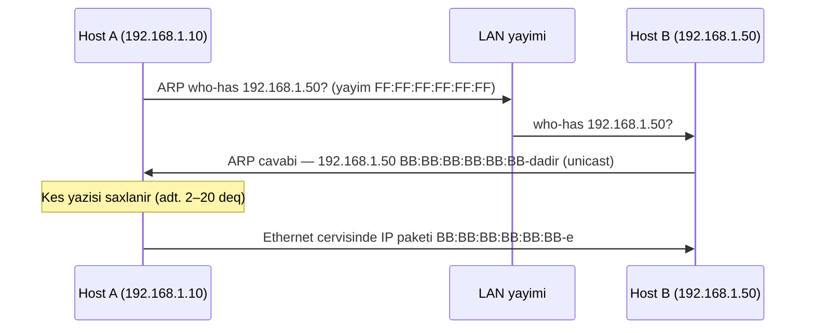

# Ethernet ve ARP

## Niye bu vacibdir

Toxunacaginiz her simli LAN **Ethernet** uzerinde isleyir, ve masinindan cixan her IP paketi kabele dusmemisden once Ethernet cercivinin icine sarinir. Ethernet hersi altda dayanan dosemedir — TCP, HTTP, TLS, DNS, sizin VPN tuneliniz — ve o pis davrananda, ondan yuxaridaki her lay da pis davranir. Yanip-sonen switch portu, dublikat MAC, sehv qonfiqurasiya olunmus VLAN, yarim-dupleks uygunsuzlugu: hamisi "tetbiq yavasdir" kimi gorunur, ta ki L2 sayqaclarini oxuyub problemin hec vaxt tetbiqde olmadigini basa dusene qeder.

**ARP** (Address Resolution Protocol) [Internet layi](./tcp-ip-model.md) ile [Verilenler Linki layi](./osi-model.md) arasinda kicik, qedim yapisdirici parcasidir. Kernel teyinat IP-ni bilir. Switch yalniz MAC-lari basa dusur. ARP bu ikisi arasinda korpu yaradir — lokal seqmentde "kim bu IP-yi var?" deye yayim edir ve kim cavab verirse ona inanir. Bu inam hem de **ARP spoofinq**-in bugun de aktiv istifadede olan en qedim hucumlardan biri olmasinin sebebidir: VLAN-inizdaki istenilen ziyanverici host gateway oldugunu iddia edib uzerinden kecen her sohbeti seskuz man-in-the-middle ede biler. Layer 2-ni basa dusmursenize, onu mudafie ede bilmezsiniz — ve pen-testerler, SOC analitikleri ve sebeke muhendisleri hami burada yasayir.

## MAC unvanlari

Her sebeke interfeysinin zavodda yandirilmis 48-bitlik **MAC unvani** var, iki nokte ve ya defisle ayrilmis alti hex cuti seklinde yazilir: `AA:BB:CC:DD:EE:FF`. Ilk uc oktet **OUI** (Organizationally Unique Identifier) olub satici musteyyenler — `00:50:56` VMware-dir, `F4:5C:89` Apple-dir, `00:1A:11` Google-dir, `00:0C:29` da VMware-dir. Sonuncu uc oktet saticinin oz interfeyse aid seriya nomresidir. IEEE OUI reyestrini saxlayir; `wireshark`, `arp-scan` kimi axtaris aletleri ve ya onlayn MA-L reyestri sizen istenilen NIC-i kimin hazirladigini soyleyecek.

Cox ilk oktetdeki iki bit menasi dasiyir. **En az ehemiyyetli bit** (multicast biti) unvani unicast (`0`) ve ya qrup/multicast (`1`) kimi qeyd edir; broadcast unvani `FF:FF:FF:FF:FF:FF` butun-birler haqqinda halidir. **Ikinci en az ehemiyyetli bit** unvani qlobal unikal (`0`, fabrikden gelmis unvan) ve ya lokal idare olunan (`1`, ES terefinden teyin olunmus unvan — virtual interfeyslerde, konteyner sebekelerinde ve Wi-Fi MAC tesadufilesdirmesinde adi haldir) kimi qeyd edir. `02`, `06`, `0A` ve ya `0E` ile baslayan MAC gorunende o lokal idare olunandir, satici tayin etmemisdir.

MAC yalniz **tek bir broadcast domeni icinde** menalidir. Cerciv marsrutlasdiricidan kecdiyi an, original L2 basligi soyulur ve marsrutlasdiricinin MAC-i menbe olaraq yeni basliq qurulur. ARP keserasinizde uzaq serverin MAC-ini hec vaxt gormursunuz — yalniz default gateway-in MAC-ini. Bu xususiyyet niye genis miqyasli MAC-esasli filtirlemenin ilk hop-dan sonra islemediyini, ve niye "8.8.8.8 unvaninin MAC-i" menali sual olmadigini izah edir.

## Ethernet cercivi

Konseptuel olaraq, modern LAN-da her Ethernet II cervisi bele gorunur:

```
┌───────────────┬───────────────┬─────────┬───────────────┬─────┐
│ Dest MAC (6B) │ Src MAC (6B)  │ Type(2B)│ Payload (IP…) │ FCS │
└───────────────┴───────────────┴─────────┴───────────────┴─────┘
```

Sahelarin qisa izahi:

- **Teyinat MAC (6 bayt)** — switch bu cervisi hansi NIC-e catdirmalidir. `FF:FF:FF:FF:FF:FF` broadcast (VLAN-daki her port), multicast unvani qrup, basqasi unicast deyir.
- **Menbe MAC (6 bayt)** — gondericinin NIC-i. Switch bunu oxuyur ve oz CAM cedveli ucun "MAC X port Y-da yasayir" oyrenir.
- **EtherType (2 bayt)** — payload-da ne var. `0x0800` IPv4-dur, `0x86DD` IPv6-dur, `0x0806` ARP-dir, `0x8100` 802.1Q VLAN tegidir (sonra icinde basqa EtherType dasiyir).
- **Payload (46–1500 bayt)** — inkapsulyasiya olunmus yuxari-lay paketi. 1500-baytliq limit klassik **MTU**-dur; jumbo cervilar onu data-merkezlerinde 9000-e cixarir.
- **FCS (4 bayt)** — Frame Check Sequence, cervinin qalanindan gotrulmus CRC32. Ferqli CRC hesablayan qebuledici cervisi seskuz atir; zerari yalniz interfeysde qalxan **CRC error** sayqaclari kimi gorursunuz.

Wireshark butun bu sahelarin her birini oz `Ethernet II` bolmesinde gosterir. Pakete baxiramsanizsa ve onun teyinat MAC-i ile EtherType-na isare ede bilmirsenize, yavaslayin ve onlari tapin.

## Hub-lar switch-lere qarsi

| Cihaz | OSI lay | Otururduyu qerar | Toqqusma domeni | Tehlukesizlik tesiri |
|---|---|---|---|---|
| **Hub** | 1 (Fiziki) | Her biti diger her porta tekrarlayir | Hub bashi bir | Qosulan herkes hersi sniff ede biler |
| **Switch** | 2 (Verilenler Linki) | CAM cedvelinde dest MAC-i tapir, yalniz duzgun porta otururduyur | Port bashi bir | Cervilar oz teyinatina izole olunur |

**Hub** elektriki olaraq tek paylasilmis sim olub coxlu portlar kimi davranir — bir porta gelen her bit diger her portan geri gedir. Bu butun hub-i bir toqqusma domeni edir (yalniz bir cihaz oturur), bir broadcast domeni edir (her sey broadcast olur), ve bir nehe dinleme alati edir (istenilen port sebekeye toxunmadan diger her portun trafiqini sniff ede biler). Hub-lar 1990-larin sonunda normal idi; bugun onlar kohnelmisdir ve real sebekede hec vaxt gorulmemelidir.

**Switch** ise oyrenir. Port 3-de gelen `AA:...` MAC-li cervisi ilk defe gorende, oz **CAM cedvelinde** (MAC unvan cedveli de adlanir) `AA:... → port 3` yazir. Sonraki defe `AA:...` ucun teyinatlanan cerciv gelende, switch onu yalniz port 3-e otururduyur — sebekenin qalani cervisi hec gormur. Bu daha suretldir, minlerle porta uygundur ve tehlukesizlik ucun cox daha yaxsidir: artiq sizin olmayan trafiqi gormek ucun port-mirror edilmis span port lazimdir. Modern sebekede hub gorsenize, onu deyismek ilk islahatdir.

## Broadcast domeni ve VLAN-lar

**Broadcast domeni** bir-birinin yayimlarini qebul eden cihazlar destedir — ARP who-has, DHCP Discover, NetBIOS ad elanlari, gratuitous ARP ve s. VLAN konfiqurasiyasiz switch bir boyuk broadcast domenidir: her portdaki her host her yayimi esidir. Bu bir nece on cihaz ucun normal isleyir ve bir nece yuz cihazda dagilmaga baslayir, broadcast trafiqi simin ehemiyyetli hissesini tutur ve istenilen kompromise olunmus host her ARP mubadilesini esidir.

**VLAN** (Virtual LAN, IEEE 802.1Q) tek fiziki switch-i bir nece mentiqi switch-e bolur. Her VLAN oz broadcast domenidir — VLAN 10-dakl host-lar VLAN 20-deki host-larla Layer 2-de hec danisa bilmez. VLAN-lari kecmek ucun trafik marsrutlasdirici ve ya Layer-3 switch-e qaldirilmalidir, orada ACL, brandmauer qaydalari, ve ya derin yoxlama tetbiq edile biler. 802.1Q Ethernet basligina 12-bitlik VLAN ID (1–4094) dasiyan 4-baytliq **VLAN teqi** elave edir. Switch portlari iki novde gelir: **access port** bir VLAN-a aiddir ve teqsiz cervilar dasiyir; **trunk port** coxlu VLAN-lar ucun teqlenmis cervilar dasiyir (adeten switch-ler arasinda ve ya hipervizora). VLAN-lar ile printerleri, kameralari, qonaqlari, serverleri ve istifadeci noutbuklarini ayni fiziki infrastrukturda ayri saxlayirsiniz — fundamental seqmentasiya nezareti. Marsrutlasdiricilar ve L3 switch-lerin VLAN-arasi siyaseti nece tetbiq etdiyi ucun [Sebeke Cihazlari](./network-devices.md)-na baxin.

## ARP — Address Resolution Protocol

Teyinatin IP-sini bilirsiniz. Qarsindaki switch yalniz MAC-lari basa dusur. **ARP** (RFC 826) bu fasileni baglayan kicik protokoldur. O bilavasite Ethernet uzerinde isleyir (EtherType `0x0806`) — IP icinde dasinmir, niye bunun TTL-i yoxdur ve marsrutlasdiricidan kece bilmez.

Host A ayni alt-sebekedeki `192.168.1.50`-ye paket gondermek isteyir ve onun MAC-ini bilmir, o ARP sorgusu **yayimlayir**: "Kim 192.168.1.50-yi var? Mene de." Cervinin teyinat MAC-i `FF:FF:FF:FF:FF:FF`, beleli LAN-daki her host onu qebul edir. `.50`-nin sahibi A-nin MAC-ine birbasa ARP cavabi ile cavab verir: "192.168.1.50 `BB:BB:BB:BB:BB:BB`-dadir." A xeritileme bir nece deqiqe (adeten 2–20) oz **ARP kesi**-nde yazir ve sonra IP paketini hemin MAC-e Ethernet cervisi icinde gonderir.

**Gratuitous ARP** (GARP) hostun oz IP-MAC xeritisini elan etmek ucun *istenilmemis* gonderdiyi ARP paketidir. O qanuni olaraq interfeys aktivlasende, IP host-lar arasinda kockunde (failover, VRRP, keepalived), ve ya VM hipervizorlar arasinda kockunde istifade olunur — seqmentdeki diger her host oz ARP kesini yenileyir ve yeni MAC-e gondermeye baslayir. O hem de ARP spoofinq-in esas mexanizmidir, cunki kim IP iddia ede bilecyi haqqinda autentifikasiya yoxdur.

ARP kesi kerneldede yasayir; istenilen emeliyyat sisteminde oxuya bilersiniz:

```powershell
# Windows — ARP kesini gostermek
arp -a
```

```bash
# Linux — modern
ip neigh show

# Linux — kohne
arp -n
```

## ARP sorgu/cavab diaqrami



Iki detal qeyd etmeye deyer. Birinci, sorgu yayimdir amma cavab unicast-dir — cavab veren artiq A-nin MAC-ini bilir cunki o sorgunun menbe sahesinde idi. Ikinci, sorgunu esiden her host A-nin IP-MAC xeritisini de pulsuz oyrenir — ARP coxsu stack-de "promiscuously cached"-dur, bu effektivdir amma hem de ARP zeherlemesinin seqment uzre nec asanlikla genislendiyinin sebebidir.

## ARP spoofinq / zeherlemesi

ARP-in **autentifikasiyasi yoxdur**. LAN-daki istenilen host istediyi IP olduygunu iddia eden ARP cavabi, gratuitous ARP, ve ya istenilmeyen yenileme gondere biler — ve onu esiden diger her host oz kesini sezenle uzerine yazacaq. Klassik hucum:

1. LAN-daki hucumcu qurbana gateway-in (192.168.1.1) MENIM-MAC-imdadir iddia eden gratuitous ARP axini gonderir.
2. Qurbanin ARP kesi indi gateway IP-ni hucumcunun MAC-ine isare edir.
3. Hucumcu gateway-e qurbanin MENIM-MAC-imdadir iddia eden oxsar axin gonderir.
4. Her iki teref indi trafiqini hucumcuya gonderir, o ise onu sniff ederek, modifikasiya ederek, mumkun olduqda TLS-i asagi-saliderek (man-in-the-middle) iletir.

`arpspoof`, `ettercap` ve `bettercap` kimi aletler butun ardicilligi avtomatlasdirir. Hucum seqmentdeki her sifrelenmemis protokola qarsi isleyir ve "her yerde sifrelenme" yegane davamli mudafidir bunun sebebidir — link layina inana bilmezsiniz.

Mudafi yollari, gucden cox-az tertibinde:

- **Hersi ucdan-uca sifreleyin.** TLS, SSH, IPsec, WireGuard. Hucumcu yalniz sifreliyi gorurse, MITM trafik analizine endirmis olur. Bu tamamen dusman L2-ye davam eden yegane mudafidir.
- **Idare olunan switch-lerde Dynamic ARP Inspection (DAI).** Switch her ARP paketini etibarli DHCP snooping baglama cedveline qarsi yoxlayir ve uygun olmayanlari atir. Bu korporativ sebekelerde standart yumsaltmadir.
- **Switch-de port security** — port bashi icaze verilen MAC sayini limit edin, birincisini "sticky" oyrenin, ikincisi gorunse portu bagayin. Adi MAC dasmasini ve quldur cihazlari dayandirir.
- **Tenqidi hostlar (gateway, DNS server) ucun statik ARP yazilari.** Kicik miqyasda effektivdir, istenilen olcude saxlamaq agirdir.
- **VLAN ile sebeke seqmentasiyasi.** Daha kicik broadcast domeni hucumcunun bir mevqeden zeherleye bileceyi daha az host demekdir.
- **Askarlanma** — tanidigli IP qefilden yeni MAC-e cevrilende xeberdarliq eden host-esasli agentler (`arpwatch`, `arping`).

## Eli-quli isi / mesq

Dord mesq. Onlari tertibde edin — her biri sonrakini qurur.

### 1. Oz MAC-inizi oxuyun

Windows-da:

```powershell
ipconfig /all
```

Linux-da:

```bash
ip a
```

Aktiv interfeysinizi tapin ve **physical address** (Windows) / **link/ether** (Linux) musteyyen edin. OUI-ni (ilk uc oktet) qeyd edin ve axtarin — satici qarsinizdaki avadanliqla uyusurmu? Wi-Fi MAC tesadufilesdirmesi aktiv olan noutbukda ikinci-bit-set prefiksleri kimi `02`, `06`, `0A`, `0E` lokal idare olunan MAC gorerseniz.

### 2. Oz ARP kesinizi oxuyun

Windows-da:

```powershell
arp -a
```

Linux-da:

```bash
ip neigh show
```

**Default gateway**-iniz ucun yazi tapin — internete kecen her cixis paketi hemin MAC-e unvanlanir. LAN-da soncud danisdiginiz diger host-lar (printeriniz, NAS-iniz, telefonunuz) ucun yazilari musteyyen edin. Vezi yazilari (Linux-da `REACHABLE`, `STALE`, `DELAY`, `PROBE`) her xeritilemenin ne qeder teze oldugunu deyir.

### 3. Wireshark-da ARP mubadilesi tutun

Wireshark qurun ve aktiv interfeysinizde su filtirle tutmaq baslayin:

```text
arp
```

Basqa terminalda, kesinizi temizleyib LAN-da teze hosta ping vurmaqla ARP-i mecburlasdirin:

```bash
# Linux
sudo ip neigh flush all
ping -c 1 192.168.1.1
```

```powershell
# Windows (admin)
arp -d *
ping 192.168.1.1
```

**Who-has** sorgusunu (yayim `ff:ff:ff:ff:ff:ff`) ve onun ardinca gelen unicast cavabi tapin. Ethernet baslignini (`Type: ARP 0x0806`) ve ARP payload-ini (sender MAC, sender IP, target MAC, target IP) yoxlayin. Bu sim uzerinden qeyde alinmis yuxariki diaqramdir.

### 4. Bes MAC unvaninin OUI-ni musteyyen edin

Etrafinizdan bes MAC unvani toplayin — noutbukunuz, telefonunuz, printeriniz, marsrutlasdiriciniz, hemkarinizin masini — ve her OUI-ni IEEE reyestrine qarsi axtarin (ve ya Wireshark-in `Resolve Address` dialoquna yapisidirin). Lokal idare olunan unvanlari (Wi-Fi tesadufilesdirmesi, VM-ler, konteynerler) qeyd edin. Mesqin meqsedi OUI-nin telefon zonu kodu kimi faydali ilk-secim identifikasiya aleti olmasini hiss etdirmekdir.

## Islanmis numune — example.local-da istifadeci VLAN-inda ARP zeherlemesi

`example.local`-daki SOC analitiqi ticket acir: "Istifadeci VLAN-indaki coxlu istifadeci `portal.example.local`-a catanda aralikli HTTPS sertifikat uygunsuzluq xeberdarliqlarini soyleyir." Junior sertifikati qovacaqdi. Sebeke savadli muhendis evvelce Layer 2-ye gedir.

**Adim 1 — esas hekikati toplayin.** Istifadeci VLAN-indaki is yerinden, `arp -a` gateway `10.20.0.1`-i `00:0C:29:1A:2B:3C`-e xeriteleyir gosterir. CMDB real gateway MAC-inin `00:50:56:AA:BB:CC` oldugunu deyir. ARP kesindeki MAC sehvdir — ve hec VM olmamali olan VLAN-da VMware OUI-sidir. Qirmizi bayraq.

**Adim 2 — switch-de tesdiqleyin.** Erisim switch-ne SSH, `show mac address-table address 000c.291a.2b3c` quldur MAC-in `Gi0/14`-de oyrenildiyini ortaya cixarir. Kabel xeritesi hemin portun iclas otaqi jakina getdiyini gosterir. Kimsa cihaz qosmusdur.

**Adim 3 — DAI loglarini yoxlayin.** `show ip arp inspection statistics` istifadeci VLAN-inda sifir atisma gosterir — DAI burada hec aktivlesdirilmemisdir. Hucumun mueffeq olmasinin koklu sebebi budur; duzgun qonfiqurasiya olunmus VLAN-da o switch-de bloklanardi.

**Adim 4 — saxlayin.** `interface Gi0/14` → `shutdown`. TLS xeberdarliqlari sezne icinde dayanir, qurbanlarin ARP kesleri vaxti kecir ve real gateway-e yenidan herell olunur. Cihazi forensika ucun cixarin.

**Adim 5 — miqyasda yumsalsin.** Istifadeci VLAN-inda **DHCP snooping** aktivlesdirin, sonra snooping baglama cedvelina istinad eden **DAI** aktivlesdirin. Her erisim portuna `maximum 1` ve `sticky` oyrenme ile **port security** elave edin. Bunlarin universal olduygunu yoxlamaq ucun butun istifadeci VLAN-larinda supurguleme planlayin. DAI + port security-ni her yeni erisim switch-i ucun esas xett etmek ucun deyisiklik daxil edin.

**Adim 6 — askarlamani yazin.** Esas hostlardaki canli ARP cedvelini melum-yaxsi gateway MAC-i ile diff eden ve uygunsuzluqda SOC-u cagiran gunluk bir is itelyin. Ucuz, sade, sonraki cehdi saatler yox, deqiqeler icinde tutur.

Ticketten koklu sebebe qeder umumi vaxt: 30 deqiqeden az, cunki muhendis evvelce L2 sualini verdi.

## Problem hellinin yumsaltma ve tuzaqlari

**Dublikat IP ARP firtinasina sebeb olur.** Iki host ayni IP iddia edende, hekisi de o IP ucun ARP sorgularina cavab verir. Kesler bir nece sezne her iki MAC arasinda yanip-soner, baglantilar pozulur, ve sim gratuitous ARP-larla dolur. Ucuncu hostan `arping -D` her iki cavabi ortaya cixarir; konflikt ucun DHCP scope-larini ve statik teyinleri yoxlayin.

**Failover-dan sonra gratuitous ARP normaldir — failover-dan sonra sukut isedir.** VRRP/HSRP master failover edende ve ya VM canli koche edende, yeni sahib GARP gonderir ki herkes derhal yenilesin. Failover edirsenize ve musteriler 5–10 deqiqe sukutda asilirsa, GARP haradasa basdirilmisdir — kluster proqraminu ve switch port profili yoxlayin.

**Switch CAM cedveli dasmasi (MAC dasmasi).** Kohne ve ya kicik switch-lerin sonlu CAM cedveli (ucuz avadanliqda bir nece min yazi) var. `macof` isleden hucumcu CAM dolana qeder switch-i quldur menbe MAC-larla doldurur; yeni qanuni cervilar indi her porta dasinmali olur (fail-open), switch-i yene hub-a cevirir. DAI ve port security standart yumsaltmadirlar.

**Erisim portlarinda VLAN-teqlenmis cervilar.** Host 802.1Q-teqlenmis cervilar erisim portuna gonderirse, coxsu switch onlari atacaq — amma sehv qonfiqurasiya olunmus trunk-as-access (ve ya cift-teqleme ile VLAN hopping hucumu) cervilarin VLAN-lar arasinda axmasina sebeb ola biler. Istifadeci portlarinda hemise acik `switchport mode access` ve uplink-lerde acik `switchport trunk` qoyun; portlari hec vaxt default `dynamic auto` modunda buraxmayin.

**MTU uygunsuzluqu L2-de de gorunur.** Standart 1500-baytliq portlarin seqmentine itelenmis jumbo-cervi interfeysi (MTU 9000) 1500 bayt yuxariki cervilarin seskuz atildigini gorecek. Simptomlar: kicik ping-ler isleyir, boyuk ping-ler ugursuzdur. `ping -M do -s 1472` (Linux) ve ya `ping -f -l 1472` (Windows) yol MTU-sunu yoxlayir.

**ARP kes zeherlemesi askarlanma gecikmesi.** Default ARP kes omuru (deqiqeler) qurbanin hucumcu dayandiqdan cox sonra sehv MAC-e gondere bilmesi demekdir. ARP timeout-larini qisaltmaq pencireni azaldir amma yayim trafiqini artirir — belirli secin.

## Esas neticeler

- **Ethernet dosemedir.** Sim uzerindeki her IP paketi Ethernet cervisinde sarinir; cerciv sehvdirsa, ondan yuxariki hec ne islemir.
- **MAC unvanlari yalniz lokaldir.** Onlar ilk marsrutlasdiricidan kecince hec ne ifade etmir; uzaq MAC-a esaslanaraq filtrlemeye ve ya inanmaga calismayin.
- **Cervinin bes sahesi var:** dest MAC, source MAC, EtherType, payload, FCS. Onlari ezberleyin — Wireshark size mehz bunlari gosterir.
- **Switch-ler oyrenir, hub-lar dasidir.** Modern sebekede hub dinleme alatidir; goruncede deyisin.
- **VLAN-lar switch-i broadcast domenlerine bolur.** Onlardan printerleri, kameralari, qonaqlari, serverleri ve istifadecileri seqmentleshmek ucun istifade edin — ve VLAN-arasi trafiqin marsrutlasdirma qerari oldugunu xatirlayin.
- **ARP suretl, vezisiz ve autentifikasiyasizdir.** ARP spoofinq-in hele de islemesinin sebebi budur; ucdan-uca sifrelenme ve switch-de DAI ve port security ile mudafie edin.
- **ARP kesini oxumaq bes sezneliyinin sagliq yoxlanisi**-dir ki coxsu L2 hucumlarini askarlayir. Verdis edin.
- **Tetbiq xarab gorunende, evvelce Layer 2-ni sorusun.** Dupleks uygunsuzluqu, CRC firtinasi, ve ya zeherlenmis kes yoxlamayanaq dek tam tetbiq seyfi kimi gorunecek.

## Istinadlar

- RFC 826 — An Ethernet Address Resolution Protocol: https://www.rfc-editor.org/rfc/rfc826
- RFC 5227 — IPv4 Address Conflict Detection: https://www.rfc-editor.org/rfc/rfc5227
- IEEE 802.3 — Ethernet (standart ailesi): https://standards.ieee.org/ieee/802.3/
- IEEE 802.1Q — VLAN teqleme ve korpu: https://standards.ieee.org/ieee/802.1Q/
- IEEE OUI reyestri (Istehsalci / MA-L axtarisi): https://standards-oui.ieee.org/
- Cloudflare Learning Center — ARP nedir: https://www.cloudflare.com/learning/network-layer/what-is-arp/
- Cisco — Dynamic ARP Inspection-i qonfiqurasiya etmek: https://www.cisco.com/c/en/us/td/docs/switches/lan/catalyst/security/dynamic_arp_inspection.html
- Wireshark User Guide — Ethernet ve ARP analizi: https://www.wireshark.org/docs/wsug_html_chunked/
- Qardas dersler: [OSI Modeli](./osi-model.md) · [TCP/IP Modeli](./tcp-ip-model.md) · [IP Unvanlama ve Alt-sebekeleme](./ip-addressing.md) · [Sebeke Cihazlari](./network-devices.md)
