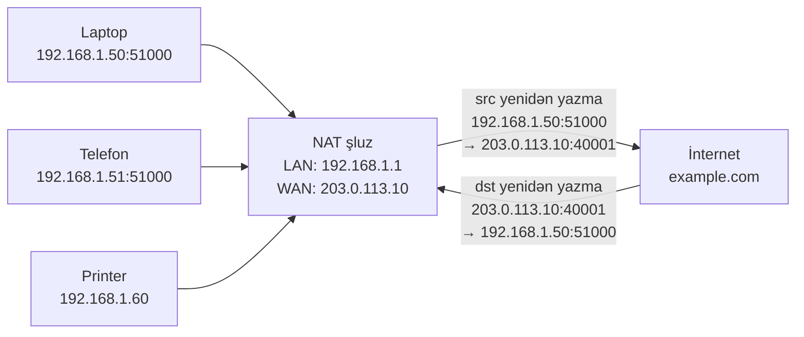

# IP Ünvanlama — IPv4 və IPv6

**IP ünvanı** cihazın şəbəkədə əlçatan olmaq üçün istifadə etdiyi məntiqi ünvandır. Bu, paketin başladığı kabeldən kənara çıxmasına imkan verən Layer 3 identifikatorudur. MAC ünvanları freymi bir keçid boyunca daşıyır; IP ünvanları paketi İnternet boyunca daşıyır.

## Bu niyə vacibdir

Hər bir şəbəkədəki hər bir cihazın ən azı bir IP-si var — laptopunuz, telefonunuz, printer, IoT termostat, bulud VM-i, firewall. Ünvanın özü təəccüblü qədər çox məlumat kodlaşdırır: hostun İnternetdən əlçatan olub-olmaması, hansı növ şəbəkədə yaşadığı, DHCP uğursuz olduğu üçün avtomatik konfiqurasiya edilib-edilmədiyi, real ünvan, yoxsa yer tutucu olduğu. `192.168.1.50`, `169.254.31.4`, `100.64.0.7` və `2001:db8::1` ünvanlarına bir baxışla baxıb hər birinin rolunu və əlçatanlığını dərhal bilən SOC analitiki, yeni başlayanın viki səhifəsinə ehtiyac duyduğu işi saniyələrdə görür. Bu dərs tanıma lüğətidir.

Bu dərs **IP ünvanlarının nə olduğunu və necə qurulduğunu** əhatə edir. Şəbəkəni daha kiçik alt şəbəkələrə bölmə riyaziyyatı — CIDR hesablaması, `/24`-ün `/26`-lara bölünməsi, ikilik sistem təkrarı — qardaş dərs olan [Subnetting](./subnetting.md) bölməsində yer alır. Əvvəlcə bu dərsi oxuyun; subnetting yalnız nəyi kəsdiyinizi bildikdən sonra məna kəsb edir.

## IPv4 strukturu

IPv4 ünvanları **32 bit** enindədir, hər biri 0–255 arasında olan dörd onluq **oktet**lə yazılır, nöqtələrlə ayrılır — "nöqtəli kvartet" notasiyası:

```
192  .  168  .   1  .  10
 8bit    8bit    8bit   8bit
       cəmi 32 bit
```

Hər IPv4 ünvanı məntiqi olaraq iki hissəyə bölünür:

- **Şəbəkə hissəsi** — hostun yerləşdiyi alt şəbəkəni təyin edir
- **Host hissəsi** — həmin alt şəbəkə içindəki konkret cihazı təyin edir

Bölmə **alt şəbəkə maskası** ilə müəyyən edilir, ya nöqtəli kvartet (`255.255.255.0`), ya da CIDR prefiksi (`/24`) kimi yazılır. Maskada 1 olan bitlər şəbəkə hissəsidir; 0 olan bitlər host hissəsidir. Şəbəkə hissələri üst-üstə düşən iki cihaz (eyni maska altında) Layer 2-də birbaşa bir-birinə çata bilir; əks halda router vasitəsilə getməlidirlər. Maskaların hesablanması və bölünməsinin tam riyaziyyatı [Subnetting](./subnetting.md) dərsində yer alır.

Hər alt şəbəkədə iki ünvan konvensiyaya görə ehtiyatda saxlanılır: **şəbəkə ID-si** (ilk ünvan) alt şəbəkənin özünü təyin edir, **broadcast** (son ünvan) isə oradakı hər hosta çatır. Heç biri konkret cihaza təyin edilmir.

## IPv4 sinifləri

CIDR-dan əvvəl IPv4 ilk oktetə əsasən sabit ölçülü **siniflərə** bölünmüşdü. Müasir şəbəkələr sinifsiz marşrutlaşdırma istifadə edir, lakin tarixi sinif sərhədləri hələ də başqa cür konfiqurasiya edilməmiş avadanlıqda görəcəyiniz **standart maskaları** təsvir edir — və lüğət gündəlik nitqdə qalır.

| Sinif | İlk-oktet diapazonu | Standart maska | Prefiks | Tipik istifadə |
| --- | --- | --- | --- | --- |
| A | 1 – 126 | 255.0.0.0 | /8 | Çox böyük şəbəkələr |
| B | 128 – 191 | 255.255.0.0 | /16 | Orta şəbəkələr |
| C | 192 – 223 | 255.255.255.0 | /24 | Kiçik şəbəkələr |
| D | 224 – 239 | yox | yox | Multicast |
| E | 240 – 255 | yox | yox | Ehtiyat / eksperimental |

`127.0.0.0/8` loopback diapazonudur və A sinfindən kənarlaşdırılıb. Sinif sərhədləri 1993-cü ildə rəsmən **CIDR (Classless Inter-Domain Routing)** ilə əvəz edildi — CIDR-ın praktikada necə işlədiyi üçün [Subnetting](./subnetting.md) bölməsinə baxın.

## Özəl və ictimai

İctimai IP-lər qlobal olaraq unikaldır və İnternetdə marşrutlaşdırılır — hər veb server, mail server və bulud endpoint İSP və ya Regional İnternet Registry vasitəsilə ayrılan ictimai ünvanda yerləşir. **Özəl** diapazonlar, **RFC 1918**-də müəyyən edilmiş, açıq şəkildə **ictimai İnternetdə marşrutlaşdırıla bilməz**: mənbəyi və ya təyinatı `10.0.0.0/8`-də olan paket düzgün konfiqurasiya edilmiş istənilən İnternet routeri tərəfindən atılacaq. Özəl ünvanlar ona görə mövcuddur ki, eyni bloklar dünyadakı hər təşkilat içində konfliktsiz təkrar istifadə oluna bilsin, **NAT** (aşağıda əhatə olunur) isə şəbəkə kənarında özəl və ictimai arasında tərcümə edir.

| Sinif | Özəl diapazon | CIDR | Tipik istifadə |
| --- | --- | --- | --- |
| A | 10.0.0.0 – 10.255.255.255 | 10.0.0.0/8 | Böyük müəssisələr, buludlar |
| B | 172.16.0.0 – 172.31.255.255 | 172.16.0.0/12 | Orta şəbəkələr, DMZ-lər |
| C | 192.168.0.0 – 192.168.255.255 | 192.168.0.0/16 | Ev, kiçik ofis |

| | İctimai IP | Özəl IP |
| --- | --- | --- |
| Digər adlar | WAN IP, qlobal IP | LAN IP, daxili IP |
| İnternet əlçatanlığı | Birbaşa marşrutlaşdırılır | Yalnız NAT vasitəsilə |
| Verən | İSP / bulud provayder / RIR | Router / DHCP / admin |
| Unikallıq | Qlobal unikal | Yalnız sizin şəbəkənizdə unikal |
| Nümunə | 173.222.14.238 | 192.168.1.10 |

Tipik ev: laptop `192.168.1.2`, PC `192.168.1.3`, telefon `192.168.1.4` — hamısı özəldir, hamısı milyonlarla başqa evlə eyni bloku yenidən istifadə edir. `example.com` kimi ictimai xidmətlər ictimai ünvanda yaşayır. LAN-ınızın kənarındakı router iki dünya arasındakı körpüdür.

Ümumi xəbərdarlıq: **özəl təhlükəsiz demək deyil**. RFC 1918 sadəcə "İnternetdən birbaşa marşrutlaşdırılmır" deməkdir. Hücumçunun içəridən çata biləcəyi hər şey — AD, fayl paylaşımları, verilənlər bazaları — açıq oyundur. VLAN və firewall ilə seqmentləşdirin, "daxili"nin "təhlükəsiz" demək olduğunu fərz etməyin.

## Xüsusi təyinatlı IPv4 diapazonları

RFC 1918 bloklarından kənar bir neçə IPv4 diapazonunun konkret mənaları var. Onları görən kimi tanımaq diaqnostika vaxtına çox qənaət edir.

| Diapazon | CIDR | Məqsəd |
| --- | --- | --- |
| `127.0.0.0` – `127.255.255.255` | `127.0.0.0/8` | Loopback — `127.0.0.1` "bu hostdur" |
| `169.254.0.0` – `169.254.255.255` | `169.254.0.0/16` | APIPA / link-local — DHCP uğursuz oldu |
| `224.0.0.0` – `239.255.255.255` | `224.0.0.0/4` | Multicast (birdən-çoxa çatdırma) |
| `255.255.255.255` | `/32` | Məhdud broadcast (yalnız bu alt şəbəkə) |
| `0.0.0.0` | `/32` | "Bu şəbəkə" / qeyri-müəyyən / hər hansı |
| `100.64.0.0` – `100.127.255.255` | `100.64.0.0/10` | CGNAT (carrier-grade NAT, RFC 6598) |

Bir neçə praktik qeyd:

- **Loopback** lokal xidmət testi üçün istifadə olunur — `curl http://127.0.0.1:8080` heç vaxt NIC-ə toxunmadan öz maşınınıza çatır. `127.0.0.1`-ə bağlanmış demon yalnız lokal hostdan əlçatandır; `0.0.0.0`-a bağlandıqda istənilən interfeysdən trafik qəbul edir.
- **APIPA** (Automatic Private IP Addressing) heç bir DHCP server cavab vermədikdə Windows-un təyin etdiyidir. `169.254.x.x` ilə bir host görmək DHCP-nin sınıq olduğunun güclü siqnalıdır — həmin host yalnız eyni kabeldəki digər APIPA hostları ilə danışa bilər, İnternetlə yox.
- **Multicast** bir paketi bir çox abunə olmuş alıcıya göndərir — marşrutlaşdırma protokolları (OSPF `224.0.0.5`-də), xidmət kəşfi (mDNS `224.0.0.251`-də) və IPTV tərəfindən istifadə olunur.
- **`0.0.0.0/0`** standart marşrutdur — "daha konkret heç nə ilə uyğunlaşdırılmayan hər şey."

## NAT — Şəbəkə Ünvan Tərcüməsi

**NAT** özəl ünvanları ictimai ünvanlara (və geriyə) tərcümə edir ki, özəl şəbəkə içindəki hostlar ünvanlarının marşrutlaşdırıla bilməməsinə baxmayaraq İnternetə çata bilsin. LAN kənarındakı router tərcüməni edir və adətən daxili hostlar üçün **standart şluz** kimi də xidmət göstərir.

Özəl host bağlantı açdıqda NAT şluz çıxan paketin mənbə IP-sini (və adətən mənbə portunu) özəl dəyərdən onun ictimai dəyərlərindən birinə yenidən yazır və xəritələmə cədvəlində uyğunlaşdırmanı yadda saxlayır. Geri qayıdan paketlər cədvələ qarşı uyğunlaşdırılır və içəri çatdırılmadan əvvəl orijinal özəl ünvana yenidən yazılır.

Bilməli olduğunuz üç növ:

- **Statik NAT (1:1)** — bir özəl IP daimi olaraq bir ictimai IP-yə xəritələnir. Sabit ictimai ünvan tələb olunan daxil olan xidmətlər üçün istifadə olunur.
- **Dinamik NAT** — ictimai IP-lərin hovuzu paylaşılır; hər çıxan axın növbəti boş ictimai ünvanı götürür. Bu gün nadir görünür.
- **PAT / NAPT (Port Address Translation, "NAT overload")** — bir çox özəl host **bir** ictimai IP-ni mənbə portları üzərində multipleksləşdirməklə paylaşır. Hər ev routerinin etdiyi budur və əksər insanların əslində "NAT" deyəndə nəzərdə tutduğu da budur.

Vacibdir ki, **NAT təhlükəsizlik nəzarəti deyil**. Bu, yan effekt kimi sorğusuz daxil olan trafiki atmağa səbəb olan ünvan-yenidən-yazma xüsusiyyətidir. Paketləri yoxlamır, tətbiqləri başa düşmür və heç bir çıxan zərərli proqram bağlantısına qarşı qoruma vermir — daxili host çıxan axın açan kimi geri yol tamamilə açıqdır. Təhlükəsizlik üçün firewall istifadə edin; ünvanlama üçün NAT istifadə edin.

## DMZ — demilitarizasiya zonası

**DMZ** firewall-larla ictimai İnternet və daxili şəbəkə arasında izolyasiya edilmiş ayrı şəbəkə seqmentidir. İctimaiyyətə baxan xidmətlər — veb serverlər, mail relayları, reverse proksilər, ictimai DNS — DMZ-də yaşayır ki, bu İnternetə açılan xidmətlərin kompromisi hücumçuya həssas sistemlərin (Active Directory, verilənlər bazaları, fayl serverləri) yaşadığı daxili şəbəkəyə birbaşa giriş verməsin.

```
İnternet → [Kənar firewall] → DMZ (veb, mail, reverse proksi)
                          → [Daxili firewall] → Daxili (AD, DB, istifadəçilər)
```

172.16–31.x özəl diapazonu ənənəyə görə tez-tez DMZ şəbəkələri üçün istifadə olunur, baxmayaraq ki istənilən özəl (və ya ictimai) diapazon işləyir. Məsələ **arxitekturadır**, ünvan deyil: DMZ ona görə mövcuddur ki, onunla həm İnternet, həm də daxili şəbəkə arasında firewall qaydaları var. Bu qaydalar olmadan o, sadəcə başqa bir alt şəbəkədir.

## IPv6 strukturu

IPv6 ünvanları **128 bit** enindədir — effektiv olaraq sonsuz ünvan sahəsi — iki nöqtə ilə ayrılmış səkkiz qrup dörd hex rəqəmi kimi yazılır:

```
2001:0db8:85a3:0000:0000:8a2e:0370:7334
```

İki sıxılma qaydası onları oxumaq və yazmaq üçün dözümlü edir:

1. **İstənilən qrupdakı baş sıfırlar atıla bilər** — `0db8` `db8` olur, `0000` `0` olur.
2. **Ardıcıl tam-sıfır qrupların bir qaçışı `::`-yə sıxıla bilər** — lakin yalnız bir qaçış, əks halda bu qeyri-müəyyən olardı.

Beləliklə, yuxarıdakı ünvan `2001:db8:85a3::8a2e:370:7334`-ə qısalır.

IPv4-dən əsas struktur fərqləri:

- **Broadcast yoxdur.** IPv6 broadcast-ı tamamilə çıxardı; "keçiddəki bütün hostlar" əvəzinə multicast qrupudur.
- **SLAAC (Stateless Address Autoconfiguration).** Host router tərəfindən elan edilən prefiksdən öz qlobal IPv6 ünvanını qura bilər, DHCP server tələb olunmur.
- **İnterfeysə bir neçə ünvan normaldır.** İnterfeys adətən eyni anda ən azı bir link-local ünvana üstəgəl bir və ya bir neçə qlobal ünvana sahibdir.
- **Prefiks həmişə CIDR-dir.** IPv6 "sinifləri" yoxdur — birinci gündən hər şey `ünvan/prefiks-uzunluğu`-dur.

Əsas IPv6 diapazonları:

- **Link-local** `fe80::/10` — hər interfeysə avtomatik təyin olunur, yalnız lokal keçiddə etibarlıdır, heç vaxt marşrutlaşdırılmır
- **Qlobal unicast** `2000::/3` — ictimai IPv4 ünvanının İnternet-marşrutlaşdırıla bilən ekvivalenti
- **Unique Local Addresses (ULA)** `fc00::/7` — RFC 1918 özəl sahəsinin IPv6 analoqu

## IPv6 xüsusi ünvanları

| Ünvan / Diapazon | Məqsəd |
| --- | --- |
| `::1/128` | Loopback (`127.0.0.1`-ə ekvivalent) |
| `::/128` | Qeyri-müəyyən ünvan (`0.0.0.0`-a ekvivalent) |
| `fe80::/10` | Link-local (interfeys üzrə avtomatik təyin) |
| `fc00::/7` | Unique Local Addresses (özəl, RFC 1918 kimi) |
| `ff00::/8` | Multicast (broadcast-ı əvəz edir) |
| `2000::/3` | Qlobal unicast (İnternet-marşrutlaşdırıla bilən) |
| `::ffff:0:0/96` | IPv4-xəritələnmiş IPv6 (məs. `::ffff:192.0.2.1`) |

İki gündəlik nümunə: `ff02::1` "bu keçiddəki bütün düyünlər"dir (IPv6-nın broadcast-a ən yaxın olanı) və `ff02::2` "bu keçiddəki bütün routerlər"dir — SLAAC və Neighbor Discovery tərəfindən istifadə olunur.

## Dual-stack və keçid

Bu gün əksər şəbəkələr **dual-stack** işlədir — eyni interfeyslərdə eyni anda IPv4 və IPv6 — çünki hər şey hələ IPv6 dəstəkləmir və dünya bir həftə sonu IPv4-ü söndürə bilməz. Müasir host adətən eyni anda IPv4 ünvanına, IPv6 link-local-a və bir və ya bir neçə IPv6 qlobal ünvanına sahib olacaq. Tətbiqlər ümumiyyətlə hər ikisi mövcud olduqda IPv6-nı üstün tutur (Happy Eyeballs, RFC 8305, onları yarışdırır və hansı əvvəl bağlanırsa onu istifadə edir). Tunelləmə və tərcümə texnologiyaları (6to4, Teredo, NAT64, DS-Lite) keçid kənar halları üçün mövcuddur, lakin saf dual-stack normadır. "Yalnız IPv4" hesab etdiyiniz hostda tanış olmayan `2001:` və ya `fe80:` ünvanı görəndə bu, demək olar ki, IPv6-nın səssizcə standart olaraq aktivləşdirildiyi üçündür.

## NAT diaqramı



LAN içində hər host öz özəl ünvanını görür. İnternetin nöqteyi-nəzərindən hər bağlantı şluzun yeganə ictimai IP-sindən gəldiyi kimi görünür — yalnız mənbə portu ilə fərqlənir. Şluzdakı tərcümə cədvəli geri qayıdan trafikin doğru daxili hostu tapmasına səbəb olan şeydir.

## Praktiki məşqlər

Beş məşq. Onları öz maşınınızda edin — öz gözlərinizlə oxuduğunuz ünvanlar yapışır.

### 1. Öz IPv4 və IPv6 ünvanlarınızı oxuyun

Windows-da:

```powershell
ipconfig /all
```

Linux-da:

```bash
ip a
```

Aktiv interfeysinizi tapın. Müəyyən edin: IPv4 ünvanı və maska, standart şluz, hər IPv6 ünvanı (yəqin ki bir `fe80::` link-local üstəgəl bir və ya bir neçə qlobal görəcəksiniz) və DNS serverləri. Onları kağıza yazın.

### 2. Səkkiz nümunə ünvanı təsnif edin

Aşağıdakı hər ünvan üçün özəl, ictimai, loopback, APIPA, multicast, broadcast və ya qeyri-müəyyən olduğunu qərar verin. Cavablar dərsin sonundadır — əvvəlcə cəhd edin, sonra yoxlayın.

```
10.20.30.40
8.8.8.8
192.168.0.1
169.254.10.5
127.0.0.1
224.0.0.251
255.255.255.255
172.20.5.7
```

### 3. APIPA-nı tetikləyin və müşahidə edin

Kritik trafiki olmayan test laptopunda kabeli ayırın (və ya Wi-Fi-ı söndürün), sonra `ipconfig /release` (Windows). DHCP-nin əlçatmaz olduğu şəbəkəyə yenidən qoşulun — məsələn, istifadə olunmayan switch portuna qoşulun. Bir neçə saniyədən sonra yenidən `ipconfig` işlədin. `169.254.x.x` ünvanı görməlisiniz. Bu APIPA-dır — OS DHCP-dən imtina edib özünə link-local IPv4 təyin edir. Bərpa etmək üçün işləyən DHCP şəbəkəsinə yenidən qoşulun.

### 4. Loopback-ınızı tapın

```bash
ping 127.0.0.1
ping ::1
```

Hər ikisi demək olar ki, dərhal cavab verməlidir. Onlar heç vaxt maşınınızı tərk etmir — kernel loopback trafikini hər hansı NIC sürücüsünə toxunmamış qısa-dövrə edir. Bu həm də `curl http://127.0.0.1:8080` ilə lokal veb serveri test edərkən istifadə etdiyiniz ünvandır.

### 5. Sıxılmış IPv6 ünvanını dekoda edin

Aşağıdakını tam səkkiz qrup formasına genişləndirin, bütün atılmış baş sıfırları və sıxılmış `::`-ni bərpa edin:

```
2001:db8::1:0:0:1
```

İpucu: mövcud qrupları sayın, `::`-nin neçə sıfır-qrup təmsil etdiyini hesablayın və hər qrupu dörd hex rəqəmi kimi yazın. Cavab: `2001:0db8:0000:0000:0001:0000:0000:0001`.

## İşlənmiş nümunə — example.local düz /16-dan seqmentli dizayna keçir

`example.local` kiçik başladı. Birinci gün, təsisçi ofis kirayələdi və bir şəbəkə qurdu: `10.0.0.0/16`, üzərində hər şey — laptoplar, fayl server, printer, Wi-Fi. DHCP ünvanlar paylayırdı, istehlakçı routeri vasitəsilə İnternetə NAT. Səkkiz nəfər olduğu üçün işləyirdi.

Üç il sonra 180 nəfər, dörd ofis, ictimai veb sayt, mail server, bir neçə bulud VM və hazırda əmək haqqı ilə eyni `/16`-da olan "qonaq Wi-Fi" var. CISO-nun ilk istəyi hər rolu firewall qaydaları arxasında öz alt şəbəkəsinə xəritələyən ünvanlama planıdır. Yenidən yazma budur:

| Seqment | Diapazon | Marşrutlaşdırılır? | Məqsəd |
| --- | --- | --- | --- |
| İstifadəçi LAN (HQ) | `10.10.0.0/16` | Özəl | İşçi laptopları, telefonlar |
| Server LAN (HQ) | `10.20.0.0/16` | Özəl | AD, fayl, çap, daxili tətbiqlər |
| DMZ | `172.16.10.0/24` | Özəl (NAT-lanır) | İctimai veb, reverse proksi |
| İdarəetmə | `172.16.99.0/24` | Özəl | Switch-lər, firewall-lar, OOB |
| Qonaq Wi-Fi | `192.168.50.0/24` | Özəl (yalnız İnternet) | Qonaqlar, LAN girişi yox |
| İctimai IP bloku | `203.0.113.0/29` | İctimai | Kənar firewall, mail, veb NAT |
| IPv6 prefiksi | `2001:db8:1000::/48` | İctimai | Dual-stack tətbiqi |

Üç şeyi qeyd edin. Birincisi, ünvanlama "boş olan nə idi"sə yox, **rollarına xəritələnir** — hər ünvan sizə hostun nə etdiyini deyir. İkincisi, **ictimaiyyətə baxan xidmətlər DMZ-də yaşayır**, həm kənar firewall, həm də daxili firewall arxasında — veb serverin kompromisi birbaşa AD-yə pivot edə bilməz. Üçüncüsü, IPv6 hələ tam tətbiq edilməsə də, **IPv6 /48** əvvəlcədən ayrılır; sonra 180 nəfər boyunca ünvanları yenidən qurmaq, ilk gün prefiksi rezerv etməkdən çox daha ağrılıdır.

Hər `/16` və `/24`-ün necə ölçüləndirildiyi mexanikası — prefiks uzunluğunu seçmək, şəbəkə ID-sini hesablamaq, lazım gələrsə daha bölmək — [Subnetting](./subnetting.md) dərsidir.

## Problemlərin həlli və tələlər

**Təkrarlanan IP-lər.** Eyni alt şəbəkədə eyni IP-li iki host qeyri-sabit davranır — bəzən biri cavab verir, bəzən digəri, ARP keşləri sallanır. Windows-da hadisə jurnalında "There is an IP address conflict" axtarın; Linux-da `arping -D` aşkar edir. Adətən statik IP-nin DHCP əhatəsi ilə toqquşmasından qaynaqlanır.

**DHCP uğursuz olduqda APIPA.** `169.254.x.x` ilə host heç bir DHCP serverdən cavab almadı. DHCP serverin işlək olduğunu, relay-in routerdə konfiqurasiya edildiyini və əhatənin tükənmədiyini yoxlayın. Hostun özü düzgün şeyi edir — sınıq olan infrastrukturdur.

**Bilmədiyiniz IPv6 ünvanı.** Müasir OS-lər standart olaraq IPv6-nı aktivləşdirir. Firewall qaydalarınızda IPv6-nı görməzdən gəlmisinizsə, heç vaxt nəzərə almadığınız IPv6 vasitəsilə əlçatan hostlarınız ola bilər. Linux-da `ip -6 a` və Windows-da `ipconfig /all`-un IPv6 bölmələrini auditdən keçirin.

**NAT hairpinning.** Daxili host daxili xidmətə **ictimai** IP-si ilə (məs. ofisdən şirkət vebsaytının ictimai DNS adını yazaraq) çatmağa çalışır. Bəzi NAT şluzları bunu atır — paket ictimai təyinatla çıxır, eyni şluza qayıdır və şluz qarışır. Ya hairpin NAT (loopback NAT) konfiqurasiyası ilə düzəldin, ya da split-horizon DNS istifadə edin ki, daxili müştərilər birbaşa daxili IP-yə həll etsin.

**Çatışmayan standart şluz — "yalnız LAN-ım işləyir".** Host öz alt şəbəkəsindəki hər şeyə ping edə bilirsə, lakin xaricə heç nəyə yox, deməli standart marşrutu yoxdur. `0.0.0.0/0` qeydini `ipconfig` / `ip r`-də yoxlayın. Ümumi səbəb hostun öz alt şəbəkəsində olmayan səhv yazılmış şluz IP-sidir.

**Səhv alt şəbəkə maskası.** `/24` şəbəkədə `/16` maskalı host uzaq hostları lokal hesab edir və marşrutlaşdırma əvəzinə onlar üçün ARP edir — beləliklə, maskaya baxana qədər təsadüfi görünən bir nümunədə bəzi şeylərə çata bilir, bəzilərinə yox.

(Təsnifat məşqinin cavabları: `10.20.30.40` özəl, `8.8.8.8` ictimai, `192.168.0.1` özəl, `169.254.10.5` APIPA, `127.0.0.1` loopback, `224.0.0.251` multicast, `255.255.255.255` broadcast, `172.20.5.7` özəl.)

## Əsas çıxarışlar

- IPv4 nöqtəli kvartetdə 32 bitdir; IPv6 bir sıfır-qaçışı üçün `::` qısaltması ilə iki nöqtəli hex-də 128 bitdir.
- A/B/C/D/E sinifləri tarixidir — müasir marşrutlaşdırma CIDR-dir ([Subnetting](./subnetting.md)-də əhatə olunub).
- RFC 1918 özəl diapazonları (`10/8`, `172.16/12`, `192.168/16`) İnternetdə marşrutlaşdırılmır — NAT onları körpüləyir.
- Xüsusi diapazonları görən kimi tanıyın: `127/8` loopback, `169.254/16` APIPA, `224/4` multicast, `255.255.255.255` broadcast, `0.0.0.0` qeyri-müəyyən.
- NAT ünvanlama xüsusiyyətidir, **təhlükəsizlik nəzarəti deyil**. Təhlükəsizlik üçün firewall istifadə edin.
- DMZ İnternetə açılan xidmətlər üçün izolyasiya edilmiş seqmentdir, daxili şəbəkədən firewall-larla ayrılıb.
- IPv6-da broadcast yoxdur (yalnız multicast), SLAAC avtokonfiqurasiyasını dəstəkləyir və link-local üçün `fe80::/10`, qlobal unicast üçün `2000::/3` istifadə edir.
- Bu gün əksər şəbəkələr dual-stack işlədir — əksini sübut etməsəniz, hostlarınızda həm IPv4, həm də IPv6 olduğunu fərz edin.
- Ünvanlamanı "növbəti boş diapazon" əvəzinə **rola** görə planlaşdırın — hər alt şəbəkə üzərində nə olduğunu sizə deməlidir.

## İstinadlar

- RFC 791 — Internet Protocol (IPv4): https://www.rfc-editor.org/rfc/rfc791
- RFC 8200 — IPv6 Specification: https://www.rfc-editor.org/rfc/rfc8200
- RFC 1918 — Address Allocation for Private Internets: https://www.rfc-editor.org/rfc/rfc1918
- RFC 6598 — IANA-Reserved IPv4 Prefix for Shared Address Space (CGNAT): https://www.rfc-editor.org/rfc/rfc6598
- RFC 4291 — IP Version 6 Addressing Architecture: https://www.rfc-editor.org/rfc/rfc4291
- RFC 3927 — Dynamic Configuration of IPv4 Link-Local Addresses (APIPA): https://www.rfc-editor.org/rfc/rfc3927
- IANA IPv4 Special-Purpose Address Registry: https://www.iana.org/assignments/iana-ipv4-special-registry/iana-ipv4-special-registry.xhtml
- IANA IPv6 Special-Purpose Address Registry: https://www.iana.org/assignments/iana-ipv6-special-registry/iana-ipv6-special-registry.xhtml
- Əlaqəli: [Subnetting](./subnetting.md), [OSI modeli](./osi-model.md), [TCP/IP modeli](./tcp-ip-model.md), [Şəbəkə cihazları](./network-devices.md), [DHCP](./dhcp.md), [DNS](./dns.md)
