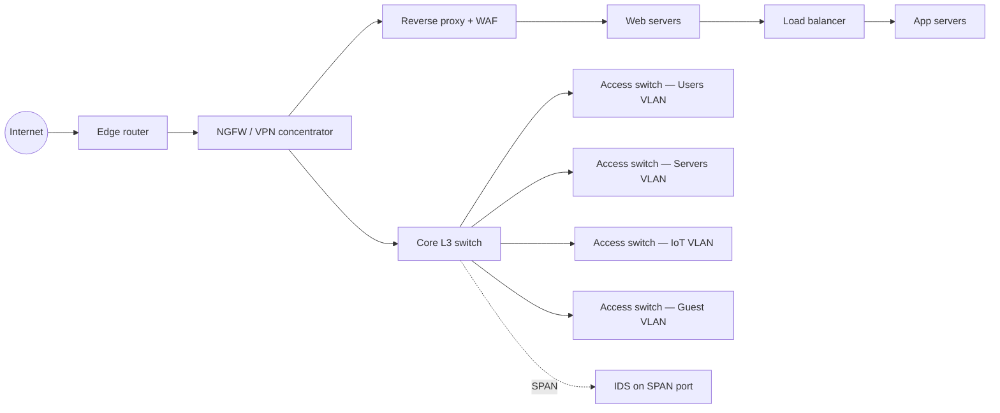

# Şəbəkə Cihazları

## Bu niyə vacibdir

Toxunacağınız hər bir şəbəkə — ev ofisi, kampus, məlumat mərkəzi, bulud VPC-si — eyni bir neçə cihaz dəstindən qurulur. Switch-lər frame-ləri ötürür. Router-lər paketləri ötürür. Firewall-lar icazə verir və ya rədd edir. Yük balanslayıcıları işi paylaşdırır. Proxy-lər ortada dayanır. Hər biri stack-in xüsusi səviyyəsində ötürmə qərarı verir və cihazın işlədiyi səviyyə sizə dəqiq deyir ki, o nəyi görə bilər, nəyi qoruya bilər və nəyə qarşı kor olar. Switch SQL injection-u bloklaya bilməz. WAF ping flood-u dayandıra bilməz. NAT şlüzü firewall deyil, satıcının marketinq slaydı bunu nə qədər tez-tez deyirsə də.

Səviyyəni səhv salsanız, nəzarət teatr olur. IDS-i traffiki görə bilməyəcəyi yerə qoyun və o heç vaxt xəbərdarlıq göndərməyəcək. Layer-7 problemi üçün Layer-4 yük balanslayıcısı alın və illərlə çaşqınlıq içində qalacaqsınız. Daxili xidmətlərinizi qorumaq üçün NAT-a etibar edin və kompromisə uğramış noutbukdan növbəti çıxış əlaqəsi sizə əksini sübut edəcək. Bu dərs infosec işinizin ilk beş ilində qarşılaşacağınız hər cihazı onun səviyyəsinə, qərar girişinə, tipik yerləşdirilməsinə və bunlardan irəli gələn təhlükəsizlik nəticələrinə uyğunlaşdırır. **Səviyyə üzrə qərar** prinsipi başınıza yatandan sonra oxuduğunuz hər arxitektura diaqramı oxunaqlı olur — və hər dizayn icmalındakı suallar özlərini cavablandırır.

Daha dərin material — stateful firewall daxili işləri, IDS tənzimləməsi, NGFW dərin paket yoxlaması, seqmentləşdirmə nümunələri — orta və qabaqcıl dərslərdə yaşayır. Burada biz əsasda qalırıq: hər cihaz nədir, harada dayanır və nə edə bilər, nə edə bilməz. Səviyyə modelinin özü üçün [OSI modelinə](./osi-model.md) və [TCP/IP modelinə](./tcp-ip-model.md) baxın. Switch-lərin arxasındakı L2 mexanikası üçün [Ethernet və ARP](./ethernet-and-arp.md) baxın. Şəbəkələri dizayn etməyə başlayanda, [təhlükəsiz şəbəkə dizaynı](../secure-design/secure-network-design.md) və [təhlükəsiz protokollar](../secure-design/secure-protocols.md) aşağıdakıların hamısını genişləndirir.

## Səviyyə üzrə qərar prinsipi

Hər şəbəkə cihazı tək bir ötürmə qərarı verir və bunu xüsusi səviyyədə edir. Səviyyə hansı başlıq sahəsini oxuduğunu diktə edir, bu da cihazın traffik haqqında nə bilə biləcəyini diktə edir. Yalnız MAC ünvanlarını oxuyan switch qanuni HTTPS əlaqəsini C2 serverinə beacon-dan ayıra bilməz — hər ikisi Ethernet frame-ləri kimi görünür. HTTP sorğu gövdələrini oxuyan WAF sizə noutbukun hansı fiziki porta qoşulduğunu deyə bilməz. Səviyyə anlayışı hər şeydir.

| Cihaz | OSI səviyyəsi | Qərar girişi |
|---|---|---|
| Hub | 1 | Yoxdur — hər biti hər portdan təkrarlayır |
| Switch | 2 | Təyinat MAC, CAM cədvəlində axtarılır |
| Router | 3 | Təyinat IP, marşrutlaşdırma cədvəlində ən uzun prefiks uyğunluğu |
| Stateless firewall | 3–4 | 5 elementli kortej (proto, mənbə IP, mənbə port, təyinat IP, təyinat port), paket başına |
| Stateful firewall | 3–4 | 5 elementli kortej üstəgəl əlaqə vəziyyət cədvəli |
| Next-gen firewall (NGFW) | 3–7 | Stateful-un hamısı, üstəgəl app-ID, user-ID, opsional TLS yoxlama |
| Yük balanslayıcı (L4) | 4 | 5 elementli kortej üstəgəl pul sağlamlığı |
| Yük balanslayıcı (L7) | 7 | HTTP metod/host/yol/başlıq üstəgəl pul sağlamlığı |
| Forward proxy | 7 | Müştəridən çıxan HTTP/S sorğu |
| Reverse proxy | 7 | Serverə daxil olan HTTP/S sorğu |
| IDS / IPS | 3–7 | Paket/axın boyunca imza və ya anomaliya uyğunluğu |
| WAF | 7 | HTTP sorğu strukturu və yükü |
| NAT şlüzü | 3 (PAT üçün port anlayışı ilə) | Mənbə/təyinat ünvan yenidən yazma |
| VPN konsentratoru | 3 | Tunel sonlandırma üstəgəl marşrutlaşdırma |

Mental model: qərarın verilə biləcəyi ən aşağı səviyyəni seçin. Yan otaqdakı printerə gedən frame router-ə ehtiyac duymur. Veb serverinizə TCP 443-ə icazə verən qayda NGFW-yə ehtiyac duymur. Login formasında `' OR 1=1 --` blokayan yoxlama Layer 7-yə ehtiyac duyur. Səviyyəni problemə uyğunlaşdırın və arxitektura sadə qalır.

## Layer 1 — hub-lar və təkrarlayıcılar

**Hub** Layer-1 cihazıdır ki, hər gələn biti digər hər portdan təkrarlayır. Onun MAC ünvanı haqqında heç bir təsəvvürü yoxdur, frame-in nə olduğu haqqında təsəvvürü yoxdur. Əgər iki host eyni anda ötürürsə, onlar toqquşur və hər ikisi yenidən ötürür. Hər port bir **toqquşma domeni** və bir **yayım domeni** paylaşır. **Təkrarlayıcı** eyni fikrin iki portlu variantıdır — siqnalı gücləndirir ki, daha uzun kabel hələ də təmiz bitlər çatdıra bilsin.

Müasir şəbəkələrdə hub-lar nəsli kəsilib. Onları hələ də gördüyünüz yeganə yerlər köhnə sənaye idarəetmə otaqları, qəsdli test qurğuları və 2002-ci ildən qalan ara-sıra ikinci əl router-ləridir. Onların təhlükəsizlik nəticəsi ciddi və bir cümləlikdir: **hub-da hər kəs hər kəsin traffikini pulsuz dinləyə bilər**, çünki hər frame hər porta gedir. Əgər tənzimləyici və ya auditor istehsal şəbəkəsində hub tapırsa, görüşü bitirməzdən əvvəl onu dəyişdirin.

## Layer 2 — switch-lər

**Switch** hər müasir LAN-ın Layer-2 iş atıdır. Frame gələndə, switch təyinat MAC-i oxuyur, **CAM cədvəlində** (MAC ünvan cədvəli də adlanır) axtarır və frame-i yalnız o MAC-in yaşadığı porta ötürür. Əgər MAC məlum deyilsə, switch frame-i daxil olduğu portdan başqa VLAN-dakı hər portdan **flood** edir və növbəti dəfə üçün mənbə MAC-in portunu öyrənir. Yayımlar (`FF:FF:FF:FF:FF:FF`) və multicast-lar dizayn üzrə VLAN-dakı hər porta gedir.

Switch-lər önündən eyni görünən, lakin çox fərqli davranan iki növdə gəlir:

- **İdarə olunmayan switch** — qoş, işləyir. Veb UI yoxdur, konsol yoxdur, VLAN-lar yoxdur, monitorinq yoxdur. Evdəki dörd portlu masa hub-ı üçün uyğundur; biznes şəbəkəsi üçün heç vaxt uyğun deyil, çünki üzərində nə olduğunu görə bilməzsiniz.
- **İdarə olunan switch** — konsol portu, idarəetmə üçün IP ünvanı və konfiqurasiyası var. VLAN-ları, port təhlükəsizliyini, port güzgüləməsini (SPAN), spanning-tree-i, link aqreqasiyasını, 802.1X-i, SNMP-ni dəstəkləyir. Hər ofis, filial və məlumat mərkəzinin işlətdiyi budur.

Dərhal qarşılaşacağınız ümumi idarə olunan switch xüsusiyyətləri:

- **VLAN-lar və 802.1Q trunking** — bir fiziki switch-i bir çox məntiqi switch-ə bölür ki, istifadəçilər, serverlər, IoT cihazları, printerlər və qonaq Wi-Fi öz yayım domenində yaşasın. **Trunk** portu hər frame-i etiketləyərək switch-lər arasında çoxlu VLAN-ları daşıyır.
- **Port təhlükəsizliyi** — bir portda neçə MAC ünvanı görünə biləcəyini məhdudlaşdırır; yeni MAC görünərsə, portu söndürə bilər. İstifadəçilərin masa altında öz switch-lərini qoşmasını dayandırır.
- **Port güzgüləmə (SPAN)** — bir və ya bir neçə portdan traffiki monitor portuna kopyalayır ki, IDS və ya paket tutma qutusu inline olmadan onu görə bilsin.
- **DHCP snooping və Dynamic ARP Inspection (DAI)** — saxta DHCP serverlərinə və ARP spoofing-ə qarşı qoruyur. Dərindən [Ethernet və ARP](./ethernet-and-arp.md) dərsində əhatə olunur.

Switch LAN-ı **seqmentləşdirmək** üçün doğru alətdir, lakin öz başlıqlarından yuxarı heç nəyi yoxlaya bilməz. Eyni VLAN-da iki host sərbəst danışa bilər; əgər onlar arasında siyasət qərarına ehtiyacınız varsa, sizə Layer-3 cihazı lazımdır.

## Layer 3 — router-lər

**Router** şəbəkələr arasında paketləri ötürən Layer-3 cihazıdır. Switch MAC-ləri oxuduğu yerdə, router təyinat IP-ni oxuyur, **marşrutlaşdırma cədvəlində** axtarır, **növbəti hop** ünvanını tapır və paketi müvafiq interfeysdən ötürür — yolda Layer-2 başlığını yenidən yazır. Subnet-i tərk edən hər paket ən azı bir router-i keçir; **default gateway** sadəcə "qalan hər şey"i idarə edən router-dir.

Marşrutlaşdırma cədvəlinin özü prefiks uzunluğuna görə sıralanmış `şəbəkə → növbəti hop / interfeys` qaydalarının siyahısıdır. Router **ən uzun prefiks uyğunluğunu** istifadə edir: əgər `10.0.0.0/8` və `10.0.1.0/24` hər ikisi pakete uyğun gəlirsə, `/24` qalib gəlir, çünki daha xüsusidir. Hər şeyi əhatə edən `0.0.0.0/0` — **default route** — daha xüsusi heç bir şey uyğun gəlmədikdə geri çəkildiyiniz şeydir. Marşrutlar **statik** (admin tərəfindən yazılmış) və ya **dinamik** (qonşudan OSPF, EIGRP, BGP vasitəsilə öyrənilmiş) ola bilər. Kiçik şəbəkədə statik marşrutlar uyğundur; böyüyən hər şeydə dinamik marşrutlaşdırma marşrutlaşdırma cədvəlinin sinxrondan çıxmasını dayandıran şeydir.

**Marşrut yenidən paylaşdırılması** bir marşrutlaşdırma protokoluna digərindən öyrənilmiş marşrutları öyrətmək aktıdır (məsələn, OSPF-in statik marşrutu öyrənməsi və ya BGP-nin OSPF marşrutlarını öyrənməsi). Bu güclüdür və diqqətsiz edildikdə marşrutlaşdırma döngələrinin məşhur mənbəyidir — həmişə metrik və marşrut etiketi təyin edin və yenidən paylaşdırdığınızı süzgəcdən keçirin.

Layer-3 switch olmadan VLAN-lar üçün ümumi yerləşdirmə **router-on-a-stick** (one-arm marşrutlaşdırma da adlanır): tək fiziki router interfeysi çoxlu VLAN sub-interfeysləri olan 802.1Q trunk daşıyır və router onlar arasında marşrutlaşdırır. Bu ucuzdur, işləyir və router-in arxa panelində darboğazlaşır — filial ofisi üçün uyğundur, məlumat mərkəzi üçün heç vaxt yox.

## Firewall-lar — stateless vs stateful vs NGFW

**Firewall** sərhəddi keçən traffikə icazə/rədd siyasətini tətbiq edir. Görəcəyiniz üç nəsil:

| Sinif | Səviyyə | Nəyi yoxlayır | Qayıdış traffikinə avtomatik icazə verə bilərmi? | Tətbiqə görə bloklaya bilərmi? |
|---|---|---|---|---|
| Stateless (paket filtri / ACL) | 3–4 | Tək paketin 5 elementli korteji | Xeyr — əks qaydanı əl ilə yazmalısınız | Xeyr |
| Stateful | 3–4 | 5 elementli kortej üstəgəl əlaqə vəziyyət cədvəli | Bəli — qurulmuş seansların qayıdış traffikinə icazə verilir | Xeyr |
| NGFW (next-generation) | 3–7 | Stateful-un hamısı, üstəgəl app-ID, user-ID, IPS, opsional TLS yoxlama | Bəli | Bəli (məsələn, portdan asılı olmayaraq "BitTorrent"i bloklayın) |

Sizə saatlar qənaət edəcək iki praktiki qayda:

- **Qayda sırası vacibdir.** Firewall-lar qaydaları yuxarıdan aşağıya qiymətləndirir və ilk uyğunluqda dayanır. Dar rədd qaydasının üstündəki geniş icazə qaydası rəddi səssizcə neytrallaşdıracaq. Həmişə `deny any any` ilə bitirin və sıranı müntəzəm yoxlayın.
- **Stateful firewall iki stateless qaydanı bir ilə əvəz edir.** Stateless ACL `permit tcp client → server eq 443` və `permit tcp server → client established`-ə ehtiyac duyduğu yerdə, stateful firewall yalnız birinci qaydaya ehtiyac duyur və qayıdışı avtomatik izləyir.

Orta və qabaqcıl dərslər qayda yazma, NGFW imkanları və TLS yoxlama mübadilələri haqqında dərinə gedir. Əsas səviyyədə hansı nəsilə baxdığınızı və hər birinin nəyi görə bilib, nəyi görə bilmədiyini bilin.

## Yük balanslayıcıları

**Yük balanslayıcı** gələn əlaqələri arxa server pulu boyunca paylaşdırır ki, heç bir tək server həddən artıq yüklənməsin və hər hansı bir server xidməti söndürmədən sıradan çıxa bilsin. İki növ:

- **Layer 4 (nəqliyyat)** — TCP/UDP əlaqələrini 5 elementli kortejlə paylayır. Sürətli, sadə, sorğu məzmununa qarşı kordur. URL yolu üzrə marşrutlaşdıra bilməz, TCP-ni sonlandıra bilməz, başlıqlar əlavə edə bilməz. Yeganə düymə "sağlam arxa-yə göndər" olan protokollar üçün yaxşı uyğundur — SMTP relay-ları, RDP fermaları, xam verilənlər bazası ön-uçları.
- **Layer 7 (tətbiq)** — TCP əlaqəsini sonlandırır, HTTP sorğusunu təhlil edir, `Host`, yol, başlıq, cookie və ya metod üzrə marşrutlaşdıra bilər, başlıqları yenidən yaza bilər, TLS-i sonlandırıb arxaya yenidən şifrələyə bilər, çox vaxt pul önündə WAF yerləşdirir. Hər müasir veb xidmətinin standartı.

Ümumi planlaşdırma alqoritmləri:

- **Round-robin** — növbəti sorğu sıra ilə növbəti arxaya. Sadə, qısa bircins sorğular üçün uyğundur.
- **Ən az əlaqə** — növbəti sorğu ən az aktiv əlaqəsi olan arxaya. Sorğu müddətləri dəyişdikdə daha yaxşıdır.
- **Mənbə IP hash** — eyni müştəri həmişə eyni arxaya enir. Seans saxlanması xaricə çıxarılmazdan əvvəl yapışan seanslar üçün istifadə olunurdu.
- **Çəkili variantlar** — hər arxanı tutumuna görə çəkin (16 nüvəli server 8 nüvəlinin iki qatını alır).

**Sağlamlıq yoxlamaları** opsional deyil: yük balanslayıcı hər arxanı cədvəl üzrə yoxlayır (TCP qoşulma, HTTP `GET /healthz`, xüsusi skript) və uğursuz arxaları puldan çıxarır. Həmişə `200 OK` qaytaran səhv konfiqurasiya edilmiş sağlamlıq yoxlaması pul saxlamağın bütün məqsədini puça çıxarır.

## Proxy-lər — forward vs reverse

Hər iki növ proxy müştəri ilə server arasında dayanan Layer-7 cihazlarıdır. İstiqamət fərqlənir.

- **Forward proxy** — **istifadəçilərinizlə** **İnternet** arasında dayanır. Şəbəkənizdən çıxan traffik çıxış yolunda proxy-dən keçir. Məzmun süzgəci (məlum pis kateqoriyaları bloklayın), məlumat itkisinin qarşısının alınması (həssas məlumat üçün çıxışı yoxlayın), autentifikasiya edilmiş çıxış (hər sorğu istifadəçi ilə loglanır), zolaq nəzarəti və keşləmə üçün istifadə olunur. Squid klassikidir; SASE/SSE platformaları müasir buludla çatdırılan versiyadır.
- **Reverse proxy** — **İnternet** ilə **serverləriniz** arasında dayanır. Xidmətlərinizə daxil olan traffik əvvəlcə proxy-dən keçir. TLS sonlandırma, statik məzmunun keşlənməsi, bir neçə arxa xidmət boyunca sorğu marşrutlaşdırma, WAF yerləşdirmə, real arxanı ictimaiyyətdən gizlətmə və yük balanslaşdırma üçün istifadə olunur. NGINX, HAProxy, Envoy, Traefik və hər CDN kənarı reverse proxy-lərdir.

Eyni məhsul konfiqurasiyadan asılı olaraq hər iki rolu oynaya bilər; fərq onun hansı tərəfi "fasadlaşdırdığıdır." Faydalı bir mnemonika: **forward** proxy irəliyə baxır (təşkilatdan çıxır, İnternetə doğru); **reverse** proxy geriyə baxır (təşkilata daxil olur, serverlərinizə doğru).

## IDS / IPS

Hər ikisi traffikə baxan və onun zərərli olub-olmadığına qərar verən aşkarlama cihazlarıdır. Fərq bu barədə nə etdiklərindədir.

- **IDS — İntrusion Detection System** — passiv. Traffikin surətini SPAN portu və ya şəbəkə tap-ı vasitəsilə görür. Xəbərdarlıqlar yaradır. Bloklaya bilməz. Heç kim xəbərdarlıqları oxumursa, faydalı heç nə etmir.
- **IPS — İntrusion Prevention System** — inline. Traffikin yolunda dayanır. Xəbərdarlıqlar yaradır və uyğun əlaqələri rədd edir/sıfırlayır. Səhv konfiqurasiya edilmiş IPS qaydası istehsalı söndürə bilər.

Hər ikisi tez-tez birləşdirilən iki aşkarlama üslubunu istifadə edir:

- **İmza əsaslı** — məlum nümunələrə uyğun gəlir (xüsusi istismarın yükü, məlum zərərli proqram C2 sətri). Ucuz, sürətli, qaydanın özündə yalan müsbətlər yoxdur, lakin hələ qayda dəstində olmayan hər şeyə qarşı kordur.
- **Anomaliya əsaslı** — öyrənilmiş bazadan kənara çıxan traffiki işarələyir (heç vaxt danışmadığınız ölkəyə qəfil traffik, hər 60 saniyədə beacon edən host, qeyri-adi port). Yeni hücumları tutur, lakin daha çox yalan müsbətlər yaradır və tənzimlənməyə ehtiyac duyur.

**Yerləşdirmə** yeni başlayanların səhv saldığı hissədir. IDS SPAN portu və ya tap-dan ayrı yaşayır ki, traffiki yolda olmadan oxusun — IDS-in uğursuzluğu şəbəkəni sındırmır. IPS inline yaşayır, adətən firewall-ın yanında və ya içində, paketləri rədd edə bilsin — IPS-in uğursuzluğu şəbəkəni sındıra *bilər*, ona görə də fail-open və ya yüksək əlçatanlıq üçün dizayn edirsiniz. Daha dərin tənzimləmə, imza idarəetməsi və aşkarlama mühəndisliyi orta səviyyəli materialdır; hələlik yerləşdirmə qaydasını və **xəbərdarlıqlara baxan heç kimin olmadığı IDS-in teatr olduğunu** bilin.

## WAF — Web Application Firewall

**WAF** HTTP və HTTPS sorğularını tətbiq səviyyəli hücumlar üçün yoxlayan Layer-7 firewall-dur: SQL injection, cross-site scripting, command injection, path traversal, OWASP Top 10-un qalanı. Bu, veb tətbiqinin önündə dayanır — adətən reverse-proxy modulu, CDN xüsusiyyəti və ya xüsusi cihaz kimi — və qaydalarına uyğun gələn sorğuları ya bloklayır, ya da xəbərdar edir.

Ən ümumi qayda dəsti **OWASP Core Rule Set (CRS)**-dir, standart hücum nümunələrini əhatə edən açıq, icma tərəfindən saxlanılan kolleksiya. Satıcılar öz qaydalarını üstünə təbəqələyir, üstəgəl hər tətbiq üçün virtual yamalar. WAF-lar adətən yayımlama zamanı iki rejimdə işlədilir: **yalnız monitor** (bloklanacaq olanı qeyd edin) tənzimləmə üçün, sonra yalan müsbətlər çıxarıldıqdan sonra **blok**. Tələ əbədi olaraq yalnız monitor rejimində qalmaqdır — heç nəyin reaksiya vermədiyi xəbərdarlıqlar heç bir müdafiə deyil.

WAF təhlükəsiz kod yazmağa əvəz deyil. O, məlum hücum formalarını tutur; tətbiqinizdə məntiq səhvi tapan qətiyyətli hücumçu onun yanından keçəcək. WAF-ı dərinlik müdafiəsi qatı kimi istifadə edin, yeganə müdafiə kimi yox.

## NAT şlüzü

**NAT — Network Address Translation** sərhəddi keçərkən paketdə IP ünvanlarını (və çox vaxt portları) yenidən yazır. Qarşılaşacağınız üç rejim:

- **SNAT (Source NAT)** — mənbə ünvanını yenidən yazır. İstifadə olunur ki, özəl ünvanlardakı daxili host-lar paylaşılan ictimai ünvan altında İnternetə çata bilsin.
- **DNAT (Destination NAT)** — təyinat ünvanını yenidən yazır. Daxili xidməti İnternetə açmaq üçün istifadə olunur (İnternet → ictimai IP → DNAT → daxili server).
- **PAT (Port Address Translation), NAT overload kimi tanınır** — bir çox daxili host mənbə portunu da yenidən yazaraq bir ictimai IP-ni paylaşır. Hər istehlakçı router-inin standart davranışı.

NAT marşrutlaşdırma hiyləsidir, təhlükəsizlik nəzarəti deyil. Ev router-lərinin NAT-ı və firewall-ı bir araya yığması bir nəsil istifadəçini NAT-ın özünün firewall olduğuna inandırıb. Belə deyil. NAT kompromisə uğramış noutbukdan İnternetdə hər hansı bir C2 serverinə çıxış əlaqəsini məmnuniyyətlə ötürəcək və cavabı geri qaytaracaq. NAT-ın saxladığı vəziyyət cədvəli səthi olaraq firewall-ınkı kimi görünür, lakin o, ünvanları tərcümə etmək üçün qurulub, siyasəti tətbiq etmək üçün yox. **NAT firewall deyil.** Yanında həqiqi stateful firewall işlədin.

## VPN konsentratorları

**VPN konsentratoru** şəbəkənizin perimetrində şifrələnmiş tunelləri sonlandırır — çox vaxt firewall-ın xüsusiyyəti kimi, bəzən isə xüsusi cihaz kimi. İki növ, iki istifadə halı:

- **Site-to-site VPN** — iki şəbəkə arasında daimi şifrələnmiş tunel (HQ və filial, on-prem və bulud). Adətən Layer 3-də **IPsec** (IKEv2 + ESP), hər tərəfdə router-lərdə və ya firewall-larda sonlandırır. İstifadəçilər müştəri görmür; tunel görünməzdir.
- **Uzaqdan giriş VPN** — fərdi istifadəçilər noutbukdan korporativ şəbəkəyə qoşulur. Tarixən IPsec; indi isə əsasən **SSL/TLS VPN** (OpenVPN, TLS ilə WireGuard, satıcı müştəriləri), çünki o, NAT və korporativ firewall-ları daha asanlıqla keçir və yalnız çıxan standart HTTPS portuna ehtiyac duyur.

Yerləşdirmə perimetrdədir — konsentrator şifrələnmiş tunelin daxili şəbəkə ilə qarşılaşdığı yerdə dayanır ki, konsentratorda deşifrə edilmiş traffik sonra firewall, IDS və digər nəzarətlər tərəfindən yoxlanıla bilsin. İstifadəçiləri seqmentləşdirmə olmadan birbaşa LAN-a buraxan VPN əlavə addımlarla düz şəbəkə problemidir; müasir dizaynlar uzaqdan giriş traffikini istehsal traffiki ilə eyni siyasət stack-i vasitəsilə marşrutlaşdırır.

## Şəbəkə cihazları diaqramı

Reverse proxy və WAF arxasında DMZ-də ictimai veb xidməti olan nümayişçi orta ölçülü `example.local` şəbəkəsi.

Bir dəfə oxuyun: hər cihaz dəqiq bir səviyyədə, dəqiq bir yerdə, dəqiq bir iş görür. Təmiz dizaynın məqsədi budur.

## Praktiki / məşq

Dörd məşq. Onları kağızda və ya laboratoriyada edin; heç biri bahalı avadanlıq tələb etmir.

### 1. Cihazı problemə uyğunlaşdırın

Hər ssenari üçün **tək ən yaxşı** cihazı və işlədiyi səviyyəni adlandırın:

1. Servere TCP 443-dən başqa bütün gələn traffiki bloklayın.
2. Podratçının noutbukunun maliyyə VLAN-ı ilə Layer 2-də danışmasını dayandırın.
3. Gələn HTTP sorğularını beş eyni veb server arasında paylaşdırın və `/api/*`-ı `/`-dən fərqli pula marşrutlaşdırın.
4. Məlum zərərli IP-yə hər 30 saniyədə beacon edən hostu aşkar edin (lakin bloklamayın).
5. İşçilərə şəbəkə daxilindən İnternetə çatmağa icazə verin və hər sorğunu istifadəçi adı ilə loglayın.
6. Veb tətbiqinə çatmazdan əvvəl SQL injection-a oxşayan HTTP sorğularını rədd edin.
7. Bir ictimai IP-ni bir çox daxili hosta tərcümə edin ki, onlar veb-də gəzə bilsinlər.
8. Qəhvəxana Wi-Fi-da uzaq işçinin daxili resurslara təhlükəsiz şəkildə çatmasına icazə verin.

(Cavablar — əvvəlcə özününkini yazın: 1 stateful firewall, L3–4. 2 VLAN-larla idarə olunan switch, L2. 3 L7 yük balanslayıcı, L7. 4 IDS, L3–7. 5 forward proxy, L7. 6 WAF, L7. 7 NAT şlüzü / PAT, L3. 8 VPN konsentratoru, L3.)

### 2. Şəbəkə diaqramını xəritələyin

Ofisinizin, laboratoriyanızın və ya satıcıdan nümunə istinad arxitekturasının şəbəkə diaqramını tapın. Üzərindəki hər qutu üçün yazın (a) cihaz sinfi, (b) işlədiyi OSI səviyyəsi və (c) görə bildiyi bir şey və görə bilmədiyi bir şey. Əgər qutu üçün (c)-yə cavab verə bilmirsinizsə, diaqramda nə olduğunu hələ başa düşmürsünüz.

### 3. Virtual router-də əsas ACL konfiqurasiya edin

Pulsuz virtual router işə salın (VyOS, pfSense və ya GNS3 / EVE-NG / Containerlab-da Cisco IOSv image). Müxtəlif subnet-lərdə iki interfeys konfiqurasiya edin və ACL yazın ki:

- Qurulmuş/əlaqəli qayıdış traffikinə icazə verir.
- `any`-dən tək veb-server IP-yə daxil olan TCP 443-ə icazə verir.
- Yalnız jump-host-unuzun IP-sindən daxil olan TCP 22-yə icazə verir.
- Qalan hər şeyi rədd edir və loglar.

Hər subnet-dəki hostdan onu sınayın. İcazəsiz mənbədən veb serverinə çatmağa cəhd edin; rəddin logda göründüyünü təsdiqləyin.

### 4. IDS span portu yerləşdirin

İdarə olunan switch-də (virtual olanı uyğundur — laboratoriyada Open vSwitch işləyir) VLAN-arası trunk portunu seçin, traffikini monitor portuna güzgüləmək üçün SPAN konfiqurasiya edin və paket tutma hostunu qoşun. Sadə test çalışdırın (bir VLAN-dan məlum IP-yə baxın; tutmanın traffiki gördüyünü yoxlayın). Məşq *yerləşdirmədir* — SPAN portu IDS-in izləməsini istədiyiniz traffiki görməlidir, əks halda IDS sakit qalacaq.

## Əməli nümunə — `example.local` ev-ofis şəbəkəsini yenidən dizayn edir

`example.local` istehlakçı Wi-Fi router-i arxasında bir tək 8 portlu idarə olunmayan switch ilə bir otaqlı məsləhət şirkəti kimi həyata başladı. Hər şey `192.168.1.0/24`-də idi: noutbuklar, ofis printeri, qurucunun smart TV-si, ictimai sifariş tətbiqini işlədən iki veb server, mühasibatlıq PC və müştəri faylları ilə dolu NAS. Phishing insidenti mühasibatlıq PC-ni ifşa etdikdən sonra qurucu müəssisə büdcəsi olmadan yenidən dizayn istədi.

Yeni dizayn səviyyə prinsipinə əməl edir:

- **Kənar** — kiçik biznes router-i istehlakçı Wi-Fi router-ini əvəz edir. Router subnet-lər arasında statik marşrutlar işlədir və default route-u ISP-yə yönəldir.
- **Stateful firewall** — aşağı qiymətli firewall cihazı (və ya kiçik qutuda pfSense) router ilə daxili şəbəkə arasında dayanır. Hər VLAN-arası axın siyasətlə nəzarət olunur. NAT aktivdir, lakin təhlükəsizlik işini görən firewall-dır, NAT yox.
- **VLAN-larla idarə olunan switch** — idarə olunmayan switch idarə olunan ilə əvəz olunur. Dörd VLAN müəyyən edilir: `Users` (noutbuklar), `Servers` (NAS, daxili tətbiq), `IoT` (TV, printer, smart lampalar), `Guest` (qonaqlar və şəxsi telefonlar). Hər VLAN öz yayım domenidir; VLAN-arası traffik firewall-dan keçir.
- **İctimai veb tətbiqi üçün DMZ** — iki veb server DMZ VLAN-a köçür. WAF-lı reverse proxy (OWASP CRS ilə NGINX və ya yüngül kommersiya cihazı) TLS-i sonlandırır və veb serverlərinə çatmazdan əvvəl sorğuları yoxlayır. Yalnız reverse proxy DNAT vasitəsilə ictimai olaraq ifşa olunur; veb serverlərin özləri birbaşa əlçatan deyil.
- **Qonaqlar üçün Wi-Fi** — qonaq SSID Guest VLAN-a uyğunlaşdırılır, yalnız İnternet girişi var və heç bir daxili subnet-ə marşrut yoxdur.
- **Uzaq iş üçün VPN** — firewall-ın daxili SSL/TLS VPN-i quruculara ofisdən kənardan giriş verir; VPN istifadəçiləri yalnız ehtiyac duyduqları resurslara çatan xüsusi subnet-ə buraxır.

Ümumi xərc bir idarə olunan switch, bir kiçik firewall və bir neçə saatlıq konfiqurasiyadır. Nəticə: düz, müdafiəsiz LAN, kompromisə uğramış IoT cihazının NAS-a çata bilmədiyi, qonağın mühasibatlıq PC-ni görə bilmədiyi və ictimai veb tətbiqinin İnternetə xam ifşa olunmaq əvəzinə WAF arxasında oturduğu düzgün seqmentləşdirilmiş şəbəkəyə çevrilir. Hər dəyişiklik eyni prinsiplə əsaslandırıla bilər: qərarın verilə biləcəyi ən aşağı səviyyəni seçin və oraya bunu edə biləcək cihaz qoyun.

## Problemlərin həlli və tələlər

**İdarə olunan və idarə olunmayan switch-ləri qarışdırmaq.** Onlar önündən eyni görünür. İdarə olunmayan switch-də VLAN, monitorinq, təhlükəsizlik xüsusiyyətləri yoxdur — o, sadə qutudur. Əgər "VLAN-ı konfiqurasiya etdim" deyirsiniz, lakin onu veb UI-də tapa bilmirsinizsə, çox güman ki, idarə olunmayan switch-ə baxırsınız.

**Monitorinqsiz IDS teatrdır.** IDS almaq, yerləşdirmək və xəbərdarlıqlarını heç vaxt oxumamaq kağızda mövcud olan və başqa heç yerdə olmayan nəzarətdir. Ya xəbərdarlıq növbəsini işçilərlə təmin edin, ya da aşkarlamanız olduğunu iddia etməyin.

**Əbədi olaraq yalnız monitor rejimində qalan WAF.** Yalnız monitor rejimi tənzimləmə üçündür, istehsal üçün yox. Əgər WAF iki ildir "blok-a keçməyə hazırdır"sa, faydalı heç nə aşkar etmir — xəbərdarlıqlar nəzərdən qaçırılır. Son tarix təyin edin, yalan müsbətləri düzəldin, açarı çevirin.

**NAT-a təhlükəsizlik nəzarəti kimi yanaşmaq.** NAT ünvanları tərcümə edir; o yoxlamır. İçəridə kompromisə uğramış host NAT şlüzü vasitəsilə çıxış C2 əlaqələri yaratacaq və cavablar düz geri gələcək. Həmişə həqiqi stateful firewall işlədin.

**Döngələnən statik marşrutlar.** Eyni şəbəkə üçün hər biri digərini növbəti hop kimi göstərən iki router hər paketi TTL sıfıra çatana qədər ping-pong göndərir. Statik marşrutları dəyişdirdikdən sonra həmişə `traceroute`-u yoxlayın; döngə eyni iki hopun təkrarlanması kimi görünür.

**L7 problemi qarşısında L4 yük balanslayıcı qoymaq.** Əgər URL yolu, host başlığı və ya cookie üzrə marşrutlaşdırmalısınızsa, L4 balanslayıcı bunu edə bilməz — ötürdüyü baytlar qeyri-şəffaf TCP-dir. Başlanğıcdan L7 seçin, əks halda sonra yenidən qurmalı olacaqsınız.

**Trunk portu səhv konfiqurasiyası.** VLAN-ı çatışmayan və ya səhv native VLAN-ı olan idarə olunan switch trunk-u "VLAN X-dəki hostlar istisna olmaqla hər şey işləyir" kimi özünü göstərir. Tək VLAN sındırılan yeganə VLAN olduqda həmişə trunk icazə verilən VLAN siyahılarını yoxlayın.

## Əsas nəticələr

- Hər şəbəkə cihazı xüsusi səviyyədə ötürmə qərarı verir. Səviyyə cihazın görə biləcəyini diktə edir.
- Hub-lar nəsli kəsilib; əgər birini taparsanız, dəyişdirin.
- İdarə olunan switch-lər masadan böyük hər şəbəkə üçün danışılmazdır: VLAN-lar, port təhlükəsizliyi, port güzgüləməsi və 802.1X hamısı oradadır.
- Stateful firewall-lar səbəbsiz stateless paket filtrlərini əvəz etmədi; NGFW-lər üstünə Layer-7 anlayışı əlavə edir.
- Yük balanslayıcıları L4 və L7 növlərdə gəlir — qərarınızın həqiqətən ehtiyac duyduğu səviyyəni seçin.
- Forward proxy-lər çölə baxır (istifadəçi çıxışını süzür); reverse proxy-lər içəri baxır (serverlərinizi fasadlaşdırır).
- IDS SPAN portunda passivdir; IPS inline-dır. Hər ikisi xəbərdarlıqlara baxan insanlar olmadan faydasızdır.
- WAF yalnız Layer-7-dir və təhlükəsiz kodu tamamlayır, heç vaxt əvəz etmir.
- NAT firewall deyil, yalnız monitor bloklamaq deyil və yoxlama olmadan "konfiqurasiya edilmiş" hər hansı bir cihaz konfiqurasiya edilməmişdir.
- Səviyyəni problemə uyğunlaşdırın və arxitektura özünü yazır.

## İstinadlar

- RFC 1812 — Requirements for IP Version 4 Routers: https://www.rfc-editor.org/rfc/rfc1812
- RFC 2663 — IP Network Address Translator (NAT) Terminology and Considerations: https://www.rfc-editor.org/rfc/rfc2663
- NIST SP 800-41 Rev. 1 — Guidelines on Firewalls and Firewall Policy: https://csrc.nist.gov/publications/detail/sp/800-41/rev-1/final
- NIST SP 800-94 — Guide to Intrusion Detection and Prevention Systems (IDPS): https://csrc.nist.gov/publications/detail/sp/800-94/final
- NIST SP 800-77 Rev. 1 — Guide to IPsec VPNs: https://csrc.nist.gov/publications/detail/sp/800-77/rev-1/final
- OWASP Core Rule Set (CRS): https://coreruleset.org/
- OWASP Web Application Firewall: https://owasp.org/www-community/Web_Application_Firewall
- Cisco — Catalyst Switch device taxonomy and feature overview: https://www.cisco.com/c/en/us/products/switches/catalyst-9000.html
- Cloudflare Learning Center — What is a reverse proxy: https://www.cloudflare.com/learning/cdn/glossary/reverse-proxy/
- Cloudflare Learning Center — What is a load balancer: https://www.cloudflare.com/learning/performance/what-is-load-balancing/
