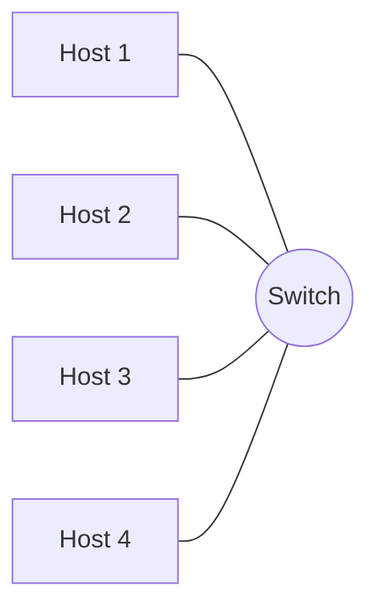
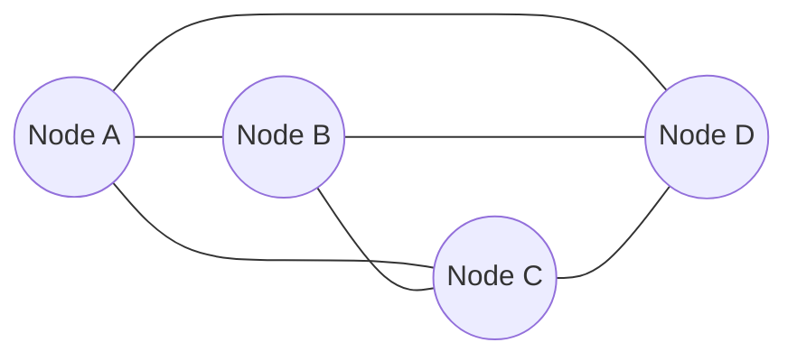

# Sebeke Novleri ve Topologiya

## Niye bu vacibdir

Tek kabel cekib, ya da bulud konsolunda bir duymeye basmazdan once, kimisi iki suala cavab vermelidir: *bu hansi sebekedir* ve *hansi formada olacaq*. Cavab sonra gelen demek olar ki, hersini muyyenlesdirir — avadanliq budcesini, ariza modlarini, tehlukesizlik serhedlerini, istifade edile bilen protokollari, hetta kadr modelini de. Iki min noutbuku fayl paylasimi ile baglayan kampus LAN-i hipervizor ile masiv arasinda blok I/O dasiyan SAN ile eyni problem deyil, ve SAN da `example.local` mer kez ofisinden olke o tayindaki filiala uzanan WAN backhaul ile eyni problem deyil. Simlar bir-birine oxsayir; muhendislik ise yox.

Eyni sey **topologiya**ya da aiddir. Saf ulduz ucuz ve idare etmeye asandir, lakin merkezi switch ondan asili olan her host ucun tek noqtelik ariza yeridir. Tam mesh möhtesem davamlidir, lakin link sayi node sayina gore kvadrat artir, beleli 20-node mesh 190 link, 100-node mesh 4,950 link teleb edir. Real sebekelerin coxu hibrid secir — giris layinda fiziki ulduz, nuvede mentiqi qismen mesh — ve bu yalniz her saf formanin trade-off-lari ile yasamis olduqdan sonra menalanir. Bu ders size lugat ve trade-off-lari verir ki, esas trekin qalani ([OSI modeli](./osi-model.md), [TCP/IP modeli](./tcp-ip-model.md), [Ethernet ve ARP](./ethernet-and-arp.md), [sebeke cihazlari](./network-devices.md), [IP unvanlama](./ip-addressing.md)) *hersin asla harada yasadigi* haqqinda mohkem zehni modele otura bilsin.

## Sebeke nedir

**Sebeke** sadece uc seyin razilasmasidir: danismaq isteyen **cihazlar**, aralarinda siqnali aparan **mühit** ve siqnalin ne demek oldugunu deyen **protokol**. Cihazlar noutbuk, telefon, server, printer, kamera, sensor, virtual masin ve ya konteyner ola biler. Mühit mis bukulmus cut, optik lif, radio, peyk ve ya bezi kohne IoT hallarinda hetta infraqirmizi ola biler. Protokol ise razilasmadir: alt qatda TCP/IP, sonra DNS, DHCP, HTTP, TLS ve sebekeni isledilen edn ondan onlarcasi.

O ucundan birini cekib ayirsaniz, hec ne qalmaz. Eyni Ethernet kabeli ile lakin razilasdirilmis protokolu olmayan iki noutbuk gerginlik otururdebilir, lakin mena otururdebilmez. TCP/IP-ni mukemmel isledib mühit olmadan iki noutbuk umumiyyetle danisa bilmez. Sebeke ucundan-ucuna, elli il erzinde yuzlerle satici terefinden tikilmis minlerle musteqil komponent uzunlugunda her ucunu eyni anda razilasdiran intizamdir — IEEE ve IETF kimi standart organlarinin movcudlugunun sebebi de budur, ve bu materialin protokollara bu qeder vaxt sarf etmesinin sebebi de.

## Sebeke novleri

Asagidaki tesnifat sebekeleri **eraziye** gore cesidleyir — fiziki (ve ya mentiqi) olaraq ne qeder uzaga catir. Erazi sonrasini her seyi mueyyen edir: zolaq genisliyini, gecikmeni, sahibliyi, istifade olunan avadanligi ve onu nece muhafize etmeyi.

| Növ | Erazi | Tipik miqyas | Numuneler | Harada istifade olunur |
|---|---|---|---|---|
| **LAN** (Local Area Network) | Bir bina ve ya mertebe | On-minlerle host | Ofis Ethernet, ev sebekesi | Stol arxasinda oturan default sebeke |
| **WLAN** (Wireless LAN) | LAN ile eyni, simsiz mühit | AP basina onlarla-yuzlerle musteri | Ofis Wi-Fi, ev Wi-Fi | Hereketliliyin onemli oldugu her yer |
| **PAN** (Personal Area Network) | Bir adamin etrafinda, ~1–10 m | Bir nece cihaz | Bluetooth qulaqliq, ag sa, telefon tether | Geyile bilen, periferiya |
| **CAN** (Campus Area Network) | Yaxin bina qrupu | Minlerle host | Universitet kampusu, korporativ HQ parki | Cox-binali tek-sahibli sahler |
| **MAN** (Metropolitan Area Network) | Sehher ve ya boyuk dairer | On-minlerle | Sehher fiber halqalari, ISP metro sebekeleri | Kerryerler, beledi sebekeler |
| **WAN** (Wide Area Network) | Olke, qite, qlobal | Limitsiz | Internet, MPLS belkemilari | Sehherler arasinda her sey |
| **SAN** (Storage Area Network) | Data merkezi sirasi ve ya rak | Saxlama masivleri ve serverler | Fibre Channel fabriki, iSCSI fabriki | Hipervizor ve DB host-larina blok saxlama |
| **VPN** (Virtual Private Network) | Mentiqi, WAN uzerinde gedir | Iki ucnoqte ile minlerce arasi | Site-to-site IPsec, uzaq-giris OpenVPN/WireGuard | Acik WAN uzerinde xususi overlay |

Yadda saxlamaga deyer bir nece izah. **WLAN** **LAN**-dan ferqli sebeke novu deyil — mühiti kabel evezine radio olan LAN-dir, ve demek olar ki, hemise giris noqtesinde simli LAN-a baglanir. **CAN** sadece bir nece bina uzunlugunda buyumus LAN-dir; CAN ile boyuk LAN arasinda sertt bulanikdir. **MAN** adeten ISP ve ya beledi terefinden idare olunur, sizin terefinizden yox. **Internet** dunyanin en boyuk WAN-i — WAN-larin WAN-i — ve onu birlikde tutan protokol BGP-dir. **SAN** *blok* I/O dasiyir (disk oxu ve yazilari) ve adeten LAN uzerinde *fayl* I/O dasiyan NAS ile qaristirilir; asagidaki problem hellisi bolmesi buna qayidir. **VPN** umumiyyetle fiziki sebeke deyil — movcud WAN (demek olar ki, hemise Internet) uzerinde laylanmis sifrelenmis tuneldir, ve yalniz tunelin ortadaki ictimai hop-lari gizletmesi sebebinden xususi LAN kimi hiss olunur. Simsiz xususiyyetler ucun [Simsiz Tehlukesizlik](../secure-design/wireless-security.md), bu novler arasinda seqmentasiya dizayni ucun ise [Tehlukesiz Sebeke Dizayni](../secure-design/secure-network-design.md) baxin.

Praktikada gorecyiniz iki termin daha. **Intranet** sadece teskilatin xususi sebekesidir, adeten LAN ve ya VPN/WAN ile birlesdirilmis LAN destedir, kadr ucun hudutlanir. **Extranet** eyni fikrin nezaret olunan kenardakilara — terefdaslar, satinlar, podratlilar — uzadilmasidir, adeten VPN ve ya sertt brandmauer ile mudafie edilmis DMZ vasitesile. Hec biri ayri fiziki nov deyil; her ikisi artiq bildiyiniz LAN/WAN/VPN texnologiyasi uzerinde siyasat ve giris etiketleridir.

## Fiziki ile mentiqi topologiya

Iki sebeke eyni fiziki simlere sahib ola biler ve tamamile ferqli davrana biler, cunki **fiziki topologiya** (hansi kabel hara gedir) **mentiqi topologiya** (trafik aslinda nece axir) ile eyni deyil.

**Fiziki topologiya** kabel maqsadinda fenerile cizeceyinizdir: her kabel, her port, her patch paneli. Modern her simli LAN demek olar ki, fiziki olaraq **ulduz**dur — her host merkezi switch-e baglanir — cunki strukturlasdirilmis kabel sebkesi bunu sim sandiqina geri ceekir. **Mentiqi topologiya** ise paketleri izleseniz cizeceyinizdir: hansi host hansina cata bilir, hansi broadcast domeni vasitesile, hansi VLAN ve marsrutlama serhedi vasitesile. Eyni ulduz simlenmis switch bir boyuk duz broadcast domeni, uc izole VLAN ve ya diger switch-lere noqte-noqte Layer-3 link-li qismen mesh saxlaya biler — eyni kabeller, ferqli mentiq. Simsiz oxsardir: fiziki olaraq her musteri bir giris noqtesi ile danisir (radioda ulduz), lakin mentiqi olaraq mesh Wi-Fi yerlesdirilmesi AP-larin ozleri arasinda qismen mesh formalasdirir. Topologiya diaqramini oxuyanda hemise sorusun ki, hansini gosterir.

## Adi topologiyalar

Asagidaki alti klassik topologiyanin her birinin xarakterik formasi, xarakterik ariza modu, ve xarakterik hele de oz yerini qazandigi yer var.

### Ulduz

```
          ┌──────┐
          │ Host │
          └──┬───┘
             │
   ┌─────┐   │   ┌─────┐
   │Host ├───┼───┤ Host│
   └─────┘   │   └─────┘
          ┌──┴───┐
          │Switch│
          └──┬───┘
          ┌──┴───┐
          │ Host │
          └──────┘
```

Her host merkezi switch-e oz xususi link-ine sahibdir. **Plus:** en sade kabellesdirme, baska host-lari narahat etmeden host elave/cixarmag asandir, asan ariza izolyasiyasi (pis kabel butun LAN-a yox, bir porta tesir edir). **Minus:** merkezi switch ondan asili olan herkes ucun tek noqtelik arizadir. **Tipik istifade:** demek olar ki, Yer uzunde her simli giris layi — her ofis mertebesi, dord LAN portlu her ev marsrutlasdiricisi, her server raki-nin top-of-rack switch-i.

### Sin

```
   ┌─────┐   ┌─────┐   ┌─────┐   ┌─────┐
   │Host │   │Host │   │Host │   │Host │
   └──┬──┘   └──┬──┘   └──┬──┘   └──┬──┘
      │         │         │         │
   ═══╧═════════╧═════════╧═════════╧═══   paylasilan koaks sin
```

Butun host-lar bir fiziki kabeli paylasir (klassik olaraq qalin ve ya nazik koaks). **Plus:** trivial sekilde ucuzdur; ortada aktiv avadanliq yoxdur. **Minus:** her host her oturucusunu esidir, beleli toqqusma cekinmesi (CSMA/CD) lazimdir; istenilen yerdeki tek qirilis butun seqmenti yikir; kabel ne qeder uzundursa, duzgun terminasiya etmek o qeder cetindir. **Tipik istifade:** tarixi 10BASE2/10BASE5 Ethernet ve avtomobil icindeki CAN sin. Bu gun yeni sin LAN tikmeyeceksiniz.

### Halqa

```
        ┌──────┐
   ┌────┤ Host ├────┐
   │    └──────┘    │
┌──┴───┐         ┌──┴───┐
│ Host │         │ Host │
└──┬───┘         └──┬───┘
   │    ┌──────┐    │
   └────┤ Host ├────┘
        └──────┘
```

Her node teqim olunan iki qonsuya baglanir, qapali halqa formalasdirir; data halqa boyu seyahet edir. **Plus:** proqnozlasdirilan, deterministik vaxtlanma; node elave etmekle uzatmaq asandir. **Minus:** halqa cift-eks-firlanan deyilse (FDDI, SONET, dayaniklilikli Token Ring) tek qirilis trafiqi dayandirir; ulduzdan daha cetindir problem hellisi. **Tipik istifade:** kohne Token Ring; halqa topologiyasinin sub-50 ms failover verdiyi modern metropoliten fiber halqalar (SONET/SDH, Resilient Ethernet Protocol).

### Mesh

```
    ┌──────┐ ─────────── ┌──────┐
    │Node A├─────────────┤Node B│
    └───┬──┘             └──┬───┘
        │  \             /  │
        │    \         /    │
        │      \     /      │
        │        X          │
        │      /   \        │
        │    /       \      │
        │  /           \    │
    ┌───┴──┐             ┌──┴───┐
    │Node D├─────────────┤Node C│
    └──────┘ ─────────── └──────┘
```

Her node diger her node-a baglanir (tam mesh) ve ya onlarin coxuna (qismen mesh). **Plus:** maksimum davamliliq — istenilen iki node arasinda bir nece yol var, beleli link ve ya node arizasi sebekeni nadiren bolur. **Minus:** tam mesh ucun link sayi `n × (n-1) / 2`-dir, beleli xerc ve mürekkeblik node sayina gore partlayir; on-on iki node-dan sonra praktiki deyil. **Tipik istifade:** WAN belkemilari (nuve marsrutlasdiriciler arasinda qismen mesh), butun-evlik ortuk ucun Wi-Fi mesh sistemleri, ve spine-leaf kimi yuksek-elcatanliqli DC fabrikleri (strukturlasdirilmis seklindeki qismen mesh).

### Agac (ierarxik)

```
                  ┌──────────┐
                  │ Nüve sw  │
                  └────┬─────┘
              ┌────────┴────────┐
        ┌────┴────┐        ┌────┴────┐
        │ Paylasm │        │ Paylasm │
        └────┬────┘        └────┬────┘
       ┌────┴────┐         ┌────┴────┐
   ┌───┴──┐  ┌───┴──┐  ┌───┴──┐  ┌───┴──┐
   │Giris │  │Giris │  │Giris │  │Giris │
   └──────┘  └──────┘  └──────┘  └──────┘
```

Ulduzlarin ierarxiyasi: giris switch-leri paylasdirma switch-lerine uplink olur, onlar da nuveye uplink olur. **Plus:** minlerle host-a temiz miqyas yapir; her layda aydin ariza domeni; cox-mertebeli binalarin fiziki yerlesdirilmesine uygundur. **Minus:** yuxari-lay arizasi alti hersi kesir (artiqliqli uplink, MLAG/LACP ve STP ile yumsadilir); her layda diqqetli tutum planlasdirmasi teleb edir. **Tipik istifade:** klassik Cisco uc-laylik kampus dizayni — hele de korporativ LAN-larda dominant model ve demek olar ki, butun bulud VPC-larin gizli formasi.

### Hibrid

Demek olar ki, real her sebeke **hibrid**dir, cunki hec bir teek topologiya her tellebe cavab vermir. Tipik muessise kampus layinda agac, nuvede qismen mesh, her giris switch-de ulduz, binalar arasinda metro fiberde halqa ve anbarda Wi-Fi mesh-dir. Senet her topologiyanin trade-off-larinin menalandigi sebeke parcasina uygunlasdirilmasi ve hansinin hansi oldugunu aydin senedlasdirmekde, beleli sonraki muhendis tahmin etmeli olmasin.

## Topologiya mermaid diaqramlari

**Ulduz** topologiyasi — bir switch, dord host:



Dord node-lik **tam mesh** — her node diger her node-a birbasa baglanir, cemi alti link:



Dord node ucun bu `4 × 3 / 2 = 6` link-dir; on node ucun `45`, yuz ucun `4,950`. Bu kvadrat partlayis tam mesh-in demek olar ki, derhal miqyas etmemesinin sebebidir.

Praktikada miqyasda goruleceyiniz **qismen mesh**-dir — her nuve node-u butun digerlerine yox, bir necesine baglanir — bu davamliliq faydasinin coxunu saxlayir, link sayini ise idare olunan qoyur. Modern data-merkezi **spine-leaf** fabrikleri tam buradir: her leaf switch her spine switch-e baglanir, lakin leaf-ler leaf-lere baglanmir ve spine-ler spine-lere baglanmir.

## Switching ile routing

Sebekenin etmeli oldugu iki esas oturucu qerari **switching** ve **routing**-dir, ve ferq ondadir ki, trafik *hara* gede biler.

**Switching** Layer 2-de tek broadcast domeni icinde olur. Switch Ethernet cervisinin teyinat MAC-ini oxuyur, oz CAM cedvelinde axtarir, ve cervisi uygun gelen porta otururduyur — sürettli, sade ve bir VLAN olcusu ile mehduddur. Eyni broadcast domenindeki her sey eyni broadcast-lari (ARP who-has, DHCP Discover) esidir ve komeksiz domendan kenara hec ne cata bilmez. MAC-lar, cervilar, CAM cedveleri ve VLAN teqlemesi haqqinda derin baxis ucun [Ethernet ve ARP](./ethernet-and-arp.md) baxin.

**Routing** Layer 3-de broadcast domenleri *arasinda* olur. Marsrutlasdirici paketin teyinat IP-sini oxuyur, oz marsrutlama cedvelinde axtarir, ve paketi novbeti hop istiqametinde interfeysden cixarir — yolda L2 basligini yenidne yaza biler. Routing trafikin alt-sebekelerin, sahler arasinda ve nehayet ictimai Internet uzunde kecmesini icaze edir. Marsrutlasdirici, L3 switch, brandmauer ve yuk balansciinin aslinda ne etdiyi haqqinda derin baxis ucun [Sebeke Cihazlari](./network-devices.md) baxin. Iclesdirilmesi en vacib qayda: **switching sizi qutu icinde saxlayir, routing ise sizi onun xaricine cixarir.**

## Elaqe modelleri

Topologiyadan asili olmayaraq, her oturucunun **catdirma modeli** var — gonderici nece qebuledici cataniq nezerde tutur. Dord klassik model var.

| Model | Kardinallik | Mena | Numune protokollar |
|---|---|---|---|
| **Unicast** | Bir-bir | Tek gonderici, tek qebuledici | HTTP, SSH, SMTP, demek olar ki, her TCP sessiyasi |
| **Multicast** | Bir-cox-qrup | Bir gonderici, qrupa qosulmus her host | mDNS (`224.0.0.251`), IGMP, OSPF hello-lari, IPTV axinlari, maliyye bazar data axinlari |
| **Broadcast** | Bir-hamiya | Bir gonderici, broadcast domenindeki her host | ARP sorgulari (`FF:FF:FF:FF:FF:FF`), DHCP Discover, NetBIOS ad elanlari |
| **Anycast** | Bir-en-yaxina | Bir gonderici, unvan qrupunun topologiyaca en yaxin uzvu | DNS root serverleri, ictimai DNS resolverleri (`1.1.1.1`, `8.8.8.8`), CDN edge noqteleri |

Insanlari tutan bir nece qeyd. **IPv6-da broadcast yoxdur** — IPv4 broadcast ile ne edirdise, IPv6 onu link-local multicast ile edir (`ff02::1` "bu link-deki butun node-lar"-dir). **Anycast** cerciv-seviyyeli rejim deyil, marsrutlama hilesidir: bir cox fiziki olaraq ferqli serverler eyni IP-ni bir cox saytdan reklam edir, ve BGP her musterini sebeke baximindan en yaxin sayta yonlendirir — `1.1.1.1` qlobal olaraq tek-reqemli millisaniye gecikme ile cavab verir. Miqyasda **multicast** sebekenin emekdasligini teleb edir (switch-lerde IGMP snooping, marsrutlasdiricilarda PIM); olmazsa multicast trafiqi broadcast kimi tasar. Broadcast kicik LAN-da yaxsidir ve nehe duz birinde feliyetdir — VLAN-larin movcud olmasi sebebi de dur.

## Bir paraqrafda VLAN-lar

**VLAN** (IEEE 802.1Q, Virtual LAN) tek fiziki switch-i (ve ya birlesdirilmis cox switch-i) bir nece musteqil broadcast domenine cevirne mentiqi bolgudur. VLAN 10-dakl host-lar VLAN 20-deki host-lara umumiyyetle Layer-2 cervilar gondere bilmez — Ethernet baximindan ferqli switch-lerdedirler. VLAN-lar arasinda danismaq ucun ACL, brandmauer qaydasi ve ya yoxlama tetbiq ede bilcayiniz Layer-3 cihazinda marsrutlasmagi lazimdir. VLAN-lar her modern LAN-da *esas* seqmentasiya aletidir: istifadeci, server, idare, ses, qonaq Wi-Fi, IoT, kamera ve printer ucun ayri VLAN-lar normaldir. 802.1Q teq formati, trunk ile access portlar, native VLAN ve konfiqurasiya detallari ucun [Ethernet ve ARP](./ethernet-and-arp.md) baxin.

## Praktiki / mesq

1. **Senariolari sebeke novlerine uygunlasdirin.** Asagidaki sekkiz senario icin en uygun sebeke novunu (LAN / WLAN / PAN / CAN / MAN / WAN / SAN / VPN) adlandirin ve bir cumle ile esaslandirin: (a) Bluetooth klaviatura noutbukla danisir. (b) Universitet on iki binani bir fiber belkemiyle baglayir. (c) ISP fiber halqasi sehher boyu iyirmi biznesi baglayir. (d) Hipervizor kuvesi blok saxlamani masivden Fibre Channel uzerinden oxuyur. (e) Evden iscci WireGuard uzerinden ofise baglanir. (f) Ferqli olkelerdeki iki korporativ ofis MPLS ile baglanir. (g) Acik planli ofisde uc giris noqtesinde altmis noutbuk. (h) Dord simli portu ve bir Wi-Fi radiosu olan ev marsrutlasdiricisi.
2. **Bir ulduz ve 5-node tam mesh cizin.** Kagiz ve ya lova uzerinde her ikisini cizin. Mesh-deki link-leri sayin ve `n × (n-1) / 2` formuluna gore yoxlayin. Sonra eyni bes host-u agac kimi cizin (bir nuve, bir paylasdirma, uc giris node) ve oradaki link-leri sayin.
3. **Ev sebekenizin topologiyasini muyyenlesdirin.** Marsrutlasdirici/AP, simli host-lar, simsiz host-lar ve (varsa) istenilen switch-i qeyd edin. Simli teref ulduzdurmu? Simsiz teref ulduz, mesh ve ya tek AP-dirmi? Halqa ve ya sin varmi? Bunu topologiya diaqrami kimi cizin.
4. **Elaqe modelini muyyenlesdirin.** Asagidaki her protokol ucun modeli (unicast / multicast / broadcast / anycast) adlandirin ve niyeyi izah edin: `example.local`-a HTTPS, teze yuklenmis noutbukdan DHCP Discover, futbol oyununun IPTV axisi, `1.1.1.1`-e sorgu, default gateway ucun ARP sorgusu, OSPF hello, `ssh` sessiyasi ve AirPrint printerinin mDNS elani.

## Islenmis numune

`example.local` baska sehherde on-bes kadr ucun kicik filial ofis acir, ve sizden sebekeni ucundan-ucuna spec etmek istenmisdir. Tariflendirme "muteddil budce, baz ofisin parcasi kimi hiss olunmali, iki hefteye hazir olmali"-dir.

**LAN novu ve topologiyasi.** On-bes simli host, on telefon ve printer rahatca tek 24-portlu PoE switch-e sigir — ortada switch olan fiziki **ulduz**. PoE stol telefonlarini ve iki tavan giris noqtesini ayri injektorsuz qidalandirir. Bu olcude ikinci switch ve ya paylasdirma layi lazim deyil; ofis qirxa qeder buyurse, ikinci giris switch elave edib birinciye uplink edersiniz.

**WLAN.** Iki tavan AP (acik planli sahnin her ucunde bir) kicik **WLAN** formalasdirir, hem ikisi PoE switch-e geri kabel olunur. Uc SSID: `corp` (kadr cihazlari, korporativ VLAN-a xeritilenir), `guest` (yalniz Internet, izole VLAN, captive portal) ve `iot` (printer ve agilli sensorlar, digerlerinden gelen olmayan izole VLAN). Radio planlama detallari ucun [Simsiz Tehlukesizlik](../secure-design/wireless-security.md) baxin.

**HQ-ya backhaul.** Bahali MPLS almaq evezine, filial adi biznes fiber xetti istifade edir ve ictimai WAN uzerinden baz-ofis brandmauerine **IPsec site-to-site VPN** qaldirir. Tunel filiali korporativ LAN-in baska seqmenti kimi gosterir; filial ile HQ arasinda marsrutlama tunel vasitesile noqte-noqtedir; DNS split-horizon-dur ki, daxili adlar daxili IP-lere cevrilsin. Link dusurse filial offline olur, beleli ikinci fazada avtomatik failover-li ehtiyat 5G link elave olunur.

**Seqmentasiya.** Filialada uc VLAN: `VLAN 10` corp, `VLAN 20` guest, `VLAN 30` iot. PoE switch hem ucunu brandmauere trunk edir; brandmauer VLAN-arasi siyaseti tetbiq edir (corp HQ-ya VPN ile cata biler, guest yalniz Internet-e cata biler, iot yalniz printer ve syslog kollektoruna ve baska heç ne-ye cata biler). Bu [Tehlukesiz Sebeke Dizayni](../secure-design/secure-network-design.md)-dan kitabci tehlukesiz-by-design modelidir.

Butun filial — bir ulduz LAN, bir kicik WLAN, WAN uzerinde bir VPN, uc VLAN — sehertedek olculenir ve gun erzinde rakla nir.

## Problem hellisi ve tezgehler

**Saf ulduzda tek noqtelik ariza.** Merkezi switch olerse, ondan asili olan her host elaqeni itirir. Yiginli ve ya sasi-artiqliqli switch-ler, cift uplink (LACP/MLAG) ve kicik sayhler ucun rafda hot ehtiyat ile yumsadirin.

**Duz sebekelerde broadcast firtinalari.** Bir broadcast domeninde min host olan LAN tutumunun ehemiyyetli hissesini ARP, DHCP, mDNS ve diger broadcast-lara sarf edir. Daha pisi, spanning tree olmayan duz sebekede switching loop her broadcast-i eksponensial sekilde guclendirilen taşqina cevirir ki, butun VLAN-i saniyeler erzinde yikir. VLAN-larla seqmentle, STP/RSTP isletin ve broadcast sayqaclarini izleyin.

**Tam-mesh xerci.** Muhendisler lova uzerinde tam mesh cizmeyi sevirler, cunki davamli gorunur. Onlar dehsetli miqyas yapir: `n × (n-1) / 2` link demek olur ki, 10-node tam mesh 45 link, 50-node tam mesh 1,225 link-dir. On-on iki node-dan sonra demek olar ki, hemise qismen mesh, spine-leaf fabriki ve ya ierarxik dizayn isteyirsiniz.

**VLAN sprawl.** "Sadece bir VLAN daha elave et" asandir; ferqli native-VLAN ayarlari, kohne trunk allow-list-leri ve senedsiz VLAN-arasi ACL-leri olan otuz switch uzunde sekksen VLAN-i idare etmek deyil. VLAN inventari saxlayin, istifade olunmayan VLAN-lari trunk-lardan kesib, her teze gelenden "oz sebekem" istediyinde yeni VLAN yaratmaqdan cekinin.

**SAN-i NAS-la qaristirmaq.** **SAN** (Storage Area Network) blok-seviyyeli I/O dasiyir — host xam disk gorur ve oz fayl sistemini onun uzerinde isledir. **NAS** (Network-Attached Storage) ise normal LAN uzerinde fayl-seviyyeli I/O dasiyir — host NFS/SMB share-i qosur ve saxlama cihazi fayl sistemini isledir. Onlar ust-uste oxsayir (her ikisi "sebeke uzerinde saxlama"-dir), lakin protokollar, gecikme telebleri ve memarlik teesirleri tamamile ferqlidir. SAN-lar adeten xususi Fibre Channel ve ya itkisiz Ethernet fabrikleri uzerinde isleyir; NAS noutbuklariniz ile eyni LAN uzerinde isleyir.

**Fiziki ile mentiqi topologiyani qaristirmaq.** Junior muhendis "her host switch-e baglanir" gorur ve sebekenin ulduz oldugunu netice cixarir, sonra ariza-domeni analizini ele dizayn edir ki, switch arizasi bir defede bir host-u izole edir. Mentiqi reallq odur ki, hemin bir switch-in arizasi butun VLAN-i, VLAN-arasi gateway-i, brandmauere olan trunk-i ve WAN-a olan teek yolu cixara biler — fiziki ulduzun gorsetdiyinden cox daha boyuk partlayis radiusu. Arizalar haqqinda mulahize edende hemise mentiqi topologiya haqqinda mulahize edin.

## Esas xulaseler

- Sebeke **cihazlar + mühit + protokol**-dur; herhangi birini cixarsaniz sebeke yoxdur.
- Sebeke novleri **eraziye** gore tesnif olunur: bina seviyyesinde LAN/WLAN, adam etrafinda PAN, kampus boyu CAN, sehher boyu MAN, sehher arasi WAN, blok saxlama ucun data merkezindeki SAN ve istenilen WAN uzerinde mentiqi overlay olan VPN.
- **Fiziki topologiya** (hansi kabel hara gedir) ve **mentiqi topologiya** (trafik aslinda nece axir) ferqli ola biler — ulduz-kabelli switch qismen mesh, bir nece izole broadcast domeni ve ya bir duz seqment saxlaya biler.
- Klassik topologiyalar (**ulduz, sin, halqa, mesh, agac, hibrid**) sadeliyi, xerci ve davamliligi ferqli mubadile edir; demek olar ki, real her sebeke hibriddir, cunki hec bir teek forma her tellebe cavab vermir.
- **Switching** trafiki broadcast domeni icinde saxlayir; **routing** ise onu domenler arasinda hereket etdirir. Hem ikisi lazimdir; hec biri digerini evezlemir.
- Dord elaqe modeli — **unicast, multicast, broadcast, anycast** — *kim qebul edir*-i tesvir edir, ve her biri spesifik protokollara ve dizayn nezerlerine xeritilenir.
- **VLAN-lar** bir fiziki switch-i bir cox mentiqi broadcast domenine seqmentlasdirir ve LAN tehlukesizliyi esas inssaat blokudur.

## Istinadlar

- IEEE 802 LAN/MAN Standartlari Komitesi — butun IEEE 802 sebeke standartlari indeksi (Ethernet, Wi-Fi, VLAN teqi ve s.): https://www.ieee802.org/
- RFC 4541 — *Considerations for IGMP and MLD Snooping Switches* (switch-lenmis sebekelerde multicast): https://www.rfc-editor.org/rfc/rfc4541
- Cloudflare Learning Center — *What is network topology?* (aydin vizual primer): https://www.cloudflare.com/learning/network-layer/what-is-network-topology/
- Cisco — *Campus LAN and Wireless LAN Design Guide* (klassik ierarxik dizayn arayisi): https://www.cisco.com/c/en/us/td/docs/solutions/CVD/Campus/cisco-campus-lan-wlan-design-guide.html
