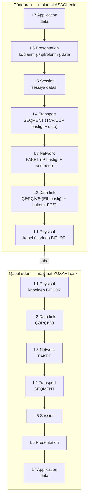

# OSI Modeli

## Bu niyə vacibdir

İnfosek sahəsində tutacağınız hər rol eyni lüğət üzərində işləyir, və OSI modeli məhz həmin lüğətdir. SOC analitiki "bu Layer 7 problemidir" deyəndə, pen-tester "Layer 2-də zəhərləmə apardım" deyəndə, şəbəkə mühəndisi "firewall Layer 4 yoxlaması edir" deyəndə — hamısı eyni yeddi qatlı zehni xəritəyə işarə edir. Bu xəritə olmadan hər söhbət əl-qol oynatmağa çevrilir. Onunla isə diaqnostika "nə xarabdır?" sualından **hansı qat sınıb** sualına çökür — və cavab saatlarla deyil, dəqiqələrlə gəlir. Şifrələmə bir qatda, marşrutlaşdırma başqasında, çərçivələmə üçüncüsündə yaşayır; hücum və ya nasazlıq demək olar ki, həmişə tam olaraq həmin qatlardan birində olur, və o qatın adını çəkmək problemin yarısıdır.

OSI modeli həm də tədris modelidir — kabel üzərində gedən paketlər əslində OSI deyil, [TCP/IP Modeli](./tcp-ip-model.md) ardıcıllığını izləyir. Lakin OSI hər ikisi haqqında danışdığımız dildir, və məhz buna görə hər sertifikat, hər istehsalçı, hər dərslik onu hələ də ilk öyrədir.

## Yeddi qata bir baxış

Model aşağıda fiziki kabeldən başlayıb yuxarıda istifadəçi tətbiqinə qədər gedir. Məlumat göndərəndə **aşağı** enir, kabeldən keçir və qəbul tərəfində **yuxarı** qalxır. Hər qat bir başlığı əlavə (və ya silir).

| # | Qat | Nə edir | Real protokol nümunələri |
|---|---|---|---|
| 7 | Application (Tətbiq) | İstifadəçi-üzlü protokollar | HTTP, HTTPS, SMTP, SSH, DNS, FTP |
| 6 | Presentation (Təqdimat) | Kodlama, şifrələmə, sıxılma | TLS, MIME, JPEG, ASCII, gzip |
| 5 | Session (Sessiya) | Sessiyaların açılması, saxlanması, bağlanması | NetBIOS, RPC, SMB, SOCKS |
| 4 | Transport (Nəqliyyat) | Uçdan-uca çatdırılma, portlar, seqmentləşdirmə | TCP, UDP, QUIC, SCTP |
| 3 | Network (Şəbəkə) | Məntiqi ünvanlama, şəbəkələr arası marşrutlaşdırma | IP, ICMP, IPsec, OSPF, BGP |
| 2 | Data link (Məlumat-keçidi) | Çərçivələmə, bir keçiddə MAC ünvanlama | Ethernet, Wi-Fi 802.11, ARP, VLAN (802.1Q), PPP |
| 1 | Physical (Fiziki) | Elektrik/optik siqnal, kabel, RF | Mis UTP, fiber, RJ-45, siqnal modulyasiyası |

Faydalı qayda: **qat nə qədər aşağıdırsa, miqyas o qədər lokaldır**. Layer 1 bir kabeldir. Layer 2 bir broadcast domenidir. Layer 3 İnterneti əhatə edir. Layer 4–7 isə iki ünsiyyət edən nöqtənin daxilində yaşayır.

## Qat-bə-qat ətraflı

### Layer 1 — Physical (Fiziki)

Fiziki qat xam bitləri misdə elektrik siqnalları, fiberdə işıq impulsları və ya havada radio dalğaları kimi daşıyır. O, gərginlikləri, tezlikləri, konnektor formalarını, pin-aut, və bit-kodlama sxemlərini təyin edir. Bu qatdakı qurğulara kabellər, hublar, repeaterlər, trasceiverlər və Wi-Fi kartınızdakı radio daxildir. Burada ünvan anlayışı yoxdur — sadəcə "siqnal keçirmi?"

**L1-də nə sınır:** çıxarılmış kabellər, əyilmiş fiber, elektromaqnit maneələri, ölü SFP-lər, tükənmiş PoE büdcəsi, `down` vəziyyətində ilişib qalan switch portu. Ən sürətli L1 yoxlaması — Linuxda `ip link` və ya NIC-dəki link LED-i.

### Layer 2 — Data Link (Məlumat-keçidi)

Layer 2 bit axınını mənbə və təyinat **MAC ünvanı** olan **çərçivələrə** çevirir, beləliklə bir neçə cihaz bir fiziki mühiti bir-birini pozmadan bölüşə bilər. **Ethernet** (IEEE 802.3) və **Wi-Fi** (IEEE 802.11) hökmran L2 protokollarıdır. **ARP** (Address Resolution Protocol) burada L2 ilə L3 arasında yapışqan kimi yaşayır. **VLAN-lar** (802.1Q) bir switchi bir neçə təcrid edilmiş L2 şəbəkəsinə bölür. Switch-lər kanonik L2 cihazlarıdır — hansı MAC-ın hansı portda olduğunu öyrənir və çərçivələri yalnız lazım olan yerə yönləndirir.

**L2-də nə sınır:** ARP keş zəhərlənməsi, MAC daşqını, dupleks uyğunsuzluğu, broadcast tufanları, səhv konfiqurasiya edilmiş VLAN trunkları, köçürmədən sonra hələ də səhv VLAN-da qalan port. Ətraflı: [Ethernet və ARP](./ethernet-and-arp.md).

### Layer 3 — Network (Şəbəkə)

Layer 3 **məntiqi ünvanlamanı** (IP) və **marşrutlaşdırmanı** təqdim edir, beləliklə paketlər planetin o biri üzündəki təyinata çatmaq üçün bir çox müxtəlif L2 şəbəkəsindən keçə bilər. Hökmran protokollar **IPv4**, **IPv6** və **ICMP** (`ping` və `traceroute` istifadə edir). OSPF və BGP kimi marşrut protokolları da burada yaşayır. Marşrutlaşdırıcılar (router) kanonik L3 cihazlarıdır — təyinat IP-ni oxuyur, marşrut cədvəlinə baxır və sonrakı sıçrayışa yönləndirir.

**L3-də nə sınır:** səhv default gateway, çatışmayan marşrut, qara dəlik marşrutları, MTU uyğunsuzluqları, asimmetrik marşrutlaşdırma, statik IP-li maşının DHCP zonasına qoşulmasından sonra IP toqquşması. `tracert` / `traceroute` üstün L3 diaqnostika alətidir.

### Layer 4 — Transport (Nəqliyyat)

Layer 4 — "host hostla danışır"ın **tətbiq tətbiqlə danışır**a çevrildiyi qatdır. O, **portları** (bir host bir çox xidmət işlədə bilsin), **seqmentləşdirməni** (axını paketə sığacaq parçalara bölmək), və TCP üçün **etibarlılığı** (ardıcıllıq nömrələri, təsdiqləmələr, yenidən ötürmə, axın nəzarəti) təqdim edir. İki hökmran L4 protokolu **TCP** (etibarlı, əlaqə-yönümlü) və **UDP** (ən yaxşı cəhd, əlaqəsiz). **QUIC** isə UDP üzərində qurulmuş yeni etibarlı protokoldur.

**L4-də nə sınır:** firewallun portu blokladığı, NAT qutusunda dolu əlaqə cədvəli, TCP pəncərə dayanmaları, SYN daşqınları, səhv interfeysə bağlanmış xidmətlər. Ətraflı: [TCP və UDP](./tcp-and-udp.md).

### Layer 5 — Session (Sessiya)

Layer 5 iki nöqtə arasında **sessiyanın** həyat dövrünü idarə edir — onu qurmaq, canlı saxlamaq, kontrolnoqtaya almaq və təmiz şəkildə bağlamaq. Müasir şəbəkələrdə bu işin çoxu yuxarıya tətbiq qatına (HTTP cookies, OAuth tokenləri) və ya aşağıya nəqliyyat qatına (TCP-nin özünə) köçüb, ona görə L5 yeddi qat arasında ən "bulanıq" olanıdır. Klassik L5 nümunələrinə **NetBIOS sessiya xidməti**, **RPC**, **SMB sessiya qurulması** və **SOCKS** proksi protokolu daxildir. TLS sessiya bərpa biletləri də ruhən burada yaşayır.

**L5-də nə sınır:** kiçik fasilədən sonra bərpa olmayan sessiyalar, RPC bağlanma uğursuzluqları, Wi-Fi roaming-də qopan SMB sessiyaları, heç vaxt təmizlənməyən yarı-bağlı əlaqələr.

### Layer 6 — Presentation (Təqdimat)

Layer 6 — "tərcüməçidir": tətbiqin məlumatını şəbəkənin daşıya biləcəyi formaya çevirir və geri qaytarır. Buraya **simvol kodlaması** (ASCII, UTF-8), **məlumat seriallaşdırması** (JSON, XML, ASN.1), **sıxılma** (gzip, deflate) və ən vacibi **şifrələmə** (**TLS**) daxildir. Brauzerdə qıfıl gördüyünüz zaman bu — L6-nın işi: tətbiq adi HTTP danışır, lakin L6 onu L4-ə vermədən əvvəl TLS-ə bükür.

**L6-da nə sınır:** vaxtı keçmiş və ya etibarsız TLS sertifikatları, müştəri-server arasında şifrə uyğunsuzluğu, simvol kodlaması pozğunluqları (mojibake), pozulmuş sıxılma müqaviləsi, ortaqdakı qurğuların SNI yoxlaması.

### Layer 7 — Application (Tətbiq)

Layer 7 — istifadəçinin və əksər tərtibatçıların əslində gördüyü hər şeydir. **HTTP**, **HTTPS**, **DNS**, **SMTP**, **SSH**, **FTP**, **LDAP**, **SNMP**, **RDP** burada yaşayır. OSI-dəki "application" "iki dəfə kliklədiyiniz proqram" demək deyil; o, proqramın danışdığı **protokoldur**. Veb brauzeri istifadəçi tətbiqidir; HTTP onun istifadə etdiyi L7 protokoludur. Web Application Firewall (WAF), reverse proksi və API gateway-lər L7-də işləyir, çünki onlar real tətbiq mesajlarını oxumalı və yenidən yazmalıdırlar.

**L7-də nə sınır:** sınmış DNS qeydləri, vaxtı keçmiş API tokenləri, səhv formatlı JSON, HTTP 4xx/5xx cavabları, tətbiq məntiqi səhvləri, gövdədə xəta mesajı ilə 200 OK qaytaran veb-server. "Sayt işləmir" şikayətlərinin əksəriyyəti əslində bu qatda yaşayır.

## İnkapsulyasiya — məlumat stekdə necə hərəkət edir

Məlumat göndərəndə hər qat yuxarıdakı qatın yükünü öz başlığı (bəzən də quyruğu) ilə bükür. Qəbul tərəfində hər qat öz başlığını çıxarır və yükü yuxarı ötürür. Bu **inkapsulyasiyadır** və paket çəkilişlərinin niyə yuva-yuva qutular kimi göründüyünün səbəbidir.

**PDU adlarını** (Protocol Data Units) əzbərləyin: L1-də bitlər, L2-də çərçivələr, L3-də paketlər, L4-də seqmentlər, L5–L7-də data. Kimsə "paketi at" deyəndə L3 nəzərdə tutulur. "Çərçivəni at" — L2. Lüğət bilərəkdən dəqiqdir.

## OSI vs TCP/IP

OSI modelinin yeddi qatı var və 1980-ci illərdə komitə tərəfindən təmiz istinad kimi nəzərdə tutulub. **TCP/IP modelinin** dörd qatı var və İnternet əslində bunun üzərində işləyir. Onlar ciddi şəkildə üst-üstə düşür, lakin eyni deyil.

| OSI (7 qat) | TCP/IP (4 qat) |
|---|---|
| Application (7) + Presentation (6) + Session (5) | Application |
| Transport (4) | Transport |
| Network (3) | Internet |
| Data link (2) + Physical (1) | Network Access (Link) |

OSI **lüğətdir**; TCP/IP **icradır**. Hər mühəndis hər ikisini istifadə edir — kabeldə paketlər TCP/IP izləsə də, "Layer 7 problemi" və "Layer 2 məsələsi" gündəlik nitqdir. İcra tərəfi üçün: [TCP/IP Modeli](./tcp-ip-model.md).

## OSI qatları üzrə yayılmış təhlükəsizlik hücumları

Diaqnostikaya kömək edən eyni lüğət **təhlükəsizlik insidentlərini** triaj etməyə də kömək edir. Demək olar ki, hər bir hücum texnikası sui-istifadə etdiyi qata təmiz şəkildə yerləşdirilə bilər — qatın adı çəkiləndən sonra düzgün müdafiə kateqoriyası özü-özünə aydın olur. Aşağıdakı cədvəl hər qatı ən yayılmış hücumlara və onları zəiflədən idarəetmələrə uyğunlaşdırır. Onu həm red-team miqyaslandırması ("bu qatda nə edə bilərəm?") həm də blue-team aşkarlaması ("burada nəyi izləməliyəm?") üçün cheat-sheet kimi qəbul edin.

| Qat | Yayılmış hücumlar | Yayılmış müdafiələr |
|---|---|---|
| L1 — Physical | Cable tapping (fiber/mis splitter), signal jamming və RF maneələri, hardware keylogger, rogue USB atılması, fiziki port qurdalanması, ətraf-mühit sabotajı (soyutma, enerji) | Fiziki giriş nəzarəti (badge, mantrap), kilidli rack və qəfəslər, patch panel-də tamper-evident möhürlər, CCTV və müşahidə, ətraf-mühit və qapı sensorlarının izlənməsi, istifadə olunmayan jakların portlarının söndürülməsi |
| L2 — Data Link | ARP poisoning / MITM, MAC flooding (CAM-table overflow), VLAN hopping (double-tag, switch-spoof), DHCP spoofing və starvation, BPDU/STP hücumları, rogue access point | Dynamic ARP Inspection (DAI), sticky MAC ilə port security, BPDU Guard və Root Guard, DHCP Snooping, private VLAN, 802.1X autentifikasiyası |
| L3 — Network | IP spoofing, ICMP-əsaslı hücumlar (smurf, redirect), ping-of-death, route hijacking, BGP hijacking və route leak, IP fraqmentasiya sui-istifadəsi | Stateful firewall, ingress/egress filtrasiya (BCP38/uRPF), RPKI və route filtrasiyası, anti-spoofing ACL, ICMP rate limit, yol bütövlüyü üçün IPsec |
| L4 — Transport | SYN flood, TCP RST/FIN injection, port scanning (SYN, FIN, XMAS, UDP), ardıcıllıq proqnozu ilə session hijacking, fraqmentasiya və yenidən-yığma hücumları | SYN cookies və SYN proxy, əlaqə rate limit, stateful inspection ilə IDS/IPS, conntrack tənzimlənməsi, volumetrik DDoS üçün scrubbing mərkəzləri |
| L5 — Session | Session hijacking, session fixation, replay hücumları, NetBIOS/SMB sessiya sui-istifadəsi, kompromis edilmiş hostlardan SOCKS pivoting | Güclü, təsadüfi sessiya tokenləri, bütün sessiya trafiki üçün TLS, qısa sessiya ömrü və idle timeout, çıxışda server tərəfində sessiya ləğvi, MFA-ya bağlı sessiyalar |
| L6 — Presentation | TLS downgrade hücumları (POODLE, BEAST, FREAK), padding-oracle hücumları, zəif şifrə və SSLv3 sui-istifadəsi, format-string və kodlama səhvləri, sertifikat saxtakarlığı | Yalnız AEAD şifrələri ilə TLS 1.3 (CBC/RC4 yox), HSTS və HSTS preload, lazım olan yerlərdə certificate pinning, ciddi sertifikat doğrulaması, padding oracle-a qarşı yamanmış müasir kitabxanalar |
| L7 — Application | XSS, SQL injection, command və template injection, CSRF, SSRF, deserialization səhvləri, API abuse və sınmış autentifikasiya, bot/credential-stuffing — ümumiyyətlə OWASP Top 10 | OWASP CRS ilə Web Application Firewall (WAF), ciddi input validation və output encoding, parametrli sorğular, secure-by-default freymvorkları, rate limiting, bot idarəetməsi, müntəzəm kod baxışı və SAST/DAST |

Stolunuza bir bilet düşəndə **"hansı qat hücuma məruz qalır?"** sualı insidenti miqyaslandırmağın ən sürətli yoludur — o, dərhal müvafiq logları, məsul komandanı və playbook-u daraldır. Yarımaçıq TCP handshake daşqını L4-dür və şəbəkə ops-a gedir; giriş loglarında `UNION SELECT` artımı L7-dir və appsec-ə gedir; qəfildən ARP tufanı L2-dir və switch komandasına gedir. Qatın adı çəkiləndən sonra cavabın qalan hissəsi demək olar ki, özü-özünü yazır. Hər qatda hücum və müdafiənin daha dərin əhatəsi üçün baxın: [Şəbəkə hücumları](../../red-teaming/network-attacks.md), [OWASP Top 10](../../red-teaming/owasp-top-10.md) və [Araşdırma və azaltma](../../blue-teaming/investigation-and-mitigation.md).

## Mnemonika

İki klassik — yapışanı seçin. Aşağıdan-yuxarı (Layer 1 → 7):

> **P**lease **D**o **N**ot **T**hrow **S**ausage **P**izza **A**way
> Physical · Data link · Network · Transport · Session · Presentation · Application

Yuxarıdan-aşağı (Layer 7 → 1):

> **A**ll **P**eople **S**eem **T**o **N**eed **D**ata **P**rocessing
> Application · Presentation · Session · Transport · Network · Data link · Physical

Hər hansı birini yuxudan oyananda da deyə bilirsinizsə, istənilən protokolu və ya cihazı saniyələr içində düzgün qatda yerləşdirə bilərsiniz.

## Praktika

Üç qısa məşq. Dəftərlə açıq edin — cavabları yazmaq əzələni qurur.

### 1. Hər elementi düzgün qata yerləşdirin

Aşağıdakı hər element üçün OSI qatını (1–7) adlandırın. Cavablar dərsin sonundadır — əvvəlcə özünüz cəhd edin.

1. `RJ-45 konnektor`
2. `MAC ünvanı AA:BB:CC:DD:EE:FF`
3. `IP ünvanı 10.0.0.25`
4. `TCP port 443`
5. `TLS handshake`
6. `HTTP GET /index.html`
7. `ARP who-has`
8. `Wi-Fi radio siqnalı`
9. `JPEG şəkil kodlaması`
10. `BGP marşrut elanı`

### 2. Wireshark çəkilişini qatlara uyğunlaşdırın

Noutbukunuzda Wireshark-ı açın, sayt yüklənərkən 10 saniyə çəkim aparın və hər hansı paketi klikləyin. Detal paneli yuva-yuva bölmələr göstərir — adətən `Frame`, `Ethernet II`, `Internet Protocol`, `Transmission Control Protocol`, `Transport Layer Security`, `Hypertext Transfer Protocol`. Hər bölməni öz OSI qatına uyğunlaşdırın. Bir paketdə beş-altı qat görməlisiniz — bu, gözlə görünən inkapsulyasiyadır.

### 3. Qat üzrə diaqnostika

İstifadəçi məlumat verir: "`example.local`-u IP-yə görə pinglə bilirəm, amma adına görə yox." Hansı qat sınıb? (İpucu: ping işləyir = L1–L4 qaydasındadır. Adlar DNS vasitəsilə həll olunur ki, bu da L7 xidmətidir.) İndi əksini edin: "Adı həll edə bilirəm, amma ping uğursuz olur." Hansı qatlar hələ də işdədir? Növbəti hissəyə keçməzdən əvvəl hər ssenari üçün bir cümləlik diaqnoz yazın.

## İşçi nümunə — example.local-da ləng veb tətbiqinin diaqnozu

İstifadəçi zəng edir: "Daxili portal `https://portal.example.local` bu gün çox lənğdir." Junior "serveri yenidən başlat" deyir. Şəbəkə savadlı mühəndis isə OSI stekini gəzir.

**L1 — Fiziki.** Link qalxıbmı? `ip link show eth0` `state UP` göstərir, interfeys sayğaclarında səhv yoxdur. Kabel qaydadadır.

**L2 — Məlumat-keçidi.** `arp -a` gateway-in MAC-ını sabit və sənədləşdirilmiş dəyərə uyğun göstərir. Sistem jurnalında dublikat-IP xəbərdarlığı yoxdur. L2 sağlamdır.

**L3 — Şəbəkə.** `ping portal.example.local` cavab qaytarır, lakin 400 ms gecikmə və ara-sıra `Request timed out` ilə. `tracert portal.example.local` göstərir ki, gecikmə 3-cü sıçrayışda — daxili routerdə peyda olur. L3 əlçatandır, lakin pozulub; marşrut yolu şübhəlidir.

**L4 — Nəqliyyat.** `Test-NetConnection portal.example.local -Port 443` `TcpTestSucceeded : True` qaytarır. TCP üç-tərəfli handshake tamamlanır — port açıqdır və xidmət dinləyir. Lakin gediş-dönüş vaxtı adi 5 ms əvəzinə 400 ms-dir.

**L5/L6 — Sessiya/Təqdimat.** TLS handshake tamamlanır və sertifikat etibarlıdır (vaxtı keçməyib, SAN düzgündür, etibarlı zəncir). L6 problemi yoxdur.

**L7 — Tətbiq.** Brauzer 12 saniyədən sonra səhifəni nəhayət yükləyir. HTTP cavab kodu `200 OK`-dur. Tətbiqin özü işləyir — sadəcə hər TCP seqmenti gediş-dönüş üçün 400 ms tələb etdiyinə görə lənğdir.

**Nəticə.** Tətbiq qaydasındadır. Problem **Layer 3**-dədir — daxili router tıxanıb və ya keçidində nasazlıq var, gecikməni şişirdir və TCP yenidən-ötürmələrinə səbəb olur. Portalı yenidən başlatmağa ehtiyac yoxdur. Düzəliş yuxarıdadır, şəbəkə komandasının tərəfində. Qatın adını çəkməklə düzgün komanda biletini ilk dəfədən alır.

## Diaqnostika və tələlər

**"OSI İnternetin işləmə üsuludur."** Yox — TCP/IP-dir. OSI-ni lüğət və zehni model kimi istifadə edin, kabeldəki paketlərin hərfi təsviri kimi yox.

**"Layer 5 ölüdür."** Tam yox — sadəcə nazikdir. Sessiya işinin çoxu bu gün TCP-də (L4) və ya HTTP/TLS-də (L6/7) baş verir, amma SMB və RPC kimi klassik Windows protokollarının hələ də ciddi L5 komponenti var.

**"Application qatı"nı "tətbiq proqramı" ilə qarışdırmaq.** İşə saldığınız tətbiq istifadəçi-məkanı proqramıdır. L7 onun danışdığı **protokoldur**. Brauzer ≠ HTTP. Outlook ≠ SMTP/IMAP.

**TLS-i L7-yə qoymaq.** TLS məlumatı tətbiq protokolu onun üzərində işləməzdən **əvvəl** şifrələyir. O, L6-dır (presentation). HTTP-içində-TLS — L7-içində-L6-dır.

**ARP-ı IP-lərlə işlədiyi üçün L3-ə qoymaq.** ARP IP-ni MAC-a **çevirir**, amma protokolun özü EtherType `0x0806` ilə Ethernet çərçivələrində işləyir — bu L2-dir.

**Qat sərhədlərini divar kimi qəbul etmək.** Real protokollar kələk gəlir. QUIC TCP-yə bənzər etibarlılığı UDP-nin içində yenidən qurur. WireGuard L3-ü UDP-nin içində tunelləyir. Model bələdçidir, müqavilə deyil.

**Açıq-aşkar pozulmuş kabeldə yuxarıdan-aşağı diaqnostika etmək.** Həmişə inandırıcı şəkildə pozula biləcək ən aşağı qatdan başlayın. Link LED-i sönübsə, heç bir L7 diaqnostikası kömək etməyəcək.

## Əsas nəticələr

- OSI modeli **yeddi qatlı** lüğətdir, hər infosek rolu hər gün istifadə edir.
- **Göndərəndə aşağı, qəbul edəndə yuxarı** — hər qat bir başlıq əlavə edir və ya silir. Bu inkapsulyasiyadır.
- **PDU adları vacibdir:** bitlər, çərçivələr, paketlər, seqmentlər, data. Onları dəqiq istifadə edin.
- **Qat nə qədər aşağıdırsa, miqyas o qədər lokaldır** — L1 bir kabel, L3 İnterneti əhatə edir.
- Default olaraq **aşağıdan-yuxarı** diaqnoz qoyun — kabel çıxıbsa, HTTP-ni diaqnoz etməyin mənası yoxdur.
- OSI **lüğətdir**; [TCP/IP Modeli](./tcp-ip-model.md) isə kabeldə əslində işləyən **icradır**.
- Bir mnemonikanı mənimsəyin — "Please Do Not Throw Sausage Pizza Away" və ya "All People Seem To Need Data Processing" — və istənilən protokolu saniyələrdə yerləşdirin.

(Məşq 1 cavabları: 1=L1, 2=L2, 3=L3, 4=L4, 5=L6, 6=L7, 7=L2, 8=L1, 9=L6, 10=L3.)

## İstinadlar

- ITU-T X.200 — The Open Systems Interconnection Reference Model: https://www.itu.int/rec/T-REC-X.200
- ISO/IEC 7498-1 — OSI Basic Reference Model: https://www.iso.org/standard/20269.html
- RFC 1122 — Requirements for Internet Hosts (TCP/IP layering): https://www.rfc-editor.org/rfc/rfc1122
- Cloudflare Learning Center — What is the OSI Model: https://www.cloudflare.com/learning/ddos/glossary/open-systems-interconnection-model-osi/
- Cisco — The OSI Model Explained: https://www.cisco.com/c/en/us/solutions/small-business/resource-center/networking/networking-basics.html
- Wireshark User Guide — Packet Details: https://www.wireshark.org/docs/wsug_html_chunked/
- Qardaş dərslər: [TCP/IP Modeli](./tcp-ip-model.md) · [Ethernet və ARP](./ethernet-and-arp.md) · [TCP və UDP](./tcp-and-udp.md) · [Portlar və Protokollar](./ports-and-protocols.md)
