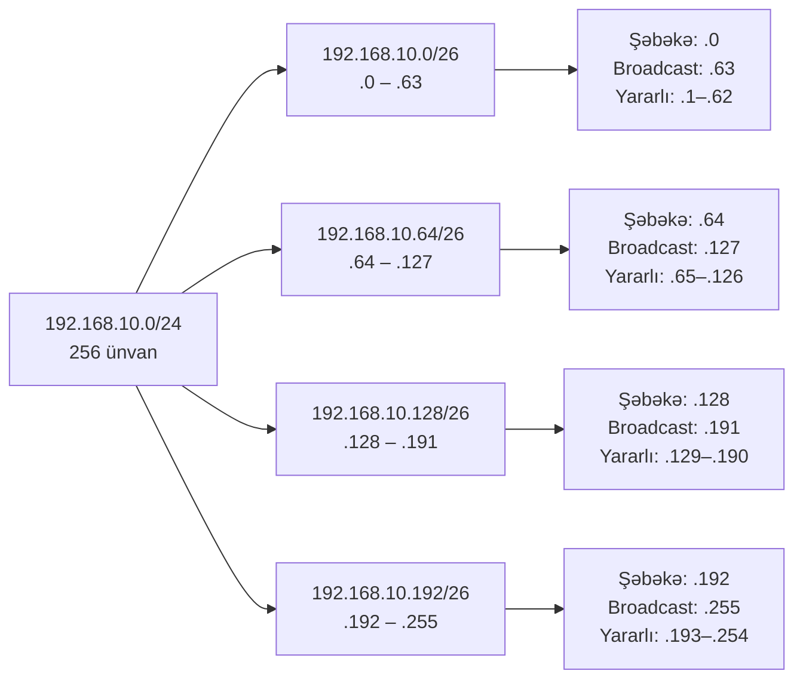

# Subnetlərə bölmə və CIDR

Subnetlərə bölmə bir IP ünvan blokunun daha kiçik, məqsədə uyğun şəbəkələrə bölünməsinin riyaziyyatıdır. Əvvəlki dərs olan [IP ünvanlama](./ip-addressing.md) *IP-nin nə olduğunu* izah edirdi. Bu dərs isə əksər öyrənənlərin qaçındığı hissədir: ikilik say, maskalar, CIDR slashları və bir `/22`-ni tək bir ünvan belə yandırmadan dəqiq ölçülmüş ünvan planına çevirməyi mümkün edən hesablama.

## Bu niyə vacibdir

Hər bir şəbəkə mühəndisinin subnetlərə bölməni bilməsi vacibdir. VPC dizayn edən bulud arxitektoru maskaları təxmin edirsə, peering və ya VPN aktivləşdiyi gün üst-üstə düşən CIDR bloklarla qarşılaşır. `10.0.42.0/23` əhatəli işçi sənədi oxuyan pen-tester dərhal bilməlidir ki, bu `10.0.42.0`-dan `10.0.43.255`-ə qədər olan diapazonu əhatə edir — və *xəttdən bir bit kənarda* olan hostu hücuma məruz qoymamalıdır. `permit tcp any 192.168.16.0/20 eq 443` kimi firewall qaydasını oxuyan SOC analitiki bilməlidir ki, "any" əslində `192.168.16.0`-dan `192.168.31.255`-ə qədər olan hostlar deməkdir, bütün `192.168.x.x` məkanı deyil. Subnetlərə bölmə səhvi səssizdir: paket sadəcə yanlış yerə gedir və saatlar sonra qəzəbli istifadəçidən və ya itirilmiş bildirişdən xəbər tutursunuz.

Bu dərsi əzbər biliyə çevirin — və lövhədəki müsahibə suallarından qorxmağı dayandıracaqsınız, hər dəyişiklikdə kalkulyatora əl atmayacaqsınız və şəbəkəni təxmin etməkdənsə *görməyə* başlayacaqsınız.

## İkilik say təkrarlaması

Hər IPv4 okteti 8 bitdir. Hər bit mövqeyinin sağdan sola iki dəfə artan sabit onluq dəyəri var:

```
bit mövqeyi:    7    6   5   4   3   2   1   0
onluq dəyər:  128  64  32  16   8   4   2   1
```

Onluq okteti ikiliyə çevirmək üçün soldan sağa gedin və "bu mövqe sığırmı?" soruşun — sığırsa, 1 yazın və çıxın; sığmırsa, 0 yazın və davam edin.

```
192 = 128 + 64                       → 1100 0000
224 = 128 + 64 + 32                  → 1110 0000
240 = 128 + 64 + 32 + 16             → 1111 0000
255 = 128 + 64 + 32 + 16 + 8 + 4 + 2 + 1 → 1111 1111
```

Tərs istiqamətdə isə sadəcə biti 1 olan mövqeləri toplayın. `1010 1010` = 128 + 32 + 8 + 2 = 170.

Bunun əhəmiyyəti: subnet maskası ardıcıl 1-lərdən sonra 0-lardan başqa bir şey deyil. Səkkiz "vacib" maska dəyərini (128, 192, 224, 240, 248, 252, 254, 255) ağılda çevirə bildiyiniz andan bütün subnet riyaziyyatı bit saymağa endirilir.

## Subnet maskası — əslində nə edir

Subnet maskası 32-bitlik IPv4 ünvanını **şəbəkə hissəsinə** və **host hissəsinə** bölür. Qayda sadədir: **maskada 1 olan bit şəbəkə bitidir; 0 olan bit host bitidir.** Şəbəkə bitlərində eyni dəyəri paylaşan bütün hostlar eyni subnetdə yaşayır.

```
IP        : 192.168.10.130   →  11000000.10101000.00001010.10000010
Maska     : 255.255.255.0    →  11111111.11111111.11111111.00000000
            ^^^ şəbəkə hissəsi (24 bit) ^^^      ^^^ host (8 bit) ^^^
Şəbəkə ID :                      11000000.10101000.00001010.00000000  →  192.168.10.0
```

`255.255.255.0` maskasında 24 bir var, deməli 24 şəbəkə biti və 8 host biti — `/24` kimi yazılır. İki host yalnız eyni maska altında şəbəkə bitləri uyğun gəlirsə Layer-2-də birbaşa danışa bilər; əks halda bir router-dən keçməlidir.

## CIDR notasiyası

**CIDR** (Classless Inter-Domain Routing, RFC 4632) prefiksi `ünvan/N` kimi yazır, burada `N` maskadakı 1-bitlərin sayıdır. Çevirmə mexanikidir — sadəcə 1-ləri sayın.

```
255.255.255.0     = 11111111.11111111.11111111.00000000  → 24 bir → /24
255.255.255.192   = 11111111.11111111.11111111.11000000  → 26 bir → /26
255.255.255.252   = 11111111.11111111.11111111.11111100  → 30 bir → /30
```

CIDR İnterneti köhnə A/B/C sinif çərçivəsindən azad etdi: `/0` (bütün İnternet)-dən `/32` (bir host)-a qədər istənilən prefiks uzunluğu etibarlıdır. Tam maska cədvəli aşağıda gəlir.

## Şəbəkə ünvanı, broadcast və yararlı hostlar

Hər klassik IPv4 subnetinin üç ünvan kateqoriyası var:

- **Şəbəkə ünvanı** — diapazonun ilk ünvanı, bütün host bitləri 0-dır. Subnetin özünü göstərir; heç vaxt host-a təyin etməyin.
- **Broadcast ünvanı** — diapazonun son ünvanı, bütün host bitləri 1-dir. Bu ünvana göndərilən paket subnetdəki hər host-a çatır; heç vaxt host-a təyin etməyin.
- **Yararlı host ünvanları** — aralarındakı hər şey.

Düstur belədir:

```
ümumi ünvanlar = 2^(host bitləri)
yararlı hostlar = 2^(host bitləri) - 2
```

"Mənfi 2" şəbəkə və broadcast ünvanlarını çıxır. İki vacib istisna:

- **/31** (RFC 3021) — routerlər arasında nöqtədən-nöqtəyə bağlantılar. Yalnız 2 ünvanla, spesifikasiya şəbəkə/broadcast konvensiyasından əl çəkir və hər iki ünvan istifadə oluna bilər. Böyük şəbəkədə hər WAN bağlantısında bir ünvana qənaət edir.
- **/32** — tək host marşrutu, loopback-lar, ACL girişləri və BGP next-hop üçün istifadə olunur. Heç bir host biti yoxdur.

## Subnet riyaziyyatı — /24-ü daha kiçik subnetlərə bölmə

`192.168.10.0/24`-ü götürün və dörd bərabər subnetə bölün. Dörd subnet 2 əlavə şəbəkə biti tələb edir (`2^2 = 4`), beləliklə yeni prefiks `/24 + 2 = /26`-dır. Hər `/26`-da `32 - 26 = 6` host biti var, bu da subnet başına `2^6 = 64` ünvan verir (62 yararlı).

Qısayol: **blok ölçüsü = 256 - maska-okteti**. `/26` maskası = `255.255.255.192`, deməli blok ölçüsü = `256 - 192 = 64`. Subnetlər son oktetdə 64-ün qatlarından başlayır.

| Subnet | Şəbəkə | Broadcast | Yararlı diapazon |
| --- | --- | --- | --- |
| 1 | `192.168.10.0/26` | `192.168.10.63` | `.1` – `.62` |
| 2 | `192.168.10.64/26` | `192.168.10.127` | `.65` – `.126` |
| 3 | `192.168.10.128/26` | `192.168.10.191` | `.129` – `.190` |
| 4 | `192.168.10.192/26` | `192.168.10.255` | `.193` – `.254` |

Subnet 3 üçün addım-addım: şəbəkə bitləri `.128` verir; bütün host bitləri 1 olduqda `.128 + 63 = .191` verir; iki ehtiyat ünvanı çıxsaq `64 - 2 = 62` yararlı host alırıq.

## VLSM — Dəyişən Uzunluqlu Subnet Maskası

Real şəbəkələr bərabər ölçülü komandalardan ibarət deyil. Qonaq Wi-Fi-ı 500 ünvana ehtiyac duya bilər; server VLAN-ı 30; router-ə-router bağlantısı 2. **VLSM** bir bloku *fərqli* ölçülü subnetlərə bölmək təcrübəsidir — həmişə ən böyükdən başlayaraq, sonra qalan məkanı yarı bölərək.

Nümunə: `10.0.0.0/16`-nı (65,536 ünvan) bir `/22`, bir `/24` və iki `/27`-yə bölün.

| Blok | Prefiks | Ünvanlar | Yararlı | Diapazon |
| --- | --- | --- | --- | --- |
| Mühəndislik LAN | `10.0.0.0/22` | 1,024 | 1,022 | `10.0.0.0` – `10.0.3.255` |
| Serverlər | `10.0.4.0/24` | 256 | 254 | `10.0.4.0` – `10.0.4.255` |
| Lab A | `10.0.5.0/27` | 32 | 30 | `10.0.5.0` – `10.0.5.31` |
| Lab B | `10.0.5.32/27` | 32 | 30 | `10.0.5.32` – `10.0.5.63` |
| (boş) | `10.0.5.64/26 …` | — | — | qalan məkan |

Həmişə ən böyük bloku birinci ayırın; kiçiklərlə başlasanız məkanı parçalayırsınız və böyük blok artıq təmiz sərhədə sığmır. Hər ayırmanı sənədləşdirin — ən pis VLSM səhvləri riyaziyyat səhvləri deyil, bir illik dəyişiklikdən sonra səssiz üst-üstə düşmələrdir.

## Supernetting / marşrut yekunlaşdırılması

Supernetting subnetlərə bölmənin tərsidir: bir neçə qonşu subneti daha qısa bir prefiksdə birləşdirin ki, marşrutlaşdırma cədvəli çoxlu girişdən bir giriş daşısın. Routerlər bunu sevir — daha kiçik cədvəllər, daha sürətli axtarışlar, dəyişiklik olduqda flood ediləcək daha az yeniləmə.

Dörd `/24`-ü — `192.168.16.0/24`, `192.168.17.0/24`, `192.168.18.0/24`, `192.168.19.0/24` — yekunlaşdırmaq üçün ikilik formada ümumi prefiksi tapın:

```
192.168.16.0  →  11000000.10101000.00010000.00000000
192.168.17.0  →  11000000.10101000.00010001.00000000
192.168.18.0  →  11000000.10101000.00010010.00000000
192.168.19.0  →  11000000.10101000.00010011.00000000
                  ^^^^^^^^^^^^^^^^^^^^^^^^^^ 22 ümumi bit
```

Ümumi prefiks 22 bitdir, deməli summary marşrut `192.168.16.0/22`-dir. Bir elan edilən prefiks dördünü əvəz edir. Diqqətli olun: summary *bütün* diapazonu əhatə edir, elan etmək istəmədiyiniz hər hansı boşluq daxil olmaqla.

## IPv6 prefiks notasiyası

IPv6 eyni `/N` ideyasını istifadə edir, lakin rəqəmlər və konvensiyalar fərqlidir. IPv6-da **broadcast yoxdur** — yalnız multicast — beləliklə "mənfi 2" qaydası tətbiq olunmur. LAN-da standart subnet uzunluğu **/64**-dir: ünvanın yarısı (64 bit) şəbəkədir, yarısı **interfeys identifikatorudur** (çox vaxt EUI-64 vasitəsilə MAC-dən alınır və ya məxfilik üçün təsadüfiləşdirilir).

Ümumi IPv6 prefiks ölçüləri:

| Prefiks | Mənası |
| --- | --- |
| `/128` | Tək host |
| `/127` | Nöqtədən-nöqtəyə bağlantı (RFC 6164) |
| `/64` | Standart LAN subneti — SLAAC-ın işləməsi üçün heç vaxt daha kiçik etməyin |
| `/56` | Tipik ev istifadəçisi ayırması |
| `/48` | Tipik sayt/müəssisə ayırması |
| `/32` | RIR-dən tipik ISP ayırması |

Ünvan `2001:db8:abcd:0012::/64` belə deməkdir: ilk 64 bit (`2001:db8:abcd:0012`) şəbəkədir; ondan sonra hər şey hostdur. 64-bitlik host sahəsi ilə hər LAN-da 18 kvintilyon ünvan var — qıtlıq artıq dizayn məhdudiyyəti deyil.

## Hərtərəfli CIDR maska cədvəli

`/24`, `/25`, `/26`, `/30`, `/16`, `/8` və `/32` sətirlərini əzbərləyin — qalanları bit-saymaqdan çıxır.

| Prefiks | Onluq maska | Hostlar (yararlı) | Tipik istifadə |
| --- | --- | --- | --- |
| `/8`  | `255.0.0.0`         | 16,777,214 | Böyük RFC 1918 / köhnə A sinfi |
| `/9`  | `255.128.0.0`       | 8,388,606 | /8-in yarısı |
| `/10` | `255.192.0.0`       | 4,194,302 | Böyük operator bloku |
| `/11` | `255.224.0.0`       | 2,097,150 | Operator alt-ayırması |
| `/12` | `255.240.0.0`       | 1,048,574 | RFC 1918 `172.16.0.0/12` |
| `/13` | `255.248.0.0`       | 524,286   | Böyük müəssisə |
| `/14` | `255.252.0.0`       | 262,142   | Böyük müəssisə |
| `/15` | `255.254.0.0`       | 131,070   | İki ardıcıl /16 |
| `/16` | `255.255.0.0`       | 65,534    | Kampus / böyük sayt / RFC 1918 `192.168.0.0/16` |
| `/17` | `255.255.128.0`     | 32,766    | Böyük bina |
| `/18` | `255.255.192.0`     | 16,382    | Böyük şöbə |
| `/19` | `255.255.224.0`     | 8,190     | Şöbə |
| `/20` | `255.255.240.0`     | 4,094     | Mərtəbə və ya bina qanadı |
| `/21` | `255.255.248.0`     | 2,046     | Böyük VLAN |
| `/22` | `255.255.252.0`     | 1,022     | Ofis mərtəbəsi / bulud VPC subneti |
| `/23` | `255.255.254.0`     | 510       | İki-/24 istifadəçi VLAN-ı |
| `/24` | `255.255.255.0`     | 254       | Standart ofis / lab subneti |
| `/25` | `255.255.255.128`   | 126       | Yarım-/24 |
| `/26` | `255.255.255.192`   | 62        | Dörddəbir-/24, kiçik VLAN |
| `/27` | `255.255.255.224`   | 30        | Kiçik lab, IoT seqmenti |
| `/28` | `255.255.255.240`   | 14        | DMZ, idarəetmə VLAN-ı |
| `/29` | `255.255.255.248`   | 6         | Kiçik DMZ, aparat cihazı |
| `/30` | `255.255.255.252`   | 2         | Klassik nöqtədən-nöqtəyə WAN |
| `/31` | `255.255.255.254`   | 2 (RFC 3021) | Müasir nöqtədən-nöqtəyə WAN |
| `/32` | `255.255.255.255`   | 1         | Tək host marşrutu, loopback, ACL girişi |

## Subnet hesablama diaqramı



## Praktiki məşqlər

Bunları kalkulyatora əl atmazdan əvvəl kağız üzərində işləyin — riyaziyyat avtomatik olur məhz bu yolla.

### 1. Onluqdan ikiliyə

Hər bir onluq dəyəri 8-bitlik ikilik formaya çevirin: **11**, **47**, **128**, **200**, **255**.

### 2. CIDR bloklarını oxuyun

Hər prefiks üçün şəbəkə ünvanını, broadcast ünvanını və yararlı hostların sayını yazın: `10.20.30.0/27`, `172.16.40.0/22`, `192.168.5.128/25`, `203.0.113.16/29`, `198.51.100.0/30`.

### 3. /24-ü səkkiz /27-yə bölün

`192.168.50.0/24`-dən başlayaraq, hər biri üçün şəbəkə, broadcast və yararlı diapazonla bütün səkkiz `/27` subnetini sadalayın.

### 4. VLSM planı dizayn edin

Dörd komandaya təyin etmək üçün `10.10.0.0/22`-niz var: 400 host, 100 host, 50 host, 10 host. Üst-üstə düşməyən subnetləri ən böyükdən başlayaraq ayırın və qalan məkanı "boş" kimi sənədləşdirin.

### 5. /24-ləri /22-yə yekunlaşdırın

`172.20.4.0/24`, `172.20.5.0/24`, `172.20.6.0/24`, `172.20.7.0/24` üçün tək CIDR yekununu yazın. Prefiks uzunluğunu sübut edən ikiliyi göstərin.

### 6. Doğru prefiksi seçin

**30** istifadəçini host edə bilən ən kiçik IPv4 prefiksi hansıdır? **62** istifadəçi? **125** istifadəçi? **500** istifadəçi? **1,000** istifadəçi? Hər birini `2^n - 2` düsturu ilə əsaslandırın.

## İşlənmiş nümunə

`example.local` kiçik bir ofis açır və ona `10.42.0.0/22` (1,024 ünvan, dörd ardıcıl `/24`) ayrılıb. Plan əhatə etməlidir: 60 istifadəçi, 12 server, 8 kamera, 4 printer, 1 IoT lab — hər biri öz VLAN-ında, təxminən 50% böyümə üçün yer.

Addım 1 — hər tələbi böyümə daxil olmaqla növbəti iki-qüvvə prefiksə yuvarlayın:

- **İstifadəçilər:** 60 × 1.5 = 90 → ən kiçik uyğun `/25`-dir (126 yararlı)
- **Serverlər:** 12 × 1.5 = 18 → `/27` (30 yararlı)
- **Kameralar:** 8 × 1.5 = 12 → `/28` (14 yararlı)
- **Printerlər:** 4 × 1.5 = 6 → `/29` (6 yararlı)
- **IoT lab:** səxavətli saxlayın → `/27` (30 yararlı)

Addım 2 — ən böyükdən başlayaraq təbii sərhədlərdə ayırın:

| VLAN | Məqsəd | Subnet | Diapazon | Yararlı |
| --- | --- | --- | --- | --- |
| 10 | İstifadəçilər | `10.42.0.0/25` | `10.42.0.0` – `10.42.0.127` | 126 |
| 20 | Serverlər | `10.42.0.128/27` | `10.42.0.128` – `10.42.0.159` | 30 |
| 30 | IoT lab | `10.42.0.160/27` | `10.42.0.160` – `10.42.0.191` | 30 |
| 40 | Kameralar | `10.42.0.192/28` | `10.42.0.192` – `10.42.0.207` | 14 |
| 50 | Printerlər | `10.42.0.208/29` | `10.42.0.208` – `10.42.0.215` | 6 |
| (boş) | Gələcək | `10.42.0.216/29 …` | `/22`-nin qalanı | — |

Bütün ofis ayırmanın dörddəbirindən azına sığır, böyümə, gələcək sayt-arası VPN və ya yenidən nömrələmə ağrısı olmadan ikinci mərtəbə üçün təxminən 800 ünvan qoyur.

## Subnet hesablama alətləri

Üç faydalı alət — yararlı, lakin heç vaxt kor-koranə inanmayın. İstənilən production subnetini ən azı bir dəfə əl ilə yoxlayın.

- **`ipcalc`** (Linux) — `ipcalc 192.168.10.0/26` şəbəkə, broadcast, maska və host diapazonunu çap edir. Əksər distro repolarda mövcuddur.
- **`Get-Subnet`** (PowerShell modulu) — `Install-Module -Name Subnet`, sonra `Get-Subnet -IP 10.0.0.5 -MaskBits 22` Windows-da eyni məlumatı qaytarır.
- **Onlayn kalkulyatorlar** — `subnet-calculator.com`, `cidr.xyz` və AWS/Azure VPC subnet planlayıcıları. Tez axtarışlar üçün yaxşıdır; uyğunluq sübutu üçün pisdir.

Riyaziyyatı öyrənməyin əsas məqsədi odur ki, bir gün alət səhv olacaq — adətən UI-ı sizin nəzərdə tutmadığınız sinif sərhədinə default verdikdə — və siz bunu dərhal görməlisiniz.

## Problemlərin həlli və tələlər

- **Bir-fərqli səhvlər.** Bir `/26`-da 64 ünvan var, *63 deyil*. Bir `/24`-ün üçüncü `/26`-sı `.128`-də başlayır, `.127`-də deyil — şəbəkə ünvanının ünvan kimi sayıldığını unutdunuz.
- **-2 istisnasını unutmaq.** Bir `/30` sizə 4 yox, 2 yararlı host verir. Hər WAN bağlantısında müvafiq olaraq plan qurun.
- **Bağlantı tərəfdaşlarında uyğunsuz maskalar.** Bir router-də `/24` və peer-də `/25` varsa, geniş tərəf dar tərəfin rədd etdiyi hostlara çatmağa çalışacaq. Həmişə hər iki ucu təsdiqləyin.
- **Summary marşrut daha-spesifik marşrutu gizlədir.** `192.168.16.0/22`-ni elan edin və başqa router `192.168.18.0/24`-ə sahib olsa belə onu da "iddia edirsiniz". Marşrutlaşdırma cədvəlində daha-spesifik girişlər qalib gəlir — lakin onlar tələb olunan cihazda mövcud olmalıdır.
- **/31 qarışıqlığı (RFC 3021).** Köhnə cihazlar `/31`-i qanunsuz hesab edir, çünki hər iki ünvan şəbəkə/broadcast kimi görünür. Müasir Cisco, Juniper və Linux bunu yaxşı idarə edir, lakin köhnə avadanlıqda yerləşdirməzdən əvvəl yoxlayın.
- **Üst-üstə düşən VPC CIDR-ləri.** Eyni `10.0.0.0/16`-ya sahib iki bulud VPC peer ola bilməz. Layihə başına deyil, *təşkilat* səviyyəsində üst-üstə düşməyən bloklar seçin.
- **Onluq riyaziyyat və ikilik riyaziyyat.** "Subnet 192.168.10.100/26 — şəbəkə nədir?" Onluq bölmə işləmir; host bitlərini maskalamalısınız. İkilik AND-ı refleks olana qədər məşq edin.

Daha geniş kontekst — subnetlər arasında marşrutlaşdıran cihazlar, Layer-3 VLAN interfeysləri və seqmentasiyanın təhlükəsizliyə necə uyğunlaşdığı — üçün baxın: [Şəbəkə cihazları](./network-devices.md) və [Təhlükəsiz şəbəkə dizaynı](../secure-design/secure-network-design.md). Subnetlərə bölünmüş paketlərin daşındığı nəqliyyat [OSI](./osi-model.md) və [TCP/IP](./tcp-ip-model.md) dərslərində təsvir olunur.

## Əsas nəticələr

- Subnet maskası ardıcıl 1-bitlər, sonra 0-bitlərdən ibarət sətirdir; CIDR `/N` sadəcə 1-bitlərin sayıdır.
- Dəyişən oktetdə blok ölçüsü = `256 - maska-okteti`. Onu əzbərləyin; əksər hesablamanı aradan qaldırır.
- Yararlı hostlar = `2^(host bitləri) - 2`, `/31` (2 yararlı) və `/32` (1 yararlı) istisna.
- VLSM ən böyükdən başlayaraq, təbii sərhədlərdə, sənədləşdirmə ilə deməkdir — fraqmentasiya əbədidir.
- Supernetting tərsidir: daha qısa prefiks, daha az marşrut, lakin nəzərdə tutulmamış əhatəyə diqqət edin.
- IPv6 `/N` notasiyasını saxlayır, broadcast-ı atır və hər LAN üçün `/64`-ü standartlaşdırır.
- Production subnetlərini ən azı bir dəfə əl ilə yoxlayın — alətlər rahat olsa da, səhvsiz deyil.

## İstinadlar

- RFC 1519 — Classless Inter-Domain Routing (CIDR), orijinal 1993: https://www.rfc-editor.org/rfc/rfc1519
- RFC 4632 — CIDR ünvan təyinatı və aqreqasiyası, 2006 yenilənməsi: https://www.rfc-editor.org/rfc/rfc4632
- RFC 950 — Internet Standard Subnetting Procedure: https://www.rfc-editor.org/rfc/rfc950
- RFC 3021 — IPv4 nöqtədən-nöqtəyə bağlantılarda 31-bitlik prefikslərin istifadəsi: https://www.rfc-editor.org/rfc/rfc3021
- RFC 4291 — IP Versiya 6 Ünvanlama Arxitekturası: https://www.rfc-editor.org/rfc/rfc4291
- RFC 6164 — Router-arası bağlantılarda 127-bitlik IPv6 prefikslərin istifadəsi: https://www.rfc-editor.org/rfc/rfc6164
- Cisco — IP Subnet Calculator və işlənmiş nümunələr: https://www.cisco.com/c/en/us/support/docs/ip/routing-information-protocol-rip/13788-3.html
- IANA IPv4 Special-Purpose Address Registry: https://www.iana.org/assignments/iana-ipv4-special-registry/iana-ipv4-special-registry.xhtml
