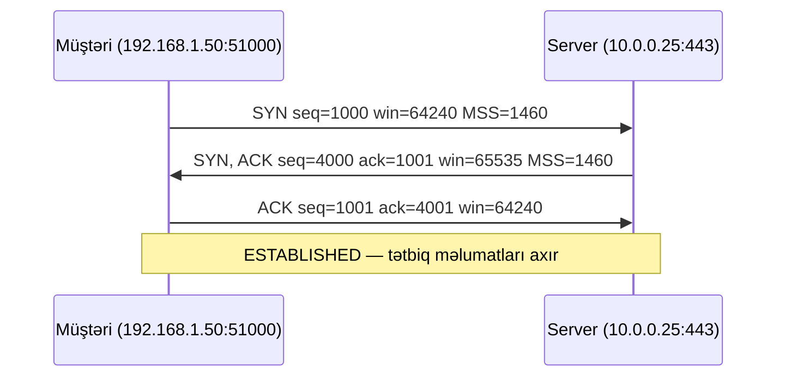
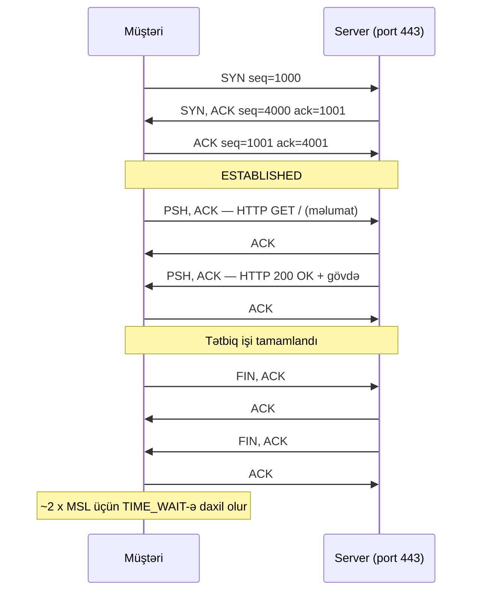

# TCP və UDP — Nəqliyyat Səviyyəsi

## Bu niyə vacibdir

Serverin qəbul etdiyi hər qoşulma ya TCP, ya da UDP-dir. SOC-un "şübhəli qoşulma" haqqında qaldırdığı hər xəbərdarlıq 4-cü səviyyənin yaratdığı beş elementli kortejin üzərində qurulur. Açıq xidmət axtaran hər penetrasiya testçisi xüsusi hazırlanmış SYN, ACK, FIN və ya UDP paketləri göndərir və cavabı oxuyur. Təhlükəsizlik qrupu yazan hər bulud mühəndisi, bunu dərk etsə də, etməsə də, vəziyyət saxlayan TCP filtri proqramlaşdırır.

TCP bayraqlarını sərbəst oxuya bilmirsinizsə, PCAP-ı oxuya bilməzsiniz. Qoşulma vəziyyətləri haqqında düşünə bilmirsinizsə, "düzəldilmiş" xidmətin yenidən başlatdıqdan sonra niyə hələ iki dəqiqə müştəriləri rədd etdiyini başa düşməyəcəksiniz. SYN sel hücumunu dürüst yükdən ayırd edə bilmirsinizsə, çıxış zamanı yanlış şeyi yumşaldacaqsınız. TCP və UDP digər bütün tətbiqlərin üzərində oturduğu iki protokoldur — və əksər real şəbəkə problemlərinin üzə çıxdığı kəsişmədir.

Bu dərs yalnız 4-cü səviyyəyə dərindən baxır. Portlar, IANA reyestri və məşhur protokol xəritəsi ayrıca [portlar və protokollar](./ports-and-protocols.md) dərsində əhatə olunur.

## 4-cü səviyyənin rolu

3-cü səviyyə (IP) paketi bir hostdan digərinə çatdırır. 4-cü səviyyə isə **portlar** — hər tərəfdə bayta hansı prosesin sahib olduğunu göstərən kiçik tam ədədlər — əlavə edərək bunu iki **tətbiq** arasında söhbətə çevirir. IP ünvanları və protokol nömrəsi ilə birlikdə iki port axını unikal şəkildə müəyyən edən **5 elementli kortejı** yaradır:

```text
(protokol, mənbə IP, mənbə portu, hədəf IP, hədəf portu)
```

Eyni veb serverə açılmış iki eyni anda işləyən brauzer tabı eyni hədəf IP və portundan (`10.0.0.25:443`) istifadə edir, lakin fərqli mənbə portlarından (`51000`, `51001`) — buna görə də onlar kernel və yoldakı hər vəziyyət saxlayan cihaz tərəfindən ayrılan fərqli axınlardır. 5 elementli kortejı firewall-ların icazə verdiyi, IDS sensorlarının xəbərdarlıq etdiyi, NAT şlüzlərinin tərcümə etdiyi və yük balanslayıcılarının heşlədiyi vahiddir. Bunu yaxşı mənimsəyin.

4-cü səviyyənin daha böyük mənzərədə yerini görmək üçün [OSI modelinə](./osi-model.md) və [TCP/IP modelinə](./tcp-ip-model.md) baxın. Kortejdəki IP yarımlarının haradan gəldiyini görmək üçün [IP ünvanlamasına](./ip-addressing.md) baxın.

## TCP — qoşulmaya əsaslanan

**TCP** (Transmission Control Protocol, RFC 9293) üzərindəki tətbiqə dörd zəmanət verir:

- **Sıralı** — paketlər müxtəlif yollarla gəlsə də, baytlar göndərildikləri sırada gəlir.
- **Etibarlı** — itirilmiş seqmentlər aşkar edilib yenidən göndərilir; dublikatlar atılır.
- **Axın idarəli** — sürətli göndərici yavaş qəbuledicini boğa bilməz.
- **Bayt axını** — mesaj sərhədləri yoxdur; tətbiq fasiləsiz axın görür və onu özü çərçivəyə salır (HTTP başlıqlardan, TLS qeydlərdən istifadə edir və s.).

Bu zəmanətlər pulsuz deyil. TCP qurulması üçün bir gediş-gəlişə, sökülməsi üçün bir gediş-gəlişə və hər bayt üçün uçotuna mal olur. Zəmanətlər tətbiqin tələblərinə uyğun gəldikdə (veb, poçt, SSH, verilənlər bazaları), xərc görünməzdir. Uyğun gəlmədikdə isə (real vaxt səs, DNS sorğuları), TCP yanlış alətdir.

Hər TCP qoşulması uçdan-uca 5 elementli kortej ilə müəyyən edilir. Kernel hər qoşulma üçün cari sıra nömrələrini, pəncərə ölçülərini, yenidən göndərmə taymerlərini və vəziyyəti saxlayan **TCP nəzarət blokunu** saxlayır.

## TCP üçtərəfli əl sıxma

Tək bir tətbiq baytı axmazdan əvvəl, iki tərəfdaş **üçtərəfli əl sıxma** tamamlayır. Bu, hər paket tutmasında ən çox görülən nümunədir və hər TCP hücumunun başladığı yerdir.



Hər seqmentin daşıdığı:

1. **SYN (müştəri → server).** Müştəri **İlkin Sıra Nömrəsini (ISN)** seçir — təsadüfi 32 bitlik dəyər, məs. `1000`. O həmçinin **Maksimum Seqment Ölçüsünü (MSS)**, ilkin **pəncərə ölçüsünü** və TCP seçimlərini (SACK icazəsi, pəncərə miqyaslandırması, vaxt damğaları) elan edir. SYN heç bir məlumat daşımasa da, bir sıra nömrəsi istehlak edir.
2. **SYN/ACK (server → müştəri).** Server **öz** ISN-ini (`4000`) seçir və müştərinin ISN+1-ini (`1001`) təsdiqləyir. O öz MSS və pəncərəsini elan edir. Bu tək paket həm açılış (SYN), həm də təsdiqdir (ACK).
3. **ACK (müştəri → server).** Müştəri serverin ISN+1-ini (`4001`) təsdiqləyir. Qoşulma indi hər iki tərəfdə `ESTABLISHED`-dir və hər iki tərəf məlumat göndərə bilər.

Niyə iki təsadüfi ISN, sıfır deyil? **Sıra nömrəsi təsadüfiləşdirməsi** yolda olmayan hücum edənin növbəti etibarlı sıra nömrəsini təxmin etməsinin və axına saxta məlumat enjekt etməsinin qarşısını alır. Müasir yığınlar RFC 6528-ə uyğun olaraq ISN-i 5 elementli kortej və gizli açarın kriptoqrafik heşindən alır.

## TCP bayraqları

Hər TCP seqmenti idarəetmə bayraqlarının kiçik bit sahəsini daşıyır. Altı klassik var; onları əzbər öyrənin.

| Bayraq | Mənası | Hücum edən nə üçün istifadə edir |
|---|---|---|
| **SYN** | Qoşulma açır (ISN daşıyır) | **SYN sel** — milyonlarla SYN-i saxta IP-lərdən göndərib serverin yarı-açıq növbəsini doldurmaq |
| **ACK** | Alınmış məlumatı / sıra nömrəsini təsdiqləyir | **ACK skan** — yalnız SYN-i bloklayan sadə vəziyyət saxlamayan filtrlərdən yan keçmək |
| **FIN** | Təmiz bağlama — "Bu istiqamətdə göndərməyi bitirdim" | **FIN skan** — bağlı portlar RST qaytarır, açıq portlar bəzi yığınlarda susur |
| **RST** | Kəskin sıfırlama — dərhal sökmək | **RST inyeksiyası** — başqasının qoşulmasını öldürmək üçün axın ortasında saxta RST yaratmaq (böyük firewall üslubu) |
| **PSH** | Buferdəki məlumatı dərhal tətbiqə ötürmək | Nadirən hücum üçün istifadə olunur; barmaq izi üçün faydalıdır |
| **URG** | Təcili göstərici etibarlıdır (demək olar ki, heç istifadə olunmur) | Köhnə IDS-dən yayınma hiyləsi; çox yığınlar fərqli davranır |

Müasir TCP həmçinin sıxlıq bildirişi üçün **ECE**, **CWR** və **NS**-i təyin edir, lakin yuxarıdakı altısı Wireshark-da hər gün oxuduğunuzdur.

Faydalı nümunə: bağlı TCP portuna `SYN` hədəfin kernelindən `RST, ACK` qaytarır — `nmap -sS` "bağlı"nı "açıq"dan (`SYN, ACK` qaytarır) və "filtrlənmiş"dən (firewall SYN-i atdığı üçün heç nə qaytarmır) bu cür ayırd edir.

## TCP qoşulma vəziyyətləri

TCP qoşulmasının hər tərəfi kiçik vəziyyət maşınından keçir. Bu vəziyyətləri `ss -tan`, `netstat -an` və hər kernel səviyyəli şəbəkə alətində görəcəksiniz.

| Vəziyyət | Mənası |
|---|---|
| **LISTEN** | Server soketi gələn SYN-i gözləyir |
| **SYN_SENT** | Müştəri SYN göndərib, SYN/ACK gözləyir |
| **SYN_RECEIVED** | Server SYN aldı, SYN/ACK göndərdi, son ACK gözləyir (yarı-açıq vəziyyət) |
| **ESTABLISHED** | Əl sıxma tamamlandı, məlumat axa bilər |
| **FIN_WAIT_1** | Yerli tərəf FIN göndərdi, ACK və ya tərəfdaş FIN gözləyir |
| **FIN_WAIT_2** | Yerli FIN təsdiqləndi; tərəfdaşın FIN-ini gözləyir |
| **CLOSE_WAIT** | Tərəfdaş FIN göndərdi; yerli tətbiq hələ bağlamayıb |
| **LAST_ACK** | Yerli tətbiq CLOSE_WAIT-dan sonra bağlandı, son ACK gözləyir |
| **TIME_WAIT** | Yerli tərəf bağladı; gecikənləri əmmək üçün 2 x MSL (tipik 60–120 s) müddətində 5 elementli kortejı saxlayır |
| **CLOSED** | Heç bir qoşulma yoxdur |

`TIME_WAIT` insanları təəccübləndirəndir. Təmiz bağlamadan sonra, **birinci** FIN göndərən tərəf 5 elementli kortejı təxminən iki dəqiqə qoruyub saxlayır ki, köhnə qoşulmadan gecikmiş seqment eyni portları təsadüfən yenidən istifadə edən yepyeni qoşulmaya aid kimi şərh edilə bilməsin. Yüklü yük balanslayıcısı və ya proksidə `TIME_WAIT` soketləri on minlərə yığıla və efemer portları tükətməyə başlaya bilər — klassik `TIME_WAIT` tükənməsi.

## Sürüşən pəncərə və axın idarəsi

Göndərici sadəcə baytları atıb ümid edərdisə, TCP istifadəyə yararsız olardı. Əvəzində, qəbuledici hər ACK-da göndəriciyə hazırda nə qədər boş bufer sahəsinin olduğunu deyir — **elan edilmiş qəbul pəncərəsi** (Wireshark-da `win=65535`). Göndərici uçuşda olan təsdiqlənməmiş baytların "pəncərəsini" bundan böyük saxlamır. Qəbuledicinin tətbiqi buferi boşaltdıqca pəncərə böyüyür; doldurduqca sıfıra doğru kiçilir.

```text
Göndərilib və ACK-lanıb | Göndərilib, ACK-lanmayıb | İndi göndərilə bilər | Hələ göndərilə bilməz
------------------------+--------------------------+----------------------+------------------------
                       snd_una                  snd_nxt              snd_una + win
```

Bu **sürüşən pəncərədir**: ACK-lar gəldikcə sərhəd irəli hərəkət edir. Bu, uçdan-uca **axın idarəsidir** — yavaş istehlakçı heç bir routerin köməyi olmadan özünü qoruyur.

Ayrıca, **sıxlıq idarəsi** (yavaş başlanğıc, sıxlığın qarşısının alınması, sürətli yenidən göndərmə, sürətli bərpa; müasir Linux CUBIC və ya BBR istifadə edir) paket itkisinə və RTT dəyişikliklərinə cavab verərək göndəricinin tərəfdaşı deyil, **yolu** boğmasının qarşısını alır. Axın idarəsi və sıxlıq idarəsi yavaşlama effekti olan fərqli mexanizmlərdir — hər ikisi məhsuldarlığı sıxa bilər və hansının hansı olduğunu diaqnoz etmək yüksək səviyyəli bacarıqdır.

## TCP sökülməsi

TCP qoşulmasını bitirmək üçün iki yol var: nəzakətli və kobud.

**Təmiz bağlama — FIN/ACK.** Hər iki tərəf `FIN` göndərə bilər. Tərəfdaş onu ACK-layır, hələ göndərmək istədiyini bitirir, sonra öz `FIN`-ini göndərir. Yaradan onu ACK-layır və `TIME_WAIT`-ə daxil olur. Cəmi dörd paket, məlumat itməyib.

**Kəskin bağlama — RST.** Hər iki tərəf `RST` göndərə və qoşulmanı dərhal unuda bilər. Uçuşda olan hər şey atılır. RST-lər tətbiq soketi boşaltmadan bağlayanda, mövcud olmayan qoşulma üçün paket gələndə və ya hücum edən sahib olmadığı qoşulmanı öldürmək üçün trafik saxtalaşdırdıqda kernel tərəfindən göndərilir. Aralıq qutular tərəfindən RST inyeksiyası məlum senzura texnikasıdır və həddindən artıq həvəsli firewall axını bəyənmədikdə yaranan sirli "qoşulma tərəfdaş tərəfindən sıfırlandı" xətalarının məlum səbəbidir.

## UDP — qoşulmasız

**UDP** (User Datagram Protocol, RFC 768) TCP-nin əksidir: qəsdən minimal. Başlıq cəmi səkkiz baytdır.

```text
 0      7 8     15 16    23 24    31
+--------+--------+--------+--------+
|     Mənbə      |     Hədəf       |
|     Portu      |     Portu       |
+--------+--------+--------+--------+
|     Uzunluq    |    Yoxlama      |
+--------+--------+--------+--------+
|             Məlumat ...           |
+-----------------------------------+
```

Bu qədər. Əl sıxma yox, sıra nömrələri yox, təsdiqlər yox, yenidən göndərmə yox, sıralama yox, qoşulma vəziyyəti yox. Kernelə yük və hədəf verirsiniz, o bir datagram göndərir. Çatarsa, qəbuledici alır. Çatmasa, heç kim sizə demir. İkisi sıradan kənar gələrsə, tətbiq onları sıradan kənar görür. Yeganə düzgünlük yoxlaması isteğe bağlı yoxlama məbləğidir.

Bu minimalizm məğzdir. DNS sorğu göndərir, cavab alır, bitdi — axtarışın özündən daha çox gediş-gəliş tələb edən əl sıxmaya ehtiyac yoxdur. VoIP və video itirilmiş kadrı atlamağı, yenidən göndərmə üçün 300 ms gözləməkdənsə, üstün tutar. SNMP və syslog əsasən yazma rejimindədir və itkiyə dözür. DHCP UDP üzərində işləyir, çünki müştərinin hələ IP-si belə yoxdur. Tətbiq əslində ehtiyac duyduğu TCP-yə bənzər davranışın hər hansı alt çoxluğuna görə məsuliyyət daşıyır.

## QUIC və HTTP/3

Onilliklər boyu qayda belə idi: "etibarlılıq lazımdırsa, TCP istifadə edin." Bu, **HTTP/3**-ün üzərində işlədiyi nəqliyyat olan **QUIC** (RFC 9000) ilə dəyişdi. QUIC **UDP** üzərində qurulub — lakin sıralı, etibarlı, multipleksli, şifrələnmiş axınları UDP-nin **içində**, istifadəçi məkanında, daxili TLS 1.3 ilə həyata keçirir.

Niyə ümumiyyətlə TCP-dən köçmək lazımdır? Üç səbəb:

- **Daha sürətli əl sıxma.** QUIC nəqliyyat qurulması və TLS-i tək gediş-gəlişə birləşdirir (bərpa edilmiş qoşulmalar üçün 0-RTT), TCP-nin ayrı üçtərəfli əl sıxması artı TLS əl sıxması ilə müqayisədə.
- **Sıranın başının bloklanması.** TCP üzərində HTTP/2-də bir itirilmiş paket yenidən göndərmə tamamlanana qədər hər multipleksli axını dayandırır. QUIC axınları müstəqildir, beləliklə itki yalnız öz axınını bloklayır.
- **Qoşulma miqrasiyası.** QUIC qoşulmasının 5 elementli korteji deyil, öz ID-si var, beləliklə Wi-Fi-dan mobil şəbəkəyə keçən telefon yenidən qoşulmadan eyni qoşulmanı saxlayır.

Xərc: QUIC TCP üçün qurulmuş hər aralıq qutu optimallaşdırmasından yan keçir və o, uçdan-uca şifrələnir, beləliklə yolda yoxlamaq xeyli çətindir. Əksər böyük veb şirkətləri (Google, Cloudflare, Meta) indi trafikin böyük hissəsini HTTP/3 üzərindən xidmət edir — firewall yalnız TCP 443-ü başa düşürsə, istifadəçilərinizin veb trafikinin artan hissəsindən xəbərsizsiniz.

## TCP vs UDP — qərar matrisi

| **TCP** seçin… | **UDP** seçin… |
|---|---|
| Bayt itkisi qəbuledilməzdirsə (HTTPS, SSH, SMTP, IMAP) | Atılan paketi gözləməkdənsə əvəz etmək asandırsa (VoIP, video) |
| Məlumat sıralı gəlməlidir (fayl ötürmə, verilənlər bazası sorğuları) | Tətbiq öz sıralanmasını idarə edir (RTP vaxt damğaları, oyun vəziyyəti tikləri) |
| Məhsuldarlıq düzgünlükdən daha az vacibdirsə | Gecikmə düzgünlükdən daha vacibdirsə |
| Sessiyalar uzun ömürlü və danışıqlıdırsa | Mübadilələr birdəfəlikdirsə (DNS sorğusu, NTP sorğusu) |
| TCP-yə uyğun firewall və NAT-lardan keçərkən | Qurulma sürəti vacibdirsə (əl sıxma yoxdur) |
| Müştərilər avtomatik axın/sıxlıq idarəsinə ehtiyac duyur | Tətbiq öz tempini idarə edir (QUIC, xüsusi protokollar) |
| Nümunələr: HTTP/1.1, HTTP/2, SSH, SMTP, RDP, MySQL, LDAP | Nümunələr: DNS (tipik), DHCP, NTP, SNMP, syslog, VoIP, QUIC/HTTP/3 |

Faydalı qayda: əgər tətbiq bir kadr üçün qüsur göstərərək itirilmiş paketdən sağ qala bilirsə, UDP-yə üstünlük verin. İtirilmiş bayt korlanma deməkdirsə, TCP-yə üstünlük verin. Müasir kriptoqrafiya ilə həm sürət, həm də etibarlılıq istəyirsinizsə, 2026-da düzgün cavab adətən QUIC-dir.

## TCP/UDP mermaid diaqramı



## Praktiki tapşırıqlar

Dörd çalışma. Onları sıra ilə edin; hər biri növbətisi üçün əzələ yaddaşını qurur.

### 1. TCP üçtərəfli əl sıxmanı tutun

Wireshark açın, aktiv interfeysinizdə tutmağa başlayın və filtri tətbiq edin:

```text
tcp.flags.syn == 1 and host neverssl.com
```

Brauzerdə `http://neverssl.com`-a daxil olun. Tutmağı dayandırın. Üç paketi tapın: `SYN`, `SYN, ACK`, `ACK`. Mütləq sıra nömrələrini və Wireshark-ın göstərdiyi nisbi nömrələri qeyd edin. Hər hansı paketə sağ klikləyin və **Follow → TCP Stream** seçin ki, bütün söhbəti yenidən qurulmuş şəkildə görəsiniz.

### 2. `ss` / `netstat` ilə TCP vəziyyətlərini müəyyən edin

Linux-da:

```bash
ss -tan
```

Windows-da:

```powershell
netstat -ano -p tcp
```

Ən azı bir `LISTEN`, bir `ESTABLISHED` və bir `TIME_WAIT` soketi tapın. `TIME_WAIT` tapa bilmirsinizsə, qoşulma açıb dərhal bağlayın (məs. `curl -s https://example.com >/dev/null`) və 60 saniyə içində yenidən işlədin.

### 3. UDP DNS sorğusunu müşahidə edin

`udp.port == 53` filtri ilə Wireshark-ı başladın, sonra işlədin:

```bash
dig example.com @8.8.8.8
```

Tam olaraq iki UDP paketi görməlisiniz: sorğu və cavab. Əl sıxma yox, sökülmə yox. Sadəliyi yuxarıdakı TCP tutması ilə müqayisə edin.

### 4. TCP-mi UDP-mi triajı

Cədvələ baxmadan, bunların hər birini TCP, UDP və ya hər ikisi kimi təsnif edin: **HTTPS, DNS, SSH, DHCP, SMTP, NTP, RDP, SNMP, SMB, Syslog**. Sonra `ss -tulpn` və ya IANA reyestri ilə yoxlayın. Məqsəd nəqliyyat seçiminin protokolun dizaynı haqqında məlumat olduğu intuisiyasını qurmaqdır.

## İşlənmiş nümunə — example.local-da SYN sel hücumu

`example.local`-da SOC analitikinə bazar gecəsi xəbərdarlıq gəlir: ictimai veb tətbiqi `www.example.local` aralıq olaraq əlçatmazdır, lakin host işləkdir və tətbiq logları sakitdir. SSH ilə daxil olub işlədir:

```bash
ss -tan state syn-recv | wc -l
```

Rəqəm **47,318**-dir. Normal əlli-dən aşağıdır.

Bu paylanma — `SYN_RECEIVED`-də ilişib qalmış on minlərlə soket, hər biri son ACK-i heç vaxt çatmamış yarım qurtarmamış əl sıxma — **SYN sel** imzasıdır. Hücum edən (və ya botnet) saxta mənbə IP-lərindən SYN paketləri göndərir. Kernel sədaqətlə SYN/ACK ilə cavab verir, nəzarət bloku ayırır və heç vaxt gəlməyəcək ACK-i gözləyir. Yarı-açıq növbə dolur və qanuni müştərilər artıq slot ala bilmir.

Analitik mənbə IP-ləri yoxlayır:

```bash
ss -tan state syn-recv | awk '{print $5}' | cut -d: -f1 | sort | uniq -c | sort -rn | head
```

Yüz minlərlə fərqli mənbə, konsentrasiya yoxdur — klassik saxta mənbəli sel hücumu. Fərdi IP-ləri bloklamaq mənasızdır.

**Yumşaltma, eskalasiya sırası ilə:**

1. **SYN cookie-lərini aktivləşdirin** (`net.ipv4.tcp_syncookies = 1`) — müasir Linux-da artıq yandırılıb. Hücum altında, kernel SYN-lər üçün nəzarət blokları ayırmağı dayandırır və əvəzinə qoşulma vəziyyətini geri göndərdiyi ISN-ə kodlaşdırır. Real müştərilər son ACK-də etibarlı cookie qaytarır; saxta müştərilər heç vaxt qaytarmır.
2. **Backlog-u artırın** (`net.ipv4.tcp_max_syn_backlog`) və yenidən cəhdləri qısaldın (`tcp_synack_retries=2`) ki, yarı-açıq girişlər daha tez vaxtı keçsin.
3. **Döşəməni qaldırın** — qarşıya CDN, təmizləmə xidməti və ya bulud təminatçısının anti-DDoS-unu qoyun. Onlar tək VM-in heç vaxt edə bilməyəcəyindən daha yüksək tutumda SYN-ləri əmir.
4. **Tutun və hesabat verin** — hadisə cavabı üçün PCAP saxlayın və həcm davamlıdırsa yuxarı ISP-yə hesabat verin.

Analitik `tcp_syncookies`-in aktiv olduğunu təsdiqləyir, yük balanslayıcısının anti-DDoS profilini bir səviyyə yuxarı qaldırır və yarı-açıq sayının dəqiqələr içində 100-dən aşağı düşdüyünü izləyir. Xidmət heç vaxt tətbiqə toxunmadan bərpa olunur. **Vəziyyət paylanmasını** — bant genişliyini deyil, CPU-nu deyil — tanımaq diaqnozun sürətli olmasını təmin etdi.

## Problemlərin həlli və tələlər

**Yüklü tərs proksilərdə TIME_WAIT tükənməsi.** Saniyədə minlərlə qısa yuxarı TCP qoşulması açıb bağlayan proksi `TIME_WAIT` soketləri toplayacaq və nəticədə yeni çıxış qoşulmaları üçün efemer mənbə portlarından çıxacaq. Düzəlişlər: yuxarı tərəfə qoşulma havuzu/keep-alive aktivləşdirin, `ip_local_port_range`-ı qaldırın və ya ifrat hallarda `tcp_tw_reuse`-i aktivləşdirin. `tcp_tw_recycle`-i kor-koranə **aktivləşdirməyin** — yaxşı səbəbə görə Linux-dan çıxarıldı və NAT-ı sındırır.

**Çox aqressiv RST-lər NAT keep-alive-ları sındırır.** Bəzi firewall-lar vəziyyəti təmizləmək üçün "boş" TCP qoşulmaları üçün RST göndərir. Boşalma taymeri tətbiqin keep-alive intervalından qısadırsa, hər uzunmüddətli sessiya (SSH, verilənlər bazası qoşulması, websocket) sirli şəkildə öləcək. Ya firewall boşalma vaxtını uzadın, ya da TCP keep-alive intervalını qısaldın (`tcp_keepalive_time`).

**MTU/MSS uyğunsuzluğu.** Yol MTU-su danışıqlı MSS-dən kiçik olduqda — VPN və tunellərlə adi haldır — tam ölçülü paketlər parçalanır və ya atılır. Simptom: TCP əl sıxması tamamlanır (kiçik paketlər), lakin ilk böyük POST və ya cavab əbədi ilişir. Düzəliş: tunel son nöqtəsində MSS-i bağlayın (`iptables -t mangle ... --clamp-mss-to-pmtu`) və ya PMTU kəşfini aktivləşdirin və firewall-da ICMP "fraqmentasiya lazımdır" mesajlarını atmağı dayandırın.

**Yenidən göndərmələr əsl problemi gizlədir.** TCP yenidən göndərərək paket itkisini örtəcək. İstifadəçi "yavaş" görür, "sınıq" deyil. `ss -ti`-də və ya Wireshark-ın **Expert Info**-sunda `Retransmits`-ə baxın. ~1%-dən yuxarı yenidən göndərmə nisbəti təqib etməyə dəyər problemdir — adətən dupleks uyğunsuzluğu, doymuş bağlantı və ya bir hopdakı qeyri-stabil kabel.

**Yarı-bağlı soketlər.** `shutdown(SHUT_WR)` çağıran, lakin heç vaxt `close()` çağırmayan səhv davranan tətbiq soketi əbədi olaraq `CLOSE_WAIT`-də qoyur. Serverdə çoxlu `CLOSE_WAIT` şəbəkə problemi deyil, tətbiq səhvi deməkdir. Anlaşılmaz, lakin son dərəcə yaygın.

## Əsas götürmələr

- 4-cü səviyyə host-host-u portlar vasitəsilə tətbiq-tətbiqə çevirir; 5 elementli kortej axını unikal şəkildə müəyyən edir.
- TCP əl sıxması və hər qoşulma vəziyyəti baxımına görə sıralı, etibarlı, axın idarəli bayt axınları verir.
- Üçtərəfli əl sıxma ilkin sıra nömrələrini, MSS və pəncərə ölçülərini mübadilə edir — və SYN sellərinin zərbə vurduğu yerdir.
- Altı klassik bayraq (SYN, ACK, FIN, RST, PSH, URG) hər TCP idarəetmə qərarını daşıyır; onları əzbər öyrənin.
- Qoşulma vəziyyətləri (LISTEN, ESTABLISHED, TIME_WAIT və s.) diaqnostik qızıldır — `ss -tan` dostunuzdur.
- Sürüşən pəncərə axın idarəsi uçdan-ucadır; sıxlıq idarəsi yola məlumdur. Onlar fərqlidir və hər ikisi vacibdir.
- UDP qəsdən minimal-dır — səkkiz bayt başlıq, zəmanət yox, sürətli və ucuz. İtkinin gözləməkdən ucuz olduğu yerlərdə istifadə olunur.
- QUIC (HTTP/3) etibarlılıq və TLS-i UDP-nin içinə qoyur, TCP-nin məhdudiyyətlərindən və aralıq qutu yükündən yan keçir.
- Düzgünlük üçün TCP, gecikmə üçün UDP və müasir kriptoqrafiya ilə hər ikisinə ehtiyacınız olduqda QUIC seçin.
- Qoşulma vəziyyəti paylanmalarını oxuyan SOC analitiki sel hücumlarını və tükənmələri saatlarla deyil, dəqiqələrlə diaqnoz edir.

## İstinadlar

- RFC 9293 — Transmission Control Protocol (müasir yenidən yazma, 2022): https://www.rfc-editor.org/rfc/rfc9293
- RFC 768 — User Datagram Protocol: https://www.rfc-editor.org/rfc/rfc768
- RFC 9000 — QUIC: A UDP-Based Multiplexed and Secure Transport: https://www.rfc-editor.org/rfc/rfc9000
- RFC 6528 — Defending against Sequence Number Attacks: https://www.rfc-editor.org/rfc/rfc6528
- RFC 4987 — TCP SYN Flooding Attacks and Common Mitigations: https://www.rfc-editor.org/rfc/rfc4987
- Cloudflare Learning Center — TCP vs UDP: https://www.cloudflare.com/learning/ddos/glossary/user-datagram-protocol-udp/
- Cloudflare Learning Center — What is QUIC: https://www.cloudflare.com/learning/performance/what-is-http3/
- Wireshark User Guide — TCP analysis: https://www.wireshark.org/docs/wsug_html_chunked/ChAdvTCPAnalysis.html
