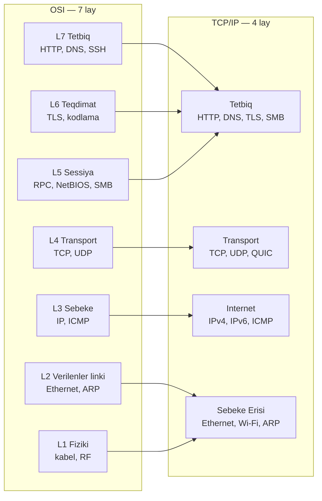
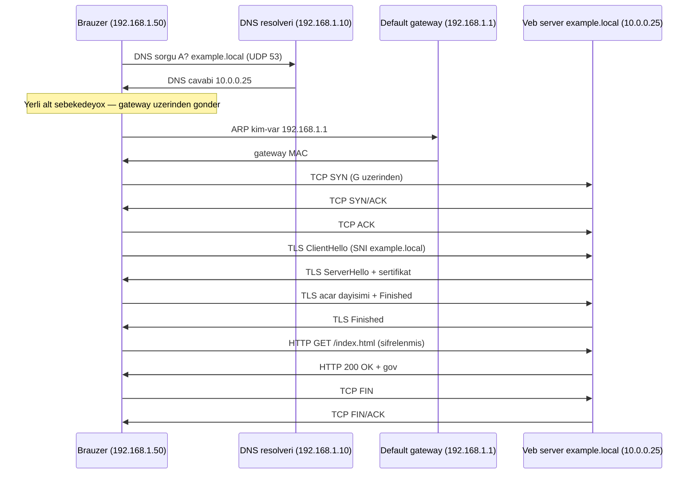

# TCP/IP Modeli

## Niye bu vacibdir

OSI sahenin sebekeler haqqinda danismaq ucun istifade etdiyi luget bazasidir; **TCP/IP ise sim uzerinde realliqda islayan seydir.** Internetdan kecen her bir paket — her HTTPS sorgusu, her DNS sorgusu, her video axini, her zerverli proqram siqnali — dord layli TCP/IP destesi terefinden qurulur, unvanlanir, marsrutlasdirilir ve catdirilir. Yeddi OSI layi tedris ucun istinad modelidir; TCP/IP-nin dord layi ise hekimettin ozudur. Eger yalniz bir desteyi oyrene bilirsenize, TCP/IP-ni oyrenin, cunki emeliyyat sisteminiz, sebeke kartiniz, marsrutlasdiriciniz, brandmaueriniz ve paket tutma aletiniz hami bunu danisir.

Infosec mutexessisi ucun bu iki konkret sekilde vacibdir. Birincisi, istifade edeceyiniz her alet — `tcpdump`, Wireshark, `nmap`, Suricata, Zeek — cixisini sim uzerindeki real protokollarla (Ethernet, IP, TCP, TLS, HTTP) etiketleyir, ve bunlar dord TCP/IP layina temiz dusur. Ikincisi, brandmauer qaydalarini, IDS imzalarini ve seqmentasiya siyaseterini yazanda OSI laylari yox, TCP/IP laylari ile dusunursunuz. Bu ders hemin dord laya temerkuzlasir, onlarin [OSI Modeli](./osi-model.md)-ndeki yeddi laya nece uyusdugunu gosterir ve tek bir HTTPS sorgusunun ucdan-uca seyahetini izleyir.

## Dord lay umumi baxisda

TCP/IP modeli OSI-nin yuxariki uc layini bir **Tetbiq** layina, asagi iki layini ise bir **Sebeke Erisi** layina yigir. Ortadaki ikisi — Transport ve Internet — demek olar ki, dolquhqu uyusur. Netice daha sade, real protokollarin etdiklerine daha yaxin ve paket tutmasiyla daha rahat uygunlasdirilan bir desteldir.

| # | TCP/IP layi | Funksiyasi | OSI-ya uyusur | Real protokollar |
|---|---|---|---|---|
| 4 | Tetbiq | Istifadeci protokollari, kodlama, sessiyalar, sifrelenme | 5 + 6 + 7 | HTTP, HTTPS, DNS, SMTP, SSH, TLS, FTP, SMB |
| 3 | Transport | Ucdan-uca catdirilma, portlar, etibarliliq ve ya suretl | 4 | TCP, UDP, QUIC |
| 2 | Internet | Mentiqi unvanlama, sebekeler arasi marsrutlasdirma | 3 | IPv4, IPv6, ICMP, IPsec, OSPF, BGP |
| 1 | Sebeke Erisi | Cercivelenme, MAC unvanlama, fiziki siqnal | 1 + 2 | Ethernet, Wi-Fi 802.11, ARP, VLAN (802.1Q), PPP |

Faydali sezgi: her TCP/IP layi yalniz bir suala cavab verir. **Sebeke Erisi** "Bu konkret sime bitleri nece qoyaram?" sualina; **Internet** "Basqa sebekedeki host-a nece catinaram?" sualina; **Transport** "O hostda hansi tetbiqe ve ne qeder etibarli sekilde?" sualina; **Tetbiq** "Sohbet aslinda ne deyir?" sualina cavab verir. Ne ise xarab olanda demek olar ki, hemise bu dord sualdan hansi birinin yaxsi cavabinin qaldigini sorusursunuz.

Model hem de **DoD modeli** (Mudafie Nazirliyi modeli) ve ya **internet protokol destesi** adlanir, cunki o, 1970-ci illerin ARPANET tedqiqatlarindan boyumus ve 1989-cu ilde RFC 1122-de resmilesdirilmisdir. Adlar deyisdiriler — bugun her dersliyi ve sertifikasiya "TCP/IP modeli" istifade edir.

## Lay-lay deyin

### Sebeke Erisi (Link)

Sebeke Erisi layi — bezen Link ve ya Sebeke Interfeysi adlanir — OSI-nin Fiziki ve Verilenler Linkine bolduyu hersi ehate edir. O, fiziki muhiti (mis, fiber optik, radio), bit kodlamasini, **cerciv** formatini ve NIC-i oz lokal seqmentinde teyin eden **MAC unvanini** mueyyen edir. **Ethernet** (IEEE 802.3) simli LAN-larda, **Wi-Fi** (IEEE 802.11) ise simsizde dominantdir. **ARP** burada IP-ni cervi catdirmaq ucun lazim olan MAC-a cevirmek ucun yapisdiricidir. Komutator bu layda CAM cedveli istifade ederek otururduyur; VLAN-lar (802.1Q) tek komutatori coxlu izole olunmus seqmentlere bolur.

Bu layin esas xususiyyeti **erisim sahesidir**: cerciv yalniz qurulduyu link uzerinde keceriidir. Paket marsrutlasdiricidan kecdiyi an, L2 basligi soyulur ve yeni MAC unvanlari ile yeniden qurulur. Uzaq serverin MAC-ini hec vaxt "gormurusunuz" — yalniz default gateway-in MAC-ini. **Burada xarab olanlar:** qosulmamis kabeller, olu SFP-ler, ARP zeherlemesi, MAC dasmasi, dupleks uygunsuzluqlari, hele de yanlis VLAN-da olan komutator portu. Detal ucun [Ethernet ve ARP](./ethernet-arp.md)-a baxin.

### Internet

Internet layi **inter**-sebekenin mumkun olmasini saglayan seydir. O, esas fiziki muhitden mustequl olan **mentiqi unvanin** — IP unvaninin — ve paketin coxlu fergli L2 sebekedem kecerek hedefe catmasini saglayan **marsrutlasdirma** qerarini teqdim edir. **IPv4** 32-bitli unvanlar, **IPv6** ise 128-bitli unvanlar istifade edir. **ICMP** idareedici ve xeta mesajlari dasiyir (`ping` ve `traceroute` bunu istifade edir). OSPF ve BGP kimi marsrutlasdirma protokollari da burada yasayir.

Marsrutlasdiricilar Internet-layinin esas qurguludur — onlar hedef IP-ni oxuyur, marsrutlasdirma cedvelini sorusur ve novbeti hop-a otururur. Eger paketin alt sebekenizi terk etmesi lazimdirsa, o, **default gateway**-den kecir ki, bu da sadece her yere gedis marsrutu olan marsrutlasdiricidir (`0.0.0.0/0` default marsrutu). **Burada xarab olanlar:** sehv default gateway, eksik marsrut, MTU uygunsuzluqlari, asimmetrik marsrutlasdirma, sallanan BGP qonsudan yaranan blackhole-lar. `tracert` / `traceroute` esas diaqnostika aletidir. Detal ucun [IP Unvanlama ve Subnetlesme](./ip-addressing.md)-ye baxin.

### Transport

Transport layi "host host ile danisir" anlayisinin "**tetbiq** tetbiq ile danisir" anlayisina cevrildiyi yerdir. O, **portlar** (boyleliyle bir host eyni anda coxlu xidmet ise sala biler), **seqmentasiya** (axini paketin icine sigan parcalara dograyir) ve — TCP ucun — **etibarliliq**, ardicilliq ve sel idareeditmesi teqdim edir. Iki dominant protokol **TCP** (etibarli, baglantiya yonelmis, uc-yollu el sixma) ve **UDP** (en yaxsi seyl, baglantisiz, el sixma yox)-dur. **QUIC** UDP uzerinde qurulan ve HTTP/3-u guvendiren yeni etibarli protokoldur.

Her TCP ve ya UDP baglantisi bes-elementli kortej ile mueyyen olunur: protokol, menbe IP, menbe port, hedef IP, hedef port. 0-1023 portlari "yaxsi tanidilan" (HTTP 80, HTTPS 443, SSH 22, DNS 53), 1024-49151 "qeydiyyatli" ve 49152-65535 muveqqeti olub muvekkilin baglantisina paylanir. **Burada xarab olanlar:** brandmauerin port atmasi, dolu NAT baglanti cedveli, TCP pencere donmalari, SYN selleri, sehv interfeyse baglanmis xidmetler. Detal ucun [TCP ve UDP](./tcp-and-udp.md) ve [Portlar ve Protokollar](./ports-and-protocols.md)-a baxin.

### Tetbiq

TCP/IP-de Tetbiq layi OSI-nin Sessiya, Teqdimat ve Tetbiqini bir yere yigir. Bu istifadecinin ve tertibatcinin gorduyu hersidir: **HTTP/HTTPS** veb trafiki ucun, **DNS** ad heli ucun, **SMTP** / **IMAP** / **POP3** mektub ucun, **SSH** uzaq qabuq ucun, **FTP** / **SFTP** fayl koceyrmesi ucun, **LDAP** kataloq sorgulari ucun, **SMB** Windows fayl paylasmasi ucun, **RDP** uzaq is masasi ucun. Sifrelenme (**TLS**), kodlama (UTF-8, JSON) ve sessiya idareciliyi (HTTP cookie-leri, OAuth tokenlari) hami TCP/IP-de eyni layda yasayir, hem de OSI onlari ayirir.

Burada "tetbiq" proqramin ozu yox, danisdigi **protokol** demekdir — brauzer istifadeci-sahesi tetbiqdir, lakin HTTP onun istifade etdiyi Tetbiq-layi protokoludur. Veb Tetbiq Brandmauerleri, ters proksilar ve API gateway-leri bu layda islayir, cunki onlar gercek mesajlari oxumaq ve yeniden yazmaq lazimdir. **Burada xarab olanlar:** xarab DNS qeydleri, vaxti kecmis sertifikatlar, vaxti kecmis API tokenlari, sehv formali JSON, HTTP 4xx/5xx, tetbiq mentiq xetalari. Protokol detallari ucun [DNS](./dns.md), [HTTP ve HTTPS](./http-https.md) ve [SSH](./ssh.md)-a baxin.

## TCP/IP-de inkapsulyasiya

OSI-dan eyni inkapsulyasiya fikri tetbiq olunur, sadece yeddi yox dord layla. Tetbiq verileni Transport-a verir, bu da TCP ve ya UDP basligi elave edir ve onu **seqmentr** (TCP) ve ya **datagram** (UDP) edir. Internet IP basligi elave edir ve seqmentni **paketr** edir. Sebeke Erisi Ethernet (ve ya Wi-Fi) basligi ve treyleri elave edir ve paketi **cerciv** edir. Cerciv sim uzerinde bit olur. Qebuledende, her lay oz basligini soyur ve faydali yuku yuxari otururur.

| TCP/IP layi | PDU adi | Elave edir | Oxuyur |
|---|---|---|---|
| Tetbiq | veriler / mesaj | Tetbiq protokol baslarari (HTTP, DNS, TLS) | Tetbiq protokol saheleri |
| Transport | seqment (TCP) / datagram (UDP) | Menbe + hedef port, bayraqlar, seq/ack | Bes-element, bayraqlar |
| Internet | paket | Menbe + hedef IP, TTL, protokol nomresi | Marsrutlasdirma ucun hedef IP |
| Sebeke Erisi | cerciv | Menbe + hedef MAC, EtherType, FCS | Komutasiya ucun hedef MAC |

Wireshark-da paketi acdiqda bu desteyi xaricden iceriye baxir: Ethernet basligi en xarici sarghdir, sonra IP, sonra TCP, sonra Tetbiq protokolu. Soyduyunuz her baslic bir TCP/IP layina uygundur.

## TCP/IP ve OSI uyusmasi

Iki model eyni reallqi fergli rezolyusiyalarda izah edir. OSI sizecu yeddi luget yuvasi verir; TCP/IP ise sim uzerinde olana uygun olan dord yuva verir. Protokol destesinde *harada* bir seyin yasadigini deqiq demek isteyirsinizse OSI-ni istifade edin ("TLS L6, HTTP L7"); gercek paketler, kernel soketleri ve ya brandmauer qaydalari haqqinda dusunursunuzse TCP/IP-ni istifade edin.

Aydinlasdirici nokte: TCP/IP sessiya ve teqdimat isini **atmir** — sadece onlara oz layini vermir. TLS hala iclir, sessiyalar hala idare olunur, kodlama hala bas verir. Dord-layli model sadece etiraf edir ki, gercek internetda bu narahatliklar tetbiqin ozunun eyni protokol implementasiyasinin icinde idare olunur, ayri musteq laylar terefinden yox.

Praktiki iste iki model arasinda daim dolasirsiniz. Suricata xeberdarliyina baxan SOC analitiki "bu L7 anomaliyasidir" deyir (OSI lugeti) lakin sim uzerinde, TCP/IP terminlerinde Tetbiq-layi mesajidir HTTP yukunu oxuyur. Brandmauer qaydasi yazan sebeke muhendisi "10/8-dan 10.0.0.25 port 443-e TCP icaze ver" deyir ve tamamile TCP/IP Transport + Internet dilinde isleyir. Iki konusan eyni paketi tesvir edir — sadece fergli rezolyusiyalarda.

## Ucdan-uca izah — `https://example.local/index.html` yazdiqinizda nelar olur

Bu, her layi bir-biriyne baglayan isleyen nimuneddir. Enter-i bsdiqdiqiniz andan sehifenin yuklendiyi ana qeder olan ucdan-uca yol dord TCP/IP layinin hamisini, cox vaxt birden cox elenir. Bunu bir defe yavas izleyin ve model ardin abstrakt olmaqdan cixar.

Ferz edin ki `192.168.1.50/24`-desunusunuz, gateway `192.168.1.1`, DNS serveriniz `192.168.1.10`, veb server `example.local` `10.0.0.25`-deir ve hec ne yaddasda yoxdur.

1. **Brauzer URL-i tehlil edir.** Sxem `https`, host `example.local`, port default `443`, yol `/index.html`. *(Tetbiq)*
2. **DNS axtarisi.** OS resolveri `192.168.1.10`-a UDP 53 uzerinden sorur: "`example.local` ucun A qeydi?" UDP paketi cixmamisdan once OS-in DNS serverinin MAC-ina ehtiyaci var. O server eyni alt sebekededir, ona gore: *(Tetbiq Transport Internet uzerinde)*
3. **ARP.** "Kim `192.168.1.10`-a sahibdir?" → cavab `AA:BB:CC:...`. Yaddasa salinir. *(Sebeke Erisi)*
4. **DNS sorgu/cavab.** Cavab: `10.0.0.25`. TTL muddetince yaddasa salinir. *(Tetbiq)*
5. **Marsrutlasdirma qerari.** `10.0.0.25` `192.168.1.0/24`-de **deyil**, ona gore paket default gateway-e gedir. Eger gateway-in MAC-i yaddasda deyilse basqa ARP: "Kim `192.168.1.1`-e sahibdir?" → gateway cavab verir. *(Internet + Sebeke Erisi)*
6. **TCP 3-yollu el sixma.** `192.168.1.50:51000` ve `10.0.0.25:443` arasinda `SYN` → `SYN/ACK` → `ACK`. Butun IP paketleri gateway-in MAC-i ile novbeti hop kimi cixir; marsrutlasdirici Layer 2-ni yeniden yazir ve `10.0.0.25`-e otururur. *(Transport)*
7. **TLS el sixma.** ClientHello (desteklenen sifrler, SNI `example.local`) → ServerHello (secilmis sifr, sertifikat zenciri) → acar dayisimi → **Finished**. Indi tunel sifrelenmisdir. *(Tetbiq)*
8. **TLS-in icinde HTTP sorgusu.** `GET /index.html HTTP/1.1`, baslar, son. *(Tetbiq)*
9. **Server cavabi.** `200 OK`, baslar, gov. TCP seqmentleri onu geri dasiyir, ters istiqametde tesdiqlenir. *(Tetbiq + Transport)*
10. **Brauzer cixarir.** HTML-i tehlil edir, CSS / JS / sekiller askar edir ve her biri ucun 5–9 addimlari tekrar edir (cox vaxt **eyni** TCP baglantisinda — HTTP keep-alive — ve ya HTTP/2 multipleks). *(Tetbiq)*
11. **Soyme.** Tab baglandiqda ve ya taymer gerakdirildiqde `FIN` / `FIN/ACK` TCP baglantisini temiz baglayir. Tarflerden biri kaba olarsa `RST` onu kobud sekilde sona catdirir. *(Transport)*

Her oxu baxmadan oz TCP/IP layi ile etiketleye bilen kimi model daimi olur.

Diqqet edin ki laylar ne qeder cox tekrar daxil olunur. Tek bir sehife yuklenmesi DNS axtarisi (Tetbiq + Transport + Internet + Sebeke Erisi), sonra ARP-lar (Sebeke Erisi), sonra TCP el sixma (Transport + Internet + Sebeke Erisi), sonra TLS, sonra HTTP atir. Mesgul masinda eyni dord lay saniyede coxlu defe kecirilir — ona gore her hansi laydaki kicik bir ineffektivlik gorunen performans problemine cevrilir.

## Praktik / mesq

Uc mesq. Sirayla edin — her biri evvelinin uzerine qurulur.

### 1. Trafik tutun ve her TCP/IP layini mueyyenlesdirin

**Wireshark**-i qurun ve aktiv interfeysinizde tutmaya baslayin. Brauzerde `http://neverssl.com` acin (sade HTTP TLS-i bu mesq ucun yoldan kenardirir). Tutmani dayandirin ve her hansi HTTP paketini secin. Detal panel yuvalanmis bolmeleri gosterir, mesalen `Frame`, `Ethernet II`, `Internet Protocol Version 4`, `Transmission Control Protocol`, `Hypertext Transfer Protocol`. Her bolmeni dord TCP/IP layindan birine uygunlasdirin — Ethernet Sebeke Erisine, IPv4 Internet-e, TCP Transport-a, HTTP Tetbiqe. Tek paketde dord layi gormelisiniz. Bu inkapsulyasiyani gorunen edir.

### 2. HTTPS sorgusunu lay-lay izleyin

Tutmasina icaze veriliviz herhansi HTTPS sayta gozdiyin (oz lab portuniz `example.local`-da idealdir). Tam mubadileni tutun ve sirayla tapin: DNS sorgusu (Tetbiq + Transport + Internet + Sebeke Erisi), TCP uc-yollu el sixma (Transport), TLS el sixma (Tetbiq), sifrelenmis HTTP sorgusu (Tetbiq, TLS-in icinde gizli) ve TCP soymesi. Her paket ucun hansi TCP/IP layinin hansi baslici elave etdiyini yazin. Sonunda tek sehife yuklenmesinden tesir edilen her layin bir-sehife diaqrami olmalidir.

### 3. Diaqnostika emrlerini TCP/IP laylarina uygunlasdirin

Asagidaki her emr ucun esas isledildiyi TCP/IP layini deyin. Once cehd edin, sonra cavablari dersin qalan hisseleri ile yoxlayin:

1. `ping 8.8.8.8`
2. `traceroute example.local` / `tracert example.local`
3. `nslookup example.local` / `dig example.local`
4. `arp -a` / `ip neigh show`
5. `Test-NetConnection example.local -Port 443`
6. `curl -v https://example.local/`
7. `ip link show eth0`

(Cavablar: 1=Internet, 2=Internet, 3=Tetbiq, 4=Sebeke Erisi, 5=Transport, 6=Tetbiq, 7=Sebeke Erisi.)

Bu mesqin meqsedi xirdaliklar yox — adetdir. Sebekede ne ise yanlis isleyende ilk hereketinizi muhit TCP/IP layini adlandrmaq, sonra hemin layda islayen aleti secmek olmalidir. Bu tek dissiplin coxu "sebeke gercek ya ma" biletlerini bes deqiqelik bir duzelmeye cevirir.

## Yayilmis yanlis fikirler

**"OSI modeli internetin nece isledikidir."** Belebir deyil. Internet TCP/IP-de islayir. OSI tedris modeli ve lugetdir — onu paketdeki baslarin literal tesviri kimi yox, problem axtaranda lay adlandirmaq ucun istifade edin.

**"TCP/IP-de teqdimat ve sessiya yoxdur, ona gore sifrelenme ve sessiyalar yoxdur."** Onlar cox var — TCP/IP onlari sadece Tetbiq layinin icine yigir. TLS, HTTP cookie-leri, OAuth, SMB sessiya qurulmasi hami olur; sadece ayri musteq laylar yox, eyni kodun icinde tetbiq protokolu ile birlikde tatbiq olunur.

**"TCP/IP OSI-dan koxnedir, ona gore mode kecmisdedir."** Eksinedir: TCP/IP qalib geldi cunki o sade idi, real avadanliqda isleyirdi ve isleyen kod gondermisdi. OSI gozel teyin olunmus, lakin pis tetbiq olunmusdur. Bugun istifade etdiyiniz internet tam ucdan-uca TCP/IP-dir.

**"Internet layi umumi internet anlamina gelir."** Yox — o **inter-sebeke** marsrutlasdirmasini idare eden layi anlamina gelir, umumi ve ya xususi. Ev LAN-niniziin printer ile IP uzerinde danismasi Internet layini, qiteler arasinda on iki AS-dan kecen paket qeder istifade edir.

**"IP catdirmaya zemanet verir."** Vermir. IP en yaxsi seyl-dir: paketinizi otururmaye cehd edecek, lakin sixiq marsrutlasdirici onu hec kime demeden ata biler. Etibarliliq Transport layinin isidir (ve yalniz TCP ve QUIC bunu edir; UDP yox).

**"Sebeke Erisi yalniz kabel anlamina gelir."** O, fiziki muhitden basqa, verilenler-linki isini — cercivelenme, MAC-lar, ARP, VLAN-lar — ehate edir. Wi-Fi assosiasiyasi, 802.1Q magistrali ve ARP cavabi hami bu layda yasayir.

**"HTTP oz layidir."** Yox — HTTP coxlu Tetbiq-layi protokolundan biridir. DNS, SSH, SMTP, FTP ve TLS de eylene. Onlar eyni layi paylasir cunki hami birbasa Transport layi uzerinde oturur.

**"QUIC TCP-ni evez edir, ona gore laylar mode kecmisedir."** QUIC etibarliligi ve ardicilliqi UDP uzerinde yeniden tetbiq edir, lakin TCP/IP terminlerinde hala Transport layini tutur. Model qalir cunki o konkret protokollari yox, *rolleri* etiketleyir.

## Esas neticeler

- **TCP/IP-nin dord layi var:** Sebeke Erisi, Internet, Transport, Tetbiq. Bu, sim uzerinde isleyendir.
- **OSI luget bazasidir**, TCP/IP tetbiqdir. Ikisini birlikde istifade edin — yeddi-layli baxis ucun [OSI Modeli](./osi-model.md)-na baxin.
- **Her TCP/IP layi bir suala cavab verir:** bu sime bitleri nece qoyaq, basqa sebekeye nece catinaq, hansi tetbiq ve ne qeder etibarli, aslinda ne deyek.
- **Inkapsulyasiya hala tetbiq olunur** — her lay yolda asagi gederken bir baslic elave edir ve yuxari giderken birini soyur. Wireshark bunu gorunen edir.
- **Sessiyalar, kodlama ve sifrelenme TCP/IP-den eksik deyil** — onlar tetbiq protokolu ile birlikde Tetbiq layinin icinde yasayir.
- **Ucdan-uca izahi menimseyin.** HTTPS sorgusunun her addimini oz TCP/IP layi ile etiketleye bilirsinizse, modeli basa dususuruz.
- **Qardaslara cross-link edin:** [IP Unvanlama ve Subnetlesme](./ip-addressing.md), [TCP ve UDP](./tcp-and-udp.md), [Portlar ve Protokollar](./ports-and-protocols.md).
- **Diaqnostik refleksini mesq edin:** ne ise xarab olanda, evvelce layi adlandirin, sonra aleti secin, sonra duzeldin — bu sirayla, her defe.

## Istinadlar

- RFC 1122 — Internet Hostlari ucun Teleblar (Kommunikasiya Laylari): https://www.rfc-editor.org/rfc/rfc1122
- RFC 791 — Internet Protokolu (IPv4): https://www.rfc-editor.org/rfc/rfc791
- RFC 9293 — Transmission Control Protocol (muasir yeniden yazma, 2022): https://www.rfc-editor.org/rfc/rfc9293
- RFC 768 — User Datagram Protocol: https://www.rfc-editor.org/rfc/rfc768
- RFC 8200 — Internet Protocol, Version 6 (IPv6) Spesifikasiyasi: https://www.rfc-editor.org/rfc/rfc8200
- Cloudflare Learning Center — TCP/IP modeli nedir: https://www.cloudflare.com/learning/ddos/glossary/open-systems-interconnection-model-osi/
- Cisco — Sebeke Esaslari: https://www.cisco.com/c/en/us/solutions/small-business/resource-center/networking/networking-basics.html
- Wireshark Istifadeci Belechisi: https://www.wireshark.org/docs/wsug_html_chunked/
- IANA Xidmet Adi ve Transport Protokol Port Nomresi Reyestri: https://www.iana.org/assignments/service-names-port-numbers/service-names-port-numbers.xhtml
- Qardas dersler: [OSI Modeli](./osi-model.md) · [IP Unvanlama ve Subnetlesme](./ip-addressing.md) · [TCP ve UDP](./tcp-and-udp.md) · [Portlar ve Protokollar](./ports-and-protocols.md)
