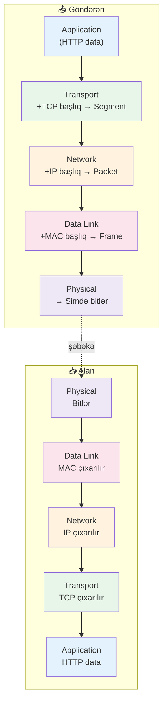

# 🧠 Şəbəkə Əsasları

Hər bölmə üçün şəkil və daha dəqiq izahlarla praktik bələdçi.

---

## ❓ Şəbəkə nədir?

- Tərif: qurğuların bir‑biri ilə məlumat mübadiləsi və resurs paylaşması üçün birləşdirilməsi.
- Baza elementləri: ötürmə mühiti (mis/şüşə/simsiz), ünvanlar (MAC/IP), yönləndirmə (switch/router) və protokollar (TCP/IP, DNS, DHCP).
- Qeyd: kiçik şəbəkələr sadədir; miqyas artdıqca seqmentləşdirmə, NAT və marşrut qaydaları tələb olunur.


---

## 🗺️ Sahə Şəbəkələrinin Növləri

- LAN: kiçik ərazilər (ev/ofis/kampus). Yüksək sürət, aşağı gecikmə; adətən Ethernet və Wi‑Fi.
- MAN: şəhər səviyyəsində. Çox vaxt fiber halqalar; İSP və ya böyük təşkilat idarə edir.
- WAN: uzaq ofislərin birləşdirilməsi; MPLS/VPN/İnternetdən istifadə.
- Qeyd: Buluda çıxış (Direct Connect/ExpressRoute) WAN‑ın uzantısı kimi baxıla bilər.


---

## 🔗 LAN Topologiyaları

- Bus: bütün qurğular eyni xəttə qoşulur; sadə/ucuz, lakin toqquşma və tək xətt nasazlığı riski.
- Ulduz (Star): hər qurğu mərkəzi switch‑ə; ən yaygın, idarəsi asan, mərkəzdə tək nasazlıq nöqtəsi.
- Halqa (Ring): trafik halqa boyunca dövr edir; halqa qırılarsa əlaqə dayanır (ikiqat halqa istisna).
- Mesh: qurğular arasında çoxsaylı yol; yüksək dayanıqlılıq, daha baha; bel/skelet şəbəkələrdə.
- Qeyd: müasir LAN fiziki ulduz, lakin ehtiyat linklərlə məntiqi mesh qura bilər (LACP, STP).


---

## 🔀 Switch və Router Fərqi

- Switching (2‑ci qat): çərçivələri MAC cədvəlinə əsasən ötürür; eyni yayım sahəsində (VLAN) işləyir.
- Routing (3‑cü qat): paketləri IP marşrutlarına əsasən ötürür; fərqli şəbəkələri birləşdirir.
- Inter‑VLAN yönləndirmə: L3 switch (SVI) və ya router‑on‑a‑stick (802.1Q trunk) ilə.
- Dayanıqlılıq: L2‑də STP/RSTP, L3 qapıda HSRP/VRRP/GLBP.
- Qeyd: böyük L2 sahələrindən qaçmaq üçün paylama/əsas qatlar arasında L3 linklərdən istifadə edin.


Gateway ehtiyatlılığı (HSRP):

```shell
interface Vlan10
 ip address 192.168.10.2 255.255.255.0
 standby 10 ip 192.168.10.1
 standby 10 priority 110
 standby 10 preempt
```

---

## 📡 Əlaqə Tipləri

- Unicast: bir‑birinə çatdırılma. Qeyd: veb/applikasiya trafiki əsasən unicastdır.
- Multicast: abunəçilərə bir‑çox. Qeyd: yayım/axın üçün səmərəlidir; multicast yönləndirmə tələb edir.
- Broadcast: alt şəbəkədə hamıya. Qeyd: L2 ilə məhdud; həddən artıq broadcast “storm” yarada bilər.


---

## 🧵 VLAN və Trunking

- VLAN: məntiqi L2 seqmentləşdirmə; yayım sahələrini ayırır, təhlükəsizliyi/miqyası yaxşılaşdırır.
- Access port: tək VLAN; Trunk port: çox VLAN (802.1Q etiketləri).
- Native VLAN: trunk üzərində etiketsiz trafik; hər iki tərəfdə eyni saxlayın.
- Inter‑VLAN: L3 qapı (SVI) tələb edir; VLAN‑lar arasında ACL/firewall qaydaları tətbiq edin.
- Qeyd: trunklarda istifadə olunmayan VLAN‑ları kəsin; idarəetmə üçün VLAN 1‑dən qaçın.


Sürətli konfiqlər (Cisco IOS):

```shell
! VLAN 10 üçün access port
interface GigabitEthernet0/1
 switchport mode access
 switchport access vlan 10

! 802.1Q trunk, yalnız 10,20 VLAN
interface GigabitEthernet0/48
 switchport trunk encapsulation dot1q
 switchport mode trunk
 switchport trunk allowed vlan 10,20
 switchport trunk native vlan 999
 spanning-tree portfast trunk
```

Inter‑VLAN yönləndirmə (SVI):

```shell
vlan 10
 name USERS
vlan 20
 name SERVERS

interface Vlan10
 ip address 192.168.10.1 255.255.255.0
interface Vlan20
 ip address 192.168.20.1 255.255.255.0
ip routing
```

---

## 🌐 IP Ünvanlama (IPv4/IPv6)

- Məxfi vs İctimai:
  - Məxfi (RFC1918): `10.0.0.0/8`, `172.16.0.0/12`, `192.168.0.0/16`; internetdə marşrutlaşdırılmır.
  - İctimai: qlobal marşrutlana bilən.
- Dinamik vs Statik:
  - Dinamik: DHCP ilə verilir; zamanla dəyişir.
  - Statik: sabit; serverlər/DNS üçün stabil seçim.
- IPv6: 128‑bit; nəhəng ünvan sahəsi, sadələşmiş başlıq, NAT tələb etmir. Qeyd: keçiddə dual‑stack geniş yayılıb.

IPv6 detallar:
- Ünvan tipləri: Global Unicast (2000::/3), Link‑Local (fe80::/10), Unique Local (fc00::/7), Multicast (ff00::/8).
- Host ünvanlanması: SLAAC (RA) və ya DHCPv6; ND/RS/RA, ARP yerinə işləyir.
- Subnet: tipik olaraq /64; hostlar üçün /120+ yalnız əsaslandırıldıqda.


---

## ➗ Subnetləşdirmə və CIDR

- CIDR: `192.168.1.0/24` — 24 şəbəkə biti, 256 ünvan (254 istifadə oluna bilən).
- P2P xətləri: `/30` (IPv4) 2 istifadə oluna bilən IP; `/31` P2P üçün (RFC 3021).
- Siniflər (A/B/C) tarixi anlayışdır; praktikada VLSM/CIDR istifadə olunur.
- Qeyd: alt şəbəkələri funksiyaya görə planlamaq firewall qaydalarını sadələşdirir.

Nümunə: `192.168.10.0/24` şəbəkəsini 4 bərabər `/26` alt şəbəkəyə bölün: `192.168.10.0/26`, `.64/26`, `.128/26`, `.192/26`.


---

## 🔁 NAT (Network Address Translation)

- Nədir: daxili ünvanların kənarda ictimai ünvanlara (və portlara) çevrilməsi.
- Növlər: Statik (1:1), Dinamik (hovuz), PAT/NAPT (çox‑bir porta görə).
- İstifadə: IPv4 qorunması, daxili ünvanların gizlədilməsi, sadə çıxış siyasəti.
- Qeyd: NAT ucdan‑uca əlaqəni pozur; daxil olan trafik üçün port yönləndirmə və ya reverse proxy istifadə edin.

Qabaqcıl qeydlər:
- Hairpin NAT (loopback) — daxildə olarkən publik IP ilə daxili hosta çıxış.
- NAT64/NPTv6 — IPv6 üçün xüsusi hallar; əsasən NAT‑sız nativ IPv6 üstünlükdür.


Nümunələr:

```shell
! Cisco IOS PAT (çox‑bir)
interface GigabitEthernet0/0
 ip address 203.0.113.10 255.255.255.248
 ip nat outside
interface GigabitEthernet0/1
 ip address 192.168.10.1 255.255.255.0
 ip nat inside
access-list 10 permit 192.168.10.0 0.0.0.255
ip nat inside source list 10 interface GigabitEthernet0/0 overload
```

```bash
# Linux (iptables) SNAT/MASQUERADE
sysctl -w net.ipv4.ip_forward=1
iptables -t nat -A POSTROUTING -s 192.168.10.0/24 -o eth0 -j MASQUERADE
```

---

## 🆔 MAC və ARP

- MAC: L2 cihaz ünvanı (məs., `00:aa:bb:cc:dd:ee`).
- ARP: eyni yayım sahəsində IPv4‑ü MAC‑a xəritələyir.
- Qeyd: gratuitous ARP qonşuları yeniləyir; ARP zəhərlənməsi tipik L2 hücumudur.


---

## 🤝 DHCP (DORA)

- Discover → Offer → Request → Ack: IP icarəsi və parametrlərin (gateway, DNS, icarə vaxtı) alınması.
- Qeyd: rezervasiya MAC→IP təyin edir; relay (IP Helper) yayımı digər şəbəkələrə ötürür.

Faydalı opsiyalar: `3` Default Gateway, `6` DNS, `15` Domain, `42` NTP.


---

## 🔤 DNS Əsasları

- Məqsəd: adların IP‑lərə (A/AAAA), poçt (MX), ləqəb (CNAME), mətn (TXT) yazılarına xəritələnməsi.
- Komponentlər: keş, rezolver, avt. ad serverləri, ad məkanı (root, TLD, domenlər).
- Qeyd: TTL keşləmə müddətini tənzimləyir; split‑horizon daxili və xarici üçün fərqli cavab verir.

Reverse DNS: PTR IP→ad. Poçt serverləri üçün PTR, SPF (TXT), DKIM, DMARC uyğunluğu vacibdir.


Zona nümunəsi (BIND):

```dns
$TTL 3600
@   IN SOA ns1.example.com. hostmaster.example.com. (
        2025010101 ; serial
        3600       ; refresh
        900        ; retry
        1209600    ; expire
        300 )      ; minimum
    IN NS  ns1.example.com.
ns1 IN A   192.0.2.53
www IN A   198.51.100.42
mail IN A  203.0.113.25
@   IN MX  10 mail.example.com.
```

---

## 🔢 Yayğın Port və Protokollar

- 20/21 FTP — fayl ötürmə (data/control); köhnə, internetdə tövsiyə edilmir.
- 22 SSH — təhlükəsiz uzaq shell və tunellər.
- 23 Telnet — şifrəsiz; istifadə etməyin.
- 25/465/587 SMTP — poçt ötürülməsi və göndərişi.
- 53 DNS — adların həlli (UDP/TCP).
- 67/68 DHCP — IPv4 ünvan icarəsi.
- 80/443 HTTP/HTTPS — veb.
- 110 POP3, 143 IMAP — poçt qəbulu.
- 123 NTP — vaxt sinxronizəsi.
- 137‑139 NetBIOS, 445 SMB — Windows fayl/xidmətləri.
- 161/162 SNMP — şəbəkə monitorinqi və traplar.
- 389 LDAP — kataloq xidməti.
- 1433 MSSQL, 1521 Oracle, 3306 MySQL, 5432 PostgreSQL — verilənlər bazaları.
- 3389 RDP — Windows uzaq masaüstü.


---

## 🧭 Modellər: TCP/IP və OSI

- TCP/IP (5 qat): Application • Transport • Network • Data Link • Physical.
- OSI (7 qat):
  - 7 Application — istifadəçi protokolları (HTTP, DNS, SMTP). Data.
  - 6 Presentation — format/şifrə/sıxılma (TLS/SSL). Data.
  - 5 Session — sesiyalar/nəzarət nöqtələri (RPC). Data.
  - 4 Transport — TCP/UDP, portlar, etibarlılıq, ardıcıllıq. Segment/Datagram.
  - 3 Network — IP marşrutlama, ünvanlama, TTL. Paket.
  - 2 Data Link — çərçivə, MAC, VLAN, ARP. Çərçivə. Cihazlar: switch/bric.
  - 1 Physical — bitlər, siqnal, media, konnektorlar. Bit.
- Qeyd: kapsullaşma məlumatı aşağı qatlardan keçirdikcə başlıq əlavə edir; hopda uyğun qat decapsulation edir.


**Kapsullaşma axını (göndərən → alan):**



---

## 📶 Simsiz Şəbəkə (Wi‑Fi)

- Zolaqlar: 2.4 GHz (uzun məsafə, sıx), 5 GHz (sürətli, daha çox kanal), 6 GHz (Wi‑Fi 6E, təmiz spektr).
- Kanallar: 2.4 GHz‑də üst‑üstə düşməyən 1/6/11; 5 GHz‑də DFS kanalları nəzərə alın.
- Təhlükəsizlik: minimum WPA2‑PSK; mümkün olduqda WPA3. Açıq/WEP şəbəkələrdən qaçın.
- Dizayn: rouminq üçün 15–20% örtüşmə; həddən artıq gücdən qaçın; 20/40/80 MHz kanal enini məqsədə görə seçin.
- Qeyd: korp/qonaq/IoT üçün ayrıca SSID; IoT ayrıca VLAN və firewall qaydaları ilə.


---

## 🧰 Diaqnostika

- Əlaqə: `ping`, `traceroute`/`tracert`, `arp -a`, `ipconfig`/`ifconfig`, `route`/`ip route`.
- Ad həlli: `nslookup`/`dig` ilə A/AAAA/MX yoxlayın; DNS server və search domain düzgünmü?
- Trafik: `tcpdump`/Wireshark — paketlər, handshake, retransmitləri izləyin.
- Tipik problemlər: səhv VLAN, defolt gateway yoxdur, DNS səhv, asimmetrik marşrut, MTU/PMTUD.
- Qeyd: hər iki tərəfdən test edin; switch‑də MAC cədvəlləri, hostda ARP keşinə baxın.


---

## 🔒 Şəbəkə Təhlükəsizliyi

- Seqmentləşdirmə: istifadəçi/server/idarəetmə VLAN/Subnet; arada ACL qaydaları.
- Perimetr: stateful firewall; minimal icazə; lazım olduqda NAT/port yönləndirmə.
- Görünürlük: log/NetFlow; SNMP/Telemetry ilə sağlamlıq və anomaliyalar.
- Sərtləşdirmə: lazımsız servisləri söndürün, idarəetməni (SSH, AAA) qoruyun, sistemləri yeniləyin.
- Qeyd: hər yerdə TLS; publik tətbiqləri reverse proxy/WAF arxasında saxlayın; həssas tətbiqlər üçün Zero Trust.


