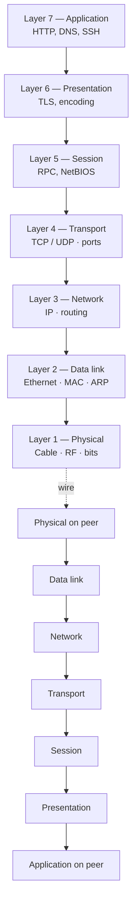
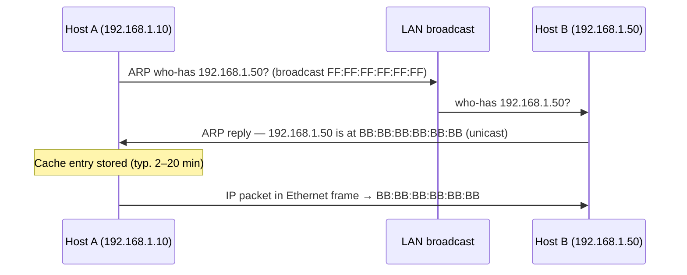
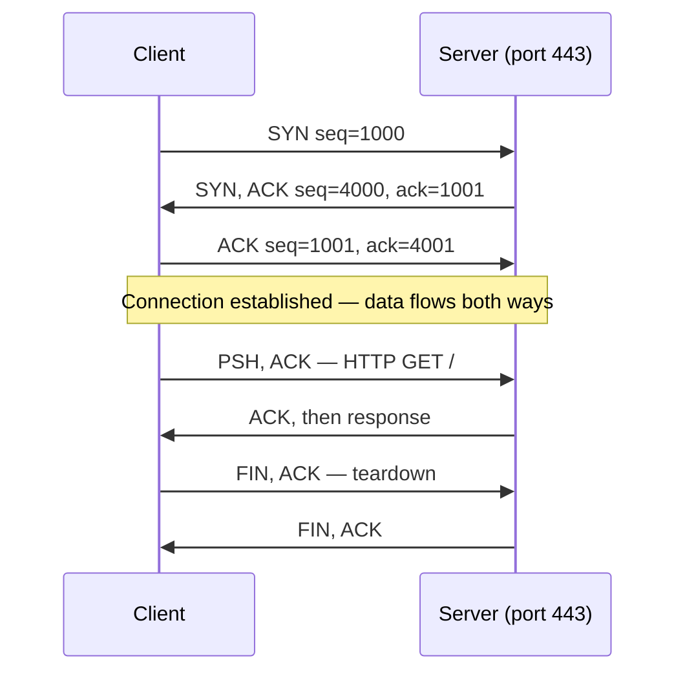
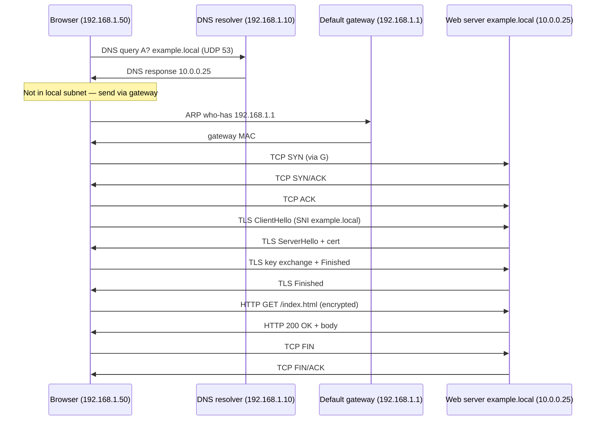

# Şəbəkə əsasları

Cavab verəcəyiniz hər təhlükəsizlik incident-i sonda telin üzərində bitir. Malware TCP 443 üzərindən beacon edir. Hücumçu 445-də SMB vasitəsilə pivot edir. İstifadəçi portalın "yavaş" olduğundan şikayətlənir, və əsl cavab üç hop kənarda pozulmuş MTU-dur. PCAP oxuya bilməyən SOC analitiki təxmin edir, və marşrutlaşdırma haqqında düşünə bilməyən blue-teamer həmişə bunu bacaranın qarşısında uduzacaq. Pen-tester-lər ARP və DNS-də yaşayır. Cloud mühəndislər NAT və security qruplarında yaşayır. Hətta proqram tərtibatçıları da debug vaxtının yarısını TLS və HTTP başlıqlarına xərcləyir. İstənilən infosec rolu altında təxminən 30% şəbəkədir, və bu dərs hər şeyi üzərində qurduğunuz baseline-dır.

Bu dərs qəsdən **yuxarı səviyyəli icmaldır**. Dərin dalışlar ayrı-ayrı dərslərdə yaşayır — IP ünvanlama və subnet, DNS, DHCP, şəbəkə tipləri — və harada uyğun gəlirlərsə link verilir. Bunu əvvəl oxuyun; tam stack başınızda olduqda digərləri daha çox məna kəsb edir.

Başlamazdan əvvəl tək bir fikir: real şəbəkədə data telleport olunmur. O, çərçivələnir, ünvanlanır, marşrutlaşdırılır, seqmentləşdirilir, yenidən birləşdirilir, təqdim olunur və nəhayət proqrama verilir. Hər təbəqə dəqiq bir iş görür. Bir şey pozulanda **nəyin səhv olduğunu** yox, **hansı təbəqə** olduğunu soruşursunuz — və cavab tez yığılır.

## İki model yan-yana

**OSI modeli** yeddi təbəqədir və şəbəkələrin *necə* işləməli olduğunu təsvir etmək üçün ilk cəhd idi. **TCP/IP modeli** dörd təbəqədir və *İnternetin əslində necə* işlədiyini təsvir edir. OSI lüğətdir; TCP/IP isə həyata keçirilmədir. Hər mühəndis hər ikisini istifadə edir — paketlər telin üzərində TCP/IP-yə tabe olsa da, "Layer 7 problemi" və "Layer 2 problemi" gündəlik nitqdir.

| OSI təbəqəsi | # | TCP/IP təbəqəsi | Nə edir | Real protokol nümunələri |
|---|---|---|---|---|
| Application | 7 | Application | İstifadəçiyə baxan protokollar | HTTP, HTTPS, SMTP, SSH, DNS, FTP |
| Presentation | 6 | Application | Kodlaşdırma, şifrələmə, sıxılma | TLS, MIME, JPEG, ASCII |
| Session | 5 | Application | Sessiya açma, saxlama, bağlama | NetBIOS, RPC, SMB |
| Transport | 4 | Transport | Uçdan-uca çatdırılma, portlar | TCP, UDP, QUIC |
| Network | 3 | Internet | Məntiqi ünvanlama, şəbəkələr arası marşrutlaşdırma | IP, ICMP, IPsec, OSPF, BGP |
| Data link | 2 | Network Access | Çərçivələmə, bir link üzərində MAC ünvanlaması | Ethernet, Wi-Fi 802.11, ARP, VLAN (802.1Q) |
| Physical | 1 | Network Access | Elektrik/optik siqnal, kabel, RF | Mis UTP, fibre, RJ-45, siqnal modulyasiyası |

Bir təxmin qaydası: ekranınızdakı **data** stack aşağı düşdükcə bölünür (proqram datası → seqmentlər → paketlər → çərçivələr → bitlər) və yuxarı qalxarkən yenidən birləşdirilir. Hər təbəqə aşağı düşərkən başlıq əlavə edir və yuxarı qalxarkən onu çıxarır. Bu **encapsulation**-dur, və paket tutumlarının iç-içə qutular kimi görünməsinin səbəbi budur.



OSI stack üçün faydalı mnemonika, aşağıdan yuxarı: **P**lease **D**o **N**ot **T**hrow **S**ausage **P**izza **A**way.

## Ethernet və data-link təbəqəsi

Layer 2 tək bir fiziki seqmentin işləyən şəbəkəyə çevrildiyi yerdir. Simli LAN-da hakim texnologiya **Ethernet**-dir (IEEE 802.3); simsiz Wi-Fi-dir (IEEE 802.11). Hər ikisi eyni ideyadan istifadə edir — MAC ünvanları olan çərçivə — ona görə anlayışlar köçürülür.

### MAC ünvanları

Hər şəbəkə interfeysi fabrikdə yandırılmış 48-bitlik **MAC ünvana** sahibdir, altı hex cütü kimi yazılır: `AA:BB:CC:DD:EE:FF`. İlk üç oktet **OUI**-dir (Organizationally Unique Identifier) və vendor-u tanıdır — `00:50:56` VMware-dir, `F4:5C:89` Apple-dir və s. Sonuncu üç vendor-un öz seriyasıdır.

MAC ünvan yalnız **öz broadcast domeninin daxilində** mənalıdır. Çərçivə marşrutlaşdırıcıdan keçəndən sonra orijinal MAC yox olur — marşrutlaşdırıcı Layer 2 başlığını öz MAC-ı ilə yenidən yazır. Buna görə uzaq server-in MAC-ını heç vaxt "görmürsünüz", yalnız default gateway-inizin MAC-ını.

### Ethernet çərçivəsi, konseptual

```
┌───────────────┬───────────────┬─────────┬───────────────┬─────┐
│ Dest MAC (6B) │ Src MAC (6B)  │ Type(2B)│ Payload (IP…) │ FCS │
└───────────────┴───────────────┴─────────┴───────────────┴─────┘
```

**Type** sahəsi qəbuledicıyə payload-ın içində nə olduğunu söyləyir — `0x0800` IPv4 deməkdir, `0x86DD` IPv6, `0x0806` ARP. **FCS** korlanma aşkarlamaq üçün istifadə olunan CRC-dir; pis FCS çərçivənin səssizcə düşdüyünü göstərir.

### Hub-lar vs kommutatorlar

| Cihaz | OSI təbəqəsi | Davranış |
|---|---|---|
| **Hub** | 1 | Hər biti hər portdan təkrarlayır. Paylaşılan toqquşma domeni. Köhnəlmiş. |
| **Kommutator (switch)** | 2 | Hansı MAC-ın hansı portda olduğunu öyrənir (CAM/MAC cədvəli) və yalnız doğru porta yönləndirir. |

Hub hər kəsin hər kəsin trafikini sniff etməsi deməkdir — cihazla pulsuz gələn wiretap. Kommutator çərçivənin yalnız təyinatına getdiyi deməkdir, bu performans üçün daha yaxşı, təhlükəsizlik üçün isə xeyli daha yaxşıdır. Müasir şəbəkədə hub görməməlisiniz; əgər görsəniz, dəyişdirilməsi ilk şeydir.

### Broadcast domeni

Eyni **broadcast domenindəki** hər cihaz eyni broadcast-ları qəbul edir (ARP who-has, DHCP Discover və s.). VLAN-sız kommutator bir böyük broadcast domenidir — bir neçə yüz cihaz olana və broadcast trafiki faydalı trafiki batırmağa başlayana qədər yaxşı işləyir.

### VLAN-lar bir paraqrafda

**VLAN** (Virtual LAN, 802.1Q) fiziki kommutatoru bir neçə məntiqi kommutatora bölmək üsuludur. Hər VLAN öz broadcast domenidir — VLAN 10-dakı host-lar VLAN 20-dəki host-larla Layer 2-də ümumiyyətlə danışa bilməzlər. Keçmək üçün trafik marşrutlaşdırıcıya və ya Layer-3 kommutatoruna qalxmalıdır, burada ACL, təhlükəsizlik divarı və ya inspeksiya tətbiq edə bilərsiniz. VLAN-lar eyni fiziki kommutatorda printer-ləri, kameraları, qonaqları, server-ləri və istifadəçi noutbuklarını ayrı saxlamağın yoludur — fundamental seqmentasiya kontroludur.

## IP ünvanlama və marşrutlaşdırma

Layer 3 paketin şəbəkələr arasında səyahət etmək üçün lazım olan *məntiqi* ünvanı aldığı yerdir. MAC çərçivəni bir telin üzərindən aparır; IP paketi İnternet üzərindən aparır.

### IPv4 bir baxışda

IPv4 ünvanları 32 bitdir, dörd onluq oktet kimi yazılır: `192.168.1.50`. Ünvan **subnet mask** (`255.255.255.0` və ya CIDR forması `/24`) ilə **şəbəkə** hissəsinə və **host** hissəsinə bölünür. Şəbəkə hissələri uyğun gələn iki host eyni subnet-dədir və Layer 2-də birbaşa danışa bilərlər. Şəbəkə hissələri fərqli olan iki host bir-birinə çatmaq üçün **default gateway** — marşrutlaşdırıcı — vasitəsilə getməlidir.

### IPv6 bir baxışda

IPv6 ünvanları 128 bitdir, iki nöqtə ilə ayrılmış səkkiz hex qrupu kimi yazılır: `2001:0db8:85a3:0000:0000:8a2e:0370:7334`. Aparıcı sıfırlar atıla bilər və hamısı sıfır olan qrupların bir seriyası `::` ilə qatlanaraq birləşdirilə bilər, beləliklə bu `2001:db8:85a3::8a2e:370:7334` olur. IPv6-da broadcast yoxdur (yalnız multicast), qutudan kənar autokonfiqurasiyanı (SLAAC) dəstəkləyir, və ünvan sahəsi praktiki olaraq sonsuzdur. İndi əksər mobil şəbəkələrdə və böyük cloud provayderlərdə default-dur — onu görməyə hazır olun.

### Şəxsi vs ictimai

**Şəxsi** diapazonlar (RFC 1918) İnternetdə marşrutlaşdırılmır — onlar yalnız təşkilatların daxilində mövcuddur, **NAT** kənarda şəxsi və ictimai arasında tərcümə edir.

| Diapazon | CIDR | Tipik istifadə |
|---|---|---|
| `10.0.0.0 – 10.255.255.255` | `10.0.0.0/8` | Böyük müəssisələr, cloud-lar |
| `172.16.0.0 – 172.31.255.255` | `172.16.0.0/12` | Orta şəbəkələr |
| `192.168.0.0 – 192.168.255.255` | `192.168.0.0/16` | Ev, kiçik ofis |
| `169.254.0.0 – 169.254.255.255` | `169.254.0.0/16` | APIPA — DHCP uğursuz oldu, yalnız link-local |
| `127.0.0.0 – 127.255.255.255` | `127.0.0.0/8` | Loopback (`localhost`) |

### CIDR bir cədvəldə

CIDR (`/N`) sizə neçə bitin şəbəkə hissəsi olduğunu söyləyir. Bunlardan ikisini və ya üçünü xatırlayın, qalanları ondan çıxar.

| CIDR | Mask | Host (istifadə oluna bilən) | Tipik istifadə |
|---|---|---|---|
| `/8` | `255.0.0.0` | 16,777,214 | Böyük ISP / RFC 1918 bloku |
| `/16` | `255.255.0.0` | 65,534 | Kampus və ya böyük sahə |
| `/24` | `255.255.255.0` | 254 | Standart ofis subnet-i |
| `/25` | `255.255.255.128` | 126 | Kiçik subnet |
| `/28` | `255.255.255.240` | 14 | Nöqtədən-nöqtəyə, kiçik DMZ |
| `/30` | `255.255.255.252` | 2 | WAN link |
| `/32` | `255.255.255.255` | 1 | Tək host (ACL, loopback) |

### Default gateway və marşrutlaşdırma cədvəli

Maşınınızın marşrutlaşdırma cədvəli çox qısa qaydalar siyahısıdır: "bu subnet-dəki paketlər üçün bu interfeysdən çıx; qalan hər şey üçün gateway-ə göndər." `0.0.0.0/0` girişi — **default route** — daha spesifik heç bir şeyə uyğun gəlməyən hər şeyin getdiyi yerdir. Marşrutlaşdırıcılar bunu dinamik protokollarla (OSPF, BGP) genişləndirir, bu protokollar onlara qonşulardan yollar öyrənməyə imkan verir.

```text
PS> route print
IPv4 Route Table
===========================================================
Active Routes:
Network Destination        Netmask          Gateway       Interface   Metric
          0.0.0.0          0.0.0.0     192.168.1.1    192.168.1.50      25
      192.168.1.0    255.255.255.0         On-link     192.168.1.50     281
      192.168.1.50  255.255.255.255         On-link     192.168.1.50     281
===========================================================
```

Subnet-ləmə haqqında qalan hər şey — `/24`-ü dörd `/26`-ya necə bölmək, VLSM, supernetting, IPv6 prefiksləri — ayrı dərsdə yaşayır: bax [IP ünvanlama və subnet](/networking/ip-addressing-subnetting).

## ARP — L2 və L3 arasındakı yapışqan

Təyinatın IP-sini bilirsiniz. Qarşınızdakı kommutator yalnız MAC-ları başa düşür. Bu boşluğu necə birləşdirirsiniz? **ARP** (Address Resolution Protocol, RFC 826) cavabdır.

Host A `192.168.1.50` IP-sinə paket göndərmək istədikdə və onun MAC-ını bilmədikdə, sual **broadcast** edir: "Kimdə 192.168.1.50 var? Mənə deyin." LAN-dakı hər host eşidir; `.50`-nin sahibi öz MAC-ı ilə birbaşa cavab verir. A xəritələməni öz **ARP cache**-ində bir neçə dəqiqəlik qeyd edir və paketi göndərir.



Cache-ı hər iki OS-də inspeksiya edin:

```powershell
# Windows
arp -a
```

```bash
# Linux
ip neigh show
```

ARP-nin çirkin reallığı odur ki, onun **autentifikasiyası yoxdur**. LAN-dakı hər host gateway olduğunu iddia edən gratuitous ARP göndərə bilər, və qalan hər kəs sədaqətlə cache-ini yeniləyəcək və trafiklərini hücumçu vasitəsilə göndərməyə başlayacaq — **ARP spoofing** / ARP poisoning, ən köhnə və hələ də ən yayılmış Layer-2 hücumlarından biri. Hücumu və müdafiələrini (DAI, port security, statik ARP) sonrakı dərsdə əhatə edirik. Hələlik bilin ki, ARP sürətli, vəziyyətsiz və güvənçidir.

## Transport təbəqəsi: TCP vs UDP

Layer 4 "host host ilə danışır"-ın "**proqram** **proqram** ilə danışır"-a çevrildiyi yerdir. İki əsas protokol **TCP** (etibarlı, bağlantı-yönümlü) və **UDP**-dir (best-effort, bağlantısız).

### TCP bir səhifədə

TCP `(mənbə IP : mənbə port) ↔ (təyinat IP : təyinat port)` ilə tanınan iki endpoint arasında sıralı, etibarlı bayt axını verir. O, hər baytı nömrələyərək (**sequence number**) və qəbul edilənləri təsdiq edərək (**ack number**) çatdırılmanı təmin edir. İtirilmiş seqmentlər yenidən ötürülür; sıralanmamış seqmentlər sıraya qoyulur; axın **sliding window** ilə idarə olunur ki, sürətli göndərici yavaş qəbuledicını boğmasın.

Hər hansı data axmazdan əvvəl iki peer **üç-tərəfli handshake**-i tamamlayır — Wireshark-da minlərlə dəfə görəcəyiniz şey.



### TCP flag-ları

Hər TCP seqmenti 6-bitlik flag sahəsi daşıyır. Bu altısını əzbərləyin — `tcpdump`-dan IDS-ə qədər hər alət onları göstərir.

| Flag | Mənası |
|---|---|
| **SYN** | Bağlantı aç (ilkin seq nömrəsi) |
| **ACK** | Qəbul edilmiş datanı təsdiq edir |
| **FIN** | Təmiz bağlanma — "Mən göndərməyi bitirdim" |
| **RST** | Sərt sıfırlama — indi bağla |
| **PSH** | Buferlənmiş datanı dərhal proqrama itələ |
| **URG** | Urgent pointer etibarlı (nadir) |

Hədəfdə uyğun xidmət olmayan `SYN` geri `RST` alır — port skaneri "bağlı"-nı "açıq"-dan belə ayırır. `SYN_SENT`-də ilişib qalan yarı-açıq bağlantı yəqin filtrlənmiş portdur və ya təhlükəsizlik divarı paketi düşürür.

### UDP bir paraqrafda

UDP (RFC 768) nazik wrapper-dir: mənbə port, təyinat port, uzunluq, checksum, payload. Handshake yox, təsdiq yox, yenidən ötürmə yox, sıra yox. Paket itirilirsə, itirilmişdir. Üstündəki proqram nə edəcəyinə qərar verir (və ya əhəmiyyət vermir). Buna görə UDP sürətin mükəmməl çatdırılmadan daha vacib olduğu yerdə istifadə olunur: DNS sorğuları, DHCP, VoIP, oyun trafiki, video streaming, syslog, SNMP. Yeni **QUIC** protokolu (HTTP/3-ün üzərində qaçdığı) UDP istifadə edir və etibarlılığı onun içində yenidən qurur, kernel TCP stack-ini tamamilə atlayır.

### Hansını nə vaxt istifadə etmək

| TCP-ni istifadə edin… | UDP-ni istifadə edin… |
|---|---|
| Bayt itirmək qəbuledilməzdir (HTTPS, SSH, SMTP) | Düşmüş paket gözləməkdənsə dəyişdirmək asandır |
| Data sıra ilə çatmalıdır | Proqram öz sıralamasını idarə edir (RTP timestamp-lar) |
| Ötürmə qabiliyyəti düzgünlükdən az vacibdir | Latency düzgünlükdən daha vacibdir |
| Sessiyalar uzun ömürlüdür | Mübadilələr birdəfəlikdir (DNS sorğusu) |

Sliding-window axın idarəetməsi: qəbuledici nə qədər buferi olduğunu reklam edir, və göndəricinin uçuşda olan təsdiqlənməmiş baytları heç vaxt bundan çox ola bilmir — bu, TCP-nin marşrutlaşdırıcılarda fair-queueing olmadan özünü necə tarazlamasıdır.

## Portlar və protokol cheat-sheet

Hər TCP/UDP bağlantısı **beş parça** ilə tanınır: protokol, mənbə IP, mənbə port, təyinat IP, təyinat port. Portlar 0–65535 işləyir. **0–1023** portları "well-known"-dur və bağlamaq üçün root/admin tələb edir; **1024–49151** "registered"-dir; **49152–65535** efemer / dinamikdir və client bağlantılarına paylanır.

Vəhşi təbiətdə əslində görəcəyiniz otuz port:

| Port | Proto | Xidmət | Niyə vacibdir |
|---|---|---|---|
| 20 / 21 | TCP | FTP data / control | Köhnə fayl ötürülməsi, cleartext |
| 22 | TCP | SSH / SCP / SFTP | Hər yerdə uzaq admin |
| 23 | TCP | Telnet | Cleartext uzaq shell — qırmızı bayraq |
| 25 | TCP | SMTP | Mail göndərmə (server-to-server) |
| 53 | TCP/UDP | DNS | Ad həlli — sorğular üçün UDP, böyük/AXFR üçün TCP |
| 67 / 68 | UDP | DHCP server / client | DORA |
| 69 | UDP | TFTP | Şəbəkə boot, config backup |
| 80 | TCP | HTTP | Plain web — demək olar ki, həmişə 443-ə yönləndirilir |
| 88 | TCP/UDP | Kerberos | Windows auth |
| 110 | TCP | POP3 | Mail çəkmə, köhnə |
| 123 | UDP | NTP | Vaxt sinxronizasiyası — Kerberos, log-lar üçün kritik |
| 137 / 138 / 139 | UDP/TCP | NetBIOS | Köhnə Windows fayl/ad xidməti |
| 143 | TCP | IMAP | Mail çəkmə, müasir |
| 161 / 162 | UDP | SNMP / SNMP trap | Şəbəkə cihazı monitorinqi |
| 389 | TCP/UDP | LDAP | Directory axtarışı |
| 443 | TCP | HTTPS | TLS üzərində web — default |
| 445 | TCP | SMB / CIFS | Windows fayl paylaşımı — ransomware sevimlisi |
| 465 / 587 | TCP | SMTPS / submission | Autentifikasiyalı mail göndərmə |
| 500 | UDP | IKE | IPsec VPN açar mübadiləsi |
| 514 | UDP | Syslog | Log göndərmə |
| 636 | TCP | LDAPS | TLS üzərində LDAP |
| 993 | TCP | IMAPS | Təhlükəsiz IMAP |
| 995 | TCP | POP3S | Təhlükəsiz POP3 |
| 1433 | TCP | MSSQL | Microsoft SQL Server |
| 1521 | TCP | Oracle DB | Oracle listener |
| 3306 | TCP | MySQL / MariaDB | Open-source SQL |
| 3389 | TCP | RDP | Remote desktop |
| 5432 | TCP | PostgreSQL | Open-source SQL |
| 5985 / 5986 | TCP | WinRM / WinRM-HTTPS | PowerShell remoting |
| 8080 / 8443 | TCP | HTTP-alt / HTTPS-alt | Proxy-lər, admin UI-lər |

Təhlükəsizlik vərdişi: host-da **gözlənilməz dinləyən port** görəndə, sübut olunana qədər təqsirkar kimi qəbul edin. Backdoor-lar qaranlıq yüksək portları sevir; unudulmuş test server 8080-i sevir.

## DNS və DHCP 60 saniyədə

**DNS** (Domain Name System) yaza biləcəyiniz adları (`example.local`) stack-in marşrutlaşdıra biləcəyi ünvanlara (`10.0.0.25`) çevirir. DNS-siz web saniyələr içində istifadəyə yararsız olur. Sorğu adətən UDP 53 üzərində qaçır və böyük cavablar və zona köçürmələri üçün TCP 53-ə qayıdır. DNS həm də İnternetdə ən çox sui-istifadə olunan protokollardan biridir — cache poisoning, tunelləmə, typosquatting, DGA-əsaslı malware. Tam dərin dalış: [DNS](/networking/dns).

**DHCP** (Dynamic Host Configuration Protocol) yeni client-lərə UDP 67/68-də dörd-addımlı **DORA** mübadiləsi (Discover, Offer, Request, Acknowledge) vasitəsilə avtomatik olaraq IP, mask, gateway və DNS server-lərini verir. Onsuz hər maşına manual IP konfiqurasiyası lazımdır — fleet miqyasında həm yorucu, həm də ünvan toqquşmalarının daimi mənbəyidir. Tam dərin dalış: [DHCP](/networking/dhcp).

İkisi toxunacağınız hər şəbəkənin **görünməz infrastrukturudur**: pozulduqda hər şey pozulmuş kimi görünür.

## Qarşılaşacağınız şəbəkə cihazları

Hər şəbəkə avadanlığı parçası müəyyən təbəqədə yönləndirmə qərarı verir. Cihazın hansı təbəqədə işlədiyini bilmək sizə nə qoruya və qoruya bilməyəcəyini söyləyir.

| Cihaz | OSI təbəqəsi | Qərar əsaslıdır |
|---|---|---|
| Hub | 1 | Bitləri təkrarlayır. Qərar yoxdur. |
| Kommutator (switch) | 2 | Təyinat MAC → CAM cədvəli → düzgün port |
| Marşrutlaşdırıcı (router) | 3 | Təyinat IP → marşrutlaşdırma cədvəli → next hop |
| Vəziyyətsiz təhlükəsizlik divarı | 3–4 | 5-tuple ACL, paket başına |
| Vəziyyətli təhlükəsizlik divarı | 3–4 | Bağlantı vəziyyəti cədvəli + ACL |
| Next-gen firewall (NGFW) | 3–7 | Plus app ID, user ID, TLS inspeksiyası |
| Yük balanslayıcı | 4 (L4) və ya 7 (L7) | Pool sağlamlığı + alqoritm (round-robin, least-conn, hash) |
| Forward proxy | 7 | Çıxan client-lər adına hərəkət edir |
| Reverse proxy | 7 | Trafik qəbul edən server-lər adına hərəkət edir |
| IDS / IPS | 3–7 | İmza / anomaliya aşkarlanması (IDS xəbərdarlıq edir, IPS bloklayır) |
| WAF (Web App Firewall) | 7 | HTTP sorğu inspeksiyası (SQLi, XSS, OWASP Top 10) |
| NAT gateway | 3 | Mənbə IP/port-u yenidən yazır — şəxsi ↔ ictimai |
| VPN konsentrator | 3 | IPsec/SSL tunelləri + marşrutlaşdırma |

Daxiliyə qədər mənimsəməyə dəyər iki fərq:

- **Vəziyyətsiz** təhlükəsizlik divarı hər paketi izolyasiyada icazə verir/inkar edir — sürətli, lakin kor. **Vəziyyətli** təhlükəsizlik divarı bağlantını izləyir (`SYN` → `SYN/ACK` → `ACK` → established) və yalnız məlum sessiyaya aid olan geri trafikinə icazə verir. Müasir hər şey demək olar ki, vəziyyətlidir.
- **Forward proxy** istifadəçilərinizlə İnternet arasında oturur — məzmun filtrasiyası, malware skanı, çıxan DLP. **Reverse proxy** İnternetlə server-lərinizin arasında oturur — TLS termination, cache, WAF, yük balansı. Eyni texnologiya, əks istiqamət.

## Bir araya gətirmək — `https://example.local/index.html` yazanda nə olur

Bu "hər şey klikləyir" bölməsidir. Enter-ə basdığınız andan səhifənin render olduğu ana qədər uçdan-uca gəzinti bu dərsdəki hər təbəqəyə toxunur. Bunu bir dəfə yavaş izləyin, və şəbəkə qoşulmamış terminlər çantası olmaqdan çıxır.

Fərz edin ki, `192.168.1.50/24`-dəsiniz, gateway `192.168.1.1`-dir, DNS server-iniz `192.168.1.10`-dur, web server `example.local` `10.0.0.25`-də yaşayır, və heç nə cache-də yoxdur.

1. **Brauzer URL-i parse edir.** Sxem `https`, host `example.local`, port default-da `443`, yol `/index.html`.
2. **DNS axtarışı.** OS resolver UDP 53 üzərində `192.168.1.10`-dan soruşur: "`example.local` üçün A record?" UDP paketi çıxa bilməzdən əvvəl OS-ə DNS server-in MAC-ı lazımdır. Həmin server eyni subnet-dədir, ona görə:
3. **ARP.** "Kimdə `192.168.1.10` var?" → cavab `AA:BB:CC:...`. Cache-lənir.
4. **DNS sorğusu/cavabı.** Cavab: `10.0.0.25`. TTL üçün cache-lənir.
5. **Marşrutlaşdırma qərarı.** `10.0.0.25` `192.168.1.0/24`-də **deyil**, ona görə paket default gateway-ə gedir. Gateway-in MAC-ı cache-də deyilsə başqa ARP: "Kimdə `192.168.1.1` var?" → gateway cavab verir.
6. **TCP 3-tərəfli handshake.** `192.168.1.50:51000` və `10.0.0.25:443` arasında `SYN` → `SYN/ACK` → `ACK`. Bütün IP paketləri next hop kimi gateway-in MAC-ı ilə çıxır; marşrutlaşdırıcı Layer 2-ni yenidən yazır və `10.0.0.25`-ə doğru yönləndirir.
7. **TLS handshake.** ClientHello (dəstəklənən şifrlər, SNI `example.local`) → ServerHello (seçilmiş şifr, sertifikat zənciri) → açar mübadiləsi → **Finished**. İndi tunel şifrlənmişdir.
8. **TLS daxilində HTTP sorğusu.** `GET /index.html HTTP/1.1`, başlıqlar, son.
9. **Server cavabı.** `200 OK`, başlıqlar, gövdə. TCP seqmentləri onu geri daşıyır, əks istiqamətdə təsdiq olunur.
10. **Brauzer render edir.** HTML-i parse edir, CSS / JS / şəkilləri kəşf edir və hər biri üçün 5–9 addımları təkrarlayır (tez-tez **eyni** TCP bağlantısında — HTTP keep-alive — və ya HTTP/2 multiplex-ləşdirilmiş).
11. **Teardown.** Tab bağlananda və ya taymer işlədikdə, `FIN` / `FIN/ACK` TCP bağlantısını təmiz bağlayır. Hər iki tərəf kobuddursa, `RST` onu qəfil bitirir.



Bu diaqramı baxmadan izah edə bildiyiniz vaxt, *şəbəkə dilində danışırsınız*.

## Praktika

Beş məşq, hamısı istənilən noutbukda edilə bilən. Sıra ilə edin.

### 1. Öz konfiqurasiyanızı oxuyun

Windows-da:

```powershell
ipconfig /all
```

Linux-da:

```bash
ip a
ip r
```

Aktiv interfeysiniz üçün tanıyın: MAC (`physical address`), IPv4 və mask-ı, default gateway və DNS server-lər. Onları kağıza skiç edin. Bu, qalan hər şey üçün ground truth-dur.

### 2. 8.8.8.8-ə yolu izləyin

Windows:

```powershell
tracert 8.8.8.8
```

Linux:

```bash
traceroute 8.8.8.8
```

Hər sətir bir hop-dur — paketinizin keçdiyi bir marşrutlaşdırıcı. İlk hop gateway-inizdir; son bir neçə hop Google-un kənarıdır; orta hissə ISP-nin nüvəsidir. `* * *` hop-un ICMP/UDP probe-larına cavab vermədiyini bildirir — bu yayılmışdır və adətən problem deyil. RTT-yə (round-trip time) baxın: hansı hop ilk dəfə 20 ms-dən çox getdi? Bu, yəqin trafikinizi başqa şəhərə daşıyandır.

### 3. Real TCP 3-tərəfli handshake-i tutun

**Wireshark** quraşdırın. Aktiv interfeysinizdə filter ilə tutmağa başlayın:

```text
tcp and host neverssl.com
```

Brauzerdə `http://neverssl.com`-a gedin (plain HTTP — TLS-siz görmək asandır). Tutumu dayandırın. Axının ilk üç paketini tapın:

- Client → server yalnız **SYN** flag ilə
- Server → client **SYN, ACK** flag-ları ilə
- Client → server **ACK** flag ilə

İstənilən birinə sağ klik → **Follow → TCP Stream** edin və bütün danışığı yenidən birləşdirilmiş kimi görün. Sequence number-ların necə artdığına diqqət edin.

### 4. Domeni iki yolla həll edin

```powershell
# Windows — A record
nslookup example.com

# Mail-exchange records
nslookup -type=mx example.com
```

```bash
# Linux — same with dig
dig example.com A +short
dig example.com MX +short
```

A record sizə IP-ni deyir. MX record-lar prioritet sırası ilə domen üçün mail qəbul edən server-i deyir. Hər ikisi eyni DNS infrastrukturu tərəfindən cavablandırılır, sadəcə fərqli record tipləri.

### 5. Dinləyən xidmətləri sadalayın

Çata bilən istənilən Linux host-da:

```bash
sudo ss -tulpn
```

`-t` TCP, `-u` UDP, `-l` listening, `-p` proses, `-n` numeric. Hər sətir maşınınızın dinlədiyi soketdir, port və proses ilə. Hər portu yuxarıdakı cheat-sheet cədvəlinə xəritə edin — bu, maşınınızın açığa çıxardığıdır. Windows-da eynisini bunla edin:

```powershell
Get-NetTCPConnection -State Listen | Sort-Object LocalPort | Format-Table LocalAddress, LocalPort, OwningProcess
```

Gözlənilməz dinləyici? Yaxşı tutdunuz — başqa heç nə etməzdən əvvəl niyə mövcud olduğunu öyrənin.

## İşlənmiş nümunə — example.local-da "printer yavaşdır" diaqnozu

İstifadəçi zəng vurur: "`printer01.example.local`-ə print etmək bu gün çox yavaşdır." Junior printer-ə uzanır və yenidən başladır. Şəbəkə bilən mühəndis stack-i gəzir.

**Layer 1 — heç açıqdırmı?** Plug edilməyəni diaqnoz edə bilməzsiniz. `ping -n 4 printer01.example.local` — dörddən üç cavab, lakin yavaşlarda 600 ms latency. Beləliklə o **canlıdır** və **çata biləndir**, lakin yolda nəsə yanlış davranır. Hələ kabeli çəkməyin.

**Layer 3 — latency haradan gəlir?** `tracert printer01.example.local` iki hop göstərir. İlk hop (gateway) 1 ms-dir. İkinci hop (printer) 600 ms-dir. Beləliklə gecikmə LAN-ın printer tərəfindədir və ya printer-in özündədir, yuxarı axında deyil.

**Layer 2 — ARP sağlamdırmı?** `arp -a | Select-String printer01-IP`. MAC printer-in adi MAC-ına uyğundur (siyahı saxlayırsınız). Yaxşı — bu ARP poisoning və ya təyin edilmiş təkrarlanan IP-ni istisna edir. MAC dəyişsəydi, sonra kommutatora gedərdiniz.

**Kommutator — MAC haradadır?** İdarə olunan kommutatorda `show mac address-table address AABB.CCDD.EEFF` portu dəqiqləşdirir. `show interfaces GigabitEthernet0/12` ilə duplex və xəta sayğaclarını görə bilərsiniz. Çatlamış patch kabel və ya half-duplex-ə geri qayıtma klassik "qəfil yavaş" səbəbidir: interfeys `CRC errors`-un artdığını göstərir.

**Layer 7 — DNS həlli.** `printer01.example.local` ümumiyyətlə düzgün şeyə həll edirmi? `nslookup printer01.example.local` — cavab cari IP-yə uyğundur. Köhnə, dekomissiya edilmiş IP-yə həll etsəydi, bu hər print job üçün 4× retry-i izah edərdi.

**Port 9100 — print xidməti dinləyirmi?** Əksər şəbəkə printer-ləri TCP 9100-də **raw print** açıqlayır. İş stansiyasından:

```powershell
Test-NetConnection -ComputerName printer01.example.local -Port 9100
```

`TcpTestSucceeded : True`. Port açıqdır, printer job qəbul edəcək.

**Təhlükəsizlik divarı qaydaları.** Server printer-dən fərqli VLAN-dadır. Print server-in mənbə IP-sinin → printer01 üçün TCP 9100-də (raw) və TCP 515-də (LPD istifadə olunursa) icazə verən qaydanın olduğunu yoxlayın. Təhlükəsizlik divarı dünənki qayda yenilənməsindən bəri `deny` hit count-un yüksəldiyini göstərir — kimsə allow-qaydasını daraltdı və retry yolunu pozdu.

**Nəticə.** "Yavaş printer" əslində print server-in fallback kimi istifadə etdiyi retry portunda fasilə-fasilə təhlükəsizlik divarı düşürtmələridir. Qaydanı düzəldin, növbəni təmizləyin, çap normala qayıdır. Heç bir kabel çəkilmədi. Heç bir aparat dəyişdirilmədi. Bu, təbəqəli diaqnozun yaratdığı fərqdir: *hansı təbəqə* soruşursunuz — və cavab saatlar əvəzinə dəqiqələrlə gəlir.

## Yayılmış səhv anlayışlar

**"OSI modeli İnternetin necə işlədiyidir."** Deyil. İnternet TCP/IP üzərində qaçır. OSI öyrətmə modelidir — onu lüğət və troubleshooting üçün istifadə edin, paketdə `L5` başlığı gözləməyin.

**"NAT təhlükəsizlik divarıdır."** Deyil. NAT ünvanları tərcümə edir; trafiki *inspeksiya etmir*. Əksər ev marşrutlaşdırıcılarının NAT + təhlükəsizlik divarını birləşdirməsi NAT-ın onları təhlükəsiz etdiyini düşünən bir nəsil yaratdı. Etmir — daxildən hər çıxan bağlantı hücumçunun C2-sini daşıya bilər.

**"Təhlükəsizlik divarları sehrlidir."** Onlar yazdığınız qaydaları tətbiq edir. Qayda `any → web-server:443`-ə icazə verirsə, təhlükəsizlik divarı 443-də zərərli payload-ları məmnuniyyətlə buraxacaq. Monitorinqsiz təhlükəsizlik divarları sadəcə bahalı sürət döşəkləridir.

**"Şəxsi IP təhlükəsiz deməkdir."** O, "İnternetdən birbaşa marşrutlaşdırılmaz" deməkdir. Daxildə işlətdiyiniz hər şey — AD, verilənlər bazaları, fayl paylaşımları — kimsə daxil olduqda lateral movement hədəfidir. Pozulmanı fərz edin, VLAN və təhlükəsizlik divarı ilə seqmentləşdirin, və patch edin.

**"DNS cache poisoning yalnız İnternet problemidir."** Deyil. LAN-da kompromis edilmiş maşın lokal resolver-i poison edə, daxili ad həllini hijack edə və istifadəçiləri saxta portallara yönləndirə bilər. Lokal DNS perimetrik DNS qədər diqqət tələb edir.

**"ICMP-ni bloklasam, hücumçular host-larımı tapa bilməzlər."** Onlar yenə tapacaq. ICMP rekonu asanlaşdırır, lakin TCP SYN və ya UDP probe istifadə edən istənilən skan canlı host-ları onsuz da xəritələyəcək. ICMP-ni bloklamaq həm də path-MTU discovery və troubleshooting-i pozur. Düşürmək əvəzinə ICMP-ni rate-limit edin.

**"Wi-Fi və Ethernet eyni şeydir."** Layer 3-də və yuxarıda, bəli. Layer 2-də onlar çox fərqlidir: Wi-Fi paylaşılan, half-duplex mediumdur, toqquşmalar, retry-lər, roaming və autentifikasiya ilə — pozula biləcək çox daha çox şey. Həm simli, həm simsiz cihaz eyni şəkildə pis davrananda problem Layer 3-də və ya yuxarıdadır.

## Əsas nəticələr

- Hər paketin təbəqələr arasında səyahəti var — bir şey pozulanda, *nə yanlış* yox, *hansı təbəqə* soruşun.
- OSI lüğətdir, TCP/IP isə həyata keçirilmədir. Onları birlikdə istifadə edin.
- MAC ünvanlar yalnız bir broadcast domeninin daxilində əhəmiyyət daşıyır; IP-lər onların arasında səyahət edir.
- TCP latency bahasına etibarlılıq verir; UDP zəmanətlər bahasına sürət verir. Qəsdən seçin.
- ARP və DNS sürətli, güvənçi və daimi hədəflərdir — hücumçu sizə göstərməzdən əvvəl onların necə pozulduğunu anlayın.
- NAT təhlükəsizlik deyil, ICMP-off gizlilik deyil, və şəxsi IP təhlükəsiz deyil. Düzgün seqmentləşdirin.
- PCAP oxuya bilməyən SOC analitiki təxmin edir. Wireshark əsaslarınıza ən yaxşı vahid investisiyadır.
- Bu dərsi bir dəfə oxumaq kifayət deyil — toxunduğunuz hər yeni şəbəkədə zehni model avtomatlaşana qədər praktiki məşqləri yenidən edin.

## Mənbələr

- RFC 791 — Internet Protocol (IPv4): https://www.rfc-editor.org/rfc/rfc791
- RFC 793 — Transmission Control Protocol (orijinal): https://www.rfc-editor.org/rfc/rfc793
- RFC 9293 — TCP (müasir yenidən yazılmış, 2022): https://www.rfc-editor.org/rfc/rfc9293
- RFC 826 — Address Resolution Protocol: https://www.rfc-editor.org/rfc/rfc826
- RFC 1918 — Address Allocation for Private Internets: https://www.rfc-editor.org/rfc/rfc1918
- RFC 8200 — IPv6 Specification: https://www.rfc-editor.org/rfc/rfc8200
- Cloudflare Learning Center — What is the OSI Model: https://www.cloudflare.com/learning/ddos/glossary/open-systems-interconnection-model-osi/
- Cloudflare Learning Center — TCP vs UDP: https://www.cloudflare.com/learning/ddos/glossary/user-datagram-protocol-udp/
- Cisco — Networking Basics: https://www.cisco.com/c/en/us/solutions/small-business/resource-center/networking/networking-basics.html
- Wireshark User Guide: https://www.wireshark.org/docs/wsug_html_chunked/
- IANA Service Name and Transport Protocol Port Number Registry: https://www.iana.org/assignments/service-names-port-numbers/service-names-port-numbers.xhtml
