# Təhlükəsiz Şəbəkə Protokolları

## Bu niyə vacibdir

İnterneti işlədən protokolların əksəriyyəti şəbəkənin kiçik olduğu, iştirakçıların bir-birinə güvəndiyi və paketlərin miqyasda tutulmasının, yenidən oynadılmasının və ya saxtalaşdırılmasının ciddi qaydada gözlənilmədiyi bir dövrdə hazırlanmışdır. Telnet, FTP, HTTP, SMTP, SNMPv1, POP3, IMAP, LDAP, DNS və NTP — hamısı istifadəçi adları, parollar, məktub bədənləri, konfiqurasiya dəyişiklikləri və zona məlumatları daxil olmaqla yüklərini açıq mətn şəklində göndərir. Hücumçunun trafiki müşahidə edə bildiyi hər hansı şəbəkə seqmentində bu protokollar hücumçuya hər şeyi verir.

Həll yolu yeni protokollar ixtira etmək deyil. Həll yolu təhlükəsiz olmayan protokolları dörd konkret xüsusiyyəti təmin edən versiyalarla əvəzləmək və ya əhatə etməkdir: məxfilik (dinləyici yükü oxuya bilmir), bütövlük (müdaxilə edən yükü aşkarlanmadan dəyişdirə bilmir), autentifikasiya (hər tərəf qarşı tərəfin kim olduğunu bilir) və təkrar oynatma qorunması (yazılmış mübadilə sonradan sistemi aldatmaq üçün yenidən göndərilə bilmir). Bu dərsdə əhatə olunan hər bir "təhlükəsiz" protokol bu dörd problemin bir alt çoxluğunu həll edir.

Bu əməliyyat baxımından vacibdir, çünki təhlükəsiz protokollar pulsuz deyil. Onlar CPU xərci, sertifikat həyat dövrü, açar idarəetməsi əlavə edir, bəzən port nömrələrini, divar arxası qaydalarını və ya müştəri proqramlarını dəyişir. HTTPS-i məcburi edən, lakin daxili SNMPv1, DNS, FTP və LDAP-ı şifrlənməmiş halda qoyan sərtləşdirmə proqramı ön qapını bağlayıb, xidmət dəhlizini tamamilə açıq qoyub. Məqsəd bir protokolu aktivləşdirmək deyil — məqsəd estetnin hər bir protokolunu təhlükəsiz əvəzləyici və ya açıq istisna ilə xəritələndirmək və estet dəyişdikcə bu xəritəni cari saxlamaqdır.

Bu dərsdəki nümunələr uydurma `example.local` təşkilatından və `EXAMPLE\` domenindən istifadə edir. Port nömrələri və RFC istinadları verilmişdir ki, dərs həm də sahə istinadı kimi ikiqat işlə görsün.

## Əsas anlayışlar

Təhlükəsiz protokollar şəbəkə yığımının hər təbəqəsində yayılır. Bəziləri tətbiq təbəqəsində işləyir və konkret bir protokolu əhatə edir (HTTPS HTTP-ni əhatə edir, LDAPS LDAP-ı əhatə edir). Bəziləri nəqliyyat təbəqəsində işləyir və onların üzərindəki istənilən tətbiqi qoruyur (TLS-in özü). Bəziləri isə şəbəkə təbəqəsində işləyir və tətbiqdən asılı olmayaraq hər paketi qoruyur (IPSec). Nəzarətin hansı təbəqədə olduğunu başa düşmək onun nəyi qoruya biləcəyini və nəyi qoruya bilməyəcəyini göstərir.

### Protokol təhlükəsizlik taksonomiyası — məxfilik, bütövlük, autentifikasiya, təkrar oynatma

Konkret protokolları sadalamadan əvvəl "təhlükəsiz" sözünün nə demək olduğunu dəqiqləşdirmək faydalıdır. Aşağıdakı dörd xüsusiyyət tikinti blokudur; hər təhlükəsiz protokol onlardan bir kombinasiya seçir.

**Məxfilik** açar olmadan yükü oxunmaz saxlayır. Praktikada bu simmetrik şifrləmədir — AES CBC, GCM və ya oxşar rejimdə — açarlar isə asimmetrik əl sıxma ilə danışılır (RSA, ECDHE). Məxfilik passiv dinləməni məğlub edir; özü-özlüyündə aktiv müdaxiləni məğlub etmir.

**Bütövlük** dəyişdirilmiş mesajın dəyişdirilmiş kimi aşkarlanmasını təmin edir. Bu kriptoqrafik mesaj autentifikasiyasıdır — HMAC-SHA-256, Poly1305 və ya AES-GCM, ChaCha20-Poly1305 kimi autentifikasiyalı şifrləmə rejimidir ki, bütövlüyü deşifrləmənin yan təsiri kimi təmin edir. Bütövlük uçuş zamanı müdaxiləni və bəzi inyeksiya hücum siniflərini məğlub edir.

**Autentifikasiya** kimliyi sübut edir. Sertifikat orqanına bağlanmış X.509 sertifikatları vasitəsilə server autentifikasiyası ictimai internetdə hökmran modeldir. Qarşılıqlı autentifikasiya — müştəri də sertifikat təqdim edir — maşın-maşına və yüksək təhlükəsizlik mühitlərində yayılmışdır. Əvvəlcədən paylaşılan açarlar və açıq açar barmaq izləri (SSH host açarları) sertifikat infrastrukturunun həddindən artıq olduğu yerlərdə alternativlərdir.

**Təkrar oynatma qorunması** tutulmuş mübadilənin daha sonra yenidən oynadılmasının qarşısını alır. Bu ardıcıllıq nömrələri, nonsla, vaxt ştampları və ya bir dəfəlik sessiya açarları ilə təmin olunur. DNSSEC cavabları təsdiqləyir, lakin özü-özlüyündə TTL pəncərələri boyunca təkrar oynatmanın qarşısını almır; IPSec hər təhlükəsizlik assosiasiyasında açıq şəkildə təkrar əks pəncərəsi daxil edir; TLS sessiya açarları efemerdir.

Yalnız məxfilik təmin edən protokol (nadir, lakin mümkündür) passiv müşahidəni dayandırır, lakin aktiv hücumçuya mesajları dəyişdirməyə icazə verir. Məxfilik və bütövlük təmin edən, lakin autentifikasiya təmin etməyən protokol ortadakı saxtakarla məmnuniyyətlə danışacaq. Bütövlük olmadan autentifikasiya mənasızdır — mesaj dəyişdirilə bilirsə, orijinal autentifikator dəyərsizdir. Faydalı kombinasiyalar CIA-artı-təkrar oynatma (əksər müəssisə təhlükəsiz protokolları) və ya məxfiliksiz bütövlük-artı-autentifikasiya (DNSSEC kanonik nümunədir — cavabların həqiqi olduğunu sübut edir, lakin onları gizlətmir).

### Ad həlli və kataloq — DNSSEC və LDAPS

**DNSSEC (Domain Name System Security Extensions)** DNS-ə bir sıra genişlənmələr toplusudur ki, DNS məlumatının mənbə autentifikasiyasını, mövcud olmamağın autentifikasiya olunmuş inkarını və məlumat bütövlüyünü təmin edir. Məxfilik və ya mövcudluq təmin etmir. DNSSEC cavabları kriptoqrafik olaraq imzalanır ki, tənzimləyici cavabın həqiqi zonadan gəldiyini və dəyişdirilmədiyini sübut edə bilsin — mövcud olmayan adın doğrudan da zonada olmadığını sübut etmək daxil olmaqla. Standart DNS UDP port 53-dən istifadə edir və 512 bayt cavabla məhduddur; DNSSEC paketləri daha böyükdür, buna görə də DNSSEC adətən TCP port 53-dən və ya EDNS0 genişlənməsi (RFC 2671) ilə UDP-dən istifadə edir və limiti 4096 baytadək qaldırır. DNSSEC 2012-ci ildən bəri Windows Active Directory domenlərində mövcuddur, lakin hələ də ictimai internetdə universal şəkildə yerləşdirilməyib — güvən zənciri kök zonadan hədəf zonaya qədər mövcud olmalıdır və hər hansı boşluq yoxlamanı pozur.

**LDAP (Lightweight Directory Access Protocol)** kataloq məlumatlarını ötürmək üçün əsas protokoldur — istifadəçi hesabları, qrup üzvlüyü, təşkilati struktur, maşın inventarı. Active Directory kanonik nümunədir. TCP 389-da açıq LDAP açıq mətndir; autentifikasiya bağlamaları, istifadəçi atributları və axtarış nəticələri hamısı açıq şəkildə gedir. **LDAPS (LDAP over SSL/TLS)** LDAP-ı TCP 636-da TLS tuneli içində əhatə edir. Tarixən LDAPS xüsusi port vasitəsilə standartlaşdırılmışdı; daha müasir yerləşdirmələr **SASL (Simple Authentication and Security Layer)** ilə standart LDAP portunda **StartTLS**-dən istifadə edir — SASL LDAPv3-ə orijinal əlaqə üzərində TLS (və ya digər mexanizmlər) danışmağa imkan verən çərçivədir. İstənilən yanaşma server müştərinin etibar etdiyi CA-ya zəncirlənmiş etibarlı sertifikat təqdim etdiyi müddətcə kataloq trafikini şəbəkədən qoruyur.

Kataloq xidmətləri müəssisədə demək olar ki, hər giriş hadisəsi üçün arxa planda işləyir. Bu trafik açıq mətndirsə, eyni seqmentdəki hücumçu etimadnamələri toplu halda yığa bilər. LDAPS ucuz sığortadır; müasir domen nəzarətçiləri və müştəri yığımları onu standart olaraq dəstəkləyir və əsas əməliyyat xərci sertifikat həyat dövrüdür — domen nəzarətçilərinə qrafik əsasında yenilənən CA tərəfindən verilmiş server sertifikatları lazımdır.

### Uzaq giriş və terminal — SSH, SFTP, FTPS

**SSH (Secure Shell)** TCP 22-də şifrlənmiş uzaq terminal protokoludur. Əl sıxma üçün asimmetrik kriptoqrafiyadan istifadə edir (müştəri serverin host açarını yoxlayır; server müştərini açar və ya parolla autentifikasiya edir), sonra toplu trafik üçün simmetrik sessiya açarları əldə edir. SSH insanın və ya skriptin Unix bənzəri hosta və ya şəbəkə cihazına daxil olduğu hər yerdə Telnet-i (TCP 23), rlogin-i və rsh-i — hamısı açıq mətn — əvəz edir. SSH həmçinin ixtiyari TCP əlaqələrini tunel edir, X11 sessiyalarını yönləndirir və fayl köçürmə protokollarını daşıyır.

**SFTP (SSH File Transfer Protocol)** fayl köçürməni SSH sessiyası içində, həmçinin TCP 22-də işlədir. SSH üzərində işlədiyi üçün, SFTP SSH autentifikasiya modelini irs alır (server host açarı artı müştəri açarı/parol) və əlavə portların açılmasına ehtiyac yoxdur. Strukturəl olaraq FTP-dən fərqlənir — ayrı əmr kanalı artı ayrı məlumat kanalı deyil, bir kanal üzərində tək sorğu-cavab protokoludur.

**FTPS (File Transfer Protocol, Secure)** SSL/TLS ilə əhatə olunmuş klassik FTP-dir. Örtülü rejimdə məlumat əlaqəsi üçün TCP 989 və nəzarət əlaqəsi üçün TCP 990, və ya `AUTH TLS` ilə açıq TLS müzakirəsi ilə standart FTP portu 21 istifadə edir. RFC 7568-ə əsasən yalnız TLS icazə verilir — SSL versiyaları köhnəlmişdir. FTPS tam FTP uyğunluğunu saxlayır (ayrı nəzarət və məlumat kanalları, passiv və aktiv rejimlər), lakin divar arxaları şifrlənmiş məlumat əlaqəsini yoxlamaqda çətinlik çəkir və NAT keçidi çətindir.

Əməliyyat baş qaydası: **SFTP-ni işlətmək daha asandır, SFTP əslində insanların çoxunun istədiyidir.** Bir port, bir kanal, standart SSH alətləri. FTPS köhnə FTP müştəriləri dəstəklənməli olduğu və tənzimləyicinin və ya ticarət tərəfdaşının xüsusi olaraq onu məcburi etdiyi yerdə mövcuddur. Adi FTP və Telnet hava boşluqlu laboratoriyadan başqa hər hansı müasir şəbəkədə yeri yoxdur.

### Poçt — S/MIME, TLS ilə POP/IMAP, SMTP və STARTTLS

Poçtu təmin etmək ilk baxışdan göründüyündən daha çətindir, çünki onun üç fərqli nəqliyyat atlaması var — göndərənin müştərisindən onun çıxış serverinə, internet boyu serverdən serverə və qəbul edən serverdən alıcının müştərisinə — hər atlama öz protokolu və öz təhlükəsizlik hekayəsi ilə gəlir.

**S/MIME (Secure/Multipurpose Internet Mail Extensions)** poçt məzmununun uçdan-uca kriptoqrafik qorunmasını təmin edir. S/MIME e-məktubun bədənini və əlavələrini imzalamaq (bütövlük və inkar edilməzlik üçün) və şifrləmək (məxfilik üçün) üçün X.509 sertifikatlarından istifadə edir. Qoruma mesajın özünə tətbiq olunduğu üçün hər atlamada sağ qalır — hər server açıq mətn deyil, şifrlənmiş bir blok görür. S/MIME əksər müasir poçt müştərilərinə quraşdırılıb, lakin həm göndərənin, həm də alıcının sertifikatlara və açıq açarları mübadilə etmək üçün yola sahib olmasını tələb edir. Tənzimlənən poçt üçün ciddi seçimdir; sertifikat logistikası səbəbindən əksər işçi poçtu üçün standart deyil.

**POP3 (Post Office Protocol)** və **IMAP4 (Internet Message Access Protocol)** poçt müştərisinin serverindən poçt oxumaq üçün istifadə etdiyi protokollardır. Adi POP3 TCP 110 və adi IMAP4 TCP 143-dir — hər ikisi açıq mətn. **POP3S** (TCP 995) və **IMAPS** (TCP 993) mübadiləni SSL/TLS ilə əhatə edir. SSL köhnəldiyi üçün bu gün yalnız TLS istifadə olunur. Əgər müştəri qeyri-təhlükəsiz portda başlayırsa, **STARTTLS** eyni əlaqənin TLS-ə yüksəldilməsini server və müştəriyə deyən bir direktivdir. STARTTLS rahatdır, lakin aktiv hücumçunun STARTTLS reklamını sildiyi çıxarma hücumlarına həssasdır — sərt müştərilər TLS-i əvvəldən tələb etməlidir.

**SMTP (Simple Mail Transfer Protocol)** server-serverə poçt protokoludur. Standart portu TCP 25-dir. Təkrarlama serverinə çıxan poçt təqdim edən poçt müştəriləri üçün təqdim portu STARTTLS ilə TCP 587 və ya örtülü TLS ilə TCP 465-dir (RFC 8314). SMTP serverləri arasında fürsətçi TLS indi normadır — əksər böyük provayderlər onu dəstəkləyir — lakin universal olaraq məcburi edilmir və SMTP giriş qapıları ümumiyyətlə poçtu atmaq əvəzinə açıq mətnə geri dönəcək. Təbəqəli protokollar — DANE, MTA-STS, DNSSEC — müəyyən təyinatlar üçün TLS-i məcburi etmək üçün mövcuddur.

Praktik baxış: hər müştəri-server təqdim və alış üzərində TLS-i məcburi edin (IMAPS, POP3S, STARTTLS ilə təqdim), server-serverdən SMTP-də fürsətçi TLS-i aktivləşdirin və həqiqətən uçdan-uca qoruma tələb edən poçt alt çoxluğu üçün S/MIME-dən istifadə edin.

### Real vaxt media — SRTP və təhlükəsiz SIP

**RTP (Real-time Transport Protocol)** IP üzərindən səs, video konfranslar və axın üçün audio və video yüklərini daşıyır. Adi RTP autentifikasiya olunmamış və şifrlənməmişdir, buna görə də yolda olan hər kəs zəngləri qeyd edə və ya media enjekte edə bilər. **SRTP (Secure Real-time Transport Protocol, RFC 3711)** RTP-yə şifrləmə, mesaj autentifikasiyası, bütövlük və təkrar oynatma qorunması əlavə edir. Şifrləmə adətən sayğac rejimində AES-dir; autentifikasiya standart olaraq HMAC-SHA-1-dir; açarlar zona xaricində, ən çox SIP siqnalında SDES vasitəsilə və ya WebRTC üçün DTLS-SRTP vasitəsilə danışılır.

SRTP ilə yanaşı siqnal protokolu normalda media sessiyasını quran SIP-dir (Session Initiation Protocol). UDP və ya TCP 5060-da adi SIP HTTP qədər açıq mətndir; TCP 5061-də **təhlükəsiz SIP (SIPS)** siqnalı TLS ilə əhatə edir ki, zəng meta məlumatı — kim kimi çağırdı, nə vaxt, haradan — açılmamış olsun. Tam təhlükəsiz səs yerləşdirməsi həm siqnal üçün SIPS, həm də media üçün SRTP tələb edir; birini digəri olmadan təmin etmək zəngin yarısını görünən buraxır.

### İdarəetmə və telemetriya — SNMPv3 və HTTPS

**SNMP (Simple Network Management Protocol)** IP şəbəkələrindəki cihazları — marşrutlaşdırıcılar, komutatorlar, divar arxaları, printerlər, serverlər — idarə edir. SNMPv1 və SNMPv2c autentifikasiya kimi "icma sətirlərini" istifadə edir, açıq şəkildə göndərilir; əksər avadanlıqda standart icma oxumaq üçün `public` və yazmaq üçün `private`-dir, hansı ki, səsləndiyi qədər pisdir. **SNMPv3** icma modelini istifadəçi başına hesablar, HMAC-əsaslı autentifikasiya (MD5 və ya SHA) və yükün isteğe bağlı AES/3DES şifrləməsi ilə əvəzləyir. Bütün üç SNMP versiyası sorğular üçün UDP 161 və tələlər üçün UDP 162 istifadə edir. İdarəetmə trafikinin müşahidə oluna biləcəyi hər hansı şəbəkədə `authPriv` (autentifikasiya artı şifrləmə) ilə SNMPv3 yeganə ağıllı seçimdir; `authNoPriv` məxfiliyin vacib olmadığı, lakin bütövlüyün vacib olduğu yerdə qəbul ediləndir; `noAuthNoPriv` SNMPv2c-yə bərabərdir və laboratoriyadan kənarda yeri yoxdur.

**HTTPS (HTTP over TLS)** TCP 443-də internetdə ən geniş yerləşdirilmiş təhlükəsiz protokoldur. O, veb trafikini — brauzerdən serverə və getdikcə artan dərəcədə API müştərisindən API son nöqtəsinə — TLS ilə qoruyur. HTTPS məxfilik, bütövlük və server autentifikasiyası təmin edir; qarşılıqlı TLS maşın-maşına API-lər üçün müştəri autentifikasiyası əlavə edir. Müasir TLS versiyaları (güclü şifrlərlə 1.2, üstünlük verilməklə 1.3) sənaye standartıdır; bütün SSL versiyaları və TLS 1.0/1.1 köhnəlmişdir. HTTPS-in geniş yayılması bir çox digər protokolun onun üzərindən tunel etməsi deməkdir — HTTP/2 və HTTP/3, gRPC-over-TLS, əksər REST API-lər, əksər SaaS tətbiq son nöqtələri.

### Şəbəkə təbəqəsi VPN — IPSec, AH və ESP, tunel və nəqliyyat

**IPSec** RFC 2401-2412-də təyin olunmuş şəbəkə təbəqəsi (OSI təbəqə 3) protokollar toplusudur ki, paketləri təhlükəsiz şəkildə mübadilə edir. IPSec hər paketi IP təbəqəsində qoruduğu üçün hər hansı yüksək təbəqə protokolu (TCP, UDP, ICMP, BGP və s.) modifikasiyasız qorunur. IPSec giriş nəzarəti, əlaqəsiz bütövlük, trafik axını məxfiliyi, təkrar oynadılmış paketlərin rədd edilməsi, məlumat şifrləməsi və məlumat mənbəyi autentifikasiyasını təmin edir. Sayt-sayt VPN-lərinin, uzaq giriş VPN-lərinin və bəzi sıfır güvən şəbəkə üst qatlarının standart tikinti blokudur.

IPSec trafik təhlükəsizliyini təmin etmək üçün iki protokoldan istifadə edir:

- **AH (Authentication Header)** IP başlığının dəyişməyən sahələri daxil olmaqla bütün paket üçün bütövlük və mənbə autentifikasiyası təmin edir. AH şifrləmir. IP başlığını qoruduğu üçün AH NAT-dan keçə bilməz — hər hansı IP yenidən yazma imzanı pozur.
- **ESP (Encapsulating Security Payload)** yük üçün məxfilik, mənbə autentifikasiyası və bütövlük təmin edir (xarici IP başlığı üçün yox). ESP praktikada adi seçimdir, çünki autentifikasiya ilə yanaşı şifrləyir və NAT-Traversal genişlənməsi ilə NAT-dan keçir.

IPSec-in iki rejimi var:

- **Nəqliyyat rejimi** yalnız paketin yükünü qoruyur və orijinal IP başlığını görünən buraxır. Hər iki son nöqtə IPSec-xəbərdar olduqda, adətən təşkilat daxilində, hostdan hosta istifadə olunur.
- **Tunel rejimi** orijinal paketin bütövünü (başlıq artı yük) yeni xarici IP paketi içərisində enkapsulyasiya etməklə qoruyur. Tunel rejimi giriş qapısından giriş qapısına (sayt-sayt VPN) və uzaq giriş müştərisindən giriş qapısına istifadə olunur, çünki xarici başlıq yalnız giriş qapısı ünvanlarını daşıyır — daxili ünvanlar gizlənir.

IPSec xüsusi alqoritmləri məcburi etmir; açıq çərçivədir və operatorlar təsdiqlənmiş paketlərdən seçir: açar mübadiləsi üçün Diffie-Hellman (RFC 3526) və ya ECDH (RFC 4753), autentifikasiya üçün RSA/ECDSA/PSK, bütövlük üçün HMAC-SHA2, məxfilik üçün AES-CBC və ya AES-GCM, müasir alternativ kimi ChaCha20-Poly1305.

IPSec iki son nöqtə arasında alqoritmlər və açarlar haqqında bir istiqamətli razılaşma olan **təhlükəsizlik assosiasiyası (SA)** anlayışından istifadə edir. İki istiqamətli trafik üçün iki SA lazımdır və ikisi fərqli parametrlər istifadə edə bilər. SA-lar UDP 500 (və NAT-T istifadə edildikdə UDP 4500) üzərində IKE (Internet Key Exchange, bu gün adətən IKEv2) tərəfindən danışılır.

### Vaxt sinxronizasiyası — təhlükəsiz NTP

**NTP (Network Time Protocol)** UDP 123-də serverlər və müştərilər arasında saatları sinxronlaşdırır. Dəqiq vaxt əsas bir nəzarətdir — autentifikasiya biletləri, TLS sertifikatları, log vaxt ştampları və bir çox kriptoqrafik protokol dünyanın qalan hissəsindən kiçik bir pəncərə içində saatın olmasından asılıdır. Klassik NTP-nin quraşdırılmış autentifikasiyası yoxdur və ortadakı adam manipulyasiyasına həssasdır ki, bu da müştərinin saatını müddəti bitmiş sertifikatı qəbul etmək və ya audit korelyasiyasını qaçırmaq üçün kifayət qədər itələyə bilər. Buna baxmayaraq, təhlükəsiz NTP variantları (NTPv4 autokey, NTS — Network Time Security) universal olaraq yerləşdirilməyib. Vaxt manipulyasiyası riskinə qeyri-adi dərəcədə həssas olan operatorlar NTP-ni TLS tunelində əhatə edə, NTS istifadə edə və ya autentifikasiya olunmuş simmetrik açarlı NTP istifadə edə bilərlər — baxmayaraq ki, bu adi sənaye praktikası deyil. Daha adi müdafiə hostun güvəndiyi NTP mənbələrini (daxili NTP cihazları, məlum yaxşı həmyaşıdlar) məhdudlaşdırmaq və böyük vaxt sıçrayışlarını qeyd edib xəbərdarlıq etməkdir.

### İstifadə halı qərar matrisi

Protokol mənzərəsini düşünmək üçün faydalı yol istifadə halı üzrədir — "bu tapşırıq verilsə, mən hansı protokola uzanıram?" Aşağıdakı cədvəl ümumi müəssisə tapşırıqlarını seçilən təhlükəsiz protokolla xəritələndirir.

| İstifadə halı | Qeyri-təhlükəsiz standart | Təhlükəsiz əvəzləyici | Standart port | Qeydlər |
|---|---|---|---|---|
| Veb brauzer / REST API | HTTP | HTTPS (TLS) | 443 | Universal; TLS 1.0/1.1-i köhnəldin |
| Serverə uzaq terminal | Telnet | SSH | 22 | Açar əsaslı autentifikasiya üstündür |
| Fayl köçürməsi | FTP | SFTP (üstünlük) və ya FTPS | 22 / 989-990 | SFTP daha sadədir |
| Poçt alışı | POP3 / IMAP4 | POP3S / IMAPS | 995 / 993 | TLS-i əvvəlcədən tələb edin |
| Poçt təqdimi | 25-də SMTP | STARTTLS ilə SMTP təqdimi | 587 / 465 | 465 = örtülü TLS |
| Uçdan-uca poçt | Adi MIME | S/MIME | yox | İstifadəçi başına sertifikatlar |
| Kataloq / autentifikasiya | LDAP | LDAPS və ya LDAP+StartTLS | 636 / 389 | Active Directory standartı |
| Ad həlli | DNS | DNSSEC (müvafiq tərəf) | 53 | Tənzimləyicilərdə yoxlama |
| Səs / video medya | RTP | SRTP | dinamik | RFC 3711 |
| Səs siqnalı | SIP | SIPS | 5061 | TLS-əhatəli SIP |
| Cihaz idarəetməsi | SNMPv1 / SNMPv2c | SNMPv3 (authPriv) | 161 / 162 | İstifadəçi başına hesablar |
| Sayt-sayt VPN | GRE / adi | IPSec tunel rejimi | 500 / 4500 | IKEv2 + ESP |
| Hostdan hosta VPN | yox | IPSec nəqliyyat rejimi | 500 / 4500 | Etibarlı LAN içində |
| Vaxt sinxronizasiyası | NTP | NTS və ya məhdudlaşdırılmış NTP | 123 | NTS hələ nadirdir |
| Şəbəkə ünvan bölgüsü | DHCP | DHCP snooping + SNMPv3 idarəetmə ilə DHCP | 67 / 68 | Komutatorları sərtləşdirin, DHCP-nin özünü deyil |
| Abunəlik / kataloq sinxronizasiyası | LDAP | LDAPS | 636 | SSO arxasında |

Matris başlanğıc nöqtəsidir, göstəriş deyil. Hər real yerləşdirmə protokol seçimi üzərinə əlavə nəzarətlər — sertifikat bərkidilməsi, qarşılıqlı TLS, IP icazə siyahıları, şəxsi son nöqtələr, idarəetmə VLAN-ları, diapazon xarici admin şəbəkələri — təbəqələyir. Protokol gigiyenası lazımlıdır, lakin şəbəkə təhlükəsizliyi üçün kifayət deyil.

## Qərar axın diaqramı

Tələbdən təhlükəsiz protokol seçmək üçün aşağıdakı axından istifadə edin. O, ümumi müəssisə tapşırıqlarını əhatə edir; yarpaqlar yuxarıdakı matristəki protokollardır.

```mermaid
flowchart TB
    start["What do you need to protect?"]
    start --> web["Web / HTTP traffic"]
    start --> term["Remote shell"]
    start --> file["File transfer"]
    start --> mail["Email"]
    start --> dir["Directory / auth"]
    start --> name["DNS"]
    start --> media["Voice or video"]
    start --> mgmt["Device management"]
    start --> vpn["Site-to-site or remote VPN"]
    start --> time["Time sync"]

    web --> https["HTTPS on 443"]
    term --> ssh["SSH on 22"]
    file --> sftp["SFTP on 22"]
    file --> ftps["FTPS on 989/990"]
    mail --> submit["SMTP submission 587/465"]
    mail --> retrieve["IMAPS 993 or POP3S 995"]
    mail --> e2e["S/MIME for end-to-end"]
    dir --> ldaps["LDAPS 636 or StartTLS"]
    name --> dnssec["DNSSEC signed zones"]
    media --> srtp["SRTP plus SIPS"]
    mgmt --> snmpv3["SNMPv3 authPriv"]
    vpn --> ipsec["IPSec IKEv2 with ESP"]
    time --> nts["NTS, or restricted NTP sources"]

    classDef good fill:#d8f0d8,stroke:#2e7d32,color:#0a3a0a;
    classDef need fill:#ffeacc,stroke:#b15a00,color:#3a1a0a;
    class https,ssh,sftp,ftps,submit,retrieve,e2e,ldaps,dnssec,srtp,snmpv3,ipsec,nts good;
    class start,web,term,file,mail,dir,name,media,mgmt,vpn,time need;
```



Hər budağı "yarpağı seçin, yalnız həmin portu açın və divar arxasında açıq mətn ekvivalentini bloklayın" kimi oxuyun. Əks hal — TCP 23 (Telnet), TCP 21 (FTP), UDP 161 (SNMPv1) və ya TCP 110 (açıq mətn POP3) "hər ehtimala qarşı" açıq saxlamaq — sərtləşdirilmiş estetin zamanla necə səssizcə qeyri-sərtləşdiyidir.

## Əməli / təcrübə

Yalnız laboratoriya VM-i, Linux terminalı və qeyd olunan yerdə pulsuz DNS qeydiyyatçısı tələb edən beş çalışma. Heç biri kommersiya avadanlığına ehtiyac duymur.

### 1. SSH açar cütü yaradın və jump host vasitəsilə qoşulun

Ed25519 açar cütü yaradın, açıq açarı hədəf hosta köçürün və parol autentifikasiyasının söndürüləcəyini təsdiqləyin. Sonra hədəfi jump host (bastion) ilə əhatə edin və bir əmrlə onun vasitəsilə qoşulun.

```bash
ssh-keygen -t ed25519 -C "admin@example.local" -f ~/.ssh/id_ed25519_example
ssh-copy-id -i ~/.ssh/id_ed25519_example.pub admin@target.example.local
# Edit /etc/ssh/sshd_config on target: PasswordAuthentication no, PermitRootLogin no
# On the client, use a ProxyJump to reach the target via a bastion
ssh -J admin@bastion.example.local admin@target.example.local
```

Cavablayın: bastion üzərindəki hansı log sətirləri əlaqəni göstərir? Hədəfdə parol autentifikasiyasını söndürməyi unutsanız nə dəyişir? Estetdə itirilmiş açarı necə ləğv edərdiniz?

### 2. İmzalanmış zonada DNSSEC-i yoxlayın

İmzalanmış zonanı sorğulamaq və RRSIG, DNSKEY və DS qeydlərini yoxlamaq üçün `dig` istifadə edin. Cavabda `AD` (Authenticated Data) bayrağının qoyulduğunu təsdiqləyin.

```bash
dig +dnssec +multi example.com
dig DNSKEY example.com +short
dig DS example.com +short
# Verify chain of trust through the resolver
dig @1.1.1.1 example.com +dnssec +noall +answer
```

Cavablayın: hansı qeydlər imzalanıb, hansılar yox və niyə? Valideynini imzalayan, lakin öz DS qeydi itkin olan zonanı sorğulasanız nə olur? `dnssec-failed.org` ilə təkrarlayın — tənzimləyici cavab qaytarmağı rədd etməlidir.

### 3. İki Linux hostu arasında minimal IPSec VPN skeletini qurun

İki Linux hostu `gw-a.example.local` və `gw-b.example.local` üzərində strongSwan-ı əvvəlcədən paylaşılan açar, IKEv2, AES-GCM ilə ESP və tunel rejimi ilə konfiqurasiya edin.

```conf
# /etc/ipsec.conf on gw-a
conn example-tunnel
    left=203.0.113.10
    leftsubnet=10.10.0.0/16
    right=203.0.113.20
    rightsubnet=10.20.0.0/16
    ike=aes256-sha256-ecp256!
    esp=aes256gcm16-ecp256!
    keyexchange=ikev2
    authby=secret
    auto=start
```

`gw-b` üzərində sol/sağ tərsinə çevrilmiş şəkildə güzgüləyin. PSK-nı `/etc/ipsec.secrets`-də yükləyin. Tuneli `ipsec up example-tunnel` ilə qaldırın və `ipsec statusall` ilə təsdiqləyin. Cavablayın: ESP-dən AH-ya keçsəniz nə dəyişir? NAT-ın arxasındasınız və NAT-Traversal-ı aktivləşdirməsəniz nə pozulur?

### 4. Şəbəkə cihazında SNMPv3-ü konfiqurasiya edin

Laboratoriya komutatorunda (və ya Linux hostunda `snmpd` demonunda) SNMPv2c icma sətirlərini `authPriv` tələb edən SNMPv3 istifadəçisi ilə əvəzləyin.

```conf
# snmpd.conf fragment for Net-SNMP
createUser monitor SHA "AuthPass123!" AES "PrivPass456!"
rouser monitor authPriv
```

İdarəetmə stansiyasından cihazı sorğulayın:

```bash
snmpwalk -v3 -u monitor -l authPriv -a SHA -A 'AuthPass123!' -x AES -X 'PrivPass456!' target.example.local system
```

Cavablayın: `-l authPriv`-i buraxsanız nə olur? `tcpdump` ilə trafiki tutun — OID-lər açıq görünürmü? SNMPv2c ilə yenidən cəhd edin və müqayisə edin.

### 5. Eyni köçürmə üçün SFTP və FTPS-i müqayisə edin

İki laboratoriya hostu arasında 100 MB faylı əvvəlcə SFTP üzərindən, sonra FTPS üzərindən (server tərəfində `vsftpd` və ya oxşarı ilə) köçürün. Divar saatı vaxtını, tələb olunan divar arxası qaydalarını və hər iki tərəfdə CPU istifadəsini ölçün. Cavablayın:

- Hansı protokol divar arxasında daha çox açıq port tələb etdi və niyə?
- Hansı protokolun trafikini növbəti nəsil divar arxası ilə yoxlamaq daha asan idi və niyə bu həm xüsusiyyət, həm risk?
- Yalnız köhnə FTP alətləri olan tərəfdaşa hansını tövsiyə edərdiniz və yenidən başlayan tərəfdaşa hansını?

Bir səhifəlik əsaslandırma ilə tövsiyənizi sənədləşdirin — arxitektura komitələrinin əslində istədiyi artefakt budur.

## İşlənmiş nümunə — `example.local` FTP, Telnet, SNMPv1 və HTTP-ni estet boyu əvəzləyir

`example.local` qarışıq estet işlədir: bir neçə Linux serveri, Windows Active Directory domeni (`EXAMPLE\`), bir neçə Cisco komutatoru və marşrutlaşdırıcı, iki köhnə Solaris qutusu və kiçik VoIP platforması. Penetrasiya testi demək olar ki, hər səviyyədə açıq mətn idarəetmə protokollarını qeyd etmişdir. CISO Telnet, FTP, HTTP, SNMPv1/v2c, autentifikasiya olunmamış LDAP, açıq mətn POP3/IMAP və açıq mətn SMTP təqdimini göründüyü hər yerdən təqaüdə çıxarmaq üçün altı aylıq proqramı təsdiqləyir.

**Əvvəlcə inventar.** `EXAMPLE\secops` komandası idarəetmə VLAN-ı, istehsal VLAN-ı və VoIP VLAN-ı boyunca `nmap` və autentifikasiya olunmuş skanlar işlədir. Hər cihaz, hər dinləmə portu və aşkarlana bildiyi yerdə protokol versiyası ilə CSV hazırlayırlar. İnventar əsasdır — inventarsız miqrasiyalar həmişə nəyisə qaçırır.

**Kataloq və autentifikasiya.** Domen nəzarətçiləri 389-da LDAP ilə Windows Server işlədir. Komanda `EXAMPLE-CA`-ya zəncirlənmiş daxili CA-dan sertifikatlarla 636-da LDAPS-i aktivləşdirir, sonra domeni LDAP imzalanmasını və kanal bağlanmasını tələb etmək üçün konfiqurasiya edir. Qrup siyasəti CA zəncirini hər domenə qoşulmuş iş stansiyasına yerləşdirir. İki həftəlik islanma sonrası, bütün digər müştəriləri LDAPS-ə məcbur edərək, domen nəzarətçilərinin özündən başqa domen nəzarətçilərindəki TCP 389 girişini bloklayırlar (replikasiya üçün hələ də ona ehtiyac var).

**DNS.** `example.local` domen nəzarətçiləri tərəfindən xidmət edilən daxili zonadır və `example.com` xarici qeydiyyatçıda açıq zonadır. Komanda qeydiyyatçıda `example.com`-da DNSSEC-i aktivləşdirir, DS qeydini dərc edir və `dig +dnssec` ilə zənciri təsdiqləyir. Daxili `example.local` hələlik imzalanmamış qalır (Active Directory DNSSEC dəstəklənir, lakin daha böyük dəyişiklikdir); əvəzinə, daxili tənzimləyicilərdə rekursiyanı daxili CIDR-lərə məhdudlaşdırır və gücləndirmə riskini azaltmaq üçün cavab nisbət məhdudlaşdırmasını konfiqurasiya edirlər.

**Uzaq terminal.** Hər Cisco cihazı Telnet-i söndürüb (`no transport input telnet`) və SSH-i aktivləşdirib (`ip ssh version 2`, `transport input ssh`). Linux və Solaris hostları artıq standart olaraq SSH-dir; komanda parol autentifikasiyasını söndürmək, root girişini söndürmək, protokol 2-yə məhdudlaşdırmaq və boş vaxt tayması təyin etmək üçün `sshd_config`-i audit edir. Jump host (`bastion.example.local`) bütün istehsal SSH-i önə çəkir, hər sessiyanı qeyd edir və özü ayrılmış `EXAMPLE\sysadmins` qrupu ilə idarəetmə VLAN-ında izolyasiya olunur.

**Fayl köçürməsi.** Köhnə Solaris qutuları bir satıcı ilə gecə toplu mübadiləsi üçün FTP işlədir. Komanda yeni jump xidmətində (`sftp.example.local`) SFTP qurur, satıcını (bəzi skriptləşdirmədən sonra bir həftə ərzində SFTP-ni qəbul edən) köçürür və FTP demonunu istismardan çıxarır. Daxili fayl köçürmələri də SFTP-yə keçir; köhnə tətbiqin FTP-dən başqa heç nə danışa bilmədiyi yerdə, komanda onu tətbiqin dəyişdirilməsi planlaşdırıldıqca müvəqqəti azaldıcı kimi tətbiq serveri ilə fayl hədəfi arasında IPSec nəqliyyat rejimi tuneli ilə əhatə edir.

**Poçt.** Yerində Exchange təşkilatı müştəri girişi üçün artıq TLS tələb edir; komanda 993-də IMAPS və 995-də POP3S-in müştəri alışı üçün yeganə xarici yollar olduğunu, 143 və 110 açıq mətnin divar arxasında bloklandığını təsdiqləyir. SMTP təqdimi tamamilə tələb olunan STARTTLS ilə 587-yə keçir; köhnə müştəri-25 yolu bloklanır. Server-serverə SMTP fürsətçi TLS saxlayır; MTA-STS `example.com` poçt domenində əlavə olunur ki, həmyaşıd MTA-lara TLS tələb etmək deyilsin. S/MIME-nin kiçik pilotu həssas poçt üçün maliyyə və hüquq komandalarına yerləşdirilir — bütün şirkət boyu deyil, çünki sertifikat logistikası qeyri-trivialdır.

**Real vaxt medya.** VoIP platforması adi SIP+RTP-dən 5061-də SIPS-ə və media üçün SRTP-yə köçürülür. Sessiya sərhəd nəzarətçisi sertifikat alır, masa telefonları yenidən konfiqurasiya edilir və daxili qeyd sistemləri qeyd sisteminin HSM-indəki açarlarla uyğunluq məqsədləri üçün şifrəni açmaq üçün yenilənir.

**Cihaz idarəetməsi.** `public` icması ilə SNMPv2c SHA autentifikasiyası və AES məxfiliyi istifadə edən SNMPv3 istifadəçi `EXAMPLE-monitor` ilə bütövlükdə əvəzlənir. Monitorinq platforması (`EXAMPLE\noc`) yenilənir, köhnə icma sətirləri hər cihazdan silinir və `snmpwalk -v2c` hər hansı istehsal cihazından məlumat qaytarmır. UDP 514 üzərindən Syslog əsas cihazlar üçün TCP 6514-də TLS-əhatəli syslog-a köçürülür və idarəetmə VLAN-ı ümumi marşrutlaşdırma cədvəlindən kənar saxlanılır.

**Uzaq giriş.** Evdən işləyən işçilər `vpn.example.com`-da sonlanan IPSec VPN vasitəsilə qoşulur. Giriş qapısı ECDSA sertifikatları ilə IKEv2, AES-GCM ilə ESP, tunel rejimi istifadə edir və AnyConnect profil siyasətlərini məcburi edir. `EXAMPLE\finance` qrupu üçün bölünmüş tunelləşdirmə söndürülür; həmin qrupun trafiki yoxlama üçün korporativ çıxış vasitəsilə tam tunellənir.

**Veb xidmətləri.** `example.com`-dakı bütün açıq veb son nöqtələri artıq HTTPS işlədir; komanda TLS minimum versiyasını 1.2-yə qaldırır və şifr paketini yalnız HSTS-uyğun AEAD şifrlərinə tənzimləyir, `Strict-Transport-Security` əlavə edir və TLS 1.0/1.1-i söndürür. İdarəetmə interfeyslərində HTTP olan daxili veb konsollar (komutatorlar, saxlama massivləri, hipervizor) daxili CA-imzalanmış sertifikatlar alır və `EXAMPLE\pki` tərəfindən idarə olunan sertifikat həyat dövrünə qeydiyyatdan keçir.

**Vaxt.** NTP autentifikasiya olunmuş xarici mənbələrlə həmyaşıdlıq edən üç daxili cihaza məhdudlaşdırılır; estet üzərindəki hər digər host həmin üç cihazı yeganə NTP mənbəsi kimi istifadə edir və cihazlardan başqa internetə UDP 123 çıxışı bloklanır.

**Təsdiqləmə.** Üç ay sonra ikinci `nmap` süpürməsi, əsas xətt ilə müqayisədə, Telnet, adi FTP, SNMPv1/v2c, idarəetmədə HTTP, açıq mətn POP3/IMAP və açıq mətn LDAP-ın hər istehsal cihazından getdiyini sübut edir. Proqramı başladan CSV-nin indi "təhlükəsiz protokol" sütunu var və açıq mətn protokolunu geri qaytarmağa çalışan hər hansı gələcək yerləşdirmə `EXAMPLE\DevOps` boru kəmərində siyasət-kod yoxlaması ilə bloklanır.

`example.local` proqramı qəsdən maraqsızdır — ekzotik kriptoqrafiya yox, yeni arxitekturalar yox. Sadəcə ardıcıl olaraq tətbiq olunan hər darıxdırıcı təhlükəsiz protokoldur. Bu adətən təhlükəsizlik mövqeyini ən çox hərəkət etdirən layihədir.

## Problemlərin həlli və tələlər

- **Açıq mətn geri dönmə.** TLS-i danışan, lakin TLS uğursuz olduqda incəliklə açıq mətnə geri dönən protokol aktiv hücumçuya asan endirmə verir. Müştəriləri TLS-i tələb etmək üçün konfiqurasiya edin (`preferred` deyil, `require`), qarşı tərəfin nəzarətiniz altında olduğu yerdə fürsətçi rejimləri söndürün və minimumunuzdan aşağı danışılmış TLS versiyasına nəzarət edin.
- **Sertifikat zəncir boşluqları.** Müştərinin etibar etdiyi CA-ya zəncirlənməyən server sertifikatı qarışıq səhvlər yaradır — "əlaqə rədd edildi", "pis sertifikat" və ya yığına görə səssiz vaxt aşımı. `openssl s_client -connect host:port -showcerts` ilə test edin və aralıqların xidmət edildiyini təmin edin.
- **Daxili xidmətlərdə müddəti bitmiş sertifikatlar.** Xarici üzlü sertifikatlarda adətən monitorinq var; daxili olanlarda tez-tez yoxdur. İdarəetmə konsolunda joker sertifikatın müddətinin bitdiyi gün, platforma komandasının yarısının eyni zamanda daxil olmağa cəhd etdiyi gündür. Hər sertifikatı inventarlaşdırın, müddətin bitməsinə 30/14/7 gün qalmış xəbərdar edin və mümkün olduqda yeniləməni avtomatlaşdırın.
- **Uyğunsuz şifr paketləri.** Yalnız müasir şifrləri olan sərtləşdirilmiş server köhnə müştəriləri səssizcə rədd edəcək. Yeni şifr siyahısını məcburi etməzdən əvvəl serverinizin təklif etdiyi və müştəri əhalinizin həqiqətən dəstəklədiyi kəsişməni yoxlayın.
- **SNMPv3 `noAuthNoPriv` aktiv qalıb.** Operatorlar bəzən SNMPv3-ü işə salmaq üçün autentifikasiya və ya məxfilik olmadan gətirirlər, daha sonra sərtləşdirməyi niyyət edirlər. Daha sonra heç vaxt gəlmir. Cihaz şablonlarında və monitorinq platforması standartlarında `authPriv`-i minimum kimi məcburi edin.
- **Açıq mətnə LDAPS göndərişləri.** Domen nəzarətçisi URL-si `ldaps://` əvəzinə `ldap://` olan LDAP göndərişi qaytara bilər. Göndərişləri izləyən müştərilər sonra azalacaq. Domen nəzarətçilərini `ldaps://` göndərişləri qaytarmağa və müştəriləri açıq mətn göndərişlərini rədd etməyə konfiqurasiya edin.
- **DS-siz DNSSEC.** Valideyndə DS qeydini qeydiyyata almadan zonanı imzalamaq heç nə etmir — tənzimləyicilər təsdiqləməyəcək. Həmişə güvən zəncirini tamamlayın və hər açar dəyişdirilməsindən sonra onlayn DNSSEC analizatoru ilə test edin.
- **IPSec NAT-Traversal söndürülüb.** NAT arxasında, IPSec UDP 4500 (NAT-T) aktivləşdirilməlidir, əks halda ESP səssizcə atılacaq. Əgər tunel qalxırsa, lakin trafik axmırsa, axtarmalı olduğunuz ilk yer NAT-T-dir.
- **STARTTLS çıxarması.** Müştəri ilə poçt serveri arasındakı aktiv hücumçu STARTTLS reklamını sila bilər; müştəri serverin TLS-i dəstəkləmədiyini düşünür və açıq mətndə davam edir. Müştərilər bu hücumu məğlub etmək üçün TLS-ə üstünlük verməkdən yox, tələb etməkdən istifadə etməlidir.
- **Mühitlər arasında açar təkrar istifadəsi.** Developer noutbuklarında, CI icraçılarında və bastion hostunda quraşdırılmış eyni SSH xüsusi açarı demək olar ki, hücumçuya lazım olan bir kompromisdir. Mühit başına, istifadəçi başına ayrı açarlar və şübhəli kompromisdən sonra dövr.
- **Konfiqurasiya ehtiyat nüsxələrində sızdırılmış icma sətirləri.** Git-ə köçürülmüş və ya konfiqurasiya ixraclarına qeyd edilmiş SNMPv1/v2c icma sətirləri effektiv etimadnamələrdir. SNMPv3-ə köçdükdən sonra da köhnə icma sətirlərini ehtiyat nüsxələrdən və versiya nəzarəti tarixindən təmizləyin.
- **SRTP-siz SIP.** SIPS siqnal meta məlumatını qoruyur, lakin SRTP açıq şəkildə danışılmadıqca media axını hələ də açıq mətn RTP-dir. SRTP-siz "təhlükəsiz" səs yerləşdirməsi məxfilik teatrıdır.
- **Anti-təkrar oynatma olmadan IPSec.** Əksər tətbiqlərdə anti-təkrar oynatma pəncərəsi standart olaraq aktivdir, lakin operatorlar bəzən paket itkisini aradan qaldırmaq üçün onu söndürür və yenidən aktivləşdirməyi unudur. Hər iki tərəfdə yoxlayın.
- **Autentifikasiyasız ictimai internet üzərindən NTP.** Vaxt manipulyasiyası hücumları real olanlardır. NTP mənbələrini məlum cihazlara məhdudlaşdırın, mümkün olduqda NTS istifadə edin və bir neçə saniyədən böyük saat meyllərinə xəbərdar edin.
- **Onu yoxlaya bilməyən divar arxası vasitəsilə FTPS.** FTPS-də şifrlənmiş məlumat kanalı dinamik portlardan istifadə edir və divar arxasında TLS-i sonlandırmadan əksər NGFW-lər tərəfindən dərin yoxlana bilməz. Bu tez-tez mürəkkəbliyə dəyməz — SFTP daha sadədir.
- **İstehsalda "özü-imzalanmış sertifikatlar".** Daxili xidmətdə özü-imzalanmış sertifikat istifadəçiləri xəbərdarlıqlardan keçməyə öyrədir və bu onları hər yerdə xəbərdarlıqları görməzdən gəlməyə öyrədir. Daxili CA istifadə edin, onu idarə olunan cihaz saxlamalarındakı etibarlı köklə zəncirləyin və özü-imzalanmış sertifikatları təqaüdə çıxarın.
- **Satıcı cihaz yeniləməsi ilə yenidən aktivləşdirilmiş protokollar.** Bəzi satıcılar, xüsusilə "fabrikə sıfırla" və ya "bərpa" rejimlərində proqram yeniləmələrində Telnet və ya açıq mətn HTTP-ni yenidən aktivləşdirirlər. Dəyişiklik prosesində yeniləmə sonrası sərtləşdirmə yoxlamasını daxil edin.
- **İnternetdən əldə edilə bilən idarəetmə protokolları.** SSH, LDAPS, SNMPv3 və IPSec nəzarət müstəvilərinin ixtiyari mənbə ünvanlarından əldə edilə bilməsi üçün heç bir işi yoxdur. Divar arxası qaydaları, bastion hostları və VPN tələbləri ilə məhdudlaşdırın.
- **SSL və ya TLS 1.0/1.1-ə səssiz endirmə.** Həssas server müştərinin təklif etdiyini qəbul edəcək. Açıq minimumları konfiqurasiya edin və `nmap --script ssl-enum-ciphers` və ya `testssl.sh` ilə test edin.
- **Unudulmuş IPSec əvvəlcədən paylaşılan açarlar.** Heç vaxt dəyişdirilməyən və illər əvvəl e-poçtla qarşı tərəfə paylaşılmış PSK-lar etimadnamələrdir. Mümkün olduqda sertifikat autentifikasiyasına keçin; PSK-ların qaçılmaz olduğu yerdə qrafik əsasında dövr edin.

## Əsas nəticələr

- Şəbəkədəki hər açıq mətn protokolu — Telnet, FTP, HTTP, SMTP/25, SNMPv1-v2c, POP3/IMAP4 açıq mətn, adi LDAP, adi DNS, adi NTP — təhlükəsiz əvəzləyici var. Hər birini əvəzləyicisi ilə xəritələndirin və orijinalı təqaüdə çıxarın.
- Təhlükəsiz protokolun təmin etməli olduğu xüsusiyyətlər məxfilik, bütövlük, autentifikasiya və təkrar oynatma qorunmasıdır. Müxtəlif protokollar müxtəlif alt çoxluqları seçir — məsələn, DNSSEC autentifikasiya edir, lakin şifrləmir.
- HTTPS, SSH və LDAPS əksər müəssisələrdə ən yüksək rıçaqlı üç nəzarətdir; veb trafikini, uzaq girişi və kataloq xidmətlərini əhatə edirlər — birlikdə şəbəkə həcminin əksəriyyəti.
- SFTP FTP üçün üstünlük verilən fayl köçürmə əvəzləyicidir; FTPS köhnə uyğunluq üçün mövcuddur. Adi FTP-nin müasir şəbəkədə yeri yoxdur.
- S/MIME uçdan-uca poçt təhlükəsizliyi təmin edir, lakin sertifikat logistika yükü var; POP3S, IMAPS və STARTTLS ilə SMTP təqdimi nəqliyyat atlamalarını qoruyur və hər poçt qutusu üçün əsas xəttdir.
- SRTP artı SIPS təhlükəsiz səs üçün cütdür — media və siqnal hər ikisi öz TLS/kripto təbəqəsinə ehtiyac duyur.
- `authPriv` ilə SNMPv3 SNMPv1/v2c icma sətirlərini əvəzləyir; istehsal şəbəkəsində bundan azı qəbul olunmur.
- Şəbəkə təbəqəsində IPSec tətbiqdən asılı olmayaraq onun üzərindəki hər şeyi qoruyur; AH autentifikasiya edir, ESP şifrləyir və autentifikasiya edir, tunel rejimi daxili ünvanları gizlədir, nəqliyyat rejimi onları saxlayır.
- DNSSEC DNS cavabları üçün mənbə autentifikasiyası təmin edir; məxfilik təmin etmir. İctimai internetdə əhatə qeyri-bərabərdir, buna görə də yoxlama imzalanmamış zonaları nəzərə almalıdır.
- Vaxt sinxronizasiyası əsas bir nəzarətdir; təhlükəsiz NTP (NTS) yaranmaqdadır, lakin məhdudlaşdırılmış etibarlı mənbələr artı monitorinq cari normadır.
- Port gigiyenası işin yarısıdır — təhlükəsiz portu açın, divar arxasında təhlükəsiz olmayanı bağlayın və sonrakı skanla təsdiqləyin.
- Ən yüksək dəyərli təhlükəsizlik işi darıxdırıcıdır: hər protokol versiyasını inventarlaşdırın, təhlükəsiz ekvivalentlərə köçürün, köhnə portları bloklayın və vəziyyəti regresiyanı qeyri-mümkün edən konfiqurasiya-kod boru kəmərinə qoyun.

Hər xidmət üçün "biz hansı təhlükəsiz protokoldayıq, TLS/SSH/IPSec-in hansı versiyası və sonuncu sertifikat dövrü nə vaxt oldu" cavabı verə bilən estet həm auditə, həm də penetrasiya testinə sağ qalacaq idarəetmə hekayəsinə sahibdir. Cavab verə bilməyən estet ümidlə birlikdə tutulur.


## İstinad şəkilləri

Bu illüstrasiyalar orijinal təlim slaydından götürülüb və yuxarıdakı dərs məzmununu tamamlayır.

<div className="lesson-image-grid">
  <figure><figcaption>Slayd 1</figcaption></figure>
  <figure><figcaption>Slayd 28</figcaption></figure>
  <figure><figcaption>Slayd 34</figcaption></figure>
  <figure><figcaption>Slayd 35</figcaption></figure>
  <figure><figcaption>Slayd 36</figcaption></figure>
  <figure><figcaption>Slayd 38</figcaption></figure>
</div>
## İstinadlar

- NIST SP 800-52 Rev. 2 — *Guidelines for the Selection, Configuration, and Use of TLS Implementations* — https://csrc.nist.gov/publications/detail/sp/800-52/rev-2/final
- NIST SP 800-77 Rev. 1 — *Guide to IPSec VPNs* — https://csrc.nist.gov/publications/detail/sp/800-77/rev-1/final
- NIST SP 800-81-2 — *Secure Domain Name System (DNS) Deployment Guide* — https://csrc.nist.gov/publications/detail/sp/800-81/2/final
- NIST SP 800-177 Rev. 1 — *Trustworthy Email* — https://csrc.nist.gov/publications/detail/sp/800-177/rev-1/final
- RFC 4033 / 4034 / 4035 — *DNS Security Extensions (DNSSEC)* — https://datatracker.ietf.org/doc/html/rfc4033
- RFC 4253 — *The Secure Shell (SSH) Transport Layer Protocol* — https://datatracker.ietf.org/doc/html/rfc4253
- RFC 8446 — *The Transport Layer Security (TLS) Protocol Version 1.3* — https://datatracker.ietf.org/doc/html/rfc8446
- RFC 8314 — *Cleartext Considered Obsolete: Use of TLS for Email Submission and Access* — https://datatracker.ietf.org/doc/html/rfc8314
- RFC 7568 — *Deprecating Secure Sockets Layer Version 3.0* — https://datatracker.ietf.org/doc/html/rfc7568
- RFC 3711 — *The Secure Real-time Transport Protocol (SRTP)* — https://datatracker.ietf.org/doc/html/rfc3711
- RFC 3414 — *User-based Security Model (USM) for SNMPv3* — https://datatracker.ietf.org/doc/html/rfc3414
- RFC 4301 — *Security Architecture for the Internet Protocol* (IPSec) — https://datatracker.ietf.org/doc/html/rfc4301
- RFC 7296 — *Internet Key Exchange Protocol Version 2 (IKEv2)* — https://datatracker.ietf.org/doc/html/rfc7296
- RFC 8915 — *Network Time Security for the Network Time Protocol* — https://datatracker.ietf.org/doc/html/rfc8915
- OWASP Transport Layer Protection Cheat Sheet — https://cheatsheetseries.owasp.org/cheatsheets/Transport_Layer_Protection_Cheat_Sheet.html
- Mozilla SSL Configuration Generator — https://ssl-config.mozilla.org/
- ENISA — *Good Practices on Secure Software Development, Cryptography* — https://www.enisa.europa.eu/
