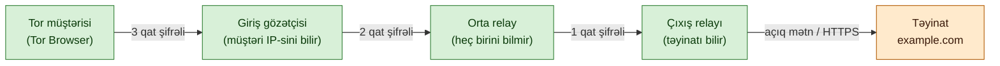
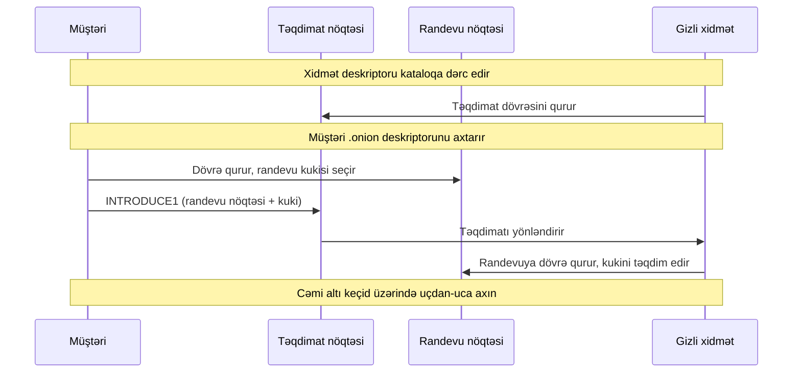

# Tor və Anonimlik Şəbəkələri

## Niyə bu vacibdir

Anonimlik şəbəkələri həm müasir təhdid mənzərəsinin, həm də müasir müdafiə alət dəstinin bir hissəsidir və təhlükəsizlik mütəxəssisi hər iki tərəfi başa düşməlidir. Tor trafikini şəbəkədə tanıya bilməyən SOC analitiki onun içində gizlənən məlumat-eksfiltrasiya kanallarını gözdən qaçıracaq. Tor-u öyrənməkdən imtina edən pen-tester OSINT mərhələsini bunu öyrənən komanda yoldaşlarına buraxacaq. Tor-u anlamadan tamamilə qadağan edən siyasət komandası təhdid-kəşfiyyatı tədqiqatçısını və jurnalist mənbə əlaqəsini bloklayacaq, eyni zamanda artıq xüsusi nəqliyyata keçmiş zərərli proqramı dayandırmayacaq.

Qanuni istifadə halları realdır. Tədqiqatçılar gizli-xidmət forumlarında ransomware operatorlarını izləyir. Jurnalistlər brauzer izlərinin müəyyən bir qəzetlə əlaqələndirildiyi halda işini və ya həyatını itirə biləcək mənbələri qoruyur. Senzura altındakı regionlardakı dissidentlər körpülər vasitəsilə xarici İnternetə çıxır. Sızıntıçılar SecureDrop vasitəsilə sənədlər təqdim edir. Bu istifadə hallarının heç biri Tor kimi bir şey olmadan işləmir — bu, "kim olduğunuzu" "nə etdiyinizdən" şəbəkənin böyük hissəsini izləyə bilən düşmənə qarşı ayıran kriptoqrafik sistemdir.

Mənfi tərəfi amansızdır. Tor sehir deyil. Tor Browser quraşdıran və sonra onun içində öz Google hesabına daxil olan istifadəçi anonim dövrəsini öz real kimliyinə bağlamış olur. Çıxış-node operatoru relayından çıxan hər açıq mətn baytını oxuya bilər — və bir çoxları məhz bu niyyətlə işlədir. "Tor sizi anonim edir" iddiasını blog yazısında oxuyan və sonra əməliyyat intizamı tələb edən iş aparan savadsız istifadəçi brauzer barmaq izi, JavaScript zamanlaması sızıntısı və ya SOCKS proxy-ni keçən DNS sorğusu ilə deanonimləşdiriləcək. Tor müəyyən təhdid modelinə malik bir alətdir və onu bu modeldən kənarda istifadə etmək çox vaxt kömək etməkdən daha çox zərər verir.

Bu dərsdəki nümunələr uydurma `example.local` təşkilatından istifadə edir. Tor anlayışları və protokol versiyaları cari saxlanılır ki, dərs sahə istinadı kimi işləsin.

## Əsas anlayışlar

Tor — soğan marşrutlaşdırması üstəgəl kataloq sistemi üstəgəl brauzer üstəgəl prinsipial standart konfiqurasiyadır. Kriptoqrafiya yaxşı başa düşülür; onun ətrafındakı əməliyyat intizamı isə anonimliyin qazanıldığı və ya itirildiyi yerdir.

### Tor-un həll etdiyi təhdid modeli — kim olduğunuzu nə etdiyinizdən ayırmaq

Tor istifadəçi ilə təyinat arasındakı yolun bir hissəsini izləyə bilən, lakin bütün yolu eyni anda izləyə bilməyən şəbəkə müşahidəçisinə qarşı müdafiə edir. Konkret olaraq, Tor istifadəçinin mənbə IP ünvanı ilə çatdığı təyinat arasındakı əlaqəni qırır. İstifadəçinin keçidini izləyən İSP Tor giriş gözətçisinə şifrələnmiş trafik görür, lakin təyinatı görmür. Veb server Tor çıxış nodundan gələn əlaqəni görür, lakin orijinal IP-ni görmür. Bir ölkənin tranzit keçidlərini izləyən hökumət dövrələrin parçalarını görür, tam axınları yox.

Tor-un müdafiə etmədiyi şey — eyni anda hər bir keçidi izləyə bilən və zamanlama ilə həcmi əlaqələndirə bilən qlobal passiv düşməndir. Eyni zamanda istifadəçinin özünə qarşı da müdafiə etmir — istifadəçi onu artıq tanıyan xidmətə daxil olarsa, heç bir miqdarda soğan marşrutlaşdırma o kimliyi gizlətməyəcək. Tətbiq qatında sızıntılara qarşı da müdafiə etmir: kuki, brauzer barmaq izləri, proxy-ni keçən DNS sorğuları, sənəd metaverilənləri. Təhdid modeli qəsdən məhdudlaşdırılıb və Tor-u effektiv istifadə etmək onun daxilində qalmaq deməkdir.

### Soğan marşrutlaşdırması — üç relay, iç-içə şifrələmə, üç niyə sehrli rəqəmdir

Tor dövrəsi üç könüllü idarə olunan relay üzərindən gedən yoldur: giriş gözətçisi, orta relay və çıxış relayı. Müştəri orijinal paketi üç iç-içə şifrələmə qatına bürüyür, hər qat bir relay üçün açar. Giriş gözətçisi ən xarici qatı soyur və orta relayın ünvanını görür; orta relay öz qatını soyur və çıxış relayının ünvanını görür; çıxış relayı son qatı soyur və orijinal paketi görür, onu təyinata yönləndirir. Metafora soğandır — bir qatı soy, növbəti üzə çıxır.

Üç — heç bir relayın hər iki ucu bilmədiyi minimum relay sayıdır. Giriş gözətçisi istifadəçinin IP-sini görür, lakin təyinatı görmür. Çıxış relayı təyinatı görür, lakin istifadəçini görmür. Orta relay heç birini bilmir — yalnız giriş və çıxış relaylarını görür. İki relay girişin çıxışla sui-qəsd etməsinə imkan verərdi. Dörd və ya daha çox Tor-un nəzərdə tutduğu təhdid modelinə qarşı mənalı anonimlik artımı olmadan gecikmə əlavə edərdi.

Şifrələmənin özü ntor vasitəsilə danışılan ötəri sessiya açarlarından istifadə edir — bu, hər dövrəyə forward gizliliyi verən curve25519-əsaslı əl sıxmadır. Sonradan sındırılan və ya müsadirə edilən relay artıq sökülmüş dövrələrin trafikini geriyə doğru deşifrə edə bilməz, çünki sessiya açarları iştirakçıların RAM-ından heç vaxt çıxmadı və dövrə bağlandıqda məhv edildi.

### Tor dövrəsinin həyat dövrü — dövrə qurulması, axın multipleksləşdirməsi, dövrə rotasiyası

Müştəri dövrəni giriş gözətçisinə `CREATE` xanası göndərərək qurur, paylaşılan açar yaratmaq üçün Diffie-Hellman əl sıxmasını tamamlayır, sonra orta relayı əlavə etmək üçün həmin keçiddən `EXTEND` sorğusunu tunelləşdirir və hər iki keçiddən çıxış relayını əlavə etmək üçün yenidən. Hər genişlənmə yeni keçid üçün açarlanmış təzə DH əl sıxmasıdır, ona görə də müştəri üç ayrı sessiya açarı ilə qalır — hər relayda biri.

Dövrə qurulduqdan sonra müştəri TCP axınlarını üzərində multipleksləşdirir. Bir neçə brauzer tabı, eyni sayta bir neçə əlaqə, bir neçə sayt — hamısı rotasiyaya qədər eyni dövrəni paylaşır. Standart olaraq Tor yeni axınlar üçün hər 10 dəqiqədən bir dövrəni rotasiya edir, mövcud axınlar isə orijinal dövrələrində davam edir. Giriş gözətçisi isə yapışqanlıdır: müştəri kiçik bir gözətçi dəstini seçir və aylarla təkrar istifadə edir, çünki hər dövrədə gözətçiləri rotasiya etmək istifadəçini zərərli gözətçiyə tez deyil, gec ifşa edərdi.

### Tor Browser — Firefox ESR üstəgəl genişlənmələr üstəgəl təhlükəsiz standartlar

Tor Browser "Tor aktivləşdirilmiş brauzer" deyil. Bu, brauzer barmaq izini, zamanlama hücumlarını və mənşələr-arası izləməni dəf edən düzəlişlərlə Firefox ESR-nin sərtləşdirilmiş forkudur, NoScript, HTTPS-Everywhere (indi HTTPS-Only rejiminə qatılmışdır) və hər əlaqəni yerli Tor demonu vasitəsilə məcbur edən SOCKS proxy konfiqurasiyası ilə birləşdirilmişdir. Standart pəncərə ölçüsü ümumi vedrəyə təyin olunub ki, pəncərə-ölçüsü barmaq izi az nəticə versin. Şriftlər, WebGL və uzun barmaq izi alına bilən API siyahısı ya söndürülür, ya da bütün istifadəçilər üzrə normallaşdırılır.

"Tor-u öz adi brauzerinizə quraşdırın" yanlış cavabdır. Tor-a SOCKS proxy ilə konfiqurasiya edilmiş adi Chrome və ya Firefox WebRTC vasitəsilə sızacaq, DNS prefetching vasitəsilə sızacaq, genişlənmə barmaq izləri vasitəsilə sızacaq, istifadəçinin əlfəcinləri və saxlanmış girişləri vasitəsilə sızacaq və hər metrika ilə Tor Browser barmaq izi izdihamından kənarda görünəcək. SOCKS proxy baytları daşıyır; Tor Browser bu baytları hər digər Tor istifadəçisinin baytlarına oxşadan şeydir.

Tails və Whonix daha da uzağa gedir — Tails USB çubuğundan açılan və hər şeyi Tor vasitəsilə marşrutlaşdıran, host diskdə iz qoymayan canlı əməliyyat sistemidir; Whonix isə bir cüt VM-dir (Tor işlədən şlüz və başqa şəbəkə yolu olmayan iş stansiyası) və proxy-ni virtual şəbəkə qatında məcbur edir. Hər ikisi bir tətbiqin təsadüfən Tor SOCKS konfiqurasiyasını keçdiyi sızıntı sinfini aradan qaldırır, daha çox quraşdırma işi bahasına.

### Gizli xidmətlər və `.onion` — randevu nöqtələri, çıxış lazım deyil modeli

Gizli xidmət (indi onion xidmət adlandırılır) serverin Tor vasitəsilə IP ünvanını ifşa etmədən əlçatan olmasına imkan verir. Server bir neçə təqdimat nöqtəsi (Tor relayları) seçir, açıq açarını və təqdimat-nöqtə siyahısını Tor kataloquna dərc edir və gözləyir. Xidmətə çatmaq istəyən müştəri xidmətin `.onion` ünvanı (açıq açarın base32 kodlaşdırması) ilə deskriptoru axtarır, təsadüfi randevu nöqtəsi seçir, təqdimat nöqtələrindən birinə təqdimat sorğusu göndərir və server randevu nöqtəsinə çıxış edir. Həm müştəri, həm də server randevuya üç keçidli dövrələr qurur, beləliklə uçdan-uca trafik altı relayı keçir — hər tərəfdən üç.

Çıxış nodu yoxdur. Trafik heç vaxt Tor şəbəkəsini tərk etmir. Heç bir tərəf digərinin IP-sini öyrənmir. Onion v3 (Tor layihəsində RFC tipli spesifikasiya) Ed25519 açarlarından və 56-simvollu ünvandan istifadə edir; onion v2 zəif kriptoqrafiya və ünvan-saymaq hücumları səbəbindən 2021-ci ildə dəstəkdən çıxarıldı.

### Körpülər və qoşula bilən nəqliyyatlar — senzuranı keçmək

Tor relay IP-ləri ictimaidir, ona görə senzor sadəcə bütün relay siyahısını bloklaya bilər. Körpülər — IP-ləri ictimai kataloqda olmayan siyahısız Tor giriş nöqtələridir; istifadəçilər onları e-poçt, Telegram, Tor Browser körpü sorğu axını və ya qeyri-rəsmi yollarla əldə edir. Qoşula bilən nəqliyyatlar Tor trafikini şəbəkədə Tor kimi görünməyən bir şeyə bürüyür: `obfs4` bayt axınını təsadüfiləşdirir, `meek` CDN ön (Azure, əvvəlcə Amazon CloudFront) vasitəsilə tunel qurur, `snowflake` könüllü brauzer-genişlənmə proksilərinə WebRTC əlaqələrindən istifadə edir. Hər nəqliyyat aşkarlanma qiymətini fərqli şəkildə qaldırır — `obfs4` sadə imza uyğunlaşmasını dəf edir, `meek` domen-əsaslı bloklamanı dəf edir, `snowflake` hər ikisini dəyişən performans bahasına dəf edir.

### Tor çıxış nodları — sui-istifadə problemi, İSP-lər niyə çıxış-node IP-lərini işarələyir

Çıxış relayı hər HTTPS olmayan trafikin açıq mətnini görür və təyinat xidmətlərinin gördüyü IP-dir. Tor istifadəçisinin etdiyi pis hər şey — etimadnamə doldurulması, sıyrılma, sui-istifadə şərhləri, brute force, eksploit trafiki — çıxışdan gəlir kimi görünür. Çıxış operatorları daimi olaraq sui-istifadə şikayətləri, DMCA bildirişləri və hüquq-mühafizə sorğularını həll edir, baxmayaraq ki, jurnalları və faktiki istifadəçini müəyyən etmək yolu yoxdur. Bir çox İSP çıxış relaylarını host etməkdən imtina edir, bir çox vebsayt isə dərc olunmuş çıxış siyahısına müraciət edərək bütün Tor çıxış IP-lərini bloklayır. Çıxışı işlətmək ictimai xidmət aktıdır və daimi sui-istifadə-həll işidir; çıxış olmayan relay (giriş və ya orta) işlətmək çox aşağı risklidir və hələ də faydalıdır.

### VPN üzərində Tor və Tor üzərində VPN — hər biri nə verir, heç biri nə vermir

**Tor üzərində VPN** — istifadəçi əvvəlcə VPN-ə qoşulur, sonra üstündə Tor işlədir. İstifadəçinin İSP-si VPN əlaqəsini görür, Tor-u görmür. VPN provayderi Tor trafikini görür, təyinatı görmür. Tor giriş gözətçisi VPN-in IP-sini görür, istifadəçinin yox. Bu, əksər "Tor üzərində VPN" bələdçilərinin tövsiyə etdiyidir; yerli İSP-dən Tor istifadəsini gizlədir və Tor-un özü yerli orqanlar üçün şübhəli olduğu yerdə uyğundur.

**VPN üzərində Tor** — istifadəçi əvvəlcə Tor-a qoşulur, sonra Tor çıxışı vasitəsilə VPN-ə qoşulur. Təyinat VPN-in IP-sini görür, Tor çıxış IP-sini yox. Bu, bütün Tor çıxışlarını bloklayan xidmətlərə girmək üçün bəzən faydalıdır, lakin istifadəçinin Tor dövrəsini sabit VPN hesabı ilə bağlayır, bu da adətən ödəniş izinə malikdir. Əksər təhdid modelləri VPN üzərində Tor-u sadə Tor-dan pis hesab edir.

Heç bir konfiqurasiya tətbiq qatında deanonimləşdirməyə qarşı müdafiə etmir, birinci halda VPN provayderindən brauzeri gizlətmir, heç biri qlobal passiv düşmənə qarşı müdafiə etmir. Hər ikisi mürəkkəblik əlavə edir və hər ikisi istifadəçini qeydiyyatı və yurisdiksiyası vacib olan müəyyən VPN provayderinə bağlayır.

### I2P — alternativ anonimlik şəbəkəsi

I2P (Görünməyən İnternet Layihəsi) Tor-dan fərqli forma alan eşit-eşitə anonimlik şəbəkəsidir. Tor uzunmüddətli dövrələri açıq şəbəkəyə çıxış üçün optimallaşdırılmış könüllü relaylar üzərindən qurarkən, I2P bütün iştirakçı nodlar arasında qısamüddətli birtərəfli tunellər qurur — hər I2P istifadəçisi həm də relaydır. I2P gizli xidmətlər (eep-saytlar adlanır, `.i2p` ilə ünvanlanır) və şəbəkə daxilində eşit-eşitə tətbiqlər üçün optimallaşdırılıb. Tor-dan çox kiçik istifadəçi bazasına və açıq şəbəkə çıxışları üçün zəif dəstəyə malikdir. I2P müəyyən zərərli proqram əmr-və-nəzarət nümunələrini, müəyyən fayl-paylaşma icmalarını araşdırarkən və anonimlik-şəbəkə dizayn seçimlərini başa düşmək üçün müqayisə nöqtəsi kimi aktualdır.

### Digər yanaşmalar — Mixnetlər, Lokinet, Nym

**Mixnetlər** (Chaum-un 1981-ci il məqaləsindən orijinal anonimlik-şəbəkə dizaynı) zamanlama analizini gecikmə bahasına dəf etmək üçün hər keçiddə mesajları qruplaşdırır və qarışdırır. Tor qarışdırmır — paketləri dərhal göndərir, brauzer üçün kifayət qədər sürətli olmasının səbəbi budur, lakin qlobal passiv əlaqələndirməyə qarşı zəifdir. **Lokinet** Oxen blokçeyn təşviqlərinə əsaslanan mixnet-tipli anonimlik şəbəkəsidir. **Nym** isə relay işlətməyi həvəsləndirmək üçün mix nodlarına token vasitəsilə ödəyən daha yeni mixnet dizaynıdır. Hər biri gecikmə, ötürmə qabiliyyəti və qlobal düşmənə müqavimət arasında fərqli kompromislər edir; heç birində Tor-un istifadəçi bazası və ya yetkinliyi yoxdur və 2026-cı ildə əksər təhlükəsizlik işi hələ də Tor-a standart olaraq qalır.

Tor konsensusu haqqında qeyd. Hər saat doqquz kataloq orqanı dəsti hansı relayların mövcud olduğunu və hansı bayraqlara malik olduğunu (Guard, Exit, Stable, Fast, BadExit) səs verir. Müştərilər nəticə konsensus sənədini yükləyir və relayları seçmək üçün istifadə edir. Kataloq-orqanı operatorları Tor Layihəsi, Mozilla və Karlstad Universiteti kimi təşkilatlardakı adlı şəxslərdir; əksəriyyətin sındırılması şəbəkəni qıracaq, ona görə operator siyahısı kiçik, ictimai və müstəqil maliyyələşdirilir.

## Soğan marşrutlaşdırması diaqramı

Birinci diaqram Tor dövrəsini göstərir: müştəri üç iç-içə şifrələmə qatı qurur, hər biri bir relayda soyulur, çıxış isə açıq mətni (və ya HTTPS-i) təyinata yönləndirir.



İkinci diaqram gizli-xidmət randevusunu göstərir: müştəri və server hər biri randevu nöqtəsinə üç keçidli dövrə qurur, beləliklə heç biri digərinin IP-sini öyrənmir.



## Tor nə vaxt kömək edir, nə vaxt zərər verir

| Ssenari | Təsir | Niyə |
|---|---|---|
| Yüksək təhdidli müşahidə altındakı dissident | Kömək edir | Təyinatı İSP-dən gizlədir; körpülər Tor-un özünü gizlədir |
| Konfidensial mənbə ilə əlaqə saxlayan jurnalist | Kömək edir | Mənbənin şəbəkə metaverilənləri jurnalistə bağlanmır |
| Gizli-xidmət forumuna girən təhdid tədqiqatçısı | Kömək edir | Tədqiqatçının korporativ IP-si forum operatoruna ifşa olunmur |
| SecureDrop istifadə edən sızıntıçı | Kömək edir | Bunun üçün uçdan-uca dizayn olunub; onion xidmət, çıxış yox |
| Tor Browser-də öz real Google hesabına daxil olan istifadəçi | Kömək etmir | Kimlik artıq sessiyaya bağlanıb |
| Ödənişli hesaba VPN, sonra üstündə Tor işlədən istifadəçi | Qismən kömək edir | İSP-dən Tor-u gizlədir, lakin VPN ödəniş izi qalır |
| Tor Browser standartından kuki, genişlənmə, brauzer dəyişikliyi olan istifadəçi | Zərər verir | Barmaq izi Tor Browser izdihamından kənarda görünür |
| "Tor = sehrli təhlükəsizlik" hesab edən savadsız istifadəçi | Zərər verir | DNS, WebRTC, sənəd metaverilənləri və ya giriş vasitəsilə sızacaq |
| Korporativ DLP-ni keçmək üçün Tor istifadə edən işçi | Zərər verir (təşkilata) | Daxili təhdid göstəricisi; sanksiya nəzarətləri üçün keçid |
| Əmr-və-nəzarət üçün Tor istifadə edən zərərli proqram | Zərər verir (müdafiəçilərə) | Qanuni istifadəni qırmadan çıxışda bloklamaq çətindir |

Nümunə: Tor istifadəçinin həm qanuni təhdid modeli, həm də onun daxilində qalmaq üçün əməliyyat intizamı olduqda kömək edir. Hər ikisi olmadıqda zərər verir.

## Praktiki məşqlər

Tor davranışı üzrə intuisiya yaradan beş məşq. Heç biri çıxış relayı işlətməyi tələb etmir, SOC məşqi yalnız ictimai məlumatdan istifadə edir.

### 1. Tor Browser quraşdırın və dövrəni yoxlayın

Tor Browser-i `torproject.org`-dan yükləyin (Tor Browser tərtibatçılarının açarına qarşı GPG imzasını yoxlayın — bu addımı buraxmayın). Onu işə salın, adi `https://` saytına daxil olun və dövrəni görmək üçün kilid ikonuna klikləyin. Ölkə və IP üzrə üç relay görəcəksiniz.

Cavab: hansı relay giriş gözətçisidir, hansı orta, hansı çıxışdır? "Bu Sayt üçün Yeni Tor Dövrəsi" kliklədiyinizdə nə dəyişir? Eyni sessiyada bir neçə saytda nə dəyişməz qalır?

### 2. Relay fəaliyyətini izləmək üçün `nyx` istifadə edin

Linux qutusunda `tor` və `nyx`-i (əvvəlcə `arm` adı ilə tanınan Tor relay monitoru) quraşdırın. `tor`-u müştəri kimi işlədin, sonra `nyx`-i işlədin və canlı dövrələri, bant genişliyi istifadəsini və konsensus yenilənmələrini izləyin.

```bash
sudo apt install tor nyx
sudo systemctl start tor
sudo nyx
```

Cavab: müştəriniz adi brauzer sessiyasında neçə dövrə qurur? Onlar nə qədər yaşayır? Konsensus sənədi Tor-un istifadə edə biləcəyiniz relayları necə qərarlaşdırdığını sizə nə deyir?

### 3. VPS-də Tor relayı (çıxış olmayan) işlədin

Kiçik VPS qaldırın, `tor`-u quraşdırın və çıxış olmayan orta relay konfiqurasiya edin. Səxavətli bant genişliyi limiti istifadə edin, lakin VPS planınıza uyğun aylıq köçürməni məhdudlaşdırın.

```bash
# /etc/tor/torrc
ORPort 9001
ContactInfo abuse@example.local
Nickname ExampleLocalRelay
ExitRelay 0
RelayBandwidthRate 5 MBytes
RelayBandwidthBurst 10 MBytes
AccountingMax 500 GBytes
```

`tor`-u yenidən başladın, jurnalda "Self-testing indicates your ORPort is reachable from the outside" axtarın və 24 saat sonra `metrics.torproject.org`-da relayınızı yoxlayın. Cavab: burada `ExitRelay 0` niyə vacibdir? Onu `1`-ə çevirsəniz nə dəyişir və bu hansı sui-istifadə-həll öhdəliyi yaradır?

### 4. Tanınmış `.onion` xidmətinə daxil olun

Tor Browser daxilində DuckDuckGo-nun onion ünvanına daxil olun (onu `torproject.org`-da axtarın — onion ünvanları dəyişir və həmişə yoxlamalısınız). URL çubuğunda onion ikonu göstərildiyinə, çıxış relayının iştirak etmədiyinə və əlaqənin Tor daxilində uçdan-uca olduğuna diqqət edin.

Cavab: dövrə indi neçə relay göstərir və niyə açıq şəbəkə saytından fərqlidir? Təyinat ictimai vebsayt deyil, gizli xidmət olduqda etibar modeli haqqında nə dəyişir?

### 5. SOC sensorunda ictimai çıxış siyahısı vasitəsilə Tor trafikini müəyyən edin

Rəsmi Tor çıxış-relay siyahısını (`check.torproject.org/torbulkexitlist`-də dərc olunmuş düz mətn IP siyahısı) yükləyin. Onu SIEM-ə izləmə siyahısı kimi yükləyin. Uzaq IP-nin siyahıda göründüyü hər giriş və ya çıxış trafiki üçün son 24 saatlıq perimetr jurnallarına qarşı sorğu işlədin.

Cavab: neçə uyğunluq görürsünüz? Onlar gözlənilirmi (tədqiqatçının iş stansiyası, təhlükəsizlik-alət inteqrasiyası) yoxsa gözlənilməzdir? "Qanuni tədqiqat üçün Tor-a daxil olan istifadəçi"-ni "Tor vasitəsilə beacon edən zərərli proqram"-dan necə fərqləndirərsiniz? Triaj addımlarını runbook kimi sənədləşdirin.

## İşlənmiş nümunə — `example.local` Tor siyasəti yazır

`example.local`-un 600 işçisi var, o cümlədən ransomware izləməsi üçün gizli-xidmət girişinə ehtiyacı olan kiçik təhdid-kəşfiyyatı komandası, jurnalist dəstək funksiyası (şirkət ipucu xətti işlədir) və daha böyük ümumi işçi qüvvəsi. CISO yazılı Tor siyasəti tələb edir — tam qadağa deyil, sərbəst dəyil, lakin qanuni istifadəni tanıyan və sui-istifadəni aşkarlayan müdafiə oluna bilən mövqe.

**Sanksiyalı istifadə.** Təhdid-kəşfiyyatı tədqiqatçıları korporativ DLP-ni keçən öz çıxışı olan ayrıca VLAN-da xüsusi, tam izolyasiya edilmiş iş stansiyalarında Tor Browser istifadə edir. İş stansiyaları həftəlik sərtləşdirilmiş bazadan görüntüləşdirilir, korporativ etimadnamələr saxlamır və yalnız Tor və ya təsdiqlənmiş təhdid-kəşfiyyatı platformaları vasitəsilə marşrutlaşdırılır. Jurnalist ipucu xətti İT komandasının idarə etdiyi, lakin istehsal məlumatı saxlamayan avadanlıqda host edilən gizli xidmətdə SecureDrop işlədir. Hər iki istifadə halı sənədləşdirilib, sahibləri adlandırılıb və Hüquq və İnformasiya Təhlükəsizliyi tərəfindən illik nəzərdən keçirilir.

**Qadağan edilmiş istifadə.** Ümumi əhalinin işçilərinə idarə olunan korporativ son nöqtələrdə Tor Browser quraşdırmaq icazə verilmir. Son nöqtə konfiqurasiya bazası tətbiq icazə-siyahısı vasitəsilə Tor Browser quraşdırma faylının heşini və tanınmış Tor demon ikili fayllarını bloklayır. Biznes ehtiyacı olan işçilər InfoSec-ə müraciət edir, onlar isə hal təsdiqlənərsə təhdid-kəşfiyyatı komandası tərəfindən istifadə edilən eyni modeldə xüsusi iş stansiyası təmin edir.

**Aşkarlama və monitorinq.** SOC Tor çıxış siyahısını gündəlik qəbul edir və cari Tor giriş gözətçisinə hər korporativ çıxışda xəbərdarlıq edir. Körpülər daha çətindir — dizayn etibarilə siyahısızdırlar — lakin qeyri-adi portlarda qeyri-biznes təyinatlarına `obfs4` trafiki daha aşağı prioritetli xəbərdarlıq alır. Korporativ resolverdən `.onion` adlarına çıxış DNS qeyri-mümkündür (resolver `.onion` həll etmir), ona görə hər cəhd özlüyündə siqnaldır. SOC təhdid-kəşfiyyatı VLAN çıxışını (gözlənilən Tor trafiki) ümumi-işçi qüvvəsi çıxışından (xəbərdarlıq) mənbə alt şəbəkəsinə görə fərqləndirir, bu isə xəbərdarlığı etibarlı edir.

**Daxili-təhdid bucağı.** DLP-ni keçmək üçün Tor işlədən işçi eyni şəxsin ictimai VPN işlətməsindən daha güclü daxili-təhdid göstəricisidir, çünki "təşkilat daxilində korporativ çıxış nəzarətlərini keçmək üçün qanuni səbəbi olan insanlar" əhalisi kiçik və məlumdur. Siyasət bunu açıq edir: sanksiyasız Tor istifadəsi — HR və Hüquqi olan triaj edilən hər DLP keçidi kimi təhlükəsizlik insidentidir.

**Körpü idarəetməsi.** Təhdid-kəşfiyyatı komandası bəzən regiona kilidli tədqiqat hədəfləri üçün `obfs4` körpülərinə də ehtiyac duyur. Komanda Tor Layihəsinin körpü paylama xidmətindən birbaşa əldə edilən, rüblük rotasiya olunan körpülərin kiçik özəl siyahısını saxlayır və körpü IP-ləri çıxış `obfs4` portları üçün təhdid-kəşfiyyatı VLAN çıxış icazə siyahısına əlavə olunur. Rotasiya barədə SOC məlumatlandırılır ki, körpü trafiki yalançı uyğunluqlar yaratmasın.

**Doğrulama.** Altı ay sonra metrikalar: ümumi-işçi qüvvəsi VLAN-dan sıfır sanksiyasız Tor əlaqəsi; tədqiqatçı başına həftədə 4-6 Tor sessiyası işlədən təhdid-kəşfiyyatı komandası, hamısı xüsusi iş stansiyalarından; SecureDrop ipucu xətti bir neçə qanuni təqdimatı qəbul edib və emal edib; SOC Tor izləmə siyahısı əhatəsini və hər yaxın-uyğunsuzluğu göstərən rüblük hesabatlar hazırladı. Siyasət təmtəraqsızdır, lakin təhlükəsizlik mövqeyi şuraya, Hüquqi-yə və qanuni suallar verən işçilərə qarşı müdafiə oluna biləndir.

## Problemlər və tələlər

- **"Tor məni anonim edir."** Xeyr — Tor mənbə və təyinat arasındakı şəbəkə-səviyyəli əlaqəni qırır, lakin anonimlik proqram xüsusiyyəti deyil, opsec xüsusiyyətidir. Real hesaba daxil olmuş istifadəçi, unikal brauzer barmaq izi olan istifadəçi və ya yazma üslubu onu müəyyən edən istifadəçi Tor-dan asılı olmayaraq anonim deyil.
- **Tor Browser-də ayarları dəyişdirsəniz brauzer barmaq izi hələ də işləyir.** Pəncərəni ölçüləndirmək, genişlənmələr quraşdırmaq, şriftləri dəyişdirmək, WebGL-i aktivləşdirmək — hər hərəkət istifadəçini standart Tor Browser barmaq izi vedrəsindən kənarda itələyir və daha tanına bilən edir.
- **Çıxış nodları açıq mətni oxuya bilər.** HTTPS ilə bürünməmiş hər şey çıxış operatoruna görünür. HTTPS-Only rejimi (Tor Browser-də standart) istifadə edin və sertifikat xəbərdarlıqlarına klikləməyin əvəzinə yoxlayın.
- **Tor üzərində Tor pisdir.** Tor-u Tor daxilində qatlamaq anonimliyi ikiqat artırmadan gecikməni ikiqat artırır, gözətçi modelini qırır və əlaqələndirməyə kömək edən zamanlama nümunələri yaradır. Bir dövrə seçin.
- **Trafiki Tor ətrafında sızdırmaq üçün konfiqurasiya etmək.** Bir tətbiqə tətbiq edilən SOCKS proxy digər tətbiqləri, DNS-i, WebRTC-ni və ya əməliyyat sisteminin telemetriyasını qorumur. Tor Browser istifadə edin və ya hər şeyi Tor demonu vasitəsilə marşrutlaşdıran Whonix və ya Tails kimi sistem-geniş həlli istifadə edin.
- **Onion v2 barmaq izi (dəstəkdən çıxarılıb).** Onion v2 ünvanları 16 simvol idi və 1024-bit RSA istifadə edirdi, bu isə saymaq və saxtalaşdırmağa imkan verirdi. Onion v3 (56 simvol, Ed25519) onu əvəz etdi; v2 2021-ci ildə söndürüldü. Köhnə sənədlərdəki hər v2 keçidi ölüdür.
- **Bütün Tor çıxışlarını bloklayan vebsaytlar.** Bir çox sayt ictimai çıxış siyahısına müraciət edir və Tor istifadəçilərinə xidmət göstərməkdən tamamilə imtina edir, xüsusilə banklar və kimliyə bağlı xidmətlər. Tor burada kömək edə bilməz; istifadəçi başqa xidmət seçməli və ya bu təyinatın Tor üzərindən işləməyəcəyini qəbul etməlidir.
- **Tor-dan sui-istifadə edən zərərli proqram.** Düşmənlər əmr-və-nəzarəti gizlətmək üçün Tor və ya `meek` nəqliyyatlarını zərərli proqrama yerləşdirir. Müdafiəçilər qanuni istifadəni qırmadan "bütün Tor"-u bloklaya bilməz; praktiki nəzarət protokolun özünü deyil, sanksiyasız mənbəni aşkar etməkdir.
- **Tor Browser-də şəxsiyyəti ifşa edən JavaScript.** Tor Browser NoScript aktivləşdirilmiş halda gəlir, lakin vebi istifadə oluna bilən saxlamaq üçün icazəverici standart ilə. Yüksək təhdidli istifadəçi — bir çox saytı qıracağı bahasına — təhlükəsizlik səviyyəsini Safest-ə təyin etməlidir (HTTPS olmayan saytlarda və hətta HTTPS-də bir çox JS xüsusiyyətində JavaScript-i söndürür).
- **DNS sızıntıları SOCKS proxy-ni keçir.** SOCKS proxy vasitəsilə qoşulmadan əvvəl DNS-i yerli həll edən səhv konfiqurasiya edilmiş müştəri hər hostadını yerli resolverə sızdırır. Tor Browser bunu idarə edir; manual SOCKS konfiqurasiyaları çox vaxt etmir.
- **WebRTC IP sızıntıları.** SOCKS proxy ilə adi brauzer hələ də WebRTC-nin STUN namizədləri vasitəsilə yerli IP-ni ifşa edir. Tor Browser WebRTC-ni söndürür; manual proxy quruluşları açıq bloklamaya ehtiyac duyur.
- **Sənəd metaverilənləri.** Tor üzərindən yüklənən və adi tətbiqdə açılan PDF və ya DOCX xarici resursları əldə edə, istifadəçi adı metaverilənlərini yerləşdirə və ya adi IP üzərindən geri zəng vura bilər. Sənədləri izolyasiyalı VM-də yoxlayın, heç vaxt Tor istifadə edən hostda deyil.
- **Saymaq vasitəsilə yandırılan körpülər.** İstifadəçilərin etdiyi eyni kanal vasitəsilə körpü siyahısını əldə edən senzor onların hamısını bloklaya bilər. `meek` və `snowflake` kimi qoşula bilən nəqliyyatlar saymaq qiymətini qaldırır, lakin onu aradan qaldırmır.
- **Tətbiq qatında TLS-MITM işlədən çıxış nodu.** Zərərli çıxış düzgün konfiqurasiya edilmiş sayta HTTPS-i qıra bilməz, lakin yalnız HTTP saytlarına məzmun yeridə, zəif konfiqurasiya edilmiş TLS-i aşağı sala və ya məzmunu sıyıra bilər. HTTPS-Only rejimi və mümkün olduqda sertifikat-pinləmə müdafiədir.
- **Vaxt-əlaqələndirmə hücumları.** Həm istifadəçinin keçidini, həm də təyinatı izləyən qlobal passiv düşmən ortada neçə relayın olduğundan asılı olmayaraq trafik zamanlaması və həcmi əlaqələndirə bilər. Tor buna qarşı müdafiə etmir; mixnet dizaynları (Nym, Loopix) etməyə çalışır.
- **Ev əlaqənizdən çıxış relayı işlətmək.** Sui-istifadə şikayətləri, DMCA bildirişləri və hüquq-mühafizə əlaqəsi sizin adınızla İSP-nizə gəlir. Çıxışları uyğun sui-istifadə həlli olan infrastrukturdan işlədin və ya bunun əvəzinə çıxış olmayan relay işlədin.
- **İşlətdiyiniz relayda qeydiyyat.** Tor relayları müştəri IP-lərini qeydiyyatda saxlamamalıdır. İstinad `tor` demonu standart olaraq saxlamır; bəzi paketləşdirilmiş quruluşlar təmin etdiyiniz relayın anonimlik təminatını qıran qeydiyyat əlavə edir. Konfiqurasiyanızı yoxlayın.
- **Təsadüfi mənbələrdən `.onion` keçidlərinə güvənmək.** Gizli xidmətlərdə fişinq geniş yayılıb — qanuni xidmətlərin saxta güzgüləri, saxta bazarlar, saxta forumlar. Onion ünvanlarını müstəqil kanallar vasitəsilə yoxlayın (Tor öz xidmətləri üçün rəsmi torproject.org səhifəsi; SecureDrop nümunələri üçün imzalanmış güzgü siyahıları).
- **Tor-un təyinat haqqında heç nə dəyişmədiyini unutmaq.** Giriş tələb edən sayt, davranışa görə profil yaradan xidmət, üçüncü tərəf izləyiciləri yükləyən tətbiq — heç biri istifadəçi onlara Tor vasitəsilə çatdığı üçün dəyişmir. Şəbəkə qatında anonimlik tətbiq qatında anonimlik yaratmır.

## Əsas məqamlar

- Tor — soğan marşrutlaşdırmasıdır — üç relay, üç iç-içə şifrələmə qatı, heç bir relay hər iki ucu bilmir. Kriptoqrafiya etibarlıdır; onun ətrafındakı əməliyyat intizamı isə anonimliyin qazanıldığı və ya itirildiyi yerdir.
- Tor-un həll etdiyi təhdid modeli — yolun bir hissəsini görən şəbəkə müşahidəçisidir. Tətbiq qatı sızıntılarına qarşı, real kimliyinə daxil olan istifadəçiyə qarşı və ya qlobal passiv düşmənə qarşı müdafiə etmir.
- Tor Browser əksər qanuni Tor istifadəsi üçün düzgün alətdir — istifadəçini ümumi barmaq izi vedrəsinə yerləşdirən təhlükəsiz standartlara malik sərtləşdirilmiş Firefox ESR. "Sadəcə Chrome-a Tor quraşdırın" yanlış cavabdır.
- Gizli xidmətlər (`.onion`, onion v3) həm müştəri, həm də serverin randevu nöqtəsinə üç keçidli dövrələr qurması ilə serverin IP-sini ifşa etmədən serverə çatır. Çıxış nodu iştirak etmir.
- Körpülər və qoşula bilən nəqliyyatlar (`obfs4`, `meek`, `snowflake`) istifadəçilərin ictimai relay siyahısını bloklayan şəbəkələrdən Tor-a çatmasına imkan verir. Hər nəqliyyat fərqli aşkarlama qiymətini qaldırır.
- Tor çıxış nodları HTTPS olmayan trafik üçün açıq mətni görür və Tor istifadəçisinin etdiyi pis hər şeyin sui-istifadəsini qəbul edir. Çıxış işlətmək ictimai xidmətdir və daimi sui-istifadə-həll işidir; çıxış olmayan relay işlətmək çox aşağı risklidir.
- Tor üzərində VPN yerli İSP-dən Tor istifadəsini gizlədir; VPN üzərində Tor təyinata çıxış IP-si yerinə VPN IP-sini görməyə imkan verir. Heç biri sehir deyil və hər ikisi mürəkkəblik əlavə edir.
- I2P, Lokinet və Nym fərqli kompromislərlə alternativlərdir. 2026-cı ildə Tor istifadəçi bazası, kod yetkinliyi və alətlərə görə standartdır.
- Tor yüksək təhdidli dissidentə, jurnalist mənbəsinə və təhdid tədqiqatçısına həqiqətən kömək edir. Tor = anonimlik hesab edən savadsız istifadəçiyə və korporativ DLP-ni keçmək üçün onu istifadə edən işçiyə zərər verir.
- SOC komandaları üçün praktiki nəzarət protokolu bloklamaqdan deyil, sanksiyasız mənbələrdən Tor-u aşkar etməkdir. İctimai çıxış siyahısı pulsuz, yüksək-siqnallı izləmə siyahısıdır.
- İş — siyasətdir — izolyasiya edilmiş iş stansiyalarında sanksiyalı istifadə halları, tətbiq icazə-siyahısı ilə dəstəklənən qadağan edilmiş istifadə, protokol deyil mənbəyə tənzimlənmiş aşkarlama, sanksiyasız əlaqə göründükdə daxili-təhdid triajı.
- Təhlükəsizlik işi təmtəraqsızdır: siyasəti yazın, təhdid-kəşfiyyatı komandasını izolyasiya edin, çıxış siyahısını qəbul edin, mənbə alt şəbəkələrini izləyin və daxil olan xəbərdarlıqları triaj edin.

Yaxşı edildikdə Tor ümumi işçi qüvvəsinə görünməzdir və onu qanuni olaraq lazım olan kiçik əhali üçün etibarlıdır. Pis edildikdə isə ya qətiyyətli daxili istifadəçinin keçdiyi icra olunmayan qadağa, ya da onion xidmətlər vasitəsilə korporativ məlumatı eksfiltrasiya edən sərbəstlikdir.

Tor-un kriptoqrafiyası çətin hissə deyil. Çətin hissə qanuni istifadəçilərin kiçik əhalisinin əməliyyat intizamını qoruması, SOC-un sanksiyalı trafiki sanksiyasızdan ayırması və siyasət komandasının real tədqiqat iş axını ilə təmasdan sağ çıxan qaydalar yazmasıdır.

## İstinadlar

- Dingledine, Mathewson, Syverson — *Tor: The Second-Generation Onion Router* (USENIX Security 2004) — [svn.torproject.org/svn/projects/design-paper/tor-design.pdf](https://svn.torproject.org/svn/projects/design-paper/tor-design.pdf)
- Tor Project sənədləri — [support.torproject.org](https://support.torproject.org/)
- Tor Project — *Tor Browser İstifadəçi Təlimatı* — [tb-manual.torproject.org](https://tb-manual.torproject.org/)
- Tor Metrics — relay statistikası, konsensus məlumatı, performans — [metrics.torproject.org](https://metrics.torproject.org/)
- Tor Project — *Onion Services* (v3 spesifikasiyası) — [community.torproject.org/onion-services/](https://community.torproject.org/onion-services/)
- Tor Project — *Pluggable Transports* — [tb-manual.torproject.org/circumvention/](https://tb-manual.torproject.org/circumvention/)
- EFF — *Surveillance Self-Defense: Tor* — [ssd.eff.org/module/how-use-tor](https://ssd.eff.org/module/how-use-tor)
- NIST SP 800-150 — *Guide to Cyber Threat Information Sharing* — [csrc.nist.gov/publications/detail/sp/800-150/final](https://csrc.nist.gov/publications/detail/sp/800-150/final)
- I2P Project sənədləri — [geti2p.net/en/docs](https://geti2p.net/en/docs)
- Nym ağ sənədi — *The Nym Network* — [nymtech.net/nym-whitepaper.pdf](https://nymtech.net/nym-whitepaper.pdf)
- Tor Project — *Tor Project bloqu* (xəbərdarlıqlar, dizayn qeydləri, dəstəkdən çıxarmalar) — [blog.torproject.org](https://blog.torproject.org/)
- Əlaqəli oxu: [Virtual Şəxsi Şəbəkələr (VPN)](./vpn.md) · [Təhlükəsiz Şəbəkə Protokolları](./secure-protocols.md) · [Təhlükəsiz Şəbəkə Dizaynı](./secure-network-design.md) · [OSI Modeli](../foundation/osi-model.md) · [Sosial Mühəndislik](../../red-teaming/social-engineering.md) · [Təhdid Kəşfiyyatı və Zərərli Proqram](../../general-security/open-source-tools/threat-intel-and-malware.md)
