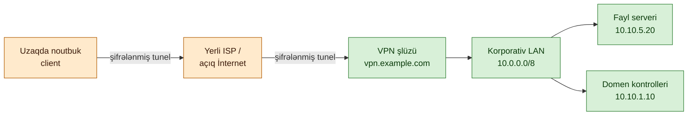
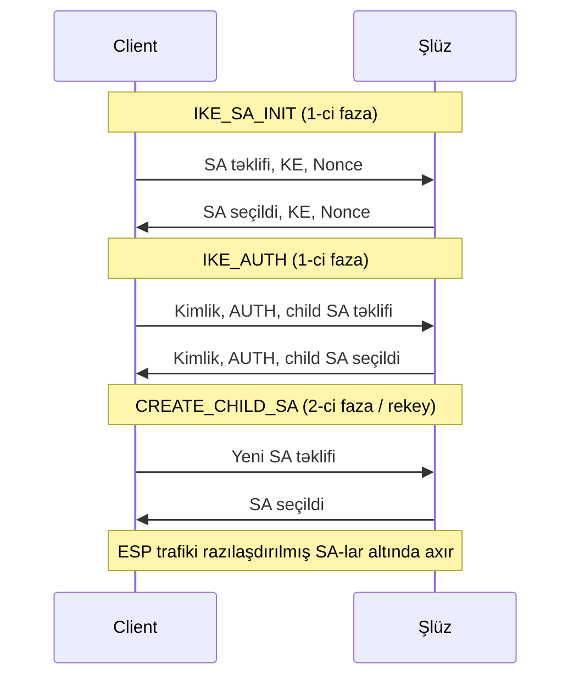

# Virtual Private Networks (VPN)

## Niye bu vacibdir

VPN — uzaqdan işləyən kollektivin özəl resurslara çatmaq üsuludur. Noutbuk otel otağında, hava limanı zalında və ya ev ofisində olduqda, həmin noutbukla korporativ data mərkəzi arasındakı şəbəkə açıq İnternetdir — təşkilatın sahib olmadığı, yoxlaya bilmədiyi və etibar edə bilmədiyi şəbəkədir. VPN — bu düşmən yolu kataloq autentifikasiyasını, fayl paylaşımlarını, biznes tətbiqlərini və idarəetmə alətlərini daşıya bilən təhlükəsiz qabığa çevirən kriptoqrafik örtükdür.

Site-to-site VPN-lər binalar arasında eyni rolu oynayır. İki ofis, baş ofis və bulud VPC-si, yerli data mərkəzi və SaaS provayderi — hər cüt, açıq İnternetin onlar arasında özəl kirayə xətti olduğunu iddia edən tunellə birləşdirilir. Bu tunellər olmadan hər BGP elanı, hər NetBIOS yayımı, hər Active Directory replikasiya paketi ya açıq xidmət kimi yenidən qurulmalı, ya da bahalı özəl kanallarla göndərilməli olardı.

Tərs tərəfi amansızdır. Səhv konfiqurasiya edilmiş VPN hər şeyi sızdırır. YouTube trafikini korporativ çıxışdan kənarda saxlamaq üçün nəzərdə tutulmuş split-tunnel konfiqurasiyası uc nöqtələri düşmən kafe şəbəkəsinə səssizcə açıq qoya bilər. Tətbiq olunmayan kill-switch, tunel düşdükdə noutbukun açıq mətndə istehsalat ilə danışmasına imkan verir. Tunelə məhəl qoymadan yerli ISP-yə sorğu göndərən DNS resolver, istifadəçinin toxunduğu hər daxili host adını sızdırır. PPTP təhlükəsizlik xəbərdarlıqlarını oxumayan təşkilatlarda hələ də istehsalatdadır. GitHub-a yüklənmiş konfiqurasiya yedəyindən bərpa edilmiş zəif IKEv1 əvvəlcədən paylaşılmış açarı, hücum edənə site-to-site tunelin açarlarını verir.

Bu dərsdəki nümunələr xəyali `example.local` təşkilatından istifadə edir. RFC nömrələri və protokol versiyaları cari saxlanılır ki, dərs sahə istinadı kimi işləsin.

## Əsas anlayışlar

VPN — kriptoqrafik tunellərdən və onların ətrafındakı siyasətdən ibarət sistemdir. Tunelin özü asan hissədir — hər müasir əməliyyat sistemi onu dəqiqələr ərzində qaldıra bilər. Siyasət — nəyin tunelə salındığı, nəyin salınmadığı, uğursuzluq olduqda nə baş verdiyi, kimə icazə verildiyi, içəri girdikdən sonra nəyə çata bildiyi — təhlükəsizliyin qazanıldığı və ya itirildiyi yerdir.

### VPN əslində nədir — şifrələnmiş tunel, açıq şəbəkə üzərində virtual özəl şəbəkə

Virtual özəl şəbəkə özəl paketləri açıq paketlərin içinə qablayaraq və daxili faydalı yükü şifrələyərək açıq şəbəkə üzərində özəl şəbəkə yaradır. "Virtual" hissəsi — qablamadır: orijinal paket, özəl mənbə və təyinat ünvanları ilə birlikdə, ünvanları onu İnternet üzərində yönləndirən yeni xarici paketə bükülür. "Özəl" hissəsi — şifrələmədir: xarici paketi tutan hər kəs yalnız şifrələnmiş mətni görür, daxili ünvanları və ya faydalı yükü deyil.

Qablama — möhürlənmiş zərfi kuryer çantasının içinə qoymaqla eynidir. Kuryer çantanın etiketini oxuyur və çatdırır; alıcı çantanı açır və zərfin daxili adda olduğunu görür. Kuryer heç vaxt daxili ünvanı görmür. VPN IP qatında eyni şəkildə işləyir.

### Autentifikasiya və şifrələmə — VPN başlanğıcda nə edir, hər paketə nə edir

Başlanğıcda VPN-in iki ucu bir-birini autentifikasiya edir. Autentifikasiya əvvəlcədən paylaşılmış açarlardan (PSK), X.509 sertifikatlarından, açıq açar barmaq izlərindən (WireGuard) və ya müasir federativ kimlikdən (SSL VPN portalları üçün SAML/OIDC) istifadə edir. Autentifikasiyadan sonra iki uc sessiya açarlarını razılaşdırır — Diffie-Hellman və ya oxşar yolla əldə edilmiş qısa ömürlü simmetrik açarlar — hər sonrakı paketi şifrələyəcək.

Hər sonrakı paket üçün VPN üç şey edir: müşahidəçinin oxuya bilməməsi üçün daxili paketi şifrələyir, dəyişdirənin aşkarlanmadan dəyişdirə bilməməsi üçün şifrələnmiş bloku autentifikasiya edir və tutulmuş paketin sonradan yenidən enjeksiya edilə bilməməsi üçün replay-dən qoruyur. Dəqiq alqoritmlər IPsec, OpenVPN və WireGuard arasında fərqlidir, lakin üç xassə eynidir.

### VPN protokollarına ümumi baxış — müqayisə

| Protokol | Qat | Kripto | Status | Qeydlər |
|---|---|---|---|---|
| IPsec (IKEv2 + ESP) | L3 | AES-GCM, ChaCha20-Poly1305, SHA-2 | Tövsiyə olunur | Site-to-site və remote access üçün sənaye standartı |
| OpenVPN | L4-vari (UDP/TCP üzərində) | TLS əsaslı, AES-GCM | Tövsiyə olunur | Yetkin açıq mənbə; defolt UDP 1194 |
| WireGuard | L3 | Curve25519, ChaCha20-Poly1305, BLAKE2s | Tövsiyə olunur | Müasir, minimal, mainline Linux nüvəsində |
| L2TP/IPsec | L3 üzərindən L2 | IPsec vasitəsilə AES | Qəbul edilə bilər | Köhnə uyğunluq; əsl işi IPsec görür |
| SSL/TLS VPN | L7 | TLS 1.2/1.3 | Tövsiyə olunur | Brauzer əsaslı remote access; clientless və ya thick |
| PPTP | L2 | MS-CHAPv2, MPPE | Sıradan çıxıb | İstifadə etməyin; asanlıqla deşifrə olunur |
| IKEv1 | L3 | dəyişir | Köhnəlmiş | IKEv2 istifadə edin |

### IPsec — AH, ESP, SA, IKE; transport rejimi vs tunel rejimi

IPsec — RFC 4301-də müəyyən edilmiş şəbəkə qatı protokolları paketidir. OSI 3-cü qatda işlədiyi üçün hər yuxarı qat protokolu — TCP, UDP, ICMP, BGP, OSPF — modifikasiyasız qorunur.

**Authentication Header (AH, RFC 4302)** bütün paket üçün, IP başlığının dəyişməyən hissələri də daxil olmaqla, bütövlük və mənbə autentifikasiyasını təmin edir. AH şifrələmir. AH IP başlığını əhatə etdiyi üçün NAT-dan keçə bilmir — hər ünvan dəyişikliyi imzanı pozur. AH praktikada nadir hallarda yerləşdirilir.

**Encapsulating Security Payload (ESP, RFC 4303)** faydalı yük üçün məxfilik, bütövlük və mənbə autentifikasiyasını təmin edir. ESP demək olar ki, hər IPsec yerləşdirməsinin əslində istifadə etdiyi şeydir, çünki o, autentifikasiya etməklə yanaşı şifrələyir və NAT-T (UDP 4500) ilə bükülmüş halda NAT-dan keçə bilir.

**Security Association (SA)** iki uc nöqtə arasında hansı alqoritmlər və hansı açarların istifadə ediləcəyinə dair tək istiqamətli razılaşmadır. İkitərəfli trafik üçün iki SA lazımdır. SA Verilənlər Bazası (SAD) aktiv SA-ları saxlayır; Təhlükəsizlik Siyasəti Verilənlər Bazası (SPD) hansı paketin hansı SA-nı alacağına qərar verir.

**Internet Key Exchange (IKE)** SA-ları razılaşdırır. UDP 500-də IKEv2 (RFC 7296), UDP 4500-də NAT-Traversal ilə birgə, müasir standartdır. IKEv1 (RFC 2409) köhnəlib — onu deaktiv saxlayın. IKE iki fazada işləyir: 1-ci faza iki IKE demonu arasında təhlükəsiz kanal qurur, 2-ci faza əsl trafiki qoruyan IPsec SA-ları razılaşdırır.

IPsec-in iki rejimi var. **Transport rejimi** yalnız faydalı yükü qoruyur; orijinal IP başlığı görünən qalır. Etibarlı sərhəd daxilində host-to-host istifadə olunur. **Tunel rejimi** bütün orijinal paketi yeni xarici IP paketinin içinə bükərək daxili ünvanları gizlədir. Şlüz-to-şlüz (site-to-site VPN) və remote-access-client-to-şlüz üçün istifadə olunur.

### OpenVPN — TLS əsaslı, UDP/TCP, yetkin açıq mənbə

OpenVPN — idarəetmə kanalı üçün SSL/TLS, şifrələnmiş faydalı yük üçün xüsusi data-kanal formatı istifadə edən istifadəçi məkanı VPN-dir. Defolt olaraq UDP 1194-də işləyir, UDP-ni bloklayan mühitlər üçün TCP fallback-i ilə. OpenVPN-in autentifikasiya modeli çevikdir — X.509 sertifikatları, istifadəçi adı/parol, PAM ilə iki faktorlu autentifikasiya və ya hər hansı kombinasiya. AES-GCM müasir data şifridir; daha köhnə qurmalar ayrıca HMAC ilə AES-CBC istifadə edirdi.

OpenVPN-in güclü tərəfləri yetkinlik və portativlikdir. O, hər əməliyyat sistemində işləyir, məhdudlaşdırıcı firewall-lardan keçir (TCP/443 fallback-i tez-tez keçir) və auditorlar tərəfindən yaxşı başa düşülür. Zəifliyi performansdır — istifadəçi məkanı kriptosu nüvə rejimi IPsec və ya WireGuard-dan yavaşdır və paket başına yük daha çoxdur.

### WireGuard — müasir minimal protokol, daha az kod sətri, Curve25519 + ChaCha20-Poly1305

WireGuard — qəsdən minimal VPN protokoludur. O, sabit kriptoqrafik paket istifadə edir (açar mübadiləsi üçün Curve25519, data kanalı üçün ChaCha20-Poly1305, hashing üçün BLAKE2s, açar törəməsi üçün HKDF, cədvəl axtarışı üçün SipHash24) və alternativləri razılaşdırmaqdan imtina edir. Sabit paket o deməkdir ki, şifr downgrade hücumu yoxdur və auditə salınacaq alqoritm-çevikliyi məntiqi yoxdur.

İmplementasiya bir neçə min sətr koddur, OpenVPN və ya strongSwan üçün yüz minlərlə müqayisədə. Protokol versiya 5.6-dan etibarən mainline Linux nüvəsindədir və macOS, Windows, BSD, iOS və Android-də istifadəçi məkanında işləyir. Autentifikasiya statik açıq açar cütləri ilədir — hər peer əvvəlcədən digərinin açıq açarını bilir, SSH host açarları kimi.

WireGuard əksər benchmark-larda IPsec və OpenVPN-dən daha sürətlidir, konfiqurasiyada daha sadədir və auditə daha asandır. Məhdudiyyətləri: əlaqəsizdir (daxili "tunel açıqdır" anlayışı yoxdur), sertifikatlar əvəzinə statik açıq açar tələb edir (bu böyük miqyaslı qeydiyyatı çətinləşdirir) və tunelin içində IP-ləri statik təyin edir (daxili DHCP-vari dinamik ünvanlama yoxdur).

### SSL/TLS VPN — brauzer əsaslı remote access, thick client tələb olunmur

SSL/TLS VPN tuneli HTTPS üzərində işlədir, ya clientless veb portal, ya da ilk istifadədə yüklənən thick client təqdim edən şlüzdə dayandırır. Clientless rejim təcili giriş üçün rahatdır — hər brauzer remote-access client olur — lakin veb tətbiqlərlə və portal vasitəsilə proksiləşdirilmiş bir neçə köhnə protokolla məhduddur. Thick-client SSL VPN (Cisco AnyConnect, Pulse Secure, Fortinet FortiClient) ixtiyari IP trafikini TLS-ə bükür və istifadəçiyə tam şəbəkə qatı VPN verir.

SSL VPN-in gücü firewall keçidi — TCP/443 çıxış hər yerdə açıqdır. Zəifliyi şlüzün özünün İnternetə baxan tətbiq olmasıdır və uzun kritik zəifliklər tarixi var, ona görə də SSL VPN şlüzlərində yamaq tezliyi razılaşdırılmazdır.

### PPTP — dizaynla sıradan çıxıb

PPTP (Point-to-Point Tunneling Protocol, RFC 2637) — Microsoft-un ilk VPN protokolu olub və sıradan çıxıb. MS-CHAPv2 autentifikasiyası tək DES açar sındırılmasına qədər azaldıla bilər, MPPE şifrələməsi açarları istifadəçi parolundan əldə edir və bütün protokol 2012-dən etibarən təhlükəsiz olmadığı nümayiş edilib. PPTP-ni təhlükəsiz edən heç bir konfiqurasiya yoxdur.

PPTP davam edir, çünki köhnə sənədlər ona istinad edir, çünki bəzi istehlakçı routerlərində hələ də onu aktivləşdirən "VPN" qutusu var və çünki təhlükəsizlik nəzərdən keçirilməsi olmayan təşkilatlar bir dəfə qurduqlarını heç vaxt çıxarmırlar. Əgər PPTP istehsalat şəbəkəsinin hər hansı port-skan çıxışında görünərsə, bu tapıntıdır — onu deaktiv edin, dəyişdirin və perimetrdə TCP 1723 və GRE protokol 47-ni bloklayın.

### VPN növləri — Remote Access, Site-to-Site, Cloud, Mobile, SSL

**Remote Access VPN** fərdi istifadəçini mərkəzi şəbəkəyə bağlayır. Nümunələr: WireGuard və ya AnyConnect işlədən noutbuk, MDM tərəfindən göndərilmiş IKEv2 profilini işlədən telefon. Tunel istifadəçinin cihazında və korporativ kənarda olan şlüzdə dayandırılır.

**Site-to-Site VPN** bütün şəbəkələri birləşdirir. Tunel hər ucda olan şlüzlərdə dayandırılır və o şlüzlərin arxasındakı cihazlar VPN-dən xəbərsizdir — uzaq sayt onlara sadəcə başqa marşrut kimi görünür. Site-to-site filial ofis bağlantısı üçün iş atıdır.

**Cloud VPN** — saytlardan birinin açıq bulud (AWS, Azure, GCP) olduğu site-to-site VPN-dir. Bulud provayderi idarə olunan VPN şlüzünü işlədir; yerli son şəbəkə komandasının üstünlük verdiyi hər hansı IPsec implementasiyasını işlədir. Cloud VPN tez-tez müştəri daha mürəkkəb tranzit modelə (Direct Connect, ExpressRoute, xüsusi interconnect) keçməzdən əvvəl ilk yoldur.

**Mobile VPN** — handsetlər üçün tənzimlənmiş remote-access VPN-dir — hücrə qülləsi və Wi-Fi handoff-larında avtomatik yenidən qoşulma, yuxu/oyanma idarəsi, aşağı güclü kripto. MOBIKE (RFC 4555) ilə IKEv2 yaxşı uyğunlaşır, çünki SA-ları yenidən razılaşdırmadan əsas IP ünvanlarını dəyişə bilər.

**SSL VPN** — yuxarıda əhatə edildiyi kimi, TLS üzərində işləyən remote-access VPN-dir. Bəzən öz kateqoriyası kimi qəbul edilir, çünki yerləşdirmə nümunəsi (brauzer portalı, veb-tətbiq proksisi) şəbəkə qatlı client VPN-dən fərqlidir.

### Split-tunnel vs full-tunnel — təhlükəsizlik kompromisləri

**Full-tunnel** rejimində client-dən hər paket VPN vasitəsilə gedir. YouTube-a açıq İnternet trafiki, proqram təminatı yeniləmələri, açıq DNS — hamısı korporativ şlüz vasitəsilə gedir, korporativ çıxış nəzarətləri tərəfindən yoxlanılır və korporativ IP məkanından İnternetə çıxır. Full-tunnel görünürlüyü maksimallaşdırır, lakin korporativ çıxışı doldurur və istifadəçi təcrübəsini yavaşladır.

**Split-tunnel** rejimində yalnız korporativ şəbəkələrə təyin edilmiş trafik VPN vasitəsilə gedir; qalan hər şey birbaşa yerli İnternet bağlantısından çıxır. Split-tunnel daha sürətli və ucuzdur, lakin uc nöqtəni yerli şəbəkəyə açıq qoyur — düşmən Wi-Fi noutbukla birbaşa qarşılıqlı əlaqə qura bilər, korporativ çıxış nəzarətləri ümumi İnternet trafikini yoxlaya bilməz və DNS və ya marşrutlaşdırma hiylələri korporativ trafiki yerli kanala sızdıra bilər.

Kompromis performans və görünürlük arasındadır. Əksər müasir müəssisələr ümumi heyət üçün ciddi şəkildə müəyyən edilmiş korporativ marşrut cədvəli ilə split-tunnel, yüksək həssas qruplar (maliyyə, rəhbərlik, tənzimlənən verilənlərə toxunan hər kəs) üçün full-tunnel istifadə edir.

### Kill-switch — tunel düşdükdə sızıntıların qarşısını almaq

Kill-switch — VPN client və ya əməliyyat sistemi tərəfindən tətbiq olunan, VPN aktiv deyilsə bütün qeyri-tunel trafikini bloklayan yerli firewall qaydasıdır. Şəbəkə dəyişdiyi üçün, şlüz yenidən başladığı üçün və ya client çökdüyü üçün tunel düşərsə, kill-switch noutbukun açıq İnternet üzərindən korporativ təyinatlarla açıq mətndə danışmasının qarşısını alır — və ya daha pisi, istifadəçinin kimliyini yalnız korporativ çıxış ünvanlarını görməli olan xarici xidmətə sızdırmasının qarşısını alır.

Kill-switch yalnız VPN client içindəki ipucu kimi deyil, OS firewall-da tətbiq olunarsa işləyir. MDM (Intune, Jamf) — noutbuklara və telefonlara kill-switch siyasətini yerləşdirməyin ümumi yoludur.

### DNS sızması — niyə tunel üzərindən DNS vacibdir

DNS sızması VPN tuneli aktiv olduqda baş verir, lakin DNS sorğuları tuneldəki korporativ resolver əvəzinə yerli resolverə (kafe ISP-si, ev routeri) gedir. İstifadəçi daxili host adlarının düzgün həll olunduğunu görür, çünki Windows və ya macOS yerli resolverə qayıdır, lakin toxunduğu hər daxili host adı indi yerli ISP-də qeydə alınır — və split-DNS konfiqurasiyaları trafiki yanlış uc nöqtəyə yönləndirə bilər.

Düzəliş — VPN profilinə korporativ DNS serverini itələmək, bütün DNS sorğularını tunel vasitəsilə məcbur etmək və sızıntı testi (dnsleaktest.com kimi brauzer əsaslı xidmətlər) ilə istifadəçinin həll edilmiş DNS serverinin korporativ olduğunu yoxlamaqdır. WireGuard və müasir IPsec client-ləri DNS push və DNS müdaxiləsini dəstəkləyir; köhnə client-lərə bəzən tuneldən kənar UDP 53 çıxışını bloklayan açıq firewall qaydası lazımdır.

### Always-on VPN — müasir müəssisə nümunəsi

Always-on VPN o deməkdir ki, VPN client cihaz şəbəkəyə malik olduğu andan, istifadəçi daxil olmazdan əvvəl avtomatik qoşulur və sessiyanın ömrü boyu qoşulu qalır. Bu, idarə olunan noutbuklar və telefonlar üçün müasir defoltdur. Always-on VPN, kill-switch və korporativ DNS push ilə birlikdə, cihaza harada olduğundan asılı olmayaraq eyni təhlükəsizlik mövqeyini verir — istifadəçi hərəkəti yoxdur, "bu şəbəkə üçün" VPN-i ötürmə seçimi yoxdur, ondan səssizcə yan keçmə yoxdur.

Microsoft-un Always On VPN, Cisco AnyConnect-in Trusted Network Detection və hər hansı müasir MDM tərəfindən göndərilən WireGuard və ya IKEv2 profili bu nümunəni tətbiq edə bilər.

## VPN tunel diaqramı

Birinci diaqram remote-access VPN sessiyasını göstərir: client açıq İnternetdən şlüzə keçir və korporativ LAN-a çatır; qırıq xətli sərhəd şifrələmənin bitdiyi yerdir.



İkinci diaqram IPsec tunelini qaldıran IKEv2 1-ci faza / 2-ci faza əl sıxışmasıdır.



## Remote Access vs Site-to-Site müqayisəsi

| Aspekt | Remote Access VPN | Site-to-Site VPN |
|---|---|---|
| Funksionallıq | Fərdi istifadəçi mərkəzi şəbəkəyə hər yerdən çatır | Bütün şəbəkələr coğrafiyalar üzrə bağlanır |
| Məqsəd | Uzaq iş üçün istifadəçi başına bağlantı | Ofislər, data mərkəzləri, bulud VPC-ləri üçün şəbəkədən şəbəkəyə bağlantı |
| Dayandırma | Noutbuk və ya telefonda client proqramı, korporativ kənarda şlüz | Şlüz-to-şlüz, son cihazlara şəffaf |
| Autentifikasiya | İstifadəçi başına (sertifikat, MFA, parol) | Sayt başına (şlüzlərdə sertifikat və ya PSK) |
| Marşrutlaşdırma | Client tunel vasitəsilə marşrutlar götürür; split və ya full tunel | Statik marşrutlar və ya dinamik marşrutlaşdırma (IPsec üzərində BGP) |
| Üstünlüklər | Ucuz, miqyaslana bilən, heyətə hər yerdə işləməyə imkan verir; istifadəçi başına dəqiq siyasət | Stabil, həmişə aktiv, paket başına aşağı yük, tətbiqlərə şəffaf |
| Çatışmazlıqlar | Client həyat dövrü idarəsi, istifadəçi başına kimlik yükü, uc nöqtə riski | Mütəxəssis quraşdırması, debug çətinliyi, ünvan dəyişikliklərinə qarşı kövrək |
| Optimal istifadə | Mobil işçi qüvvəsi, kontraktorlar, BYOD | Filial ofislər, bulud VPC interconnect, partnyor şəbəkələri |

İki nümunə bir-birini tamamlayır. Tipik müəssisə hər ikisini işlədir — topologiyanı birləşdirmək üçün site-to-site, istifadəçiləri ona bağlamaq üçün remote-access.

## Praktiki məşqlər

VPN davranışı üçün intuisiya quran beş məşq. Heç biri kommersiya avadanlığı tələb etmir.

### 1. WireGuard server qurun və client qoşun

Linux VM-də `wireguard-tools` quraşdırın, açarlar yaradın və `wg0` interfeysini qaldırın.

```bash
# Server (10.10.0.1/24)
umask 077
wg genkey | tee server.key | wg pubkey > server.pub
cat <<EOF > /etc/wireguard/wg0.conf
[Interface]
Address = 10.10.0.1/24
ListenPort = 51820
PrivateKey = $(cat server.key)
[Peer]
PublicKey = <client public key>
AllowedIPs = 10.10.0.2/32
EOF
wg-quick up wg0
```

Peer client-i `AllowedIPs = 10.10.0.0/24` ilə konfiqurasiya edin və `wg show` ilə əl sıxışmanın tamamlandığını yoxlayın. Cavab: bunu full-tunnel client etmək üçün `AllowedIPs`-i necə dəyişərdiniz? `PersistentKeepalive` nə edir və nə vaxt lazımdır?

### 2. İki pfSense (və ya OPNsense) firewall arasında IPsec site-to-site konfiqurasiya edin

Fərqli alt şəbəkələrdə iki pfSense VM qaldırın və aralarında IKEv2/ESP tuneli qaldırın. AES-256-GCM, SHA-256, ən az DH qrup 14, PSK üzərinə sertifikat autentifikasiyasını seçin. Tuneli `Status > IPsec` ilə yoxlayın və qarşı tərəfdəki hosta ping vurun.

Cavab: 1-ci faza və 2-ci faza ömürləri arasındakı fərq nədir? Dead-peer detection (DPD) nə edir və onu deaktiv etsəniz nə baş verir?

### 3. `tcpdump` ilə ESP/UDP qablamalı trafiki göstərərək tuneli yoxlayın

2-ci məşqdəki IPsec tuneli aktiv ikən bir şlüzün WAN interfeysində trafik tutun və ESP paketlərini (protokol 50) və ya NAT-T istifadə olunursa UDP 4500-də UDP-qablamalı ESP-ni müşahidə edin.

```bash
tcpdump -i eth0 -n 'esp or (udp port 4500) or (udp port 500)'
```

Cavab: hansı paketlər ESP-dir və hansılar IKE-dir? Açarlar olmadan onları deşifrə edə bilərsiniz? Yolda UDP 4500 trafikinin olmaması NAT haqqında nə deyir?

### 4. Tuneli düşürün və kill-switch davranışını təsdiqləyin

Kill-switch tətbiq olunmuş client noutbukda VPN-i əl ilə ayırın (və ya şlüz IP-sini yerli firewall-da bloklayın) və digər şəbəkə trafiki ilə nə baş verdiyini müşahidə edin.

```bash
# Linux nümunəsi: nftables kill-switch tətbiq edir
nft add rule inet filter output oifname != "wg0" ip daddr 10.0.0.0/8 drop
```

`wg0`-ı ayırın və `10.10.5.20`-yə çatmağa çalışın — bağlantı standart marşrutdan çıxmaq əvəzinə yerli olaraq rədd edilməlidir. Cavab: kill-switch olmasa sızıntı necə görünərdi? Tunel düşdükdən sonra DNS-iniz `internal.example.local`-ı hələ də həll edirmi və bu nə deyir?

### 5. Tunel üzərindən DNS-i konfiqurasiya edin və dnsleaktest.com ilə sızıntı olmadığını yoxlayın

VPN client-inizdə (WireGuard `DNS = 10.10.0.53` və ya AnyConnect profili) korporativ DNS resolver-i təyin edin. Qoşulun, sonra `dnsleaktest.com`-a daxil olun və genişləndirilmiş testi işə salın.

Cavab: test hansı DNS serverlərini bildirir? Yerli ISP resolveri hələ də görünürsə, nə səhv gedir — OS resolver sırası, IPv6 tuneldən kənarda sızır, yoxsa səhv konfiqurasiya edilmiş split-tunnel marşrutu? Düzəltdikdən sonra yenidən test edin. Düzəlişi bir səhifəlik runbook qeydi kimi sənədləşdirin — bu, növbəti mühəndisə kömək edən artefaktdır.

## İşlənmiş nümunə — `example.local` müasir uzaq iş VPN-i tətbiq edir

`example.local` 600 işçiyə malikdir: təxminən 450 noutbukda bilik işçisi, 100 BYOD ilə kontraktor və 50 daha sərt tələblərə malik maliyyə və hüquq işçisi. Yerli data mərkəzi Active Directory, fayl paylaşımları və bir neçə köhnə fat-client tətbiqi işlədir. AWS-də yeni bulud VPC-si müasir tətbiq stack-ini saxlayır. Pandemiyadan əvvəl uzaq iş nümunəsi thick client ilə köhnə SSL VPN portalı idi; pandemiyadan sonra təhlükəsizlik komandası bütün VPN əmlakını yenidən qurur.

**Strategiya.** Noutbuklar üçün always-on WireGuard, WireGuard-ın statik IP modelində səhv davranan köhnə fat-client tətbiqləri üçün OpenVPN, bulud VPC-yə IPsec site-to-site, MDM (Windows üçün Intune, macOS üçün Jamf) vasitəsilə tətbiq olunmuş kill-switch.

**Noutbuk VPN-i.** Hər idarə olunan noutbuk Intune vasitəsilə WireGuard konfiqurasiyası alır. Konfiqurasiya korporativ şlüzü (`vpn.example.com`) sadalayır, korporativ DNS resolver-ini (`10.10.0.53`) itələyir, korporativ CIDR-ləri (`10.0.0.0/8`, `172.20.0.0/16`) tunel vasitəsilə marşrutlaşdırır və ümumi İnternet trafikini yerli kanalda saxlayır — bilik işçi əhalisi üçün split-tunnel. Intune siyasəti WireGuard interfeysi aktiv olmadıqda korporativ CIDR-lərə çıxan trafiki bloklayan Windows Filtering Platform qaydası əlavə edərək kill-switch-i tətbiq edir. Always-on WireGuard "always on" düyməsi və istifadəçilərin onu deaktiv etməsinin qarşısını alan Group Policy vasitəsilə aktivləşdirilir.

**Maliyyə və hüquq full-tunnel.** Eyni WireGuard profili `EXAMPLE\finance` və `EXAMPLE\legal` AD qrupları üçün `AllowedIPs = 0.0.0.0/0, ::/0` ilə dərc olunur. Trafikləri korporativ çıxış firewall-undan keçir, next-gen firewall və proksi tərəfindən yoxlanılır və uyğunluq üçün qeydə alınır. İstifadəçi təcrübəsi bir az daha yavaşdır; SOC üçün görünürlük dramatik şəkildə daha yaxşıdır.

**Köhnə tətbiqlər.** İki maliyyə tətbiqi server IP-sini hardcode edən və bəzi uğursuzluq ssenarilərində WireGuard-ın statik marşrut modelindən sağ çıxmayan köhnə AD autentifikasiya yolunu istifadə edir. Komanda AES-256-GCM və sertifikat autentifikasiyası ilə OpenVPN şlüzü qaldırır və OpenVPN profilini həmin tətbiqlərə ehtiyacı olan noutbuklara itələyir. OpenVPN UDP 1194-də TCP/443 fallback-i ilə işləyir; hər iki port perimetrdə yalnız OpenVPN şlüzünə açıqdır.

**Bulud VPC-yə site-to-site.** Yerli perimetrin pfSense firewall cütü iki AWS VPN şlüzünə (artıqlıq üçün AZ başına bir) IKEv2 tuneli yaradır. IKEv2 SA-ları daxili CA tərəfindən verilmiş sertifikat autentifikasiyası, AES-256-GCM, SHA-384, DH qrup 19 istifadə edir, hər saatda PFS rekey ilə. Dinamik marşrutlaşdırma üçün BGP tunel üzərində işləyir, ona görə də şlüz uğursuzluğu trafiki əl ilə müdaxilə olmadan sağ qalan tunelə çevirir.

**PPTP-nin sıradan çıxarılması.** Konfiqurasiya auditi vendor-un sayt sorğu noutbukları üçün köhnə PPTP server işlədən kiçik biznes vahidi tapır. Komanda vendoru WireGuard-a köçürür, onlara bir aylıq üst-üstə düşmə verir və o ayın sonunda PPTP serverini silir, perimetrdə TCP 1723 və GRE protokol 47-ni bloklayır və audit tapıntısını bağlayır.

**DNS sızıntı testi.** Hər noutbuk ilk VPN bağlantısında daxili kanareyka host adını və xarici DNS sızıntı test uc nöqtəsini sorğulayan avtomatik test işlədir; nəticə SOC-a qeydə alınır. İlk işləmə IPv6-nın IPv4-only WireGuard tunelinin ətrafında sızdığı 12 noutbuku işarələyir. Düzəliş — WireGuard interfeysində IPv6-nı deaktiv edin və ya IPv6-nı tunelə marşrutlaşdırın — Intune profilinə daxil edilir və kanareyka növbəti bağlantıda düzəlişi yoxlayır.

**Yoxlama.** Üç ay sonra metriklər: noutbuk bağlantılarının 100%-i WireGuard və ya OpenVPN-dəndir (PPTP yoxdur, sərkər SSL VPN portalları yoxdur); bağlantıların 100%-i kill-switch tətbiq olunmuşdur; DNS sızıntı testləri hər cihazda keçir; AWS-yə site-to-site hər iki tuneldə 99.97% mövcudluğa malikdir; SOC-un əvvəl olmadığı maliyyə və hüquq çıxışına görünürlüyü var. Proqram qlamursuzdur, lakin təhlükəsizlik mövqeyi ölçülə bilən şəkildə dəyişdi.

## Problemlərin həlli və tələlər

- **PPTP hələ istifadədədir.** İstehlakçı routerində bəzi köhnə "VPN" qutusu və ya unudulmuş Windows server PPTP-ni canlı saxlayır. TCP 1723 və GRE protokol 47-ni skan edin, sıradan çıxarın və perimetrdə bloklayın.
- **Sertifikat müddətinin bitməsi SSL VPN-i pozur.** SSL VPN şlüzündəki TLS sertifikatı bütün remote-access əmlakının asılı olduğu şeydir. Müddətin bitməsi hamını eyni anda kənar qoyur. 30/14/7 gün əvvəl izləyin və yeniləməni avtomatlaşdırın.
- **MTU/MSS clamping.** Qablama bayt əlavə edir; daxili paket plus IPsec/WireGuard yükü yol MTU-sunu keçə bilər. Simptomlar — kiçik transferlər işləyərkən böyüklər dayanır. Tunel MTU-sunu (adətən 1380-1420 bayt) azaldın və ya şlüzdə TCP MSS clamp edin.
- **Asimmetrik marşrutlaşdırma.** Trafik VPN tuneli vasitəsilə daxil olur, lakin defolt İnternet şlüzü vasitəsilə çıxmağa çalışır, stateful firewall-ları pozur. Hər iki ucda və hər hansı aralıq routerda marşrutları yoxlayın.
- **Split-tunnel uc nöqtəni yerli şəbəkəyə açıq qoyur.** Split-tunnel rejimində noutbuk korporativ marşrutdan kənar hər şey üçün birbaşa düşmən kafe şəbəkəsindədir. Yüksək riskli qruplar üçün full-tunnel istifadə edin və ya yan daxil olmanı bloklamaq üçün uc nöqtə firewall-unu sərtləşdirin.
- **Full-tunnel korporativ çıxışı doldurur.** Bütün işçi qüvvəsi bir çıxış borusu vasitəsilə full-tunnel edirsə, video zənglər, proqram təminatı yeniləmələri və SaaS tətbiq trafiki rəqabət aparır. Çıxışı tutum-planlaşdırın və ya qeyri-korporativ trafiki split-tunnel edin.
- **Səhv konfiqurasiya edilmiş split-DNS ilə DNS sızıntı.** Daxili adlar daxili DNS vasitəsilə, açıq adlar açıq DNS vasitəsilə həll olunmalıdır, split-tunnel marşrutlaşdırması DNS görünüşü ilə uyğun gəlir. Yanlış uyğunluq adları sızdırır və ya trafiki yanlış uc nöqtəyə göndərir.
- **Zəif əvvəlcədən paylaşılmış açarlar.** IKEv2 site-to-site tunelində altı simvollu PSK saniyələrlə offline bərpa olunur. Uzun təsadüfi PSK-lar (32+ simvol) istifadə edin və ya sertifikatlara keçin.
- **WireGuard statik IP tələbi səhv başa düşülüb.** WireGuard-ın `AllowedIPs`-i həm marşrutlaşdırma qərarı, həm də kriptoqrafik təyinat yoxlamasıdır. DHCP-vari dinamik ünvanlama gözləyən operatorlar təəccüblənir. Peer başına statik IP ayırması planlayın.
- **IKEv1 hələ də icazə verilir.** IKEv1 main mode və aggressive mode-un məlum zəiflikləri var (aggressive mode-da offline PSK bərpası). IKEv1-i tamamilə deaktiv edin; IKEv2-ni məcbur edin.
- **NAT keçid problemləri.** NAT-T (UDP 4500) olmadan IPsec ESP paketləri NAT cihazları tərəfindən atılır. Simptomlar: tunel qalxır, trafik axmır. NAT-T-ni aktivləşdirin və ya UDP-qablamalı ESP-yə keçin.
- **AH NAT vasitəsilə istifadə olunur.** AH NAT-dan sağ çıxa bilməz — IP başlığını imzalayır. NAT olmayan marşrutlaşdırılmış mühitdə olmadığınız halda ESP istifadə edin, bu nadir hallarda baş verir.
- **Kill-switch yalnız VPN client içində tətbiq olunur.** VPN tətbiqi içində ipucu kimi tətbiq olunan kill-switch tətbiqi öldürərək yan keçilə bilər. MDM vasitəsilə OS firewall-da tətbiq edin.
- **IPv6 IPv4-only tunelin ətrafında sızır.** Yalnız IPv4-ü marşrutlaşdıran tunel IPv6-nı yerli kanaldan çıxmağa qoyur. Tunel interfeysində IPv6-nı deaktiv edin və ya IPv6-nı tunelə marşrutlaşdırın.
- **Unudulmuş always-on düyməsi.** "Bu Wi-Fi üçün" VPN-i deaktiv edə bilən istifadəçi edəcək. Düyməni MDM/Group Policy vasitəsilə kilidləyin.
- **VPN şlüzü İnternetə baxan trofey kimi.** SSL VPN, IPsec və WireGuard şlüzləri birinci dərəcəli İnternetə baxan xidmətlərdir və uzun CVE tarixi var. Aparat təchizatçısı tezliyində yamaq edin, autentifikasiya uğursuzluqlarını izləyin və idarəetmə müstəvisini ayrı şəbəkəyə qoyun.
- **Kimlik federativ deyil.** Öz istifadəçi verilənlər bazası və parolu olan VPN korporativ AD/IdP-dən bir kredensial fırlanma dövrü uzaqda köhnəlmişdir. SAML/OIDC-yə federativ olun.
- **Yalnız şlüzdə qeydiyyat.** VPN şlüzü əl sıxışma və bağlantı hadisələrini görür, lakin tunelin içində nə axır görmür. Tam mənzərəni almaq üçün şlüz qeydlərini uc nöqtə və korporativ çıxış qeydləri ilə cütləşdirin.
- **Yedək konfiqurasiyaları PSK və sertifikatları sızdırır.** Git repozitoriyasına atılmış pfSense və ya strongSwan konfiqurasiya eksportu PSK-ları və özəl açarları onunla göndərir. Konfiqurasiya yedəklərinə sirr kimi yanaşın.

## Əsas məqamlar

- VPN — qablama plus şifrələmə — açıq şəbəkə üzərində qurulmuş özəl tuneldir. Mexanika yaxşı başa düşülür; tunelin ətrafındakı siyasət təhlükəsizliyin qazanıldığı və ya itirildiyi yerdir.
- IPsec (IKEv2 + ESP), OpenVPN və WireGuard müasir protokol seçimləridir. PPTP sıradan çıxıb; IKEv1 köhnəlib; L2TP/IPsec yalnız köhnə uyğunluq üçün qəbul edilə bilər.
- IPsec yalnız autentifikasiya üçün AH (nadir), şifrələmə plus autentifikasiya üçün ESP (defolt), istiqamət başına razılaşma üçün SA və açar razılaşması üçün IKE istifadə edir. Site-to-site üçün tunel rejimi, host-to-host üçün transport rejimi.
- WireGuard yeni remote-access yerləşdirmələri üçün müasir defoltdur — kiçik kod bazası, sabit şifr paketi, nüvə rejimi performansı, sadə konfiqurasiya.
- OpenVPN xüsusilə köhnə client-lər üçün SSL/TLS-vari autentifikasiya və TCP/443 fallback lazım olduqda doğru cavab olaraq qalır.
- SSL VPN brauzer əsaslı təcili giriş üçün doğru cavabdır; AnyConnect kimi thick-client SSL VPN TLS üzərində tam şəbəkə qatlı VPN-dir.
- Remote-access və site-to-site VPN fərqli məqsədlərə xidmət edir — istifadəçi mobilliyi və şəbəkə-şəbəkə bağlantısı — və əksər müəssisələr hər ikisini işlədir.
- Split-tunnel daha sürətlidir, lakin uc nöqtəni açıq qoyur; full-tunnel daha yavaşdır, lakin SOC-a görünürlük verir. Əhalini və təhdid modelini əsasında seçin.
- OS firewall-da kill-switch tətbiqi, MDM vasitəsilə always-on konfiqurasiya və tunel üzərindən DNS — remote-access VPN-i praktikada həqiqətən təhlükəsiz edən üç nəzarətdir.
- DNS sızıntı ən ümumi səssiz uğursuzluqdur — korporativ resolver-i itələyin, DNS-i tunel vasitəsilə məcbur edin, hər cihazda sızıntı testi ilə yoxlayın.
- VPN şlüzləri İnternetə baxan tətbiqlərdir. Onları yamaq edin, izləyin və idarəetmə müstəvisini ayrı şəbəkəyə qoyun.
- Təhlükəsizlik işi qlamursuzdur: hər VPN-i inventarlayın, PPTP-ni sıradan çıxarın, IKEv2-ni tətbiq edin, kimliyi federativ edin, korporativ DNS-i itələyin, always-on tətbiq edin və dövri yenidən skan ilə yoxlayın.

Yaxşı edildikdə VPN istifadəçilər üçün görünməzdir və SOC üçün etibarlıdır. Pis edildikdə əmlakda sızdırılmış kredensiallar, sızdırılmış trafik və İnternetə açıq idarəetmə interfeyslərinin ən böyük tək mənbəyidir.

## İstinadlar

- RFC 4301 — *Security Architecture for the Internet Protocol* (IPsec) — [datatracker.ietf.org/doc/html/rfc4301](https://datatracker.ietf.org/doc/html/rfc4301)
- RFC 4302 — *IP Authentication Header* (AH) — [datatracker.ietf.org/doc/html/rfc4302](https://datatracker.ietf.org/doc/html/rfc4302)
- RFC 4303 — *IP Encapsulating Security Payload* (ESP) — [datatracker.ietf.org/doc/html/rfc4303](https://datatracker.ietf.org/doc/html/rfc4303)
- RFC 7296 — *Internet Key Exchange Protocol Version 2 (IKEv2)* — [datatracker.ietf.org/doc/html/rfc7296](https://datatracker.ietf.org/doc/html/rfc7296)
- RFC 4555 — *IKEv2 Mobility and Multihoming Protocol (MOBIKE)* — [datatracker.ietf.org/doc/html/rfc4555](https://datatracker.ietf.org/doc/html/rfc4555)
- WireGuard whitepaper — *WireGuard: Next Generation Kernel Network Tunnel* — [wireguard.com/papers/wireguard.pdf](https://www.wireguard.com/papers/wireguard.pdf)
- OpenVPN sənədləri — [openvpn.net/community-resources/](https://openvpn.net/community-resources/)
- NIST SP 800-77 Rev. 1 — *Guide to IPsec VPNs* — [csrc.nist.gov/publications/detail/sp/800-77/rev-1/final](https://csrc.nist.gov/publications/detail/sp/800-77/rev-1/final)
- NIST SP 800-113 — *Guide to SSL VPNs* — [csrc.nist.gov/publications/detail/sp/800-113/final](https://csrc.nist.gov/publications/detail/sp/800-113/final)
- CIS Benchmarks — şəbəkə cihazı benchmark-larında VPN ilə bağlı bölmələr — [cisecurity.org/cis-benchmarks](https://www.cisecurity.org/cis-benchmarks)
- Əlaqəli oxu: [Təhlükəsiz Şəbəkə Protokolları](./secure-protocols.md) · [Təhlükəsiz Şəbəkə Dizaynı](./secure-network-design.md) · [Simsiz Təhlükəsizlik](./wireless-security.md) · [OSI Modeli](../foundation/osi-model.md) · [IP Ünvanlama](../foundation/ip-addressing.md) · [Şəbəkə Cihazları](../foundation/network-devices.md) · [Kriptoqrafiya Əsasları](../../general-security/cryptography/cryptography-basics.md) · [PKI](../../general-security/cryptography/pki.md)
