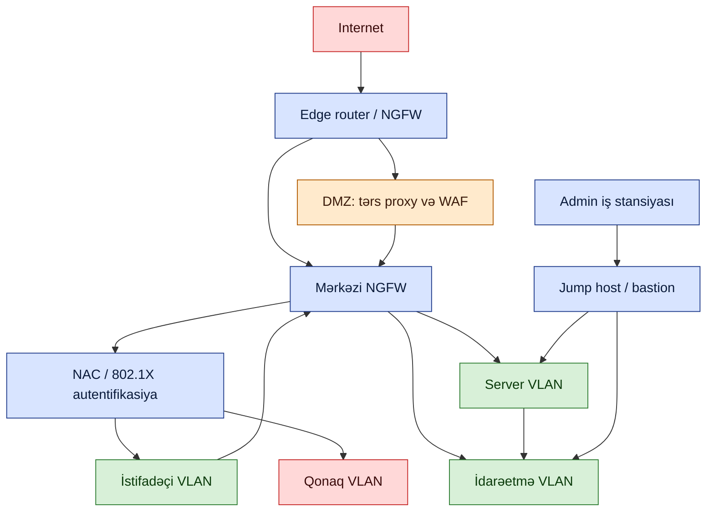

# Təhlükəsiz Şəbəkə Dizaynı

## Bu niyə vacibdir

Düz şəbəkə — bir yayım domeni, bir ünvan məkanı, perimetrdə bir dəst firewall qaydası — əksər təşkilatların başladığı və demək olar ki, heç kimin qalmalı olmadığı standart vəziyyətdir. Hər host digər hər hostla danışa bilər, hər istifadəçi VLAN-ı hər serverə çata bilər, və təcavüzkar hər hansı son nöqtəyə düşən kimi mülkün qalan hissəsi bir `nmap`-lıq məsafədədir. Qala-və-xəndək modeli xəndəyin tutduğunu fərz edir; müasir hücumlar — fişinqdən təchizat zənciri pozuntusuna qədər kənar inciderlərə qədər — müntəzəm olaraq xəndəyin içində başlayır.

Təhlükəsiz şəbəkə dizaynı, qəsdən, şəbəkənin hansı hissələrinin digər hansı hissələrinə çata biləcəyinə, yolda nəyin autentifikasiya etməli olduğuna, tranzitdə trafiki nəyin yoxladığına və bir şey səhv getdikdə dəlili nəyin qeyd etdiyinə qərar verən intizamdır. Bu bir nəzarət deyil — bu yığındır: layer 2 və 3-də seqmentasiya, portda və sessiyada giriş nəzarəti, zona sərhədlərini keçən trafik üçün perimetr yoxlaması, etibarlı zonadan çıxan hər şey üçün şifrələnmiş nəqliyyat və "nə baş verdi" sualına sonradan cavab verə bilən monitorinq.

Qazanc partlayış radiusu ilə ölçülür. Yaxşı seqmentləşdirilmiş sıfır etibarlı qəbulu, giriş qatında port təhlükəsizliyi, zonalar arasında NGFW və inzibati giriş üçün jump host olan şəbəkə, pozulmuş noutbuku məhdud inciderə çevirir. Eyni pozulma düz şəbəkədə domen miqyaslı bir hadisədir. Bu dərsdəki hər bir nəzarət növbəti inciderin partlayış radiusunu kiçiltmək üçün mövcuddur.

Bu dərs işlənmiş nümunələr üçün uydurma `example.local` təşkilatından və `EXAMPLE\` domenindən istifadə edir. Port nömrələri, protokol istinadları və konfiqurasiya fraqmentləri daxil edilib ki, dərs sahə istinadı kimi də xidmət etsin.

## Əsas konsepsiyalar

Təhlükəsiz şəbəkə dizaynı yığının hər qatını əhatə edir. Bəzi nəzarətlər layer 2-də işləyir (port təhlükəsizliyi, BPDU Guard, DHCP snooping, VLAN-lar). Bəziləri layer 3-də (ACL-lər, marşrutlaşdırma protokolları, NAT). Bəziləri layer 7-də (WAF, URL filtri, proxy-lər). Nəzarətin hansı qatda yaşadığını bilmək onun nə görə bildiyini və görə bilmədiyini, və beləliklə nəyi qoruya bildiyini və qoruya bilmədiyini göstərir.

### Seqmentasiya və zonalar — VLAN-lar, ekstranet, intranet, şərq-qərb trafiki, sıfır etibar

**Şəbəkə seqmentasiyası** şəbəkə cihazlarının mülkün müxtəlif hissələri arasında trafiki məhdudlaşdıracaq şəkildə konfiqurasiya edilməsidir. Seqmentasiya nadir hallarda daha çox avadanlıq tələb edir; bu mövcud kommutatorların, routerların və firewall-ların müəyyən edilmiş sərhədləri keçən trafiki necə ötürüb (və ya ötürməməyi) məsələsidir. İnternetə heç vaxt çıxış bağlantıları başlatmayan bir verilənlər bazası klasteri, marşrutlaşdırma qaydalarının bu yolu tamamilə qadağan etdiyi seqmentdə yaşaya bilər. Ekranlaşdırılmış alt şəbəkə (DMZ) həm internetdən, həm də daxili şəbəkədən əlçatan olan, lakin onların arasında bir sıçrayışda keçilə bilməyən seqmentdir.

**Virtual LAN-lar (VLAN-lar)** seqmentasiyanın layer 2 tikinti blokudur. VLAN kommutator konfiqurasiyasında reallaşdırılan məntiqi LAN-dır — fiziki olaraq fərqli kommutatorlardakı hostlar bir yayım domenini paylaşırmış kimi davranır, və eyni kommutatordakı hostlar fərqli yayım domenlərinə yerləşdirilə bilər. VLAN-lar administratorlara şəbəkəni funksiya üzrə (maliyyə, mühəndislik, serverlər, qonaqlar) yenidən təşkil etmək imkanı verir, yenidən kabel çəkmədən. **Trunking** tək bir inter-kommutator keçidində bir neçə VLAN-ı daşıyan texnikadır, 802.1Q başlıqları ilə etiketlənir ki, qəbul edən kommutator hər çərçivənin hansı VLAN-a aid olduğunu bilsin. Fərqli VLAN-lardakı hostlar trunk vasitəsilə birbaşa danışa bilməzlər — onlar ACL və yoxlamanın tətbiq edilə biləcəyi bir router və ya layer-3 kommutatordan keçməlidir.

**Şərq-qərb trafiki** müəssisə daxilində funksional olaraq əlaqəli sistemlər arasında məlumat axınıdır — veb qatının öz tətbiq qatı ilə, tətbiq qatının verilənlər bazası qatı ilə, ehtiyat nüsxə serverinin fayl serverlərindən çəkməsi ilə danışması. **Şimal-cənub trafiki** verilənlər mərkəzinin və ya müəssisə sərhədinin içərisinə və ya xaricinə olan məlumatdır. Fərq vacibdir, çünki əksər köhnə təhlükəsizlik xərcləri şimal-cənub (perimetr firewall-ları, internet proxy-ləri) idi, müasir hücumların həcmi isə ilkin dayanacaqdan sonra şərq-qərb istiqamətində hərəkət edir. Yalnız perimetri həll edən seqmentasiya şərq-qərb trafikini aşkarda buraxır.

**Intranet** təşkilatın etibarlı sahəsi daxilində, eyni administratorların təhlükəsizlik nəzarəti altında olan şəbəkədir. O, internetlə eyni protokolları (HTTP, fayl paylaşımı, mesajlaşma) daşıyır, lakin istifadəçiləri və cihazları arasında etibar fərziyyəsi əlavə edilmişdir. **Ekstranet** intranetin seçilmiş xarici tərəfdaşlara — müştərilər, təchizatçılar, podratçılar — nəzarətli uzanışıdır, adətən ictimai internet üzərindən VPN ilə daşınır. Ekstranet məxfiliyi (tərəfdaşlar bir-birini görməməlidir) və təhlükəsizliyi (icazəsiz kənar şəxslər kənarda saxlanılmalıdır) nəzərdə tutur, firewall-lar, autentifikasiya, şifrələmə və bəzən DMZ üslublu ayrıca zonalar vasitəsilə tətbiq olunur.

**Sıfır etibar** qala-və-xəndək fərziyyəsini rədd edən təhlükəsizlik modelidir. Şəbəkə yerləşməsinə əsasən giriş verməkdənsə (LAN daxilində = etibarlı), sıfır etibar arxitekturaları hər giriş tələbinin autentifikasiyasını və avtorizasiyasını mənşəyindən asılı olmayaraq yoxlayır. Praktik nəticələr hər resursun qarşısında şəxsiyyət-məlumatlı proxy-lər, iş yüklərini bir-birindən təcrid edən mikroseqmentasiya, sessiyalar verilməzdən əvvəl cihaz duruşu yoxlamaları və birdəfəlik qəbul əvəzinə davamlı monitorinqdir. Sıfır etibar "etibar yoxdur" demək deyil — bu "etibar siqnalı kimi yalnız yerə etibar etməyin" deməkdir.

### Uzaqdan əlaqə — VPN, həmişə-açıq, bölünmüş qarşı tam tunel, uzaqdan giriş qarşı sayt-sayta

**VPN (Virtual Private Network)** texnologiyaları iki şəbəkəni və ya uzaq cihaz ilə şəbəkəni etibarsız aralıq şəbəkə (adətən internet) üzərindən tunelləşdirmə ilə təhlükəsiz şəkildə birləşdirir. Ümumi VPN protokollarına IPSec, SSL/TLS, L2TP və SSH daxildir. Yalnız son nöqtələr açarlara sahibdir — aralıq sıçrayışlar oxuya bilmədikləri şifrələnmiş paketləri daşıyır. İki üstün istifadə halı sayt-sayta və uzaqdan girişdir.

**Həmişə-açıq VPN** istifadəçinin hər iş istədikdə VPN müştərisini işə salıb etimadnaməni daxil etməli olmasının sürtünməsindən qaçır. Əvvəlcədən təmin edilmiş əlaqə parametrləri və cihazda saxlanılan etimadnamələr cihazın internet bağlantısı olan kimi VPN-in özünü qurmasına imkan verir. Bu uyğunluğu artırır (istifadəçilər qoşulmağı unuda bilmir), lakin cihaz səviyyəsində təhlükəsizliyin payını qaldırır — həmişə-açıq VPN-li pozulmuş son nöqtə tunelin daxilində daimi olaraq olan təcavüzkardır.

**Bölünmüş tunel qarşı tam tunel.** **Tam tunel** VPN müştərinin bütün trafikini korporativ şlüz vasitəsilə yönləndirir — daxili trafik və internet trafiki — və onu korporativ siyasətə görə yoxlayır və ya filtr edir. **Bölünmüş tunel** VPN yalnız korporasiyaya təyin olunmuş trafiki VPN vasitəsilə göndərir; qalanı müştəridən birbaşa internetə gedir. Tam tunellər daha təhlükəsizdir (bütün trafik yoxlanılır, sızma yolları bağlanır), lakin çox pənahsiz istifadə edir. Bölünmüş tunellər VPN yükünü azaldır, lakin müştərinin VPN olmayan yolunu hücuma məruz qoyur və pozulmuş müştəri iki şəbəkə arasında keçid edə bilər. Uyğunluq təhlükə modelindən asılıdır: maliyyə və idarəçi rolları adətən tam tunel alır; ümumi işçilər tez-tez istifadəyə yararlılıq üçün bölünmüş tunel alır.

**Uzaqdan giriş VPN** fərdi cihazı (noutbuk, telefon) korporativ şəbəkəyə birləşdirir və onun ofis LAN-a qoşulubmuş kimi davranmasına səbəb olur. Təhlükəsizlik nəticəsi açıqdır: əgər o cihazın fiziki olaraq binaya qoşulmasına etibar etməzsənsə, onu uzaqdan giriş VPN-də də etibar etməməlisən.

**Sayt-sayta VPN** iki şəbəkəni (iki ofis, ofis və bulud VPC, tərəfdaş şəbəkələri) aralıq şəbəkə üzərindən birləşdirir. Hər ucdakı şifrələmə aralarındakı ictimai yolu qeyri-şəffaf tunelə çevirir. Tunel rejimində IPSec standart tikinti blokudur; IPSec praktik olmadığı mühitlər üçün SSL VPN alternativləri mövcuddur.

### Giriş tətbiqi — NAC, 802.1X, band xaricində idarəetmə, jump serverlər

**NAC (Network Access Control)** son nöqtələrin şəbəkəyə buraxılmasını, hər bir hal üzrə, bağlantı anında idarə edir. Prinsip ondan ibarətdir ki, son nöqtənin duruşu (əməliyyat sistemi patch səviyyəsi, antivirus statusu, domen üzvlüyü, sertifikat) yoxlanılana qədər hər yeni bağlantı əlavə risk yaradır. İki tarixi tətbiq ideyanı göstərir: Microsoft-un Network Access Protection (NAP) və Cisco-nun Network Admission Control (NAC) — sənaye bu gün ümumi termin kimi "NAC" istifadə edir.

**Agentli qarşı agentsiz NAC.** **Agent əsaslı** NAC həlli hər idarə olunan son nöqtədə kiçik bir proqram parçası işlədir; agent duruşu yoxlayır və şəbəkə giriş verməmişdən əvvəl NAC serverinə hesabat verir. Müsbət tərəfi zəngin duruş məlumatıdır; mənfi tərəfi mülkdəki hər ƏS üzərində agenti yerləşdirmək, yeniləmək və dəstəkləməkdir. **Agentsiz** NAC eyni yoxlamaları şəbəkə tərəfindən həyata keçirir, adətən girişdə Active Directory qrup siyasəti, DHCP barmaq izləri və ya müdaxilənin qarşısının alınması imzaları vasitəsilə. Kod hostda davam etmir. Performans baxımından ikisi yaxşı yerləşdirildikdə oxşardır; fərq əməliyyatdadır — agentin cihaz populyasiyanızda mümkün olub-olmamasıdır.

**802.1X** NAC-ın ümumiyyətlə üstünə mindiyi IEEE port əsaslı autentifikasiya standartıdır. Port şəbəkəyə trafik ötürməmişdən əvvəl, qoşulmuş cihaz autentifikasiya serverinə (adətən RADIUS) EAP vasitəsilə, adətən müştəri sertifikatı və ya istifadəçi adı/parol ilə autentifikasiya edir. Autentifikasiya uğursuz olarsa, port icazəsiz vəziyyətdə qalır və ya qonaq VLAN-a yerləşdirilir. 802.1X "yalnız autentifikasiya olunmuş cihazlar LAN-a qoşula bilər" üçün layer-2 tətbiq nöqtəsidir və sıfır etibarlı qəbul üçün tikinti blokudur.

**Band xaricində idarəetmə** cihazı idarə etmək üçün istifadə olunan kanalın cihazın istehsal trafikini daşıyan kanaldan fiziki olaraq ayrı olması deməkdir. Band daxilində idarəetmə — istifadəçi məlumatını daşıyan eyni kommutator portları üzərindən SSH — daha sadədir, lakin şəbəkə uğursuz olduqda dəqiq uğursuz olur və administratorların düzəltməli olduqları cihaza çata bilməməsini tərk edir. Band xaricində xüsusi idarəetmə interfeysindən istifadə edir, çox vaxt ayrıca idarəetmə VLAN-ında və ya hətta ayrıca fiziki şəbəkədə, belə ki, istehsal kəsintiləri idarəetmə yolunu da özü ilə birlikdə aşağı salmasın. Seriyal konsollar, konsol serverləri və işıqsız idarəetmə (iDRAC, iLO, IPMI) klassik band xarici alətlərdir.

**Jump serverlər (bastion hostlar)** zonalar arasındakı sərhədə yerləşdirilmiş sərtləşdirilmiş sistemlərdir və qorunan bölgəyə yeganə icazə verilmiş giriş nöqtəsi kimi istifadə olunur. Administrator əvvəlcə jump host-a qoşulur — autentifikasiya olunur, qeyd edilir və monitorlanır — və yalnız jump host-dan daxili cihazlara çata bilər. Alternativ (admin iş stansiyalarından hər serverə birbaşa SSH/RDP icazə vermək) hücum yollarını çoxaldır; jump host onları cəmləşdirir və audit edir. Jump host minimal olmalıdır (SSH/RDP xaricində heç bir işləyən xidmət olmamalıdır), aqressiv şəkildə patch edilməlidir, MFA ilə qorunmalı və sessiya logları mərkəzləşdirilməlidir.

### Kommutator səviyyəsində sərtləşdirmə — port təhlükəsizliyi, BPDU Guard, DHCP snooping, MAC filtrləmə, yayım fırtınası və döngə qarşısının alınması

Giriş qatı kommutatorları şəbəkəyə daxil olan hər çərçivəni görür və pozulmuş kommutator və ya kommutator portuna daxil edilmiş saxta cihaz əksər yuxarı qat nəzarətlərini atlayan layer-2 dayanacaqdır. Kommutator sərtləşdirmə cəlbedici deyil, lakin əsasdır.

**Port təhlükəsizliyi** hansı cihazların və onların neçəsinin hər fiziki kommutator portu vasitəsilə qoşula biləcəyini nəzarət edir. Tətbiq MAC ünvanına görədir — mükəmməl deyil (MAC-lar saxtalaşdırıla bilər), lakin mənalı sürət zərbəsidir. Port təhlükəsizliyinin üç ümumi öyrənmə rejimi var:

- **Statik öyrənmə.** Administrator portda icazə verilən MAC ünvanını konfiqurasiya edir. Sabit avadanlıq üçün faydalıdır — printer, kiosk, server. Mənfi tərəfi hər MAC-ı əvvəlcədən bilməyin inzibati yüküdür.
- **Dinamik öyrənmə.** Kommutator konfiqurasiya edilmiş maksimuma qədər qoşuldukları zaman MAC ünvanlarını öyrənir. Əvvəlcədən tanınmayan az sayda cihaz gözlənildiyi yerlərdə faydalıdır.
- **Yapışqan öyrənmə.** Dinamik kimi, lakin öyrənilmiş ünvanlar yenidən başlatma üçün davam edən davamlı konfiqurasiyaya yazılır. Bu, təcavüzkarın öyrənilmiş cədvəli sıfırlamaq üçün kommutatoru güc dövrlədirməsinin qarşısını alır.

Port təhlükəsizliyi pozuntu həddi aşıldıqda, port bağlanmağa, məhdudlaşdırmağa (təhqiredici çərçivələri atın, lakin portu qaldırın) və ya qorumağa (səssizcə atın) konfiqurasiya edilə bilər.

**Yayım fırtınası qarşısının alınması** seqmenti əziyyət çəkdirən axını həll edir — ping axınları, SYN axınları, Smurf hücumları, ümumi trafik axını. Axın mühafizəsi port başına və ya VLAN başına yayım, multicast və unicast trafik dərəcələrini monitor edir; dərəcə həddi aşdıqda, kommutator təhqiredici trafiki dərəcə-məhdudlaşdırır və ya bloklayır. Axını aşkar etmək nisbətən asandır; məharət onun azaldılmasındadır, qanuni partlayışları kəsmədən (ehtiyat nüsxələri, böyük fayl ötürmələri).

**BPDU Guard** Spanning Tree Protokolunu qoruyur. STP döngəsiz topologiyanı müzakirə etmək üçün Bridge Protocol Data Units istifadə edir; kənar portda hazırlanmış BPDU-ları enjekte edən təcavüzkar təkrar STP yenidən hesablamalarına məcbur edə bilər, kommutator CPU-sunu istehlak edir və şəbəkə qeyri-sabitliyinə səbəb olur — xidmətin imtina şərtidir. BPDU Guard, BPDU-ların heç vaxt görünməli olmadığı giriş portlarında aktivləşdirildikdə, belə paketləri atır və adətən təhqiredici portu `err-disabled`-ə gətirir.

**Layer 2-də döngə qarşısının alınması** Spanning Tree Protocol (STP) və onun varislərindən (Rapid STP, Multiple STP) istifadə edir. Layer 2 çərçivələrinin TTL-i yoxdur, buna görə layer 2-də döngə müdaxilə olunana qədər daimidir. STP kök körpüsünü seçir, yayılma ağacını hesablayır və hər iki nöqtə arasında tək aktiv yolu zəmanət etmək üçün artıq keçidləri bloklayır; aktiv yol uğursuz olarsa, STP alternativi açır. OSPF (Open Shortest Path First) avtonom sistem daxilində şlüzlar arasında marşrutlaşdırma üçün layer-3 ekvivalentidir, bir link-state verilənlər bazası vasitəsilə döngəsiz yollar hesablayır.

**DHCP snooping** saxta DHCP serverlərinə qarşı müdafiə edir. Onsuz, LAN-dakı hər hansı bir cihaz DHCP kəşfinə cavab verib ünvanları, şlüzları və DNS serverlərini paylaya bilər — klassik ortada-adam vektoru. Kommutatorda konfiqurasiya edilmiş DHCP snooping hər portu etibarlı və ya etibarsız kimi qeyd edir; etibarsız portlardan DHCP server mesajları atılır. Xüsusiyyət RFC 7513-də standartlaşdırılıb. O, həmçinin Dynamic ARP Inspection və IP Source Guard-a daha dərin layer-2 qoruması üçün verilə biləcək bağlama cədvəlini (MAC, IP, VLAN, port, icarə) qurur.

**MAC filtrləmə** mənbə MAC ünvanına əsasən paketləri seçici şəkildə buraxır və ya rədd edir. Kabelli kommutatorlarda maşın autentifikasiyasının əsas formasını təmin edir — port təhlükəsizliyi ilə birləşdirildikdə "səhv kabelin səhv portda" halının səssizcə giriş verməsinin qarşısını alır. Simsiz şəbəkələrdə MAC filtrləmə daha zəifdir, çünki təcavüzkar icazə verilən MAC-ları havada passiv şəkildə müşahidə edib saxtalaşdıra bilər; o, ilkin simsiz nəzarət kimi etibar edilməməlidir.

### Perimetr və yoxlama — NGFW, UTM, WAF, NIDS/NIPS, proxy-lər, məzmun və URL filtrləmə

Zona sərhədlərini keçən trafik — internetdən DMZ-a, DMZ-dan daxiliyə, daxilidən idarəetməyə — yoxlanılır. Yoxlama qatı problemin fərqli hissəsi üçün optimallaşdırılmış bir cihaz yığınıdır.

**Növbəti nəsil firewall (NGFW).** Halı olan paket yoxlaması firewall-u ki, o, həm də dərin paket yoxlaması (DPI) həyata keçirir — başlıqları deyil, faydalı yükü yoxlayır — və müdaxilənin qarşısının alınması imkanlarını ehtiva edir. NGFW-lər portdan asılı olmayaraq tətbiqləri müəyyənləşdirir, istifadəçi şəxsiyyətinə əsasən (AD inteqrasiyası vasitəsilə) bloklayır və TLS şifrəsinin açılmasından sonra HTTPS-də siyasəti tətbiq edir. Müasir müəssisə şəbəkələrində onlar üstün perimetr və zonalararası nəzarətdir.

**Unified Threat Management (UTM).** Firewall, IDS/IPS, antivirus, anti-spam, məzmun filtrləmə, VPN və bəzən kommutasiya və ya marşrutlaşdırma paketləyən tək bir cihaz üçün marketinq termini. UTM-lər sadəlik və dəyər üçün ixtisaslaşdırılmış performansla ticarət edir — onlar kənarda bir cihazın beş cihazdan işlətməyin daha asan olduğu kiçik və orta şəbəkələri hədəfləyir. Ötürmə qabiliyyəti və xüsusiyyət bərabərliyi satıcı və iş yükünə görə dəyişir; eyni vaxtda nə qədər çox xüsusiyyət aktivdirsə, tək cihaz o qədər çox sıxılır.

**Veb tətbiq firewall (WAF).** Veb serverlərə və API-lərə HTTP və HTTPS trafikinə xüsusi olaraq diqqət yetirən tətbiq qatı firewall-u. WAF HTTP tələblərini hücum nümunələri üçün yoxlayır — SQL injection, sayt arası skript, yol keçidi, əmr enjeksiya, XML xarici varlıq hücumları, ümumiyyətlə OWASP Top 10 — və tələb veb serverə çatmamışdan əvvəl bloklayır və ya xəbərdar edir. Bütün trafikə baxan, lakin HTTP semantikasını anlamayan şəbəkə firewall-undan fərqli olaraq, WAF protokolu anlayır və URL yolları, başlıqlar, kukilər və gövdə məzmunu haqqında düşünə bilər.

**NIDS və NIPS.** **Şəbəkə əsaslı müdaxilənin aşkarlanması sistemi (NIDS)** şəbəkə trafikini müşahidə edir, onu imza verilənlər bazası və davranış qaydaları ilə müqayisə edir və uyğunluq baş verdikdə xəbərdar edir. **Şəbəkə əsaslı müdaxilənin qarşısının alınması sistemi (NIPS)** eyni aşkarlama mühərrikinə malikdir, lakin həmçinin uyğunluq hücumu göstərdikdə trafiki bloklaya bilər — paketi ata, bağlantını sıfırlaya və ya firewall-u yenidən proqramlaya bilər. Tipik NIDS/NIPS dörd məntiqi komponentə malikdir: trafiki kopyalayan və ya tutan **trafik toplayıcısı (sensor)**; trafiki nümunələrlə müqayisə edən **analiz mühərriki**; məlum pis nümunələrin **imza verilənlər bazası**; və xəbərdarlıqlar, tənzimləmə və araşdırma üçün **istifadəçi interfeysi**.

**Inline qarşı passiv.** Yerləşdirmə rejimi NIDS/NIPS-in nə edə biləcəyini müəyyən edir. **Inline (band daxilində)** sensor trafik yolundadır — hər paket ondan keçir və o, real vaxtda paketləri ata bilər. Bu güclü qorunma verir, lakin gecikmə və uğursuzluq rejimi əlavə edir (sensor aşağı = trafik aşağı, bypass edilmədiyi təqdirdə). **Passiv (band xaricində)** sensor SPAN/mirror portu vasitəsilə trafikin kopyasını alır və fakt baş verdikdən sonra xəbərdar edir; o, real vaxtda bloklaya bilmir, lakin istehsalı aşağı gətirməyə risk etmir. Proqnozlaşdırıla bilən trafiklə yüksək dəyərli seqmentlər (verilənlər bazası ön hissələri) çox vaxt inline istifadə edir; bütün mülk üzrə geniş görünmə adətən passivdir.

**Proxy serverlər** müştərilər və serverlər arasındakı trafikə vasitəçilik edir. Proxy tələbləri filtrləyə, cavabları keşə yaza, fəaliyyəti qeyd edə, məqbul istifadə siyasətini tətbiq edə və yoxlama üçün şifrələnmiş bağlantıları sonlandıra bilər.

- **İrəli proxy.** Müştəri tərəfində oturur, daxili müştərilər adına gedən tələbləri irəli ötürür. Xarici məzmun filtrləmə, keş sürətləndirmə, URL qeydiyyatı və daxili müştəri ünvanlarının gizlədilməsi üçün istifadə olunur. Ya açıq (müştərilər ondan istifadə etmək üçün konfiqurasiya edilib) ya da şəffaf (müştəri konfiqurasiyası olmadan trafiki tutaraq) yerləşdirilir.
- **Tərs proxy.** Server tərəfində oturur, adətən veb serverlər qrupunun qarşısında, daxil olan tələbləri tutur. TLS sonlandırma (şifrələməni tətbiq serverlərindən boşaltmaq), yük balansı, statik məzmun keşi, tələb filtrləmə və arxa serverlərin şəxsiyyətinin gizlədilməsi üçün istifadə olunur. Tərs proxy WAF ilə təbii cütləşmədir — WAF proxy irəli ötürməmişdən əvvəl yoxlayır.

**Məzmun və URL filtrləmə.** İstifadəçinin hansı kateqoriyalı məzmuna və ya xüsusi URL-lərə daxil ola biləcəyini məhdudlaşdırır — istehsal VLAN-larından sosial şəbəkələri bloklamaq, zərərli proqram yerləşdirən domenləri bloklamaq, məqbul istifadə siyasətinə görə yetkin məzmunu bloklamaq. Filtrlər yalnız URL-ə uyğunlaşdıra bilər (daha sürətli, daha sadə) və ya qaytarılan məzmunu yoxlaya bilər (daha yavaş, dinamik yaradılmış səhifələri və gizlədilmiş URL-ləri tutur). Daimi məsələ həddindən artıq blokdur; siyasət sürətli, sənədləşdirilmiş istisna yoluna ehtiyac duyur, əks halda istifadəçilər bunu keçməyin yollarını tapacaq.

**Appliance qarşı host əsaslı qarşı virtual firewall-lar.** Firewall-lar üç forma faktorunda mövcuddur. **Appliance** firewall-ları şəbəkə yoluna daxil edilmiş xüsusi avadanlıq qutularıdır — klassik müəssisə perimetr cihazı. **Host əsaslı** firewall-lar son nöqtənin özündə işləyir (Windows Defender Firewall, `iptables`/`nftables`, macOS PF) və o bir hostdan daxil və ya xaricə trafiki filtrləyir; şəbəkə seqmentasiyası keçildiyi halda son müdafiə xəttini təmin edirlər. **Virtual** firewall-lar eyni məntiqi hipervizor və ya bulud VPC daxilində proqram təminatı görüntüsü kimi həyata keçirir — getdikcə proqramla müəyyən edilmiş şəbəkə və ictimai bulud mühitlərində üstün forma, fiziki appliance-i yola yerləşdirmək mümkün olmayan yerlərdə.

### Marşrutlaşdırma və ünvanlandırma — ACL, marşrut təhlükəsizliyi, NAT növləri, IPv6 nəticələri, QoS

**Giriş Nəzarəti Siyahıları (ACL-lər)** paketin xüsusiyyətlərinə əsasən trafikə icazə verən və ya rədd edən qaydalar siyahılarıdır — mənbə və təyinat ünvanı, port, protokol, interfeys, istiqamət. Routerlərdə, kommutatorlarda və firewall-larda tətbiq olunan ACL-lər şəbəkədə ən kobud və ən geniş yayılmış filtrdir. Yaxşı dizayn edilmiş ACL açıqdır: icazə verilənləri siyahıya alır, defolt olaraq digər hər şeyi rədd edir və araşdırma üçün rədd etmələri qeyd edir.

**Marşrut təhlükəsizliyi.** Marşrutlaşdırma protokolları — BGP, OSPF, IS-IS, EIGRP, RIPv2 — interneti və hər müəssisə şəbəkəsini birləşdirən əlçatanlıq məlumatını daşıyır. Saxta marşrutları enjekte edən saxta və ya səhv konfiqurasiya olunmuş router trafiki istiqamətləndirə bilər (prefiks hijack), trafiki qara dəliyə sala bilər və ya qeyri-sabitliyə səbəb ola bilər. Marşrut təhlükəsizliyi xüsusiyyətləri qonşu routerləri autentifikasiya edir (OSPF-də MD5 və ya SHA açarları, BGP TCP MD5 və ya TCP-AO), qəbul edilmiş prefiksləri filtrləyir (BGP prefiks siyahıları, marşrut xəritələri, RPKI doğrulaması) və yeniləmələri dərəcə məhdudlaşdırır. Səhv konfiqurasiya və zərərli BGP elanları böyük internet kəsintilərinin təkrarlanan səbəbi olaraq qalır.

**Şəbəkə Ünvan Tərcüməsi (NAT).** Tranzitdəki paketlərin IP başlığında ünvanları yenidən yazaraq bir IP ünvan məkanını digərinə təyin etmə texnikası. NAT təşkilatlara daxili olaraq RFC 1918 özəl ünvan məkanından istifadə etməyə və internet çıxışı üçün kiçik ictimai ünvanlar hovuzunu paylaşmağa icazə vermək üçün icad olundu. O, IPv4 tükənməsinə görə hər yerdə yayılıb. Üç ümumi variant:

- **Statik NAT.** Bir-bir bir təyinetmə — daxili özəl ünvan həmişə eyni xarici ictimai ünvana təyin olunur. Xüsusi daxili host xaricdən əlçatan olmalı olduqda istifadə olunur, məsələn, veb server.
- **Dinamik NAT.** Daxili özəl ünvan tələb əsasında hovuzdan götürülmüş ictimai ünvana təyin olunur. Təyinetmə sabit deyil; NAT cihazı onu axının ömrü boyu izləyir.
- **PAT (Port Address Translation), həmçinin NAT overload adlanır.** Bir çox daxili ünvan bir xarici ünvanı paylaşır; NAT cihazı mənbə portunu və ünvanı yenidən yazaraq axınları fərqləndirir. PAT əksər ev routerlərinin və kiçik ofislərin istifadə etdiyidir — bir ictimai IP, çox daxili cihaz.

**IPv6 nəticələri.** IPv6 daha böyük IPv4 deyil — o, öz təhlükəsizlik hekayəsi ilə yenidən dizaynıdır. 128-bitlik ünvan məkanı NAT-ı zəruri edən qıtlığı aradan qaldırır; IPv6-da faktiki olaraq NAT yoxdur. Son-son şifrələmə orijinal dizayna daxil edilib. Təhlükəsiz Qonşu Kəşfi (SEND) ARP-ı əvəz edir və ARP zəhərlənmə hücumlarını aradan qaldırır. ICMPv6 ICMPv4-dən daha çox nəzarət trafikini daşıyır, buna görə firewall-da həddindən artıq aqressiv ICMP bloklaması IPv6-nı tamamilə pozur. Bir çox şəbəkə ikili yığın (IPv4 və IPv6 eyni vaxtda) işlədir və eyni vaxtda iki təhlükəsizlik duruşu haqqında düşünməlidir — IPv4 yığınında tətbiq olunan, IPv6 yığınında yoxluq olan qayda həqiqi bir bypass-dır. IPv6 seqmentasiyasını və firewall-ı IPv4 kimi diqqətlə planlaşdırın, sonradan fikir kimi deyil.

**Xidmət Keyfiyyəti (QoS).** QoS şəbəkənin fərqli növ trafikə fərqli prioritet vermək üçün istifadə etdiyi texnikalar dəstidir. Yüksək pənahsız real-vaxt trafiki (VoIP, video konfrans, straming) gecikmə, jitter və itkiyə həssasdır; toplu trafik (ehtiyat nüsxələr, partiya ötürmələri) tolerantdır, lakin acgözdür. QoS paketləri qeyd edir (DSCP, 802.1p), onları növbələrə təsnifat edir, dərəcələri polis edir və partlayışları formalaşdırır ki, ehtiyat nüsxə işi səs zəngini acından öldürməsin. Təhlükəsizlik perspektivindən QoS yaxındır — əlçatanlığı təmin edir, CIA-dakı "A" — və QoS işarələrinin özləri manipulyasiya edilə bilər, əgər etibar giriş nöqtəsində tətbiq olunmursa.

### Monitorinq və bütövlük — port güzgüləməsi, NSM, fayl bütövlüyü monitorları

**Port spanning / port güzgüləməsi (SPAN).** Əksər müəssisə kommutatorları bir və ya bir neçə portun (və ya bütöv VLAN-ın) trafikini IDS, paket broker və ya tutma aləti tərəfindən təhlil üçün təyin olunmuş SPAN portuna kopyalaya bilər. SPAN passiv NIDS/NIPS-in öz məlumatlarını necə aldığıdır. Məhdudiyyətlər vacibdir: SPAN portu öz keçid sürətini aşa bilməz, buna görə məşğul kommutatorda çox yüksək istifadəli portları aqqreqasiya edən SPAN səssizcə çərçivələr ata bilər. Hər portda tam dupleksdə işləyən 16 portlu 1 Gbps kommutator 32 Gbps-a qədər məcmu trafik yarada bilər — hər hansı tək güzgü portunun tutumundan qat-qat artıq. Xüsusi qurulmuş şəbəkə TAP-ları (test access points) və paket brokerləri ağır trafik üçün bunu həll edir.

**Şəbəkə təhlükəsizliyi monitorinqi (NSM).** Preventiv nəzarətlərin qaçırdığı fəaliyyəti aşkar etmək üçün şəbəkə məlumatını toplama və təhlil etmə intizamı. NSM bloklamır; o müşahidə edir. Monitorlanmış şəbəkə hadisə respondentinə müdafiənin nə vaxt uğursuz olduğunu, təcavüzkarın növbəti nə etdiyini və hansı məlumatın şəbəkəni tərk etdiyini söyləyə bilər. NSM xidmətləri getdikcə daha çox idarə olunan aşkarlama və reaksiya (MDR) provayderlərinə xaricə verilir, onlar sensorları, mərkəzləşdirilmiş təhlili və 24x7 insan triajını birləşdirir.

**Fayl bütövlüyü monitorları (FIM).** Müəyyən vaxtlarla kritik ƏS və tətbiq fayllarının məzmununu hash edir və məlum yaxşı bazaya qarşı müqayisə edir; hər hansı dəyişiklik xəbərdarlıq tetikleyir. Host əsaslı IDS sistemləri, konfiqurasiya idarəetmə alətləri və xüsusi FIM məhsulları eyni ideyanı həyata keçirir. FIM operatorun istehsal serverindəki binarın səssizcə əvəz edildiyini aşkar etməsinin yoludur — ümumi post-kompromis davamlılıq taktikası. Tətbiq ağ siyahısı əlaqəli bir nəzarətdir: proqramın işlədilməsinə icazə verilməmişdən əvvəl məlum yaxşı dəyərə qarşı hash yoxlaması. Satıcılardan yüklər həmişə naşir hashına qarşı doğrulanmalıdır, sadəcə satıcı URL-dən gəldiyi üçün tərs etibar edilməməlidir.

## Seqmentasiya arxitekturası diaqramı

Aşağıdakı diaqram istinad müəssisə seqmentasiya nümunəsini göstərir: sərtləşdirilmiş internet kənarı tərs proxy və WAF-ı olan DMZ-a qidalandırır, mərkəzdəki NGFW zonalararası siyasəti tətbiq edir, NAC / 802.1X sərhədi istifadəçi və cihaz qəbulunu qapatır, istifadəçilər, serverlər, idarəetmə və qonaqlar üçün ayrı VLAN-lar. Jump host server VLAN-a bütün inzibati girişə vasitəçilik edir.



Diaqramı sərhədlər ardıcıllığı kimi oxuyun: internetdən kənara (birinci filtr), kənardan DMZ-a (yalnız ictimaiya yönəlmiş xidmətlər), DMZ və kənardan mərkəzə (şərq-qərb siyasəti), mərkəzdən NAC-a (qəbul nəzarəti), NAC-dan istifadəçi və ya qonaq VLAN-a (autentifikasiyadan sonra yerləşdirmə), mərkəzdən server və idarəetmə VLAN-larına (birbaşa istifadəçidən serverə yol yoxdur) və admin iş stansiyalarından jump host vasitəsilə serverlərə və idarəetməyə. Diaqramdakı hər ox ACL-lərin, NGFW qaydalarının və ya NAC siyasətinin bloklaya, qeyd edə və xəbərdarlıq edə biləcəyi tətbiq nöqtəsidir.

## Praktiki / təcrübə

Kiçik sayda virtual maşın və kommutatorla (fiziki və ya simulyasiya olunmuş, məsələn, kommutatora xas iş üçün GNS3 və ya Cisco Packet Tracer) laboratoriyada tamamlana bilən beş tapşırıq.

### 1. Cisco və ya Juniper giriş kommutatorunda port təhlükəsizliyini konfiqurasiya edin

Cisco üslublu kommutatorda giriş portunu konfiqurasiya edin ki, o, bir MAC-ı dinamik olaraq öyrənsin, onu işləyən konfiqurasiyaya yapışdırsın və pozuntu halında bağlansın.

```conf
interface GigabitEthernet0/5
 switchport mode access
 switchport access vlan 10
 switchport port-security
 switchport port-security maximum 1
 switchport port-security mac-address sticky
 switchport port-security violation shutdown
 spanning-tree bpduguard enable
```

İcazə verilən cihazı qoşun və `show port-security` əmrində yapışqan MAC-ın göründüyünü təsdiqləyin. Sonra fərqli cihaz qoşun və portun `err-disabled` vəziyyətinə keçdiyini yoxlayın. Cavab: bağlanmış portu necə bərpa edərsiniz? `shutdown` əvəzinə `violation restrict` qoysanız, nə dəyişir? Nə vaxt `maximum 2`-ni seçərsiniz (məsələn, arxasında PC olan telefon)?

### 2. `example.local` üçün 3 VLAN seqmentasiya planını dizayn edin

Tək düz `10.0.0.0/24` şəbəkəsi verildikdə, onu VLAN-lararası ACL siyasəti ilə üç VLAN-a bölən qısa dizayn sənədi hazırlayın:

- VLAN 10 — İstifadəçilər (`10.10.10.0/24`) — iş stansiyaları, printerlər, noutbuklar
- VLAN 20 — Serverlər (`10.10.20.0/24`) — fayl, tətbiq və verilənlər bazası serverləri
- VLAN 30 — İdarəetmə (`10.10.30.0/24`) — kommutator, router, firewall, hipervizor idarəetmə interfeysləri

ACL-ləri müəyyənləşdirin: istifadəçilər serverlərə yalnız təsdiqlənmiş tətbiq portlarında (SMB 445, jump host vasitəsilə RDP 3389, HTTPS 443) çata bilər; serverlər istifadəçi VLAN-a bağlantı başlada bilməz; yalnız idarəetmə VLAN-a (jump host vasitəsilə əldə edilən) idarəetmə interfeyslərinə çata bilər; heç bir VLAN digərinin yayım domeninə çata bilməz. Cavab: hansı SVI və ya router alt-interfeysləri VLAN şlüzlarını daşıyır? ACL-lər harada tətbiq olunur (daxil və ya xaric)? Siyasəti necə sınaqdan keçirirsiniz?

### 3. Test tətbiqinə qarşı SQL injection-u bloklamaq üçün WAF qaydası yerləşdirin

Zəif test tətbiqini (OWASP Juice Shop və ya DVWA) ModSecurity və ya ekvivalent WAF ilə tərs proxy arxasında qurun. OWASP Core Rule Set-i aktivləşdirin. Giriş səhifəsinə qarşı əsas SQL injection tətikleyin və WAF tərəfindən tələb tətbiqə çatmamışdan əvvəl bloklandığını təsdiqləyin.

```conf
# Minimal ModSecurity qayda fraqmenti
SecRuleEngine On
Include /etc/modsecurity/crs/crs-setup.conf
Include /etc/modsecurity/crs/rules/*.conf
```

Cavab: hansı CRS qaydası uyğunlaşdı? Sınaq işinizdə qanuni tətbiq trafikinə qarşı yanlış-pozitiv dərəcəsi nədir? İstehsal buraxılışı üçün paranoiya səviyyəsini necə tənzimləyərdiniz?

### 4. Qeydiyyatla SSH jump host qurun

Yalnız açar autentifikasiyası, Google Authenticator PAM modulu vasitəsilə iki faktorlu autentifikasiya və sessiya qeydiyyatı ilə sshd konfiqurasiya olunmuş bastion VM (`bastion.example.local`) qurun. Daxili hədəfi (`target.example.local`) yalnız bastionun IP ünvanından SSH qəbul etmək üçün konfiqurasiya edin.

```bash
# Müştəri bastion vasitəsilə bir əmrdə qoşulur
ssh -J admin@bastion.example.local admin@target.example.local

# Bastionda sessiya audit qeydiyyatını auditd və ya sshd ForceCommand wrapper vasitəsilə aktivləşdirin
```

Cavab: sessiya qeydləri harada saxlanılır və nə qədər saxlanılır? Mülk üzrə administratorun SSH açarını necə fırlanırsınız? Bastion mövcud olmadıqda nə baş verir — qəza şüşə yolu varmı və onun istifadəsi necə xəbərdar edilir?

### 5. SPAN / güzgü portu vasitəsilə trafiki tutun

İdarə olunan kommutatorda server VLAN-dan trafiki monitorinq portuna güzgülayən SPAN sessiyasını konfiqurasiya edin. Monitorinq portuna `tcpdump` və ya Zeek işlədən Linux hostu qoşun.

```conf
# Cisco SPAN nümunəsi
monitor session 1 source vlan 20
monitor session 1 destination interface GigabitEthernet0/24
```

```bash
# Monitorinq hostunda tutma
sudo tcpdump -i eth1 -w /var/log/span.pcap not port 22
```

Təmsilçi trafik yaradın və tutmanı yoxlayın. Cavab: SPAN hansı trafiki qaçırır (məsələn, lokal portdan heç vaxt çıxmayan trafik)? Güzgülanmış VLAN-ın aqreqat pənahsizliyi nə qədərdir və SPAN portu onu davam etdirə bilərmi? Tam paketləri saxlamaq əvəzinə uzunmüddətli saxlama üçün Zeek ilə hansı sahələri çıxarardınız?

## İşlənmiş nümunə — `example.local` düz `/24`-ü seqmentləşdirilmiş zonalara yenidən dizayn edir

`example.local` köhnə düz şəbəkəsi olan orta ölçülü biznesdir: bir VLAN, `10.0.0.0/24`, iş stansiyaları, serverlər, printerlər, telefonlar və idarəetmə interfeyslərini ehtiva edir. Son pentest tapdı ki, pozulmuş noutbuk dəqiqələr ərzində domen nəzarətçilərinə, maliyyə fayl serverinə və kommutator idarəetmə interfeysinə çata bilər. CISO yenidən dizaynı tapşırır.

**Əvvəlcə inventar.** `EXAMPLE\secops` komandası düz şəbəkəni skan edir, hər cihazı funksiyaya görə kataloqlaşdırır və onları rol sərbənlərinə qruplaşdırır: istifadəçi son nöqtələri, ümumi serverlər, maliyyə serverləri, domen nəzarətçiləri, printerlər, VoIP telefonları, kommutator və router idarəetməsi, hipervizor idarəetməsi və qonaq / BYOD cihazları. İnventar bünövrədir — şəbəkədə nə olduğunu bilmədən seqmentasiya həmişə bir şey qaçırır.

**VLAN planı.** Komanda yeddi VLAN müəyyən edir:

- VLAN 10 — İstifadəçilər (`10.10.10.0/24`)
- VLAN 11 — Qonaq / BYOD (`10.10.11.0/24`) — yalnız internet, daxili əlçatanlıq yoxdur
- VLAN 20 — Ümumi serverlər (`10.10.20.0/24`)
- VLAN 21 — Maliyyə serverləri (`10.10.21.0/24`) — daha sərt siyasət
- VLAN 22 — Domen nəzarətçiləri və PKI (`10.10.22.0/24`)
- VLAN 30 — Kommutator / router / firewall / hipervizor idarəetməsi (`10.10.30.0/24`)
- VLAN 40 — VoIP telefonları (`10.10.40.0/24`)

Hər VLAN-ın layer-3 kommutatorunda öz SVI-si var, VLAN-lararası trafik defolt olaraq icazə verilməkdənsə siyasət tətbiqi üçün mərkəzi NGFW-ə ötürülür.

**NGFW və sıfır-etibar örtüyü.** VLAN-lar arasında mərkəzi NGFW daxil edilir. Siyasət defolt-rədd edicidir: hər icazə qaydası mənbə VLAN, təyinat VLAN, təyinat xidməti və (mümkün olduqda) istifadəçi və ya cihaz şəxsiyyətini adlandırır. İstifadəçilər dərc olunmuş tətbiq portlarında ümumi serverlərə çata bilər; yalnız `EXAMPLE\finance` vasitəsilə autentifikasiya edən maliyyə işçiləri maliyyə tətbiq portunda maliyyə serverlərinə çata bilər; istifadəçilərdən-istifadəçilərə yana trafikə icazə verilmir; qonaqlar yalnız internetə sahibdir. Həssas veb konsolların qarşısındakı şəxsiyyət-məlumatlı proxy şəbəkə yerləşməsindən asılı olmayaraq tələb başına autentifikasiyanı tətbiq edir.

**Giriş qatının sərtləşdirilməsi.** Hər istifadəçiyə yönəlmiş kommutator portu `switchport port-security`, `maximum 1`, `sticky`, `violation shutdown` və `spanning-tree bpduguard enable` ilə konfiqurasiya olunur. DHCP snooping hər giriş VLAN-da aktivləşdirilir, DHCP serverinə uplink yeganə etibarlı port kimi qeyd olunur. Dynamic ARP Inspection DHCP snooping cədvəlinə söykənir. MAC filtrləmə uyğun olduqda istifadə olunur, lakin yeganə nəzarət kimi etibar edilmir. 802.1X əvvəlcə monitor rejimində, sonra hər domen-qoşulmuş iş stansiyası duruşdan keçdikdən sonra tətbiq olunur.

**İnzibati giriş üçün jump host.** Bastion, `bastion.example.local`, istifadəçi VLAN ilə idarəetmə VLAN arasında yerləşdirilir. Administratorlar bastiona ağıllı kart və MFA ilə autentifikasiya edirlər; yalnız bundan sonra kommutatorlara, routerlərə və hipervizor hostlarına SSH edə bilərlər. Birbaşa admin-iş-stansiyası-idarəetmə-cihazı trafiki NGFW tərəfindən bloklanır. Hər bastion sessiyası qeyd olunur; sessiya qeydləri 90 günlük saxlanma ilə SIEM-ə axır.

**DMZ-da WAF.** Şirkətin ictimai veb tətbiqləri (`portal.example.com`, `billing.example.com`) DMZ-da tərs proxy arxasında oturur. Proxy-nin qarşısındakı WAF OWASP Core Rule Set-i paranoya səviyyəsində 2-də işlədir, iki tətbiq üçün fərdi qaydalar tənzimlənmişdir. TLS proxy-də sonlanır (`EXAMPLE\pki` tərəfindən idarə olunan sertifikatlarla) və tətbiq həssas olduqda arxa tərəfə yenidən şifrələnir. WAF qeydləri SIEM-i qidalandırır.

**VPN və uzaqdan giriş.** Evdən işləyən işçilər `vpn.example.com`-a IPSec IKEv2 VPN istifadə edir, `EXAMPLE-CA` tərəfindən verilmiş sertifikatlar və TOTP ikinci faktorla autentifikasiya edirlər. Korporativ çıxış yükünü azaltmaq üçün ümumi işçilər üçün bölünmüş tunelləmə aktivləşdirilir. `EXAMPLE\finance` qrupu tam tunel profilinə yerləşdirilir, belə ki, bütün trafikləri korporativ yoxlamadan keçir. Korporativ məxsus noutbuklar üçün həmişə-açıq VPN aktivləşdirilir; şəxsi cihazlar əvəzinə brauzer əsaslı ZTNA portalından keçir.

**Band xaricində idarəetmə.** Hər mərkəzi kommutator, router və firewall-ın VLAN 30-da xüsusi idarəetmə interfeysi və yalnız bastiondan əlçatan olan terminal serverə qoşulmuş seriyal konsolu var. Marşrutlaşdırma dəyişikliyi səhv olduqda və band daxilində yol itdiyi zaman, administratorların istehsal şəbəkəsinin yüksəlməsindən asılı olmayan konsol yolu hələ də var.

**NIDS və SPAN.** Mərkəzi kommutatorda SPAN sessiyası VLAN-lararası trafiki ET Open qayda dəsti ilə Suricata işlədən NIDS sensoruna güzgülayir. İkinci sensor internet-kənar keçidini passiv TAP ilə nümunələyir. Xəbərdarlıqlar SIEM-ə axır; yüksək ciddilik xəbərdarlıqları növbədəki SOC analitikini çağırır.

**Fayl bütövlüyü monitorinqi.** Domen nəzarətçiləri, maliyyə serverləri və bastion host xaricində saxlanılan bazaya qarşı müqayisə edərək saatda kritik ƏS və tətbiq fayllarını hash edən FIM agent işlədir. Sənədləşdirilmiş dəyişiklik pəncərəsi xaricindəki dəyişikliklər incident tətikleyir.

**Monitorinq xidmətləri.** MDR tərəfdaşı SIEM feed-in və şəbəkə TAP trafiki metadatasının surətini alır. MDR 24x7 xəbərdarlıqları triaj edir və təsdiqlənmiş incidentləri iş saatlarında daxili SOC-ə və iş saatlarından sonra növbədəki telefona yüksəldir.

**Doğrulama.** Keçiddən altı həftə sonra, pentest yenidən işlədilir. Pozulmuş istifadəçi noutbuku indi yalnız ümumi serverlərdə dərc olunmuş tətbiq portlarına çata bilər, autentifikasiya olunmuş maliyyə etimadnamələri olmadan maliyyə serverlərinə çata bilməz, domen nəzarətçilərinə birbaşa çata bilməz, idarəetmə interfeyslərinə ümumiyyətlə çata bilməz və başqa istifadəçiyə pivot edə bilməz. Partlayış radiusu "domen"dən "bir serverdə bir tətbiq portuna" qədər azalıb. `EXAMPLE\secops` komandası yeni bazanı sənədləşdirir və VLAN / ACL / NGFW siyasətini infrastruktur-kod kimi repozitoriyasına kodlaşdırır ki, konfiqurasiya sürüşməsi avtomatik aşkar edilsin.

Yenidən dizayn ekzotik deyil — yeni protokollar, qabaqcıl satıcılar yoxdur. Bu uçdan-uca tətbiq edilmiş intizamlı seqmentasiya, ardıcıl sərtləşdirmə və sıfır-etibar qəbuludur. Təhlükəsizlik duruşunu həqiqətən dəyişdirən budur.

## Problemlərin həlli və tələlər

- **"Müvəqqəti" olaraq illərlə buraxılmış düz şəbəkələr.** Hər düz şəbəkə praktik qısa yol kimi başladı. Hər seqmentasiya layihəsi onun olmamasını arzulayaraq başlayır. Şəbəkəni baza halına gətirin, hədəf vəziyyəti dərc edin və xidmətləri düzgün seqmentləşdirilmiş zonalara köçürən komandaları stimullaşdırın.
- **İkiqat işarələmə vasitəsilə VLAN hopping.** Yerli VLAN-dakı təcavüzkar səhv konfiqurasiya olunmuş trunk-un başqa VLAN-a ötürəcəyi 802.1Q-ilə etiketlənmiş çərçivələr göndərə bilər. Azaltma: VLAN 1-i heç bir şey üçün istifadə etməyin, trunk-larda yerli VLAN-ı istifadə olunmayan VLAN-a qoyun və giriş portlarında Dynamic Trunking Protokolunu deaktiv edin.
- **"İndi üçün" çox icazə verən ACL-lər.** İncidenti bloklamadan çıxarmaq üçün əlavə edilmiş ACL qaydası nadir hallarda silinir. Sahibkar komanda ilə müntəzəm olaraq ACL-ləri nəzərdən keçirin, hər qaydaya bilet nömrəsi ilə etiket vurun və müvəqqəti qaydalar üçün istifadə müddətini avtomatlaşdırın.
- **Ümumi təyinatlı serverlərə çevrilən jump host-lar.** Bastion skriptləri, inkişaf alətləri və keşlənmiş etimadnamələri özü tac daşlarına çevrilənə qədər topladır. Bastionu minimal saxlayın, cədvəldə yenidən görüntü verin və etimadnamələrin yerli saxlanmasını qadağan edin.
- **Pozulmuş son nöqtələrdə həmişə-açıq VPN.** Həmişə-açıq cihazı pozan təcavüzkarın tunelin daxilində daimi olması deməkdir. Həmişə-açıq VPN-i güclü son nöqtə duruşu, EDR və sürətli işə son vermə ilə cütləşdirin.
- **İmtiyazlı istifadəçilərdə bölünmüş tunelləmə.** Maliyyə, admin və icraçı rolları bölünmüş tunelləmənin ən böyük risk olduğu populyasiyadır — onların trafiki ən dəyərlidir. Siyasəti rol əsaslı edin və o rolları tam tunelə defolt edin.
- **NAC əbədi olaraq monitor rejimində.** Bir çox təşkilat 802.1X-i "məlumat toplamaq üçün" monitor rejimində açır və heç vaxt tətbiqə keçmir. Tətbiq üçün təqvim tarixi qoyun və onu saxlayın; əks halda nəzarət yalnız kağızda mövcuddur.
- **Yalnız girişdə işləyən agentsiz NAC.** Duruş yalnız girişdə yoxlanılırsa, maşın sessiya zamanı uyğunluqdan çıxa bilər və heç nə fərq etmir. Periodik olaraq və ya xüsusi tətikleyicilərdə yenidən yoxlayın.
- **İstehsal şəbəkəsindən əlçatan olan band xaricində idarəetmə.** Band xaricində olmağın mahiyyəti bandın xaricində olmasıdır. İstehsal şəbəkəsindən marşrutlaşdırma ilə əlçatan idarəetmə şəbəkəsi yalnız daha təmtəraqlı etiketlərlə ikinci istehsal şəbəkəsidir. Hava-aralığı qoyun, filtrləyin və ya fiziki olaraq ayrı mediada xüsusi bant genişliyi ayırın.
- **`violation protect` ilə port təhlükəsizliyi.** Təhqiredici çərçivələrin səssiz atılması o deməkdir ki, təcavüzkar təhlükəsizlik komandasına əks əlaqə dövrü olmadan cəhd etməyə davam edir. SNMP tələləri ilə `shutdown` və ya `restrict`-ə üstünlük verin.
- **Giriş portlarında BPDU Guard aktivləşdirilməyib.** Standart Cisco və Juniper konfiqurasiyaları tez-tez BPDU Guard-ı aktivləşdirmir; idarə olunmayan kommutator qoşan istifadəçi yayım fırtınasına və ya daha pisinə səbəb ola bilər. BPDU Guard-ı hər giriş-port şablonuna daxil edin.
- **Etibarlı uplink olmadan DHCP snooping.** Heç bir port etibarlı kimi qeyd edilməsə, DHCP snooping qanuni DHCP cavablarını da atır. Aktivləşdirdikdən sonra və yayımdan əvvəl yoxlayın.
- **Yeganə simsiz nəzarət kimi MAC filtrləmə.** MAC-lar simsiz aşkarda yayımlanır; təcavüzkar icazə verilən MAC-ı saniyələr içində müşahidə edib saxtalaşdıra bilər. MAC filtrləmə yalnız WPA2/3 və 802.1X arxasında ikincil nəzarət kimi istifadə edin.
- **HTTPS-də dərin yoxlama söndürülmüş NGFW.** NGFW HTTPS-in şifrəsini açmırsa, o yalnız IP ünvanlarını və SNI-ni görə bilər — qanuni görünən SNI istifadə edən təcavüzkarın pulsuz keçidi var. Siyasətlə şifrəni açın; tənzimləmə məsələlərindən qaçmaq üçün səhiyyə-məlumat və bankçılıq kateqoriyalarına istisnalar qoyun.
- **Komandaları qaydaları toplu şəkildə söndürməyə səbəb olan WAF yanlış-pozitivləri.** Səsli WAF söndürülür. Tətbiq başına paranoya səviyyəsini tənzimləyin, tətbiq etməmişdən əvvəl yalnız-qeydiyyat edin və qanuni trafikin söndürmə məcbur etməməsi üçün istisna iş axını saxlayın.
- **Yenilənmiş olmayan NIDS imza verilənlər bazaları.** Ay-köhnə imzalı NIDS ay-köhnə hücumları qaçırır. Yeniləmələri avtomatlaşdırın və uğursuz yeniləmələrə xəbərdar edin.
- **Səssizcə ifrat abunəli SPAN portları.** Aqreqat güzgü trafiki SPAN portunun keçid sürətini aşdıqda, çərçivələr xəbərdarlıq olmadan düşür. SPAN portu istifadəsini monitor edin və yüksək həcmli seqmentlər üçün TAP və ya paket broker istifadə edin.
- **Birbaşa çıxışla yan keçilmiş irəli proxy-lər.** Mükəmməl konfiqurasiya olunmuş irəli proxy heç nə etmir, əgər müştərilər birbaşa internetə marşrut verə bilirsə. Firewall-da birbaşa internet çıxışını bloklayın; yalnız proxy port 80/443 xaricə çatmalıdır.
- **TLS-i sonlandıran və sonra özü-imzalı sertifikatlarla yenidən şifrələyən tərs proxy-lər.** Arxa tərəf TLS istifadə etdiyini düşünür; ön tərəf proxy-nin mənalı şəkildə təsdiqləyə bilmədiyi sertifikatdan istifadə edir. Daxili olaraq etibar edilən köklə zəncirlənmiş real daxili CA istifadə edin.
- **PAT təyinetmə cədvəlinin tükənməsi.** Məşğul NAT cihazı mənbə portu girişlərindən tükənə bilər, tətbiq xətaları kimi görünən fasiləli bağlantı uğursuzluqlarına səbəb ola bilər. Hovuzu ölçüsünə salın və istifadəni monitor edin.
- **Defolt olaraq aktivləşdirilmiş, lakin gözardı edilmiş IPv6.** Müasir ƏS-lər IPv6-nı defolt olaraq aktivləşdirir. Yalnız IPv4-ü əhatə edən firewall qayda dəsti IPv6-nı geniş açıq qoyur. Ya IPv6-nı hər yerdə deaktiv edin, ya da iki yığın arasında bərabərliyi tətbiq edin.
- **Şəbəkə kənarında etibar edilən QoS işarələri.** Təcavüzkar prioritet müalicə əldə etmək üçün öz trafikinə DSCP 46 qoya bilər. QoS işarələrinə yalnız nəzarət etdiyiniz sərhədlərdə etibar edin və girişdə yenidən işarələyin.
- **Səsli bazaları olan fayl bütövlüyü monitorları.** Hər patch günündə xəbərdar edən FIM gözardı edilən FIM-dir. Dəyişiklik təqvimi ilə inteqrasiya edin və gözlənilən dəyişiklikləri avtomatik olaraq yatırın.
- **Heç kimin baxmadığı monitorinq məlumatı.** Heç kimin oxumadığı NIDS xəbərdarlıqlarını, NSM feed-lərini və FIM hadisələrini toplamaq bahalı teatrdır. Ya SOC-i işə götürün, ya MDR alın, ya da monitorinqi həqiqətən tədbir görüləcək şeylərə məhdudlaşdırın.

## Əsas nəticələr

- Düz şəbəkə tək partlayış radiusudur. Seqmentasiya partlayış radiusunu kiçildir — hər digər nəzarətin faydası şəbəkənin ilk növbədə nə qədər yaxşı seqmentləşdirildiyi ilə miqyaslanır.
- VLAN-lar layer 2-də seqmentləşdirir; ACL-lər, marşrutlaşdırma və NGFW-lər layer 3-də və yuxarıda tətbiq edir. VLAN-lararası trafik siyasət tətbiq nöqtəsini keçməlidir, açıq ötürmə üçün konfiqurasiya olunmuş routeri deyil.
- Şərq-qərb trafiki əvvəlkindən daha vacibdir. Müasir hücumlar ilkin dayanacaqdan sonra şəbəkə daxilində pivot edir; yalnız perimetri həll edən seqmentasiya işin yarısıdır.
- Sıfır etibar "yer etibara bərabərdir"i "hər tələb autentifikasiya olunur və avtorizasiya olunur" ilə əvəz edir. Onu həyata keçirmək şəxsiyyət-məlumatlı proxy-lər, mikroseqmentasiya və davamlı doğrulama deməkdir — tək bir məhsul deyil.
- VPN-lər uzaqdan giriş və sayt-sayta əlaqə imkanı verir, lakin uzaqdan giriş VPN məntiqi olaraq LAN-a qoşulmuş kabeldir. Cihaza uyğun etibar edin. Həmişə-açıq uyğunluğu artırır və son nöqtə təhlükəsizliyinin payını qaldırır. Tam tunel qoruyur; bölünmüş tunel pənahsizliyi saxlayır.
- Port səviyyəsində 802.1X ilə NAC "yalnız məlum, uyğun cihazlar LAN-da" tətbiq edir. Agent əsaslı və agentsiz yanaşmaların oxşar son nəticələri var; seçim əməliyyatidir.
- Band xaricində idarəetmə istehsal sınıq olduqda admin yolunu əlçatan saxlayır. Jump host-lar həssas zonalara admin girişini cəmləşdirir və audit edir.
- Kommutator sərtləşdirmə — port təhlükəsizliyi, BPDU Guard, DHCP snooping, döngə qarşısının alınması, axın qoruyucuları — layer-2 dayanacağının layer-2 fəlakətinə çevrilməsinin qarşısını alan cazibədar olmayan bazadır.
- NGFW-lər, UTM-lər, WAF-lar və NIDS/NIPS-lər hər biri yoxlama probleminin fərqli hissəsini həll edir. Onları yığın halında birlikdə yerləşdirin; heç biri digərlərinin əvəzi deyil.
- Proxy-lər (irəli və tərs) sizə müvafiq olaraq xaricə siyasət və daxilə yoxlama üçün nəzarət nöqtəsi verir. WAF HTTP üçün ixtisaslaşdırılmış tərs proxy-dir.
- ACL-lər, marşrut təhlükəsizliyi və NAT nə yin nə yə və hansı şəxsiyyət altında çata biləcəyinə qərar verən marşrutlaşdırma-qatı nəzarətləridir. IPv6 ünvan hekayəsini dəyişdirir və NAT-ı silir; IPv6 təhlükəsizliyini qəsdən planlaşdırın, defolt olaraq deyil.
- SPAN və TAP portları monitorinq yığınını qidalandırır. Şəbəkə təhlükəsizliyi monitorinqi və fayl bütövlüyü monitorinqi preventiv nəzarətlərin uğursuz olduğu vaxtı sizə söyləyir — və onlar nəticədə uğursuz olacaq.
- Bu dərsdəki hər şey qəsdən adidir. Yaxşı şəbəkə təhlükəsizliyi ardıcıl tətbiq olunan sıxıcı şəbəkə təhlükəsizliyidir. "Bu hansı zonadadır, kim ona çata bilər və trafiki kim görür" sualına cavab verə bilən mülkün həm auditi, həm də təcavüzkarları sağ qalacaq duruşu var.

## İstinadlar

- NIST SP 800-207 — *Zero Trust Architecture* — https://csrc.nist.gov/publications/detail/sp/800-207/final
- NIST SP 800-41 Rev. 1 — *Guidelines on Firewalls and Firewall Policy* — https://csrc.nist.gov/publications/detail/sp/800-41/rev-1/final
- NIST SP 800-77 Rev. 1 — *Guide to IPSec VPNs* — https://csrc.nist.gov/publications/detail/sp/800-77/rev-1/final
- NIST SP 800-94 Rev. 1 (Draft) — *Guide to Intrusion Detection and Prevention Systems (IDPS)* — https://csrc.nist.gov/publications/detail/sp/800-94/rev-1/draft
- NIST SP 800-125B — *Secure Virtual Network Configuration for Virtual Machine (VM) Protection* — https://csrc.nist.gov/publications/detail/sp/800-125b/final
- RFC 7513 — *Source Address Validation Improvement (SAVI) Solution for DHCP* — https://datatracker.ietf.org/doc/html/rfc7513
- RFC 4301 — *Security Architecture for the Internet Protocol* (IPSec) — https://datatracker.ietf.org/doc/html/rfc4301
- RFC 7296 — *Internet Key Exchange Protocol Version 2 (IKEv2)* — https://datatracker.ietf.org/doc/html/rfc7296
- RFC 3022 — *Traditional IP Network Address Translator (Traditional NAT)* — https://datatracker.ietf.org/doc/html/rfc3022
- IEEE 802.1X-2020 — *Port-Based Network Access Control* — https://standards.ieee.org/ieee/802.1X/7345/
- IEEE 802.1Q-2018 — *Bridges and Bridged Networks* (VLAN tagging) — https://standards.ieee.org/ieee/802.1Q/6844/
- CIS Benchmarks — *Cisco IOS / NX-OS / Juniper / Palo Alto* sərtləşdirmə bələdçiləri — https://www.cisecurity.org/cis-benchmarks
- OWASP ModSecurity Core Rule Set — https://coreruleset.org/
- MITRE ATT&CK — *Network Service Scanning, Lateral Movement, Command and Control* texnikaları — https://attack.mitre.org/
- ENISA — *Good Practices on Network and Information Security* — https://www.enisa.europa.eu/
