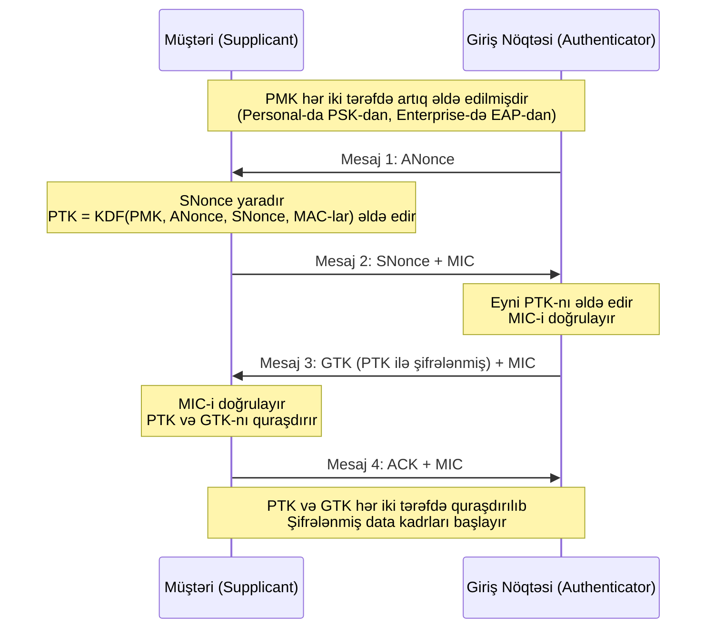

# Simsiz Şəbəkə Təhlükəsizliyi

## Bu nə üçün önəmlidir

Simsiz rabitə insanların müəssisə şəbəkələrinə qoşulmasının standart üsuludur. Noutbuklar, telefonlar, planşetlər, IoT sensorları, konfrans otaqlarının displeyləri və istehsalat sahəsi cihazları demək olar ki, artıq divara qoşulmur. Radio siqnalı binanın xarici divarında dayanmır: üçüncü mərtəbədəki stola çatan eyni RF enerjisi dayanacağa, səkiyə və yaxınlıqdakı yaşayış binalarına da çatır. Hücumçunun autentifikasiya protokolunu sınamağa başlamaq üçün qapı keçid kartını, təhlükəsizlik keşikçisini və ya perimetr firewall-ını keçmək lazım deyil — onlar yalnız antenna diapazonunda olmalıdırlar.

Bu təhdid modelini üç konkret şəkildə dəyişir. Birincisi, giriş nöqtəsini (AP) tərk edən hər kadrı uyğun radiosu olan istənilən düşmən müşahidə edə bilər, ona görə də məxfilik üzrə yeganə mənalı nəzarət kriptoqrafik protokolun özüdür. İkincisi, hücumçu korporativ şəbəkə ilə eyni SSID reklam edən sahte AP qurub müştəriləri onunla əlaqələndirməyə məcbur edə bilər, ona görə də server tərəfli autentifikasiya müştəri tərəfli qədər önəmlidir. Üçüncüsü, sahənin RF xüsusiyyətləri — divarlar, maneə, kanal sıxlığı, qonşu AP-lər — həm qanuni istifadəçi təcrübəsini, həm də hücumçu imkanını formalaşdırır, ona görə də simsiz təhlükəsizlik yalnız protokol məsələsi deyil, antenna və sahə tədqiqi məsələsidir.

Bu dərs protokol nəsilləri (WEP, WPA, WPA2, WPA3), onların üzərində oturan autentifikasiya çərçivələri (PSK, SAE, RADIUS ilə 802.1X, EAP ailəsi), tarixən simsiz yerləşdirmələri zəiflədən rahatlıq protokolları (WPS, captive portallar) və protokol qatının həqiqətən vəd etdiyini çatdıracağını təyin edən fiziki qat təcrübələrini — sahə tədqiqləri, istilik xəritələri, Wi-Fi analizatorları, kanal örtükləri, WAP yerləşdirilməsi və kontroller sərtləşdirilməsini — əhatə edir. Nümunələr xəyali `example.local` təşkilatını və `EXAMPLE\` domenini istifadə edir; port nömrələri, RFC istinadları və alqoritm adları verilib ki, dərs sahə istinadı kimi də xidmət etsin.

## Əsas anlayışlar

Simsiz təhlükəsizlik təbəqəli problemdir. Kriptoqrafik ilkin element (RC4, AES, GCMP) altda oturur. Açar qurma mexanizmi (PSK, SAE, 4 addımlı əl sıxma) onun üzərində sessiya açarları üzrə razılaşır. Autentifikasiya çərçivəsi (EAP, 802.1X, RADIUS) ilk növbədə əl sıxmaya kimin çata biləcəyinə qərar verir. RF dizaynı siqnalın hara getdiyini və sahte siqnalların harada görünə biləcəyini təyin edir. Bütün dörd qat düzgün olmalıdır; hər hansı bir zəif qat qalanını dağıdır.

### Protokol nəsilləri — WEP, WPA, WPA2, WPA3

Wi-Fi təhlükəsizliyinin tarixi icmanın əvvəlki nəslin nəyi səhv etdiyini öyrənməsi ilə pozulmuş protokolların əvəz olunması tarixidir. Hər nəsildəki qüsurları anlamaq tarixi maraq deyil — köhnə protokollar hələ də istehlakçı avadanlığında, köhnə müəssisə AP-lərində və köhnə sənaye cihazlarında işləyir və onların hər biri öhdəlikdir.

**WEP (Wired Equivalent Privacy)** 802.11-1997 ilə göndərilən ilk Wi-Fi şifrələmə standartı idi. WEP 64-bitlik və ya 128-bitlik açarla RC4 axın şifrəsini istifadə edir, burada effektiv açar 40 və ya 104 bitdir, hər kadrın başlığında açıq şəkildə ötürülən 24-bitlik başlanğıc vektoru (IV) ilə birləşdirilir. 24-bitlik IV məkanı yalnız 16,777,216 dəyərdir ki, məşğul şəbəkə onu saatlar içində tükəndirir; IV-lər təkrarlananda əsas RC4 açarına qarşı statistik hücumlar trivial olur. `aircrack-ng` kimi alətlər aktiv şəbəkədə bir neçə dəqiqəlik tutulmuş trafikdən 128-bitlik WEP açarını bərpa edə bilər. WEP müasir mənada nə məxfilik, nə də bütövlük təklif edir və tədris laboratoriyası xaricində heç bir şəbəkədə yeri yoxdur.

**WPA (Wi-Fi Protected Access)** 2003-cü ildə WPA2 yekunlaşdırılarkən keçid həll kimi buraxıldı. WPA RC4-ü şifr kimi saxladı, lakin onu sabit əsas açardan və ardıcıllıq sayğacından hər paket üçün təzə açar yaradan **Müvəqqəti Açar Bütövlük Protokolu (TKIP)** ilə sarıdı və pozulmanı aşkar etmək üçün **Michael** mesaj bütövlük kodunu əlavə etdi. TKIP təkmilləşmə idi, lakin mövcud WEP dövrü avadanlığında işləmək üçün nəzərdə tutulmuşdu, ona görə də əsas şifr hələ də RC4 idi və TKIP-ə qarşı praktiki hücumlar bir neçə il ərzində nəşr olundu. WPA həmçinin əvvəlcədən paylaşılan açarlara alternativ olaraq EAP əsaslı autentifikasiyanı təqdim etdi. WEP kimi, WPA də köhnəlmişdir; hər ikisi Security+ tarixi qeydlərində sadalanır, lakin yerləşdirilməməlidir.

**WPA2** (IEEE 802.11i, 2004) RC4/TKIP-i **AES**-in **CCMP (Counter Mode with Cipher Block Chaining-Message Authentication Code Protocol)**-də istifadəsi ilə əvəz etdi. AES-CCMP həm məxfilik (AES counter rejimi), həm də bütövlük (CBC-MAC) təmin edir və AES özü praktiki zəifləmə olmadan iki onilliklik kriptoanalitik diqqətə dözüb. WPA2 iki növdə mövcuddur: **WPA2-Personal** (həmçinin WPA2-PSK adlanır) əvvəlcədən paylaşılan parolu, adətən 8-dən 63 ASCII simvoluna qədər, SSID ilə birləşdirərək cüt master açarını əldə edir; **WPA2-Enterprise** PSK-ni mərkəzi servisə qarşı 802.1X autentifikasiyası ilə əvəz edir. WPA2 hələ də planetdə ən geniş yerləşdirilmiş simsiz təhlükəsizlik protokoludur, lakin onun iki əhəmiyyətli zəifliyi var: 4 addımlı əl sıxma tutulub PSK-ya qarşı oflayn kobud güc tətbiq edilə bilər və o, irəli gizliliyi təmin etmir — kompromis edilmiş PSK hücumçuya həmin şəbəkədə qeydə alınmış hər keçmiş və gələcək sessiyanı şifrəni açmağa imkan verir. KRACK zəifliyi (2017) göstərdi ki, hətta əl sıxmanın özü də müəyyən şərtlərdə açarların yenidən quraşdırılmasına məcbur edilə bilər, baxmayaraq ki, bu müştəri yığınlarında yamaqlanıb.

**WPA3** (2018-də buraxılıb) WPA2 zəifliklərini həll edir. WPA3-Personal PSK plus 4 addımlı əl sıxmanı **Equals-in Eyni Zamanda Autentifikasiyası (SAE)** ilə əvəz edir, bu oflayn lüğət hücumlarına davamlı və irəli gizliliyi təmin edən Dragonfly əsaslı açar mübadiləsidir — əl sıxmanın tutulması artıq hücumçuya heç nə faydalı verir. WPA3-Enterprise müasir ilkin elementlərlə 192-bitlik təhlükəsizlik rejimini əlavə edir:

- **Autentifikasiya edilmiş şifrələmə:** 256-bitlik Galois/Counter Mode Protocol (GCMP-256)
- **Açar əldə etmə və təsdiqləmə:** SHA-384 ilə 384-bitlik HMAC
- **Açar qurma və autentifikasiya:** 384-bitlik əyri üzərində Elliptic Curve Diffie-Hellman (ECDH) və ECDSA
- **Güclü idarəetmə kadr qorunması:** 256-bitlik Broadcast/Multicast Integrity Protocol Galois Message Authentication Code (BIP-GMAC-256)

WPA3 həmçinin Qorunan İdarəetmə Kadrlarını (PMF) məcburi edir, bu WPA2-yə qarşı trivial şəkildə asan olan deautentifikasiya və ayrılma hücumlarının qarşısını alır. WPA3 Enhanced Open açıq şəbəkələrdə fürsətli şifrələməni təmin edir — parol yoxdur, lakin passiv qulaq asmaya qarşı hələ də AES qorunması — WPA2 dövrünün tamamilə şifrələnməmiş "qonaq Wi-Fi"sinı əvəz edir.

### Autentifikasiya çərçivələri — PSK, SAE və 4 addımlı əl sıxma

Wi-Fi autentifikasiyası iki dünyaya ayrılır. **Personal rejim** şəbəkədəki hər kəs tərəfindən bilinən paylaşılan sirdən istifadə edir. **Enterprise rejim** mərkəzi serverə qarşı autentifikasiya edilmiş istifadəçi başına kimliklərdən istifadə edir. Personal sadədir; enterprise təhlükəsizdir.

**PSK (Əvvəlcədən Paylaşılan Açar)** bütün şəbəkə üçün bir parola malikdir. AP və müştəri hər ikisi bunu bilir; parol plus SSID **Cüt Master Açarını (PMK)** istehsal etmək üçün PBKDF2-dən keçirilir. Sonra 4 addımlı əl sıxma PMK-dan və iki təsadüfi nonce-dan sessiya başına **Cüt Müvəqqəti Açar (PTK)** əldə edir. PSK ev şəbəkəsi üçün yaxşıdır; bir neçə nəfərdən çox insanın parolu bildiyi istənilən mühitdə PSK öhdəlik olur, çünki parolu heç vaxt bilən hər kəs əl sıxmanı tutsalar trafik şifrəsini aça bilər və şəxsin girişini başqaları üçün açarı dəyişmədən ləğv etmək yolu yoxdur.

**SAE (Equals-in Eyni Zamanda Autentifikasiyası)**, RFC 7664-də göstərilib, WPA3-Personal-ın PSK üçün əvəzetməsidir. SAE Dragonfly açar mübadiləsini istifadə edir — hər iki tərəfin parolu bildiyini onu və ya oflayn brute-force tətbiq edilə bilən törəməsini heç vaxt ötürmədən sübut edən parol autentifikasiyası açar razılığı. SAE hər sessiya üçün təzə elliptik əyri Diffie-Hellman mübadiləsi icra etdiyinə görə hər sessiya müstəqil açarlara malikdir: parolun kompromis olunması keçmiş sessiyaları şifrəni açmır və tutulmuş SAE mübadiləsi oflayn hücumçuya faydalı heç nə vermir. SAE eşit-eşit protokoldur, ona görə də mərkəzi autentifikasiya serverini tələb etmir və ev və kiçik ofis yerləşdirilmələrinə təbii uyğun gəlir. RFC 7664 vaxt yan kanalların qarşısını almaq üçün `k` təhlükəsizlik parametrinin ən azı 40-a təyin edilməsini tövsiyə edir.

**4 addımlı əl sıxma** WPA2-də (və modifikasiyalarla WPA3-də) autentifikasiya addımından sonra işləyən açar təsdiqləmə rəqsidir. Hər iki tərəfin artıq bildiyi PMK-nı — Personal rejimdə PSK-dan, Enterprise rejimdə EAP mübadiləsindən əldə edilmiş — alır və sessiya açarını (PTK) plus yayımlama trafiki üçün qrup açarını (GTK) istehsal edir.

Dörd mesaj:

1. **Mesaj 1 (AP-dən Müştəriyə):** AP təsadüfi nonce (**ANonce**) yaradır və PMK-ya istinadla birlikdə müştəriyə göndərir.
2. **Mesaj 2 (Müştəridən AP-yə):** Müştəri öz nonce-sını (**SNonce**) yaradır, `PMK + ANonce + SNonce + MAC ünvanları`-dan PTK əldə edir və yeni PTK altında hesablanmış **Mesaj Bütövlük Kodu (MIC)** ilə SNonce-u geri göndərir. MIC müştərinin eyni PTK-nı əldə etdiyini sübut edir.
3. **Mesaj 3 (AP-dən Müştəriyə):** AP eyni PTK-nı əldə edir, müştərinin MIC-ini doğrulayır və öz MIC-i ilə birlikdə PTK altında şifrələnmiş **Qrup Müvəqqəti Açarı (GTK)** göndərir. GTK yayımlama və multicast kadrları üçün istifadə olunur.
4. **Mesaj 4 (Müştəridən AP-yə):** Müştəri son MIC ilə açarların quraşdırılmasını təsdiqləyir.

Mesaj 4-dən sonra hər iki tərəf PTK və GTK-nı quraşdırır və data kadrlarını şifrələməyə başlayır. Bütün mübadilə adətən bir neçə yüz millisaniyədə tamamlanır.

Əl sıxmanın təhlükəsizliyi PMK-nın məxfiliyinə dayanır. WPA2-PSK-da PMK parol və SSID-dən deterministik şəkildə əldə edilir, ona görə də əl sıxmanı tutmaq hücumçuya parol əleyhinə oflayn kobud güc hücumu qurmaq üçün lazım olan hər şeyi verir. `hashcat` və `aircrack-ng` kimi alətlər tam bunu edir və zəif parol (tutaq ki, 12 simvoldan qısa və ya lüğət sözü) müasir GPU-larda dəqiqələrdən saatlara düşür. WPA3-SAE parolun oflayn açıla bilən törəməsini heç vaxt istehsal etməyərək bu hücumu aradan qaldırır.

### EAP ailəsi — EAP, PEAP, EAP-FAST, EAP-TLS, EAP-TTLS

WPA2-Enterprise və WPA3-Enterprise-də PMK paylaşılan paroldan əldə edilmir — müştəri **EAP (Genişləndirilə Bilən Autentifikasiya Protokolu)** mübadiləsi vasitəsilə şəxsiyyətini sübut etdikdən sonra autentifikasiya serveri tərəfindən müştəriyə çatdırılır. EAP RFC 3748-də təyin edilmiş, müştəri (supplicant) və server (autentifikasiya serveri) arasında istənilən nəqliyyat vasitəsilə autentifikasiya mesajlarını ötürmək üçün çərçivədir. Wi-Fi-da nəqliyyat 802.1X-dir; telli şəbəkələrdə də 802.1X-dir; dial-up və PPP-də EAP PPP üzərində sürür.

EAP özü autentifikasiya metodu deyil — o, zərfdir. Faktiki autentifikasiya təhlükəsizlik və yerləşdirmə mürəkkəbliyi arasında müxtəlif kompromislərə malik bir çox EAP metodlarından birində baş verir.

**PEAP (Qorunan EAP)** daxili EAP mübadiləsini TLS tunelində sarıyır. Server sertifikatla müştəriyə autentifikasiya edir, TLS tuneli qurur və sonra müştəri tunel daxilində autentifikasiya edir — adətən MS-CHAPv2 (PEAP-MSCHAPv2) və ya EAP-GTC vasitəsilə istifadəçi adı və parolla. PEAP birgə Cisco/Microsoft/RSA spesifikasiyasıdır və geniş dəstəklənir. Onun əsas cəlbediciliyi müştərilərin yalnız server sertifikatına etibar etməsi; öz sertifikatlarına ehtiyac olmamasıdır. Əsas zəiflik onun yalnız daxili metod qədər güclü olmasıdır — MS-CHAPv2 məlum zəifliklərə malikdir — və o, yalnız müştəri server sertifikatını doğrulamağa ciddi şəkildə konfiqurasiya edildikdə təhlükəsizdir. İstənilən sertifikatı qəbul edən səhv konfiqurasiya edilmiş müştəri sahte AP və istənilən sertifikatı olan hücumçuya etimadnamələri yığmağa imkan verir.

**EAP-FAST (Təhlükəsiz Tunelləmə vasitəsilə EAP Çevik Autentifikasiya)**, RFC 4851, pozulmuş LEAP protokoluna əvəzetmə kimi Cisco tərəfindən təklif olunmuşdur. PEAP kimi, EAP-FAST daxili autentifikasiyanı işlətməzdən əvvəl TLS tuneli qurur, lakin server sertifikatı əvəzinə o, tuneli qurmaq üçün əvvəlcədən təchiz edilmiş paylaşılan sirr olan **Qorunan Giriş Etimadnaməsi (PAC)** istifadə edir. Bu sertifikat həyat dövrü yükünü aradan qaldırır, lakin problemi özü də təhlükəsiz şəkildə həyata keçirilməli olan PAC təchizatına yönəldir.

**EAP-TLS**, RFC 5216, ən güclü ümumi EAP metodudur. Həm server, həm də müştəri bir-birinə X.509 sertifikatları ilə autentifikasiya edir; mübadilədə heç bir parol yoxdur. Sahte AP hücumu həyata keçirən hücumçu qarşılıqlı autentifikasiyanı tamamlaya bilməz, çünki onun etibarlı müştəri sertifikatı yoxdur və mübadiləni tutan hücumçu onu kobud güclə aça bilməz, çünki kobud güclə açılacaq heç nə yoxdur. EAP-TLS WPA2/WPA3-Enterprise üçün qızıl standartdır və sıfır etibar şəbəkə dizaynlarında getdikcə daha çox standarta çevrilir. Xərc sertifikat həyat dövrü idarəetməsidir — hər müştəri cihazına sertifikat lazımdır və həmin sertifikatlar verilməli, yenilənməli və ləğv edilməlidir. Müasir müəssisə MDM platformaları (Intune, Jamf) bunun çoxunu avtomatlaşdırıb.

**EAP-TTLS (Tunellənmiş TLS)** orta yoldur. Server sertifikatla müştəriyə autentifikasiya edir, TLS tuneli qurur; müştəri sonra tunel daxilində istənilən köhnə metoddan istifadə edərək autentifikasiya edir — PAP, CHAP, MS-CHAP, MS-CHAPv2. Müştəri sertifikatları dəstəklənir, lakin tələb olunmur, bu da hər müştəriyə sertifikat yayma praktiki olmayan hallarda EAP-TTLS-i EAP-TLS-dən daha asan yerləşdirilə bilən edir. Təhlükəsizlik xüsusiyyətləri PEAP-a bənzərdir: tunel daxili mübadiləni qulaq asmadan və MITM-dən qoruyur, bir şərtlə ki, müştəri server sertifikatını ciddi şəkildə doğrulamaq üçün konfiqurasiya edilmiş olsun.

Yeni yerləşdirmələr üçün praqmatik sıralama: sertifikat idarəetməsi mümkün olan yerdə **EAP-TLS**, mümkün olmadığı yerdə **PEAP-MSCHAPv2** və ya **EAP-TTLS-MSCHAPv2**, Cisco infrastrukturunun tövsiyə etdiyi yerdə **EAP-FAST** və heç vaxt LEAP və ya çılpaq EAP-MD5.

### 802.1X və RADIUS federasiyası — supplicant, authenticator, autentifikasiya serveri

**IEEE 802.1X** EAP mesajlarını müştəri və autentifikasiya serveri arasında şəbəkə cihazı (AP və ya switch) vasitəsilə daşıyan port əsaslı autentifikasiya standartıdır. O, üç rol təyin edir:

- **Supplicant:** Şəbəkə girişi istəyən müştəri cihazı. Wi-Fi-da bu WPA2/WPA3-Enterprise profili işlədən noutbuk, telefon və ya IoT cihazıdır.
- **Authenticator:** Portu idarə edən şəbəkə cihazı — simsiz giriş nöqtəsi və ya telli kənar switch. O, autentifikasiya uğurlu olana qədər portda bütün EAP olmayan trafiki bloklayır, sonra portu normal trafik üçün açır.
- **Autentifikasiya serveri:** Həqiqətən etimadnamələri doğrulayan server. Bu bu gün demək olar ki, həmişə **RADIUS (Remote Authentication Dial-In User Service)** serveridir, adətən Active Directory, LDAP və ya EAP-TLS üçün sertifikat orqanı ilə dəstəklənir.

Wi-Fi-da axın: supplicant AP ilə əlaqələnir, AP portu bloklanmış vəziyyətdə saxlayır. AP supplicant-a EAP-over-LAN (EAPoL) kadrları göndərir, o da kimliyi ilə cavab verir. AP EAP mesajlarını RADIUS paketlərində inkapsulyasiya edir və telli tərəfdəki RADIUS serverinə yönləndirir. RADIUS serveri seçilmiş EAP metodunu öz kimlik mağazasına qarşı işə salır və nəhayət ya Access-Accept (AP-nin 4 addımlı əl sıxma üçün istifadə edə biləcəyi əldə edilmiş PMK ilə) və ya Access-Reject qaytarır. AP ya portu açır, ya da müştərini uzaqda saxlayır.

**RADIUS federasiyası** bu modeli inzibati domenlər arasında genişləndirir. Kanonik nümunə **eduroam**-dır — iştirakçı universitetdən olan tələbənin iştirakçı olan hər hansı digər universitetin Wi-Fi-sında evdəki etimadnamələrindən istifadə edərək autentifikasiya etməsinə imkan verən təhsil rouminq xidmətidir. RADIUS proxy-lərinin zənciri autentifikasiya sorğusunu ziyarət edilmiş müəssisədən çoxqatlı federasiya vasitəsilə evdəki müəssisəyə yönləndirir. Etimadnamələr bir neçə şəbəkədən keçdiyi üçün eduroam sertifikatlar və tunellər istifadə edən EAP metodlarını (EAP-TTLS, PEAP və ya EAP-TLS) məcburi edir ki, ara RADIUS serverləri heç vaxt həqiqi etimadnamə materialını görməsin. Oxşar federasiyalar sağlamlıqda (ScienceDMZ kimlik federasiyaları), araşdırmada və bəzi böyük müəssisə konqlomeratlarında mövcuddur.

### Rahatlıq protokolları — WPS və captive portallar

Qeyri-texniki istifadəçilər üçün asanlaşdırmaq üçün Wi-Fi-a iki xüsusiyyət əlavə edildi və hər ikisi təhlükəsizlik öhdəliklərinə çevrildi.

**WPS (Wi-Fi Qorunan Quraşdırma)** ev istifadəçilərinin router-də düyməni basmaqla və ya 8 rəqəmli PIN daxil etməklə Wi-Fi şəbəkəsinə qoşulmasına imkan vermək üçün dizayn edilmişdir. PIN metodu fəlakət idi. WPS protokolu 8 rəqəmli PIN-i müstəqil olaraq kobud güclə açıla bilən iki yarıya bölür, effektiv axtarış məkanını 10^8-dən 10^4 + 10^3-ə qədər azaldır (son rəqəm çek cəmidir). **Reaver** adlı alət bir neçə saat ərzində WPS PIN-ini bərpa edə bilər və PIN-i bərpa etmək tam WPA/WPA2 parolunu verir. Hər Wi-Fi Alliance sertifikatlı router illərlə default olaraq WPS aktiv idi, bu o demək idi ki, belə bir router-də güclü parolla WPA2-ni aktiv etmək hələ də şəbəkəni zəif buraxırdı. Yeganə effektiv zəiflətmə WPS-i tamamilə deaktiv etməkdir. Wi-Fi Alliance WPS-i PIN zəifliyi olmadan cihazları təchiz etmək üçün QR kodları və açıq açar kriptoqrafiyası istifadə edən **Wi-Fi Easy Connect** (həmçinin DPP, Device Provisioning Protocol) ilə əvəz etdi.

**Captive portallar** otellərin, kofe barların və hava limanlarının Wi-Fi girişini idarə etmək üçün istifadə etdiyi "xidmət şərtlərini qəbul edin və Qoşul düyməsini basın" səhifələridir. Texniki cəhətdən, captive portal HTTP səviyyəsində tutulmadır: AP DHCP, DNS və HTTP trafikinə icazə verir, lakin istifadəçi operatorun tələb etdiyi hər hansı yoxlamanı (şərtləri qəbul etmək, otaq nömrəsi daxil etmək, ödəniş etmək, e-poçt ünvanını təmin etmək) tamamlayana qədər hər HTTP sorğusunu yerli autentifikasiya səhifəsinə yönləndirir. Captive portallar şifrələmə mexanizmi deyil — alt Wi-Fi çox vaxt tamamilə açıqdır, bu o deməkdir ki, eyni şəbəkədə olan hər kəs trafikə qulaq asa bilər. Captive portalın özü HTTPS üzərində olsa belə, link qatında şifrələmənin olmaması eyni şəbəkədə olan zərərli aktorun HTTPS-i məcbur etməyən saytlara trafiki tutmasına imkan verir. WPA3 Enhanced Open captive portalın altında oturan və istifadəçi etimadnaməsi tələb etmədən bu boşluğu bağlayan fürsətli link qatı şifrələməsini təmin edir.

### Fiziki və RF dizayn — sahə tədqiqləri, istilik xəritələri, analizatorlar, kanal örtükləri, yerləşdirmə

Simsiz təhlükəsizlik yalnız protokol problemi deyil. Radio siqnalı hücum səthidir və həmin siqnalın necə formalaşdırıldığı — harada çatdığı, harada rəqib siqnalların göründüyü, hər nöqtədə nə qədər güclü olduğu — həm istifadəçi təcrübəsini, həm də hücumçu imkanını təyin edir.

**Sahə tədqiqləri** obyektdə RF şəraitinin sistemli xəritələşdirilməsidir. **Proqnozlaşdırıcı tədqiqat** mərtəbə planına, divar materiallarına və planlaşdırılan AP mövqelərinə əsaslanaraq siqnal yayılmasını modelləşdirmək üçün proqram təminatı istifadə edir. **Sahədə tədqiqat** (həmçinin doğrulama və ya passiv tədqiqat adlanır) yerləşdirmədən sonra faktiki siqnal gücünü ölçür, nəticəni proqnoza uyğun xəritələndirir. Tədqiqatlar konkret nəticələr istehsal edir: AP yerləşdirilməsi, kanal tapşırıqları, güc səviyyələri, antenna növləri və gözlənilən əhatə dairəsi. Onlar həmçinin sahte AP-ləri aşkar edirlər — korporativ şəbəkədə SSID yayımlayan icazəsiz cihazları — bu özü böyük mülklərdə təkrarlanan təhlükəsizlik hadisəsidir.

**İstilik xəritələri** tədqiqatın üstündə vizuallaşdırma qatıdır. İstilik xəritəsi mərtəbə planını hər nöqtədə qəbul edilmiş siqnal gücü göstəricisini (RSSI), siqnal-səs-küy nisbətini (SNR) və ya buraxma qabiliyyətini göstərən dərəcəli rəng miqyası ilə örtür. Zəif siqnal zonaları başqa AP-yə ehtiyacı olan boşluqlar kimi görünür; gözlənilməyən yerlərdəki güclü siqnal zonaları (dayanacaqlar, qonşu ofislər) hücumçuların rahat oturub sınaya biləcəyi yerləri göstərir.

**Wi-Fi analizatorları** ölçmələri istehsal edən alətlərdir. Wi-Fi analizatoru RF cihazıdır — bəzən xüsusi aparat aləti, bəzən uyğun kartı və Ekahau, NetSpot və ya WiFi Explorer kimi proqram təminatı olan noutbuk — siqnal gücü, kanal işğalı, maneələr, bikon nisbətləri və yaxınlıqdakı SSID-lər haqqında məlumat verir. Analizatorlar həmçinin sahte AP-ləri və səhv konfiqurasiya edilmiş qonşuları aşkar etmək üçün əsas alətdir.

**Kanal örtükləri** Wi-Fi kanallarının üst-üstə düşməsi faktını həll edir. 2.4 GHz diapazonunda əksər nizamlama domenlərində 11 kanal təyin olunub, hər biri 20 MHz genişliyindədir, lakin yalnız 5 MHz aralıqla yerləşdirilib. Standart 20 MHz yerləşdirmədə yalnız 1, 6 və 11 kanalları həqiqətən üst-üstə düşmür; hər hansı digər kanal tapşırığı hər kəs üçün buraxma qabiliyyətini pisləşdirən kanal-kanal maneəsinə səbəb olur. 5 GHz diapazonunda daha çox üst-üstə düşməyən kanal var (təqribən 24, nizamlama domenindən və DFS kanallarının istifadədə olub-olmamasından asılı olaraq), bu səbəbdən əksər müasir müəssisə yerləşdirilmələri mümkün olan yerdə müştəriləri 5 GHz-yə itələyir. 6 GHz diapazonu (Wi-Fi 6E) başqa böyük təmiz spektr bloku əlavə edir, lakin yalnız WPA3 uyğun müştərilər tərəfindən istifadə oluna bilər.

**WAP yerləşdirilməsi** RF əhatə dairəsini güc və telli şəbəkə mövcudluğu ilə balanslaşdırır. AP-yə Ethernet (adətən PoE) və maneəsiz quraşdırma nöqtəsi lazımdır; optimal RF əhatə dairəsi AP-ni tavanın ortasına qoya bilər, lakin Ethernet tökmə yalnız dəhlizdə mövcuddur. Mesh Wi-Fi genişləndiricilər telli yuxarı bağlantı olmadan AP-lər arasında RF-i ötürür; onlar ev və kiçik ofis istifadəsi üçün rahatdır, lakin hər hoppuşda mövcud buraxma qabiliyyətini yarıya endirirlər, ona görə də müəssisə üçün nadir hallarda uyğundur. Sırf əhatə dairəsindən başqa, yerləşdirmə həmçinin təhlükəsizliyə təsir edir: xarici divara yaxın quraşdırılmış AP dayanacağa və küçəyə istifadə edilə bilən siqnalı uzadır və binanın xaricində oturan hücumçulara rahat işləmə mövqeyi verir.

### Kontroller və AP sərtləşdirilməsi

Müəssisə Wi-Fi adətən mərkəzi olaraq AP parkını idarə edən **simsiz LAN kontrolleri (WLC)** altında işləyir. Kontroller cəlbedici hədəfdir: bir kompromis edilmiş kontroller hər AP və hər əlaqəli müştəridir. Onun sərtləşdirilməsi vacibdir.

- **Fiziki təhlükəsizlik:** İctimaiyyətin çatacağı və ya nəzarətsiz xarici yerlərdə quraşdırılmış AP-lər korlama hədəfləridir. Fiziki girişi olan hücumçu AP-ni fabrik ayarlarına qaytara, keşlənmiş açarları oxuya və ya sahte ilə əvəz edə bilər. AP-ləri əl çatmaz yerə quraşdırın, konsol portlarını möhürləyin və gözlənilməyən yenidən yüklənmələrə xəbərdarlıq edin.
- **İdarəetmə müstəvisi:** Kontroller və AP-lər şəbəkə üzərindən idarə olunur. İdarəetmə girişini xüsusi idarəetmə VLAN-ına məhdudlaşdırın, SSH və HTTPS istifadə edin (heç vaxt Telnet və ya adi HTTP), MFA ilə güclü admin etimadnamələrini məcburi edin və idarəetmə jurnallarını mərkəzi SIEM-ə göndərin.
- **Proqram təminatı:** AP və kontroller satıcıları həm funksional səhvləri, həm də təhlükəsizlik zəifliklərini yamaqlayan proqram yeniləmələri dərc edir. Məsləhətləri izləyin, laboratoriyada yeniləmələri sınayın və onları qrafikə uyğun yayın. Köhnə, zəif versiyaya proqram təminatının endirilməsi açıq səlahiyyət tələb etməlidir.
- **Sahte AP aşkarlanması:** Kontrollerlər qonşu RF-də naməlum SSID-lər və icazəsiz AP-lər üçün skan edə bilər. Xüsusiyyəti aktivləşdirin, onu obyektə uyğunlaşdırın və hər xəbərdarlığı araşdırın — bir çox sahte AP zərərsizdir (istifadəçi şəxsi səyahət router-ini gətirib) amma hərdən biri hücumçudur.
- **Evil twin qarşısının alınması:** Hücumçu sahte AP-dən korporativ SSID klonunu yayımlaya bilər. SSID-ə avtomatik qoşulmaq üçün konfiqurasiya edilmiş müştərilər hansı AP ən güclüdürsə onunla əlaqələnəcək. Ciddi server sertifikatı doğrulaması ilə WPA2/WPA3-Enterprise bunu məğlub edir, çünki sahtəkar etibarlı server sertifikatı təqdim edə bilməz; WPA2-PSK əlavə nəzarətlər olmadan onu məğlub etmir.
- **Qorunan İdarəetmə Kadrları (PMF):** WPA3 PMF-i məcburi edir, bu da hücumçuların qanuni AP-dən və sahtəkara müştəriləri məcbur etmək üçün istifadə etdiyi sahtələşdirilmiş deauth/ayrılma kadrlarının qarşısını alır. WPA2 yerləşdirmələrində keçid rejimində PMF-i aktivləşdirin və WPA3-də tələb edin.
- **Müştəri izolyasiyası:** Qonaq şəbəkələrində müştəri izolyasiyasını aktivləşdirin ki, əlaqəli müştərilər 2-ci qatda bir-birinə çata bilməsinlər. Bu, yoluxmuş qonaq cihazından yanal hərəkəti məhdudlaşdırır.
- **Sürət məhdudlaşdırılması və DoS qorunması:** Bikon daşqınları, əlaqə daşqınları və deautentifikasiya daşqınları ucuz aparatdan asan hücumlardır. Kontrollerlərdə bu kadr növləri üçün sürət limitləri var; onları aktivləşdirin.

## 4 addımlı əl sıxma diaqramı

Aşağıdakı ardıcıllıq WPA2 4 addımlı əl sıxmasının dörd mesajını, hər addımda axan və əldə edilən açar materialı ilə göstərir. WPA3-SAE PMK əldə etmə addımını əvəz edir, lakin eyni dörd mesajlı quruluşu qoruyur.



Açar material xülasəsi:

- **PMK (Cüt Master Açarı):** Sessiya üçün kök sirri. WPA2-PSK-da `PMK = PBKDF2(parol, SSID, 4096, 256)`. WPA2-Enterprise-də PMK EAP mübadiləsindən sonra RADIUS serveri tərəfindən çatdırılır.
- **ANonce / SNonce:** Sessiya başına təzə açar əldə etməyi təmin etmək üçün hər tərəfdən bir, təsadüfi 256-bitlik dəyərlər.
- **PTK (Cüt Müvəqqəti Açar):** `PMK + ANonce + SNonce + AP MAC + Müştəri MAC`-dan əldə edilən sessiya başına açar. Açar təsdiqləmə açarına (KCK), açar şifrələmə açarına (KEK) və data şifrələməsi üçün müvəqqəti açarlara bölünür.
- **GTK (Qrup Müvəqqəti Açarı):** AP-də bütün müştərilər tərəfindən paylaşılan yayımlama/multicast açarı. AP tərəfindən dövri olaraq yenilənir.
- **MIC (Mesaj Bütövlük Kodu):** PTK biliyini sübut edən açarlı haş autentifikasiya etiketi.

## Praktiki təmrinlər

Nəzarət olunan laboratoriyada işləyən beş təmrin. Yalnız sahib olduğunuz və ya açıq yazılı icazəniz olan şəbəkələrdə trafik tutun.

### 1. Wireshark ilə WPA2 əl sıxmasını tutun

Laboratoriya AP-ni məlum parolla WPA2-PSK-ya təyin edin. İkinci maşının Wi-Fi adapterini monitor rejiminə keçirin və `eapol` üzrə filtrləyərək Wireshark başladın. Wi-Fi-ı onda yandırıb söndürməklə müştərini yenidən əlaqələndirməyə məcbur edin və dörd EAPoL-Key kadrını tutun.

```bash
# Adapteri monitor rejiminə keçir
sudo airmon-ng check kill
sudo airmon-ng start wlan0
# Hədəf kanala və SSID-ə kilidlənin
sudo airodump-ng --bssid AA:BB:CC:DD:EE:FF -c 6 -w handshake wlan0mon
# Başqa terminalda müştərini yenidən autentifikasiyaya məcbur edin
sudo aireplay-ng --deauth 5 -a AA:BB:CC:DD:EE:FF wlan0mon
```

Cavab: Tutmada hansı EAPoL-Key kadrları görünür və hansı sahələr ANonce, SNonce və MIC-i daşıyır? Tutmaya qarşı `aircrack-ng -w /usr/share/wordlists/rockyou.txt handshake-01.cap` işə salın. Parol kiçik hərflərlə 8 simvoldursa nə baş verir? Təsadüfi yaradılan 20 simvollu sətirsə nə baş verir? İki nəticə arasındakı fərq WPA3-SAE üçün təhlükəsizlik arqumentidir.

### 2. WPA3-SAE-də SAE davranışını doğrulayın

Laboratoriya AP-ni WPA3-Personal (yalnız SAE, keçid rejimi deyil) üçün konfiqurasiya edin. Tutma təmrinini təkrarlayın və eyni parol kobud gücünü işə salın.

```bash
# Əvvəlki kimi eyni airodump-ng tutması
sudo airodump-ng --bssid AA:BB:CC:DD:EE:FF -c 6 -w sae-capture wlan0mon
# Açmağa cəhd edin
hashcat -m 22000 sae-capture.hc22000 /usr/share/wordlists/rockyou.txt
```

Cavab: Hashcat nə üçün SAE tutmasından istifadəyə yararlı haşı çıxarmaqdan imtina edir və ya uğursuz olur? WPA3 keçid rejiminin (WPA2/WPA3 qarışıq) müştərilər WPA2-ni qəbul edəcəyi təqdirdə endirmə hücumuna hələ də həssas olduğunu təsdiqləyin. AP-ni yalnız SAE edən konfiqurasiyanı sənədləşdirin.

### 3. RADIUS və EAP-TLS ilə 802.1X konfiqurasiya edin

Linux VM-də FreeRADIUS server qurun, daxili CA-dan server sertifikatı və müştəri sertifikatı verin və WPA2-Enterprise və ya WPA3-Enterprise autentifikasiyası üçün laboratoriya AP-sini RADIUS serverinə yönəltmək üçün konfiqurasiya edin.

```conf
# /etc/freeradius/3.0/clients.conf
client example-ap {
    ipaddr = 10.0.0.10
    secret = SharedSecretFromAP
}

# /etc/freeradius/3.0/mods-enabled/eap fraqmenti
eap {
    default_eap_type = tls
    tls-config tls-common {
        private_key_file = /etc/freeradius/certs/server.key
        certificate_file = /etc/freeradius/certs/server.pem
        ca_file = /etc/freeradius/certs/ca.pem
        verify { check_crl = yes }
    }
}
```

Müştəri sertifikatını və CA-nı sınaq noutbukuna quraşdırın, SSID-ə qoşulun və RADIUS sazlama jurnalına baxın (`radiusd -X`). Cavab: Hansı EAP-TLS mesajları görünür? Müştəri sertifikatını silsəniz nə baş verir? Server sertifikatı müştərinin etibar etmədiyi CA tərəfindən imzalanıbsa nə baş verir?

### 4. Kiçik ofisin istilik xəritəsi tədqiqatını aparın

Otaq və ya mərtəbəni tədqiq etmək üçün Ekahau Heatmapper, NetSpot və ya oxşar proqramı istifadə edin. Proqram hər nöqtədə siqnal gücünü qeyd edərkən məkanı gəzin, sonra yaradılmış istilik xəritəsinə baxın.

Cavab: Əhatə boşluqları haradadır? Siqnal onun çatmamalı olduğu yerlərə haradan sızır (yanındakı ofislər, dayanacaq)? Hücumçu rahatlıqla harada otura bilər? Qanuni əhatəyə zərər vermədən siqnal sızmasını azaldan AP yerləşdirilməsi, kanal tapşırığı və ya ötürmə gücündə bir dəyişiklik təklif edin.

### 5. Sahte AP-ni aşkar edin

Laboratoriyanın qanuni şəbəkəsi ilə eyni SSID-i yayımlamaq üçün ikinci AP-ni (və ya noutbukda `hostapd` ilə USB Wi-Fi donqlunu) konfiqurasiya edin. Onu tapmaq üçün əsas kontrollerın sahte AP aşkarlanma xüsusiyyətini (və ya Wi-Fi analizatorunu) istifadə edin.

```conf
# Sahtədə hostapd.conf
ssid=example-corp
hw_mode=g
channel=6
wpa=2
wpa_passphrase=GuessMe
wpa_key_mgmt=WPA-PSK
```

Cavab: Kontroller qanuni SSID-i yayımlayan yeni BSSID-ı nə qədər tez aşkar edir? O, xəbərdarlıq yaradır, avtomatik karantinə alır və ya sadəcə jurnala salır? Sahtəkar korporativ şəbəkə ilə eyni SSID-i, lakin fərqli BSSID-ı yayımlasaydı nə dəyişərdi, əgər tamamilə fərqli SSID-i yayımlasaydı nə olardı? Müəssisə noutbukunun sahtəkara əlaqələnməsinə müştəri tərəfindəki hansı konfiqurasiya mane olur?

## İşlənmiş nümunə — `example.local` WPA2-PSK-dan EAP-TLS ilə WPA3-Enterprise-ə keçir

`example.local` üç ofis binası, anbarı və pərakəndə satış zalını idarə edir. Simsiz hər beş sahəyə qərargahdakı mərkəzi kontroller ilə yerləşdirilib, ümumilikdə təxminən 180 AP və 2,500 gündəlik aktiv müştəri var. Cari vəziyyət qarışıqdır: əsas korporativ SSID **WPA2-PSK**-dır illik olaraq (pis şəkildə) fırlanan bir paylaşılan parolla, ayrı qonaq SSID-i captive portalla tamamilə açıqdır və anbar əl terminalları üçün üçüncü SSID ilə **WPA2-Enterprise + PEAP-MSCHAPv2** istifadə edir. Nüfuz testi aşağıdakıları qeyd etdi: WPA2-PSK parolu tutulmuş əl sıxmadan bulud GPU avadanlıqları üzərində 14 saatda kobud güclə açıldı, açıq qonaq Wi-Fi qonşu masadakı sınaqçıya şifrələnməmiş qonaq trafikini tutmağa imkan verdi və yaxşı niyyətli əməliyyat komandası üzvü tərəfindən WPS aktiv olan iki istehlakçı səviyyəli AP anbar switch avadanlığına qoşulmuş vəziyyətdə tapıldı. CISO altı aylıq simsiz sərtləşdirmə proqramına icazə verir.

**İnventar və əsas.** `EXAMPLE\netops` komandası hər AP (model, proqram təminatı, yer, SSID üzvlüyü), hər kontroller və hər müştəri növü üçün aktiv siyahısı istehsal edir. Wi-Fi analizatoru tətbiqi qonşu şəbəkələri, kanal sıxlığını və hər hansı naməlum BSSID-i sənədləşdirir. Üç sahte AP müəyyən edilir — WPS aktiv olan iki istehlakçı bölməsi və anbar otağında köhnə sınaq AP-si — və fiziki olaraq çıxarılır və ya karantinə alınır.

**Sertifikat infrastrukturu.** Daxili CA `EXAMPLE-CA` artıq LDAPS və daxili HTTPS üçün sertifikatlar verir. Yeni aralıq, `EXAMPLE-WIFI-CA`, xüsusi olaraq Wi-Fi autentifikasiyası üçün yaradılır — Wi-Fi sertifikatlarını digər müəssisə PKI-dən ayırmaq Wi-Fi komandasına digər xidmətlərə təsir etmədən fırlatmaq və ya ləğv etməyə imkan verir. RADIUS serverinə (`radius.example.local`, Ubuntu Server-də FreeRADIUS 3 işlədən) Wi-Fi CA-dan server sertifikatı verilir. `EXAMPLE\Intune`-də qeyd olunan hər idarə olunan son nöqtə cihaz qeydiyyatı zamanı SCEP vasitəsilə müştəri sertifikatı ilə təchiz edilir. BYOD cihazları korporativ Wi-Fi üçün əhatə dairəsindən kənardadır və xüsusi `example-byod` SSID-ə yönləndirilir (aşağıya baxın).

**Korporativ SSID miqrasiyası.** Yeni SSID, `example-corp`, `radius.example.local`-a yönəlmiş EAP-TLS ilə WPA3-Enterprise rejimində qaldırılır. WPA2-PSK işlədən köhnə `example-wifi` SSID-i keçid zamanı əməliyyatda saxlanılır. İstifadəçilər dalğalarla köçürülür: əvvəlcə IT şöbəsi (ən yaxşı sınaq nümunələri), sonra altı həftə ərzində biznes bölməsi üzrə. Son istifadəçi köçürüldükdə və bir həftə dəstək biletsiz keçdikdə köhnə SSID-i qaldırılır və onun parolu etibarsız edilir. EAP-TLS edə bilməyən müştərilər — köhnə printerlər, bir neçə təqdimat displeyi — istisna kimi PEAP-MSCHAPv2 ilə anbar üslubu SSID-ə köçürülür, sənədləşdirilir və vaxt məhduddur.

**Anbar əl terminalları.** Əl tarayıcıları EAP-TLS-i deyil, PEAP-ı dəstəkləyən köhnə Android versiyasını işlədir. Proqram ortasında cihaz yeniləməsini məcbur etmək əvəzinə anbar SSID-i PEAP-MSCHAPv2-də saxlanılır, lakin WPA3-Enterprise keçid rejiminə (WPA2/WPA3 qarışıq) köçürülür. Növbəti fiskal il üçün aparat yeniləməsi planlaşdırılır; bu nöqtədə tarayıcılar EAP-TLS-ə köçəcək. PEAP müştəri konfiqurasiyaları server sertifikatı doğrulamasını tələb etmək və Wi-Fi CA-nı sabitləmək üçün yenilənir — əvvəlki konfiqurasiya istənilən sertifikata etibar edirdi ki, bu da sahte AP-yə etimadnamələri yığmağa imkan verərdi.

**Qonaq SSID-i.** Açıq `example-guest` SSID-i həftəlik fırlanan və qeydiyyat masasında göstərilən parolla WPA3-Personal (SAE)-dəki `example-guest` ilə əvəz olunur; həqiqətən açıq girişə ehtiyacı olan yerlər üçün (pərakəndə satış zalı), **Wi-Fi Enhanced Open (OWE)** aktivləşdirilir ki, RF trafiki parol olmadan belə şifrələnsin. Captive portal qəbul edilə bilən istifadə təsdiqi üçün saxlanılır və ictimai CA-dan sertifikatla HTTPS arxasına köçürülür. Qonaq VLAN-ında müştəri izolyasiyası aktivləşdirilir ki, qonaqlar bir-birinə çata bilməsin.

**BYOD.** Yeni `example-byod` SSID-i `EXAMPLE\` AD hesablarına qarşı autentifikasiya edilmiş PEAP-MSCHAPv2 ilə WPA2-Enterprise-də qaldırılır, lakin VLAN ayrılmışdır və yalnız internetə çata bilər — daxili resurslara giriş yoxdur. Şəxsi cihazdan istifadə etmək istəyən işçilər buraya qoşulur.

**WPS və captive portallar.** Hər qalan AP WPS üçün yoxlanılır; WPS olan hər cihaz ya deaktiv etmək üçün yenidən konfiqurasiya olunur, ya da əvəz olunur. İstehlakçı AP-lər siyasətlə korporativ şəbəkədə qadağan edilir, telli portlarda 802.1X ilə məcburi edilir ki, yalnız səlahiyyətli switch və AP-lər idarəetmə VLAN-ında IP ünvan ala bilsin. Qonaq SSID-də captive portal laboratoriya sandbox VLAN-ına IoT cihazları gətirmək istəyən işçilər üçün Wi-Fi Easy Connect (DPP) QR kod iş axını ilə əvəz olunur.

**Kontroller və AP sərtləşdirilməsi.** Kontrollerlər və AP-lər yalnız şəbəkə əməliyyatları bastion-undan çatılan xüsusi idarəetmə VLAN-ına köçürülür. İdarəetmə AD-də `EXAMPLE\wifi-admins` qrupu vasitəsilə admin girişi üçün MFA məcburi edilməklə HTTPS və SSH üzərindədir. Proqram təminatı cari satıcı stabil buraxılışına yüksəldilir və məsləhətlər üçün izlənir. Sahte AP aşkarlanması korporativ SSID-də aktiv saxlama rejimində aktivləşdirilir — `example-corp`-u yayımlayan naməlum AP-lər avtomatik olaraq deautentifikasiya edilir, xəbərdarlıq SOC-ə göndərilir. PMF WPA3 SSID-lərində tələb olunur və köhnədə keçid rejimində aktivləşdirilir.

**Sahə tədqiqatı və RF tənzimləməsi.** Şəbəkə yeni formasında olduqdan sonra bütün beş yerdə təzə sahə tədqiqatı aparılır. Əsas ofisdə qonşu dayanacağa siqnal sızmasını azaltmaq üçün bir neçə AP köçürülür; xarici divarlara yaxın AP-lərdə ötürmə gücü fabrik standartından azaldılır; 2.4 GHz diapazonunda kanal tapşırıqları 1, 6 və 11-ə məcbur edilir (kontrollerin avtomatik tapşırığı zamanla 3 və 8-ə sürüşmüşdü ki, bu da kanal-kanal maneəsinə səbəb olurdu). Nəticə ölçülmüş buraxma qabiliyyətində 20% təkmilləşmə və xarici siqnal gücündə 3 dBm azalma olur.

**Doğrulama.** Altı ay sonra sonrakı nüfuz testi tutulacaq WPA2-PSK əl sıxmalarının olmadığını (SSID yoxdur), qonaq və BYOD SSID-lərində SAE tutmalarının kobud güclə açıla bilməyəcəyini, EAP-TLS SSID-inə etibarlı müştəri sertifikatı olmadan çatılmadığını və hər WPS interfeysinin deaktiv olduğunu tapır. Əsasdakı sahte AP-lər getdikcə, yeni sınaq sahtəsi güc verildikdən 90 saniyə sonra aşkar edilir. CISO nəzarəti "effektiv işləyir" kimi imzalayır.

Proqram, yenə də innovativ deyil — heç bir ekzotik kriptoqrafiya, heç bir yeni arxitektura. Bu düzgün yerləşdirilmiş EAP-TLS ilə WPA3-Enterprise, ağlabatan qonaq şəbəkəsi, həqiqətən işləyən PKI və sızmayan RF dizaynıdır. Bu, simsiz riski "ciddi"-dən "qəbul edilə bilən"-ə köçürmək üçün kifayətdir.

## Problemlərin həlli və tələlər

- **İstənilən server sertifikatına etibar etmək üçün konfiqurasiya edilmiş müştərilər.** Ən ümumi WPA2/WPA3-Enterprise səhv konfiqurasiyası. RADIUS server sertifikatını doğrulamayan supplicant istənilən sertifikat təqdim edən istənilən sahtəkara etimadnamələri məmnuniyyətlə verəcək. Qrup Siyasəti və ya MDM profilləri sertifikat doğrulamasını tələb etməli və xüsusi CA-nı və ya xüsusi server ümumi adını sabitləməlidir.
- **Zəif WPA2-PSK parolları.** 12 simvoldan qısa və ya lüğət sözünə əsaslanan parol saatlar ərzində oflayn kobud güclə düşəcək. Hər hansı ciddi yerləşdirməyə ya uzun təsadüfi parol (20+ simvol), ya da üstünlük verilən şəkildə WPA3-SAE və ya WPA2/WPA3-Enterprise-ə keçid lazımdır.
- **WPS aktiv qalıb.** İstehlakçı və SMB router-ləri çox vaxt default olaraq aktiv WPS ilə göndərilir. WPS aktivdirsə güclü parolla WPA2-ni aktiv etmək kömək etmir — Reaver hələ də WPS PIN vasitəsilə parolu bərpa edəcək. WPS üçün xüsusi olaraq yoxlayın.
- **Keçid rejimi endirmələri.** WPA2/WPA3 keçid rejimi SSID-ləri yalnız WPA2 danışan müştəriləri qəbul edir. Hücumçu keçid müştərisini WPA2-yə endirməyə və sonra 4 addımlı əl sıxmanı kobud güclə açmağa məcbur edə bilər. Müştəri parkı dəstəklədikcə yalnız WPA3-ə keçin.
- **Evil twin AP-ləri.** Hücumçu korporativ SSID klonunu yayımlayır. "Avtomatik qoşul" və zəif server sertifikatı doğrulaması olan müştərilər əlaqələnəcək. Müdafiə Enterprise üçün ciddi sertifikat doğrulaması, Personal üçün güclü parollar və hücumçuların müştəriləri sahtəkara məcbur etmək üçün istifadə etdiyi əlaqə öncəsi deauth-un qarşısını almaq üçün PMF-dir.
- **Daxili switch-lərə qoşulmuş sahte AP-lər.** Yaxşı niyyətli istifadəçi "Wi-Fi-ı genişləndirmək" üçün masa portuna şəxsi router qoşur. Bu, etibarsız tərəf və etibarlı şəbəkə arasında körpüyə çevrilir. Telli portlarda 802.1X-i məcbur edin, istifadə edilməyən switch portlarını deaktiv edin və gözlənilməyən MAC ünvanlarına xəbərdarlıq edin.
- **Captive portal təhlükəsizlik kimi qəbul edilir.** Captive portal giriş səhifəsidir, şifrələmə mexanizmi deyil. Captive portal arxasındakı açıq Wi-Fi hələ də açıq Wi-Fi-dır. Portal girişi idarə etsə belə havanı şifrələmək üçün OWE (WPA3 Enhanced Open) yerləşdirin.
- **RADIUS paylaşılan sirləri zəif və ya təkrar istifadə edilmiş.** AP və RADIUS serveri arasında paylaşılan sirr RADIUS trafikinin özünü autentifikasiya edir. Zəif və ya təkrar istifadə edilmiş sirlər telli şəbəkəyə çıxan hücumçuya AP-ni təqlid etməyə imkan verir. Uzun təsadüfi sirlər istifadə edin və onları fırladın.
- **İctimai CA-dan server sertifikatı.** RADIUS server sertifikatları adətən nəzarət etdiyiniz özəl CA-dan olmalıdır. İctimai CA sertifikatı o deməkdir ki, istənilən hücumçu oxşar adı olan sertifikat əldə edə bilər və — müştərilər səhv konfiqurasiya edilibsə — RADIUS serverini sahtələşdirmək üçün istifadə edə bilər. Wi-Fi-a əhatə olunmuş özəl CA-lar daha yaxşı nümunədir.
- **Müştəri sertifikatı həyat dövrü boşluqları.** EAP-TLS müştərilərdəki sertifikatlar qədər güclüdür. Vaxtı keçmiş sertifikatlar əlaqəni pozur; ləğv edilmiş sertifikatlar RADIUS serveri tərəfindən faktiki olaraq yoxlanılmalıdır (CRL və ya OCSP); işdən çıxarılmış cihazlardan yetim sertifikatlar ləğv edilməlidir.
- **Əsas nəzarət kimi MAC ünvan filtrasiyası.** Simsiz MAC ünvanları hər kadrda yayımlanır və sahtələşdirmək trivialdır. MAC filtrasiyasının inventar üçün bəzi əməliyyat dəyəri var, lakin izolyasiyada heç bir təhlükəsizlik dəyəri yoxdur.
- **Təhlükəsizlik nəzarəti kimi gizli SSID-lər.** SSID gizlətmək (bikon yayımlarını gizlətmək) şəbəkəni gizlətmir — SSID-i bilən hər müştəri onu aktiv şəkildə yoxlayır, adı açıq şəkildə aşkar edir. Ən yaxşı halda gizlilikdir; ən pisində, SSID-i hər noutbukdan kofe barlarına gedərkən sızdırır.
- **Deautentifikasiya daşqınları.** PMF-siz hücumçu deauth kadrlarını sahtələşdirə və AP-dən hər müştərini vura bilər. PMF (WPA3-də məcburi, WPA2-də isteğe bağlı) bunun qarşısını alır.
- **2.4 GHz-də kanal üst-üstə düşməsi.** 20 MHz yerləşdirmədə 1, 6 və ya 11-dən başqa kanalları istifadə etmək qonşu kanal maneəsinə səbəb olur. Kontrollerlərdə avtomatik kanal xüsusiyyətləri bəzən yüklənmə altında üst-üstə düşən kanalları seçir. Kanal tapşırıqlarını dövri olaraq yoxlayın.
- **5 GHz DFS kanal əlçatmazlığı.** 5 GHz diapazonunda Dinamik Tezlik Seçim kanalları radarla paylaşılır və AP kanalı tərk etməyə məcbur ediləndə müştərilər əlaqəni itirəcək. Parkınız hava limanı, hərbi baza və ya hava radarına yaxındırsa, sporadik DFS hadisələrini gözləyin.
- **Proqram təminatı yamaqlanmayıb.** Kontrollerlər və AP-lər səhvlərlə göndərilir. Satıcılar düzəlişləri dərc edir. Onları quraşdırmayan operatorlar dərc edilmiş CVE-dən bir pis gün uzaqdadırlar. Məsləhətləri izləyin və yeniləmələri qrafikə uyğun yayın.
- **Əhatə üçün mesh genişləndiricilər istifadə olunub.** RF üzərində backhaul edilmiş mesh AP-si həmin AP-dəki müştərilər üçün buraxma qabiliyyətini yarıya endirir. Mesh evdə rahatdır, lakin müəssisə tədqiqatında nadir hallarda uyğundur — hər AP-nin telli yuxarı bağlantısı olmalıdır.
- **Daha geniş şəbəkəyə məruz qalan kontroller.** WLC yüksək dəyərli hədəfdir. İdarəetmə interfeysi istifadəçi VLAN-larından və ya internetdən əlçatandırsa, bu zaman məsələsidir. İdarəetməni MFA olan bastiondan yalnız çatılan xüsusi VLAN-a məhdudlaşdırın.
- **RADIUS serveri tək nöqtəli çatışmazlıq.** Bütün Wi-Fi autentifikasiyası RADIUS vasitəsilə axır. Tək nüsxə o deməkdir ki, kəsilmə bütöv park kəsilməsidir. Ən azı iki yüksək-əlçatanlıq cütlənməsi ilə server yerləşdirin və uğursuzluq təhvili üçün izləyin.
- **EAP-FAST üçün PAC təchizatı.** EAP-FAST etibar lövbərini sertifikatdan Qorunan Giriş Etimadnaməsinə köçürür. Anonim PAC təchizatı ilk əlaqə zamanı ortada adama həssasdır; autentifikasiya edilmiş təchizat başqa etibar lövbəri tələb edir, sertifikat problemini geri gətirir. Bir çox yerləşdirmələr bu səbəbdən EAP-TLS və ya PEAP-a üstünlük verir.
- **RADIUS uçotuna məhəl qoyulmur.** RADIUS kimin, nə vaxt və hansı AP-yə autentifikasiya etdiyini göstərən uçot qeydlərini istehsal edir. Bu qeydlər hadisə cavabı üçün əvəzsizdir. Onları SIEM-ə yönləndirin və siyasətə görə saxlayın.
- **Köhnə protokollarda qalmış köhnə əl terminalları.** Barkod tarayıcıları, tibbi cihazlar və zavod mərtəbəsi avadanlığı bəzən yalnız WPA2-PSK və ya PEAP-MSCHAPv2-ni dəstəkləyir. Onları xüsusi SSID və VLAN-da izolyasiya edin, riski açıq şəkildə qəbul edin və aparat yeniləməsini planlaşdırın.

## Əsas nəticələr

- Wi-Fi təhlükəsizliyi dörd nəsil vasitəsilə — WEP, WPA, WPA2, WPA3 — inkişaf etmişdir və hər əvvəlki nəsil praktiki pozulmanı nümayiş etdirmişdir. WEP və WPA köhnəlmişdir; WPA2 güclü parol və Enterprise rejimi ilə hələ də təhlükəsizdir; WPA3 cari standartdır.
- WPA2-PSK tutulmuş 4 addımlı əl sıxmanın oflayn kobud gücünə icazə verir; WPA3-SAE bunu Dragonfly mübadiləsi ilə əvəz edir və irəli gizliliyi təmin edir.
- 4 addımlı əl sıxma PMK plus iki nonce-dan sessiya başına təzə PTK əldə edir, sonra yayımlama üçün GTK paylayır. Dörd mesajı anlamaq Wi-Fi təhlükəsizliyi haqqında əsaslandırmanın özəyidir.
- Enterprise autentifikasiyası EAP vasitəsilə istifadəçi başına kimlikləri doğrulamaq üçün RADIUS ilə 802.1X istifadə edir. EAP-TLS (qarşılıqlı sertifikatlar) ən güclüdür; müştərilərə sertifikat yerləşdirilməsi mümkün olmadıqda PEAP və EAP-TTLS qəbul ediləndir.
- 802.1X üç rola malikdir: supplicant (müştəri), authenticator (AP və ya switch) və autentifikasiya serveri (RADIUS). Eduroam kimi RADIUS federasiyaları bu modeli təşkilatlar arasında genişləndirir.
- WPS pozulmuşdur və deaktiv edilməlidir. Captive portallar şifrələmə deyil. OWE (WPA3 Enhanced Open) autentifikasiya edilməmiş açıq Wi-Fi üçün müasir əvəzdir.
- Sahə tədqiqləri, istilik xəritələri, Wi-Fi analizatorları və diqqətli kanal tapşırığı RF zərfini fiziki məkanla uyğunlaşdırır və nəzarətsiz sahələrə siqnal sızmasını azaldır.
- WAP yerləşdirilməsi əhatə ilə siqnal sızması arasında kompromis edir — xarici divarlara yaxın AP-lər binadan kənarda oturan hücumçular üçün rahat hədəflərdir.
- Kontroller və AP sərtləşdirilməsi idarəetmə müstəvisini, proqram təminatı həyat dövrünü, sahte AP aşkarlanmasını, evil-twin qarşısının alınmasını və PMF-i əhatə edir. Kompromis edilmiş kontroller kompromis edilmiş parkdır.
- Qorunan İdarəetmə Kadrları deautentifikasiya və ayrılma hücumlarını məğlub edir; müştəri parkının dəstəklədiyi yerdə PMF-i aktivləşdirin.
- Ən yüksək səmərəli simsiz sərtləşdirmə adətən bir SSID-i WPA2-PSK-dan EAP-TLS ilə WPA3-Enterprise-ə qısa keçid pəncərəsi və köhnə şəbəkənin aqressiv işdən çıxarılması ilə köçürməkdir.
- Simsiz təhlükəsizlik təbəqəlidir — kriptoqrafiya, açar qurma, autentifikasiya və RF dizaynı — və ümumi duruş ən zəif qat tərəfindən təyin edilir. Dörd qatın hamısını yoxlayın.

"Hansı simsiz protokoldayıq, hansı EAP metodundan istifadə edirik, hansı CA sertifikatlar verir, AP-lər mərtəbə planında harada yerləşir və son sahte AP axtarışı nə vaxt olub" suallarına cavab verə bilən müəssisə həm audit, həm də red team sınaqlarına davam gələn simsiz təhlükəsizlik hekayəsinə malikdir. Cavab verə bilməyən müəssisə radio dalğalarının düzgün davranacağına etibar edir.

## İstinadlar

- IEEE 802.11-2020 — *Wireless LAN Medium Access Control (MAC) and Physical Layer (PHY) Specifications* — https://standards.ieee.org/ieee/802.11/7028/
- IEEE 802.1X-2020 — *Port-Based Network Access Control* — https://standards.ieee.org/ieee/802.1X/7345/
- RFC 3748 — *Extensible Authentication Protocol (EAP)* — https://datatracker.ietf.org/doc/html/rfc3748
- RFC 5216 — *The EAP-TLS Authentication Protocol* — https://datatracker.ietf.org/doc/html/rfc5216
- RFC 4851 — *Flexible Authentication via Secure Tunneling (EAP-FAST)* — https://datatracker.ietf.org/doc/html/rfc4851
- RFC 5281 — *EAP Tunneled TLS Authentication Protocol (EAP-TTLS)* — https://datatracker.ietf.org/doc/html/rfc5281
- RFC 7664 — *Dragonfly Key Exchange* — https://datatracker.ietf.org/doc/html/rfc7664
- RFC 2865 — *Remote Authentication Dial In User Service (RADIUS)* — https://datatracker.ietf.org/doc/html/rfc2865
- Wi-Fi Alliance — *WPA3 Specification* — https://www.wi-fi.org/discover-wi-fi/security
- Wi-Fi Alliance — *Wi-Fi Easy Connect* — https://www.wi-fi.org/discover-wi-fi/wi-fi-easy-connect
- NIST SP 800-97 — *Establishing Wireless Robust Security Networks* — https://csrc.nist.gov/publications/detail/sp/800-97/final
- NIST SP 800-153 — *Guidelines for Securing Wireless Local Area Networks (WLANs)* — https://csrc.nist.gov/publications/detail/sp/800-153/final
- KRACK hücum məqaləsi — *Key Reinstallation Attacks* — https://www.krackattacks.com/
- Dragonblood hücum məqaləsi — *WPA3 vulnerabilities* — https://wpa3.mathyvanhoef.com/
- eduroam — *Education Roaming* — https://eduroam.org/
- OWASP Wireless Security Cheat Sheet — https://cheatsheetseries.owasp.org/
