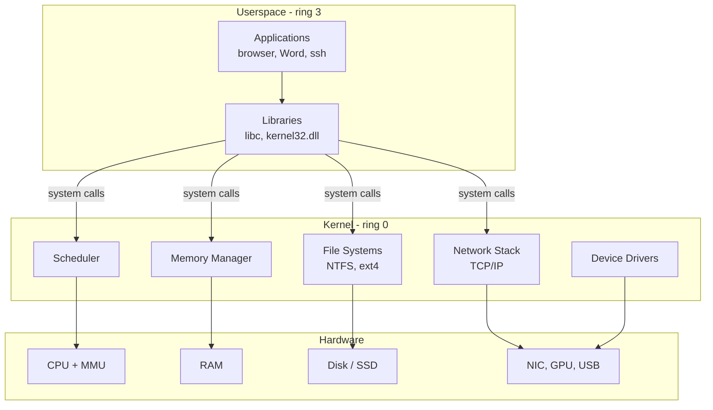

# Əməliyyat Sistemləri — Ümumi Baxış

Əməliyyat sistemi silisium yığınını faydalı bir şeyə çevirən qatdır. O, CPU-nu yüzlərlə rəqib proses arasında bölüşdürür, hər birinə öz virtual yaddaş dilimini verir, NVMe SSD ilə USB stick arasındakı fərqləri tək bir fayl API-si arxasında gizlədir, `notepad.exe` və ya `cat`-dən gələn hər sistem çağırışını vasitəçilik edir və maşında təhlükəsizlik sərhədinin ilk və son xəttini çəkir. Hər digər təhlükəsizlik nəzarəti — antivirus, EDR, BitLocker, AppLocker, SELinux, firewall qaydaları — OS-in daxilində və ya OS-in sahib olduğu nüvənin daxilində işləyən kod tərəfindən tətbiq olunur.

İnfosec mühəndisi üçün bu opsional bilik deyil. Siz gecə 03:00-da Windows hadisə log-larını oxuyacaqsınız, production deploy-u qıran SELinux denial-ı troubleshoot edəcəksiniz, PowerShell sərtləşdirmə skripti yazacaqsınız, Windows 11 endpoint-də process hollowing texnikasını ovlayacaqsınız, sonra Ubuntu 24.04 veb serverə SSH ilə girib `/var/log/auth.log` oxuyacaqsınız — hamısı eyni növbədə. Hücumçular hər iki platformanı bilirlər; siz də hər iki platformanı bilməlisiniz. Bu səhifə əsasdır: OS nədir, hər digər dərsdə görünən anlayışlar və Windows və Linux-un eyni problemləri necə fərqli həll etdiyinin yan-yana xəritəsi.

## Bu kateqoriyada nə var

Bu kateqoriya əməliyyat sisteminin özünün sahib olduğu hər şeyi əhatə edir: onu necə administrasiya etmək, necə sərtləşdirmək və arxasında qoyduğu izi necə oxumaq. Dərslər təmiz şəkildə Windows-tərəfli materiala (servislər, AppLocker, BitLocker) və Linux-tərəfli materiala (əsas komandalar, fundamentlər) bölünür, bu ümumi baxış konseptual xəritə kimi yuxarıdadır. OS daxili məsələlərə yenisinizsə əvvəlcə bu səhifəni oxuyun; iki platforma arasında paylaşılan terminologiyanın sürətli yenilənməsinə ehtiyacınız olduqda bura geri qayıdın.

| Dərs | Platforma | Nəyi əhatə edir |
|---|---|---|
| [Windows servisləri](/operating-systems/windows/services) | Windows | Windows servisinin nə olduğu, `services.msc`, `sc.exe`, bilməli olduğunuz ümumi servislər. |
| [AppLocker](/operating-systems/windows/applocker) | Windows | Proqram allow-listing — qaydalar, rejimlər, audit vs enforce. |
| [BitLocker](/operating-systems/windows/bitlocker) | Windows | TPM ilə tam disk şifrələnməsi, bərpa açarları, PowerShell idarəetməsi. |
| [Linux əsas komandalar](/operating-systems/linux/basic-commands) | Linux | Linux shell-də faydalı olmaq üçün lazım olan 30 komanda. |
| [Run komandaları](/operating-systems/windows/run-commands) | Windows | Hər adminin yadda saxladığı Win+R qısayolları. |
| [WSL](/operating-systems/windows/wsl) | Windows | Windows Subsystem for Linux — Windows 11 daxilində Ubuntu işlətmək. |

## Əsas OS anlayışları

Altı anlayış OS-in əslində nə etdiyinin əksəriyyətini əhatə edir. Hər digər mövzu — servislər, driver-lər, konteynerlər, hipervizorlar — bunların üzərində oturur.

**Nüvə və istifadəçi sahəsi.** Nüvə kiçik, imtiyazlı kod parçasıdır ki, *kernel mode*-da (x86-da CPU ring 0) işləyir, fiziki yaddaşın hər baytına toxuna bilər və hardware ilə birbaşa danışır. Qalan hər şey — shell-iniz, brauzeriniz, antivirus agenti, hətta müasir sistemlərdə əksər driver-lər — *istifadəçi sahəsində* (ring 3) işləyir, burada CPU onlara nüvə vasitəsilə olmasa RAM və ya cihazlara toxunmağa icazə vermir. İkisi arasındakı sərhəd sistem çağırışı interfeysidir və onu keçmək hesablamada *ən* baha əməliyyatdır.

**Proseslər və thread-lər.** *Proses* öz virtual ünvan sahəsi, fayl deskriptorları və təhlükəsizlik konteksti olan işləyən proqramın nümunəsidir. *Thread* prosesin daxilindəki bir icra yoludur; çoxlu thread-lər eyni ünvan sahəsini paylaşır və bir-birinin məlumatına basa bilər. OS planlayıcısı hansı thread-in hansı CPU yadrosunda neçə mikrosaniyə dilimi üçün işlədiyini seçir. Windows-da proseslərə Task Manager-da və `Get-Process` ilə baxırsınız; Linux-da onlara `ps aux` və `top` ilə baxırsınız.

**Virtual yaddaş.** Hər proses tam ünvan sahəsinə sahib olduğuna inanır (32-bit-də 4 GB, 64-bit-də 128 TB). Nüvə + CPU-nun MMU-su həmin *virtual* ünvanları uçuş zamanı *fiziki* RAM səhifələrinə çevirir, soyuq yaddaşı diskə page out edir və bir proses başqasının yaddaşını oxumağa çalışdıqda girişi rədd edir. "Proses izolyasiyası"nı real edən və buggy proqramın bütün sistemi korlamağının qarşısını alan budur.

**Fayl sistemləri.** Fayl sistemi storage-in bloklarını icazələr, vaxt damğaları və metadata ilə adlı fayl və qovluqların iyerarxiyasına çevirən on-disk verilənlər strukturudur. Windows-da NTFS, Linux-da ext4/Btrfs/XFS, macOS-da APFS. Eyni fiziki disk eyni baytları saxlayır; fayl sistemi onların nə demək olduğuna qərar verir.

**Cihaz driver-ləri.** Driver bir xüsusi hardware parçası — GPU, NIC, USB cihazı — ilə danışmağı bilən kernel-mode kodudur. Pis driver nüvəni çökdürür (Windows-da BSOD, Linux-da kernel panic). Dərindən gizlənmək istəyən əksər malware driver yükləməklə bitir, buna görə hər iki OS indi driver imzalamasını tələb edir.

**Sistem çağırışları.** İstifadəçi sahəsi və nüvə arasındakı dar qapı. Linux-da `open()`, `read()`, `write()`, `fork()`, `execve()`; Windows-da `NtCreateFile`, `NtReadFile`, `NtAllocateVirtualMemory`. Proqramın etdiyi hər maraqlı şey — fayl açmaq, şəbəkə paketi göndərmək, proses başlatmaq — sonda sistem çağırışına çevrilir, buna görə EDR məhsulları onları belə ağır şəkildə instrumentləşdirir.

## OS növləri

Hər əməliyyat sistemi masaüstü deyil. Trade-off-lar onun hansı hardware-də işlədiyinə və hansı zəmanətləri verməsinə görə kəskin şəkildə dəyişir.

| Növ | Nümunələr | Nəyə optimallaşdırılır |
|---|---|---|
| Masaüstü | Windows 11, Ubuntu Desktop, macOS | İnteraktiv reaksiyaqabiliyyəti, GUI, geniş hardware dəstəyi. |
| Server | Windows Server 2022, RHEL 9, Ubuntu Server 24.04 | Ötürmə qabiliyyəti, uptime, uzaq idarəetmə, default-da GUI yox. |
| Embedded | VxWorks, embedded Linux, FreeRTOS | Kiçik iz, sabit hardware, bəzən MMU yoxdur. |
| Real-time (RTOS) | QNX, VxWorks, Zephyr | Sərt deadline zəmanətləri — avtomobillərdə, tibbi cihazlarda, aviasiyada istifadə olunur. |
| Mobil | Android, iOS | Batareya ömrü, sandbox edilmiş tətbiqlər, toxunma UX, app-store paylanması. |

Gündəlik infosec işi üçün ilk ikisi ən vacibdir: tipik şirkət istifadəçi laptoplarında Windows 11 və serverlərdə Windows Server və Linux qarışığı işlədir, mobil cihazlar MDM vasitəsilə idarə olunur.

## Yükləmə prosesi

Yükləmə "güc söndürülmüş"-ü "login ekranı"-na çevirən nəzarətli ardıcıllıqdır. Addımları bilmək vacibdir, çünki hər addım hücumçunun (və ya səhv konfiqurasiya edilmiş yeniləmənin) bir şeyi qıra biləcəyi yerdir.

- **POST** — firmware RAM, CPU və qoşulmuş cihazların cavab verdiyini yoxlayır.
- **BIOS / UEFI** — köhnə sistemlər BIOS istifadə edirdi; müasirləri UEFI istifadə edir, bu Secure Boot-u (yalnız imzalanmış bootloader-lər işləyir), 2 TB-dan böyük GPT bölmələrini və lazımlı pre-OS mühitini dəstəkləyir.
- **Bootloader** — bir neçə OS varsa hansının yüklənəcəyini seçir, sonra nüvəni yaddaşa yükləyir. Linux-da GRUB, Windows-da Windows Boot Manager.
- **Nüvə** — yaddaşı işə salır, root fayl sistemini mount edir, vacib driver-ləri yükləyir.
- **init** — ilk istifadəçi sahəsi prosesi. Müasir Linux-da bu `systemd`-dir (PID 1); Windows-da bu `wininit.exe`-dir, sonra `services.exe`, `lsass.exe`, `winlogon.exe`-ni yaradır. Buradan sistemin qalan hissəsi yayılır.

"Yüklənmir" ticket-ini troubleshoot edərkən, bu addımlardan *hansının* uğursuz olduğunu — POST tamamlanır? bootloader görünür? nüvə yüklənir və sonra panik edir? — daraltmaq bütün oyundur.

## Çoxistifadəçi və təhlükəsizlik əsasları

Həm Windows, həm də Linux çoxistifadəçi sistemlərdir və onilliklərdir belədir. Təhlükəsizlik modelinin formalı adlar fərqli olsa da oxşardır.

- **Hesablar.** Hər istifadəçinin kimliyi (Windows-da SID, Linux-da UID) var və bir və ya bir neçə qrupa aiddir. OS hər sorğunun nəyə icazə verildiyinə qərar vermək üçün kimlik + qrup üzvlüyündən istifadə edir.
- **İmtiyaz səviyyələri.** Həmişə imtiyazlı "tanrı" hesabı var — Windows-da `Administrator` / `SYSTEM`, Linux-da `root` (UID 0) — və administrasiya işi etmək üçün yüksəliş tələb etməli olan adi istifadəçilər (Windows-da UAC, Linux-da `sudo`).
- **DAC vs MAC.** *Discretionary Access Control* resursun sahibinə başqa kimin onu istifadə edə biləcəyinə qərar verməyə icazə verir (klassik Unix `chmod`, Windows ACL-ları). *Mandatory Access Control* sahibin belə ləğv edə bilmədiyi sistem miqyaslı siyasətləri tətbiq edir (SELinux, AppArmor, Windows integrity səviyyələri, sandbox profilləri).
- **Giriş token-ləri.** Login olduqda Windows SID-nizi, qrup SID-lərini və imtiyazlarınızı ehtiva edən *access token* qurur; başlatdığınız hər proses həmin token-i daşıyır. Nüvə hər girişdə token-i resursun ACL-ı ilə yoxlayır. Linux effektiv UID/GID və capabilities istifadə edərək oxşar şəkildə işləyir.
- **SELinux / AppArmor.** Linux-da MAC-ın iki implementasiyası. SELinux (RHEL/Fedora-da default) hər faylı və prosesi etiketləyir və mərkəzləşdirilmiş siyasəti tətbiq edir. AppArmor (Ubuntu/SUSE-da default) binary üzrə yol əsaslı profillərdən istifadə edir. İkisi də kompromat olunmuş bir servisin profilindən kənar bir şey etməsinin qarşısını ala bilər, hətta hücumçunun root-u olsa belə.
- **Windows integrity səviyyələri.** ACL-ların üzərində ikinci ox. Aşağı integrity prosesi (sandbox edilmiş brauzer tab-ı) ACL əks halda icazə versə də, Orta integrity resursuna (Documents qovluğunuz) yaza bilməz. Brauzer istismarının dərhal profilinizi məhv etməsinin qarşısını alan budur.

## Windows vs Linux qısa baxış

İki ekosistem eyni problemlərə uyğun gəlir və fərqli default-lar seçir. Bu cədvəl qısa versiyadır.

| Mövzu | Windows | Linux |
|---|---|---|
| Nüvə | NT nüvəsi (`ntoskrnl.exe`), hibrid | Linux nüvəsi (`vmlinuz`), modullarla monolitik |
| Default shell | PowerShell 7, `cmd.exe` | bash, zsh |
| Paket meneceri | `winget`, MSI/MSIX, Microsoft Store | `apt` (Debian/Ubuntu), `dnf`/`yum` (RHEL/Fedora), `pacman` (Arch) |
| İcazə modeli | NTFS ACL-ları + integrity səviyyələri + UAC | POSIX `rwx` + ACL-lar + SELinux/AppArmor + capabilities |
| Servis meneceri | Service Control Manager (`services.msc`, `sc.exe`) | `systemd` (`systemctl`) |
| Default log yeri | Event Viewer (`%SystemRoot%\System32\winevt\Logs`) | `/var/log/`, systemd journal üçün `journalctl` |
| Admin istifadəçisi | `Administrator`, `SYSTEM` | `root` |
| Uzaq idarəetmə | RDP, WinRM, PowerShell Remoting | SSH |
| Fayl sistemi düzümü | Disk hərfləri (`C:\`, `D:\`), `C:\Windows`, `C:\Users` | `/` altında tək ağac, hər şey altında mount edilmişdir |
| Default fayl sistemi | NTFS | ext4 (dəyişir — RHEL-də XFS, openSUSE-da Btrfs) |
| EOL versiyalaşdırması | Adlandırılmış buraxılışlar (Server 2022, Windows 11 24H2) | Distro-spesifik (Ubuntu 24.04 LTS, RHEL 9.x) |
| Endpoint təhlükəsizliyi | Defender for Endpoint, BitLocker, AppLocker, WDAC | SELinux/AppArmor, LUKS, auditd, eBPF tooling |

## Proseslər, servislər, fayllar, yaddaş — hər alətin sizə göstərdiyi şeylər

Eyni dörd anlayış hər əməliyyat sistemində görünür; yalnız alət adları dəyişir. Bu cədvəli yadda saxlayın və Linux ticket-i Windows formalı beyninizə (və ya əksinə) düşdükdə təəccüblənməyi dayandıra bilərsiniz.

| Anlayış | Windows GUI | Windows CLI | Linux CLI |
|---|---|---|---|
| İşləyən proseslər | Task Manager | `Get-Process`, `tasklist` | `ps aux`, `top`, `htop` |
| Servislər / daemon-lar | `services.msc` | `Get-Service`, `sc.exe query` | `systemctl list-units --type=service` |
| Fayl icazələri | Sağ klik → Properties → Security | `icacls`, `Get-Acl` | `ls -l`, `getfacl`, `stat` |
| Yaddaş istifadəsi | Task Manager → Performance | `Get-Counter '\Memory\Available MBytes'` | `free -h`, `cat /proc/meminfo` |
| Disk istifadəsi | This PC | `Get-PSDrive`, `Get-Volume` | `df -h`, `du -sh *` |
| Dinləyən portlar | Resource Monitor | `netstat -ano`, `Get-NetTCPConnection` | `ss -tulpn`, `netstat -tulpn` |
| Login olmuş istifadəçilər | Task Manager → Users | `query user`, `quser` | `who`, `w`, `last` |
| Sistem log-ları | Event Viewer | `Get-WinEvent` | `journalctl`, `tail -f /var/log/syslog` |
| Şəbəkə konfiqurasiyası | `ncpa.cpl` | `Get-NetIPAddress`, `ipconfig /all` | `ip addr`, `ifconfig` |

## Praktik bootstrap

VirtualBox, VMware Workstation və ya Hyper-V ilə tək laptopda bu gün edə biləcəyiniz üç məşq. Ümumi vaxt təxminən bir saatdır.

1. **İki VM qaldır.** Windows 11 (Microsoft-dan qiymətləndirmə ISO-su) və Ubuntu 24.04 LTS (ubuntu.com-dan ISO) quraşdır. Hər birinə 4 GB RAM və 40 GB disk ver. İkisini də yüklə. İki quraşdırıcının necə fərqli hiss etdiyini gör — Windows Microsoft hesabı istəyir; Ubuntu istifadəçi adı istəyir.
2. **İşləyən prosesləri sadala.** Windows-da: `Get-Process | Sort-Object CPU -Descending | Select-Object -First 20`. Ubuntu-da: `ps aux --sort=-%cpu | head -20`. Default-da nə işlədiyini müqayisə et. Windows-da onlarla `svchost.exe` nümunəsi var; Ubuntu-da `systemd`, bir neçə `kworker` thread-ləri və çox az başqa şey var.
3. **Default dinləyən portları müqayisə et.** Windows-da: `netstat -ano | findstr LISTENING`. Ubuntu-da: `sudo ss -tulpn`. Təzə Windows 11 adətən təzə Ubuntu Server-dən daha çox portda dinləyir — RPC, SMB, RDP enabled olduqda və bir neçə `svchost.exe` portu. Təzə Ubuntu Server yalnız `ssh` (22) və DHCP client portunda dinləyə bilər. Bu, iki default arasındakı hücum səthi fərqidir, 30 saniyədə görünən edilir.

## İşlənmiş nümunə — example.local nə istifadə edir

`example.local` 200-işçilik şirkətdir, hibrid estate ilə. Endpoint-lərin təxminən 70%-i Group Policy və Intune vasitəsilə idarə olunan Windows 11 domain-joined iş stansiyalarıdır; SOC onları əsas phishing hədəfi kimi görür. Digər 30% — və server filosunun 90%-i — Linux işlədir: ictimai reverse proxy kimi nginx işlədən Ubuntu 24.04 host-ları, tətbiq verilənlər bazası üçün RHEL 9-da PostgreSQL, daxili dev alətləri üçün Docker host-ları və `EXAMPLE\` Active Directory saxlayan tək Windows Server 2022 forest.

Növbədə olan mühəndisə buna görə eyni saatda hər iki lüğət lazımdır. Tipik çərşənbə axşamı bunları ehtiva edir:

- Windows laptopda Defender for Endpoint xəbərdarlığı — `Get-Process`, `Get-WinEvent` və `HKCU\Software\Microsoft\Windows\CurrentVersion\Run` registry açarına baxış tələb edir.
- Ubuntu host-da uğursuz nginx restartı — `systemctl status nginx`, `journalctl -u nginx` və `/etc/nginx/nginx.conf`-a baxış tələb edir.
- PostgreSQL-də verilənlər bazası bağlantı fırtınası — `ss -tulpn`, `pg_stat_activity` və SELinux-un yeni socket yolunu bloklamadığının yoxlanmasını tələb edir.

Yalnız bir platformanı bilən hər kəs günü ticket-ləri həmkarına ötürərək keçirir. Hər ikisini bilən hər kəs izi birbaşa oxuyur. Bu kateqoriyanın hər ikisini yan-yana öyrətməsinin səbəbi budur.

## Əsas nəticələr

- OS təhlükəsizlik sərhədinə sahibdir; hər digər şey (EDR, AV, şifrələmə) onun daxilində işləyir.
- Altı anlayış — nüvə/istifadəçi sahəsi, proseslər, virtual yaddaş, fayl sistemləri, driver-lər, sistem çağırışları — hər OS-in etdiyinin əksəriyyətini izah edir.
- Windows və Linux eyni problemləri fərqli default-larla həll edir; *anlayışlar* ötürülür, *komandalar* hər platforma üzrə öyrənilməlidir.
- Yükləmə zənciri (POST → firmware → bootloader → nüvə → init) həm troubleshooting, həm də persistence üçün yoldur — stansiyaları bilin.
- Çoxistifadəçi təhlükəsizlik DAC (ACL-lar), MAC (SELinux/AppArmor/integrity səviyyələri) və yüksəlişi (UAC/`sudo`) yığır; yaxşı sərtləşdirmə üçün hər üçünü istifadə edin.
- "Nəyə baxdığımı bilmirəm" anlarının əksəriyyəti yeni aləti onun göstərdiyi anlayışa (proses, servis, fayl, yaddaş, port, log, istifadəçi) xəritələdikdə həll olur.
- Bir Windows VM və bir Ubuntu VM yan-yana açıq həftəsonu keçirin və naməlumluq hər kitabdan daha sürətli yox olur.

## İstinadlar

- *Operating Systems: Three Easy Pieces* (Remzi & Andrea Arpaci-Dusseau) — OS anlayışları üzrə standart pulsuz dərslik. https://pages.cs.wisc.edu/~remzi/OSTEP/
- Microsoft Learn — IT mütəxəssisləri üçün Windows sənədləri. https://learn.microsoft.com/en-us/windows/
- Linux man səhifələri, online və axtarıla bilən. https://man7.org/linux/man-pages/
- Linux Documentation Project — Filesystem Hierarchy Standard. https://refspecs.linuxfoundation.org/FHS_3.0/fhs/index.html
- Microsoft Docs — Windows daxili istinad. https://learn.microsoft.com/en-us/windows-hardware/drivers/kernel/
