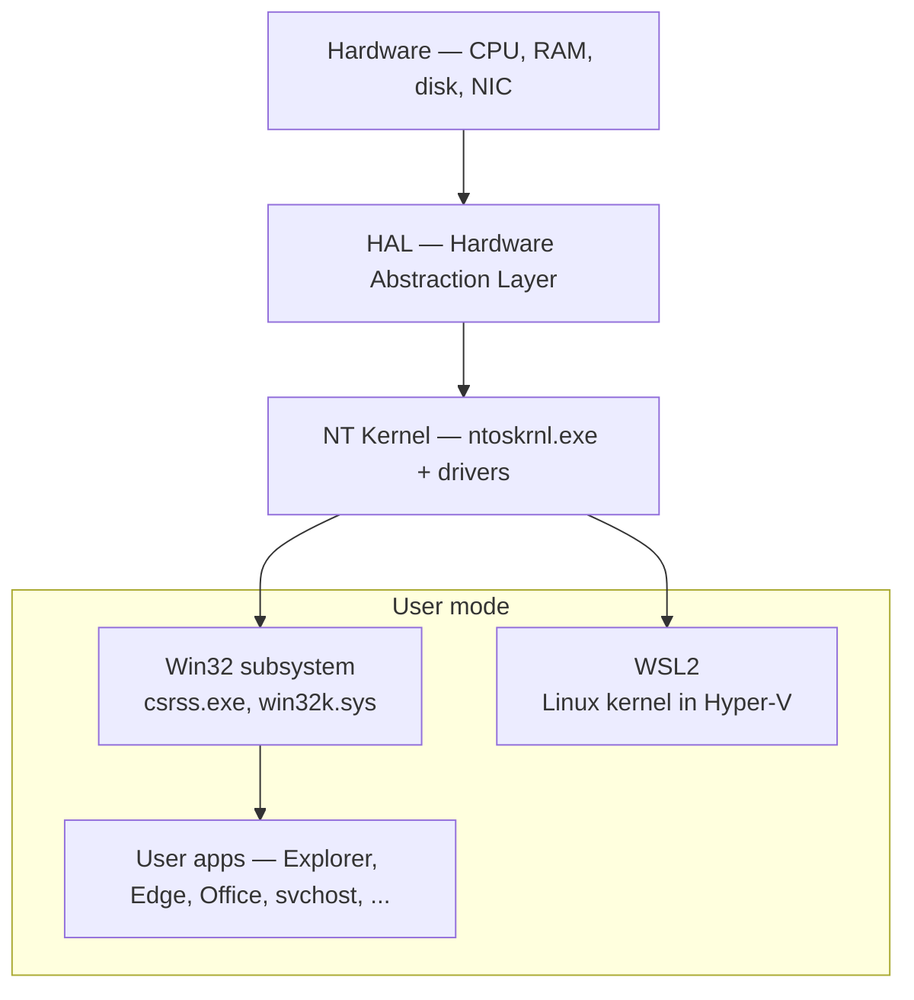

# Windows əsasları

Windows hələ də müəssisə endpoint-lərinin böyük əksəriyyətində işləyir. Active Directory, Group Policy, Exchange, fayl serverləri, maliyyə proqramları, line-of-business alətləri — SOC analitikinin gün ərzində toxunduğu stack-in çoxu Windows-dur. "Cloud native" adlandırılan şirkətlər belə sonda bir yığın Windows 10/11 noutbukla və identifikasiya/əməkdaşlıq host edən onlarca Server 2022 instansı ilə qarşılaşır. Məhz buna görə hər SOC analitiki gündə ən azı bir dəfə Event Viewer-i **Security** jurnalında açır: çünki həmin maşınlardakı login-lər, privilege escalation və process execution-lar mühitdəki ən zəngin araşdırma izidir.

Bu dərs təməldir. Sizi Windows Internals müəllifinə çevirmir. Lakin sizə işlək lüğəti və əzələ yaddaşını verir ki, Windows maşınını respondent kimi oxuya biləsiniz — normal proses ağacının necə göründüyünü, persistence-in harada gizləndiyini, hansı event ID-lərin əhəmiyyətli olduğunu, və registry-dən, hadisələr jurnalından və PowerShell-dən GUI-yə əl atmadan necə cavab almağı bilin.

## Arxitektura 2 dəqiqəyə

Windows təbəqəli OS-dir. Aparat ən altda dayanır. Onun üzərində çox nazik **Hardware Abstraction Layer (HAL)** CPU və chipset fərqlərini gizlədir ki, üstündəki kernel narahat olmasın. Kernel (`ntoskrnl.exe`) və device driver-lər **kernel mode**-da yaşayır — ring 0, yaddaşa və aparata tam giriş, bir bug-dan bugcheck-ə (mavi ekran) qədər məsafə. Qalan hər şey — Explorer, brauzeriniz, `svchost.exe`, AV agent-in user-mode hissələri — **user mode**-da (ring 3) yaşayır, burada hər prosesin öz virtual ünvan sahəsi olur və kernel-ə yalnız nəzarət olunan system call-lar vasitəsilə toxuna bilir.

Kernel-in üstündə **environment subsystem-lər** dayanır. Win32 subsystem (`csrss.exe` plus `win32k.sys`) hər normal Windows proqramının danışdığı şeydir. Vaxtilə POSIX və OS/2 subsystem-ləri vardı; bu gün mənalı alternativ **WSL2**-dir — yüngül Hyper-V VM-in içində real Linux kernel işlədir və `wsl.exe` kimi göstərir. Bu klassik subsystem fikrindən tamamilə fərqli modeldir — emulyasiya yox, virtuallaşdırmadır.



Müdafiəçilər üçün iki praktiki nəticə:

- User mode-da **SYSTEM** kimi işləyən proses artıq çox güclüdür, lakin o, kernel deyil. Kernel-mode rootkit (imzalanmış driver sui-istifadəsi, BYOVD) istənilən user-mode malware-dən kateqorik olaraq daha pis problemdir.
- User-mode API çağırışlarına baxan aşkarlama driver kimi həyata keçirilən hər şeyi qaçırır. Buna görədir ki, EDR-lər yalnız userland hook deyil, kernel callback və ETW provider-lər də göndərir.

## Proseslər, thread-lər, xidmətlər

**Proses** proqramın bir işləyən nüsxəsidir. Onun virtual ünvan sahəsi, handle cədvəli, security token-i və bir və ya bir neçə thread-i olur. **Thread** isə CPU-nun əslində schedule etdiyi şeydir; bir thread-li proses bir nüvədə bir anda işləyir, çoxlu thread-li proses isə nüvələrə yayıla bilər. Hər prosesin **PID**-i (process ID) və hər thread-in **TID**-i (thread ID) olur. PID ad deyil və reboot-lar arasında sabit deyil — yalnız PID-ə güvənən aşkarlama məntiqi yazmayın.

Proseslərin valideyni olur. `explorer.exe` (shell) `chrome.exe`-ni spawn edəndə, Chrome-un valideyn prosesi Explorer olur. İstifadəçi Word-də zərərli makro üzərinə iki dəfə kliklədikdə, proses ağacı adətən `winword.exe → cmd.exe → powershell.exe` kimi olur — və həmin valideyn/uşaq əlaqəsi Windows dünyasında ən etibarlı aşkarlama siqnallarından biridir. Normal ağacı əzbərləyin:

```
System (PID 4)
 └─ smss.exe
     ├─ csrss.exe  (one per session)
     ├─ wininit.exe  (session 0)
     │   ├─ services.exe
     │   │   └─ svchost.exe × many
     │   ├─ lsass.exe
     │   └─ fontdrvhost.exe
     └─ winlogon.exe  (one per interactive session)
         ├─ LogonUI.exe
         ├─ userinit.exe  → explorer.exe
         ├─ dwm.exe
         └─ fontdrvhost.exe
```

**`services.exe`** Service Control Manager-dir. **Xidmət** sadəcə SCM-in sizin adınızdan başlatdığı, dayandırdığı və yenidən başlatdığı uzun müddət işləyən fon prosesidir — Linux systemd unit-in Windows analoqu. Xidmət təriflər registry-də `HKLM\SYSTEM\CurrentControlSet\Services\` altında yaşayır. Hər xidmət girişi işlədiləcək icra olunan faylı, işlədiləcək hesabı, başlanma tipini (Automatic, Manual, Disabled, Delayed-Start, Triggered) və asılılıqlarını təyin edir.

Bir çox xidmət öz icra olunan faylında yox, **`svchost.exe`** içində işləyir. Bu konsolidasiya hiyləsidir: onlarla kiçik xidmət (DNS Client, Themes, Windows Update, Audio…) hər biri öz prosesini spawn etmək əvəzinə bir `svchost` host proses paylaşır. Kifayət qədər RAM-lı müasir Windows 10/11-də xidmətlər daha aqressiv ayrılır — tez-tez 40+ `svchost.exe` instansı görəcəksiniz, bu normaldır.

Əsas triage əmrləri:

```powershell
# Processes
tasklist
Get-Process
Get-Process | Where-Object { $_.ProcessName -eq 'svchost' } | Select-Object Id, ProcessName, Path

# With parent PID
Get-CimInstance Win32_Process |
    Select-Object ProcessId, ParentProcessId, Name, CommandLine |
    Sort-Object ParentProcessId

# Services
Get-Service
Get-Service -Name Spooler | Format-List *
sc.exe qc Spooler
```

Xidmət triage-i blue-team-in əsas bacarığıdır. Yuxusuz halda gecə saat 3-də bilməlisiniz: `spoolsv.exe`-nin işləməsi normaldırmı (bəli, Print Spooler-dir), `svchost.exe`-nin valideyni `explorer.exe` ola bilərmi (xeyr — qanuni valideyn həmişə `services.exe`-dir), və `winword.exe`-dən `powershell.exe` spawn olunması biznesdə kiminsə qanuni səbəbinin olduğu bir şeydirmi (demək olar ki, heç vaxt). Task Manager, daxili `tasklist` və `Get-Process` sizə əsasları göstərəcək. Ağacın real görünüşü üçün Sysinternals **Process Explorer**-i (`procexp64.exe`) istifadə edin — o, valideyn/uşaqı, imzalı/imzasız vəziyyəti və hər prosesin başladıldığı komanda sətrini göstərir.

## Qeydiyyat (registry)

Windows **registry**-si ierarxik açar-dəyər verilənlər bazasıdır və sistemin demək olar ki, hər konfiqurasiya parçasını saxlayır — OS parametrləri, istifadəçi tərcihləri, quraşdırılmış proqram metadata-sı, driver parametrləri, xidmət tərifləri, scheduled task blob-ları və malware-in gizlənməyi sevdiyi uzun siyahı. O, **hive** adlanan beş kök açara bölünür:

| Hive | Alias | Nə saxlayır | Diskdə harada yerləşir |
|---|---|---|---|
| `HKEY_LOCAL_MACHINE` | `HKLM` | Maşın səviyyəsində konfiqurasiya, xidmətlər, quraşdırılmış proqramlar | `C:\Windows\System32\config\SOFTWARE`, `SYSTEM`, `SECURITY`, `SAM` |
| `HKEY_CURRENT_USER` | `HKCU` | Hazırda login olmuş istifadəçinin parametrləri | `C:\Users\<user>\NTUSER.DAT` |
| `HKEY_USERS` | `HKU` | Maşına yüklənmiş hər istifadəçinin profili | İstifadəçi başına bir subkey, `NTUSER.DAT` ilə dəstəklənir |
| `HKEY_CLASSES_ROOT` | `HKCR` | Fayl assosiasiyaları, COM/OLE qeydiyyatları | `HKLM\Software\Classes` və `HKCU\Software\Classes`-in birləşdirilmiş baxışı |
| `HKEY_CURRENT_CONFIG` | `HKCC` | Cari aparat profili | `HKLM\SYSTEM\CurrentControlSet\Hardware Profiles\Current`-in volatil baxışı |

Üç alət, təxmini istifadə tezliyi sırası ilə:

- **`regedit.exe`** — GUI. Klikləmək və birdəfəlik düzəlişlər üçün uyğundur.
- **`reg.exe`** — klassik komanda sətri aləti. Skriptlər və PowerShell-iniz olmayan uzaq sessiyalar üçün əladır.
- **PowerShell** — registry hive-ları drive kimi görünür (`HKLM:\`, `HKCU:\`) və onları `Get-ItemProperty`, `Set-ItemProperty`, `New-ItemProperty`, `Remove-ItemProperty` ilə sorğulayırsınız. Bu, müasir idiomatik üsuldur.

```powershell
# What autostarts from the current user's Run key?
Get-ItemProperty -Path 'HKCU:\Software\Microsoft\Windows\CurrentVersion\Run'

# Enumerate installed services
Get-ChildItem 'HKLM:\SYSTEM\CurrentControlSet\Services' |
    Select-Object PSChildName

# reg.exe equivalent — useful when you are not in PowerShell
reg query "HKLM\SOFTWARE\Microsoft\Windows NT\CurrentVersion\Winlogon" /v Userinit
```

Respondent refleks olaraq yoxladığı açarlar:

- `HKLM\SOFTWARE\Microsoft\Windows\CurrentVersion\Run` — maşın səviyyəsində autostart
- `HKCU\Software\Microsoft\Windows\CurrentVersion\Run` — istifadəçi başına autostart
- `HKLM\SYSTEM\CurrentControlSet\Services` — hər xidmət, persistence üçün xidmət kimi quraşdırılmış zərərlilər də daxil olmaqla
- `HKLM\SOFTWARE\Microsoft\Windows NT\CurrentVersion\Winlogon` — `Userinit`, `Shell` dəyərləri klassik hijack hədəfləridir
- `HKLM\SOFTWARE\Microsoft\Windows NT\CurrentVersion\Image File Execution Options` — image-hijack / debugger sui-istifadəsi
- `HKLM\SOFTWARE\Microsoft\Windows\CurrentVersion\Explorer\Shell Folders` — startup qovluğu yol həllolması

## Hadisələr jurnalı — SOC-ların yaşadığı yer

Windows əməliyyat və təhlükəsizlik hadisələrini **Event Log** kanallarına yazır. Tarixən üç jurnal vardı — Application, System, Security. Müasir Windows **Applications and Services Logs** altında komponent başına yüzlərlə əməliyyat kanalı əlavə edir, və Windows Event Forwarding (WEF) onları mərkəzi kollektorda **Forwarded Events** kanalında aqreqasiya etməyə imkan verir.

SOC-un fikir verdiyi kanallar:

| Jurnal | Oraya nə düşür |
|---|---|
| **Security** | Login-lər, privilege istifadəsi, proses yaradılması (əgər aktivdirsə), obyektə giriş, siyasət dəyişikliyi |
| **System** | Driver-lər, xidmətlər, OS-səviyyəli hadisələr |
| **Application** | Proqramın log etməyi seçdiyi hər şey, üçüncü tərəf AV-lar daxil olmaqla |
| **Forwarded Events** | WEF-i endpoint-lərdən toplamaq üçün necə konfiqurasiya etmisinizsə |
| **Microsoft-Windows-Sysmon/Operational** | Sysmon quraşdırmısınızsa, 4688-dən zəngin proses/şəbəkə/fayl hadisələri |
| **Microsoft-Windows-PowerShell/Operational** | Script block logging (EID 4104) |
| **Microsoft-Windows-TaskScheduler/Operational** | Task yaradılması və icrası |

Hər analitikin baxan kimi tanıması lazım olan Security event ID-lər:

| Event ID | Mənası | Niyə əhəmiyyətlidir |
|---|---|---|
| **4624** | Uğurlu login | Logon type daxil edir — 2 interactive, 3 network, 10 RDP, 11 cached |
| **4625** | Uğursuz login | Brute force, səhv yazılmış parol, account lockout xəbərçisi |
| **4634** | Logoff | Sessiyaları yenidən qurmaq üçün 4624 ilə cütlənir |
| **4648** | Açıq credential ilə login | `runas`, başqa istifadəçi kimi işləyən scheduled task, lateral movement |
| **4672** | Xüsusi privilege təyin edildi | Admin-bərabər login; admin-lər üçün 4624-dən dərhal sonra görmək gözlənilir |
| **4688** | Proses yaradılması | `Audit Process Creation` siyasəti tələb edir; tam dəyər üçün komanda sətri logging-i əlavə edin |
| **4689** | Proses sonlandırılması | 4688 ilə cütləyin |
| **4698** | Scheduled task yaradıldı | Yayılmış persistence mexanizmi |
| **4720** | İstifadəçi hesabı yaradıldı | AD-də səs-küylüdür, lakin iş stansiyasında qızıl |
| **4722 / 4724 / 4738** | Aktivləşdirildi / parol sıfırlandı / dəyişdirildi | Hesab həyat dövrü |
| **4732 / 4733** | Lokal qrupa əlavə edildi / silindi | Administrators-a əlavələrə diqqət edin |
| **7045** | Xidmət quraşdırıldı (System log) | PSExec, Impacket, xidmət əsaslı persistence |

İki əmr lazım olanın 80%-ni edir:

```powershell
# Recent failed logons
Get-WinEvent -LogName Security -FilterXPath "*[System[EventID=4625]]" -MaxEvents 20 |
    Select-Object TimeCreated, Id, @{n='User';e={$_.Properties[5].Value}}, @{n='Src';e={$_.Properties[19].Value}}

# Recent process creations
Get-WinEvent -LogName Security -FilterXPath "*[System[EventID=4688]]" -MaxEvents 50 |
    Format-Table TimeCreated, Id, Message -Wrap

# wevtutil — works on every Windows since Vista, including Server Core
wevtutil qe Security /q:"*[System[EventID=4625]]" /c:10 /rd:true /f:text
```

## İstifadəçilər, qruplar, SID-lər, token-lər

Windows sistemində hər security principal — istifadəçi, qrup, xidmət hesabı, kompüter hesabı — adı ilə deyil, **Security Identifier (SID)** ilə tanınır. Ad etiketdir; SID isə əsas açardır. İstifadəçinin adını dəyişəndə SID qalır. Eyni adla istifadəçini silib yenidən yaradanda SID fərqli olur, və köhnə SID-ə işarə edən hər ACL artıq orphan-dir.

SID-lər `S-1-5-21-3623811015-3361044348-30300820-1013` kimi görünür. `S-1-5-21-…` bloku domeni və ya lokal maşını tanıdır; sonuncu rəqəm (**RID**, Relative Identifier) onun içindəki principal-ı tanıdır. Məlum SID-lər sabitdir və əzbərləməyə dəyər:

| SID | Principal |
|---|---|
| `S-1-5-18` | `NT AUTHORITY\SYSTEM` |
| `S-1-5-19` | `NT AUTHORITY\LOCAL SERVICE` |
| `S-1-5-20` | `NT AUTHORITY\NETWORK SERVICE` |
| `S-1-5-32-544` | `BUILTIN\Administrators` |
| `S-1-5-32-545` | `BUILTIN\Users` |
| `S-1-5-32-555` | `BUILTIN\Remote Desktop Users` |
| `S-1-1-0` | `Everyone` |
| `S-1-5-11` | `Authenticated Users` |

İstifadəçilər iki cür olur: maşının SAM-ında (`C:\Windows\System32\config\SAM`) yaşayan **lokal** hesablar, və Active Directory-də yaşayan və domen kontrolleri tərəfindən autentifikasiya olunan **domen** hesabları. Domenə qoşulmuş maşında lokal hesablar yenə də mövcuddur — daxili Administrator və lokal xidmət hesabları — və onlar tez-tez lateral movement hədəfidir, çünki adətən fleet boyu eyni parolu paylaşırlar. LAPS (indi **Windows LAPS**) bunu daxili Administrator üçün həll edir.

Login olduqda LSASS sessiyanız üçün **access token** qurur. Token sizin SID-inizi, üzv olduğunuz hər qrupun SID-lərini, privilege-lərinizi (`SeDebugPrivilege`, `SeBackupPrivilege`, …) və bir **integrity level** daşıyır. Windows integrity level-ləri, aşağıdan yuxarı:

- **Untrusted** — AppContainer izolyasiyası
- **Low** — sandboxed IE, Edge renderer
- **Medium** — normal istifadəçi prosesi
- **High** — yüksəldilmiş (UAC-prompted) proses
- **System** — kernel, SCM, SYSTEM kimi işləyən xidmətlər

**UAC** (User Account Control) gündəlik shell-inizin Administrators-da olduğunuz halda belə Medium-da işləməsinin səbəbidir. "Run as administrator" üzərinə klikləyəndə LSASS High integrity level-i olan və `BUILTIN\Administrators` üzvlüyünün artıq **filter olunmadığı** yeni token verir. Buna görə Start menyusundan açdığınız cmd pəncərəsi driver quraşdıra bilmir, lakin "Run as administrator" ilə açdığınız pəncərə bilər — eyni istifadəçi, fərqli token.

```powershell
# Whoami — you will type this more than any other command
whoami /all          # SID, groups, privileges, integrity level

# Local users and groups
Get-LocalUser
Get-LocalGroup
Get-LocalGroupMember -Group Administrators
```

## PowerShell-i düzgün yolla

PowerShell müasir Windows administrativ dilidir. Respondent üçün killer xüsusiyyətləri:

- **Cmdlet-lər** verb-noun-dur (`Get-Process`, `Stop-Service`) və komponovka oluna bilər.
- **Mətn yox, obyektlər** — pipeline tipli obyektlər daşıyır, ona görə `Get-Process | Where-Object CPU -gt 100 | Stop-Process` sütun parsing-dən asılı deyil.
- **Remoting** TCP **5985** (HTTP) və **5986** (HTTPS) üzərində **WinRM** üzərindən. `Enter-PSSession` və `Invoke-Command` eyni pipeline-ı bir maşında və ya minində işlətməyə imkan verir. Production-da 5986-nı sertifikat əsaslı HTTPS ilə istifadə edin — 5985 plaintext-in müasir şəbəkədə mövcud olmaq haqqı yoxdur.

Execution policy adətən səhv başa düşülür. O, **təhlükəsizlik sərhədi deyil**. O, imzasız skriptləri təsadüfən işlətməyə qarşı qoruyucudur:

- **Restricted** — heç bir skript yoxdur. Kərpicin user-friendly-liyi.
- **RemoteSigned** — lokal skriptlər işləyir; download edilmiş skriptlər imzalanmalıdır. Server-lər üçün ağıllı default.
- **AllSigned** — hər şey imzalanmalıdır. Yüksək təhlükəsizlik, yüksək çətinlik.
- **Bypass** — heç nə bloklanmır, heç nə xəbərdarlıq vermir. Hücumçunun sevimli one-liner-i.

Hər kəs öz sessiyası üçün execution policy təyin edə bilər (`Set-ExecutionPolicy -Scope Process Bypass`) və ya cmd-dən `-ExecutionPolicy Bypass` ilə PowerShell çağıra bilər. Beləliklə, **malware-i dayandırmaq üçün execution policy-yə güvənməyin**. Əslində kömək edən şey **logging**-dir:

- **Module logging** — göstərilən modullar üçün pipeline icrasını log edir.
- **Script block logging** — PowerShell-in kompilyasiya etdiyi hər script block-un *məzmununu* log edir. Bu, PowerShell de-obfuscation etdikdən sonra obfuscate olunmuş one-liner-ləri tutur və `Microsoft-Windows-PowerShell/Operational`-da Event ID **4104** kimi düşür. Bunu aktiv edin.
- **Transcription** — diskə per-session transcript yazır (GPO vasitəsilə `EnableTranscripting` və `OutputDirectory` təyin edin).

```powershell
# Check what is currently on
Get-ItemProperty 'HKLM:\Software\Policies\Microsoft\Windows\PowerShell\ScriptBlockLogging'
Get-ItemProperty 'HKLM:\Software\Policies\Microsoft\Windows\PowerShell\Transcription'

# WinRM state
Get-Service WinRM
winrm enumerate winrm/config/listener
```

## NTFS və icazələr

**NTFS** default Windows fayl sistemidir. Əsas oxuma və yazmadan əlavə o, journaling, alternate data stream-ləri, hard və symbolic link-ləri, fayl başına compression və encryption-u (EFS) və — təhlükəsizlik üçün ən vacib olan — hər obyektdə **ACL**-ləri dəstəkləyir.

Hər NTFS obyektinin (və hər registry açarının, xidmətin, named pipe-ın və prosesin) iki ACL-li **security descriptor**-u olur:

- **DACL** — **Discretionary** Access Control List — kim nə edə bilər (oxumaq, yazmaq, icra etmək, silmək, mülkiyyəti almaq).
- **SACL** — **System** Access Control List — hansı girişlərin *audit* olunması (Security hadisəsi kimi qeyd olunması) lazımdır. Faylın SACL-ini heç vaxt populyasiya etməsəniz, onun üçün heç vaxt audit hadisəsi almazsınız.

Hər ACL **ACE**-lərin (Access Control Entries) siyahısıdır. ACE inheritance flag-ları ilə SID-i hüquqlar dəstinə, allow və ya deny kimi bağlayır. Inheritance default-dur: qovluqda icazələri təyin edəndə, açıq şəkildə inheritance-i pozmadıqca uşaqlar onları miras alır.

Linux bilən oxucular üçün POSIX ilə qısaca müqayisə edək. POSIX `rwx` sahibə, qrupa və "digərlərinə" üç bit verir — cəmi doqquz bit, plus setuid/setgid/sticky. NTFS daha qranulardır: onlarla fərqli hüquq (ReadData, WriteData, AppendData, Delete, ChangePermissions, TakeOwnership, …), hər biri istənilən sayda principal-a bağlana bilər. Linux ekvivalentləri yalnız POSIX ACL-lər (`setfacl`) ilə fərqi qapadır. Linux-dan gəlirsinizsə: NTFS "Linux-un default-da hər şeyin zəngin ACL-i olsaydı necə olardı"-dır.

```cmd
REM List ACL on a folder
icacls C:\Logs

REM Grant a group read+execute, applied recursively with inheritance
icacls C:\Logs /grant "EXAMPLE\SecOps:(OI)(CI)(RX)" /T

REM Reset to inherited permissions
icacls C:\Logs /reset /T

REM Take ownership — responders do this on locked-down folders
takeown /F C:\Logs /R /A
```

**Share-lər** NTFS-in üzərində ayrı icazə təbəqəsidir. İstifadəçi share-ə SMB üzərindən çatdıqda effektiv icazə share icazəsinin və NTFS icazəsinin **ən məhdudlaşdırıcısıdır**. Adi tövsiyə: share icazələrini `Everyone: Full Control` təyin edin və əsl gating-i NTFS-də edin, burada tooling daha zəngindir və qiymətləndirmə həm lokal, həm də şəbəkə üzərində eynidir.

## Daxili təhlükəsizlik xüsusiyyətləri

Windows qutudan kənar faydalı müdafiə təbəqələri dəsti göndərir. Yaxşı konfiqurasiya olunmuş, patch-lənmiş, Defender aktiv endpoint-də üçüncü tərəf AV-yə ehtiyacınız yoxdur.

| Təhlükə | Daxili azaldılma |
|---|---|
| Commodity malware | **Microsoft Defender Antivirus** — real-time, cloud-assisted, OS-ə daxili |
| LSASS-dən credential oğurluğu | **Credential Guard** — LSASS sirlərini VBS-qorumalı enclave-də izolyasiya edir |
| İmzasız / etibarsız kod | **WDAC (App Control for Business)** və **AppLocker** |
| Etibarsız download-lar, phishing yemləri | **SmartScreen** — fayllar və URL-lər üçün reputasiya əsaslı reputasiya |
| Ransomware / makro sui-istifadəsi / LOLBin-lər | **Attack Surface Reduction (ASR)** qaydaları |
| İtirilən noutbukdan data itkisi | **BitLocker** — tam volume disk şifrələməsi |
| Kernel manipulyasiyası, BYOVD | **HVCI** (Memory Integrity) — VBS-də kernel CI |
| İmzasız skriptlər | **PowerShell Constrained Language Mode** (WDAC ilə cütlənmiş) |
| Açıq admin token-ləri | **UAC**, **Protected Users qrupu**, **Just Enough Admin** |

Bir neçə qeyd:

- **Defender** "pulsuz olan" deyil. Müasir Windows-da o, Microsoft Defender for Endpoint ilə cütləndikdə tam EDR qabiliyyətli stack-dir və aşkarlama testlərində hər ödənişli vendor ilə rəqabət aparır.
- **ASR qaydaları** bu gün yerləşdirə biləcəyiniz ən yüksək siqnal-zəhmət nisbətli kontroldur. Bir neçə qayda — Office uşaq proseslərini bloklamaq, obfuscate edilmiş skriptləri bloklamaq, LSASS-dən credential oğurluğunu bloklamaq — commodity intrusion-ların əksəriyyətinin qapısını bağlayır.
- **AppLocker** və **WDAC** öz dərslərində əhatə olunub: bax [AppLocker](applocker.md). Greenfield üçün WDAC-ı seçin; AppLocker praktiki olaraq daha asan başlanğıc nöqtəsidir.

## Scheduled task-lar və startup

Windows maşınında kodun özünü başlada biləcəyi dörd yer, azalan incəlik sırası ilə:

1. **Xidmətlər** — `HKLM\SYSTEM\CurrentControlSet\Services`. Default-da SYSTEM kimi işləyir.
2. **Scheduled task-lar** — Task Scheduler. Boot-da, login-də, taymerdə, hadisədə işləyə bilər.
3. **Run / RunOnce registry açarları** — `HKLM\...\Run`, `HKCU\...\Run` və `RunOnce` variantları. Login-də işləyir.
4. **Startup qovluğu** — `%APPDATA%\Microsoft\Windows\Start Menu\Programs\Startup` (istifadəçi başına) və `C:\ProgramData\Microsoft\Windows\Start Menu\Programs\Startup` (bütün istifadəçilər). Buradakı shortcut-lar login-də başlayır.

Persistence mexanizmləri əsasən bu dörd yerdə yaşayır. Sysinternals **Autoruns** Windows-un sahib olduğu hər autostart extensibility nöqtəsini sadalayır — yuxarıdakı dördündən kənarda onlarla var (AppInit DLL-lər, image hijack-lar, Winlogon Notify, COM hijack-lar, WMI event subscription-ları) — və Autoruns çıxışını "not Microsoft signed"-ə görə filter etmək işlədə biləcəyiniz ən sürətli compromise-yoxlama iş axınlarından biridir.

```powershell
# All scheduled tasks, author and action
Get-ScheduledTask |
    Select-Object TaskPath, TaskName, @{n='Author';e={$_.Principal.UserId}}, State

# Drill into one task
Get-ScheduledTask -TaskName 'OneDrive Standalone Update Task-S-1-5-21-...' |
    Select-Object -ExpandProperty Actions

# Classic command still works
schtasks /query /fo LIST /v | Select-Object -First 80
```

## Praktika

Bütün məşqlər istənilən müasir Windows 10 / 11 və ya Server 2022 maşınında işləyir. PowerShell-i Administrator kimi açın.

### 1. LocalSystem kimi işləyən xidmətləri tapın

```powershell
Get-CimInstance -ClassName Win32_Service |
    Where-Object { $_.StartName -eq 'LocalSystem' } |
    Select-Object Name, DisplayName, PathName, State |
    Sort-Object Name
```

Bunların hər birinin tam-maşın səlahiyyəti var. Siyahını gözdən keçirin və soruşun: hər icra olunan yolu tanıyıramı? `C:\Users\`, `C:\ProgramData\` və ya `C:\Windows\Temp\` altında SYSTEM kimi işləyən hər şey qışqıran qırmızı bayraqdır.

### 2. 4688 proses-yaradılma audit-ini aktivləşdirin və hadisələri tutun

```powershell
# Enable the audit policy
auditpol /set /subcategory:"Process Creation" /success:enable

# (Optional) include the command line in 4688 events
$key = 'HKLM:\SOFTWARE\Microsoft\Windows\CurrentVersion\Policies\System\Audit'
New-Item  -Path $key -Force | Out-Null
New-ItemProperty -Path $key -Name ProcessCreationIncludeCmdLine_Enabled -Value 1 -PropertyType DWord -Force

# Generate a few child processes
cmd /c whoami
powershell -NoProfile -Command "Get-Date"
notepad.exe; Start-Sleep 2; Stop-Process -Name notepad -Force

# Read the last 5
Get-WinEvent -LogName Security -FilterXPath "*[System[EventID=4688]]" -MaxEvents 5 |
    Format-List TimeCreated, Id, Message
```

### 3. Lokal istifadəçilər və qruplar üç yolla

```powershell
net user
net localgroup
net localgroup Administrators
Get-LocalUser
Get-LocalGroup
Get-LocalGroupMember Administrators
```

Üçünü müqayisə edin. `net` ən köhnəsidir və hələ də universaldır. `Get-Local*` cmdlet-ləri müasir ekvivalentdir və obyektlərə qarşı işləyir. Daxili Administrator hesabının adı və aktivləşdirilmiş statusunun gözləntinizə uyğun olduğunu təsdiq edin — bir çox baseline onu söndürür.

### 4. İstifadəçi Run açarını sorğulayın

```powershell
Get-ItemProperty 'HKCU:\Software\Microsoft\Windows\CurrentVersion\Run'
Get-ItemProperty 'HKLM:\Software\Microsoft\Windows\CurrentVersion\Run'
Get-ItemProperty 'HKCU:\Software\Microsoft\Windows\CurrentVersion\RunOnce'
```

Bu açarların altındakı hər dəyər bir autostart-dır. `AppData`, `Temp` və ya imzasız binary-lərə işarə edən tanınmayan girişlər izahat tələb edir.

### 5. Son 10 uğursuz login üç sətirdə

```powershell
Get-WinEvent -LogName Security -FilterXPath "*[System[EventID=4625]]" -MaxEvents 10 |
    Select-Object TimeCreated, @{n='TargetUser';e={$_.Properties[5].Value}}, @{n='WorkstationName';e={$_.Properties[13].Value}}, @{n='SourceIP';e={$_.Properties[19].Value}} |
    Format-Table -AutoSize
```

Və ya Server Core üçün `wevtutil` ilə:

```cmd
wevtutil qe Security /q:"*[System[EventID=4625]]" /c:10 /rd:true /f:text
```

## İşlənmiş nümunə — kompromis olunmuş example.local iş stansiyasına ilk baxış

Ticket alırsınız: `WKS-031.example.local`-də `j.karimov` istifadəçisi deyir "noutbukum yavaşdır və antivirus ikonum yox oldu." Lokal admin kimi RDP girişiniz var. Aşağıda analitikin əmrləri işlətdiyi sıra — sürətli, oxu-yalnız əvvəl, dağıdıcı sona.

1. **Proses ağacının snapshot-ını çəkin.** Heç bir pəncərəni bağlamayın; əslində nəyin işlədiyini görmək istəyirsiniz.

   ```powershell
   Get-Process | Sort-Object CPU -Descending | Select-Object -First 20
   Get-CimInstance Win32_Process |
       Select-Object ProcessId, ParentProcessId, Name, CommandLine |
       Sort-Object ParentProcessId |
       Format-Table -AutoSize
   ```

   Axtarın: imzasız binary-lər, qeyri-adi valideyn-uşaq əlaqələri (`winword.exe → powershell.exe`, `explorer.exe → cmd.exe`), istifadəçi-yazıla bilən yollardan işləyən proseslər, encode olunmuş PowerShell komanda sətirləri.

2. **İşləyən xidmətlər, qeyri-Microsoft-a fokuslanmış.**

   ```powershell
   Get-CimInstance Win32_Service |
       Where-Object { $_.State -eq 'Running' -and $_.PathName -notlike '*Windows*' } |
       Select-Object Name, DisplayName, StartName, PathName |
       Sort-Object Name
   ```

3. **Registry autostart.**

   ```powershell
   'HKLM:\Software\Microsoft\Windows\CurrentVersion\Run',
   'HKCU:\Software\Microsoft\Windows\CurrentVersion\Run',
   'HKLM:\Software\Microsoft\Windows\CurrentVersion\RunOnce',
   'HKCU:\Software\Microsoft\Windows\CurrentVersion\RunOnce' |
       ForEach-Object { Get-ItemProperty $_ -ErrorAction SilentlyContinue }
   ```

4. **`Microsoft` və ya `SYSTEM`-dən başqası tərəfindən yaradılmış scheduled task-lar.**

   ```powershell
   Get-ScheduledTask |
       Where-Object { $_.Principal.UserId -notmatch 'SYSTEM|LOCAL|NETWORK' -and $_.TaskPath -notlike '\Microsoft\*' } |
       Select-Object TaskPath, TaskName, State, @{n='Action';e={($_.Actions | ForEach-Object Execute) -join '; '}}
   ```

5. **Son saat üçün Security 4688 və 4624.**

   ```powershell
   $since = (Get-Date).AddHours(-1)
   Get-WinEvent -FilterHashtable @{LogName='Security'; Id=4688,4624; StartTime=$since} |
       Format-Table TimeCreated, Id, Message -Wrap
   ```

6. **Staging qovluqlarındakı son fayllar.** Malware `C:\Users\Public`, `C:\ProgramData`, `C:\Windows\Temp` və `%TEMP%` altında staging edir.

   ```powershell
   Get-ChildItem C:\Users\Public, C:\ProgramData, C:\Windows\Temp, $env:TEMP `
       -File -Recurse -ErrorAction SilentlyContinue |
       Where-Object { $_.LastWriteTime -gt (Get-Date).AddDays(-2) } |
       Sort-Object LastWriteTime -Descending |
       Select-Object FullName, LastWriteTime, Length -First 30
   ```

7. **Defender statusu** — çünki istifadəçi ikonun yox olduğunu söylədi.

   ```powershell
   Get-MpComputerStatus | Select-Object AMServiceEnabled, RealTimeProtectionEnabled, AntivirusEnabled, IsTamperProtected
   Get-MpPreference    | Select-Object ExclusionPath, ExclusionProcess, DisableRealtimeMonitoring
   ```

   Şübhəli host tez-tez Defender söndürülmüş, hücumçunun staging qovluğu üçün exclusion yol əlavə edilmiş və ya tamper protection söndürülmüş göstərəcək. Bunların hər biri özlüyündə incident-dir.

Bu nöqtədə qərar vermək üçün kifayət qədər məlumatınız olmalıdır: maşını izolyasiya edin, IR-ə eskalasiya edin, `winpmem` ilə memory image çəkin, `wevtutil epl` ilə Event Log-ları qoruyun və ötürün.

## Yayılmış tələlər və gözəyağlar

- **Yalnız Task Manager-ə güvənmək.** Task Manager bəzi şeyləri gizlədir. `procexp64.exe`-ni (Process Explorer) istifadə edin — o, tam ağacı, imza statusunu, yüklənmiş DLL-ləri və dəqiq komanda sətrini göstərir. Persistence üçün `Autoruns` ilə cütləyin.
- **Security log wraparound.** Default Security log ölçüsü kiçikdir (tez-tez 128 MB). Yüklü maşında bu, bir neçə saatlıq 4624/4625/4688 saxlayır. Araşdırma vaxtınıza qədər sübut yox olur. `wevtutil sl Security /ms:4294967296` və ya GPO vasitəsilə onu 1–4 GB-a qaldırın və SIEM-ə forward edin.
- **UAC söndürülmüş.** Hər tənbəl "fix" blogu sizə UAC-ı söndürməyi deyir. Söndürməyin. UAC-sız shell ona düşən hər dropper üçün elevation-azad mühitdir.
- **Gündəlik işi yüksəldilmiş prompt-da işlətmək.** Brauzeriniz, Teams-iniz və Outlook-unuz heç vaxt High integrity-də işləməməlidir. Hər gün sessiyanız yüksəldildikdə bir makro və ya brauzer exploit admin miras alır. İki sessiya saxlayın və ya `runas` istifadə edin.
- **4688 yox = sükut.** Köhnə Windows image-larında proses yaradılması default-da audit olunmur. Sıfır 4688 hadisəsi alırsınız və düşünürsünüz ki, maşın təmizdir. "Security log-da heç nə yoxdur"-a güvənməzdən əvvəl siyasəti aktivləşdirin (və komanda sətrini daxil edin).
- **Live response vs post-mortem artefaktlar.** Canlı maşında `Get-Process` yalnız *indi* işləyəni görür. Yalnız-yaddaş malware və yeni sonlandırılmış proseslər yox olub. Tarixi mənzərə üçün memory imaging və Event Log / Sysmon / EDR telemetriyası lazımdır — yalnız bu dəqiqə diskdəki yox.

## Əsas nəticələr

- Windows kiçik kernel-mode nüvənin üzərindəki user mode-dur. Kernel-mode kompromisi user mode-dan kateqorik olaraq pisdir.
- Xidmətlər SCM-in idarə etdiyi uzun müddət işləyən proseslərdir; onların tərifləri `HKLM\SYSTEM\CurrentControlSet\Services`-də yaşayır və `svchost.exe` çoxunu host edir.
- Registry sistemdəki ən vacib konfiqurasiya saxlayıcısıdır. Respondent açarlarını öyrənin: `HKCU/HKLM Run`, `Services`, `Winlogon`, `Image File Execution Options`.
- Security Event ID-lər 4624, 4625, 4672, 4688, 4698, 4720, 7045 gündəlik araşdırmaların əksəriyyətini əhatə edir.
- Hər principal-ın SID-i var; adlar etiketdir. Məlum SID-lər (`S-1-5-18`, `S-1-5-32-544`) ikinci təbiət olmalıdır.
- UAC Administrators qrupu login-ini Medium-IL shell-ə çevirir; "Run as administrator" token-i yüksəldən şeydir.
- PowerShell güclüdür və onu konfiqurasiya etdikdə intensiv log olunur — script-block logging və transcription-u aktivləşdirin.
- Daxili Defender + ASR + BitLocker + Credential Guard + WDAC/AppLocker hər hansı bir şey almazdan əvvəl artıq güclü baseline-dır.

## Mənbələr

- Mark Russinovich, David Solomon, Alex Ionescu. *Windows Internals*, 7-ci nəşr, 1 və 2-ci hissələr. Microsoft Press.
- Microsoft Learn — Windows security baselines: https://learn.microsoft.com/en-us/windows/security/operating-system-security/device-management/windows-security-configuration-framework/windows-security-baselines
- Microsoft Learn — Audit policy recommendations: https://learn.microsoft.com/en-us/windows-server/identity/ad-ds/plan/security-best-practices/audit-policy-recommendations
- Microsoft Learn — Events to monitor: https://learn.microsoft.com/en-us/windows-server/identity/ad-ds/plan/appendix-l--events-to-monitor
- Sysinternals suite (Process Explorer, Autoruns, Procmon, PsTools): https://learn.microsoft.com/en-us/sysinternals/
- Microsoft Defender for Endpoint sənədləri: https://learn.microsoft.com/en-us/defender-endpoint/
- Attack Surface Reduction qaydaları arayışı: https://learn.microsoft.com/en-us/defender-endpoint/attack-surface-reduction-rules-reference
- PowerShell logging tövsiyəsi: https://learn.microsoft.com/en-us/powershell/scripting/windows-powershell/wmf/whats-new/script-logging
- Məlum SID-lər: https://learn.microsoft.com/en-us/windows-server/identity/ad-ds/manage/understand-security-identifiers
- User Account Control: https://learn.microsoft.com/en-us/windows/security/application-security/application-control/user-account-control/
