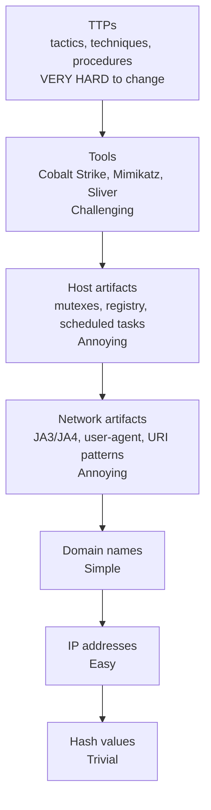

# Hücum İndikatorları (IOC və IOA)

Hər müdaxilə iz qoyur. Olmamalı yerdə proses yaranır. DNS sorğusu dünən qeydiyyatdan keçmiş domenə gedir. Servis hesabı heç vaxt giriş etmədiyi ölkədən sistemə daxil olur. `C:\Users\Public\` qovluğuna məlum proqramla uyğunlaşmayan bir EXE düşür. Bunların heç biri tək başına hücum deyil — bunlar **indikatorlardır**, hücumçunun (və ya zərərli proqramının) qoyduğu barmaq izləri. **Aşkarlama mühəndisliyi** sahəsi bu izləri partlayışın xəbər başlığına çevrilməsindən əvvəl tanımaq işidir.

Bu dərs iki böyük ailəni — **IOC (Indicators of Compromise)** və **IOA (Indicators of Attack)** — əhatə edir, indikatorları hücumçunun dəyişdirməsinin nə qədər çətin olduğuna görə sıralayan **Pyramid of Pain**, host, şəbəkə, davranış və kimlik indikatorlarının əsas kateqoriyalarını, mavi komandaların onları kodlaşdırmaq üçün istifadə etdiyi qayda formatlarını (YARA, Sigma, Snort/Suricata, STIX) və "SIEM-də IOC-larımız var" proqramlarını effektsiz edən nasazlıq rejimlərini.

## Niyə bu vacibdir

Hücumçunun "dwell time"-ı — ilkin kompromis ilə aşkarlama arasındakı boşluq — orta partlayış üçün hələ də **həftələrlə** ölçülür və ransomware sakit data oğurluğundan sonra gəldikdə **aylarla**. Bu pəncərə ərzində hücumçu şəbəkəni xəritələyir, imtiyazları artırır, ehtiyat nüsxələri tapır, satıla bilən hər şeyi xaricə çıxarır və yalnız sonra şifrələyir. Müdaxiləni birinci gün, qırxıncı gün əvəzinə tutmaq "heç bir məlumat çıxmazdan əvvəl saxladıq" ilə "ön səhifədəyik və müştərilərimizin SSN-ləri sızma saytındadır" arasındakı fərqdir.

İndikatorlar bu tutuşun necə baş verdiyidir. SOC analitiki "hücum" görmür; o, telemetriya yığını görür — proses hadisələri, DNS sorğuları, giriş qeydləri, fayl yazıları — bunlardan kiçik bir hissə insanların, satıcıların, threat-intel feed-lərinin və əvvəlki hadisələrin zərərli fəaliyyətlə əlaqələndirməyi öyrəndiyi nümunələrlə uyğun gəlir. **İndikator dəstinin keyfiyyəti** və **aşkarlama xəttinin sürəti** müdafiə cavabının beşinci dəqiqədə yoxsa səkkizinci həftədə başlamasını müəyyən edir.

İkinci səbəb də var: indikatorlar təhlükəsizlik sənayesinin ortaq valyutasıdır. CISA, satıcılar, ISAC-lar, tənzimləyicilər və hadisə cavab firmaları hamısı indikator terminləri ilə danışır. İndikator feed-lərini qəbul edə, yerləşdirə və köklədə bilməyən SOC sahənin qalan hissəsindən prinsipial olaraq qopuqdur. Əksinə, yalnız indikator istehlak edə bilən və heç vaxt öz davranış aşkarlamalarını yazmayan SOC təzə server alan hər düşməndən daimi bir addım geridədir.

Nəhayət, indikatorlar həm də *tədris* alətidir. Təzə CTI hesabatını oxumaq, IOC və TTP-lərini öz mühitinizə xəritələmək və junior analitiklərlə "bunların hər biri loglarımızda necə görünərdi?" mövzusunda işləmək SOC intuisiyası qurmağın ən effektiv yollarından biridir. Real dünya artefaktları nəzəriyyəni heç bir təlim kursunun çata bilmədiyi şəkildə əsaslandırır.

## Əsas anlayışlar

### IOC (Indicators of Compromise) və IOA (Indicators of Attack)

İki termin tez-tez bir-birinin yerinə işlədilir; eyni deyillər.

- **IOC** **geriyə baxan, məhkəmə-ekspertiza** indikatorudur — "bu şey artıq şəbəkəmdə baş verib?" sualına cavab verir. Nümunələr: məlum ransomware nümunəsindən fayl haşi, CTI feed-də görünən IP ünvanı, məlum APT-nin istifadə etdiyi domen, müəyyən RAT-ın yazdığı registr açarı. IOC-lar hadisə cavabının təbii çıxışıdır — hücum araşdırıldıqdan sonra onun artefaktları digər müdafiəçilərin axtara biləcəyi IOC-lara çevrilir. Onlar konkret, paylaşması asan və binarı yenidən kompilyasiya edən, infrastrukturu fırlandıran və ya yeni domen alan hücumçu tərəfindən **tamamilə asan keçilən**dir.
- **IOA** **irəliyə baxan, davranış** indikatorudur — "indi hücum kimi bir şey baş verir?" sualına cavab verir. Nümunələr: `winword.exe` `powershell.exe` doğurması (Office makro davranışı), `lsass.exe`-ni qeyri-sistem prosesinin oxuması (kimlik məlumatı dump-ı), bir servis hesabının 60 saniyədə 50 endpoint-ə autentifikasiya etməsi (yan hərəkət), uğursuz Kerberos pre-auth-ların qəfil artması (Kerberoasting). IOA-lar konkret alətdən asılı deyil — onlar **texnikanı** təsvir edir — buna görə hücumçu Mimikatz-ı yeni bir credential dumper ilə əvəz etdikdə də sağ qalırlar.

Yetkin proqramlar hər ikisini istifadə edir: IOC-lar ucuz ön-cəbhə filtri kimi və IOA tipli davranış qaydaları altda davamlı qat kimi.

Faydalı zehni model: IOC *məlum cinayətkarın fotoşəkilidir*; IOA isə *"binaya soxulmağa çalışan kimsə"nin davranış profilidir.* Cinayətkar saqqal qoyduğu anda fotoşəkil işləməz; oğurluq mövcud olduğu müddətcə davranış profili işləməyə davam edir.

İkisi həm də **mənbə** baxımından fərqlənir. IOC-lar hadisədən sonrakı cavabdan, sandbox detonasiyasından və ya satıcı tədqiqatından gəlir — kimsə pis şeyi tapıb etiket vurub. IOA-lar isə *hücumların necə işlədiyini* başa düşmək əsasında proaktiv qurulur, bu da öz IOA-larını yazan SOC-un effektiv olaraq daxili təhdid tədqiqatı apardığı deməkdir. Bu iş feed-ə abunə olmaqdan bahalıdır, lakin qaydalar illərlə kirayə ödəyir.

### Pyramid of Pain (David Bianco)

2013-cü ildə David Bianco **Pyramid of Pain**-i nəşr etdi — siz onları aşkarladığınızda hücumçuya nə qədər ağrı verdiyinə görə indikator növlərini sıralayan model. Piramidanın altı hücumçu üçün dəyişdirməsi əhəmiyyətsizdir; üstü isə bahalı və yavaşdır.

Aşağıdan yuxarıya:

1. **Haş dəyərləri** — əhəmiyyətsiz. Binarı yenidən kompilyasiya etmək və ya bir baytı çevirmək yeni haş yaradır.
2. **IP ünvanları** — asan. Hücumçular VPS instansiyalarını və Tor çıxışlarını davamlı fırlandırır; bulud IP-ləri birdəfəlikdir.
3. **Domen adları** — orta. Yeni domen qeydiyyatı pul və vaxt tələb edir, lakin yenə də adi haldır.
4. **Şəbəkə artefaktları** — narahatedici. URI nümunələri, user-agent sətirləri, JA3/JA4 TLS barmaq izləri, beacon intervalları — bunları dəyişmək implantın hissələrini yenidən qurmaq deməkdir.
5. **Host artefaktları** — narahatedici. Mutex adları, servis adları, registr yolları, adlandırılmış pipe-lar, zərərli proqrama kodlanmış planlaşdırılmış tapşırıqlar.
6. **Alətlər** — çətin. *Toolkit-in özünü* (Cobalt Strike, Mimikatz, Sliver) aşkarlamaq hücumçunu alət dəyişməyə və ya yenisini hazırlamağa məcbur edir.
7. **TTP-lər** (Tactics, Techniques, and Procedures) — **çətin**. *Texnikanı* aşkarlamaq — proses inyeksiyası, Kerberoasting, OAuth consent phishing — hücumçunu fərqli iş üsulu öyrənməyə məcbur edir. Bu, miqyaslanan yeganə qatdır.

Strateji nəticə kəskindir: SIEM-ə min haş atmaq dünənki hücumçular üçün min siqnal verir və bugünkülər üçün sıfır. Aşkarlama mühəndisliyi piramidaya çıxdıqda nəticə verir.

Aşağıdakı qaçma-xərci cədvəli eyni ideyanı kəmiyyətcə xülasə edir: yalnız haşlarla aşkarlama edən müdafiəçi qaçma xərci "yenidən kompilyasiya üçün F7 basın" olan hücumçu ilə üzləşir; TTP-lərlə aşkarlayan müdafiəçi isə qaçma xərci "fərqli bacarıq dəstinə malik yeni operator işə götürmək və hazırlamaq" olan hücumçu ilə üzləşir.

### Host əsaslı indikatorlar

Hücumçunun kompromis edilmiş endpoint-də qoyduqları:

- **Fayl haşları** — buraxılmış binarların MD5, SHA-1, SHA-256 (aşağı piramida dəyəri).
- **Şübhəli fayl yolları** — qeyri-Microsoft binarları üçün `C:\Users\Public\`, `%TEMP%`, `%APPDATA%\Roaming\Microsoft\`; Linux-da `/tmp/`, `/dev/shm/`.
- **Registr açarları** — autorun yerləri (`HKCU\Software\Microsoft\Windows\CurrentVersion\Run`), servis tərifləri, COM hijack-ləri, AppInit DLL-lər, Image File Execution Options (IFEO) sui-istifadəsi.
- **Planlaşdırılmış tapşırıqlar** — `schtasks.exe` ilə və ya Task Scheduler API vasitəsilə davamlılıq üçün yaradılır; SYSTEM kimi və ya `/RU "NT AUTHORITY\SYSTEM"` ilə işləyən tapşırıqlara diqqət yetirin.
- **Servislər** — imzasız binarlara və ya `cmd.exe /c <payload>`-a göstərən yeni servislər; istifadəçinin yaza biləcəyi qovluqlardakı servis binar yolları.
- **Davamlılıq mexanizmləri** — WMI hadisə abunəlikləri (`__EventFilter` + `__EventConsumer` + `__FilterToConsumerBinding`), BITS işləri, başlanğıc qovluğu qısayolları, Office əlavələri, DLL search-order hijack-ləri.
- **Autoruns** — Sysinternals `autoruns.exe`-nin işarələdiyi hər şey; təmiz şəkili baseline edin və istehsalla fərqi götürün.
- **Şübhəli proseslər** — `powershell.exe -enc <base64>`, qeyri-adi eksportlarla `rundll32.exe`, `regsvr32.exe /s /u /i:http://...` (Squiblydoo), uzaq skriptlər çalıştıran `mshta.exe`, `wmic process call create`, `bitsadmin /transfer`.
- **Drayver yüklənmələri** — qeyri-sistem yollarından yüklənən kernel drayverləri və ya imzasız drayverlər; Bring Your Own Vulnerable Driver (BYOVD) istismarı.
- **Yaddaş artefaktları** — proses yaddaşından çıxarılan sətirlər, Volatility-nin `malfind` kimi alətləri ilə aşkarlanan inyeksiya edilmiş DLL-lər, qeyri-JIT proseslərində RWX yaddaş bölgələri.

### Şəbəkə əsaslı indikatorlar

Hücumçunun naqildə qoyduqları:

- **DNS sorğuları** — yeni qeydiyyatdan keçmiş domenlərə (NRD-lər — son 30 gündə qeydiyyatdan keçmiş), DGA-yaradılmış adlara və ya məlum zərərli domenlərə. Yüksək entropiyalı subdomen etiketlərinə (DNS tunelləmə) və adi həddən böyük TXT-cavablarına baxın.
- **HTTP user-agent**-lər — zərərli proqrama sabit kodlaşdırılan (`Mozilla/4.0` — çox köhnə, şübhəli; və ya RAT ailələrindən unikal sətirlər). Qeyri-brauzer endpoint-lərdən boş user-agent-lər də eyni dərəcədə şübhəlidir.
- **JA3 / JA4 TLS barmaq izləri** — *müştəri kitabxanasını* barmaqlandıran TLS ClientHello parametrlərinin haşları. Cobalt Strike-ın standart profili, Sliver, Metasploit və curl-un fərqli JA3-ləri var.
- **Beacon nümunələri** — implant hər 60 saniyədə aşağı jitter-lə evə zəng vurur; bağlantı intervallarının fırlanan FFT-si nizamı üzə çıxarır. Təsadüfi jitter-lə belə, *median* interval çox vaxt sıx qruplaşır.
- **C2 trafiki** — DNS tunelləmə, Cloudflare-fronted domenə HTTPS, ICMP data kanalları, websocket implantları, böyük CDN-lərə qarşı domain fronting.
- **Qeyri-adi təyinatlar** — domen kontroller-in RPC portu (135, 49152+) ilə birbaşa danışan iş stansiyası və ya `169.254.169.254` bulud metadata servisi və ya TOR direktoriya səlahiyyətliləri.
- **Anomal trafik həcmi / istiqaməti** — yüklədiyindən çox göndərən server (data exfiltration), internetə xaricə SMB danışan müştəri və ya internetdən iş stansiyasına RDP.
- **Sertifikat anomaliyaları** — internetə baxan servislərdə öz-özünü imzalayan sertifikatlar, oxşar görünüşlü domenlərə verilmiş Let's Encrypt sertifikatları, şübhəli təşkilat sahələri olan sertifikatlar.

### Davranış indikatorları

Hansı fəaliyyət nümunələri hücum kimi görünür:

- **Qeyri-adi proses ağacları** — `outlook.exe -> winword.exe -> powershell.exe -> rundll32.exe` demək olar heç vaxt zərərsiz deyil.
- **Yan hərəkət** — iş stansiyasının ardıcıl olaraq SMB/445 və ya WinRM/5985 üzərindən bir çox digər iş stansiyasına qoşulması; qeyri-admin host-dan PsExec / WMI / DCOM fəaliyyəti.
- **Anomal autentifikasiya** — iş saatından kənar servis hesabı girişi, heç vaxt istifadə etmədiyi iş stansiyasından admin istifadəçi girişi, Kerberos gözlənilərkən NTLM autentifikasiyası.
- **İş saatından kənar giriş** — həmişə 09:00–18:00 işləyən hesabdan saat 03:14-də toplu data oxumaları.
- **Living-off-the-land binary (LOLBin) sui-istifadəsi** — `certutil -urlcache -f http://… payload.exe`, `bitsadmin /transfer`, `wmic process call create`, `msbuild.exe inline-task`, `installutil.exe`.
- **Həcm / sürət anomaliyaları** — istifadəçi hesabı qəfildən on min fayl yükləyir; API açarı qəfildən dəqiqədə min əməliyyat edir.
- **Ardıcıllıq anomaliyaları** — giriş → parol dəyişikliyi → MFA söndürmə → imtiyazlı rol təyinatı, hamısı beş dəqiqə içində.

### Kimlik əsaslı indikatorlar

Bulud və federasiya edilmiş mühitlərdə kimlik *perimetrdir*:

- **Mümkünsüz səyahət** — istifadəçi 14:00-də Londondan və 14:20-də Sinqapurdan autentifikasiya edir.
- **Qeyri-adi MFA təklifləri** — iş saatlarından kənar təkrarlanan push bildirişləri (MFA fatigue / push bombing); MFA-nı atlayan köhnə protokol giriş cəhdləri.
- **İmtiyaz artırılması** — adi istifadəçi qəfildən imtiyazlı rol qrupuna əlavə olunur (`Global Administrator`, `Domain Admins`).
- **OAuth razılıq qrantları** — istifadəçi tanımadığı üçüncü tərəf tətbiqinə `Mail.Read` və ya `Files.ReadWrite.All` verir.
- **Token oğurluğu** — primary refresh token tanımadığı cihazdan və ya ölkədən istifadə olunur; orijinal girişdən fərqli IP-dən sessiya kukisinin təkrarı.
- **Söndürülmüş MFA / yeni MFA faktoru** yüksək dəyərli girişdən bir az əvvəl qeydiyyatdan keçir; parol sıfırlamasından dərhal əvvəl autentifikator tətbiqindən SMS-ə MFA metodu dəyişikliyi.
- **Servis principal sui-istifadəsi** — Entra servis principal-ına qeyri-adi geniş scope verilməsi; client-credential flow-un yeni IP diapazonundan istifadə olunması.

### Ümumi zərərli proqram indikatorları

Real nümunələrdə təkrarlanan artefaktlar üçün qısa sahə bələdçisi:

- **Məlum C2 IP-ləri** — CTI feed-lərdə nəşr olunur (CISA AIS, AlienVault OTX, Mandiant, Microsoft Defender TI).
- **Mutex adları** — bir çox zərərli proqram ailəsi ikiqat infeksiyadan qaçmaq üçün unikal adlandırılmış mutex yaradır (`Global\<random-but-fixed-string>`); bunlar build-lər arası davamlı indikatorlardır, çünki mutex-i dəyişmək mənbəni redaktə etmək tələb edir.
- **Fayl yolları** — RAT dropper-lər çox vaxt sabit alt-qovluğa (`%APPDATA%\Roaming\<vendor-fake>\`) yazır və ya satıcını təqlid edir (`%PROGRAMDATA%\Adobe\<random>`).
- **Adlandırılmış pipe / RPC pipe adları** — Cobalt Strike-ın standart `\\.\pipe\msagent_*` məşhur şəkildə aşkarlanır; Sliver, Meterpreter və başqalarının oxşar əlamətləri var.
- **Registr davamlılığı** — RUN açarları, servislər, planlaşdırılmış tapşırıqlar (host indikatorlarına bax), Winlogon `Userinit` / `Shell` modifikasiyası.
- **Planlaşdırılmış tapşırıqlar** — `\Microsoft\Windows\<malware-name>` və ya əslində Google-a uyğun olmayan `\GoogleUpdateTaskMachineUA` kimi ümumi görünüşlü adlar.
- **PowerShell əmr sətri** — `-NoProfile -ExecutionPolicy Bypass -EncodedCommand <base64>` kanonik "bu zərərli proqramdır" nümunəsidir; `IEX (New-Object Net.WebClient).DownloadString(…)` onun köhnə əmisi oğludur.
- **Office makro siqnalları** — `AutoOpen`, `Document_Open`, `Shell` və ya `WScript.Shell` çağırışları, sənəd XML-ində base64 sətirləri.
- **Ransom-qeyd artefaktları** — fayl adı nümunələri (`README_DECRYPT.txt`, `_HOW_TO_RECOVER_FILES.html`), TOR onion ünvanları, BTC/Monero pul kisələri, "dəstək" üçün poçt ünvanları.

### Aşkarlama qaydası formatları

Nəyə baxacağınızı bildikdən sonra onu davamlı işləyən qayda kimi kodlaşdırırsınız:

- **YARA** — fayl məzmununa qarşı nümunə uyğunlaşdırma (sətirlər + bayt ardıcıllıqları + Boole şərtləri). AV, EDR və fayl paylaşımları üzərində threat-hunting-də istifadə olunur. Binar və sənədlərin statik analizi üçün güclüdür.
- **Sigma** — Splunk SPL, Elastic KQL, Sentinel KQL, QRadar AQL və s.-ə kompilyasiya olunan ümumi SIEM qayda formatı (YAML). Log əsaslı aşkarlama qaydalarını paylaşmaq üçün *de facto* standart.
- **Snort / Suricata** — paket səviyyəli aşkarlama üçün şəbəkə IDS qaydaları (`alert tcp any any -> any 80 (content:"…"; sid:…;)`); Suricata həmçinin JA3 uyğunlaşdırmasını yerli olaraq dəstəkləyir.
- **STIX 2.1 / TAXII 2.1** — maşınla oxuna bilən formada təhlükə kəşfiyyatını (indikatorlar, zərərli proqram, təhdid aktyorları, əlaqələr) təmsil etmək və mübadilə etmək üçün JSON əsaslı standart. TAXII nəqliyyatdır.
- **MISP atribut modeli** — açıq mənbəli MISP threat-sharing platforması tərəfindən istifadə olunan praktik hadisə/atribut sxemi; STIX ilə qarşılıqlı işləyir.
- **OpenIOC** — köhnə Mandiant XML formatı, əsasən STIX 2.1 ilə əvəzlənmişdir, lakin köhnə feed-lərdə hələ də rast gəlinir.

Yetkin proqram CTI feed-lərindən STIX qəbul edir, haş/IP/domenləri birbaşa EDR/firewall-a yerləşdirir, davranış qatı üçün Sigma qaydaları yazır və fayl əsaslı ovlar üçün YARA yazır.

Hipotetik loader üçün minimal YARA qaydası:

```yara
rule Quartzlock_Loader_v1
{
    meta:
        author      = "example.local SOC"
        description = "Detects Quartzlock loader by mutex + PDB path"
        date        = "2026-04-28"
    strings:
        $mutex   = "Global\\QzLk-2026-44a1" ascii wide
        $pdb     = "C:\\build\\quartzlock\\loader.pdb" ascii
        $magic   = { 51 4C 4B 31 } // "QLK1"
    condition:
        uint16(0) == 0x5A4D and 2 of them
}
```

Office-makrosundan-PowerShell-ə nümunəsi üçün minimal Sigma qaydası:

```yaml
title: Office Application Spawns Encoded PowerShell
id: 6e2c1f0a-2c34-4f0a-9c45-3a3b89e5c0a1
status: experimental
description: Detects Word/Excel/PowerPoint launching PowerShell with -EncodedCommand
logsource:
    product: windows
    category: process_creation
detection:
    selection:
        ParentImage|endswith:
            - '\winword.exe'
            - '\excel.exe'
            - '\powerpnt.exe'
        Image|endswith: '\powershell.exe'
        CommandLine|contains: '-EncodedCommand'
    condition: selection
falsepositives:
    - Internal automation that legitimately launches PowerShell from Office (rare, document and exclude)
level: high
```

### Atribusiya çətinlikləri

İndikatorlar kimin etdiyini sübut etmir. Ümumi qarışıqlıq mənbələri:

- **Yalançı bayraqlar** — APT37 nümunələrdə çaşdırmaq üçün rusca sətirlər qoyur; ransomware qrupları bir-birinin ransom qeydlərini götürür.
- **Yenidən istifadə olunan infrastruktur** — martda ransomware host edən VPS oktyabrda fərqli aktyor tərəfindən idarə olunan phishing kit host edir.
- **Kod yenidən istifadəsi** — sızdırılmış Mimikatz, sızdırılmış Conti mənbəsi, ictimai Cobalt Strike crack-ləri — eyni texnika əlaqəsiz hadisələrdə görünür.
- **Operator və developer** — eyni alət bir neçə müdaxilə dəstəsinə (Initial Access Broker-lər, ransomware affiliate-lər) kirayəyə verilir, buna görə haş uyğunluğu yalnız hansı *toolkit*-in istifadə edildiyini deyir, kim istifadə etdiyini yox.

Atribusiyaya iş hipotezi kimi yanaşın, fakt kimi yox. Müdafiə qərarları ondan asılı olmamalıdır. İctimai atribusiya tənzimləyici, jurnalist və hökumət məsələsidir; müdafiəçilər *nəyi blok etmək* və *növbəti olaraq nəyi aşkarlamaq* haqqında düşünür.

## Pyramid of Pain diaqramı



Yuxarıdan-aşağı oxuyun: TTP qatında aşkarlama hücumçuya ən çox zərər verir; haşlarda aşkarlama isə ən az. Piramidaya çıxan proqram qalib gəlir; haş feed-lərdə yaşayan isə əbədi olaraq xəbərdarlıqlar dövriyyəsindədir.

Konkret olaraq, feed-dən on min haş yerləşdirən müdafiəçi hücumçunu sıfır dəqiqə xərcləməyə məcbur edir (yenidən kompilyasiya onların build pipeline-ında avtomatlaşdırılır). Hücumçunun TLS kitabxanasının JA3 barmaq izini aşkarlayan müdafiəçi hücumçunu kitabxana dəyişməyə, C2 stabilliyini yenidən sınamağa və əməliyyat səhvləri riskinə məcbur edir. Kimlik məlumatı dump-ı *texnikası* üzrə xəbərdarlıq verən müdafiəçi hücumçunu yeni texnika icad etməyə məcbur edir — operatorların kiçik alt-qrupu tərəfindən aylarla ölçülən iş. Piramida mücərrəddə indikator keyfiyyətinin sıralanması deyil; o, *hər aşkarlamanın hücumçu vaxtının neçə saatına başa gəldiyinin* sıralanmasıdır.

## İndikator kateqoriyalarına ümumi baxış

| Kateqoriya | Piramida qatı | Mənbə | Tipik ömür | Nümunə |
|---|---|---|---|---|
| Fayl haşı | Haş (ən aşağı) | EDR, AV, sandbox | Saatlar / günlər | dropper-in `SHA-256: 9f86d…` |
| C2 IP | IP | Firewall, proksi loglar | Saatlar / günlər | `185.220.101.0/24` Tor çıxışı |
| C2 domeni | Domen | DNS loglar, proksi | Günlər / həftələr | `cdn-update.example.tld` |
| URI nümunəsi | Şəbəkə artefaktı | Web proksi, IDS | Həftələr | `/admin.php?id=` Cobalt Strike profili |
| User-agent | Şəbəkə artefaktı | Proksi, web log | Həftələr | Sabit kodlaşdırılmış `RuRAT/1.0` sətri |
| JA3/JA4 | Şəbəkə artefaktı | NDR, Suricata | Həftələr / aylar | Sliver standart JA3 |
| Mutex | Host artefaktı | EDR, yaddaş dump-ı | Aylar (tez-tez illər) | `Global\<malware-id>` |
| Adlandırılmış pipe | Host artefaktı | EDR, Sysmon | Aylar | `\\.\pipe\msagent_<random>` |
| Planlaşdırılmış tapşırıq adı | Host artefaktı | Sysmon, audit log | Aylar | `\Microsoft\Windows\<fake>` |
| Alət imzası | Alət | YARA, EDR | Rüblər | Cobalt Strike beacon DLL |
| Texnika (TTP) | TTP (ən yüksək) | Davranış qaydası | İllər | T1003 LSASS dump |

Ömür sütunu təxminidir — feed keyfiyyəti və hücumçu intizamı hər dəyəri dəyişdirir — lakin forma etibarlıdır: ömür piramidaya çıxdıqca artır.

## Praktik / məşqlər

1. **Nümunə binar üçün YARA qaydası yazın.** Sizin nəzarətinizdə olan zərərsiz EXE seçin (`example.local`-un daxili IT-alət instalyatoru). Üç unikal sətir (müəlliflik hüququ sətri, PDB yolu, qeyri-adi import adı) və bir bayt nümunəsi (idxal cədvəlinin barmaq izi) müəyyən edin. Bunları `2 of ($s*) and $b1` ilə qaydaya birləşdirin. `yara my_rule.yar samples/` ilə orijinal və yenidən kompilyasiya edilmiş versiyaya qarşı sınayın. İndikatorlarınızdan hansının yenidən kompilyasiyadan sağ qaldığını və hansının qalmadığını müzakirə edin — bu boşluq haş-qatı və host-artefakt-qatı aşkarlama arasındakı fərqdir.
2. **Windows autentifikasiya anomaliyası üçün Sigma qaydası yazın.** "Korporativ olmayan ölkədən imtiyazlı qrup hesabına hər giriş"i Sigma YAML-də ifadə edin. Sahələri Windows `Security` loguna xəritələyin (`EventID: 4624`, `LogonType: 10`, `TargetUserName`, `IpAddress`). `sigmac -t splunk` ilə Splunk SPL-ə çevirin və əkilən test hadisəsini qaytardığını təsdiq edin. Bonus: `sigma convert -t microsoft365defender` ilə eyni qaydanı KQL-ə çevirin və sahə xəritələnməsini təsdiq edin.
3. **VirusTotal-da IOC sorğusu edin və əlaqəli indikatorlardan keçid edin.** İctimai CTI feed-dən SHA-256 götürün; VT-də fayldan onun əlaqə qurduğu domenlərə, o domenlərdən onlarla əlaqə quran digər fayllara, o fayllardan yerləşdirilmiş URL-lərə keçid edin. İndikator dəyərinin "dar IOC"-dan "infrastruktur klasterinə" hansı mərhələdə keçdiyini sənədləşdirin — bu keçid threat-intel işinin ürəyidir və tək feed haşınızın on yeni haşa, altı yeni domenə və izləniləcək bir ASN-ə çevrildiyi andır.
4. **Wireshark PCAP-də Cobalt Strike beacon trafikini müəyyən edin.** İctimai CS beacon PCAP-ı yükləyin (Malware Traffic Analysis arxivlərində bir neçəsi var). Axtarın: standart JA3 ilə TLS ClientHello (`a0e9f5d64349fb13191bc781f81f42e1`), müntəzəm 60 saniyə beacon intervalları (Statistics → Conversations → müddətə görə sıralayın), `/dot.gif`, `/submit.php?id=…` kimi URI yolları. Hansı indikatorların piramidaya qalxdığına diqqət edin — JA3 şəbəkə artefaktıdır (hücumçu üçün dəyişmək narahatedicidir), URI yolları isə Malleable C2 profilinə bağlıdır (host artefakt qatı).
5. **TLS ClientHello-dan JA3 barmaq izi qurun.** Wireshark ilə tək TLS sessiyasını tutun, ClientHello-nu açın, dəyərləri kopyalayın: `TLSVersion,Ciphers,Extensions,EllipticCurves,EllipticCurvePointFormats`, JA3 spesifikasiyasına uyğun olaraq vergüllər və tirelərlə birləşdirin, sonra MD5. [Açıq JA3 verilənlər bazası](https://github.com/salesforce/ja3) ilə müqayisə edin — sizin müştəri kitabxananız orada görünürmü? JA4 üçün də (uzantı qarışdırılmasına daha davamlı) məşqi təkrarlayın və davamlılığı müqayisə edin.

## İşlənmiş nümunə — `example.local` SOC CTI feed-i emal edir

`example.local`-da çərşənbə axşamı saat 09:14-dür. Növbədə olan SOC analitiki Aysel bilet növbəsini açır və threat-intel platformasından bir element tapır: sənaye ISAC-dan TAXII vasitəsilə göndərilmiş təzə STIX 2.1 paketi. Paket "Quartzlock" adlı yeni ransomware kampaniyasını təsvir edir — **40 fayl haşı**, **12 C2 domeni**, **6 IP ünvanı**, **3 PowerShell əmr-sətri nümunəsi** və **2 MITRE ATT&CK texnika xəritələnməsi** (T1059.001 PowerShell, T1486 Data Encrypted for Impact).

Aysel sadəcə hər şeyi SIEM-ə atmır. O, piramidanı aşağıdan yuxarıya işləyir:

**Piramidanın altı — sürətli yerləşdirmə.** 40 haş API vasitəsilə birbaşa EDR-in xüsusi-IOC blok siyahısına gedir; uyğunluq faylı karantinə qoyacaq və xəbərdarlıq verəcək. 6 IP firewall-un rədd siyahısına gedir. 12 domen rekursiv DNS resolver-in RPZ-ə (response-policy zone) gedir, beləliklə hər daxili axtarış sinkhole-a yönləndirilir. Ümumi vaxt: ~20 dəqiqə. Ümumi davamlılıq: aşağı — hücumçu bunları günlər ərzində fırlandırır. Lakin onlar pulsuzdur (iş avtomatlaşdırmadır, analiz yox) və Quartzlock-affiliate-in `example.local`-a sabah dünənki eyni toolkit ilə vurması halını əhatə edirlər.

**Piramidanın ortası — Sigma qaydaları.** Aysel PowerShell əmr-sətri nümunələrini araşdırır. Onlardan ikisi `winword.exe`-dən başladılan klassik `-NoProfile -EncodedCommand` çağırışlarıdır. O, `ParentImage: '*\winword.exe'` VƏ `Image: '*\powershell.exe'` VƏ `CommandLine: '*-EncodedCommand*'` üzərində açar Sigma qaydası yazır. Bu, hücumçunun konkret kodlaşdırılmış payload-dan qaçmasından çox daha çətindir — onlar makronun implantı *necə* başlatdığını dəyişməli olardılar, *nəyi* icra etdiyini yox. O, qaydanı 30 günlük tarixi məlumata qarşı yoxlayır: sıfır uyğunluq. Yaxşı — qayda sakit qalmaq üçün kifayət qədər spesifikdir, lakin eyni texnikanın sabahkı mutasiyasını tutmaq üçün kifayət qədər ümumidir.

**Piramidanın üstü — TTP-qatı ovu.** Aysel ATT&CK Navigator-u açır, T1059.001 və T1486-nı işarələyir və `example.local`-da hər ikisi üçün artıq Sigma əhatəsi olduğunu təsdiq edir. Lakin o, kampaniyanın bildirdiyi ilkin-giriş vektoru — OAuth consent phishing (T1566.002 / T1528) — üçün SOC dashboard-u olmadığını fərqindədir. O, birinin qurulması üçün backlog elementi açır: tanımayan tətbiq ID-ləri üçün `Mail.Read` və ya `Files.ReadWrite.All` hədəfləyən `Add OAuth2PermissionGrant` hadisələri üçün Microsoft Entra audit loglarını sorğulayın. Bu qayda Quartzlock-u *və* eyni texnikanı istifadə edən hər digər aktyoru, texnika mövcud olduğu müddətcə, aşkarlayacaq.

**Bir həftə sonra.** Haş bloku üç dəfə işlədi — üç istifadəçi phishing qoşmasını açmağa çalışdı, EDR onu karantinə qoydu. Faydalıdır, lakin o payload-lar artıq indi fərqli haşlardır. Sigma qaydası bir dəfə işlədi — kontraktorun makro-aktiv elektron cədvəli, false positive, köklənərək çıxarıldı. OAuth-consent dashboard-u sıfır dəfə işlədi — lakin o oradadır və Quartzlock və ya onun davamçısı `example.local`-a düşdüyü gün məhz o dashboard onu tutacaq.

Aysel-in biletdəki sonrakı hərəkət qeydi: *"Haşlar/IP-lər/domenlər yerləşdirildi və bir həftə içində köhnələcəklər — bu yaxşıdır, bizə heç nəyə başa gəlmədilər. Sigma qaydası struktural təkmilləşmədir; OAuth-consent dashboard isə əsl qələbədir. Piramidaya çıxın."*

Komandanın bundan götürdüyü dərs odur ki, indikator iş axını siyahı deyil, xəttdir. Piramidanın hər qatı fərqli yerləşdirmə hədəfinə, fərqli davamlılıq büdcəsinə və fərqli gözlənilən uyğunluq nisbətinə uyğun gəlir. Haşlar ucuz və yüksək həcmlidir; davranış qaydaları yazmaq yavaşdır və aşağı həcmlidir; TTP-qatı dashboard-lar bahalıdır, lakin uzunömürlüdür. Balanslaşdırılmış proqram hər üçünü maliyyələşdirir.

Vurğulamağa dəyər ikinci `example.local` dərsi: SOC yeni davranış aşkarlaması yazdığında, onu **detection-as-code** pull request-i ilə birləşdirir. Sigma YAML qalan təhlükəsizlik avtomatlaşdırması ilə bir Git repo-da yaşayır; CI onu lint edir, sahə referanslarını təsdiq edir və sintetik hadisələrin vahid-test korpusuna qarşı işlədir. Məlum-yaxşı nümunəyə uyğun olmayan qayda build-i sındırır. Mənfi-hal hadisəsində uyğunluq tapan qayda build-i sındırır. Bu komandaya bu gün SIEM-də olanın mühəndisin yazdığı şey olduğuna və log mənbəyinə növbəti aydakı sxem dəyişikliyinin qaydanı sakitcə pozmayacağına əminlik verir. Bu cür rəy döngüsü olmadan indikator yerləşdirməsi SOC-ların "kağız üzərində əhatə olunmuş" lakin praktikada kor olmasının yoludur.

## İndikatorlardan aşkarlamalara — iş axını

Yaxşı idarə olunan SOC-ların əksəriyyətinin yığışdığı praktik xətt:

1. **Qəbul.** STIX/TAXII feed-lər, satıcı API-lər, ISAC paketləri, daxili IR çıxışı, sandbox detonasiyaları. Vahid threat-intel platformasına (MISP, OpenCTI, ThreatConnect, satıcı TIP-i) normallaşdırın.
2. **Skor.** İndikatorları mənbə etibarlılığına, yaşına, vəhşi təbiətdə müşahidə sayına və ciddilik etiketinə görə çəkiləyin. Eşikdən aşağı olan hər şeyi atın.
3. **Yerləşdirin.** Haşları/IP-ləri/domenləri tətbiq nöqtələrinə (EDR xüsusi IOC siyahısı, firewall, secure web gateway, DNS RPZ) göndərin. Yalnız-loglar indikatorlarını SIEM watchlist-ə göndərin.
4. **Korrelyasiya.** İndikator uyğunluqlarını davranış konteksti ilə birləşdirən SIEM qaydaları qurun — "X domeni həll olundu" plus "və həll edən host 60 saniyə içində PowerShell işlətdi" əsl xəbərdarlıqdır; tək domen uyğunluğu səs-küydür.
5. **Ov.** Təkrarlanan templə, ən etibarlı feed indikatorlarını götürün və canlı qaydaların qaçırmış ola biləcəyi qismən uyğunluqlar üçün 90-günlük loglarda retroskop ovu edin.
6. **Köklə.** Hər həftə indikator və qayda üçün false-positive nisbətini izləyin. Köhnələn indikatorları təqaüdə çıxarın; sürüşən qaydaları yenidən yazın.
7. **Paylaşın.** Tapıntıları sterillaşdırın və ISAC-a, MISP icmasına və ya satıcı feed-inə geri töhfə verin. Müdafiə kollektiv səydir.

Addım 4–7 əksər proqramların az investisiya qoyduğu yerdir. Qəbul və yerləşdirmə avtomatlaşdırılması və demo edilməsi asandır; korrelyasiya, ov, köklə, paylaş əsl aşkarlama dəyərinin birikdiyi yerdir.

Bu xətt üzrə izlənilməyə dəyər iki metrik:

- **Yerləşdirmə üçün orta vaxt (MTTD-deploy)** — feed-in alınmasından indikatorun tətbiq və SIEM-də canlı olmasına qədər. Hədəf: yüksək etibarlı feed-lər üçün 30 dəqiqədən az.
- **İndikator-xəbərdarlıq nisbəti** — qəbul edilən hər 1,000 indikatordan neçəsi 90 gündə ən azı bir true-positive xəbərdarlıq verdi. Sağlam proqramda bu 0.5%–5% arasındadır; 0.5%-dən aşağı köhnəlmiş feed-lər deməkdir, 5%-dən yuxarı isə indikatorların tam aşkarlama qaydaları ilə qarışdırıldığını göstərir.

## Problemlər və tələlər

- **IOC yaşı.** İctimai IOC-ların əksəriyyəti 7–14 gün ərzində köhnəlir. İki həftədən köhnə feed bu həftənin hücumçusunu deyil, keçən iki həftənin hücumçusunu blok edir.
- **Yalnız haş əsaslı aşkarlamadan false positive.** Haşlar dəqiqdir, lakin kövrəkdir; yalnız onlara güvənmək sıfır false positive yaradır, lakin hücumçular yenidən kompilyasiya edəndən sonra çox az true positive.
- **Atribusiya əsaslı ovlar.** "APT29 üçün" deyil, "APT29-un istifadə etdiyi texnika üçün" ovlamaq eyni şeyi edən hər digər aktyoru qaçırır — və APT-lərin əksəriyyəti texnikalar paylaşır.
- **Tək-indikator xəbərdarlıqları.** Bir IOC uyğunluğu nadir hallarda hadisədir — pager-ləməzdən əvvəl ən azı bir digər siqnalla (proses anomaliyası, yan-hərəkət nümunəsi, iş saatından kənar autentifikasiya) korrelyasiya edin.
- **İctimai feed keyfiyyət problemləri.** Pulsuz feed-lər köhnəlmiş data, səhv etiketlənmiş nümunələr və park edilmiş domen səs-küyü daşıyır. Feed-ləri keyfiyyətə görə qatlaşdırın, qaydaları feed etibarlılığına görə çəkiləyin və false-positive nisbətlərini ayda yoxlayın.
- **TTP-qatı ovunu qaçırmaq.** Feed alıb SIEM-ə atan proqramlar heç vaxt piramidaya çıxmır. Yalnız feed inteqrasiyası deyil, Sigma/davranış qaydaları üçün mühəndislik saatları büdcələyin.
- **"SIEM-də IOC-larımız var" aşkarlamanın işlədiyi demək deyil.** Uyğun log mənbəyi olmayan, sınmış parser və ya susdurulmuş xəbərdarlığı olan yüklənmiş indikator sıfır aşkarlama verir. Purple-team məşqi ilə uçdan-uca sınayın.
- **Haş toqquşmaları və qismən uyğunluqlar.** MD5 sınmışdır — minimum SHA-256 istifadə edin. "Bulanıq" haşlardan (ssdeep, imphash) tək başına istifadə etdikdə ehtiyatlı olun — onlar klasterləşdirmə alətləridir, dəqiq-uyğunluq indikatorları deyil.
- **TLD reputasiyası proksi kimi.** `.zip`, `.click` və ya `.top` TLD-lərini birbaşa blok etmək bəzi zərərli proqramları tutur, lakin uzun quyruq qanuni saytları da qadağan edir; TLD siqnallarını modeldə xüsusiyyət kimi qəbul edin, ümumi qadağa kimi yox.
- **JA3 barmaq izi sürüşməsi.** Modern TLS kitabxanaları (BoringSSL, Go 1.20+) hər bağlantıda uzantıları qarışdırır — JA3 tək başına artıq müştərini sabitləmir. JA4, JA4S və ya davranış korrelyasiyasını istifadə edin.
- **DNS over HTTPS / DNS over TLS** şəbəkə daxili resolver-ləri məcbur etməsə və ictimai DoH endpoint-lərinə xaricə çıxışı blok etməsə, DNS əsaslı indikator görmə qabiliyyətini sındırır.
- **Encrypted SNI / ECH** SNI əsaslı indikator görmə qabiliyyətini daha da aşındıracaq — şəbəkənizə çatmazdan əvvəl plan edin.
- **İndikator yüklənməsi.** Beş milyon aktiv IOC olan SIEM diqqətlə seçilmiş əlli minlikdən daha yavaş işləyir və daha yaxşı aşkarlamalar vermir.
- **Köhnəlmiş istisna siyahıları.** "İT skaneri istisnası üçün bu haşı icazə-siyahısına əlavə edin" heç vaxt çıxarılmır və üç il sonra istisna hücumçunun istifadə etdiyi boşluqdur.
- **Rəy döngüsü yoxdur.** IOC işlədikdə, *nəyin faydalı və nəyin faydasız olduğunu* qeyd edin — əks halda xəbərdarlıq keyfiyyəti sakitcə düşür.
- **IOC-u aşkarlama məntiqi ilə qarışdırmaq.** IOC məlumatdır; aşkarlama qaydası sensor + şərt + cavabdır. IOC qaydanın bir girişidir.
- **Düzgün qatda log-ların olmaması.** Sysmon yerləşdirilməyibsə, `Sysmon Event ID 1` üçün Sigma qaydası faydasızdır. Audit log əhatəsi *əvvəl*, qaydalar *sonra* yazılır.
- **Məxfilik və hüquqi məsuliyyət.** Təşkilatlar arası IOC paylaşması iş kontekstini sızdıra bilər (fayl adları, daxili IP-lər, istifadəçi adları). İctimai paylaşma platformalarına yerləşdirməzdən əvvəl sterillaşdırın; TLP (Traffic Light Protocol) markalarını istifadə edin.
- **Alət aşkarlaması texnika aşkarlaması deyil.** Mimikatz-ı aşkarlamaq yaxşıdır; Cobalt Strike-ın daxili `lsadump`-ı istifadə edən hücumçu Mimikatz binarı olmadan eyni şeyi edir. Texnikanı (`lsass.exe` handle girişi) aşkarlayın, yalnız aləti yox.
- **Təsdiqlənməmiş qayda istifadə müddəti.** Qaydalar yığılır; dövri baxış olmadan yarısı altta yatan log mənbəyinin sxemi dəyişdiyi üçün sakitcə işləməyi dayandırır. Rüblük aşkarlama baxışları planlaşdırın.
- **Satıcı reputasiya feed-lərinə həddən artıq güvənmək.** Satıcı reputasiya verilənlər bazaları reallıqdan geri qalır və hostinq provayderlərini tez-tez səhv etiketləyir; tamamlayın, heç vaxt yalnız güvənməyin.

## Əsas nəticələr

- **IOC məhkəmə-ekspertiza, IOA davranışdır** — hər ikisini istifadə edin, lakin IOA-lara daha çox investisiya qoyun, çünki onlar hücumçunun təkrarına davam edirlər.
- **Pyramid of Pain-ə çıxın** — TTP-qatı aşkarlamaya sərf olunan hər saat haş feed-lərinə sərf olunan on saatdan üstündür.
- **Host, şəbəkə, davranış, kimlik** dörd indikator səthidir — hər hansı birində əhatə boşluğu mütəmadi olaraq istismar edilir.
- **YARA, Sigma, Snort/Suricata, STIX/TAXII** standart dillərdir — ən azı Sigma və YARA-nı öyrənin və STIX feed-lərini istehlak edin.
- **Ümumi zərərli proqram indikatorları** (mutex-lər, adlandırılmış pipe-lar, registr davamlılığı, PowerShell əmr-sətri nümunələri) haşlardan piramidada daha yüksəkdə dayanır — onlar üçün qaydalar yazın.
- **Atribusiya qeyri-müəyyəndir** — müdafiə hərəkəti aktyoru bilməkdən asılı deyil; texnikanı aşkarlamaqdan asılıdır.
- **Aşkarlama əhatəsi mühəndislənir, alınmır** — feed-lər giriş; davranış qaydaları və təsdiqlənmiş xəbərdarlıq xətləri məhsuldur.
- **Uçdan-uca sınayın** — purple-team məşqləri indikatorun həqiqətən insana çatan xəbərdarlıq verdiyini təsdiq edir.
- **İndikator gigiyenası birləşir** — feed keyfiyyəti, qayda işləmə nisbətləri və istisna siyahılarına rüblük baxış xərclədiyindən daha çox vaxt qənaət edir.
- **Detection-as-code** — Sigma/YARA qaydalarını CI testləri ilə Git-ə qoymaq kövrək SIEM məzmununu versiyalı, baxılabilən, sınanabilən mühəndislik artefaktlarına çevirir.
- **Geri paylaşın** — MISP, ISAC və ya satıcı tədqiqatlarına sterillaşdırılmış töhfələr bütün icmanı gücləndirir və daha yaxşı feed-lərə qarşılıqlı çıxış qazandırır.


## İstinad şəkilləri

Bu illüstrasiyalar orijinal təlim slaydından götürülüb və yuxarıdakı dərs məzmununu tamamlayır.

<div className="lesson-image-grid">
  <figure><figcaption>Slayd 1</figcaption></figure>
  <figure><figcaption>Slayd 2</figcaption></figure>
  <figure><figcaption>Slayd 3</figcaption></figure>
  <figure><figcaption>Slayd 4</figcaption></figure>
  <figure><figcaption>Slayd 5</figcaption></figure>
  <figure><figcaption>Slayd 6</figcaption></figure>
  <figure><figcaption>Slayd 8</figcaption></figure>
  <figure><figcaption>Slayd 9</figcaption></figure>
  <figure><figcaption>Slayd 10</figcaption></figure>
  <figure><figcaption>Slayd 10</figcaption></figure>
  <figure><figcaption>Slayd 11</figcaption></figure>
  <figure><figcaption>Slayd 12</figcaption></figure>
  <figure><figcaption>Slayd 13</figcaption></figure>
  <figure><figcaption>Slayd 14</figcaption></figure>
  <figure><figcaption>Slayd 15</figcaption></figure>
  <figure><figcaption>Slayd 16</figcaption></figure>
  <figure><figcaption>Slayd 17</figcaption></figure>
  <figure><figcaption>Slayd 19</figcaption></figure>
  <figure><figcaption>Slayd 20</figcaption></figure>
  <figure><figcaption>Slayd 21</figcaption></figure>
  <figure><figcaption>Slayd 22</figcaption></figure>
  <figure><figcaption>Slayd 25</figcaption></figure>
  <figure><figcaption>Slayd 26</figcaption></figure>
</div>
## İstinadlar

- David Bianco — [The Pyramid of Pain (orijinal blog yazısı)](https://detect-respond.blogspot.com/2013/03/the-pyramid-of-pain.html)
- MITRE ATT&CK çərçivəsi — [attack.mitre.org](https://attack.mitre.org/)
- MITRE ATT&CK Navigator — [mitre-attack.github.io/attack-navigator](https://mitre-attack.github.io/attack-navigator/)
- STIX 2.1 spesifikasiyası — [oasis-open.github.io/cti-documentation/stix/intro](https://oasis-open.github.io/cti-documentation/stix/intro)
- TAXII 2.1 spesifikasiyası — [oasis-open.github.io/cti-documentation/taxii/intro](https://oasis-open.github.io/cti-documentation/taxii/intro)
- YARA sənədləşdirməsi — [yara.readthedocs.io](https://yara.readthedocs.io/)
- Sigma layihəsi — [github.com/SigmaHQ/sigma](https://github.com/SigmaHQ/sigma)
- Mandiant APT1 hesabatı — [mandiant.com/resources/reports/apt1-exposing-one-chinas-cyber-espionage-units](https://www.mandiant.com/resources/reports/apt1-exposing-one-chinas-cyber-espionage-units)
- Mandiant M-Trends illik hesabatları — [mandiant.com/m-trends](https://www.mandiant.com/m-trends)
- Lockheed Martin Cyber Kill Chain — [lockheedmartin.com/en-us/capabilities/cyber/cyber-kill-chain.html](https://www.lockheedmartin.com/en-us/capabilities/cyber/cyber-kill-chain.html)
- JA3/JA4 barmaq izi — [github.com/salesforce/ja3](https://github.com/salesforce/ja3) və [github.com/FoxIO-LLC/ja4](https://github.com/FoxIO-LLC/ja4)
- Suricata IDS — [suricata.io](https://suricata.io/)
- Snort IDS — [snort.org](https://www.snort.org/)
- CISA Known Exploited Vulnerabilities kataloqu — [cisa.gov/known-exploited-vulnerabilities-catalog](https://www.cisa.gov/known-exploited-vulnerabilities-catalog)
- Sysinternals Autoruns — [learn.microsoft.com/en-us/sysinternals/downloads/autoruns](https://learn.microsoft.com/en-us/sysinternals/downloads/autoruns)
- Sysmon — [learn.microsoft.com/en-us/sysinternals/downloads/sysmon](https://learn.microsoft.com/en-us/sysinternals/downloads/sysmon)
- MISP — [misp-project.org](https://www.misp-project.org/)
- AlienVault OTX — [otx.alienvault.com](https://otx.alienvault.com/)
- Malware Traffic Analysis arxivləri — [malware-traffic-analysis.net](https://www.malware-traffic-analysis.net/)
- Florian Roth, "How to write Sigma rules" — [github.com/Neo23x0/sigma](https://github.com/Neo23x0/sigma)
- OpenCTI — [opencti.io](https://www.opencti.io/)
- CISA Automated Indicator Sharing (AIS) — [cisa.gov/ais](https://www.cisa.gov/ais)
- Traffic Light Protocol (TLP) v2.0 — [first.org/tlp](https://www.first.org/tlp/)
- Atomic Red Team — [atomicredteam.io](https://atomicredteam.io/)
- ATT&CK Evaluations — [attackevals.mitre-engenuity.org](https://attackevals.mitre-engenuity.org/)

## Ümumi yanlış təsəvvürlər

- **"Daha çox feed = daha yaxşı aşkarlama."** Müəyyən həcmdən sonra əlavə feed-lər siqnaldan daha sürətli səs-küy əlavə edir. Amansız seçin; yaxşı köklənmiş iki min yüksək-etibarlı indikatorlu bir feed əlli min hər birində on feed-dən üstündür.
- **"IOC-lar zero-day-ləri aşkarlayır."** Tərifə görə yox — IOC *əvvəlki* qurbanların tapdığıdır. Davranış / TTP qaydaları yeni kampaniyaları tutur; IOC-lar təkrarları tutur.
- **"YARA zərərli proqram analitikləri üçündür, SOC üçün yox."** YARA həm də fayl paylaşımları, məktub qoşmaları, EDR fayl inventarları və S3 vedrələri arasında axtarış mühərrikidir. SOC analitikləri onu retro ovlar üçün hər gün istifadə edir.
- **"Firewall-da blok edirik, biz təhlükəsizik."** Firewall blokları yalnız konkret IP/port-u dayandırır. Hücumçular firewall feed-i yenilənənə qədər infrastrukturu daha tez köçürürlər.
- **"MITRE ATT&CK əhatəsi = aşkarlama əhatəsi."** İstilik xəritəsində əhatə qaydanın *mövcud olduğu* deməkdir — düzgün işlədiyi, insana çatdığı və vaxtında reaksiya gördüyü demək yox. Əhatəni effektivlikdən ayırın.
- **"Threat intel ayrı komandadır."** Kiçik təşkilatlarda SOC analitiki, IR mühəndisi və CTI istehlakçısı eyni adamdır. Böyüklərdə də CTI-ni aşkarlama mühəndisliyindən təcrid etmək heç kimin reaksiya vermədiyi gözəl hesabatlar yaradır.
- **"Açıq mənbəli feed-lər kifayətdir."** Onlar əla baseline-dır, xüsusilə CISA AIS, MISP icmaları və satıcı-nəşriyyat tədqiqat blogları — lakin yüksək səviyyəli kommersiya feed-lər könüllü aqreqatorların nadir hallarda üzə çıxardığı uzun-dwell, hədəfli-hücum indikatorlarının əhatəsini əlavə edir. Birləşdirin.
- **"AI/ML IOC-ları əvəz edəcək."** ML-əsaslı aşkarlama (UEBA, anomaliya skorlaması) indikator əsaslı aşkarlamanı tamamlayır, lakin əvəz etmir. ML həcm anomaliyalarında güclüdür, nadir-hadisə məlum-pis-də zəifdir. Hər ikisini istifadə edin.

## Əlaqəli dərslər

- [Sosial mühəndislik](./social-engineering.md) — yuxarıdakı indikatorların ən tez-tez sələfi olan phishing və pretexting.
- [İlkin giriş](./initial-access.md) — hücumçular ilkin dayağı necə əldə edir; bu dərsdəki indikatorların çoxu o addımın sübutudur.
- [Penetrasiya testi](./penetration-testing.md) — aşkarlama əhatənizi uçdan-uca təsdiq edən purple-team məşqləri.
- [OWASP Top 10](./owasp-top-10.md) — web-app indikatorları (loglarda SQLi cəhdləri, XSS payload-ları) şəbəkə/davranış kateqoriyaları ilə üst-üstə düşür.
- [Araşdırma və azaltma](../blue-teaming/investigation-and-mitigation.md) — indikatorları istehlak edən və xəbərdarlıqları hadisələrə çevirən mavi-komanda iş axını.
- [Rəqəmsal məhkəmə-ekspertiza](../blue-teaming/digital-forensics.md) — disk, yaddaş və şəbəkə tutumlarından host indikatorlarının çıxarılması.
- [Threat intel və zərərli proqram analiz alətləri](../general-security/open-source-tools/threat-intel-and-malware.md) — indikatorların qəbulu və üzərində keçid üçün açıq mənbəli alətlər.
- [SIEM və monitorinq](../general-security/open-source-tools/siem-and-monitoring.md) — bu dərsdəki qaydaların həqiqətən işlədiyi yer.
