# Şəbəkə Hücumları

Hər müdafiə olunmuş tətbiq sonda şəbəkə ilə qarşılaşır. Yaxşı bərkidilmiş veb tətbiq hələ də qəbul etdiyi baytların TCP başlığında IP-si göstərilən müştəridən gəldiyinə inanır; mükəmməl identity provider hələ də parolu yazan istifadəçinin oğurlanmamış TLS tunelinin o biri tərəfində oturduğuna inanır; qüsursuz yedək boru kəməri hələ də DNS-in saxlama nöqtəsini doğru IP-yə həll etdiyinə inanır. **Şəbəkə hücumları** — bu güvən fərziyyələrini sındıran texnikalar ailəsidir: protokolun məxfi olduğunu zənn etdiyi trafikə qulaq asaraq, L2 və ya L3 səviyyəsində kimliyi saxtalaşdıraraq, hücumçunu danışığa daxil edərək, serveri həcmlə boğaraq, hamının asılı olduğu axtarışları zəhərləyərək, paketləri qitələr arasında hərəkət etdirən marşrutları saxtalaşdıraraq.

Bu dərs şəbəkə-hücum ağacının əsas budaqlarını əhatə edir — **sniffing**, **spoofing** (ARP, MAC, IP, DNS), **MITM**, **DoS / DDoS**, **DNS hücumları**, **session hijacking**, **simsiz hücumlar**, **routing hücumları** (BGP) və **Layer 2 hücumlar** (VLAN hopping, STP, DHCP starvation) — və hər birini əslində işləyən müdafiə ilə qoşalaşdırır. Red-team operatorları onu şəbəkəyə nə tətbiq edəcəklərini başa düşmək üçün, blue-team operatorları isə nəyi aşkar edəcəklərini və harada investisiya etməli olduqlarını başa düşmək üçün oxuyurlar.

## Niyə bu vacibdir

Yer üzündəki ən təhlükəsiz tətbiq kodunu yaza bilərsiniz, onu mübahisəsiz CI boru kəmərindən keçirə, sərtləşdirilmiş əməliyyat sistemində işlədə bilərsiniz və yenə də ona görə ələ keçirilə bilərsiniz ki, CFO-nuzun olduğu eyni qəhvəxana Wi-Fi-da kimsə `arpspoof` işlədib və onun seans cookie-sinin açıq mətndə süzülməsini izləyib. Qüsursuz bulud idarəetmə müstəvisini idarə edə bilər və yenə də müştərilərinizin fişinq saytına yönləndirildiyini görə bilərsiniz, çünki başqa yarımkürədəki kiçik ISP sizin prefiksinizi qlobal marşrutlaşdırma cədvəlinə on beş dəqiqəlik elan edib. Hər yerdə mükəmməl TLS-iniz ola bilər və yenə də Slowloris hücumu qarşısında məğlub ola bilərsiniz — o, ters proksinizdəki hər iş axınını saniyədə bir bayt HTTP başlıqları ilə tutur. Şəbəkə hücumları — kağızda güclü olan sistemlərin praktikada necə uduzduğudur.

Şəbəkə hücumları həm də ona görə əhəmiyyətlidir ki, onlar **legacy ilə zəngindir**. Müasir interneti daşıyan protokollar — ARP, IP, DNS, BGP, 802.11 — autentifikasiya və bütövlüyün lüks olduğu dövrlərdə yaradıldı. Onların varisləri (DNSSEC, RPKI, 802.1X, WPA3, IPsec) mövcuddur, lakin tətbiq qeyri-bərabərdir, yerləşdirmə bahalıdır və bir yenilənməmiş cihaz, filial ofisi və ya peering sessiyası hücumçunun ssenarisinin canlı qalması üçün kifayətdir. Orijinal protokolları başa düşməyən müdafiəçi yeniləməsinin niyə vacib olduğunu, harada boşluqları olduğunu və yeniləmə uğursuz olanda nəyi izləməli olduğunu qiymətləndirə bilməz.

Nəhayət, şəbəkə hücumları əksər digər red-team məqsədləri üçün **ilkin şərt qatıdır**. Şəbəkəni idarə edən hücumçu kredensialları, sessiyaları, axtarışları və əlçatanlığı idarə edir — və oradan tətbiq kompromisi, kimlik kompromisi və data eksfiltrasiyası gəlir. Hücum tərəfini başa düşmək — masaüstü ssenari deyil, real düşmənlə təmasdan sağ çıxan müdafiələri layihələndirməyin yeganə yoludur.

Faydalı çərçivə: son onillikdəki təhlükəsizlik investisiyasının çoxu tətbiq qatında (SAST, DAST, WAF, secret idarəetməsi) və kimlik qatında (MFA, conditional access, zero-trust) olub. Hər ikisi zəruridir; heç biri şəbəkəni mühakimədən azad etmir. WAF özünü hədəfləyən Slowloris-i dayandıra bilməz. MFA seans-cookie təkrarını dayandıra bilməz. Güclü autentifikasiya, DNS sizin IdP-nizin host adını hücumçunun hostuna həll edirsə, kömək etmir. Şəbəkə — qalan hər şeyin etibar etdiyi qatdır və məhz bu etibar bu dərsdəki hücumların istismar etdiyidir.

## Əsas anlayışlar

### Sniffing və passiv eavesdropping

Orijinal şəbəkə hücumu: **sizə ünvanlanmamış trafikə qulaq asmaq**. 1990-cı illərin paylaşılmış-mühit Ethernet hub-ında və ya güclü şifrələməsi olmayan simsiz şəbəkədə hər bir kadr hər bir hosta çatır və **promiscuous rejimə** qoyulan istənilən NIC onu oxuya bilərdi. `tcpdump`, Wireshark, `dsniff` və `ettercap` kimi alətlər bunu trivial etmişdi. Switched şəbəkələr əsasən kabelli LAN-larda təsadüfi sniffing-i öldürdü — kadrlar yalnız təyinat portuna ötürülür — lakin **MAC flooding** (switch-in CAM cədvəlini fail-open olana qədər doldurmaq və hub kimi davranmasına məcbur etmək) və **port mirroring sui-istifadəsi** doğru mühitdə hücumu canlı saxlayır. Simsizdə sniffing WPA2/WPA3 efir-üstü yükləri qeyri-şəffaf edənə qədər asan qalmışdı.

Bu gün sniffing-in 2005-ə nisbətən niyə daha az əhəmiyyət kəsb etməsinin ən böyük səbəbi **hər yerdə TLS**-dir. HTTPS, təhlükəsiz SMTP, təhlükəsiz DNS, şifrələnmiş ani mesajlaşma və end-to-end şifrələnmiş tətbiqlər o deməkdir ki, mükəmməl yerləşdirilmiş eavesdropper belə yalnız ciphertext metadatasını görür — IP, port, SNI (ECH gələnə qədər), paket ölçüləri, vaxt. Bu metadata hələ də çox şey sızdırır (ziyarət edilən saytlar, tətbiq fingerprint-ləri, hətta paket-ölçü təhlili ilə yazılmış-məzmun təxmini), lakin Starbucks Wi-Fi-dan açıq mətn parolları tutmaq dövrü əsasən bitib. Əsasən — hələ də HTTP-only login axını göndərən hər legacy tətbiq, sabit kodlanmış açıq-mətn telemetriyası olan hər IoT cihazı, `http://intranet.example.local`-da hər daxili admin paneli — əks-misallardır.

Müdafiəçinin zehni modeli **passiv** sniffing-i (sadəcə qulaq asmaq, şəbəkədən ayırd edilməz və buna görə də aşkar edilməz) **aktiv** sniffing-dən (hücumçunun özünü kabelə qoymaq üçün nəsə etməli olduğu — MAC flood, ARP poison, deauth) ayırd etməlidir. Tam-TLS, switched şəbəkələrdə passiv sniffing əsasən çıxılmaz yoldur; aktiv sniffing — real müdaxilələrdə görünəndir, və aktiv sniffing həmişə şəbəkənin tutmaq üçün alətləndirilə biləcəyi artefaktları geridə qoyur.

### Spoofing hücumları

Spoofing — **şəbəkə qatında kimsə olmadığınız halda kimsə olduğunuzu iddia etmək** deməkdir. Variantlar:

- **ARP poisoning (LAN)** — RFC 826 ARP-ın autentifikasiyası yoxdur. Eyni broadcast domeninindəki hücumçu gateway-in IP-sinin hücumçunun MAC-ına xəritələndiyini iddia edən "gratuitous" ARP cavabları göndərir. Alt şəbəkədəki hər host öz ARP cədvəlini yeniləyir və çıxış trafikini hücumçudan keçirməyə başlayır. Oradan: L2-də tam MITM. Alətlər: `arpspoof`, `ettercap`, `bettercap`. Müdafiə: idarə olunan switch-lərdə **Dynamic ARP Inspection (DAI)**, DHCP snooping ilə qoşalaşdırılmış.
- **MAC spoofing** — hücumçu öz NIC-inin MAC ünvanını dəyişdirib avtorizə edilmiş cihazı təqlid edir, yalnız MAC-filtrli giriş nəzarətini ötürür (bu real bir nəzarət deyil). Müdafiə: 802.1X port autentifikasiyası.
- **IP spoofing** — hücumçu çıxış paketlərinin mənbə IP-sini saxtalaşdırır. Reflection/amplification DDoS üçün faydalıdır (cavab saxtalaşdırılmış qurbana gedir) və hücumçu cavab trafikini görə bildiyi nadir hallarda IP-əsaslı ACL-ləri ötürmək üçün. **BCP 38 / RFC 2827 ingress filtering** ISP-lər tərəfindən uzunmüddətli düzəlişdir; tətbiq tam deyil, buna görə amplification hücumları hələ də işləyir.
- **DNS spoofing** — hücumçu saxta DNS cavabları yeridir, ya legitim cavabları yarışdıraraq (cache poisoning), ya da yolda oturaraq. Nəticə: qurbanlar `bank.example.local`-ı hücumçunun IP-sinə həll edir. Müdafiə: cavab autentifikasiyası üçün **DNSSEC**, plus nəqliyyat məxfiliyi üçün DoT/DoH.

Hər dördünü birləşdirən şey orijinal protokol dizaynında **kriptoqrafik mənbə autentifikasiyasının** olmamasıdır. ARP, IP, DNS-üzərindən-UDP və hətta erkən BGP — hamısı peer-lərin öz kimliyi haqqında doğru danışdığı xeyirxah şəbəkə fərziyyəsində idi. Spoofing hücumları məhz bu fərziyyəni istismar edir. Müdafiələr əsasən "protokola sonradan autentifikasiya peyvəndi etmək"dir (DAI, DNSSEC, RPKI, IPsec) və buna görə tətbiq gecikir: bu, orijinal dizaynın nəzərdə tutduğundan daha bahadır.

### MITM (Man-in-the-Middle)

MITM — şemsiyyə texnikadır: hücumçu özünü iki son nöqtə arasında elə yerləşdirir ki, bütün trafik onun üzərindən axır. L2 yolu ARP poisoning istifadə edir; L3 yolu DNS spoofing və ya BGP hijacking istifadə edir; L7 yolu **SSL stripping** və ya **rogue sertifikat** verilməsi istifadə edir.

- **ARP-əsaslı MITM** — yuxarıya bax; ARP zəhərlənəndən sonra hücumçu trafiki ötürür və yolda onu oxuyur/dəyişdirir.
- **DNS-əsaslı MITM** — qurbanın DNS sorğusuna hücumçunun IP-si ilə cavab vermək, sonra əlaqəni real təyinata proxy etmək və kredensialları log-a yazmaq.
- **SSL stripping (sslstrip, Moxie Marlinspike, 2009)** — bir çox istifadəçi brauzerinə `bank.example.local` yazır, o əvvəl HTTP göndərir; redirect normalda onları HTTPS-ə yönləndirir. MITM bu ilkin HTTP sorğusunu tutur, istifadəçi adından HTTPS versiyanı çəkir və cavabı düz HTTP üzərindən qaytarır. İstifadəçi heç vaxt kilid ikonunu görmür — amma fərq etməsələr, kredensialları açıq mətndə daxil edirlər. **HSTS** (HTTP Strict Transport Security) və HSTS preloading müasir düzəlişlərdir; brauzer preload-edilmiş hosta heç vaxt HTTP danışmaqdan imtina edir.
- **Saxta sertifikatlar vasitəsilə HTTPS interception** — hücumçu qurbanı zərərli CA-ya etibar etdirə bilərsə (korporativ proxy, kompromis köklər, bug ilə quraşdırılmış kök), istənilən domen üçün etibarlı görünən sertifikatlar verə bilər. **Certificate Transparency**, **HPKP varisləri** (Expect-CT, indi köhnəlmiş; CAA qeydləri) və düzgün kök-mağaza gigiyenası bunu məhdudlaşdırır.
- **Man-in-the-Browser (MITB)** — variant, burada zərərli proqram qurbanın brauzerinin içində oturur (zərərli uzantı və ya browser-helper obyekti kimi) və TLS şifrəni açandan *sonra* trafiki dəyişdirir. Tətbiqin perspektivindən hər şey legitim görünür; istifadəçinin perspektivindən göstərilən səhifə legitim görünür; yalnız kabeldəki data və istifadəçinin gördüyü data fərqlənir. Bank trojanları (tarixən Zeus, SpyEye; daha yeni variantlar davam edir) MITB-ni geniş istifadə edir. Müdafiələr son nöqtə tərəfindədir: tətbiq bütövlüyünü təsdiqləmə, davranış-əsaslı EDR, tranzaksiya təsdiqi xarici kanal vasitəsilə.

### DoS və DDoS

Xidmətdən imtina — hədəfə qarşı həcm və ya resurs tükənməsidir. Üç klassik kateqoriya:

- **Volumetric** — boruyu zibillə doldurmaq. UDP flood, ICMP flood, ümumi paket flood. Mitigasiya **upstream scrubbing** tələb edir (Cloudflare, Akamai, AWS Shield, Azure DDoS Protection); qurbanın öz pencerəsi heç vaxt kifayət deyil.
- **Protokol** — stateful protokol zəifliklərini istismar edin. **SYN flood** saysız TCP SYN göndərir, lakin heç vaxt əl-sıxmasını tamamlamır, hədəfin yarı-açıq əlaqə cədvəlini tükəndirir. **Smurf hücumu** qurbanın saxtalaşdırılmış mənbə IP-si ilə ICMP Echo-nu broadcast edir, beləliklə alt şəbəkədəki hər host qurbana cavab verir. Müdafiələr: **SYN cookies** (Linux: `net.ipv4.tcp_syncookies=1`), broadcast-amplification hər müasir yerdə default-disabled.
- **Application-layer** — L7-də az-həcmli, lakin bahalı sorğularla hücum. **Slowloris** çoxlu HTTP əlaqələri açır və başlıqları saniyədə bir bayt göndərir, əlaqə yuvalarını qeyri-müəyyən saxlayır. **HTTP flood** legitim görünüşlü sorğuları yüksək sürətlə göndərir, ön-end arxasında CPU və ya DB əlaqələrini tükəndirir. Müdafiələr: əlaqə limitləri, IP-başına sürət limitləri, davranış qaydaları olan WAF-lar, dinamik origin qarşısında keşləmə qatları.

DDoS — *paylanmış* xidmətdən imtina — bot-şəbəkə (yüz minlərlə milyonlarla kompromislənmiş IoT cihazı, marşrutlaşdırıcı və ya host) istifadə edərək hücumu eyni anda bir çox mənbədən başlatır. **DDoS-kirə** bazarları (booters / stressers) onlarla dollar müqabilində saatlarla hücum trafiki satır; bazar son onillikdə amatör-qurulmuş bot-şəbəkələrdən kompromislənmiş IoT tutumunu kirayə verən kommersiya xidmətlərinə (Mirai variantları və varisləri) keçib.

Adlandırmağa dəyər ayrı bir ölçü **operational technology (OT)** DoS-dur. Sənaye idarəetmə şəbəkələri (SCADA, işıqfor kontrolerləri, neft emalı PLC-ləri, istehsal-xətti servoları) internetin düşmən olmasından əvvəl yaradılmış protokollar (Modbus, DNP3, S7) işlədir; pis-formatlı və ya hətta legitim mesajların selləri bir kontrolleri offline edə və fiziki prosesi dayandıra bilər. Partlayış radiusu fizikidir — istehsal dayandı, təhlükəsizlik sistemi işə düşdü, yanacaq vintilləri ilişdi — buna görə OT DoS "marketinq saytı yavaşdır"-dan fərqli risk sinfindədir. Seqmentasiya, IT/OT sərhədində dərin paket protokol şüuru və mühəndislik komandası insident kitabçaları nəzarətlərdir.

### DNS hücumları

DNS — internetin ünvan kitabıdır; cavabları idarə edən, əlçatanlığı idarə edir.

- **Cache poisoning (Kaminsky 2008)** — Dan Kaminsky göstərdi ki, uzaq hücumçu legitim cavabı yarışdıraraq və proqnozlaşdırıla bilən tranzaksiya ID-lərini istismar edərək rekursiv resolver-in keşinə saxta cavablar yeridə bilər. Yamaqlar **mənbə port təsadüfiləşdirməsini** əlavə etdi, hücumçuların təxmin etməli olduğu entropiyani artırdı. Uzunmüddətli düzəliş: **DNSSEC**.
- **DNS hijacking** — registratoru, autoritar serveri və ya rekursiv resolver-i kompromis edin və qeydləri birbaşa dəyişin. Yüksək profilli hallar (Sea Turtle, DNSpionage) milli-dövlət aktorlarının bütün ccTLD-ləri hijack etdiyini göstərdi.
- **DNS amplification (reflektiv DDoS)** — hücumçu açıq resolver-lərə qurbanın saxtalaşdırılmış mənbə IP-si ilə DNS sorğuları göndərir; resolver qurbana çox daha böyük cavabla cavab verir (`ANY` sorğuları, böyük TXT qeydləri). 50x amplification faktorları adidir. Müdafiə: açıq resolver-ləri internetə **bağlayın**; saxtalaşdırılmış mənbə IP-lərini kənarda atmaq üçün ISP **BCP 38 ingress filtering**.
- **DNS tunelləmə** — DNS sorğu etiketlərində və TXT-qeyd cavablarında ixtiyari datanı kodlaşdırır ki, datanı eksfiltrasiya etsin və ya demək olar ki, hər şəbəkənin icazə verdiyi port (53) üzərində C2-ni saxlasın. Aşkarlama: yüksək-entropiyalı subdomen etiketlərini, müştəri başına anormal sorğu həcmlərini, böyük TXT cavablarını izləyin.

### Session hijacking

Autentifikasiya uğurlu olduqdan sonra server adətən sonrakı sorğularda müştərinin təqdim etdiyi **session token** (cookie, JWT, opaque ID) verir. Token-i oğurla — və sən istifadəçisən.

- **Cookie oğurluğu** — `document.cookie`-ni eksfiltrasiya edən XSS, brauzer cookie-mağazalarını skraping edən zərərli proqram, `Secure`/`HttpOnly` bayraqları olmadan qoyulan cookie-ləri tutan MITM.
- **Session fixation** — hücumçu login-dən əvvəl qurbanın brauzerinə məlum bir session ID təyin edir, sonra qurban autentifikasiya etdikdən sonra eyni ID-ni təkrar istifadə edir. Müdafiə: imtiyaz dəyişikliyində session ID-ni yenidən yaradın.
- **Proqnozlaşdırıla bilən session ID-lər** — köhnə freymworklər ID-ləri `time + PID`-dən yaradırdı, brute-force proqnozuna icazə verirdi. Müdafiə: kriptoqrafik güclü təsadüfi ID-lər, kifayət qədər uzunluq (≥128 bit entropiya).
- **Token replay** — kompromislənmiş son nöqtədən oğurlanmış əsas refresh token-ləri başqa maşından təkrar oynanılır. Müdafiə: cihaza **token-binding**, cihaz duruşuna görə conditional access, qısa token ömürləri.

### Simsiz hücumlar

Simsiz şəbəkələr broadcast edir — diapazondakı hər kəs siqnalı qəbul edir — buna görə autentifikasiya və şifrələmə bütün işi görür.

- **Rogue AP** — bir insider tərəfindən korporativ LAN-a qoşulmuş avtorizə edilməmiş giriş nöqtəsi (çox vaxt qəsdsiz), etibarlı daxili şəbəkəni rogue ilə əlaqələnən hər kəsə körpüləyir.
- **Evil Twin** — legitim korporativ şəbəkə ilə eyni SSID-ni, hansısa yerdə daha güclü siqnal ilə yayımlayan AP, müştəriləri əlaqələndirməyə cəlb edir. AD kredensialı tələb edən captive portal ilə birləşdirildikdə bu, kredensial-tutma zəmininə çevrilir.
- **Deauth hücumları** — 802.11 idarəetmə kadrları 802.11w-ə (Protected Management Frames) qədər autentifikasiyasız idi. Hücumçu AP-nin MAC-ından saxta deauth kadrları göndərir, müştəriləri çıxarır; daha güclü Evil Twin ilə birləşdirildikdə, müştərilər hücumçuya yenidən əlaqələnir.
- **KRACK (Key Reinstallation Attacks, 2017)** — WPA2 4-yollu əl-sıxmasındakı qüsurlar nonce yenidən-istifadəsinə icazə verdi, data axınının məxfiliyini sındırdı. Müştərilərdə və AP-lərdə yamaqlandı; legacy firmware qalıb.
- **WPS PIN brute-force** — WPS PIN-ləri 8 rəqəmlidir, lakin daxildən bölünür, brute-force-u 10⁴ + 10³ məkanına çevirir — dəqiqələrdən saatlara. Müdafiə: WPS-i söndürün.

Müvafiq müdafiələr üçün [wireless security](../networking/secure-design/wireless-security.md) bax.

### Routing hücumları

İnternet etibara görə marşrutlaşdırır. Hər Autonomous System (AS) qonşularına hansı prefiksləri sahib olduğunu deyir; qonşular ona inanır. **BGP hijacking** bu etibarı sui-istifadə edir:

- **Prefix hijack** — AS sahib olmadığı prefiksi elan edir, bu prefiks üçün trafiki bütün və ya bir hissəsini özünə cəlb edir. Bəzən təsadüfi (Pakistan 2008-də qəsdsiz YouTube-u qlobal olaraq hijack etdi); bəzən qəsdli (kredensialları oğurlamaq üçün kriptovalyuta birjalarının Rusiya-hökuməti-bağlı hijack-ları).
- **AS path forgery** — AS marşrut tərcihini manipulyasiya etmək üçün AS path atributlarını əlavə edir və ya dəyişdirir.
- **Route leaks** — müştəri AS təsadüfi olaraq bir provayderdən marşrutları digərinə elan edir, idarə edə bilməyəcəyi trafik üçün tranzit olur.

**RPKI (Resource Public Key Infrastructure)** plus **ROA (Route Origin Authorisation)** və yaranan **BGPsec** (RFC 8205) kriptoqrafik cavabdır. Qəbul yaxşılaşır, lakin qeyri-bərabərdir; ən böyük şəbəkələr son beş ildə ən böyük qazancları əldə edib.

### Layer 2 hücumları

Lokal switch də etibar sərhədidir:

- **VLAN hopping (double-tagging)** — trunk-bitişik portda olan hücumçu iki 802.1Q etiketi ilə kadr hazırlayır; ilk switch xarici etiketi soyur və daxili-etiketli kadrı hücumçunun çatmamalı olduğu VLAN-a ötürür. **Switch spoofing** access portdan trunk rejimini müzakirə edərək Dynamic Trunking Protocol (DTP)-ni sui-istifadə edir. Müdafiələr: istifadəçi portlarında açıq `switchport mode access`, DTP-ni söndürmək, native VLAN-ı istifadə edilməyən ID-yə təyin etmək.
- **STP hücumları (BPDU spoofing)** — root bridge olmaq üçün hazırlanmış BPDU-lar göndərmək, trafiki yönləndirmək. Müdafiə: kənar portlarda **BPDU Guard**, uplink-lərdə root guard.
- **DHCP starvation** — DHCP hovuzunu minlərlə saxta sorğu ilə tükəndirin, sonra rogue DHCP server işlədin. Müdafiə: switch-də **DHCP snooping**.
- **CAM table overflow** — MAC flooding-in yaxın əmisi oğlu; switch-in content-addressable-memory cədvəli dolanda switch fail-open olur və naməlum təyinatları bütün portlara flood edir, hub-bənzər davranışı və sniffing-i bərpa edir. Müdafiə: **port security** (port başına MAC sayını məhdudlaşdırın).

Layer 2 hücum səthi unutmağın ən asan yeridir, çünki əksər şəbəkə mühəndisləri access switch-ə santexnika kimi yanaşır. O, deyil — o, etibar sərhədidir və bir konfrans-otaq portuna qoşulan hücumçu, access portları müdafiəcil konfiqurasiya edilməsə, broadcast domeninə səssizcə sahib ola bilər.

## Şəbəkə hücumu taksonomiyası diaqramı

```mermaid
flowchart TB
    L2["L2 - Data Link"]
    L3["L3 - Network"]
    L4["L4 - Transport"]
    L7["L7 - Application"]

    L2 --> ARP["ARP poisoning"]
    L2 --> MAC["MAC spoofing / flood"]
    L2 --> VLAN["VLAN hopping"]
    L2 --> STP["STP / BPDU attacks"]
    L2 --> DHCPS["DHCP starvation"]

    L3 --> IPSP["IP spoofing"]
    L3 --> ICMP["ICMP floods / Smurf"]
    L3 --> BGP["BGP hijacking / route leaks"]

    L4 --> SYN["SYN flood"]
    L4 --> UDP["UDP flood"]

    L7 --> SLOW["Slowloris / HTTP flood"]
    L7 --> DNSP["DNS poisoning / amp"]
    L7 --> SSLS["SSL stripping"]
    L7 --> SESS["Session hijacking"]
```

Yuxarıdan-aşağı oxuyun: stack-ı qalxdıqca hücumlar kadr-səviyyəsi kimliyini saxtalaşdırmaqdan tətbiqin öz məntiqini sındırmağa keçir. Müdafiəçinin hər qatda örtüyə ehtiyacı var, çünki hücumçular zəncirləyirlər — Evil Twin (L2 simsiz) ARP poisoning-ə (L2) qapı açır, o da SSL strip-ə (L7) imkan verir.

## Hücum və müdafiə cədvəli

| Hücum | Qat | Əsas mitigasiya | Qeydlər |
|---|---|---|---|
| Sniffing | L1/L2 | Hər yerdə TLS, switched şəbəkələr, WPA3 | Metadata TLS ilə də sızır |
| ARP poisoning | L2 | Dynamic ARP Inspection (DAI) + DHCP snooping | İdarə olunmayan switch-lərdə işə yaramır |
| MAC spoofing | L2 | 802.1X port autentifikasiyası | Tək MAC filtrli — nəzarət deyil |
| VLAN hopping | L2 | DTP-ni söndürün, açıq access mod, istifadə edilməyən native VLAN | Default Cisco konfiqurasiyası zəifdir |
| STP / BPDU | L2 | BPDU Guard, Root Guard | Kənar portlar BPDU qəbul etməməlidir |
| DHCP starvation | L2 | DHCP snooping | Rogue DHCP aşkarlaması eyni xüsusiyyətin hissəsidir |
| IP spoofing | L3 | BCP 38 / RFC 2827 ingress filtering | ISP tərəfli; tətbiq tam deyil |
| BGP hijacking | L3 | RPKI + ROA, BGPsec, peer filtrləmə | Qəbul artır, lakin qismi |
| ICMP / Smurf | L3 | Directed broadcast-ı söndür, ICMP-ni rate-limit et | Default-disabled indi |
| SYN flood | L4 | SYN cookies, əlaqə sürət limitləri | Linux `tcp_syncookies=1` default |
| UDP / amplification | L3/L4 | Upstream scrubbing, açıq resolver-ləri bağla | DDoS-mitigation tərəfdaşı zəruridir |
| Slowloris / HTTP flood | L7 | Əlaqə limitləri, WAF davranış qaydaları, CDN | Reverse proxy-də slow-loris müdafiə açıq olmalı |
| DNS cache poisoning | L7 | DNSSEC, port təsadüfiləşdirməsi | DNSSEC qəbul qeyri-bərabər |
| DNS amplification | L7 | Açıq resolver-ləri bağla, BCP 38 | Reflektor siyahısı sənaye tərəfindən idarə olunur |
| DNS tunelləmə | L7 | DNS sorğu analitikası, çıxış filtrləmə | Yüksək-entropiyalı etiket aşkarlaması |
| SSL stripping | L7 | HSTS + HSTS preload | Yalnız ilk sorğu kabelə çatmırsa işləyir |
| Session hijacking | L7 | `Secure`/`HttpOnly`/`SameSite`, token binding, auth-da regen | XSS qarşısının alınması da əhatə daxilindədir |
| Rogue AP | simsiz | Wireless IDS, NAC, 802.1X | Aşkarlama döyüşün yarısıdır |
| Evil Twin | simsiz | 802.1X-EAP, sertifikat pinning, istifadəçi təlimi | Captive-portal fişinq tələdir |
| KRACK | simsiz | Yamaqlanmış WPA2 firmware, WPA3 | Yamaqlanmamış AP-lərin uzun quyruğu |
| WPS PIN brute-force | simsiz | WPS-i söndürün | Legitim müəssisə ehtiyacı yoxdur |

## Hücumlar real müdaxilələrdə necə zəncirlənir

Şəbəkə hücumları nadir hallarda tək görünürlər. Real engagement bir neçə texnikanı zəncirə birləşdirir və zəncir — hər hansı tək primitiv deyil — müdafiəçinin nəzarət-başına düşüncəsini ötürən şeydir. Tanınmağa dəyər beş zəncir:

- **Qəhvəxana kredensial oğurluğu.** Hücumçu hədəf ilə eyni ictimai Wi-Fi-a əlaqələnir, gateway-i ARP-poison etmək üçün `bettercap` işlədir, hədəfin trafikinə SSL strip-i sınayır. Hər hansı daxili korporativ sayt HTTP-only istifadə edirsə və ya preload-edilməmiş HSTS bootstrap-ı varsa, kredensiallar hücumçunun qucağına düşür. Müdafiə kompozisiyası: korporativ VPN, hər daxili host adında HSTS preload, mobil tətbiqlərdə sertifikat pinning.
- **Lobby Evil Twin korporativ domenə.** Hücumçu korporativ SSID-ni yayımlayan batareya-güclü AP buraxır, captive portal vasitəsilə AD kredensiallarını toplayır, onları yaşayış IP-dən korporativ VPN portalına qarşı təkrar oynayır. Müdafiə kompozisiyası: Wi-Fi üçün 802.1X-EAP-TLS (oğurlanacaq parol yoxdur), cihaz duruşuna görə conditional access, rogue AP aşkarlaması üçün WIDS.
- **Açıq resolver-dən amplification-a.** Hücumçu pis konfiqurasiyalı açıq rekursiv DNS server-ləri üçün interneti tarayır, hücum siyahısı qurur və saxtalaşdırılmış-mənbə DNS sorğularını qurbana yansıdır — qurbanın öz pencerəsi doyur, halbuki trafikin heç biri hücumçunun IP-sindən gəlmir. Müdafiə kompozisiyası: yuxarı axın ISP-lərində BCP 38 ingress filtering, anycast tutumu olan scrubbing tərəfdaşı, ictimaiyyətə baxan *sizin* rekursiv resolver-lərinizin hər biri üzərində sərtləşdirilmiş response-rate-limiting.
- **BGP hijack TLS interception-a.** Hücumçu bir peering münasibətini qurbanın prefiksinin elanını qəbul etməyə inandırır, trafiki öz AS-i vasitəsilə yönləndirir və ya DNS challenges (indi yönləndirilmiş) ilə təsdiqləməyə razı olan CA-dan etibarlı sertifikatlar düzəldir, ya da sadəcə qeyri-HSTS müştərilər üçün HTTP-yə endirir. Müdafiə kompozisiyası: nəşr olunmuş RPKI ROA-ları, verici-pinləyən CAA qeydləri, HSTS preload, CT log monitoring.
- **Daxili LAN pivot.** Hücumçu korporativ iş stansiyasında fişinq vasitəsilə ayaq tutur, sonra digər iş stansiyalarını MITM etmək üçün lokal alt şəbəkədə ARP poisoning istifadə edir, `Responder` ilə NTLM challenge-cavablarını toplayır, onları SMB signing söndürülmüş serverə `ntlmrelayx` vasitəsilə ötürür və pivot edir. Müdafiə kompozisiyası: hər yerdə tələb olunan SMB signing, LLMNR/NBNS söndürülmüş, hər tək LAN-ın partlayış radiusunu azaldan şəbəkə seqmentasiyası.

Hər zəncir eyni nümunəni göstərir: kağızda güclü müdafiə (TLS, HSTS, AD, BGP) bir neçə qat aşağıda və ya yuxarıda olan zəif halqa tərəfindən pozulur. Tək nəzarət üçün deyil — zəncir üçün dizayn etmək — əsas dərsdir.

## Praktiki məşqlər

1. **Test LAN-ı `arpspoof` ilə ARP-poison edin və DAI-nin onu blok etdiyini təsdiqləyin.** İki müştəri və idarə olunan switch (Cisco Catalyst, Juniper EX və ya DAI dəstəkli istənilən vendor) ilə təcrid edilmiş laboratoriya qurun. Eyni VLAN-a qoşulmuş üçüncü Linux hostundan `arpspoof -i eth0 -t 10.0.0.20 10.0.0.1` işlədib müştəri A-nın gateway trafikini yönləndirin. Qurbanda `arp -a` vasitəsilə təsdiqləyin ki, gateway MAC-ı dəyişdirilib. Sonra switch-də DHCP snooping və DAI-ni aktivləşdirin (`ip dhcp snooping` və `ip arp inspection vlan 10`) və təkrarlayın — DAI saxta cavabı atmalı və pozuntu log-a yazmalıdır. Switch log sətrini tutun.
2. **Qəsdən-zəif sayta qarşı sslstrip nümayişi.** `http://shop.example.local`-da HTTP-dən-HTTPS yönləndirməsi olan, lakin HSTS qoymayan test veb tətbiq qaldırın. Hücumçu hostundan `iptables -t nat -A PREROUTING -p tcp --destination-port 80 -j REDIRECT --to-port 8080` və `sslstrip -l 8080` işlədin, qurbanı ARP-poison edin. İstifadəçinin kredensialları HTTP üzərindən daxil etdiyini göstərin. Sonra sayta `Strict-Transport-Security: max-age=31536000; includeSubDomains; preload` başlığı əlavə edin, brauzer vəziyyətini təmizləyin və sonrakı ziyarətlərdə strip-in uğursuz olduğunu təsdiqləyin.
3. **hostapd laboratoriyası ilə Evil Twin hücumunu tutun.** AP rejimini dəstəkləyən Wi-Fi kartı olan ehtiyat noutbukda, test korporativ şəbəkə ilə eyni SSID-ni yayımlayan `hostapd`-ı, saxta "domain login" toplayan captive portal ilə konfiqurasiya edin. İkinci cihazı rogue AP-yə əlaqələndirin (rogue-u legitim AP-dən daha yaxın yerləşdirin) və kredensialları təqdim edin. Sonra simsiz IDS yerləşdirin (açıq mənbə: `Kismet`, kommersiya: Aruba/Cisco WIPS) və onun dəqiqələr içində dublikat-SSID şərtini və siqnal-güc anomaliyasını aşkar etdiyini təsdiqləyin.
4. **`hping3` ilə SYN flood-u müşahidə edin və SYN cookie-ləri təsdiqləyin.** Təcrid edilmiş test veb serverinə qarşı `hping3 -S -p 80 --flood --rand-source <target>` işlədin. Hədəfdə `ss -s`-i izləyin — `synrecv` sayı sürətlə qalxır. `net.ipv4.tcp_syncookies=0` ilə listen növbəsi doyur və yeni əlaqələr rədd edilir. `net.ipv4.tcp_syncookies=1` qoyun, hücumu təkrarlayın və legitim müştərilərin hələ də əlaqələndiyini təsdiqləyin (cookie-lər vəziyyəti rezerv etmək əvəzinə SYN-ACK-da verilir).
5. **Bağlı laboratoriyada DNS amplification yansıması yaradın.** Bağlı laboratoriya şəbəkəsində açıq rekursiv resolver qaldırın (BIND və ya unbound `recursion yes` ilə hamıya). Hücumçu hostundan `scapy` vasitəsilə saxtalaşdırılmış mənbə IP-si ilə `dig ANY isc.org @resolver` göndərin — resolver-in saxtalaşdırılmış qurbana çox daha böyük paketlə cavab verdiyini müşahidə edin. Amplification faktorunu sənədləşdirin. Sonra resolver-i bağlayın (`allow-query { internal; };`), saxtalaşdırılmış sorğunu yenidən göndərin və resolver-in imtina etdiyini təsdiqləyin.

## İşlənmiş misal — `example.local` rogue AP məşqi

Rübün üçüncü çərşənbəsidir; `example.local` planlaşdırılmış red-team / blue-team məşqini həyata keçirir. Red-team operatoru, Rashad-a tək məqsəd verilib: "korporativ istifadəçinin simsiz kompromisini server otağına girmədən və ya kabelli şəbəkəyə toxunmadan nümayiş etdir." Onun büdcəsi: iki USB Wi-Fi adapteri olan Raspberry Pi, bir batareya paketi və dörd saat.

**Red-team icrası.** Rashad saat 09:00-da `example.local` lobisi-yə bel çantası daşıyaraq daxil olur. Pi batareyadan başlayır, `ExampleLocal-Guest`-i — qəbulçunun qonaqlara verdiyi ictimai Wi-Fi şəbəkəsinin SSID-ni — yayımlayan `hostapd`-ı və real `example.local` korporativ giriş səhifəsini əks etdirən captive portal-ı işlədir. İkinci adapter hər 90 saniyədə bir legitim qonaq AP-nin MAC ünvanını hədəfləyən deauth partlayışlarını işlədir. İyirmi dəqiqə içində üç qonaq (və nahar fasiləsində adətdən qonaq şəbəkəsinə əlaqələnən iki işçi) korporativ kredensiallar olduğuna inandıqları şeylərlə captive portal qarşısında autentifikasiya edib. Rashad kredensialları lokal log-a yazır — eksfiltrasiya bu məşqin əhatəsindən kənardır — və 12:30-da yığışıb gedir.

**Blue-team aşkarlaması.** 09:18-də lobi AP klasterində yerləşdirilən simsiz IDS `WIDS-DUP-SSID-001` xəbərdarlığını işə salır: idarə olunmayan AP `ExampleLocal-Guest`-i -42 dBm-də qeydiyyatlı inventarda heç bir legitim AP-yə uyğun gəlməyən yerdən yayımlayır. Növbədə olan SOC analitiki, Aysel, xəbərdarlığı açır. Aşkarlama məntiqi sadədir: hər legitim AP vendor-OUI ağ siyahısı plus qeydiyyatlı BSSID elan edir; eyni SSID-ni yayımlayan yeni BSSID, xüsusilə eyni kanalda görünən aqressiv deauth nümunəsi ilə birlikdə — dərslik Evil Twin imzasıdır.

**Saxlama.** Aysel rogue cihazını fiziki olaraq qovmur — bu, obyektlərin işidir. Bunun əvəzinə o, NAC siyasət yeniləməsini tətbiq edir: son 24 saatda `ExampleLocal-Guest`-ə əlaqələndiyi müşahidə edilən korporativ-verilmiş cihazlar, keşlənmiş Wi-Fi kredensiallarını dəyişənə qədər remediasiya VLAN-ına karantinə salınır. O, həmçinin obyektlərə BSSID və təxmini siqnal-istiqamət datası göndərir ki, cihazı yerləşdirə bilsinlər. 10:15-ə qədər iki işçi noutbuku remediasiyada; 10:45-də obyektlər "lobi qəhvə stansiyası yaxınlığında nəzarətsiz bel çantasını" tapır (Rashad qəsdən özü qəhvəyə gedib) və hadisə açır.

**Siyasətə yedirilən dərslər.** Məşq sonrası icmal simsiz-təhlükəsizlik siyasətinə üç konkret dəyişiklik yaradır: (a) korporativ qonaq şəbəkəsi, ziyarətçi idarəetmə sistemində verilən token-i birləşdirən saxtalaşdırıla bilməyən konvensiyaya yenidən adlandırılır, "adətdən əlaqələnmə"yi məğlub edir ([wireless-security](../networking/secure-design/wireless-security.md)); (b) bütün `example.local`-verilmiş noutbuklar korporativ Wi-Fi üçün sertifikat pinning ilə 802.1X EAP-TLS istifadə etməyə yenidən konfiqurasiya olunur, beləliklə mükəmməl Evil Twin belə parolları topluya bilməz çünki toplanacaq parol yoxdur; (c) dublikat-SSID hadisələri üçün WIDS xəbərdarlıq həddi "5 dəqiqə davamlı"-dan "30 saniyə davamlı"-ya endirilir, çünki red-team məşqi kredensialların beş dəqiqədən çox az müddətdə toplandığını göstərdi.

Məsələ red-team-in qalib gəlib və ya uduzması deyil — məşqin masaüstü deyil, real düşmən hərəkəti qarşısında təsdiqlənmiş, konkret, prioritetləşdirilmiş, sahibi-təyin edilmiş blue-team işi yaratmasıdır.

Qeyd etməyə dəyər ikinci müşahidə: məşq həm də təşkilat boşluğunu açdı. Aysel-in NAC karantini iki noutbuku remediasiya VLAN-ına itələdi, lakin "karantindən çıxar" üçün helpdesk bilet prosesi sənədləşdirilməmişdi; hər iki işçi komandalar arasında atılan bilet-ə bir saat itirdi. Buna görə də simsiz-təhlükəsizlik siyasət yeniləməsi texniki dəyişikliklərlə yanaşı prosedural maddə də daxil etdi — remediasiya-VLAN çıxışı üçün bir səhifəlik runbook. Şəbəkə-hücum məşqləri həmişə həm texniki, həm də prosedural boşluqları açır; prosedural tərəfi planlaşdırmaq — proqramı yaxşılaşdıran məşq və yalnız hesabat yaradan məşq arasındakı fərqdir.

Nəhayət, məşq mədəni nöqtəni gücləndirdi: red-team blue-team-i "məğlub etmədi". Aşkarlama on səkkiz dəqiqədə, saxlama təxminən bir saatda baş verdi və dərslər həmin həftə tutuldu. Yetkin proqram red-team tapıntılarını investisiya gəliri kimi qəbul edir — blue-team-in udduğu üçün kredit aldığı iş — hesab lövhəsi kimi deyil. `example.local`-ın məşqdən sonrakı icmalı öyrənmə forumu kimi keçirilir, ittiham sessiyası kimi deyil və izlənilən metriklər aşkarlama gecikməsi və remediasiya vaxtıdır, "red-team uddu mu" deyil. Bu mədəni çərçivə məşqi rüblük keçirməyə dəyər edən şeydir.

## Operativ sərtləşdirmə yoxlama siyahısı

Aşkar boşluqları bağlayan praktik minimum nəzarət dəsti. Əksəriyyəti konfiqurasiyadır, kapital xərc deyil; iş — intizamdır.

**Layer 2 / kabelli giriş**

- Bütün access switch-lərdə DHCP snooping aktivdir.
- Dynamic ARP Inspection istifadəçi cihazlarını daşıyan bütün VLAN-larda aktivdir.
- İstifadəçi-baxan portlarda port security (max-MAC).
- Bütün kənar portlarda BPDU Guard; uplink-lərdə Root Guard.
- DTP söndürülüb, portlar açıq olaraq access rejiminə qoyulub, native VLAN xüsusi istifadə edilməyən ID-yə təyin edilib.
- Son nöqtə duruşunun icazə verdiyi istifadəçi portlarında 802.1X aktivdir.

**Simsiz**

- Müştərilərin dəstəklədiyi yerdə WPA3-Enterprise; geri dönüş kimi WPA2-Enterprise EAP-TLS.
- Deauth-u məğlub etmək üçün 802.11w (Protected Management Frames) aktivdir.
- Hər kontroler və hər tək AP-də WPS söndürülüb.
- Rogue-AP / Evil Twin / deauth xəbərdarlıqları SOC-a bağlanmış simsiz IDS yerləşdirilib.
- Daxili resurslara yolu olmayan xüsusi VLAN-da qonaq şəbəkəsi.

**DNS**

- Autoritar zonalar DNSSEC ilə imzalanıb; imzalama açar rotasiya proseduru sənədləşdirilib və test edilib.
- Daxili rekursorlar DNSSEC validasiyasını tətbiq edir.
- İctimaiyyətə baxan rekursorlar bağlıdır (yalnız müştəriləriniz / işçiləriniz) response-rate limiting ilə.
- DNS sorğu loglaması SIEM-ə yedirilib, yüksək-entropiyalı etiket və böyük-TXT aşkarlamaları ilə.
- Son nöqtə DoH/DoT korporativ rekursorlara pinləndi; ictimai DoH son nöqtələrinə çıxış bloklandı.

**Routing / BGP**

- Yaratdığınız hər prefiks üçün ROA-lar nəşr olunub; ayrılmamış məkan üçün bir sıfır-prefiks etibarsız-örtük ROA-sını əhatə edir.
- Peering filtrləri RPKI-etibarsız marşrutları daxilə atır.
- Hər BGP sessiyasında prefix-list filtrləmə; "peer-dən hamısını qəbul et" implisit deyil.
- Hijack namizədlərində xəbərdarlıq edən BGP monitoring xidməti (RIPE RIS, BGPmon, vendor).

**TLS / web**

- Hər host adında HSTS; yüksək-dəyərli host adları üçün preload təqdimatı.
- Vericiləri pinləyən CAA qeydləri.
- İcazəsiz verilməyə qarşı Certificate Transparency log monitoring.
- TLS terminator müasir Mozilla "intermediate" və ya daha sərt-ə qarşı konfiqurasiya olunub; legacy-protokol versiyaları söndürülüb.

**DDoS**

- Sübut edilmiş runbook-u olan müqaviləli scrubbing tərəfdaşı.
- Sintetik hücum trafiki ilə test edilmiş L7 sürət limitləri / WAF qaydaları.
- İstismar etdiyiniz şəbəkələrdə BCP 38 ingress filtering.
- Bu cür yerləşdirilə bilən yüksək-əlçatanlıq xidmətləri üçün Anycast.

Yoxlama siyahısı qəsdən *zəmindir*, tavan deyil — daha qabaqcıl nəzarətlərə (zero-trust microsegmentation, SDP gateway-lər, hər yerdə şifrələnmiş nəqliyyat) əl atmazdan əvvəl aşağıdakı hər maddə yerində olmalıdır. Əvvəlcə zəmində gəzin.

## Nasazlıqların aradan qaldırılması və tələlər

- **İdarə olunmayan switch-lərdə ARP müdafiələri.** DAI idarə olunan-switch xüsusiyyətidir. "Şkafda switch-imiz var" istehlakçı-səviyyəli qurğu olan filial ofisin ARP poisoning-ə qarşı sıfır müdafiəsi var. Örtüyü iddia etməzdən əvvəl hər switch-i imkanlara görə inventarlaşdırın.
- **BGP RPKI yerləşdirmə gecikməsi.** 2026-da belə qlobal marşrut cədvəlinin böyük hissələri ROA-larla əhatə olunmayıb və bir çox şəbəkə etibarsız marşrutları qəbul edir, çünki onları atmaq çox mənbəni təcrid edərdi. Qəbul yaxşılaşır; örtüyü güman etməyin.
- **Scrubbing tərəfdaşı olmadan DDoS.** Yüzlərlə Gbps ilə ölçülən volumetric hücumlar müştərinin öz pencerəsi tərəfindən udula bilməz. Hücum zamanı deyil, ondan əvvəl scrubbing provayderi ilə müqaviləli münasibətə sahib olun.
- **DNSSEC qəbul boşluqları.** Bir çox TLD imzalanıb; altındakı bir çox domen imzalanmayıb. İmzalansa belə validasiya edən rekursorlar universal deyil — imzasız cavabları qəbul edən rekursor sizə heç bir təminat vermir.
- **Legacy AP firmware-də KRACK.** Yamaqlar mövcuddur; filial ofislərdə və ev-marşrutlaşdırıcı tipli istehlakçı qurğularda uzun-quyruqlu idarə olunmayan AP-lər onları heç vaxt almaya bilər. Yalnız modelləri deyil, firmware versiyalarını inventarlaşdırın.
- **"HTTPS-imiz var, biz təhlükəsizik" legacy yönləndirmələrində SSL strip-i unutmaq.** Yalnız HTTPS cavabında HSTS verən sayt yeni brauzerdən *ilk* sorğuda hələ də zəifdir. HSTS preloading yeganə davamlı cavabdır.
- **Açıq rekursorlar hələ də boldur.** On il təmizlikdən sonra belə açıq rekursiv DNS rekursorları milyonlarla davam edir, amplification hücumlarını qidalandırır. Öz rekursorlarınızı bağlayın və provayderinizin duruşunu auditləyin.
- **HSTS heç bir zaman ilk-ziyarəti qorumur.** Preload edilənə qədər HSTS istifadəçinin ən az bir dəfə HTTPS-i ziyarət etməsindən asılıdır. Preload siyahısına təqdimat davamlı düzəlişdir.
- **Öz-imzalı sertifikat ötürmə təlimi.** "Sertifikat xəbərdarlıqlarını klikləyib keçmək" üçün öyrədilmiş istifadəçilər saxta sertifikat qəbul etməyi tələb edən Evil Twin captive portalı üçün mükəmməl şərtləndirilir. Xəbərdarlıqlar ətrafında deyil, onlara qarşı öyrədin.
- **Simsiz IDS yalançı pozitivləri.** Səs-küylü WIDS xəbərdarlıq axını gözardı edilir. Canlıya çıxmazdan əvvəl dublikat-SSID və rogue-AP qaydalarını faktiki mühitinizə (kafe, qonşu icarəçilər, şəxsi hotspot-lar) qarşı tənzimləyin.
- **DNS over HTTPS eksfiltrasiyası.** Son nöqtə DoH daxili rekursiv rekursorları və onların imkan verdiyi çıxış-monitorinq hekayəsini ötürür. Son nöqtələri daxili rekursorlardan istifadə etməyə məcbur edin; siyasətiniz DNS görünməsi tələb edirsə, ictimai DoH son nöqtələrinə çıxışı bloklayın.
- **Encrypted SNI / ECH gəlir.** SNI-əsaslı filtrləmə borclanmış vaxtdadır. Açıq mətn SNI-dən asılı olmayan telemetriya planlaşdırın.
- **Kənar portlarda BPDU Guard aktiv deyil.** Default switch konfiqurasiyaları dəyişir; port-başına yoxlayın. Ev switch-ə qoşan istifadəçi, BPDU Guard access portunda aktiv deyilsə, hələ də özünü root bridge seçə bilər.
- **Virtual switch-lər vasitəsilə Layer 2 hücumları.** Hipervizor və bulud virtual switch-lərinin öz VLAN-hopping və ARP davranışları var; bulud platformasının "bunu həll etdiyini" güman etməyin. Sizin VPC / vSwitch üçün platformanın xüsusi sənədlərini oxuyun.
- **DDoS zamanı legitim istifadəçiləri bloklayan sürət limitləri.** Saf IP-başına sürət limitləri CGNAT istifadəçilərini və bütün korporativ çıxış IP-lərini cəzalandırır. Sabit sürət limitləri əvəzinə risk üzrə təbəqələnmiş davranış / challenge-cavab (JS challenge, CAPTCHA) istifadə edin.
- **Session-fixation reqressiyaları.** Auth sonrası session ID regenerasiyası yaxşı tanınır; yeni freymworklər və mikroservis yenidən-yazımları hələ də onsuz yüklənir. Onu təhlükəsizlik icmal yoxlama siyahısına əlavə edin.
- **İşçi evlərində IoT / istehlakçı qurğusuna qarşı WPS PIN hücumları.** Uzaqdan-iş dövrü işçi ev şəbəkələrinin korporativ hücum səthi olduğunu nəzərdə tutur. Korporativ giriş üçün rəhbərlik təmin edin və VPN-və ya-bərabər təcrid tətbiq edin.
- **MITM alətləri əmtəədir.** `bettercap`, `mitm6`, `Responder` bir sətirlik quraşdırmadır. İstənilən lokal-şəbəkə hücumçusunda olduğunu güman edin; düşmən LAN üçün dizayn edin.
- **NetFlow kor nöqtələri.** 1:1000 nümunələyən şəbəkə-axın telemetriyası qısa partlayışları qaçırır; nümunələməni hücum modelinizə tənzimləyin və ya yüksək-dəyərli seqmentlər üçün tam-tutma qatlayın.
- **Bulud "private" şəbəkələri sehrli deyil.** AWS VPC, Azure VNet, GCP VPC peering hələ də seqment daxilində iştirakçılarına L2/L3-də etibar edir; ARP / NDP poisoning pis-seqmentləşdirilmiş bulud topologiyalarına qarşı on-prem-də olduğu kimi işləyir.
- **IPv6 unudulub.** Bir çox şəbəkə eyni nəzarətləri tətbiq etmədən dual-stack işləyir — RA Guard, DHCPv6 snooping, IPv6 ACL — və `mitm6` rogue-DHCPv6 hücumları IPv4 kilidlənsə belə IPv6 yolu üzərində uğur qazanır.

## Əsas məqamlar

- **Şəbəkə hücumları hər qatı əhatə edir** — L2 ARP, L3 BGP, L4 SYN flood, L7 SSL strip — müdafiəçilərin hamısında örtüyə ehtiyacı var.
- **Hər yerdə TLS təsadüfi sniffing-i öldürdü**, lakin MITM-i öldürmədi (SSL strip, saxta sertifikatlar, düşmən-CA ssenariləri hələ də işləyir).
- **MITM şemsiyyə texnikasıdır**; ARP poisoning, DNS spoofing, BGP hijacking və Evil Twin eyni MITM mövqeyinə fərqli yollardır.
- **DDoS upstream köməyi tələb edir** — scrubbing tərəfdaşları, anycast CDN-lər və heç bir tək müştərinin sahib olmadığı bandwidth.
- **DNS kritikdir və yetərincə müdafiə olunmayıb** — DNSSEC, bağlı rekursorlar və DNS sorğu analitikası seçim deyil.
- **Simsiz hücumlar mexanikdir** — Evil Twin, deauth, KRACK, WPS — müdafiələr (802.1X-EAP, WPA3, WIDS) yaxşı tanınır və az yerləşdirilir.
- **BGP etibara işləyir** — RPKI/ROA kriptoqrafik cavabdır; örtük qismidir.
- **L2 hücumları** (VLAN hopping, BPDU spoofing, DHCP starvation) idarə olunan-switch gigiyenasıdır; idarə olunmayan qurğu müdafiə olunmazdır.
- **Müdafiə hücumla qoşalaşır** — bu dərsdəki hər hücumun məlum mitigasiyası var; boşluq tətbiq intizamıdır, naməlum tədqiqat deyil.
- **Red-team məşqləri masaüstündən yaxşıdır** — real Evil Twin-i işlətmək slayd dekası heç vaxt etmədiyi şəkildə real müdafiə dəyişikliyi yaradır.
- **Bulud və IPv6 boşluqları irs alır** — on-prem-də mitigasiya etdiyiniz hər L2 / L3 hücumu bulud-virtual-şəbəkə və IPv6 yolları üçün yenidən qiymətləndirilməlidir.
- **Prosedural runbook-lar aşkarlamalar qədər vacibdir** — cihazı karantinə salmaq işin yarısıdır; onu xidmətə qaytarmaq digər yarısıdır və oradakı boşluqlar məşq istəkliliyini azaldır.

## İstinadlar

- RFC 826 — [Address Resolution Protocol](https://www.rfc-editor.org/rfc/rfc826)
- RFC 2827 / BCP 38 — [Network Ingress Filtering](https://www.rfc-editor.org/rfc/rfc2827)
- RFC 4035 — [Protocol Modifications for the DNS Security Extensions (DNSSEC)](https://www.rfc-editor.org/rfc/rfc4035)
- RFC 7257 — [Information about a possible DDoS landscape](https://www.rfc-editor.org/rfc/rfc7257)
- RFC 8205 — [BGPsec Protocol Specification](https://www.rfc-editor.org/rfc/rfc8205)
- MITRE ATT&CK Network texnikaları — [attack.mitre.org/techniques/enterprise](https://attack.mitre.org/techniques/enterprise/)
- Cloudflare DDoS Threat Reports — [blog.cloudflare.com/tag/ddos-reports](https://blog.cloudflare.com/tag/ddos-reports/)
- OWASP Automated Threat Handbook — [owasp.org/www-project-automated-threats-to-web-applications](https://owasp.org/www-project-automated-threats-to-web-applications/)
- Moxie Marlinspike, sslstrip — [moxie.org/software/sslstrip](https://moxie.org/software/sslstrip/)
- Mathy Vanhoef, KRACK Attacks — [krackattacks.com](https://www.krackattacks.com/)
- Dan Kaminsky DNS zəifliyi — [dankaminsky.com/2008/07/24/130](https://dankaminsky.com/2008/07/24/130/)
- NIST SP 800-81 — [Secure Domain Name System (DNS) Deployment Guide](https://csrc.nist.gov/publications/detail/sp/800-81/2/final)
- IETF RPKI Working Group — [datatracker.ietf.org/wg/sidrops/about](https://datatracker.ietf.org/wg/sidrops/about/)
- Cisco Dynamic ARP Inspection — [cisco.com/c/en/us/td/docs/switches](https://www.cisco.com/c/en/us/support/switches/index.html)
- HSTS preload list — [hstspreload.org](https://hstspreload.org/)
- Suricata IDS — [suricata.io](https://suricata.io/)
- Wireshark — [wireshark.org](https://www.wireshark.org/)
- bettercap — [bettercap.org](https://www.bettercap.org/)
- ENISA Threat Landscape — [enisa.europa.eu/topics/threat-risk-management/threats-and-trends](https://www.enisa.europa.eu/topics/threat-risk-management/threats-and-trends)

## Aşkarlama siqnalları bir baxışda

Blue-team zehni qısayolu: hər hücum ailəsi xarakterik telemetriya yaradır. Siqnalları bilmək sensor örtüyünüzün real, yoxsa yalnız kağızda olduğunu qərara salmaqda kömək edir.

- **ARP poisoning** — qısa pəncərədə eyni IP üçün fərqli MAC-lardan bir neçə ARP cavabı; əvvəlində sorğu olmayan ARP cavabları; `arpwatch` MAC dəyişiklik hadisələri; switch-tərəfli DAI pozuntu logları. Sensor: switch syslog, şəbəkə IDS, VLAN başına nəzarətçi hostda `arpwatch` daemon.
- **MAC flooding / CAM overflow** — portda görünən unikal MAC-larda qəfil sıçrayış; switch hub-bənzər flood rejiminə daxil olur; switch-in MAC-öyrənmə prosesində yüksək CPU. Sensor: switch SNMP / streaming telemetriya.
- **DNS poisoning / hijacking** — gözlənilməyən rekursorlardan DNS cavabları; DNSSEC validasiya uğursuzluqları artır; yüksək-dəyərli qeydlər üçün qəfil TTL dəyişiklikləri; uzun-stabil host adı üçün yeni IP. Sensor: passiv DNS feed, daxili rekursiv rekursor logları.
- **DNS amplification (siz reflektor olaraq)** — DNS server-inizdən çıxış trafiki uyğun gələn daxil sorğu həcmini xeyli üstələyir; ictimai internetdən `ANY` və ya böyük qeydlər üçün gələn sorğular. Sensor: NetFlow, rekursor sorğu logları.
- **DNS tunelləmə** — yüksək-entropiyalı subdomen etiketləri, anormal böyük TXT cavabları, müştəri başına anormal sorğu həcmi. Sensor: DNS analitika platforması (bro/zeek `dns.log`, vendor SDNS).
- **SYN flood** — yarı-açıq əlaqə cədvəli qalxır; `synrecv` sayı sıçrayışı; dinləyən xidmətdə yeni-əlaqə uğursuzluğu. Sensor: kernel metrikləri, load-balancer telemetriyası, şəbəkə IDS.
- **Slowloris / HTTP flood** — bandwidth ilə nisbətsiz qalxan eyni vaxtlı HTTP əlaqə sayı; data olmadan `ESTABLISHED`-də çoxlu əlaqə; az-kardinallıqlı URI ilə sorğu-sürət sıçrayışı. Sensor: reverse-proxy / WAF metrikləri.
- **SSL strip** — həmişə HTTPS olmalı olan müştərilərdən HTTP trafikinin gözlənilməz görünməsi; mitm-şüurlu monitorinq tərəfindən log-a yazılmış cavablarda HSTS başlıqlarının olmaması. Sensor: müştəri-tərəfli HSTS hesabatı, HTTPS terminatorunda WAF logları.
- **Rogue AP / Evil Twin** — dublikat-SSID xəbərdarlıqları, vendor inventarından kənar BSSID, qeyri-adi deauth partlayış nümunələri, siqnal-güc anomaliyaları. Sensor: idarə olunan simsiz infrastruktur WIDS.
- **BGP hijack / route leak** — marşrut-toplayıcı görünüşlərində prefiksiniz üçün gözlənilməz AS path (RIPE RIS, RouteViews); ROA validasiya uğursuzluqları; peering nöqtələrində qəfil trafik-həcm dəyişiklikləri. Sensor: marşrut-monitorinq xidməti (BGPmon, RIPE RIS), ROA validator.

Nümunə: bu dərsdəki hər hücumun ən az bir ucuz, davamlı aşkarlama siqnalı var. Müdafiəçinin boşluğu adətən "nəyə baxacağımızı bilmirik" deyil — "sensoru heç vaxt bir insana bağlamadıq".

## Ümumi yanlış təsəvvürlər

- **"Switched şəbəkələr sniffing-ə qarşı immundurlar."** Onlar *passiv* sniffing-ə qarşı immundurlar. ARP poisoning, MAC flooding və SPAN-port sui-istifadəsi switching parçasını məğlub edir.
- **"HTTPS MITM-i mümkünsüz edir."** HTTPS passiv eavesdropping-i faydasız edir, lakin SSL stripping, düşmən-CA və Man-in-the-Browser ssenariləri onu ötürür. HSTS preload, CT monitoring və son nöqtə bütövlüyü sertifikat qədər vacibdir.
- **"DDoS bandwidth problemidir, ona daha çox boru atın."** Volumetric DDoS hər hansı tək müştərinin bandwidth büdcəsini aşır; protokol və L7 hücumları heç bandwidth hücumları deyil. İşi scrubbing tərəfdaşları və L7-şüurlu müdafiələr görür.
- **"DNSSEC-i yerləşdirmək çox mürəkkəbdir."** Autoritar-tərəf DNSSEC alətləməsi əhəmiyyətli dərəcədə yetkinləşib; daha çətin problem rekursiv-rekursor tərəfində validasiyanı aktivləşdirmək və imzalama-açar rotasiyasının operativ təsiri ilə məşğul olmaqdır. İlk addım ucuzdur; rolovet intizamı işdir.
- **"BGP tədqiqat problemidir, mənim problemim deyil."** Hər çox-evli təşkilat prefikslər elan edir və marşrutları qəbul edir; ROA nəşri kiçik miqdarda iş tələb edir və hijack ekspozisiyasını mənalı şəkildə azaldır. İş-risk nisbəti hərəkət lehinədir.
- **"Simsiz hücumlar WPA3 ilə həll edilmiş köhnə problemdir."** WPA3 parol-cümlə brute-force-una və offline crack-ə qarşı əlasıdır; Evil Twin, deauth (802.11w olmadan), captive-portal fişinq və ya kabelli LAN-ınıza qoşulmuş rogue AP-lərə qarşı heç nə etmir. Simsiz təhlükəsizlik dərinlikli müdafiə problemidir.
- **"Layer 2 hücumlarına fiziki giriş lazımdır."** İnsider-lər, podratçılar, lobi-lərdəki kiosklar, şəbəkə-bağlı çap edicilər, IoT cihazları, konfrans-otaq VoIP telefonları — hamısı daxili VLAN-larda oturur və qıfılı götürmədən hijack edilə və ya əvəz edilə bilər.

## Əlaqəli dərslər

- [Hücum göstəriciləri (IOC və IOA)](./attack-indicators.md) — şəbəkə hücumlarının blue-team-in tapması üçün geridə qoyduğu şeylər.
- [İlkin giriş](./initial-access.md) — Evil Twin və rogue AP burada tez-tez yer alır.
- [Penetrasiya testi](./penetration-testing.md) — bu hücumlar strukturlaşdırılmış test engagement-ə necə uyğunlaşır.
- [Təhlükəsiz şəbəkə dizaynı](../networking/secure-design/secure-network-design.md) — bu dərsdəki əksər hücumlara müqavimət göstərən arxitektura.
- [Simsiz təhlükəsizlik](../networking/secure-design/wireless-security.md) — simsiz bölmə üçün müvafiq müdafiələr.
- [Təhlükəsiz protokollar](../networking/secure-design/secure-protocols.md) — TLS, DNSSEC, IPsec və boşluqları bağlayan protokollar.
- [DNS](../networking/foundation/dns.md) — DNS-in necə işlədiyi, poisoning və amplification-u başa düşmək üçün ilkin şərt.
- [Ethernet və ARP](../networking/foundation/ethernet-and-arp.md) — bu dərsin istismar etdiyi autentifikasiya yoxluğu olan L2 protokolları.
- [Araşdırma və mitigasiya](../blue-teaming/investigation-and-mitigation.md) — şəbəkə hadisələrini saxlayan və remediasiya edən blue-team iş axını.
