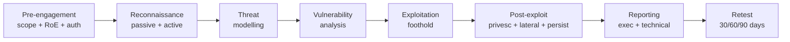

# Nüfuzetmə Testi (Penetration Testing)

**Nüfuzetmə testi** (pen test) — təşkilatın insanlarına, proseslərinə və texnologiyasına qarşı icazə verilmiş, vaxt çərçivəsi olan simulyasiya edilmiş hücumdur. Məqsəd "şəbəkəni skan etmək" deyil — bunu avtomatlaşdırılmış skanerlər onsuz da edir. Məqsəd tapıntıları real hücumçu kimi bir-birinə bağlamaq, hansılarının real biznes təsirinə yol açdığını sübut etmək və mühəndislik təşkilatının tətbiq edə biləcəyi hesabat təqdim etməkdir. Skaner sizə "Apache 2.4.49 quraşdırılıb və CVE-2021-41773 var" deyir. Pen-tester isə "həmin path-traversal ilə `wp-config.php`-ni oxudum, DB parolları ilə `users` cədvəlini boşaltdım, 30 saniyəyə dörd parol açdım, VPN-ə maliyyə direktoru kimi daxil oldum və SAP istehsalat bazasına çatdım" deyir. Bunlar fərqli nəticələrdir.

## Bu niyə vacibdir

Yetkin təşkilatlar tam xarici pen testi **ən azı ildə bir dəfə** və əlavə olaraq hər böyük buraxılışdan əvvəl keçirirlər — yeni publik veb tətbiqi, yeni satınalmanın inteqrasiyası, böyük arxitektura dəyişikliyi, ISO 27001 / SOC 2 / PCI-DSS audit pəncərəsi. Tənzimləyicilər bunu gözləyir: PCI-DSS 4.0 hər Cardholder Data Environment üzərində illik pen testi tələb edir, HIPAA Security Rule "müntəzəm qiymətləndirmə" tələb edir, və əksər kibersığorta polislərı indi yenilənmədən əvvəl ən son pen-test hesabatını soruşur. Çatdırılan iş həm də növbəti 12 ayın bərpa backlog-unu formalaşdırır — noyabr pen testinin kritik tapıntısı adətən səhəri gün P0 biletinə çevrilir.

Digər səbəb **hüquqi**dir. Yazılı icazə olmadan pen testi bu kursun aid olduğu praktiki olaraq hər yurisdiksiyada cinayətdir. ABŞ-da **Computer Fraud and Abuse Act (CFAA, 18 U.S.C. § 1030)** "qorunan kompüterə" icazəsiz girişi sayğı başına 10 ilə qədər həbs cəzası ilə cinayət sayır. Birləşmiş Krallıqda **Computer Misuse Act 1990** eynisini edir. Azərbaycanda **Cinayət Məcəlləsinin 271–273-cü maddələri** (icazəsiz giriş, qeyri-qanuni müdaxilə, və zərərli proqram yaradılması/yayılması) həbs cəzaları daşıyır. Ödənişli peşəkar işlə cinayət istintaqı arasındakı sərhəd bir imzalı kağız parçasıdır — testçinin testdən əvvəl aldığı **icazə məktubu**, bəzən "həbsdən qurtarmaq" məktubu adlandırılır. Kağız yoxdursa, pen test yoxdur.

## Əsas anlayışlar

### Pen test, zəiflik skanı və red team

Bu üç termin tez-tez qarışdırılır — onlar *eyni* fəaliyyət deyil.

- **Zəiflik skanı** — avtomatlaşdırılmış, geniş əhatəli, adətən autentifikasiya olmadan. Nessus, OpenVAS, Qualys CIDR diapazonuna istiqamətlənir və CVE-lərin və yanlış konfiqurasiyaların siyahısını çıxarır. Ucuz, təkrarlanan, həftəlik işləyir. *Məlum* problemləri tutur. Tapıntının sizin mühitdə istismar edilə biləcəyini deyə bilməz.
- **Nüfuzetmə testi** — manual, dərinliyə əsaslanan, vaxt çərçivəli, məhdud miqyaslı. Bacarıqlı insanlar skaner çıxışını başlanğıc nöqtəsi kimi götürür, yanlış müsbətləri aradan qaldırır, tapıntıları zəncirləyir və biznes təsirini sübut edir. İllik və ya yarımillik.
- **Red team angajmanı** — məqsəd əsaslı, təhdid emulasiyası. Məqsəd "M&A qovluğunu `\\fs01\finance$`-dən SOC tərəfindən aşkar edilmədən sızdırmaq"dır, "bütün zəiflikləri sadalamaq" deyil. Adətən aylarla davam edən, daha kiçik miqyaslı, texnikada daha geniş (fişinq, OSINT, fiziki giriş, xüsusi malware). Sadəcə qarşısının alınmasını deyil, aşkarlama və cavabı test edir. Bax: [İlkin Giriş Texnikaları](./initial-access.md).
- **Bug bounty proqramı** — kənar tədqiqatçılara davamlı test etmək üçün publik və ya özəl dəvətnamə, hər təsdiqlənmiş tapıntı üçün ödəniş. Pen testlərini həmişə açıq əhatə və yığma yaradıcılıqla tamamlayır. Yalnız nəşr edilmiş proqram qaydaları çərçivəsində qanunidir — aktiv proqram olmadan test niyyətdən asılı olmayaraq icazəsiz girişdir.

Pen test "nə istismar edilə bilər?" sualına cavab verir. Red team "vaxtında fərq edərdikmi?" sualına cavab verir. Zəiflik skanı "hansı məlum problemlər mövcuddur?" sualına cavab verir. Yetkin təhlükəsizlik proqramları üçünü də fərqli kadensiyalarda işlədir — skanlar həftəlik, pen testlər illik, red team-lər əsas zəiflik gigiyenası yerinə yetirildikdən sonra hər 18–24 ayda bir. Hələ publik CVE-lərini patch etməyən təşkilata red team xərcləməsi israfdır; bir ildən artıq skan edilməmiş perimetrə pen test xərcləməsi firmaya təşkilatın pulsuz bağlaya biləcəyi tapıntıları yenidən kəşf etməyi xahiş etməkdir.

Pen testin *daxilində* də keyfiyyət spektri var. Ən ucuz qiymətli "uyğunluq pen testi" çox vaxt iki gün skaner işlədib çıxışı yazıya köçürən bir testçidir — yuxarıdakı anti-nümunə. "Real" pen test manual triajı, istismar zəncirlərini, biznes təsiri xəritələndirməsini və hesabata kıdemli mühəndis vaxtını büdcəyə salır. İkisi arasında 5–10× qiymət fərqi olağandır; ucuz nəticə nadirən dəyərinə dəyər.

### Test növləri

**Testçiyə verilən bilik** üzrə:

- **Black box** (a.k.a. *naməlum mühit*) — testçiyə yalnız şirkət adı və hədəf URL/IP diapazonu verilir. Xarici hücumçunu əks etdirir. Yüksək realizm, az əhatə — vaxt büdcəsində bir çox tapıntıya çatılmayacaq. Ən faydalı ölçü "yad adam beş gündə nə edə bilər?"
- **White box** (a.k.a. *kristal qutu*, *təmiz qutu*, *məlum mühit*) — testçi mənbə kodu, arxitektura diaqramları, etibarlı hesab məlumatları, şəbəkə xəritələri alır. Dollar başına ən yüksək əhatə; tam görmə qabiliyyətinə malik insayderı əks etdirir. Komandanın artıq kritik olduğunu bildiyi sistemdə problemlərin *əsl* dərinliyini tapmaq üçün ən faydalı.
- **Gray box** (a.k.a. *qismən məlum mühit*) — bir yerdə ortada. Real dünyada ən geniş yayılmış variant: testçiyə aşağı imtiyazlı istifadəçi hesabı və əhatəli host siyahısı verilir, lakin mənbə kodu yox. Əksər angajmanlar üçün xərc-effektiv standart; testçiyə nəyin istismar edilə bildiyini kəşf etmənin realizmini itirmədən bütün dalan yollarını tez aradan qaldırmağa imkan verir.

**Mövqe nöqtəsi** üzrə:

- **Xarici** — publik internetdən, perimetrə qarşı (veb tətbiqlər, VPN, poçt, açıq API-lər).
- **Daxili** — korporativ şəbəkə daxilindən, zərərli işçini və ya artıq dayağı olan hücumçunu simulyasiya edir.

**Hədəf növü** üzrə: şəbəkə infrastrukturu, veb tətbiqi, mobil tətbiq, simsiz (Wi-Fi, Bluetooth), bulud (AWS/Azure/GCP), API, ICS/OT, fiziki (kart klonlama, kilid açma, izləmə), və **sosial mühəndislik** (fişinq, vishinq, pretekstinq — bax: [Sosial Mühəndislik və Maarifləndirmə](./social-engineering.md)).

Müəyyən bir angajman adətən bunlardan bir neçəsini birləşdirir: tipik "xarici pen test" xarici şəbəkə + perimetr veb tətbiqi + kiçik fişinq simulyasiyasını ehtiva edir. "Daxili pen test" adətən fərz edilən pozulma + AD enumerasiyası + lateral hərəkət + məlumat sızdırılmasını ehtiva edir. Qiymət əhatəli aktivlərin sayı *və* test növlərinin müxtəlifliyi ilə miqyaslanır, çünki hər növ fərqli mütəxəssis bacarığı tələb edir.

### Angajman növləri

- **Tam əhatəli xarici** — sıfırdan başlayır, perimetri pozur, içəriyə doğru işləyir. Ən realist, ən yavaş.
- **Fərz edilən pozulma (assumed-breach)** — angajman testçinin artıq korporativ iş stansiyasında olması ilə *başlayır* (müştəri laptop və ya VM təmin edir). "Enmə" mərhələsini buraxır və büdcəni lateral hərəkət, imtiyaz artırılması və sızdırılmasına xərcləyir. Perimetr son zamanlar test edilibsə, böyük dəyər.
- **Purple team** — testçilər və SOC / blue team yan-yana və açıq şəkildə işləyir. Hər hücum texnikası icra edilir, SOC öz aşkarlamalarının işləyib-işləmədiyini yoxlayır, boşluqlar real vaxtda doldurulur. Zəiflik siyahısı yaratmaq əvəzinə aşkarlama əhatəsini optimallaşdırır.
- **Düşmən emulasiyası** — red-teaming-in xüsusi halı, burada testçi *konkret* təhdid aktyorunu (məsələn, FIN7, APT29) MITRE ATT&CK-dan dərc edilmiş TTP-lərlə emulyasiya edir. Aydın məlum təhdid modeli olan təşkilatlar üçün faydalıdır.
- **Stol başı məşqi (tabletop)** — heç texniki deyil; komandanın hipotetik insidentə necə cavab verəcəyinin müzakirəyə əsaslanan müşahidəsi. Ucuz, sürətli və texniki pen testin faydalı tamamlayıcısı.

Sahədə istifadə olunan rəng kodlu komanda taksonomiyası: **red team** = hücum, **blue team** = müdafiə, **white team** = məşq təşkilatçıları və hakimlər, **purple team** = red və blue birgə işləyir. Bəzi təşkilatlar həm də qonşu rollar üçün *sarı* (qurucular/tərtibatçılar) və *yaşıl* (devops) istifadə edir, lakin bilməli olduğunuz dörd rəng red/blue/white/purple-dur.

### Angajman qaydaları (Rules of Engagement, RoE)

**RoE** qeyri-qanuni hakerliyi qanuni pen testinə çevirən müqavilədir. Tam RoE sənədi aşağıdakıları müəyyən edir:

- **Əhatədəki hədəflər** — dəqiq IP diapazonları, FQDN-lər, tətbiqlər, AD domenləri. Siyahıda yoxdursa, əhatədə *deyil*.
- **Əhatədən kənar / qadağan edilmiş hədəflər** — şirkətə məxsus olmayan üçüncü tərəf SaaS, partnyor sistemləri, işçilərin şəxsi cihazları, pozulması pula başa gələcək hər şey (ödəniş şlüzləri, dövr ortası billing sistemləri).
- **İcazə verilən texnikalar** — fişinq icazəlidir? Fiziki giriş? DoS testi? Standart açıq şəkildə sadalanmadıqda *yox*-dur.
- **Vaxt pəncərələri** — test saatları, qaranlıq tarixlər (pik alış-veriş, maliyyə bağlanması, idarə heyəti iclasları).
- **Təcili əlaqələr** — hər iki tərəfdə 24/7 telefon nömrələri. Testçi 02:00-da təsadüfən istehsalatı pozarsa, on-call mühəndislə saniyələrlə əlaqə saxlamalıdır.
- **Sübut idarəetməsi** — tapıntıların, ekran görüntülərinin və çıxarılan məlumatların angajman sonunda necə saxlanması, şifrələnməsi və məhv edilməsi.
- **İcazə məktubu** — şirkət başlıqlı kağızda imzalanmış, tarixli sənəd, testçi və əhatəni adlandırır, testçi test zamanı yanında daşıyır. Polis dayandırma sığortası.

Kiçik, lakin həyati bir detal: RoE və icazə məktubunu *imzalayan* şəxs əhatədəki aktivlərdə testə icazə vermək üçün hüquqi səlahiyyətə malik olmalıdır. Partnyorun infrastrukturunda yerləşən SaaS tətbiqi üçün imzalayan kiçik IT meneceri etibarlı icazə yaratmır. Bulud yerləşdirilmiş aktivlər üçün bulud provayderinin pen-test siyasəti də yoxlanılmalıdır — əksəri bu gün icazəverici standartlara malikdir, lakin müəyyən texnikaları açıq şəkildə qadağan edir (DDoS, trafik daşqını, provayder işçilərinin sosial mühəndisliyi).

### PTES — yeddi mərhələ

**Penetration Testing Execution Standard** ən geniş istifadə edilən metodologiya çərçivəsidir. Yeddi mərhələsi:

1. **Angajmana qədər qarşılıqlı əlaqə** — miqyaslandırma, RoE, müqavilələr, icazə, uğur meyarları.
2. **İntellect toplama** — kəşfiyyat, OSINT, hədəf enumerasiyası.
3. **Təhdid modelləşdirməsi** — bu təşkilatı hansı hücumçu hədəfləyər və necə?
4. **Zəiflik analizi** — zəiflikləri kəşf və təsdiq.
5. **İstismar** — zəiflikləri girişə çevirmək; dayağı qurmaq.
6. **İstismardan sonra** — imtiyaz artırılması, lateral hərəkət, biznes təsirinin sübutu.
7. **Hesabatlaşdırma** — icra xülasəsi, tapıntılar, sübutlar, bərpa ilə yazılı nəticə.

Mərhələlər praktikada ciddi xətti deyil. İstismardan sonra mərhələdəki tapıntı testçini yeni daxili alt şəbəkəni xəritələmək üçün kəşfiyyata qaytarır; 5-ci mərhələdə rədd edilmiş istismar cəhdi onları alternativ yol tapmaq üçün zəiflik analizinə qaytarır. Yeddi mərhələni *Gantt diaqramı* deyil, *yoxlama siyahısı* kimi qəbul edin.

### Digər metodologiyalar

- **OSSTMM** (Open Source Security Testing Methodology Manual, ISECOM) — beş kanalda ölçülə bilən təhlükəsizlik reytinqlərinə və əməliyyat nəzarətlərinin testinə diqqət yetirir: insan, fiziki, simsiz, telekommunikasiya və məlumat şəbəkələri. Ətraflı və ağır; uyğunluq əsaslı işlər üçün populyar.
- **NIST SP 800-115** — texniki təhlükəsizlik testi üçün ABŞ federal təlimatı. **planlaşdırma / kəşf / hücum / hesabatlaşdırma** dörd mərhələli modelini müəyyən edir. PTES-dən az təlimatlandırıcıdır, lakin ABŞ publik sektor angajmanları üçün de-fakto istinaddır.
- **OWASP WSTG** (Web Security Testing Guide) — hər veb pen-tester tərəfindən istifadə olunan tətbiq səviyyəli test yoxlama siyahısı. [OWASP Top 10](./owasp-top-10.md)-a uyğun gəlir.
- **OWASP MSTG / MASTG** — WSTG-nin mobil ekvivalenti, iOS və Android tətbiq testini əhatə edir.
- **MITRE ATT&CK** — metodologiya deyil, real hücumçu texnikalarının *davranış* taksonomiyasıdır, getdikcə daha çox tapıntıları xəritələmək ("biz T1110.003 — Password Spraying-i yerinə yetirdik") və aşkarlama mühəndisliyi ilə uyğunlaşmaq üçün istifadə olunur.
- **PCI-DSS Penetration Testing Guidance** — kart sahibinin məlumatlarını idarə edən hər təşkilat üçün məqbul illik pen testi sayan PCI-DSS 11.4-ə sektora xas əlavə.

Praktikada əksər angajmanlar bir *əsas* metodologiya seçir (adətən PTES) və OWASP və MITRE taksonomiyalarını tapıntı səviyyəli struktur üçün götürür. Metodologiya seçimi hesabatda qeyd edilməlidir ki, müştəri nə aldığını bilsin və gələcək testlər oxşar şəkildə müqayisə edilə bilsin.

### Kəşfiyyat (Recon)

Kəşfiyyat **passiv** (paketlər hədəfə toxunmur) və **aktiv** (paketlər hədəfə toxunur) bölünür.

**Passiv mənbələr:**

- **Şirkət üzərində OSINT** — LinkedIn (işçi adları, rolları, iş elanlarında adlanan texnologiyalar), GitHub (depolarda və commit tarixçəsində sızdırılmış sirlər; `trufflehog`, `gitleaks` kimi alətlər), şirkətin öz marketinq səhifələri və SEC sənədləri.
- **DNS** — `dig`, `dnsrecon`, `amass passive`. Wordlistlərlə və **Certificate Transparency logs** vasitəsilə subdomain enumerasiyası (`crt.sh` domen üçün indiyədək verilmiş hər TLS sertifikatını qaytarır — anlıq subdomain inventarı).
- **Axtarış mühərrikləri və Google dorks** — `site:example.local filetype:pdf`, `inurl:admin`, `intitle:"index of"`.
- **Shodan / Censys / FOFA** — internet miqyasında skan bazaları. `org:"Example Local"` axtarın və şirkətə məxsus hər açıq xidməti görün.
- **Sızıntı bazaları** — HaveIBeenPwned, Dehashed və oxşar xidmətlər. Köhnə hesab məlumatı dumpları parol səpilməsi materialının əla mənbəyidir; 2018 LinkedIn sızıntısının parolunu yenidən istifadə etmiş `EXAMPLE\` istifadəçisi hələ də həmin parolu istifadə edir ola bilər.
- **Wayback Machine və arxiv saytları** — şirkət saytının köhnə versiyaları çox vaxt sonra silinmiş, lakin hələ də cavab verə bilən endpoint-lər, parametrlər və ya üçüncü tərəf inteqrasiyalarını ifşa edir.

**Aktiv mənbələr:**

- **Port skanı** `nmap -sS -p- -T3` ilə, sonra tapılmış portlarda xidmət-versiya skanı `nmap -sV -sC` ilə.
- **Banner ələ keçirilməsi** — `nc target 25` SMTP serverini və versiyasını ifşa edir; HTTP `Server:` başlıqları nginx/IIS/Apache versiyalarını sızdırır.
- **Veb tarama və məzmun kəşfi** — `gobuster`, `feroxbuster`, `dirsearch` gizli qovluqları və admin yollarını tapır.
- **Subdomain bruteforce** — `subfinder`, `amass enum -active`.

Passiv və aktiv arasındakı sərhəd hüquqi cəhətdən vacibdir: passiv kəşfiyyat (publik LinkedIn səhifəsini oxumaq) hər yerdə birmənalı qanunidir. Aktiv kəşfiyyat (üçüncü tərəfə məxsus IP-yə qarşı TCP SYN skanı) bəzi yurisdiksiyalarda öz-özlüyündə cinayətdir. Skan edilən hər IP-nin müştəriyə məxsus olduğunu və ya AUP-si icazə verən provayder tərəfindən hosting edildiyini yazılı olaraq təsdiq edin.

### Zəiflik müəyyənləşdirilməsi

Kəşfiyyat aktiv inventarı yaratdıqdan sonra zəifliklər avtomatlaşdırılmış skan və manual analiz birləşməsi ilə müəyyənləşdirilir:

- **Şəbəkə skanerlərı:** Nessus, OpenVAS, Qualys, Rapid7 InsightVM. CVE etiketli tapıntılar yaradır.
- **Veb tətbiq skanerlərı:** Burp Suite Pro, OWASP ZAP, Acunetix, Netsparker. Tətbiqi spider edir və SQLi, XSS, IDOR üçün formaları yoxlayır.
- **Bulud konfiqurasiya skanerlərı:** AWS/Azure/GCP yanlış konfiqurasiyası üçün ScoutSuite, Prowler, CloudSploit.
- **Konteyner və IaC skanerlərı:** Docker imicləri, Kubernetes manifestləri, Terraform üçün Trivy, Checkov, kube-bench.
- **Manual triaj** — bacarıqlı testçi yuxarı skaner tapıntılarını əl ilə yenidən işlədir. Skanerlər ilk keçiddə 30–60% yanlış müsbət istehsal edir, xüsusən HTTPS sertifikat zəncirləri, distrolar tərəfindən geri portlanmış "zəif" versiya sətirləri və yanlış işləmiş autentifikasiyalı yoxlamalar ətrafında. Pen-test dəyəri əsasən bu triaj addımındadır. Standart alət dəsti üçün bax: [Zəiflik və AppSec Alətləri](../general-security/open-source-tools/vulnerability-and-appsec.md).

Praktiki iş axını: skaner çıxışını tək qeyd bazasına (Obsidian, Notion və ya hətta cədvəl) idxal edin, dublikatları çıxarın, sonra triaj sütunu (`təsdiqləndi` / `yanlış müsbət` / `lab tələb edir` / `əhatədən kənar`) ilə yuxarıdan aşağı gəzin. `təsdiqləndi` işarələnmiş tapıntılar dərhal hesabat layihəsinə daxil olur; `lab tələb edir` qeydləri istismarı təhlükəsiz test etmək üçün paralel lab quruluşu alır; `yanlış müsbət` qeydləri əlavə üçün bir sətirlik qeyd alır ki, müştəri sizin onları görməzdən gəlmədiyinizi bilsin.

### İstismar

Məqsəd: təsdiqlənmiş zəifliyi **girişə** çevirmək, ən kiçik təsir radiusu ilə və istehsalatı pozmadan. Ümumi alətlər:

- **Metasploit Framework** — CVE üzrə indeksləşdirilmiş minlərlə modulu olan modulyar istismar çərçivəsi. `db_nmap` istifadə edərək skan məlumatlarını idxal edin, modulu tapmaq üçün `search type:exploit cve:2021-44228`, icra etmək üçün `set RHOSTS` / `run`.
- **Manual istismarlar** — publik Metasploit modulu etibarsız və ya mövcud olmayan zəifliklər üçün; Exploit-DB-dən, ExploitDB CLI-dan (`searchsploit`) endirin və ya xüsusi yazın.
- **İstismar intizamı** — istehsalat sisteminə qarşı *test edilməmiş* heç nə işlətməyin. Əvvəlcə labda hədəf versiyanın surətini qaldırın. Yeganə seçim istehsalatda test etməkdirsə, RoE-də riskin açıq yazılı təsdiqini alın.
- **Veb istismarı** — Burp Repeater, sqlmap, xüsusi yüklər. Tam alət dəsti [OWASP Top 10](./owasp-top-10.md)-da əhatə olunur.

Faydalı qayda: *ən az invaziv* sübutu üstün tutun. `time-based blind SQLi` 5 saniyəlik `SLEEP(5)` ilə bazanın hücumçunun SQL-ini icra etdiyini sübut edirsə, hesabatda iddianı təsdiqləmək üçün bütün `users` cədvəlini boşaltmağa ehtiyacınız yoxdur. Ekran görüntüsü çəkin, vaxtı qeyd edin, davam edin. Ağır məlumat çıxarılması RoE şikayətlərinə səbəb olur — və məlumat tənzimlənibsə (PII, PHI, ödəniş kart məlumatı), bu testin qarşısını almaq istədiyi *yeni* uyğunluq insidentini yarada bilər.

### İstismardan sonra (Post-exploitation)

Dayaq qurulduqdan sonra testçi təsiri nümayiş etdirmək üçün mövqe dəyişdirir:

- **İmtiyaz artırılması (Linux)** — `LinPEAS`, `linux-exploit-suggester`, kernel-istismar bazaları. SUID ikililəri, yazıla bilən PATH, sudo yanlış konfiqurasiyası (`sudo -l`), capability-lər, root kimi işləyən cron işləri, `/etc`-də dünyaca yazılan fayllar, systemd unit fayllarında zəif icazələr axtarın.
- **İmtiyaz artırılması (Windows)** — `WinPEAS`, `Seatbelt`, `PowerUp`. Sitatsız xidmət yollarını, yazıla bilən xidmətləri, `AlwaysInstallElevated`-i, kerberoast edilə bilən hesabları, köhnə `SYSVOL` paylaşımlarındakı GPP cpasswords-ları, token impersonasiyasını və DLL-hijack imkanlarını axtarın.
- **Hesab məlumatı dumpu** — Windows-da yaddaşdakı creds və Kerberos biletləri üçün `Mimikatz` (`sekurlsa::logonpasswords`). Bütün NTDS.dit hash bazası üçün domen kontrolyoruna qarşı Impacket-dən `secretsdump.py`. Linux-da root olduqda `/etc/shadow`, üstəgəl istifadəçi ev qovluqlarındakı SSH açarları və ətraf mühit fayllarındakı hesab məlumatları.
- **Lateral hərəkət** — `pass-the-hash` (`pth-winexe`, Impacket `wmiexec`), `pass-the-ticket`, `Kerberoasting` (xidmət-bileti tələb → offline crack → xidmət-hesab parolu), `PsExec`/`PSRemoting`, AD hücum yollarını xəritələmək üçün BloodHound, çoxdomenli meşələrdə cross-trust münasibətlərinin sui-istifadəsi.
- **Bulud lateral hərəkət** — iş stansiyası ələ keçirildikdən sonra AWS CLI profillərini, Azure CLI tokenlərini, GCP hesab məlumatlarını, kubeconfig fayllarını və `~/.docker/config.json`-ı axtarın. Önbelleklenmiş `aws sso login` olan laptop birbaşa istehsalat bulud hesabına keçə bilər.
- **Biznes təsirinin sübutu** — "Mən Domain Admin oldum" əvəzinə "M&A qovluğunu oxudum, istehsalat DB-ni boşaltdım, baş direktorun poçt qutusuna daxil oldum" göstərin. Bu rəhbər komandasını oyandıran şeydir.

Dəqiq bilməyə dəyər iki imtiyaz artırılması fərqi. **Şaquli imtiyaz artırılması** *eyni* identifikasiya təbəqəsində daha yüksək hüquqlar əldə etməkdir — adi istifadəçinin eyni maşında administrator olması. **Üfüqi imtiyaz artırılması** eyni imtiyaz səviyyəsində *başqa* istifadəçinin hesabını ələ keçirməkdir — Alice-in Bob-un poçtunu oxuması. Hər ikisi vacibdir; yalnız şaquli artırılmanı bildirən angajmanlar tez-tez eyni dərəcədə ciddi olan üfüqi IDOR-tipli tapıntıları əldən verir. **Pivoting** əmidir texnikadır: bir şəbəkə seqmentində kompromis edilmiş hostdan kənardan görünməyən maşınlara çatmaq üçün kəşf prosesini təkrarlayın. Seqmentləşdirilmiş mühitin pen testi adətən iki və ya üç dəfə pivot edəcək — perimetr veb tətbiqi → DMZ host → daxili jump server → imtiyazlı enklav.

### Davamlılıq və təmizləmə

Real hücumçular yenidən başlatma arasında davamlılığı saxlayır — backdoor hesablar, planlaşdırılmış tapşırıqlar, registry Run açarları, WMI hadisə abunəlikləri. **Pen-testçilər yalnız RoE açıq şəkildə icazə verirsə davamlılıq saxlayırlar**, və hətta bu zaman ciddi məhdud məqsəd üçün (məsələn, SOC-un yeni planlaşdırılmış tapşırığı görüb-görmədiyini test etmək). **Angajmanın sonunda** test zamanı yaradılan hər artefakt silinməlidir: alət ikililəri, yaradılmış hesablar, dəyişdirilmiş registry açarları, planlaşdırılmış tapşırıqlar, istismar zamanı atılmış fayllar. Testdən sonra qalan backdoor karyeranı və müqavilələri sona çatdıran səhv növüdür.

Təmizləmə həm də sübut məsələsidir. Standart intizam: test işlədiyi kimi real vaxtda **artefakt jurnalı** saxlayın (yaradılan hər hesab, atılan hər fayl, əlavə edilən hər planlaşdırılmış tapşırıq, dəyişdirilən hər registry dəyəri, host, vaxt və testçi adı ilə). Angajman sonunda jurnalı yuxarıdan aşağı gəzin, hər elementi silin və silməyin işlədiyinə inanaraq deyil, *kəşfi* yenidən işlədərək silməni təsdiqləyin. İkinci testçinin müstəqil təsdiq etməsini təmin edin. Eyni jurnal hesabatın sübut əlavəsini qidalandırır.

### Hesabatlaşdırma

Hesabat çatdırılan işdir — qalan hər şey su tesisatıdır. Standart struktur:

1. **İcra xülasəsi** — bir səhifə, biznes dili. Ümumi risk reytinqi, ən çox üç tapıntı, başlıq tövsiyəsi. CFO bunu oxuyur.
2. **Metodologiya və əhatə** — nə test edildi, nə vaxt, hansı RoE ilə.
3. **Texniki tapıntılar** — hər tapıntı üçün bir qeyd: başlıq, CVSS bal, təsirlənmiş aktivlər, təkrar yaratma addımları, ekran görüntüləri/PoC çıxışı, biznes təsiri, bərpa, istinadlar.
4. **Sübut əlavəsi** — tam alət çıxışı, sorğu/cavab tutmaları, ekran görüntüləri.
5. **Bərpa yol xəritəsi** — səy qiymətləndirmələri ilə prioritetləşdirilmiş siyahı.
6. **Yenidən test planı** — kritik/yüksək tapıntıların 30/60/90 gün ərzində əlavə xərc olmadan yenidən test ediləcəyi razılığı.

Hər tapıntı qeydi həm də **CVSS v3.1 vektor sətrini** (məsələn `AV:N/AC:L/PR:N/UI:N/S:U/C:H/I:H/A:H`) daşımalıdır ki, downstream biletləşdirmə və SLA məntiqi avtomatlaşdırıla bilsin, və **MITRE ATT&CK xəritələnməsi** ki, aşkarlama mühəndisliyi eyni tapıntını götürə bilsin ("biz T1078 — Etibarlı Hesablar yerinə yetirdik; növbəti dəfə işləməli olan Sigma qaydası budur"). Hər ikisini ehtiva etməyən hesabat, alt texniki məzmun eyni olsa belə, hər ikisini ehtiva edəndən daha çətin tətbiq olunur.

### Zəiflik skanı vs pen test — yan-yana

| Ölçü | Zəiflik skanı | Nüfuzetmə testi |
|---|---|---|
| **Sürücü** | Avtomatlaşdırılmış alət | Bacarıqlı insan |
| **Kadensiya** | Həftəlik / davamlı | İllik / yarımillik |
| **Çıxış** | CVE və CVSS balların siyahısı | Hücum zəncirləri + biznes təsiri hekayəsi |
| **Xərc** | Aşağı (alət lisenziyası + analitik vaxtı) | Yüksək (çox-testçili, çox-həftəli) |
| **Yanlış müsbət dərəcəsi** | İlk keçiddə 30–60% | Son hesabatda sıfıra yaxın |
| **Naməlum problemləri tutur** | Nadirən | Bəli — zəncirli məntiq qüsurları, biznes-məntiq xətaları |
| **Təsiri sübut edir** | Yox | Bəli |
| **Digərini əvəz edir** | Heç vaxt | Heç vaxt |

İkisi bir-birini tamamlayır. *Məlum* problemləri tez və ucuz tutmaq üçün skanları davamlı işlədin; skanerin görə bilmədiyini tutmaq və skanerin işarələdiyi elementlərin biznes üçün nə demək olduğunu sübut etmək üçün pen testlərini dövri olaraq işlədin.

## Pen-test mərhələ diaqramı

## Karyera və sertifikatlaşdırma yolu

Bunu peşəkarcasına *etmək* istəyən oxucular üçün qısa kənarlaşma. Standart proqress:

- **Əsaslar** — şəbəkəçilik (CompTIA Network+ və ya ekvivalent), Linux idarəetməsi, scripting (Python, Bash, PowerShell). Əksər pen-test müsahibələri "Kerberoasting izah edin"-də deyil, "TCP handshake-i izah edin"-də uğursuz olur.
- **Giriş səviyyəli sertifikatlar** — CompTIA PenTest+, eLearnSecurity eJPT. Ucuz, HR filtrlərini keçməyə kömək edir.
- **Orta səviyyə** — **OSCP** (Offensive Security Certified Professional) hələ də pen-test iş elanlarında ən çox tələb olunan nişandır; 24-saatlıq imtahan ağırdır, lakin əsl bacarıq qurur. AD mütəxəssisləri üçün CRTP / CRTE.
- **Kıdemli** — **OSCE3** (OSEP + OSED + OSWE), **CREST CRT/CCT**, **GIAC GPEN/GXPN**, veb tətbiq mütəxəssisləri üçün **OSWE**. CREST bir çox UK və AB publik sektor angajmanları üçün məcburidir.
- **İxtisaslaşma** — simsiz (OSWP), mobil (OSMR), bulud (vendor-spesifik), ICS/OT (GICSP). Generalistlər yaxşı qazanır; mütəxəssislər çox yaxşı qazanır, lakin aylar əvvəl planlaşdırılır.

İşin digər yarısı *yazıdır*. AD meşəsini bir gündə texniki ələ keçirə bilən, lakin CFO-nun başa düşə bilməyəcəyi hesabat yazan pen-tester bərabər texniki bilikli güclü yazma bacarığı olan adamın yarısını qazanır. Hər həll etdiyiniz qutuda icra xülasələri yazmağı məşq edin.

## Praktika / məşq

Sahib olduğunuz lab tutumuna uyğun məşqləri seçin. Bunların heç biri sahib olmadığınız və ya açıq yazılı icazəniz olmayan sistemlərə qarşı yerinə yetirilməməlidir.

1. **Təlim platformasında başlanğıc qutu.** [HackTheBox](https://www.hackthebox.com/) və ya [TryHackMe](https://tryhackme.com/)-yə qeydiyyatdan keçin və başlanğıc reytinqli bir Linux qutusunu uçdan-uca həll edin (məsələn, *Lame*, *Blue*, *Pickle Rick*). Hər addımı (kəşfiyyat → istismar → privesc → flag) markdown faylında mini hesabat kimi sənədləşdirin. Hər mərhələnin nə qədər çəkdiyini qeyd edin.
2. **Nessus skanını triaj edin.** Kiçik lab qurun — `Metasploitable2` və `Metasploitable3` işləyir — və `nmap -sV -sC -p- 10.10.10.0/24` ardınca autentifikasiyalı Nessus skanı işlədin. Nəticə tapıntı siyahısını götürün və **ən yuxarı 10-u manual təsdiq edin**. Hər birini *həqiqi müsbət*, *yanlış müsbət* və ya *informasiyalı* kimi işarələyin. Yanlış müsbətləri yanlış edənlərin nə olduğunu yazın.
3. **Metasploit ilə istismar zənciri.** Eyni labda bir Metasploit istismar modulu seçin (məsələn `exploit/unix/ftp/vsftpd_234_backdoor` və ya `exploit/windows/smb/ms17_010_eternalblue`), keçin və *tam zənciri* sənədləşdirin: zəifliyin necə kəşf edildiyi, modulun mexanizmi, istismardan sonrakı addımlar, hansı imtiyazların əldə edildiyi, və müdafiəçinin hər addımı necə aşkarlayacağı və ya qarşısını alacağı.
4. **Kiçik AD labda hesab məlumatı dumpu + lateral hərəkət.** GOAD (Game Of Active Directory) və ya xüsusi quruluş istifadə edərək 2-host AD labı qurun — bir DC + bir iş stansiyası. Aşağı imtiyazlı istifadəçidən yolları xəritələmək üçün BloodHound-u işlədin, Kerberoasting yerinə yetirin, xidmət hesabını sındırın, sonra DC-yə `wmiexec.py`. Hər addım ekran görüntüsü alır. Hansı Windows hadisə ID-lərinin işləyəcəyini qeyd edin.
5. **İcra xülasəsi yazın.** 2 və ya 3-cü məşqin çıxışını götürün və qeyri-texniki idarə heyəti üzvünə ünvanlanmış bir səhifəlik icra xülasəsi yazın. Daxil edin: ümumi risk reytinqi, ən vacib tapıntının biznes baxımından nə demək olduğuna dair üç cümlə və ən yuxarı üç bərpa siyahısı. Müştərilərin pul ödədiyi yazma bacarığı budur.

4-cü məşqi ilk dəfə etdiyiniz zaman faydalı geri çağırış [Red Team Alətləri](../general-security/open-source-tools/red-team-tools.md) dərsini və [Təhlükəsizlik Qiymətləndirməsi](../general-security/assessment/security-assessment.md) dərsini yenidən nəzərdən keçirməkdir — alətlər və metodologiya çərçivəsi labda istifadə etdikdən sonra hər ikisi daha mənalı olur.

## İşlənmiş nümunə — `example.local` illik xarici pen test

Ssenari: `example.local` 2 000-işçili SaaS şirkətidir, beşinci illik xarici pen test üçün müqavilə bağlayır. 2026 angajmanı **4 həftəlik**, **3 testçi** ilə, və əhatə korporativ veb tətbiqləri + perimetr + fişinq simulyasiya kampaniyasıdır. Əhatədən kənar: istehsalat ödəniş prosessoru (üçüncü tərəf), müştəri məlumat müstəvisi (Q3-də planlaşdırılmış ayrı test), partnyor SaaS.

**0-cı həftə — angajmana qədər.** İki saatlıq miqyaslandırma çağırışı IP diapazonlarını (`203.0.113.0/24` və üç Azure alt şəbəkəsi), FQDN siyahısını (12 veb tətbiq) və fişinq pretekstini (saxta "EXAMPLE Benefits 2026 enrollment" e-poçtu) bağlayır. RoE DoS testini qadağan edir, maliyyə bağlanması həftəsi ərzində testi qadağan edir (angajmanın 3-cü həftəsi sakit həftədir), və hər aktiv skandan əvvəl SOC-a 30 dəqiqəlik bildirişi məcburi edir. İcazə məktubu CISO və CFO tərəfindən imzalanır. Slack döyüş otağı yaradılır.

**1-ci həftə — kəşfiyyat və zəiflik analizi.** 1–2-ci günlər OSINT-dir: LinkedIn-dən 1 200 işçi adı, şirkətə məxsus 14 GitHub deposu (biri 2023-cü il vintaj AWS giriş açarı saxlayır — ilk tapıntı), `crt.sh`-dən 87 subdomain. 3–5-ci günlər aktiv kəşfiyyatdır: perimetrdə nmap, hər veb tətbiqdə məzmun-kəşf, Burp passiv skan tarama. Həftə sonu: komandanın Notion DB-də 240 namizəd tapıntı.

**2-ci həftə — istismar.** Triaj siyahını 38 təsdiqlənmiş problemə endirir. Önəmlilər: müştəriyə baxan marketinq CMS-də **əks olunmuş XSS** admin parol dəyişikliyi üzərində CSRF ilə zəncirlənir → admin hesab ələ keçirilməsi (sandbox surətinə qarşı sübut edildi). Köhnə hesabatlama endpoint-ində **Java deserializasiya** qüsuru → autentifikasiya olunmamış RCE (yalnız DNS callback ilə sübut edildi — istehsalata shell atılmadı). Fişinq kampaniyası canlı işə düşür: 312 işçi kliklədi, 47 oxşar portalda creds daxil etdi, onlardan 4-ü MFA-nı keçdi (push-bildiriş yorğunluğu), və o dördün biri domain admin idi.

**3-cü həftə — istismardan sonra.** Toplanmış hesab məlumatlarını fərz edilən pozulma VM-də istifadə edərək komanda altı xidmət hesabını Kerberoast edir, ikisini sındırır (biri 2018 vintaj parolu olan `EXAMPLE\svc-jenkins`-dir). Jenkins xidmət hesabından quruluş agentinə çatırlar, orada saxlanmış Azure idarə olunan kimliyi var → Azure abunəlik Contributor rolu. Tam hücum yolu: fişinq → MFA yorğunluğu → iş stansiyası → BloodHound → Kerberoast → Jenkins → Azure. Lateral nümayiş edildi; məlumat sızdırılmadı. Bütün davamlılıq artefaktları təmizləmə üçün qeyd edildi.

**4-cü həftə — təmizləmə və hesabatlaşdırma.** Atılmış hər alət, yaradılmış hesab, planlaşdırılmış tapşırıq və registry dəyişikliyi sadalanır və silinir; SOC öz EDR telemetrisinə qarşı təmizləməni təsdiq edir. 86 səhifəlik hesabat çatdırılır: 4 kritik, 11 yüksək, 19 orta, 4 aşağı tapıntı. İcra xülasəsi fişinq-Azure yolunu başlıq adlandırır. Kritik/yüksək tapıntılar üçün 60 günlük yenidən test razılaşdırıldı; 1-ci həftədəki AWS açarı ilkin xəbərdarlıqdan 4 saat ərzində dəyişdirildi.

Hesab: təxminən 85 000 funt sterlinq. Aradan qaldırılan risk: kritik tapıntılardan biri — publik üzlü hesabatlama endpoint-indəki Java RCE — altı- və ya yeddi-rəqəmli pozulmaya ön qapı ola bilərdi. Fişinq tapıntısı MFA siyasətinin push-təsdiqdən nömrə-uyğunluğa tam yenidən işlənməsinə səbəb oldu, bu da qonşu şirkətdə real 2025 pozulmasının qarşısını alardı.

Bu icradan bir neçə angajman idarəetməsi detalını vurğulamağa dəyər. Birincisi, SOC ilə **döyüş otağı Slack kanalı** gündə təxminən iki dəfə istifadə edildi — hər aktiv skan əvvəlcədən elan edildi, SOC-un araşdırdığı hər xəbərdarlıq sıçrayışı sonra test trafiki kimi təsdiqləndi və ya rədd edildi. İkincisi, **artefakt jurnalı** angajmanı 41 qeydlə bitirdi; təmizləmə keçidi əlavə yarım gün çəkdi, lakin təmiz təhvil verdi. Üçüncüsü, **hesabat layihəsi** son həftədə üç nəzərdən keçirmə dövrü keçdi — daxili QA, texniki rəhbər nəzərdən keçirməsi və son müştəri-oxuma görüşü. Bu addımların heç biri parlaq görünmür, lakin onların hamısı istifadə edilə bilən nəticəni heç kəsin açmadığı 200 səhifəlik PDF-dən ayıran şeylərdir.

## Problem həlli və tələlər

- **Yazılı icazə olmadan test etmək.** Başlıqlı kağızda imzalı məktub yoxdur = test yox. Menecerdən şifahi "bəli, davam et" icazə deyil. Polis, FBI və prokurorlar bunu qəbul etmir.
- **Əhatə dreyfi.** Testçi cəlbedici əhatədən kənar hədəf ("partnyor billing API-si zəif görünür") tapır və "sadəcə yoxlamaq üçün" toxunur. Bu artıq üçüncü tərəfə qarşı federal cinayətdir. Dayanın, soruşun, əhatəni *yazılı şəkildə* dəyişdirin və ya toxunmayın.
- **Aqressiv skanların istehsalatı pozması.** Cümə günü günortadan sonra zəif köhnə tətbiqə qarşı `nmap -T5` və ya `nikto` şirkəti həftəsonu üçün dayandırır. Skan sürətini tənzimləyin, pəncərələri əlaqələndirin, əvvəlcə soruşun.
- **SOC ilə əlaqələndirməmək.** SOC pen-test trafikini görür, insident biletləri açır, on-call-u səfərbər edir, saatlar yandırır. Ya əvvəlcədən bildirin ki, görməzdən gəlsinlər (daha az realist), ya da səssiz işləyin və angajmanı aşkarlama testi edin (daha dəyərli, əvvəlcədən razılaşdırılmalıdır).
- **Testdən sonra backdoor qoymaq.** `EXAMPLE\pentest_admin` yaradıldı, planlaşdırılmış tapşırıq `PT_Beacon`, `HKLM\...\Run` dəyişdirildi — və angajman sonunda yalnız üçdən ikisini silməyi "xatırladıq". İndi müştəridə qalıq implant var. Yazılı artefakt jurnalı saxlayın; silməni yaddaşdan deyil, *kəşfi yenidən işlədərək* təsdiqləyin.
- **Zəiflik skanını pen test kimi qəbul etmək.** 400 səhifəlik Nessus PDF-i pen test hesabatı *deyil*. Birini digəri kimi satmaq peşə əleyhinə hərəkətdir; birini digəri kimi almaq büdcəni israf etməkdir.
- **Xam skaner çıxışını tapıntı kimi hesabata atmaq.** Hər sətir Nessus-dan kopyalanıb, triaj yox, biznes konteksti yox. Mühəndisliyə faydasız və firma üçün utancverici. Real hesabatdakı hər tapıntı əl ilə yazılmışdır, tərtibatçının izləyə biləcəyi təkrar yaratma reseptilə.
- **Bərpa izlənməsi yoxdur.** Tapıntılar müştəriyə təhvil verilir və heç vaxt izlənmir. Altı ay sonra eyni kritik növbəti il hesabatında var, dəyişməmiş. Hər tapıntını sahib, son tarix ilə biletləşdirin və patch-management prosesinə yenidən qurun. Bax: [Zəiflik İdarəetməsi](../general-security/assessment/vulnerability-management.md).
- **Yenidən test yoxdur.** Müştərinin patch-ları tapıntını "düzəldir", heç kim təsdiqləmir, patch əslində problemi bağlamır. SoW-də həmişə 30/60/90 gün ərzində sıfır əlavə xərclə yenidən testi daxil edin.
- **Müştəri kritik tapıntıları bərpa etməkdən imtina edir.** İmtinanı yazılı olaraq sənədləşdirin, qəbul edən rəhbəri adlandırın, qalıq riski risk reyestrinə qeyd edin. Müştəri ilə mübahisə etməyin; məsuliyyətin testçi firmaya düşməsinə icazə verməyin.
- **Test etdiyiniz korporativ VPN-dən pivotinq.** Testçinin öz laptopu hücum səthinin bir hissəsinə çevrilir. Sərtləşdirilmiş, ayrılmış test VM-i, izolyasiya edilmiş şəbəkə çıxışı, tam disk şifrələmə, saxlanmış istehsalat hesab məlumatı yoxdur, angajman sonunda silinir.
- **Müştəri məlumatlarını şəxsi yaddaşda saxlamaq.** Tapıntı PDF-ləri, sızdırılmış fayllar, ekran görüntüləri testçinin şəxsi Dropbox-unda bitir. Böyük müqavilə və mümkün hüquqi pozulma. Yalnız firmanın təsdiqlənmiş şifrələnmiş anbarını istifadə edin; müqavilə saxlama pəncərəsindən sonra məhv edin.
- **Fiziki təhlükəsizliyə əhəmiyyət verməmək.** Testçinin yanında icazə məktubu olmadıqda fiziki pen testlər həbslə nəticələnib. Həmişə kağız nüsxə daşıyın. Müşayiətçi əlaqəsinin nömrəsini həmişə yalnız telefonda deyil, əzbər bilin.
- **Tənzimlənən sənayedə razılıq olmadan fişinq.** Bəzi yurisdiksiyalar və ya sektor tənzimləyiciləri işçilərə fişinqdən əvvəl bildiriş tələb edir (xüsusən səhiyyə, məktəblər, hökumət üçün). "Göndər" kliklədiyinizdən əvvəl yoxlayın.
- **Əhatədə 0-day yandırmaq.** Testçi angajman zamanı kommersiya proqramında 0-day taparsa, məsuliyyətli açıqlama siyasəti əvvəlcədən razılaşdırılmalıdır. Prosessiz açıqlama müqavilələri ləğv edə və vendor münasibətlərini yandıra bilər.
- **Bulud və on-prem-i eyni qəbul etmək.** AWS/Azure/GCP-nin **provayder tərəfli qaydaları** var. AWS artıq öz resurslarınızın əksər pen testi üçün icazə tələb etmir, lakin DDoS, port daşqını və "DNS zona gəzintisi" hələ də qadağandır. Angajmandan əvvəl bulud provayderinin pen-test siyasətini oxuyun.
- **Hesabatları redaktə etməmək.** Son hesabatda açıq parollar, real PII, tam sessiya tokenləri var. Çatdırılmadan əvvəl redaktə edin; nəqliyyatda şifrələyin; əsaslı pəncərədən sonra girişi sona çatdırın.
- **Pen-test yorğunluğu.** Eyni firma, eyni əhatə, eyni tapıntılar, ildən-ilə — test heç bir yeni şey tapmağı dayandırır. Hər 2–3 ildə firmaları rotasiya edin, əhatəni dəyişin, fərz edilən pozulma komponenti əlavə edin, purple-team variantı işlədin. Məqsəd *tapıntılardır*, *sertifikat* deyil.
- **CVSS balını biznes riski ilə qarışdırmaq.** Həssas məlumatı və şəbəkə çatımlığı olmayan hostda CVSS 9.8 tapıntısı müştəri bazasında CVSS 6.5-dən aşağı biznes riskidir. Skaner sizin mühitinizi bilmir; hesabat xam ballə əlavə olaraq *kontekstləşdirilmiş* riski bildirməlidir.
- **Oxuma görüşünü atlamaq.** PDF-i çatdırıb yox olmaq. Mühəndislik və təhlükəsizlik komandası ilə 60-dəqiqəlik canlı geri-oxuma anlaşılmazlıqların aydınlaşdırıldığı və bərpa sahiblərinin tarixlərə öhdəlik götürdüyü yerdir. Heç vaxt atlamayın.
- **ISP-yə demədən yaşayış IP-sindən test etmək.** Bəzi provayderlər skan trafikini boğur, bloklayır və ya bildirir. Çıxışın proqnozlaşdırıla bilən və müqavilə ilə əhatə olunduğundan əmin olmaq üçün məlum-yaxşı bulud VM-dən və ya firma idarəetməli jump host-dan işlədin.
- **Tapıntılarda versiya nəzarəti yoxdur.** Tapıntının statusu dəyişir (açıq → bərpada → düzəldildi → yenidən test edildi). İlk gündən hər birini biletləşdirmə sistemində izləyin; cədvəllər həftələr ərzində sinxrondan çıxır və tənzimləyicilərin istədiyi audit izini itirir.
- **Hesabatı işin sonu kimi qəbul etmək.** Çatdırılma bərpanın başlanğıcıdır, işin sonu deyil. Ən yüksək müştəri məmnuniyyəti olan pen-test firmaları yenidən test dövrü boyunca cəlb olunur və izləmə suallarına pulsuz cavab verir.
- **Eyni mənbə IP-sindən test trafikini istehsalat trafiki ilə qarışdırmaq.** SOC "pen-test IP-lərini" görməzdən gəlmək üçün tənzimlənəndə, eyni IP diapazonu istifadə edən real hücumçular pulsuz keçid alır. Xüsusi, vaxt məhdud test IP-ləri ayırın və angajman sonunda ləğv edin.
- **"Təsir yoxdur" zəmanətləri verməmək.** Heç bir bacarıqlı pen-tester sıfır təsiri vəd edə bilməz — istismar həmişə səhv gedə bilər. Dürüst öhdəlik "razılaşdırılmış ehtiyat səviyyəsini tətbiq edəcəyik və hər istənməyən təsir əlamətində dayanacağıq"-dır. Bunu sənədləşdirin; sıfır risk vəd edən müqavilə yazmayın.

## Aşkarlama və yayınma

Real angajmanlar tez-tez *aşkarlama* ölçüsünü ehtiva edir: SOC hansı texnikaları tutur və hansılar sürüşür? Bir neçə praktiki məqam:

- **EDR yayınması fərqli bacarıqdır.** Müasir endpoint məhsulları (CrowdStrike, SentinelOne, Microsoft Defender for Endpoint) hazır Mimikatz, PsExec və Cobalt Strike yüklərinin əksərini tutur. İcazə verilən testdə onları təhlükəsiz yan keçmək AMSI, ETW, ana-proses saxtakarlığı və dolayı sistem zənglərini başa düşməyi tələb edir. Bunların heç biri RoE əhatəsi olmadan edilməməlidir; yan keçmələr auditorların görəcəyi izlər buraxır.
- **Yavaş və alçaq** skan (`nmap --scan-delay 5s`, günlərə yayılmış BloodHound sorğuları) klassik yayınma vasitəsidir — əksər aşkarlama qaydaları sürətli partlayışları tutmaq üçün tənzimlənib, səbirli enumerasiyanı deyil.
- **Living-off-the-land** ikiliəri (LOLBin-lər `certutil`, `wmic`, `regsvr32` kimi) normal admin trafiki ilə qarışır; onlar həm də real hücumçuların istifadə etdiyi şeylərdir.
- Angajmanın **purple-team variantı** çərçivəni tərsinə çevirir: SOC-a nə gələcəyi deyilir və məqsəd aşkarlama boşluqlarını real vaxtda düzəltməkdir. Bu, hələ aşkarlama proqramını yetkinləşdirən təşkilatlar üçün gizli testdən daha yüksək dəyərli xərc olur.

"AD meşəsini ələ keçirdik və heç bir SOC xəbərdarlığı işləmədi" çıxaran pen test, arxasında patch edilə bilən proqram zəifliyi olmasa belə, faydalı aşkarlama-boşluğu tapıntısıdır. Onu tapıntı kimi bildirin; MITRE ATT&CK-a xəritələyin; bərpa kimi çatışmayan aşkarlama qaydasına yanaşın.

## Dronlar, Wi-Fi və fiziki təbəqə haqqında qeyd

Mənbə materialında və real angajmanlarda göründükləri üçün adlandırmağa dəyər bir neçə xüsusi texnika:

- **War-driving** — hər SSID, kanal, şifrələmə rejimi və müştəri cihazını xəritələmək üçün hədəfin obyekti ətrafında simsiz skanerlə (`Kismet`, `airodump-ng`, müasir Wi-Fi 6 uyğun adapterlər) maşın sürmək (və ya yerimək). Ucuz, şəbəkələrə autentifikasiya etməsəniz əksər yurisdiksiyalarda qanuni və kampusun simsiz duruşu haqqında böyük məlumat ifşa edir.
- **War-flying** — yerdən çata bilməyən simsiz şəbəkələrə hündürlükdə çatmaq üçün dron istifadə edərək eyni şeyi etmək. Yeganə Wi-Fi məruz qalması qonşu binaya görmə xətti olan 30-cu mərtəbə ofisi üçün faydalıdır. Hər yerdə yerli dron-uçuş tənzimlənmələrinə tabedir — buraxılışdan əvvəl müştəri və yerli aviasiya orqanı ilə təsdiq edin.
- **War-shipping** — kiçik Wi-Fi-li cihazı (4G modem və Wi-Fi adapteri olan Raspberry Pi) hədəf ofisə paket içərisində poçtla göndərmək. Cihaz binanın içində oyanır, korporativ Wi-Fi-yə qoşulur (və ya avtomatik olaraq onu hücum edir) və testçiyə geri tunel yaradır. Yalnız açıq RoE əhatəsi ilə icazəlidir; poçt tənzimləmələri altında müsadirə edilə bilər.
- **Footprinting** — bütün kəşfiyyat mərhələsi üçün ümumi termin. Köhnə dərsliklər onu "kəşfiyyat" ilə bir-birinin yerinə istifadə edir.

Bunlar təşkilatın ilk və ya ikinci pen testində görünməməli inkişaf etmiş texnikalardır. Aydın proqram və konfiqurasiya boşluqlarını artıq bağlamış yetkin proqramlarda yerlərini qazanırlar.

## Angajman iqtisadiyyatı

Alıcılar üçün faydalı zehni model: pen testin xərci təxminən **əhatə ölçüsü × test dərinliyi × mütəxəssis nadirliyi** ilə proporsionaldır.

- **Əhatə ölçüsü** — əhatədəki IP-lərin, FQDN-lərin, tətbiqlərin, AD domenlərinin sayı. 50-host xarici pen test 5–10 günlük angajmandır. 5 000-host daxili nəzərdən keçirmə 6–8 həftəlikdir.
- **Test dərinliyi** — uyğunluq-bar pen testi fərz edilən pozulma + tam lateral hərəkət testindən daha dayazdır, bu da çox aylıq red team-dən daha dayazdır. Eyni əhatənin ən dayaz və ən dərin variantları arasında 3–5× qiymət çoxluğunu gözləyin.
- **Mütəxəssis nadirliyi** — generalist veb/şəbəkə testçilərı geniş şəkildə mövcuddur. SCADA/ICS, mainframe, hardware və ya konkret bulud-yerli alətlər (Kubernetes admission controllers, eBPF) mütəxəssisləri 1.5–2× tariflərə əmr edir və aylar əvvəl planlaşdırılmalıdır.

Ən böyük xərc nəzarəti vasitəsi **az-əhatələnməməkdir**. Büdcə bütün aktivləri əhatə edə bilmədiyi üçün hücum səthinin yarısını əldən verən pen test heç nə tapmayan pen testlə eyni formaya malikdir — sadəcə sonuncusu dürüstdür.

İkinci vasitə **test kadensiyasıdır**. İllik standartdır; rüblük çox-dəyişikli mühitlər üçün əsaslandırılır (gündəlik buraxan SaaS şirkəti); iki ildə bir tək hər şeyi əhatə edən test tapıntılarını qiymətləndirən hər təşkilat üçün nadirən yaxşı cavabdır.

## Müdafiəçi tərəfdə hazırlıq

Blue team üçün faydalı tamamlayıcı. Pen test gəldiyi zaman müdafiəçinin işi "gəlmədən hər şeyi düzəltmək" *deyil* — bu testin məqsədini pozur. İş testin yaxşı məlumat istehsal etdiyinə əmin olmaqdır:

- **SOC-un angajmanın baş verdiyini bildiyini təsdiq edin** (və ya angajman gizli aşkarlama testidirsə, bilmədiyini). Səhər 4-də pen-test trafikinə görə pager-in çalması, on-call mühəndisi heç kim xəbərdar etmədikdə qaçırılabiləcək xərcdir.
- **Testçilər gəlmədən log-lamanın işlədiyindən əmin olun.** EDR hadisələri SIEM-ə göndərmirsə, test "biz bütün bunları etdik və heç nə xəbərdarlıq vermədi" kimi bildiriləcək və SOC çatışmayan xəbərdarlıqların aşkarlama boşluğu və ya log-lama boşluğu olduğunu bilməyəcək.
- **Mühitin snapshot-unu götürün.** Testdən əvvəl kritik hostların təmiz snapshot-u, bir şey səhv getsə bərpaya kömək edir və təmizləmə zamanı diff etmək üçün baseline verir.
- **24/7 əlçatan və angajmanı dayandırma səlahiyyəti olan tək əlaqə nöqtəsi təyin edin**.
- **Hesabata gələn tapıntıları triaj edin** — son 80 səhifəlik PDF-i gözləməyin. Əksər firmalar tapıntıları təsdiqləndikdə paylaşacaq; 1-ci həftədəki kritik tapıntı bərpaya başlamaq üçün 4-cü həftəyə qədər gözləməməlidir.

## Əsas çıxarışlar

- Nüfuzetmə testi insanlar tərəfindən idarə olunan icazə verilmiş, əhatə-məhdud, dərinliyə əsaslanan simulyasiya hücumudur — avtomatlaşdırılmış zəiflik skanından və məqsəd-istiqamətli red-team angajmanından fərqlidir.
- Hüquqi əsas **imzalı icazə məktubu** üstəgəl yazılı **Angajman Qaydaları**dır. Hər ikisi olmadan test CFAA, UK CMA, Azərbaycan Cinayət Məcəlləsi və ya yerli ekvivalentiniz altında cinayətdir.
- **PTES** ən geniş istifadə olunan yeddi mərhələli metodologiyadır; **NIST SP 800-115** və **OSSTMM** digər böyük istinadlardır; **OWASP WSTG** veb-tətbiq xüsusi yoxlama siyahısıdır.
- Kəşfiyyat (passiv + aktiv) və zəiflik triajı dəyərin əksərinin yaradıldığı yerdir — istismar icrası deyil.
- İstismardan sonra — privesc, hesab məlumatı dumpu, lateral hərəkət — tapıntı siyahısını rəhbərlərin əslində maliyyələşdirəcəyi *biznes təsiri* hekayəsinə çevirən şeydir.
- Davamlılıq yalnız RoE icazə verirsə icazəlidir; **sonunda təmizləmə müzakirə edilməzdir**.
- Çatdırılan **hesabatdır**: idarə heyəti üçün icra xülasəsi, mühəndislik üçün texniki tapıntılar, sübut əlavəsi, prioritetləşdirilmiş bərpa və açıq yenidən test planı.
- Pen test *vaxt anında snapshot-dur*. Skanerləri həftəlik işlətməyə davam edin, pen testlərini illik + böyük buraxılışlardan əvvəl işlədin və azalan gəliri qarşısını almaq üçün hər 2–3 ildə firmaları rotasiya edin.

## Pen-test hesabatını necə oxumalı

Qəbul edən təşkilat üçün praktiki təlimat. Təhlükəsizlik meneceri ilk dəfə pen-test PDF-i aldıqda, vəsvəsə "kritiklərə" keçib patch etməyə başlamaqdır. Daha faydalı iş axını:

1. **Əvvəlcə icra xülasəsini oxuyun.** Bu əksər kıdemli stakeholderlərin oxuyacağı yeganə hissədir; CISO üçün bir paraqraflıq status yenilənməsinə çevirə bilmirsinizsə, test firmasından yenidən yazmasını xahiş edin.
2. **Əhatə və metodologiyanı təsdiqləyin.** Test sizin düşündüyünüzü əhatə etdimi? Yoxsa, tapıntı siyahısı məzmunla deyil, buraxılma ilə yanıltıcıdır.
3. **Tapıntıları CVSS-ə deyil, *mühitinizdə istismar edilə bilməsinə* görə sıralayın.** Həssas məlumatı olmayan hava-boşluqlu lab hostunda CVSS 9.8 müştəriyə üzlü portalda CVSS 6.0-dan aşağı prioritetdir.
4. **Hər Kritik/Yüksək üçün 48 saat ərzində bilet açın** sahib, son tarix və əlaqəli yenidən test öhdəliyi ilə. Bilet altı ay sonra audit edəcəyiniz artefaktdır.
5. **Hesabat bağlanmadan əvvəl yenidən test üçün təqvim qeydini planlaşdırın.** Tarix olmadan, yenidən testlər sürüşür.

## Geniş yayılmış yanlış təsəvvürlər

- **"Pen test hakerlik deməkdir."** Bu həm də oxumaq, yazmaq, miqyaslandırma çağırışları, status hesabatları və mühəndislik nəzərdən keçirməsi vasitəsilə tapıntıların yürüyüşüdür. İstismar mərhələsi tez-tez təqvimin ən kiçik dilimidir.
- **"Təmiz pen test biz təhlükəsizik deməkdir."** Təmiz pen test *bu komanda*nın *bu əhatə* ilə *bu vaxt büdcəsi*ndə girmə yolu tapmadığını deməkdir. Yeni CVE-lər aylıq enir; yeni hücum texnikaları illik enir; hər dəyişiklik təzə hücum səthi göndərir. Pen testlər sübutdur, sertifikat deyil.
- **"Pen testlər hər xətanı tapır."** Onlar testçilərin seçdiyi alət və texnikaların vaxt büdcəsində çatdırılan xətaları tapır. Yaxşı pen test sofistikasıyalı hücumçunun eyni əhatə verildiyində tapacağı yüksək-ciddiyyətli problemlərin 60–80%-ni üzə çıxarır.
- **"Bizim pen testə ehtiyacımız yoxdur, SOC-umuz var."** SOC *məlum nümunələrə* qarşı *gedişdə olan hücumları* tutur. Pen test *ilk yerdə hücumun uğur qazanmasına icazə verən boşluqları* tapır. Fərqli işlər.
- **"OSCP / CRTP / və s. kifayətdir — sertifikat testçinin yaxşı olduğunu sübut edir."** Sertifikat baseline-i sübut edir; təcrübə və hesabat yazma bacarığı bacarıqlı testçilərı əla olanlardan ayırır. Vendor seçimi prosesinin bir hissəsi olaraq həmişə redaktə edilmiş keçmiş hesabatlar istəyin.

## İstinad şəkilləri

Bu illüstrasiyalar orijinal təlim slaydından götürülüb və yuxarıdakı dərs məzmununu tamamlayır.

  <figure><figcaption>Slayd 1</figcaption></figure>

## İstinadlar

- **PTES — Penetration Testing Execution Standard:** [pentest-standard.org](http://www.pentest-standard.org/)
- **OSSTMM — Open Source Security Testing Methodology Manual (ISECOM):** [isecom.org/OSSTMM.3.pdf](https://www.isecom.org/OSSTMM.3.pdf)
- **NIST SP 800-115 — Technical Guide to Information Security Testing and Assessment:** [csrc.nist.gov/publications/detail/sp/800-115/final](https://csrc.nist.gov/publications/detail/sp/800-115/final)
- **OWASP WSTG — Web Security Testing Guide:** [owasp.org/www-project-web-security-testing-guide](https://owasp.org/www-project-web-security-testing-guide/)
- **MITRE ATT&CK Framework:** [attack.mitre.org](https://attack.mitre.org/)
- **CREST — pen-testçilər üçün akkreditasiya orqanı:** [crest-approved.org](https://www.crest-approved.org/)
- **OSCP — Offensive Security Certified Professional kurikulumu:** [offensive-security.com/pwk-oscp](https://www.offensive-security.com/pwk-oscp/)
- **HackTheBox / TryHackMe** — praktiki təlim labları: [hackthebox.com](https://www.hackthebox.com/), [tryhackme.com](https://tryhackme.com/)
- **Exploit-DB** — istismar kodunun publik arxivi: [exploit-db.com](https://www.exploit-db.com/)
- **GTFOBins / LOLBAS** — living-off-the-land ikili istinadları: [gtfobins.github.io](https://gtfobins.github.io/), [lolbas-project.github.io](https://lolbas-project.github.io/)
- **Impacket** — AD şəbəkə protokolu hücumları üçün Python paketi: [github.com/fortra/impacket](https://github.com/fortra/impacket)
- **BloodHound** — AD hücum-yolu xəritələnməsi: [bloodhound.specterops.io](https://bloodhound.specterops.io/)
- **Kibersığorta pen-test tələbləri** — əksər böyük daşıyıcılar (Beazley, Chubb, AIG) əhatə üçün minimum test tələblərini dərc edir.
- **Əlaqəli dərslər:** [OWASP Top 10](./owasp-top-10.md), [Sosial Mühəndislik və Maarifləndirmə](./social-engineering.md), [İlkin Giriş Texnikaları](./initial-access.md), [Təhlükəsizlik Qiymətləndirməsi](../general-security/assessment/security-assessment.md), [Zəiflik İdarəetməsi](../general-security/assessment/vulnerability-management.md), [Red Team Alətləri](../general-security/open-source-tools/red-team-tools.md), [Zəiflik və AppSec Alətləri](../general-security/open-source-tools/vulnerability-and-appsec.md)
