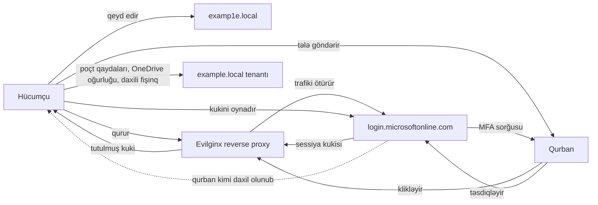

# Sosial Mühəndislik

**Sosial mühəndislik** insanları məlumatı təhvil verməyə, linkə klikləməyə, pul köçürməsi etməyə və ya qapını açıq saxlamağa məcbur etmək sənətidir. Firewall, EDR agenti və zero-trust proxy mükəmməl ola bilər — hücum yenə də uğurlu olur, çünki bir işçi telefondakı "Mən İT-dənəm, sənin kodun lazımdır" səsinə etibar edir. İnsanlar internetdə ən çox istismar olunan hücum səthidir, özü də böyük fərqlə.

Rəqəmlər ildən-ilə üst-üstə düşür. **Verizon Data Breach Investigations Report (DBIR) 2024** sızıntıların təxminən **68%**-ini qeyri-zərərli insan amilinə aid edir — kimsə kliklədi, kimsə aldadıldı, kimsə səhv konfiqurasiya etdi. **IBM X-Force Threat Intelligence Index 2024** fişinqi hadisələrin təxminən **30%**-ində ilkin giriş vektoru kimi göstərir və qeyd edir ki, kredensial oğurluğu (əsasən sosial mühəndisliklə yığılır) illik **71%** artıb. **FBI IC3 2023 hesabatı** qeydə alınmış **$12.5B** kibercinayət itkisini göstərir, bunun təxminən **$2.7B**-ı təkcə Business Email Compromise (BEC) payına düşür.

İnsanı yamaqlamaq (patch) mümkün deyil — ona görə təlim verirsən, yoxlayırsan və insanın nə vaxtsa xəta edəcəyini güman edən müdafiə qurursan.

## Niyə işləyir — altı psixoloji rıçaq

Robert Cialdini-nin altı təsir prinsipi demək olar ki, hər fişinqdə, vişinq zəngində və bəhanədə ortaya çıxır. Hücumçu nadir hallarda yalnız birini istifadə edir; güclü kampaniyalar üç-dördünü üst-üstə yığır.

| Rıçaq | Nəyi istismar edir | Real fişinqdən bir cümlə |
|---|---|---|
| **Avtoritet** | İnsanlar qavranılan hakimiyyətə tabe olur | "Bu CEO-dur. İclasdan əvvəl köçürmə edilməlidir." |
| **Təcililik** | Tələsən beyin yoxlamaları atlayır | "Poçt qutunuz 1 saat ərzində silinəcək — indi təsdiq edin." |
| **Qıtlıq** | Nəyisə əldən vermə qorxusu | "Bonus üçün yalnız 3 yer qaldı — klikləyin və özünüzünkünü tutun." |
| **Sosial sübut** | Başqalarının etdiyini kopyalayırıq | "HR artıq təsdiqləyib — 15 həmkarınız bu gün təqdim etdi." |
| **Tanışlıq / Bəyənilmə** | Bizə oxşayanlara inanırıq | Daxili jarqondan istifadə edən "həmkar"dan bəhanə zəngi. |
| **Qarşılıqlılıq** | Xeyirxahlığın əvəzini qaytarmaq | Avtodayanacağa atılmış *"Q4 maaş bonusları"* yazılmış USB. |

Usta hücumçu həmçinin **öhdəlik / ardıcıllığa** (əvvəlcə kiçik "hə" almaq) və **dolayı avtoritetə** ("hüquq şöbəsi birbaşa səndən soruşmağa icazə verdi") söykənir. Bunların hamısı yavaş, düşünülmüş fikirləşmənin üstündən atlayan qısa yollardır — Daniel Kahneman bunu **System 1** adlandırır.

Müdafiəçinin işi məhz System 1-in üstünlük etmək istədiyi anda sürtünmə əlavə etməkdir. Məcburi ikili təsdiq, məcburi geri zəng, hər mesajın yanında "bu fişinqdir?" düyməsi — bunların hər biri beyni bir neçə saniyəlik məqsədli System 2 rejiminə keçirir. Adətən bu yetərlidir.

## Hücum taksonomiyası

| Texnika | Kanal | Hədəf | Göstərici | Nümunə |
|---|---|---|---|---|
| **Fişinq (phishing)** | E-poçt | Kütləvi | Oxşar domen, təcililik dili | "Microsoft 365 parolunuz bu gün bitir — burada dəyişin" |
| **Spear-fişinq** | E-poçt | Konkret şəxs | LinkedIn-dən ad/vəzifə götürülüb | "Emil — Q3 hesabatına bax" saxta CFO-dan |
| **Whaling** | E-poçt | Top-menecment | M&A, məhkəmə, gəlir mövzuları | "Məxfi — SEC sorğusu, dərhal aç" |
| **Vişinq** | Səsli zəng | Helpdesk / istifadəçi | Caller ID saxtalaşdırma, daxili termin | "Bu İT-dən Sevinc, MFA sorğusu göndərdim — təsdiq et" |
| **Smişinq** | SMS | İstifadəçi | Qısa URL, çatdırılma/bank mövzusu | "Azerpoçt: bağlama saxlanılıb, 1.50 AZN ödəyin: hxxp://azpost-delivery[.]tk" |
| **Farming (pharming)** | DNS / hosts faylı | Brauzer | Düzgün URL, səhv IP | Zərərli proqram `banking.local`-ı yönləndirmək üçün hosts-u dəyişir |
| **Bəhanə (pretexting)** | Hər kanal | Helpdesk / HR | Uydurma ssenari, əlaqə qurur | "Mən KPMG-dən yeni auditoram, istifadəçi siyahısını verə bilərsən?" |
| **Baiting** | Fiziki / onlayn | İstifadəçi | USB atma, "pulsuz" yükləmə | Foyedə "CEO əməkhaqqıları 2024" yazılı USB |
| **Quid-pro-quo** | Səs / çat | İstifadəçi | Hücumçu "yardım" təklif edir | Saxta İT kredensial müqabilində "VPN-i düzəldir" |
| **Tailgatinq** | Fiziki | Obyekt | Kart yoxdur, əlləri dolu, gülümsəyir | Yad adam kartlı işçinin arxasınca qapıdan keçir |
| **Piggybackinq** | Fiziki | Obyekt | Tailgatinq kimi, amma razılıqla | İşçi tanımadığı adama qapını açıq saxlayır |
| **Çiyin arxasından baxma** | Fiziki | İstifadəçi | Ekrana göz gəzdirmə | Kafedə noutbukdakı parola baxmaq |
| **Zibil qutusu axtarışı** | Fiziki | Obyekt | Zibili çeşidləmək | Struktur sxemləri, parol yazılı kağızlar, qaimələr götürmək |
| **Watering-hole** | Veb | Dar auditoriya | Hədəfin girdiyi saytı sındırmaq | Developerlərin tez-tez girdiyi foruma zərərli kod yerləşdirmək |
| **BEC** | E-poçt | Maliyyə / HR | Söhbətin ortasından cavab, bank dəyişikliyi | CFO-dan mövcud söhbətə "cavab" — ödəniş rekvizitlərini dəyişir |
| **MFA bombardmanı / prompt yorğunluğu** | Push MFA | İstifadəçi | Təkrarlı push təsdiqi | Gecə 02:00-da o qədər sorğu gəlir ki, istifadəçi "Təsdiqlə"yə basır |
| **SIM-swap** | Operator sosial müh. | Telefon nömrəsi | SMS 2FA kodları gəlməyi dayandırır | Hücumçu hədəfin nömrəsini yeni SIM-ə köçürür |
| **Deepfake səs / video** | Zəng / Teams | Top-menecer / maliyyə | AI-klonlanmış səs, kadrdan kənar xahişlər | Video zəngdə "CFO" təcili 200M HKD köçürmə istəyir (Arup, 2024) |

## Dərin baxış: müasir fişinq

2024 dövrünün fişinqi daha səhvlərlə dolu "Niqeriyalı şahzadə" məktubu deyil. Bu, təxminən qırx dəqiqəyə açıq-mənbəli alətlərlə qurulan cilalanmış, MFA-xəbərdar, reverse-proxy əsaslı kredensial oğurluğudur.

### Başdan-başa kill chain

1. **Kəşfiyyat.** Hücumçu `example.local`-dakı adları LinkedIn-dən toplayır, iş elanlarına baxaraq daxili alətləri öyrənir ("ServiceNow və Azure AD təcrübəsi tələb olunur"), e-poçt formatını `hunter.io`-dan götürür.
2. **İnfrastruktur.** Oxşar domen qeyd edir — `examp1e.local` (`l` əvəzinə rəqəm `1`), `exampIe.local` (kiçik `l` əvəzinə böyük `I`) və ya `example-it[.]com`. Ucuz TLS sertifikatı alır, **Evilginx** və ya **Modlishka** reverse proxy qaldırır — bu proxy `login.microsoftonline.com`-dan *real* Microsoft giriş səhifəsini hücumçunun serveri vasitəsilə göstərir.
3. **Tələ.** `it-support@examp1e.local`-dan inandırıcı məktub — "Poçt qutunuz doludur. Yer artırmaq üçün klikləyin." Link Evilginx domeninə aparır.
4. **Kredensial + kuki tutulması.** Qurban əsl Microsoft səhifəsinə bənzəyən səhifədə parolunu daxil edir. Evilginx bunu yuxarıya ötürür, real sayt MFA istəyir, qurban təsdiqləyir və **sessiya kukisi** hücumçuya verilir. MFA onu xilas etmədi — kuki artıq sistemə girmiş vəziyyətdədir.
5. **Sessiya oğurluğu.** Hücumçu oğurlanmış kukini öz brauzerinə yükləyir və əlavə heç bir sorğu olmadan qurbanın adı ilə sistemə daxil olmuş sayılır.
6. **Post-eksploitasiya.** Hücumçu poçt yönləndirmə qaydası əlavə edir, öz authenticator tətbiqini qurbanın hesabına qeyd edir, OneDrive-ı çıxarır və daxildən yeni fişinq başlatmaq üçün Teams mesajlarına keçir.



**Niyə bu MFA-nı keçir.** Push və TOTP yalnız giriş anında insanın orada olduğunu sübut edir. Giriş bitdikdən sonra *sessiyanı* qorumur. Kuki oğurlandıqdan sonra o, parol qədər dəyərlidir — vaxtı bitənə (çox vaxt 90 gün) və ya istifadəçi hər yerdən çıxış edənə qədər etibarlıdır.

### Bu kill chain-i həqiqətən qıran şeylər

- **FIDO2 / passkey-lər** — kriptoqrafik çağırış brauzerin gördüyü *origin*-ə bağlıdır. Hücumçunun domeni `examp1e.local`-dır, açar isə yalnız `microsoftonline.com` üçün imzalayır. AiTM faydalı heç nə əldə etmir.
- **Sessiya tokeni riski üzrə Conditional Access** — Azure AD "sessiya kukisinin yeni IP-dən / yeni cihazdan / imkansız səyahət ərazisindən istifadəsi"-ni aşkarlaya və yenidən MFA tələb edə bilər, replay pəncərəsini qıraraq.
- **Token binding / continuous access evaluation (CAE)** — sessiyanı IdP-yə qarşı hər bir neçə dəqiqədə bir yenidən doğrulayır; çıxış və ya risk tətiklənəndə ~60 saniyə içində ləğv edir.
- **Mail gateway-də imkansız-domen aşkarlaması** — `examp1e.local` və digər Levenshtein-1 məsafəli domenləri avtomatik işarələ.
- **Çöldən gələn hər link üçün brauzer izolyasiyası** — istifadəçi kliklərsə də, səhifə uzaq, atılan brauzerdə render olunur; kuki korporativ brauzerə heç vaxt düşmür.

## Dərin baxış: Business Email Compromise (BEC)

BEC planetdəki ən yüksək dollarlı sosial-mühəndislik kateqoriyasıdır. Zərərli proqram tələb etmir, çox vaxt kredensial da lazım deyil. Hücumçuya yalnız inandırıcı e-poçt lazımdır.

**FBI IC3 2023 illik hesabatı**na görə, BEC həmin il **21,489** şikayətdən **$2.9B** itkiyə səbəb olub — orta hesabla hər hadisəyə təxminən **$135,000**. Real rəqəm daha yüksəkdir; BEC-in çoxu ümumiyyətlə qeydə alınmır.

### Real həyatda görəcəyiniz dörd BEC variantı

**CEO / CFO pul köçürmə fırıldaqı.** Hücumçu top-menecerin poçtunu saxtalaşdırır və ya sındırır, maliyyə şöbəsinə "məxfi alış-veriş" üçün vəsait köçürməyi tapşırır. Təcililik + avtoritet + "heç kimə demə, bu idarə heyəti məsələsidir" klassik sxemdir.

**Qaimə yönləndirilməsi.** Hücumçu satıcının (və ya onun təchizatçısının) poçtunu sındırır, real qaimə söhbətini gözləyir və "bank rekvizitlərimiz dəyişib, zəhmət olmasa yeniləyin" cavabını göndərir. Növbəti real qaimə hücumçuya ödənilir.

**Satıcı imitasiyası.** Heç nə sındırılmır — hücumçu `vendor-billing[.]com`-u qeyd edir və tanınmış təchizatçıdan gəlmiş kimi görünən saxta qaimələr göndərir. Mərkəzsiz AP prosesi olan şirkətlərdə xüsusilə yaxşı işləyir.

**Maaş yönləndirilməsi.** Hücumçu işçini saxtalaşdırır və HR-a yazır: "Bank dəyişdim, zəhmət olmasa bu cümə maaşımı yeni hesaba köçürün." Bir maaş tsikli sonra əmək haqqı mule hesabına düşür.

### BEC nə üçün texnologiyanı üstələyir

Mail gateway sandboxları qoşma və linklərə baxır. BEC məktubunda heç biri yoxdur — real söhbətin içində sadə mətnlə cavabdır. Spam filtriniz qısa, nəzakətli, qrammatikası düzgün bir ingilis mətnini görür ki, orada bank dəyişikliyi istənilir. **Bunu yalnız insan və ya iki-imzalı iş axını (dual approval) tutur.**

## Dərin baxış: MFA-nın sosial yollarla keçilməsi

MFA astananı qaldırır. Sosial mühəndisliyi aradan qaldırmır — hücumçular sadəcə bir qat yuxarıya keçdilər.

### Prompt yorğunluğu / MFA bombardmanı

Hücumçunun parol var (breach dump-dan, infostealer logundan və ya əvvəlki fişinqdən) və dövrə ilə giriş sorğuları tətikləyir — çox vaxt gecə 02:00–04:00-da, qurban yarı yuxulu ikən. Sonunda istifadəçi sadəcə telefonun titrəməsi dayansın deyə "Təsdiqlə"yə basır. **Uber 2022-ci ilin sentyabrında** məhz belə sındırılıb — hücumçu podratçının kredensialını Genesis Market-dən alıb və push sorğuları ilə bombardman edib ki, biri təsdiqlənsin.

### Adversary-in-the-Middle (AiTM)

Yuxarıdakı Evilginx/Modlishka sxemi. Hücumçu real giriş səhifəsini proxy-ləyir, qurban MFA-nı qanuni şəkildə tamamlayır və hücumçu sessiya kukisi ilə çıxıb gedir. Microsoft 2022-ci ildə **10,000-dən çox təşkilatı** vuran AiTM kampaniyası haqqında xəbər vermişdi.

### SIM swap

Hücumçu mobil operatoru sosial mühəndislik edir — "Telefonumu itirdim, nömrəmi yeni SIM-ə keçirin." SMS-əsaslı MFA kodları hücumçunun telefonuna gəlməyə başlayır. Bu kripto birjalarına, bank hesablarına və tanınmış şəkildə 2019-cu ildə Twitter CEO Jack Dorsey-ə qarşı işlədi.

### Callback vişinq + MFA sıfırlama

Hücumçu helpdesk-ə zəng vurur və hesabdan bağlanmış top-meneceri kimi özünü təqdim edir. Yardım etməyə çalışan helpdesk MFA qeydiyyatını sıfırlayır. Hücumçu öz cihazını qeyd edir. **MGM Resorts sızıntısında (sentyabr 2023)** təxminən belə olub — helpdesk-ə on dəqiqəlik vişinq doqquz rəqəmli itkiyə səbəb oldu.

### Sosial mühəndisliyə qarşı MFA növlərinin müqaviməti

| MFA növü | Fişinqə qarşı | Qeyd |
|---|---|---|
| SMS kodu | **Zəif** | SIM swap, AiTM, kodun smişinqi ilə aldatma |
| TOTP (Authenticator rəqəm kodu) | **Orta** | AiTM keçir; SIM swap keçmir |
| Push-təsdiq | **Orta** | Prompt yorğunluğu və AiTM ikisi də işləyir |
| Rəqəm-uyğunluqlu push | **Daha güclü** | Yorğunluğu məğlub edir, AiTM hələ keçir |
| **FIDO2 / WebAuthn (hardware açar, passkey)** | **Güclü** | Kriptoqrafik olaraq real domenə bağlıdır — AiTM uğursuz olur |

Qısası: **yüksək dəyərli hesablar üçün FIDO2 hardware açar və ya passkey istifadə edin.** Push MFA sadə paroldan yaxşıdır, amma fişinqə davamlı deyil.

## İstifadəçinin tanıması lazım olan göstəricilər

Monitor yanında saxlamaq üçün bir A4 kartında yerləşən yoxlama siyahısı. Qeyri-texniki işçilər bunu 15 dəqiqəlik iclasda öyrənə bilər.

**Klikləmədən əvvəl, aşağıdakılardan hər hansı biri doğrudursa — dayanın:**

- Mesaj **təcililik** yaradır ("1 saat ərzində", "yalnız bu gün", "dərhal tədbir").
- Mesaj **avtoritet** iddia edir ("CEO", "Hüquq", "İT", "HR") və sizi adi prosesi keçməyə sıxışdırır.
- **Pul köçürməsi** və ya **ödəniş rekvizitlərinin dəyişdirilməsi** tələb edir — göndərən düzgün görünsə belə.
- Göndərən **oxşar domen** istifadə edir (`examp1e.local`, `example-corp.com`, `example.support`).
- Linkin üzərinə mausu gətirəndə **göstərilən mətnə uyğun gəlməyən URL** görünür.
- Göndərən daxili işçi və ya top-menecer olduğunu iddia edən **pulsuz webmail** (Gmail, Outlook.com, ProtonMail) ünvanıdır.
- Mesajda **"heç kimə demə"** / **"bunu məxfi saxla"** bəndi var.
- **Qoşma** gözlənilmədir — xüsusən `.zip`, `.iso`, `.htm`, `.one`, parollu sənədlər və ya Microsoft olmayan domenə aparan "OneDrive/SharePoint-də aç" linki.
- **Reply-to** ünvanı **From** ünvanından fərqlidir.
- Siz özünüz tətikləmədiyiniz **MFA sorğusu** alırsınız — heç vaxt təsdiqləməyin. Bu, sizin parolunuzla daxil olmaq istəyən hücumçudur.
- Adi iş axınını **keçən** hər hansı xahiş ("portaldan keçmə, faylı birbaşa mənə göndər").

**Şübhə varsa qayda:** kanal-xarici (out-of-band) yoxlayın. Telefonu bağlayın, şəxsi kataloqda tapın, sizdə artıq olan nömrəyə geri zəng vurun. Əsl CEO beş dəqiqəlik geri zəngə inciməyəcək.

## Təşkilati müdafiə

Müdafiə eyni anda üç oxda işləməlidir. Texnologiya tək-tük sadə hücumları tutur. Proses bahalıları tutur. İnsan təlimi sürüşüb keçənlərin uğur nisbətini azaldır.

| Qat | Kontrol | Alət / tədbir |
|---|---|---|
| **Texniki** | SPF qeydi | DNS TXT: domendən yalnız real mail serverlərinə göndərməyə icazə verir |
| **Texniki** | DKIM imzalama | Mail provayderi gedən poçtu açarla imzalayır; açıq açar DNS-də dərc olunur |
| **Texniki** | DMARC tətbiqi | Monitorinq dövründən sonra `p=reject` dərc edin; aqreqat hesabatları DMARC analizatoruna yönləndirin |
| **Texniki** | Mail gateway + sandbox | Microsoft Defender for O365, Proofpoint TAP, Mimecast — linkləri və qoşmaları VM-də partladır |
| **Texniki** | FIDO2 / passkey MFA | Hardware açarlar (YubiKey, Feitian) və ya platforma passkey — adminlər, maliyyə, top-menecment üçün |
| **Texniki** | Conditional Access / risk əsaslı giriş | Azure AD Conditional Access: "imkansız səyahət" və tanış olmayan ərazidən girişi blokla |
| **Texniki** | Brauzer izolyasiyası | Cloudflare Browser Isolation, Menlo, Talon — riskli linkləri uzaq brauzerdə aç |
| **Texniki** | Çıxış link yenidən yazılması | Safe Links tipli URL sarğısı — çatdırıldıqdan sonra yoxlama |
| **Texniki** | DNS filtrasiyası | Yeni qeyd olunmuş domenləri və məlum fişinq infrastrukturunu resolver səviyyəsində blokla |
| **Proses** | Köçürmə üçün ikili təsdiq | Müəyyən limitdən yuxarı hər çıxış ödənişi üçün iki imza və geri zəng tələb olunur |
| **Proses** | Kanal-xarici geri zəng | Hər bank rekvizit dəyişikliyi yalnız əvvəlcədən qeydə alınmış nömrəyə zənglə təsdiqlənir — e-poçtdakı nömrəyə yox |
| **Proses** | Satıcı qəbulu / dəyişiklik nəzarəti | Ödəniş dəyişikliyi üçün yazılı prosedur; yalnız e-poçtla dəyişiklik qəbul olunmur |
| **Proses** | Hadisə bildirimi düyməsi | Outlook/Gmail-də bir-klikli "Report phishing" düyməsi; SOC 30 dəqiqədə cavab |
| **Proses** | Helpdesk kimlik doğrulaması | Parol/MFA sıfırlama üçün skript (təhlükəsizlik sualları, menecerə geri zəng, şəxsən) |
| **İnsan** | Simulyasiyalı fişinq kadensiyası | Aylıq və ya rüblük kampaniyalar; kliklər və bildiriş nisbətlərini izlə |
| **İnsan** | Hədəfli yenidən təlim | Yalnız təkrar kliklənənlər qısa hədəfli modul alır — bütün şirkət yox |
| **İnsan** | Müsbət gücləndirmə | Real fişinqi bildirənləri mükafatlandır. **Heç vaxt klikləyənləri açıq utandırmayın** — bildiriş mədəniyyətini öldürür |
| **İnsan** | Rol əsaslı təlim | Maliyyə BEC məşqləri, top-menecment whaling məşqləri, helpdesk vişinq məşqləri alır |
| **İnsan** | Yeni işçi oriyentasiyası | Sosial mühəndislik modulu birinci gün — illik compliance təkrarına basdırılmır |

### Düzgün qurulmalı DNS qeydləri

```dns
; SPF — yalnız bu IP/hostlar example.local-dan poçt göndərə bilər
example.local.  IN TXT  "v=spf1 include:_spf.google.com ~all"

; DKIM — "google" selektoru üçün açıq açar
google._domainkey.example.local. IN TXT "v=DKIM1; k=rsa; p=MIIBIj...AB"

; DMARC — p=none (monitor) başla, p=quarantine keç, p=reject ilə bitir
_dmarc.example.local. IN TXT "v=DMARC1; p=reject; rua=mailto:dmarc@example.local; ruf=mailto:dmarc@example.local; pct=100; adkim=s; aspf=s"
```

`p=reject` finiş xəttidir. İki il `p=none`-da oturan domen DMARC-sız domenlə eynidir — hər kəs sizi saxtalaşdıra bilər.

## Praktik məşğələlər

### Məşğələ 1 — Real e-poçt başlıqlarını araşdır

Şübhəli mesajdan `.eml` faylı götür (Outlook-da: **File → Save As → .eml**). Mətn redaktorunda aç və axtar:

```text
Received: from evil.example.local (mail.evil-host.com [203.0.113.44])
        by mx.example.local (Postfix) with ESMTPS id ABC123
        for <victim@example.local>; Mon, 14 Apr 2025 08:12:03 +0400
Authentication-Results: mx.example.local;
        spf=fail (sender IP is 203.0.113.44) smtp.mailfrom=ceo@example.local;
        dkim=none;
        dmarc=fail action=quarantine header.from=example.local
From: "Orxan Məmmədov, CEO" <ceo@example.local>
Reply-To: orxan.ceo@protonmail.com
Subject: TƏCİLİ — saat 10:00-dan əvvəl köçürmə
```

Hər `Received:` başlığı yuxarıdan aşağı, ən yenisi birinci yazılır — məktubun real mənbəyi *altdakı*dır. Zənciri addım-addım keç. SPF fail, DKIM none, DMARC fail, pulsuz webmail-də Reply-To, CEO display-name saxtalaşdırması — bu, birbaşa BEC-dir.

### Məşğələ 2 — 3 real fişinqi təhlil et

**PhishTank**-ı (`https://www.phishtank.com/`) və ya **OpenPhish**-i (`https://openphish.com/`) aç. Son 3 təqdimatı seç və hər biri üçün müəyyən et:

- İmitasiya edilən brend (Microsoft, DHL, bank).
- Tələ (parol vaxtının bitməsi, çatdırılma haqqı, qaimə).
- İstifadə olunan psixoloji rıçaq(lar) (təcililik? avtoritet? qıtlıq?).
- Formun hara göndərildiyi (mənbəyə bax — `action=` axtar).
- Real TLS sertifikatı varmı və domen neçə günlükdür (`whois`).

Hər üçü kiçik hesabatda sənədləşdir. On dənədən sonra kitləri bir baxışda tanıyırsan.

### Məşğələ 3 — Test domeni üçün SPF + DKIM + DMARC qur

**Cloudflare**-də hostlanan, **Google Workspace** üzərindən poçt göndərən domen üçün:

1. **SPF** — apeks üçün TXT əlavə et:
   ```text
   v=spf1 include:_spf.google.com ~all
   ```
2. **DKIM** — Google Admin → Apps → Google Workspace → Gmail → Authenticate email → yeni qeyd generasiya et. Selektoru (məs. `google`) və açıq açarı kopyala. Cloudflare-də TXT qeyd əlavə et:
   ```text
   Name:  google._domainkey
   Value: v=DKIM1; k=rsa; p=MIIBIjANBgkq...AB
   ```
   Yenidən Google Admin-də **Start authentication**-a bas.
3. **DMARC monitorinq** — `_dmarc` üzərində TXT:
   ```text
   v=DMARC1; p=none; rua=mailto:you@example.local; pct=100
   ```
4. `check-auth@verifier.port25.com` ünvanına poçt göndər — o, tam SPF/DKIM/DMARC pass/fail hesabatı qaytarır. Hər üçü `pass` olmalıdır.
5. 2–4 həftə təmiz aqreqat hesabatlardan sonra `p=none` → `p=quarantine` → `p=reject`-ə keç.

### Məşğələ 4 — BEC məktubunda qırmızı bayraqları tap

Aşağıdakı məktub cümə günü günortadan sonra AP-a düşüb. Cavabı oxumadan əvvəl hər bir qırmızı bayrağı sadala.

```text
From: "Orxan Məmmədov" <o.mammadov@exampIe.local>
Reply-To: orxan.m.ceo@gmail.com
To: accounting@example.local
Subject: Pul köçürməsi – məxfi
Date: Cümə, 16:47

Salam Leyla,

İdarə heyəti iclasındayam və zəng qəbul edə bilmirəm. Zəhmət olmasa,
Hamburg alışı üçün BU GÜN aşağıdakı hesaba EUR 84,320 köçürmə et.
Sənədlər bazar ertəsi gələcək — bu arada, sövdə hələ açıqlanmadığına
görə, aramızda saxla.

    Beneficiar:  Nordstern Holdings GmbH
    IBAN:        DE89 3704 0044 0532 0130 00
    BIC:         COBADEFFXXX

Tez hərəkət etdiyinə görə təşəkkürlər.
Orxan
```

Qırmızı bayraqlar: `exampIe.local`-da kiçik `l` əvəzinə böyük `I`; Reply-To Gmail-də; təcililik ("BU GÜN"); avtoritet (CEO); məxfilik ("aramızda saxla"); qeyri-adi ödəniş (yeni beneficiar, əvvəl əlaqə yoxdur); həftə sonu vaxtı (banklar bağlanır); adi prosesi keçmə (PO yoxdur, təsdiq yoxdur). Səkkiz müstəqil siqnal. Kanal-xarici yoxla, ödəmə.

## Praktik nümunə — example.local SecOps table-top məşqi

Bütün SOC, İT, hüquq və maliyyənin birlikdə keçirə biləcəyi 60-dəqiqəlik insident-cavab məşqi.

**Ssenari.** AP-dən Leylə bazar ertəsi 09:12-də SOC-a yazır: "Məncə fişinqə düşmüşəm. Cümə günü CEO-dan pul köçürmə sorğusu gəldi və işlədim — Alman hesabına EUR 84,320. CEO indi dedi ki, heç nə göndərməyib."

### Dəqiqə 0–10 — Qəbul

- Ticket sistemində `INC-2025-0417` insidenti aç. Ağırlıq **High**.
- Leylə ilə müsahibə: tam məktub, başlıqlar (`.eml`), köçürmə nömrəsi, bank, vaxt damğaları.
- Hər hansı silinmədən və ya dəyişiklikdən əvvəl onun poçt qutusunu və endpoint-i snapshot et.

### Dəqiqə 10–20 — Doğrulama

- CEO-nun göndərmədiyini təsdiqlə (onun məlum mobil nömrəsinə zəng, e-poçtla yox).
- E-poçt başlıqlarını çıxar — SPF fail, Reply-To Gmail, display-name saxtalaşdırma. Klassik BEC, bizim tərəfdə hesab sındırılmayıb.
- Eyni göndərən / mövzu / IBAN nümunəsi üçün bütün tenantda mail logları axtar. Başqa alanlar? Kliklənən və ya cavablanan?

### Dəqiqə 20–35 — Lokalizasiya

- **Bank.** Göndərən bankın fırıldaq xəttinə dərhal zəng. Köçürmə 24–72 saatdan azdırsa, geri qaytarma pəncərəsi var (SWIFT MT192 / SEPA recall). Geri qaytarılmış BEC vəsaitinin çoxu bir neçə saat ərzində hərəkətdən gəlir.
- **Poçt.** Göndərən domenini, Reply-To ünvanını və Alman IBAN-ını blok / siqnal siyahılarına əlavə et. Tenantda qalan uyğun mesajları karantinə göndər.
- **Kimlik.** Hesab sındırılması olmasa da, Leyladakı parolu sıfırla və MFA-nı yenidən qeyd et. Son 30 günün giriş logunu yoxla. Onun (və ya onun adından hücumçunun) yaratdığı poçt qaydalarını axtar.
- **Hüquq-mühafizə / tənzimləyici.** Yerli kiber cinayət şöbəsinə ərizə ver və — Aİ köçürmələri üçün — ABŞ rezidenti olmasan da IC3-ə xəbər verməyi düşün; FBI-ın Recovery Asset Team beynəlxalq koordinasiyalaşdırır.

### Dəqiqə 35–50 — Kommunikasiya

- CFO və CEO-ya icmal ver: yalnız faktlar, ittiham yoxdur, bildiklərimiz və etdiklərimiz.
- Bütün AP və Maliyyə üçün qısa bildiriş hazırla: "Cümə günü bizə BEC cəhdi olub. Oxşar məktub almısınızsa, əməl etməyin; soc@example.local-a göndərin."
- Hüquq bank geri qaytarması və sığorta iddiası üçün məlumat dairəsindədir.
- **Leylanı açıq adlandırma və utandırma.** O, xəbər verdi — bu, gücləndirmək istədiyimiz davranışdır.

### Dəqiqə 50–60 — Nəticələr

Sənədləşdir və həqiqətən dəyiş:

- EUR 50k-dan yuxarı köçürmələrdə **ikili təsdiq** vardımı? Yoxsa, bu həftə tətbiq et.
- Yeni beneficiarlar üçün **kanal-xarici geri zəng** addımı vardımı? Yoxsa, əlavə et.
- Mail gateway oxşar `exampIe.local` domenini işarələdimi? Yoxsa, oxşar-domen aşkarlamasını əlavə et (bir çox gateway-də "cousin domain" funksiyası var).
- DMARC `p=reject`-dədirmi? `p=none`-dadırsa, ən azı bu sprint `p=quarantine`-ə keç.
- Maliyyə üçün BEC-spesifik simulyasiyalı fişinq kampaniyasını 30 gün içində planlaşdır.
- Leylanı açıq şəkildə bildirdiyi üçün tərifləyin. Növbəti fişinqə düşən bilsin ki, bildirmək təhlükəsizdir.

Sağlam təşkilat bu məşqi ildə bir dəfə keçir. Ssenarini dəyiş: real satıcıdan qaimə yönləndirməsi, maaş yönləndirilməsi, adminə qarşı MFA yorğunluğu cəhdi, CFO-ya deepfake səs zəngi. Hər variant fərqli boşluq aşkar edir.

### Playbook-da əvvəlcədən yazılmalı şeylər (insidentdən qabaq)

- Bank fırıldaq xəttinə kim zəng vurur və nömrə SOC növbətçi noutbukunun içinə yapışdırılıb — yalnız sındırılma ehtimalı olan e-poçt sistemində saxlanmır.
- Hüquq şöbəsindən kim çağırışdadır. İş saatından kənarda da.
- Hansı sığorta brokeri kiber iddiaları idarə edir və bildirmə müddəti nədir (çox vaxt 24–72 saat).
- Əvvəlcədən təsdiqlənmiş daxili kommunikasiya şablonu — boşluqları doldur, göndər.
- Playbook-un kağız nüsxəsi SOC-da. Bəli, kağız. Tenantınız bağlanıbsa, runbook-u SharePoint-dən oxumaq istəməzsiniz.

## Proqramın effektivliyini ölçmək

Ölçmədiyini yaxşılaşdıra bilməzsən. Ciddi anti-fişinq proqramı ən azı bunları izləyir:

| Metrika | Hədəf | Nə deyir |
|---|---|---|
| Simulyasiyalı fişinqdə **klik nisbəti** | yetkin: &lt; 5%, başlanğıc: &lt; 15% | Xam həssaslıq |
| Simulyasiyalı fişinqdə **bildiriş nisbəti** | &gt; 25% | Bildirişin asanlığı və mükafatlandırılması |
| **Bildiriş/klik nisbəti** | &gt; 2:1 | Sensor sıxlığı vs uğursuzluq nisbəti |
| Real fişinqin **ilk bildirişinə qədər median vaxt** | &lt; 5 dəqiqə | İnsan-sensor şəbəkəsinin sürəti |
| **Təkrar klikləyənlər** (12 ayda ≥ 3 sim klikləmiş) | &lt; 2% | Hədəfli yenidən təlimin diqqət mərkəzi |
| Bildirişdən tenant boyu silinməyə qədər vaxt | &lt; 30 dəqiqə | SOC reaksiyasının yetkinliyi |
| Sahib olunan domenlərdə **DMARC tətbiqi** | 100%-də `p=reject` | Saxtalaşdırma səthi |

Yalnız klik nisbəti yanıldıcıdır — aşağı klik və aşağı bildiriş insanların səssizcə kliklədiyi və heç vaxt deməməsi deməkdir. Daha yüksək klik nisbəti güclü bildiriş ilə daha sağlamdır; hücumların düşdüyünü görür və cavab verə bilirsən.

## Tələlər və səhv praktikalar

- **Klikləyənləri açıq utandırmaq.** Teams-də "Top 10 klikləyən" postlaşdırmaq, ümumi iclasda adları sadalamaq. Nəticə: adamlar klikləri gizlədir, bildiriş nisbəti çökür, növbəti real fişinq səssiz düşür. Qadağa qoy.
- **HR / hüquq təsdiqi olmadan fişinq sim.** Real "bonusun ləğv olundu" simulyasiyası həqiqi panika yarada bilər — ssenarini və vaxtı HR ilə əvvəlcədən razılaşdır.
- **İldə bir dəfə compliance videosu.** İldə bir saat klik-keçid təlimi heç nəyi dəyişmir. Aylıq mikro-təlim illik teatrdan üstündür.
- **Bildiriş düyməsi yoxdur.** Fişinqi bildirmək üç kliklik qoşma yönləndirmə tələb edirsə, adamlar etməyəcək. Bir-klik "Report" düyməsi, bir saat içində SOC cavabı.
- **DMARC əbədi olaraq `p=none`-da qalır.** Monitorinq birinci addımdır. Heç vaxt `quarantine`-ə və sonra `reject`-ə keçməsən, hücumçular domenini sərbəst saxtalaşdıra bilər.
- **Privileqiyalı hesablar üçün yalnız SMS MFA.** Adminlər, maliyyə təsdiqçiləri və top-menecment fişinqə davamlı MFA-da (FIDO2 / passkey) olmalıdır, SMS-də yox.
- **Telefon zəngindən sonra MFA sıfırlayan helpdesk.** MGM sızıntısı on dəqiqəlik vişinqdə baş verdi. Privileqiyalı hesabların MFA sıfırlanması üçün şəxsi və ya video doğrulama tələb et.
- **Satıcı bank dəyişikliyində geri zəng addımının olmaması.** Qaimə-yönləndirmə BEC-nə qarşı ən yüksək ROI-lı proses kontroludur.
- **Artıq uğurlu olanları təlimə cəlb etmək.** Hədəfli yenidən təlim təkrar klikləyənlər üçündür. Qalanlarına dəyməyin — məcburi təkrarlara narazıdırlar və diqqət vermirlər.
- **İstifadəçiləri ritorik olaraq "ən zəif halqa" adlandırmaq.** Onlar sizin son sensorlarınızdır. Müttəfiq kimi qəbul edin; daha çox bildirəcəklər.

## Əsas nəticələr

- Sosial mühəndislik sızıntıların ~68%-nə görə məsuldur, çünki insanlara hücum miqyaslanır və yaxşı bəhanə eksploitdən ucuzdur.
- Cialdini-nin altı rıçağı — Avtoritet, Təcililik, Qıtlıq, Sosial sübut, Bəyənilmə, Qarşılıqlılıq — demək olar ki, hər fişinqdə görünür. Onları tanımağı öyrənin.
- Müasir fişinq Evilginx kimi reverse-proxy kitlərlə MFA-nı keçir — parolu yox, sessiya kukisini oğurlayır.
- BEC ransomware-dən daha çox pul itirir. Texnologiya onu nadir hallarda tutur; proses (ikili təsdiq + kanal-xarici geri zəng) tutur.
- Push MFA prompt yorğunluğuna və AiTM-ə qarşı zəifdir. Hardware FIDO2 açarlar və passkey-lər fişinqə davamlı standartdır.
- `p=reject`-də SPF + DKIM + DMARC minimum tələbdir. `p=none`-da duran domen saxtalaşdırıla bilən domendir.
- İnsanları sensor kimi öyrət, günahkar kimi yox. Müsbət gücləndirmə və bir-klik bildiriş utancdan daha yaxşı nəticə verir.
- Yüksək dəyərli hər maliyyə əməliyyatı kanal-xarici doğrulama addımı tələb edir — həmişə sizdə artıq olan nömrəyə, heç vaxt məktubdakı nömrəyə.
- BEC table-top məşqini ildə ən azı bir dəfə keçirin. Playbook-u ilk dəfə real insident zamanı oxumaq olmaz.

## İstinadlar

- Verizon DBIR 2024 — `https://www.verizon.com/business/resources/reports/dbir/`
- IBM X-Force Threat Intelligence Index 2024 — `https://www.ibm.com/reports/threat-intelligence`
- FBI IC3 2023 Internet Crime Report — `https://www.ic3.gov/Media/PDF/AnnualReport/2023_IC3Report.pdf`
- CISA Phishing Guidance — `https://www.cisa.gov/news-events/news/phishing-guidance-stopping-attack-cycle-phase-one`
- MITRE ATT&CK T1566 Phishing — `https://attack.mitre.org/techniques/T1566/`
- MITRE ATT&CK T1621 Multi-Factor Authentication Request Generation — `https://attack.mitre.org/techniques/T1621/`
- NIST SP 800-63B Digital Identity Guidelines — `https://pages.nist.gov/800-63-3/sp800-63b.html`
- KnowBe4 Phishing by Industry Benchmarking Report — `https://www.knowbe4.com/phishing-by-industry-benchmarking-report`
- Cofense Annual State of Phishing Report — `https://cofense.com/annual-state-of-phishing-report/`
- Microsoft: 10,000+ təşkilatı hədəf alan AiTM kampaniyası — `https://www.microsoft.com/en-us/security/blog/2022/07/12/from-cookie-theft-to-bec-attackers-use-aitm-phishing-sites-as-entry-point-to-further-financial-fraud/`
- M-Trends 2024 (Mandiant) — `https://www.mandiant.com/m-trends`
