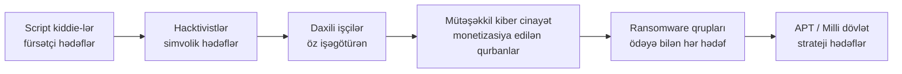

# Təhlükə Aktorları və Təhdid Kəşfiyyatı

Kimin hücum etdiyini, niyə etdiyini və necə işlədiyini bilməyən müdafiəçi inanca əsaslanaraq məhsul alan müdafiəçidir. Təhdid kəşfiyyatı bu cəhaləti strukturlaşdırılmış biliyə çevirmək intizamıdır: hansı aktor qrupları sənayenizə əhəmiyyət verir, son altı ayda hansı texnikalardan istifadə ediblər, hansı infrastrukturu təkrar istifadə edirlər, hansı alətləri seçirlər və — ən əsası — sabah görsənsələr loglarınızda nə görəcəksiniz. Bu işin nəticəsi parlaq hesabat deyil; aşkarlama qaydaları, sərtləşdirmə prioritetləri və masaüstü ssenariləri siyahısıdır ki, nəzarət büdcənizi həqiqətən mövcud olan təhdidlərə doğru yönəldir.

Bu dərs **təhlükə aktorlarının taksonomiyasını** (milli dövlət, APT, mütəşəkkil cinayət, ransomware ortaqları, hacktivistlər, daxili işçilər, script kiddie-lər, terror qrupları, rəqiblər), onları fərqləndirən **atributları** (mürəkkəblik, resurslar, niyyət, davamlılıq, məkan), satıcıların istifadə etdiyi **adlandırma konvensiyalarını** (Mandiant APT nömrələri, CrowdStrike heyvanat parkı, Microsoft elementləri, Talos T-ID-ləri), **Təhdid Kəşfiyyatının** dörd növünü (Strateji, Operativ, Taktiki, Texniki — bəzən CTI/TTI/OTI/STI kimi yazılır), xam toplamadan istifadəyə yararlı müdafiəyə çevirən **dövrü**, **paylaşma standartlarını** (STIX 2.1, TAXII 2.1, MISP, OpenCTI) və CTI işinə struktur verən analitik modelləri — **MITRE ATT&CK**, **Cyber Kill Chain**, **Diamond Model** — əhatə edir.

## Niyə bu vacibdir

"Qabaqcıl təhdid" tək bir şey deyil. Regional xəstəxana üçün real düşmən Shodan-da yamanmamış kənar cihazları skan edən ransomware ortağı və İlkin Giriş Brokerindən giriş alan fişinq qrupudur — həqiqətən vacib olan nəzarətlər uzaqdan girişə MFA, hər son nöqtədə EDR, dəyişməz ehtiyat nüsxələri və internetə baxan xidmətlərdə yamaq SLA-sıdır. Birinci dərəcəli bank üçün başqa qat əlavə edin: SWIFT-i hədəfləyən mütəşəkkil kiber cinayət, ödəniş kartı oğurluq dəstələri və milli dövlət maliyyə kəşfiyyat əməliyyatları — və nəzarət siyahısı qırmızı komanda təlimləri, tranzaksiya anomaliyası aşkarlanması və xüsusi CTI feed-lərini əhatə edir. Müdafiə nazirliyi üçün çoxillik əməliyyatlar, fərdi implantlar və təchizat zənciri kompromisi olan milli dövlət aktorlarını əlavə edin — və nəzarətlər icazə dərəcəsinə görə şəbəkə seqmentasiyası, aparat etibar kökləri və əks-kəşfiyyat tərəfdaşlıqlarını da əhatə edir.

Təhdid kəşfiyyatı olmadan hər təşkilat eyni satıcılardan eyni təhlükəsizlik dəstini alır və ümid edir. Təhdid kəşfiyyatı ilə SOC bu rübdə həmin nəzarətlərdən *hansının* yük daşıdığını, bu sənayeni hədəfləyən aktor qrupları üçün *hansı* aşkarlamaların əskik olduğunu və başqa yerdə xəbər verilən hansı *insidentlərin* `example.local`-a doğru gələnin erkən xəbərdarlığı olduğunu cavablandıra bilər. Təhdid kəşfiyyatı nəzarətləri əvəz etmir; onları prioritetləşdirir, ardıcıllaşdırır və xarici kampaniyanın gələn rüb deyil bu gecə həyəcan həddini artırmağınız demək olduğunu bildirir.

İkinci səbəb əməliyyatdır. CTI aşkarlama mühəndisliyi, insidentə cavab, zəiflik idarəçiliyi və qırmızı komandanın altındakı substratdır. STIX paketini qəbul edə, MISP-də sorğu edə, ATT&CK Navigator qatını oxuya və ya keçən həftəki insident üçün Diamond Model təhlili yaza bilməyən SOC müdafiəçi cəmiyyətində mənalı şəkildə iştirak edə bilməyən SOC-dur. İş artır; yoxluq da artır.

## Əsas anlayışlar

### Təhlükə aktoru kateqoriyaları

Kateqoriyalar üst-üstə düşür — bir çox aktor çoxlu rol oynayır — amma etiketlər hələ də risk modellərini formalaşdırmağa kömək edir.

- **Milli dövlət aktorları** — kəşfiyyat, sabotaj və ya təsir əməliyyatları aparan dövlət işçisi və ya dövlət müqaviləçi operatorları. Uzun cədvəllər (illər), böyük büdcələr, xüsusi alətlər, yüksək dəyərli hədəflərə zero-day-ları sərf etməyə hazırdır. Nümunələr "böyük dördlük" (Rusiya, Çin, İran, KXDR) və qərb xidmətləri ətrafında qruplaşır.
- **Advanced Persistent Threat (APT)** — Mandiant tərəfindən 2013-cü ildə izlədikləri uzun müddətli Çin müdaxilə dəstləri üçün yaradılmışdır; indi davamlı kampaniya aparan hər yaxşı resurslu aktor üçün geniş istifadə olunur. Müəyyənedici xüsusiyyətlər qalır: **qabaqcıl** texnika (hazır skriptlər deyil), **davamlı** mövcudluq (aylar-illər boyu yaşayış) və müəyyən hədəf sinfinə **təhdid**.
- **Mütəşəkkil kiber cinayət** — sənaye miqyasında fişinq, bank troyanı, BEC (biznes e-poçt kompromisi) və şəxsiyyət oğurluğu əməliyyatları aparan qazanc məqsədli dəstələr. Geosiyasətə az, nağd axına çox maraqlıdır. Çox vaxt brokerlər, tərtibatçılar və operatorlar ətrafında zəif strukturlaşdırılır.
- **Ransomware qrupları (eCrime)** — mütəşəkkil kiber cinayətin ixtisaslaşması, getdikcə Ransomware-as-a-Service (RaaS) kimi işləyir, burada tərtibatçılar şifrələyicini ortaqlara icarəyə verir. Nümunələr: LockBit, BlackCat/ALPHV, Conti (fəaliyyətsiz, sızdırılmış), Cl0p, Akira. İkili ekstorsiya (şifrələ + sızdır) müasir normadır.
- **Hacktivistlər** — siyasi və ya ideoloji motivli, fikir bildirmək üçün saytları deface edir, məlumatı sızdırır və ya DDoS işlədir. Bacarıq script-kiddie səs-küyündən (Anonymous brendli əməliyyatlar) qrass-rut aktorlar adlandıran dövlət əlaqəli ön qruplara qədər dəyişir.
- **Daxili işçilər (zərərli)** — qanuni girişdən qəsdən sui-istifadə edən işçilər, podratçılar və ya satıcılar. Motivlər pul (məlumat satmaq), qisas (işdən çıxarıldıqdan sonra sabotaj) və ya ideologiya (whistleblower kimi sızdırma) ola bilər. Niyyətə baxana qədər giriş "icazəsiz" olmadığı üçün aşkarlanması ən çətin sinifdir.
- **Daxili işçilər (laqeyd)** — təsadüfi məlumat sızıntıları, zəif şifrələr, itirilmiş noutbuklar, ictimai Git-ə yapışdırılmış etimadnamələr. Zərərli daxili işçilərdən daha böyük həcm, lakin hər insident adətən daha kiçik təsirə malikdir.
- **Script kiddie-lər** — hazır alətlər (Metasploit modulları, sızdırılmış Cobalt Strike crack-ləri, ictimai exploit kit-ləri) istifadə edən aşağı bacarıqlı aktorlar. Sahənin qalan hissəsi onları ehtiyatla qarşılayır, çünki alətlər güclü, hədəflər boldur.
- **Terror qrupları** — ideoloji kampaniyaları dəstəkləmək üçün kiber qabiliyyətlərdən istifadə edən aktorlar; xüsusi kiber əməliyyatlarda nadirdir, lakin təbliğat, işə qəbul və bəzən infrastruktur hücumlarında realdır.
- **Rəqiblər** — ticarət sirlərini, müştəri siyahılarını və ya qiymətləndirmə məlumatlarını hədəfləyən korporativ kəşfiyyat. Birbaşa hücum aparmaq əvəzinə üçüncü tərəf müdaxilələri sifariş edə və ya daxili işçiləri işə götürə bilər.

Tək bir insident çox vaxt çoxlu kateqoriyanı əhatə edir: İlkin Giriş Brokeri (mütəşəkkil cinayət) ransomware ortağına (eCrime) giriş satır, o da inkar edilə bilən örtük üçün dövlət əlaqəli operatorla (milli dövlət) paylaşılan şifrələyici yerləşdirir. Atribusiya qarışıqdır; yuxarıdakı kateqoriyalar evristikadır, qutu deyil.

### Təhlükə aktoru atributları

Hər kateqoriya beş oxun bir yerində oturur:

- **Mürəkkəblik.** Aşağı uçda hazır alətlər və məlum CVE-lər; yüksək uçda fərdi implantlar, zero-day-lar və xüsusi təchizat zənciri əməliyyatları.
- **Resurslar.** Vaxt, pul, kadr, infrastruktur. Milli dövlət xüsusi komandalarla beş illik əməliyyatı saxlaya bilər; script kiddie-nin həftəsonu və kredit kartı var.
- **Niyyət.** Kəşfiyyat, maliyyə qazancı, pozulma, ideologiya, prestij. Niyyət nə oğurladıqlarını, nə qırdıqlarını və nə qədər səs-küylü olduqlarını formalaşdırır.
- **Davamlılıq.** Vur-qaç və ya uzun yaşayış. Ransomware dəstələri saatlar istəyir; APT-lər illər istəyir; hacktivistlər başlıqlar istəyir.
- **Daxili və xarici.** Daxili işçilər qanuni girişlə başlayır; xarici aktorlar qazanmalı və ya oğurlamalıdırlar. Aşkarlama səthi kəskin fərqlənir.

Layiqli risk modeli bu oxlarda gözlənilən düşmənləri qiymətləndirir və nəticəni nəzarət investisiyalarını sıralamaq üçün istifadə edir. Tək başına "Milli dövlət APT" etiketdir; "yüksək mürəkkəblik, yaxşı resurslu, kəşfiyyat niyyətli, çoxillik davamlılıq, xarici" qısa məlumatdır.

### Adlandırma konvensiyaları — və niyə qarışıqdırlar

Hər əsas satıcı öz adlandırma sxemini icad etdi və onlar uyğunlaşmır. Eyni aktorun çox vaxt beş adı var.

- **Mandiant** — APT nömrəli təyinatlar (`APT1`, `APT28`, `APT29`, `APT41`) və maliyyə motivli qruplar üçün FIN- prefiksləri (`FIN7`, `FIN8`) və atribusiya edilməmiş klasterlər üçün UNC- prefiksləri (`UNC2452`).
- **CrowdStrike** — ölkəyə görə heyvan mövzulu: Rusiya üçün `BEAR` (Fancy Bear, Cozy Bear, Voodoo Bear), Çin üçün `PANDA` (Wicked Panda, Goblin Panda), İran üçün `KITTEN` (Charming Kitten, Static Kitten), KXDR üçün `CHOLLIMA` (Stardust Chollima, Lazarus), eCrime üçün `SPIDER` (Wizard Spider, Carbon Spider), hacktivism üçün `JACKAL`, Vyetnam üçün `BUFFALO`.
- **Microsoft (2023-dən)** — dövri cədvəl üslublu "hava × element" cütlükləri: `Forest Blizzard` (Rusiya GRU = APT28), `Midnight Blizzard` (Rusiya SVR = APT29), `Strawberry Tempest` (eCrime), `Volt Typhoon` (Çin). Kateqoriya prefiksi ölkə/niyyəti kodlaşdırır: Blizzard = Rusiya, Typhoon = Çin, Sandstorm = İran, Sleet = KXDR, Tempest = maliyyə motivli, Storm-NNNN = atribusiya edilməmiş.
- **Cisco Talos** — T-ID-lər (`T-APT28` üslubu) və təsviri adlar; yuxarıdakılardan daha az məşhurdur, lakin tədqiqatda yaxşı sitat gətirilir.
- **Kaspersky, ESET, Recorded Future, SecureWorks** — hərənin öz daxili adlandırması var. Kaspersky təsviri etiketlər istifadə edir; SecureWorks element prefiksli adlar (`Cobalt Spider`) istifadə edir.

Nəticə: APT28 = Fancy Bear = Forest Blizzard = Sofacy = STRONTIUM (köhnə Microsoft) = Pawn Storm = Sednit = Tsar Team. Conti = Wizard Spider (qismən). LockBit operatorları Bitwise Spider kimi izlənildi. MITRE ATT&CK Groups səhifəsi ən çox istifadə olunan Rosetta daşıdır — hər izlənilən aktor üçün hər ləqəbi sadalayır.

Adlandırma niyə vacibdir: Satıcı A-dan CTI "Forest Blizzard müdafiə sektorunu hədəflədi" desə, `APT28` etiketli SIEM qaydalarınız eyni kəşfiyyatda işə düşməlidir. Adlar qəbulda normallaşsın deyə TIP-ə (təhdid kəşfiyyatı platforması) ləqəb xəritələri qurun.

### Məşhur APT nümunə aktorları

Qısa sahə bələdçisi. Cari TTP-lər üçün həmişə [MITRE ATT&CK Groups səhifəsi](https://attack.mitre.org/groups/) ilə çarpaz istinad edin.

- **APT28 / Fancy Bear / Forest Blizzard** (Rusiya, GRU 26165 nömrəli birlik) — hərbi kəşfiyyat espionaji; seçki müdaxiləsi; müdafiə sektoru hədəfləməsi; XAgent, GAMEFISH, Drovorub istifadə edir.
- **APT29 / Cozy Bear / Midnight Blizzard / NOBELIUM** (Rusiya, SVR) — strateji kəşfiyyat toplama; SolarWinds təchizat zənciri kompromisi (2020); Qərb hökumətləri və texnologiya firmalarına qarşı Microsoft 365 token oğurluğu.
- **APT41 / Winnti / BARIUM / Wicked Panda** (Çin) — ikili kəşfiyyat + maliyyə motivli; oyun sənayesi təchizat zənciri hücumları; ProxyLogon kütləvi istismarı; Winnti, ShadowPad istifadə edir.
- **Lazarus Group / Hidden Cobra / Stardust Chollima** (KXDR) — maliyyə soyğunları (Banqladeş Bankı, SWIFT), kriptovalyuta oğurluğu (Axie Infinity, Ronin), dağıdıcı əməliyyatlar (Sony 2014, WannaCry atribusiyası).
- **Charming Kitten / APT35 / Mint Sandstorm** (İran, IRGC) — jurnalistlərə, dissidentlərə, hökumət rəsmilərinə qarşı etimadnamə fişinqi; uzun müddətli sosial mühəndislik əməliyyatları.
- **Conti / Wizard Spider** (eCrime, 2022 sızıntılarından sonra fəaliyyətsiz) — "kartel" modelinə öncülük edən ransomware operatoru; mənbə kodu sızdırıldı, fraqmentlər Black Basta və Royal-da yaşayır.
- **LockBit / Bitwise Spider** (eCrime) — 2022-2024-də qanun-tətbiq pozulmasına qədər (Op Cronos, Fev 2024) hökmran RaaS; texniki yetkinliyi olan sürətli ortaq modeli.
- **FIN7 / Carbanak / Carbon Spider** (eCrime, Şərqi Avropa) — ödəniş kartı oğurluğu; ransomware tərəfdaşlıqlarına yönəldi; mürəkkəb sosial mühəndislik.
- **Volt Typhoon** (Çin) — torpaqdan qidalanma kritik infrastruktur ön mövqelərə yerləşdirməsi; minimal zərərli proqram izi; ABŞ kommunal xidmətlərində uzun yaşayış girişi.

Siyahı tam deyil — ATT&CK 150-dən çox adlandırılmış qrupu izləyir. Məsələ ondadır ki, hər qrupun müəyyənləşdirilə bilən TTP-ləri və hədəf üstünlükləri var və *bu* TTP-lər haqqında kəşfiyyat aşkarlama mühəndisliyini qidalandırır.

### Daxili təhdid

Daxili hücumlar **zərərli** və **laqeyd** kateqoriyalarına bölünür və nümunələr kəskin fərqlənir.

Zərərli daxili işçi nümunələri:

- **Eqo / qisas** — vəzifə yüksəlişində ötürülmüş sysadmin işdən çıxmazdan əvvəl ehtiyat nüsxələri sabotaj edir; gedən tərtibatçı növbəti il üçün vaxtlanmış məntiq bombası yerləşdirir.
- **Maliyyə** — satış nümayəndəsi rəqibə qoşulmazdan əvvəl müştəri siyahısını özünə e-poçtla göndərir; verilənlər bazası administratoru darknet-də sorğu girişini satır.
- **İdeoloji / kəşfiyyat** — gizli materialı sızdırır, çox vaxt mediaya və ya xarici xidmətə; nadir, lakin yüksək təsirlidir.
- **Məcburiyyət** — daxili işçi şantaj edilir və ya xarici hücumçulara giriş təmin etmək üçün kompromis edilir.

Laqeyd daxili işçi nümunələri:

- Fişinqə düşmə (kütləvi şəkildə "daxili işçi" etimadnamələrinin ən böyük mənbəyi).
- İctimai Git anbarlarında sabit şifrələnmiş etimadnamələr.
- İtirilmiş və ya oğurlanmış şifrələnməmiş noutbuklar.
- Korporativ hesablarda şəxsi şifrələrin təkrar istifadəsi.
- Səhv konfiqurasiya edilmiş bulud yaddaşı (ictimai S3 bucket-ləri, anonim girişli SharePoint).

Aşkarlama əsasən **UBA / UEBA** (İstifadəçi və Subyekt Davranışı Analitikası) — hər istifadəçinin normal nümunəsini modelləşdirir və sapmada həyəcan verir — üzərindədir. Maliyyə analitikinin birdən tam müştəri verilənlər bazasını yükləməsi və ya tərtibatçının yeni ölkədən saat 02:00-da autentifikasiya etməsi sırf qayda əsaslı aşkarlamanın əlindən qaçan statistik anomaliyalardır. UEBA-nı **DLP** (Məlumat İtkisinin Qarşısını Alma), **məcburi məzuniyyət** (təhvil-təslimi məcbur edir, nəzarətsiz sabotajı üzə çıxarır) və **vəzifələrin ayrılması** (heç bir tək şəxs həm ödəniş yarada bilməsi, həm də təsdiqləyə bilməməlidir) ilə birləşdirin.

### Təhdid Kəşfiyyatı (TI) növləri

CTI işi dörd qatda bölünür, hər biri fərqli auditoriya tərəfindən istehlak edilir.

- **Strateji Təhdid Kəşfiyyatı (STI)** — direktorlar şurası / C-suite qatı. Çox rüblük tendensiyalar: hansı aktor qrupları sektorumuzda ən aktivdir, hansı tənzimləyici dəyişikliklər gəlir, hansı birləşmə / geosiyasi hadisələr risk profilimizi dəyişir. Çıxışlar: yazılı brifinqlər, tendensiya hesabatları, risk reytinqləri. Tezlik: aylıq və ya rüblük.
- **Operativ Təhdid Kəşfiyyatı (OTI)** — SOC əməliyyat qatı. Aktiv kampaniya məlumatlılığı: bizə kim hücum edir, hansı infrastrukturdan istifadə edirlər, bu həftə hansı hədəfləri vurdular. Çıxışlar: kampaniya profilləri, müdaxilə dəsti izlənməsi, hədəf seçimi təhlili. Tezlik: gündəlik və ya həftəlik.
- **Taktiki Təhdid Kəşfiyyatı (TTI)** — aşkarlama mühəndisliyi və qırmızı komanda qatı. Düşmən TTP-ləri: hər qrup hansı texnikalardan (ATT&CK-a xəritələnmiş) hansı ardıcıllıqla istifadə edir. Çıxışlar: ATT&CK Navigator qatları, TTP-lərdən törədilmiş Sigma/YARA qaydaları, bənövşəyi komanda ssenariləri. Tezlik: həftəlik və ya aylıq.
- **Texniki / "CTI" feed üslublu kəşfiyyat** — avtomatlaşdırılmış qat. IOC-lər: hash-lər, IP-lər, domenlər, URL-lər, fayl yolları. Çıxışlar: STIX paketləri, MISP hadisələri, EDR/firewall icra yeniləmələri. Tezlik: dəqiqələr və ya saatlar.

Akronimlər ədəbiyyatda dəyişir — bəzi mətnlər **CTI**-ni dördü üçün çətir termin kimi istifadə edir, digərləri xüsusi olaraq texniki IOC üslublu feed-lər üçün istifadə edir. Dörd qatlı model (Strateji / Operativ / Taktiki / Texniki) ən çox yayılmış bölgüdür. Texniki və Taktikiyə malik, Strateji olmayan proqram direktorlar şurası səviyyəli söhbətləri qaçıran SOC-dur; Strateji olan, lakin Texniki olmayan proqram heç kimin əməl edə bilməyəcəyi gözəl slayd dəstidir.

### TI dövrü

Klassik altı addımlı CTI dövrü, kəşfiyyat-cəmiyyət doktrinasından götürülmüşdür:

1. **İstiqamət** — rəhbərlik tələbləri müəyyən edir: hansı suallara cavab lazımdır, hansı aktorlar və sektorlar əhəmiyyətlidir, hansı risk qərarları cavablardan asılıdır. İstiqamət olmadan CTI feed yığma olur.
2. **Toplama** — OSINT, kommersiya feed-lərindən, ISAC-lardan, daxili IR çıxışından, qum qutusu detonasiyalarından, darknet monitorinqdən, tərəfdaş paylaşımından xam məlumat toplamaq.
3. **Emal** — normallaşdır, dublikatları sil, tərcümə et, zənginləşdir. PDF-ləri və tweet-ləri strukturlaşdırılmış qeydlərə (STIX obyektləri, MISP atributları) çevirin. TLP işarələri ilə etiketləyin.
4. **Təhlil** — əlaqələndir, nümunə uyğunlaşdır, atribusiya et (diqqətlə), hipotezlər yarat. Diamond Model və Kill Chain təhlilləri burada yaşayır. Çıxış: tamamlanmış kəşfiyyat — etibar qiymətləndirmə ilə yazılı nəticə.
5. **Yayılma** — düzgün kəşfiyyat qatını düzgün istehlakçıya itələyin: SIEM-ə STIX paketləri, direktorlar şurasına brifinqlər, SOC-a ATT&CK qatları, cavabdehlərə IR oyun kitabçaları.
6. **Geri-əlaqə** — kəşfiyyat suala cavab verdi, qərarı dəyişdi və ya faydalı həyəcan işə saldı? Cavabı İstiqamətə qaytar. Geri-əlaqə olmadan dövr beşik dəyişəni olur.

Geri-əlaqə və İstiqaməti ötürən proqramlar heç kimin oxumadığı yüz hesabat istehsal edənlərdir.

### TI mənbələri

Balanslı proqram çoxlu mənbə sinfi boyunca qəbul edir.

- **Açıq OSINT** — Twitter/X infosec icması, satıcı bloqları (Mandiant, CrowdStrike, Microsoft Threat Intelligence, Talos, Unit 42, Securelist), GitHub indikator anbarları, konfrans çıxışları (DEF CON, BSides, Virus Bulletin), akademik məqalələr.
- **Kommersiya feed-ləri** — Mandiant Advantage, CrowdStrike Falcon Intel, Recorded Future, Flashpoint, Intel 471, Group-IB. Pulsuz mənbələrdən daha yüksək siqnal-küy nisbəti, kuratorlu atribusiya və darknet əhatəsi ilə; bahalı.
- **ISAC-lar / ISAO-lar** — sektora xas paylaşma icmaları: FS-ISAC (maliyyə), H-ISAC (səhiyyə), E-ISAC (enerji), Auto-ISAC (avtomobil), MS-ISAC (ştat/yerli hökumət). Üzvlük xərcləri dəyişir; kəşfiyyat dəyəri sektoru hədəflədir.
- **Dövlət feed-ləri** — CISA Automated Indicator Sharing (AIS), CISA Known Exploited Vulnerabilities (KEV) kataloqu, NCSC (BB), ANSSI (Fransa), BSI (Almaniya), JPCERT (Yaponiya), milli CSIRT-lər. Pulsuz; keyfiyyət dəyişir.
- **Eyni səviyyəli paylaşma** — etibarlı tərəfdaşlarla ikitərəfli mübadilələr, çox vaxt MISP icmaları vasitəsilə. Ən yüksək siqnal, çünki onlar həmkarlarınızın faktiki insidentləridir.
- **Daxili IR** — komandanızın işlədiyi hər insident indikator istehsal edir. Bu *sizin* mühitiniz üçün ən qiymətli mənbədir, çünki tərif gərəyincə uyğundur.
- **Darknet monitorinqi** — etimadnamə sızıntı bazarları, ransomware sızıntı saytları, ilkin giriş broker forumları. Hücumun artıq baş verdiyi (etimadnamələriniz satılır) və ya planlaşdırıldığı (domeniniz qeyd olunur) siqnalı kimi faydalıdır.

### Paylaşma standartları

Maşın oxunaqlı mübadilə formatları CTI-nin əl tərcüməsi olmadan təşkilatlar arasında hərəkət etməsinə imkan verir.

- **STIX 2.1 (Structured Threat Information eXpression)** — OASIS-dən JSON əsaslı məlumat modeli. Obyekt növlərini müəyyən edir: `indicator`, `malware`, `threat-actor`, `intrusion-set`, `campaign`, `attack-pattern`, `tool`, `course-of-action`, `report`, `relationship`, `sighting`. Yalnız IOC-ləri deyil, onlar arasındakı əlaqələri də ifadə edir.
- **TAXII 2.1 (Trusted Automated eXchange of Indicator Information)** — STIX üçün HTTPS əsaslı nəqliyyat. Kolleksiyaları, kanalları və çək/it semantikalarını müəyyən edir. Əksər kommersiya və dövlət feed-ləri TAXII vasitəsilə yayımlayır.
- **MISP (Malware Information Sharing Platform)** — öz atribut modeli olan açıq mənbəli təhdid paylaşma platforması; ikitərəfli STIX import/export. Bir çox sektorlarda təşkilatlar arası paylaşmanın icma əsaslı onurğası.
- **OpenCTI** — Filigran-dan açıq mənbəli CTI bilik qrafikası. STIX, MISP və mülkiyyət feed-lərini idxal edir; analitiklərin aktor-alət-texnika-hədəf əlaqələrində vizual olaraq pivot etməsinə imkan verir. Analitikə baxan CTI işi üçün getdikcə standart olur.
- **OpenIOC** — köhnə Mandiant XML formatı, əsasən STIX 2.1 ilə əvəz edilmişdir, lakin hələ də rast gəlinir.
- **TLP (Traffic Light Protocol) v2.0** — paylaşma məhdudiyyətləri üçün işarələmə standartı: TLP:CLEAR (məhdudiyyət yoxdur), TLP:GREEN (icma), TLP:AMBER (təşkilat), TLP:AMBER+STRICT (bilmək lazımdır), TLP:RED (ad çəkilmiş şəxslər).

### MITRE ATT&CK

Hazırda istifadədə olan ən təsirli CTI çərçivəsi. ATT&CK düşmən davranışını **taktikalar** matrisi (*niyə* — İlkin Giriş, İcra, Davamlılıq, İmtiyaz Yüksəlişi, Müdafiə Aldatması, Etimadnamə Girişi, Kəşf, Yan Hərəkət, Toplama, Komanda və Nəzarət, Eksfiltrasiya, Təsir) və **texnikalar** (*necə* — `T1566.001 Spearphishing Attachment`, `T1059.001 PowerShell`, `T1003.001 LSASS Memory`) kimi kataloqlaşdırır. Bir çox texnikalar daha ince qranullik üçün **alt-texnikalara** malikdir.

Üç matris: **Enterprise** (Windows, macOS, Linux, bulud, konteynerlər, şəxsiyyət, şəbəkə), **Mobile** (iOS, Android), **ICS** (sənaye nəzarət sistemləri). Əksər SOC-ların işlədiyi yer Enterprise matrisidir.

**ATT&CK Navigator** qat üçün veb alətdir: təhdid qrupu seçin, hansı texnikalardan istifadə etdiklərini görün, aşkarlama əhatənizi üst-üstə qoyun, boşluqları müəyyən edin. Adi artefakt "istilik xəritəsi"dir — yaxşı əhatəli texnikalar üçün yaşıl, qismən üçün sarı, əhatə yoxsa qırmızı — aşkarlama mühəndisliyi backlog-unu idarə etmək üçün istifadə olunur.

ATT&CK mükəmməl deyil: texnika tərifləri bəzən üst-üstə düşür, xəritələmələr zaman keçdikcə sürüşür və istilik xəritəsindəki "əhatə" "etibarlı şəkildə işə düşən aşkarlama" ilə eyni deyil. Lakin bu lingua franca-dır — hər müasir CTI hesabatı, hər aşkarlama mühəndisliyi məşqi, hər qırmızı komanda fəaliyyətdən sonra hesabatı ATT&CK texnika ID-lərini istinad edir.

### Cyber Kill Chain (Lockheed Martin)

2011 Lockheed Martin Cyber Kill Chain köhnə, daha sadə modeldir:

1. **Kəşfiyyat** — hədəf araşdırması, OSINT toplama.
2. **Silahlanma** — exploit + payload-u çatdırılan formatda birləşdirin.
3. **Çatdırılma** — fişinq, drive-by, USB atışı, təchizat zənciri.
4. **İstismar** — hədəfdə kod icrası.
5. **Quraşdırma** — implant davamlılığı.
6. **Komanda və Nəzarət (C2)** — uzaqdan nəzarət kanalı qurun.
7. **Məqsədlərə Əməliyyatlar** — eksfiltrasiya, şifrələmə, məhv, pivot.

Kill Chain icraçı brifinqləri və xətti axın saxlanılan ransomware üslublu müdaxilələr üçün faydalı olaraq qalır. Yan hərəkəti yaxşı modelləşdirməməsinə və tək xətti ardıcıllıq qəbul etməsinə görə tənqid olunur — müasir müdaxilələr fazalardan dəfələrlə dövr edir. ATT&CK və Kill Chain bir-birini tamamlayır: strateji nəql üçün Kill Chain, texniki təfərrüat üçün ATT&CK.

### Diamond Model

Diamond Model (Caltagirone, Pendergast, Betz, 2013) hər müdaxilə hadisəsini dörd əlaqəli qovşaq kimi qoyur:

- **Düşmən** — aktor (fərd, qrup, müdaxilə dəsti).
- **Qabiliyyət** — istifadə olunan alətlər, zərərli proqramlar, texnikalar.
- **İnfrastruktur** — istifadə olunan IP-lər, domenlər, hesablar, serverlər.
- **Qurban** — hədəf təşkilat, şəxs, sistem.

Hər hadisə dördünü əlaqələndirir; istənilən kənar boyunca pivotlar yeni araşdırmalar yaradır (başqa qurbanın qarşısında istifadə olunan eyni C2 → eyni düşməni təklif edir; yeni alətdən istifadə edən eyni düşmən → qabiliyyət profilini genişləndirir). Diamond Model aktor səviyyəli CTI işi üçün ən təmiz analitik ləvazimat; ATT&CK (qabiliyyət təfərrüatı) və Kill Chain (hadisə ardıcıllığı) ilə yaxşı uyğunlaşır.

Diamond Model-in genişlənmələri **meta-xüsusiyyətlər** (vaxt damğası, faza, nəticə, metodologiya, resurslar, istiqamət) və düşmən niyyətini qurban təsiri ilə əlaqələndirən **sosial-siyasi** + **texnologiya** oxlarını əlavə edir. Praktikada əksər analitiklər dörd qovşaqlı əsasdan istifadə edir və hadisələri qabiliyyət qovşağında ATT&CK texnika ID-ləri və meta qatda Kill Chain fazası ilə etiketləyir. Modelin gücü ondadır ki, analitikləri *hər* qovşağı doldurmağa məcbur edir — tamamlanmış kəşfiyyat məhsulunda "qurban"ı boş buraxmaq indi narahatedici dərəcədə görünəndir, bu da əks halda gizlənəcək toplama boşluqlarını üzə çıxarır.

### Darknet və sızıntı sayt monitorinqi

Operativ CTI-nin əhəmiyyətsiz olmayan bir hissəsi müdafiəçilərin tarixən baxmadığı yerləri monitorinq etməkdən gəlir: ransomware sızıntı saytları, etimadnamə bazarları, ilkin giriş broker forumları və Tor-da yerləşdirilən dump saytları. Niyə əhəmiyyətli olduğunun üç səbəbi var:

- **Erkən xəbərdarlıq siqnalı.** `example.local` etimadnamələri kombo-siyahıda və ya RDP-giriş elanında göründükdə düzgün cavab "sonra araşdırın" deyil — "fırlat, MFA-tələb et və bu gecə əvvəlki sui-istifadə üçün ovla"dır. Davamlı monitorinq sızıntı və cavab arasındakı boşluğu kiçildir.
- **Hücumdan əvvəl kəşfiyyatı.** İlkin Giriş Brokerləri ransomware yerləşdirilməsindən həftələr əvvəl forumlarda qurban təşkilatları sadalayır. Öz təşkilatı üçün broker feed-lərini monitorinq edən SOC bəzən ransomware fazasını tamamilə qabaqcadan dayandıra bilər.
- **Hücumdan sonra təsdiq.** Ransomware qrupunun sızıntı saytı ödəməyi rədd edən təşkilatların etibarlı ictimai qeydidir; oradakı görünüş özlüyündə forensik vaxt damğasıdır.

Praktiki giriş ödənişli xidmətlər (Recorded Future, Flashpoint, KELA, DarkOwl) və ya daxili Tor yönləndirilmiş toplama (hüquqi nəzərdən keçirmə tələb olunur) vasitəsilədir. Əksər orta bazar təşkilatları qururlar deyil alırlar; korporativ IP-dən toplama aparmaq üçün hüquqi və əməliyyat təhlükəsizliyi üst yükü qənaətdən faydalı deyil.

## Təhlükə aktoru mürəkkəblik diaqramı

Soldan sağa təxmini mürəkkəblik və resurs gradienti kimi oxuyun. Təxminidir: bacarıqlı hacktivist kiçik eCrime operatorunu üstələyə bilər və laqeyd daxili işçinin heç bir bacarığa ehtiyacı yoxdur. Sıralama tipik medianı tutur, ifratları deyil.

"Nəyə hücum edirlər" oxu mürəkkəblik oxu qədər vacibdir. Script kiddie-lər hər zəif hədəf üçün interneti süpürür; APT-lər tək bir müdafiə müqaviləçisini əlləri ilə seçir və 18 ay onu izləyir. Spektrin bir ucuna qarşı əla olan nəzarət çox vaxt digərinə qarşı faydasızdır. İnternetə baxan CVE-ləri 48 saat ərzində yamaq sizi script kiddie-lərdən və əksər ransomware ortaqlarından qoruyur; sizi xüsusi olaraq zero-day yandırmış APT-yə qarşı demək olar ki, heç nə etmir. Real düşməninizin bu spektrdə harada oturduğunu bilmək hər nəzarət-investisiya qərarına ilk girişdir.

## Bir baxışda təhlükə aktorları

| Kateqoriya | Mürəkkəblik | Resurslar | Niyyət | Davamlılıq | Tipik hədəflər |
|---|---|---|---|---|---|
| Script kiddie-lər | Aşağı | Şəxsi | Prestij | Günlər | Hər zəif şey |
| Hacktivistlər | Aşağı-yüksək | Crowdsource | İdeoloji | Həftələr | Simvolik / siyasi |
| Laqeyd daxili işçilər | T/D | T/D | Yox (təsadüfi) | Birdəfəlik | Öz işəgötürən (təsadüfi) |
| Zərərli daxili işçilər | Dəyişən | Daxili giriş | Pul / qisas | Günlər-aylar | Öz işəgötürən |
| Hakerlər (tədqiqatçılar, boz şlyapa) | Yüksək | Şəxsi | Maraq / mükafat | Dəyişən | Bug-bounty əhatəsi |
| Rəqiblər | Orta | Korporativ | Espionaj | Aylar | Birbaşa rəqib |
| Mütəşəkkil kiber cinayət | Orta-yüksək | Cinayət iqtisadiyyatı | Pul | Aylar | Monetizasiya edilən qurbanlar |
| Ransomware qrupları (eCrime) | Orta-yüksək | RaaS iqtisadiyyatı | Pul | Günlər-həftələr yaşayış | Ödəyə bilən hər hədəf |
| Hacktivist ön qrupları | Dəyişən | Bəzən dövlət maliyyəli | Təsir | Aylar | Siyasi / strateji |
| Milli dövlət / APT | Çox yüksək | Milli | Espionaj / sabotaj | İllər | Strateji hədəflər |
| Terror qrupları | Aşağı-orta | Dəyişən | İdeoloji / pozulma | Həftələr-aylar | Simvolik infrastruktur |

Cədvəl evristikadır, taksonomiya deyil: real insidentlərdə birləşmələr olur (daxili işçi giriş satır İlkin Giriş Brokerinə, o da ransomware ortağına satır, o da örtük üçün dövlət əlaqəli operator tərəfindən də istifadə olunan şifrələyici yerləşdirir) və atribut dəyərləri medianlardır, mütləqlər deyil. Cədvəldən risk modelini yetişdirmək üçün istifadə edin, kimin tam olaraq kimə hücum etdiyi haqqında mübahisə etmək üçün deyil.

## Praktiki / təcrübi

1. **MITRE ATT&CK vasitəsilə APT-i müdafiələrinizə xəritələyin.** `example.local`-ın sektorunu hədəfləyə biləcək aktor seçin — hökumət təchizatçısısınızsa APT29, pərakəndə satıcısınızsa FIN7. MITRE ATT&CK Groups səhifəsini açın, qrupa atribusiya edilmiş texnikaları sadalayın və qat kimi ATT&CK Navigator-a yükləyin. İndi aşkarlama əhatənizi üst-üstə qoyun: "Sigma qaydası işləyir"i yaşıl, "log mənbəyi var, qayda yoxdur"u sarı, "log mənbəyi yoxdur"u qırmızı kimi. Qırmızı qutular aşkarlama mühəndisliyi backlog-unuzdur. İlk beş boşluğu sənədləşdirin və mühəndislik saatlarını qiymətləndirin.
2. **CTI hesabatından STIX 2.1 paketi istehsal edin.** Müəyyən müdaxilə üzərində son ictimai satıcı bloqu (Mandiant, Microsoft, Talos) götürün. Qeyd olunan hər IOC-ni (hash-lər, IP-lər, domenlər), həmçinin təhlükə aktoru adını, zərərli proqram ailəsini və istifadə olunan texnikaları çıxarın. `indicator`, `malware`, `threat-actor`, `attack-pattern` və onları əlaqələndirən `relationship` obyektləri ilə STIX 2.1 JSON paketi qurun. [OASIS STIX validator](https://oasis-open.github.io/cti-stix-validator/) ilə təsdiq edin. Bonus: paketi MISP-ə idxal edin və geriyə dövr etdiyini təsdiq edin.
3. **Son insidentlə əlaqəli IOC-lər üçün MISP-də sorğu edin.** MISP nümunəsini (icma demosu və ya yerli Docker) qaldırın və CIRCL feed-inə qoşulun. Etiket və ya açar söz ilə son yüksək profilli kampaniyanı axtarın (`tag:tlp:white AND galaxy:threat-actor="APT29"`). Uyğun hadisələri STIX kimi və düz IOC siyahısı kimi ixrac edin. Filtrasiyanı təcrübə edin: yalnız 30 gündən az IOC-lər, yalnız `confidence:high` etiketli olanlar. Məşq xüsusi məlumat haqqında deyil, iş axını haqqındadır.
4. **Qırmızı komanda nəticəsi üçün Diamond-Model təhlili qurun.** Ən son daxili qırmızı komanda və ya pentest hesabatı götürün. Onu Diamond Model-ə xəritələyin: Düşmən (qırmızı komanda operatoru), Qabiliyyət (istifadə olunan alətlər və texnikalar), İnfrastruktur (C2 yönləndiriciləri, fişinq domenləri, dropper VPS-ləri), Qurban (hədəflənmiş istifadəçilər / sistemlər / biznes prosesləri). İndi pivot suallarına cavab verin: bu düşmən eyni qurbana qarşı başqa hansı qabiliyyətləri yerləşdirə bilər? Eyni infrastruktur başqa hansı qurbanlara hədəfləyə bilər? Məşq IOC siyahısı deyil, kəşfiyyat mühakiməsidir.
5. **Milli CSIRT məsləhət feed-inə abunə olun.** `example.local`-ın yurisdiksiyasına uyğun CSIRT-i (CISA AIS, NCSC, CERT.AZ, CERT-EU, JPCERT) seçin. Onların məsləhət feed-inə TAXII (mövcud olduqda) və ya RSS vasitəsilə abunə olun. Avtomatik qəbul qurun: hər məsləhət təhlil edilir, IOC-lər icraya yerləşdirilir, ATT&CK texnika xəritələmələri aşkarlama əhatənizə qarşı çarpaz istinad olunur. Bir ay izləyin: nə qədər məsləhət gəldi, neçəsi tədbir doğurdu, neçəsi artıq mövcud nəzarətlərlə əhatə olunmuşdu.

## İşlənmiş nümunə — `example.local` CTI proqramı qurur

`example.local` orta ölçülü logistika şirkətidir; yeni CISO gəlir, formal CTI proqramı tapmır — sadəcə heç kimin oxumadığı Recorded Future feed-i və əlfəcinli satıcı bloqları qovluğu. O altı aylıq plan razılaşdırır.

**1-ci ay — İstiqamət.** İcraçı komanda ilə CTI-nin cavab verməli olduğu üç risk sualını müəyyən etmək üçün seminar: (1) hansı təhlükə aktoru qrupları `example.local`-ın sektorunu və coğrafiyasını ən çox hədəfləyəcək? (2) bu qruplar hazırda hansı TTP-lərdən istifadə edirlər? (3) aşkarlamalarımız bu TTP-lərə qarşı harada əskik gəlir? Çıxış: CISO və COO tərəfindən imzalanmış yazılı CTI Tələblər sənədi. Bu, proqramın feed yığmaya sürüşməsinin qarşısını alan İstiqamət girişi olur.

**2-ci ay — İlk üç aktor müəyyənləşdirilməsi.** CTI rəhbəri ictimai hesabatlamanı (Mandiant M-Trends, Verizon DBIR, ENISA Threat Landscape) və sektora xas ISAC brifinqlərini araşdırır. Nəticə: regionda logistika hədəfləməsi üçün üç aktor qrupu fərqlənir — (a) təchizat zənciri pozulmasına yönəlmiş Rusiya əlaqəli APT, (b) orta bazar logistikasını hədəfləyən ransomware ortaq klasteri (çoxlu LockBit törəmə qruplar), (c) ödəyən hər ransomware dəstəsinə RDP/VPN girişi satan İlkin Giriş Brokerləri. Hər biri üçün iddia başına etibar reytinqi (yüksək / orta / aşağı) ilə profil yazılır.

**3-cü ay — TTP-lərin ATT&CK-a xəritələnməsi.** Üç aktor qrupundan hər biri üçün ATT&CK Groups səhifəsindən və əsas CTI hesabatlarından texnikaları çəkin. Hər qrup üçün ATT&CK Navigator qatı qurun, sonra birləşməni istifadə edərək birləşmiş "üçü də" qatı. Birləşmiş qat 11 taktika boyunca 47 fərqli texnikanı əhatə edir. Bu **təhdid modelidir** — `example.local`-ın əvvəlcə aşkarlamalı olduğu texnikalar.

**4-cü ay — Boşluq təhlili.** 47 texnikanı cari SOC aşkarlama əhatəsinə qarşı çarpaz istinad edin. Texnika başına üç qatlı bal istifadə edin: yaşıl (Sigma qaydası mövcuddur, bənövşəyi komanda testi ilə təsdiqlənmiş), sarı (log mənbəyi mövcuddur, qayda yoxdur), qırmızı (log mənbəyi yoxdur). Nəticə: 14 yaşıl, 21 sarı, 12 qırmızı. 12 qırmızı element *bloklayan* backlog olur; 21 sarı element mühəndislik backlog-u olur.

**5-ci ay — Yol xəritəsi və sürətli qələbələr.** Boşluqları bağlamaq üçün altı aylıq yol xəritəsi istehsal edin:

- 1-2-ci aylar: beş qırmızı elementi düzəltmək üçün son nöqtələrə Sysmon yerləşdirin (host-prosess görünürlüyü).
- 2-3-cü aylar: üç qırmızı elementi düzəltmək üçün Microsoft Entra audit log inteqrasiyasını aktivləşdirin (şəxsiyyət / OAuth-razılıq görünürlüyü).
- 3-4-cü aylar: ATT&CK istifadə tezliyinə görə prioritetləşdirilmiş sarı elementləri əhatə edən 15 Sigma qaydası yazın.
- 4-5-ci aylar: MISP qaldırın, iki ISAC icmasına qoşulun, CISA AIS-ə abunə olun, SIEM watchlist-ə inteqrasiya edin.
- 5-6-cı aylar: hər aktor profilindən ən-mümkün-hücum-yolu ssenarilərinə qarşı iki bənövşəyi komanda təlimi keçirin; ortaya çıxan hər yeni boşluğu bağlayın.

**6-cı ay — Operativ ritm və geri-əlaqə.** CTI proqramı qurmadan əməliyyatlara keçir: SOC üçün həftəlik kəşfiyyat brifinqi, CISO üçün aylıq ATT&CK əhatə yeniləməsi, icraçı komanda üçün rüblük strateji brifinq. Hər xarici CTI hesabatı "qərarı dəyişdimi?" bayraq ilə qeyd olunur; dövrün Geri-əlaqə addımı indi realdır. Altı aydan sonra CISO-nun üç İstiqamət sualına cavabları, ölçülə bilən aşkarlama əhatəsi təkmilləşdirməsi və feed yığmaq əvəzinə icarə ödəyən CTI proqramı var.

`example.local`-ın komandasının bundan götürdüyü dərs ondan ibarətdir ki, CTI məhsul satınalması deyil — funksiyadır. Recorded Future feed-i, MISP qovşağı, ATT&CK Navigator, ISAC üzvlüyü hamısı girişlərdir; *çıxış* icraçı komandanın oxuya biləcəyi və SOC-un tədbir görə biləcəyi prioritetləşdirilmiş, sübuta əsaslanan nəzarət planıdır.

Qeyd etməyə dəyər ikinci nəticə: proqram indi hər həftə daxili CTI artefakt istehsal edir — "nə dəyişdi və nə etdik" başlıqlı bir səhifəlik qeyd. Qeyd SOC rəhbəri, IR rəhbəri və CISO tərəfindən oxunur və TIP-ə qeyd olunur. Altı aydan sonra fayl təhdid mənzərəsinin xüsusi olaraq `example.local`-a qarşı necə inkişaf etdiyinin axtarıla bilən arxividir. Bu arxiv hər hansı kommersiya feed-indən daha qiymətlidir, çünki bir təşkilatın mühitinə, nəzarətlərinə və prioritetlərinə kalibrlənib. Komandaya qoşulan yeni analitiklər arxivi soyuqdan oxuyur və iki gündə altı aylıq kontekst mənimsəyirlər.

Üçüncü nəticə: CTI proqramı zəiflik idarəçiliyinə geri-əlaqə döngəsi yaradır. ATT&CK boşluq təhlili kənar-cihaz vasitəsilə ilkin giriş istismarının hər üç aktor qrupu boyunca dominant nümunə olduğunu müəyyən etdikdə, internetə baxan sistemlərdə yamaq SLA 30 gündən 7 günə düşdü və həftəlik xarici hücum-səth skanı sifariş edildi. Bu CTI-nin nəzarət büdcəsini dəyişməsidir — proqramın mövcudluq səbəbi məhz budur.

## Problemlərin həlli və tələlər

- **Eqo idarəli atribusiya.** Hər hesabatda aktoru adlandırmaq ciddi hiss etdirir, lakin nadir hallarda müdafiə qərarını dəyişir. Eyni dəqiqələri texnikaları xəritələməyə sərf edin.
- **Analitik vaxtı olmadan "SIEM-də feed-imiz var".** Abunə kimsə indikatorları oxuyub qiymətləndirməyincə, yerləşdirməyincə və tənzimləməyincə aşkarlamaya çevrilmir. Lisenziya haqlarını deyil, analitik saatlarını büdcələşdirin.
- **Konteksti olmayan IOC-lər.** Aktor / kampaniya / TLP / ilk-görmə tarixi olmayan 5,000 hash siyahısı baş verməyi gözləyən saxta pozitivlər siyahısıdır. Hər feed-də strukturlaşdırılmış kontekst tələb edin.
- **Strateji qatlı TI-yə məhəl qoymamaq.** Direktorlar şurası heç vaxt CTI brifinqi görmürsə, təhlükəsizlik investisiyası maliyyə tərəfindən idarə olunan xərc xəttinə çevrilir. Strateji TI təhlükəsizlik komandasının büdcə qazandığı yerdir.
- **Bir satıcıya həddindən artıq etibar.** Hər kommersiya feed-inin boşluqları var; hər dövlət feed-i geri qalır; hər açıq mənbəli feed-də səs-küy var. Ən azı üç mənbə sinfi boyunca üçbucaq qurun.
- **Atribusiyanı qarışdıran false-flag əməliyyatları.** Dövlət aktorları bəzən aldadıcı artefaktlar yerləşdirirlər (xarici dil sətirləri, digər qruplardan təkrar istifadə olunan alətlər). Atribusiyanı fakt deyil, hipotez kimi qəbul edin.
- **TI yığmaq və paylaşmaq.** Feed-ləri istehlak edən, lakin MISP / ISAC-lara töhfə verməyən komanda nəticədə ən yaxşı eyni səviyyəli feed-lərə girişini itirir. Paylaşma qarşılıqlıdır.
- **Köhnəlmiş ATT&CK xəritələmələri.** Satıcı hesabatları yazıldıqları tarixdə texnikaları xəritələyir; ATT&CK özü inkişaf edir. Əhatə qatlarını hər rüb yenidən qurun.
- **Kağız üzərində əhatə və praktikada aşkarlama.** Yaşıl ATT&CK qutusu qaydanın mövcud olduğu deməkdir, etibarlı şəkildə işə düşməsi, insana çatması və ya tədbir görülməsi deyil. Bənövşəyi komanda təlimləri ilə təsdiq edin.
- **CTI-dən həyəcan yorğunluğu.** Tək IOC həyəcanlamalı SIEM-ə hər feed indikatorunu atmaq SOC-u boğur. Pejer etməzdən əvvəl ən azı iki siqnalı əlaqələndirin.
- **TI-ni OSINT toplaması ilə qarışdırmaq.** Satıcı bloqlarını oxumaq OSINT-dir; müdafiənizdə nə dəyişdiyinə *qərar vermək* kəşfiyyatdır. TI proqramını giriş deyil, çıxış müəyyən edir.
- **Etibar inflyasiyası.** Hər analitik tapıntıları "yüksək etibar" kimi etiketləməyə cəlb olunur, çünki səlahiyyətli səslənir. Strukturlaşdırılmış miqyasdan (Admiralty / mənbə-məlumat matrisi) istifadə edin və ona sadiq qalın.
- **Geri-əlaqə addımını ötürmək.** "Bu vacib idi?" döngəsi olmadan CTI dövrü öyrənməsiz yayılma beşik dəyişəninə çevrilir.
- **Həddindən artıq təsnif etmək.** Hər şeyə TLP:RED paylaşmanı öldürür; əməliyyat təfərrüatlarına TLP:CLEAR ticarət sənətini sızdırır. Analitikləri qəsdən işarələməyə öyrədin.
- **Adlandırma sxemi qarışıqlığı.** Eyni aktoru fərqli satıcı adları ilə etiketləyən iki komanda əlaqəsiz qaydalar istehsal edir. Ləqəb xəritəsi saxlayın; ATT&CK Groups səhifəsi kanonik istinaddır.
- **Daxili təhdidə məhəl qoymamaq.** UEBA / DLP / məcburi məzuniyyət / vəzifələrin ayrılması nəzarətləri əksər xaricə baxan CTI proqramlarında düşür. Daxili işçilər real itkilərə səbəb olur; onlar üçün büdcə ayırın.
- **Saxlama strategiyası yoxdur.** TI məlumatı yaşlanır. Üç il tikilməmiş artan SIEM watchlist sorğuları yavaşlaşdırır və əhəmiyyətsiz həyəcanları üzə çıxarır.
- **Cavab oyun kitabçaları olmadan aşkarlama.** Saat 03:00-da işə düşən və nə edəcəyini bilmədikləri yeni yüksək sədaqətli qayda saxta-neqativ maşındır. Hər qaydanın oyun kitabçası lazımdır.
- **Daxili IR məlumatını ötürmək.** Ən qiymətli feed öz insident çıxışınızdır — onu təmizləyin və kommersiya feed-ləri ilə eyni ciddiliklə TI platformanıza qaytarın.
- **Atribusiyaya qorxutmaq kimi həddindən artıq investisiya.** Adlandırma və utandırma hökumət siyasətidir; özəl SOC üçün sabah nəyi aşkarlamaq və ya bloklamaq haqqında heç nəyi dəyişmir.
- **Alətləri texnikalarla qarışdırmaq.** Cobalt Strike-ı (alət) aşkarlamaq yaxşıdır; eyni aktor Sliver-ə keçə bilər və qaydanı bypass edə bilər. Aşkarlamaları ATT&CK texnikalarına xəritələyin ki, alət rotasiyasından sağ çıxsınlar.
- **TI-də saxlama-müddət strategiyası yoxdur.** 12-18 aydan köhnə TI məlumatı istinaddır, əməliyyat deyil. Yaddaşı qatlayın; yaşlanan watchlist-in cari həyəcanları boğmasına icazə verməyin.
- **Silodakı CTI.** Aşkarlama mühəndisliyi, IR, zəiflik idarəçiliyi və qırmızı komanda ilə yerləşdirilməyən CTI komandası heç kimin tədbir götürmədiyi gözəl hesabatlar istehsal edir.
- **ATT&CK-a yoxlama siyahısı kimi yanaşmaq.** Hər qutuda əhatə adekvat aşkarlama demək deyil — qaydanın mövcud olduğu deməkdir. Düşmən emulyasiyası (Atomic Red Team, Caldera) ilə təsdiq edin.

## Əsas qənaətlər

- **Təhlükə aktorları kateqoriyalardır, qutu deyil** — əksər insidentlər çoxlu kateqoriyaları əhatə edir (broker → ortaq → operator); taksonomiyanı evristika kimi istifadə edin.
- **Mürəkkəblik × resurslar × niyyət × davamlılıq × məkan** — qrupa yapışdırdığınız etiketdən daha vacib olan beş atribut.
- **Adlandırma qarışıqdır** — APT28 = Fancy Bear = Forest Blizzard. Ləqəb xəritələri saxlayın; ATT&CK Groups Rosetta daşıdır.
- **Strateji / Operativ / Taktiki / Texniki** — dörd CTI qatı, dörd auditoriya. Yalnız bir qata vuran proqram natamamdır.
- **Dövr döngədir** — İstiqamət, Toplama, Emal, Təhlil, Yayılma, Geri-əlaqə. Geri-əlaqəni ötürmək CTI-ni beşik dəyişəninə çevirir.
- **STIX 2.1 + TAXII 2.1 lingua franca-dır** — hər müasir feed TAXII vasitəsilə yayımlayır; hər TIP STIX idxal edir.
- **MITRE ATT&CK texnika lüğətidir** — hər CTI hesabatı, hər aşkarlama qaydası, hər qırmızı komanda fəaliyyətdən sonra hesabatı ATT&CK texnika ID-lərini istinad edir.
- **Diamond Model və Kill Chain** — analitik ləvazimat; tam müdaxilə nəqlləri üçün onları ATT&CK ilə qoşalaşdırın.
- **Tədbirsiz CTI teatrdır** — CTI-nin yeganə etibarlı çıxışı dəyişmiş müdafiə prioritetləri, yerləşdirilmiş aşkarlamalar və ya icraçı risk qərarlarıdır.
- **Giriş qazanmaq üçün geri paylaşın** — MISP və ISAC-lar vasitəsilə həmkarlarla paylaşma qarşılıqlıdır; alanlar nəticədə ən yaxşı feed-lərə girişini itirir.
- **Daxili IR ən qiymətli feed-inizdir** — komandanızın işlədiyi hər insident mühitinizə tam kalibrlənmiş indikatorlar istehsal edir.
- **Darknet monitorinqi erkən xəbərdarlıqdır** — sızdırılmış etimadnamələr, broker elanları və sızıntı sayt qeydləri pozulma təsdiqlənməzdən əvvəl gəlir.
- **Ləqəb xəritələri qurun** — APT28 / Fancy Bear / Forest Blizzard / Sofacy eyni aktordur; ləqəbsiz qaydalarınız və hesabatlarınız əlaqəsizdir.
- **TLP işarələri paylaşmanı intizamlandırır** — həddindən artıq təsnif paylaşmanı öldürür; az təsnif ticarət sənətini sızdırır. Analitikləri qəsdən işarələməyə öyrədin.
- **Aşkarlama əhatəsi metrikidir** — feed sayı, hesabat həcmi və ya kadr deyil. Düşmən emulyasiyası ilə təsdiqlənmiş ATT&CK texnika əhatəsi tək dürüst ölçüdür.
- **CTI zaman keçdikcə artır** — "nə dəyişdi və nə etdik" daxili arxivi on iki aydan sonra hər hansı kommersiya feed-indən daha qiymətlidir. İndi yazmağa başlayın.
- **TI dövrü siyahı deyil, döngədir** — İstiqamət sualları müəyyən edir, Geri-əlaqə onları bağlayır; ortadakı dörd addım mexanikadır.

## Ümumi səhv anlaşmalar

- **"Daha çox feed = daha yaxşı kəşfiyyat."** Bir nöqtədən sonra əlavə feed-lər siqnaldan tez səs-küy əlavə edirlər. Amansızca kuratorluq edin.
- **"Atribusiya CTI-nin məqsədidir."** Atribusiya bəzən maraqlıdır və nadir hallarda faydalıdır. Aşkarlama və prioritetləşdirmə real çıxışlardır.
- **"Təhdid kəşfiyyatı yalnız böyük şirkətlər üçündür."** Hətta beş nəfərlik komanda CISA AIS abunəliyindən, MS-ISAC üzvlüyündən (uyğun gəlirsə) və Verizon DBIR-in rüblük nəzərdən keçirilməsindən faydalanır. İnvestisiya insanların gözlədiyindən daha yaxşı miqyaslanır.
- **"Hücumçuların istəyəcəyi heç nəyimiz yoxdur."** Hər təşkilatın etimadnamələri, ödəniş məlumatı, kimlik-xidmət-kimi dəyəri (domeniniz başqalarının müştərilərini fişinq edir) və ödənilə bilən sistemləri var. "Hədəf deyilik" nəticəsinə gələn təhdid modelləri adətən səhvdirlər.
- **"AI/ML CTI analitiklərini əvəz edəcək."** ML həcmlə kömək edir (indikatorları klasterləşdirmək, hesabatları dublikatdan çıxarmaq, anomaliyaları üzə çıxarmaq); analitikin müdafiədə nə dəyişdiyini qərarlaşdırdığı mühakimə addımını əvəz etmir. Hər ikisindən istifadə edin.

## İstinadlar

- MITRE ATT&CK çərçivəsi — [attack.mitre.org](https://attack.mitre.org/)
- MITRE ATT&CK Navigator — [mitre-attack.github.io/attack-navigator](https://mitre-attack.github.io/attack-navigator/)
- MITRE ATT&CK Groups — [attack.mitre.org/groups](https://attack.mitre.org/groups/)
- Lockheed Martin Cyber Kill Chain — [lockheedmartin.com/en-us/capabilities/cyber/cyber-kill-chain.html](https://www.lockheedmartin.com/en-us/capabilities/cyber/cyber-kill-chain.html)
- Caltagirone, Pendergast, Betz — "The Diamond Model of Intrusion Analysis" (2013) — [activeresponse.org/wp-content/uploads/2013/07/diamond.pdf](https://www.activeresponse.org/wp-content/uploads/2013/07/diamond.pdf)
- STIX 2.1 spesifikasiyası — [oasis-open.github.io/cti-documentation/stix/intro](https://oasis-open.github.io/cti-documentation/stix/intro)
- TAXII 2.1 spesifikasiyası — [oasis-open.github.io/cti-documentation/taxii/intro](https://oasis-open.github.io/cti-documentation/taxii/intro)
- MISP layihəsi — [misp-project.org](https://www.misp-project.org/)
- OpenCTI — [opencti.io](https://www.opencti.io/)
- CISA Known Exploited Vulnerabilities kataloqu — [cisa.gov/known-exploited-vulnerabilities-catalog](https://www.cisa.gov/known-exploited-vulnerabilities-catalog)
- CISA Automated Indicator Sharing (AIS) — [cisa.gov/ais](https://www.cisa.gov/ais)
- ENISA Threat Landscape — [enisa.europa.eu/topics/cyber-threats/threats-and-trends](https://www.enisa.europa.eu/topics/cyber-threats/threats-and-trends)
- Verizon Data Breach Investigations Report (DBIR) — [verizon.com/business/resources/reports/dbir](https://www.verizon.com/business/resources/reports/dbir/)
- Mandiant M-Trends illik hesabatı — [mandiant.com/m-trends](https://www.mandiant.com/m-trends)
- NCSC UK təhdid hesabatları — [ncsc.gov.uk/section/keep-up-to-date/threat-reports](https://www.ncsc.gov.uk/section/keep-up-to-date/threat-reports)
- Microsoft Threat Actor Adlandırma taksonomiyası — [microsoft.com/en-us/security/blog/2023/04/18/](https://www.microsoft.com/en-us/security/blog/2023/04/18/)
- CrowdStrike düşmən kainatı — [adversary.crowdstrike.com](https://adversary.crowdstrike.com/)
- Traffic Light Protocol (TLP) v2.0 — [first.org/tlp](https://www.first.org/tlp/)
- ATT&CK Evaluations — [attackevals.mitre-engenuity.org](https://attackevals.mitre-engenuity.org/)
- OASIS STIX validator — [oasis-open.github.io/cti-stix-validator](https://oasis-open.github.io/cti-stix-validator/)

## Əlaqəli dərslər

- [Hücum indikatorları (IOC və IOA)](./attack-indicators.md) — aktor səviyyəli CTI üçün artefakt səviyyəli müşayiət.
- [Şəbəkə hücumları](./network-attacks.md) — yuxarıdakı aktorların əslində istifadə etdikləri şəbəkə qatı texnikaları.
- [Sosial mühəndislik](./social-engineering.md) — hər aktor kateqoriyası boyunca ən çox yayılmış ilkin giriş vektoru.
- [İlkin giriş](./initial-access.md) — TTP əsaslı aşkarlamanın faydalı olduğu ən erkən Kill Chain fazası.
- [Penetrasiya testi](./penetration-testing.md) — CTI idarəli aşkarlama əhatənizi təsdiqləyən düşmən emulyasiyası.
- [OWASP Top 10](./owasp-top-10.md) — hacktivistlərin və eCrime qruplarının daimi olaraq hədəflədiyi veb-app hücum səthi.
- [Araşdırma və azaltma](../blue-teaming/investigation-and-mitigation.md) — CTI-ni istehlak edən və onu insidentə cavabına çevirən mavi komanda iş axını.
- [Rəqəmsal forensika](../blue-teaming/digital-forensics.md) — ən qiymətli CTI mənbənizə çevrilən daxili IR feed-i istehsal edir.
- [Təhdid kəşfiyyatı və zərərli proqram alətləri](../general-security/open-source-tools/threat-intel-and-malware.md) — CTI-ni qəbul etmək, pivot etmək və təhlil etmək üçün açıq mənbəli alətlər.
- [SIEM və monitorinq](../general-security/open-source-tools/siem-and-monitoring.md) — CTI-dən törədilən qaydaların əslində işlədiyi yer.
