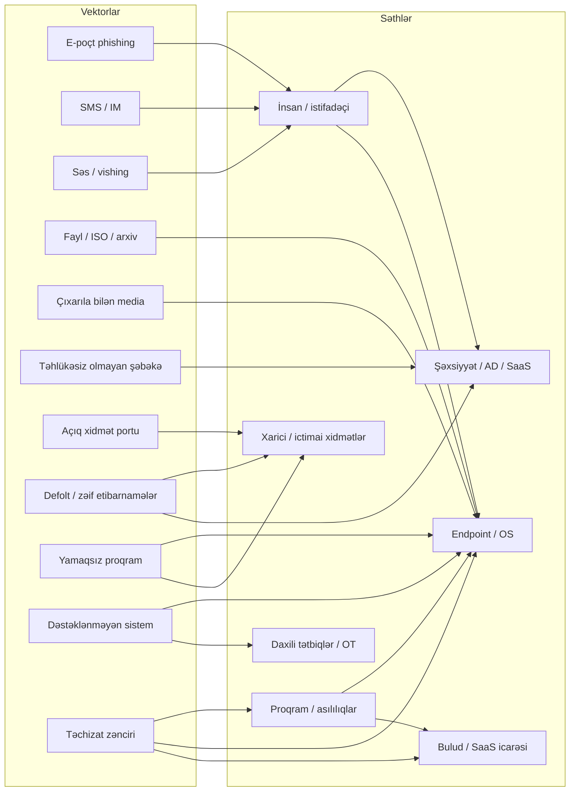

# Təhdid Vektorları və Hücum Səthləri

"Təhdid vektoru" — hücumçunun sizə çatmaq üçün getdiyi *yoldur*; "hücum səthi" — *mövcud yolların məcmusudur*. Fərq əhəmiyyətlidir, çünki müdafiəçilər səthə sahibdir — onun üzərindəki hər xidmət, istifadəçi, satıcı və yamaqsız ikilik faylı — hücumçular isə yalnız bir işlək vektor tapmalıdır. Riyaziyyat amansızdır: min qapı qoruyan müdafiəçi yalnız birindən keçməli olan hücumçuya uduzur.

Bu dərs həmin riyaziyyatı ciddi qəbul etmək haqqındadır. Biz 2026-cı ildə həqiqətən kompromis çatdıran vektorları siyahıya alacağıq — mesaj əsaslı, fayl əsaslı, səs, çıxarıla bilən media, təhlükəsiz olmayan şəbəkələr, açıq portlar, defolt etibarnamələr, zəif və dəstəklənməyən proqram və yarım onlarla təchizat-zənciri hücumu növü — və onları hədəf aldıqları hücum səthləri ilə uyğunlaşdıracağıq, beləliklə müdafiəçi xəbərləri oxuyur, "bizdə *o* varmı?" deyə soruşur və kampaniya `example.local`-a çatmazdan əvvəl telefonu götürür.

## Niyə bu vacibdir

Pozulmaların əksəriyyəti ekzotik sıfır günlərin nəticəsi deyil. Verizon DBIR, CISA KEV kataloqu və hər illik Mandiant hesabatı il-ildən eyni hekayəni danışır: phishing, oğurlanmış etibarnamələr, açıq xidmətlər və yamaqsız n-day boşluqları hadisələrin böyük əksəriyyətini çatdırır. Sıfır günləri *yandıran* hücumçular onları yüksək dəyərli hədəflər üçün saxlayır və qalan işlərində hamı kimi sakitcə eyni darıxdırıcı vektorlardan istifadə edir. Vektor sayımını "əsaslar" məşqi kimi qəbul edib "qabaqcıl" mövzular üçün ötürən müdafiəçi öldürmə zəncirinin səhv ucunu optimallaşdırır.

İkinci səbəb asimmetriyadır. Hücumçular tükəndirici şəkildə sayır — Shodan tarama, sertifikat şəffaflığı qeydləri, sızdırılmış etibarnamə yığınları, işçilərinizin LinkedIn-inə qarşı OSINT, satıcılarınız haqqında üçüncü tərəf pozulma kəşfiyyatı, ictimai kataloqdakı hər `nuclei` şablonu. Onlar unutduğunuz səthi tapacaq. *Eyni taramaları özlərinə qarşı* aparmayan müdafiəçilər rəqiblərindən kəskin daha kiçik baxışla işləyirlər. Davamlı Hücum Səthi İdarəetməsi (CAASM) və Xarici Hücum Səthi İdarəetməsi (EASM) alətləri ona görə mövcuddur ki, kimsə anlayıb ki, satınalma qeydlərindən qurulmuş aktiv inventarı uydurmadır; əsl inventar Shodan, Censys və öz DNS provayderinizin gördüyüdür.

Üçüncü səbəb təchizat zənciridir. 3CX, SolarWinds, Kaseya və MOVEit hadisələri sualı "*bizim* proqram yamaqlanıbmı?"dan "quraşdırdığımız hər proqram parçası etibarlıdırmı?"-a yenidən formalaşdırdı — və əksər təşkilatlar üçün cavab "bilmirik, heç soruşmamışıq"-dır. Müasir hücum-səthi inventarı yalnız ictimai IP-ləri deyil, proqram təchizat zəncirini, MSP/MSSP münasibətlərini və icarənizdəki OAuth icazələrini də əhatə etməlidir.

Nəhayət, "vektor versus səth" çərçivələnməsi *reaktiv* və *proaktiv* müdafiə arasındakı fərqdir. Tamamilə reaktiv komanda phishing e-poçtu görür, göndəricini bloklayır və davam edir; proaktiv komanda soruşur "phishing — vektordur, lakin hansı *səthə* düşdü və biz o səthi necə kiçildə bilərik?" Cavab nadir hallarda "daha bir göndəricini blokla"dır. O — "OAuth-icazə siyasətini sıxlaşdır, phishing-davamlı MFA tətbiq et, istifadəçini çatmaması lazım olan fayl serverlərindən seqmentləşdir və IR pyesini məşq et"-dir. Bu cür iş yalnız komanda siqnal deyil səthlərlə düşündüyü zaman baş verir.

## Təhdid aktorları — qısa təkrar

Aktorlar, atribusiya, təhdid-kəşfiyyatı kanalları və adlandırma-konvensiya zooparkı haqqında tam dərinləşmə [Təhdid aktorları və kəşfiyyat](./threat-actors-and-intel.md) dərsindədir. Bu dərs *onların nə etdiyi* haqqındadır; o dərs *onların kim olduğu* haqqındadır. Aşağıdakı cədvəl səhifənin qalanını mənalı edən otuz saniyəlik briefinqdir.

| Aktor | Resurslar | Davamlılıq | Tipik motiv |
|---|---|---|---|
| Dövlət təşkili | Çox yüksək | İllər | Casusluq, sabotaj, təsir |
| APT | Yüksək | Aylar - illər | Müəyyən hədəflərə davamlı giriş |
| Mütəşəkkil cinayət | Orta - yüksək | Həftələr - aylar | Maliyyə qazancı (ransomware, BEC, fırıldaqçılıq) |
| Haktivist | Aşağı - orta | Saatlar - günlər | İdeologiya, reklam, deface |
| Daxili (zərərli) | Dəyişkən | Aşkarlanana qədər | Pul, qisas, ideologiya |
| Daxili (səhlənkar) | yox | yox | Səhvlər, kin deyil |
| Bacarıqsız hücumçu | Aşağı | Tək çəkilmə | Şöhrət, ərköyünlük, fürsətçi qazanc |
| Shadow IT istifadəçi | yox | yox | Məhsuldarlıq (rəqib deyil) |

Diqqət edin ki, bu cədvəldəki iki sətir — səhlənkar daxili və shadow IT istifadəçilər — ümumiyyətlə rəqib deyildirlər. Onlar real problemləri yanlış alətlərlə həll edən istifadəçilərdir və yan təsir kimi hücum səthini böyüdürlər. Müdafiəçinin işi — *həqiqi rəqib gəlmədən əvvəl* onların yaratdığı səthi tapmaqdır.

## Əsas anlayışlar — Təhdid vektorları

### Mesaj əsaslı

E-poçt, SMS, ani mesajlaşma və indi QR kodları hər sənaye sorğusunda ilkin-giriş kompromisinin ən böyük tək payını çatdırır. Səbəb sadədir: mesaj platforması dizaynla hər istifadəçinin gələnlər qutusuna çatır, istifadəçi mesajlara reaksiya verməyə öyrəşdirilib və hücumçu min kliklər arasından yalnız biri lazımdır.

- **E-poçt phishing** — iş atı. Ümumi etibarnamə-yığma səhifələri, daxili layihələrə istinad edən hədəfli spear-phishing, köçürmə zəncirlərini ələ keçirən business email compromise (BEC), zərərli əlavələr və OAuth-icazə phishing-i, burada istifadəçi heç vaxt parol yazmadan hücumçu tətbiqinə poçt qutusu və ya bulud diskinə icazə verməyə aldadılır.
- **SMS smishing** — banklar, kuryerlər ("paketiniz gözləyir"), vergi orqanları və ya CEO-yu ("hədiyyə kartları al, təcili") imitasiya edən zərərli linklərlə qısa mətn mesajları. Mobil brauzerlər URL-ləri kəsdiyi üçün düşmən domen ilk baxışda qanuni görünür.
- **Ani mesajlaşma** — Slack, Microsoft Teams, WhatsApp, Telegram, Signal. Bir işçi hesabını kompromisə uğradan hücumçular onu işçilərin müdafiəni endirdiyi etibarlı kanal daxilindən həmkarlarını phishing etmək üçün istifadə edirlər. Xüsusilə xarici Teams federasiyası satıcı kimi görünən hücumçu icarələrindən zərərli proqram çatdırmaq üçün sui-istifadə edilib.
- **QR kod phishing-i (quishing)** — poster, dayanacaq nişanı və ya e-poçt mətnindəki QR kodu e-poçt-keçid skanerlərini bypass edən phishing URL-i açır, çünki keçid yalnız şəkili görür. İstifadəçi kodu telefonda həll edir, bu isə tez-tez korporativ proksi və EDR xaricindədir.

Müdafiəçinin mesaj əsaslı vektorlara cavabı qatlıdır: keçid filtrasiyası və DMARC/DKIM/SPF aşkar həcmi kəsir, phishing-davamlı MFA (FIDO2 açarları, platforma passkeys) etibarnamə yığmasını qapıda məğlub edir, qeyri-adi giriş coğrafiyalarını bayraqlayan şərti-giriş siyasətləri qalanı tutur. Bu qatlardan heç biri tək kifayət deyil; birlikdə onlar hücumçuları daha çətin vektorlara doğru itələyir.

### Şəkil əsaslı

Şəkil vektorları həcm baxımından daha kiçikdir, lakin red komandalar üçün qeyri-mütənasib maraqlıdır, çünki şəkil parserləri bir çox komponentdə yüksək imtiyazlarla etibarsız məlumat işlədir.

- **Steqanoqrafiya** — başqa cür qanuni şəkillər daxilində gizlədilmiş və hostda ayrı bir loader tərəfindən deşifrə edilən yüklər. İkinci mərhələ çatdırılmasında ümumi, burada şəkil uzantı ilə icazə verən məzmun filtrlərini bypass edir.
- **Zərərli şəkil parserləri** — tarixi Windows GDI səhvləri (MS04-028 JPEG, Windows qrafik CVE-lərinin uzun xətti), libpng və libwebp problemləri və PDF rasterizator səhvləri. Önizləmə panelində açılan tək hazırlanmış şəkil bir neçə hadisədə kod icrası üçün kifayət edib.
- **SVG qaçaqmalçılığı** — SVG faylları XML ehtiva edir və skriptləri yerləşdirə bilər; hücumçular onları e-poçt-keçid yoxlamasından sağ çıxan yönləndirmələr və ya yerləşdirilmiş HTML qaçaqmalçılıq yüklərini çatdırmaq üçün istifadə edir.

### Fayl əsaslı

Microsoft makro defoltlarını sıxlaşdırdıqdan sonra da fayllar əsas çatdırılma mexanizmi olaraq qalır. Hücumçular konteynerləri dəyişərək cavab verdilər.

- **Office makroları** — VBA ilə `.docm`, `.xlsm`, `.pptm`. Microsoft indi internet-etiketli makroları defolt olaraq bloklayır, bu hücumçuları yerini dəyişdi, lakin makroları aradan qaldırmadı (xüsusən Mark-of-the-Web silinmiş "etibarlı" fayl paylaşımlarından gələn sənədlər üçün).
- **ISO və IMG qaçaqmalçılığı** — hücumçu yük işlədən `.lnk` ehtiva edən `.iso` ehtiva edən `.zip` poçtla göndərir. Son Windows dəyişikliklərinə qədər bağlanmış ISO-lar Mark-of-the-Web-i məzmununa yaymırdı, beləliklə SmartScreen və makro-blok bildirişləri səssizcə bypass edilirdi.
- **Arxiv qaçaqmalçılığı** — `.zip`, `.7z`, parolun e-poçt mətnində olduğu parolla qorunan arxivlər. Arxiv məzmun taramasını bypass edir; istifadəçi parolu təmin edir və yükü əl ilə keçid yanından keçirir.
- **OneNote və HTML qaçaqmalçılığı** — yerləşdirilmiş zərərli əlavəli `.one` notebook və ya brauzerdə ikilik faylı yenidən birləşdirən və istifadəçidən yadda saxlamağı və işə salmağı tələb edən JavaScript-li `.html` faylı. Hər ikisi makro kilidləməsindən sonra adi hala gəldi.

Fayl vektorları boyu nümunə eynidir: hücumçular keçidin dərindən yoxlamadığı bir konteyner tapır, içində yük gizlədir və istifadəçinin onu çıxarıb icra etməsinə güvənir. İstifadəçi yazıla bilən qovluqlardan skriptləri və imzasız ikilikləri bloklayan tətbiq-nəzarət siyasətləri (AppLocker, WDAC) bu səthi əhəmiyyətli dərəcədə azaldır; tam yerləşdirmə əməliyyat baxımından çətindir, lakin phishing yükü ilk dəfə səssizcə işləməyəndə özünü ödəyir.

### Səs zəngi

Səs zəngləri sahib olduğunuz hər mətn əsaslı məzmun filtrini bypass edir və son generativ-AI inkişafları onları dramatik dərəcədə daha inandırıcı edir.

- **Vishing** — etibarnamələri, MFA kodlarını və ya uzaq-nəzarət razılığını ("mənim üçün TeamViewer-ə daxil ol" klassiki) çıxarmaq üçün IT dəstəyi, bank və ya kuryer kimi davranan telefon zəngi. Tez-tez zəngin qanuni sıfırlamanı təsdiq etdiyini göstərmək üçün əvvəlki phishing e-poçtu ilə birləşdirilir.
- **Deepfake səs** — YouTube və ya gəlir zəngindən CEO səsinin bir neçə saniyəsi maliyyəyə bir dəqiqəlik "köçürmə təlimat" zəngi üçün klonlamaq üçün kifayətdir. Bir neçə `example.local`-sinifli təşkilat 2024–2026-da buna altı və yeddi rəqəmli məbləğlər itirib.
- **MFA-yorğunluq zəngləri** — hücumçu MFA push bildirişləri axını tətikləyir və istifadəçiyə IT kimi davranaraq "növbəni təmizləmək üçün bildirişi təsdiqlə" deməyə zəng edir. Növbə sonunda yorğun istifadəçilərə qarşı təəccüblü dərəcədə yüksək uğur dərəcəsi.

Səs həm də ən pis telemetriya əhatəsinə malik vektordur. E-poçt, fayl çatdırılması və hətta SMS-də mərkəzi tıxac nöqtələri var; səs zəngləri SOC-un sorğulaya biləcəyi heç bir qeyd olmadan hər istifadəçinin şəxsi telefonuna çatır. Bu, səsin vektor kimi yüksəlməsinin bir hissəsidir: başqa yerlərdə mövcud olan nəzarətlər burada mövcud deyil.

### Çıxarıla bilən media

Çıxarıla bilən media köhnəlmiş görünür, sonra kimsə dayanacaqda tapdığı USB çubuğunu taxır.

- **USB atılması** — vestibül və ya icra dayanacağında səpələnmiş çubuqlar, bəzən marağı maksimuma çatdırmaq üçün "Maaşlar 2026" etiketləndirilir. Taxıldıqdan sonra autorun (hələ aktiv olduğu yerdə), HID emulyasiyası (BadUSB) və ya tək istifadəçi cüt klik yükü çatdırır.
- **BadUSB** — cihaz özünü OS-a klaviatura kimi tanıdır və maşın sürətində əmrlər yazır. İstifadəçi əslində Rubber Ducky olan "USB doldurucu" taxdı.
- **Aparat implantları** — kabellərdə (`O.MG cable`), siçanlarda, klaviaturalarda və ya periferik dock-larda əvvəlcədən quraşdırılmış kompromis. Daha yüksək səy, əsasən hədəfli əməliyyatlarda və təchizat-zənciri kəsişmə ssenarilərində görülür.
- **Juice jacking** — telefon məlumatlarını eksfilltrasiya etmək və ya yük itələmək üçün quraşdırılmış ictimai USB doldurma portları. Səyahət edən işçilər üçün tövsiyə edilən mitiqasiya "USB condom" data-blokatoru və ya divar rozetkası USB-PD adapteri.

Endpoint USB-nəzarət siyasətləri (VID/PID üzrə icazə siyahısı, yeni cihazlardan HID-emulyasiyasını blok, bütün yazıla bilən çıxarıla bilən medianı şifrələ) bu səthi sıfıra yaxın sıxır. Qiyməti — qanuni olaraq USB periferiyalarından istifadə edən işçilər üçün əməliyyat sürtünməsidir, buna görə də siyasət nadir hallarda tam tətbiq olunur.

### Zəif proqram

Tək ən darıxdırıcı və ən etibarlı hücumçu yolu: hücumçunun çata biləcəyi şəbəkədə məlum yamaqsız qüsuru olan proqram.

- **n-day istismarı** — ictimai CVE, ictimai sübut konsepsiyası, yamaq yerləşdirilməyib. CISA Məlum İstismar Edilən Boşluqlar kataloqu əməliyyat prioritet siyahısıdır — hər giriş kiminsə *hazırda* təbii olaraq istismar etdiyi şeydir.
- **Brauzer istismarları** — tam yamaqlanmış müasir brauzerlərə qarşı getdikcə nadirdir, lakin idarə edilməyən noutbuklar, kiosklar və yamaqsız podratçılar üçün vektor olaraq qalır.
- **İstismar dəstləri** — brauzeri barmaq izi alıb uyğun istismarı verən avtomatlaşdırılmış drive-by-yükləmə çərçivələri (tarixən RIG, Magnitude). Əmtəə cinayətində azaldı, lakin hədəfli əməliyyatlarda hələ də mövcuddur.

### Dəstəklənməyən sistemlər

Satıcı yamaqlar göndərməyi dayandırır; cihaz işləməyə davam edir. Hücumçu nöqteyi-nəzərindən, dəstək sonu ertəsi gün CVE kəşfi tək istiqamətli küçəyə çevrildiyi gündür.

- **Ömrü bitmiş Windows** — 2026-da XP, 7, Server 2008, Server 2012. Tez-tez sənaye nəzarət otaqlarında, satış nöqtəsi terminallarında və unudulmuş fayl serverlərində gizlənir.
- **Dəstək sonu firmware** — proqram-baxım müqaviləsi keçmiş köhnə Cisco, Fortinet, Citrix, F5 cihazları. Son illərin Citrix Bleed, Fortinet SSL-VPN və Ivanti Connect Secure səhv axınları dəstəkdən kənar aparatla dolu parkları vurdu.
- **Yamaqsız IoT** — kameralar, printerlər, kart oxuyucular, termostatlar, smart-TV nişanları. İstehsalatdan bir Wi-Fi şəbəkə uzaqda yaşayan defolt etibarnamələr və on illik Linux nüvələri.

Dəstəklənməyən sistemlərə iqtisadi cavab nadir hallarda "bir gecədə dəyişdir"dir. O — "izolə et, yaxından monitorla və əvəzetmə layihəsini cədvəllə büdcələ"dir. EOL sistemləri işlətmənin texniki riski realdır; sınanmış əvəzetmə olmadan onları çıxartmağın əməliyyat riski də realdır. Səhv — heç bir riskin mövcud olmadığını iddia etməkdir.

### Təhlükəsiz olmayan şəbəkələr

İstifadəçinin korporativ perimetrdən kənarda qoşulduğu şəbəkələr və ya korporasiyanın seqmentləşdirmədən işlətdiyi şəbəkələr.

- **Açıq Wi-Fi** — şifrələnməsi olmayan kafe AP-si və ya hər qonağın hər başqa qonağın trafikini görməsinə icazə verən otel şəbəkəsi. Müasir OS-lar HTTPS-everywhere üçün defolt edir, lakin etibarnamə-yığma portalları və sessiya-oğurluq hücumları hələ də şübhələnməyən istifadəçilərə qarşı işləyir.
- **Tutucu portallar** — hava limanı "şərtlərlə razılıq" səhifəsi etibarlı phishing şablonudur; istifadəçilər bu səhifələrdə etibarnamələri daxil etmək və sertifikat xəbərdarlıqlarını qəbul etmək üçün təlim alıblar.
- **Saxta giriş nöqtələri** — hücumçu `example-corp-guest` adlı AP qaldırır, noutbuk avtomatik qoşulur və hücumçu şifrələnməmiş trafiki MITM edir və responder vasitəsilə NTLM heşləri yığır.
- **İctimai Wi-Fi səyahətçi nümunələri** — konfranslarda, təyyarələrdə, otellərdə işçilər korporativ proksi xaricindədir və tez-tez EDR yeniləmə pəncərəsindən kənardadırlar. Müdaxilələrin kiçik, lakin davamlı payı otel-Wi-Fi kompromisinə geri gedir.

Daim açıq VPN, sertifikat-bağlı müştəri agentləri və korporativ resolverə DNS-over-HTTPS bu səthi idarə olunan cihazlar üçün sıxır. *İdarə olunmayan* cihaz (işçi şəxsi telefonu, podratçı noutbuku, BYOD planşeti) yumşaq hədəf olaraq qalır — əgər korporativ resurslara çata bilərsə, onun kompromisi sizin probleminizdir.

### Açıq xidmət portları

İnternet davamlı port taramasıdır. Açıq qoyduğunuz hər şey dəqiqələr içində yoxlanılır.

- **İnternetə açıq RDP (3389)** — ransomware filiallarının davamlı ən yüksək giriş nöqtəsi. Brute-force və ya etibarnamə-stuff edilmiş; "necə girdilər" hekayələrinin əksəriyyətinin arxasında olan dolu silah.
- **Açıq SMB (445)** — EternalBlue və varisləri düz-şəbəkə internet kənarlarında əbədi yaşayır; müasir hücumçular etibarnamə-stuff edilmiş admin paylaşımlarını üstün tutur, lakin vektor hələ də görünür.
- **Verilənlər bazası portları** — MongoDB (27017), Elasticsearch (9200), Redis (6379), Cassandra, Memcached — tarixən defolt olaraq autentifikasiyasız göndərildi və təkrar-təkrar kütləvi-ransomware edildi. Bir çoxu hələ də belədir.
- **İdarəetmə interfeysləri** — Jenkins, Kubernetes API serveri, Docker daemon-u, vCenter, ESXi, iLO/iDRAC. İnternetə açıq tək idarəetmə portu tez-tez baş verməyi gözləyən bütöv data-mərkəz ələ keçirməsidir.

Shodan və Censys ictimai kataloqları bu səthi "sahib olduğumuz hər IP-ni tap və özümüz tara"dan "ictimai indeksdə axtar və o, bizə nəyi unutduğumuzu deyəcək"-ə çevirir. Təşkilatın tanınan IP diapazonlarına qarşı on beş dəqiqəlik Shodan sorğusu demək olar ki, həmişə təəccüb qaytarır.

### Defolt etibarnamələr

Satıcı tərəfindən göndərilən defoltlar hələ də effektivdir, çünki kimsə, harasa, heç vaxt onları dəyişmədi.

- **Şəbəkə cihazları** — `admin/admin`, `admin/password`, satıcıya xas defoltlar (Cisco-nun `cisco/cisco`, MikroTik-in boş, Ubiquiti-nin `ubnt/ubnt`). Bütöv botnetlər internetdəki hər IP-yə qarşı ən yüksək 50 cütü sınamaqla işə götürür.
- **IoT cihazları** — kameralar, NVR-lər, SCADA HMI-lər sənədləşdirilmiş etibarnamələrlə göndərilir. 2016-da DynDNS-i bağlayan Mirai-sinifli botnetlər bu fakt üzərində işləyirdi və Mirai varisləri hələ də belədir.
- **Admin panelləri** — Tomcat manager, phpMyAdmin, Joomla/WordPress admin, GitLab/Gitea instansları, Grafana, Kibana. Quraşdırma-vaxtı defoltları toxunulmamış internetə baxan idarə panelləri adi red komanda tapıntısıdır.
- **Bulud-vedrə yanlış konfiqurasiyaları** — dünya-oxuna və ya, daha pis, dünya-yazıla bilən qoyulmuş S3 vedrələri, Azure blob-lar, GCS vedrələri. "Defolt etibarnamələr" "heç kimin sıxlaşdırmadığı defolt IAM siyasətləri"nə qədər uzanır.

Defolt-etibarnamə vektorları xüsusilə qəddardır, çünki büdcədəki hər digər təhlükəsizlik sərmayəsindən sağ çıxırlar. Təşkilat EDR yerləşdirə, şəbəkəni seqmentləşdirə, rüblük pentestlər apara bilər və hələ də `monitor.example.local`-da `admin/admin` cavablandıran tək Grafana panelinə uduza bilər. Mitiqasiya əhəmiyyətsizdir: defoltları toxunulmamış olan korporativ şəbəkədə çata bilən hər sistemi bayraqlayan baseline-config yoxlaması. Əhəmiyyətsiz, lakin müntəzəm olaraq əskik.

## Əsas anlayışlar — Hücum səthləri

### Xarici / ictimai

Açıq internetin görə biləcəyi hər şey — və buna görə hücumçuların ilk siyahıya aldığı səth.

- **DNS** — zonanızdakı hər subdomen, üçüncü tərəfə işarə edən hər CNAME, xidmət ləğv edildikdən sonra qalan hər asılı qeyd. Subdomain takeover (iddia edilməmiş S3 vedrəsinə və ya Heroku tətbiqinə işarə edən CNAME) təkrarlanan red komanda tapıntısıdır.
- **İctimai IP-lər** — sərhədinizə yönləndirilən ünvan blokları, iş yükləri ölçüləndikcə fırlanan bulud-provayder IP-ləri də daxil. EASM alətləri bunları izləyir, beləliklə cədvəli saxlamaq məcburiyyətində deyilsiniz.
- **Sertifikatlar** — Sertifikat Şəffaflığında qeydə alınmış hər TLS sertifikatı host adını ifşa edir; CT log mining alət dəstindəki ən ucuz kəşfiyyat texnikasıdır.
- **Açıq xidmətlər** — Shodan və Censys IP-lərinizi taradıqda görüb. Shodan baxışı rəqibinizin gördüyüdür; əgər ona baxmamısınızsa, öz hücum səthinizin yarısına kor olursunuz.

### Daxili / korporativ

Perimetrin daxilindəki səth — tarixən daha kiçik və daha etibarlı, müasir reallıqda tez-tez daha böyük və daha yumşaq yarı.

- **Korporativ şəbəkə** — iş stansiyaları, fayl serverləri, çap serverləri, daxili tətbiqlər, lab və test mühitləri, on il "gələn il ləğv edəcəyik" olan bütün miras.
- **Şəxsiyyət yığını** — Active Directory, Entra ID/Azure AD, SaaS-la federasiya, heç kimin tam xəritələmədiyi xidmət hesabları və qrup yuvalanması. Müasir müdaxilə demək olar ki, həmişə şəxsiyyət vasitəsilə fırlanır; iş stansiyasından Domain Admin-ə AD yolu çəkə bilməyən müdafiəçi şəklin yarısını itirir.
- **Daxili tətbiqlər** — daxili bilet sistemi, viki, intranet, HR portalı. Tez-tez internetə baxan tətbiqlərdən daha az sərtləşdirilir, çünki "onlar daxilidir".
- **Əməliyyat texnologiyası (OT)** — sənaye mühitləri üçün üç jump host və podratçı noutbuku istisna olmaqla "havadan ayrılmış" şəbəkədə PLC-lər, HMI-lər, SCADA serverləri və mühəndis iş stansiyaları.

Daxili-səth siyahıya alma şəxsiyyət qatı üçün `bloodhound` və `purplehound`-un, host qatı üçün `nessus` və `qualys`-in və SMB və etibarnamə qatı üçün `crackmapexec` / `nxc`-in mövcud olduğu işdir. Yalnız xarici skanerləri işlədən müdafiəçilər kəşf edir ki, daxilə düşən hücumçuların (phishing, satıcı kompromisi və ya oğurlanmış etibarnamələr vasitəsilə) işləməsi üçün perimetr skanının heç vaxt təklif etdiyindən daha zəngin səth var.

### Təchizat zənciri

Sahib olmadığınız, lakin miras aldığınız səth.

- **Proqram təchizat zənciri** — SolarWinds-Sunburst (2020) kompromisi, 3CX masaüstü müştəri kompromisi (2023), JetBrains TeamCity-vasitəli müdaxilələr, saxlayıcı-hesab ələ keçirilməsi vasitəsilə oqurlanmış onlarla npm və PyPI paketi. Quruluşunuzdakı hər asılılıq hücum səthinizin bir hissəsidir.
- **Aparat təchizat zənciri** — şəbəkə avadanlığında əvvəlcədən quraşdırılmış implantlar (Bloomberg Supermicro hekayəsi mübahisəli olaraq qalır, lakin təhdid modeli realdır), saxta komponentlər, istehsaldan göndərilmiş dəyişdirilmiş firmware. Əsasən yüksək-dəyərli hədəf narahatlığı, lakin xətt hərəkət edir.
- **MSP və MSSP kompromisi** — Kaseya VSA hadisəsi (2021) göstərdi ki, bir idarə-edilmiş-xidmət provayderini kompromisə uğradan hücumçu minlərlə aşağı-axın müştəriyə eyni vaxtda giriş əldə edir. Əgər MSP-niz hər endpoint-də agent işlədirsə, MSP-niz endpoint təhlükəsizliyinizdir.
- **Açıq mənbə asılılıq ələ keçirilməsi** — typo-squat edilmiş npm paketləri, zərərli post-install skriptləri, tərk edilmiş-paket ələ keçirilmələri və "dörd il əvvəl tranzitiv asılılıq əlavə etdim və indi onu kim saxladığını bilmirəm"-in uzun quyruğu. Software Bill of Materials (SBOM) təcrübələri məhz bu səthi görünən etmək üçün mövcuddur.

Təchizat zənciri *müdafiəçinin leveridji ən çox kiçildiyi* səthdir. Daxili yamaq sizdən asılıdır; satıcı yamağı onlardan asılıdır. Əvəzedici nəzarətlər fərqli formadadır: saatlar içində pozulma bildirişini tələb edən müqavilələr, CVE düşdüyü gün lockfile-a qarşı tara biləcəyiniz SBOM-lar, satıcı agentini düşmən olduğu anda karantinə ala bilən EDR və tək MSP kompromisinin park kompromisinə çevrilməsinin qarşısını alan seqmentləşdirmə. Təchizat-zənciri nəzarətlərini risk *qaçınması* deyil, sığortalı risk *transferi* kimi qəbul edin.

### Bulud və SaaS

Onillik əvvəl əksər təşkilatlar üçün mövcud olmayan və indi də az kəsin siyahıya aldığı səth.

- **Yanlış konfiqurasiya edilmiş vedrələr** — açıq S3, Azure blob, GCS — davamlı "üçüncü tərəf məlumat sızması" başlıqı.
- **OAuth icazə sui-istifadəsi** — istifadəçidən "Microsoft ilə daxil ol" tələb edən phishing axını zərərli tətbiqə poçt qutusundakı hər e-poçtu oxumaq icazəsini verir. Heç bir parol istifadəçidən çıxmır, MFA adi mənada bypass edilmir və ənənəvi təhlükəsizlik nəzarətləri razılıq ekranını tamamilə qaçırır.
- **Shadow IT və shadow SaaS** — şəxsi Dropbox, Trello, ChatGPT, Notion-a qeydiyyatdan keçən və korporativ məlumatları ora yapışdıran işçilər. Məlumat heç vaxt firewall-a toxunmadan perimetri keçir.
- **CI/CD boru kəmərləri** — GitHub Actions, GitLab CI runner-ləri, boru kəməri dəyişənlərində sirlər. Kompromisə uğradılmış CI runner-i istehsal açarlarına sahibdir; bu səth müasir mühitlərdə ən yüksək-leveridjli olanlardan biridir.

Cloud-Security Posture Management (CSPM) alətləri, SaaS-Security Posture Management (SSPM) alətləri və Identity Threat Detection and Response (ITDR) alətləri ona görə mövcuddur ki, bulud səthi əl yoxlaması üçün çox böyükdür və çox sürətlə dəyişir. Almaq və ya qurmaqdan asılı olmayaraq, əsas müşahidə eynidir: bulud taramalar arasında ən çox sürüşməyə meylli səthdir, beləliklə davamlı monitorinq yeganə davamlı cavabdır.

### İnsan / sosial

İstifadəçi hücum səthidir və öz məqsədləri olan yeganə səthdir.

Phishing, vishing, BEC və sosial mühəndislik hamısı istifadəçiyə birbaşa hücum edir. Heç bir firewall qaydası və heç bir endpoint agent bu səthi tam bağlamır; məlumatlandırma təlimi azaldır, lakin onu aradan qaldırmır. Dürüst müdafiəçinin mövqeyi "istifadəçilər kliklədəcək; onlar etdikdən sonra hansı əvəzedici nəzarətlərimiz var?"-dır — MFA, şərti giriş, hər endpoint-də EDR, partlayış radiusunu məhdudlaşdıran şəbəkə seqmentləşdirməsi və sınanmış IR pyesləri.

İncə nöqtə: insan səthi qeyri-müntəzəmdir. Maliyyə komandaları köçürmələri idarə edir və əsas BEC hədəfidir; icraçılar ictimai profillərə malikdir və fərdi olaraq spear-phishing edilirlər; IT işçilər imtiyazlı etibarnamələrə malikdir və satıcı kimi davranan vishing zəngləri alırlar; junior işçilərə "mənim üçün bir şey sına, sadəcə bu skripti işlət" deyilir. Hər işçini eyni şəkildə qəbul edən tək məlumatlandırma proqramı bu fərqli alt-səthləri qaçırır. Rol əsaslı phishing simulyasiyaları və rol-bilən nəzarətlər (məsələn, maliyyə köçürmələri üçün ikiqat təsdiq, IT adminləri üçün just-in-time yüksəltmə) hər alt-səthi ayrıca sıxır.

## Vektor → səth diaqramı

Diaqram bölgü deyil, evristikadır: phishing e-poçtu birbaşa Şəxsiyyəti (razılıq icazəsi) vura bilər, təchizat-zənciri kompromisi bütün park endpoint-lərinə eyni vaxtda düşə bilər və tək açıq RDP portu Xaricini birbaşa Daxiliyə körpüləyir. Onu "*bu* vektor işə düşəndə əvvəlcə hara baxım?" kimi oxuyun.

## Praktiki məşqlər

1. **`example.local`-a qarşı Shodan üslublu xarici tarama işlət.** Shodan, Censys və ya nəticə IP-lərə qarşı `amass enum -d example.local` plus `nmap -sV` istifadə et. Hər açıq portu, hər TLS sertifikat host adını və hər banner versiyasını sənədləşdir. Nəticəni aktiv inventarınla müqayisə et — taramada olan, lakin inventarda olmayan hər şey shadow infrastrukturdur və ayrı bilet başlayır.
2. **CMDB-də EOL proqramını müəyyən et.** Aktiv siyahısını çək, əməliyyat sistemi və firmware versiyalarını Microsoft, Cisco, Fortinet və digər satıcı ömrü-sonu təqvimləri ilə qarşılıqlı istinad et. EOL aktivlərinin prioritetli siyahısını, hər birinin nəyə açıq olduğunu və hər birini əvəz etmək və ya əvəzedici-nəzarət etmək xərcini hazırla.
3. **GoPhish ilə phishing kampaniyasını simulyasiya et.** `lab.example.local`-da GoPhish serverini qaldır, üç kampaniya (etibarnamə yığma, əlavə, OAuth razılıq) yaz, əvvəlcədən rəhbərlik təsdiqi ilə nəzarət edilən pilot qrupuna göndər və klik və hesabatçı dərəcələrini ölç. Nəticəni fərdləri cəzalandırmaq üçün deyil, məlumatlandırma təlimini tənzimləmək üçün istifadə et.
4. **Amass + nmap + nuclei ilə xarici hücum səthini audit et.** Subdomenləri siyahıya almaq üçün `amass enum -passive -d example.local` işlət, hər birini IP-yə həll et, hər IP-ni port-tara və cavab verən xidmətlərə qarşı məlum CVE-lər üçün `nuclei` şablonlarını işlət. Keçən rüblük işə müqayisə et; *delta*nı izlə — yeni subdomenlər, yeni açıq xidmətlər, yeni boşluqlar — bu sənin hücum-səthi sürüşmə metrikindir.
5. **Bir üçüncü tərəf satıcının vəziyyətini nəzərdən keçir.** Kritik satıcı seç, onların SOC 2 Type II hesabatını, ISO 27001 sertifikatını və ya ekvivalentini tələb et. Əhatə dairəsini, istisnaları, auditorun tapıntılarını və körpü məktubunu (hesabat altı aydan köhnədirsə) oxu. Onların nəzarətlərini onlara verdiyin məlumat və girişlə xəritələ. Qalıq riski və qəbul edib-etmədiyini sənədləşdir.

## İşlənmiş nümunə — `example.local` hücum-səthi qiymətləndirməsi aparır

`example.local` 1,200 işçili regional logistika şirkətidir. Sənayedə bir tərəfdaş yamaqsız Citrix cihazı vasitəsilə ransomware filialı tərəfindən vurulduqdan sonra CISO üç iş axını ilə hücum-səthi qiymətləndirməsini sifariş etdi: xarici kəşfiyyat, daxili müsahibə və təchizat-zənciri nəzərdən keçirilməsi.

**Xarici kəşfiyyat.** İki mühəndisli komanda `example.local`-a qarşı Amass işlətdi və 47 subdomen kəşf etdi, onlardan 11-i IT inventarında qeyd yox idi. Üçü ləğv edilmiş bulud tətbiqlərinə işarə edən asılı CNAME-lərdir (biri altı ay squatter tərəfindən parklanmışdı). Shodan podratçı lab maşınlarında açıq iki RDP portu və ləğv edilməli olan köhnə IP-də Jenkins instansını göstərdi. Sertifikat Şəffaflığı IT-nin çata biləcəyini bilmədiyi `vpn-staging.example.local`-ı çıxardı. Komanda istismar-mövcudluğuna görə sıralanmış 22 tapıntının siyahısını hazırladı.

**Daxili müsahibə.** İki həftə ərzində komanda departament rəhbərləri ilə qısa müsahibələr apardı — maliyyə, HR, marketinq, əməliyyatlar, R&D — yalnız "IT-nin sənə vermədiyi hansı alətləri istifadə edirsən?" soruşdu. Nəticə shadow-IT registrı oldu: aktiv istifadədə 43 SaaS məhsulu, onlardan 9-u fərdi kredit kartı ilə ödənildi, 4-ü istehsal-məlumat ixracları saxlayır. Korporativ şəbəkədəki 9 dəstəklənməyən Windows Server 2012 instansından 6-sı sahiblərinin unutduğu departament tətbiqlərini işlədir və biri maliyyə uzlaşma tətbiqinin yeganə nüsxəsi idi. Müsahibə nəticəsi heç bir skanerin istehsal edə bilməyəcəyi "yamaqlamadan əvvəl bunların nə olduğunu bilməliyik" inventarı idi.

**Təchizat zənciri.** Komanda kritiklik üzrə ən yüksək 20 satıcını siyahıya aldı — ödəniş prosessoru, iki MSP, SaaS HRIS, helpdesk-bilet satıcısı, e-poçt-təhlükəsizlik keçidi, EDR satıcısı və qalanları. Hər biri üçün: faylda olan ən son SOC 2 hesabatı, giriş əhatəsi (yalnız oxumaq? hər endpoint-də tam agent?), hadisə-bildiriş bəndləri və asılılıqdan-asılılıq xəritəsi. WAN routerlərini idarə edən MSP hər endpoint-də agentlərə malik idi və 19 ay əvvəl tarixli SOC 2 — yenilənməsi və ya əvəz edilməsi üçün düzəliş siyahısının başında.

**Prioritetli azaltma planı.** CISO üç iş axını nəticəsini götürdü və 90 günlük plan hazırladı: bu gün asılı DNS qeydlərini və Jenkins açıqlığını öldür; 9 EOL serveri 60 gündə köçür, körpü kimi əvəzedici nəzarətlərlə (şəbəkə izolyasiyası + EDR + monitorinq); il ərzində hər Tier-1 satıcıda müqaviləyə əsasən SOC 2-ləri tələb et; satınalma iş axınına shadow-IT registrını inteqrasiya et ki, yeni SaaS satınalmadan əvvəl beş-suallı təhlükəsizlik nəzərdən keçirməsindən keçsin.

Altı ay sonra qiymətləndirmə yenidən aparıldı. Xarici səth deltası 60% azaldı — daha az subdomen, asılı qeyd yoxdur, RDP bağlandı, Jenkins ləğv edildi. Shadow-IT registrı satınalma nəzərdən keçirilməsinə baxmayaraq böyüdü (çünki istifadəçilər alətlər tapmağa davam edir), lakin dörd "istehsal-məlumat" halı təsdiqlənmiş alternativlərə dəyişdirildi. Təchizat-zənciri nəzərdən keçirilməsi sakitcə təhlükəsizlik anketlərinə cavab verməyi dayandıran bir MSP-ni üzə çıxardı; müqavilə yenidən danışıldı. Bu qələbələrdən heç biri ekzotik deyildi. Hamısı *hücumçuların gördüyü səthi siyahıya almaq və onu qəsdən kiçiltmək*-dən gəldi.

`example.local`-ın götürdüyü dərs proses idi, texnologiya deyil. Amass və Shodan taramaları artıq onların alət dəstində idi; dəyişən şey rüblük kadens, təchizat-zənciri nəzərdən keçirilməsi üçün icraçı sponsor və shadow IT üçün satınalma-inteqrasiya addımı idi. İldə iki dəfə işləyən eyni nəzarətlər sənə çox az şey deyir; davamlı işləyən eyni nəzarətlər deltaları üzə çıxarır və deltalar hücumçuların girdiyi yerdir.

## Problemlər və tələlər

- **Daxili tamamilə açıq olduğu halda xaricidə fokuslanmaq.** "Biz perimetr-təhlükəsizik" 2026-da heç nə almır. Ransomware filiallarının əksəriyyəti phishing və ya oğurlanmış etibarnamələr vasitəsilə düşür və daxildə *başlayır*. Daxili seqmentləşdirmə, şəxsiyyət sərtləşdirilməsi və yan-hərəkət aşkarlaması müasir prioritetlərdir.
- **Təchizat zəncirini "onların problemi" kimi qəbul etmək.** SolarWinds, Kaseya, 3CX və MOVEit hamısı SLA-ları sizin hadisənizə çevrildiyi günə qədər "onların problemi" olan satıcı *vasitəsilə* kompromis çatdırdı. SBOM-lar və SOC 2 nəzərdən keçirmələri kağız iş deyil — onlar çatıla bilən səthlərdir.
- **İstifadəçilər təlimə baxmayaraq hələ də klikləyirlər.** Məlumatlandırma təlimi klik dərəcələrini "utancverici"dən "idarə edilə bilən"ə endirir, lakin heç vaxt sıfıra deyil. Klikə hazırlaş; onun yoxluğuna mərc qoyma.
- **Davamlı hücum-səthi idarəetməsi (CAASM) yoxdur.** İldə bir dəfə nöqtəli xarici tarama keçən ilin səhvlərinin şəklidir. İnternet dinamikdir; hücum səthiniz saatlıq dəyişir. Davamlı kəşf indi standartdır.
- **Shadow IT yalnız pozulmadan sonra kəşf edilir.** SOC SaaS məhsulunu ilk dəfə onun satıcısından gələn pozulma-bildiriş e-poçtunda görürsə, inventar uğursuz olub. Hadisədən *əvvəl* istifadəçilərdən soruş — onlar deyəcək və cavabların əksəriyyəti adi olacaq.
- **Taramalardan istisna edilmiş EOL sistemləri.** "Yamaq edilə bilmədiyi üçün yamaq siyahısından kənardır" sistemi hələ də ping edilə bilər, hələ də çatıla bilər və hələ də hücum səthinin bir hissəsidir. EOL "artıq əhatə dairəsində deyil" deyil — "*daha çox* əvəzedici nəzarət diqqətinə ehtiyacı var", daha az deyil.
- **"İstehsal deyil" lab avadanlığında defolt etibarnamələr.** Lab və staging mühitləri müntəzəm olaraq istehsal AD-yə qoşulur, istehsal məlumat ixraclarını saxlayır və lab-ın təhlükəsizlik siyasətinin təqaüdə getdiyi yer olduğunu bilən hücumçular üçün üstün fırlanma yolu kimi xidmət edir.
- **"Bir həftəsonu üçün" açıq RDP.** Bir həftəsonu üçün açıq olan RDP saatlar içində brute-force edilir. İdarəetmə portunu "müvəqqəti olaraq" açıq qoymaq diyə bir şey yoxdur — yalnız "açıq" var.
- **Bulud-vedrə konfiqurasiya sürüşməsi.** Keçən rüb şəxsi yaradılmış vedrə bu rüb ictimaidir, çünki kimsə inteqrasiyanı sazlamaq üçün siyasəti dəyişdi və geri qaytarmağı unutdu. Davamlı konfiqurasiya taraması (CSPM) cavabdır; əl ilə nəzərdən keçirmə yox.
- **MFA-ya görünməyən OAuth razılıq icazələri.** İstifadəçi MFA *ilə* və parol sızdırmadan icarəsindəki zərərli tətbiqə `Mail.Read` icazəsini verə bilər. Müasir şəxsiyyət qeydiyyatı razılıq-icazə hadisələrini ehtiva etməli və admin-razılıq iş axınları tətbiq edilməlidir.
- **Mənəvi silah kimi phishing simulyasiyaları.** Aqressiv phishing testləri aparmaq və klikləyənləri ictimai olaraq utandırmaq istifadəçi cəmiyyətini təhlükəsizlik komandasına qarşı çevirir və onların real hadisələri bildirməsini daha az ehtimal edir. Öyrət, cəzalandırma.
- **SMS və səsi "real hücum vektorları olmayanlar" kimi nəzərə almamaq.** Vishing və smishing real BEC və etibarnamə-yığma itkiləri çatdırır. SOC-un onlara zəif görünmə qabiliyyəti onları daha az real etmir.
- **Çıxarıla bilən medianı 2010 problemi kimi qəbul etmək.** USB-əsaslı hücumlar azalıb, lakin getməyib, xüsusən medianın seqmentləşdirilmiş zonalar arasında yeganə məlumat-yolu olduğu OT mühitlərində. BadUSB və HID-emulyasiya cihazları effektiv olaraq qalır.
- **Yoxlama siyahısı teatrı olan satıcı risk nəzərdən keçirmələri.** SOC 2 hesabatı "auditor onların nəzarətləri olduğunu təsdiqlədi" deyir. O nəzarətlərin *effektiv* olduğunu söyləmir və əhatə bəyanatından kənarda heç nəyi əhatə etmir. Əhatəni və istisnaları oxu; icraçı xülasəsi marketinqdir.
- **Davamlı test əvəzinə birdəfəlik sızma testi.** Pentest verilmiş həftə üçün səth nümunəsidir. Hücumçular pulsuz olaraq davamlı test aparırlar. Davamlı validasiya (BAS, purple-komanda məşqləri, red-komanda saxlamaları) boşluğu bağlayır.
- **Vacib olan səth üçün çatışmayan loglar.** Post-mortem "kimsə həmin ləğv edilmiş VPN-ə daxil olubmu?" soruşduqda və cavab "keçən il oradan log toplamağı dayandırdıq" olduqda, səth effektiv olaraq görünməz idi. Log-toplama əhatəsi hücum-səthi inventarının bir hissəsidir.
- **MSP/MSSP etibar fərz edilir, yoxlanılmır.** MSP-nin agenti hər endpoint-də SYSTEM kimi işləyir. Əgər MSP kompromisə uğrayıbsa, sən kompromisə uğrayıbsan. Onları özünü audit etdiyin kimi audit et və ya pozulmanı da xaricə verdiyini qəbul et.
- **"Sakit şifrələmə" heç kimi rahatlatmır.** Vedrələr, verilənlər bazaları və ehtiyat nüsxələri hamısı defolt olaraq "sakit şifrələnir". Pozulmalar diski oğurlamaqla deyil, *tətbiq giriş* vasitəsilə baş verir. Konfiqurasiya və IAM, sakit şifrələmə deyil, canlı hücum səthləridir.
- **CT loglarını məxfi kimi qəbul etmək.** Sertifikat Şəffaflığındakı host adları dünyaya oxuna biləndir; ictimai sertifikat vasitəsilə dünyaya açıq olan `admin-test.example.local` kimi daxili-səslənən subdomen saniyələr içində siyahıya alına bilər. Wildcard sertifikatları və ya yalnız-daxili CA-lar həssas host adları üçün doğru cavabdır.
- **Şəxsi kredit kartı ilə satınalma bypass-ı.** Menecerin şirkət kartı vasitəsilə istehsala çəkilən SaaS-ın "pulsuz sınaqları" heç vaxt satınalmadan keçmir, heç vaxt təhlükəsizlik nəzərdən keçirməsi görmür və SaaS-idarəetmə alətində heç vaxt görünmür. Düzəliş — ödəniş üsulundan asılı olmayaraq hər təkrarlanan SaaS xərcini bayraqlayan satınalma siyasətidir.
- **Tarama olmadan asılılıq sabitləmə.** `lodash@4.17.20` sabitləmək yaxşı gigiyenadır; "sabitlədik" deyə heç vaxt yeniləmək pis gigiyenadır. Sabitləmə *plus* lockfile-a qarşı CVE kanalı işlək cavabdır.

## Əsas çıxarışlar

- **Vektorlar yollardır; səthlər inventardır.** Müdafiəçilər inventara sahibdir; hücumçular yolu tapır.
- **Darıxdırıcı vektorlar pozulmaların əksəriyyətini çatdırır.** Phishing, oğurlanmış etibarnamələr, açıq xidmətlər və yamaqsız n-day-lər. 80/20 qaydası hərəkət etməyib.
- **Rəqiblərdən əvvəl özünü siyahıya al.** Shodan, Censys, CT logları, Amass — hücumçuların gördüyü siyahıya almalı olduğun şeydir.
- **Təchizat zənciri də sənin səthindir.** SolarWinds, Kaseya, 3CX. SBOM-lar və satıcı nəzərdən keçirmələri kağız iş deyil.
- **Shadow IT siqnaldır, xəyanət deyil.** O sənə biznes ehtiyaclarının IT tərəfindən qarşılanmadığı yerləri deyir — cəlb et, cəzalandırma.
- **EOL "əhatə xaricində" deyil, "daha çox əvəzedici nəzarətlər"-dir.** Yamaq edə bilmədiyin sistem ən çox izolyasiya və monitorinqə ehtiyac duyur.
- **OAuth, SaaS və razılıq icazələri birinci-sinif səthlərdir.** Şəxsiyyət-qatı nəzarətləri şəbəkə-qatı nəzarətləri qədər vacibdir.
- **İstifadəçilər kliklədəcək.** Klikə hazırlaş; MFA, EDR, seqmentləşdirmə və IR hazırlığı əvəzedici nəzarətlərdir.
- **Davamlı illikdən üstündür.** Hücum səthi saatlıq sürüşür; qiymətləndirmələr ayaqlaşmaq üçün davamlı olmalıdır.
- **Vektor siyahıya alma təkrarlanan məşqdir.** Yeni vektorlar yaranır — quishing, OAuth-razılıq phishing-i, deepfake səs — və kataloq saxlanmalıdır.
- **Pis günlərdə əvəzedici nəzarətlər vektor siyahıya almasından üstündür.** Vektoru tez bağlaya bilmədiyiniz halda, arxasındakı səth sərtləşənə qədər mitiqasiyaları qatlayın.
- **Diaqram müzakirədir.** Vektor-səth xəritəsini mühəndislik, əməliyyatlar və risklə yürüşmək prioritetlərin necə danışıldığıdır.
- **İş yığılır.** Davam etsən hər rüb səth kiçilir; etməsən hər rüb böyüyür.
- **Müdafiəçilər hücumçu kimi düşünməlidir.** İnventar üzərində red-komanda düşüncəsi yoxlama siyahısının heç vaxt tapmayacağı boşluqları tapır.
- **Qalığı sənədləşdir.** Bağlaya bilmədiyini yaz — qəbul edilmiş, sahibi və nəzərdən keçirmə tarixi ilə.

## İstinad şəkilləri

Bu illüstrasiyalar orijinal təlim slaydından götürülüb və yuxarıdakı dərs məzmununu tamamlayır.

  <figure><figcaption>Slayd 2</figcaption></figure>
  <figure><figcaption>Slayd 3</figcaption></figure>
  <figure><figcaption>Slayd 4</figcaption></figure>
  <figure><figcaption>Slayd 5</figcaption></figure>
  <figure><figcaption>Slayd 6</figcaption></figure>
  <figure><figcaption>Slayd 7</figcaption></figure>
  <figure><figcaption>Slayd 8</figcaption></figure>
  <figure><figcaption>Slayd 9</figcaption></figure>
  <figure><figcaption>Slayd 18</figcaption></figure>
  <figure><figcaption>Slayd 18</figcaption></figure>
  <figure><figcaption>Slayd 19</figcaption></figure>
  <figure><figcaption>Slayd 19</figcaption></figure>
  <figure><figcaption>Slayd 24</figcaption></figure>

## İstinadlar

- MITRE ATT&CK — Initial Access taktikası — [attack.mitre.org/tactics/TA0001](https://attack.mitre.org/tactics/TA0001/)
- OWASP Attack Surface Analysis Cheat Sheet — [cheatsheetseries.owasp.org/cheatsheets/Attack_Surface_Analysis_Cheat_Sheet.html](https://cheatsheetseries.owasp.org/cheatsheets/Attack_Surface_Analysis_Cheat_Sheet.html)
- NIST SP 800-161r1 (Cybersecurity Supply Chain Risk Management) — [csrc.nist.gov/pubs/sp/800/161/r1/final](https://csrc.nist.gov/pubs/sp/800/161/r1/final)
- CISA Known Exploited Vulnerabilities catalog — [cisa.gov/known-exploited-vulnerabilities-catalog](https://www.cisa.gov/known-exploited-vulnerabilities-catalog)
- Verizon Data Breach Investigations Report (DBIR) — [verizon.com/business/resources/reports/dbir](https://www.verizon.com/business/resources/reports/dbir/)
- Shodan — [shodan.io](https://www.shodan.io/)
- Censys — [censys.io](https://search.censys.io/)
- Amass (OWASP) — [github.com/owasp-amass/amass](https://github.com/owasp-amass/amass)
- Nuclei (ProjectDiscovery) — [github.com/projectdiscovery/nuclei](https://github.com/projectdiscovery/nuclei)
- GoPhish — [getgophish.com](https://getgophish.com/)
- CISA Stop Ransomware — [cisa.gov/stopransomware](https://www.cisa.gov/stopransomware)

## Əlaqəli dərslər

- [Təhdid aktorları və kəşfiyyat](./threat-actors-and-intel.md) — kim hücum edir və onları necə izləmək haqqında dərinləşmə.
- [Sosial mühəndislik](./social-engineering.md) — phishing, vishing və pretexting-də istifadə edilən insan-vektor texnikaları.
- [Zərərli proqram növləri](./malware-types.md) — yuxarıdakı vektorlar vasitəsilə nə çatdırılır.
- [İlkin giriş](./initial-access.md) — uğurlu vektor istismarından sonrakı dayaq mərhələsi.
- [Şəbəkə hücumları](./network-attacks.md) — açıq portlardan yan-hərəkət daxil olmaqla daxildə hücumçuların etdiyi.
- [Hücum göstəriciləri (IOC və IOA)](./attack-indicators.md) — hər vektorun telemetriyanızda buraxdığı artefaktlar.
- [Sızma testləri](./penetration-testing.md) — öz hücum səthinizi yoxlamağın intizamlı məşqi.
- [Boşluq idarəetməsi](../general-security/assessment/vulnerability-management.md) — "zəif proqram"ı vektor kimi bağlayan yamaq və düzəliş proqramı.
- [Mitiqasiya texnikaları](../blue-teaming/mitigation-techniques.md) — hücum səthini sıxan müdafiə nümunələri.
- [İstintaq və mitiqasiya](../blue-teaming/investigation-and-mitigation.md) — vektor yük endirdikdə blue-komanda iş axını.
