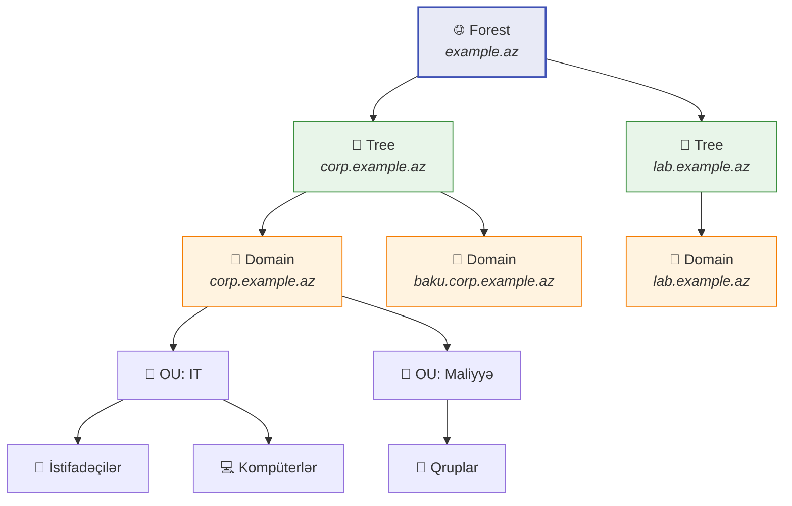
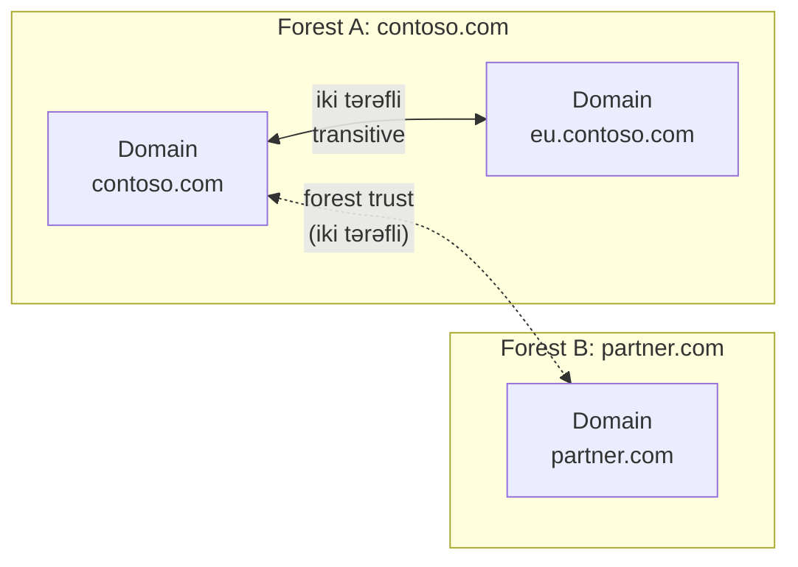

# Active Directory Domain Services (AD DS)

Active Directory Domain Services (AD DS) Windows Server mühitlərində mərkəzləşdirilmiş identity və resurs idarəçiliyi üçün Microsoft-un directory service qatıdır.

Əsas vəzifələri bunlardır:

- autentifikasiya
- authorization
- istifadəçi və kompüterlərin mərkəzləşdirilmiş idarəsi
- Group Policy tətbiqi
- domain controller-lər arasında directory replication

## Əsas bloklar

AD DS həm məntiqi, həm də fiziki komponentlərdən ibarətdir.

| Növ | Komponent | Nə edir |
| --- | --- | --- |
| Fiziki | Domain Controller (DC) | Directory datanı saxlayır və autentifikasiyanı idarə edir |
| Fiziki | Site | AD davranışını fiziki şəbəkə topologiyası və subnet-lərlə əlaqələndirir |
| Məntiqi | Forest | Bir və ya daha çox domain saxlayan ən yuxarı AD sərhədi |
| Məntiqi | Tree | Eyni namespace-i paylaşan domain-lər |
| Məntiqi | Domain | Forest daxilində inzibati və replication bölməsi |
| Məntiqi | OU | Obyektləri qruplaşdırmaq və delegation və ya policy tətbiq etmək üçün konteyner |

## Məntiqi iyerarxiya



Bu iyerarxiya məntiqidir. Domain controller və site-ların fiziki yerləşməsi ilə eyni şey deyil.

## Forest

Forest AD DS daxilində ən yuxarı konteynerdir. Microsoft forest-i aşağıdakıları paylaşan bir və ya daha çox domain toplusu kimi təsvir edir:

- ortaq schema
- ortaq configuration partition
- ortaq global catalog
- eyni forest daxilində domain-lər arasında avtomatik iki tərəfli transitive trust

Praktikada çox təşkilat üçün əsas seçim tək forest olmalıdır; birdən çox forest yalnız ciddi səbəb olduqda məntiqlidir.

Birdən çox forest üçün tipik səbəblər:

- sərt inzibati ayrılıq
- merger və ya miras qalmış mühitlər
- fərqli təhlükəsizlik və ya compliance sərhədləri
- bir-biri ilə uyğunlaşmayan dizayn tələbləri

> Microsoft istiqamətinə görə Active Directory dizaynında əsas təhlükəsizlik sərhədi domain yox, forest-dir.

## Domain

Domain forest daxilində həm naming boundary, həm də replication boundary-dir. Burada istifadəçilər, qruplar, kompüterlər və digər directory obyektləri saxlanılır.

Domain aşağıdakı mövzularda kömək edir:

- identity idarəçiliyi
- delegation
- replication miqyası
- policy strukturu

Vacib fərq:

- domain administrasiya və replication üçün faydalıdır
- forest isə daha güclü təhlükəsizlik sərhədidir

## Tree

Tree eyni və ya bitişik DNS namespace-i paylaşan domain-lər toplusudur.

Nümunə:

```text
corp.example.az
  -> baku.corp.example.az
  -> ganja.corp.example.az
```

Gündəlik idarəetmədə tree anlayışı forest və domain qədər mərkəzi deyil, amma namespace dizaynını anlamaq üçün vacibdir.

## Organizational Units (OU)

OU domain daxilində konteynerdir. Ən çox bunlar üçün istifadə olunur:

- istifadəçi və kompüterləri qruplaşdırmaq
- Group Policy tətbiq etmək
- müəyyən obyekt dəstinə admin hüquqlarını delegasiya etmək

Yaxşı OU dizaynı adətən sadəcə org-chart-a yox, admin ehtiyacına söykənir.

## Domain Controller-lər

Domain controller AD DS database-ni saxlayır və autentifikasiya ilə replication prosesində iştirak edir.

Əsas vəzifələri:

- istifadəçi və kompüter girişlərini emal etmək
- directory dəyişikliklərini replikasiya etmək
- directory partition-ları host etmək
- Windows mühitlərində çox vaxt DNS xidmətini də təmin etmək

Praktik qayda:

- vacib domain üçün ən azı 2 DC saxlayın
- tək DC-ni normal production dizayn kimi qəbul etməyin
- DC-ləri tier-0 və ya ona yaxın kritik infrastruktur kimi qoruyun

## Global Catalog

Global catalog (GC) aşağıdakıları saxlayan domain controller roludur:

- öz domain-inin tam writable kopyası
- forest-dəki digər domain-lərin partial kopyası

Bu, istifadəçi və servis-lərə obyektin hansı domain-də olduğunu bilmədən forest üzrə axtarış etməyə kömək edir.

GC xüsusilə bunlarda vacibdir:

- cross-domain obyekt axtarışları
- universal group-larla bağlı logon davranışı
- forest-wide directory search

## Sites

Site fiziki şəbəkə topologiyasını göstərir və adətən IP subnet-lərə əsaslanır.

Site-lar AD DS-ə bunları müəyyən etməyə kömək edir:

- client üçün ən yaxın DC hansıdır
- replication trafiki necə axmalıdır
- WAN üzərindən lazımsız replication necə azaldılmalıdır

Buna görə də AD-nin məntiqi modeli ilə fiziki deployment modeli ayrıca planlanmalıdır.

## Trust-lar

Trust bir domain və ya forest-dəki identity-lərin digərində tanınmasına imkan verir.



Əsas trust anlayışları:

| Trust tipi | Mənası |
| --- | --- |
| Transitive | Trust əlaqə zənciri boyunca davam edə bilir |
| Non-transitive | Trust yalnız birbaşa qoşulmuş tərəflərlə məhduddur |
| One-way | Bir tərəf digərinə etibar edir |
| Two-way | Hər iki tərəf bir-birinə etibar edir |

Eyni forest daxilində domain-lər avtomatik iki tərəfli transitive trust ilə bağlı olur.

## Replication

Bir domain controller-də dəyişiklik olduqda, həmin dəyişiklik eyni domain-dəki digər domain controller-lərə replikasiya olunur.

Replication dizaynı vacibdir, çünki bunlara təsir edir:

- recovery davranışı
- dəyişikliklərin hər yerə çatma müddəti
- WAN bandwidth istifadəsi
- ümumi directory sağlamlığı

Replication problemləri AD mühitini ən tez qeyri-sabit edən səbəblərdəndir.

## Hybrid identity qeydi

Bir çox mühit on-premises AD DS-i Microsoft Entra ID ilə inteqrasiya edir.

Bu, adətən belə görünür:

- istifadəçilər on-premises tərəfdə yaradılır və ya idarə olunur
- identity-lər cloud servislərinə sinxronizasiya edilir
- sign-in, policy və access dizaynı hər iki tərəfə yayılır

Bu, Entra ID-nin sadəcə "cloud AD" olduğu anlamına gəlmir. Məhsullar identity strategiyasında kəsişsə də, eyni servis deyillər.

## Sadə quraşdırma nümunəsi

Yeni forest üçün Microsoft-un göstərdiyi sadə PowerShell başlanğıcı budur:

```powershell
Install-WindowsFeature AD-Domain-Services -IncludeManagementTools
Install-ADDSForest -DomainName "corp.example.az"
```

Quraşdırmadan sonra yalnız promotion tamamlandığı üçün mühiti sağlam saymaq olmaz; nəticəni ayrıca yoxlamaq lazımdır.

## Praktik dizayn qaydaları

- əksini əsaslandıra bilmirsinizsə, bir forest ilə başlayın
- domain-i əsas təhlükəsizlik hekayəsi kimi yox, struktur və replication aləti kimi görün
- OU-ları policy və delegation ehtiyacına görə dizayn edin
- site-ları real subnet və WAN topologiyasına görə planlayın
- domain controller-ləri kritik təhlükəsizlik infrastrukturu kimi qoruyun
- mühiti sağlam saymadan əvvəl replication və backup vəziyyətini yoxlayın

## Faydalı linklər

- AD DS overview: [https://learn.microsoft.com/en-us/windows-server/identity/ad-ds/get-started/virtual-dc/active-directory-domain-services-overview](https://learn.microsoft.com/en-us/windows-server/identity/ad-ds/get-started/virtual-dc/active-directory-domain-services-overview)
- Logical model: [https://learn.microsoft.com/en-us/windows-server/identity/ad-ds/plan/understanding-the-active-directory-logical-model](https://learn.microsoft.com/en-us/windows-server/identity/ad-ds/plan/understanding-the-active-directory-logical-model)
- Install AD DS: [https://learn.microsoft.com/en-us/windows-server/identity/ad-ds/deploy/install-active-directory-domain-services--level-100-](https://learn.microsoft.com/en-us/windows-server/identity/ad-ds/deploy/install-active-directory-domain-services--level-100-)
- Functional levels: [https://learn.microsoft.com/en-us/windows-server/identity/ad-ds/plan/raise-domain-forest-functional-levels](https://learn.microsoft.com/en-us/windows-server/identity/ad-ds/plan/raise-domain-forest-functional-levels)
