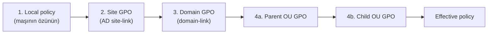
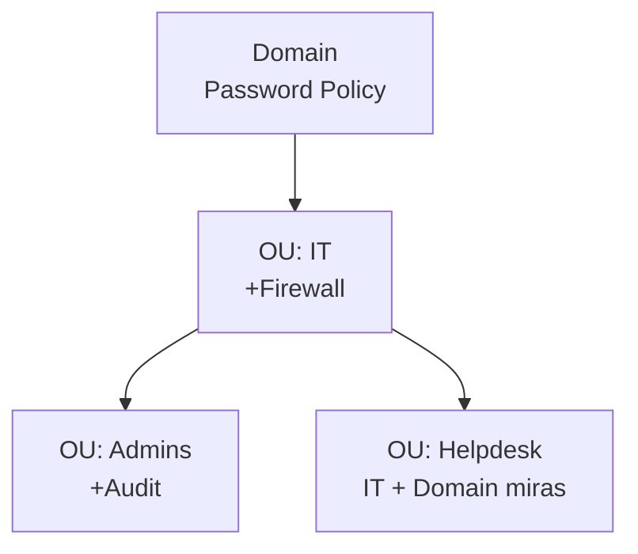

# Group Policy (GPO)

**Group Policy** — Windows domain mühitində user və kompüterlərə parametr göndərmək üçün əsas mexanizmdir. Qaydanı domain controller-də bir dəfə yazırsan, AD-də replikasiya olur və hər domain-joined maşın onu özü pull edir. GPO olmasa 200 iş stansiyasını konfiqurasiya etmək o 200 stansiyaya getmək deməkdir; GPO ilə bir kliklə olur.

Tək **Group Policy Object (GPO)** iki hissədən və iki yerdən ibarətdir:

| Hissə | Harada saxlanılır | Təyinat |
|---|---|---|
| Group Policy Container (GPC) | Active Directory | Metadata — GPO obyekti, link, permission |
| Group Policy Template (GPT) | SYSVOL share | Fayllar — registry.pol, script, template |

Bu bölünməyə görə "GPO sağlamlığı" həm AD replikasiyası, həm də SYSVOL replikasiyası düzgün olmaqdan asılıdır. GPO AD-də ola bilər, amma SYSVOL replika olmadığı üçün client-də işləmir.

Fiziki yol:

```
\\dc01.example.local\SYSVOL\example.local\Policies\{GUID}\
    ├── Machine\         ← Computer Configuration
    │   └── Registry.pol
    ├── User\            ← User Configuration
    │   └── Registry.pol
    └── GPT.INI          ← versiya nömrəsi
```

Hər GPO-nun öz GUID qovluğu var. `{31B2F340-016D-11D2-945F-00C04FB984F9}` həmişə Default Domain Policy-dir.

## Computer vs User konfiqurasiya

Hər GPO-nun iki hissəsi fərqli anlarda tətbiq olunur:

| | Computer Configuration | User Configuration |
|---|---|---|
| Nə vaxt? | **Boot-da** | **Login-də** |
| Kimə? | Maşına, kim login olursa olsun | User-ə, hansı maşında login olursa olsun |
| Tipik parametrlər | Firewall, Windows Update, audit policy | Desktop wallpaper, drive map, Start menu |

Yəni qayda "bu laptop USB-ni bloklamalıdır"-dırsa → Computer Configuration. "Aynur hara login olursa olsun şirkət wallpaper-ini görsün"-dürsə → User Configuration.

## LSDOU — tətbiq sırası

GPO-lar sabit sıra ilə tətbiq olunur. Konflikt olanda **sonra tətbiq olunan** qalib gəlir:



- **L — Local** (maşının öz policy store-u)
- **S — Site** (AD site-ə link olunmuş)
- **D — Domain** (domain-ə link olunmuş)
- **OU** — parent-dən child-a doğru

> Sonrakı qalib gəlir. Domain USB-yə icazə verirsə, amma OU USB-ni bloklayırsa, OU qaydası qalib gəlir — sonra tətbiq olunub.

### İşlənmiş nümunə

```
example.local (domain)
│   └── GPO: Default Domain Policy (min password = 6 simvol)
│
├── Teachers (OU)
│   └── GPO: Teacher policy (USB icazə, wallpaper A)
│
└── Students (OU)
    └── GPO: Student policy (USB qadağan, wallpaper B)
    │
    └── Year 1 (child OU)
        └── GPO: Year1 policy (wallpaper C)
```

**Year 1**-dəki user üçün nəticə:

- Password min = 6 simvol (Domain-dən)
- USB qadağan (Students OU-dan)
- Wallpaper C (Year 1 OU-dan, wallpaper B-ni override etdi)

## GPO nə vaxt yenilənir

- **Computer policy** — boot-da, sonra **90 dəqiqə ± 30 dəqiqə** random interval.
- **User policy** — login-də, eyni 90 dəqiqə refresh.
- **Domain Controllers** — hər **5 dəqiqə**.

Dərhal yeniləmək:

```powershell
gpupdate /force
```

Bəzi dəyişikliklər (software installation, folder redirection) tam logoff/reboot tələb edir — `/force` yetərli deyil.

## GPO ≠ GPO link

Bunlar iki ayrı şeydir, və qarışdırmaq GPO-da 1 nömrəli səhvdir:

- **GPO yaratmaq** policy obyektini **Group Policy Objects** konteynerinə qoyur.
- **Link etmək** onu site / domain / OU-ya bağlayır — yalnız bu onu *tətbiq edir*.

Link olmayan GPO heç kimə tətbiq olunmur. Və eyni GPO bir neçə OU-ya link oluna bilər — qaydanı bir dəfə yazıb tətbiq etməli olduğu yerlərin hamısına bağlayırsan.

## Group Policy Management Console (GPMC)

**Server Manager → Tools → Group Policy Management** və ya `gpmc.msc`.

Ağac:

```
Group Policy Management
└── Forest: example.local
    ├── Domains
    │   └── example.local
    │       ├── Default Domain Policy
    │       ├── Default Domain Controllers Policy
    │       ├── Domain Controllers (OU)
    │       ├── Students (OU)              ← sənin OU-ların
    │       ├── Teachers (OU)
    │       ├── IT (OU)
    │       └── Group Policy Objects       ← bütün GPO-lar
    ├── Sites
    └── Group Policy Modeling
```

### İki default GPO

AD avtomatik iki GPO yaradır:

| | Default Domain Policy | Default Domain Controllers Policy |
|---|---|---|
| Link | Domain root | Domain Controllers OU |
| İçində | Password, lockout, Kerberos policy | Audit policy, DC-lərdə user rights |
| Dəyişmək olar? | Yalnız password/lockout üçün. Başqa şey üçün yeni GPO yarat. | Ehtiyatla — yalnız DC-yə xas parametrlər. |

Qayda: **default-lara random parametrlər yığma.** Əgər default-lar pozulsa, bərpa etmək ağırdır. Məqsədə xas yeni GPO yarat.

## Yaratma və link

### Bir kliklə yarat + link et (GUI)

1. GPMC → hədəf **OU**-ya sağ klik.
2. **Create a GPO in this domain, and Link it here…**
3. Ad ver (məs. `USR-Student-Desktop`) → OK.

### Mövcud GPO-nu başqa OU-ya link et

Digər OU-ya sağ klik → **Link an Existing GPO…** → siyahıdan seç.

### Link-i silmədən söndür

OU-dakı link-ə sağ klik → **Link Enabled** işarəsini götür.

### PowerShell

```powershell
New-GPO     -Name "USR-Student-Desktop" -Comment "Tələbələr üçün desktop restriction"
New-GPLink  -Name "USR-Student-Desktop" -Target "OU=Students,OU=Example-Users,DC=example,DC=local"

# Eyni GPO-nu başqa OU-ya da link et
New-GPLink  -Name "USR-Student-Desktop" -Target "OU=Lab,OU=Example-Computers,DC=example,DC=local"

# Link-i söndür
Set-GPLink  -Name "USR-Student-Desktop" -Target "OU=Students,OU=Example-Users,DC=example,DC=local" -LinkEnabled No

# GPO-nu tamamilə sil
Remove-GPO  -Name "USR-Student-Desktop" -Confirm:$false
```

### Edit

GPO-ya sağ klik → **Edit…** **Group Policy Management Editor**-u açır. Ağac:

```
Computer Configuration / User Configuration
  ├── Policies
  │   ├── Software Settings
  │   ├── Windows Settings
  │   └── Administrative Templates
  └── Preferences
```

## Policies vs Preferences

Digər tez-tez qarışdırılan fərq.

| | **Policies** | **Preferences** |
|---|---|---|
| Məcburilik | Məcburi — user dəyişə bilməz | Təklif — user dəyişə bilər |
| Silmə | GPO silinir → parametr əvvəlki vəziyyətinə qayıdır | GPO silinir → parametr **qalır** ("tattooing") |
| Registry | `HKLM\Software\Policies\*` / `HKCU\Software\Policies\*` | Normal registry yerləri |
| Çeviklik | Sadə on/off | Item-level targeting, create/replace/update/delete |
| Tipik nümunələr | Password policy, USB block, Control Panel bağlı | Drive map, printer, shortcut, registry dəyəri |

### Nə vaxt hansı

| Ssenari | Policy yoxsa Preference? |
|---|---|
| USB qadağan et | Policy |
| Desktop wallpaper təyin et | Policy |
| Network drive map et | Preference |
| Desktop-a shortcut qoy | Preference |
| Printer əlavə et | Preference |
| Registry dəyəri yaz | Preference |
| Control Panel bağla | Policy |
| Windows Update konfiqurasiya | Policy |

## Bilmək lazım olan şablonlar

### Password policy

Password və lockout policy **yalnız domain səviyyəsində** işləyir — OU-ya link etmək heç nə etmir. Qruplara görə fərqli qayda lazımsa **Fine-Grained Password Policy (FGPP)** istifadə et.

**GPMC** → **Default Domain Policy** → Edit → **Computer Configuration → Policies → Windows Settings → Security Settings → Account Policies → Password Policy**.

| Parametr | Tövsiyə |
|---|---|
| Enforce password history | 5 |
| Maximum password age | 90 gün |
| Minimum password age | 1 gün |
| Minimum password length | 8 simvol |
| Password must meet complexity | Enabled |

**Account Lockout Policy** yanında:

| Parametr | Tövsiyə |
|---|---|
| Account lockout threshold | 5 |
| Account lockout duration | 30 dəqiqə |
| Reset counter after | 30 dəqiqə |

```powershell
# İndi hansı policy işləyir
Get-ADDefaultDomainPasswordPolicy

# Kilidlənmiş hesabı aç
Search-ADAccount -LockedOut
Unlock-ADAccount -Identity "e.mammadov"
```

### Desktop wallpaper (Policy, User Configuration)

Şəkli hamının oxuya bildiyi share-a qoy: `\\DC01\GPO-Resources\wallpaper.jpg`.

**User Configuration → Policies → Administrative Templates → Desktop → Desktop → Desktop Wallpaper** → Enabled, yolu və stili (Fill/Fit/Stretch/Center/Tile) yaz.

### USB storage bloklamaq (Policy, Computer Configuration)

**Computer Configuration → Policies → Administrative Templates → System → Removable Storage Access**:

- **All Removable Storage classes: Deny all access** → Enabled.

Daha dəqiq istəyirsənsə **Removable Disks: Deny read access / Deny write access**-i ayrı-ayrı aç.

IT admin-lərə USB saxlayıb qalanına qadağan etmək üçün bunu **Security Filtering** ilə birləşdir (aşağıda).

### User shell-i kilidlə (Policy, User Configuration)

- **Prohibit access to Control Panel and PC settings** — Enabled.
- **System → Prevent access to the command prompt** — Enabled + script-block sub-option.
- **System → Prevent access to registry editing tools** — Enabled.
- **System → Don't run specified Windows applications** — Enabled, exe adlarını siyahıya əlavə et.
- **System → Run only specified Windows applications** — atom bomba; yalnız siyahıdakı proqramlar işləyir. Ehtiyatla.

### Drive mapping (Preference, User Configuration)

**User Configuration → Preferences → Windows Settings → Drive Maps** → **New → Mapped Drive**:

- Action: **Create** (və ya Replace / Update / Delete)
- Location: `\\DC01\SharedData`
- Reconnect: on
- Label: `Shared`
- Drive Letter: `S:`

### Printer deployment (Preference, User Configuration)

**User Configuration → Preferences → Control Panel Settings → Printers → New → Shared Printer**:

- Share Path: `\\DC01\HP-LaserJet`
- Action: Create
- Opsional: default printer kimi təyin et

### Desktop shortcut (Preference, User Configuration)

**User Configuration → Preferences → Windows Settings → Shortcuts → New → Shortcut**:

- Name: `Example Portal`
- Target Type: URL
- Location: Desktop
- Target URL: `http://portal.example.local`

### Logon banner (Policy, Computer Configuration)

**Computer Configuration → Policies → Windows Settings → Security Settings → Local Policies → Security Options**:

- **Interactive logon: Message title for users attempting to log on** — şirkət / akademiya adı.
- **Interactive logon: Message text…** — məs. "Bu sistem yalnız icazəli istifadə üçündür. Fəaliyyət izlənilə bilər."

Login-dən əvvəl user OK basmalıdır — hüquqi xəbərdarlıq üçün də bir çox yurisdiksiyada vacibdir.

### WSUS client (Policy, Computer Configuration)

**Computer Configuration → Policies → Administrative Templates → Windows Components → Windows Update → Manage updates offered from Windows Server Update Services**:

- **Specify intranet Microsoft update service location** — iki URL də `http://DC01:8530`.
- **Configure Automatic Updates** → Enabled → opsiya 4 (auto download, scheduled install) → gün / vaxt.

### Audit policy (Policy, Computer Configuration)

**Computer Configuration → Policies → Windows Settings → Security Settings → Advanced Audit Policy Configuration → Audit Policies**:

- **Account Logon → Audit Credential Validation** → Success, Failure
- **Logon/Logoff → Audit Logon** → Success, Failure
- **Object Access → Audit File System** → Success, Failure
- **Account Management → Audit User Account Management** → Success, Failure

Event-lər **Event Viewer → Windows Logs → Security**-də görünür.

## Security filtering

Default olaraq GPO **Authenticated Users**-ə — yəni hamıya — tətbiq olunur. Daraltmaq üçün:

1. GPMC-də GPO-nu seç.
2. **Security Filtering** pəncərəsi → Authenticated Users-i **Remove**.
3. **Add** → qrup seç (məs. `GRP-Students`, `GRP-Teachers`).

> **Unutma**: Authenticated Users-i sildikdən sonra GPO-nun **Delegation** tab-ında **Domain Computers**-a **Read** icazəsi hələ də verilməlidir, əks halda Computer Configuration səssizcə tətbiq olunmur. **Delegation → Advanced → Add → Domain Computers → Read: Allow** et (*Apply group policy*-ni işarələmə).

## WMI filtering

WMI filter client-də sorğu işlədir; GPO yalnız sorğu nəticə qaytararsa tətbiq olunur.

**GPMC → WMI Filters → New**-dən yarat. Faydalı sorğular:

```sql
-- Yalnız Windows 11 workstation
SELECT * FROM Win32_OperatingSystem
WHERE Version LIKE "10.0.2%" AND ProductType = "1"

-- Yalnız laptop (battery var)
SELECT * FROM Win32_Battery
WHERE BatteryStatus IS NOT NULL

-- 8 GB+ RAM olan maşınlar
SELECT * FROM Win32_ComputerSystem
WHERE TotalPhysicalMemory >= 8589934592

-- Yalnız server
SELECT * FROM Win32_OperatingSystem
WHERE ProductType = "2" OR ProductType = "3"
```

Bağlamaq: GPO seç → **WMI Filtering** pəncərəsi → filter seç.

WMI filter ucuzdur amma pulsuz deyil — pis yazılmış sorğu fleet-boyu login-i yavaşladır. Qrup işə yarayırsa Security Filtering-ə üstünlük ver.

## Inheritance, Block, Enforced



Default olaraq yuxarı səviyyə GPO-lar aşağı axır. İki override var:

- **Block Inheritance** OU-da → üstdən gələn GPO-ları qəbul etməyi dayandırır.
- **Enforced** GPO link-də → həmin GPO Block Inheritance-i də keçərək *tətbiq olunmağa davam edir*.

Prioritet, ən güclüdən ən zəifə:

1. **Enforced GPO** yüksək səviyyədə (domain)
2. **Enforced GPO** OU-da
3. **OU GPO** (child > parent)
4. **Domain GPO**
5. **Site GPO**
6. **Local policy**

Diqqət: Block Inheritance lazım olan şeyləri də bloklayır, məsələn domain password policy-ni. Enforced + Block yalnız OU strukturu məsələni həll edə bilmədikdə istifadə et.

## Loopback processing

Normal model: Computer policy kompüterin OU-sundan, User policy **user**-in OU-sundan gəlir. Loopback bunu dəyişir — User Configuration **kompüterin** OU-sundan götürülür. Lab/kiosk kimi paylaşılan maşınlar üçün faydalıdır, çünki kim login olursa olsun eyni restriction-lar tətbiq olunmalıdır.

**Computer Configuration → Policies → Administrative Templates → System → Group Policy → Configure user Group Policy loopback processing mode** → Enabled.

- **Replace** — user-in normal User Configuration-u ignore olunur; yalnız kompüter OU-sundakı User Configuration tətbiq olunur.
- **Merge** — hər ikisi tətbiq olunur; konfliktdə kompüter OU-su qalib gəlir.

## Troubleshooting

### `gpresult` — nə tətbiq olundu

```powershell
# Cari user/computer üçün
gpresult /r

# Tam HTML report
gpresult /h C:\GPO-Report.html

# Başqa user
gpresult /user EXAMPLE\e.mammadov /r

# Yalnız bir scope
gpresult /scope computer /r
gpresult /scope user /r
```

Çıxışda **Applied Group Policy Objects** (işləyən) və **GPOs not applied** (filtrlənmiş) siyahılarına bax:

```
The following GPOs were not applied because they were filtered out:
    Teacher policy
        Filtering: Not Applied (Security)
```

- **Not Applied (Security)** — Security Filtering istisna etdi.
- **Not Applied (Empty)** — GPO-da heç bir parametr yoxdur.

### Refresh məcbur et

```powershell
gpupdate /force                            # hər iki scope
gpupdate /target:computer /force           # yalnız computer
gpupdate /target:user /force               # yalnız user
```

### Resultant Set of Policy (RSoP)

```powershell
rsop.msc
```

Hazırda işləyən bütün policy-lərin birləşmiş görünüşünü verir, hər parametrin yanında **Winning GPO** göstərilir.

### Event log

```
Event Viewer → Applications and Services Logs → Microsoft → Windows → GroupPolicy → Operational
```

```powershell
Get-WinEvent -LogName "Microsoft-Windows-GroupPolicy/Operational" -MaxEvents 50 |
    Select-Object TimeCreated, Id, Message |
    Format-Table -AutoSize
```

### Tipik nasazlıqlar

| Simptom | Yoxla |
|---|---|
| GPO heç tətbiq olunmur | Düzgün OU? Link Enabled? `gpresult`-da "filtered out"? `gpupdate /force` etdin? |
| User Configuration tətbiq olunmur | *User* düzgün OU-dadır (computer yox)? GPO-da User Configuration aktivdir? |
| Computer Configuration tətbiq olunmur | *Kompüter* düzgün OU-dadır? Authenticated Users-i silmisənsə, Domain Computers-a **Read** vermisən? Restart olub? |
| Konflikt | `gpresult /h` ilə HTML report; hər parametrin yanında "Winning GPO" kimin qalib olduğunu göstərir. |
| SYSVOL-ə bağlı qəribəlik | `dcdiag /test:sysvolcheck`, `dcdiag /test:netlogons`, `net share | findstr SYSVOL` |

## Backup və restore

### Backup

```powershell
New-Item -Path "C:\GPO-Backup" -ItemType Directory -Force

# Tək GPO
Backup-GPO -Name "USR-Student-Desktop" -Path "C:\GPO-Backup"

# Hamısı
Backup-GPO -All -Path "C:\GPO-Backup"
```

GUI: GPMC → **Group Policy Objects** → GPO-ya sağ klik → **Back Up…** (və ya konteynerə **Back Up All…**).

### Restore

```powershell
Restore-GPO -Name "USR-Student-Desktop" -Path "C:\GPO-Backup"
Restore-GPO -All -Path "C:\GPO-Backup"
```

GUI: GPO-ya sağ klik → **Restore from Backup…**.

### Başqa domain-ə köçürmə

Backup/restore eyni domain üçündür. GPO-nu fərqli domain-ə köçürmək üçün **Group Policy Objects** → sağ klik → **Import Settings…** → backup qovluğunu göstər. GPO domain-ə xas dəyərlər (UNC path, SID) saxlayırsa, **Migration Table** lazım ola bilər.

## Tam lab ssenarisi

Realistik mühiti addım-addım quraq.

### 1. OU strukturu

```powershell
New-ADOrganizationalUnit -Name "Example-Users"     -Path "DC=example,DC=local"
New-ADOrganizationalUnit -Name "Example-Computers" -Path "DC=example,DC=local"

# User OU-ları
New-ADOrganizationalUnit -Name "Teachers"  -Path "OU=Example-Users,DC=example,DC=local"
New-ADOrganizationalUnit -Name "Students"  -Path "OU=Example-Users,DC=example,DC=local"
New-ADOrganizationalUnit -Name "IT"        -Path "OU=Example-Users,DC=example,DC=local"

# Computer OU-ları
New-ADOrganizationalUnit -Name "Lab"       -Path "OU=Example-Computers,DC=example,DC=local"
New-ADOrganizationalUnit -Name "Office"    -Path "OU=Example-Computers,DC=example,DC=local"
```

### 2. Test user-ləri

```powershell
New-ADUser -Name "Elvin Mammadov" -SamAccountName "e.mammadov" `
           -UserPrincipalName "e.mammadov@example.local" `
           -Path "OU=Students,OU=Example-Users,DC=example,DC=local" `
           -AccountPassword (ConvertTo-SecureString "Student@123" -AsPlainText -Force) `
           -Enabled $true

New-ADUser -Name "Kamran Aliyev" -SamAccountName "k.aliyev" `
           -UserPrincipalName "k.aliyev@example.local" `
           -Path "OU=Teachers,OU=Example-Users,DC=example,DC=local" `
           -AccountPassword (ConvertTo-SecureString "Teacher@123" -AsPlainText -Force) `
           -Enabled $true

New-ADUser -Name "Rashad Huseynov" -SamAccountName "r.huseynov" `
           -UserPrincipalName "r.huseynov@example.local" `
           -Path "OU=IT,OU=Example-Users,DC=example,DC=local" `
           -AccountPassword (ConvertTo-SecureString "ITAdmin@123" -AsPlainText -Force) `
           -Enabled $true
```

### 3. Security qruplar

```powershell
New-ADGroup -Name "GRP-Students"  -GroupScope Global -GroupCategory Security `
            -Path "OU=Students,OU=Example-Users,DC=example,DC=local"
New-ADGroup -Name "GRP-Teachers"  -GroupScope Global -GroupCategory Security `
            -Path "OU=Teachers,OU=Example-Users,DC=example,DC=local"
New-ADGroup -Name "GRP-IT-Admins" -GroupScope Global -GroupCategory Security `
            -Path "OU=IT,OU=Example-Users,DC=example,DC=local"

Add-ADGroupMember -Identity "GRP-Students"  -Members "e.mammadov"
Add-ADGroupMember -Identity "GRP-Teachers"  -Members "k.aliyev"
Add-ADGroupMember -Identity "GRP-IT-Admins" -Members "r.huseynov"
```

### 4. Paylaşılan resurslar

```powershell
New-Item     -Path "C:\GPO-Resources" -ItemType Directory -Force
New-SmbShare -Name "GPO-Resources" -Path "C:\GPO-Resources" -ReadAccess "EXAMPLE\Domain Users"

New-Item     -Path "C:\SharedData\Common"    -ItemType Directory -Force
New-Item     -Path "C:\SharedData\Teachers"  -ItemType Directory -Force
New-SmbShare -Name "SharedData" -Path "C:\SharedData" -ReadAccess "EXAMPLE\Domain Users"
```

### 5. GPO-lar

**Password policy** — Default Domain Policy-ni yuxarıdakı kimi redaktə et.

**USR-Student-Desktop** (Students OU-ya link):

- Desktop wallpaper → `\\DC01\GPO-Resources\wallpaper.jpg`
- Prohibit access to Control Panel
- Prevent access to command prompt
- Prevent access to registry editing tools

**CMP-USB-Block** (Example-Computers OU-ya link):

- All Removable Storage classes: Deny all access — Enabled
- Security filtering: Authenticated Users-i sil → `GRP-Students` əlavə et
- Delegation: `Domain Computers`-ə Read ver

**USR-Drive-Mapping** (Example-Users OU-ya link):

- Preferences → Drive Maps → `\\DC01\SharedData` kimi `S:`, Reconnect on, Create

**CMP-Login-Banner** (domain-ə link):

- Security Options → login message title və text

### 6. Test

```powershell
gpupdate /force
gpresult /r
gpresult /h C:\GPO-Test.html
Start-Process "C:\GPO-Test.html"
```

### 7. Backup

```powershell
New-Item -Path "C:\GPO-Backup" -ItemType Directory -Force
Backup-GPO -All -Path "C:\GPO-Backup"
```

## Adlandırma konvensiyası və best practices

GPO-lara siyahıda oxuya bildiyin adlar ver.

```
Yaxşı:                       Pis:
    SEC-Password-Policy      New Group Policy Object
    USR-Student-Desktop      GPO1
    CMP-USB-Block            Test
    CMP-WSUS-Client          Policy
    USR-Drive-Mapping-Sales  aaa
```

Miqyas üçün prefikslər:

- `SEC-` — security policy
- `USR-` — user configuration
- `CMP-` — computer configuration
- `SW-` — software installation
- `PRN-` — printer policy

Digər qaydalar:

1. Bir GPO-ya 20 parametr yığma. Kiçik, tək məqsədli GPO-lar pozulanda söndürməsi asandır.
2. Test OU-sunda yoxla, sonra domain-boyu tətbiq et.
3. GPO-nun Comment sahəsinə nə etdiyini yaz. Gələcək sən təşəkkür edəcək.
4. İstifadə olunmayan hissəni deaktiv et — GPO-da yalnız Computer parametrləri varsa, GPO-da *User configuration disabled* et. Login daha sürətli olur.
5. `Backup-GPO -All`-u schedule et ki, kimsə Default Domain Policy-ni "sadəcə tənzimləyəndə" dünənki nüsxən olsun.
6. GPO sayını aşağı saxla. OU yolunda 50+ GPO — nə isə konsolidə olunmalıdır.
7. Security Filtering-dən Authenticated Users silsən, **Domain Computers**-ı **Read** ilə geri qaytar.
8. Mümkün olsa Block Inheritance-dən qaç. OU ağacını yenidən dizayn et.
9. Enforced **mütləq qalib olmalı** parametrlər üçündür — password policy, audit, security. Rahatlıq üçün yox.

## PowerShell cheat sheet

```powershell
# --- Yaratma / silmə / link ---
New-GPO      -Name "Ad"
New-GPLink   -Name "Ad" -Target "OU=X,DC=example,DC=local"
Remove-GPO   -Name "Ad"
Remove-GPLink -Name "Ad" -Target "OU=X,DC=example,DC=local"

# --- Məlumat ---
Get-GPO -All
Get-GPO -Name "Ad"
Get-GPInheritance -Target "OU=X,DC=example,DC=local"
Get-GPOReport     -Name "Ad" -ReportType Html -Path "C:\report.html"

# --- Backup / restore ---
Backup-GPO  -All  -Path "C:\Backup"
Backup-GPO  -Name "Ad" -Path "C:\Backup"
Restore-GPO -Name "Ad" -Path "C:\Backup"

# --- Registry-based policy ---
Set-GPRegistryValue    -Name "Ad" -Key "HKCU\..." -ValueName "X" -Type DWord -Value 1
Remove-GPRegistryValue -Name "Ad" -Key "HKCU\..." -ValueName "X"

# --- Permission ---
Get-GPPermission -Name "Ad" -All
Set-GPPermission -Name "Ad" -PermissionLevel GpoRead -TargetName "Qrup" -TargetType Group

# --- Client tərəfi ---
gpupdate  /force
gpresult  /r
gpresult  /h C:\report.html
rsop.msc

# --- Sağlamlıq ---
dcdiag /test:sysvolcheck
Get-WinEvent -LogName "Microsoft-Windows-GroupPolicy/Operational" -MaxEvents 20
```

## Praktiki nəticələr

- GPO iki hissədir — AD obyekti + SYSVOL faylları. Tətbiq olunmaq üçün hər ikisi replika olmalıdır.
- GPO yaratmaq link etmək deyil. Link yox = heç kimə tətbiq olunmur.
- Computer Configuration boot-da, User Configuration login-də işə düşür.
- LSDOU, sonrakı qalib gəlir. OU səviyyəsi qaydası adətən domain səviyyəsini üstələyir.
- Password policy yalnız domain-wide işləyir. Qrupa görə fərqli qayda üçün FGPP.
- Policies enforced-dir və silinəndə geri qayıdır. Preferences tattoo edir və qalır.
- Default GPO-ları password və audit xaricində redaktə etmə. Yeni adlı GPO yarat.
- Hər GPO-nu tək bir işə fokusla. İstifadə olunmayan yarısını deaktiv et.
- Security Filtering-i daraldanda Domain Computers-ı Read ilə geri qoy, yoxsa Computer Configuration səssizcə dayanır.
- Əvvəl `gpresult /h`, sonra nəzəriyyələr.
