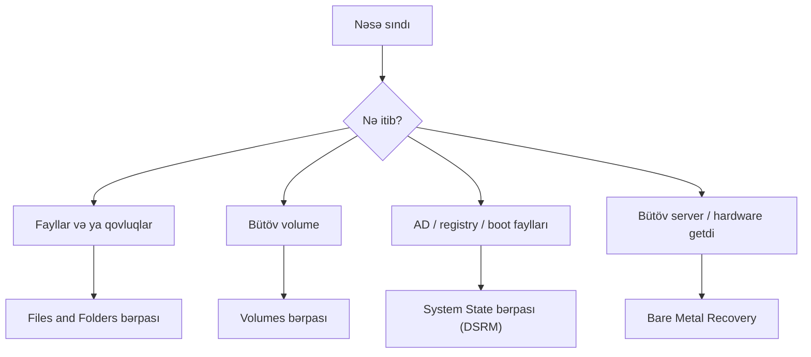

# Windows Server Backup

Backup son təhlükəsizlik toru kimi işləyir. Disk xarab olanda, ransomware bir share-i şifrələyəndə, admin səhvən səhv OU-nu silib və ya update sistemi yararsız hala salanda — işləyən backup çox vaxt production-a qayıtmağın yeganə yoludur.

Backup-ın pis bir saat ilə itirilmiş bir həftə arasındakı fərqi yaratdığı tipik hallar:

- Disk xarab olub və üstündəki bütün data gedib
- Ransomware faylları şifrələyib və ödəniş tələb edir
- Administrator təsadüfən vacib OU və ya GPO-nu silib
- Active Directory database korlanıb, heç kim login ola bilmir
- Uğursuz update OS-i boot olunmaz vəziyyətə salıb
- İstifadəçi vacib faylı silib və geri istəyir

> Backup yoxdursa — data yoxdur. Backup test edilməyibsə — backup yoxdur.

## 3-2-1 qaydası

Sağlam backup strategiyası **3-2-1 qaydasına** uyğun olur:

```
3 — Datanın üç nüsxəsini saxla (original + iki backup)
2 — İki fərqli media tipində saxla (disk, tape, cloud)
1 — Bir nüsxəni offsite saxla (başqa fiziki məkanda)
```

Ransomware eyni LAN-da oturan backup-ı da şifrələyə bilər. Buna tab gətirən yalnız offsite nüsxədir.

## Backup növləri

| Növ | Nəyi kopyalayır | Üstünlük | Mənfi | Tipik cədvəl |
| --- | --- | --- | --- | --- |
| **Full** | Hər şeyi | Bərpa asan, tək fayldan | Yavaş, böyük | Həftədə 1 dəfə |
| **Incremental** | **Son backup-dan** (full və ya incremental) sonra dəyişən | Sürətli, az yer | Bərpa üçün full + bütün incremental-lar lazımdır | Hər gün |
| **Differential** | **Son full-dan** sonra dəyişən hər şey | Bərpa yalnız full + son differential ilə | Hər gün böyüyür | Hər gün |
| **System State** | AD database, registry, boot files, SYSVOL, CA DB | OS bərpa etmədən AD/GPO-nu qaytarır | Tam server image deyil | DC-lərdə hər gün |
| **Bare Metal Recovery (BMR)** | OS, driver, proqram, konfiqurasiya, data | Boş hardware-ə tam bərpa | Ən böyük image | Həftədə 1 dəfə |

### Incremental vs differential — nümunə

```
Bazar (Full):         50 GB

        Incremental                        Differential
B.     50 GB (full)                   B.     50 GB (full)
B.E.    2 GB (B.-dən bəri)            B.E.    2 GB (B.-dən bəri)
Ç.A.    3 GB (B.E.-dən bəri)          Ç.A.    5 GB (B.-dən bəri)
Ç.      1 GB (Ç.A.-dən bəri)          Ç.      6 GB (B.-dən bəri)
C.A.    4 GB (Ç.-dən bəri)            C.A.   10 GB (B.-dən bəri)

Cümə axşamı bərpa:
  Incremental:   Full + B.E. + Ç.A. + Ç. + C.A.  (5 fayl)
  Differential:  Full + C.A.                      (2 fayl)
```

Windows Server Backup arxa planda block-level incremental engine istifadə edir, amma bərpanı tək əməliyyat kimi göstərir.

### System State nəyi tutur

| Komponent | Qeyd |
| --- | --- |
| Registry | Bütün sistem konfiqurasiyası |
| Boot faylları | OS başlanğıcı üçün lazımdır |
| Active Directory database | `NTDS.dit`, yalnız domain controller-lərdə |
| SYSVOL | GPO faylları və login script-lər, yalnız DC-lərdə |
| Certificate Services DB | AD CS quraşdırılıbsa |
| Cluster DB | Server cluster üzvüdürsə |

Domain controller-də **System State aldığın ən vacib backup-dır** — bu, fəlakətdən sonra AD-ni bərpa etməyə imkan verən şeydir.

## Windows Server Backup quraşdırması

Feature default olaraq quraşdırılmır.

```powershell
Install-WindowsFeature Windows-Server-Backup -IncludeManagementTools
```

GUI yolu: **Server Manager → Manage → Add Roles and Features → Features → Windows Server Backup**.

Console-u **Server Manager → Tools → Windows Server Backup** ilə və ya `wbadmin.msc` ilə aç.

```
Windows Server Backup
├── Local Backup
│   ├── Backup Schedule    — avtomatik cədvəl
│   ├── Backup Once        — birdəfəlik backup
│   ├── Recover            — bərpa
│   └── Status             — hazırkı / son backup nəticəsi
└── Messages
```

## Backup almaq

### Birdəfəlik backup (Backup Once)

Console-da **Backup Once… → Different options** və addımlar:

1. **Backup configuration:** tam image üçün `Full server (recommended)`, yoxsa konkret item-lər üçün `Custom`
2. **Add items:** `System State`-i işarələ (DC-də mütləqdir), əlavə olaraq lazımi volume və qovluqları
3. **Destination:**
   - `Local drives` — ayrılmış backup diski (ən yaxşısı)
   - `Remote shared folder` — UNC path, məsələn `\\BackupServer\Backups`
4. **Backup** düyməsini bas

PowerShell qarşılıqları:

```powershell
# Yalnız System State (DC-də ən vacibi)
wbadmin start systemstatebackup -backuptarget:D: -quiet

# Tam server (bütün critical volume-lar + System State)
wbadmin start backup -backuptarget:D: -include:C: -allcritical -systemstate -quiet

# Konkret qovluq network share-a
wbadmin start backup `
  -backuptarget:\\BackupServer\Backups `
  -include:C:\SharedData `
  -user:EXAMPLE\backupadmin -password:P@ssw0rd -quiet
```

Orta hardware-də təxmini müddətlər:

| Backup | Təxmini vaxt |
| --- | --- |
| System State | 5–15 dəq |
| Full server (~30 GB) | 15–45 dəq |
| Incremental (2–5 GB dəyişiklik) | 5–10 dəq |

### Scheduled backup

Console: **Backup Schedule… → Full server və ya Custom → Once a day / More than once a day → destination seç**.

Destination növləri:

- **Dedicated backup disk** — disk formatlanır və tamamilə Windows Server Backup tərəfindən idarə olunur. Ən etibarlısı.
- **Backup to a volume** — başqa diskin bir volume-u, digər data ilə paylaşıla bilər
- **Remote shared folder** — yalnız bir backup saxlanır (hər yeni backup əvvəlkini üstünə yazır)

PowerShell:

```powershell
$policy = New-WBPolicy
Add-WBSystemState -Policy $policy
Add-WBBareMetalRecovery -Policy $policy

$target = New-WBBackupTarget -VolumePath "D:"
Add-WBBackupTarget -Policy $policy -Target $target

Set-WBSchedule -Policy $policy -Schedule 21:00
Set-WBPolicy -Policy $policy
```

## Bərpa (Recovery)

Bərpa qərarları bir neçə əsas kateqoriyaya bölünür:



### Fayl və qovluq bərpası

Console: **Recover… → This server → backup tarixini seç → Files and folders → path seç → Original location və ya Another location**.

```powershell
wbadmin get versions

wbadmin start recovery `
  -version:04/22/2026-21:00 `
  -itemtype:File `
  -items:C:\SharedData\vacib.docx `
  -recoveryTarget:C:\Recovered -quiet
```

### System State bərpası

AD korlananda, GPO-lar itəndə və ya registry sınanda lazım olur. Domain controller-də System State bərpası **Directory Services Restore Mode (DSRM)**-də işlədilir.

1. DC-ni restart et
2. Boot-da **F8** bas, yoxsa `bcdedit /set safeboot dsrepair` təyin et və restart et
3. DC promote olunanda təyin edilmiş **DSRM şifrəsi** ilə login ol
4. Elevated prompt-dan:

   ```
   wbadmin start systemstaterecovery -version:<versiya> -quiet
   ```

5. Normal boot-a qayıt:

   ```
   bcdedit /deletevalue safeboot
   ```

Sadə System State bərpası **non-authoritative**-dir: DC online qayıtdıqdan sonra digər DC-lər daha yeni data-nı replikasiya edib bərpanı üstünə yazacaq. DC-ni sadəcə təmir edəndə istədiyin budur. Bilərəkdən silinmiş və artıq replikasiya olunmuş obyekti geri qaytarmaq istəyəndə bu kifayət **deyil**.

### Authoritative restore (AD obyektlərini geri qaytarmaq)

Ssenari: kimsə `Students` OU-nu silib və silinmə bütün DC-lərə replikasiya olunub.

1. DC-ni DSRM-ə boot et
2. `wbadmin start systemstaterecovery` ilə System State bərpa et (DSRM-də qal)
3. `ntdsutil` ilə obyekti authoritative işarələ:

   ```
   ntdsutil
   > activate instance ntds
   > authoritative restore
   > restore subtree "OU=Students,DC=example,DC=local"
   > quit
   > quit
   ```

4. `bcdedit /deletevalue safeboot` və restart

OU indi authoritative işarələndiyi üçün bərpa olunmuş versiya digər DC-lərdəki tombstone-lardan daha yüksək version number-a malik olur və replikasiyada qalib gəlir.

### Bare Metal Recovery

Hardware gedibsə və ya disk silinibsə:

1. Windows Server installation media-dan boot et
2. **Repair your computer** seç (Install yox)
3. **Troubleshoot → System Image Recovery**
4. Backup yerini göstər
5. Bərpanın bitməsini gözlə və restart et

## AD Recycle Bin

AD silmələrinin əksəriyyəti System State bərpasına ehtiyac yaradır. Windows Server 2008 R2-dən bəri AD-də **Recycle Bin** var — silinmiş obyektlər recycle bin aktiv olduğu müddətcə backup olmadan yerində bərpa edilə bilər.

**Default olaraq deaktivdir.** İlk gün aktiv et:

```powershell
Enable-ADOptionalFeature `
  -Identity "Recycle Bin Feature" `
  -Scope ForestOrConfigurationSet `
  -Target "example.local" -Confirm:$false
```

Recycle Bin-in aktivləşdirilməsi **birtərəflidir** — sonradan deaktiv edilə bilməz. Aktivləşdirməyin heç bir mənfi tərəfi yoxdur.

Silinmiş obyekti bərpa etmək:

```powershell
# Silinmiş user-ləri göstər
Get-ADObject -Filter {isDeleted -eq $true -and objectClass -eq "user"} -IncludeDeletedObjects

# Display name ilə birini bərpa et
Get-ADObject -Filter {displayName -eq "Əli Vəliyev" -and isDeleted -eq $true} `
  -IncludeDeletedObjects | Restore-ADObject

# Silinmiş OU-nu bütün içindəkilərlə birlikdə bərpa et
Get-ADObject -Filter {isDeleted -eq $true -and name -like "*Students*"} `
  -IncludeDeletedObjects | Restore-ADObject
```

Silinmiş obyektlər **tombstone lifetime** müddətində recycle bin-də qalır (default 180 gün). Sonra həmişəlik gedir.

## Monitoring

### Status və son işləmə

```powershell
Get-WBSummary                    # Son backup nəticəsi
Get-WBJob -Previous 1            # Son işin detalları
Get-WBPolicy | Select Schedule, BackupTargets
wbadmin get versions             # Saxlanılan bütün backup-lar
```

### Event log

```
Event Viewer → Applications and Services Logs → Microsoft → Windows → Backup → Operational
```

| Event ID | Mənası |
| --- | --- |
| 4 | Backup uğurlu oldu |
| 5 | Backup uğursuz oldu |
| 8 | Scheduled backup başlamadı |
| 9 | Backup cancel olundu |
| 14 | Bərpa uğurlu oldu |

```powershell
Get-WinEvent -LogName "Microsoft-Windows-Backup" -MaxEvents 20 |
  Select TimeCreated, Id, LevelDisplayName, Message
```

## Praktik nəticələr

- Hər domain controller-də ən azı gündəlik System State backup al
- Tez BMR üçün həftəlik full server backup saxla
- 3-2-1-ə əməl et; yalnız LAN-da olan backup ransomware hədəfidir, bərpa planı deyil
- Bərpaları müntəzəm olaraq test et — heç vaxt bərpa edilməmiş backup — backup deyil
- Forest-in ilk günündə AD Recycle Bin-i aktiv et
- DSRM şifrəsini yadda saxla və password vault-da saxla; onsuz System State bərpa edə bilməzsən
- Backup işinin uğursuzluqlarına alert qur ki, səssiz dayanma həftələrlə görünməmiş qalmasın
- Ən azı 30 gün retention saxla; tənzimlənən data üçün daha çox
- Bərpa runbook-unu sənədləşdir, o cümlədən DSRM-i kimin başlatma səlahiyyəti olduğunu

## Faydalı linklər

- Windows Server Backup icmalı: [https://learn.microsoft.com/en-us/windows-server/administration/windows-server-backup/windows-server-backup](https://learn.microsoft.com/en-us/windows-server/administration/windows-server-backup/windows-server-backup)
- `wbadmin` reference: [https://learn.microsoft.com/en-us/windows-server/administration/windows-commands/wbadmin](https://learn.microsoft.com/en-us/windows-server/administration/windows-commands/wbadmin)
- AD Recycle Bin addım-addım: [https://learn.microsoft.com/en-us/previous-versions/windows/it-pro/windows-server-2008-R2-and-2008/dd392261(v=ws.10)](https://learn.microsoft.com/en-us/previous-versions/windows/it-pro/windows-server-2008-R2-and-2008/dd392261(v=ws.10))
- `ntdsutil` ilə authoritative restore: [https://learn.microsoft.com/en-us/windows-server/identity/ad-ds/manage/troubleshoot/perform-an-authoritative-restore](https://learn.microsoft.com/en-us/windows-server/identity/ad-ds/manage/troubleshoot/perform-an-authoritative-restore)
