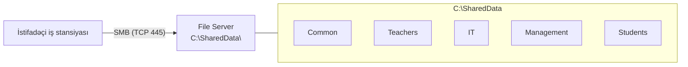

# File Server və NTFS Permissions

Hər təşkilatda fayllar paylaşılır — sənədlər, cədvəllər, layihə qovluqları. Bu paylaşmanın necə həyata keçirildiyi işləyən IT mühiti ilə gözlənilən pozuntu arasındakı fərqdir.

Tipik pis yanaşmalar:

- USB flash-la ötürmək (virus riski, versiya qarışıqlığı)
- Email attachment (ölçü limitləri, köhnə kopyalar)
- Şəxsi Google Drive / OneDrive (mərkəzi nəzarət yox, backup yox, audit yox)

Düzgün yanaşma — **File Server**: server üzərində paylaşılan qovluqlar, NTFS permissions ilə idarə olunur, vahid şəkildə backup alınır və mərkəzi olaraq skan edilir.

## File server necə işləyir

Client-lər file server ilə SMB (Server Message Block) protokolu üzərində **TCP 445** port-u ilə danışırlar.



Client tərəfindən `\\DC01\SharedData` yazmaq server-ə SMB sessiyası açır.

## Share yaratmaq

Əvvəlcə fiziki qovluqları yarat, sonra share et.

```powershell
New-Item -Path "C:\SharedData" -ItemType Directory -Force

'Common','Teachers','IT','Management','Students' | ForEach-Object {
    New-Item -Path "C:\SharedData\$_" -ItemType Directory -Force
}
```

Share yaratmaq üçün üç yol:

### GUI — qovluğun Properties-i

Qovluq üzərinə sağ klik → **Properties → Sharing → Advanced Sharing** → **Share this folder** işarələ, **Share name** təyin et və **Permissions** bas. Adətən tövsiyə — Share permissions-da `Everyone: Full Control` qoyub real nəzarəti NTFS səviyyəsində etmək.

### GUI — Server Manager

**Server Manager → File and Storage Services → Shares → Tasks → New Share → SMB Share – Quick**. Path, share adı və permissions seç. Bu yol Access-Based Enumeration kimi advanced seçimləri də açır.

### PowerShell

```powershell
New-SmbShare `
    -Name "SharedData" `
    -Path "C:\SharedData" `
    -FullAccess "EXAMPLE\Domain Admins" `
    -ChangeAccess "EXAMPLE\Domain Users"

# Departament üzrə ayrıca share-lər
New-SmbShare -Name "IT-Files"  -Path "C:\SharedData\IT"       -FullAccess "EXAMPLE\GRP-IT-Admins"
New-SmbShare -Name "Teachers"  -Path "C:\SharedData\Teachers" -FullAccess "EXAMPLE\GRP-Teachers"
```

### Client-dən qoşulmaq

```
\\DC01\SharedData       (Run / Explorer ünvan sətri)
```

```powershell
New-PSDrive -Name "S" -PSProvider FileSystem -Root "\\DC01\SharedData" -Persist
# və ya
net use S: \\DC01\SharedData /persistent:yes
```

GPO ilə drive-ların avtomatik map edilməsi **Group Policy** dərsində izah olunur.

### Gizli share-lər

Share adının sonuna `$` əlavə edilsə, network browse-da görünməz — tam UNC path bilmək lazımdır.

```powershell
New-SmbShare -Name "AdminFiles$" -Path "C:\AdminData" -FullAccess "EXAMPLE\Domain Admins"
# Giriş: \\DC01\AdminFiles$
```

Windows-un built-in gizli share-ları (`C$`, `D$`, `ADMIN$`, `IPC$`) administrator-lar üçündür və `LocalAccountTokenFilterPolicy` / UAC remote restrictions ilə idarə olunur.

### İdarəetmə əmrləri

```powershell
Get-SmbShare                               # bütün share-lər
Get-SmbShare -Name "SharedData" | fl *     # detallar
Get-SmbShareAccess -Name "SharedData"      # share ACL
Grant-SmbShareAccess -Name "SharedData" -AccountName "EXAMPLE\Domain Users" -AccessRight Change -Force
Revoke-SmbShareAccess -Name "SharedData" -AccountName "EXAMPLE\Domain Guests" -Force

Get-SmbSession      # kim indi qoşulub
Get-SmbOpenFile     # hansı fayllar açıqdır və kim tərəfindən
```

## Share vs NTFS permissions

Windows file sharing-in ən çox yanlış anlaşılan hissəsi. **Hər ikisi qiymətləndirilir və daha məhdudlaşdırıcı olan qalib gəlir.**

| Aspekt | Share permissions | NTFS permissions |
| --- | --- | --- |
| Nə vaxt işləyir | Yalnız network üzərindən | Həm local, həm network |
| Dəqiqlik | 3 səviyyə: Read, Change, Full Control | 13+ detallı hüquq |
| Əhatə | Yalnız qovluq | Qovluq və ya fayl səviyyəsində |
| Inheritance | Yoxdur | Var, alt elementlərə axır |

Kombinə effekti (daha məhdud qalib gəlir):

| Share | NTFS | Network üzərindən effektiv |
| --- | --- | --- |
| Full Control | Read | Read |
| Read | Full Control | Read |
| Change | Modify | Modify |
| Full Control | Full Control | Full Control |

Bu səbəbdən adi best practice — Share-i `Everyone: Full Control`-a (və ya `Authenticated Users: Full Control`-a) qoymaq və real nəzarəti NTFS səviyyəsində etmək. Biri idarə edirsən, iki ACL-in üst-üstə düşməsi məcburiyyəti yox olur.

## NTFS permission səviyyələri

Standard permissions gündəlik ehtiyacların əksəriyyətini örtür:

| Permission | Oxu | Yaz | İcra | Sil | Permission dəyiş |
| --- | --- | --- | --- | --- | --- |
| Full Control | Hə | Hə | Hə | Hə | Hə |
| Modify | Hə | Hə | Hə | Hə | Yox |
| Read & Execute | Hə | Yox | Hə | Yox | Yox |
| List Folder Contents | Yalnız qovluqlar | Yox | Hə | Yox | Yox |
| Read | Hə | Yox | Yox | Yox | Yox |
| Write | Yox | Hə | Yox | Yox | Yox |

Hər standard permission əslində **advanced permissions**-dan (Traverse Folder, Read Data, Write Attributes, Delete Subfolders and Files və s.) toplanır. Advanced nadirən lazım olur.

### Allow vs Deny

Hər ACE ya Allow ya da Deny-dır. **Deny həmişə Allow-u keçir**. Həm `Teachers Allow Read`, həm `Exam Cheaters Deny Read` qrupunda olan user ümumiyyətlə oxuya bilməyəcək.

Deny demək olar həmişə səhv alətdir — sadəcə Allow-u *verməməyə* üstünlük ver. Deny-ı yalnız geniş Allow üzərində həqiqi istisna qaydası kimi saxla.

## NTFS permissions təyin etmək

### GUI

Qovluq üzərinə sağ klik → **Properties → Security → Edit → Add** → user və ya group adını yaz, `Check Names`, OK. İcazələri işarələ və Apply.

### PowerShell

Nümunə — `C:\SharedData\Teachers` üçün: müəllimlər Modify, tələbələr Read, IT admin-lər Full Control:

```powershell
$path = "C:\SharedData\Teachers"
$acl  = Get-Acl $path

function Add-NtfsRule {
    param($Acl, $Identity, $Rights)
    $rule = New-Object System.Security.AccessControl.FileSystemAccessRule(
        $Identity, $Rights,
        "ContainerInherit,ObjectInherit", "None", "Allow")
    $Acl.AddAccessRule($rule)
}

Add-NtfsRule $acl "EXAMPLE\GRP-Teachers"  "Modify"
Add-NtfsRule $acl "EXAMPLE\GRP-Students"  "Read"
Add-NtfsRule $acl "EXAMPLE\GRP-IT-Admins" "FullControl"

Set-Acl $path $acl
```

Yoxla:

```powershell
icacls "C:\SharedData\Teachers"
```

## Inheritance (miras)

Default olaraq alt qovluq üst qovluğun permission-larını **miras alır**.

```
C:\SharedData\              Domain Users : Read
├── Common\                 miras: Domain Users : Read
├── Teachers\               miras: Domain Users : Read   + Teachers üçün explicit Modify
└── IT\                     miras: Domain Users : Read   <- inheritance qırılmış ola bilər
```

Inheritance-i görmək: **Properties → Security → Advanced → "Inherited from"** sütunu. `Parent Object` = miras alınıb; `None` = explicit.

### Inheritance-i qırmaq

Subfolder miras almamalıdırsa: **Advanced → Disable inheritance**. İki seçim:

- **Convert inherited permissions into explicit permissions on this object** — cari giriş snapshot-u saxla və oradan redaktə et. Daha təhlükəsiz default.
- **Remove all inherited permissions from this object** — təmiz başlanğıc. Özünü və Administrators-u bağlamaq asandır; ehtiyatla istifadə et.

```powershell
$acl = Get-Acl "C:\SharedData\IT"
# $true, $true = protect + cari permissions qoru (Convert)
# $true, $false = protect + miras alınanları sil (Remove)
$acl.SetAccessRuleProtection($true, $true)
Set-Acl "C:\SharedData\IT" $acl
```

### Effective Access

Bir user-in bütün qaydalar və miras qiymətləndirildikdən sonra *həqiqətən* nəyi aldığını görmək: **Properties → Security → Advanced → Effective Access**, user seç, view effective access.

Command line-dan:

```
icacls "C:\SharedData\Teachers"
```

`icacls` bayraqlarını oxumaq:

| Bayraq | Mənası |
| --- | --- |
| `(F)` | Full Control |
| `(M)` | Modify |
| `(RX)` | Read & Execute |
| `(R)` | Read |
| `(W)` | Write |
| `(OI)` | Object Inherit — fayllara tətbiq olunur |
| `(CI)` | Container Inherit — subfolders-ə tətbiq olunur |
| `(IO)` | Inherit Only — bu obyektə tətbiq olunmur |
| `(NP)` | No Propagate — yalnız bir səviyyə aşağı |

## Ownership

Hər fayl və qovluğun **sahibi** (owner) var və sahib həmişə icazələri dəyişə bilər — Full Control olmasa belə. Default olaraq yaradan user sahibdir.

Sahibliyi dəyişmək:

```powershell
$acl  = Get-Acl "C:\SharedData\IT"
$acl.SetOwner([System.Security.Principal.NTAccount]"EXAMPLE\r.huseynov")
Set-Acl "C:\SharedData\IT" $acl
```

Local Administrators həmişə istənilən obyektin **ownership-ini götürə** bilər. Bu təhlükəsizlik xüsusiyyətidir: heç bir user domain admin-dən faylı əbədi gizlədə bilməz.

## Uçdan-uca nümunə

Departament strukturu:

```
C:\SharedData\
├── Common          hamı oxu + yaz
├── Teachers        müəllimlər oxu + yaz, tələbələr oxu
├── IT              yalnız IT admin-lər
├── Management      rəhbərlik + IT admin-lər oxu
└── StudentWork     tələbələr oxu + yaz, müəllimlər oxu
```

Yuxarıda bir dəfə share et, hər şeyi NTFS ilə tənzimlə:

```powershell
New-SmbShare -Name "SharedData" -Path "C:\SharedData" `
  -FullAccess "Everyone" -FolderEnumerationMode AccessBased

function Grant-Access {
    param($Path, $Identity, $Rights)
    $acl = Get-Acl $Path
    $rule = New-Object System.Security.AccessControl.FileSystemAccessRule(
        $Identity, $Rights, "ContainerInherit,ObjectInherit", "None", "Allow")
    $acl.AddAccessRule($rule)
    Set-Acl $Path $acl
}

Grant-Access "C:\SharedData\Common"      "EXAMPLE\Domain Users"    "Modify"
Grant-Access "C:\SharedData\Teachers"    "EXAMPLE\GRP-Teachers"    "Modify"
Grant-Access "C:\SharedData\Teachers"    "EXAMPLE\GRP-Students"    "Read"
Grant-Access "C:\SharedData\IT"          "EXAMPLE\GRP-IT-Admins"   "FullControl"
Grant-Access "C:\SharedData\Management"  "EXAMPLE\Domain Admins"   "FullControl"
Grant-Access "C:\SharedData\Management"  "EXAMPLE\GRP-IT-Admins"   "Read"
Grant-Access "C:\SharedData\StudentWork" "EXAMPLE\GRP-Students"    "Modify"
Grant-Access "C:\SharedData\StudentWork" "EXAMPLE\GRP-Teachers"    "Read"
```

## Access-Based Enumeration (ABE)

ABE-siz user share-in içindəki **bütün** subfolder-ları görür — aça bilmədiyiləri də. ABE-li isə user yalnız oxumaq icazəsi olan qovluqları görür.

```
ABE off (default)           ABE on
\\DC01\SharedData\          \\DC01\SharedData\
├── Common           OK     ├── Common           OK
├── Teachers         OK     ├── Teachers         OK
├── IT               görünür amma giriş yox    (IT üzv olmayana görünmür)
├── Management       görünür amma giriş yox    (Management gizli)
└── StudentWork      OK     └── StudentWork      OK
```

Aktivləşdirmək:

```powershell
Set-SmbShare -Name "SharedData" -FolderEnumerationMode AccessBased -Force
```

Və ya **Server Manager → File and Storage Services → Shares → Properties → Settings → Enable access-based enumeration**.

Best practice: hər content share-də default olaraq aktiv. User-lərin aça bilmədikləri qovluqların adlarını görməsinin heç bir yaxşı səbəbi yoxdur.

## Quota və file screening (FSRM)

**File Server Resource Manager** quota, file screening və reporting-i sadə file server üstünə əlavə edir.

```powershell
Install-WindowsFeature FS-Resource-Manager -IncludeManagementTools
```

### Quota

Qovluq üzrə disk istifadə limiti. Onsuz bir user volume-u filmlərlə doldurar.

```powershell
New-FsrmQuota `
  -Path "C:\SharedData\StudentWork" `
  -Size 5GB `
  -Description "Tələbə iş qovluğu üçün 5 GB limit"
```

İki növ:

- **Hard quota** — limit keçilə bilməz. Limit üstü yazılar uğursuz olur.
- **Soft quota** — limit məsləhətdir. User keçə bilər; admin xəbərdarlıq alır.

80 / 90 / 100% həddlərdə email, event log və ya script reaksiyası tetiklenə bilər.

### File screening

Müəyyən fayl tiplərinin qovluğa yazılmasını qadağan et — məsələn user share-lərində `.mp3`, `.mp4`, `.avi`, `.exe` və ya `.torrent` olmasın.

```powershell
New-FsrmFileScreen -Path "C:\SharedData\StudentWork" `
  -Template "Block Audio and Video Files"
```

Custom template-lər ilə öz bloklanmış uzantı qruplarını təyin edə bilərsən.

## PowerShell cheat sheet

```powershell
# --- Share-lər ---
New-SmbShare -Name "Name" -Path "C:\Path" -FullAccess "EXAMPLE\Group"
Get-SmbShare
Set-SmbShare -Name "Name" -FolderEnumerationMode AccessBased -Force
Get-SmbSession            # aktiv bağlantılar
Get-SmbOpenFile           # istifadədə olan fayllar

# --- NTFS ---
icacls "C:\Path"
icacls "C:\Path" /grant "EXAMPLE\User:(OI)(CI)(M)"
icacls "C:\Path" /remove "EXAMPLE\User"
icacls "C:\Path" /reset

# --- Ownership ---
icacls "C:\Path" /setowner "EXAMPLE\Admin"

# --- Client ---
net use S: \\DC01\SharedData
net use S: /delete

# --- FSRM ---
New-FsrmQuota      -Path "C:\..." -Size 5GB
New-FsrmFileScreen -Path "C:\..." -Template "Block Audio and Video Files"
```

## Praktik nəticələr

- Yuxarıda bir share, nəzarət NTFS səviyyəsində — qaydaları iki yerə bölmə
- İcazələri həmişə **qruplara** ver, heç vaxt ayrı-ayrı user-lərə
- Hər content share-də Access-Based Enumeration aktiv et — user-lərin aça bilmədiyi qovluqları göstərməyin faydası yoxdur
- Allow-u verməməyi explicit Deny-a üstün tut
- User share-lərində FSRM quota-nı ilk gündən aktiv et; bir film kolleksiyası volume-u doldura bilər
- Həssas share-lərdə auditing-i aç ki, sonradan "kim sildi?" sualına cavab verə biləsən
- Hər share üçün nəzərdə tutulan ACL-i sənədləşdir — tarixçəsi bilinməyən qovluq heç kimin dəyişməyə cəsarət etmədiyi qovluğa çevrilir

## Faydalı linklər

- File server icmalı: [https://learn.microsoft.com/en-us/windows-server/storage/file-server/file-server-smb-overview](https://learn.microsoft.com/en-us/windows-server/storage/file-server/file-server-smb-overview)
- SMB shares PowerShell ilə: [https://learn.microsoft.com/en-us/powershell/module/smbshare/](https://learn.microsoft.com/en-us/powershell/module/smbshare/)
- NTFS permissions reference: [https://learn.microsoft.com/en-us/previous-versions/windows/it-pro/windows-server-2003/cc783530(v=ws.10)](https://learn.microsoft.com/en-us/previous-versions/windows/it-pro/windows-server-2003/cc783530(v=ws.10))
- FSRM icmalı: [https://learn.microsoft.com/en-us/windows-server/storage/fsrm/fsrm-overview](https://learn.microsoft.com/en-us/windows-server/storage/fsrm/fsrm-overview)
