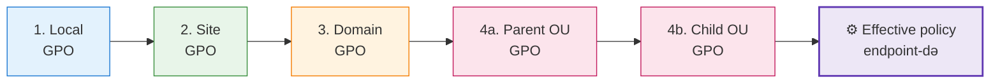
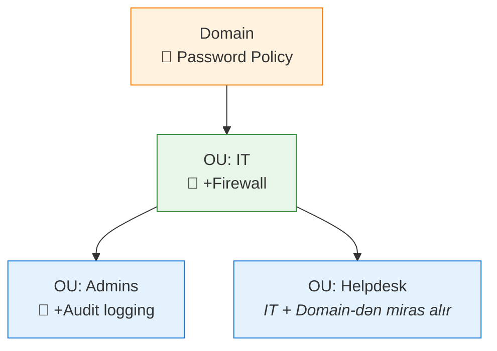

# Group Policy (GPO) Əsasları

Group Policy Windows domain mühitində istifadəçi və kompüter ayarlarını mərkəzləşdirilmiş qaydada tətbiq etmək üçün əsas mexanizmdir.

Ən çox bunlar üçün istifadə olunur:

- şifrə və account lockout ayarları
- firewall və təhlükəsizlik siyasətləri
- desktop və user environment nəzarəti
- proqram paylanması
- startup, shutdown, logon və logoff script-ləri

## GPO nə saxlayır?

Hər GPO iki əsas hissədən ibarətdir:

| Hissə | Harada saxlanılır | Məqsəd |
| --- | --- | --- |
| Group Policy Container (GPC) | Active Directory | Siyasətin meta-məlumatı |
| Group Policy Template (GPT) | SYSVOL | Policy faylları, script-lər və template-lər |

Bu səbəbdən GPO sağlamlığı həm directory replication-dan, həm də SYSVOL sağlamlığından asılıdır.

## Tətbiq ardıcıllığı: LSDOU

Group Policy tətbiqi çox vaxt **LSDOU** kimi izah olunur:



1. **Local**
2. **Site**
3. **Domain**
4. **OU** parent-dən child-a doğru

Birbaşa konflikt olanda adətən daha sonra tətbiq olunan ayar üstün gəlir; inheritance davranışı ayrıca dəyişdirilməyibsə bu belədir.

## Inheritance

Default olaraq yuxarı səviyyədəki GPO-lar aşağıya ötürülür.



Domain səviyyəsində link olunan GPO adətən child OU-lara da inheritance ilə düşür; ta ki nəsə bunu bloklamayana və ya override etməyənə qədər.

## Block Inheritance və Enforced

Bu iki anlayış tez-tez qarışdırılır.

- **Block Inheritance**: OU-nun yuxarıdan gələn adi GPO-ları qəbul etməməsini təmin edir
- **Enforced**: link olunmuş GPO-nun aşağı səviyyədə override və ya block olunmamasını təmin edir

Sadə qayda:

```text
Enforced GPO > Blocked normal inheritance > adi downstream conflict qaydaları
```

Bu imkanlardan ehtiyatla istifadə edin. Bəzi edge case-ləri həll edir, amma troubleshooting-i xeyli çətinləşdirir.

## Password Policy sahəsi

Klassik domain password və account lockout siyasəti domain səviyyəsində qurulduqda effektiv olur.

Ən çox istifadə olunan ayarlar:

- minimum password length
- complexity tələbləri
- maximum və minimum password age
- password history
- account lockout threshold və duration

Fərqli qruplar üçün fərqli şifrə qaydaları lazımdırsa, OU-linked GPO ilə həll etməyə çalışmaq əvəzinə **Fine-Grained Password Policies (FGPP)** istifadə edin.

## SYSVOL

SYSVOL domain controller-lərdə Group Policy template-lərini və əlaqəli faylları saxlayan shared qovluqdur.

Burada adətən bunlar olur:

- GPT məzmunu
- logon script-ləri
- policy template faylları

Tipik yol:

```text
C:\Windows\SYSVOL
```

Şəbəkə üzərindən nümunə:

```text
\\domain.example\SYSVOL
```

## Replication əsasları

GPO sağlamlığı iki ayrı replication yolundan asılıdır:

- **Active Directory replication** GPC və metadata üçün
- **SYSVOL replication** isə fayl əsaslı GPT məzmunu üçün

Bu tərəflərdən biri problemli olsa, GPO troubleshooting qeyri-sabit olur. Yəni “GPO mövcuddur” demək “GPO düzgün tətbiq olunur” demək deyil.

## Faydalı əmrlər

Policy-ni yenilə:

```cmd
gpupdate /force
```

Tətbiq olunan GPO-ları gör:

```cmd
gpresult /r
```

HTML hesabat yarat:

```cmd
gpresult /h C:\gpo-report.html
```

Group Policy Management-i aç:

```cmd
gpmc.msc
```

## Praktik nəticələr

- OU modelini düşünülə bilən qədər sadə saxlayın
- lazımsız Enforced və Block Inheritance kombinasiyalarından qaçın
- SYSVOL sağlamlığını GPO sağlamlığının bir hissəsi sayın
- parol siyasəti qrup üzrə fərqlənməlidirsə FGPP istifadə edin
- “ayar işləmir” demədən əvvəl processing order-i yoxlayın

## Faydalı linklər

- Group Policy overview: [https://learn.microsoft.com/en-us/windows-server/identity/ad-ds/manage/group-policy/group-policy-overview](https://learn.microsoft.com/en-us/windows-server/identity/ad-ds/manage/group-policy/group-policy-overview)
- Group Policy processing: [https://learn.microsoft.com/en-us/windows-server/identity/ad-ds/manage/group-policy/group-policy-processing](https://learn.microsoft.com/en-us/windows-server/identity/ad-ds/manage/group-policy/group-policy-processing)
- FGPP overview: [https://learn.microsoft.com/en-us/windows-server/identity/ad-ds/get-started/adac/fine-grained-password-policies](https://learn.microsoft.com/en-us/windows-server/identity/ad-ds/get-started/adac/fine-grained-password-policies)
