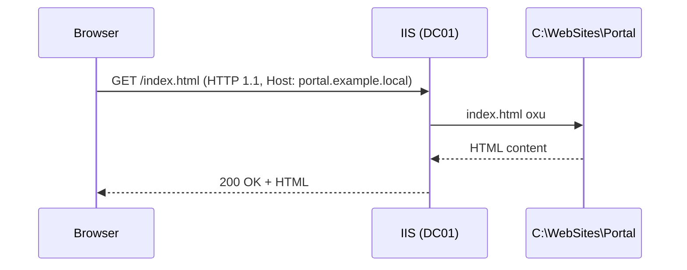

# IIS (Internet Information Services)

**IIS** — Microsoft-un web server-idir. Linux-da Apache və Nginx nə edirsə, Windows-da IIS onu edir. İntranet portallarını, daxili API-ları və çox Microsoft infrastrukturunun HTTP ön-üzünü hosted edir — RD Web Access və WSUS hər ikisi IIS üzərindədir, ona görə bir çox server onsuz da admin bilməsə də IIS işlədir.

Tipik request dövrü:



IIS nə üçün istifadə olunur:

| İstifadə | Nümunə |
| --- | --- |
| Daxili portal | Şirkət intranet |
| Web application | ASP.NET, API-lar |
| FTP server | Fayl upload / download |
| HTTPS hosting | TLS ilə qorunan saytlar |
| Reverse proxy | Backend xidmətlərinə front-end (URL Rewrite + ARR ilə) |
| RD Web Access | RDS web portalı |
| WSUS | WSUS-un öz web interfeysi |

### Əsas web-server terminləri

| Termin | Mənası |
| --- | --- |
| HTTP | Application-layer sorğu protokolu (default TCP 80) |
| HTTPS | HTTP TLS üzərində (TCP 443) |
| URL | `http://portal.example.local/docs/readme.html` |
| Request | Browser-in göndərdiyi (`GET`, `POST`, header, body) |
| Response | Server-in cavabı (status, header, body) |
| Status code | 200 OK, 404 Not Found, 500 Server Error və s. |
| Binding | Site-ın dinlədiyi IP + port + host name kombinasiyası |
| Virtual directory | Diskdə başqa yerdəki qovluğa yönəlmiş URL path |
| Application Pool | Bir və ya bir neçə site-ı hosted edən izolasiyalı `w3wp.exe` |

## Rolun quraşdırılması

```powershell
Install-WindowsFeature Web-Server -IncludeManagementTools
Install-WindowsFeature Web-Asp-Net45
Install-WindowsFeature Web-Windows-Auth
Install-WindowsFeature Web-Dyn-Compression
```

GUI yolu: **Server Manager → Add Roles and Features → Web Server (IIS)**. Default-lar plus bu role service-lər:

```
Web Server
├── Common HTTP Features
│   ├── Default Document
│   ├── Directory Browsing
│   ├── HTTP Errors
│   └── Static Content
├── Health and Diagnostics
│   ├── HTTP Logging
│   └── Request Monitor
├── Performance
│   └── Static Content Compression
├── Security
│   ├── Request Filtering
│   └── Windows Authentication   (intranet üçün domain auth)
├── Application Development
│   ├── ASP.NET 4.8
│   └── .NET Extensibility 4.8
└── Management Tools
    └── IIS Management Console
```

Browser-dən `http://localhost` — IIS default səhifəsi yüklənməlidir.

IIS Manager-i aç: **Server Manager → Tools → Internet Information Services (IIS) Manager**, ya da `inetmgr`.

```
IIS Manager
└── DC01
    ├── Application Pools        hər biri bir və ya bir neçə site host edir
    │   ├── DefaultAppPool
    │   └── .NET v4.5 Classic
    └── Sites
        └── Default Web Site     port 80-da avtomatik yaradılıb
```

## Site yaratmaq

Hər site-ı öz qovluğunda saxla.

```powershell
New-Item -Path "C:\WebSites\Portal" -ItemType Directory -Force
Set-Content -Path "C:\WebSites\Portal\index.html" -Value "<h1>Internal Portal</h1>"
```

GUI: **IIS Manager → Sites → Add Website**:

- Site name: `Portal`
- Application pool: `Portal` (auto-yaradılır)
- Physical path: `C:\WebSites\Portal`
- Binding: `http`, port `8080` (Default Web Site artıq port 80-ə sahibdir)

PowerShell:

```powershell
Import-Module WebAdministration
New-IISSite -Name "Portal" `
  -PhysicalPath "C:\WebSites\Portal" `
  -BindingInformation "*:8080:"

Get-IISSite
```

`http://localhost:8080` ilə yoxla.

## Host header ilə bir server-də çox site

Bir server, bir IP, port 80 — amma çox site. IIS HTTP `Host:` header-inə əsasən yönləndirir:

```
http://portal.example.local    → site Portal
http://intranet.example.local  → site Intranet
http://helpdesk.example.local  → site Helpdesk
```

Addımlar:

1. Site fayllarını öz qovluqlarında yarat
2. Site-ı host header-li və port 80-li binding ilə əlavə et
3. Browser-in host name-i həll edə bilməsi üçün DNS-də A record əlavə et

```powershell
New-Item -Path "C:\WebSites\Intranet" -ItemType Directory -Force
Set-Content -Path "C:\WebSites\Intranet\index.html" -Value "<h1>Intranet</h1>"

New-IISSite -Name "Intranet" `
  -PhysicalPath "C:\WebSites\Intranet" `
  -BindingInformation "*:80:intranet.example.local"

# Portal site-ı da host-header + port 80-ə yenilə
Set-WebBinding -Name "Portal" -BindingInformation "*:8080:" `
  -PropertyName Port -Value 80
Set-WebBinding -Name "Portal" -BindingInformation "*:80:" `
  -PropertyName HostHeader -Value "portal.example.local"

# DNS
Add-DnsServerResourceRecordA -ZoneName "example.local" -Name "portal"   -IPv4Address 10.0.0.4
Add-DnsServerResourceRecordA -ZoneName "example.local" -Name "intranet" -IPv4Address 10.0.0.4
```

Test: `Resolve-DnsName portal.example.local`, sonra browser-dən URL-ləri aç.

## Application pool-lar

Hər site öz **application pool**-unda — izolasiyalı `w3wp.exe` worker-da — işləyir. Pool-lar sənə verir:

- Crash izolasiyası (bir site çökməsi digərini yıxmır)
- Per-site memory limit, recycling və CPU throttling
- Fərqli .NET runtime per site
- İcazə ayrılığı üçün fərqli identity

```
IIS
├── App Pool Portal-Pool    → w3wp.exe  → Portal site
├── App Pool Intranet-Pool  → w3wp.exe  → Intranet site
└── App Pool DefaultAppPool → w3wp.exe  → Default Web Site
```

Yarat və bağla:

```powershell
New-WebAppPool -Name "Portal-Pool"
Set-ItemProperty "IIS:\Sites\Portal" -Name applicationPool -Value "Portal-Pool"
```

### Əhəmiyyətli pool parametrləri

| Parametr | Təyinat | Ağıllı default |
| --- | --- | --- |
| Identity | Worker hansı Windows hesabı ilə işləyir | `ApplicationPoolIdentity` |
| Maximum Worker Processes | Pool üzrə neçə `w3wp.exe` | `1` (web gardens adi deyil) |
| Idle Time-out (minutes) | İnaktivlikdən sonra pool-u dayandır | `20` |
| Regular Time Interval (minutes) | Cədvəl üzrə recycle | `1740` (29 saat — recycle-ləri səpələyir) |
| Private Memory Limit (KB) | Memory bu həddi keçəndə recycle | `0` (limitsiz) və ya `1048576` 1 GB üçün |

### Pool identity seçimləri

| Identity | Qeyd |
| --- | --- |
| **ApplicationPoolIdentity** | Hər pool üçün yaradılan virtual hesab. Ən təhlükəsiz default. |
| NetworkService | Network credential-ı olan built-in hesab |
| LocalSystem | Tam local admin — istifadə etmə, böyük hücum səthi |
| Custom domain account | `EXAMPLE\svc_web` — spesifik domain icazəsinə ehtiyacı olan app-lər üçün |

## HTTPS

HTTP plaintext-dir; yoldakı hər kəs trafiki oxuya və dəyişə bilər. HTTPS HTTP-ni TLS ilə sarır.

### Certificate mənbələri

| Mənbə | Nə üçün yaxşıdır |
| --- | --- |
| Self-signed | Lab və birdəfəlik test |
| Internal CA (AD CS) | Daxili saytlar, CA-ya etibar edən domain-joined client-lər |
| Public CA (Let's Encrypt, DigiCert, Sectigo) | Public internetdə hər şey |

### Self-signed (lab)

```powershell
$cert = New-SelfSignedCertificate `
  -DnsName "portal.example.local","intranet.example.local","dc01.example.local" `
  -CertStoreLocation "cert:\LocalMachine\My" `
  -NotAfter (Get-Date).AddYears(5) `
  -FriendlyName "Example Web Certificate"
```

Self-signed sertifikat browser-də xəbərdarlıq yaradır. Lab üçün yaxşıdır; real üçün yox.

### Certificate-i binding-ə bağla

GUI: **IIS Manager → site → Bindings → Add → type https, port 443, host name, SSL certificate**.

PowerShell:

```powershell
New-WebBinding -Name "Portal" -Protocol "https" `
  -Port 443 -HostHeader "portal.example.local" -SslFlags 1

$cert    = Get-ChildItem Cert:\LocalMachine\My |
           Where-Object { $_.FriendlyName -eq "Example Web Certificate" }
$binding = Get-WebBinding -Name "Portal" -Protocol "https"
$binding.AddSslCertificate($cert.Thumbprint, "My")
```

### HTTP → HTTPS redirect

Site root-una `web.config` qoy (**URL Rewrite** modulu lazımdır, Microsoft-dan endirilir):

```xml
<?xml version="1.0" encoding="UTF-8"?>
<configuration>
  <system.webServer>
    <rewrite>
      <rules>
        <rule name="HTTP to HTTPS" stopProcessing="true">
          <match url="(.*)" />
          <conditions>
            <add input="{HTTPS}" pattern="off" />
          </conditions>
          <action type="Redirect" url="https://{HTTP_HOST}/{R:1}" redirectType="Permanent" />
        </rule>
      </rules>
    </rewrite>
  </system.webServer>
</configuration>
```

## Authentication

| Mode | Necə işləyir | Nə üçün |
| --- | --- | --- |
| Anonymous | Login yoxdur | Public saytlar |
| Windows Authentication | User-in domain credential-larını Kerberos / NTLM ilə avtomatik göndərir | İntranet — ən çox istifadə olunan |
| Basic Authentication | Username / password plaintext — **yalnız HTTPS ilə təhlükəsiz** | Sadə API-lar |
| Forms Authentication | App-in öz login forması | ASP.NET web app-ləri |

İntranet pattern — anonymous söndür, Windows Authentication ilə domain user-lər şəffaf şəkildə login olsun:

```powershell
Set-WebConfigurationProperty `
  -Filter "/system.webServer/security/authentication/anonymousAuthentication" `
  -Name "enabled" -Value "false" -PSPath "IIS:\Sites\Portal"

Set-WebConfigurationProperty `
  -Filter "/system.webServer/security/authentication/windowsAuthentication" `
  -Name "enabled" -Value "true"  -PSPath "IIS:\Sites\Portal"
```

## Virtual directory və application

**Virtual directory** — site-ın fiziki path-dən kənar qovluğa yönəlmiş URL path. Parent site-ın app pool-unda işləyir.

```powershell
New-WebVirtualDirectory -Site "Portal" -Name "docs" -PhysicalPath "D:\Documents"
# URL: http://portal.example.local/docs
```

**Application** — virtual directory kimidir, amma öz app pool-unda işləyir. Alt-path-in müstəqil runtime tələbləri olduqda (fərqli .NET, memory limit və s.) istifadə et.

```
http://portal.example.local/api  →  C:\WebApps\MyAPI  (öz App Pool)
```

## Logging

IIS hər site üçün W3C formatında log yazır. Default yol:

```
C:\inetpub\logs\LogFiles\
├── W3SVC1\    Default Web Site
├── W3SVC2\    Portal
└── W3SVC3\    Intranet
```

Əsas sahələr:

| Sahə | Mənası |
| --- | --- |
| `date time` | Nə vaxt |
| `cs-method` | HTTP verb |
| `cs-uri-stem` | Sorğulanmış path |
| `c-ip` | Client IP |
| `sc-status` | HTTP status |
| `time-taken` | ms ilə cavab müddəti |

Tipik status kodları:

| Kod | Ad | Mənası |
| --- | --- | --- |
| 200 | OK | Uğurlu |
| 301 / 302 | Redirect | Daimi / müvəqqəti yönləndirmə |
| 304 | Not Modified | Cache-dəki nüsxə hələ də keçərlidir |
| 400 | Bad Request | Səhv sorğu |
| 401 | Unauthorized | Authentication lazım |
| 403 | Forbidden | Authenticated amma icazə yox |
| 404 | Not Found | Belə resurs yoxdur |
| 500 | Internal Server Error | App throw etdi |
| 503 | Service Unavailable | App pool stopped |

```powershell
Get-Content "C:\inetpub\logs\LogFiles\W3SVC2\*.log" -Tail 20
Select-String -Path "C:\inetpub\logs\LogFiles\W3SVC2\*.log" -Pattern " 500 "
```

Per-request zəngin tracing üçün site səviyyəsində **Failed Request Tracing**-i aktiv et — log-lar `C:\inetpub\logs\FailedReqLogFiles\`-a düşür.

## Performance

- **Compression** — server səviyyəsində **Compression** feature-də static və dynamic compression-u aktiv et. Gzip / Brotli HTTP payload-ları ciddi kiçildir.
- **Output caching** — yüksək trafikli static resurs-lar üçün render-lənmiş response-ları cache-lə (site səviyyəsində **Output Caching**).
- **Connection limits** — runaway client-lərdən qorunmaq üçün site üzrə `Maximum concurrent connections` təyin et.

## Troubleshooting

**404 Not Found**

- Fayl path-i həqiqətən varmı? `Test-Path "C:\WebSites\Portal\index.html"`
- Default document qeydiyyatdan keçibmi? **Default Document** siyahısında `index.html` olmalıdır

**403 Forbidden**

- App pool-un identity-sinin physical path-də `Read` icazəsi var? `icacls "C:\WebSites\Portal"`
- IP restriction və ya request filtering bloklamır

**500 Internal Server Error**

- **Event Viewer → Application**-da exception-a bax
- `web.config` sintaksis xətası app işə düşməzdən əvvəl 500 verir
- Pool recycle / stop ola bilər: `Get-WebAppPoolState -Name "Portal-Pool"`; stopped-sa `Start-WebAppPool -Name "Portal-Pool"`

**503 Service Unavailable**

- App pool stopped. Restart etməzdən əvvəl **niyə** Event Viewer-dən öyrən — kor restart problemləri gizlədir

**Port conflict**

```powershell
netstat -ano | findstr ":80"
Get-Process -Id <PID>
```

Faydalı əmrlər:

```powershell
Get-IISSite
Get-IISAppPool
Get-WebAppPoolState -Name "Portal-Pool"

Restart-WebAppPool -Name "Portal-Pool"   # iisreset-dən üstün
iisreset                                 # nuclear seçim — hər pool-u və xidməti restart edir

Test-NetConnection localhost -Port 80
Test-NetConnection localhost -Port 443
```

## PowerShell cheat sheet

```powershell
# Install
Install-WindowsFeature Web-Server -IncludeManagementTools
Install-WindowsFeature Web-Asp-Net45, Web-Windows-Auth

# Site-lər
Get-IISSite
New-IISSite -Name "Name" -PhysicalPath "C:\..." -BindingInformation "*:80:hostname"
Remove-IISSite -Name "Name"

# Binding-lər
Get-WebBinding -Name "Name"
New-WebBinding  -Name "Name" -Protocol "https" -Port 443 -HostHeader "hostname" -SslFlags 1

# App pool-lar
Get-IISAppPool
New-WebAppPool -Name "PoolName"
Set-ItemProperty "IIS:\Sites\SiteName" -Name applicationPool -Value "PoolName"
Restart-WebAppPool -Name "PoolName"

# Sertifikatlar
New-SelfSignedCertificate -DnsName "hostname" -CertStoreLocation "cert:\LocalMachine\My"

# Authentication
Set-WebConfigurationProperty `
  -Filter "/system.webServer/security/authentication/windowsAuthentication" `
  -Name "enabled" -Value "true" -PSPath "IIS:\Sites\Name"

# Virtual directory
New-WebVirtualDirectory -Site "Name" -Name "alias" -PhysicalPath "C:\..."

# Diagnostics
iisreset
Get-WebAppPoolState -Name "PoolName"
netstat -ano | findstr ":80"
Get-Content "C:\inetpub\logs\LogFiles\W3SVC2\*.log" -Tail 50
```

## Praktik nəticələr

- Bir site, bir application pool — izolyasiya ucuzdur və çətinlikdən qurtarır
- Bir server-də çox site üçün ayrı port-lar yox, host header istifadə et
- `ApplicationPoolIdentity`-ni `NetworkService`-dən üstün tut; `LocalSystem`-ı heç vaxt
- Hər yerdə HTTPS — daxili saytda da; daxili client-lərin sertifikatı tanıması üçün AD CS istifadə et
- Bir intranet site-ı "sadəcə daxilidir" deyə anonymous açma — Windows Authentication işlət
- `w3wp.exe` recycle sayını və 500 / 503 nisbətini izlə; səssiz uğursuzluqları user-lər kəşf edir
- Problem pool-da `Restart-WebAppPool` bütün server üçün `iisreset`-dən daha yaxşıdır

## Faydalı linklər

- IIS icmalı: [https://learn.microsoft.com/en-us/iis/get-started/whats-new-in-iis-10/new-feature-overview-for-iis-100](https://learn.microsoft.com/en-us/iis/get-started/whats-new-in-iis-10/new-feature-overview-for-iis-100)
- IIS quraşdırma: [https://learn.microsoft.com/en-us/iis/install/installing-iis-85/installing-iis-85-on-windows-server-2012-r2](https://learn.microsoft.com/en-us/iis/install/installing-iis-85/installing-iis-85-on-windows-server-2012-r2)
- IIS PowerShell: [https://learn.microsoft.com/en-us/powershell/module/iisadministration/](https://learn.microsoft.com/en-us/powershell/module/iisadministration/)
- URL Rewrite module: [https://www.iis.net/downloads/microsoft/url-rewrite](https://www.iis.net/downloads/microsoft/url-rewrite)
