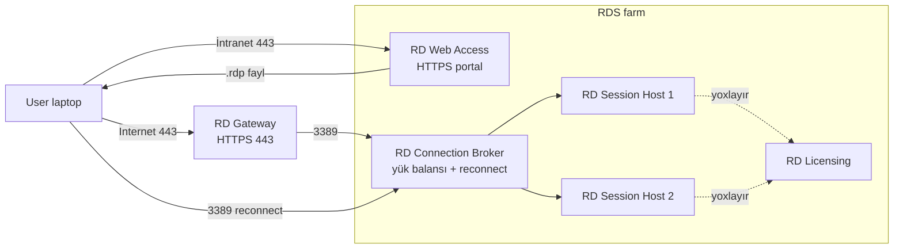

# Remote Desktop Services (RDS)

**RDS** imkan verir ki, çoxlu user eyni anda bir Windows Server-ə qoşulub tam desktop və ya ayrı-ayrı proqramları oradan işlətsin. User-in öz kompüteri yalnız ekranı göstərir — CPU, RAM və disk server-indir. Şirkətlər biznes proqramlarını (1C, SAP, AutoCAD) məhz bu yolla çatdırır, uzaq işçilər daxili alətlərə belə çıxır, bir güclü server isə onlarla zəif iş stansiyasını əvəz edir.

RDS və **RDP** eyni şey deyil. RDP — şəbəkə protokoludur (TCP 3389). Hər Windows Server onsuz da RDP ilə danışır və default 2 admin session-a icazə verir — **bu hələ RDS deyil**. RDS isə RDP-nin üzərində çoxlu user-ə session-host etmək, web portal, yük balansı, lisenziya və HTTPS gateway əlavə edən rol dəstidir. Məhz bu rolları quraşdıranda "çoxlu user eyni anda" mümkün olur.

| | RDP | RDS |
|---|---|---|
| Nədir | Remote Desktop **Protocol** | Remote Desktop **Services** (rol paketi) |
| Portlar | 3389 | 3389 + 443 (Gateway/Web) + 135/LDAP (Broker) |
| Eyni anda user | 2 admin session | CAL sayı qədər |
| Lisenziya | Lazım deyil | RDS CAL (per user və ya per device) |
| Nə üçün | Admin server-ə qoşulur | Çoxlu user eyni server-də işləyir |

## Tipik istifadə halları

| Ssenari | Niyə RDS uyğundur |
|---|---|
| Uzaqdan iş | İşçilər ev/səfərdən mərkəzi desktop-a qoşulur |
| Thin client | Zəif endpoint-lər işi güclü server-ə ötürür |
| Bahalı proqram | 50 desktop əvəzinə 1 server-ə quraşdırılır |
| BYOD | Şəxsi laptop və tabletlər company data-ya toxunmadan qoşulur |
| Kontraktor/stajyer | Müvəqqəti account, təmiz session, endpoint build etmək yox |
| Təhlükəsizlik | Data server-dən çıxmır — yalnız piksel gedir |

## Komponentlər

RDS tək rol deyil. Bir-biri ilə işləyən beş roldur. Quick Start-da üçü eyni server-də olur; production-da onları ayırırıq.



### RD Session Host (RDSH)

User session-larını host edir. Hər login server-də ayrı session açır — öz desktop-u, öz prosesi ilə — amma hamısı eyni CPU və RAM-ı paylaşır. Aktiv user-başına **2–4 GB RAM** plan edin: 32 GB server rahat 8–16 user aparır, CAD/1C kimi ağır proqramlar varsa daha az, təkcə Outlook/Office varsa daha çox.

### RD Web Access (RDWA)

`https://DC01/RDWeb` ünvanında browser portalı. User daxil olur, icazəsi olan desktop və RemoteApp-ları görür, klikləyir, `.rdp` fayl düşür və session açılır.

### RD Connection Broker

Birdən çox Session Host olanda Broker yeni login-i ən az yüklü server-ə yönləndirir. Həm də **session reconnect** edir — user düşüb yenidən login olsa, Broker onu yeni session açmaq əvəzinə köhnə session-ına qaytarır.

### RD Gateway

RDS-i internetə HTTPS/443 üzərindən açır. 3389 portunu heç vaxt birbaşa internetə açmaq lazım deyil — Gateway RDP-ni TLS içində tunellayır, beləliklə kənardan hücum səthi adi bir web server kimi olur.

### RD Licensing

120 gün grace period-dan sonra user-lər qoşula bilməyəcək — Licensing server aktiv olmalı və RDS CAL (Client Access License) olmalıdır. İki rejim: **Per User** və **Per Device**.

## Quraşdırma

Wizard-da iki yol var:

- **Quick Start** — Session Host, Web Access və Connection Broker eyni server-ə qoyulur. Lab və kiçik mühit üçün uyğun.
- **Standard Deployment** — hər rol ayrı server-də. Production üçün.

Bu dərs Quick Start-ı `DC01`-də işlədir. Production-da RDS-i domain controller-də saxlamaq olmaz; bu yalnız lab üçün qəbul olunandır.

### GUI ilə

1. **Server Manager** → **Manage** → **Add Roles and Features**.
2. **Installation Type** → **Remote Desktop Services installation** seç (adi "Role-based" yox!).
3. **Deployment Type** → **Quick Start**.
4. **Deployment Scenario** → **Session-based desktop deployment**.
5. **Server Selection** → `DC01` əlavə et.
6. **Restart the destination server automatically if required** üzərinə işarə qoy, **Deploy** bas.

Restart-dan sonra server-də RD Session Host, RD Web Access və RD Connection Broker var. RD Licensing və RD Gateway ayrıca, opsional əlavələrdir.

### PowerShell ilə

```powershell
# Əsas rollar
Install-WindowsFeature RDS-RD-Server          -IncludeManagementTools
Install-WindowsFeature RDS-Web-Access         -IncludeManagementTools
Install-WindowsFeature RDS-Connection-Broker  -IncludeManagementTools

# Opsional əlavələr
Install-WindowsFeature RDS-Licensing          -IncludeManagementTools
Install-WindowsFeature RDS-Gateway            -IncludeManagementTools
```

## Session Collection

**Collection** — idarə etdiyiniz vahiddir: bir neçə session host, user allow-list, və bütün user-lərə eyni şəkildə tətbiq olunan session qaydaları.

### Collection yarat

**Server Manager** → **Remote Desktop Services** → **Collections** → **Tasks** → **Create Session Collection**.

Wizard addımları:

- **Collection name**: `Example-Desktop`.
- **RD Session Host**: `DC01` əlavə et.
- **User Groups**: default `Domain Users`-u silmək olar ki, yalnız müəyyən qrupa (məs. `GRP-Teachers`, `GRP-IT-Admins`) icazə olsun.
- **User Profile Disks**: opsional. Hər user-in profile-ını file share-də ayrı VHDX-də saxlayır ki, host-lar arasında gəzsin. Lab-da skip et.

PowerShell ilə:

```powershell
New-RDSessionCollection `
    -CollectionName   "Example-Desktop" `
    -SessionHost      "dc01.example.local" `
    -ConnectionBroker "dc01.example.local"
```

### Collection parametrləri

Yaratdıqdan sonra collection-a → **Tasks** → **Edit Properties**. Vacib 4 tab:

**Session**

| Parametr | Nə edir | Normal default |
|---|---|---|
| End a disconnected session | Köhnə session-ın RAM-ını boşaldır | 6–24 saat |
| Active session limit | Session-ın ümumi maksimum uzunluğu | Unlimited və ya 12 saat |
| Idle session limit | İşləmirsə disconnect edir | 30–60 dəqiqə |
| When session limit is reached | Disconnect (state qalır) və ya End (itir) | Disconnect |

**Security**

- **Security Layer** → **SSL (TLS)**.
- **Encryption Level** → **High**.
- **Network Level Authentication (NLA)** → **Enabled**. NLA user-i session açılmazdan **əvvəl** authenticate edir — brute force və DoS cəhdlərinin qabağını alır.

**Client Settings (device redirection)**

Default-da client-in səsi, clipboard-u, diskləri, printer-ləri, smart card-ı və USB cihazları session-a yönləndirilir. Bu rahatdır — amma həm də data exfiltration yoludur. Həssas data varsa **Drives** və **Clipboard** söndür (və ya GPO ilə məcbur et).

**PowerShell versiyası:**

```powershell
Set-RDSessionCollectionConfiguration `
    -CollectionName                 "Example-Desktop" `
    -DisconnectedSessionLimitMin    360 `
    -IdleSessionLimitMin            60 `
    -MaxRedirectedMonitors          2 `
    -ClientDeviceRedirectionOptions AudioVideoPlayBack, Clipboard `
    -ConnectionBroker               "dc01.example.local"
```

## RemoteApp

**RemoteApp** — server-dən publish olunmuş tək bir proqramdır. User-in desktop-unda local pəncərə kimi görünür — server wallpaper yox, taskbar yox, yalnız proqramın özü. Arxada yenə tam RDS session var, amma user yalnız `calc.exe`-nin (və ya Word, ERP client) pəncərəsini görür.

### GUI ilə publish

**Collections** → *Example-Desktop* → **RemoteApp Programs** → **Tasks** → **Publish RemoteApp Programs**. Wizard server-də olan proqramları göstərir (Calculator, Notepad, WordPad, PowerShell, və quraşdırılmış Office və s.). Seç və Publish.

Siyahıda olmayan proqram üçün **Add…** → `.exe` yolunu göstər (məs. `C:\Program Files\MyApp\myapp.exe`).

### PowerShell ilə publish

```powershell
# Publish oluna bilən proqramlar
Get-RDAvailableApp `
    -CollectionName   "Example-Desktop" `
    -ConnectionBroker "dc01.example.local"

New-RDRemoteApp `
    -CollectionName   "Example-Desktop" `
    -DisplayName      "Calculator" `
    -FilePath         "C:\Windows\System32\calc.exe" `
    -ConnectionBroker "dc01.example.local"

New-RDRemoteApp `
    -CollectionName   "Example-Desktop" `
    -DisplayName      "WordPad" `
    -FilePath         "C:\Program Files\Windows NT\Accessories\wordpad.exe" `
    -ConnectionBroker "dc01.example.local"

# Artıq publish olunmuşları göstər
Get-RDRemoteApp `
    -CollectionName   "Example-Desktop" `
    -ConnectionBroker "dc01.example.local"
```

### Web portal

User browser-dən `https://DC01/RDWeb` açır, domain credentials ilə login olur, icazəsi olan bütün desktop və RemoteApp-ları görür. Proqrama klik → `.rdp` fayl endirilir → session açılır. Lab-da self-signed sertifikat browser xəbərdarlığı verir — production-da real sertifikat qoy.

## RD Gateway

Gateway rolu user-lərə internetdən collection-a 3389 portu olmadan çıxmaq imkanı verir. Client HTTPS (443) ilə Gateway-ə danışır; Gateway TLS-i açır və daxildə RDP-ni Session Host-a ötürür.

```
Evdən user ── HTTPS 443 ──▶ RD Gateway ── RDP 3389 ──▶ RDSH (LAN)
```

### Quraşdırma və konfiqurasiya

```powershell
Install-WindowsFeature RDS-Gateway -IncludeManagementTools

# Self-signed sertifikat (production-da real olanı ilə əvəz et)
$cert = New-SelfSignedCertificate `
    -DnsName           "gateway.example.local" `
    -CertStoreLocation "cert:\LocalMachine\My"
```

Sonra **Server Manager** → **Tools** → **Remote Desktop Gateway Manager** aç və:

1. Server → **Properties** → **SSL Certificate** tab: sertifikatı bind et.
2. **Server Farm**: bu gateway-in arxasındakı RDSH server-lərini sadala.
3. **RD CAP** (Connection Authorization Policy) — *kim* qoşula bilər. Adətən domain user qrupu.
4. **RD RAP** (Resource Authorization Policy) — *hansı* server-lərə çata bilər.

PowerShell ilə:

```powershell
New-Item -Path "RDS:\GatewayServer\CAP" `
         -Name "Example-CAP" `
         -UserGroups "EXAMPLE\Domain Users" `
         -AuthMethod 1

New-Item -Path "RDS:\GatewayServer\RAP" `
         -Name "Example-RAP" `
         -UserGroups "EXAMPLE\Domain Users" `
         -ComputerGroupType 2
```

## RD Licensing

Grace period **120 gündür** — ilk Session Host quraşdırılandan sayılır. Sonra connection-lar fail olur, Licensing server aktiv olmayınca və CAL-lar olmayınca heç kəs qoşula bilmir.

### Quraşdırma

```powershell
Install-WindowsFeature RDS-Licensing -IncludeManagementTools
```

Sonra **Tools** → **Remote Desktop Licensing Manager** → server-ə sağ klik → **Activate Server** (Microsoft ilə online aktivasiya).

### Deployment-i Licensing server-ə bağla

**Server Manager** → **Remote Desktop Services** → **Overview** → **Tasks** → **Edit Deployment Properties** → **RD Licensing**. Licensing server-i əlavə et və rejimi seç:

- **Per User** — adlı user üçün, cihazdan asılı olmayaraq. Daha çevik.
- **Per Device** — fiziki cihaz üçün, neçə user girirsə girsin.

Rejimi PowerShell ilə:

```powershell
$obj = Get-WmiObject `
    -Namespace "Root/CIMV2/TerminalServices" `
    -Class     Win32_TerminalServiceSetting
$obj.ChangeMode(4)   # 2 = Per Device, 4 = Per User
```

Lab üçün 120 gün grace period kifayətdir; production-da CAL almaq lazımdır.

## GPO tənzimləmələri

Collection properties collection səviyyəsində işləyir. Bütün fleet üçün düzgün alət Group Policy-dir:

```
Computer Configuration → Policies → Administrative Templates →
    Windows Components → Remote Desktop Services → Remote Desktop Session Host
```

Vacib parametrlər:

**Session Time Limits**

| Parametr | Tövsiyə |
|---|---|
| Set time limit for disconnected sessions | 6 saat |
| Set time limit for active but idle sessions | 30 dəqiqə |
| Set time limit for active sessions | 12 saat |
| End session when time limits are reached | Enabled |

**Device and Resource Redirection**

- **Do not allow Clipboard redirection** — copy-paste session-dan kənara narahatlıq yaradırsa Enable et.
- **Do not allow drive redirection** — user-in C: diski session içində görünməsin deyə.
- **Do not allow printer redirection** — yalnız printing exfil yoludursa.

**Security**

- **Require use of specific security layer** → Enabled → **SSL**.
- **Require user authentication using NLA** → Enabled.
- **Set client connection encryption level** → Enabled → **High**.

**Connections**

- **Restrict Remote Desktop Services users to a single session** → Enabled. Hər user bir session açsın — resurs proqnozlaşdırıla bilər.
- **Limit number of connections** → server-in dizayn olunduğu max user (məs. 50).

## Monitorinq

### Aktiv session-lar

```powershell
Get-RDUserSession `
    -CollectionName   "Example-Desktop" `
    -ConnectionBroker "dc01.example.local" |
    Select-Object UserName, SessionState, CreateTime, ServerName

# klassik əmr, indi də ən sürətlisi
qwinsta /server:DC01
```

Tipik `qwinsta` çıxışı:

```
 SESSIONNAME       USERNAME      ID  STATE   TYPE
 services                         0  Disc
 console                          1  Conn
 rdp-tcp#0         e.mammadov     2  Active
 rdp-tcp#1         k.aliyev       3  Active
 rdp-tcp#2         a.rustamli     4  Disc
```

- **Active** — user indi qoşuludur.
- **Disc** — user disconnect olub amma session hələ canlıdır (reconnect-də state qaytarılır).

### User-i disconnect et və ya log off et

```powershell
# Disconnect — session açıq qalır
Disconnect-RDUser   -HostServer "dc01.example.local" -UnifiedSessionID 3 -Force

# Log off — session bağlanır
Invoke-RDUserLogoff -HostServer "dc01.example.local" -UnifiedSessionID 3 -Force

# Klassik
logoff 3 /server:DC01
```

### Session-lara mesaj göndər

"Server 10 dəqiqəyə restart olacaq" xəbərdarlıqları üçün faydalıdır:

```powershell
# Tək user-ə
msg e.mammadov /server:DC01 "Server 10 deqiqeye restart olacaq. Isi yadda saxlayin."

# Bütün user-lərə
msg * /server:DC01 "Server texniki xidmet ucun 10 deqiqeye sonduruleceek."
```

## Troubleshooting

### "An internal error has occurred"

Ardıcıllıqla yoxla:

```powershell
Get-Service TermService, SessionEnv, UmRdpService
```

Üçü də Running olmalıdır. Sonra adi səbəblər:

- **NLA uyğunsuzluğu** — client köhnədir, NLA dəstəkləmir.
- **Sertifikat** — self-signed cert expire olub və ya trust-da yoxdur.
- **Licensing grace period bitib** — 121-ci gündə hər şey dayanır:
  ```powershell
  (Invoke-WmiMethod -Path Win32_TerminalServiceSetting -Name GetGracePeriodDays).DaysLeft
  ```

### "The number of connections to this computer is limited"

Server-də yalnız default 2 admin session var — RDS rolları quraşdırılmayıb, və ya Collection-ın connection limit-i user sayından aşağıdır. Rolları quraşdır/düzəlt və ya disconnected session-ları bağla.

### Yavaş session-lar

Əsl yüklü olanı tap:

```powershell
Get-Process  | Sort-Object CPU -Descending | Select-Object -First 10
Get-Counter  '\Memory\Available MBytes'
Get-Counter  '\Processor(_Total)\% Processor Time'
qprocess     /server:DC01
```

Session Host adətən CPU-dan çox **RAM**-dan ölür; `Available MBytes` 500-dən aşağı — qırmızı bayraq.

### Printer redirection işləmir

Ardıcıllıqla yoxla: GPO printer redirection-u bloklamır, collection-da açıqdır, və printer driver-i server-də quraşdırılıb — client-in driver-i forward olunmur.

### Event log-lar

```
Event Viewer → Applications and Services Logs → Microsoft → Windows →
├── TerminalServices-LocalSessionManager/Operational     (session açılma/bağlanma)
├── TerminalServices-RemoteConnectionManager/Operational (qoşulma cəhdləri)
└── TerminalServices-Gateway/Operational                 (RD Gateway)
```

```powershell
Get-WinEvent `
    -LogName   "Microsoft-Windows-TerminalServices-LocalSessionManager/Operational" `
    -MaxEvents 20 |
    Select-Object TimeCreated, Id, Message
```

## PowerShell cheat sheet

```powershell
# --- Quraşdırma ---
Install-WindowsFeature RDS-RD-Server          -IncludeManagementTools
Install-WindowsFeature RDS-Web-Access         -IncludeManagementTools
Install-WindowsFeature RDS-Connection-Broker  -IncludeManagementTools
Install-WindowsFeature RDS-Licensing          -IncludeManagementTools
Install-WindowsFeature RDS-Gateway            -IncludeManagementTools

# --- Collection-lar ---
New-RDSessionCollection -CollectionName "Ad" -SessionHost "dc01.example.local" -ConnectionBroker "dc01.example.local"
Get-RDSessionCollection -ConnectionBroker "dc01.example.local"

# --- RemoteApp ---
Get-RDAvailableApp -CollectionName "Ad" -ConnectionBroker "dc01.example.local"
New-RDRemoteApp    -CollectionName "Ad" -DisplayName "App" -FilePath "C:\...\app.exe" -ConnectionBroker "dc01.example.local"
Get-RDRemoteApp    -CollectionName "Ad" -ConnectionBroker "dc01.example.local"
Remove-RDRemoteApp -CollectionName "Ad" -Alias "app" -ConnectionBroker "dc01.example.local"

# --- Session-lar ---
Get-RDUserSession    -CollectionName "Ad" -ConnectionBroker "dc01.example.local"
Disconnect-RDUser    -HostServer "dc01.example.local" -UnifiedSessionID 3 -Force
Invoke-RDUserLogoff  -HostServer "dc01.example.local" -UnifiedSessionID 3 -Force
qwinsta /server:DC01
msg * /server:DC01 "Mesaj"

# --- Monitorinq ---
Get-Counter '\Terminal Services Session(*)\% Processor Time'
Get-Counter '\Terminal Services\Active Sessions'
Get-Counter '\Terminal Services\Inactive Sessions'

# --- Troubleshooting ---
Get-Service          TermService, SessionEnv, UmRdpService
Test-NetConnection   DC01 -Port 3389
qprocess             /server:DC01
```

## Praktiki nəticələr

- RDP — protokol, RDS — rol paketidir; bu terminləri qarışdırmayın.
- Lab üçün Quick Start kifayətdir; production-da rollar ayrılır və RDS DC üzərində qalmır.
- Collection idarəetmə vahididir — user, host və session qaydaları orada yaşayır.
- NLA-nı aç və TLS-i məcbur et; `Negotiate` downgrade gözləyən bomba-dır.
- Clipboard və drive redirection həm rahat, həm də ən asan exfil yolu — mühitə görə qərar ver.
- RemoteApp local pəncərə kimi görünür; user adətən onun remote olduğunu bilmir.
- 3389-u heç vaxt birbaşa internetə açma — qabağına RD Gateway qoy.
- 120 günlük grace period sərt countdown-dur; bitdikdən sonra heç kəs login ola bilmir.
- "RDS yavaşdır" şikayətlərinin çoxu Session Host-un RAM tükənməsidir, şəbəkə yox.
