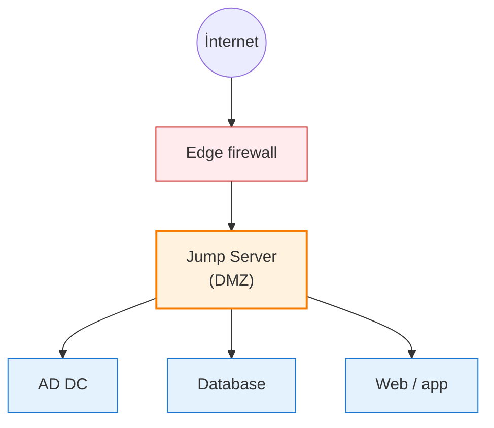

# Jump Server (Bastion Host)

**Jump Server** (və ya bastion host) — administratorların daxili şəbəkədəki digər sistemlərə çatmaq üçün ilk qoşulduqları hardened, dar təyinatlı serverdir. Hər daxili serveri birbaşa əlçatan etmək əvəzinə, bütün administrativ trafik bu tək, nəzarətli giriş nöqtəsi üzərindən yönləndirilir.

```
İstifadəçi (internet) → Jump Server (DMZ) → Daxili serverlər (AD, DB, web…)
```

## Jump Server niyə lazımdır?

Domain controller-ləri, database-ləri və daxili tətbiq serverlərini birbaşa — hətta VPN üzərindən — açıq saxlamaq hücumçulara geniş səth verir. Jump server bu səthi azaldır və nəzarəti mərkəzləşdirir:

- Daxili şəbəkə internetdən birbaşa əlçatan deyil
- Bütün admin sessiyaları tək, monitorlanan choke point-dən keçir
- Hər əlaqə loglana bilər: kim qoşuldu, nə vaxt, hansı serverə
- Yalnız avtorizasiya edilmiş identity-lər serverə çatır

## Enterprise ssenarisi

Böyük mühitdə tipik axın:

1. Sistem administratoru ofis xaricindən işləmək istəyir
2. Domain controller-ə (və ya prod DB, hypervisor və s.) birbaşa çıxışa icazə verilmir
3. Admin əvvəlcə VPN/RDP/SSH ilə MFA istifadə edərək jump server-ə qoşulur
4. Jump server-dən imtiyazlı identity-si ilə daxili hədəfə çatır

## Şəbəkədəki yeri



Jump server adətən DMZ-də (və ya xüsusi management şəbəkəsində) yerləşir, həm ona çatan trafiki, həm də onun daxilə başlada biləcəyi trafiki idarə edən sıx firewall qaydaları ilə.

## Əsas xüsusiyyətlər

- Minimal proqram həcmi — yalnız administratorlara lazım olanlar
- Güclü autentifikasiya (MFA, smart card və ya sertifikat)
- Sessiya yazılması / mərkəzləşdirilmiş logging
- RDP (Windows) və ya SSH (Linux) vasitəsilə əlçatandır
- Jump server-in özündən ümumi internet-ə baxış yoxdur

## Jump Server istifadəsi

### SSH (Linux / Unix)

Daxili hosta jump server vasitəsilə çatmağın ən təmiz yolu `ssh -J` (ProxyJump):

```bash
ssh -J user@jump-host user@internal-server
```

Bu jump host-a tək autentifikasiyalı SSH əlaqəsi yaradır və onun üzərindən daxili hosta ikinci SSH sessiyasını tunnelləyir. İki dəfə manual login etmək lazım deyil.

`~/.ssh/config` faylında:

```
Host internal
  HostName 10.0.0.5
  User emil
  ProxyJump jumpuser@jump.example.com
```

Sonra `ssh internal` jump-ı avtomatik idarə edir.

### RDP (Windows)

1. MFA istifadə edərək Remote Desktop ilə jump server-ə qoşulun
2. Jump server sessiyasından daxili hədəfə başqa Remote Desktop əlaqəsi başladın
3. Hər iki sessiya mərkəzi olaraq yazıla bilər (Windows Event Forwarding, privileged access management alətləri)

## Windows jump server check-list-i

Xüsusi Windows Server VM kimi qurduqda:

- DMZ və ya management VLAN-da statik IP ilə yerləşdir
- Inbound firewall qaydalarını RDP (TCP/3389) ilə məhdudlaşdır, yalnız tanınan admin şəbəkələrindən
- RDP üçün **Network Level Authentication (NLA)** aktiv et
- Admin sign-in üçün MFA tələb et (conditional access və ya PAM həlli ilə)
- Yalnız administratorlara həqiqətən lazım olan alətləri quraşdır — ümumi təyinatlı proqram yox
- Bütün RDP və təhlükəsizlik hadisələrini mərkəzi log collector / SIEM-ə ötür
- Aqressiv patch et — onu tier-0 aktiv kimi qəbul et

## Təhlükəsizlik tövsiyələri

- **MFA** — həmişə tələb olunur; yalnız şifrə ilə giriş yox
- **Ən az imtiyaz prinsipi** — istifadəçilər yalnız hədəflərinə çatmaq üçün lazım olan hüquqları alır
- **Sessiya logları** — mərkəzi olaraq topla və saxla; kompromis olunmuş hostdakı yerli log faydasızdır
- **İnternet egress yoxdur** — jump server web-ə baxa və ya xarici repo-lara çata bilməməlidir
- **Davamlı monitoring** — qeyri-adi giriş vaxtları, uğursuz cəhdlər və ya yeni outbound hədəflər haqqında xəbərdarlıq
- **Patch cadence** — təhlükəsizlik update-lərini sıx cədvəllə tətbiq et

## Cloud ekvivalentləri

Cloud provayderləri VM saxlamadan jump-server modelini həyata keçirən managed bastion xidmətləri təklif edir:

- Azure Bastion
- AWS Systems Manager Session Manager
- GCP Identity-Aware Proxy (IAP) TCP forwarding

Bunlar modeli daha da sıxlaşdırır — bastionda çox vaxt public IP olmur, qısa ömürlü credential-lar və standart olaraq sessiya logging-i var.

## Praktik nəticələr

- Admin-lərlə hər tier-0 sistem (DC, hypervisor, database) arasına jump server qoyun
- Onu MFA və ən az imtiyazla birləşdirin — MFA-sız jump server sadəcə daha böyük hədəfdir
- Jump server-ə heç vaxt internet-ə baxmağa və ya ümumi təyinatlı proqram işlətməyə icazə verməyin
- Jump server-in özünü yüksək dəyərli aktiv kimi qəbul edin: patch, monitor və seqmentləşdirmə müvafiq olsun

## Faydalı linklər

- Azure Bastion: [https://learn.microsoft.com/en-us/azure/bastion/bastion-overview](https://learn.microsoft.com/en-us/azure/bastion/bastion-overview)
- Privileged Access Workstations (PAW): [https://learn.microsoft.com/en-us/security/privileged-access-workstations/privileged-access-deployment](https://learn.microsoft.com/en-us/security/privileged-access-workstations/privileged-access-deployment)
- OpenSSH ProxyJump: [https://man.openbsd.org/ssh_config#ProxyJump](https://man.openbsd.org/ssh_config#ProxyJump)
